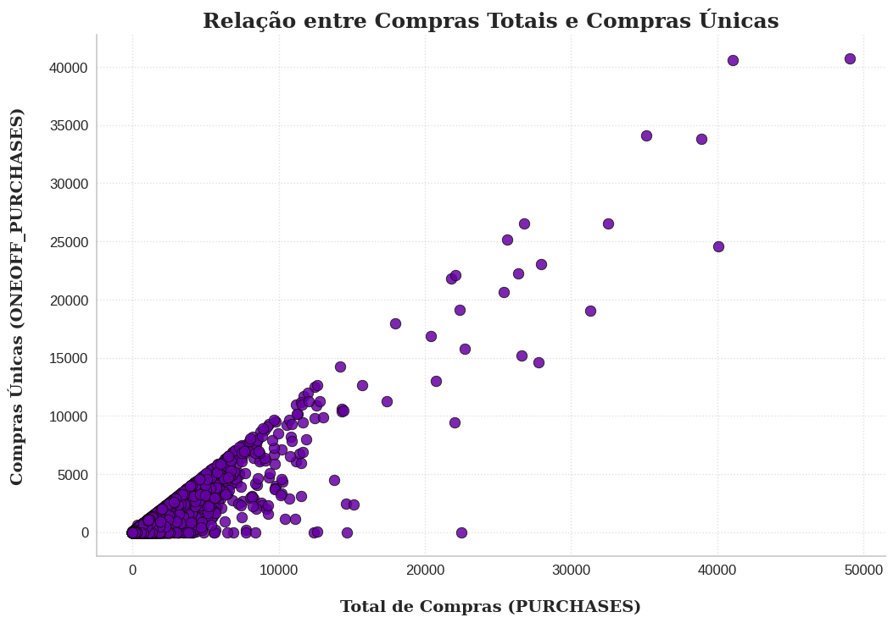

# Credit Card Dataset for Clustering

- Dados: https://www.kaggle.com/arjunbhasin2013/ccdata


## Importação das bibliotecas e base de dados


```
!pip install pywaffle
!pip install ydata-profiling
```

    Collecting pywaffle
      Downloading pywaffle-1.1.1-py2.py3-none-any.whl.metadata (2.6 kB)
    Collecting fontawesomefree (from pywaffle)
      Downloading fontawesomefree-6.6.0-py3-none-any.whl.metadata (853 bytes)
    Requirement already satisfied: matplotlib in /usr/local/lib/python3.10/dist-packages (from pywaffle) (3.8.0)
    Requirement already satisfied: contourpy>=1.0.1 in /usr/local/lib/python3.10/dist-packages (from matplotlib->pywaffle) (1.3.1)
    Requirement already satisfied: cycler>=0.10 in /usr/local/lib/python3.10/dist-packages (from matplotlib->pywaffle) (0.12.1)
    Requirement already satisfied: fonttools>=4.22.0 in /usr/local/lib/python3.10/dist-packages (from matplotlib->pywaffle) (4.55.0)
    Requirement already satisfied: kiwisolver>=1.0.1 in /usr/local/lib/python3.10/dist-packages (from matplotlib->pywaffle) (1.4.7)
    Requirement already satisfied: numpy<2,>=1.21 in /usr/local/lib/python3.10/dist-packages (from matplotlib->pywaffle) (1.26.4)
    Requirement already satisfied: packaging>=20.0 in /usr/local/lib/python3.10/dist-packages (from matplotlib->pywaffle) (24.2)
    Requirement already satisfied: pillow>=6.2.0 in /usr/local/lib/python3.10/dist-packages (from matplotlib->pywaffle) (11.0.0)
    Requirement already satisfied: pyparsing>=2.3.1 in /usr/local/lib/python3.10/dist-packages (from matplotlib->pywaffle) (3.2.0)
    Requirement already satisfied: python-dateutil>=2.7 in /usr/local/lib/python3.10/dist-packages (from matplotlib->pywaffle) (2.8.2)
    Requirement already satisfied: six>=1.5 in /usr/local/lib/python3.10/dist-packages (from python-dateutil>=2.7->matplotlib->pywaffle) (1.16.0)
    Downloading pywaffle-1.1.1-py2.py3-none-any.whl (30 kB)
    Downloading fontawesomefree-6.6.0-py3-none-any.whl (25.6 MB)
       ━━━━━━━━━━━━━━━━━━━━━━━━━━━━━━━━━━━━━━━━ 25.6/25.6 MB 21.1 MB/s eta 0:00:00
    [?25hInstalling collected packages: fontawesomefree, pywaffle
    Successfully installed fontawesomefree-6.6.0 pywaffle-1.1.1
    Collecting ydata-profiling
      Downloading ydata_profiling-4.12.0-py2.py3-none-any.whl.metadata (20 kB)
    Requirement already satisfied: scipy<1.14,>=1.4.1 in /usr/local/lib/python3.10/dist-packages (from ydata-profiling) (1.13.1)
    Requirement already satisfied: pandas!=1.4.0,<3,>1.1 in /usr/local/lib/python3.10/dist-packages (from ydata-profiling) (2.2.2)
    Requirement already satisfied: matplotlib<3.10,>=3.5 in /usr/local/lib/python3.10/dist-packages (from ydata-profiling) (3.8.0)
    Requirement already satisfied: pydantic>=2 in /usr/local/lib/python3.10/dist-packages (from ydata-profiling) (2.9.2)
    Requirement already satisfied: PyYAML<6.1,>=5.0.0 in /usr/local/lib/python3.10/dist-packages (from ydata-profiling) (6.0.2)
    Requirement already satisfied: jinja2<3.2,>=2.11.1 in /usr/local/lib/python3.10/dist-packages (from ydata-profiling) (3.1.4)
    Collecting visions<0.7.7,>=0.7.5 (from visions[type_image_path]<0.7.7,>=0.7.5->ydata-profiling)
      Downloading visions-0.7.6-py3-none-any.whl.metadata (11 kB)
    Requirement already satisfied: numpy<2.2,>=1.16.0 in /usr/local/lib/python3.10/dist-packages (from ydata-profiling) (1.26.4)
    Collecting htmlmin==0.1.12 (from ydata-profiling)
      Downloading htmlmin-0.1.12.tar.gz (19 kB)
      Preparing metadata (setup.py) ... [?25l[?25hdone
    Collecting phik<0.13,>=0.11.1 (from ydata-profiling)
      Downloading phik-0.12.4-cp310-cp310-manylinux_2_17_x86_64.manylinux2014_x86_64.whl.metadata (5.6 kB)
    Requirement already satisfied: requests<3,>=2.24.0 in /usr/local/lib/python3.10/dist-packages (from ydata-profiling) (2.32.3)
    Requirement already satisfied: tqdm<5,>=4.48.2 in /usr/local/lib/python3.10/dist-packages (from ydata-profiling) (4.66.6)
    Requirement already satisfied: seaborn<0.14,>=0.10.1 in /usr/local/lib/python3.10/dist-packages (from ydata-profiling) (0.13.2)
    Collecting multimethod<2,>=1.4 (from ydata-profiling)
      Downloading multimethod-1.12-py3-none-any.whl.metadata (9.6 kB)
    Requirement already satisfied: statsmodels<1,>=0.13.2 in /usr/local/lib/python3.10/dist-packages (from ydata-profiling) (0.14.4)
    Requirement already satisfied: typeguard<5,>=3 in /usr/local/lib/python3.10/dist-packages (from ydata-profiling) (4.4.1)
    Collecting imagehash==4.3.1 (from ydata-profiling)
      Downloading ImageHash-4.3.1-py2.py3-none-any.whl.metadata (8.0 kB)
    Requirement already satisfied: wordcloud>=1.9.3 in /usr/local/lib/python3.10/dist-packages (from ydata-profiling) (1.9.4)
    Collecting dacite>=1.8 (from ydata-profiling)
      Downloading dacite-1.8.1-py3-none-any.whl.metadata (15 kB)
    Requirement already satisfied: numba<1,>=0.56.0 in /usr/local/lib/python3.10/dist-packages (from ydata-profiling) (0.60.0)
    Collecting PyWavelets (from imagehash==4.3.1->ydata-profiling)
      Downloading pywavelets-1.7.0-cp310-cp310-manylinux_2_17_x86_64.manylinux2014_x86_64.whl.metadata (9.0 kB)
    Requirement already satisfied: pillow in /usr/local/lib/python3.10/dist-packages (from imagehash==4.3.1->ydata-profiling) (11.0.0)
    Requirement already satisfied: MarkupSafe>=2.0 in /usr/local/lib/python3.10/dist-packages (from jinja2<3.2,>=2.11.1->ydata-profiling) (3.0.2)
    Requirement already satisfied: contourpy>=1.0.1 in /usr/local/lib/python3.10/dist-packages (from matplotlib<3.10,>=3.5->ydata-profiling) (1.3.1)
    Requirement already satisfied: cycler>=0.10 in /usr/local/lib/python3.10/dist-packages (from matplotlib<3.10,>=3.5->ydata-profiling) (0.12.1)
    Requirement already satisfied: fonttools>=4.22.0 in /usr/local/lib/python3.10/dist-packages (from matplotlib<3.10,>=3.5->ydata-profiling) (4.55.0)
    Requirement already satisfied: kiwisolver>=1.0.1 in /usr/local/lib/python3.10/dist-packages (from matplotlib<3.10,>=3.5->ydata-profiling) (1.4.7)
    Requirement already satisfied: packaging>=20.0 in /usr/local/lib/python3.10/dist-packages (from matplotlib<3.10,>=3.5->ydata-profiling) (24.2)
    Requirement already satisfied: pyparsing>=2.3.1 in /usr/local/lib/python3.10/dist-packages (from matplotlib<3.10,>=3.5->ydata-profiling) (3.2.0)
    Requirement already satisfied: python-dateutil>=2.7 in /usr/local/lib/python3.10/dist-packages (from matplotlib<3.10,>=3.5->ydata-profiling) (2.8.2)
    Requirement already satisfied: llvmlite<0.44,>=0.43.0dev0 in /usr/local/lib/python3.10/dist-packages (from numba<1,>=0.56.0->ydata-profiling) (0.43.0)
    Requirement already satisfied: pytz>=2020.1 in /usr/local/lib/python3.10/dist-packages (from pandas!=1.4.0,<3,>1.1->ydata-profiling) (2024.2)
    Requirement already satisfied: tzdata>=2022.7 in /usr/local/lib/python3.10/dist-packages (from pandas!=1.4.0,<3,>1.1->ydata-profiling) (2024.2)
    Requirement already satisfied: joblib>=0.14.1 in /usr/local/lib/python3.10/dist-packages (from phik<0.13,>=0.11.1->ydata-profiling) (1.4.2)
    Requirement already satisfied: annotated-types>=0.6.0 in /usr/local/lib/python3.10/dist-packages (from pydantic>=2->ydata-profiling) (0.7.0)
    Requirement already satisfied: pydantic-core==2.23.4 in /usr/local/lib/python3.10/dist-packages (from pydantic>=2->ydata-profiling) (2.23.4)
    Requirement already satisfied: typing-extensions>=4.6.1 in /usr/local/lib/python3.10/dist-packages (from pydantic>=2->ydata-profiling) (4.12.2)
    Requirement already satisfied: charset-normalizer<4,>=2 in /usr/local/lib/python3.10/dist-packages (from requests<3,>=2.24.0->ydata-profiling) (3.4.0)
    Requirement already satisfied: idna<4,>=2.5 in /usr/local/lib/python3.10/dist-packages (from requests<3,>=2.24.0->ydata-profiling) (3.10)
    Requirement already satisfied: urllib3<3,>=1.21.1 in /usr/local/lib/python3.10/dist-packages (from requests<3,>=2.24.0->ydata-profiling) (2.2.3)
    Requirement already satisfied: certifi>=2017.4.17 in /usr/local/lib/python3.10/dist-packages (from requests<3,>=2.24.0->ydata-profiling) (2024.8.30)
    Requirement already satisfied: patsy>=0.5.6 in /usr/local/lib/python3.10/dist-packages (from statsmodels<1,>=0.13.2->ydata-profiling) (1.0.1)
    Requirement already satisfied: attrs>=19.3.0 in /usr/local/lib/python3.10/dist-packages (from visions<0.7.7,>=0.7.5->visions[type_image_path]<0.7.7,>=0.7.5->ydata-profiling) (24.2.0)
    Requirement already satisfied: networkx>=2.4 in /usr/local/lib/python3.10/dist-packages (from visions<0.7.7,>=0.7.5->visions[type_image_path]<0.7.7,>=0.7.5->ydata-profiling) (3.4.2)
    Requirement already satisfied: six>=1.5 in /usr/local/lib/python3.10/dist-packages (from python-dateutil>=2.7->matplotlib<3.10,>=3.5->ydata-profiling) (1.16.0)
    Downloading ydata_profiling-4.12.0-py2.py3-none-any.whl (390 kB)
       ━━━━━━━━━━━━━━━━━━━━━━━━━━━━━━━━━━━━━━━━ 390.6/390.6 kB 7.7 MB/s eta 0:00:00
    [?25hDownloading ImageHash-4.3.1-py2.py3-none-any.whl (296 kB)
       ━━━━━━━━━━━━━━━━━━━━━━━━━━━━━━━━━━━━━━━━ 296.5/296.5 kB 16.4 MB/s eta 0:00:00
    [?25hDownloading dacite-1.8.1-py3-none-any.whl (14 kB)
    Downloading multimethod-1.12-py3-none-any.whl (10 kB)
    Downloading phik-0.12.4-cp310-cp310-manylinux_2_17_x86_64.manylinux2014_x86_64.whl (686 kB)
       ━━━━━━━━━━━━━━━━━━━━━━━━━━━━━━━━━━━━━━━━ 686.1/686.1 kB 22.5 MB/s eta 0:00:00
    [?25hDownloading visions-0.7.6-py3-none-any.whl (104 kB)
       ━━━━━━━━━━━━━━━━━━━━━━━━━━━━━━━━━━━━━━━━ 104.8/104.8 kB 6.3 MB/s eta 0:00:00
    [?25hDownloading pywavelets-1.7.0-cp310-cp310-manylinux_2_17_x86_64.manylinux2014_x86_64.whl (4.5 MB)
       ━━━━━━━━━━━━━━━━━━━━━━━━━━━━━━━━━━━━━━━━ 4.5/4.5 MB 22.1 MB/s eta 0:00:00
    [?25hBuilding wheels for collected packages: htmlmin
      Building wheel for htmlmin (setup.py) ... [?25l[?25hdone
      Created wheel for htmlmin: filename=htmlmin-0.1.12-py3-none-any.whl size=27081 sha256=b2c4d010b629974f64a7c1ce374a873e9cc1db93b588e0401083393ee0735662
      Stored in directory: /root/.cache/pip/wheels/dd/91/29/a79cecb328d01739e64017b6fb9a1ab9d8cb1853098ec5966d
    Successfully built htmlmin
    Installing collected packages: htmlmin, PyWavelets, multimethod, dacite, imagehash, visions, phik, ydata-profiling
    Successfully installed PyWavelets-1.7.0 dacite-1.8.1 htmlmin-0.1.12 imagehash-4.3.1 multimethod-1.12 phik-0.12.4 visions-0.7.6 ydata-profiling-4.12.0
    


```
import kagglehub
path = kagglehub.dataset_download("arjunbhasin2013/ccdata")

print("Path:", path)
```

    Downloading from https://www.kaggle.com/api/v1/datasets/download/arjunbhasin2013/ccdata?dataset_version_number=1...
    

    100%|██████████| 340k/340k [00:00<00:00, 64.2MB/s]

    Extracting files...
    Path: /root/.cache/kagglehub/datasets/arjunbhasin2013/ccdata/versions/1
    

    
    


```
import os
os.listdir(path)
```


    ['CC GENERAL.csv']


```
import pandas as pd
import numpy as np
import seaborn as sns
import matplotlib.pyplot as plt
from sklearn.preprocessing import StandardScaler
from sklearn.cluster import KMeans
from sklearn.decomposition import PCA

from sklearn.cluster import KMeans, DBSCAN, AgglomerativeClustering
from sklearn.metrics import davies_bouldin_score, silhouette_score, calinski_harabasz_score
from yellowbrick.cluster import KElbowVisualizer, SilhouetteVisualizer
from yellowbrick.style import set_palette
from pywaffle import Waffle
from yellowbrick.contrib.wrapper import wrap

from matplotlib.patches import Rectangle
from ydata_profiling import ProfileReport
```


```
creditcard_df = pd.read_csv(path+'/CC GENERAL.csv')
```


```
creditcard_df.shape
```


    (8950, 18)


# Segmentação de Clientes

Este caso requer o desenvolvimento de uma segmentação de clientes para definir uma estratégia de marketing.  
O conjunto de dados resume o comportamento de uso de 8.950 titulares ativos de cartões de crédito nos últimos 6 meses.  
O arquivo contém informações do cliente com 18 variáveis comportamentais.  

## Dicionário de Dados do Conjunto de Dados de Cartões de Crédito:

- **CUST_ID**: Identificação do titular do cartão de crédito (Categórico).  
- **BALANCE**: Valor do saldo restante na conta para realizar compras.  
- **BALANCE_FREQUENCY**: Frequência com que o saldo é atualizado, pontuação entre 0 e 1 (1 = frequentemente atualizado, 0 = raramente atualizado).  
- **PURCHASES**: Valor das compras realizadas na conta.  
- **ONEOFF_PURCHASES**: Maior valor de compra realizado de uma vez.  
- **INSTALLMENTS_PURCHASES**: Valor das compras realizadas em parcelas.  
- **CASH_ADVANCE**: Valor de adiantamento em dinheiro fornecido ao usuário.  
- **PURCHASES_FREQUENCY**: Frequência com que as compras são realizadas, pontuação entre 0 e 1 (1 = frequentemente realizadas, 0 = raramente realizadas).  
- **ONEOFFPURCHASESFREQUENCY**: Frequência com que as compras de uma vez só são realizadas (1 = frequentemente realizadas, 0 = raramente realizadas).  
- **PURCHASESINSTALLMENTSFREQUENCY**: Frequência com que as compras parceladas são realizadas (1 = frequentemente realizadas, 0 = raramente realizadas).  
- **CASHADVANCEFREQUENCY**: Frequência com que os adiantamentos em dinheiro são realizados.  
- **CASHADVANCETRX**: Número de transações realizadas com adiantamento em dinheiro.  
- **PURCHASES_TRX**: Número de transações de compras realizadas.  
- **CREDIT_LIMIT**: Limite de crédito do cartão para o usuário.  
- **PAYMENTS**: Valor dos pagamentos realizados pelo usuário.  
- **MINIMUM_PAYMENTS**: Valor mínimo de pagamento realizado pelo usuário.  
- **PRCFULLPAYMENT**: Percentual de pagamento total realizado pelo usuário.  
- **TENURE**: Tempo de serviço do cartão de crédito para o usuário.  


```
# from pandas_profiling import ProfileReport

profile = ProfileReport(
    creditcard_df.drop(columns=['CUST_ID']),
    title="Relatório dos Dados",
    minimal=True,
    progress_bar=False,
    samples=None,
    correlations=None,
    interactions=None,
    explorative=True,
    notebook={"iframe": {"height": "600px"}},
    missing_diagrams={"heatmap": False, "dendrogram": False},
)

profile.to_notebook_iframe()
```


<iframe width="100%" height="600px" srcdoc="&lt;!doctype html&gt;&lt;html lang=en&gt;&lt;head&gt;&lt;meta charset=utf-8&gt;&lt;meta name=viewport content=&quot;width=device-width, initial-scale=1, shrink-to-fit=no&quot;&gt;&lt;meta name=description content=&quot;Profile report generated by YData! Visit us at https://ydata.ai&quot;&gt;&lt;meta name=author content=&quot;YData and the open source community.&quot;&gt;&lt;meta name=generator content=&quot;YData Profiling vv4.12.0&quot;&gt;&lt;meta name=url content=https://github.com/ydataai/ydata-profiling&gt;&lt;meta name=date content=&quot;2024-11-23 14:20:31.964699&quot;&gt;&lt;title&gt;Relatório dos Dados&lt;/title&gt;&lt;style&gt;
@charset &quot;UTF-8&quot;;/*!
 * Bootstrap  v5.3.3 (https://getbootstrap.com/)
 * Copyright 2011-2024 The Bootstrap Authors
 * Licensed under MIT (https://github.com/twbs/bootstrap/blob/main/LICENSE)
 */:root,[data-bs-theme=light]{--bs-blue:#0d6efd;--bs-indigo:#6610f2;--bs-purple:#6f42c1;--bs-pink:#d63384;--bs-red:#dc3545;--bs-orange:#fd7e14;--bs-yellow:#ffc107;--bs-green:#198754;--bs-teal:#20c997;--bs-cyan:#0dcaf0;--bs-black:#000;--bs-white:#fff;--bs-gray:#6c757d;--bs-gray-dark:#343a40;--bs-gray-100:#f8f9fa;--bs-gray-200:#e9ecef;--bs-gray-300:#dee2e6;--bs-gray-400:#ced4da;--bs-gray-500:#adb5bd;--bs-gray-600:#6c757d;--bs-gray-700:#495057;--bs-gray-800:#343a40;--bs-gray-900:#212529;--bs-primary:#0d6efd;--bs-secondary:#6c757d;--bs-success:#198754;--bs-info:#0dcaf0;--bs-warning:#ffc107;--bs-danger:#dc3545;--bs-light:#f8f9fa;--bs-dark:#212529;--bs-primary-rgb:13,110,253;--bs-secondary-rgb:108,117,125;--bs-success-rgb:25,135,84;--bs-info-rgb:13,202,240;--bs-warning-rgb:255,193,7;--bs-danger-rgb:220,53,69;--bs-light-rgb:248,249,250;--bs-dark-rgb:33,37,41;--bs-primary-text-emphasis:#052c65;--bs-secondary-text-emphasis:#2b2f32;--bs-success-text-emphasis:#0a3622;--bs-info-text-emphasis:#055160;--bs-warning-text-emphasis:#664d03;--bs-danger-text-emphasis:#58151c;--bs-light-text-emphasis:#495057;--bs-dark-text-emphasis:#495057;--bs-primary-bg-subtle:#cfe2ff;--bs-secondary-bg-subtle:#e2e3e5;--bs-success-bg-subtle:#d1e7dd;--bs-info-bg-subtle:#cff4fc;--bs-warning-bg-subtle:#fff3cd;--bs-danger-bg-subtle:#f8d7da;--bs-light-bg-subtle:#fcfcfd;--bs-dark-bg-subtle:#ced4da;--bs-primary-border-subtle:#9ec5fe;--bs-secondary-border-subtle:#c4c8cb;--bs-success-border-subtle:#a3cfbb;--bs-info-border-subtle:#9eeaf9;--bs-warning-border-subtle:#ffe69c;--bs-danger-border-subtle:#f1aeb5;--bs-light-border-subtle:#e9ecef;--bs-dark-border-subtle:#adb5bd;--bs-white-rgb:255,255,255;--bs-black-rgb:0,0,0;--bs-font-sans-serif:system-ui,-apple-system,&quot;Segoe UI&quot;,Roboto,&quot;Helvetica Neue&quot;,&quot;Noto Sans&quot;,&quot;Liberation Sans&quot;,Arial,sans-serif,&quot;Apple Color Emoji&quot;,&quot;Segoe UI Emoji&quot;,&quot;Segoe UI Symbol&quot;,&quot;Noto Color Emoji&quot;;--bs-font-monospace:SFMono-Regular,Menlo,Monaco,Consolas,&quot;Liberation Mono&quot;,&quot;Courier New&quot;,monospace;--bs-gradient:linear-gradient(180deg, rgba(255, 255, 255, 0.15), rgba(255, 255, 255, 0));--bs-body-font-family:var(--bs-font-sans-serif);--bs-body-font-size:1rem;--bs-body-font-weight:400;--bs-body-line-height:1.5;--bs-body-color:#212529;--bs-body-color-rgb:33,37,41;--bs-body-bg:#fff;--bs-body-bg-rgb:255,255,255;--bs-emphasis-color:#000;--bs-emphasis-color-rgb:0,0,0;--bs-secondary-color:rgba(33, 37, 41, 0.75);--bs-secondary-color-rgb:33,37,41;--bs-secondary-bg:#e9ecef;--bs-secondary-bg-rgb:233,236,239;--bs-tertiary-color:rgba(33, 37, 41, 0.5);--bs-tertiary-color-rgb:33,37,41;--bs-tertiary-bg:#f8f9fa;--bs-tertiary-bg-rgb:248,249,250;--bs-heading-color:inherit;--bs-link-color:#0d6efd;--bs-link-color-rgb:13,110,253;--bs-link-decoration:underline;--bs-link-hover-color:#0a58ca;--bs-link-hover-color-rgb:10,88,202;--bs-code-color:#d63384;--bs-highlight-color:#212529;--bs-highlight-bg:#fff3cd;--bs-border-width:1px;--bs-border-style:solid;--bs-border-color:#dee2e6;--bs-border-color-translucent:rgba(0, 0, 0, 0.175);--bs-border-radius:0.375rem;--bs-border-radius-sm:0.25rem;--bs-border-radius-lg:0.5rem;--bs-border-radius-xl:1rem;--bs-border-radius-xxl:2rem;--bs-border-radius-2xl:var(--bs-border-radius-xxl);--bs-border-radius-pill:50rem;--bs-box-shadow:0 0.5rem 1rem rgba(0, 0, 0, 0.15);--bs-box-shadow-sm:0 0.125rem 0.25rem rgba(0, 0, 0, 0.075);--bs-box-shadow-lg:0 1rem 3rem rgba(0, 0, 0, 0.175);--bs-box-shadow-inset:inset 0 1px 2px rgba(0, 0, 0, 0.075);--bs-focus-ring-width:0.25rem;--bs-focus-ring-opacity:0.25;--bs-focus-ring-color:rgba(13, 110, 253, 0.25);--bs-form-valid-color:#198754;--bs-form-valid-border-color:#198754;--bs-form-invalid-color:#dc3545;--bs-form-invalid-border-color:#dc3545}[data-bs-theme=dark]{color-scheme:dark;--bs-body-color:#dee2e6;--bs-body-color-rgb:222,226,230;--bs-body-bg:#212529;--bs-body-bg-rgb:33,37,41;--bs-emphasis-color:#fff;--bs-emphasis-color-rgb:255,255,255;--bs-secondary-color:rgba(222, 226, 230, 0.75);--bs-secondary-color-rgb:222,226,230;--bs-secondary-bg:#343a40;--bs-secondary-bg-rgb:52,58,64;--bs-tertiary-color:rgba(222, 226, 230, 0.5);--bs-tertiary-color-rgb:222,226,230;--bs-tertiary-bg:#2b3035;--bs-tertiary-bg-rgb:43,48,53;--bs-primary-text-emphasis:#6ea8fe;--bs-secondary-text-emphasis:#a7acb1;--bs-success-text-emphasis:#75b798;--bs-info-text-emphasis:#6edff6;--bs-warning-text-emphasis:#ffda6a;--bs-danger-text-emphasis:#ea868f;--bs-light-text-emphasis:#f8f9fa;--bs-dark-text-emphasis:#dee2e6;--bs-primary-bg-subtle:#031633;--bs-secondary-bg-subtle:#161719;--bs-success-bg-subtle:#051b11;--bs-info-bg-subtle:#032830;--bs-warning-bg-subtle:#332701;--bs-danger-bg-subtle:#2c0b0e;--bs-light-bg-subtle:#343a40;--bs-dark-bg-subtle:#1a1d20;--bs-primary-border-subtle:#084298;--bs-secondary-border-subtle:#41464b;--bs-success-border-subtle:#0f5132;--bs-info-border-subtle:#087990;--bs-warning-border-subtle:#997404;--bs-danger-border-subtle:#842029;--bs-light-border-subtle:#495057;--bs-dark-border-subtle:#343a40;--bs-heading-color:inherit;--bs-link-color:#6ea8fe;--bs-link-hover-color:#8bb9fe;--bs-link-color-rgb:110,168,254;--bs-link-hover-color-rgb:139,185,254;--bs-code-color:#e685b5;--bs-highlight-color:#dee2e6;--bs-highlight-bg:#664d03;--bs-border-color:#495057;--bs-border-color-translucent:rgba(255, 255, 255, 0.15);--bs-form-valid-color:#75b798;--bs-form-valid-border-color:#75b798;--bs-form-invalid-color:#ea868f;--bs-form-invalid-border-color:#ea868f}*,::after,::before{box-sizing:border-box}@media (prefers-reduced-motion:no-preference){:root{scroll-behavior:smooth}}body{margin:0;font-family:var(--bs-body-font-family);font-size:var(--bs-body-font-size);font-weight:var(--bs-body-font-weight);line-height:var(--bs-body-line-height);color:var(--bs-body-color);text-align:var(--bs-body-text-align);background-color:var(--bs-body-bg);-webkit-text-size-adjust:100%;-webkit-tap-highlight-color:transparent}hr{margin:1rem 0;color:inherit;border:0;border-top:var(--bs-border-width) solid;opacity:.25}.h1,.h2,.h3,.h4,.h5,.h6,h1,h2,h3,h4,h5,h6{margin-top:0;margin-bottom:.5rem;font-weight:500;line-height:1.2;color:var(--bs-heading-color)}.h1,h1{font-size:calc(1.375rem + 1.5vw)}@media (min-width:1200px){.h1,h1{font-size:2.5rem}}.h2,h2{font-size:calc(1.325rem + .9vw)}@media (min-width:1200px){.h2,h2{font-size:2rem}}.h3,h3{font-size:calc(1.3rem + .6vw)}@media (min-width:1200px){.h3,h3{font-size:1.75rem}}.h4,h4{font-size:calc(1.275rem + .3vw)}@media (min-width:1200px){.h4,h4{font-size:1.5rem}}.h5,h5{font-size:1.25rem}.h6,h6{font-size:1rem}p{margin-top:0;margin-bottom:1rem}abbr[title]{-webkit-text-decoration:underline dotted;text-decoration:underline dotted;cursor:help;-webkit-text-decoration-skip-ink:none;text-decoration-skip-ink:none}address{margin-bottom:1rem;font-style:normal;line-height:inherit}ol,ul{padding-left:2rem}dl,ol,ul{margin-top:0;margin-bottom:1rem}ol ol,ol ul,ul ol,ul ul{margin-bottom:0}dt{font-weight:700}dd{margin-bottom:.5rem;margin-left:0}blockquote{margin:0 0 1rem}b,strong{font-weight:bolder}.small,small{font-size:.875em}.mark,mark{padding:.1875em;color:var(--bs-highlight-color);background-color:var(--bs-highlight-bg)}sub,sup{position:relative;font-size:.75em;line-height:0;vertical-align:baseline}sub{bottom:-.25em}sup{top:-.5em}a{color:rgba(var(--bs-link-color-rgb),var(--bs-link-opacity,1));text-decoration:underline}a:hover{--bs-link-color-rgb:var(--bs-link-hover-color-rgb)}a:not([href]):not([class]),a:not([href]):not([class]):hover{color:inherit;text-decoration:none}code,kbd,pre,samp{font-family:var(--bs-font-monospace);font-size:1em}pre{display:block;margin-top:0;margin-bottom:1rem;overflow:auto;font-size:.875em}pre code{font-size:inherit;color:inherit;word-break:normal}code{font-size:.875em;color:var(--bs-code-color);word-wrap:break-word}a&gt;code{color:inherit}kbd{padding:.1875rem .375rem;font-size:.875em;color:var(--bs-body-bg);background-color:var(--bs-body-color);border-radius:.25rem}kbd kbd{padding:0;font-size:1em}figure{margin:0 0 1rem}img,svg{vertical-align:middle}table{caption-side:bottom;border-collapse:collapse}caption{padding-top:.5rem;padding-bottom:.5rem;color:var(--bs-secondary-color);text-align:left}th{text-align:inherit;text-align:-webkit-match-parent}tbody,td,tfoot,th,thead,tr{border-color:inherit;border-style:solid;border-width:0}label{display:inline-block}button{border-radius:0}button:focus:not(:focus-visible){outline:0}button,input,optgroup,select,textarea{margin:0;font-family:inherit;font-size:inherit;line-height:inherit}button,select{text-transform:none}[role=button]{cursor:pointer}select{word-wrap:normal}select:disabled{opacity:1}[list]:not([type=date]):not([type=datetime-local]):not([type=month]):not([type=week]):not([type=time])::-webkit-calendar-picker-indicator{display:none!important}[type=button],[type=reset],[type=submit],button{-webkit-appearance:button}[type=button]:not(:disabled),[type=reset]:not(:disabled),[type=submit]:not(:disabled),button:not(:disabled){cursor:pointer}::-moz-focus-inner{padding:0;border-style:none}textarea{resize:vertical}fieldset{min-width:0;padding:0;margin:0;border:0}legend{float:left;width:100%;padding:0;margin-bottom:.5rem;font-size:calc(1.275rem + .3vw);line-height:inherit}@media (min-width:1200px){legend{font-size:1.5rem}}legend+*{clear:left}::-webkit-datetime-edit-day-field,::-webkit-datetime-edit-fields-wrapper,::-webkit-datetime-edit-hour-field,::-webkit-datetime-edit-minute,::-webkit-datetime-edit-month-field,::-webkit-datetime-edit-text,::-webkit-datetime-edit-year-field{padding:0}::-webkit-inner-spin-button{height:auto}[type=search]{-webkit-appearance:textfield;outline-offset:-2px}::-webkit-search-decoration{-webkit-appearance:none}::-webkit-color-swatch-wrapper{padding:0}::-webkit-file-upload-button{font:inherit;-webkit-appearance:button}::file-selector-button{font:inherit;-webkit-appearance:button}output{display:inline-block}iframe{border:0}summary{display:list-item;cursor:pointer}progress{vertical-align:baseline}[hidden]{display:none!important}.lead{font-size:1.25rem;font-weight:300}.display-1{font-size:calc(1.625rem + 4.5vw);font-weight:300;line-height:1.2}@media (min-width:1200px){.display-1{font-size:5rem}}.display-2{font-size:calc(1.575rem + 3.9vw);font-weight:300;line-height:1.2}@media (min-width:1200px){.display-2{font-size:4.5rem}}.display-3{font-size:calc(1.525rem + 3.3vw);font-weight:300;line-height:1.2}@media (min-width:1200px){.display-3{font-size:4rem}}.display-4{font-size:calc(1.475rem + 2.7vw);font-weight:300;line-height:1.2}@media (min-width:1200px){.display-4{font-size:3.5rem}}.display-5{font-size:calc(1.425rem + 2.1vw);font-weight:300;line-height:1.2}@media (min-width:1200px){.display-5{font-size:3rem}}.display-6{font-size:calc(1.375rem + 1.5vw);font-weight:300;line-height:1.2}@media (min-width:1200px){.display-6{font-size:2.5rem}}.list-unstyled{padding-left:0;list-style:none}.list-inline{padding-left:0;list-style:none}.list-inline-item{display:inline-block}.list-inline-item:not(:last-child){margin-right:.5rem}.initialism{font-size:.875em;text-transform:uppercase}.blockquote{margin-bottom:1rem;font-size:1.25rem}.blockquote&gt;:last-child{margin-bottom:0}.blockquote-footer{margin-top:-1rem;margin-bottom:1rem;font-size:.875em;color:#6c757d}.blockquote-footer::before{content:&quot;— &quot;}.img-fluid{max-width:100%;height:auto}.img-thumbnail{padding:.25rem;background-color:var(--bs-body-bg);border:var(--bs-border-width) solid var(--bs-border-color);border-radius:var(--bs-border-radius);max-width:100%;height:auto}.figure{display:inline-block}.figure-img{margin-bottom:.5rem;line-height:1}.figure-caption{font-size:.875em;color:var(--bs-secondary-color)}.container,.container-fluid,.container-lg,.container-md,.container-sm,.container-xl,.container-xxl{--bs-gutter-x:1.5rem;--bs-gutter-y:0;width:100%;padding-right:calc(var(--bs-gutter-x) * .5);padding-left:calc(var(--bs-gutter-x) * .5);margin-right:auto;margin-left:auto}@media (min-width:576px){.container,.container-sm{max-width:540px}}@media (min-width:768px){.container,.container-md,.container-sm{max-width:720px}}@media (min-width:992px){.container,.container-lg,.container-md,.container-sm{max-width:960px}}@media (min-width:1200px){.container,.container-lg,.container-md,.container-sm,.container-xl{max-width:1140px}}@media (min-width:1400px){.container,.container-lg,.container-md,.container-sm,.container-xl,.container-xxl{max-width:1320px}}:root{--bs-breakpoint-xs:0;--bs-breakpoint-sm:576px;--bs-breakpoint-md:768px;--bs-breakpoint-lg:992px;--bs-breakpoint-xl:1200px;--bs-breakpoint-xxl:1400px}.row{--bs-gutter-x:1.5rem;--bs-gutter-y:0;display:flex;flex-wrap:wrap;margin-top:calc(-1 * var(--bs-gutter-y));margin-right:calc(-.5 * var(--bs-gutter-x));margin-left:calc(-.5 * var(--bs-gutter-x))}.row&gt;*{flex-shrink:0;width:100%;max-width:100%;padding-right:calc(var(--bs-gutter-x) * .5);padding-left:calc(var(--bs-gutter-x) * .5);margin-top:var(--bs-gutter-y)}.col{flex:1 0 0%}.row-cols-auto&gt;*{flex:0 0 auto;width:auto}.row-cols-1&gt;*{flex:0 0 auto;width:100%}.row-cols-2&gt;*{flex:0 0 auto;width:50%}.row-cols-3&gt;*{flex:0 0 auto;width:33.33333333%}.row-cols-4&gt;*{flex:0 0 auto;width:25%}.row-cols-5&gt;*{flex:0 0 auto;width:20%}.row-cols-6&gt;*{flex:0 0 auto;width:16.66666667%}.col-auto{flex:0 0 auto;width:auto}.col-1{flex:0 0 auto;width:8.33333333%}.col-2{flex:0 0 auto;width:16.66666667%}.col-3{flex:0 0 auto;width:25%}.col-4{flex:0 0 auto;width:33.33333333%}.col-5{flex:0 0 auto;width:41.66666667%}.col-6{flex:0 0 auto;width:50%}.col-7{flex:0 0 auto;width:58.33333333%}.col-8{flex:0 0 auto;width:66.66666667%}.col-9{flex:0 0 auto;width:75%}.col-10{flex:0 0 auto;width:83.33333333%}.col-11{flex:0 0 auto;width:91.66666667%}.col-12{flex:0 0 auto;width:100%}.offset-1{margin-left:8.33333333%}.offset-2{margin-left:16.66666667%}.offset-3{margin-left:25%}.offset-4{margin-left:33.33333333%}.offset-5{margin-left:41.66666667%}.offset-6{margin-left:50%}.offset-7{margin-left:58.33333333%}.offset-8{margin-left:66.66666667%}.offset-9{margin-left:75%}.offset-10{margin-left:83.33333333%}.offset-11{margin-left:91.66666667%}.g-0,.gx-0{--bs-gutter-x:0}.g-0,.gy-0{--bs-gutter-y:0}.g-1,.gx-1{--bs-gutter-x:0.25rem}.g-1,.gy-1{--bs-gutter-y:0.25rem}.g-2,.gx-2{--bs-gutter-x:0.5rem}.g-2,.gy-2{--bs-gutter-y:0.5rem}.g-3,.gx-3{--bs-gutter-x:1rem}.g-3,.gy-3{--bs-gutter-y:1rem}.g-4,.gx-4{--bs-gutter-x:1.5rem}.g-4,.gy-4{--bs-gutter-y:1.5rem}.g-5,.gx-5{--bs-gutter-x:3rem}.g-5,.gy-5{--bs-gutter-y:3rem}@media (min-width:576px){.col-sm{flex:1 0 0%}.row-cols-sm-auto&gt;*{flex:0 0 auto;width:auto}.row-cols-sm-1&gt;*{flex:0 0 auto;width:100%}.row-cols-sm-2&gt;*{flex:0 0 auto;width:50%}.row-cols-sm-3&gt;*{flex:0 0 auto;width:33.33333333%}.row-cols-sm-4&gt;*{flex:0 0 auto;width:25%}.row-cols-sm-5&gt;*{flex:0 0 auto;width:20%}.row-cols-sm-6&gt;*{flex:0 0 auto;width:16.66666667%}.col-sm-auto{flex:0 0 auto;width:auto}.col-sm-1{flex:0 0 auto;width:8.33333333%}.col-sm-2{flex:0 0 auto;width:16.66666667%}.col-sm-3{flex:0 0 auto;width:25%}.col-sm-4{flex:0 0 auto;width:33.33333333%}.col-sm-5{flex:0 0 auto;width:41.66666667%}.col-sm-6{flex:0 0 auto;width:50%}.col-sm-7{flex:0 0 auto;width:58.33333333%}.col-sm-8{flex:0 0 auto;width:66.66666667%}.col-sm-9{flex:0 0 auto;width:75%}.col-sm-10{flex:0 0 auto;width:83.33333333%}.col-sm-11{flex:0 0 auto;width:91.66666667%}.col-sm-12{flex:0 0 auto;width:100%}.offset-sm-0{margin-left:0}.offset-sm-1{margin-left:8.33333333%}.offset-sm-2{margin-left:16.66666667%}.offset-sm-3{margin-left:25%}.offset-sm-4{margin-left:33.33333333%}.offset-sm-5{margin-left:41.66666667%}.offset-sm-6{margin-left:50%}.offset-sm-7{margin-left:58.33333333%}.offset-sm-8{margin-left:66.66666667%}.offset-sm-9{margin-left:75%}.offset-sm-10{margin-left:83.33333333%}.offset-sm-11{margin-left:91.66666667%}.g-sm-0,.gx-sm-0{--bs-gutter-x:0}.g-sm-0,.gy-sm-0{--bs-gutter-y:0}.g-sm-1,.gx-sm-1{--bs-gutter-x:0.25rem}.g-sm-1,.gy-sm-1{--bs-gutter-y:0.25rem}.g-sm-2,.gx-sm-2{--bs-gutter-x:0.5rem}.g-sm-2,.gy-sm-2{--bs-gutter-y:0.5rem}.g-sm-3,.gx-sm-3{--bs-gutter-x:1rem}.g-sm-3,.gy-sm-3{--bs-gutter-y:1rem}.g-sm-4,.gx-sm-4{--bs-gutter-x:1.5rem}.g-sm-4,.gy-sm-4{--bs-gutter-y:1.5rem}.g-sm-5,.gx-sm-5{--bs-gutter-x:3rem}.g-sm-5,.gy-sm-5{--bs-gutter-y:3rem}}@media (min-width:768px){.col-md{flex:1 0 0%}.row-cols-md-auto&gt;*{flex:0 0 auto;width:auto}.row-cols-md-1&gt;*{flex:0 0 auto;width:100%}.row-cols-md-2&gt;*{flex:0 0 auto;width:50%}.row-cols-md-3&gt;*{flex:0 0 auto;width:33.33333333%}.row-cols-md-4&gt;*{flex:0 0 auto;width:25%}.row-cols-md-5&gt;*{flex:0 0 auto;width:20%}.row-cols-md-6&gt;*{flex:0 0 auto;width:16.66666667%}.col-md-auto{flex:0 0 auto;width:auto}.col-md-1{flex:0 0 auto;width:8.33333333%}.col-md-2{flex:0 0 auto;width:16.66666667%}.col-md-3{flex:0 0 auto;width:25%}.col-md-4{flex:0 0 auto;width:33.33333333%}.col-md-5{flex:0 0 auto;width:41.66666667%}.col-md-6{flex:0 0 auto;width:50%}.col-md-7{flex:0 0 auto;width:58.33333333%}.col-md-8{flex:0 0 auto;width:66.66666667%}.col-md-9{flex:0 0 auto;width:75%}.col-md-10{flex:0 0 auto;width:83.33333333%}.col-md-11{flex:0 0 auto;width:91.66666667%}.col-md-12{flex:0 0 auto;width:100%}.offset-md-0{margin-left:0}.offset-md-1{margin-left:8.33333333%}.offset-md-2{margin-left:16.66666667%}.offset-md-3{margin-left:25%}.offset-md-4{margin-left:33.33333333%}.offset-md-5{margin-left:41.66666667%}.offset-md-6{margin-left:50%}.offset-md-7{margin-left:58.33333333%}.offset-md-8{margin-left:66.66666667%}.offset-md-9{margin-left:75%}.offset-md-10{margin-left:83.33333333%}.offset-md-11{margin-left:91.66666667%}.g-md-0,.gx-md-0{--bs-gutter-x:0}.g-md-0,.gy-md-0{--bs-gutter-y:0}.g-md-1,.gx-md-1{--bs-gutter-x:0.25rem}.g-md-1,.gy-md-1{--bs-gutter-y:0.25rem}.g-md-2,.gx-md-2{--bs-gutter-x:0.5rem}.g-md-2,.gy-md-2{--bs-gutter-y:0.5rem}.g-md-3,.gx-md-3{--bs-gutter-x:1rem}.g-md-3,.gy-md-3{--bs-gutter-y:1rem}.g-md-4,.gx-md-4{--bs-gutter-x:1.5rem}.g-md-4,.gy-md-4{--bs-gutter-y:1.5rem}.g-md-5,.gx-md-5{--bs-gutter-x:3rem}.g-md-5,.gy-md-5{--bs-gutter-y:3rem}}@media (min-width:992px){.col-lg{flex:1 0 0%}.row-cols-lg-auto&gt;*{flex:0 0 auto;width:auto}.row-cols-lg-1&gt;*{flex:0 0 auto;width:100%}.row-cols-lg-2&gt;*{flex:0 0 auto;width:50%}.row-cols-lg-3&gt;*{flex:0 0 auto;width:33.33333333%}.row-cols-lg-4&gt;*{flex:0 0 auto;width:25%}.row-cols-lg-5&gt;*{flex:0 0 auto;width:20%}.row-cols-lg-6&gt;*{flex:0 0 auto;width:16.66666667%}.col-lg-auto{flex:0 0 auto;width:auto}.col-lg-1{flex:0 0 auto;width:8.33333333%}.col-lg-2{flex:0 0 auto;width:16.66666667%}.col-lg-3{flex:0 0 auto;width:25%}.col-lg-4{flex:0 0 auto;width:33.33333333%}.col-lg-5{flex:0 0 auto;width:41.66666667%}.col-lg-6{flex:0 0 auto;width:50%}.col-lg-7{flex:0 0 auto;width:58.33333333%}.col-lg-8{flex:0 0 auto;width:66.66666667%}.col-lg-9{flex:0 0 auto;width:75%}.col-lg-10{flex:0 0 auto;width:83.33333333%}.col-lg-11{flex:0 0 auto;width:91.66666667%}.col-lg-12{flex:0 0 auto;width:100%}.offset-lg-0{margin-left:0}.offset-lg-1{margin-left:8.33333333%}.offset-lg-2{margin-left:16.66666667%}.offset-lg-3{margin-left:25%}.offset-lg-4{margin-left:33.33333333%}.offset-lg-5{margin-left:41.66666667%}.offset-lg-6{margin-left:50%}.offset-lg-7{margin-left:58.33333333%}.offset-lg-8{margin-left:66.66666667%}.offset-lg-9{margin-left:75%}.offset-lg-10{margin-left:83.33333333%}.offset-lg-11{margin-left:91.66666667%}.g-lg-0,.gx-lg-0{--bs-gutter-x:0}.g-lg-0,.gy-lg-0{--bs-gutter-y:0}.g-lg-1,.gx-lg-1{--bs-gutter-x:0.25rem}.g-lg-1,.gy-lg-1{--bs-gutter-y:0.25rem}.g-lg-2,.gx-lg-2{--bs-gutter-x:0.5rem}.g-lg-2,.gy-lg-2{--bs-gutter-y:0.5rem}.g-lg-3,.gx-lg-3{--bs-gutter-x:1rem}.g-lg-3,.gy-lg-3{--bs-gutter-y:1rem}.g-lg-4,.gx-lg-4{--bs-gutter-x:1.5rem}.g-lg-4,.gy-lg-4{--bs-gutter-y:1.5rem}.g-lg-5,.gx-lg-5{--bs-gutter-x:3rem}.g-lg-5,.gy-lg-5{--bs-gutter-y:3rem}}@media (min-width:1200px){.col-xl{flex:1 0 0%}.row-cols-xl-auto&gt;*{flex:0 0 auto;width:auto}.row-cols-xl-1&gt;*{flex:0 0 auto;width:100%}.row-cols-xl-2&gt;*{flex:0 0 auto;width:50%}.row-cols-xl-3&gt;*{flex:0 0 auto;width:33.33333333%}.row-cols-xl-4&gt;*{flex:0 0 auto;width:25%}.row-cols-xl-5&gt;*{flex:0 0 auto;width:20%}.row-cols-xl-6&gt;*{flex:0 0 auto;width:16.66666667%}.col-xl-auto{flex:0 0 auto;width:auto}.col-xl-1{flex:0 0 auto;width:8.33333333%}.col-xl-2{flex:0 0 auto;width:16.66666667%}.col-xl-3{flex:0 0 auto;width:25%}.col-xl-4{flex:0 0 auto;width:33.33333333%}.col-xl-5{flex:0 0 auto;width:41.66666667%}.col-xl-6{flex:0 0 auto;width:50%}.col-xl-7{flex:0 0 auto;width:58.33333333%}.col-xl-8{flex:0 0 auto;width:66.66666667%}.col-xl-9{flex:0 0 auto;width:75%}.col-xl-10{flex:0 0 auto;width:83.33333333%}.col-xl-11{flex:0 0 auto;width:91.66666667%}.col-xl-12{flex:0 0 auto;width:100%}.offset-xl-0{margin-left:0}.offset-xl-1{margin-left:8.33333333%}.offset-xl-2{margin-left:16.66666667%}.offset-xl-3{margin-left:25%}.offset-xl-4{margin-left:33.33333333%}.offset-xl-5{margin-left:41.66666667%}.offset-xl-6{margin-left:50%}.offset-xl-7{margin-left:58.33333333%}.offset-xl-8{margin-left:66.66666667%}.offset-xl-9{margin-left:75%}.offset-xl-10{margin-left:83.33333333%}.offset-xl-11{margin-left:91.66666667%}.g-xl-0,.gx-xl-0{--bs-gutter-x:0}.g-xl-0,.gy-xl-0{--bs-gutter-y:0}.g-xl-1,.gx-xl-1{--bs-gutter-x:0.25rem}.g-xl-1,.gy-xl-1{--bs-gutter-y:0.25rem}.g-xl-2,.gx-xl-2{--bs-gutter-x:0.5rem}.g-xl-2,.gy-xl-2{--bs-gutter-y:0.5rem}.g-xl-3,.gx-xl-3{--bs-gutter-x:1rem}.g-xl-3,.gy-xl-3{--bs-gutter-y:1rem}.g-xl-4,.gx-xl-4{--bs-gutter-x:1.5rem}.g-xl-4,.gy-xl-4{--bs-gutter-y:1.5rem}.g-xl-5,.gx-xl-5{--bs-gutter-x:3rem}.g-xl-5,.gy-xl-5{--bs-gutter-y:3rem}}@media (min-width:1400px){.col-xxl{flex:1 0 0%}.row-cols-xxl-auto&gt;*{flex:0 0 auto;width:auto}.row-cols-xxl-1&gt;*{flex:0 0 auto;width:100%}.row-cols-xxl-2&gt;*{flex:0 0 auto;width:50%}.row-cols-xxl-3&gt;*{flex:0 0 auto;width:33.33333333%}.row-cols-xxl-4&gt;*{flex:0 0 auto;width:25%}.row-cols-xxl-5&gt;*{flex:0 0 auto;width:20%}.row-cols-xxl-6&gt;*{flex:0 0 auto;width:16.66666667%}.col-xxl-auto{flex:0 0 auto;width:auto}.col-xxl-1{flex:0 0 auto;width:8.33333333%}.col-xxl-2{flex:0 0 auto;width:16.66666667%}.col-xxl-3{flex:0 0 auto;width:25%}.col-xxl-4{flex:0 0 auto;width:33.33333333%}.col-xxl-5{flex:0 0 auto;width:41.66666667%}.col-xxl-6{flex:0 0 auto;width:50%}.col-xxl-7{flex:0 0 auto;width:58.33333333%}.col-xxl-8{flex:0 0 auto;width:66.66666667%}.col-xxl-9{flex:0 0 auto;width:75%}.col-xxl-10{flex:0 0 auto;width:83.33333333%}.col-xxl-11{flex:0 0 auto;width:91.66666667%}.col-xxl-12{flex:0 0 auto;width:100%}.offset-xxl-0{margin-left:0}.offset-xxl-1{margin-left:8.33333333%}.offset-xxl-2{margin-left:16.66666667%}.offset-xxl-3{margin-left:25%}.offset-xxl-4{margin-left:33.33333333%}.offset-xxl-5{margin-left:41.66666667%}.offset-xxl-6{margin-left:50%}.offset-xxl-7{margin-left:58.33333333%}.offset-xxl-8{margin-left:66.66666667%}.offset-xxl-9{margin-left:75%}.offset-xxl-10{margin-left:83.33333333%}.offset-xxl-11{margin-left:91.66666667%}.g-xxl-0,.gx-xxl-0{--bs-gutter-x:0}.g-xxl-0,.gy-xxl-0{--bs-gutter-y:0}.g-xxl-1,.gx-xxl-1{--bs-gutter-x:0.25rem}.g-xxl-1,.gy-xxl-1{--bs-gutter-y:0.25rem}.g-xxl-2,.gx-xxl-2{--bs-gutter-x:0.5rem}.g-xxl-2,.gy-xxl-2{--bs-gutter-y:0.5rem}.g-xxl-3,.gx-xxl-3{--bs-gutter-x:1rem}.g-xxl-3,.gy-xxl-3{--bs-gutter-y:1rem}.g-xxl-4,.gx-xxl-4{--bs-gutter-x:1.5rem}.g-xxl-4,.gy-xxl-4{--bs-gutter-y:1.5rem}.g-xxl-5,.gx-xxl-5{--bs-gutter-x:3rem}.g-xxl-5,.gy-xxl-5{--bs-gutter-y:3rem}}.table{--bs-table-color-type:initial;--bs-table-bg-type:initial;--bs-table-color-state:initial;--bs-table-bg-state:initial;--bs-table-color:var(--bs-emphasis-color);--bs-table-bg:var(--bs-body-bg);--bs-table-border-color:var(--bs-border-color);--bs-table-accent-bg:transparent;--bs-table-striped-color:var(--bs-emphasis-color);--bs-table-striped-bg:rgba(var(--bs-emphasis-color-rgb), 0.05);--bs-table-active-color:var(--bs-emphasis-color);--bs-table-active-bg:rgba(var(--bs-emphasis-color-rgb), 0.1);--bs-table-hover-color:var(--bs-emphasis-color);--bs-table-hover-bg:rgba(var(--bs-emphasis-color-rgb), 0.075);width:100%;margin-bottom:1rem;vertical-align:top;border-color:var(--bs-table-border-color)}.table&gt;:not(caption)&gt;*&gt;*{padding:.5rem .5rem;color:var(--bs-table-color-state,var(--bs-table-color-type,var(--bs-table-color)));background-color:var(--bs-table-bg);border-bottom-width:var(--bs-border-width);box-shadow:inset 0 0 0 9999px var(--bs-table-bg-state,var(--bs-table-bg-type,var(--bs-table-accent-bg)))}.table&gt;tbody{vertical-align:inherit}.table&gt;thead{vertical-align:bottom}.table-group-divider{border-top:calc(var(--bs-border-width) * 2) solid currentcolor}.caption-top{caption-side:top}.table-sm&gt;:not(caption)&gt;*&gt;*{padding:.25rem .25rem}.table-bordered&gt;:not(caption)&gt;*{border-width:var(--bs-border-width) 0}.table-bordered&gt;:not(caption)&gt;*&gt;*{border-width:0 var(--bs-border-width)}.table-borderless&gt;:not(caption)&gt;*&gt;*{border-bottom-width:0}.table-borderless&gt;:not(:first-child){border-top-width:0}.table-striped&gt;tbody&gt;tr:nth-of-type(odd)&gt;*{--bs-table-color-type:var(--bs-table-striped-color);--bs-table-bg-type:var(--bs-table-striped-bg)}.table-striped-columns&gt;:not(caption)&gt;tr&gt;:nth-child(2n){--bs-table-color-type:var(--bs-table-striped-color);--bs-table-bg-type:var(--bs-table-striped-bg)}.table-active{--bs-table-color-state:var(--bs-table-active-color);--bs-table-bg-state:var(--bs-table-active-bg)}.table-hover&gt;tbody&gt;tr:hover&gt;*{--bs-table-color-state:var(--bs-table-hover-color);--bs-table-bg-state:var(--bs-table-hover-bg)}.table-primary{--bs-table-color:#000;--bs-table-bg:#cfe2ff;--bs-table-border-color:#a6b5cc;--bs-table-striped-bg:#c5d7f2;--bs-table-striped-color:#000;--bs-table-active-bg:#bacbe6;--bs-table-active-color:#000;--bs-table-hover-bg:#bfd1ec;--bs-table-hover-color:#000;color:var(--bs-table-color);border-color:var(--bs-table-border-color)}.table-secondary{--bs-table-color:#000;--bs-table-bg:#e2e3e5;--bs-table-border-color:#b5b6b7;--bs-table-striped-bg:#d7d8da;--bs-table-striped-color:#000;--bs-table-active-bg:#cbccce;--bs-table-active-color:#000;--bs-table-hover-bg:#d1d2d4;--bs-table-hover-color:#000;color:var(--bs-table-color);border-color:var(--bs-table-border-color)}.table-success{--bs-table-color:#000;--bs-table-bg:#d1e7dd;--bs-table-border-color:#a7b9b1;--bs-table-striped-bg:#c7dbd2;--bs-table-striped-color:#000;--bs-table-active-bg:#bcd0c7;--bs-table-active-color:#000;--bs-table-hover-bg:#c1d6cc;--bs-table-hover-color:#000;color:var(--bs-table-color);border-color:var(--bs-table-border-color)}.table-info{--bs-table-color:#000;--bs-table-bg:#cff4fc;--bs-table-border-color:#a6c3ca;--bs-table-striped-bg:#c5e8ef;--bs-table-striped-color:#000;--bs-table-active-bg:#badce3;--bs-table-active-color:#000;--bs-table-hover-bg:#bfe2e9;--bs-table-hover-color:#000;color:var(--bs-table-color);border-color:var(--bs-table-border-color)}.table-warning{--bs-table-color:#000;--bs-table-bg:#fff3cd;--bs-table-border-color:#ccc2a4;--bs-table-striped-bg:#f2e7c3;--bs-table-striped-color:#000;--bs-table-active-bg:#e6dbb9;--bs-table-active-color:#000;--bs-table-hover-bg:#ece1be;--bs-table-hover-color:#000;color:var(--bs-table-color);border-color:var(--bs-table-border-color)}.table-danger{--bs-table-color:#000;--bs-table-bg:#f8d7da;--bs-table-border-color:#c6acae;--bs-table-striped-bg:#eccccf;--bs-table-striped-color:#000;--bs-table-active-bg:#dfc2c4;--bs-table-active-color:#000;--bs-table-hover-bg:#e5c7ca;--bs-table-hover-color:#000;color:var(--bs-table-color);border-color:var(--bs-table-border-color)}.table-light{--bs-table-color:#000;--bs-table-bg:#f8f9fa;--bs-table-border-color:#c6c7c8;--bs-table-striped-bg:#ecedee;--bs-table-striped-color:#000;--bs-table-active-bg:#dfe0e1;--bs-table-active-color:#000;--bs-table-hover-bg:#e5e6e7;--bs-table-hover-color:#000;color:var(--bs-table-color);border-color:var(--bs-table-border-color)}.table-dark{--bs-table-color:#fff;--bs-table-bg:#212529;--bs-table-border-color:#4d5154;--bs-table-striped-bg:#2c3034;--bs-table-striped-color:#fff;--bs-table-active-bg:#373b3e;--bs-table-active-color:#fff;--bs-table-hover-bg:#323539;--bs-table-hover-color:#fff;color:var(--bs-table-color);border-color:var(--bs-table-border-color)}.table-responsive{overflow-x:auto;-webkit-overflow-scrolling:touch}@media (max-width:575.98px){.table-responsive-sm{overflow-x:auto;-webkit-overflow-scrolling:touch}}@media (max-width:767.98px){.table-responsive-md{overflow-x:auto;-webkit-overflow-scrolling:touch}}@media (max-width:991.98px){.table-responsive-lg{overflow-x:auto;-webkit-overflow-scrolling:touch}}@media (max-width:1199.98px){.table-responsive-xl{overflow-x:auto;-webkit-overflow-scrolling:touch}}@media (max-width:1399.98px){.table-responsive-xxl{overflow-x:auto;-webkit-overflow-scrolling:touch}}.form-label{margin-bottom:.5rem}.col-form-label{padding-top:calc(.375rem + var(--bs-border-width));padding-bottom:calc(.375rem + var(--bs-border-width));margin-bottom:0;font-size:inherit;line-height:1.5}.col-form-label-lg{padding-top:calc(.5rem + var(--bs-border-width));padding-bottom:calc(.5rem + var(--bs-border-width));font-size:1.25rem}.col-form-label-sm{padding-top:calc(.25rem + var(--bs-border-width));padding-bottom:calc(.25rem + var(--bs-border-width));font-size:.875rem}.form-text{margin-top:.25rem;font-size:.875em;color:var(--bs-secondary-color)}.form-control{display:block;width:100%;padding:.375rem .75rem;font-size:1rem;font-weight:400;line-height:1.5;color:var(--bs-body-color);-webkit-appearance:none;-moz-appearance:none;appearance:none;background-color:var(--bs-body-bg);background-clip:padding-box;border:var(--bs-border-width) solid var(--bs-border-color);border-radius:var(--bs-border-radius);transition:border-color .15s ease-in-out,box-shadow .15s ease-in-out}@media (prefers-reduced-motion:reduce){.form-control{transition:none}}.form-control[type=file]{overflow:hidden}.form-control[type=file]:not(:disabled):not([readonly]){cursor:pointer}.form-control:focus{color:var(--bs-body-color);background-color:var(--bs-body-bg);border-color:#86b7fe;outline:0;box-shadow:0 0 0 .25rem rgba(13,110,253,.25)}.form-control::-webkit-date-and-time-value{min-width:85px;height:1.5em;margin:0}.form-control::-webkit-datetime-edit{display:block;padding:0}.form-control::-moz-placeholder{color:var(--bs-secondary-color);opacity:1}.form-control::placeholder{color:var(--bs-secondary-color);opacity:1}.form-control:disabled{background-color:var(--bs-secondary-bg);opacity:1}.form-control::-webkit-file-upload-button{padding:.375rem .75rem;margin:-.375rem -.75rem;-webkit-margin-end:.75rem;margin-inline-end:.75rem;color:var(--bs-body-color);background-color:var(--bs-tertiary-bg);pointer-events:none;border-color:inherit;border-style:solid;border-width:0;border-inline-end-width:var(--bs-border-width);border-radius:0;-webkit-transition:color .15s ease-in-out,background-color .15s ease-in-out,border-color .15s ease-in-out,box-shadow .15s ease-in-out;transition:color .15s ease-in-out,background-color .15s ease-in-out,border-color .15s ease-in-out,box-shadow .15s ease-in-out}.form-control::file-selector-button{padding:.375rem .75rem;margin:-.375rem -.75rem;-webkit-margin-end:.75rem;margin-inline-end:.75rem;color:var(--bs-body-color);background-color:var(--bs-tertiary-bg);pointer-events:none;border-color:inherit;border-style:solid;border-width:0;border-inline-end-width:var(--bs-border-width);border-radius:0;transition:color .15s ease-in-out,background-color .15s ease-in-out,border-color .15s ease-in-out,box-shadow .15s ease-in-out}@media (prefers-reduced-motion:reduce){.form-control::-webkit-file-upload-button{-webkit-transition:none;transition:none}.form-control::file-selector-button{transition:none}}.form-control:hover:not(:disabled):not([readonly])::-webkit-file-upload-button{background-color:var(--bs-secondary-bg)}.form-control:hover:not(:disabled):not([readonly])::file-selector-button{background-color:var(--bs-secondary-bg)}.form-control-plaintext{display:block;width:100%;padding:.375rem 0;margin-bottom:0;line-height:1.5;color:var(--bs-body-color);background-color:transparent;border:solid transparent;border-width:var(--bs-border-width) 0}.form-control-plaintext:focus{outline:0}.form-control-plaintext.form-control-lg,.form-control-plaintext.form-control-sm{padding-right:0;padding-left:0}.form-control-sm{min-height:calc(1.5em + .5rem + calc(var(--bs-border-width) * 2));padding:.25rem .5rem;font-size:.875rem;border-radius:var(--bs-border-radius-sm)}.form-control-sm::-webkit-file-upload-button{padding:.25rem .5rem;margin:-.25rem -.5rem;-webkit-margin-end:.5rem;margin-inline-end:.5rem}.form-control-sm::file-selector-button{padding:.25rem .5rem;margin:-.25rem -.5rem;-webkit-margin-end:.5rem;margin-inline-end:.5rem}.form-control-lg{min-height:calc(1.5em + 1rem + calc(var(--bs-border-width) * 2));padding:.5rem 1rem;font-size:1.25rem;border-radius:var(--bs-border-radius-lg)}.form-control-lg::-webkit-file-upload-button{padding:.5rem 1rem;margin:-.5rem -1rem;-webkit-margin-end:1rem;margin-inline-end:1rem}.form-control-lg::file-selector-button{padding:.5rem 1rem;margin:-.5rem -1rem;-webkit-margin-end:1rem;margin-inline-end:1rem}textarea.form-control{min-height:calc(1.5em + .75rem + calc(var(--bs-border-width) * 2))}textarea.form-control-sm{min-height:calc(1.5em + .5rem + calc(var(--bs-border-width) * 2))}textarea.form-control-lg{min-height:calc(1.5em + 1rem + calc(var(--bs-border-width) * 2))}.form-control-color{width:3rem;height:calc(1.5em + .75rem + calc(var(--bs-border-width) * 2));padding:.375rem}.form-control-color:not(:disabled):not([readonly]){cursor:pointer}.form-control-color::-moz-color-swatch{border:0!important;border-radius:var(--bs-border-radius)}.form-control-color::-webkit-color-swatch{border:0!important;border-radius:var(--bs-border-radius)}.form-control-color.form-control-sm{height:calc(1.5em + .5rem + calc(var(--bs-border-width) * 2))}.form-control-color.form-control-lg{height:calc(1.5em + 1rem + calc(var(--bs-border-width) * 2))}.form-select{--bs-form-select-bg-img:url(&quot;data:image/svg+xml,%3csvg xmlns=&#x27;http://www.w3.org/2000/svg&#x27; viewBox=&#x27;0 0 16 16&#x27;%3e%3cpath fill=&#x27;none&#x27; stroke=&#x27;%23343a40&#x27; stroke-linecap=&#x27;round&#x27; stroke-linejoin=&#x27;round&#x27; stroke-width=&#x27;2&#x27; d=&#x27;m2 5 6 6 6-6&#x27;/%3e%3c/svg%3e&quot;);display:block;width:100%;padding:.375rem 2.25rem .375rem .75rem;font-size:1rem;font-weight:400;line-height:1.5;color:var(--bs-body-color);-webkit-appearance:none;-moz-appearance:none;appearance:none;background-color:var(--bs-body-bg);background-image:var(--bs-form-select-bg-img),var(--bs-form-select-bg-icon,none);background-repeat:no-repeat;background-position:right .75rem center;background-size:16px 12px;border:var(--bs-border-width) solid var(--bs-border-color);border-radius:var(--bs-border-radius);transition:border-color .15s ease-in-out,box-shadow .15s ease-in-out}@media (prefers-reduced-motion:reduce){.form-select{transition:none}}.form-select:focus{border-color:#86b7fe;outline:0;box-shadow:0 0 0 .25rem rgba(13,110,253,.25)}.form-select[multiple],.form-select[size]:not([size=&quot;1&quot;]){padding-right:.75rem;background-image:none}.form-select:disabled{background-color:var(--bs-secondary-bg)}.form-select:-moz-focusring{color:transparent;text-shadow:0 0 0 var(--bs-body-color)}.form-select-sm{padding-top:.25rem;padding-bottom:.25rem;padding-left:.5rem;font-size:.875rem;border-radius:var(--bs-border-radius-sm)}.form-select-lg{padding-top:.5rem;padding-bottom:.5rem;padding-left:1rem;font-size:1.25rem;border-radius:var(--bs-border-radius-lg)}[data-bs-theme=dark] .form-select{--bs-form-select-bg-img:url(&quot;data:image/svg+xml,%3csvg xmlns=&#x27;http://www.w3.org/2000/svg&#x27; viewBox=&#x27;0 0 16 16&#x27;%3e%3cpath fill=&#x27;none&#x27; stroke=&#x27;%23dee2e6&#x27; stroke-linecap=&#x27;round&#x27; stroke-linejoin=&#x27;round&#x27; stroke-width=&#x27;2&#x27; d=&#x27;m2 5 6 6 6-6&#x27;/%3e%3c/svg%3e&quot;)}.form-check{display:block;min-height:1.5rem;padding-left:1.5em;margin-bottom:.125rem}.form-check .form-check-input{float:left;margin-left:-1.5em}.form-check-reverse{padding-right:1.5em;padding-left:0;text-align:right}.form-check-reverse .form-check-input{float:right;margin-right:-1.5em;margin-left:0}.form-check-input{--bs-form-check-bg:var(--bs-body-bg);flex-shrink:0;width:1em;height:1em;margin-top:.25em;vertical-align:top;-webkit-appearance:none;-moz-appearance:none;appearance:none;background-color:var(--bs-form-check-bg);background-image:var(--bs-form-check-bg-image);background-repeat:no-repeat;background-position:center;background-size:contain;border:var(--bs-border-width) solid var(--bs-border-color);-webkit-print-color-adjust:exact;color-adjust:exact;print-color-adjust:exact}.form-check-input[type=checkbox]{border-radius:.25em}.form-check-input[type=radio]{border-radius:50%}.form-check-input:active{filter:brightness(90%)}.form-check-input:focus{border-color:#86b7fe;outline:0;box-shadow:0 0 0 .25rem rgba(13,110,253,.25)}.form-check-input:checked{background-color:#0d6efd;border-color:#0d6efd}.form-check-input:checked[type=checkbox]{--bs-form-check-bg-image:url(&quot;data:image/svg+xml,%3csvg xmlns=&#x27;http://www.w3.org/2000/svg&#x27; viewBox=&#x27;0 0 20 20&#x27;%3e%3cpath fill=&#x27;none&#x27; stroke=&#x27;%23fff&#x27; stroke-linecap=&#x27;round&#x27; stroke-linejoin=&#x27;round&#x27; stroke-width=&#x27;3&#x27; d=&#x27;m6 10 3 3 6-6&#x27;/%3e%3c/svg%3e&quot;)}.form-check-input:checked[type=radio]{--bs-form-check-bg-image:url(&quot;data:image/svg+xml,%3csvg xmlns=&#x27;http://www.w3.org/2000/svg&#x27; viewBox=&#x27;-4 -4 8 8&#x27;%3e%3ccircle r=&#x27;2&#x27; fill=&#x27;%23fff&#x27;/%3e%3c/svg%3e&quot;)}.form-check-input[type=checkbox]:indeterminate{background-color:#0d6efd;border-color:#0d6efd;--bs-form-check-bg-image:url(&quot;data:image/svg+xml,%3csvg xmlns=&#x27;http://www.w3.org/2000/svg&#x27; viewBox=&#x27;0 0 20 20&#x27;%3e%3cpath fill=&#x27;none&#x27; stroke=&#x27;%23fff&#x27; stroke-linecap=&#x27;round&#x27; stroke-linejoin=&#x27;round&#x27; stroke-width=&#x27;3&#x27; d=&#x27;M6 10h8&#x27;/%3e%3c/svg%3e&quot;)}.form-check-input:disabled{pointer-events:none;filter:none;opacity:.5}.form-check-input:disabled~.form-check-label,.form-check-input[disabled]~.form-check-label{cursor:default;opacity:.5}.form-switch{padding-left:2.5em}.form-switch .form-check-input{--bs-form-switch-bg:url(&quot;data:image/svg+xml,%3csvg xmlns=&#x27;http://www.w3.org/2000/svg&#x27; viewBox=&#x27;-4 -4 8 8&#x27;%3e%3ccircle r=&#x27;3&#x27; fill=&#x27;rgba%280, 0, 0, 0.25%29&#x27;/%3e%3c/svg%3e&quot;);width:2em;margin-left:-2.5em;background-image:var(--bs-form-switch-bg);background-position:left center;border-radius:2em;transition:background-position .15s ease-in-out}@media (prefers-reduced-motion:reduce){.form-switch .form-check-input{transition:none}}.form-switch .form-check-input:focus{--bs-form-switch-bg:url(&quot;data:image/svg+xml,%3csvg xmlns=&#x27;http://www.w3.org/2000/svg&#x27; viewBox=&#x27;-4 -4 8 8&#x27;%3e%3ccircle r=&#x27;3&#x27; fill=&#x27;%2386b7fe&#x27;/%3e%3c/svg%3e&quot;)}.form-switch .form-check-input:checked{background-position:right center;--bs-form-switch-bg:url(&quot;data:image/svg+xml,%3csvg xmlns=&#x27;http://www.w3.org/2000/svg&#x27; viewBox=&#x27;-4 -4 8 8&#x27;%3e%3ccircle r=&#x27;3&#x27; fill=&#x27;%23fff&#x27;/%3e%3c/svg%3e&quot;)}.form-switch.form-check-reverse{padding-right:2.5em;padding-left:0}.form-switch.form-check-reverse .form-check-input{margin-right:-2.5em;margin-left:0}.form-check-inline{display:inline-block;margin-right:1rem}.btn-check{position:absolute;clip:rect(0,0,0,0);pointer-events:none}.btn-check:disabled+.btn,.btn-check[disabled]+.btn{pointer-events:none;filter:none;opacity:.65}[data-bs-theme=dark] .form-switch .form-check-input:not(:checked):not(:focus){--bs-form-switch-bg:url(&quot;data:image/svg+xml,%3csvg xmlns=&#x27;http://www.w3.org/2000/svg&#x27; viewBox=&#x27;-4 -4 8 8&#x27;%3e%3ccircle r=&#x27;3&#x27; fill=&#x27;rgba%28255, 255, 255, 0.25%29&#x27;/%3e%3c/svg%3e&quot;)}.form-range{width:100%;height:1.5rem;padding:0;-webkit-appearance:none;-moz-appearance:none;appearance:none;background-color:transparent}.form-range:focus{outline:0}.form-range:focus::-webkit-slider-thumb{box-shadow:0 0 0 1px #fff,0 0 0 .25rem rgba(13,110,253,.25)}.form-range:focus::-moz-range-thumb{box-shadow:0 0 0 1px #fff,0 0 0 .25rem rgba(13,110,253,.25)}.form-range::-moz-focus-outer{border:0}.form-range::-webkit-slider-thumb{width:1rem;height:1rem;margin-top:-.25rem;-webkit-appearance:none;appearance:none;background-color:#0d6efd;border:0;border-radius:1rem;-webkit-transition:background-color .15s ease-in-out,border-color .15s ease-in-out,box-shadow .15s ease-in-out;transition:background-color .15s ease-in-out,border-color .15s ease-in-out,box-shadow .15s ease-in-out}@media (prefers-reduced-motion:reduce){.form-range::-webkit-slider-thumb{-webkit-transition:none;transition:none}}.form-range::-webkit-slider-thumb:active{background-color:#b6d4fe}.form-range::-webkit-slider-runnable-track{width:100%;height:.5rem;color:transparent;cursor:pointer;background-color:var(--bs-secondary-bg);border-color:transparent;border-radius:1rem}.form-range::-moz-range-thumb{width:1rem;height:1rem;-moz-appearance:none;appearance:none;background-color:#0d6efd;border:0;border-radius:1rem;-moz-transition:background-color .15s ease-in-out,border-color .15s ease-in-out,box-shadow .15s ease-in-out;transition:background-color .15s ease-in-out,border-color .15s ease-in-out,box-shadow .15s ease-in-out}@media (prefers-reduced-motion:reduce){.form-range::-moz-range-thumb{-moz-transition:none;transition:none}}.form-range::-moz-range-thumb:active{background-color:#b6d4fe}.form-range::-moz-range-track{width:100%;height:.5rem;color:transparent;cursor:pointer;background-color:var(--bs-secondary-bg);border-color:transparent;border-radius:1rem}.form-range:disabled{pointer-events:none}.form-range:disabled::-webkit-slider-thumb{background-color:var(--bs-secondary-color)}.form-range:disabled::-moz-range-thumb{background-color:var(--bs-secondary-color)}.form-floating{position:relative}.form-floating&gt;.form-control,.form-floating&gt;.form-control-plaintext,.form-floating&gt;.form-select{height:calc(3.5rem + calc(var(--bs-border-width) * 2));min-height:calc(3.5rem + calc(var(--bs-border-width) * 2));line-height:1.25}.form-floating&gt;label{position:absolute;top:0;left:0;z-index:2;height:100%;padding:1rem .75rem;overflow:hidden;text-align:start;text-overflow:ellipsis;white-space:nowrap;pointer-events:none;border:var(--bs-border-width) solid transparent;transform-origin:0 0;transition:opacity .1s ease-in-out,transform .1s ease-in-out}@media (prefers-reduced-motion:reduce){.form-floating&gt;label{transition:none}}.form-floating&gt;.form-control,.form-floating&gt;.form-control-plaintext{padding:1rem .75rem}.form-floating&gt;.form-control-plaintext::-moz-placeholder,.form-floating&gt;.form-control::-moz-placeholder{color:transparent}.form-floating&gt;.form-control-plaintext::placeholder,.form-floating&gt;.form-control::placeholder{color:transparent}.form-floating&gt;.form-control-plaintext:not(:-moz-placeholder-shown),.form-floating&gt;.form-control:not(:-moz-placeholder-shown){padding-top:1.625rem;padding-bottom:.625rem}.form-floating&gt;.form-control-plaintext:focus,.form-floating&gt;.form-control-plaintext:not(:placeholder-shown),.form-floating&gt;.form-control:focus,.form-floating&gt;.form-control:not(:placeholder-shown){padding-top:1.625rem;padding-bottom:.625rem}.form-floating&gt;.form-control-plaintext:-webkit-autofill,.form-floating&gt;.form-control:-webkit-autofill{padding-top:1.625rem;padding-bottom:.625rem}.form-floating&gt;.form-select{padding-top:1.625rem;padding-bottom:.625rem}.form-floating&gt;.form-control:not(:-moz-placeholder-shown)~label{color:rgba(var(--bs-body-color-rgb),.65);transform:scale(.85) translateY(-.5rem) translateX(.15rem)}.form-floating&gt;.form-control-plaintext~label,.form-floating&gt;.form-control:focus~label,.form-floating&gt;.form-control:not(:placeholder-shown)~label,.form-floating&gt;.form-select~label{color:rgba(var(--bs-body-color-rgb),.65);transform:scale(.85) translateY(-.5rem) translateX(.15rem)}.form-floating&gt;.form-control:not(:-moz-placeholder-shown)~label::after{position:absolute;inset:1rem 0.375rem;z-index:-1;height:1.5em;content:&quot;&quot;;background-color:var(--bs-body-bg);border-radius:var(--bs-border-radius)}.form-floating&gt;.form-control-plaintext~label::after,.form-floating&gt;.form-control:focus~label::after,.form-floating&gt;.form-control:not(:placeholder-shown)~label::after,.form-floating&gt;.form-select~label::after{position:absolute;inset:1rem 0.375rem;z-index:-1;height:1.5em;content:&quot;&quot;;background-color:var(--bs-body-bg);border-radius:var(--bs-border-radius)}.form-floating&gt;.form-control:-webkit-autofill~label{color:rgba(var(--bs-body-color-rgb),.65);transform:scale(.85) translateY(-.5rem) translateX(.15rem)}.form-floating&gt;.form-control-plaintext~label{border-width:var(--bs-border-width) 0}.form-floating&gt;.form-control:disabled~label,.form-floating&gt;:disabled~label{color:#6c757d}.form-floating&gt;.form-control:disabled~label::after,.form-floating&gt;:disabled~label::after{background-color:var(--bs-secondary-bg)}.input-group{position:relative;display:flex;flex-wrap:wrap;align-items:stretch;width:100%}.input-group&gt;.form-control,.input-group&gt;.form-floating,.input-group&gt;.form-select{position:relative;flex:1 1 auto;width:1%;min-width:0}.input-group&gt;.form-control:focus,.input-group&gt;.form-floating:focus-within,.input-group&gt;.form-select:focus{z-index:5}.input-group .btn{position:relative;z-index:2}.input-group .btn:focus{z-index:5}.input-group-text{display:flex;align-items:center;padding:.375rem .75rem;font-size:1rem;font-weight:400;line-height:1.5;color:var(--bs-body-color);text-align:center;white-space:nowrap;background-color:var(--bs-tertiary-bg);border:var(--bs-border-width) solid var(--bs-border-color);border-radius:var(--bs-border-radius)}.input-group-lg&gt;.btn,.input-group-lg&gt;.form-control,.input-group-lg&gt;.form-select,.input-group-lg&gt;.input-group-text{padding:.5rem 1rem;font-size:1.25rem;border-radius:var(--bs-border-radius-lg)}.input-group-sm&gt;.btn,.input-group-sm&gt;.form-control,.input-group-sm&gt;.form-select,.input-group-sm&gt;.input-group-text{padding:.25rem .5rem;font-size:.875rem;border-radius:var(--bs-border-radius-sm)}.input-group-lg&gt;.form-select,.input-group-sm&gt;.form-select{padding-right:3rem}.input-group:not(.has-validation)&gt;.dropdown-toggle:nth-last-child(n+3),.input-group:not(.has-validation)&gt;.form-floating:not(:last-child)&gt;.form-control,.input-group:not(.has-validation)&gt;.form-floating:not(:last-child)&gt;.form-select,.input-group:not(.has-validation)&gt;:not(:last-child):not(.dropdown-toggle):not(.dropdown-menu):not(.form-floating){border-top-right-radius:0;border-bottom-right-radius:0}.input-group.has-validation&gt;.dropdown-toggle:nth-last-child(n+4),.input-group.has-validation&gt;.form-floating:nth-last-child(n+3)&gt;.form-control,.input-group.has-validation&gt;.form-floating:nth-last-child(n+3)&gt;.form-select,.input-group.has-validation&gt;:nth-last-child(n+3):not(.dropdown-toggle):not(.dropdown-menu):not(.form-floating){border-top-right-radius:0;border-bottom-right-radius:0}.input-group&gt;:not(:first-child):not(.dropdown-menu):not(.valid-tooltip):not(.valid-feedback):not(.invalid-tooltip):not(.invalid-feedback){margin-left:calc(var(--bs-border-width) * -1);border-top-left-radius:0;border-bottom-left-radius:0}.input-group&gt;.form-floating:not(:first-child)&gt;.form-control,.input-group&gt;.form-floating:not(:first-child)&gt;.form-select{border-top-left-radius:0;border-bottom-left-radius:0}.valid-feedback{display:none;width:100%;margin-top:.25rem;font-size:.875em;color:var(--bs-form-valid-color)}.valid-tooltip{position:absolute;top:100%;z-index:5;display:none;max-width:100%;padding:.25rem .5rem;margin-top:.1rem;font-size:.875rem;color:#fff;background-color:var(--bs-success);border-radius:var(--bs-border-radius)}.is-valid~.valid-feedback,.is-valid~.valid-tooltip,.was-validated :valid~.valid-feedback,.was-validated :valid~.valid-tooltip{display:block}.form-control.is-valid,.was-validated .form-control:valid{border-color:var(--bs-form-valid-border-color);padding-right:calc(1.5em + .75rem);background-image:url(&quot;data:image/svg+xml,%3csvg xmlns=&#x27;http://www.w3.org/2000/svg&#x27; viewBox=&#x27;0 0 8 8&#x27;%3e%3cpath fill=&#x27;%23198754&#x27; d=&#x27;M2.3 6.73.6 4.53c-.4-1.04.46-1.4 1.1-.8l1.1 1.4 3.4-3.8c.6-.63 1.6-.27 1.2.7l-4 4.6c-.43.5-.8.4-1.1.1z&#x27;/%3e%3c/svg%3e&quot;);background-repeat:no-repeat;background-position:right calc(.375em + .1875rem) center;background-size:calc(.75em + .375rem) calc(.75em + .375rem)}.form-control.is-valid:focus,.was-validated .form-control:valid:focus{border-color:var(--bs-form-valid-border-color);box-shadow:0 0 0 .25rem rgba(var(--bs-success-rgb),.25)}.was-validated textarea.form-control:valid,textarea.form-control.is-valid{padding-right:calc(1.5em + .75rem);background-position:top calc(.375em + .1875rem) right calc(.375em + .1875rem)}.form-select.is-valid,.was-validated .form-select:valid{border-color:var(--bs-form-valid-border-color)}.form-select.is-valid:not([multiple]):not([size]),.form-select.is-valid:not([multiple])[size=&quot;1&quot;],.was-validated .form-select:valid:not([multiple]):not([size]),.was-validated .form-select:valid:not([multiple])[size=&quot;1&quot;]{--bs-form-select-bg-icon:url(&quot;data:image/svg+xml,%3csvg xmlns=&#x27;http://www.w3.org/2000/svg&#x27; viewBox=&#x27;0 0 8 8&#x27;%3e%3cpath fill=&#x27;%23198754&#x27; d=&#x27;M2.3 6.73.6 4.53c-.4-1.04.46-1.4 1.1-.8l1.1 1.4 3.4-3.8c.6-.63 1.6-.27 1.2.7l-4 4.6c-.43.5-.8.4-1.1.1z&#x27;/%3e%3c/svg%3e&quot;);padding-right:4.125rem;background-position:right .75rem center,center right 2.25rem;background-size:16px 12px,calc(.75em + .375rem) calc(.75em + .375rem)}.form-select.is-valid:focus,.was-validated .form-select:valid:focus{border-color:var(--bs-form-valid-border-color);box-shadow:0 0 0 .25rem rgba(var(--bs-success-rgb),.25)}.form-control-color.is-valid,.was-validated .form-control-color:valid{width:calc(3rem + calc(1.5em + .75rem))}.form-check-input.is-valid,.was-validated .form-check-input:valid{border-color:var(--bs-form-valid-border-color)}.form-check-input.is-valid:checked,.was-validated .form-check-input:valid:checked{background-color:var(--bs-form-valid-color)}.form-check-input.is-valid:focus,.was-validated .form-check-input:valid:focus{box-shadow:0 0 0 .25rem rgba(var(--bs-success-rgb),.25)}.form-check-input.is-valid~.form-check-label,.was-validated .form-check-input:valid~.form-check-label{color:var(--bs-form-valid-color)}.form-check-inline .form-check-input~.valid-feedback{margin-left:.5em}.input-group&gt;.form-control:not(:focus).is-valid,.input-group&gt;.form-floating:not(:focus-within).is-valid,.input-group&gt;.form-select:not(:focus).is-valid,.was-validated .input-group&gt;.form-control:not(:focus):valid,.was-validated .input-group&gt;.form-floating:not(:focus-within):valid,.was-validated .input-group&gt;.form-select:not(:focus):valid{z-index:3}.invalid-feedback{display:none;width:100%;margin-top:.25rem;font-size:.875em;color:var(--bs-form-invalid-color)}.invalid-tooltip{position:absolute;top:100%;z-index:5;display:none;max-width:100%;padding:.25rem .5rem;margin-top:.1rem;font-size:.875rem;color:#fff;background-color:var(--bs-danger);border-radius:var(--bs-border-radius)}.is-invalid~.invalid-feedback,.is-invalid~.invalid-tooltip,.was-validated :invalid~.invalid-feedback,.was-validated :invalid~.invalid-tooltip{display:block}.form-control.is-invalid,.was-validated .form-control:invalid{border-color:var(--bs-form-invalid-border-color);padding-right:calc(1.5em + .75rem);background-image:url(&quot;data:image/svg+xml,%3csvg xmlns=&#x27;http://www.w3.org/2000/svg&#x27; viewBox=&#x27;0 0 12 12&#x27; width=&#x27;12&#x27; height=&#x27;12&#x27; fill=&#x27;none&#x27; stroke=&#x27;%23dc3545&#x27;%3e%3ccircle cx=&#x27;6&#x27; cy=&#x27;6&#x27; r=&#x27;4.5&#x27;/%3e%3cpath stroke-linejoin=&#x27;round&#x27; d=&#x27;M5.8 3.6h.4L6 6.5z&#x27;/%3e%3ccircle cx=&#x27;6&#x27; cy=&#x27;8.2&#x27; r=&#x27;.6&#x27; fill=&#x27;%23dc3545&#x27; stroke=&#x27;none&#x27;/%3e%3c/svg%3e&quot;);background-repeat:no-repeat;background-position:right calc(.375em + .1875rem) center;background-size:calc(.75em + .375rem) calc(.75em + .375rem)}.form-control.is-invalid:focus,.was-validated .form-control:invalid:focus{border-color:var(--bs-form-invalid-border-color);box-shadow:0 0 0 .25rem rgba(var(--bs-danger-rgb),.25)}.was-validated textarea.form-control:invalid,textarea.form-control.is-invalid{padding-right:calc(1.5em + .75rem);background-position:top calc(.375em + .1875rem) right calc(.375em + .1875rem)}.form-select.is-invalid,.was-validated .form-select:invalid{border-color:var(--bs-form-invalid-border-color)}.form-select.is-invalid:not([multiple]):not([size]),.form-select.is-invalid:not([multiple])[size=&quot;1&quot;],.was-validated .form-select:invalid:not([multiple]):not([size]),.was-validated .form-select:invalid:not([multiple])[size=&quot;1&quot;]{--bs-form-select-bg-icon:url(&quot;data:image/svg+xml,%3csvg xmlns=&#x27;http://www.w3.org/2000/svg&#x27; viewBox=&#x27;0 0 12 12&#x27; width=&#x27;12&#x27; height=&#x27;12&#x27; fill=&#x27;none&#x27; stroke=&#x27;%23dc3545&#x27;%3e%3ccircle cx=&#x27;6&#x27; cy=&#x27;6&#x27; r=&#x27;4.5&#x27;/%3e%3cpath stroke-linejoin=&#x27;round&#x27; d=&#x27;M5.8 3.6h.4L6 6.5z&#x27;/%3e%3ccircle cx=&#x27;6&#x27; cy=&#x27;8.2&#x27; r=&#x27;.6&#x27; fill=&#x27;%23dc3545&#x27; stroke=&#x27;none&#x27;/%3e%3c/svg%3e&quot;);padding-right:4.125rem;background-position:right .75rem center,center right 2.25rem;background-size:16px 12px,calc(.75em + .375rem) calc(.75em + .375rem)}.form-select.is-invalid:focus,.was-validated .form-select:invalid:focus{border-color:var(--bs-form-invalid-border-color);box-shadow:0 0 0 .25rem rgba(var(--bs-danger-rgb),.25)}.form-control-color.is-invalid,.was-validated .form-control-color:invalid{width:calc(3rem + calc(1.5em + .75rem))}.form-check-input.is-invalid,.was-validated .form-check-input:invalid{border-color:var(--bs-form-invalid-border-color)}.form-check-input.is-invalid:checked,.was-validated .form-check-input:invalid:checked{background-color:var(--bs-form-invalid-color)}.form-check-input.is-invalid:focus,.was-validated .form-check-input:invalid:focus{box-shadow:0 0 0 .25rem rgba(var(--bs-danger-rgb),.25)}.form-check-input.is-invalid~.form-check-label,.was-validated .form-check-input:invalid~.form-check-label{color:var(--bs-form-invalid-color)}.form-check-inline .form-check-input~.invalid-feedback{margin-left:.5em}.input-group&gt;.form-control:not(:focus).is-invalid,.input-group&gt;.form-floating:not(:focus-within).is-invalid,.input-group&gt;.form-select:not(:focus).is-invalid,.was-validated .input-group&gt;.form-control:not(:focus):invalid,.was-validated .input-group&gt;.form-floating:not(:focus-within):invalid,.was-validated .input-group&gt;.form-select:not(:focus):invalid{z-index:4}.btn{--bs-btn-padding-x:0.75rem;--bs-btn-padding-y:0.375rem;--bs-btn-font-family: ;--bs-btn-font-size:1rem;--bs-btn-font-weight:400;--bs-btn-line-height:1.5;--bs-btn-color:var(--bs-body-color);--bs-btn-bg:transparent;--bs-btn-border-width:var(--bs-border-width);--bs-btn-border-color:transparent;--bs-btn-border-radius:var(--bs-border-radius);--bs-btn-hover-border-color:transparent;--bs-btn-box-shadow:inset 0 1px 0 rgba(255, 255, 255, 0.15),0 1px 1px rgba(0, 0, 0, 0.075);--bs-btn-disabled-opacity:0.65;--bs-btn-focus-box-shadow:0 0 0 0.25rem rgba(var(--bs-btn-focus-shadow-rgb), .5);display:inline-block;padding:var(--bs-btn-padding-y) var(--bs-btn-padding-x);font-family:var(--bs-btn-font-family);font-size:var(--bs-btn-font-size);font-weight:var(--bs-btn-font-weight);line-height:var(--bs-btn-line-height);color:var(--bs-btn-color);text-align:center;text-decoration:none;vertical-align:middle;cursor:pointer;-webkit-user-select:none;-moz-user-select:none;user-select:none;border:var(--bs-btn-border-width) solid var(--bs-btn-border-color);border-radius:var(--bs-btn-border-radius);background-color:var(--bs-btn-bg);transition:color .15s ease-in-out,background-color .15s ease-in-out,border-color .15s ease-in-out,box-shadow .15s ease-in-out}@media (prefers-reduced-motion:reduce){.btn{transition:none}}.btn:hover{color:var(--bs-btn-hover-color);background-color:var(--bs-btn-hover-bg);border-color:var(--bs-btn-hover-border-color)}.btn-check+.btn:hover{color:var(--bs-btn-color);background-color:var(--bs-btn-bg);border-color:var(--bs-btn-border-color)}.btn:focus-visible{color:var(--bs-btn-hover-color);background-color:var(--bs-btn-hover-bg);border-color:var(--bs-btn-hover-border-color);outline:0;box-shadow:var(--bs-btn-focus-box-shadow)}.btn-check:focus-visible+.btn{border-color:var(--bs-btn-hover-border-color);outline:0;box-shadow:var(--bs-btn-focus-box-shadow)}.btn-check:checked+.btn,.btn.active,.btn.show,.btn:first-child:active,:not(.btn-check)+.btn:active{color:var(--bs-btn-active-color);background-color:var(--bs-btn-active-bg);border-color:var(--bs-btn-active-border-color)}.btn-check:checked+.btn:focus-visible,.btn.active:focus-visible,.btn.show:focus-visible,.btn:first-child:active:focus-visible,:not(.btn-check)+.btn:active:focus-visible{box-shadow:var(--bs-btn-focus-box-shadow)}.btn-check:checked:focus-visible+.btn{box-shadow:var(--bs-btn-focus-box-shadow)}.btn.disabled,.btn:disabled,fieldset:disabled .btn{color:var(--bs-btn-disabled-color);pointer-events:none;background-color:var(--bs-btn-disabled-bg);border-color:var(--bs-btn-disabled-border-color);opacity:var(--bs-btn-disabled-opacity)}.btn-primary{--bs-btn-color:#fff;--bs-btn-bg:#0d6efd;--bs-btn-border-color:#0d6efd;--bs-btn-hover-color:#fff;--bs-btn-hover-bg:#0b5ed7;--bs-btn-hover-border-color:#0a58ca;--bs-btn-focus-shadow-rgb:49,132,253;--bs-btn-active-color:#fff;--bs-btn-active-bg:#0a58ca;--bs-btn-active-border-color:#0a53be;--bs-btn-active-shadow:inset 0 3px 5px rgba(0, 0, 0, 0.125);--bs-btn-disabled-color:#fff;--bs-btn-disabled-bg:#0d6efd;--bs-btn-disabled-border-color:#0d6efd}.btn-secondary{--bs-btn-color:#fff;--bs-btn-bg:#6c757d;--bs-btn-border-color:#6c757d;--bs-btn-hover-color:#fff;--bs-btn-hover-bg:#5c636a;--bs-btn-hover-border-color:#565e64;--bs-btn-focus-shadow-rgb:130,138,145;--bs-btn-active-color:#fff;--bs-btn-active-bg:#565e64;--bs-btn-active-border-color:#51585e;--bs-btn-active-shadow:inset 0 3px 5px rgba(0, 0, 0, 0.125);--bs-btn-disabled-color:#fff;--bs-btn-disabled-bg:#6c757d;--bs-btn-disabled-border-color:#6c757d}.btn-success{--bs-btn-color:#fff;--bs-btn-bg:#198754;--bs-btn-border-color:#198754;--bs-btn-hover-color:#fff;--bs-btn-hover-bg:#157347;--bs-btn-hover-border-color:#146c43;--bs-btn-focus-shadow-rgb:60,153,110;--bs-btn-active-color:#fff;--bs-btn-active-bg:#146c43;--bs-btn-active-border-color:#13653f;--bs-btn-active-shadow:inset 0 3px 5px rgba(0, 0, 0, 0.125);--bs-btn-disabled-color:#fff;--bs-btn-disabled-bg:#198754;--bs-btn-disabled-border-color:#198754}.btn-info{--bs-btn-color:#000;--bs-btn-bg:#0dcaf0;--bs-btn-border-color:#0dcaf0;--bs-btn-hover-color:#000;--bs-btn-hover-bg:#31d2f2;--bs-btn-hover-border-color:#25cff2;--bs-btn-focus-shadow-rgb:11,172,204;--bs-btn-active-color:#000;--bs-btn-active-bg:#3dd5f3;--bs-btn-active-border-color:#25cff2;--bs-btn-active-shadow:inset 0 3px 5px rgba(0, 0, 0, 0.125);--bs-btn-disabled-color:#000;--bs-btn-disabled-bg:#0dcaf0;--bs-btn-disabled-border-color:#0dcaf0}.btn-warning{--bs-btn-color:#000;--bs-btn-bg:#ffc107;--bs-btn-border-color:#ffc107;--bs-btn-hover-color:#000;--bs-btn-hover-bg:#ffca2c;--bs-btn-hover-border-color:#ffc720;--bs-btn-focus-shadow-rgb:217,164,6;--bs-btn-active-color:#000;--bs-btn-active-bg:#ffcd39;--bs-btn-active-border-color:#ffc720;--bs-btn-active-shadow:inset 0 3px 5px rgba(0, 0, 0, 0.125);--bs-btn-disabled-color:#000;--bs-btn-disabled-bg:#ffc107;--bs-btn-disabled-border-color:#ffc107}.btn-danger{--bs-btn-color:#fff;--bs-btn-bg:#dc3545;--bs-btn-border-color:#dc3545;--bs-btn-hover-color:#fff;--bs-btn-hover-bg:#bb2d3b;--bs-btn-hover-border-color:#b02a37;--bs-btn-focus-shadow-rgb:225,83,97;--bs-btn-active-color:#fff;--bs-btn-active-bg:#b02a37;--bs-btn-active-border-color:#a52834;--bs-btn-active-shadow:inset 0 3px 5px rgba(0, 0, 0, 0.125);--bs-btn-disabled-color:#fff;--bs-btn-disabled-bg:#dc3545;--bs-btn-disabled-border-color:#dc3545}.btn-light{--bs-btn-color:#000;--bs-btn-bg:#f8f9fa;--bs-btn-border-color:#f8f9fa;--bs-btn-hover-color:#000;--bs-btn-hover-bg:#d3d4d5;--bs-btn-hover-border-color:#c6c7c8;--bs-btn-focus-shadow-rgb:211,212,213;--bs-btn-active-color:#000;--bs-btn-active-bg:#c6c7c8;--bs-btn-active-border-color:#babbbc;--bs-btn-active-shadow:inset 0 3px 5px rgba(0, 0, 0, 0.125);--bs-btn-disabled-color:#000;--bs-btn-disabled-bg:#f8f9fa;--bs-btn-disabled-border-color:#f8f9fa}.btn-dark{--bs-btn-color:#fff;--bs-btn-bg:#212529;--bs-btn-border-color:#212529;--bs-btn-hover-color:#fff;--bs-btn-hover-bg:#424649;--bs-btn-hover-border-color:#373b3e;--bs-btn-focus-shadow-rgb:66,70,73;--bs-btn-active-color:#fff;--bs-btn-active-bg:#4d5154;--bs-btn-active-border-color:#373b3e;--bs-btn-active-shadow:inset 0 3px 5px rgba(0, 0, 0, 0.125);--bs-btn-disabled-color:#fff;--bs-btn-disabled-bg:#212529;--bs-btn-disabled-border-color:#212529}.btn-outline-primary{--bs-btn-color:#0d6efd;--bs-btn-border-color:#0d6efd;--bs-btn-hover-color:#fff;--bs-btn-hover-bg:#0d6efd;--bs-btn-hover-border-color:#0d6efd;--bs-btn-focus-shadow-rgb:13,110,253;--bs-btn-active-color:#fff;--bs-btn-active-bg:#0d6efd;--bs-btn-active-border-color:#0d6efd;--bs-btn-active-shadow:inset 0 3px 5px rgba(0, 0, 0, 0.125);--bs-btn-disabled-color:#0d6efd;--bs-btn-disabled-bg:transparent;--bs-btn-disabled-border-color:#0d6efd;--bs-gradient:none}.btn-outline-secondary{--bs-btn-color:#6c757d;--bs-btn-border-color:#6c757d;--bs-btn-hover-color:#fff;--bs-btn-hover-bg:#6c757d;--bs-btn-hover-border-color:#6c757d;--bs-btn-focus-shadow-rgb:108,117,125;--bs-btn-active-color:#fff;--bs-btn-active-bg:#6c757d;--bs-btn-active-border-color:#6c757d;--bs-btn-active-shadow:inset 0 3px 5px rgba(0, 0, 0, 0.125);--bs-btn-disabled-color:#6c757d;--bs-btn-disabled-bg:transparent;--bs-btn-disabled-border-color:#6c757d;--bs-gradient:none}.btn-outline-success{--bs-btn-color:#198754;--bs-btn-border-color:#198754;--bs-btn-hover-color:#fff;--bs-btn-hover-bg:#198754;--bs-btn-hover-border-color:#198754;--bs-btn-focus-shadow-rgb:25,135,84;--bs-btn-active-color:#fff;--bs-btn-active-bg:#198754;--bs-btn-active-border-color:#198754;--bs-btn-active-shadow:inset 0 3px 5px rgba(0, 0, 0, 0.125);--bs-btn-disabled-color:#198754;--bs-btn-disabled-bg:transparent;--bs-btn-disabled-border-color:#198754;--bs-gradient:none}.btn-outline-info{--bs-btn-color:#0dcaf0;--bs-btn-border-color:#0dcaf0;--bs-btn-hover-color:#000;--bs-btn-hover-bg:#0dcaf0;--bs-btn-hover-border-color:#0dcaf0;--bs-btn-focus-shadow-rgb:13,202,240;--bs-btn-active-color:#000;--bs-btn-active-bg:#0dcaf0;--bs-btn-active-border-color:#0dcaf0;--bs-btn-active-shadow:inset 0 3px 5px rgba(0, 0, 0, 0.125);--bs-btn-disabled-color:#0dcaf0;--bs-btn-disabled-bg:transparent;--bs-btn-disabled-border-color:#0dcaf0;--bs-gradient:none}.btn-outline-warning{--bs-btn-color:#ffc107;--bs-btn-border-color:#ffc107;--bs-btn-hover-color:#000;--bs-btn-hover-bg:#ffc107;--bs-btn-hover-border-color:#ffc107;--bs-btn-focus-shadow-rgb:255,193,7;--bs-btn-active-color:#000;--bs-btn-active-bg:#ffc107;--bs-btn-active-border-color:#ffc107;--bs-btn-active-shadow:inset 0 3px 5px rgba(0, 0, 0, 0.125);--bs-btn-disabled-color:#ffc107;--bs-btn-disabled-bg:transparent;--bs-btn-disabled-border-color:#ffc107;--bs-gradient:none}.btn-outline-danger{--bs-btn-color:#dc3545;--bs-btn-border-color:#dc3545;--bs-btn-hover-color:#fff;--bs-btn-hover-bg:#dc3545;--bs-btn-hover-border-color:#dc3545;--bs-btn-focus-shadow-rgb:220,53,69;--bs-btn-active-color:#fff;--bs-btn-active-bg:#dc3545;--bs-btn-active-border-color:#dc3545;--bs-btn-active-shadow:inset 0 3px 5px rgba(0, 0, 0, 0.125);--bs-btn-disabled-color:#dc3545;--bs-btn-disabled-bg:transparent;--bs-btn-disabled-border-color:#dc3545;--bs-gradient:none}.btn-outline-light{--bs-btn-color:#f8f9fa;--bs-btn-border-color:#f8f9fa;--bs-btn-hover-color:#000;--bs-btn-hover-bg:#f8f9fa;--bs-btn-hover-border-color:#f8f9fa;--bs-btn-focus-shadow-rgb:248,249,250;--bs-btn-active-color:#000;--bs-btn-active-bg:#f8f9fa;--bs-btn-active-border-color:#f8f9fa;--bs-btn-active-shadow:inset 0 3px 5px rgba(0, 0, 0, 0.125);--bs-btn-disabled-color:#f8f9fa;--bs-btn-disabled-bg:transparent;--bs-btn-disabled-border-color:#f8f9fa;--bs-gradient:none}.btn-outline-dark{--bs-btn-color:#212529;--bs-btn-border-color:#212529;--bs-btn-hover-color:#fff;--bs-btn-hover-bg:#212529;--bs-btn-hover-border-color:#212529;--bs-btn-focus-shadow-rgb:33,37,41;--bs-btn-active-color:#fff;--bs-btn-active-bg:#212529;--bs-btn-active-border-color:#212529;--bs-btn-active-shadow:inset 0 3px 5px rgba(0, 0, 0, 0.125);--bs-btn-disabled-color:#212529;--bs-btn-disabled-bg:transparent;--bs-btn-disabled-border-color:#212529;--bs-gradient:none}.btn-link{--bs-btn-font-weight:400;--bs-btn-color:var(--bs-link-color);--bs-btn-bg:transparent;--bs-btn-border-color:transparent;--bs-btn-hover-color:var(--bs-link-hover-color);--bs-btn-hover-border-color:transparent;--bs-btn-active-color:var(--bs-link-hover-color);--bs-btn-active-border-color:transparent;--bs-btn-disabled-color:#6c757d;--bs-btn-disabled-border-color:transparent;--bs-btn-box-shadow:0 0 0 #000;--bs-btn-focus-shadow-rgb:49,132,253;text-decoration:underline}.btn-link:focus-visible{color:var(--bs-btn-color)}.btn-link:hover{color:var(--bs-btn-hover-color)}.btn-group-lg&gt;.btn,.btn-lg{--bs-btn-padding-y:0.5rem;--bs-btn-padding-x:1rem;--bs-btn-font-size:1.25rem;--bs-btn-border-radius:var(--bs-border-radius-lg)}.btn-group-sm&gt;.btn,.btn-sm{--bs-btn-padding-y:0.25rem;--bs-btn-padding-x:0.5rem;--bs-btn-font-size:0.875rem;--bs-btn-border-radius:var(--bs-border-radius-sm)}.fade{transition:opacity .15s linear}@media (prefers-reduced-motion:reduce){.fade{transition:none}}.fade:not(.show){opacity:0}.collapse:not(.show){display:none}.collapsing{height:0;overflow:hidden;transition:height .35s ease}@media (prefers-reduced-motion:reduce){.collapsing{transition:none}}.collapsing.collapse-horizontal{width:0;height:auto;transition:width .35s ease}@media (prefers-reduced-motion:reduce){.collapsing.collapse-horizontal{transition:none}}.dropdown,.dropdown-center,.dropend,.dropstart,.dropup,.dropup-center{position:relative}.dropdown-toggle{white-space:nowrap}.dropdown-toggle::after{display:inline-block;margin-left:.255em;vertical-align:.255em;content:&quot;&quot;;border-top:.3em solid;border-right:.3em solid transparent;border-bottom:0;border-left:.3em solid transparent}.dropdown-toggle:empty::after{margin-left:0}.dropdown-menu{--bs-dropdown-zindex:1000;--bs-dropdown-min-width:10rem;--bs-dropdown-padding-x:0;--bs-dropdown-padding-y:0.5rem;--bs-dropdown-spacer:0.125rem;--bs-dropdown-font-size:1rem;--bs-dropdown-color:var(--bs-body-color);--bs-dropdown-bg:var(--bs-body-bg);--bs-dropdown-border-color:var(--bs-border-color-translucent);--bs-dropdown-border-radius:var(--bs-border-radius);--bs-dropdown-border-width:var(--bs-border-width);--bs-dropdown-inner-border-radius:calc(var(--bs-border-radius) - var(--bs-border-width));--bs-dropdown-divider-bg:var(--bs-border-color-translucent);--bs-dropdown-divider-margin-y:0.5rem;--bs-dropdown-box-shadow:var(--bs-box-shadow);--bs-dropdown-link-color:var(--bs-body-color);--bs-dropdown-link-hover-color:var(--bs-body-color);--bs-dropdown-link-hover-bg:var(--bs-tertiary-bg);--bs-dropdown-link-active-color:#fff;--bs-dropdown-link-active-bg:#0d6efd;--bs-dropdown-link-disabled-color:var(--bs-tertiary-color);--bs-dropdown-item-padding-x:1rem;--bs-dropdown-item-padding-y:0.25rem;--bs-dropdown-header-color:#6c757d;--bs-dropdown-header-padding-x:1rem;--bs-dropdown-header-padding-y:0.5rem;position:absolute;z-index:var(--bs-dropdown-zindex);display:none;min-width:var(--bs-dropdown-min-width);padding:var(--bs-dropdown-padding-y) var(--bs-dropdown-padding-x);margin:0;font-size:var(--bs-dropdown-font-size);color:var(--bs-dropdown-color);text-align:left;list-style:none;background-color:var(--bs-dropdown-bg);background-clip:padding-box;border:var(--bs-dropdown-border-width) solid var(--bs-dropdown-border-color);border-radius:var(--bs-dropdown-border-radius)}.dropdown-menu[data-bs-popper]{top:100%;left:0;margin-top:var(--bs-dropdown-spacer)}.dropdown-menu-start{--bs-position:start}.dropdown-menu-start[data-bs-popper]{right:auto;left:0}.dropdown-menu-end{--bs-position:end}.dropdown-menu-end[data-bs-popper]{right:0;left:auto}@media (min-width:576px){.dropdown-menu-sm-start{--bs-position:start}.dropdown-menu-sm-start[data-bs-popper]{right:auto;left:0}.dropdown-menu-sm-end{--bs-position:end}.dropdown-menu-sm-end[data-bs-popper]{right:0;left:auto}}@media (min-width:768px){.dropdown-menu-md-start{--bs-position:start}.dropdown-menu-md-start[data-bs-popper]{right:auto;left:0}.dropdown-menu-md-end{--bs-position:end}.dropdown-menu-md-end[data-bs-popper]{right:0;left:auto}}@media (min-width:992px){.dropdown-menu-lg-start{--bs-position:start}.dropdown-menu-lg-start[data-bs-popper]{right:auto;left:0}.dropdown-menu-lg-end{--bs-position:end}.dropdown-menu-lg-end[data-bs-popper]{right:0;left:auto}}@media (min-width:1200px){.dropdown-menu-xl-start{--bs-position:start}.dropdown-menu-xl-start[data-bs-popper]{right:auto;left:0}.dropdown-menu-xl-end{--bs-position:end}.dropdown-menu-xl-end[data-bs-popper]{right:0;left:auto}}@media (min-width:1400px){.dropdown-menu-xxl-start{--bs-position:start}.dropdown-menu-xxl-start[data-bs-popper]{right:auto;left:0}.dropdown-menu-xxl-end{--bs-position:end}.dropdown-menu-xxl-end[data-bs-popper]{right:0;left:auto}}.dropup .dropdown-menu[data-bs-popper]{top:auto;bottom:100%;margin-top:0;margin-bottom:var(--bs-dropdown-spacer)}.dropup .dropdown-toggle::after{display:inline-block;margin-left:.255em;vertical-align:.255em;content:&quot;&quot;;border-top:0;border-right:.3em solid transparent;border-bottom:.3em solid;border-left:.3em solid transparent}.dropup .dropdown-toggle:empty::after{margin-left:0}.dropend .dropdown-menu[data-bs-popper]{top:0;right:auto;left:100%;margin-top:0;margin-left:var(--bs-dropdown-spacer)}.dropend .dropdown-toggle::after{display:inline-block;margin-left:.255em;vertical-align:.255em;content:&quot;&quot;;border-top:.3em solid transparent;border-right:0;border-bottom:.3em solid transparent;border-left:.3em solid}.dropend .dropdown-toggle:empty::after{margin-left:0}.dropend .dropdown-toggle::after{vertical-align:0}.dropstart .dropdown-menu[data-bs-popper]{top:0;right:100%;left:auto;margin-top:0;margin-right:var(--bs-dropdown-spacer)}.dropstart .dropdown-toggle::after{display:inline-block;margin-left:.255em;vertical-align:.255em;content:&quot;&quot;}.dropstart .dropdown-toggle::after{display:none}.dropstart .dropdown-toggle::before{display:inline-block;margin-right:.255em;vertical-align:.255em;content:&quot;&quot;;border-top:.3em solid transparent;border-right:.3em solid;border-bottom:.3em solid transparent}.dropstart .dropdown-toggle:empty::after{margin-left:0}.dropstart .dropdown-toggle::before{vertical-align:0}.dropdown-divider{height:0;margin:var(--bs-dropdown-divider-margin-y) 0;overflow:hidden;border-top:1px solid var(--bs-dropdown-divider-bg);opacity:1}.dropdown-item{display:block;width:100%;padding:var(--bs-dropdown-item-padding-y) var(--bs-dropdown-item-padding-x);clear:both;font-weight:400;color:var(--bs-dropdown-link-color);text-align:inherit;text-decoration:none;white-space:nowrap;background-color:transparent;border:0;border-radius:var(--bs-dropdown-item-border-radius,0)}.dropdown-item:focus,.dropdown-item:hover{color:var(--bs-dropdown-link-hover-color);background-color:var(--bs-dropdown-link-hover-bg)}.dropdown-item.active,.dropdown-item:active{color:var(--bs-dropdown-link-active-color);text-decoration:none;background-color:var(--bs-dropdown-link-active-bg)}.dropdown-item.disabled,.dropdown-item:disabled{color:var(--bs-dropdown-link-disabled-color);pointer-events:none;background-color:transparent}.dropdown-menu.show{display:block}.dropdown-header{display:block;padding:var(--bs-dropdown-header-padding-y) var(--bs-dropdown-header-padding-x);margin-bottom:0;font-size:.875rem;color:var(--bs-dropdown-header-color);white-space:nowrap}.dropdown-item-text{display:block;padding:var(--bs-dropdown-item-padding-y) var(--bs-dropdown-item-padding-x);color:var(--bs-dropdown-link-color)}.dropdown-menu-dark{--bs-dropdown-color:#dee2e6;--bs-dropdown-bg:#343a40;--bs-dropdown-border-color:var(--bs-border-color-translucent);--bs-dropdown-box-shadow: ;--bs-dropdown-link-color:#dee2e6;--bs-dropdown-link-hover-color:#fff;--bs-dropdown-divider-bg:var(--bs-border-color-translucent);--bs-dropdown-link-hover-bg:rgba(255, 255, 255, 0.15);--bs-dropdown-link-active-color:#fff;--bs-dropdown-link-active-bg:#0d6efd;--bs-dropdown-link-disabled-color:#adb5bd;--bs-dropdown-header-color:#adb5bd}.btn-group,.btn-group-vertical{position:relative;display:inline-flex;vertical-align:middle}.btn-group-vertical&gt;.btn,.btn-group&gt;.btn{position:relative;flex:1 1 auto}.btn-group-vertical&gt;.btn-check:checked+.btn,.btn-group-vertical&gt;.btn-check:focus+.btn,.btn-group-vertical&gt;.btn.active,.btn-group-vertical&gt;.btn:active,.btn-group-vertical&gt;.btn:focus,.btn-group-vertical&gt;.btn:hover,.btn-group&gt;.btn-check:checked+.btn,.btn-group&gt;.btn-check:focus+.btn,.btn-group&gt;.btn.active,.btn-group&gt;.btn:active,.btn-group&gt;.btn:focus,.btn-group&gt;.btn:hover{z-index:1}.btn-toolbar{display:flex;flex-wrap:wrap;justify-content:flex-start}.btn-toolbar .input-group{width:auto}.btn-group{border-radius:var(--bs-border-radius)}.btn-group&gt;.btn-group:not(:first-child),.btn-group&gt;:not(.btn-check:first-child)+.btn{margin-left:calc(var(--bs-border-width) * -1)}.btn-group&gt;.btn-group:not(:last-child)&gt;.btn,.btn-group&gt;.btn.dropdown-toggle-split:first-child,.btn-group&gt;.btn:not(:last-child):not(.dropdown-toggle){border-top-right-radius:0;border-bottom-right-radius:0}.btn-group&gt;.btn-group:not(:first-child)&gt;.btn,.btn-group&gt;.btn:nth-child(n+3),.btn-group&gt;:not(.btn-check)+.btn{border-top-left-radius:0;border-bottom-left-radius:0}.dropdown-toggle-split{padding-right:.5625rem;padding-left:.5625rem}.dropdown-toggle-split::after,.dropend .dropdown-toggle-split::after,.dropup .dropdown-toggle-split::after{margin-left:0}.dropstart .dropdown-toggle-split::before{margin-right:0}.btn-group-sm&gt;.btn+.dropdown-toggle-split,.btn-sm+.dropdown-toggle-split{padding-right:.375rem;padding-left:.375rem}.btn-group-lg&gt;.btn+.dropdown-toggle-split,.btn-lg+.dropdown-toggle-split{padding-right:.75rem;padding-left:.75rem}.btn-group-vertical{flex-direction:column;align-items:flex-start;justify-content:center}.btn-group-vertical&gt;.btn,.btn-group-vertical&gt;.btn-group{width:100%}.btn-group-vertical&gt;.btn-group:not(:first-child),.btn-group-vertical&gt;.btn:not(:first-child){margin-top:calc(var(--bs-border-width) * -1)}.btn-group-vertical&gt;.btn-group:not(:last-child)&gt;.btn,.btn-group-vertical&gt;.btn:not(:last-child):not(.dropdown-toggle){border-bottom-right-radius:0;border-bottom-left-radius:0}.btn-group-vertical&gt;.btn-group:not(:first-child)&gt;.btn,.btn-group-vertical&gt;.btn~.btn{border-top-left-radius:0;border-top-right-radius:0}.nav{--bs-nav-link-padding-x:1rem;--bs-nav-link-padding-y:0.5rem;--bs-nav-link-font-weight: ;--bs-nav-link-color:var(--bs-link-color);--bs-nav-link-hover-color:var(--bs-link-hover-color);--bs-nav-link-disabled-color:var(--bs-secondary-color);display:flex;flex-wrap:wrap;padding-left:0;margin-bottom:0;list-style:none}.nav-link{display:block;padding:var(--bs-nav-link-padding-y) var(--bs-nav-link-padding-x);font-size:var(--bs-nav-link-font-size);font-weight:var(--bs-nav-link-font-weight);color:var(--bs-nav-link-color);text-decoration:none;background:0 0;border:0;transition:color .15s ease-in-out,background-color .15s ease-in-out,border-color .15s ease-in-out}@media (prefers-reduced-motion:reduce){.nav-link{transition:none}}.nav-link:focus,.nav-link:hover{color:var(--bs-nav-link-hover-color)}.nav-link:focus-visible{outline:0;box-shadow:0 0 0 .25rem rgba(13,110,253,.25)}.nav-link.disabled,.nav-link:disabled{color:var(--bs-nav-link-disabled-color);pointer-events:none;cursor:default}.nav-tabs{--bs-nav-tabs-border-width:var(--bs-border-width);--bs-nav-tabs-border-color:var(--bs-border-color);--bs-nav-tabs-border-radius:var(--bs-border-radius);--bs-nav-tabs-link-hover-border-color:var(--bs-secondary-bg) var(--bs-secondary-bg) var(--bs-border-color);--bs-nav-tabs-link-active-color:var(--bs-emphasis-color);--bs-nav-tabs-link-active-bg:var(--bs-body-bg);--bs-nav-tabs-link-active-border-color:var(--bs-border-color) var(--bs-border-color) var(--bs-body-bg);border-bottom:var(--bs-nav-tabs-border-width) solid var(--bs-nav-tabs-border-color)}.nav-tabs .nav-link{margin-bottom:calc(-1 * var(--bs-nav-tabs-border-width));border:var(--bs-nav-tabs-border-width) solid transparent;border-top-left-radius:var(--bs-nav-tabs-border-radius);border-top-right-radius:var(--bs-nav-tabs-border-radius)}.nav-tabs .nav-link:focus,.nav-tabs .nav-link:hover{isolation:isolate;border-color:var(--bs-nav-tabs-link-hover-border-color)}.nav-tabs .nav-item.show .nav-link,.nav-tabs .nav-link.active{color:var(--bs-nav-tabs-link-active-color);background-color:var(--bs-nav-tabs-link-active-bg);border-color:var(--bs-nav-tabs-link-active-border-color)}.nav-tabs .dropdown-menu{margin-top:calc(-1 * var(--bs-nav-tabs-border-width));border-top-left-radius:0;border-top-right-radius:0}.nav-pills{--bs-nav-pills-border-radius:var(--bs-border-radius);--bs-nav-pills-link-active-color:#fff;--bs-nav-pills-link-active-bg:#0d6efd}.nav-pills .nav-link{border-radius:var(--bs-nav-pills-border-radius)}.nav-pills .nav-link.active,.nav-pills .show&gt;.nav-link{color:var(--bs-nav-pills-link-active-color);background-color:var(--bs-nav-pills-link-active-bg)}.nav-underline{--bs-nav-underline-gap:1rem;--bs-nav-underline-border-width:0.125rem;--bs-nav-underline-link-active-color:var(--bs-emphasis-color);gap:var(--bs-nav-underline-gap)}.nav-underline .nav-link{padding-right:0;padding-left:0;border-bottom:var(--bs-nav-underline-border-width) solid transparent}.nav-underline .nav-link:focus,.nav-underline .nav-link:hover{border-bottom-color:currentcolor}.nav-underline .nav-link.active,.nav-underline .show&gt;.nav-link{font-weight:700;color:var(--bs-nav-underline-link-active-color);border-bottom-color:currentcolor}.nav-fill .nav-item,.nav-fill&gt;.nav-link{flex:1 1 auto;text-align:center}.nav-justified .nav-item,.nav-justified&gt;.nav-link{flex-basis:0;flex-grow:1;text-align:center}.nav-fill .nav-item .nav-link,.nav-justified .nav-item .nav-link{width:100%}.tab-content&gt;.tab-pane{display:none}.tab-content&gt;.active{display:block}.navbar{--bs-navbar-padding-x:0;--bs-navbar-padding-y:0.5rem;--bs-navbar-color:rgba(var(--bs-emphasis-color-rgb), 0.65);--bs-navbar-hover-color:rgba(var(--bs-emphasis-color-rgb), 0.8);--bs-navbar-disabled-color:rgba(var(--bs-emphasis-color-rgb), 0.3);--bs-navbar-active-color:rgba(var(--bs-emphasis-color-rgb), 1);--bs-navbar-brand-padding-y:0.3125rem;--bs-navbar-brand-margin-end:1rem;--bs-navbar-brand-font-size:1.25rem;--bs-navbar-brand-color:rgba(var(--bs-emphasis-color-rgb), 1);--bs-navbar-brand-hover-color:rgba(var(--bs-emphasis-color-rgb), 1);--bs-navbar-nav-link-padding-x:0.5rem;--bs-navbar-toggler-padding-y:0.25rem;--bs-navbar-toggler-padding-x:0.75rem;--bs-navbar-toggler-font-size:1.25rem;--bs-navbar-toggler-icon-bg:url(&quot;data:image/svg+xml,%3csvg xmlns=&#x27;http://www.w3.org/2000/svg&#x27; viewBox=&#x27;0 0 30 30&#x27;%3e%3cpath stroke=&#x27;rgba%2833, 37, 41, 0.75%29&#x27; stroke-linecap=&#x27;round&#x27; stroke-miterlimit=&#x27;10&#x27; stroke-width=&#x27;2&#x27; d=&#x27;M4 7h22M4 15h22M4 23h22&#x27;/%3e%3c/svg%3e&quot;);--bs-navbar-toggler-border-color:rgba(var(--bs-emphasis-color-rgb), 0.15);--bs-navbar-toggler-border-radius:var(--bs-border-radius);--bs-navbar-toggler-focus-width:0.25rem;--bs-navbar-toggler-transition:box-shadow 0.15s ease-in-out;position:relative;display:flex;flex-wrap:wrap;align-items:center;justify-content:space-between;padding:var(--bs-navbar-padding-y) var(--bs-navbar-padding-x)}.navbar&gt;.container,.navbar&gt;.container-fluid,.navbar&gt;.container-lg,.navbar&gt;.container-md,.navbar&gt;.container-sm,.navbar&gt;.container-xl,.navbar&gt;.container-xxl{display:flex;flex-wrap:inherit;align-items:center;justify-content:space-between}.navbar-brand{padding-top:var(--bs-navbar-brand-padding-y);padding-bottom:var(--bs-navbar-brand-padding-y);margin-right:var(--bs-navbar-brand-margin-end);font-size:var(--bs-navbar-brand-font-size);color:var(--bs-navbar-brand-color);text-decoration:none;white-space:nowrap}.navbar-brand:focus,.navbar-brand:hover{color:var(--bs-navbar-brand-hover-color)}.navbar-nav{--bs-nav-link-padding-x:0;--bs-nav-link-padding-y:0.5rem;--bs-nav-link-font-weight: ;--bs-nav-link-color:var(--bs-navbar-color);--bs-nav-link-hover-color:var(--bs-navbar-hover-color);--bs-nav-link-disabled-color:var(--bs-navbar-disabled-color);display:flex;flex-direction:column;padding-left:0;margin-bottom:0;list-style:none}.navbar-nav .nav-link.active,.navbar-nav .nav-link.show{color:var(--bs-navbar-active-color)}.navbar-nav .dropdown-menu{position:static}.navbar-text{padding-top:.5rem;padding-bottom:.5rem;color:var(--bs-navbar-color)}.navbar-text a,.navbar-text a:focus,.navbar-text a:hover{color:var(--bs-navbar-active-color)}.navbar-collapse{flex-basis:100%;flex-grow:1;align-items:center}.navbar-toggler{padding:var(--bs-navbar-toggler-padding-y) var(--bs-navbar-toggler-padding-x);font-size:var(--bs-navbar-toggler-font-size);line-height:1;color:var(--bs-navbar-color);background-color:transparent;border:var(--bs-border-width) solid var(--bs-navbar-toggler-border-color);border-radius:var(--bs-navbar-toggler-border-radius);transition:var(--bs-navbar-toggler-transition)}@media (prefers-reduced-motion:reduce){.navbar-toggler{transition:none}}.navbar-toggler:hover{text-decoration:none}.navbar-toggler:focus{text-decoration:none;outline:0;box-shadow:0 0 0 var(--bs-navbar-toggler-focus-width)}.navbar-toggler-icon{display:inline-block;width:1.5em;height:1.5em;vertical-align:middle;background-image:var(--bs-navbar-toggler-icon-bg);background-repeat:no-repeat;background-position:center;background-size:100%}.navbar-nav-scroll{max-height:var(--bs-scroll-height,75vh);overflow-y:auto}@media (min-width:576px){.navbar-expand-sm{flex-wrap:nowrap;justify-content:flex-start}.navbar-expand-sm .navbar-nav{flex-direction:row}.navbar-expand-sm .navbar-nav .dropdown-menu{position:absolute}.navbar-expand-sm .navbar-nav .nav-link{padding-right:var(--bs-navbar-nav-link-padding-x);padding-left:var(--bs-navbar-nav-link-padding-x)}.navbar-expand-sm .navbar-nav-scroll{overflow:visible}.navbar-expand-sm .navbar-collapse{display:flex!important;flex-basis:auto}.navbar-expand-sm .navbar-toggler{display:none}.navbar-expand-sm .offcanvas{position:static;z-index:auto;flex-grow:1;width:auto!important;height:auto!important;visibility:visible!important;background-color:transparent!important;border:0!important;transform:none!important;transition:none}.navbar-expand-sm .offcanvas .offcanvas-header{display:none}.navbar-expand-sm .offcanvas .offcanvas-body{display:flex;flex-grow:0;padding:0;overflow-y:visible}}@media (min-width:768px){.navbar-expand-md{flex-wrap:nowrap;justify-content:flex-start}.navbar-expand-md .navbar-nav{flex-direction:row}.navbar-expand-md .navbar-nav .dropdown-menu{position:absolute}.navbar-expand-md .navbar-nav .nav-link{padding-right:var(--bs-navbar-nav-link-padding-x);padding-left:var(--bs-navbar-nav-link-padding-x)}.navbar-expand-md .navbar-nav-scroll{overflow:visible}.navbar-expand-md .navbar-collapse{display:flex!important;flex-basis:auto}.navbar-expand-md .navbar-toggler{display:none}.navbar-expand-md .offcanvas{position:static;z-index:auto;flex-grow:1;width:auto!important;height:auto!important;visibility:visible!important;background-color:transparent!important;border:0!important;transform:none!important;transition:none}.navbar-expand-md .offcanvas .offcanvas-header{display:none}.navbar-expand-md .offcanvas .offcanvas-body{display:flex;flex-grow:0;padding:0;overflow-y:visible}}@media (min-width:992px){.navbar-expand-lg{flex-wrap:nowrap;justify-content:flex-start}.navbar-expand-lg .navbar-nav{flex-direction:row}.navbar-expand-lg .navbar-nav .dropdown-menu{position:absolute}.navbar-expand-lg .navbar-nav .nav-link{padding-right:var(--bs-navbar-nav-link-padding-x);padding-left:var(--bs-navbar-nav-link-padding-x)}.navbar-expand-lg .navbar-nav-scroll{overflow:visible}.navbar-expand-lg .navbar-collapse{display:flex!important;flex-basis:auto}.navbar-expand-lg .navbar-toggler{display:none}.navbar-expand-lg .offcanvas{position:static;z-index:auto;flex-grow:1;width:auto!important;height:auto!important;visibility:visible!important;background-color:transparent!important;border:0!important;transform:none!important;transition:none}.navbar-expand-lg .offcanvas .offcanvas-header{display:none}.navbar-expand-lg .offcanvas .offcanvas-body{display:flex;flex-grow:0;padding:0;overflow-y:visible}}@media (min-width:1200px){.navbar-expand-xl{flex-wrap:nowrap;justify-content:flex-start}.navbar-expand-xl .navbar-nav{flex-direction:row}.navbar-expand-xl .navbar-nav .dropdown-menu{position:absolute}.navbar-expand-xl .navbar-nav .nav-link{padding-right:var(--bs-navbar-nav-link-padding-x);padding-left:var(--bs-navbar-nav-link-padding-x)}.navbar-expand-xl .navbar-nav-scroll{overflow:visible}.navbar-expand-xl .navbar-collapse{display:flex!important;flex-basis:auto}.navbar-expand-xl .navbar-toggler{display:none}.navbar-expand-xl .offcanvas{position:static;z-index:auto;flex-grow:1;width:auto!important;height:auto!important;visibility:visible!important;background-color:transparent!important;border:0!important;transform:none!important;transition:none}.navbar-expand-xl .offcanvas .offcanvas-header{display:none}.navbar-expand-xl .offcanvas .offcanvas-body{display:flex;flex-grow:0;padding:0;overflow-y:visible}}@media (min-width:1400px){.navbar-expand-xxl{flex-wrap:nowrap;justify-content:flex-start}.navbar-expand-xxl .navbar-nav{flex-direction:row}.navbar-expand-xxl .navbar-nav .dropdown-menu{position:absolute}.navbar-expand-xxl .navbar-nav .nav-link{padding-right:var(--bs-navbar-nav-link-padding-x);padding-left:var(--bs-navbar-nav-link-padding-x)}.navbar-expand-xxl .navbar-nav-scroll{overflow:visible}.navbar-expand-xxl .navbar-collapse{display:flex!important;flex-basis:auto}.navbar-expand-xxl .navbar-toggler{display:none}.navbar-expand-xxl .offcanvas{position:static;z-index:auto;flex-grow:1;width:auto!important;height:auto!important;visibility:visible!important;background-color:transparent!important;border:0!important;transform:none!important;transition:none}.navbar-expand-xxl .offcanvas .offcanvas-header{display:none}.navbar-expand-xxl .offcanvas .offcanvas-body{display:flex;flex-grow:0;padding:0;overflow-y:visible}}.navbar-expand{flex-wrap:nowrap;justify-content:flex-start}.navbar-expand .navbar-nav{flex-direction:row}.navbar-expand .navbar-nav .dropdown-menu{position:absolute}.navbar-expand .navbar-nav .nav-link{padding-right:var(--bs-navbar-nav-link-padding-x);padding-left:var(--bs-navbar-nav-link-padding-x)}.navbar-expand .navbar-nav-scroll{overflow:visible}.navbar-expand .navbar-collapse{display:flex!important;flex-basis:auto}.navbar-expand .navbar-toggler{display:none}.navbar-expand .offcanvas{position:static;z-index:auto;flex-grow:1;width:auto!important;height:auto!important;visibility:visible!important;background-color:transparent!important;border:0!important;transform:none!important;transition:none}.navbar-expand .offcanvas .offcanvas-header{display:none}.navbar-expand .offcanvas .offcanvas-body{display:flex;flex-grow:0;padding:0;overflow-y:visible}.navbar-dark,.navbar[data-bs-theme=dark]{--bs-navbar-color:rgba(255, 255, 255, 0.55);--bs-navbar-hover-color:rgba(255, 255, 255, 0.75);--bs-navbar-disabled-color:rgba(255, 255, 255, 0.25);--bs-navbar-active-color:#fff;--bs-navbar-brand-color:#fff;--bs-navbar-brand-hover-color:#fff;--bs-navbar-toggler-border-color:rgba(255, 255, 255, 0.1);--bs-navbar-toggler-icon-bg:url(&quot;data:image/svg+xml,%3csvg xmlns=&#x27;http://www.w3.org/2000/svg&#x27; viewBox=&#x27;0 0 30 30&#x27;%3e%3cpath stroke=&#x27;rgba%28255, 255, 255, 0.55%29&#x27; stroke-linecap=&#x27;round&#x27; stroke-miterlimit=&#x27;10&#x27; stroke-width=&#x27;2&#x27; d=&#x27;M4 7h22M4 15h22M4 23h22&#x27;/%3e%3c/svg%3e&quot;)}[data-bs-theme=dark] .navbar-toggler-icon{--bs-navbar-toggler-icon-bg:url(&quot;data:image/svg+xml,%3csvg xmlns=&#x27;http://www.w3.org/2000/svg&#x27; viewBox=&#x27;0 0 30 30&#x27;%3e%3cpath stroke=&#x27;rgba%28255, 255, 255, 0.55%29&#x27; stroke-linecap=&#x27;round&#x27; stroke-miterlimit=&#x27;10&#x27; stroke-width=&#x27;2&#x27; d=&#x27;M4 7h22M4 15h22M4 23h22&#x27;/%3e%3c/svg%3e&quot;)}.card{--bs-card-spacer-y:1rem;--bs-card-spacer-x:1rem;--bs-card-title-spacer-y:0.5rem;--bs-card-title-color: ;--bs-card-subtitle-color: ;--bs-card-border-width:var(--bs-border-width);--bs-card-border-color:var(--bs-border-color-translucent);--bs-card-border-radius:var(--bs-border-radius);--bs-card-box-shadow: ;--bs-card-inner-border-radius:calc(var(--bs-border-radius) - (var(--bs-border-width)));--bs-card-cap-padding-y:0.5rem;--bs-card-cap-padding-x:1rem;--bs-card-cap-bg:rgba(var(--bs-body-color-rgb), 0.03);--bs-card-cap-color: ;--bs-card-height: ;--bs-card-color: ;--bs-card-bg:var(--bs-body-bg);--bs-card-img-overlay-padding:1rem;--bs-card-group-margin:0.75rem;position:relative;display:flex;flex-direction:column;min-width:0;height:var(--bs-card-height);color:var(--bs-body-color);word-wrap:break-word;background-color:var(--bs-card-bg);background-clip:border-box;border:var(--bs-card-border-width) solid var(--bs-card-border-color);border-radius:var(--bs-card-border-radius)}.card&gt;hr{margin-right:0;margin-left:0}.card&gt;.list-group{border-top:inherit;border-bottom:inherit}.card&gt;.list-group:first-child{border-top-width:0;border-top-left-radius:var(--bs-card-inner-border-radius);border-top-right-radius:var(--bs-card-inner-border-radius)}.card&gt;.list-group:last-child{border-bottom-width:0;border-bottom-right-radius:var(--bs-card-inner-border-radius);border-bottom-left-radius:var(--bs-card-inner-border-radius)}.card&gt;.card-header+.list-group,.card&gt;.list-group+.card-footer{border-top:0}.card-body{flex:1 1 auto;padding:var(--bs-card-spacer-y) var(--bs-card-spacer-x);color:var(--bs-card-color)}.card-title{margin-bottom:var(--bs-card-title-spacer-y);color:var(--bs-card-title-color)}.card-subtitle{margin-top:calc(-.5 * var(--bs-card-title-spacer-y));margin-bottom:0;color:var(--bs-card-subtitle-color)}.card-text:last-child{margin-bottom:0}.card-link+.card-link{margin-left:var(--bs-card-spacer-x)}.card-header{padding:var(--bs-card-cap-padding-y) var(--bs-card-cap-padding-x);margin-bottom:0;color:var(--bs-card-cap-color);background-color:var(--bs-card-cap-bg);border-bottom:var(--bs-card-border-width) solid var(--bs-card-border-color)}.card-header:first-child{border-radius:var(--bs-card-inner-border-radius) var(--bs-card-inner-border-radius) 0 0}.card-footer{padding:var(--bs-card-cap-padding-y) var(--bs-card-cap-padding-x);color:var(--bs-card-cap-color);background-color:var(--bs-card-cap-bg);border-top:var(--bs-card-border-width) solid var(--bs-card-border-color)}.card-footer:last-child{border-radius:0 0 var(--bs-card-inner-border-radius) var(--bs-card-inner-border-radius)}.card-header-tabs{margin-right:calc(-.5 * var(--bs-card-cap-padding-x));margin-bottom:calc(-1 * var(--bs-card-cap-padding-y));margin-left:calc(-.5 * var(--bs-card-cap-padding-x));border-bottom:0}.card-header-tabs .nav-link.active{background-color:var(--bs-card-bg);border-bottom-color:var(--bs-card-bg)}.card-header-pills{margin-right:calc(-.5 * var(--bs-card-cap-padding-x));margin-left:calc(-.5 * var(--bs-card-cap-padding-x))}.card-img-overlay{position:absolute;top:0;right:0;bottom:0;left:0;padding:var(--bs-card-img-overlay-padding);border-radius:var(--bs-card-inner-border-radius)}.card-img,.card-img-bottom,.card-img-top{width:100%}.card-img,.card-img-top{border-top-left-radius:var(--bs-card-inner-border-radius);border-top-right-radius:var(--bs-card-inner-border-radius)}.card-img,.card-img-bottom{border-bottom-right-radius:var(--bs-card-inner-border-radius);border-bottom-left-radius:var(--bs-card-inner-border-radius)}.card-group&gt;.card{margin-bottom:var(--bs-card-group-margin)}@media (min-width:576px){.card-group{display:flex;flex-flow:row wrap}.card-group&gt;.card{flex:1 0 0%;margin-bottom:0}.card-group&gt;.card+.card{margin-left:0;border-left:0}.card-group&gt;.card:not(:last-child){border-top-right-radius:0;border-bottom-right-radius:0}.card-group&gt;.card:not(:last-child) .card-header,.card-group&gt;.card:not(:last-child) .card-img-top{border-top-right-radius:0}.card-group&gt;.card:not(:last-child) .card-footer,.card-group&gt;.card:not(:last-child) .card-img-bottom{border-bottom-right-radius:0}.card-group&gt;.card:not(:first-child){border-top-left-radius:0;border-bottom-left-radius:0}.card-group&gt;.card:not(:first-child) .card-header,.card-group&gt;.card:not(:first-child) .card-img-top{border-top-left-radius:0}.card-group&gt;.card:not(:first-child) .card-footer,.card-group&gt;.card:not(:first-child) .card-img-bottom{border-bottom-left-radius:0}}.accordion{--bs-accordion-color:var(--bs-body-color);--bs-accordion-bg:var(--bs-body-bg);--bs-accordion-transition:color 0.15s ease-in-out,background-color 0.15s ease-in-out,border-color 0.15s ease-in-out,box-shadow 0.15s ease-in-out,border-radius 0.15s ease;--bs-accordion-border-color:var(--bs-border-color);--bs-accordion-border-width:var(--bs-border-width);--bs-accordion-border-radius:var(--bs-border-radius);--bs-accordion-inner-border-radius:calc(var(--bs-border-radius) - (var(--bs-border-width)));--bs-accordion-btn-padding-x:1.25rem;--bs-accordion-btn-padding-y:1rem;--bs-accordion-btn-color:var(--bs-body-color);--bs-accordion-btn-bg:var(--bs-accordion-bg);--bs-accordion-btn-icon:url(&quot;data:image/svg+xml,%3csvg xmlns=&#x27;http://www.w3.org/2000/svg&#x27; viewBox=&#x27;0 0 16 16&#x27; fill=&#x27;none&#x27; stroke=&#x27;%23212529&#x27; stroke-linecap=&#x27;round&#x27; stroke-linejoin=&#x27;round&#x27;%3e%3cpath d=&#x27;M2 5L8 11L14 5&#x27;/%3e%3c/svg%3e&quot;);--bs-accordion-btn-icon-width:1.25rem;--bs-accordion-btn-icon-transform:rotate(-180deg);--bs-accordion-btn-icon-transition:transform 0.2s ease-in-out;--bs-accordion-btn-active-icon:url(&quot;data:image/svg+xml,%3csvg xmlns=&#x27;http://www.w3.org/2000/svg&#x27; viewBox=&#x27;0 0 16 16&#x27; fill=&#x27;none&#x27; stroke=&#x27;%23052c65&#x27; stroke-linecap=&#x27;round&#x27; stroke-linejoin=&#x27;round&#x27;%3e%3cpath d=&#x27;M2 5L8 11L14 5&#x27;/%3e%3c/svg%3e&quot;);--bs-accordion-btn-focus-box-shadow:0 0 0 0.25rem rgba(13, 110, 253, 0.25);--bs-accordion-body-padding-x:1.25rem;--bs-accordion-body-padding-y:1rem;--bs-accordion-active-color:var(--bs-primary-text-emphasis);--bs-accordion-active-bg:var(--bs-primary-bg-subtle)}.accordion-button{position:relative;display:flex;align-items:center;width:100%;padding:var(--bs-accordion-btn-padding-y) var(--bs-accordion-btn-padding-x);font-size:1rem;color:var(--bs-accordion-btn-color);text-align:left;background-color:var(--bs-accordion-btn-bg);border:0;border-radius:0;overflow-anchor:none;transition:var(--bs-accordion-transition)}@media (prefers-reduced-motion:reduce){.accordion-button{transition:none}}.accordion-button:not(.collapsed){color:var(--bs-accordion-active-color);background-color:var(--bs-accordion-active-bg);box-shadow:inset 0 calc(-1 * var(--bs-accordion-border-width)) 0 var(--bs-accordion-border-color)}.accordion-button:not(.collapsed)::after{background-image:var(--bs-accordion-btn-active-icon);transform:var(--bs-accordion-btn-icon-transform)}.accordion-button::after{flex-shrink:0;width:var(--bs-accordion-btn-icon-width);height:var(--bs-accordion-btn-icon-width);margin-left:auto;content:&quot;&quot;;background-image:var(--bs-accordion-btn-icon);background-repeat:no-repeat;background-size:var(--bs-accordion-btn-icon-width);transition:var(--bs-accordion-btn-icon-transition)}@media (prefers-reduced-motion:reduce){.accordion-button::after{transition:none}}.accordion-button:hover{z-index:2}.accordion-button:focus{z-index:3;outline:0;box-shadow:var(--bs-accordion-btn-focus-box-shadow)}.accordion-header{margin-bottom:0}.accordion-item{color:var(--bs-accordion-color);background-color:var(--bs-accordion-bg);border:var(--bs-accordion-border-width) solid var(--bs-accordion-border-color)}.accordion-item:first-of-type{border-top-left-radius:var(--bs-accordion-border-radius);border-top-right-radius:var(--bs-accordion-border-radius)}.accordion-item:first-of-type&gt;.accordion-header .accordion-button{border-top-left-radius:var(--bs-accordion-inner-border-radius);border-top-right-radius:var(--bs-accordion-inner-border-radius)}.accordion-item:not(:first-of-type){border-top:0}.accordion-item:last-of-type{border-bottom-right-radius:var(--bs-accordion-border-radius);border-bottom-left-radius:var(--bs-accordion-border-radius)}.accordion-item:last-of-type&gt;.accordion-header .accordion-button.collapsed{border-bottom-right-radius:var(--bs-accordion-inner-border-radius);border-bottom-left-radius:var(--bs-accordion-inner-border-radius)}.accordion-item:last-of-type&gt;.accordion-collapse{border-bottom-right-radius:var(--bs-accordion-border-radius);border-bottom-left-radius:var(--bs-accordion-border-radius)}.accordion-body{padding:var(--bs-accordion-body-padding-y) var(--bs-accordion-body-padding-x)}.accordion-flush&gt;.accordion-item{border-right:0;border-left:0;border-radius:0}.accordion-flush&gt;.accordion-item:first-child{border-top:0}.accordion-flush&gt;.accordion-item:last-child{border-bottom:0}.accordion-flush&gt;.accordion-item&gt;.accordion-header .accordion-button,.accordion-flush&gt;.accordion-item&gt;.accordion-header .accordion-button.collapsed{border-radius:0}.accordion-flush&gt;.accordion-item&gt;.accordion-collapse{border-radius:0}[data-bs-theme=dark] .accordion-button::after{--bs-accordion-btn-icon:url(&quot;data:image/svg+xml,%3csvg xmlns=&#x27;http://www.w3.org/2000/svg&#x27; viewBox=&#x27;0 0 16 16&#x27; fill=&#x27;%236ea8fe&#x27;%3e%3cpath fill-rule=&#x27;evenodd&#x27; d=&#x27;M1.646 4.646a.5.5 0 0 1 .708 0L8 10.293l5.646-5.647a.5.5 0 0 1 .708.708l-6 6a.5.5 0 0 1-.708 0l-6-6a.5.5 0 0 1 0-.708z&#x27;/%3e%3c/svg%3e&quot;);--bs-accordion-btn-active-icon:url(&quot;data:image/svg+xml,%3csvg xmlns=&#x27;http://www.w3.org/2000/svg&#x27; viewBox=&#x27;0 0 16 16&#x27; fill=&#x27;%236ea8fe&#x27;%3e%3cpath fill-rule=&#x27;evenodd&#x27; d=&#x27;M1.646 4.646a.5.5 0 0 1 .708 0L8 10.293l5.646-5.647a.5.5 0 0 1 .708.708l-6 6a.5.5 0 0 1-.708 0l-6-6a.5.5 0 0 1 0-.708z&#x27;/%3e%3c/svg%3e&quot;)}.breadcrumb{--bs-breadcrumb-padding-x:0;--bs-breadcrumb-padding-y:0;--bs-breadcrumb-margin-bottom:1rem;--bs-breadcrumb-bg: ;--bs-breadcrumb-border-radius: ;--bs-breadcrumb-divider-color:var(--bs-secondary-color);--bs-breadcrumb-item-padding-x:0.5rem;--bs-breadcrumb-item-active-color:var(--bs-secondary-color);display:flex;flex-wrap:wrap;padding:var(--bs-breadcrumb-padding-y) var(--bs-breadcrumb-padding-x);margin-bottom:var(--bs-breadcrumb-margin-bottom);font-size:var(--bs-breadcrumb-font-size);list-style:none;background-color:var(--bs-breadcrumb-bg);border-radius:var(--bs-breadcrumb-border-radius)}.breadcrumb-item+.breadcrumb-item{padding-left:var(--bs-breadcrumb-item-padding-x)}.breadcrumb-item+.breadcrumb-item::before{float:left;padding-right:var(--bs-breadcrumb-item-padding-x);color:var(--bs-breadcrumb-divider-color);content:var(--bs-breadcrumb-divider, &quot;/&quot;)}.breadcrumb-item.active{color:var(--bs-breadcrumb-item-active-color)}.pagination{--bs-pagination-padding-x:0.75rem;--bs-pagination-padding-y:0.375rem;--bs-pagination-font-size:1rem;--bs-pagination-color:var(--bs-link-color);--bs-pagination-bg:var(--bs-body-bg);--bs-pagination-border-width:var(--bs-border-width);--bs-pagination-border-color:var(--bs-border-color);--bs-pagination-border-radius:var(--bs-border-radius);--bs-pagination-hover-color:var(--bs-link-hover-color);--bs-pagination-hover-bg:var(--bs-tertiary-bg);--bs-pagination-hover-border-color:var(--bs-border-color);--bs-pagination-focus-color:var(--bs-link-hover-color);--bs-pagination-focus-bg:var(--bs-secondary-bg);--bs-pagination-focus-box-shadow:0 0 0 0.25rem rgba(13, 110, 253, 0.25);--bs-pagination-active-color:#fff;--bs-pagination-active-bg:#0d6efd;--bs-pagination-active-border-color:#0d6efd;--bs-pagination-disabled-color:var(--bs-secondary-color);--bs-pagination-disabled-bg:var(--bs-secondary-bg);--bs-pagination-disabled-border-color:var(--bs-border-color);display:flex;padding-left:0;list-style:none}.page-link{position:relative;display:block;padding:var(--bs-pagination-padding-y) var(--bs-pagination-padding-x);font-size:var(--bs-pagination-font-size);color:var(--bs-pagination-color);text-decoration:none;background-color:var(--bs-pagination-bg);border:var(--bs-pagination-border-width) solid var(--bs-pagination-border-color);transition:color .15s ease-in-out,background-color .15s ease-in-out,border-color .15s ease-in-out,box-shadow .15s ease-in-out}@media (prefers-reduced-motion:reduce){.page-link{transition:none}}.page-link:hover{z-index:2;color:var(--bs-pagination-hover-color);background-color:var(--bs-pagination-hover-bg);border-color:var(--bs-pagination-hover-border-color)}.page-link:focus{z-index:3;color:var(--bs-pagination-focus-color);background-color:var(--bs-pagination-focus-bg);outline:0;box-shadow:var(--bs-pagination-focus-box-shadow)}.active&gt;.page-link,.page-link.active{z-index:3;color:var(--bs-pagination-active-color);background-color:var(--bs-pagination-active-bg);border-color:var(--bs-pagination-active-border-color)}.disabled&gt;.page-link,.page-link.disabled{color:var(--bs-pagination-disabled-color);pointer-events:none;background-color:var(--bs-pagination-disabled-bg);border-color:var(--bs-pagination-disabled-border-color)}.page-item:not(:first-child) .page-link{margin-left:calc(var(--bs-border-width) * -1)}.page-item:first-child .page-link{border-top-left-radius:var(--bs-pagination-border-radius);border-bottom-left-radius:var(--bs-pagination-border-radius)}.page-item:last-child .page-link{border-top-right-radius:var(--bs-pagination-border-radius);border-bottom-right-radius:var(--bs-pagination-border-radius)}.pagination-lg{--bs-pagination-padding-x:1.5rem;--bs-pagination-padding-y:0.75rem;--bs-pagination-font-size:1.25rem;--bs-pagination-border-radius:var(--bs-border-radius-lg)}.pagination-sm{--bs-pagination-padding-x:0.5rem;--bs-pagination-padding-y:0.25rem;--bs-pagination-font-size:0.875rem;--bs-pagination-border-radius:var(--bs-border-radius-sm)}.badge{--bs-badge-padding-x:0.65em;--bs-badge-padding-y:0.35em;--bs-badge-font-size:0.75em;--bs-badge-font-weight:700;--bs-badge-color:#fff;--bs-badge-border-radius:var(--bs-border-radius);display:inline-block;padding:var(--bs-badge-padding-y) var(--bs-badge-padding-x);font-size:var(--bs-badge-font-size);font-weight:var(--bs-badge-font-weight);line-height:1;color:var(--bs-badge-color);text-align:center;white-space:nowrap;vertical-align:baseline;border-radius:var(--bs-badge-border-radius)}.badge:empty{display:none}.btn .badge{position:relative;top:-1px}.alert{--bs-alert-bg:transparent;--bs-alert-padding-x:1rem;--bs-alert-padding-y:1rem;--bs-alert-margin-bottom:1rem;--bs-alert-color:inherit;--bs-alert-border-color:transparent;--bs-alert-border:var(--bs-border-width) solid var(--bs-alert-border-color);--bs-alert-border-radius:var(--bs-border-radius);--bs-alert-link-color:inherit;position:relative;padding:var(--bs-alert-padding-y) var(--bs-alert-padding-x);margin-bottom:var(--bs-alert-margin-bottom);color:var(--bs-alert-color);background-color:var(--bs-alert-bg);border:var(--bs-alert-border);border-radius:var(--bs-alert-border-radius)}.alert-heading{color:inherit}.alert-link{font-weight:700;color:var(--bs-alert-link-color)}.alert-dismissible{padding-right:3rem}.alert-dismissible .btn-close{position:absolute;top:0;right:0;z-index:2;padding:1.25rem 1rem}.alert-primary{--bs-alert-color:var(--bs-primary-text-emphasis);--bs-alert-bg:var(--bs-primary-bg-subtle);--bs-alert-border-color:var(--bs-primary-border-subtle);--bs-alert-link-color:var(--bs-primary-text-emphasis)}.alert-secondary{--bs-alert-color:var(--bs-secondary-text-emphasis);--bs-alert-bg:var(--bs-secondary-bg-subtle);--bs-alert-border-color:var(--bs-secondary-border-subtle);--bs-alert-link-color:var(--bs-secondary-text-emphasis)}.alert-success{--bs-alert-color:var(--bs-success-text-emphasis);--bs-alert-bg:var(--bs-success-bg-subtle);--bs-alert-border-color:var(--bs-success-border-subtle);--bs-alert-link-color:var(--bs-success-text-emphasis)}.alert-info{--bs-alert-color:var(--bs-info-text-emphasis);--bs-alert-bg:var(--bs-info-bg-subtle);--bs-alert-border-color:var(--bs-info-border-subtle);--bs-alert-link-color:var(--bs-info-text-emphasis)}.alert-warning{--bs-alert-color:var(--bs-warning-text-emphasis);--bs-alert-bg:var(--bs-warning-bg-subtle);--bs-alert-border-color:var(--bs-warning-border-subtle);--bs-alert-link-color:var(--bs-warning-text-emphasis)}.alert-danger{--bs-alert-color:var(--bs-danger-text-emphasis);--bs-alert-bg:var(--bs-danger-bg-subtle);--bs-alert-border-color:var(--bs-danger-border-subtle);--bs-alert-link-color:var(--bs-danger-text-emphasis)}.alert-light{--bs-alert-color:var(--bs-light-text-emphasis);--bs-alert-bg:var(--bs-light-bg-subtle);--bs-alert-border-color:var(--bs-light-border-subtle);--bs-alert-link-color:var(--bs-light-text-emphasis)}.alert-dark{--bs-alert-color:var(--bs-dark-text-emphasis);--bs-alert-bg:var(--bs-dark-bg-subtle);--bs-alert-border-color:var(--bs-dark-border-subtle);--bs-alert-link-color:var(--bs-dark-text-emphasis)}@keyframes progress-bar-stripes{0%{background-position-x:1rem}}.progress,.progress-stacked{--bs-progress-height:1rem;--bs-progress-font-size:0.75rem;--bs-progress-bg:var(--bs-secondary-bg);--bs-progress-border-radius:var(--bs-border-radius);--bs-progress-box-shadow:var(--bs-box-shadow-inset);--bs-progress-bar-color:#fff;--bs-progress-bar-bg:#0d6efd;--bs-progress-bar-transition:width 0.6s ease;display:flex;height:var(--bs-progress-height);overflow:hidden;font-size:var(--bs-progress-font-size);background-color:var(--bs-progress-bg);border-radius:var(--bs-progress-border-radius)}.progress-bar{display:flex;flex-direction:column;justify-content:center;overflow:hidden;color:var(--bs-progress-bar-color);text-align:center;white-space:nowrap;background-color:var(--bs-progress-bar-bg);transition:var(--bs-progress-bar-transition)}@media (prefers-reduced-motion:reduce){.progress-bar{transition:none}}.progress-bar-striped{background-image:linear-gradient(45deg,rgba(255,255,255,.15) 25%,transparent 25%,transparent 50%,rgba(255,255,255,.15) 50%,rgba(255,255,255,.15) 75%,transparent 75%,transparent);background-size:var(--bs-progress-height) var(--bs-progress-height)}.progress-stacked&gt;.progress{overflow:visible}.progress-stacked&gt;.progress&gt;.progress-bar{width:100%}.progress-bar-animated{animation:1s linear infinite progress-bar-stripes}@media (prefers-reduced-motion:reduce){.progress-bar-animated{animation:none}}.list-group{--bs-list-group-color:var(--bs-body-color);--bs-list-group-bg:var(--bs-body-bg);--bs-list-group-border-color:var(--bs-border-color);--bs-list-group-border-width:var(--bs-border-width);--bs-list-group-border-radius:var(--bs-border-radius);--bs-list-group-item-padding-x:1rem;--bs-list-group-item-padding-y:0.5rem;--bs-list-group-action-color:var(--bs-secondary-color);--bs-list-group-action-hover-color:var(--bs-emphasis-color);--bs-list-group-action-hover-bg:var(--bs-tertiary-bg);--bs-list-group-action-active-color:var(--bs-body-color);--bs-list-group-action-active-bg:var(--bs-secondary-bg);--bs-list-group-disabled-color:var(--bs-secondary-color);--bs-list-group-disabled-bg:var(--bs-body-bg);--bs-list-group-active-color:#fff;--bs-list-group-active-bg:#0d6efd;--bs-list-group-active-border-color:#0d6efd;display:flex;flex-direction:column;padding-left:0;margin-bottom:0;border-radius:var(--bs-list-group-border-radius)}.list-group-numbered{list-style-type:none;counter-reset:section}.list-group-numbered&gt;.list-group-item::before{content:counters(section, &quot;.&quot;) &quot;. &quot;;counter-increment:section}.list-group-item-action{width:100%;color:var(--bs-list-group-action-color);text-align:inherit}.list-group-item-action:focus,.list-group-item-action:hover{z-index:1;color:var(--bs-list-group-action-hover-color);text-decoration:none;background-color:var(--bs-list-group-action-hover-bg)}.list-group-item-action:active{color:var(--bs-list-group-action-active-color);background-color:var(--bs-list-group-action-active-bg)}.list-group-item{position:relative;display:block;padding:var(--bs-list-group-item-padding-y) var(--bs-list-group-item-padding-x);color:var(--bs-list-group-color);text-decoration:none;background-color:var(--bs-list-group-bg);border:var(--bs-list-group-border-width) solid var(--bs-list-group-border-color)}.list-group-item:first-child{border-top-left-radius:inherit;border-top-right-radius:inherit}.list-group-item:last-child{border-bottom-right-radius:inherit;border-bottom-left-radius:inherit}.list-group-item.disabled,.list-group-item:disabled{color:var(--bs-list-group-disabled-color);pointer-events:none;background-color:var(--bs-list-group-disabled-bg)}.list-group-item.active{z-index:2;color:var(--bs-list-group-active-color);background-color:var(--bs-list-group-active-bg);border-color:var(--bs-list-group-active-border-color)}.list-group-item+.list-group-item{border-top-width:0}.list-group-item+.list-group-item.active{margin-top:calc(-1 * var(--bs-list-group-border-width));border-top-width:var(--bs-list-group-border-width)}.list-group-horizontal{flex-direction:row}.list-group-horizontal&gt;.list-group-item:first-child:not(:last-child){border-bottom-left-radius:var(--bs-list-group-border-radius);border-top-right-radius:0}.list-group-horizontal&gt;.list-group-item:last-child:not(:first-child){border-top-right-radius:var(--bs-list-group-border-radius);border-bottom-left-radius:0}.list-group-horizontal&gt;.list-group-item.active{margin-top:0}.list-group-horizontal&gt;.list-group-item+.list-group-item{border-top-width:var(--bs-list-group-border-width);border-left-width:0}.list-group-horizontal&gt;.list-group-item+.list-group-item.active{margin-left:calc(-1 * var(--bs-list-group-border-width));border-left-width:var(--bs-list-group-border-width)}@media (min-width:576px){.list-group-horizontal-sm{flex-direction:row}.list-group-horizontal-sm&gt;.list-group-item:first-child:not(:last-child){border-bottom-left-radius:var(--bs-list-group-border-radius);border-top-right-radius:0}.list-group-horizontal-sm&gt;.list-group-item:last-child:not(:first-child){border-top-right-radius:var(--bs-list-group-border-radius);border-bottom-left-radius:0}.list-group-horizontal-sm&gt;.list-group-item.active{margin-top:0}.list-group-horizontal-sm&gt;.list-group-item+.list-group-item{border-top-width:var(--bs-list-group-border-width);border-left-width:0}.list-group-horizontal-sm&gt;.list-group-item+.list-group-item.active{margin-left:calc(-1 * var(--bs-list-group-border-width));border-left-width:var(--bs-list-group-border-width)}}@media (min-width:768px){.list-group-horizontal-md{flex-direction:row}.list-group-horizontal-md&gt;.list-group-item:first-child:not(:last-child){border-bottom-left-radius:var(--bs-list-group-border-radius);border-top-right-radius:0}.list-group-horizontal-md&gt;.list-group-item:last-child:not(:first-child){border-top-right-radius:var(--bs-list-group-border-radius);border-bottom-left-radius:0}.list-group-horizontal-md&gt;.list-group-item.active{margin-top:0}.list-group-horizontal-md&gt;.list-group-item+.list-group-item{border-top-width:var(--bs-list-group-border-width);border-left-width:0}.list-group-horizontal-md&gt;.list-group-item+.list-group-item.active{margin-left:calc(-1 * var(--bs-list-group-border-width));border-left-width:var(--bs-list-group-border-width)}}@media (min-width:992px){.list-group-horizontal-lg{flex-direction:row}.list-group-horizontal-lg&gt;.list-group-item:first-child:not(:last-child){border-bottom-left-radius:var(--bs-list-group-border-radius);border-top-right-radius:0}.list-group-horizontal-lg&gt;.list-group-item:last-child:not(:first-child){border-top-right-radius:var(--bs-list-group-border-radius);border-bottom-left-radius:0}.list-group-horizontal-lg&gt;.list-group-item.active{margin-top:0}.list-group-horizontal-lg&gt;.list-group-item+.list-group-item{border-top-width:var(--bs-list-group-border-width);border-left-width:0}.list-group-horizontal-lg&gt;.list-group-item+.list-group-item.active{margin-left:calc(-1 * var(--bs-list-group-border-width));border-left-width:var(--bs-list-group-border-width)}}@media (min-width:1200px){.list-group-horizontal-xl{flex-direction:row}.list-group-horizontal-xl&gt;.list-group-item:first-child:not(:last-child){border-bottom-left-radius:var(--bs-list-group-border-radius);border-top-right-radius:0}.list-group-horizontal-xl&gt;.list-group-item:last-child:not(:first-child){border-top-right-radius:var(--bs-list-group-border-radius);border-bottom-left-radius:0}.list-group-horizontal-xl&gt;.list-group-item.active{margin-top:0}.list-group-horizontal-xl&gt;.list-group-item+.list-group-item{border-top-width:var(--bs-list-group-border-width);border-left-width:0}.list-group-horizontal-xl&gt;.list-group-item+.list-group-item.active{margin-left:calc(-1 * var(--bs-list-group-border-width));border-left-width:var(--bs-list-group-border-width)}}@media (min-width:1400px){.list-group-horizontal-xxl{flex-direction:row}.list-group-horizontal-xxl&gt;.list-group-item:first-child:not(:last-child){border-bottom-left-radius:var(--bs-list-group-border-radius);border-top-right-radius:0}.list-group-horizontal-xxl&gt;.list-group-item:last-child:not(:first-child){border-top-right-radius:var(--bs-list-group-border-radius);border-bottom-left-radius:0}.list-group-horizontal-xxl&gt;.list-group-item.active{margin-top:0}.list-group-horizontal-xxl&gt;.list-group-item+.list-group-item{border-top-width:var(--bs-list-group-border-width);border-left-width:0}.list-group-horizontal-xxl&gt;.list-group-item+.list-group-item.active{margin-left:calc(-1 * var(--bs-list-group-border-width));border-left-width:var(--bs-list-group-border-width)}}.list-group-flush{border-radius:0}.list-group-flush&gt;.list-group-item{border-width:0 0 var(--bs-list-group-border-width)}.list-group-flush&gt;.list-group-item:last-child{border-bottom-width:0}.list-group-item-primary{--bs-list-group-color:var(--bs-primary-text-emphasis);--bs-list-group-bg:var(--bs-primary-bg-subtle);--bs-list-group-border-color:var(--bs-primary-border-subtle);--bs-list-group-action-hover-color:var(--bs-emphasis-color);--bs-list-group-action-hover-bg:var(--bs-primary-border-subtle);--bs-list-group-action-active-color:var(--bs-emphasis-color);--bs-list-group-action-active-bg:var(--bs-primary-border-subtle);--bs-list-group-active-color:var(--bs-primary-bg-subtle);--bs-list-group-active-bg:var(--bs-primary-text-emphasis);--bs-list-group-active-border-color:var(--bs-primary-text-emphasis)}.list-group-item-secondary{--bs-list-group-color:var(--bs-secondary-text-emphasis);--bs-list-group-bg:var(--bs-secondary-bg-subtle);--bs-list-group-border-color:var(--bs-secondary-border-subtle);--bs-list-group-action-hover-color:var(--bs-emphasis-color);--bs-list-group-action-hover-bg:var(--bs-secondary-border-subtle);--bs-list-group-action-active-color:var(--bs-emphasis-color);--bs-list-group-action-active-bg:var(--bs-secondary-border-subtle);--bs-list-group-active-color:var(--bs-secondary-bg-subtle);--bs-list-group-active-bg:var(--bs-secondary-text-emphasis);--bs-list-group-active-border-color:var(--bs-secondary-text-emphasis)}.list-group-item-success{--bs-list-group-color:var(--bs-success-text-emphasis);--bs-list-group-bg:var(--bs-success-bg-subtle);--bs-list-group-border-color:var(--bs-success-border-subtle);--bs-list-group-action-hover-color:var(--bs-emphasis-color);--bs-list-group-action-hover-bg:var(--bs-success-border-subtle);--bs-list-group-action-active-color:var(--bs-emphasis-color);--bs-list-group-action-active-bg:var(--bs-success-border-subtle);--bs-list-group-active-color:var(--bs-success-bg-subtle);--bs-list-group-active-bg:var(--bs-success-text-emphasis);--bs-list-group-active-border-color:var(--bs-success-text-emphasis)}.list-group-item-info{--bs-list-group-color:var(--bs-info-text-emphasis);--bs-list-group-bg:var(--bs-info-bg-subtle);--bs-list-group-border-color:var(--bs-info-border-subtle);--bs-list-group-action-hover-color:var(--bs-emphasis-color);--bs-list-group-action-hover-bg:var(--bs-info-border-subtle);--bs-list-group-action-active-color:var(--bs-emphasis-color);--bs-list-group-action-active-bg:var(--bs-info-border-subtle);--bs-list-group-active-color:var(--bs-info-bg-subtle);--bs-list-group-active-bg:var(--bs-info-text-emphasis);--bs-list-group-active-border-color:var(--bs-info-text-emphasis)}.list-group-item-warning{--bs-list-group-color:var(--bs-warning-text-emphasis);--bs-list-group-bg:var(--bs-warning-bg-subtle);--bs-list-group-border-color:var(--bs-warning-border-subtle);--bs-list-group-action-hover-color:var(--bs-emphasis-color);--bs-list-group-action-hover-bg:var(--bs-warning-border-subtle);--bs-list-group-action-active-color:var(--bs-emphasis-color);--bs-list-group-action-active-bg:var(--bs-warning-border-subtle);--bs-list-group-active-color:var(--bs-warning-bg-subtle);--bs-list-group-active-bg:var(--bs-warning-text-emphasis);--bs-list-group-active-border-color:var(--bs-warning-text-emphasis)}.list-group-item-danger{--bs-list-group-color:var(--bs-danger-text-emphasis);--bs-list-group-bg:var(--bs-danger-bg-subtle);--bs-list-group-border-color:var(--bs-danger-border-subtle);--bs-list-group-action-hover-color:var(--bs-emphasis-color);--bs-list-group-action-hover-bg:var(--bs-danger-border-subtle);--bs-list-group-action-active-color:var(--bs-emphasis-color);--bs-list-group-action-active-bg:var(--bs-danger-border-subtle);--bs-list-group-active-color:var(--bs-danger-bg-subtle);--bs-list-group-active-bg:var(--bs-danger-text-emphasis);--bs-list-group-active-border-color:var(--bs-danger-text-emphasis)}.list-group-item-light{--bs-list-group-color:var(--bs-light-text-emphasis);--bs-list-group-bg:var(--bs-light-bg-subtle);--bs-list-group-border-color:var(--bs-light-border-subtle);--bs-list-group-action-hover-color:var(--bs-emphasis-color);--bs-list-group-action-hover-bg:var(--bs-light-border-subtle);--bs-list-group-action-active-color:var(--bs-emphasis-color);--bs-list-group-action-active-bg:var(--bs-light-border-subtle);--bs-list-group-active-color:var(--bs-light-bg-subtle);--bs-list-group-active-bg:var(--bs-light-text-emphasis);--bs-list-group-active-border-color:var(--bs-light-text-emphasis)}.list-group-item-dark{--bs-list-group-color:var(--bs-dark-text-emphasis);--bs-list-group-bg:var(--bs-dark-bg-subtle);--bs-list-group-border-color:var(--bs-dark-border-subtle);--bs-list-group-action-hover-color:var(--bs-emphasis-color);--bs-list-group-action-hover-bg:var(--bs-dark-border-subtle);--bs-list-group-action-active-color:var(--bs-emphasis-color);--bs-list-group-action-active-bg:var(--bs-dark-border-subtle);--bs-list-group-active-color:var(--bs-dark-bg-subtle);--bs-list-group-active-bg:var(--bs-dark-text-emphasis);--bs-list-group-active-border-color:var(--bs-dark-text-emphasis)}.btn-close{--bs-btn-close-color:#000;--bs-btn-close-bg:url(&quot;data:image/svg+xml,%3csvg xmlns=&#x27;http://www.w3.org/2000/svg&#x27; viewBox=&#x27;0 0 16 16&#x27; fill=&#x27;%23000&#x27;%3e%3cpath d=&#x27;M.293.293a1 1 0 0 1 1.414 0L8 6.586 14.293.293a1 1 0 1 1 1.414 1.414L9.414 8l6.293 6.293a1 1 0 0 1-1.414 1.414L8 9.414l-6.293 6.293a1 1 0 0 1-1.414-1.414L6.586 8 .293 1.707a1 1 0 0 1 0-1.414z&#x27;/%3e%3c/svg%3e&quot;);--bs-btn-close-opacity:0.5;--bs-btn-close-hover-opacity:0.75;--bs-btn-close-focus-shadow:0 0 0 0.25rem rgba(13, 110, 253, 0.25);--bs-btn-close-focus-opacity:1;--bs-btn-close-disabled-opacity:0.25;--bs-btn-close-white-filter:invert(1) grayscale(100%) brightness(200%);box-sizing:content-box;width:1em;height:1em;padding:.25em .25em;color:var(--bs-btn-close-color);background:transparent var(--bs-btn-close-bg) center/1em auto no-repeat;border:0;border-radius:.375rem;opacity:var(--bs-btn-close-opacity)}.btn-close:hover{color:var(--bs-btn-close-color);text-decoration:none;opacity:var(--bs-btn-close-hover-opacity)}.btn-close:focus{outline:0;box-shadow:var(--bs-btn-close-focus-shadow);opacity:var(--bs-btn-close-focus-opacity)}.btn-close.disabled,.btn-close:disabled{pointer-events:none;-webkit-user-select:none;-moz-user-select:none;user-select:none;opacity:var(--bs-btn-close-disabled-opacity)}.btn-close-white{filter:var(--bs-btn-close-white-filter)}[data-bs-theme=dark] .btn-close{filter:var(--bs-btn-close-white-filter)}.toast{--bs-toast-zindex:1090;--bs-toast-padding-x:0.75rem;--bs-toast-padding-y:0.5rem;--bs-toast-spacing:1.5rem;--bs-toast-max-width:350px;--bs-toast-font-size:0.875rem;--bs-toast-color: ;--bs-toast-bg:rgba(var(--bs-body-bg-rgb), 0.85);--bs-toast-border-width:var(--bs-border-width);--bs-toast-border-color:var(--bs-border-color-translucent);--bs-toast-border-radius:var(--bs-border-radius);--bs-toast-box-shadow:var(--bs-box-shadow);--bs-toast-header-color:var(--bs-secondary-color);--bs-toast-header-bg:rgba(var(--bs-body-bg-rgb), 0.85);--bs-toast-header-border-color:var(--bs-border-color-translucent);width:var(--bs-toast-max-width);max-width:100%;font-size:var(--bs-toast-font-size);color:var(--bs-toast-color);pointer-events:auto;background-color:var(--bs-toast-bg);background-clip:padding-box;border:var(--bs-toast-border-width) solid var(--bs-toast-border-color);box-shadow:var(--bs-toast-box-shadow);border-radius:var(--bs-toast-border-radius)}.toast.showing{opacity:0}.toast:not(.show){display:none}.toast-container{--bs-toast-zindex:1090;position:absolute;z-index:var(--bs-toast-zindex);width:-webkit-max-content;width:-moz-max-content;width:max-content;max-width:100%;pointer-events:none}.toast-container&gt;:not(:last-child){margin-bottom:var(--bs-toast-spacing)}.toast-header{display:flex;align-items:center;padding:var(--bs-toast-padding-y) var(--bs-toast-padding-x);color:var(--bs-toast-header-color);background-color:var(--bs-toast-header-bg);background-clip:padding-box;border-bottom:var(--bs-toast-border-width) solid var(--bs-toast-header-border-color);border-top-left-radius:calc(var(--bs-toast-border-radius) - var(--bs-toast-border-width));border-top-right-radius:calc(var(--bs-toast-border-radius) - var(--bs-toast-border-width))}.toast-header .btn-close{margin-right:calc(-.5 * var(--bs-toast-padding-x));margin-left:var(--bs-toast-padding-x)}.toast-body{padding:var(--bs-toast-padding-x);word-wrap:break-word}.modal{--bs-modal-zindex:1055;--bs-modal-width:500px;--bs-modal-padding:1rem;--bs-modal-margin:0.5rem;--bs-modal-color: ;--bs-modal-bg:var(--bs-body-bg);--bs-modal-border-color:var(--bs-border-color-translucent);--bs-modal-border-width:var(--bs-border-width);--bs-modal-border-radius:var(--bs-border-radius-lg);--bs-modal-box-shadow:var(--bs-box-shadow-sm);--bs-modal-inner-border-radius:calc(var(--bs-border-radius-lg) - (var(--bs-border-width)));--bs-modal-header-padding-x:1rem;--bs-modal-header-padding-y:1rem;--bs-modal-header-padding:1rem 1rem;--bs-modal-header-border-color:var(--bs-border-color);--bs-modal-header-border-width:var(--bs-border-width);--bs-modal-title-line-height:1.5;--bs-modal-footer-gap:0.5rem;--bs-modal-footer-bg: ;--bs-modal-footer-border-color:var(--bs-border-color);--bs-modal-footer-border-width:var(--bs-border-width);position:fixed;top:0;left:0;z-index:var(--bs-modal-zindex);display:none;width:100%;height:100%;overflow-x:hidden;overflow-y:auto;outline:0}.modal-dialog{position:relative;width:auto;margin:var(--bs-modal-margin);pointer-events:none}.modal.fade .modal-dialog{transition:transform .3s ease-out;transform:translate(0,-50px)}@media (prefers-reduced-motion:reduce){.modal.fade .modal-dialog{transition:none}}.modal.show .modal-dialog{transform:none}.modal.modal-static .modal-dialog{transform:scale(1.02)}.modal-dialog-scrollable{height:calc(100% - var(--bs-modal-margin) * 2)}.modal-dialog-scrollable .modal-content{max-height:100%;overflow:hidden}.modal-dialog-scrollable .modal-body{overflow-y:auto}.modal-dialog-centered{display:flex;align-items:center;min-height:calc(100% - var(--bs-modal-margin) * 2)}.modal-content{position:relative;display:flex;flex-direction:column;width:100%;color:var(--bs-modal-color);pointer-events:auto;background-color:var(--bs-modal-bg);background-clip:padding-box;border:var(--bs-modal-border-width) solid var(--bs-modal-border-color);border-radius:var(--bs-modal-border-radius);outline:0}.modal-backdrop{--bs-backdrop-zindex:1050;--bs-backdrop-bg:#000;--bs-backdrop-opacity:0.5;position:fixed;top:0;left:0;z-index:var(--bs-backdrop-zindex);width:100vw;height:100vh;background-color:var(--bs-backdrop-bg)}.modal-backdrop.fade{opacity:0}.modal-backdrop.show{opacity:var(--bs-backdrop-opacity)}.modal-header{display:flex;flex-shrink:0;align-items:center;padding:var(--bs-modal-header-padding);border-bottom:var(--bs-modal-header-border-width) solid var(--bs-modal-header-border-color);border-top-left-radius:var(--bs-modal-inner-border-radius);border-top-right-radius:var(--bs-modal-inner-border-radius)}.modal-header .btn-close{padding:calc(var(--bs-modal-header-padding-y) * .5) calc(var(--bs-modal-header-padding-x) * .5);margin:calc(-.5 * var(--bs-modal-header-padding-y)) calc(-.5 * var(--bs-modal-header-padding-x)) calc(-.5 * var(--bs-modal-header-padding-y)) auto}.modal-title{margin-bottom:0;line-height:var(--bs-modal-title-line-height)}.modal-body{position:relative;flex:1 1 auto;padding:var(--bs-modal-padding)}.modal-footer{display:flex;flex-shrink:0;flex-wrap:wrap;align-items:center;justify-content:flex-end;padding:calc(var(--bs-modal-padding) - var(--bs-modal-footer-gap) * .5);background-color:var(--bs-modal-footer-bg);border-top:var(--bs-modal-footer-border-width) solid var(--bs-modal-footer-border-color);border-bottom-right-radius:var(--bs-modal-inner-border-radius);border-bottom-left-radius:var(--bs-modal-inner-border-radius)}.modal-footer&gt;*{margin:calc(var(--bs-modal-footer-gap) * .5)}@media (min-width:576px){.modal{--bs-modal-margin:1.75rem;--bs-modal-box-shadow:var(--bs-box-shadow)}.modal-dialog{max-width:var(--bs-modal-width);margin-right:auto;margin-left:auto}.modal-sm{--bs-modal-width:300px}}@media (min-width:992px){.modal-lg,.modal-xl{--bs-modal-width:800px}}@media (min-width:1200px){.modal-xl{--bs-modal-width:1140px}}.modal-fullscreen{width:100vw;max-width:none;height:100%;margin:0}.modal-fullscreen .modal-content{height:100%;border:0;border-radius:0}.modal-fullscreen .modal-footer,.modal-fullscreen .modal-header{border-radius:0}.modal-fullscreen .modal-body{overflow-y:auto}@media (max-width:575.98px){.modal-fullscreen-sm-down{width:100vw;max-width:none;height:100%;margin:0}.modal-fullscreen-sm-down .modal-content{height:100%;border:0;border-radius:0}.modal-fullscreen-sm-down .modal-footer,.modal-fullscreen-sm-down .modal-header{border-radius:0}.modal-fullscreen-sm-down .modal-body{overflow-y:auto}}@media (max-width:767.98px){.modal-fullscreen-md-down{width:100vw;max-width:none;height:100%;margin:0}.modal-fullscreen-md-down .modal-content{height:100%;border:0;border-radius:0}.modal-fullscreen-md-down .modal-footer,.modal-fullscreen-md-down .modal-header{border-radius:0}.modal-fullscreen-md-down .modal-body{overflow-y:auto}}@media (max-width:991.98px){.modal-fullscreen-lg-down{width:100vw;max-width:none;height:100%;margin:0}.modal-fullscreen-lg-down .modal-content{height:100%;border:0;border-radius:0}.modal-fullscreen-lg-down .modal-footer,.modal-fullscreen-lg-down .modal-header{border-radius:0}.modal-fullscreen-lg-down .modal-body{overflow-y:auto}}@media (max-width:1199.98px){.modal-fullscreen-xl-down{width:100vw;max-width:none;height:100%;margin:0}.modal-fullscreen-xl-down .modal-content{height:100%;border:0;border-radius:0}.modal-fullscreen-xl-down .modal-footer,.modal-fullscreen-xl-down .modal-header{border-radius:0}.modal-fullscreen-xl-down .modal-body{overflow-y:auto}}@media (max-width:1399.98px){.modal-fullscreen-xxl-down{width:100vw;max-width:none;height:100%;margin:0}.modal-fullscreen-xxl-down .modal-content{height:100%;border:0;border-radius:0}.modal-fullscreen-xxl-down .modal-footer,.modal-fullscreen-xxl-down .modal-header{border-radius:0}.modal-fullscreen-xxl-down .modal-body{overflow-y:auto}}.tooltip{--bs-tooltip-zindex:1080;--bs-tooltip-max-width:200px;--bs-tooltip-padding-x:0.5rem;--bs-tooltip-padding-y:0.25rem;--bs-tooltip-margin: ;--bs-tooltip-font-size:0.875rem;--bs-tooltip-color:var(--bs-body-bg);--bs-tooltip-bg:var(--bs-emphasis-color);--bs-tooltip-border-radius:var(--bs-border-radius);--bs-tooltip-opacity:0.9;--bs-tooltip-arrow-width:0.8rem;--bs-tooltip-arrow-height:0.4rem;z-index:var(--bs-tooltip-zindex);display:block;margin:var(--bs-tooltip-margin);font-family:var(--bs-font-sans-serif);font-style:normal;font-weight:400;line-height:1.5;text-align:left;text-align:start;text-decoration:none;text-shadow:none;text-transform:none;letter-spacing:normal;word-break:normal;white-space:normal;word-spacing:normal;line-break:auto;font-size:var(--bs-tooltip-font-size);word-wrap:break-word;opacity:0}.tooltip.show{opacity:var(--bs-tooltip-opacity)}.tooltip .tooltip-arrow{display:block;width:var(--bs-tooltip-arrow-width);height:var(--bs-tooltip-arrow-height)}.tooltip .tooltip-arrow::before{position:absolute;content:&quot;&quot;;border-color:transparent;border-style:solid}.bs-tooltip-auto[data-popper-placement^=top] .tooltip-arrow,.bs-tooltip-top .tooltip-arrow{bottom:calc(-1 * var(--bs-tooltip-arrow-height))}.bs-tooltip-auto[data-popper-placement^=top] .tooltip-arrow::before,.bs-tooltip-top .tooltip-arrow::before{top:-1px;border-width:var(--bs-tooltip-arrow-height) calc(var(--bs-tooltip-arrow-width) * .5) 0;border-top-color:var(--bs-tooltip-bg)}.bs-tooltip-auto[data-popper-placement^=right] .tooltip-arrow,.bs-tooltip-end .tooltip-arrow{left:calc(-1 * var(--bs-tooltip-arrow-height));width:var(--bs-tooltip-arrow-height);height:var(--bs-tooltip-arrow-width)}.bs-tooltip-auto[data-popper-placement^=right] .tooltip-arrow::before,.bs-tooltip-end .tooltip-arrow::before{right:-1px;border-width:calc(var(--bs-tooltip-arrow-width) * .5) var(--bs-tooltip-arrow-height) calc(var(--bs-tooltip-arrow-width) * .5) 0;border-right-color:var(--bs-tooltip-bg)}.bs-tooltip-auto[data-popper-placement^=bottom] .tooltip-arrow,.bs-tooltip-bottom .tooltip-arrow{top:calc(-1 * var(--bs-tooltip-arrow-height))}.bs-tooltip-auto[data-popper-placement^=bottom] .tooltip-arrow::before,.bs-tooltip-bottom .tooltip-arrow::before{bottom:-1px;border-width:0 calc(var(--bs-tooltip-arrow-width) * .5) var(--bs-tooltip-arrow-height);border-bottom-color:var(--bs-tooltip-bg)}.bs-tooltip-auto[data-popper-placement^=left] .tooltip-arrow,.bs-tooltip-start .tooltip-arrow{right:calc(-1 * var(--bs-tooltip-arrow-height));width:var(--bs-tooltip-arrow-height);height:var(--bs-tooltip-arrow-width)}.bs-tooltip-auto[data-popper-placement^=left] .tooltip-arrow::before,.bs-tooltip-start .tooltip-arrow::before{left:-1px;border-width:calc(var(--bs-tooltip-arrow-width) * .5) 0 calc(var(--bs-tooltip-arrow-width) * .5) var(--bs-tooltip-arrow-height);border-left-color:var(--bs-tooltip-bg)}.tooltip-inner{max-width:var(--bs-tooltip-max-width);padding:var(--bs-tooltip-padding-y) var(--bs-tooltip-padding-x);color:var(--bs-tooltip-color);text-align:center;background-color:var(--bs-tooltip-bg);border-radius:var(--bs-tooltip-border-radius)}.popover{--bs-popover-zindex:1070;--bs-popover-max-width:276px;--bs-popover-font-size:0.875rem;--bs-popover-bg:var(--bs-body-bg);--bs-popover-border-width:var(--bs-border-width);--bs-popover-border-color:var(--bs-border-color-translucent);--bs-popover-border-radius:var(--bs-border-radius-lg);--bs-popover-inner-border-radius:calc(var(--bs-border-radius-lg) - var(--bs-border-width));--bs-popover-box-shadow:var(--bs-box-shadow);--bs-popover-header-padding-x:1rem;--bs-popover-header-padding-y:0.5rem;--bs-popover-header-font-size:1rem;--bs-popover-header-color:inherit;--bs-popover-header-bg:var(--bs-secondary-bg);--bs-popover-body-padding-x:1rem;--bs-popover-body-padding-y:1rem;--bs-popover-body-color:var(--bs-body-color);--bs-popover-arrow-width:1rem;--bs-popover-arrow-height:0.5rem;--bs-popover-arrow-border:var(--bs-popover-border-color);z-index:var(--bs-popover-zindex);display:block;max-width:var(--bs-popover-max-width);font-family:var(--bs-font-sans-serif);font-style:normal;font-weight:400;line-height:1.5;text-align:left;text-align:start;text-decoration:none;text-shadow:none;text-transform:none;letter-spacing:normal;word-break:normal;white-space:normal;word-spacing:normal;line-break:auto;font-size:var(--bs-popover-font-size);word-wrap:break-word;background-color:var(--bs-popover-bg);background-clip:padding-box;border:var(--bs-popover-border-width) solid var(--bs-popover-border-color);border-radius:var(--bs-popover-border-radius)}.popover .popover-arrow{display:block;width:var(--bs-popover-arrow-width);height:var(--bs-popover-arrow-height)}.popover .popover-arrow::after,.popover .popover-arrow::before{position:absolute;display:block;content:&quot;&quot;;border-color:transparent;border-style:solid;border-width:0}.bs-popover-auto[data-popper-placement^=top]&gt;.popover-arrow,.bs-popover-top&gt;.popover-arrow{bottom:calc(-1 * (var(--bs-popover-arrow-height)) - var(--bs-popover-border-width))}.bs-popover-auto[data-popper-placement^=top]&gt;.popover-arrow::after,.bs-popover-auto[data-popper-placement^=top]&gt;.popover-arrow::before,.bs-popover-top&gt;.popover-arrow::after,.bs-popover-top&gt;.popover-arrow::before{border-width:var(--bs-popover-arrow-height) calc(var(--bs-popover-arrow-width) * .5) 0}.bs-popover-auto[data-popper-placement^=top]&gt;.popover-arrow::before,.bs-popover-top&gt;.popover-arrow::before{bottom:0;border-top-color:var(--bs-popover-arrow-border)}.bs-popover-auto[data-popper-placement^=top]&gt;.popover-arrow::after,.bs-popover-top&gt;.popover-arrow::after{bottom:var(--bs-popover-border-width);border-top-color:var(--bs-popover-bg)}.bs-popover-auto[data-popper-placement^=right]&gt;.popover-arrow,.bs-popover-end&gt;.popover-arrow{left:calc(-1 * (var(--bs-popover-arrow-height)) - var(--bs-popover-border-width));width:var(--bs-popover-arrow-height);height:var(--bs-popover-arrow-width)}.bs-popover-auto[data-popper-placement^=right]&gt;.popover-arrow::after,.bs-popover-auto[data-popper-placement^=right]&gt;.popover-arrow::before,.bs-popover-end&gt;.popover-arrow::after,.bs-popover-end&gt;.popover-arrow::before{border-width:calc(var(--bs-popover-arrow-width) * .5) var(--bs-popover-arrow-height) calc(var(--bs-popover-arrow-width) * .5) 0}.bs-popover-auto[data-popper-placement^=right]&gt;.popover-arrow::before,.bs-popover-end&gt;.popover-arrow::before{left:0;border-right-color:var(--bs-popover-arrow-border)}.bs-popover-auto[data-popper-placement^=right]&gt;.popover-arrow::after,.bs-popover-end&gt;.popover-arrow::after{left:var(--bs-popover-border-width);border-right-color:var(--bs-popover-bg)}.bs-popover-auto[data-popper-placement^=bottom]&gt;.popover-arrow,.bs-popover-bottom&gt;.popover-arrow{top:calc(-1 * (var(--bs-popover-arrow-height)) - var(--bs-popover-border-width))}.bs-popover-auto[data-popper-placement^=bottom]&gt;.popover-arrow::after,.bs-popover-auto[data-popper-placement^=bottom]&gt;.popover-arrow::before,.bs-popover-bottom&gt;.popover-arrow::after,.bs-popover-bottom&gt;.popover-arrow::before{border-width:0 calc(var(--bs-popover-arrow-width) * .5) var(--bs-popover-arrow-height)}.bs-popover-auto[data-popper-placement^=bottom]&gt;.popover-arrow::before,.bs-popover-bottom&gt;.popover-arrow::before{top:0;border-bottom-color:var(--bs-popover-arrow-border)}.bs-popover-auto[data-popper-placement^=bottom]&gt;.popover-arrow::after,.bs-popover-bottom&gt;.popover-arrow::after{top:var(--bs-popover-border-width);border-bottom-color:var(--bs-popover-bg)}.bs-popover-auto[data-popper-placement^=bottom] .popover-header::before,.bs-popover-bottom .popover-header::before{position:absolute;top:0;left:50%;display:block;width:var(--bs-popover-arrow-width);margin-left:calc(-.5 * var(--bs-popover-arrow-width));content:&quot;&quot;;border-bottom:var(--bs-popover-border-width) solid var(--bs-popover-header-bg)}.bs-popover-auto[data-popper-placement^=left]&gt;.popover-arrow,.bs-popover-start&gt;.popover-arrow{right:calc(-1 * (var(--bs-popover-arrow-height)) - var(--bs-popover-border-width));width:var(--bs-popover-arrow-height);height:var(--bs-popover-arrow-width)}.bs-popover-auto[data-popper-placement^=left]&gt;.popover-arrow::after,.bs-popover-auto[data-popper-placement^=left]&gt;.popover-arrow::before,.bs-popover-start&gt;.popover-arrow::after,.bs-popover-start&gt;.popover-arrow::before{border-width:calc(var(--bs-popover-arrow-width) * .5) 0 calc(var(--bs-popover-arrow-width) * .5) var(--bs-popover-arrow-height)}.bs-popover-auto[data-popper-placement^=left]&gt;.popover-arrow::before,.bs-popover-start&gt;.popover-arrow::before{right:0;border-left-color:var(--bs-popover-arrow-border)}.bs-popover-auto[data-popper-placement^=left]&gt;.popover-arrow::after,.bs-popover-start&gt;.popover-arrow::after{right:var(--bs-popover-border-width);border-left-color:var(--bs-popover-bg)}.popover-header{padding:var(--bs-popover-header-padding-y) var(--bs-popover-header-padding-x);margin-bottom:0;font-size:var(--bs-popover-header-font-size);color:var(--bs-popover-header-color);background-color:var(--bs-popover-header-bg);border-bottom:var(--bs-popover-border-width) solid var(--bs-popover-border-color);border-top-left-radius:var(--bs-popover-inner-border-radius);border-top-right-radius:var(--bs-popover-inner-border-radius)}.popover-header:empty{display:none}.popover-body{padding:var(--bs-popover-body-padding-y) var(--bs-popover-body-padding-x);color:var(--bs-popover-body-color)}.carousel{position:relative}.carousel.pointer-event{touch-action:pan-y}.carousel-inner{position:relative;width:100%;overflow:hidden}.carousel-inner::after{display:block;clear:both;content:&quot;&quot;}.carousel-item{position:relative;display:none;float:left;width:100%;margin-right:-100%;-webkit-backface-visibility:hidden;backface-visibility:hidden;transition:transform .6s ease-in-out}@media (prefers-reduced-motion:reduce){.carousel-item{transition:none}}.carousel-item-next,.carousel-item-prev,.carousel-item.active{display:block}.active.carousel-item-end,.carousel-item-next:not(.carousel-item-start){transform:translateX(100%)}.active.carousel-item-start,.carousel-item-prev:not(.carousel-item-end){transform:translateX(-100%)}.carousel-fade .carousel-item{opacity:0;transition-property:opacity;transform:none}.carousel-fade .carousel-item-next.carousel-item-start,.carousel-fade .carousel-item-prev.carousel-item-end,.carousel-fade .carousel-item.active{z-index:1;opacity:1}.carousel-fade .active.carousel-item-end,.carousel-fade .active.carousel-item-start{z-index:0;opacity:0;transition:opacity 0s .6s}@media (prefers-reduced-motion:reduce){.carousel-fade .active.carousel-item-end,.carousel-fade .active.carousel-item-start{transition:none}}.carousel-control-next,.carousel-control-prev{position:absolute;top:0;bottom:0;z-index:1;display:flex;align-items:center;justify-content:center;width:15%;padding:0;color:#fff;text-align:center;background:0 0;border:0;opacity:.5;transition:opacity .15s ease}@media (prefers-reduced-motion:reduce){.carousel-control-next,.carousel-control-prev{transition:none}}.carousel-control-next:focus,.carousel-control-next:hover,.carousel-control-prev:focus,.carousel-control-prev:hover{color:#fff;text-decoration:none;outline:0;opacity:.9}.carousel-control-prev{left:0}.carousel-control-next{right:0}.carousel-control-next-icon,.carousel-control-prev-icon{display:inline-block;width:2rem;height:2rem;background-repeat:no-repeat;background-position:50%;background-size:100% 100%}.carousel-control-prev-icon{background-image:url(&quot;data:image/svg+xml,%3csvg xmlns=&#x27;http://www.w3.org/2000/svg&#x27; viewBox=&#x27;0 0 16 16&#x27; fill=&#x27;%23fff&#x27;%3e%3cpath d=&#x27;M11.354 1.646a.5.5 0 0 1 0 .708L5.707 8l5.647 5.646a.5.5 0 0 1-.708.708l-6-6a.5.5 0 0 1 0-.708l6-6a.5.5 0 0 1 .708 0z&#x27;/%3e%3c/svg%3e&quot;)}.carousel-control-next-icon{background-image:url(&quot;data:image/svg+xml,%3csvg xmlns=&#x27;http://www.w3.org/2000/svg&#x27; viewBox=&#x27;0 0 16 16&#x27; fill=&#x27;%23fff&#x27;%3e%3cpath d=&#x27;M4.646 1.646a.5.5 0 0 1 .708 0l6 6a.5.5 0 0 1 0 .708l-6 6a.5.5 0 0 1-.708-.708L10.293 8 4.646 2.354a.5.5 0 0 1 0-.708z&#x27;/%3e%3c/svg%3e&quot;)}.carousel-indicators{position:absolute;right:0;bottom:0;left:0;z-index:2;display:flex;justify-content:center;padding:0;margin-right:15%;margin-bottom:1rem;margin-left:15%}.carousel-indicators [data-bs-target]{box-sizing:content-box;flex:0 1 auto;width:30px;height:3px;padding:0;margin-right:3px;margin-left:3px;text-indent:-999px;cursor:pointer;background-color:#fff;background-clip:padding-box;border:0;border-top:10px solid transparent;border-bottom:10px solid transparent;opacity:.5;transition:opacity .6s ease}@media (prefers-reduced-motion:reduce){.carousel-indicators [data-bs-target]{transition:none}}.carousel-indicators .active{opacity:1}.carousel-caption{position:absolute;right:15%;bottom:1.25rem;left:15%;padding-top:1.25rem;padding-bottom:1.25rem;color:#fff;text-align:center}.carousel-dark .carousel-control-next-icon,.carousel-dark .carousel-control-prev-icon{filter:invert(1) grayscale(100)}.carousel-dark .carousel-indicators [data-bs-target]{background-color:#000}.carousel-dark .carousel-caption{color:#000}[data-bs-theme=dark] .carousel .carousel-control-next-icon,[data-bs-theme=dark] .carousel .carousel-control-prev-icon,[data-bs-theme=dark].carousel .carousel-control-next-icon,[data-bs-theme=dark].carousel .carousel-control-prev-icon{filter:invert(1) grayscale(100)}[data-bs-theme=dark] .carousel .carousel-indicators [data-bs-target],[data-bs-theme=dark].carousel .carousel-indicators [data-bs-target]{background-color:#000}[data-bs-theme=dark] .carousel .carousel-caption,[data-bs-theme=dark].carousel .carousel-caption{color:#000}.spinner-border,.spinner-grow{display:inline-block;width:var(--bs-spinner-width);height:var(--bs-spinner-height);vertical-align:var(--bs-spinner-vertical-align);border-radius:50%;animation:var(--bs-spinner-animation-speed) linear infinite var(--bs-spinner-animation-name)}@keyframes spinner-border{to{transform:rotate(360deg)}}.spinner-border{--bs-spinner-width:2rem;--bs-spinner-height:2rem;--bs-spinner-vertical-align:-0.125em;--bs-spinner-border-width:0.25em;--bs-spinner-animation-speed:0.75s;--bs-spinner-animation-name:spinner-border;border:var(--bs-spinner-border-width) solid currentcolor;border-right-color:transparent}.spinner-border-sm{--bs-spinner-width:1rem;--bs-spinner-height:1rem;--bs-spinner-border-width:0.2em}@keyframes spinner-grow{0%{transform:scale(0)}50%{opacity:1;transform:none}}.spinner-grow{--bs-spinner-width:2rem;--bs-spinner-height:2rem;--bs-spinner-vertical-align:-0.125em;--bs-spinner-animation-speed:0.75s;--bs-spinner-animation-name:spinner-grow;background-color:currentcolor;opacity:0}.spinner-grow-sm{--bs-spinner-width:1rem;--bs-spinner-height:1rem}@media (prefers-reduced-motion:reduce){.spinner-border,.spinner-grow{--bs-spinner-animation-speed:1.5s}}.offcanvas,.offcanvas-lg,.offcanvas-md,.offcanvas-sm,.offcanvas-xl,.offcanvas-xxl{--bs-offcanvas-zindex:1045;--bs-offcanvas-width:400px;--bs-offcanvas-height:30vh;--bs-offcanvas-padding-x:1rem;--bs-offcanvas-padding-y:1rem;--bs-offcanvas-color:var(--bs-body-color);--bs-offcanvas-bg:var(--bs-body-bg);--bs-offcanvas-border-width:var(--bs-border-width);--bs-offcanvas-border-color:var(--bs-border-color-translucent);--bs-offcanvas-box-shadow:var(--bs-box-shadow-sm);--bs-offcanvas-transition:transform 0.3s ease-in-out;--bs-offcanvas-title-line-height:1.5}@media (max-width:575.98px){.offcanvas-sm{position:fixed;bottom:0;z-index:var(--bs-offcanvas-zindex);display:flex;flex-direction:column;max-width:100%;color:var(--bs-offcanvas-color);visibility:hidden;background-color:var(--bs-offcanvas-bg);background-clip:padding-box;outline:0;transition:var(--bs-offcanvas-transition)}}@media (max-width:575.98px) and (prefers-reduced-motion:reduce){.offcanvas-sm{transition:none}}@media (max-width:575.98px){.offcanvas-sm.offcanvas-start{top:0;left:0;width:var(--bs-offcanvas-width);border-right:var(--bs-offcanvas-border-width) solid var(--bs-offcanvas-border-color);transform:translateX(-100%)}.offcanvas-sm.offcanvas-end{top:0;right:0;width:var(--bs-offcanvas-width);border-left:var(--bs-offcanvas-border-width) solid var(--bs-offcanvas-border-color);transform:translateX(100%)}.offcanvas-sm.offcanvas-top{top:0;right:0;left:0;height:var(--bs-offcanvas-height);max-height:100%;border-bottom:var(--bs-offcanvas-border-width) solid var(--bs-offcanvas-border-color);transform:translateY(-100%)}.offcanvas-sm.offcanvas-bottom{right:0;left:0;height:var(--bs-offcanvas-height);max-height:100%;border-top:var(--bs-offcanvas-border-width) solid var(--bs-offcanvas-border-color);transform:translateY(100%)}.offcanvas-sm.show:not(.hiding),.offcanvas-sm.showing{transform:none}.offcanvas-sm.hiding,.offcanvas-sm.show,.offcanvas-sm.showing{visibility:visible}}@media (min-width:576px){.offcanvas-sm{--bs-offcanvas-height:auto;--bs-offcanvas-border-width:0;background-color:transparent!important}.offcanvas-sm .offcanvas-header{display:none}.offcanvas-sm .offcanvas-body{display:flex;flex-grow:0;padding:0;overflow-y:visible;background-color:transparent!important}}@media (max-width:767.98px){.offcanvas-md{position:fixed;bottom:0;z-index:var(--bs-offcanvas-zindex);display:flex;flex-direction:column;max-width:100%;color:var(--bs-offcanvas-color);visibility:hidden;background-color:var(--bs-offcanvas-bg);background-clip:padding-box;outline:0;transition:var(--bs-offcanvas-transition)}}@media (max-width:767.98px) and (prefers-reduced-motion:reduce){.offcanvas-md{transition:none}}@media (max-width:767.98px){.offcanvas-md.offcanvas-start{top:0;left:0;width:var(--bs-offcanvas-width);border-right:var(--bs-offcanvas-border-width) solid var(--bs-offcanvas-border-color);transform:translateX(-100%)}.offcanvas-md.offcanvas-end{top:0;right:0;width:var(--bs-offcanvas-width);border-left:var(--bs-offcanvas-border-width) solid var(--bs-offcanvas-border-color);transform:translateX(100%)}.offcanvas-md.offcanvas-top{top:0;right:0;left:0;height:var(--bs-offcanvas-height);max-height:100%;border-bottom:var(--bs-offcanvas-border-width) solid var(--bs-offcanvas-border-color);transform:translateY(-100%)}.offcanvas-md.offcanvas-bottom{right:0;left:0;height:var(--bs-offcanvas-height);max-height:100%;border-top:var(--bs-offcanvas-border-width) solid var(--bs-offcanvas-border-color);transform:translateY(100%)}.offcanvas-md.show:not(.hiding),.offcanvas-md.showing{transform:none}.offcanvas-md.hiding,.offcanvas-md.show,.offcanvas-md.showing{visibility:visible}}@media (min-width:768px){.offcanvas-md{--bs-offcanvas-height:auto;--bs-offcanvas-border-width:0;background-color:transparent!important}.offcanvas-md .offcanvas-header{display:none}.offcanvas-md .offcanvas-body{display:flex;flex-grow:0;padding:0;overflow-y:visible;background-color:transparent!important}}@media (max-width:991.98px){.offcanvas-lg{position:fixed;bottom:0;z-index:var(--bs-offcanvas-zindex);display:flex;flex-direction:column;max-width:100%;color:var(--bs-offcanvas-color);visibility:hidden;background-color:var(--bs-offcanvas-bg);background-clip:padding-box;outline:0;transition:var(--bs-offcanvas-transition)}}@media (max-width:991.98px) and (prefers-reduced-motion:reduce){.offcanvas-lg{transition:none}}@media (max-width:991.98px){.offcanvas-lg.offcanvas-start{top:0;left:0;width:var(--bs-offcanvas-width);border-right:var(--bs-offcanvas-border-width) solid var(--bs-offcanvas-border-color);transform:translateX(-100%)}.offcanvas-lg.offcanvas-end{top:0;right:0;width:var(--bs-offcanvas-width);border-left:var(--bs-offcanvas-border-width) solid var(--bs-offcanvas-border-color);transform:translateX(100%)}.offcanvas-lg.offcanvas-top{top:0;right:0;left:0;height:var(--bs-offcanvas-height);max-height:100%;border-bottom:var(--bs-offcanvas-border-width) solid var(--bs-offcanvas-border-color);transform:translateY(-100%)}.offcanvas-lg.offcanvas-bottom{right:0;left:0;height:var(--bs-offcanvas-height);max-height:100%;border-top:var(--bs-offcanvas-border-width) solid var(--bs-offcanvas-border-color);transform:translateY(100%)}.offcanvas-lg.show:not(.hiding),.offcanvas-lg.showing{transform:none}.offcanvas-lg.hiding,.offcanvas-lg.show,.offcanvas-lg.showing{visibility:visible}}@media (min-width:992px){.offcanvas-lg{--bs-offcanvas-height:auto;--bs-offcanvas-border-width:0;background-color:transparent!important}.offcanvas-lg .offcanvas-header{display:none}.offcanvas-lg .offcanvas-body{display:flex;flex-grow:0;padding:0;overflow-y:visible;background-color:transparent!important}}@media (max-width:1199.98px){.offcanvas-xl{position:fixed;bottom:0;z-index:var(--bs-offcanvas-zindex);display:flex;flex-direction:column;max-width:100%;color:var(--bs-offcanvas-color);visibility:hidden;background-color:var(--bs-offcanvas-bg);background-clip:padding-box;outline:0;transition:var(--bs-offcanvas-transition)}}@media (max-width:1199.98px) and (prefers-reduced-motion:reduce){.offcanvas-xl{transition:none}}@media (max-width:1199.98px){.offcanvas-xl.offcanvas-start{top:0;left:0;width:var(--bs-offcanvas-width);border-right:var(--bs-offcanvas-border-width) solid var(--bs-offcanvas-border-color);transform:translateX(-100%)}.offcanvas-xl.offcanvas-end{top:0;right:0;width:var(--bs-offcanvas-width);border-left:var(--bs-offcanvas-border-width) solid var(--bs-offcanvas-border-color);transform:translateX(100%)}.offcanvas-xl.offcanvas-top{top:0;right:0;left:0;height:var(--bs-offcanvas-height);max-height:100%;border-bottom:var(--bs-offcanvas-border-width) solid var(--bs-offcanvas-border-color);transform:translateY(-100%)}.offcanvas-xl.offcanvas-bottom{right:0;left:0;height:var(--bs-offcanvas-height);max-height:100%;border-top:var(--bs-offcanvas-border-width) solid var(--bs-offcanvas-border-color);transform:translateY(100%)}.offcanvas-xl.show:not(.hiding),.offcanvas-xl.showing{transform:none}.offcanvas-xl.hiding,.offcanvas-xl.show,.offcanvas-xl.showing{visibility:visible}}@media (min-width:1200px){.offcanvas-xl{--bs-offcanvas-height:auto;--bs-offcanvas-border-width:0;background-color:transparent!important}.offcanvas-xl .offcanvas-header{display:none}.offcanvas-xl .offcanvas-body{display:flex;flex-grow:0;padding:0;overflow-y:visible;background-color:transparent!important}}@media (max-width:1399.98px){.offcanvas-xxl{position:fixed;bottom:0;z-index:var(--bs-offcanvas-zindex);display:flex;flex-direction:column;max-width:100%;color:var(--bs-offcanvas-color);visibility:hidden;background-color:var(--bs-offcanvas-bg);background-clip:padding-box;outline:0;transition:var(--bs-offcanvas-transition)}}@media (max-width:1399.98px) and (prefers-reduced-motion:reduce){.offcanvas-xxl{transition:none}}@media (max-width:1399.98px){.offcanvas-xxl.offcanvas-start{top:0;left:0;width:var(--bs-offcanvas-width);border-right:var(--bs-offcanvas-border-width) solid var(--bs-offcanvas-border-color);transform:translateX(-100%)}.offcanvas-xxl.offcanvas-end{top:0;right:0;width:var(--bs-offcanvas-width);border-left:var(--bs-offcanvas-border-width) solid var(--bs-offcanvas-border-color);transform:translateX(100%)}.offcanvas-xxl.offcanvas-top{top:0;right:0;left:0;height:var(--bs-offcanvas-height);max-height:100%;border-bottom:var(--bs-offcanvas-border-width) solid var(--bs-offcanvas-border-color);transform:translateY(-100%)}.offcanvas-xxl.offcanvas-bottom{right:0;left:0;height:var(--bs-offcanvas-height);max-height:100%;border-top:var(--bs-offcanvas-border-width) solid var(--bs-offcanvas-border-color);transform:translateY(100%)}.offcanvas-xxl.show:not(.hiding),.offcanvas-xxl.showing{transform:none}.offcanvas-xxl.hiding,.offcanvas-xxl.show,.offcanvas-xxl.showing{visibility:visible}}@media (min-width:1400px){.offcanvas-xxl{--bs-offcanvas-height:auto;--bs-offcanvas-border-width:0;background-color:transparent!important}.offcanvas-xxl .offcanvas-header{display:none}.offcanvas-xxl .offcanvas-body{display:flex;flex-grow:0;padding:0;overflow-y:visible;background-color:transparent!important}}.offcanvas{position:fixed;bottom:0;z-index:var(--bs-offcanvas-zindex);display:flex;flex-direction:column;max-width:100%;color:var(--bs-offcanvas-color);visibility:hidden;background-color:var(--bs-offcanvas-bg);background-clip:padding-box;outline:0;transition:var(--bs-offcanvas-transition)}@media (prefers-reduced-motion:reduce){.offcanvas{transition:none}}.offcanvas.offcanvas-start{top:0;left:0;width:var(--bs-offcanvas-width);border-right:var(--bs-offcanvas-border-width) solid var(--bs-offcanvas-border-color);transform:translateX(-100%)}.offcanvas.offcanvas-end{top:0;right:0;width:var(--bs-offcanvas-width);border-left:var(--bs-offcanvas-border-width) solid var(--bs-offcanvas-border-color);transform:translateX(100%)}.offcanvas.offcanvas-top{top:0;right:0;left:0;height:var(--bs-offcanvas-height);max-height:100%;border-bottom:var(--bs-offcanvas-border-width) solid var(--bs-offcanvas-border-color);transform:translateY(-100%)}.offcanvas.offcanvas-bottom{right:0;left:0;height:var(--bs-offcanvas-height);max-height:100%;border-top:var(--bs-offcanvas-border-width) solid var(--bs-offcanvas-border-color);transform:translateY(100%)}.offcanvas.show:not(.hiding),.offcanvas.showing{transform:none}.offcanvas.hiding,.offcanvas.show,.offcanvas.showing{visibility:visible}.offcanvas-backdrop{position:fixed;top:0;left:0;z-index:1040;width:100vw;height:100vh;background-color:#000}.offcanvas-backdrop.fade{opacity:0}.offcanvas-backdrop.show{opacity:.5}.offcanvas-header{display:flex;align-items:center;padding:var(--bs-offcanvas-padding-y) var(--bs-offcanvas-padding-x)}.offcanvas-header .btn-close{padding:calc(var(--bs-offcanvas-padding-y) * .5) calc(var(--bs-offcanvas-padding-x) * .5);margin:calc(-.5 * var(--bs-offcanvas-padding-y)) calc(-.5 * var(--bs-offcanvas-padding-x)) calc(-.5 * var(--bs-offcanvas-padding-y)) auto}.offcanvas-title{margin-bottom:0;line-height:var(--bs-offcanvas-title-line-height)}.offcanvas-body{flex-grow:1;padding:var(--bs-offcanvas-padding-y) var(--bs-offcanvas-padding-x);overflow-y:auto}.placeholder{display:inline-block;min-height:1em;vertical-align:middle;cursor:wait;background-color:currentcolor;opacity:.5}.placeholder.btn::before{display:inline-block;content:&quot;&quot;}.placeholder-xs{min-height:.6em}.placeholder-sm{min-height:.8em}.placeholder-lg{min-height:1.2em}.placeholder-glow .placeholder{animation:placeholder-glow 2s ease-in-out infinite}@keyframes placeholder-glow{50%{opacity:.2}}.placeholder-wave{-webkit-mask-image:linear-gradient(130deg,#000 55%,rgba(0,0,0,0.8) 75%,#000 95%);mask-image:linear-gradient(130deg,#000 55%,rgba(0,0,0,0.8) 75%,#000 95%);-webkit-mask-size:200% 100%;mask-size:200% 100%;animation:placeholder-wave 2s linear infinite}@keyframes placeholder-wave{100%{-webkit-mask-position:-200% 0%;mask-position:-200% 0%}}.clearfix::after{display:block;clear:both;content:&quot;&quot;}.text-bg-primary{color:#fff!important;background-color:RGBA(var(--bs-primary-rgb),var(--bs-bg-opacity,1))!important}.text-bg-secondary{color:#fff!important;background-color:RGBA(var(--bs-secondary-rgb),var(--bs-bg-opacity,1))!important}.text-bg-success{color:#fff!important;background-color:RGBA(var(--bs-success-rgb),var(--bs-bg-opacity,1))!important}.text-bg-info{color:#000!important;background-color:RGBA(var(--bs-info-rgb),var(--bs-bg-opacity,1))!important}.text-bg-warning{color:#000!important;background-color:RGBA(var(--bs-warning-rgb),var(--bs-bg-opacity,1))!important}.text-bg-danger{color:#fff!important;background-color:RGBA(var(--bs-danger-rgb),var(--bs-bg-opacity,1))!important}.text-bg-light{color:#000!important;background-color:RGBA(var(--bs-light-rgb),var(--bs-bg-opacity,1))!important}.text-bg-dark{color:#fff!important;background-color:RGBA(var(--bs-dark-rgb),var(--bs-bg-opacity,1))!important}.link-primary{color:RGBA(var(--bs-primary-rgb),var(--bs-link-opacity,1))!important;-webkit-text-decoration-color:RGBA(var(--bs-primary-rgb),var(--bs-link-underline-opacity,1))!important;text-decoration-color:RGBA(var(--bs-primary-rgb),var(--bs-link-underline-opacity,1))!important}.link-primary:focus,.link-primary:hover{color:RGBA(10,88,202,var(--bs-link-opacity,1))!important;-webkit-text-decoration-color:RGBA(10,88,202,var(--bs-link-underline-opacity,1))!important;text-decoration-color:RGBA(10,88,202,var(--bs-link-underline-opacity,1))!important}.link-secondary{color:RGBA(var(--bs-secondary-rgb),var(--bs-link-opacity,1))!important;-webkit-text-decoration-color:RGBA(var(--bs-secondary-rgb),var(--bs-link-underline-opacity,1))!important;text-decoration-color:RGBA(var(--bs-secondary-rgb),var(--bs-link-underline-opacity,1))!important}.link-secondary:focus,.link-secondary:hover{color:RGBA(86,94,100,var(--bs-link-opacity,1))!important;-webkit-text-decoration-color:RGBA(86,94,100,var(--bs-link-underline-opacity,1))!important;text-decoration-color:RGBA(86,94,100,var(--bs-link-underline-opacity,1))!important}.link-success{color:RGBA(var(--bs-success-rgb),var(--bs-link-opacity,1))!important;-webkit-text-decoration-color:RGBA(var(--bs-success-rgb),var(--bs-link-underline-opacity,1))!important;text-decoration-color:RGBA(var(--bs-success-rgb),var(--bs-link-underline-opacity,1))!important}.link-success:focus,.link-success:hover{color:RGBA(20,108,67,var(--bs-link-opacity,1))!important;-webkit-text-decoration-color:RGBA(20,108,67,var(--bs-link-underline-opacity,1))!important;text-decoration-color:RGBA(20,108,67,var(--bs-link-underline-opacity,1))!important}.link-info{color:RGBA(var(--bs-info-rgb),var(--bs-link-opacity,1))!important;-webkit-text-decoration-color:RGBA(var(--bs-info-rgb),var(--bs-link-underline-opacity,1))!important;text-decoration-color:RGBA(var(--bs-info-rgb),var(--bs-link-underline-opacity,1))!important}.link-info:focus,.link-info:hover{color:RGBA(61,213,243,var(--bs-link-opacity,1))!important;-webkit-text-decoration-color:RGBA(61,213,243,var(--bs-link-underline-opacity,1))!important;text-decoration-color:RGBA(61,213,243,var(--bs-link-underline-opacity,1))!important}.link-warning{color:RGBA(var(--bs-warning-rgb),var(--bs-link-opacity,1))!important;-webkit-text-decoration-color:RGBA(var(--bs-warning-rgb),var(--bs-link-underline-opacity,1))!important;text-decoration-color:RGBA(var(--bs-warning-rgb),var(--bs-link-underline-opacity,1))!important}.link-warning:focus,.link-warning:hover{color:RGBA(255,205,57,var(--bs-link-opacity,1))!important;-webkit-text-decoration-color:RGBA(255,205,57,var(--bs-link-underline-opacity,1))!important;text-decoration-color:RGBA(255,205,57,var(--bs-link-underline-opacity,1))!important}.link-danger{color:RGBA(var(--bs-danger-rgb),var(--bs-link-opacity,1))!important;-webkit-text-decoration-color:RGBA(var(--bs-danger-rgb),var(--bs-link-underline-opacity,1))!important;text-decoration-color:RGBA(var(--bs-danger-rgb),var(--bs-link-underline-opacity,1))!important}.link-danger:focus,.link-danger:hover{color:RGBA(176,42,55,var(--bs-link-opacity,1))!important;-webkit-text-decoration-color:RGBA(176,42,55,var(--bs-link-underline-opacity,1))!important;text-decoration-color:RGBA(176,42,55,var(--bs-link-underline-opacity,1))!important}.link-light{color:RGBA(var(--bs-light-rgb),var(--bs-link-opacity,1))!important;-webkit-text-decoration-color:RGBA(var(--bs-light-rgb),var(--bs-link-underline-opacity,1))!important;text-decoration-color:RGBA(var(--bs-light-rgb),var(--bs-link-underline-opacity,1))!important}.link-light:focus,.link-light:hover{color:RGBA(249,250,251,var(--bs-link-opacity,1))!important;-webkit-text-decoration-color:RGBA(249,250,251,var(--bs-link-underline-opacity,1))!important;text-decoration-color:RGBA(249,250,251,var(--bs-link-underline-opacity,1))!important}.link-dark{color:RGBA(var(--bs-dark-rgb),var(--bs-link-opacity,1))!important;-webkit-text-decoration-color:RGBA(var(--bs-dark-rgb),var(--bs-link-underline-opacity,1))!important;text-decoration-color:RGBA(var(--bs-dark-rgb),var(--bs-link-underline-opacity,1))!important}.link-dark:focus,.link-dark:hover{color:RGBA(26,30,33,var(--bs-link-opacity,1))!important;-webkit-text-decoration-color:RGBA(26,30,33,var(--bs-link-underline-opacity,1))!important;text-decoration-color:RGBA(26,30,33,var(--bs-link-underline-opacity,1))!important}.link-body-emphasis{color:RGBA(var(--bs-emphasis-color-rgb),var(--bs-link-opacity,1))!important;-webkit-text-decoration-color:RGBA(var(--bs-emphasis-color-rgb),var(--bs-link-underline-opacity,1))!important;text-decoration-color:RGBA(var(--bs-emphasis-color-rgb),var(--bs-link-underline-opacity,1))!important}.link-body-emphasis:focus,.link-body-emphasis:hover{color:RGBA(var(--bs-emphasis-color-rgb),var(--bs-link-opacity,.75))!important;-webkit-text-decoration-color:RGBA(var(--bs-emphasis-color-rgb),var(--bs-link-underline-opacity,0.75))!important;text-decoration-color:RGBA(var(--bs-emphasis-color-rgb),var(--bs-link-underline-opacity,0.75))!important}.focus-ring:focus{outline:0;box-shadow:var(--bs-focus-ring-x,0) var(--bs-focus-ring-y,0) var(--bs-focus-ring-blur,0) var(--bs-focus-ring-width) var(--bs-focus-ring-color)}.icon-link{display:inline-flex;gap:.375rem;align-items:center;-webkit-text-decoration-color:rgba(var(--bs-link-color-rgb),var(--bs-link-opacity,0.5));text-decoration-color:rgba(var(--bs-link-color-rgb),var(--bs-link-opacity,0.5));text-underline-offset:0.25em;-webkit-backface-visibility:hidden;backface-visibility:hidden}.icon-link&gt;.bi{flex-shrink:0;width:1em;height:1em;fill:currentcolor;transition:.2s ease-in-out transform}@media (prefers-reduced-motion:reduce){.icon-link&gt;.bi{transition:none}}.icon-link-hover:focus-visible&gt;.bi,.icon-link-hover:hover&gt;.bi{transform:var(--bs-icon-link-transform,translate3d(.25em,0,0))}.ratio{position:relative;width:100%}.ratio::before{display:block;padding-top:var(--bs-aspect-ratio);content:&quot;&quot;}.ratio&gt;*{position:absolute;top:0;left:0;width:100%;height:100%}.ratio-1x1{--bs-aspect-ratio:100%}.ratio-4x3{--bs-aspect-ratio:75%}.ratio-16x9{--bs-aspect-ratio:56.25%}.ratio-21x9{--bs-aspect-ratio:42.8571428571%}.fixed-top{position:fixed;top:0;right:0;left:0;z-index:1030}.fixed-bottom{position:fixed;right:0;bottom:0;left:0;z-index:1030}.sticky-top{position:-webkit-sticky;position:sticky;top:0;z-index:1020}.sticky-bottom{position:-webkit-sticky;position:sticky;bottom:0;z-index:1020}@media (min-width:576px){.sticky-sm-top{position:-webkit-sticky;position:sticky;top:0;z-index:1020}.sticky-sm-bottom{position:-webkit-sticky;position:sticky;bottom:0;z-index:1020}}@media (min-width:768px){.sticky-md-top{position:-webkit-sticky;position:sticky;top:0;z-index:1020}.sticky-md-bottom{position:-webkit-sticky;position:sticky;bottom:0;z-index:1020}}@media (min-width:992px){.sticky-lg-top{position:-webkit-sticky;position:sticky;top:0;z-index:1020}.sticky-lg-bottom{position:-webkit-sticky;position:sticky;bottom:0;z-index:1020}}@media (min-width:1200px){.sticky-xl-top{position:-webkit-sticky;position:sticky;top:0;z-index:1020}.sticky-xl-bottom{position:-webkit-sticky;position:sticky;bottom:0;z-index:1020}}@media (min-width:1400px){.sticky-xxl-top{position:-webkit-sticky;position:sticky;top:0;z-index:1020}.sticky-xxl-bottom{position:-webkit-sticky;position:sticky;bottom:0;z-index:1020}}.hstack{display:flex;flex-direction:row;align-items:center;align-self:stretch}.vstack{display:flex;flex:1 1 auto;flex-direction:column;align-self:stretch}.visually-hidden,.visually-hidden-focusable:not(:focus):not(:focus-within){width:1px!important;height:1px!important;padding:0!important;margin:-1px!important;overflow:hidden!important;clip:rect(0,0,0,0)!important;white-space:nowrap!important;border:0!important}.visually-hidden-focusable:not(:focus):not(:focus-within):not(caption),.visually-hidden:not(caption){position:absolute!important}.stretched-link::after{position:absolute;top:0;right:0;bottom:0;left:0;z-index:1;content:&quot;&quot;}.text-truncate{overflow:hidden;text-overflow:ellipsis;white-space:nowrap}.vr{display:inline-block;align-self:stretch;width:var(--bs-border-width);min-height:1em;background-color:currentcolor;opacity:.25}.align-baseline{vertical-align:baseline!important}.align-top{vertical-align:top!important}.align-middle{vertical-align:middle!important}.align-bottom{vertical-align:bottom!important}.align-text-bottom{vertical-align:text-bottom!important}.align-text-top{vertical-align:text-top!important}.float-start{float:left!important}.float-end{float:right!important}.float-none{float:none!important}.object-fit-contain{-o-object-fit:contain!important;object-fit:contain!important}.object-fit-cover{-o-object-fit:cover!important;object-fit:cover!important}.object-fit-fill{-o-object-fit:fill!important;object-fit:fill!important}.object-fit-scale{-o-object-fit:scale-down!important;object-fit:scale-down!important}.object-fit-none{-o-object-fit:none!important;object-fit:none!important}.opacity-0{opacity:0!important}.opacity-25{opacity:.25!important}.opacity-50{opacity:.5!important}.opacity-75{opacity:.75!important}.opacity-100{opacity:1!important}.overflow-auto{overflow:auto!important}.overflow-hidden{overflow:hidden!important}.overflow-visible{overflow:visible!important}.overflow-scroll{overflow:scroll!important}.overflow-x-auto{overflow-x:auto!important}.overflow-x-hidden{overflow-x:hidden!important}.overflow-x-visible{overflow-x:visible!important}.overflow-x-scroll{overflow-x:scroll!important}.overflow-y-auto{overflow-y:auto!important}.overflow-y-hidden{overflow-y:hidden!important}.overflow-y-visible{overflow-y:visible!important}.overflow-y-scroll{overflow-y:scroll!important}.d-inline{display:inline!important}.d-inline-block{display:inline-block!important}.d-block{display:block!important}.d-grid{display:grid!important}.d-inline-grid{display:inline-grid!important}.d-table{display:table!important}.d-table-row{display:table-row!important}.d-table-cell{display:table-cell!important}.d-flex{display:flex!important}.d-inline-flex{display:inline-flex!important}.d-none{display:none!important}.shadow{box-shadow:var(--bs-box-shadow)!important}.shadow-sm{box-shadow:var(--bs-box-shadow-sm)!important}.shadow-lg{box-shadow:var(--bs-box-shadow-lg)!important}.shadow-none{box-shadow:none!important}.focus-ring-primary{--bs-focus-ring-color:rgba(var(--bs-primary-rgb), var(--bs-focus-ring-opacity))}.focus-ring-secondary{--bs-focus-ring-color:rgba(var(--bs-secondary-rgb), var(--bs-focus-ring-opacity))}.focus-ring-success{--bs-focus-ring-color:rgba(var(--bs-success-rgb), var(--bs-focus-ring-opacity))}.focus-ring-info{--bs-focus-ring-color:rgba(var(--bs-info-rgb), var(--bs-focus-ring-opacity))}.focus-ring-warning{--bs-focus-ring-color:rgba(var(--bs-warning-rgb), var(--bs-focus-ring-opacity))}.focus-ring-danger{--bs-focus-ring-color:rgba(var(--bs-danger-rgb), var(--bs-focus-ring-opacity))}.focus-ring-light{--bs-focus-ring-color:rgba(var(--bs-light-rgb), var(--bs-focus-ring-opacity))}.focus-ring-dark{--bs-focus-ring-color:rgba(var(--bs-dark-rgb), var(--bs-focus-ring-opacity))}.position-static{position:static!important}.position-relative{position:relative!important}.position-absolute{position:absolute!important}.position-fixed{position:fixed!important}.position-sticky{position:-webkit-sticky!important;position:sticky!important}.top-0{top:0!important}.top-50{top:50%!important}.top-100{top:100%!important}.bottom-0{bottom:0!important}.bottom-50{bottom:50%!important}.bottom-100{bottom:100%!important}.start-0{left:0!important}.start-50{left:50%!important}.start-100{left:100%!important}.end-0{right:0!important}.end-50{right:50%!important}.end-100{right:100%!important}.translate-middle{transform:translate(-50%,-50%)!important}.translate-middle-x{transform:translateX(-50%)!important}.translate-middle-y{transform:translateY(-50%)!important}.border{border:var(--bs-border-width) var(--bs-border-style) var(--bs-border-color)!important}.border-0{border:0!important}.border-top{border-top:var(--bs-border-width) var(--bs-border-style) var(--bs-border-color)!important}.border-top-0{border-top:0!important}.border-end{border-right:var(--bs-border-width) var(--bs-border-style) var(--bs-border-color)!important}.border-end-0{border-right:0!important}.border-bottom{border-bottom:var(--bs-border-width) var(--bs-border-style) var(--bs-border-color)!important}.border-bottom-0{border-bottom:0!important}.border-start{border-left:var(--bs-border-width) var(--bs-border-style) var(--bs-border-color)!important}.border-start-0{border-left:0!important}.border-primary{--bs-border-opacity:1;border-color:rgba(var(--bs-primary-rgb),var(--bs-border-opacity))!important}.border-secondary{--bs-border-opacity:1;border-color:rgba(var(--bs-secondary-rgb),var(--bs-border-opacity))!important}.border-success{--bs-border-opacity:1;border-color:rgba(var(--bs-success-rgb),var(--bs-border-opacity))!important}.border-info{--bs-border-opacity:1;border-color:rgba(var(--bs-info-rgb),var(--bs-border-opacity))!important}.border-warning{--bs-border-opacity:1;border-color:rgba(var(--bs-warning-rgb),var(--bs-border-opacity))!important}.border-danger{--bs-border-opacity:1;border-color:rgba(var(--bs-danger-rgb),var(--bs-border-opacity))!important}.border-light{--bs-border-opacity:1;border-color:rgba(var(--bs-light-rgb),var(--bs-border-opacity))!important}.border-dark{--bs-border-opacity:1;border-color:rgba(var(--bs-dark-rgb),var(--bs-border-opacity))!important}.border-black{--bs-border-opacity:1;border-color:rgba(var(--bs-black-rgb),var(--bs-border-opacity))!important}.border-white{--bs-border-opacity:1;border-color:rgba(var(--bs-white-rgb),var(--bs-border-opacity))!important}.border-primary-subtle{border-color:var(--bs-primary-border-subtle)!important}.border-secondary-subtle{border-color:var(--bs-secondary-border-subtle)!important}.border-success-subtle{border-color:var(--bs-success-border-subtle)!important}.border-info-subtle{border-color:var(--bs-info-border-subtle)!important}.border-warning-subtle{border-color:var(--bs-warning-border-subtle)!important}.border-danger-subtle{border-color:var(--bs-danger-border-subtle)!important}.border-light-subtle{border-color:var(--bs-light-border-subtle)!important}.border-dark-subtle{border-color:var(--bs-dark-border-subtle)!important}.border-1{border-width:1px!important}.border-2{border-width:2px!important}.border-3{border-width:3px!important}.border-4{border-width:4px!important}.border-5{border-width:5px!important}.border-opacity-10{--bs-border-opacity:0.1}.border-opacity-25{--bs-border-opacity:0.25}.border-opacity-50{--bs-border-opacity:0.5}.border-opacity-75{--bs-border-opacity:0.75}.border-opacity-100{--bs-border-opacity:1}.w-25{width:25%!important}.w-50{width:50%!important}.w-75{width:75%!important}.w-100{width:100%!important}.w-auto{width:auto!important}.mw-100{max-width:100%!important}.vw-100{width:100vw!important}.min-vw-100{min-width:100vw!important}.h-25{height:25%!important}.h-50{height:50%!important}.h-75{height:75%!important}.h-100{height:100%!important}.h-auto{height:auto!important}.mh-100{max-height:100%!important}.vh-100{height:100vh!important}.min-vh-100{min-height:100vh!important}.flex-fill{flex:1 1 auto!important}.flex-row{flex-direction:row!important}.flex-column{flex-direction:column!important}.flex-row-reverse{flex-direction:row-reverse!important}.flex-column-reverse{flex-direction:column-reverse!important}.flex-grow-0{flex-grow:0!important}.flex-grow-1{flex-grow:1!important}.flex-shrink-0{flex-shrink:0!important}.flex-shrink-1{flex-shrink:1!important}.flex-wrap{flex-wrap:wrap!important}.flex-nowrap{flex-wrap:nowrap!important}.flex-wrap-reverse{flex-wrap:wrap-reverse!important}.justify-content-start{justify-content:flex-start!important}.justify-content-end{justify-content:flex-end!important}.justify-content-center{justify-content:center!important}.justify-content-between{justify-content:space-between!important}.justify-content-around{justify-content:space-around!important}.justify-content-evenly{justify-content:space-evenly!important}.align-items-start{align-items:flex-start!important}.align-items-end{align-items:flex-end!important}.align-items-center{align-items:center!important}.align-items-baseline{align-items:baseline!important}.align-items-stretch{align-items:stretch!important}.align-content-start{align-content:flex-start!important}.align-content-end{align-content:flex-end!important}.align-content-center{align-content:center!important}.align-content-between{align-content:space-between!important}.align-content-around{align-content:space-around!important}.align-content-stretch{align-content:stretch!important}.align-self-auto{align-self:auto!important}.align-self-start{align-self:flex-start!important}.align-self-end{align-self:flex-end!important}.align-self-center{align-self:center!important}.align-self-baseline{align-self:baseline!important}.align-self-stretch{align-self:stretch!important}.order-first{order:-1!important}.order-0{order:0!important}.order-1{order:1!important}.order-2{order:2!important}.order-3{order:3!important}.order-4{order:4!important}.order-5{order:5!important}.order-last{order:6!important}.m-0{margin:0!important}.m-1{margin:.25rem!important}.m-2{margin:.5rem!important}.m-3{margin:1rem!important}.m-4{margin:1.5rem!important}.m-5{margin:3rem!important}.m-auto{margin:auto!important}.mx-0{margin-right:0!important;margin-left:0!important}.mx-1{margin-right:.25rem!important;margin-left:.25rem!important}.mx-2{margin-right:.5rem!important;margin-left:.5rem!important}.mx-3{margin-right:1rem!important;margin-left:1rem!important}.mx-4{margin-right:1.5rem!important;margin-left:1.5rem!important}.mx-5{margin-right:3rem!important;margin-left:3rem!important}.mx-auto{margin-right:auto!important;margin-left:auto!important}.my-0{margin-top:0!important;margin-bottom:0!important}.my-1{margin-top:.25rem!important;margin-bottom:.25rem!important}.my-2{margin-top:.5rem!important;margin-bottom:.5rem!important}.my-3{margin-top:1rem!important;margin-bottom:1rem!important}.my-4{margin-top:1.5rem!important;margin-bottom:1.5rem!important}.my-5{margin-top:3rem!important;margin-bottom:3rem!important}.my-auto{margin-top:auto!important;margin-bottom:auto!important}.mt-0{margin-top:0!important}.mt-1{margin-top:.25rem!important}.mt-2{margin-top:.5rem!important}.mt-3{margin-top:1rem!important}.mt-4{margin-top:1.5rem!important}.mt-5{margin-top:3rem!important}.mt-auto{margin-top:auto!important}.me-0{margin-right:0!important}.me-1{margin-right:.25rem!important}.me-2{margin-right:.5rem!important}.me-3{margin-right:1rem!important}.me-4{margin-right:1.5rem!important}.me-5{margin-right:3rem!important}.me-auto{margin-right:auto!important}.mb-0{margin-bottom:0!important}.mb-1{margin-bottom:.25rem!important}.mb-2{margin-bottom:.5rem!important}.mb-3{margin-bottom:1rem!important}.mb-4{margin-bottom:1.5rem!important}.mb-5{margin-bottom:3rem!important}.mb-auto{margin-bottom:auto!important}.ms-0{margin-left:0!important}.ms-1{margin-left:.25rem!important}.ms-2{margin-left:.5rem!important}.ms-3{margin-left:1rem!important}.ms-4{margin-left:1.5rem!important}.ms-5{margin-left:3rem!important}.ms-auto{margin-left:auto!important}.p-0{padding:0!important}.p-1{padding:.25rem!important}.p-2{padding:.5rem!important}.p-3{padding:1rem!important}.p-4{padding:1.5rem!important}.p-5{padding:3rem!important}.px-0{padding-right:0!important;padding-left:0!important}.px-1{padding-right:.25rem!important;padding-left:.25rem!important}.px-2{padding-right:.5rem!important;padding-left:.5rem!important}.px-3{padding-right:1rem!important;padding-left:1rem!important}.px-4{padding-right:1.5rem!important;padding-left:1.5rem!important}.px-5{padding-right:3rem!important;padding-left:3rem!important}.py-0{padding-top:0!important;padding-bottom:0!important}.py-1{padding-top:.25rem!important;padding-bottom:.25rem!important}.py-2{padding-top:.5rem!important;padding-bottom:.5rem!important}.py-3{padding-top:1rem!important;padding-bottom:1rem!important}.py-4{padding-top:1.5rem!important;padding-bottom:1.5rem!important}.py-5{padding-top:3rem!important;padding-bottom:3rem!important}.pt-0{padding-top:0!important}.pt-1{padding-top:.25rem!important}.pt-2{padding-top:.5rem!important}.pt-3{padding-top:1rem!important}.pt-4{padding-top:1.5rem!important}.pt-5{padding-top:3rem!important}.pe-0{padding-right:0!important}.pe-1{padding-right:.25rem!important}.pe-2{padding-right:.5rem!important}.pe-3{padding-right:1rem!important}.pe-4{padding-right:1.5rem!important}.pe-5{padding-right:3rem!important}.pb-0{padding-bottom:0!important}.pb-1{padding-bottom:.25rem!important}.pb-2{padding-bottom:.5rem!important}.pb-3{padding-bottom:1rem!important}.pb-4{padding-bottom:1.5rem!important}.pb-5{padding-bottom:3rem!important}.ps-0{padding-left:0!important}.ps-1{padding-left:.25rem!important}.ps-2{padding-left:.5rem!important}.ps-3{padding-left:1rem!important}.ps-4{padding-left:1.5rem!important}.ps-5{padding-left:3rem!important}.gap-0{gap:0!important}.gap-1{gap:.25rem!important}.gap-2{gap:.5rem!important}.gap-3{gap:1rem!important}.gap-4{gap:1.5rem!important}.gap-5{gap:3rem!important}.row-gap-0{row-gap:0!important}.row-gap-1{row-gap:.25rem!important}.row-gap-2{row-gap:.5rem!important}.row-gap-3{row-gap:1rem!important}.row-gap-4{row-gap:1.5rem!important}.row-gap-5{row-gap:3rem!important}.column-gap-0{-moz-column-gap:0!important;column-gap:0!important}.column-gap-1{-moz-column-gap:0.25rem!important;column-gap:.25rem!important}.column-gap-2{-moz-column-gap:0.5rem!important;column-gap:.5rem!important}.column-gap-3{-moz-column-gap:1rem!important;column-gap:1rem!important}.column-gap-4{-moz-column-gap:1.5rem!important;column-gap:1.5rem!important}.column-gap-5{-moz-column-gap:3rem!important;column-gap:3rem!important}.font-monospace{font-family:var(--bs-font-monospace)!important}.fs-1{font-size:calc(1.375rem + 1.5vw)!important}.fs-2{font-size:calc(1.325rem + .9vw)!important}.fs-3{font-size:calc(1.3rem + .6vw)!important}.fs-4{font-size:calc(1.275rem + .3vw)!important}.fs-5{font-size:1.25rem!important}.fs-6{font-size:1rem!important}.fst-italic{font-style:italic!important}.fst-normal{font-style:normal!important}.fw-lighter{font-weight:lighter!important}.fw-light{font-weight:300!important}.fw-normal{font-weight:400!important}.fw-medium{font-weight:500!important}.fw-semibold{font-weight:600!important}.fw-bold{font-weight:700!important}.fw-bolder{font-weight:bolder!important}.lh-1{line-height:1!important}.lh-sm{line-height:1.25!important}.lh-base{line-height:1.5!important}.lh-lg{line-height:2!important}.text-start{text-align:left!important}.text-end{text-align:right!important}.text-center{text-align:center!important}.text-decoration-none{text-decoration:none!important}.text-decoration-underline{text-decoration:underline!important}.text-decoration-line-through{text-decoration:line-through!important}.text-lowercase{text-transform:lowercase!important}.text-uppercase{text-transform:uppercase!important}.text-capitalize{text-transform:capitalize!important}.text-wrap{white-space:normal!important}.text-nowrap{white-space:nowrap!important}.text-break{word-wrap:break-word!important;word-break:break-word!important}.text-primary{--bs-text-opacity:1;color:rgba(var(--bs-primary-rgb),var(--bs-text-opacity))!important}.text-secondary{--bs-text-opacity:1;color:rgba(var(--bs-secondary-rgb),var(--bs-text-opacity))!important}.text-success{--bs-text-opacity:1;color:rgba(var(--bs-success-rgb),var(--bs-text-opacity))!important}.text-info{--bs-text-opacity:1;color:rgba(var(--bs-info-rgb),var(--bs-text-opacity))!important}.text-warning{--bs-text-opacity:1;color:rgba(var(--bs-warning-rgb),var(--bs-text-opacity))!important}.text-danger{--bs-text-opacity:1;color:rgba(var(--bs-danger-rgb),var(--bs-text-opacity))!important}.text-light{--bs-text-opacity:1;color:rgba(var(--bs-light-rgb),var(--bs-text-opacity))!important}.text-dark{--bs-text-opacity:1;color:rgba(var(--bs-dark-rgb),var(--bs-text-opacity))!important}.text-black{--bs-text-opacity:1;color:rgba(var(--bs-black-rgb),var(--bs-text-opacity))!important}.text-white{--bs-text-opacity:1;color:rgba(var(--bs-white-rgb),var(--bs-text-opacity))!important}.text-body{--bs-text-opacity:1;color:rgba(var(--bs-body-color-rgb),var(--bs-text-opacity))!important}.text-muted{--bs-text-opacity:1;color:var(--bs-secondary-color)!important}.text-black-50{--bs-text-opacity:1;color:rgba(0,0,0,.5)!important}.text-white-50{--bs-text-opacity:1;color:rgba(255,255,255,.5)!important}.text-body-secondary{--bs-text-opacity:1;color:var(--bs-secondary-color)!important}.text-body-tertiary{--bs-text-opacity:1;color:var(--bs-tertiary-color)!important}.text-body-emphasis{--bs-text-opacity:1;color:var(--bs-emphasis-color)!important}.text-reset{--bs-text-opacity:1;color:inherit!important}.text-opacity-25{--bs-text-opacity:0.25}.text-opacity-50{--bs-text-opacity:0.5}.text-opacity-75{--bs-text-opacity:0.75}.text-opacity-100{--bs-text-opacity:1}.text-primary-emphasis{color:var(--bs-primary-text-emphasis)!important}.text-secondary-emphasis{color:var(--bs-secondary-text-emphasis)!important}.text-success-emphasis{color:var(--bs-success-text-emphasis)!important}.text-info-emphasis{color:var(--bs-info-text-emphasis)!important}.text-warning-emphasis{color:var(--bs-warning-text-emphasis)!important}.text-danger-emphasis{color:var(--bs-danger-text-emphasis)!important}.text-light-emphasis{color:var(--bs-light-text-emphasis)!important}.text-dark-emphasis{color:var(--bs-dark-text-emphasis)!important}.link-opacity-10{--bs-link-opacity:0.1}.link-opacity-10-hover:hover{--bs-link-opacity:0.1}.link-opacity-25{--bs-link-opacity:0.25}.link-opacity-25-hover:hover{--bs-link-opacity:0.25}.link-opacity-50{--bs-link-opacity:0.5}.link-opacity-50-hover:hover{--bs-link-opacity:0.5}.link-opacity-75{--bs-link-opacity:0.75}.link-opacity-75-hover:hover{--bs-link-opacity:0.75}.link-opacity-100{--bs-link-opacity:1}.link-opacity-100-hover:hover{--bs-link-opacity:1}.link-offset-1{text-underline-offset:0.125em!important}.link-offset-1-hover:hover{text-underline-offset:0.125em!important}.link-offset-2{text-underline-offset:0.25em!important}.link-offset-2-hover:hover{text-underline-offset:0.25em!important}.link-offset-3{text-underline-offset:0.375em!important}.link-offset-3-hover:hover{text-underline-offset:0.375em!important}.link-underline-primary{--bs-link-underline-opacity:1;-webkit-text-decoration-color:rgba(var(--bs-primary-rgb),var(--bs-link-underline-opacity))!important;text-decoration-color:rgba(var(--bs-primary-rgb),var(--bs-link-underline-opacity))!important}.link-underline-secondary{--bs-link-underline-opacity:1;-webkit-text-decoration-color:rgba(var(--bs-secondary-rgb),var(--bs-link-underline-opacity))!important;text-decoration-color:rgba(var(--bs-secondary-rgb),var(--bs-link-underline-opacity))!important}.link-underline-success{--bs-link-underline-opacity:1;-webkit-text-decoration-color:rgba(var(--bs-success-rgb),var(--bs-link-underline-opacity))!important;text-decoration-color:rgba(var(--bs-success-rgb),var(--bs-link-underline-opacity))!important}.link-underline-info{--bs-link-underline-opacity:1;-webkit-text-decoration-color:rgba(var(--bs-info-rgb),var(--bs-link-underline-opacity))!important;text-decoration-color:rgba(var(--bs-info-rgb),var(--bs-link-underline-opacity))!important}.link-underline-warning{--bs-link-underline-opacity:1;-webkit-text-decoration-color:rgba(var(--bs-warning-rgb),var(--bs-link-underline-opacity))!important;text-decoration-color:rgba(var(--bs-warning-rgb),var(--bs-link-underline-opacity))!important}.link-underline-danger{--bs-link-underline-opacity:1;-webkit-text-decoration-color:rgba(var(--bs-danger-rgb),var(--bs-link-underline-opacity))!important;text-decoration-color:rgba(var(--bs-danger-rgb),var(--bs-link-underline-opacity))!important}.link-underline-light{--bs-link-underline-opacity:1;-webkit-text-decoration-color:rgba(var(--bs-light-rgb),var(--bs-link-underline-opacity))!important;text-decoration-color:rgba(var(--bs-light-rgb),var(--bs-link-underline-opacity))!important}.link-underline-dark{--bs-link-underline-opacity:1;-webkit-text-decoration-color:rgba(var(--bs-dark-rgb),var(--bs-link-underline-opacity))!important;text-decoration-color:rgba(var(--bs-dark-rgb),var(--bs-link-underline-opacity))!important}.link-underline{--bs-link-underline-opacity:1;-webkit-text-decoration-color:rgba(var(--bs-link-color-rgb),var(--bs-link-underline-opacity,1))!important;text-decoration-color:rgba(var(--bs-link-color-rgb),var(--bs-link-underline-opacity,1))!important}.link-underline-opacity-0{--bs-link-underline-opacity:0}.link-underline-opacity-0-hover:hover{--bs-link-underline-opacity:0}.link-underline-opacity-10{--bs-link-underline-opacity:0.1}.link-underline-opacity-10-hover:hover{--bs-link-underline-opacity:0.1}.link-underline-opacity-25{--bs-link-underline-opacity:0.25}.link-underline-opacity-25-hover:hover{--bs-link-underline-opacity:0.25}.link-underline-opacity-50{--bs-link-underline-opacity:0.5}.link-underline-opacity-50-hover:hover{--bs-link-underline-opacity:0.5}.link-underline-opacity-75{--bs-link-underline-opacity:0.75}.link-underline-opacity-75-hover:hover{--bs-link-underline-opacity:0.75}.link-underline-opacity-100{--bs-link-underline-opacity:1}.link-underline-opacity-100-hover:hover{--bs-link-underline-opacity:1}.bg-primary{--bs-bg-opacity:1;background-color:rgba(var(--bs-primary-rgb),var(--bs-bg-opacity))!important}.bg-secondary{--bs-bg-opacity:1;background-color:rgba(var(--bs-secondary-rgb),var(--bs-bg-opacity))!important}.bg-success{--bs-bg-opacity:1;background-color:rgba(var(--bs-success-rgb),var(--bs-bg-opacity))!important}.bg-info{--bs-bg-opacity:1;background-color:rgba(var(--bs-info-rgb),var(--bs-bg-opacity))!important}.bg-warning{--bs-bg-opacity:1;background-color:rgba(var(--bs-warning-rgb),var(--bs-bg-opacity))!important}.bg-danger{--bs-bg-opacity:1;background-color:rgba(var(--bs-danger-rgb),var(--bs-bg-opacity))!important}.bg-light{--bs-bg-opacity:1;background-color:rgba(var(--bs-light-rgb),var(--bs-bg-opacity))!important}.bg-dark{--bs-bg-opacity:1;background-color:rgba(var(--bs-dark-rgb),var(--bs-bg-opacity))!important}.bg-black{--bs-bg-opacity:1;background-color:rgba(var(--bs-black-rgb),var(--bs-bg-opacity))!important}.bg-white{--bs-bg-opacity:1;background-color:rgba(var(--bs-white-rgb),var(--bs-bg-opacity))!important}.bg-body{--bs-bg-opacity:1;background-color:rgba(var(--bs-body-bg-rgb),var(--bs-bg-opacity))!important}.bg-transparent{--bs-bg-opacity:1;background-color:transparent!important}.bg-body-secondary{--bs-bg-opacity:1;background-color:rgba(var(--bs-secondary-bg-rgb),var(--bs-bg-opacity))!important}.bg-body-tertiary{--bs-bg-opacity:1;background-color:rgba(var(--bs-tertiary-bg-rgb),var(--bs-bg-opacity))!important}.bg-opacity-10{--bs-bg-opacity:0.1}.bg-opacity-25{--bs-bg-opacity:0.25}.bg-opacity-50{--bs-bg-opacity:0.5}.bg-opacity-75{--bs-bg-opacity:0.75}.bg-opacity-100{--bs-bg-opacity:1}.bg-primary-subtle{background-color:var(--bs-primary-bg-subtle)!important}.bg-secondary-subtle{background-color:var(--bs-secondary-bg-subtle)!important}.bg-success-subtle{background-color:var(--bs-success-bg-subtle)!important}.bg-info-subtle{background-color:var(--bs-info-bg-subtle)!important}.bg-warning-subtle{background-color:var(--bs-warning-bg-subtle)!important}.bg-danger-subtle{background-color:var(--bs-danger-bg-subtle)!important}.bg-light-subtle{background-color:var(--bs-light-bg-subtle)!important}.bg-dark-subtle{background-color:var(--bs-dark-bg-subtle)!important}.bg-gradient{background-image:var(--bs-gradient)!important}.user-select-all{-webkit-user-select:all!important;-moz-user-select:all!important;user-select:all!important}.user-select-auto{-webkit-user-select:auto!important;-moz-user-select:auto!important;user-select:auto!important}.user-select-none{-webkit-user-select:none!important;-moz-user-select:none!important;user-select:none!important}.pe-none{pointer-events:none!important}.pe-auto{pointer-events:auto!important}.rounded{border-radius:var(--bs-border-radius)!important}.rounded-0{border-radius:0!important}.rounded-1{border-radius:var(--bs-border-radius-sm)!important}.rounded-2{border-radius:var(--bs-border-radius)!important}.rounded-3{border-radius:var(--bs-border-radius-lg)!important}.rounded-4{border-radius:var(--bs-border-radius-xl)!important}.rounded-5{border-radius:var(--bs-border-radius-xxl)!important}.rounded-circle{border-radius:50%!important}.rounded-pill{border-radius:var(--bs-border-radius-pill)!important}.rounded-top{border-top-left-radius:var(--bs-border-radius)!important;border-top-right-radius:var(--bs-border-radius)!important}.rounded-top-0{border-top-left-radius:0!important;border-top-right-radius:0!important}.rounded-top-1{border-top-left-radius:var(--bs-border-radius-sm)!important;border-top-right-radius:var(--bs-border-radius-sm)!important}.rounded-top-2{border-top-left-radius:var(--bs-border-radius)!important;border-top-right-radius:var(--bs-border-radius)!important}.rounded-top-3{border-top-left-radius:var(--bs-border-radius-lg)!important;border-top-right-radius:var(--bs-border-radius-lg)!important}.rounded-top-4{border-top-left-radius:var(--bs-border-radius-xl)!important;border-top-right-radius:var(--bs-border-radius-xl)!important}.rounded-top-5{border-top-left-radius:var(--bs-border-radius-xxl)!important;border-top-right-radius:var(--bs-border-radius-xxl)!important}.rounded-top-circle{border-top-left-radius:50%!important;border-top-right-radius:50%!important}.rounded-top-pill{border-top-left-radius:var(--bs-border-radius-pill)!important;border-top-right-radius:var(--bs-border-radius-pill)!important}.rounded-end{border-top-right-radius:var(--bs-border-radius)!important;border-bottom-right-radius:var(--bs-border-radius)!important}.rounded-end-0{border-top-right-radius:0!important;border-bottom-right-radius:0!important}.rounded-end-1{border-top-right-radius:var(--bs-border-radius-sm)!important;border-bottom-right-radius:var(--bs-border-radius-sm)!important}.rounded-end-2{border-top-right-radius:var(--bs-border-radius)!important;border-bottom-right-radius:var(--bs-border-radius)!important}.rounded-end-3{border-top-right-radius:var(--bs-border-radius-lg)!important;border-bottom-right-radius:var(--bs-border-radius-lg)!important}.rounded-end-4{border-top-right-radius:var(--bs-border-radius-xl)!important;border-bottom-right-radius:var(--bs-border-radius-xl)!important}.rounded-end-5{border-top-right-radius:var(--bs-border-radius-xxl)!important;border-bottom-right-radius:var(--bs-border-radius-xxl)!important}.rounded-end-circle{border-top-right-radius:50%!important;border-bottom-right-radius:50%!important}.rounded-end-pill{border-top-right-radius:var(--bs-border-radius-pill)!important;border-bottom-right-radius:var(--bs-border-radius-pill)!important}.rounded-bottom{border-bottom-right-radius:var(--bs-border-radius)!important;border-bottom-left-radius:var(--bs-border-radius)!important}.rounded-bottom-0{border-bottom-right-radius:0!important;border-bottom-left-radius:0!important}.rounded-bottom-1{border-bottom-right-radius:var(--bs-border-radius-sm)!important;border-bottom-left-radius:var(--bs-border-radius-sm)!important}.rounded-bottom-2{border-bottom-right-radius:var(--bs-border-radius)!important;border-bottom-left-radius:var(--bs-border-radius)!important}.rounded-bottom-3{border-bottom-right-radius:var(--bs-border-radius-lg)!important;border-bottom-left-radius:var(--bs-border-radius-lg)!important}.rounded-bottom-4{border-bottom-right-radius:var(--bs-border-radius-xl)!important;border-bottom-left-radius:var(--bs-border-radius-xl)!important}.rounded-bottom-5{border-bottom-right-radius:var(--bs-border-radius-xxl)!important;border-bottom-left-radius:var(--bs-border-radius-xxl)!important}.rounded-bottom-circle{border-bottom-right-radius:50%!important;border-bottom-left-radius:50%!important}.rounded-bottom-pill{border-bottom-right-radius:var(--bs-border-radius-pill)!important;border-bottom-left-radius:var(--bs-border-radius-pill)!important}.rounded-start{border-bottom-left-radius:var(--bs-border-radius)!important;border-top-left-radius:var(--bs-border-radius)!important}.rounded-start-0{border-bottom-left-radius:0!important;border-top-left-radius:0!important}.rounded-start-1{border-bottom-left-radius:var(--bs-border-radius-sm)!important;border-top-left-radius:var(--bs-border-radius-sm)!important}.rounded-start-2{border-bottom-left-radius:var(--bs-border-radius)!important;border-top-left-radius:var(--bs-border-radius)!important}.rounded-start-3{border-bottom-left-radius:var(--bs-border-radius-lg)!important;border-top-left-radius:var(--bs-border-radius-lg)!important}.rounded-start-4{border-bottom-left-radius:var(--bs-border-radius-xl)!important;border-top-left-radius:var(--bs-border-radius-xl)!important}.rounded-start-5{border-bottom-left-radius:var(--bs-border-radius-xxl)!important;border-top-left-radius:var(--bs-border-radius-xxl)!important}.rounded-start-circle{border-bottom-left-radius:50%!important;border-top-left-radius:50%!important}.rounded-start-pill{border-bottom-left-radius:var(--bs-border-radius-pill)!important;border-top-left-radius:var(--bs-border-radius-pill)!important}.visible{visibility:visible!important}.invisible{visibility:hidden!important}.z-n1{z-index:-1!important}.z-0{z-index:0!important}.z-1{z-index:1!important}.z-2{z-index:2!important}.z-3{z-index:3!important}@media (min-width:576px){.float-sm-start{float:left!important}.float-sm-end{float:right!important}.float-sm-none{float:none!important}.object-fit-sm-contain{-o-object-fit:contain!important;object-fit:contain!important}.object-fit-sm-cover{-o-object-fit:cover!important;object-fit:cover!important}.object-fit-sm-fill{-o-object-fit:fill!important;object-fit:fill!important}.object-fit-sm-scale{-o-object-fit:scale-down!important;object-fit:scale-down!important}.object-fit-sm-none{-o-object-fit:none!important;object-fit:none!important}.d-sm-inline{display:inline!important}.d-sm-inline-block{display:inline-block!important}.d-sm-block{display:block!important}.d-sm-grid{display:grid!important}.d-sm-inline-grid{display:inline-grid!important}.d-sm-table{display:table!important}.d-sm-table-row{display:table-row!important}.d-sm-table-cell{display:table-cell!important}.d-sm-flex{display:flex!important}.d-sm-inline-flex{display:inline-flex!important}.d-sm-none{display:none!important}.flex-sm-fill{flex:1 1 auto!important}.flex-sm-row{flex-direction:row!important}.flex-sm-column{flex-direction:column!important}.flex-sm-row-reverse{flex-direction:row-reverse!important}.flex-sm-column-reverse{flex-direction:column-reverse!important}.flex-sm-grow-0{flex-grow:0!important}.flex-sm-grow-1{flex-grow:1!important}.flex-sm-shrink-0{flex-shrink:0!important}.flex-sm-shrink-1{flex-shrink:1!important}.flex-sm-wrap{flex-wrap:wrap!important}.flex-sm-nowrap{flex-wrap:nowrap!important}.flex-sm-wrap-reverse{flex-wrap:wrap-reverse!important}.justify-content-sm-start{justify-content:flex-start!important}.justify-content-sm-end{justify-content:flex-end!important}.justify-content-sm-center{justify-content:center!important}.justify-content-sm-between{justify-content:space-between!important}.justify-content-sm-around{justify-content:space-around!important}.justify-content-sm-evenly{justify-content:space-evenly!important}.align-items-sm-start{align-items:flex-start!important}.align-items-sm-end{align-items:flex-end!important}.align-items-sm-center{align-items:center!important}.align-items-sm-baseline{align-items:baseline!important}.align-items-sm-stretch{align-items:stretch!important}.align-content-sm-start{align-content:flex-start!important}.align-content-sm-end{align-content:flex-end!important}.align-content-sm-center{align-content:center!important}.align-content-sm-between{align-content:space-between!important}.align-content-sm-around{align-content:space-around!important}.align-content-sm-stretch{align-content:stretch!important}.align-self-sm-auto{align-self:auto!important}.align-self-sm-start{align-self:flex-start!important}.align-self-sm-end{align-self:flex-end!important}.align-self-sm-center{align-self:center!important}.align-self-sm-baseline{align-self:baseline!important}.align-self-sm-stretch{align-self:stretch!important}.order-sm-first{order:-1!important}.order-sm-0{order:0!important}.order-sm-1{order:1!important}.order-sm-2{order:2!important}.order-sm-3{order:3!important}.order-sm-4{order:4!important}.order-sm-5{order:5!important}.order-sm-last{order:6!important}.m-sm-0{margin:0!important}.m-sm-1{margin:.25rem!important}.m-sm-2{margin:.5rem!important}.m-sm-3{margin:1rem!important}.m-sm-4{margin:1.5rem!important}.m-sm-5{margin:3rem!important}.m-sm-auto{margin:auto!important}.mx-sm-0{margin-right:0!important;margin-left:0!important}.mx-sm-1{margin-right:.25rem!important;margin-left:.25rem!important}.mx-sm-2{margin-right:.5rem!important;margin-left:.5rem!important}.mx-sm-3{margin-right:1rem!important;margin-left:1rem!important}.mx-sm-4{margin-right:1.5rem!important;margin-left:1.5rem!important}.mx-sm-5{margin-right:3rem!important;margin-left:3rem!important}.mx-sm-auto{margin-right:auto!important;margin-left:auto!important}.my-sm-0{margin-top:0!important;margin-bottom:0!important}.my-sm-1{margin-top:.25rem!important;margin-bottom:.25rem!important}.my-sm-2{margin-top:.5rem!important;margin-bottom:.5rem!important}.my-sm-3{margin-top:1rem!important;margin-bottom:1rem!important}.my-sm-4{margin-top:1.5rem!important;margin-bottom:1.5rem!important}.my-sm-5{margin-top:3rem!important;margin-bottom:3rem!important}.my-sm-auto{margin-top:auto!important;margin-bottom:auto!important}.mt-sm-0{margin-top:0!important}.mt-sm-1{margin-top:.25rem!important}.mt-sm-2{margin-top:.5rem!important}.mt-sm-3{margin-top:1rem!important}.mt-sm-4{margin-top:1.5rem!important}.mt-sm-5{margin-top:3rem!important}.mt-sm-auto{margin-top:auto!important}.me-sm-0{margin-right:0!important}.me-sm-1{margin-right:.25rem!important}.me-sm-2{margin-right:.5rem!important}.me-sm-3{margin-right:1rem!important}.me-sm-4{margin-right:1.5rem!important}.me-sm-5{margin-right:3rem!important}.me-sm-auto{margin-right:auto!important}.mb-sm-0{margin-bottom:0!important}.mb-sm-1{margin-bottom:.25rem!important}.mb-sm-2{margin-bottom:.5rem!important}.mb-sm-3{margin-bottom:1rem!important}.mb-sm-4{margin-bottom:1.5rem!important}.mb-sm-5{margin-bottom:3rem!important}.mb-sm-auto{margin-bottom:auto!important}.ms-sm-0{margin-left:0!important}.ms-sm-1{margin-left:.25rem!important}.ms-sm-2{margin-left:.5rem!important}.ms-sm-3{margin-left:1rem!important}.ms-sm-4{margin-left:1.5rem!important}.ms-sm-5{margin-left:3rem!important}.ms-sm-auto{margin-left:auto!important}.p-sm-0{padding:0!important}.p-sm-1{padding:.25rem!important}.p-sm-2{padding:.5rem!important}.p-sm-3{padding:1rem!important}.p-sm-4{padding:1.5rem!important}.p-sm-5{padding:3rem!important}.px-sm-0{padding-right:0!important;padding-left:0!important}.px-sm-1{padding-right:.25rem!important;padding-left:.25rem!important}.px-sm-2{padding-right:.5rem!important;padding-left:.5rem!important}.px-sm-3{padding-right:1rem!important;padding-left:1rem!important}.px-sm-4{padding-right:1.5rem!important;padding-left:1.5rem!important}.px-sm-5{padding-right:3rem!important;padding-left:3rem!important}.py-sm-0{padding-top:0!important;padding-bottom:0!important}.py-sm-1{padding-top:.25rem!important;padding-bottom:.25rem!important}.py-sm-2{padding-top:.5rem!important;padding-bottom:.5rem!important}.py-sm-3{padding-top:1rem!important;padding-bottom:1rem!important}.py-sm-4{padding-top:1.5rem!important;padding-bottom:1.5rem!important}.py-sm-5{padding-top:3rem!important;padding-bottom:3rem!important}.pt-sm-0{padding-top:0!important}.pt-sm-1{padding-top:.25rem!important}.pt-sm-2{padding-top:.5rem!important}.pt-sm-3{padding-top:1rem!important}.pt-sm-4{padding-top:1.5rem!important}.pt-sm-5{padding-top:3rem!important}.pe-sm-0{padding-right:0!important}.pe-sm-1{padding-right:.25rem!important}.pe-sm-2{padding-right:.5rem!important}.pe-sm-3{padding-right:1rem!important}.pe-sm-4{padding-right:1.5rem!important}.pe-sm-5{padding-right:3rem!important}.pb-sm-0{padding-bottom:0!important}.pb-sm-1{padding-bottom:.25rem!important}.pb-sm-2{padding-bottom:.5rem!important}.pb-sm-3{padding-bottom:1rem!important}.pb-sm-4{padding-bottom:1.5rem!important}.pb-sm-5{padding-bottom:3rem!important}.ps-sm-0{padding-left:0!important}.ps-sm-1{padding-left:.25rem!important}.ps-sm-2{padding-left:.5rem!important}.ps-sm-3{padding-left:1rem!important}.ps-sm-4{padding-left:1.5rem!important}.ps-sm-5{padding-left:3rem!important}.gap-sm-0{gap:0!important}.gap-sm-1{gap:.25rem!important}.gap-sm-2{gap:.5rem!important}.gap-sm-3{gap:1rem!important}.gap-sm-4{gap:1.5rem!important}.gap-sm-5{gap:3rem!important}.row-gap-sm-0{row-gap:0!important}.row-gap-sm-1{row-gap:.25rem!important}.row-gap-sm-2{row-gap:.5rem!important}.row-gap-sm-3{row-gap:1rem!important}.row-gap-sm-4{row-gap:1.5rem!important}.row-gap-sm-5{row-gap:3rem!important}.column-gap-sm-0{-moz-column-gap:0!important;column-gap:0!important}.column-gap-sm-1{-moz-column-gap:0.25rem!important;column-gap:.25rem!important}.column-gap-sm-2{-moz-column-gap:0.5rem!important;column-gap:.5rem!important}.column-gap-sm-3{-moz-column-gap:1rem!important;column-gap:1rem!important}.column-gap-sm-4{-moz-column-gap:1.5rem!important;column-gap:1.5rem!important}.column-gap-sm-5{-moz-column-gap:3rem!important;column-gap:3rem!important}.text-sm-start{text-align:left!important}.text-sm-end{text-align:right!important}.text-sm-center{text-align:center!important}}@media (min-width:768px){.float-md-start{float:left!important}.float-md-end{float:right!important}.float-md-none{float:none!important}.object-fit-md-contain{-o-object-fit:contain!important;object-fit:contain!important}.object-fit-md-cover{-o-object-fit:cover!important;object-fit:cover!important}.object-fit-md-fill{-o-object-fit:fill!important;object-fit:fill!important}.object-fit-md-scale{-o-object-fit:scale-down!important;object-fit:scale-down!important}.object-fit-md-none{-o-object-fit:none!important;object-fit:none!important}.d-md-inline{display:inline!important}.d-md-inline-block{display:inline-block!important}.d-md-block{display:block!important}.d-md-grid{display:grid!important}.d-md-inline-grid{display:inline-grid!important}.d-md-table{display:table!important}.d-md-table-row{display:table-row!important}.d-md-table-cell{display:table-cell!important}.d-md-flex{display:flex!important}.d-md-inline-flex{display:inline-flex!important}.d-md-none{display:none!important}.flex-md-fill{flex:1 1 auto!important}.flex-md-row{flex-direction:row!important}.flex-md-column{flex-direction:column!important}.flex-md-row-reverse{flex-direction:row-reverse!important}.flex-md-column-reverse{flex-direction:column-reverse!important}.flex-md-grow-0{flex-grow:0!important}.flex-md-grow-1{flex-grow:1!important}.flex-md-shrink-0{flex-shrink:0!important}.flex-md-shrink-1{flex-shrink:1!important}.flex-md-wrap{flex-wrap:wrap!important}.flex-md-nowrap{flex-wrap:nowrap!important}.flex-md-wrap-reverse{flex-wrap:wrap-reverse!important}.justify-content-md-start{justify-content:flex-start!important}.justify-content-md-end{justify-content:flex-end!important}.justify-content-md-center{justify-content:center!important}.justify-content-md-between{justify-content:space-between!important}.justify-content-md-around{justify-content:space-around!important}.justify-content-md-evenly{justify-content:space-evenly!important}.align-items-md-start{align-items:flex-start!important}.align-items-md-end{align-items:flex-end!important}.align-items-md-center{align-items:center!important}.align-items-md-baseline{align-items:baseline!important}.align-items-md-stretch{align-items:stretch!important}.align-content-md-start{align-content:flex-start!important}.align-content-md-end{align-content:flex-end!important}.align-content-md-center{align-content:center!important}.align-content-md-between{align-content:space-between!important}.align-content-md-around{align-content:space-around!important}.align-content-md-stretch{align-content:stretch!important}.align-self-md-auto{align-self:auto!important}.align-self-md-start{align-self:flex-start!important}.align-self-md-end{align-self:flex-end!important}.align-self-md-center{align-self:center!important}.align-self-md-baseline{align-self:baseline!important}.align-self-md-stretch{align-self:stretch!important}.order-md-first{order:-1!important}.order-md-0{order:0!important}.order-md-1{order:1!important}.order-md-2{order:2!important}.order-md-3{order:3!important}.order-md-4{order:4!important}.order-md-5{order:5!important}.order-md-last{order:6!important}.m-md-0{margin:0!important}.m-md-1{margin:.25rem!important}.m-md-2{margin:.5rem!important}.m-md-3{margin:1rem!important}.m-md-4{margin:1.5rem!important}.m-md-5{margin:3rem!important}.m-md-auto{margin:auto!important}.mx-md-0{margin-right:0!important;margin-left:0!important}.mx-md-1{margin-right:.25rem!important;margin-left:.25rem!important}.mx-md-2{margin-right:.5rem!important;margin-left:.5rem!important}.mx-md-3{margin-right:1rem!important;margin-left:1rem!important}.mx-md-4{margin-right:1.5rem!important;margin-left:1.5rem!important}.mx-md-5{margin-right:3rem!important;margin-left:3rem!important}.mx-md-auto{margin-right:auto!important;margin-left:auto!important}.my-md-0{margin-top:0!important;margin-bottom:0!important}.my-md-1{margin-top:.25rem!important;margin-bottom:.25rem!important}.my-md-2{margin-top:.5rem!important;margin-bottom:.5rem!important}.my-md-3{margin-top:1rem!important;margin-bottom:1rem!important}.my-md-4{margin-top:1.5rem!important;margin-bottom:1.5rem!important}.my-md-5{margin-top:3rem!important;margin-bottom:3rem!important}.my-md-auto{margin-top:auto!important;margin-bottom:auto!important}.mt-md-0{margin-top:0!important}.mt-md-1{margin-top:.25rem!important}.mt-md-2{margin-top:.5rem!important}.mt-md-3{margin-top:1rem!important}.mt-md-4{margin-top:1.5rem!important}.mt-md-5{margin-top:3rem!important}.mt-md-auto{margin-top:auto!important}.me-md-0{margin-right:0!important}.me-md-1{margin-right:.25rem!important}.me-md-2{margin-right:.5rem!important}.me-md-3{margin-right:1rem!important}.me-md-4{margin-right:1.5rem!important}.me-md-5{margin-right:3rem!important}.me-md-auto{margin-right:auto!important}.mb-md-0{margin-bottom:0!important}.mb-md-1{margin-bottom:.25rem!important}.mb-md-2{margin-bottom:.5rem!important}.mb-md-3{margin-bottom:1rem!important}.mb-md-4{margin-bottom:1.5rem!important}.mb-md-5{margin-bottom:3rem!important}.mb-md-auto{margin-bottom:auto!important}.ms-md-0{margin-left:0!important}.ms-md-1{margin-left:.25rem!important}.ms-md-2{margin-left:.5rem!important}.ms-md-3{margin-left:1rem!important}.ms-md-4{margin-left:1.5rem!important}.ms-md-5{margin-left:3rem!important}.ms-md-auto{margin-left:auto!important}.p-md-0{padding:0!important}.p-md-1{padding:.25rem!important}.p-md-2{padding:.5rem!important}.p-md-3{padding:1rem!important}.p-md-4{padding:1.5rem!important}.p-md-5{padding:3rem!important}.px-md-0{padding-right:0!important;padding-left:0!important}.px-md-1{padding-right:.25rem!important;padding-left:.25rem!important}.px-md-2{padding-right:.5rem!important;padding-left:.5rem!important}.px-md-3{padding-right:1rem!important;padding-left:1rem!important}.px-md-4{padding-right:1.5rem!important;padding-left:1.5rem!important}.px-md-5{padding-right:3rem!important;padding-left:3rem!important}.py-md-0{padding-top:0!important;padding-bottom:0!important}.py-md-1{padding-top:.25rem!important;padding-bottom:.25rem!important}.py-md-2{padding-top:.5rem!important;padding-bottom:.5rem!important}.py-md-3{padding-top:1rem!important;padding-bottom:1rem!important}.py-md-4{padding-top:1.5rem!important;padding-bottom:1.5rem!important}.py-md-5{padding-top:3rem!important;padding-bottom:3rem!important}.pt-md-0{padding-top:0!important}.pt-md-1{padding-top:.25rem!important}.pt-md-2{padding-top:.5rem!important}.pt-md-3{padding-top:1rem!important}.pt-md-4{padding-top:1.5rem!important}.pt-md-5{padding-top:3rem!important}.pe-md-0{padding-right:0!important}.pe-md-1{padding-right:.25rem!important}.pe-md-2{padding-right:.5rem!important}.pe-md-3{padding-right:1rem!important}.pe-md-4{padding-right:1.5rem!important}.pe-md-5{padding-right:3rem!important}.pb-md-0{padding-bottom:0!important}.pb-md-1{padding-bottom:.25rem!important}.pb-md-2{padding-bottom:.5rem!important}.pb-md-3{padding-bottom:1rem!important}.pb-md-4{padding-bottom:1.5rem!important}.pb-md-5{padding-bottom:3rem!important}.ps-md-0{padding-left:0!important}.ps-md-1{padding-left:.25rem!important}.ps-md-2{padding-left:.5rem!important}.ps-md-3{padding-left:1rem!important}.ps-md-4{padding-left:1.5rem!important}.ps-md-5{padding-left:3rem!important}.gap-md-0{gap:0!important}.gap-md-1{gap:.25rem!important}.gap-md-2{gap:.5rem!important}.gap-md-3{gap:1rem!important}.gap-md-4{gap:1.5rem!important}.gap-md-5{gap:3rem!important}.row-gap-md-0{row-gap:0!important}.row-gap-md-1{row-gap:.25rem!important}.row-gap-md-2{row-gap:.5rem!important}.row-gap-md-3{row-gap:1rem!important}.row-gap-md-4{row-gap:1.5rem!important}.row-gap-md-5{row-gap:3rem!important}.column-gap-md-0{-moz-column-gap:0!important;column-gap:0!important}.column-gap-md-1{-moz-column-gap:0.25rem!important;column-gap:.25rem!important}.column-gap-md-2{-moz-column-gap:0.5rem!important;column-gap:.5rem!important}.column-gap-md-3{-moz-column-gap:1rem!important;column-gap:1rem!important}.column-gap-md-4{-moz-column-gap:1.5rem!important;column-gap:1.5rem!important}.column-gap-md-5{-moz-column-gap:3rem!important;column-gap:3rem!important}.text-md-start{text-align:left!important}.text-md-end{text-align:right!important}.text-md-center{text-align:center!important}}@media (min-width:992px){.float-lg-start{float:left!important}.float-lg-end{float:right!important}.float-lg-none{float:none!important}.object-fit-lg-contain{-o-object-fit:contain!important;object-fit:contain!important}.object-fit-lg-cover{-o-object-fit:cover!important;object-fit:cover!important}.object-fit-lg-fill{-o-object-fit:fill!important;object-fit:fill!important}.object-fit-lg-scale{-o-object-fit:scale-down!important;object-fit:scale-down!important}.object-fit-lg-none{-o-object-fit:none!important;object-fit:none!important}.d-lg-inline{display:inline!important}.d-lg-inline-block{display:inline-block!important}.d-lg-block{display:block!important}.d-lg-grid{display:grid!important}.d-lg-inline-grid{display:inline-grid!important}.d-lg-table{display:table!important}.d-lg-table-row{display:table-row!important}.d-lg-table-cell{display:table-cell!important}.d-lg-flex{display:flex!important}.d-lg-inline-flex{display:inline-flex!important}.d-lg-none{display:none!important}.flex-lg-fill{flex:1 1 auto!important}.flex-lg-row{flex-direction:row!important}.flex-lg-column{flex-direction:column!important}.flex-lg-row-reverse{flex-direction:row-reverse!important}.flex-lg-column-reverse{flex-direction:column-reverse!important}.flex-lg-grow-0{flex-grow:0!important}.flex-lg-grow-1{flex-grow:1!important}.flex-lg-shrink-0{flex-shrink:0!important}.flex-lg-shrink-1{flex-shrink:1!important}.flex-lg-wrap{flex-wrap:wrap!important}.flex-lg-nowrap{flex-wrap:nowrap!important}.flex-lg-wrap-reverse{flex-wrap:wrap-reverse!important}.justify-content-lg-start{justify-content:flex-start!important}.justify-content-lg-end{justify-content:flex-end!important}.justify-content-lg-center{justify-content:center!important}.justify-content-lg-between{justify-content:space-between!important}.justify-content-lg-around{justify-content:space-around!important}.justify-content-lg-evenly{justify-content:space-evenly!important}.align-items-lg-start{align-items:flex-start!important}.align-items-lg-end{align-items:flex-end!important}.align-items-lg-center{align-items:center!important}.align-items-lg-baseline{align-items:baseline!important}.align-items-lg-stretch{align-items:stretch!important}.align-content-lg-start{align-content:flex-start!important}.align-content-lg-end{align-content:flex-end!important}.align-content-lg-center{align-content:center!important}.align-content-lg-between{align-content:space-between!important}.align-content-lg-around{align-content:space-around!important}.align-content-lg-stretch{align-content:stretch!important}.align-self-lg-auto{align-self:auto!important}.align-self-lg-start{align-self:flex-start!important}.align-self-lg-end{align-self:flex-end!important}.align-self-lg-center{align-self:center!important}.align-self-lg-baseline{align-self:baseline!important}.align-self-lg-stretch{align-self:stretch!important}.order-lg-first{order:-1!important}.order-lg-0{order:0!important}.order-lg-1{order:1!important}.order-lg-2{order:2!important}.order-lg-3{order:3!important}.order-lg-4{order:4!important}.order-lg-5{order:5!important}.order-lg-last{order:6!important}.m-lg-0{margin:0!important}.m-lg-1{margin:.25rem!important}.m-lg-2{margin:.5rem!important}.m-lg-3{margin:1rem!important}.m-lg-4{margin:1.5rem!important}.m-lg-5{margin:3rem!important}.m-lg-auto{margin:auto!important}.mx-lg-0{margin-right:0!important;margin-left:0!important}.mx-lg-1{margin-right:.25rem!important;margin-left:.25rem!important}.mx-lg-2{margin-right:.5rem!important;margin-left:.5rem!important}.mx-lg-3{margin-right:1rem!important;margin-left:1rem!important}.mx-lg-4{margin-right:1.5rem!important;margin-left:1.5rem!important}.mx-lg-5{margin-right:3rem!important;margin-left:3rem!important}.mx-lg-auto{margin-right:auto!important;margin-left:auto!important}.my-lg-0{margin-top:0!important;margin-bottom:0!important}.my-lg-1{margin-top:.25rem!important;margin-bottom:.25rem!important}.my-lg-2{margin-top:.5rem!important;margin-bottom:.5rem!important}.my-lg-3{margin-top:1rem!important;margin-bottom:1rem!important}.my-lg-4{margin-top:1.5rem!important;margin-bottom:1.5rem!important}.my-lg-5{margin-top:3rem!important;margin-bottom:3rem!important}.my-lg-auto{margin-top:auto!important;margin-bottom:auto!important}.mt-lg-0{margin-top:0!important}.mt-lg-1{margin-top:.25rem!important}.mt-lg-2{margin-top:.5rem!important}.mt-lg-3{margin-top:1rem!important}.mt-lg-4{margin-top:1.5rem!important}.mt-lg-5{margin-top:3rem!important}.mt-lg-auto{margin-top:auto!important}.me-lg-0{margin-right:0!important}.me-lg-1{margin-right:.25rem!important}.me-lg-2{margin-right:.5rem!important}.me-lg-3{margin-right:1rem!important}.me-lg-4{margin-right:1.5rem!important}.me-lg-5{margin-right:3rem!important}.me-lg-auto{margin-right:auto!important}.mb-lg-0{margin-bottom:0!important}.mb-lg-1{margin-bottom:.25rem!important}.mb-lg-2{margin-bottom:.5rem!important}.mb-lg-3{margin-bottom:1rem!important}.mb-lg-4{margin-bottom:1.5rem!important}.mb-lg-5{margin-bottom:3rem!important}.mb-lg-auto{margin-bottom:auto!important}.ms-lg-0{margin-left:0!important}.ms-lg-1{margin-left:.25rem!important}.ms-lg-2{margin-left:.5rem!important}.ms-lg-3{margin-left:1rem!important}.ms-lg-4{margin-left:1.5rem!important}.ms-lg-5{margin-left:3rem!important}.ms-lg-auto{margin-left:auto!important}.p-lg-0{padding:0!important}.p-lg-1{padding:.25rem!important}.p-lg-2{padding:.5rem!important}.p-lg-3{padding:1rem!important}.p-lg-4{padding:1.5rem!important}.p-lg-5{padding:3rem!important}.px-lg-0{padding-right:0!important;padding-left:0!important}.px-lg-1{padding-right:.25rem!important;padding-left:.25rem!important}.px-lg-2{padding-right:.5rem!important;padding-left:.5rem!important}.px-lg-3{padding-right:1rem!important;padding-left:1rem!important}.px-lg-4{padding-right:1.5rem!important;padding-left:1.5rem!important}.px-lg-5{padding-right:3rem!important;padding-left:3rem!important}.py-lg-0{padding-top:0!important;padding-bottom:0!important}.py-lg-1{padding-top:.25rem!important;padding-bottom:.25rem!important}.py-lg-2{padding-top:.5rem!important;padding-bottom:.5rem!important}.py-lg-3{padding-top:1rem!important;padding-bottom:1rem!important}.py-lg-4{padding-top:1.5rem!important;padding-bottom:1.5rem!important}.py-lg-5{padding-top:3rem!important;padding-bottom:3rem!important}.pt-lg-0{padding-top:0!important}.pt-lg-1{padding-top:.25rem!important}.pt-lg-2{padding-top:.5rem!important}.pt-lg-3{padding-top:1rem!important}.pt-lg-4{padding-top:1.5rem!important}.pt-lg-5{padding-top:3rem!important}.pe-lg-0{padding-right:0!important}.pe-lg-1{padding-right:.25rem!important}.pe-lg-2{padding-right:.5rem!important}.pe-lg-3{padding-right:1rem!important}.pe-lg-4{padding-right:1.5rem!important}.pe-lg-5{padding-right:3rem!important}.pb-lg-0{padding-bottom:0!important}.pb-lg-1{padding-bottom:.25rem!important}.pb-lg-2{padding-bottom:.5rem!important}.pb-lg-3{padding-bottom:1rem!important}.pb-lg-4{padding-bottom:1.5rem!important}.pb-lg-5{padding-bottom:3rem!important}.ps-lg-0{padding-left:0!important}.ps-lg-1{padding-left:.25rem!important}.ps-lg-2{padding-left:.5rem!important}.ps-lg-3{padding-left:1rem!important}.ps-lg-4{padding-left:1.5rem!important}.ps-lg-5{padding-left:3rem!important}.gap-lg-0{gap:0!important}.gap-lg-1{gap:.25rem!important}.gap-lg-2{gap:.5rem!important}.gap-lg-3{gap:1rem!important}.gap-lg-4{gap:1.5rem!important}.gap-lg-5{gap:3rem!important}.row-gap-lg-0{row-gap:0!important}.row-gap-lg-1{row-gap:.25rem!important}.row-gap-lg-2{row-gap:.5rem!important}.row-gap-lg-3{row-gap:1rem!important}.row-gap-lg-4{row-gap:1.5rem!important}.row-gap-lg-5{row-gap:3rem!important}.column-gap-lg-0{-moz-column-gap:0!important;column-gap:0!important}.column-gap-lg-1{-moz-column-gap:0.25rem!important;column-gap:.25rem!important}.column-gap-lg-2{-moz-column-gap:0.5rem!important;column-gap:.5rem!important}.column-gap-lg-3{-moz-column-gap:1rem!important;column-gap:1rem!important}.column-gap-lg-4{-moz-column-gap:1.5rem!important;column-gap:1.5rem!important}.column-gap-lg-5{-moz-column-gap:3rem!important;column-gap:3rem!important}.text-lg-start{text-align:left!important}.text-lg-end{text-align:right!important}.text-lg-center{text-align:center!important}}@media (min-width:1200px){.float-xl-start{float:left!important}.float-xl-end{float:right!important}.float-xl-none{float:none!important}.object-fit-xl-contain{-o-object-fit:contain!important;object-fit:contain!important}.object-fit-xl-cover{-o-object-fit:cover!important;object-fit:cover!important}.object-fit-xl-fill{-o-object-fit:fill!important;object-fit:fill!important}.object-fit-xl-scale{-o-object-fit:scale-down!important;object-fit:scale-down!important}.object-fit-xl-none{-o-object-fit:none!important;object-fit:none!important}.d-xl-inline{display:inline!important}.d-xl-inline-block{display:inline-block!important}.d-xl-block{display:block!important}.d-xl-grid{display:grid!important}.d-xl-inline-grid{display:inline-grid!important}.d-xl-table{display:table!important}.d-xl-table-row{display:table-row!important}.d-xl-table-cell{display:table-cell!important}.d-xl-flex{display:flex!important}.d-xl-inline-flex{display:inline-flex!important}.d-xl-none{display:none!important}.flex-xl-fill{flex:1 1 auto!important}.flex-xl-row{flex-direction:row!important}.flex-xl-column{flex-direction:column!important}.flex-xl-row-reverse{flex-direction:row-reverse!important}.flex-xl-column-reverse{flex-direction:column-reverse!important}.flex-xl-grow-0{flex-grow:0!important}.flex-xl-grow-1{flex-grow:1!important}.flex-xl-shrink-0{flex-shrink:0!important}.flex-xl-shrink-1{flex-shrink:1!important}.flex-xl-wrap{flex-wrap:wrap!important}.flex-xl-nowrap{flex-wrap:nowrap!important}.flex-xl-wrap-reverse{flex-wrap:wrap-reverse!important}.justify-content-xl-start{justify-content:flex-start!important}.justify-content-xl-end{justify-content:flex-end!important}.justify-content-xl-center{justify-content:center!important}.justify-content-xl-between{justify-content:space-between!important}.justify-content-xl-around{justify-content:space-around!important}.justify-content-xl-evenly{justify-content:space-evenly!important}.align-items-xl-start{align-items:flex-start!important}.align-items-xl-end{align-items:flex-end!important}.align-items-xl-center{align-items:center!important}.align-items-xl-baseline{align-items:baseline!important}.align-items-xl-stretch{align-items:stretch!important}.align-content-xl-start{align-content:flex-start!important}.align-content-xl-end{align-content:flex-end!important}.align-content-xl-center{align-content:center!important}.align-content-xl-between{align-content:space-between!important}.align-content-xl-around{align-content:space-around!important}.align-content-xl-stretch{align-content:stretch!important}.align-self-xl-auto{align-self:auto!important}.align-self-xl-start{align-self:flex-start!important}.align-self-xl-end{align-self:flex-end!important}.align-self-xl-center{align-self:center!important}.align-self-xl-baseline{align-self:baseline!important}.align-self-xl-stretch{align-self:stretch!important}.order-xl-first{order:-1!important}.order-xl-0{order:0!important}.order-xl-1{order:1!important}.order-xl-2{order:2!important}.order-xl-3{order:3!important}.order-xl-4{order:4!important}.order-xl-5{order:5!important}.order-xl-last{order:6!important}.m-xl-0{margin:0!important}.m-xl-1{margin:.25rem!important}.m-xl-2{margin:.5rem!important}.m-xl-3{margin:1rem!important}.m-xl-4{margin:1.5rem!important}.m-xl-5{margin:3rem!important}.m-xl-auto{margin:auto!important}.mx-xl-0{margin-right:0!important;margin-left:0!important}.mx-xl-1{margin-right:.25rem!important;margin-left:.25rem!important}.mx-xl-2{margin-right:.5rem!important;margin-left:.5rem!important}.mx-xl-3{margin-right:1rem!important;margin-left:1rem!important}.mx-xl-4{margin-right:1.5rem!important;margin-left:1.5rem!important}.mx-xl-5{margin-right:3rem!important;margin-left:3rem!important}.mx-xl-auto{margin-right:auto!important;margin-left:auto!important}.my-xl-0{margin-top:0!important;margin-bottom:0!important}.my-xl-1{margin-top:.25rem!important;margin-bottom:.25rem!important}.my-xl-2{margin-top:.5rem!important;margin-bottom:.5rem!important}.my-xl-3{margin-top:1rem!important;margin-bottom:1rem!important}.my-xl-4{margin-top:1.5rem!important;margin-bottom:1.5rem!important}.my-xl-5{margin-top:3rem!important;margin-bottom:3rem!important}.my-xl-auto{margin-top:auto!important;margin-bottom:auto!important}.mt-xl-0{margin-top:0!important}.mt-xl-1{margin-top:.25rem!important}.mt-xl-2{margin-top:.5rem!important}.mt-xl-3{margin-top:1rem!important}.mt-xl-4{margin-top:1.5rem!important}.mt-xl-5{margin-top:3rem!important}.mt-xl-auto{margin-top:auto!important}.me-xl-0{margin-right:0!important}.me-xl-1{margin-right:.25rem!important}.me-xl-2{margin-right:.5rem!important}.me-xl-3{margin-right:1rem!important}.me-xl-4{margin-right:1.5rem!important}.me-xl-5{margin-right:3rem!important}.me-xl-auto{margin-right:auto!important}.mb-xl-0{margin-bottom:0!important}.mb-xl-1{margin-bottom:.25rem!important}.mb-xl-2{margin-bottom:.5rem!important}.mb-xl-3{margin-bottom:1rem!important}.mb-xl-4{margin-bottom:1.5rem!important}.mb-xl-5{margin-bottom:3rem!important}.mb-xl-auto{margin-bottom:auto!important}.ms-xl-0{margin-left:0!important}.ms-xl-1{margin-left:.25rem!important}.ms-xl-2{margin-left:.5rem!important}.ms-xl-3{margin-left:1rem!important}.ms-xl-4{margin-left:1.5rem!important}.ms-xl-5{margin-left:3rem!important}.ms-xl-auto{margin-left:auto!important}.p-xl-0{padding:0!important}.p-xl-1{padding:.25rem!important}.p-xl-2{padding:.5rem!important}.p-xl-3{padding:1rem!important}.p-xl-4{padding:1.5rem!important}.p-xl-5{padding:3rem!important}.px-xl-0{padding-right:0!important;padding-left:0!important}.px-xl-1{padding-right:.25rem!important;padding-left:.25rem!important}.px-xl-2{padding-right:.5rem!important;padding-left:.5rem!important}.px-xl-3{padding-right:1rem!important;padding-left:1rem!important}.px-xl-4{padding-right:1.5rem!important;padding-left:1.5rem!important}.px-xl-5{padding-right:3rem!important;padding-left:3rem!important}.py-xl-0{padding-top:0!important;padding-bottom:0!important}.py-xl-1{padding-top:.25rem!important;padding-bottom:.25rem!important}.py-xl-2{padding-top:.5rem!important;padding-bottom:.5rem!important}.py-xl-3{padding-top:1rem!important;padding-bottom:1rem!important}.py-xl-4{padding-top:1.5rem!important;padding-bottom:1.5rem!important}.py-xl-5{padding-top:3rem!important;padding-bottom:3rem!important}.pt-xl-0{padding-top:0!important}.pt-xl-1{padding-top:.25rem!important}.pt-xl-2{padding-top:.5rem!important}.pt-xl-3{padding-top:1rem!important}.pt-xl-4{padding-top:1.5rem!important}.pt-xl-5{padding-top:3rem!important}.pe-xl-0{padding-right:0!important}.pe-xl-1{padding-right:.25rem!important}.pe-xl-2{padding-right:.5rem!important}.pe-xl-3{padding-right:1rem!important}.pe-xl-4{padding-right:1.5rem!important}.pe-xl-5{padding-right:3rem!important}.pb-xl-0{padding-bottom:0!important}.pb-xl-1{padding-bottom:.25rem!important}.pb-xl-2{padding-bottom:.5rem!important}.pb-xl-3{padding-bottom:1rem!important}.pb-xl-4{padding-bottom:1.5rem!important}.pb-xl-5{padding-bottom:3rem!important}.ps-xl-0{padding-left:0!important}.ps-xl-1{padding-left:.25rem!important}.ps-xl-2{padding-left:.5rem!important}.ps-xl-3{padding-left:1rem!important}.ps-xl-4{padding-left:1.5rem!important}.ps-xl-5{padding-left:3rem!important}.gap-xl-0{gap:0!important}.gap-xl-1{gap:.25rem!important}.gap-xl-2{gap:.5rem!important}.gap-xl-3{gap:1rem!important}.gap-xl-4{gap:1.5rem!important}.gap-xl-5{gap:3rem!important}.row-gap-xl-0{row-gap:0!important}.row-gap-xl-1{row-gap:.25rem!important}.row-gap-xl-2{row-gap:.5rem!important}.row-gap-xl-3{row-gap:1rem!important}.row-gap-xl-4{row-gap:1.5rem!important}.row-gap-xl-5{row-gap:3rem!important}.column-gap-xl-0{-moz-column-gap:0!important;column-gap:0!important}.column-gap-xl-1{-moz-column-gap:0.25rem!important;column-gap:.25rem!important}.column-gap-xl-2{-moz-column-gap:0.5rem!important;column-gap:.5rem!important}.column-gap-xl-3{-moz-column-gap:1rem!important;column-gap:1rem!important}.column-gap-xl-4{-moz-column-gap:1.5rem!important;column-gap:1.5rem!important}.column-gap-xl-5{-moz-column-gap:3rem!important;column-gap:3rem!important}.text-xl-start{text-align:left!important}.text-xl-end{text-align:right!important}.text-xl-center{text-align:center!important}}@media (min-width:1400px){.float-xxl-start{float:left!important}.float-xxl-end{float:right!important}.float-xxl-none{float:none!important}.object-fit-xxl-contain{-o-object-fit:contain!important;object-fit:contain!important}.object-fit-xxl-cover{-o-object-fit:cover!important;object-fit:cover!important}.object-fit-xxl-fill{-o-object-fit:fill!important;object-fit:fill!important}.object-fit-xxl-scale{-o-object-fit:scale-down!important;object-fit:scale-down!important}.object-fit-xxl-none{-o-object-fit:none!important;object-fit:none!important}.d-xxl-inline{display:inline!important}.d-xxl-inline-block{display:inline-block!important}.d-xxl-block{display:block!important}.d-xxl-grid{display:grid!important}.d-xxl-inline-grid{display:inline-grid!important}.d-xxl-table{display:table!important}.d-xxl-table-row{display:table-row!important}.d-xxl-table-cell{display:table-cell!important}.d-xxl-flex{display:flex!important}.d-xxl-inline-flex{display:inline-flex!important}.d-xxl-none{display:none!important}.flex-xxl-fill{flex:1 1 auto!important}.flex-xxl-row{flex-direction:row!important}.flex-xxl-column{flex-direction:column!important}.flex-xxl-row-reverse{flex-direction:row-reverse!important}.flex-xxl-column-reverse{flex-direction:column-reverse!important}.flex-xxl-grow-0{flex-grow:0!important}.flex-xxl-grow-1{flex-grow:1!important}.flex-xxl-shrink-0{flex-shrink:0!important}.flex-xxl-shrink-1{flex-shrink:1!important}.flex-xxl-wrap{flex-wrap:wrap!important}.flex-xxl-nowrap{flex-wrap:nowrap!important}.flex-xxl-wrap-reverse{flex-wrap:wrap-reverse!important}.justify-content-xxl-start{justify-content:flex-start!important}.justify-content-xxl-end{justify-content:flex-end!important}.justify-content-xxl-center{justify-content:center!important}.justify-content-xxl-between{justify-content:space-between!important}.justify-content-xxl-around{justify-content:space-around!important}.justify-content-xxl-evenly{justify-content:space-evenly!important}.align-items-xxl-start{align-items:flex-start!important}.align-items-xxl-end{align-items:flex-end!important}.align-items-xxl-center{align-items:center!important}.align-items-xxl-baseline{align-items:baseline!important}.align-items-xxl-stretch{align-items:stretch!important}.align-content-xxl-start{align-content:flex-start!important}.align-content-xxl-end{align-content:flex-end!important}.align-content-xxl-center{align-content:center!important}.align-content-xxl-between{align-content:space-between!important}.align-content-xxl-around{align-content:space-around!important}.align-content-xxl-stretch{align-content:stretch!important}.align-self-xxl-auto{align-self:auto!important}.align-self-xxl-start{align-self:flex-start!important}.align-self-xxl-end{align-self:flex-end!important}.align-self-xxl-center{align-self:center!important}.align-self-xxl-baseline{align-self:baseline!important}.align-self-xxl-stretch{align-self:stretch!important}.order-xxl-first{order:-1!important}.order-xxl-0{order:0!important}.order-xxl-1{order:1!important}.order-xxl-2{order:2!important}.order-xxl-3{order:3!important}.order-xxl-4{order:4!important}.order-xxl-5{order:5!important}.order-xxl-last{order:6!important}.m-xxl-0{margin:0!important}.m-xxl-1{margin:.25rem!important}.m-xxl-2{margin:.5rem!important}.m-xxl-3{margin:1rem!important}.m-xxl-4{margin:1.5rem!important}.m-xxl-5{margin:3rem!important}.m-xxl-auto{margin:auto!important}.mx-xxl-0{margin-right:0!important;margin-left:0!important}.mx-xxl-1{margin-right:.25rem!important;margin-left:.25rem!important}.mx-xxl-2{margin-right:.5rem!important;margin-left:.5rem!important}.mx-xxl-3{margin-right:1rem!important;margin-left:1rem!important}.mx-xxl-4{margin-right:1.5rem!important;margin-left:1.5rem!important}.mx-xxl-5{margin-right:3rem!important;margin-left:3rem!important}.mx-xxl-auto{margin-right:auto!important;margin-left:auto!important}.my-xxl-0{margin-top:0!important;margin-bottom:0!important}.my-xxl-1{margin-top:.25rem!important;margin-bottom:.25rem!important}.my-xxl-2{margin-top:.5rem!important;margin-bottom:.5rem!important}.my-xxl-3{margin-top:1rem!important;margin-bottom:1rem!important}.my-xxl-4{margin-top:1.5rem!important;margin-bottom:1.5rem!important}.my-xxl-5{margin-top:3rem!important;margin-bottom:3rem!important}.my-xxl-auto{margin-top:auto!important;margin-bottom:auto!important}.mt-xxl-0{margin-top:0!important}.mt-xxl-1{margin-top:.25rem!important}.mt-xxl-2{margin-top:.5rem!important}.mt-xxl-3{margin-top:1rem!important}.mt-xxl-4{margin-top:1.5rem!important}.mt-xxl-5{margin-top:3rem!important}.mt-xxl-auto{margin-top:auto!important}.me-xxl-0{margin-right:0!important}.me-xxl-1{margin-right:.25rem!important}.me-xxl-2{margin-right:.5rem!important}.me-xxl-3{margin-right:1rem!important}.me-xxl-4{margin-right:1.5rem!important}.me-xxl-5{margin-right:3rem!important}.me-xxl-auto{margin-right:auto!important}.mb-xxl-0{margin-bottom:0!important}.mb-xxl-1{margin-bottom:.25rem!important}.mb-xxl-2{margin-bottom:.5rem!important}.mb-xxl-3{margin-bottom:1rem!important}.mb-xxl-4{margin-bottom:1.5rem!important}.mb-xxl-5{margin-bottom:3rem!important}.mb-xxl-auto{margin-bottom:auto!important}.ms-xxl-0{margin-left:0!important}.ms-xxl-1{margin-left:.25rem!important}.ms-xxl-2{margin-left:.5rem!important}.ms-xxl-3{margin-left:1rem!important}.ms-xxl-4{margin-left:1.5rem!important}.ms-xxl-5{margin-left:3rem!important}.ms-xxl-auto{margin-left:auto!important}.p-xxl-0{padding:0!important}.p-xxl-1{padding:.25rem!important}.p-xxl-2{padding:.5rem!important}.p-xxl-3{padding:1rem!important}.p-xxl-4{padding:1.5rem!important}.p-xxl-5{padding:3rem!important}.px-xxl-0{padding-right:0!important;padding-left:0!important}.px-xxl-1{padding-right:.25rem!important;padding-left:.25rem!important}.px-xxl-2{padding-right:.5rem!important;padding-left:.5rem!important}.px-xxl-3{padding-right:1rem!important;padding-left:1rem!important}.px-xxl-4{padding-right:1.5rem!important;padding-left:1.5rem!important}.px-xxl-5{padding-right:3rem!important;padding-left:3rem!important}.py-xxl-0{padding-top:0!important;padding-bottom:0!important}.py-xxl-1{padding-top:.25rem!important;padding-bottom:.25rem!important}.py-xxl-2{padding-top:.5rem!important;padding-bottom:.5rem!important}.py-xxl-3{padding-top:1rem!important;padding-bottom:1rem!important}.py-xxl-4{padding-top:1.5rem!important;padding-bottom:1.5rem!important}.py-xxl-5{padding-top:3rem!important;padding-bottom:3rem!important}.pt-xxl-0{padding-top:0!important}.pt-xxl-1{padding-top:.25rem!important}.pt-xxl-2{padding-top:.5rem!important}.pt-xxl-3{padding-top:1rem!important}.pt-xxl-4{padding-top:1.5rem!important}.pt-xxl-5{padding-top:3rem!important}.pe-xxl-0{padding-right:0!important}.pe-xxl-1{padding-right:.25rem!important}.pe-xxl-2{padding-right:.5rem!important}.pe-xxl-3{padding-right:1rem!important}.pe-xxl-4{padding-right:1.5rem!important}.pe-xxl-5{padding-right:3rem!important}.pb-xxl-0{padding-bottom:0!important}.pb-xxl-1{padding-bottom:.25rem!important}.pb-xxl-2{padding-bottom:.5rem!important}.pb-xxl-3{padding-bottom:1rem!important}.pb-xxl-4{padding-bottom:1.5rem!important}.pb-xxl-5{padding-bottom:3rem!important}.ps-xxl-0{padding-left:0!important}.ps-xxl-1{padding-left:.25rem!important}.ps-xxl-2{padding-left:.5rem!important}.ps-xxl-3{padding-left:1rem!important}.ps-xxl-4{padding-left:1.5rem!important}.ps-xxl-5{padding-left:3rem!important}.gap-xxl-0{gap:0!important}.gap-xxl-1{gap:.25rem!important}.gap-xxl-2{gap:.5rem!important}.gap-xxl-3{gap:1rem!important}.gap-xxl-4{gap:1.5rem!important}.gap-xxl-5{gap:3rem!important}.row-gap-xxl-0{row-gap:0!important}.row-gap-xxl-1{row-gap:.25rem!important}.row-gap-xxl-2{row-gap:.5rem!important}.row-gap-xxl-3{row-gap:1rem!important}.row-gap-xxl-4{row-gap:1.5rem!important}.row-gap-xxl-5{row-gap:3rem!important}.column-gap-xxl-0{-moz-column-gap:0!important;column-gap:0!important}.column-gap-xxl-1{-moz-column-gap:0.25rem!important;column-gap:.25rem!important}.column-gap-xxl-2{-moz-column-gap:0.5rem!important;column-gap:.5rem!important}.column-gap-xxl-3{-moz-column-gap:1rem!important;column-gap:1rem!important}.column-gap-xxl-4{-moz-column-gap:1.5rem!important;column-gap:1.5rem!important}.column-gap-xxl-5{-moz-column-gap:3rem!important;column-gap:3rem!important}.text-xxl-start{text-align:left!important}.text-xxl-end{text-align:right!important}.text-xxl-center{text-align:center!important}}@media (min-width:1200px){.fs-1{font-size:2.5rem!important}.fs-2{font-size:2rem!important}.fs-3{font-size:1.75rem!important}.fs-4{font-size:1.5rem!important}}@media print{.d-print-inline{display:inline!important}.d-print-inline-block{display:inline-block!important}.d-print-block{display:block!important}.d-print-grid{display:grid!important}.d-print-inline-grid{display:inline-grid!important}.d-print-table{display:table!important}.d-print-table-row{display:table-row!important}.d-print-table-cell{display:table-cell!important}.d-print-flex{display:flex!important}.d-print-inline-flex{display:inline-flex!important}.d-print-none{display:none!important}}
/*# sourceMappingURL=bootstrap.min.css.map */        &lt;/style&gt;&lt;style&gt;/* Variable */

:root {
    --navbar-height: 56px;
    --navbar-brand-height: 32px;
    --default-padding: 1rem;
    --default-margin: 1rem;
    --tab-select-padding: 0.4rem;
}

/* Common */

html, body {
    margin: 0;
    padding: 0;
    border: 0;
    vertical-align: baseline;
}

a {
    text-decoration: none;
}

.row .row {
    margin-left: 0 !important;
    margin-right: 0 !important;
}

.row &gt; * {
    padding-left: 0 !important;
    padding-right: 0 !important;
}

div[class*=&quot;col-&quot;] + div[class*=&quot;col-&quot;] {
    padding-left: var(--default-padding) !important;
}

div[class*=&quot;col-12&quot;] + div[class*=&quot;col-&quot;],
div[class*=&quot;col-sm-12&quot;] + div[class*=&quot;col-&quot;],
div[class*=&quot;col-md-12&quot;] + div[class*=&quot;col-&quot;],
div[class*=&quot;col-lg-12&quot;] + div[class*=&quot;col-&quot;],
div[class*=&quot;col-xl-12&quot;] + div[class*=&quot;col-&quot;],
div[class*=&quot;col-xxl-12&quot;] + div[class*=&quot;col-&quot;] {
    padding-left: 0 !important;
}

div[class*=&quot;col-&quot;] + div[class*=&quot;col-12&quot;],
div[class*=&quot;col-&quot;] + div[class*=&quot;col-sm-12&quot;],
div[class*=&quot;col-&quot;] + div[class*=&quot;col-md-12&quot;],
div[class*=&quot;col-&quot;] + div[class*=&quot;col-lg-12&quot;],
div[class*=&quot;col-&quot;] + div[class*=&quot;col-xl-12&quot;],
div[class*=&quot;col-&quot;] + div[class*=&quot;col-xxl-12&quot;] {
    padding-left: 0 !important;
}

/* Anchor */

a.anchor-pos {
    visibility: hidden;
}

/* Navbar */

nav {
    height: var(--navbar-height);
    padding-top: 0 !important;
    padding-bottom: 0 !important;
}

.navbar-brand &gt; img {
    max-height: var(--navbar-brand-height);
}

html {
    scroll-padding-top: var(--navbar-height);
}

/* Nav */

.nav {
    margin-bottom: var(--default-margin);
}

/* Section */

.section-header {
    margin-top: var(--default-margin);
    margin-bottom: var(--default-margin);
}

.section-items &gt; .row {
    padding: var(--default-padding);
    margin-left: 0;
    margin-right: 0;
    margin-bottom: var(--default-margin);
    border: solid var(--bs-border-color) 1px;
    border-radius: var(--bs-border-radius);
}

.item-header {
    margin-top: .5rem;
    margin-bottom: .5rem;
}

#variables-dropdown {
    width: auto;
    margin-top: var(--default-margin);
    margin-bottom: var(--default-margin);
}

/* Table */

th, td {
    vertical-align: middle;
}

#correlation-table-container th,
#correlation-table-container td,
#sample-container th,
#sample-container td  {
    white-space: nowrap;
}

/* Frequency Table */

.freq.table{
    table-layout: fixed;
}

.freq:not(.mini) tr td:nth-child(1),
.freq:not(.mini) tr th:nth-child(1){
    width: auto;
    max-width: none;
    white-space: nowrap;
    overflow: hidden;
    text-overflow: ellipsis;
}

.freq:not(.mini) tr td:nth-child(2),
.freq:not(.mini) tr td:nth-child(3),
.freq:not(.mini) tr th:nth-child(2),
.freq:not(.mini) tr th:nth-child(3){
    width: 200px;
    text-align: right;
}

.freq:not(.mini) tr td:nth-child(4),
.freq:not(.mini) tr th:nth-child(4){
    width: 200px;
}

.freq .bar {
    float: left;
    width: 0;
    height: 100%;
    color: #ffffff;
    text-align: center;
    border-radius: 3px;
    margin-right: 4px;
}

.other .bar {
    background-color: var(--bs-secondary);
}

.missing .bar {
    background-color: var(--bs-danger);
}

.freq.table-0 .bar {
    background-color: #0d6efd;
}
.freq.table-1 .bar {
    background-color: #dc3545;
}

/* Frequency Mini Table */

table.freq.mini {
    width: 100%;
    border-collapse: separate;
    border-spacing: 4px;
}

.freq.mini th {
    overflow: hidden;
    text-overflow: ellipsis;
    white-space: nowrap;
    max-width: 5rem;
    font-weight: 400;
    text-align: right;
    padding-right: 0.5rem;
}

.freq.mini td {
    width: 50%;
}

/* Image */

.img-responsive{
    max-width: 99%;
    min-width: 99%;
}

.center-img {
    margin-left: auto !important;
    margin-right: auto !important;
    display: block;
}

/* Tooltip */

span[data-bs-toggle=&quot;tooltip&quot;] {
    cursor: help;
}

/* Color */

.alert-info,
.alert-info &gt; th,
.alert-info &gt; td {
    color: var(--bs-danger);
}

#tab-pane-overview-alerts code,
#tab-pane-overview-alerts span[data-bs-toggle=&quot;tooltip&quot;] {
    color: var(--bs-link-color);
}

/* Tab */

.tab-select {
    height: 100%;
    padding: var(--tab-select-padding) !important;
}

.tab-select-option {
    padding: var(--tab-select-padding) !important;
    border-radius: var(--bs-border-radius-sm) !important;
}

.tab-select-option.active,
.tab-select:focus option:checked {
    background: var(--bs-primary-bg-subtle) linear-gradient(0deg, var(--bs-primary-bg-subtle) 0%, var(--bs-primary-bg-subtle) 100%);
    color: var(--bs-primary-text-emphasis);
}

.tab-select-option:hover {
    background: var(--bs-secondary-bg-subtle);
    color: var(--bs-secondary-text-emphasis);
}&lt;/style&gt;&lt;/head&gt;&lt;body&gt;&lt;a class=anchor-pos id=top&gt;&lt;/a&gt;&lt;nav class=&quot;navbar navbar-expand-lg bg-body-tertiary sticky-top&quot;&gt;&lt;div class=container-fluid&gt;&lt;div class=navbar-header&gt;&lt;a class=&quot;navbar-brand anchor&quot; href=#top&gt;Relatório dos Dados&lt;/a&gt;&lt;/div&gt;&lt;a class=navbar-toggler type=button data-bs-toggle=offcanvas data-bs-target=#navbar aria-controls=navbar aria-label=&quot;Toggle navigation&quot;&gt;&lt;span class=navbar-toggler-icon&gt;&lt;/span&gt;&lt;/a&gt;&lt;div id=navbar class=&quot;offcanvas offcanvas-end&quot; aria-labelledby=offcanvas-navbar-label&gt;&lt;div class=offcanvas-header&gt;&lt;h5 id=offcanvas-navbar-label class=offcanvas-title&gt;Relatório dos Dados&lt;/h5&gt;&lt;a type=button class=btn-close data-bs-dismiss=offcanvas aria-label=Close&gt;&lt;/a&gt;&lt;/div&gt;&lt;div class=offcanvas-body&gt;&lt;ul class=&quot;navbar-nav navbar-nav-scroll justify-content-end flex-grow-1&quot;&gt;&lt;li class=nav-item&gt;&lt;a class=nav-link href=#overview&gt;Overview&lt;/a&gt;&lt;/li&gt;&lt;li class=nav-item&gt;&lt;a class=nav-link href=#variables-dropdown&gt;Variables&lt;/a&gt;&lt;/li&gt;&lt;/ul&gt;&lt;/div&gt;&lt;/div&gt;&lt;/div&gt;&lt;/nav&gt;&lt;div class=content&gt;&lt;div class=container&gt;&lt;div id=overview class=section-header&gt;&lt;h1 class=section-name&gt;Overview&lt;/h1&gt;&lt;p class=&quot;text-body-secondary text-end&quot;&gt;Brought to you by &lt;a href=&quot;https://ydata.ai/?utm_source=opensource&amp;utm_medium=ydataprofiling&amp;utm_campaign=report&quot;&gt;YData&lt;/a&gt;&lt;/p&gt;&lt;/div&gt;&lt;div class=section-items&gt;&lt;div class=&quot;row item &quot;&gt;&lt;ul class=&quot;nav nav-tabs tab-nav&quot; role=tablist&gt;&lt;li class=nav-item role=presentation&gt;&lt;button class=&quot;nav-link active&quot; id=tab-overview-dataset_overview data-bs-toggle=tab data-bs-target=#tab-pane-overview-dataset_overview type=button role=tab aria-controls=tab-pane-overview-dataset_overview aria-selected=true&gt;Overview&lt;/button&gt;&lt;/li&gt;&lt;li class=nav-item role=presentation&gt;&lt;button class=&quot;nav-link &quot; id=tab-overview-alerts data-bs-toggle=tab data-bs-target=#tab-pane-overview-alerts type=button role=tab aria-controls=tab-pane-overview-alerts aria-selected=false&gt;Alerts &lt;span class=&quot;badge text-bg-secondary align-text-top&quot;&gt;13&lt;/span&gt;&lt;/button&gt;&lt;/li&gt;&lt;li class=nav-item role=presentation&gt;&lt;button class=&quot;nav-link &quot; id=tab-overview-reproduction data-bs-toggle=tab data-bs-target=#tab-pane-overview-reproduction type=button role=tab aria-controls=tab-pane-overview-reproduction aria-selected=false&gt;Reproduction&lt;/button&gt;&lt;/li&gt;&lt;/ul&gt;&lt;div class=tab-content&gt;&lt;div class=&quot;tab-pane fade show active&quot; id=tab-pane-overview-dataset_overview role=tabpanel aria-labelledby=tab-pane-overview-dataset_overview&gt;&lt;div class=&quot;row item&quot;&gt;&lt;div class=&quot;row sub-item&quot;&gt;&lt;div class=col-sm-6&gt;&lt;div class=table-responsive&gt;&lt;p class=&quot;h4 item-header&quot;&gt;Dataset statistics&lt;/p&gt;&lt;table class=&quot;table table-striped&quot;&gt;&lt;tbody&gt;&lt;tr&gt;&lt;th&gt;Number of variables&lt;/th&gt;&lt;td style=&quot;white-space: nowrap;&quot;&gt;17&lt;/td&gt;&lt;/tr&gt;&lt;tr&gt;&lt;th&gt;Number of observations&lt;/th&gt;&lt;td style=&quot;white-space: nowrap;&quot;&gt;8950&lt;/td&gt;&lt;/tr&gt;&lt;tr&gt;&lt;th&gt;Missing cells&lt;/th&gt;&lt;td style=&quot;white-space: nowrap;&quot;&gt;314&lt;/td&gt;&lt;/tr&gt;&lt;tr&gt;&lt;th&gt;Missing cells (%)&lt;/th&gt;&lt;td style=&quot;white-space: nowrap;&quot;&gt;0.2%&lt;/td&gt;&lt;/tr&gt;&lt;tr&gt;&lt;th&gt;Total size in memory&lt;/th&gt;&lt;td style=&quot;white-space: nowrap;&quot;&gt;1.2 MiB&lt;/td&gt;&lt;/tr&gt;&lt;tr&gt;&lt;th&gt;Average record size in memory&lt;/th&gt;&lt;td style=&quot;white-space: nowrap;&quot;&gt;136.0 B&lt;/td&gt;&lt;/tr&gt;&lt;/tbody&gt;&lt;/table&gt;&lt;/div&gt;&lt;/div&gt;&lt;div class=col-sm-6&gt;&lt;div class=table-responsive&gt;&lt;p class=&quot;h4 item-header&quot;&gt;Variable types&lt;/p&gt;&lt;table class=&quot;table table-striped&quot;&gt;&lt;tbody&gt;&lt;tr&gt;&lt;th&gt;Numeric&lt;/th&gt;&lt;td style=&quot;white-space: nowrap;&quot;&gt;17&lt;/td&gt;&lt;/tr&gt;&lt;/tbody&gt;&lt;/table&gt;&lt;/div&gt;&lt;/div&gt;&lt;/div&gt;&lt;/div&gt;&lt;/div&gt;&lt;div class=&quot;tab-pane fade &quot; id=tab-pane-overview-alerts role=tabpanel aria-labelledby=tab-pane-overview-alerts&gt;&lt;div class=&quot;row item&quot;&gt;&lt;div class=col-sm-12&gt;&lt;table class=&quot;table table-striped&quot;&gt;&lt;p class=&quot;h4 item-header&quot;&gt;Alerts&lt;/p&gt;&lt;tr&gt;&lt;td&gt;&lt;a href=#pp_var_4742829504064856289&gt;&lt;code&gt;MINIMUM_PAYMENTS&lt;/code&gt;&lt;/a&gt; has 313 (3.5%) missing values &lt;/td&gt;&lt;td&gt;&lt;span class=&quot;badge text-bg-info&quot;&gt;Missing&lt;/span&gt;&lt;/td&gt;&lt;/tr&gt;&lt;tr&gt;&lt;td&gt;&lt;a href=#pp_var_4943150802529099957&gt;&lt;code&gt;PURCHASES&lt;/code&gt;&lt;/a&gt; has 2044 (22.8%) zeros &lt;/td&gt;&lt;td&gt;&lt;span class=&quot;badge text-bg-info&quot;&gt;Zeros&lt;/span&gt;&lt;/td&gt;&lt;/tr&gt;&lt;tr&gt;&lt;td&gt;&lt;a href=#pp_var_-3014763661392986012&gt;&lt;code&gt;ONEOFF_PURCHASES&lt;/code&gt;&lt;/a&gt; has 4302 (48.1%) zeros &lt;/td&gt;&lt;td&gt;&lt;span class=&quot;badge text-bg-info&quot;&gt;Zeros&lt;/span&gt;&lt;/td&gt;&lt;/tr&gt;&lt;tr&gt;&lt;td&gt;&lt;a href=#pp_var_-3960798602275740276&gt;&lt;code&gt;INSTALLMENTS_PURCHASES&lt;/code&gt;&lt;/a&gt; has 3916 (43.8%) zeros &lt;/td&gt;&lt;td&gt;&lt;span class=&quot;badge text-bg-info&quot;&gt;Zeros&lt;/span&gt;&lt;/td&gt;&lt;/tr&gt;&lt;tr&gt;&lt;td&gt;&lt;a href=#pp_var_-8169171643222483684&gt;&lt;code&gt;CASH_ADVANCE&lt;/code&gt;&lt;/a&gt; has 4628 (51.7%) zeros &lt;/td&gt;&lt;td&gt;&lt;span class=&quot;badge text-bg-info&quot;&gt;Zeros&lt;/span&gt;&lt;/td&gt;&lt;/tr&gt;&lt;tr&gt;&lt;td&gt;&lt;a href=#pp_var_-9014108947479913608&gt;&lt;code&gt;PURCHASES_FREQUENCY&lt;/code&gt;&lt;/a&gt; has 2043 (22.8%) zeros &lt;/td&gt;&lt;td&gt;&lt;span class=&quot;badge text-bg-info&quot;&gt;Zeros&lt;/span&gt;&lt;/td&gt;&lt;/tr&gt;&lt;tr&gt;&lt;td&gt;&lt;a href=#pp_var_-8703521568685952365&gt;&lt;code&gt;ONEOFF_PURCHASES_FREQUENCY&lt;/code&gt;&lt;/a&gt; has 4302 (48.1%) zeros &lt;/td&gt;&lt;td&gt;&lt;span class=&quot;badge text-bg-info&quot;&gt;Zeros&lt;/span&gt;&lt;/td&gt;&lt;/tr&gt;&lt;tr&gt;&lt;td&gt;&lt;a href=#pp_var_3029373203901565181&gt;&lt;code&gt;PURCHASES_INSTALLMENTS_FREQUENCY&lt;/code&gt;&lt;/a&gt; has 3915 (43.7%) zeros &lt;/td&gt;&lt;td&gt;&lt;span class=&quot;badge text-bg-info&quot;&gt;Zeros&lt;/span&gt;&lt;/td&gt;&lt;/tr&gt;&lt;tr&gt;&lt;td&gt;&lt;a href=#pp_var_6950590188860646929&gt;&lt;code&gt;CASH_ADVANCE_FREQUENCY&lt;/code&gt;&lt;/a&gt; has 4628 (51.7%) zeros &lt;/td&gt;&lt;td&gt;&lt;span class=&quot;badge text-bg-info&quot;&gt;Zeros&lt;/span&gt;&lt;/td&gt;&lt;/tr&gt;&lt;tr&gt;&lt;td&gt;&lt;a href=#pp_var_-6008021282260644996&gt;&lt;code&gt;CASH_ADVANCE_TRX&lt;/code&gt;&lt;/a&gt; has 4628 (51.7%) zeros &lt;/td&gt;&lt;td&gt;&lt;span class=&quot;badge text-bg-info&quot;&gt;Zeros&lt;/span&gt;&lt;/td&gt;&lt;/tr&gt;&lt;tr&gt;&lt;td&gt;&lt;a href=#pp_var_1174260499054368786&gt;&lt;code&gt;PURCHASES_TRX&lt;/code&gt;&lt;/a&gt; has 2044 (22.8%) zeros &lt;/td&gt;&lt;td&gt;&lt;span class=&quot;badge text-bg-info&quot;&gt;Zeros&lt;/span&gt;&lt;/td&gt;&lt;/tr&gt;&lt;tr&gt;&lt;td&gt;&lt;a href=#pp_var_3315292425638399134&gt;&lt;code&gt;PAYMENTS&lt;/code&gt;&lt;/a&gt; has 240 (2.7%) zeros &lt;/td&gt;&lt;td&gt;&lt;span class=&quot;badge text-bg-info&quot;&gt;Zeros&lt;/span&gt;&lt;/td&gt;&lt;/tr&gt;&lt;tr&gt;&lt;td&gt;&lt;a href=#pp_var_5017491238126405973&gt;&lt;code&gt;PRC_FULL_PAYMENT&lt;/code&gt;&lt;/a&gt; has 5903 (66.0%) zeros &lt;/td&gt;&lt;td&gt;&lt;span class=&quot;badge text-bg-info&quot;&gt;Zeros&lt;/span&gt;&lt;/td&gt;&lt;/tr&gt;&lt;/table&gt;&lt;/div&gt;&lt;/div&gt;&lt;/div&gt;&lt;div class=&quot;tab-pane fade &quot; id=tab-pane-overview-reproduction role=tabpanel aria-labelledby=tab-pane-overview-reproduction&gt;&lt;div class=&quot;row item&quot;&gt;&lt;div class=&quot;row sub-item&quot;&gt;&lt;div class=col-sm-12&gt;&lt;div class=table-responsive&gt;&lt;p class=&quot;h4 item-header&quot;&gt;Reproduction&lt;/p&gt;&lt;table class=&quot;table table-striped&quot;&gt;&lt;tbody&gt;&lt;tr&gt;&lt;th&gt;Analysis started&lt;/th&gt;&lt;td style=&quot;white-space: nowrap;&quot;&gt;2024-11-23 14:20:31.964699&lt;/td&gt;&lt;/tr&gt;&lt;tr&gt;&lt;th&gt;Analysis finished&lt;/th&gt;&lt;td style=&quot;white-space: nowrap;&quot;&gt;2024-11-23 14:20:32.468036&lt;/td&gt;&lt;/tr&gt;&lt;tr&gt;&lt;th&gt;Duration&lt;/th&gt;&lt;td style=&quot;white-space: nowrap;&quot;&gt;0.5 seconds&lt;/td&gt;&lt;/tr&gt;&lt;tr&gt;&lt;th&gt;Software version&lt;/th&gt;&lt;td style=&quot;white-space: nowrap;&quot;&gt;&lt;a href=https://github.com/ydataai/ydata-profiling&gt;ydata-profiling vv4.12.0&lt;/a&gt;&lt;/td&gt;&lt;/tr&gt;&lt;tr&gt;&lt;th&gt;Download configuration&lt;/th&gt;&lt;td style=&quot;white-space: nowrap;&quot;&gt;&lt;a download=config.json href=&quot;data:text/plain;charset=utf-8,%7B%22title%22%3A%20%22Relat%5Cu00f3rio%20dos%20Dados%22%2C%20%22dataset%22%3A%20%7B%22description%22%3A%20%22%22%2C%20%22creator%22%3A%20%22%22%2C%20%22author%22%3A%20%22%22%2C%20%22copyright_holder%22%3A%20%22%22%2C%20%22copyright_year%22%3A%20%22%22%2C%20%22url%22%3A%20%22%22%7D%2C%20%22variables%22%3A%20%7B%22descriptions%22%3A%20%7B%7D%7D%2C%20%22infer_dtypes%22%3A%20false%2C%20%22show_variable_description%22%3A%20true%2C%20%22pool_size%22%3A%200%2C%20%22progress_bar%22%3A%20false%2C%20%22vars%22%3A%20%7B%22num%22%3A%20%7B%22quantiles%22%3A%20%5B0.05%2C%200.25%2C%200.5%2C%200.75%2C%200.95%5D%2C%20%22skewness_threshold%22%3A%2020%2C%20%22low_categorical_threshold%22%3A%205%2C%20%22chi_squared_threshold%22%3A%200.0%7D%2C%20%22text%22%3A%20%7B%22length%22%3A%20true%2C%20%22words%22%3A%20true%2C%20%22characters%22%3A%20true%2C%20%22redact%22%3A%20false%7D%2C%20%22cat%22%3A%20%7B%22length%22%3A%20false%2C%20%22characters%22%3A%20false%2C%20%22words%22%3A%20false%2C%20%22cardinality_threshold%22%3A%2050%2C%20%22percentage_cat_threshold%22%3A%200.5%2C%20%22imbalance_threshold%22%3A%200.5%2C%20%22n_obs%22%3A%205%2C%20%22chi_squared_threshold%22%3A%200.0%2C%20%22coerce_str_to_date%22%3A%20false%2C%20%22redact%22%3A%20false%2C%20%22histogram_largest%22%3A%2010%2C%20%22stop_words%22%3A%20%5B%5D%7D%2C%20%22image%22%3A%20%7B%22active%22%3A%20true%2C%20%22exif%22%3A%20false%2C%20%22hash%22%3A%20false%7D%2C%20%22bool%22%3A%20%7B%22n_obs%22%3A%203%2C%20%22imbalance_threshold%22%3A%200.5%2C%20%22mappings%22%3A%20%7B%22t%22%3A%20true%2C%20%22f%22%3A%20false%2C%20%22True%22%3A%20true%2C%20%22False%22%3A%20false%2C%20%22y%22%3A%20true%2C%20%22n%22%3A%20false%2C%20%22true%22%3A%20true%2C%20%22false%22%3A%20false%7D%7D%2C%20%22path%22%3A%20%7B%22active%22%3A%20true%7D%2C%20%22file%22%3A%20%7B%22active%22%3A%20true%7D%2C%20%22url%22%3A%20%7B%22active%22%3A%20true%7D%2C%20%22timeseries%22%3A%20%7B%22active%22%3A%20false%2C%20%22sortby%22%3A%20null%2C%20%22autocorrelation%22%3A%200.7%2C%20%22lags%22%3A%20%5B1%2C%207%2C%2012%2C%2024%2C%2030%5D%2C%20%22significance%22%3A%200.05%2C%20%22pacf_acf_lag%22%3A%20100%2C%20%22autolag%22%3A%20%22AIC%22%2C%20%22maxlag%22%3A%20null%7D%7D%2C%20%22sort%22%3A%20null%2C%20%22missing_diagrams%22%3A%20%7B%22heatmap%22%3A%20false%2C%20%22dendrogram%22%3A%20false%2C%20%22bar%22%3A%20false%2C%20%22matrix%22%3A%20false%7D%2C%20%22correlation_table%22%3A%20true%2C%20%22correlations%22%3A%20%7B%22auto%22%3A%20%7B%22key%22%3A%20%22auto%22%2C%20%22calculate%22%3A%20false%2C%20%22warn_high_correlations%22%3A%201%2C%20%22threshold%22%3A%200.9%2C%20%22n_bins%22%3A%2010%7D%2C%20%22pearson%22%3A%20%7B%22key%22%3A%20%22pearson%22%2C%20%22calculate%22%3A%20false%2C%20%22warn_high_correlations%22%3A%201%2C%20%22threshold%22%3A%200.9%2C%20%22n_bins%22%3A%2010%7D%2C%20%22spearman%22%3A%20%7B%22key%22%3A%20%22spearman%22%2C%20%22calculate%22%3A%20false%2C%20%22warn_high_correlations%22%3A%200%2C%20%22threshold%22%3A%200.9%2C%20%22n_bins%22%3A%2010%7D%2C%20%22kendall%22%3A%20%7B%22key%22%3A%20%22kendall%22%2C%20%22calculate%22%3A%20false%2C%20%22warn_high_correlations%22%3A%200%2C%20%22threshold%22%3A%200.9%2C%20%22n_bins%22%3A%2010%7D%2C%20%22phi_k%22%3A%20%7B%22key%22%3A%20%22phi_k%22%2C%20%22calculate%22%3A%20false%2C%20%22warn_high_correlations%22%3A%200%2C%20%22threshold%22%3A%200.9%2C%20%22n_bins%22%3A%2010%7D%2C%20%22cramers%22%3A%20%7B%22key%22%3A%20%22cramers%22%2C%20%22calculate%22%3A%20false%2C%20%22warn_high_correlations%22%3A%201%2C%20%22threshold%22%3A%200.9%2C%20%22n_bins%22%3A%2010%7D%7D%2C%20%22interactions%22%3A%20%7B%22continuous%22%3A%20false%2C%20%22targets%22%3A%20%5B%5D%7D%2C%20%22categorical_maximum_correlation_distinct%22%3A%20100%2C%20%22memory_deep%22%3A%20true%2C%20%22plot%22%3A%20%7B%22missing%22%3A%20%7B%22force_labels%22%3A%20true%2C%20%22cmap%22%3A%20%22RdBu%22%7D%2C%20%22image_format%22%3A%20%22svg%22%2C%20%22correlation%22%3A%20%7B%22cmap%22%3A%20%22RdBu%22%2C%20%22bad%22%3A%20%22%23000000%22%7D%2C%20%22dpi%22%3A%20800%2C%20%22histogram%22%3A%20%7B%22bins%22%3A%2050%2C%20%22max_bins%22%3A%20250%2C%20%22x_axis_labels%22%3A%20true%2C%20%22density%22%3A%20false%7D%2C%20%22scatter_threshold%22%3A%201000%2C%20%22cat_freq%22%3A%20%7B%22show%22%3A%20true%2C%20%22type%22%3A%20%22bar%22%2C%20%22max_unique%22%3A%2010%2C%20%22colors%22%3A%20null%7D%2C%20%22font_path%22%3A%20null%7D%2C%20%22duplicates%22%3A%20%7B%22head%22%3A%200%2C%20%22key%22%3A%20%22%23%20duplicates%22%7D%2C%20%22samples%22%3A%20%7B%22head%22%3A%200%2C%20%22tail%22%3A%200%2C%20%22random%22%3A%200%7D%2C%20%22reject_variables%22%3A%20true%2C%20%22n_obs_unique%22%3A%205%2C%20%22n_freq_table_max%22%3A%2010%2C%20%22n_extreme_obs%22%3A%205%2C%20%22report%22%3A%20%7B%22precision%22%3A%2010%7D%2C%20%22html%22%3A%20%7B%22style%22%3A%20%7B%22primary_colors%22%3A%20%5B%22%230d6efd%22%2C%20%22%23dc3545%22%2C%20%22%23198754%22%5D%2C%20%22logo%22%3A%20%22%22%2C%20%22theme%22%3A%20null%7D%2C%20%22navbar_show%22%3A%20true%2C%20%22minify_html%22%3A%20true%2C%20%22use_local_assets%22%3A%20true%2C%20%22inline%22%3A%20true%2C%20%22assets_prefix%22%3A%20null%2C%20%22assets_path%22%3A%20null%2C%20%22full_width%22%3A%20false%7D%2C%20%22notebook%22%3A%20%7B%22iframe%22%3A%20%7B%22height%22%3A%20%22600px%22%2C%20%22width%22%3A%20%22100%25%22%2C%20%22attribute%22%3A%20%22srcdoc%22%7D%7D%7D&quot;&gt;config.json&lt;/a&gt;&lt;/td&gt;&lt;/tr&gt;&lt;/tbody&gt;&lt;/table&gt;&lt;/div&gt;&lt;/div&gt;&lt;/div&gt;&lt;/div&gt;&lt;/div&gt;&lt;/div&gt;&lt;/div&gt;&lt;/div&gt;&lt;div id=variables-dropdown class=section-header&gt;&lt;h1 class=section-name&gt;Variables&lt;/h1&gt;&lt;/div&gt;&lt;div class=section-items&gt;&lt;select name=Variables id=variables-dropdown class=form-select&gt;&lt;option value&gt;Select Columns&lt;/option&gt;&lt;option value=BALANCE&gt; BALANCE &lt;/option&gt;&lt;option value=BALANCE_FREQUENCY&gt; BALANCE_FREQUENCY &lt;/option&gt;&lt;option value=PURCHASES&gt; PURCHASES &lt;/option&gt;&lt;option value=ONEOFF_PURCHASES&gt; ONEOFF_PURCHASES &lt;/option&gt;&lt;option value=INSTALLMENTS_PURCHASES&gt; INSTALLMENTS_PURCHASES &lt;/option&gt;&lt;option value=CASH_ADVANCE&gt; CASH_ADVANCE &lt;/option&gt;&lt;option value=PURCHASES_FREQUENCY&gt; PURCHASES_FREQUENCY &lt;/option&gt;&lt;option value=ONEOFF_PURCHASES_FREQUENCY&gt; ONEOFF_PURCHASES_FREQUENCY &lt;/option&gt;&lt;option value=PURCHASES_INSTALLMENTS_FREQUENCY&gt; PURCHASES_INSTALLMENTS_FREQUENCY &lt;/option&gt;&lt;option value=CASH_ADVANCE_FREQUENCY&gt; CASH_ADVANCE_FREQUENCY &lt;/option&gt;&lt;option value=CASH_ADVANCE_TRX&gt; CASH_ADVANCE_TRX &lt;/option&gt;&lt;option value=PURCHASES_TRX&gt; PURCHASES_TRX &lt;/option&gt;&lt;option value=CREDIT_LIMIT&gt; CREDIT_LIMIT &lt;/option&gt;&lt;option value=PAYMENTS&gt; PAYMENTS &lt;/option&gt;&lt;option value=MINIMUM_PAYMENTS&gt; MINIMUM_PAYMENTS &lt;/option&gt;&lt;option value=PRC_FULL_PAYMENT&gt; PRC_FULL_PAYMENT &lt;/option&gt;&lt;option value=TENURE&gt; TENURE &lt;/option&gt;&lt;/select&gt;&lt;div class=&quot;row item&quot;&gt;&lt;div id=pp_var_-7288189405237912422 class=&quot;variable &quot;&gt;&lt;div class=&quot;row sub-item&quot;&gt;&lt;div class=col-sm-12&gt;&lt;p class=&quot;item-header h4&quot; title=BALANCE&gt;&lt;a href=#pp_var_-7288189405237912422&gt;BALANCE&lt;/a&gt;&lt;br&gt;&lt;span class=&quot;fs-6 text-body-secondary&quot;&gt;Real number (&amp;Ropf;)&lt;/span&gt;&lt;/p&gt;&lt;p class=variable-description&gt;&lt;/p&gt;&lt;/div&gt;&lt;div class=col-sm-4&gt;&lt;div class=table-responsive&gt;&lt;table class=&quot;table table-striped&quot;&gt;&lt;tbody&gt;&lt;tr&gt;&lt;th&gt;Distinct&lt;/th&gt;&lt;td style=&quot;white-space: nowrap;&quot;&gt;8871&lt;/td&gt;&lt;/tr&gt;&lt;tr&gt;&lt;th&gt;Distinct (%)&lt;/th&gt;&lt;td style=&quot;white-space: nowrap;&quot;&gt;99.1%&lt;/td&gt;&lt;/tr&gt;&lt;tr&gt;&lt;th&gt;Missing&lt;/th&gt;&lt;td style=&quot;white-space: nowrap;&quot;&gt;0&lt;/td&gt;&lt;/tr&gt;&lt;tr&gt;&lt;th&gt;Missing (%)&lt;/th&gt;&lt;td style=&quot;white-space: nowrap;&quot;&gt;0.0%&lt;/td&gt;&lt;/tr&gt;&lt;tr&gt;&lt;th&gt;Infinite&lt;/th&gt;&lt;td style=&quot;white-space: nowrap;&quot;&gt;0&lt;/td&gt;&lt;/tr&gt;&lt;tr&gt;&lt;th&gt;Infinite (%)&lt;/th&gt;&lt;td style=&quot;white-space: nowrap;&quot;&gt;0.0%&lt;/td&gt;&lt;/tr&gt;&lt;tr&gt;&lt;th&gt;Mean&lt;/th&gt;&lt;td style=&quot;white-space: nowrap;&quot;&gt;1564.474828&lt;/td&gt;&lt;/tr&gt;&lt;/tbody&gt;&lt;/table&gt;&lt;/div&gt;&lt;/div&gt;&lt;div class=col-sm-4&gt;&lt;div class=table-responsive&gt;&lt;table class=&quot;table table-striped&quot;&gt;&lt;tbody&gt;&lt;tr&gt;&lt;th&gt;Minimum&lt;/th&gt;&lt;td style=&quot;white-space: nowrap;&quot;&gt;0&lt;/td&gt;&lt;/tr&gt;&lt;tr&gt;&lt;th&gt;Maximum&lt;/th&gt;&lt;td style=&quot;white-space: nowrap;&quot;&gt;19043.13856&lt;/td&gt;&lt;/tr&gt;&lt;tr&gt;&lt;th&gt;Zeros&lt;/th&gt;&lt;td style=&quot;white-space: nowrap;&quot;&gt;80&lt;/td&gt;&lt;/tr&gt;&lt;tr&gt;&lt;th&gt;Zeros (%)&lt;/th&gt;&lt;td style=&quot;white-space: nowrap;&quot;&gt;0.9%&lt;/td&gt;&lt;/tr&gt;&lt;tr&gt;&lt;th&gt;Negative&lt;/th&gt;&lt;td style=&quot;white-space: nowrap;&quot;&gt;0&lt;/td&gt;&lt;/tr&gt;&lt;tr&gt;&lt;th&gt;Negative (%)&lt;/th&gt;&lt;td style=&quot;white-space: nowrap;&quot;&gt;0.0%&lt;/td&gt;&lt;/tr&gt;&lt;tr&gt;&lt;th&gt;Memory size&lt;/th&gt;&lt;td style=&quot;white-space: nowrap;&quot;&gt;70.0 KiB&lt;/td&gt;&lt;/tr&gt;&lt;/tbody&gt;&lt;/table&gt;&lt;/div&gt;&lt;/div&gt;&lt;div class=col-sm-4&gt;&lt;?xml version=&quot;1.0&quot; encoding=&quot;utf-8&quot; standalone=&quot;no&quot;?&gt;&lt;!DOCTYPE svg class=&quot;img-responsive center-img&quot;PUBLIC &quot;-//W3C//DTD SVG 1.1//EN&quot;
  &quot;http://www.w3.org/Graphics/SVG/1.1/DTD/svg11.dtd&quot;&gt;&lt;svg class=&quot;img-responsive center-img&quot; xmlns:xlink=http://www.w3.org/1999/xlink width=216pt height=162pt viewbox=&quot;0 0 216 162&quot; xmlns=http://www.w3.org/2000/svg version=1.1&gt;&lt;metadata&gt;&lt;rdf:rdf xmlns:dc=http://purl.org/dc/elements/1.1/ xmlns:cc=http://creativecommons.org/ns# xmlns:rdf=http://www.w3.org/1999/02/22-rdf-syntax-ns#&gt;&lt;cc:work&gt;&lt;dc:type rdf:resource=http://purl.org/dc/dcmitype/StillImage /&gt;&lt;dc:date&gt;2024-11-23T14:20:33.474095&lt;/dc:date&gt;&lt;dc:format&gt;image/svg+xml&lt;/dc:format&gt;&lt;dc:creator&gt;&lt;cc:agent&gt;&lt;dc:title&gt;Matplotlib v3.8.0, https://matplotlib.org/&lt;/dc:title&gt;&lt;/cc:agent&gt;&lt;/dc:creator&gt;&lt;/cc:work&gt;&lt;/rdf:rdf&gt;&lt;/metadata&gt;&lt;defs&gt;&lt;style type=text/css&gt;*{stroke-linejoin: round; stroke-linecap: butt}&lt;/style&gt;&lt;/defs&gt;&lt;g id=figure_1&gt;&lt;g id=patch_1&gt;&lt;path d=&quot;M 0 162 
L 216 162 
L 216 0 
L 0 0 
z
&quot; style=&quot;fill: #ffffff&quot;/&gt;&lt;/g&gt;&lt;g id=axes_1&gt;&lt;g id=patch_2&gt;&lt;path d=&quot;M 10.8 121.28974 
L 205.2 121.28974 
L 205.2 10.8 
L 10.8 10.8 
z
&quot; style=&quot;fill: #ffffff&quot;/&gt;&lt;/g&gt;&lt;g id=matplotlib.axis_1&gt;&lt;g id=xtick_1&gt;&lt;g id=text_1&gt;&lt;g style=&quot;fill: #262626&quot; transform=&quot;translate(19.397715 136.187239) rotate(-45) scale(0.08 -0.08)&quot;&gt;&lt;defs&gt;&lt;path id=DejaVuSans-30 transform=scale(0.015625) d=&quot;M 2034 4250 
Q 1547 4250 1301 3770 
Q 1056 3291 1056 2328 
Q 1056 1369 1301 889 
Q 1547 409 2034 409 
Q 2525 409 2770 889 
Q 3016 1369 3016 2328 
Q 3016 3291 2770 3770 
Q 2525 4250 2034 4250 
z
M 2034 4750 
Q 2819 4750 3233 4129 
Q 3647 3509 3647 2328 
Q 3647 1150 3233 529 
Q 2819 -91 2034 -91 
Q 1250 -91 836 529 
Q 422 1150 422 2328 
Q 422 3509 836 4129 
Q 1250 4750 2034 4750 
z
&quot;/&gt;&lt;/defs&gt;&lt;use xlink:href=#DejaVuSans-30 /&gt;&lt;/g&gt;&lt;/g&gt;&lt;/g&gt;&lt;g id=xtick_2&gt;&lt;g id=text_2&gt;&lt;g style=&quot;fill: #262626&quot; transform=&quot;translate(60.400779 146.98476) rotate(-45) scale(0.08 -0.08)&quot;&gt;&lt;defs&gt;&lt;path id=DejaVuSans-35 transform=scale(0.015625) d=&quot;M 691 4666 
L 3169 4666 
L 3169 4134 
L 1269 4134 
L 1269 2991 
Q 1406 3038 1543 3061 
Q 1681 3084 1819 3084 
Q 2600 3084 3056 2656 
Q 3513 2228 3513 1497 
Q 3513 744 3044 326 
Q 2575 -91 1722 -91 
Q 1428 -91 1123 -41 
Q 819 9 494 109 
L 494 744 
Q 775 591 1075 516 
Q 1375 441 1709 441 
Q 2250 441 2565 725 
Q 2881 1009 2881 1497 
Q 2881 1984 2565 2268 
Q 2250 2553 1709 2553 
Q 1456 2553 1204 2497 
Q 953 2441 691 2322 
L 691 4666 
z
&quot;/&gt;&lt;/defs&gt;&lt;use xlink:href=#DejaVuSans-35 /&gt;&lt;use xlink:href=#DejaVuSans-30 x=63.623047 /&gt;&lt;use xlink:href=#DejaVuSans-30 x=127.246094 /&gt;&lt;use xlink:href=#DejaVuSans-30 x=190.869141 /&gt;&lt;/g&gt;&lt;/g&gt;&lt;/g&gt;&lt;g id=xtick_3&gt;&lt;g id=text_3&gt;&lt;g style=&quot;fill: #262626&quot; transform=&quot;translate(105.003016 150.583933) rotate(-45) scale(0.08 -0.08)&quot;&gt;&lt;defs&gt;&lt;path id=DejaVuSans-31 transform=scale(0.015625) d=&quot;M 794 531 
L 1825 531 
L 1825 4091 
L 703 3866 
L 703 4441 
L 1819 4666 
L 2450 4666 
L 2450 531 
L 3481 531 
L 3481 0 
L 794 0 
L 794 531 
z
&quot;/&gt;&lt;/defs&gt;&lt;use xlink:href=#DejaVuSans-31 /&gt;&lt;use xlink:href=#DejaVuSans-30 x=63.623047 /&gt;&lt;use xlink:href=#DejaVuSans-30 x=127.246094 /&gt;&lt;use xlink:href=#DejaVuSans-30 x=190.869141 /&gt;&lt;use xlink:href=#DejaVuSans-30 x=254.492188 /&gt;&lt;/g&gt;&lt;/g&gt;&lt;/g&gt;&lt;g id=xtick_4&gt;&lt;g id=text_4&gt;&lt;g style=&quot;fill: #262626&quot; transform=&quot;translate(151.40484 150.583933) rotate(-45) scale(0.08 -0.08)&quot;&gt;&lt;use xlink:href=#DejaVuSans-31 /&gt;&lt;use xlink:href=#DejaVuSans-35 x=63.623047 /&gt;&lt;use xlink:href=#DejaVuSans-30 x=127.246094 /&gt;&lt;use xlink:href=#DejaVuSans-30 x=190.869141 /&gt;&lt;use xlink:href=#DejaVuSans-30 x=254.492188 /&gt;&lt;/g&gt;&lt;/g&gt;&lt;/g&gt;&lt;/g&gt;&lt;g id=patch_3&gt;&lt;path d=&quot;M 19.636364 121.28974 
L 23.170909 121.28974 
L 23.170909 16.061416 
L 19.636364 16.061416 
z
&quot; clip-path=url(#p2851a922b3) style=&quot;fill: #0d6efd; stroke: #ffffff; stroke-width: 0.3; stroke-linejoin: miter&quot;/&gt;&lt;/g&gt;&lt;g id=patch_4&gt;&lt;path d=&quot;M 23.170909 121.28974 
L 26.705455 121.28974 
L 26.705455 92.960258 
L 23.170909 92.960258 
z
&quot; clip-path=url(#p2851a922b3) style=&quot;fill: #0d6efd; stroke: #ffffff; stroke-width: 0.3; stroke-linejoin: miter&quot;/&gt;&lt;/g&gt;&lt;g id=patch_5&gt;&lt;path d=&quot;M 26.705455 121.28974 
L 30.24 121.28974 
L 30.24 89.629244 
L 26.705455 89.629244 
z
&quot; clip-path=url(#p2851a922b3) style=&quot;fill: #0d6efd; stroke: #ffffff; stroke-width: 0.3; stroke-linejoin: miter&quot;/&gt;&lt;/g&gt;&lt;g id=patch_6&gt;&lt;path d=&quot;M 30.24 121.28974 
L 33.774545 121.28974 
L 33.774545 96.545064 
L 30.24 96.545064 
z
&quot; clip-path=url(#p2851a922b3) style=&quot;fill: #0d6efd; stroke: #ffffff; stroke-width: 0.3; stroke-linejoin: miter&quot;/&gt;&lt;/g&gt;&lt;g id=patch_7&gt;&lt;path d=&quot;M 33.774545 121.28974 
L 37.309091 121.28974 
L 37.309091 103.587779 
L 33.774545 103.587779 
z
&quot; clip-path=url(#p2851a922b3) style=&quot;fill: #0d6efd; stroke: #ffffff; stroke-width: 0.3; stroke-linejoin: miter&quot;/&gt;&lt;/g&gt;&lt;g id=patch_8&gt;&lt;path d=&quot;M 37.309091 121.28974 
L 40.843636 121.28974 
L 40.843636 109.647053 
L 37.309091 109.647053 
z
&quot; clip-path=url(#p2851a922b3) style=&quot;fill: #0d6efd; stroke: #ffffff; stroke-width: 0.3; stroke-linejoin: miter&quot;/&gt;&lt;/g&gt;&lt;g id=patch_9&gt;&lt;path d=&quot;M 40.843636 121.28974 
L 44.378182 121.28974 
L 44.378182 111.106354 
L 40.843636 111.106354 
z
&quot; clip-path=url(#p2851a922b3) style=&quot;fill: #0d6efd; stroke: #ffffff; stroke-width: 0.3; stroke-linejoin: miter&quot;/&gt;&lt;/g&gt;&lt;g id=patch_10&gt;&lt;path d=&quot;M 44.378182 121.28974 
L 47.912727 121.28974 
L 47.912727 111.740833 
L 44.378182 111.740833 
z
&quot; clip-path=url(#p2851a922b3) style=&quot;fill: #0d6efd; stroke: #ffffff; stroke-width: 0.3; stroke-linejoin: miter&quot;/&gt;&lt;/g&gt;&lt;g id=patch_11&gt;&lt;path d=&quot;M 47.912727 121.28974 
L 51.447273 121.28974 
L 51.447273 115.262191 
L 47.912727 115.262191 
z
&quot; clip-path=url(#p2851a922b3) style=&quot;fill: #0d6efd; stroke: #ffffff; stroke-width: 0.3; stroke-linejoin: miter&quot;/&gt;&lt;/g&gt;&lt;g id=patch_12&gt;&lt;path d=&quot;M 51.447273 121.28974 
L 54.981818 121.28974 
L 54.981818 116.404253 
L 51.447273 116.404253 
z
&quot; clip-path=url(#p2851a922b3) style=&quot;fill: #0d6efd; stroke: #ffffff; stroke-width: 0.3; stroke-linejoin: miter&quot;/&gt;&lt;/g&gt;&lt;g id=patch_13&gt;&lt;path d=&quot;M 54.981818 121.28974 
L 58.516364 121.28974 
L 58.516364 117.260799 
L 54.981818 117.260799 
z
&quot; clip-path=url(#p2851a922b3) style=&quot;fill: #0d6efd; stroke: #ffffff; stroke-width: 0.3; stroke-linejoin: miter&quot;/&gt;&lt;/g&gt;&lt;g id=patch_14&gt;&lt;path d=&quot;M 58.516364 121.28974 
L 62.050909 121.28974 
L 62.050909 116.911836 
L 58.516364 116.911836 
z
&quot; clip-path=url(#p2851a922b3) style=&quot;fill: #0d6efd; stroke: #ffffff; stroke-width: 0.3; stroke-linejoin: miter&quot;/&gt;&lt;/g&gt;&lt;g id=patch_15&gt;&lt;path d=&quot;M 62.050909 121.28974 
L 65.585455 121.28974 
L 65.585455 117.768382 
L 62.050909 117.768382 
z
&quot; clip-path=url(#p2851a922b3) style=&quot;fill: #0d6efd; stroke: #ffffff; stroke-width: 0.3; stroke-linejoin: miter&quot;/&gt;&lt;/g&gt;&lt;g id=patch_16&gt;&lt;path d=&quot;M 65.585455 121.28974 
L 69.12 121.28974 
L 69.12 118.117346 
L 65.585455 118.117346 
z
&quot; clip-path=url(#p2851a922b3) style=&quot;fill: #0d6efd; stroke: #ffffff; stroke-width: 0.3; stroke-linejoin: miter&quot;/&gt;&lt;/g&gt;&lt;g id=patch_17&gt;&lt;path d=&quot;M 69.12 121.28974 
L 72.654545 121.28974 
L 72.654545 118.085622 
L 69.12 118.085622 
z
&quot; clip-path=url(#p2851a922b3) style=&quot;fill: #0d6efd; stroke: #ffffff; stroke-width: 0.3; stroke-linejoin: miter&quot;/&gt;&lt;/g&gt;&lt;g id=patch_18&gt;&lt;path d=&quot;M 72.654545 121.28974 
L 76.189091 121.28974 
L 76.189091 118.371137 
L 72.654545 118.371137 
z
&quot; clip-path=url(#p2851a922b3) style=&quot;fill: #0d6efd; stroke: #ffffff; stroke-width: 0.3; stroke-linejoin: miter&quot;/&gt;&lt;/g&gt;&lt;g id=patch_19&gt;&lt;path d=&quot;M 76.189091 121.28974 
L 79.723636 121.28974 
L 79.723636 119.798715 
L 76.189091 119.798715 
z
&quot; clip-path=url(#p2851a922b3) style=&quot;fill: #0d6efd; stroke: #ffffff; stroke-width: 0.3; stroke-linejoin: miter&quot;/&gt;&lt;/g&gt;&lt;g id=patch_20&gt;&lt;path d=&quot;M 79.723636 121.28974 
L 83.258182 121.28974 
L 83.258182 119.735267 
L 79.723636 119.735267 
z
&quot; clip-path=url(#p2851a922b3) style=&quot;fill: #0d6efd; stroke: #ffffff; stroke-width: 0.3; stroke-linejoin: miter&quot;/&gt;&lt;/g&gt;&lt;g id=patch_21&gt;&lt;path d=&quot;M 83.258182 121.28974 
L 86.792727 121.28974 
L 86.792727 119.608371 
L 83.258182 119.608371 
z
&quot; clip-path=url(#p2851a922b3) style=&quot;fill: #0d6efd; stroke: #ffffff; stroke-width: 0.3; stroke-linejoin: miter&quot;/&gt;&lt;/g&gt;&lt;g id=patch_22&gt;&lt;path d=&quot;M 86.792727 121.28974 
L 90.327273 121.28974 
L 90.327273 120.08423 
L 86.792727 120.08423 
z
&quot; clip-path=url(#p2851a922b3) style=&quot;fill: #0d6efd; stroke: #ffffff; stroke-width: 0.3; stroke-linejoin: miter&quot;/&gt;&lt;/g&gt;&lt;g id=patch_23&gt;&lt;path d=&quot;M 90.327273 121.28974 
L 93.861818 121.28974 
L 93.861818 120.052506 
L 90.327273 120.052506 
z
&quot; clip-path=url(#p2851a922b3) style=&quot;fill: #0d6efd; stroke: #ffffff; stroke-width: 0.3; stroke-linejoin: miter&quot;/&gt;&lt;/g&gt;&lt;g id=patch_24&gt;&lt;path d=&quot;M 93.861818 121.28974 
L 97.396364 121.28974 
L 97.396364 120.369746 
L 93.861818 120.369746 
z
&quot; clip-path=url(#p2851a922b3) style=&quot;fill: #0d6efd; stroke: #ffffff; stroke-width: 0.3; stroke-linejoin: miter&quot;/&gt;&lt;/g&gt;&lt;g id=patch_25&gt;&lt;path d=&quot;M 97.396364 121.28974 
L 100.930909 121.28974 
L 100.930909 120.718709 
L 97.396364 120.718709 
z
&quot; clip-path=url(#p2851a922b3) style=&quot;fill: #0d6efd; stroke: #ffffff; stroke-width: 0.3; stroke-linejoin: miter&quot;/&gt;&lt;/g&gt;&lt;g id=patch_26&gt;&lt;path d=&quot;M 100.930909 121.28974 
L 104.465455 121.28974 
L 104.465455 120.528366 
L 100.930909 120.528366 
z
&quot; clip-path=url(#p2851a922b3) style=&quot;fill: #0d6efd; stroke: #ffffff; stroke-width: 0.3; stroke-linejoin: miter&quot;/&gt;&lt;/g&gt;&lt;g id=patch_27&gt;&lt;path d=&quot;M 104.465455 121.28974 
L 108 121.28974 
L 108 120.496642 
L 104.465455 120.496642 
z
&quot; clip-path=url(#p2851a922b3) style=&quot;fill: #0d6efd; stroke: #ffffff; stroke-width: 0.3; stroke-linejoin: miter&quot;/&gt;&lt;/g&gt;&lt;g id=patch_28&gt;&lt;path d=&quot;M 108 121.28974 
L 111.534545 121.28974 
L 111.534545 120.940777 
L 108 120.940777 
z
&quot; clip-path=url(#p2851a922b3) style=&quot;fill: #0d6efd; stroke: #ffffff; stroke-width: 0.3; stroke-linejoin: miter&quot;/&gt;&lt;/g&gt;&lt;g id=patch_29&gt;&lt;path d=&quot;M 111.534545 121.28974 
L 115.069091 121.28974 
L 115.069091 121.004225 
L 111.534545 121.004225 
z
&quot; clip-path=url(#p2851a922b3) style=&quot;fill: #0d6efd; stroke: #ffffff; stroke-width: 0.3; stroke-linejoin: miter&quot;/&gt;&lt;/g&gt;&lt;g id=patch_30&gt;&lt;path d=&quot;M 115.069091 121.28974 
L 118.603636 121.28974 
L 118.603636 121.099397 
L 115.069091 121.099397 
z
&quot; clip-path=url(#p2851a922b3) style=&quot;fill: #0d6efd; stroke: #ffffff; stroke-width: 0.3; stroke-linejoin: miter&quot;/&gt;&lt;/g&gt;&lt;g id=patch_31&gt;&lt;path d=&quot;M 118.603636 121.28974 
L 122.138182 121.28974 
L 122.138182 121.099397 
L 118.603636 121.099397 
z
&quot; clip-path=url(#p2851a922b3) style=&quot;fill: #0d6efd; stroke: #ffffff; stroke-width: 0.3; stroke-linejoin: miter&quot;/&gt;&lt;/g&gt;&lt;g id=patch_32&gt;&lt;path d=&quot;M 122.138182 121.28974 
L 125.672727 121.28974 
L 125.672727 121.035949 
L 122.138182 121.035949 
z
&quot; clip-path=url(#p2851a922b3) style=&quot;fill: #0d6efd; stroke: #ffffff; stroke-width: 0.3; stroke-linejoin: miter&quot;/&gt;&lt;/g&gt;&lt;g id=patch_33&gt;&lt;path d=&quot;M 125.672727 121.28974 
L 129.207273 121.28974 
L 129.207273 121.035949 
L 125.672727 121.035949 
z
&quot; clip-path=url(#p2851a922b3) style=&quot;fill: #0d6efd; stroke: #ffffff; stroke-width: 0.3; stroke-linejoin: miter&quot;/&gt;&lt;/g&gt;&lt;g id=patch_34&gt;&lt;path d=&quot;M 129.207273 121.28974 
L 132.741818 121.28974 
L 132.741818 121.131121 
L 129.207273 121.131121 
z
&quot; clip-path=url(#p2851a922b3) style=&quot;fill: #0d6efd; stroke: #ffffff; stroke-width: 0.3; stroke-linejoin: miter&quot;/&gt;&lt;/g&gt;&lt;g id=patch_35&gt;&lt;path d=&quot;M 132.741818 121.28974 
L 136.276364 121.28974 
L 136.276364 121.131121 
L 132.741818 121.131121 
z
&quot; clip-path=url(#p2851a922b3) style=&quot;fill: #0d6efd; stroke: #ffffff; stroke-width: 0.3; stroke-linejoin: miter&quot;/&gt;&lt;/g&gt;&lt;g id=patch_36&gt;&lt;path d=&quot;M 136.276364 121.28974 
L 139.810909 121.28974 
L 139.810909 121.226292 
L 136.276364 121.226292 
z
&quot; clip-path=url(#p2851a922b3) style=&quot;fill: #0d6efd; stroke: #ffffff; stroke-width: 0.3; stroke-linejoin: miter&quot;/&gt;&lt;/g&gt;&lt;g id=patch_37&gt;&lt;path d=&quot;M 139.810909 121.28974 
L 143.345455 121.28974 
L 143.345455 121.258016 
L 139.810909 121.258016 
z
&quot; clip-path=url(#p2851a922b3) style=&quot;fill: #0d6efd; stroke: #ffffff; stroke-width: 0.3; stroke-linejoin: miter&quot;/&gt;&lt;/g&gt;&lt;g id=patch_38&gt;&lt;path d=&quot;M 143.345455 121.28974 
L 146.88 121.28974 
L 146.88 121.226292 
L 143.345455 121.226292 
z
&quot; clip-path=url(#p2851a922b3) style=&quot;fill: #0d6efd; stroke: #ffffff; stroke-width: 0.3; stroke-linejoin: miter&quot;/&gt;&lt;/g&gt;&lt;g id=patch_39&gt;&lt;path d=&quot;M 146.88 121.28974 
L 150.414545 121.28974 
L 150.414545 121.162845 
L 146.88 121.162845 
z
&quot; clip-path=url(#p2851a922b3) style=&quot;fill: #0d6efd; stroke: #ffffff; stroke-width: 0.3; stroke-linejoin: miter&quot;/&gt;&lt;/g&gt;&lt;g id=patch_40&gt;&lt;path d=&quot;M 150.414545 121.28974 
L 153.949091 121.28974 
L 153.949091 121.194568 
L 150.414545 121.194568 
z
&quot; clip-path=url(#p2851a922b3) style=&quot;fill: #0d6efd; stroke: #ffffff; stroke-width: 0.3; stroke-linejoin: miter&quot;/&gt;&lt;/g&gt;&lt;g id=patch_41&gt;&lt;path d=&quot;M 153.949091 121.28974 
L 157.483636 121.28974 
L 157.483636 121.258016 
L 153.949091 121.258016 
z
&quot; clip-path=url(#p2851a922b3) style=&quot;fill: #0d6efd; stroke: #ffffff; stroke-width: 0.3; stroke-linejoin: miter&quot;/&gt;&lt;/g&gt;&lt;g id=patch_42&gt;&lt;path d=&quot;M 157.483636 121.28974 
L 161.018182 121.28974 
L 161.018182 121.258016 
L 157.483636 121.258016 
z
&quot; clip-path=url(#p2851a922b3) style=&quot;fill: #0d6efd; stroke: #ffffff; stroke-width: 0.3; stroke-linejoin: miter&quot;/&gt;&lt;/g&gt;&lt;g id=patch_43&gt;&lt;path d=&quot;M 161.018182 121.28974 
L 164.552727 121.28974 
L 164.552727 121.194568 
L 161.018182 121.194568 
z
&quot; clip-path=url(#p2851a922b3) style=&quot;fill: #0d6efd; stroke: #ffffff; stroke-width: 0.3; stroke-linejoin: miter&quot;/&gt;&lt;/g&gt;&lt;g id=patch_44&gt;&lt;path d=&quot;M 164.552727 121.28974 
L 168.087273 121.28974 
L 168.087273 121.28974 
L 164.552727 121.28974 
z
&quot; clip-path=url(#p2851a922b3) style=&quot;fill: #0d6efd; stroke: #ffffff; stroke-width: 0.3; stroke-linejoin: miter&quot;/&gt;&lt;/g&gt;&lt;g id=patch_45&gt;&lt;path d=&quot;M 168.087273 121.28974 
L 171.621818 121.28974 
L 171.621818 121.194568 
L 168.087273 121.194568 
z
&quot; clip-path=url(#p2851a922b3) style=&quot;fill: #0d6efd; stroke: #ffffff; stroke-width: 0.3; stroke-linejoin: miter&quot;/&gt;&lt;/g&gt;&lt;g id=patch_46&gt;&lt;path d=&quot;M 171.621818 121.28974 
L 175.156364 121.28974 
L 175.156364 121.28974 
L 171.621818 121.28974 
z
&quot; clip-path=url(#p2851a922b3) style=&quot;fill: #0d6efd; stroke: #ffffff; stroke-width: 0.3; stroke-linejoin: miter&quot;/&gt;&lt;/g&gt;&lt;g id=patch_47&gt;&lt;path d=&quot;M 175.156364 121.28974 
L 178.690909 121.28974 
L 178.690909 121.28974 
L 175.156364 121.28974 
z
&quot; clip-path=url(#p2851a922b3) style=&quot;fill: #0d6efd; stroke: #ffffff; stroke-width: 0.3; stroke-linejoin: miter&quot;/&gt;&lt;/g&gt;&lt;g id=patch_48&gt;&lt;path d=&quot;M 178.690909 121.28974 
L 182.225455 121.28974 
L 182.225455 121.28974 
L 178.690909 121.28974 
z
&quot; clip-path=url(#p2851a922b3) style=&quot;fill: #0d6efd; stroke: #ffffff; stroke-width: 0.3; stroke-linejoin: miter&quot;/&gt;&lt;/g&gt;&lt;g id=patch_49&gt;&lt;path d=&quot;M 182.225455 121.28974 
L 185.76 121.28974 
L 185.76 121.28974 
L 182.225455 121.28974 
z
&quot; clip-path=url(#p2851a922b3) style=&quot;fill: #0d6efd; stroke: #ffffff; stroke-width: 0.3; stroke-linejoin: miter&quot;/&gt;&lt;/g&gt;&lt;g id=patch_50&gt;&lt;path d=&quot;M 185.76 121.28974 
L 189.294545 121.28974 
L 189.294545 121.28974 
L 185.76 121.28974 
z
&quot; clip-path=url(#p2851a922b3) style=&quot;fill: #0d6efd; stroke: #ffffff; stroke-width: 0.3; stroke-linejoin: miter&quot;/&gt;&lt;/g&gt;&lt;g id=patch_51&gt;&lt;path d=&quot;M 189.294545 121.28974 
L 192.829091 121.28974 
L 192.829091 121.258016 
L 189.294545 121.258016 
z
&quot; clip-path=url(#p2851a922b3) style=&quot;fill: #0d6efd; stroke: #ffffff; stroke-width: 0.3; stroke-linejoin: miter&quot;/&gt;&lt;/g&gt;&lt;g id=patch_52&gt;&lt;path d=&quot;M 192.829091 121.28974 
L 196.363636 121.28974 
L 196.363636 121.258016 
L 192.829091 121.258016 
z
&quot; clip-path=url(#p2851a922b3) style=&quot;fill: #0d6efd; stroke: #ffffff; stroke-width: 0.3; stroke-linejoin: miter&quot;/&gt;&lt;/g&gt;&lt;g id=patch_53&gt;&lt;path d=&quot;M 10.8 121.28974 
L 10.8 10.8 
&quot; style=&quot;fill: none&quot;/&gt;&lt;/g&gt;&lt;g id=patch_54&gt;&lt;path d=&quot;M 205.2 121.28974 
L 205.2 10.8 
&quot; style=&quot;fill: none&quot;/&gt;&lt;/g&gt;&lt;g id=patch_55&gt;&lt;path d=&quot;M 10.8 121.28974 
L 205.2 121.28974 
&quot; style=&quot;fill: none&quot;/&gt;&lt;/g&gt;&lt;g id=patch_56&gt;&lt;path d=&quot;M 10.8 10.8 
L 205.2 10.8 
&quot; style=&quot;fill: none&quot;/&gt;&lt;/g&gt;&lt;/g&gt;&lt;/g&gt;&lt;defs&gt;&lt;clippath id=p2851a922b3&gt;&lt;rect x=10.8 y=10.8 width=194.4 height=110.48974 /&gt;&lt;/clippath&gt;&lt;/defs&gt;&lt;/svg&gt;&lt;/div&gt;&lt;/div&gt;&lt;div class=&quot;col-sm-12 text-end&quot;&gt;&lt;button class=&quot;btn btn-light&quot; data-bs-toggle=collapse data-bs-target=&quot;#bottom--7288189405237912422, #minifreqtable-7288189405237912422&quot; aria-expanded=true aria-controls=&quot;#bottom--7288189405237912422, #minifreqtable-7288189405237912422&quot;&gt; More details &lt;/button&gt;&lt;/div&gt;&lt;div id=bottom--7288189405237912422 class=collapse&gt;&lt;div class=&quot;row item &quot;&gt;&lt;ul class=&quot;nav nav-tabs tab-nav&quot; role=tablist&gt;&lt;li class=nav-item role=presentation&gt;&lt;button class=&quot;nav-link active&quot; id=tab--7288189405237912422bottom--7288189405237912422statistics data-bs-toggle=tab data-bs-target=#tab-pane--7288189405237912422bottom--7288189405237912422statistics type=button role=tab aria-controls=tab-pane--7288189405237912422bottom--7288189405237912422statistics aria-selected=true&gt;Statistics&lt;/button&gt;&lt;/li&gt;&lt;li class=nav-item role=presentation&gt;&lt;button class=&quot;nav-link &quot; id=tab--7288189405237912422bottom--7288189405237912422histogram data-bs-toggle=tab data-bs-target=#tab-pane--7288189405237912422bottom--7288189405237912422histogram type=button role=tab aria-controls=tab-pane--7288189405237912422bottom--7288189405237912422histogram aria-selected=false&gt;Histogram&lt;/button&gt;&lt;/li&gt;&lt;li class=nav-item role=presentation&gt;&lt;button class=&quot;nav-link &quot; id=tab--7288189405237912422bottom--7288189405237912422common_values data-bs-toggle=tab data-bs-target=#tab-pane--7288189405237912422bottom--7288189405237912422common_values type=button role=tab aria-controls=tab-pane--7288189405237912422bottom--7288189405237912422common_values aria-selected=false&gt;Common values&lt;/button&gt;&lt;/li&gt;&lt;li class=nav-item role=presentation&gt;&lt;button class=&quot;nav-link &quot; id=tab--7288189405237912422bottom--7288189405237912422extreme_values data-bs-toggle=tab data-bs-target=#tab-pane--7288189405237912422bottom--7288189405237912422extreme_values type=button role=tab aria-controls=tab-pane--7288189405237912422bottom--7288189405237912422extreme_values aria-selected=false&gt;Extreme values&lt;/button&gt;&lt;/li&gt;&lt;/ul&gt;&lt;div class=tab-content&gt;&lt;div class=&quot;tab-pane fade show active&quot; id=tab-pane--7288189405237912422bottom--7288189405237912422statistics role=tabpanel aria-labelledby=tab-pane--7288189405237912422bottom--7288189405237912422statistics&gt;&lt;div class=&quot;row item&quot;&gt;&lt;div class=&quot;row sub-item&quot;&gt;&lt;div class=col-sm-6&gt;&lt;div class=table-responsive&gt;&lt;p class=&quot;h4 item-header&quot;&gt;Quantile statistics&lt;/p&gt;&lt;table class=&quot;table table-striped&quot;&gt;&lt;tbody&gt;&lt;tr&gt;&lt;th&gt;Minimum&lt;/th&gt;&lt;td style=&quot;white-space: nowrap;&quot;&gt;0&lt;/td&gt;&lt;/tr&gt;&lt;tr&gt;&lt;th&gt;5-th percentile&lt;/th&gt;&lt;td style=&quot;white-space: nowrap;&quot;&gt;8.81451835&lt;/td&gt;&lt;/tr&gt;&lt;tr&gt;&lt;th&gt;Q1&lt;/th&gt;&lt;td style=&quot;white-space: nowrap;&quot;&gt;128.2819155&lt;/td&gt;&lt;/tr&gt;&lt;tr&gt;&lt;th&gt;median&lt;/th&gt;&lt;td style=&quot;white-space: nowrap;&quot;&gt;873.385231&lt;/td&gt;&lt;/tr&gt;&lt;tr&gt;&lt;th&gt;Q3&lt;/th&gt;&lt;td style=&quot;white-space: nowrap;&quot;&gt;2054.140036&lt;/td&gt;&lt;/tr&gt;&lt;tr&gt;&lt;th&gt;95-th percentile&lt;/th&gt;&lt;td style=&quot;white-space: nowrap;&quot;&gt;5909.111808&lt;/td&gt;&lt;/tr&gt;&lt;tr&gt;&lt;th&gt;Maximum&lt;/th&gt;&lt;td style=&quot;white-space: nowrap;&quot;&gt;19043.13856&lt;/td&gt;&lt;/tr&gt;&lt;tr&gt;&lt;th&gt;Range&lt;/th&gt;&lt;td style=&quot;white-space: nowrap;&quot;&gt;19043.13856&lt;/td&gt;&lt;/tr&gt;&lt;tr&gt;&lt;th&gt;Interquartile range (IQR)&lt;/th&gt;&lt;td style=&quot;white-space: nowrap;&quot;&gt;1925.85812&lt;/td&gt;&lt;/tr&gt;&lt;/tbody&gt;&lt;/table&gt;&lt;/div&gt;&lt;/div&gt;&lt;div class=col-sm-6&gt;&lt;div class=table-responsive&gt;&lt;p class=&quot;h4 item-header&quot;&gt;Descriptive statistics&lt;/p&gt;&lt;table class=&quot;table table-striped&quot;&gt;&lt;tbody&gt;&lt;tr&gt;&lt;th&gt;Standard deviation&lt;/th&gt;&lt;td style=&quot;white-space: nowrap;&quot;&gt;2081.531879&lt;/td&gt;&lt;/tr&gt;&lt;tr&gt;&lt;th&gt;Coefficient of variation (CV)&lt;/th&gt;&lt;td style=&quot;white-space: nowrap;&quot;&gt;1.330498799&lt;/td&gt;&lt;/tr&gt;&lt;tr&gt;&lt;th&gt;Kurtosis&lt;/th&gt;&lt;td style=&quot;white-space: nowrap;&quot;&gt;7.6747513&lt;/td&gt;&lt;/tr&gt;&lt;tr&gt;&lt;th&gt;Mean&lt;/th&gt;&lt;td style=&quot;white-space: nowrap;&quot;&gt;1564.474828&lt;/td&gt;&lt;/tr&gt;&lt;tr&gt;&lt;th&gt;Median Absolute Deviation (MAD)&lt;/th&gt;&lt;td style=&quot;white-space: nowrap;&quot;&gt;799.865197&lt;/td&gt;&lt;/tr&gt;&lt;tr&gt;&lt;th&gt;Skewness&lt;/th&gt;&lt;td style=&quot;white-space: nowrap;&quot;&gt;2.393386043&lt;/td&gt;&lt;/tr&gt;&lt;tr&gt;&lt;th&gt;Sum&lt;/th&gt;&lt;td style=&quot;white-space: nowrap;&quot;&gt;14002049.71&lt;/td&gt;&lt;/tr&gt;&lt;tr&gt;&lt;th&gt;Variance&lt;/th&gt;&lt;td style=&quot;white-space: nowrap;&quot;&gt;4332774.965&lt;/td&gt;&lt;/tr&gt;&lt;tr&gt;&lt;th&gt;Monotonicity&lt;/th&gt;&lt;td style=&quot;white-space: nowrap;&quot;&gt;Not monotonic&lt;/td&gt;&lt;/tr&gt;&lt;/tbody&gt;&lt;/table&gt;&lt;/div&gt;&lt;/div&gt;&lt;/div&gt;&lt;/div&gt;&lt;/div&gt;&lt;div class=&quot;tab-pane fade &quot; id=tab-pane--7288189405237912422bottom--7288189405237912422histogram role=tabpanel aria-labelledby=tab-pane--7288189405237912422bottom--7288189405237912422histogram&gt;&lt;div class=&quot;row item&quot;&gt;&lt;?xml version=&quot;1.0&quot; encoding=&quot;utf-8&quot; standalone=&quot;no&quot;?&gt;&lt;!DOCTYPE svg class=&quot;img-responsive center-img&quot;PUBLIC &quot;-//W3C//DTD SVG 1.1//EN&quot;
  &quot;http://www.w3.org/Graphics/SVG/1.1/DTD/svg11.dtd&quot;&gt;&lt;svg class=&quot;img-responsive center-img&quot; xmlns:xlink=http://www.w3.org/1999/xlink width=504pt height=216pt viewbox=&quot;0 0 504 216&quot; xmlns=http://www.w3.org/2000/svg version=1.1&gt;&lt;metadata&gt;&lt;rdf:rdf xmlns:dc=http://purl.org/dc/elements/1.1/ xmlns:cc=http://creativecommons.org/ns# xmlns:rdf=http://www.w3.org/1999/02/22-rdf-syntax-ns#&gt;&lt;cc:work&gt;&lt;dc:type rdf:resource=http://purl.org/dc/dcmitype/StillImage /&gt;&lt;dc:date&gt;2024-11-23T14:20:35.429740&lt;/dc:date&gt;&lt;dc:format&gt;image/svg+xml&lt;/dc:format&gt;&lt;dc:creator&gt;&lt;cc:agent&gt;&lt;dc:title&gt;Matplotlib v3.8.0, https://matplotlib.org/&lt;/dc:title&gt;&lt;/cc:agent&gt;&lt;/dc:creator&gt;&lt;/cc:work&gt;&lt;/rdf:rdf&gt;&lt;/metadata&gt;&lt;defs&gt;&lt;style type=text/css&gt;*{stroke-linejoin: round; stroke-linecap: butt}&lt;/style&gt;&lt;/defs&gt;&lt;g id=figure_1&gt;&lt;g id=patch_1&gt;&lt;path d=&quot;M 0 216 
L 504 216 
L 504 0 
L 0 0 
z
&quot; style=&quot;fill: #ffffff&quot;/&gt;&lt;/g&gt;&lt;g id=axes_1&gt;&lt;g id=patch_2&gt;&lt;path d=&quot;M 57.89 168.73486 
L 493.2 168.73486 
L 493.2 10.8 
L 57.89 10.8 
z
&quot; style=&quot;fill: #ffffff&quot;/&gt;&lt;/g&gt;&lt;g id=matplotlib.axis_1&gt;&lt;g id=xtick_1&gt;&lt;g id=text_1&gt;&lt;g style=&quot;fill: #262626&quot; transform=&quot;translate(77.378508 185.606734) rotate(-45) scale(0.1 -0.1)&quot;&gt;&lt;defs&gt;&lt;path id=DejaVuSans-30 transform=scale(0.015625) d=&quot;M 2034 4250 
Q 1547 4250 1301 3770 
Q 1056 3291 1056 2328 
Q 1056 1369 1301 889 
Q 1547 409 2034 409 
Q 2525 409 2770 889 
Q 3016 1369 3016 2328 
Q 3016 3291 2770 3770 
Q 2525 4250 2034 4250 
z
M 2034 4750 
Q 2819 4750 3233 4129 
Q 3647 3509 3647 2328 
Q 3647 1150 3233 529 
Q 2819 -91 2034 -91 
Q 1250 -91 836 529 
Q 422 1150 422 2328 
Q 422 3509 836 4129 
Q 1250 4750 2034 4750 
z
&quot;/&gt;&lt;/defs&gt;&lt;use xlink:href=#DejaVuSans-30 /&gt;&lt;/g&gt;&lt;/g&gt;&lt;/g&gt;&lt;g id=xtick_2&gt;&lt;g id=text_2&gt;&lt;g style=&quot;fill: #262626&quot; transform=&quot;translate(122.582675 199.103635) rotate(-45) scale(0.1 -0.1)&quot;&gt;&lt;defs&gt;&lt;path id=DejaVuSans-32 transform=scale(0.015625) d=&quot;M 1228 531 
L 3431 531 
L 3431 0 
L 469 0 
L 469 531 
Q 828 903 1448 1529 
Q 2069 2156 2228 2338 
Q 2531 2678 2651 2914 
Q 2772 3150 2772 3378 
Q 2772 3750 2511 3984 
Q 2250 4219 1831 4219 
Q 1534 4219 1204 4116 
Q 875 4013 500 3803 
L 500 4441 
Q 881 4594 1212 4672 
Q 1544 4750 1819 4750 
Q 2544 4750 2975 4387 
Q 3406 4025 3406 3419 
Q 3406 3131 3298 2873 
Q 3191 2616 2906 2266 
Q 2828 2175 2409 1742 
Q 1991 1309 1228 531 
z
&quot;/&gt;&lt;path id=DejaVuSans-35 transform=scale(0.015625) d=&quot;M 691 4666 
L 3169 4666 
L 3169 4134 
L 1269 4134 
L 1269 2991 
Q 1406 3038 1543 3061 
Q 1681 3084 1819 3084 
Q 2600 3084 3056 2656 
Q 3513 2228 3513 1497 
Q 3513 744 3044 326 
Q 2575 -91 1722 -91 
Q 1428 -91 1123 -41 
Q 819 9 494 109 
L 494 744 
Q 775 591 1075 516 
Q 1375 441 1709 441 
Q 2250 441 2565 725 
Q 2881 1009 2881 1497 
Q 2881 1984 2565 2268 
Q 2250 2553 1709 2553 
Q 1456 2553 1204 2497 
Q 953 2441 691 2322 
L 691 4666 
z
&quot;/&gt;&lt;/defs&gt;&lt;use xlink:href=#DejaVuSans-32 /&gt;&lt;use xlink:href=#DejaVuSans-35 x=63.623047 /&gt;&lt;use xlink:href=#DejaVuSans-30 x=127.246094 /&gt;&lt;use xlink:href=#DejaVuSans-30 x=190.869141 /&gt;&lt;/g&gt;&lt;/g&gt;&lt;/g&gt;&lt;g id=xtick_3&gt;&lt;g id=text_3&gt;&lt;g style=&quot;fill: #262626&quot; transform=&quot;translate(174.535294 199.103635) rotate(-45) scale(0.1 -0.1)&quot;&gt;&lt;use xlink:href=#DejaVuSans-35 /&gt;&lt;use xlink:href=#DejaVuSans-30 x=63.623047 /&gt;&lt;use xlink:href=#DejaVuSans-30 x=127.246094 /&gt;&lt;use xlink:href=#DejaVuSans-30 x=190.869141 /&gt;&lt;/g&gt;&lt;/g&gt;&lt;/g&gt;&lt;g id=xtick_4&gt;&lt;g id=text_4&gt;&lt;g style=&quot;fill: #262626&quot; transform=&quot;translate(226.487912 199.103635) rotate(-45) scale(0.1 -0.1)&quot;&gt;&lt;defs&gt;&lt;path id=DejaVuSans-37 transform=scale(0.015625) d=&quot;M 525 4666 
L 3525 4666 
L 3525 4397 
L 1831 0 
L 1172 0 
L 2766 4134 
L 525 4134 
L 525 4666 
z
&quot;/&gt;&lt;/defs&gt;&lt;use xlink:href=#DejaVuSans-37 /&gt;&lt;use xlink:href=#DejaVuSans-35 x=63.623047 /&gt;&lt;use xlink:href=#DejaVuSans-30 x=127.246094 /&gt;&lt;use xlink:href=#DejaVuSans-30 x=190.869141 /&gt;&lt;/g&gt;&lt;/g&gt;&lt;/g&gt;&lt;g id=xtick_5&gt;&lt;g id=text_5&gt;&lt;g style=&quot;fill: #262626&quot; transform=&quot;translate(276.191047 203.602602) rotate(-45) scale(0.1 -0.1)&quot;&gt;&lt;defs&gt;&lt;path id=DejaVuSans-31 transform=scale(0.015625) d=&quot;M 794 531 
L 1825 531 
L 1825 4091 
L 703 3866 
L 703 4441 
L 1819 4666 
L 2450 4666 
L 2450 531 
L 3481 531 
L 3481 0 
L 794 0 
L 794 531 
z
&quot;/&gt;&lt;/defs&gt;&lt;use xlink:href=#DejaVuSans-31 /&gt;&lt;use xlink:href=#DejaVuSans-30 x=63.623047 /&gt;&lt;use xlink:href=#DejaVuSans-30 x=127.246094 /&gt;&lt;use xlink:href=#DejaVuSans-30 x=190.869141 /&gt;&lt;use xlink:href=#DejaVuSans-30 x=254.492188 /&gt;&lt;/g&gt;&lt;/g&gt;&lt;/g&gt;&lt;g id=xtick_6&gt;&lt;g id=text_6&gt;&lt;g style=&quot;fill: #262626&quot; transform=&quot;translate(328.143665 203.602602) rotate(-45) scale(0.1 -0.1)&quot;&gt;&lt;use xlink:href=#DejaVuSans-31 /&gt;&lt;use xlink:href=#DejaVuSans-32 x=63.623047 /&gt;&lt;use xlink:href=#DejaVuSans-35 x=127.246094 /&gt;&lt;use xlink:href=#DejaVuSans-30 x=190.869141 /&gt;&lt;use xlink:href=#DejaVuSans-30 x=254.492188 /&gt;&lt;/g&gt;&lt;/g&gt;&lt;/g&gt;&lt;g id=xtick_7&gt;&lt;g id=text_7&gt;&lt;g style=&quot;fill: #262626&quot; transform=&quot;translate(380.096284 203.602602) rotate(-45) scale(0.1 -0.1)&quot;&gt;&lt;use xlink:href=#DejaVuSans-31 /&gt;&lt;use xlink:href=#DejaVuSans-35 x=63.623047 /&gt;&lt;use xlink:href=#DejaVuSans-30 x=127.246094 /&gt;&lt;use xlink:href=#DejaVuSans-30 x=190.869141 /&gt;&lt;use xlink:href=#DejaVuSans-30 x=254.492188 /&gt;&lt;/g&gt;&lt;/g&gt;&lt;/g&gt;&lt;g id=xtick_8&gt;&lt;g id=text_8&gt;&lt;g style=&quot;fill: #262626&quot; transform=&quot;translate(432.048902 203.602602) rotate(-45) scale(0.1 -0.1)&quot;&gt;&lt;use xlink:href=#DejaVuSans-31 /&gt;&lt;use xlink:href=#DejaVuSans-37 x=63.623047 /&gt;&lt;use xlink:href=#DejaVuSans-35 x=127.246094 /&gt;&lt;use xlink:href=#DejaVuSans-30 x=190.869141 /&gt;&lt;use xlink:href=#DejaVuSans-30 x=254.492188 /&gt;&lt;/g&gt;&lt;/g&gt;&lt;/g&gt;&lt;/g&gt;&lt;g id=matplotlib.axis_2&gt;&lt;g id=ytick_1&gt;&lt;g id=text_9&gt;&lt;g style=&quot;fill: #262626&quot; transform=&quot;translate(44.5275 172.534079) scale(0.1 -0.1)&quot;&gt;&lt;use xlink:href=#DejaVuSans-30 /&gt;&lt;/g&gt;&lt;/g&gt;&lt;/g&gt;&lt;g id=ytick_2&gt;&lt;g id=text_10&gt;&lt;g style=&quot;fill: #262626&quot; transform=&quot;translate(31.8025 149.860857) scale(0.1 -0.1)&quot;&gt;&lt;use xlink:href=#DejaVuSans-35 /&gt;&lt;use xlink:href=#DejaVuSans-30 x=63.623047 /&gt;&lt;use xlink:href=#DejaVuSans-30 x=127.246094 /&gt;&lt;/g&gt;&lt;/g&gt;&lt;/g&gt;&lt;g id=ytick_3&gt;&lt;g id=text_11&gt;&lt;g style=&quot;fill: #262626&quot; transform=&quot;translate(25.44 127.187636) scale(0.1 -0.1)&quot;&gt;&lt;use xlink:href=#DejaVuSans-31 /&gt;&lt;use xlink:href=#DejaVuSans-30 x=63.623047 /&gt;&lt;use xlink:href=#DejaVuSans-30 x=127.246094 /&gt;&lt;use xlink:href=#DejaVuSans-30 x=190.869141 /&gt;&lt;/g&gt;&lt;/g&gt;&lt;/g&gt;&lt;g id=ytick_4&gt;&lt;g id=text_12&gt;&lt;g style=&quot;fill: #262626&quot; transform=&quot;translate(25.44 104.514414) scale(0.1 -0.1)&quot;&gt;&lt;use xlink:href=#DejaVuSans-31 /&gt;&lt;use xlink:href=#DejaVuSans-35 x=63.623047 /&gt;&lt;use xlink:href=#DejaVuSans-30 x=127.246094 /&gt;&lt;use xlink:href=#DejaVuSans-30 x=190.869141 /&gt;&lt;/g&gt;&lt;/g&gt;&lt;/g&gt;&lt;g id=ytick_5&gt;&lt;g id=text_13&gt;&lt;g style=&quot;fill: #262626&quot; transform=&quot;translate(25.44 81.841192) scale(0.1 -0.1)&quot;&gt;&lt;use xlink:href=#DejaVuSans-32 /&gt;&lt;use xlink:href=#DejaVuSans-30 x=63.623047 /&gt;&lt;use xlink:href=#DejaVuSans-30 x=127.246094 /&gt;&lt;use xlink:href=#DejaVuSans-30 x=190.869141 /&gt;&lt;/g&gt;&lt;/g&gt;&lt;/g&gt;&lt;g id=ytick_6&gt;&lt;g id=text_14&gt;&lt;g style=&quot;fill: #262626&quot; transform=&quot;translate(25.44 59.167971) scale(0.1 -0.1)&quot;&gt;&lt;use xlink:href=#DejaVuSans-32 /&gt;&lt;use xlink:href=#DejaVuSans-35 x=63.623047 /&gt;&lt;use xlink:href=#DejaVuSans-30 x=127.246094 /&gt;&lt;use xlink:href=#DejaVuSans-30 x=190.869141 /&gt;&lt;/g&gt;&lt;/g&gt;&lt;/g&gt;&lt;g id=ytick_7&gt;&lt;g id=text_15&gt;&lt;g style=&quot;fill: #262626&quot; transform=&quot;translate(25.44 36.494749) scale(0.1 -0.1)&quot;&gt;&lt;defs&gt;&lt;path id=DejaVuSans-33 transform=scale(0.015625) d=&quot;M 2597 2516 
Q 3050 2419 3304 2112 
Q 3559 1806 3559 1356 
Q 3559 666 3084 287 
Q 2609 -91 1734 -91 
Q 1441 -91 1130 -33 
Q 819 25 488 141 
L 488 750 
Q 750 597 1062 519 
Q 1375 441 1716 441 
Q 2309 441 2620 675 
Q 2931 909 2931 1356 
Q 2931 1769 2642 2001 
Q 2353 2234 1838 2234 
L 1294 2234 
L 1294 2753 
L 1863 2753 
Q 2328 2753 2575 2939 
Q 2822 3125 2822 3475 
Q 2822 3834 2567 4026 
Q 2313 4219 1838 4219 
Q 1578 4219 1281 4162 
Q 984 4106 628 3988 
L 628 4550 
Q 988 4650 1302 4700 
Q 1616 4750 1894 4750 
Q 2613 4750 3031 4423 
Q 3450 4097 3450 3541 
Q 3450 3153 3228 2886 
Q 3006 2619 2597 2516 
z
&quot;/&gt;&lt;/defs&gt;&lt;use xlink:href=#DejaVuSans-33 /&gt;&lt;use xlink:href=#DejaVuSans-30 x=63.623047 /&gt;&lt;use xlink:href=#DejaVuSans-30 x=127.246094 /&gt;&lt;use xlink:href=#DejaVuSans-30 x=190.869141 /&gt;&lt;/g&gt;&lt;/g&gt;&lt;/g&gt;&lt;g id=text_16&gt;&lt;g style=&quot;fill: #262626&quot; transform=&quot;translate(19.152344 118.180086) rotate(-90) scale(0.11 -0.11)&quot;&gt;&lt;defs&gt;&lt;path id=DejaVuSans-46 transform=scale(0.015625) d=&quot;M 628 4666 
L 3309 4666 
L 3309 4134 
L 1259 4134 
L 1259 2759 
L 3109 2759 
L 3109 2228 
L 1259 2228 
L 1259 0 
L 628 0 
L 628 4666 
z
&quot;/&gt;&lt;path id=DejaVuSans-72 transform=scale(0.015625) d=&quot;M 2631 2963 
Q 2534 3019 2420 3045 
Q 2306 3072 2169 3072 
Q 1681 3072 1420 2755 
Q 1159 2438 1159 1844 
L 1159 0 
L 581 0 
L 581 3500 
L 1159 3500 
L 1159 2956 
Q 1341 3275 1631 3429 
Q 1922 3584 2338 3584 
Q 2397 3584 2469 3576 
Q 2541 3569 2628 3553 
L 2631 2963 
z
&quot;/&gt;&lt;path id=DejaVuSans-65 transform=scale(0.015625) d=&quot;M 3597 1894 
L 3597 1613 
L 953 1613 
Q 991 1019 1311 708 
Q 1631 397 2203 397 
Q 2534 397 2845 478 
Q 3156 559 3463 722 
L 3463 178 
Q 3153 47 2828 -22 
Q 2503 -91 2169 -91 
Q 1331 -91 842 396 
Q 353 884 353 1716 
Q 353 2575 817 3079 
Q 1281 3584 2069 3584 
Q 2775 3584 3186 3129 
Q 3597 2675 3597 1894 
z
M 3022 2063 
Q 3016 2534 2758 2815 
Q 2500 3097 2075 3097 
Q 1594 3097 1305 2825 
Q 1016 2553 972 2059 
L 3022 2063 
z
&quot;/&gt;&lt;path id=DejaVuSans-71 transform=scale(0.015625) d=&quot;M 947 1747 
Q 947 1113 1208 752 
Q 1469 391 1925 391 
Q 2381 391 2643 752 
Q 2906 1113 2906 1747 
Q 2906 2381 2643 2742 
Q 2381 3103 1925 3103 
Q 1469 3103 1208 2742 
Q 947 2381 947 1747 
z
M 2906 525 
Q 2725 213 2448 61 
Q 2172 -91 1784 -91 
Q 1150 -91 751 415 
Q 353 922 353 1747 
Q 353 2572 751 3078 
Q 1150 3584 1784 3584 
Q 2172 3584 2448 3432 
Q 2725 3281 2906 2969 
L 2906 3500 
L 3481 3500 
L 3481 -1331 
L 2906 -1331 
L 2906 525 
z
&quot;/&gt;&lt;path id=DejaVuSans-75 transform=scale(0.015625) d=&quot;M 544 1381 
L 544 3500 
L 1119 3500 
L 1119 1403 
Q 1119 906 1312 657 
Q 1506 409 1894 409 
Q 2359 409 2629 706 
Q 2900 1003 2900 1516 
L 2900 3500 
L 3475 3500 
L 3475 0 
L 2900 0 
L 2900 538 
Q 2691 219 2414 64 
Q 2138 -91 1772 -91 
Q 1169 -91 856 284 
Q 544 659 544 1381 
z
M 1991 3584 
L 1991 3584 
z
&quot;/&gt;&lt;path id=DejaVuSans-6e transform=scale(0.015625) d=&quot;M 3513 2113 
L 3513 0 
L 2938 0 
L 2938 2094 
Q 2938 2591 2744 2837 
Q 2550 3084 2163 3084 
Q 1697 3084 1428 2787 
Q 1159 2491 1159 1978 
L 1159 0 
L 581 0 
L 581 3500 
L 1159 3500 
L 1159 2956 
Q 1366 3272 1645 3428 
Q 1925 3584 2291 3584 
Q 2894 3584 3203 3211 
Q 3513 2838 3513 2113 
z
&quot;/&gt;&lt;path id=DejaVuSans-63 transform=scale(0.015625) d=&quot;M 3122 3366 
L 3122 2828 
Q 2878 2963 2633 3030 
Q 2388 3097 2138 3097 
Q 1578 3097 1268 2742 
Q 959 2388 959 1747 
Q 959 1106 1268 751 
Q 1578 397 2138 397 
Q 2388 397 2633 464 
Q 2878 531 3122 666 
L 3122 134 
Q 2881 22 2623 -34 
Q 2366 -91 2075 -91 
Q 1284 -91 818 406 
Q 353 903 353 1747 
Q 353 2603 823 3093 
Q 1294 3584 2113 3584 
Q 2378 3584 2631 3529 
Q 2884 3475 3122 3366 
z
&quot;/&gt;&lt;path id=DejaVuSans-79 transform=scale(0.015625) d=&quot;M 2059 -325 
Q 1816 -950 1584 -1140 
Q 1353 -1331 966 -1331 
L 506 -1331 
L 506 -850 
L 844 -850 
Q 1081 -850 1212 -737 
Q 1344 -625 1503 -206 
L 1606 56 
L 191 3500 
L 800 3500 
L 1894 763 
L 2988 3500 
L 3597 3500 
L 2059 -325 
z
&quot;/&gt;&lt;/defs&gt;&lt;use xlink:href=#DejaVuSans-46 /&gt;&lt;use xlink:href=#DejaVuSans-72 x=50.269531 /&gt;&lt;use xlink:href=#DejaVuSans-65 x=89.132812 /&gt;&lt;use xlink:href=#DejaVuSans-71 x=150.65625 /&gt;&lt;use xlink:href=#DejaVuSans-75 x=214.132812 /&gt;&lt;use xlink:href=#DejaVuSans-65 x=277.511719 /&gt;&lt;use xlink:href=#DejaVuSans-6e x=339.035156 /&gt;&lt;use xlink:href=#DejaVuSans-63 x=402.414062 /&gt;&lt;use xlink:href=#DejaVuSans-79 x=457.394531 /&gt;&lt;/g&gt;&lt;/g&gt;&lt;/g&gt;&lt;g id=patch_3&gt;&lt;path d=&quot;M 77.676818 168.73486 
L 85.591545 168.73486 
L 85.591545 18.320708 
L 77.676818 18.320708 
z
&quot; clip-path=url(#pd9e2d7a343) style=&quot;fill: #0d6efd; stroke: #ffffff; stroke-width: 0.3; stroke-linejoin: miter&quot;/&gt;&lt;/g&gt;&lt;g id=patch_4&gt;&lt;path d=&quot;M 85.591545 168.73486 
L 93.506273 168.73486 
L 93.506273 128.240486 
L 85.591545 128.240486 
z
&quot; clip-path=url(#pd9e2d7a343) style=&quot;fill: #0d6efd; stroke: #ffffff; stroke-width: 0.3; stroke-linejoin: miter&quot;/&gt;&lt;/g&gt;&lt;g id=patch_5&gt;&lt;path d=&quot;M 93.506273 168.73486 
L 101.421 168.73486 
L 101.421 123.47911 
L 93.506273 123.47911 
z
&quot; clip-path=url(#pd9e2d7a343) style=&quot;fill: #0d6efd; stroke: #ffffff; stroke-width: 0.3; stroke-linejoin: miter&quot;/&gt;&lt;/g&gt;&lt;g id=patch_6&gt;&lt;path d=&quot;M 101.421 168.73486 
L 109.335727 168.73486 
L 109.335727 133.364635 
L 101.421 133.364635 
z
&quot; clip-path=url(#pd9e2d7a343) style=&quot;fill: #0d6efd; stroke: #ffffff; stroke-width: 0.3; stroke-linejoin: miter&quot;/&gt;&lt;/g&gt;&lt;g id=patch_7&gt;&lt;path d=&quot;M 109.335727 168.73486 
L 117.250455 168.73486 
L 117.250455 143.431545 
L 109.335727 143.431545 
z
&quot; clip-path=url(#pd9e2d7a343) style=&quot;fill: #0d6efd; stroke: #ffffff; stroke-width: 0.3; stroke-linejoin: miter&quot;/&gt;&lt;/g&gt;&lt;g id=patch_8&gt;&lt;path d=&quot;M 117.250455 168.73486 
L 125.165182 168.73486 
L 125.165182 152.092716 
L 117.250455 152.092716 
z
&quot; clip-path=url(#pd9e2d7a343) style=&quot;fill: #0d6efd; stroke: #ffffff; stroke-width: 0.3; stroke-linejoin: miter&quot;/&gt;&lt;/g&gt;&lt;g id=patch_9&gt;&lt;path d=&quot;M 125.165182 168.73486 
L 133.079909 168.73486 
L 133.079909 154.178652 
L 125.165182 154.178652 
z
&quot; clip-path=url(#pd9e2d7a343) style=&quot;fill: #0d6efd; stroke: #ffffff; stroke-width: 0.3; stroke-linejoin: miter&quot;/&gt;&lt;/g&gt;&lt;g id=patch_10&gt;&lt;path d=&quot;M 133.079909 168.73486 
L 140.994636 168.73486 
L 140.994636 155.085581 
L 133.079909 155.085581 
z
&quot; clip-path=url(#pd9e2d7a343) style=&quot;fill: #0d6efd; stroke: #ffffff; stroke-width: 0.3; stroke-linejoin: miter&quot;/&gt;&lt;/g&gt;&lt;g id=patch_11&gt;&lt;path d=&quot;M 140.994636 168.73486 
L 148.909364 168.73486 
L 148.909364 160.119036 
L 140.994636 160.119036 
z
&quot; clip-path=url(#pd9e2d7a343) style=&quot;fill: #0d6efd; stroke: #ffffff; stroke-width: 0.3; stroke-linejoin: miter&quot;/&gt;&lt;/g&gt;&lt;g id=patch_12&gt;&lt;path d=&quot;M 148.909364 168.73486 
L 156.824091 168.73486 
L 156.824091 161.751508 
L 148.909364 161.751508 
z
&quot; clip-path=url(#pd9e2d7a343) style=&quot;fill: #0d6efd; stroke: #ffffff; stroke-width: 0.3; stroke-linejoin: miter&quot;/&gt;&lt;/g&gt;&lt;g id=patch_13&gt;&lt;path d=&quot;M 156.824091 168.73486 
L 164.738818 168.73486 
L 164.738818 162.975862 
L 156.824091 162.975862 
z
&quot; clip-path=url(#pd9e2d7a343) style=&quot;fill: #0d6efd; stroke: #ffffff; stroke-width: 0.3; stroke-linejoin: miter&quot;/&gt;&lt;/g&gt;&lt;g id=patch_14&gt;&lt;path d=&quot;M 164.738818 168.73486 
L 172.653545 168.73486 
L 172.653545 162.477051 
L 164.738818 162.477051 
z
&quot; clip-path=url(#pd9e2d7a343) style=&quot;fill: #0d6efd; stroke: #ffffff; stroke-width: 0.3; stroke-linejoin: miter&quot;/&gt;&lt;/g&gt;&lt;g id=patch_15&gt;&lt;path d=&quot;M 172.653545 168.73486 
L 180.568273 168.73486 
L 180.568273 163.701405 
L 172.653545 163.701405 
z
&quot; clip-path=url(#pd9e2d7a343) style=&quot;fill: #0d6efd; stroke: #ffffff; stroke-width: 0.3; stroke-linejoin: miter&quot;/&gt;&lt;/g&gt;&lt;g id=patch_16&gt;&lt;path d=&quot;M 180.568273 168.73486 
L 188.483 168.73486 
L 188.483 164.200216 
L 180.568273 164.200216 
z
&quot; clip-path=url(#pd9e2d7a343) style=&quot;fill: #0d6efd; stroke: #ffffff; stroke-width: 0.3; stroke-linejoin: miter&quot;/&gt;&lt;/g&gt;&lt;g id=patch_17&gt;&lt;path d=&quot;M 188.483 168.73486 
L 196.397727 168.73486 
L 196.397727 164.15487 
L 188.483 164.15487 
z
&quot; clip-path=url(#pd9e2d7a343) style=&quot;fill: #0d6efd; stroke: #ffffff; stroke-width: 0.3; stroke-linejoin: miter&quot;/&gt;&lt;/g&gt;&lt;g id=patch_18&gt;&lt;path d=&quot;M 196.397727 168.73486 
L 204.312455 168.73486 
L 204.312455 164.562988 
L 196.397727 164.562988 
z
&quot; clip-path=url(#pd9e2d7a343) style=&quot;fill: #0d6efd; stroke: #ffffff; stroke-width: 0.3; stroke-linejoin: miter&quot;/&gt;&lt;/g&gt;&lt;g id=patch_19&gt;&lt;path d=&quot;M 204.312455 168.73486 
L 212.227182 168.73486 
L 212.227182 166.603578 
L 204.312455 166.603578 
z
&quot; clip-path=url(#pd9e2d7a343) style=&quot;fill: #0d6efd; stroke: #ffffff; stroke-width: 0.3; stroke-linejoin: miter&quot;/&gt;&lt;/g&gt;&lt;g id=patch_20&gt;&lt;path d=&quot;M 212.227182 168.73486 
L 220.141909 168.73486 
L 220.141909 166.512885 
L 212.227182 166.512885 
z
&quot; clip-path=url(#pd9e2d7a343) style=&quot;fill: #0d6efd; stroke: #ffffff; stroke-width: 0.3; stroke-linejoin: miter&quot;/&gt;&lt;/g&gt;&lt;g id=patch_21&gt;&lt;path d=&quot;M 220.141909 168.73486 
L 228.056636 168.73486 
L 228.056636 166.331499 
L 220.141909 166.331499 
z
&quot; clip-path=url(#pd9e2d7a343) style=&quot;fill: #0d6efd; stroke: #ffffff; stroke-width: 0.3; stroke-linejoin: miter&quot;/&gt;&lt;/g&gt;&lt;g id=patch_22&gt;&lt;path d=&quot;M 228.056636 168.73486 
L 235.971364 168.73486 
L 235.971364 167.011696 
L 228.056636 167.011696 
z
&quot; clip-path=url(#pd9e2d7a343) style=&quot;fill: #0d6efd; stroke: #ffffff; stroke-width: 0.3; stroke-linejoin: miter&quot;/&gt;&lt;/g&gt;&lt;g id=patch_23&gt;&lt;path d=&quot;M 235.971364 168.73486 
L 243.886091 168.73486 
L 243.886091 166.966349 
L 235.971364 166.966349 
z
&quot; clip-path=url(#pd9e2d7a343) style=&quot;fill: #0d6efd; stroke: #ffffff; stroke-width: 0.3; stroke-linejoin: miter&quot;/&gt;&lt;/g&gt;&lt;g id=patch_24&gt;&lt;path d=&quot;M 243.886091 168.73486 
L 251.800818 168.73486 
L 251.800818 167.419814 
L 243.886091 167.419814 
z
&quot; clip-path=url(#pd9e2d7a343) style=&quot;fill: #0d6efd; stroke: #ffffff; stroke-width: 0.3; stroke-linejoin: miter&quot;/&gt;&lt;/g&gt;&lt;g id=patch_25&gt;&lt;path d=&quot;M 251.800818 168.73486 
L 259.715545 168.73486 
L 259.715545 167.918624 
L 251.800818 167.918624 
z
&quot; clip-path=url(#pd9e2d7a343) style=&quot;fill: #0d6efd; stroke: #ffffff; stroke-width: 0.3; stroke-linejoin: miter&quot;/&gt;&lt;/g&gt;&lt;g id=patch_26&gt;&lt;path d=&quot;M 259.715545 168.73486 
L 267.630273 168.73486 
L 267.630273 167.646546 
L 259.715545 167.646546 
z
&quot; clip-path=url(#pd9e2d7a343) style=&quot;fill: #0d6efd; stroke: #ffffff; stroke-width: 0.3; stroke-linejoin: miter&quot;/&gt;&lt;/g&gt;&lt;g id=patch_27&gt;&lt;path d=&quot;M 267.630273 168.73486 
L 275.545 168.73486 
L 275.545 167.601199 
L 267.630273 167.601199 
z
&quot; clip-path=url(#pd9e2d7a343) style=&quot;fill: #0d6efd; stroke: #ffffff; stroke-width: 0.3; stroke-linejoin: miter&quot;/&gt;&lt;/g&gt;&lt;g id=patch_28&gt;&lt;path d=&quot;M 275.545 168.73486 
L 283.459727 168.73486 
L 283.459727 168.23605 
L 275.545 168.23605 
z
&quot; clip-path=url(#pd9e2d7a343) style=&quot;fill: #0d6efd; stroke: #ffffff; stroke-width: 0.3; stroke-linejoin: miter&quot;/&gt;&lt;/g&gt;&lt;g id=patch_29&gt;&lt;path d=&quot;M 283.459727 168.73486 
L 291.374455 168.73486 
L 291.374455 168.326742 
L 283.459727 168.326742 
z
&quot; clip-path=url(#pd9e2d7a343) style=&quot;fill: #0d6efd; stroke: #ffffff; stroke-width: 0.3; stroke-linejoin: miter&quot;/&gt;&lt;/g&gt;&lt;g id=patch_30&gt;&lt;path d=&quot;M 291.374455 168.73486 
L 299.289182 168.73486 
L 299.289182 168.462782 
L 291.374455 168.462782 
z
&quot; clip-path=url(#pd9e2d7a343) style=&quot;fill: #0d6efd; stroke: #ffffff; stroke-width: 0.3; stroke-linejoin: miter&quot;/&gt;&lt;/g&gt;&lt;g id=patch_31&gt;&lt;path d=&quot;M 299.289182 168.73486 
L 307.203909 168.73486 
L 307.203909 168.462782 
L 299.289182 168.462782 
z
&quot; clip-path=url(#pd9e2d7a343) style=&quot;fill: #0d6efd; stroke: #ffffff; stroke-width: 0.3; stroke-linejoin: miter&quot;/&gt;&lt;/g&gt;&lt;g id=patch_32&gt;&lt;path d=&quot;M 307.203909 168.73486 
L 315.118636 168.73486 
L 315.118636 168.372089 
L 307.203909 168.372089 
z
&quot; clip-path=url(#pd9e2d7a343) style=&quot;fill: #0d6efd; stroke: #ffffff; stroke-width: 0.3; stroke-linejoin: miter&quot;/&gt;&lt;/g&gt;&lt;g id=patch_33&gt;&lt;path d=&quot;M 315.118636 168.73486 
L 323.033364 168.73486 
L 323.033364 168.372089 
L 315.118636 168.372089 
z
&quot; clip-path=url(#pd9e2d7a343) style=&quot;fill: #0d6efd; stroke: #ffffff; stroke-width: 0.3; stroke-linejoin: miter&quot;/&gt;&lt;/g&gt;&lt;g id=patch_34&gt;&lt;path d=&quot;M 323.033364 168.73486 
L 330.948091 168.73486 
L 330.948091 168.508128 
L 323.033364 168.508128 
z
&quot; clip-path=url(#pd9e2d7a343) style=&quot;fill: #0d6efd; stroke: #ffffff; stroke-width: 0.3; stroke-linejoin: miter&quot;/&gt;&lt;/g&gt;&lt;g id=patch_35&gt;&lt;path d=&quot;M 330.948091 168.73486 
L 338.862818 168.73486 
L 338.862818 168.508128 
L 330.948091 168.508128 
z
&quot; clip-path=url(#pd9e2d7a343) style=&quot;fill: #0d6efd; stroke: #ffffff; stroke-width: 0.3; stroke-linejoin: miter&quot;/&gt;&lt;/g&gt;&lt;g id=patch_36&gt;&lt;path d=&quot;M 338.862818 168.73486 
L 346.777545 168.73486 
L 346.777545 168.644168 
L 338.862818 168.644168 
z
&quot; clip-path=url(#pd9e2d7a343) style=&quot;fill: #0d6efd; stroke: #ffffff; stroke-width: 0.3; stroke-linejoin: miter&quot;/&gt;&lt;/g&gt;&lt;g id=patch_37&gt;&lt;path d=&quot;M 346.777545 168.73486 
L 354.692273 168.73486 
L 354.692273 168.689514 
L 346.777545 168.689514 
z
&quot; clip-path=url(#pd9e2d7a343) style=&quot;fill: #0d6efd; stroke: #ffffff; stroke-width: 0.3; stroke-linejoin: miter&quot;/&gt;&lt;/g&gt;&lt;g id=patch_38&gt;&lt;path d=&quot;M 354.692273 168.73486 
L 362.607 168.73486 
L 362.607 168.644168 
L 354.692273 168.644168 
z
&quot; clip-path=url(#pd9e2d7a343) style=&quot;fill: #0d6efd; stroke: #ffffff; stroke-width: 0.3; stroke-linejoin: miter&quot;/&gt;&lt;/g&gt;&lt;g id=patch_39&gt;&lt;path d=&quot;M 362.607 168.73486 
L 370.521727 168.73486 
L 370.521727 168.553475 
L 362.607 168.553475 
z
&quot; clip-path=url(#pd9e2d7a343) style=&quot;fill: #0d6efd; stroke: #ffffff; stroke-width: 0.3; stroke-linejoin: miter&quot;/&gt;&lt;/g&gt;&lt;g id=patch_40&gt;&lt;path d=&quot;M 370.521727 168.73486 
L 378.436455 168.73486 
L 378.436455 168.598821 
L 370.521727 168.598821 
z
&quot; clip-path=url(#pd9e2d7a343) style=&quot;fill: #0d6efd; stroke: #ffffff; stroke-width: 0.3; stroke-linejoin: miter&quot;/&gt;&lt;/g&gt;&lt;g id=patch_41&gt;&lt;path d=&quot;M 378.436455 168.73486 
L 386.351182 168.73486 
L 386.351182 168.689514 
L 378.436455 168.689514 
z
&quot; clip-path=url(#pd9e2d7a343) style=&quot;fill: #0d6efd; stroke: #ffffff; stroke-width: 0.3; stroke-linejoin: miter&quot;/&gt;&lt;/g&gt;&lt;g id=patch_42&gt;&lt;path d=&quot;M 386.351182 168.73486 
L 394.265909 168.73486 
L 394.265909 168.689514 
L 386.351182 168.689514 
z
&quot; clip-path=url(#pd9e2d7a343) style=&quot;fill: #0d6efd; stroke: #ffffff; stroke-width: 0.3; stroke-linejoin: miter&quot;/&gt;&lt;/g&gt;&lt;g id=patch_43&gt;&lt;path d=&quot;M 394.265909 168.73486 
L 402.180636 168.73486 
L 402.180636 168.598821 
L 394.265909 168.598821 
z
&quot; clip-path=url(#pd9e2d7a343) style=&quot;fill: #0d6efd; stroke: #ffffff; stroke-width: 0.3; stroke-linejoin: miter&quot;/&gt;&lt;/g&gt;&lt;g id=patch_44&gt;&lt;path d=&quot;M 402.180636 168.73486 
L 410.095364 168.73486 
L 410.095364 168.73486 
L 402.180636 168.73486 
z
&quot; clip-path=url(#pd9e2d7a343) style=&quot;fill: #0d6efd; stroke: #ffffff; stroke-width: 0.3; stroke-linejoin: miter&quot;/&gt;&lt;/g&gt;&lt;g id=patch_45&gt;&lt;path d=&quot;M 410.095364 168.73486 
L 418.010091 168.73486 
L 418.010091 168.598821 
L 410.095364 168.598821 
z
&quot; clip-path=url(#pd9e2d7a343) style=&quot;fill: #0d6efd; stroke: #ffffff; stroke-width: 0.3; stroke-linejoin: miter&quot;/&gt;&lt;/g&gt;&lt;g id=patch_46&gt;&lt;path d=&quot;M 418.010091 168.73486 
L 425.924818 168.73486 
L 425.924818 168.73486 
L 418.010091 168.73486 
z
&quot; clip-path=url(#pd9e2d7a343) style=&quot;fill: #0d6efd; stroke: #ffffff; stroke-width: 0.3; stroke-linejoin: miter&quot;/&gt;&lt;/g&gt;&lt;g id=patch_47&gt;&lt;path d=&quot;M 425.924818 168.73486 
L 433.839545 168.73486 
L 433.839545 168.73486 
L 425.924818 168.73486 
z
&quot; clip-path=url(#pd9e2d7a343) style=&quot;fill: #0d6efd; stroke: #ffffff; stroke-width: 0.3; stroke-linejoin: miter&quot;/&gt;&lt;/g&gt;&lt;g id=patch_48&gt;&lt;path d=&quot;M 433.839545 168.73486 
L 441.754273 168.73486 
L 441.754273 168.73486 
L 433.839545 168.73486 
z
&quot; clip-path=url(#pd9e2d7a343) style=&quot;fill: #0d6efd; stroke: #ffffff; stroke-width: 0.3; stroke-linejoin: miter&quot;/&gt;&lt;/g&gt;&lt;g id=patch_49&gt;&lt;path d=&quot;M 441.754273 168.73486 
L 449.669 168.73486 
L 449.669 168.73486 
L 441.754273 168.73486 
z
&quot; clip-path=url(#pd9e2d7a343) style=&quot;fill: #0d6efd; stroke: #ffffff; stroke-width: 0.3; stroke-linejoin: miter&quot;/&gt;&lt;/g&gt;&lt;g id=patch_50&gt;&lt;path d=&quot;M 449.669 168.73486 
L 457.583727 168.73486 
L 457.583727 168.73486 
L 449.669 168.73486 
z
&quot; clip-path=url(#pd9e2d7a343) style=&quot;fill: #0d6efd; stroke: #ffffff; stroke-width: 0.3; stroke-linejoin: miter&quot;/&gt;&lt;/g&gt;&lt;g id=patch_51&gt;&lt;path d=&quot;M 457.583727 168.73486 
L 465.498455 168.73486 
L 465.498455 168.689514 
L 457.583727 168.689514 
z
&quot; clip-path=url(#pd9e2d7a343) style=&quot;fill: #0d6efd; stroke: #ffffff; stroke-width: 0.3; stroke-linejoin: miter&quot;/&gt;&lt;/g&gt;&lt;g id=patch_52&gt;&lt;path d=&quot;M 465.498455 168.73486 
L 473.413182 168.73486 
L 473.413182 168.689514 
L 465.498455 168.689514 
z
&quot; clip-path=url(#pd9e2d7a343) style=&quot;fill: #0d6efd; stroke: #ffffff; stroke-width: 0.3; stroke-linejoin: miter&quot;/&gt;&lt;/g&gt;&lt;g id=patch_53&gt;&lt;path d=&quot;M 57.89 168.73486 
L 57.89 10.8 
&quot; style=&quot;fill: none&quot;/&gt;&lt;/g&gt;&lt;g id=patch_54&gt;&lt;path d=&quot;M 493.2 168.73486 
L 493.2 10.8 
&quot; style=&quot;fill: none&quot;/&gt;&lt;/g&gt;&lt;g id=patch_55&gt;&lt;path d=&quot;M 57.89 168.73486 
L 493.2 168.73486 
&quot; style=&quot;fill: none&quot;/&gt;&lt;/g&gt;&lt;g id=patch_56&gt;&lt;path d=&quot;M 57.89 10.8 
L 493.2 10.8 
&quot; style=&quot;fill: none&quot;/&gt;&lt;/g&gt;&lt;/g&gt;&lt;/g&gt;&lt;defs&gt;&lt;clippath id=pd9e2d7a343&gt;&lt;rect x=57.89 y=10.8 width=435.31 height=157.93486 /&gt;&lt;/clippath&gt;&lt;/defs&gt;&lt;/svg&gt;&lt;div class=&quot;caption text-center text-body-secondary&quot;&gt;&lt;strong&gt;Histogram with fixed size bins&lt;/strong&gt; (bins=50) &lt;/div&gt;&lt;/div&gt;&lt;/div&gt;&lt;div class=&quot;tab-pane fade &quot; id=tab-pane--7288189405237912422bottom--7288189405237912422common_values role=tabpanel aria-labelledby=tab-pane--7288189405237912422bottom--7288189405237912422common_values&gt;&lt;div class=&quot;row item&quot;&gt;&lt;div class=table-responsive&gt;&lt;table class=&quot;freq table table-hover table-striped table-0&quot;&gt;&lt;thead&gt;&lt;tr&gt;&lt;td&gt;Value&lt;/td&gt;&lt;td&gt;Count&lt;/td&gt;&lt;td&gt;Frequency (%)&lt;/td&gt;&lt;/tr&gt;&lt;/thead&gt;&lt;tbody&gt;&lt;tr class&gt;&lt;td title=0&gt; 0 &lt;/td&gt;&lt;td&gt;80&lt;/td&gt;&lt;td&gt;&lt;div class=bar style=width:0.9%&gt; &amp;nbsp; &lt;/div&gt; 0.9% &lt;/td&gt;&lt;/tr&gt;&lt;tr class&gt;&lt;td title=40.900749&gt; 40.900749 &lt;/td&gt;&lt;td&gt;1&lt;/td&gt;&lt;td&gt;&lt;div class=bar style=width:0.0%&gt; &amp;nbsp; &lt;/div&gt;&lt; 0.1% &lt;/td&gt;&lt;/tr&gt;&lt;tr class&gt;&lt;td title=1213.551338&gt; 1213.551338 &lt;/td&gt;&lt;td&gt;1&lt;/td&gt;&lt;td&gt;&lt;div class=bar style=width:0.0%&gt; &amp;nbsp; &lt;/div&gt;&lt; 0.1% &lt;/td&gt;&lt;/tr&gt;&lt;tr class&gt;&lt;td title=1253.188317&gt; 1253.188317 &lt;/td&gt;&lt;td&gt;1&lt;/td&gt;&lt;td&gt;&lt;div class=bar style=width:0.0%&gt; &amp;nbsp; &lt;/div&gt;&lt; 0.1% &lt;/td&gt;&lt;/tr&gt;&lt;tr class&gt;&lt;td title=5058.299635&gt; 5058.299635 &lt;/td&gt;&lt;td&gt;1&lt;/td&gt;&lt;td&gt;&lt;div class=bar style=width:0.0%&gt; &amp;nbsp; &lt;/div&gt;&lt; 0.1% &lt;/td&gt;&lt;/tr&gt;&lt;tr class&gt;&lt;td title=296.905944&gt; 296.905944 &lt;/td&gt;&lt;td&gt;1&lt;/td&gt;&lt;td&gt;&lt;div class=bar style=width:0.0%&gt; &amp;nbsp; &lt;/div&gt;&lt; 0.1% &lt;/td&gt;&lt;/tr&gt;&lt;tr class&gt;&lt;td title=1084.652647&gt; 1084.652647 &lt;/td&gt;&lt;td&gt;1&lt;/td&gt;&lt;td&gt;&lt;div class=bar style=width:0.0%&gt; &amp;nbsp; &lt;/div&gt;&lt; 0.1% &lt;/td&gt;&lt;/tr&gt;&lt;tr class&gt;&lt;td title=237.198442&gt; 237.198442 &lt;/td&gt;&lt;td&gt;1&lt;/td&gt;&lt;td&gt;&lt;div class=bar style=width:0.0%&gt; &amp;nbsp; &lt;/div&gt;&lt; 0.1% &lt;/td&gt;&lt;/tr&gt;&lt;tr class&gt;&lt;td title=1636.518315&gt; 1636.518315 &lt;/td&gt;&lt;td&gt;1&lt;/td&gt;&lt;td&gt;&lt;div class=bar style=width:0.0%&gt; &amp;nbsp; &lt;/div&gt;&lt; 0.1% &lt;/td&gt;&lt;/tr&gt;&lt;tr class&gt;&lt;td title=468.851415&gt; 468.851415 &lt;/td&gt;&lt;td&gt;1&lt;/td&gt;&lt;td&gt;&lt;div class=bar style=width:0.0%&gt; &amp;nbsp; &lt;/div&gt;&lt; 0.1% &lt;/td&gt;&lt;/tr&gt;&lt;tr class=other&gt;&lt;td title=&quot;Other values (8861)&quot;&gt; Other values (8861) &lt;/td&gt;&lt;td&gt;8861&lt;/td&gt;&lt;td&gt;&lt;div class=bar style=width:100.0%&gt; 99.0% &lt;/div&gt;&lt;/td&gt;&lt;/tr&gt;&lt;/tbody&gt;&lt;/table&gt;&lt;/div&gt;&lt;/div&gt;&lt;/div&gt;&lt;div class=&quot;tab-pane fade &quot; id=tab-pane--7288189405237912422bottom--7288189405237912422extreme_values role=tabpanel aria-labelledby=tab-pane--7288189405237912422bottom--7288189405237912422extreme_values&gt;&lt;div class=&quot;row item&quot;&gt;&lt;div class=&quot;row item &quot;&gt;&lt;ul class=&quot;nav nav-tabs tab-nav&quot; role=tablist&gt;&lt;li class=nav-item role=presentation&gt;&lt;button class=&quot;nav-link active&quot; id=tab--7288189405237912422extreme_values--7288189405237912422firstn data-bs-toggle=tab data-bs-target=#tab-pane--7288189405237912422extreme_values--7288189405237912422firstn type=button role=tab aria-controls=tab-pane--7288189405237912422extreme_values--7288189405237912422firstn aria-selected=true&gt;Minimum 5 values&lt;/button&gt;&lt;/li&gt;&lt;li class=nav-item role=presentation&gt;&lt;button class=&quot;nav-link &quot; id=tab--7288189405237912422extreme_values--7288189405237912422lastn data-bs-toggle=tab data-bs-target=#tab-pane--7288189405237912422extreme_values--7288189405237912422lastn type=button role=tab aria-controls=tab-pane--7288189405237912422extreme_values--7288189405237912422lastn aria-selected=false&gt;Maximum 5 values&lt;/button&gt;&lt;/li&gt;&lt;/ul&gt;&lt;div class=tab-content&gt;&lt;div class=&quot;tab-pane fade show active&quot; id=tab-pane--7288189405237912422extreme_values--7288189405237912422firstn role=tabpanel aria-labelledby=tab-pane--7288189405237912422extreme_values--7288189405237912422firstn&gt;&lt;div class=&quot;row item&quot;&gt;&lt;div class=table-responsive&gt;&lt;table class=&quot;freq table table-hover table-striped table-0&quot;&gt;&lt;thead&gt;&lt;tr&gt;&lt;td&gt;Value&lt;/td&gt;&lt;td&gt;Count&lt;/td&gt;&lt;td&gt;Frequency (%)&lt;/td&gt;&lt;/tr&gt;&lt;/thead&gt;&lt;tbody&gt;&lt;tr class&gt;&lt;td title=0&gt; 0 &lt;/td&gt;&lt;td&gt;80&lt;/td&gt;&lt;td&gt;&lt;div class=bar style=width:100.0%&gt; 0.9% &lt;/div&gt;&lt;/td&gt;&lt;/tr&gt;&lt;tr class&gt;&lt;td title=0.000199&gt; 0.000199 &lt;/td&gt;&lt;td&gt;1&lt;/td&gt;&lt;td&gt;&lt;div class=bar style=width:1.2%&gt; &amp;nbsp; &lt;/div&gt;&lt; 0.1% &lt;/td&gt;&lt;/tr&gt;&lt;tr class&gt;&lt;td title=0.001146&gt; 0.001146 &lt;/td&gt;&lt;td&gt;1&lt;/td&gt;&lt;td&gt;&lt;div class=bar style=width:1.2%&gt; &amp;nbsp; &lt;/div&gt;&lt; 0.1% &lt;/td&gt;&lt;/tr&gt;&lt;tr class&gt;&lt;td title=0.001214&gt; 0.001214 &lt;/td&gt;&lt;td&gt;1&lt;/td&gt;&lt;td&gt;&lt;div class=bar style=width:1.2%&gt; &amp;nbsp; &lt;/div&gt;&lt; 0.1% &lt;/td&gt;&lt;/tr&gt;&lt;tr class&gt;&lt;td title=0.001289&gt; 0.001289 &lt;/td&gt;&lt;td&gt;1&lt;/td&gt;&lt;td&gt;&lt;div class=bar style=width:1.2%&gt; &amp;nbsp; &lt;/div&gt;&lt; 0.1% &lt;/td&gt;&lt;/tr&gt;&lt;/tbody&gt;&lt;/table&gt;&lt;/div&gt;&lt;/div&gt;&lt;/div&gt;&lt;div class=&quot;tab-pane fade &quot; id=tab-pane--7288189405237912422extreme_values--7288189405237912422lastn role=tabpanel aria-labelledby=tab-pane--7288189405237912422extreme_values--7288189405237912422lastn&gt;&lt;div class=&quot;row item&quot;&gt;&lt;div class=table-responsive&gt;&lt;table class=&quot;freq table table-hover table-striped table-0&quot;&gt;&lt;thead&gt;&lt;tr&gt;&lt;td&gt;Value&lt;/td&gt;&lt;td&gt;Count&lt;/td&gt;&lt;td&gt;Frequency (%)&lt;/td&gt;&lt;/tr&gt;&lt;/thead&gt;&lt;tbody&gt;&lt;tr class&gt;&lt;td title=19043.13856&gt; 19043.13856 &lt;/td&gt;&lt;td&gt;1&lt;/td&gt;&lt;td&gt;&lt;div class=bar style=width:100.0%&gt;&lt; 0.1% &lt;/div&gt;&lt;/td&gt;&lt;/tr&gt;&lt;tr class&gt;&lt;td title=18495.55855&gt; 18495.55855 &lt;/td&gt;&lt;td&gt;1&lt;/td&gt;&lt;td&gt;&lt;div class=bar style=width:100.0%&gt;&lt; 0.1% &lt;/div&gt;&lt;/td&gt;&lt;/tr&gt;&lt;tr class&gt;&lt;td title=16304.88925&gt; 16304.88925 &lt;/td&gt;&lt;td&gt;1&lt;/td&gt;&lt;td&gt;&lt;div class=bar style=width:100.0%&gt;&lt; 0.1% &lt;/div&gt;&lt;/td&gt;&lt;/tr&gt;&lt;tr class&gt;&lt;td title=16259.44857&gt; 16259.44857 &lt;/td&gt;&lt;td&gt;1&lt;/td&gt;&lt;td&gt;&lt;div class=bar style=width:100.0%&gt;&lt; 0.1% &lt;/div&gt;&lt;/td&gt;&lt;/tr&gt;&lt;tr class&gt;&lt;td title=16115.5964&gt; 16115.5964 &lt;/td&gt;&lt;td&gt;1&lt;/td&gt;&lt;td&gt;&lt;div class=bar style=width:100.0%&gt;&lt; 0.1% &lt;/div&gt;&lt;/td&gt;&lt;/tr&gt;&lt;/tbody&gt;&lt;/table&gt;&lt;/div&gt;&lt;/div&gt;&lt;/div&gt;&lt;/div&gt;&lt;/div&gt;&lt;/div&gt;&lt;/div&gt;&lt;/div&gt;&lt;/div&gt;&lt;/div&gt;&lt;/div&gt;&lt;/div&gt;&lt;div class=&quot;row item&quot;&gt;&lt;div id=pp_var_-6361162831374322907 class=&quot;variable &quot;&gt;&lt;div class=&quot;row sub-item&quot;&gt;&lt;div class=col-sm-12&gt;&lt;p class=&quot;item-header h4&quot; title=BALANCE_FREQUENCY&gt;&lt;a href=#pp_var_-6361162831374322907&gt;BALANCE_FREQUENCY&lt;/a&gt;&lt;br&gt;&lt;span class=&quot;fs-6 text-body-secondary&quot;&gt;Real number (&amp;Ropf;)&lt;/span&gt;&lt;/p&gt;&lt;p class=variable-description&gt;&lt;/p&gt;&lt;/div&gt;&lt;div class=col-sm-4&gt;&lt;div class=table-responsive&gt;&lt;table class=&quot;table table-striped&quot;&gt;&lt;tbody&gt;&lt;tr&gt;&lt;th&gt;Distinct&lt;/th&gt;&lt;td style=&quot;white-space: nowrap;&quot;&gt;43&lt;/td&gt;&lt;/tr&gt;&lt;tr&gt;&lt;th&gt;Distinct (%)&lt;/th&gt;&lt;td style=&quot;white-space: nowrap;&quot;&gt;0.5%&lt;/td&gt;&lt;/tr&gt;&lt;tr&gt;&lt;th&gt;Missing&lt;/th&gt;&lt;td style=&quot;white-space: nowrap;&quot;&gt;0&lt;/td&gt;&lt;/tr&gt;&lt;tr&gt;&lt;th&gt;Missing (%)&lt;/th&gt;&lt;td style=&quot;white-space: nowrap;&quot;&gt;0.0%&lt;/td&gt;&lt;/tr&gt;&lt;tr&gt;&lt;th&gt;Infinite&lt;/th&gt;&lt;td style=&quot;white-space: nowrap;&quot;&gt;0&lt;/td&gt;&lt;/tr&gt;&lt;tr&gt;&lt;th&gt;Infinite (%)&lt;/th&gt;&lt;td style=&quot;white-space: nowrap;&quot;&gt;0.0%&lt;/td&gt;&lt;/tr&gt;&lt;tr&gt;&lt;th&gt;Mean&lt;/th&gt;&lt;td style=&quot;white-space: nowrap;&quot;&gt;0.8772707256&lt;/td&gt;&lt;/tr&gt;&lt;/tbody&gt;&lt;/table&gt;&lt;/div&gt;&lt;/div&gt;&lt;div class=col-sm-4&gt;&lt;div class=table-responsive&gt;&lt;table class=&quot;table table-striped&quot;&gt;&lt;tbody&gt;&lt;tr&gt;&lt;th&gt;Minimum&lt;/th&gt;&lt;td style=&quot;white-space: nowrap;&quot;&gt;0&lt;/td&gt;&lt;/tr&gt;&lt;tr&gt;&lt;th&gt;Maximum&lt;/th&gt;&lt;td style=&quot;white-space: nowrap;&quot;&gt;1&lt;/td&gt;&lt;/tr&gt;&lt;tr&gt;&lt;th&gt;Zeros&lt;/th&gt;&lt;td style=&quot;white-space: nowrap;&quot;&gt;80&lt;/td&gt;&lt;/tr&gt;&lt;tr&gt;&lt;th&gt;Zeros (%)&lt;/th&gt;&lt;td style=&quot;white-space: nowrap;&quot;&gt;0.9%&lt;/td&gt;&lt;/tr&gt;&lt;tr&gt;&lt;th&gt;Negative&lt;/th&gt;&lt;td style=&quot;white-space: nowrap;&quot;&gt;0&lt;/td&gt;&lt;/tr&gt;&lt;tr&gt;&lt;th&gt;Negative (%)&lt;/th&gt;&lt;td style=&quot;white-space: nowrap;&quot;&gt;0.0%&lt;/td&gt;&lt;/tr&gt;&lt;tr&gt;&lt;th&gt;Memory size&lt;/th&gt;&lt;td style=&quot;white-space: nowrap;&quot;&gt;70.0 KiB&lt;/td&gt;&lt;/tr&gt;&lt;/tbody&gt;&lt;/table&gt;&lt;/div&gt;&lt;/div&gt;&lt;div class=col-sm-4&gt;&lt;?xml version=&quot;1.0&quot; encoding=&quot;utf-8&quot; standalone=&quot;no&quot;?&gt;&lt;!DOCTYPE svg class=&quot;img-responsive center-img&quot;PUBLIC &quot;-//W3C//DTD SVG 1.1//EN&quot;
  &quot;http://www.w3.org/Graphics/SVG/1.1/DTD/svg11.dtd&quot;&gt;&lt;svg class=&quot;img-responsive center-img&quot; xmlns:xlink=http://www.w3.org/1999/xlink width=216pt height=162pt viewbox=&quot;0 0 216 162&quot; xmlns=http://www.w3.org/2000/svg version=1.1&gt;&lt;metadata&gt;&lt;rdf:rdf xmlns:dc=http://purl.org/dc/elements/1.1/ xmlns:cc=http://creativecommons.org/ns# xmlns:rdf=http://www.w3.org/1999/02/22-rdf-syntax-ns#&gt;&lt;cc:work&gt;&lt;dc:type rdf:resource=http://purl.org/dc/dcmitype/StillImage /&gt;&lt;dc:date&gt;2024-11-23T14:20:36.581449&lt;/dc:date&gt;&lt;dc:format&gt;image/svg+xml&lt;/dc:format&gt;&lt;dc:creator&gt;&lt;cc:agent&gt;&lt;dc:title&gt;Matplotlib v3.8.0, https://matplotlib.org/&lt;/dc:title&gt;&lt;/cc:agent&gt;&lt;/dc:creator&gt;&lt;/cc:work&gt;&lt;/rdf:rdf&gt;&lt;/metadata&gt;&lt;defs&gt;&lt;style type=text/css&gt;*{stroke-linejoin: round; stroke-linecap: butt}&lt;/style&gt;&lt;/defs&gt;&lt;g id=figure_1&gt;&lt;g id=patch_1&gt;&lt;path d=&quot;M 0 162 
L 216 162 
L 216 0 
L 0 0 
z
&quot; style=&quot;fill: #ffffff&quot;/&gt;&lt;/g&gt;&lt;g id=axes_1&gt;&lt;g id=patch_2&gt;&lt;path d=&quot;M 12.004995 126.508188 
L 203.995005 126.508188 
L 203.995005 10.8 
L 12.004995 10.8 
z
&quot; style=&quot;fill: #ffffff&quot;/&gt;&lt;/g&gt;&lt;g id=matplotlib.axis_1&gt;&lt;g id=xtick_1&gt;&lt;g id=text_1&gt;&lt;g style=&quot;fill: #262626&quot; transform=&quot;translate(17.794669 146.80268) rotate(-45) scale(0.08 -0.08)&quot;&gt;&lt;defs&gt;&lt;path id=DejaVuSans-30 transform=scale(0.015625) d=&quot;M 2034 4250 
Q 1547 4250 1301 3770 
Q 1056 3291 1056 2328 
Q 1056 1369 1301 889 
Q 1547 409 2034 409 
Q 2525 409 2770 889 
Q 3016 1369 3016 2328 
Q 3016 3291 2770 3770 
Q 2525 4250 2034 4250 
z
M 2034 4750 
Q 2819 4750 3233 4129 
Q 3647 3509 3647 2328 
Q 3647 1150 3233 529 
Q 2819 -91 2034 -91 
Q 1250 -91 836 529 
Q 422 1150 422 2328 
Q 422 3509 836 4129 
Q 1250 4750 2034 4750 
z
&quot;/&gt;&lt;path id=DejaVuSans-2e transform=scale(0.015625) d=&quot;M 684 794 
L 1344 794 
L 1344 0 
L 684 0 
L 684 794 
z
&quot;/&gt;&lt;/defs&gt;&lt;use xlink:href=#DejaVuSans-30 /&gt;&lt;use xlink:href=#DejaVuSans-2e x=63.623047 /&gt;&lt;use xlink:href=#DejaVuSans-30 x=95.410156 /&gt;&lt;/g&gt;&lt;/g&gt;&lt;/g&gt;&lt;g id=xtick_2&gt;&lt;g id=text_2&gt;&lt;g style=&quot;fill: #262626&quot; transform=&quot;translate(52.701943 146.80268) rotate(-45) scale(0.08 -0.08)&quot;&gt;&lt;defs&gt;&lt;path id=DejaVuSans-32 transform=scale(0.015625) d=&quot;M 1228 531 
L 3431 531 
L 3431 0 
L 469 0 
L 469 531 
Q 828 903 1448 1529 
Q 2069 2156 2228 2338 
Q 2531 2678 2651 2914 
Q 2772 3150 2772 3378 
Q 2772 3750 2511 3984 
Q 2250 4219 1831 4219 
Q 1534 4219 1204 4116 
Q 875 4013 500 3803 
L 500 4441 
Q 881 4594 1212 4672 
Q 1544 4750 1819 4750 
Q 2544 4750 2975 4387 
Q 3406 4025 3406 3419 
Q 3406 3131 3298 2873 
Q 3191 2616 2906 2266 
Q 2828 2175 2409 1742 
Q 1991 1309 1228 531 
z
&quot;/&gt;&lt;/defs&gt;&lt;use xlink:href=#DejaVuSans-30 /&gt;&lt;use xlink:href=#DejaVuSans-2e x=63.623047 /&gt;&lt;use xlink:href=#DejaVuSans-32 x=95.410156 /&gt;&lt;/g&gt;&lt;/g&gt;&lt;/g&gt;&lt;g id=xtick_3&gt;&lt;g id=text_3&gt;&lt;g style=&quot;fill: #262626&quot; transform=&quot;translate(87.609218 146.80268) rotate(-45) scale(0.08 -0.08)&quot;&gt;&lt;defs&gt;&lt;path id=DejaVuSans-34 transform=scale(0.015625) d=&quot;M 2419 4116 
L 825 1625 
L 2419 1625 
L 2419 4116 
z
M 2253 4666 
L 3047 4666 
L 3047 1625 
L 3713 1625 
L 3713 1100 
L 3047 1100 
L 3047 0 
L 2419 0 
L 2419 1100 
L 313 1100 
L 313 1709 
L 2253 4666 
z
&quot;/&gt;&lt;/defs&gt;&lt;use xlink:href=#DejaVuSans-30 /&gt;&lt;use xlink:href=#DejaVuSans-2e x=63.623047 /&gt;&lt;use xlink:href=#DejaVuSans-34 x=95.410156 /&gt;&lt;/g&gt;&lt;/g&gt;&lt;/g&gt;&lt;g id=xtick_4&gt;&lt;g id=text_4&gt;&lt;g style=&quot;fill: #262626&quot; transform=&quot;translate(122.516492 146.80268) rotate(-45) scale(0.08 -0.08)&quot;&gt;&lt;defs&gt;&lt;path id=DejaVuSans-36 transform=scale(0.015625) d=&quot;M 2113 2584 
Q 1688 2584 1439 2293 
Q 1191 2003 1191 1497 
Q 1191 994 1439 701 
Q 1688 409 2113 409 
Q 2538 409 2786 701 
Q 3034 994 3034 1497 
Q 3034 2003 2786 2293 
Q 2538 2584 2113 2584 
z
M 3366 4563 
L 3366 3988 
Q 3128 4100 2886 4159 
Q 2644 4219 2406 4219 
Q 1781 4219 1451 3797 
Q 1122 3375 1075 2522 
Q 1259 2794 1537 2939 
Q 1816 3084 2150 3084 
Q 2853 3084 3261 2657 
Q 3669 2231 3669 1497 
Q 3669 778 3244 343 
Q 2819 -91 2113 -91 
Q 1303 -91 875 529 
Q 447 1150 447 2328 
Q 447 3434 972 4092 
Q 1497 4750 2381 4750 
Q 2619 4750 2861 4703 
Q 3103 4656 3366 4563 
z
&quot;/&gt;&lt;/defs&gt;&lt;use xlink:href=#DejaVuSans-30 /&gt;&lt;use xlink:href=#DejaVuSans-2e x=63.623047 /&gt;&lt;use xlink:href=#DejaVuSans-36 x=95.410156 /&gt;&lt;/g&gt;&lt;/g&gt;&lt;/g&gt;&lt;g id=xtick_5&gt;&lt;g id=text_5&gt;&lt;g style=&quot;fill: #262626&quot; transform=&quot;translate(157.423767 146.80268) rotate(-45) scale(0.08 -0.08)&quot;&gt;&lt;defs&gt;&lt;path id=DejaVuSans-38 transform=scale(0.015625) d=&quot;M 2034 2216 
Q 1584 2216 1326 1975 
Q 1069 1734 1069 1313 
Q 1069 891 1326 650 
Q 1584 409 2034 409 
Q 2484 409 2743 651 
Q 3003 894 3003 1313 
Q 3003 1734 2745 1975 
Q 2488 2216 2034 2216 
z
M 1403 2484 
Q 997 2584 770 2862 
Q 544 3141 544 3541 
Q 544 4100 942 4425 
Q 1341 4750 2034 4750 
Q 2731 4750 3128 4425 
Q 3525 4100 3525 3541 
Q 3525 3141 3298 2862 
Q 3072 2584 2669 2484 
Q 3125 2378 3379 2068 
Q 3634 1759 3634 1313 
Q 3634 634 3220 271 
Q 2806 -91 2034 -91 
Q 1263 -91 848 271 
Q 434 634 434 1313 
Q 434 1759 690 2068 
Q 947 2378 1403 2484 
z
M 1172 3481 
Q 1172 3119 1398 2916 
Q 1625 2713 2034 2713 
Q 2441 2713 2670 2916 
Q 2900 3119 2900 3481 
Q 2900 3844 2670 4047 
Q 2441 4250 2034 4250 
Q 1625 4250 1398 4047 
Q 1172 3844 1172 3481 
z
&quot;/&gt;&lt;/defs&gt;&lt;use xlink:href=#DejaVuSans-30 /&gt;&lt;use xlink:href=#DejaVuSans-2e x=63.623047 /&gt;&lt;use xlink:href=#DejaVuSans-38 x=95.410156 /&gt;&lt;/g&gt;&lt;/g&gt;&lt;/g&gt;&lt;g id=xtick_6&gt;&lt;g id=text_6&gt;&lt;g style=&quot;fill: #262626&quot; transform=&quot;translate(192.331041 146.80268) rotate(-45) scale(0.08 -0.08)&quot;&gt;&lt;defs&gt;&lt;path id=DejaVuSans-31 transform=scale(0.015625) d=&quot;M 794 531 
L 1825 531 
L 1825 4091 
L 703 3866 
L 703 4441 
L 1819 4666 
L 2450 4666 
L 2450 531 
L 3481 531 
L 3481 0 
L 794 0 
L 794 531 
z
&quot;/&gt;&lt;/defs&gt;&lt;use xlink:href=#DejaVuSans-31 /&gt;&lt;use xlink:href=#DejaVuSans-2e x=63.623047 /&gt;&lt;use xlink:href=#DejaVuSans-30 x=95.410156 /&gt;&lt;/g&gt;&lt;/g&gt;&lt;/g&gt;&lt;/g&gt;&lt;g id=patch_3&gt;&lt;path d=&quot;M 20.731814 126.508188 
L 24.790799 126.508188 
L 24.790799 125.088793 
L 20.731814 125.088793 
z
&quot; clip-path=url(#p893d763959) style=&quot;fill: #0d6efd; stroke: #ffffff; stroke-width: 0.3; stroke-linejoin: miter&quot;/&gt;&lt;/g&gt;&lt;g id=patch_4&gt;&lt;path d=&quot;M 24.790799 126.508188 
L 28.849785 126.508188 
L 28.849785 126.508188 
L 24.790799 126.508188 
z
&quot; clip-path=url(#p893d763959) style=&quot;fill: #0d6efd; stroke: #ffffff; stroke-width: 0.3; stroke-linejoin: miter&quot;/&gt;&lt;/g&gt;&lt;g id=patch_5&gt;&lt;path d=&quot;M 28.849785 126.508188 
L 32.90877 126.508188 
L 32.90877 126.508188 
L 28.849785 126.508188 
z
&quot; clip-path=url(#p893d763959) style=&quot;fill: #0d6efd; stroke: #ffffff; stroke-width: 0.3; stroke-linejoin: miter&quot;/&gt;&lt;/g&gt;&lt;g id=patch_6&gt;&lt;path d=&quot;M 32.90877 126.508188 
L 36.967755 126.508188 
L 36.967755 125.319445 
L 32.90877 125.319445 
z
&quot; clip-path=url(#p893d763959) style=&quot;fill: #0d6efd; stroke: #ffffff; stroke-width: 0.3; stroke-linejoin: miter&quot;/&gt;&lt;/g&gt;&lt;g id=patch_7&gt;&lt;path d=&quot;M 36.967755 126.508188 
L 41.026741 126.508188 
L 41.026741 126.277537 
L 36.967755 126.277537 
z
&quot; clip-path=url(#p893d763959) style=&quot;fill: #0d6efd; stroke: #ffffff; stroke-width: 0.3; stroke-linejoin: miter&quot;/&gt;&lt;/g&gt;&lt;g id=patch_8&gt;&lt;path d=&quot;M 41.026741 126.508188 
L 45.085726 126.508188 
L 45.085726 126.348506 
L 41.026741 126.348506 
z
&quot; clip-path=url(#p893d763959) style=&quot;fill: #0d6efd; stroke: #ffffff; stroke-width: 0.3; stroke-linejoin: miter&quot;/&gt;&lt;/g&gt;&lt;g id=patch_9&gt;&lt;path d=&quot;M 45.085726 126.508188 
L 49.144712 126.508188 
L 49.144712 126.383991 
L 45.085726 126.383991 
z
&quot; clip-path=url(#p893d763959) style=&quot;fill: #0d6efd; stroke: #ffffff; stroke-width: 0.3; stroke-linejoin: miter&quot;/&gt;&lt;/g&gt;&lt;g id=patch_10&gt;&lt;path d=&quot;M 49.144712 126.508188 
L 53.203697 126.508188 
L 53.203697 123.793596 
L 49.144712 123.793596 
z
&quot; clip-path=url(#p893d763959) style=&quot;fill: #0d6efd; stroke: #ffffff; stroke-width: 0.3; stroke-linejoin: miter&quot;/&gt;&lt;/g&gt;&lt;g id=patch_11&gt;&lt;path d=&quot;M 53.203697 126.508188 
L 57.262682 126.508188 
L 57.262682 126.348506 
L 53.203697 126.348506 
z
&quot; clip-path=url(#p893d763959) style=&quot;fill: #0d6efd; stroke: #ffffff; stroke-width: 0.3; stroke-linejoin: miter&quot;/&gt;&lt;/g&gt;&lt;g id=patch_12&gt;&lt;path d=&quot;M 57.262682 126.508188 
L 61.321668 126.508188 
L 61.321668 126.419476 
L 57.262682 126.419476 
z
&quot; clip-path=url(#p893d763959) style=&quot;fill: #0d6efd; stroke: #ffffff; stroke-width: 0.3; stroke-linejoin: miter&quot;/&gt;&lt;/g&gt;&lt;g id=patch_13&gt;&lt;path d=&quot;M 61.321668 126.508188 
L 65.380653 126.508188 
L 65.380653 126.366249 
L 61.321668 126.366249 
z
&quot; clip-path=url(#p893d763959) style=&quot;fill: #0d6efd; stroke: #ffffff; stroke-width: 0.3; stroke-linejoin: miter&quot;/&gt;&lt;/g&gt;&lt;g id=patch_14&gt;&lt;path d=&quot;M 65.380653 126.508188 
L 69.439639 126.508188 
L 69.439639 123.82908 
L 65.380653 123.82908 
z
&quot; clip-path=url(#p893d763959) style=&quot;fill: #0d6efd; stroke: #ffffff; stroke-width: 0.3; stroke-linejoin: miter&quot;/&gt;&lt;/g&gt;&lt;g id=patch_15&gt;&lt;path d=&quot;M 69.439639 126.508188 
L 73.498624 126.508188 
L 73.498624 126.206567 
L 69.439639 126.206567 
z
&quot; clip-path=url(#p893d763959) style=&quot;fill: #0d6efd; stroke: #ffffff; stroke-width: 0.3; stroke-linejoin: miter&quot;/&gt;&lt;/g&gt;&lt;g id=patch_16&gt;&lt;path d=&quot;M 73.498624 126.508188 
L 77.557609 126.508188 
L 77.557609 126.508188 
L 73.498624 126.508188 
z
&quot; clip-path=url(#p893d763959) style=&quot;fill: #0d6efd; stroke: #ffffff; stroke-width: 0.3; stroke-linejoin: miter&quot;/&gt;&lt;/g&gt;&lt;g id=patch_17&gt;&lt;path d=&quot;M 77.557609 126.508188 
L 81.616595 126.508188 
L 81.616595 126.117855 
L 77.557609 126.117855 
z
&quot; clip-path=url(#p893d763959) style=&quot;fill: #0d6efd; stroke: #ffffff; stroke-width: 0.3; stroke-linejoin: miter&quot;/&gt;&lt;/g&gt;&lt;g id=patch_18&gt;&lt;path d=&quot;M 81.616595 126.508188 
L 85.67558 126.508188 
L 85.67558 123.491974 
L 81.616595 123.491974 
z
&quot; clip-path=url(#p893d763959) style=&quot;fill: #0d6efd; stroke: #ffffff; stroke-width: 0.3; stroke-linejoin: miter&quot;/&gt;&lt;/g&gt;&lt;g id=patch_19&gt;&lt;path d=&quot;M 85.67558 126.508188 
L 89.734566 126.508188 
L 89.734566 126.348506 
L 85.67558 126.348506 
z
&quot; clip-path=url(#p893d763959) style=&quot;fill: #0d6efd; stroke: #ffffff; stroke-width: 0.3; stroke-linejoin: miter&quot;/&gt;&lt;/g&gt;&lt;g id=patch_20&gt;&lt;path d=&quot;M 89.734566 126.508188 
L 93.793551 126.508188 
L 93.793551 126.330764 
L 89.734566 126.330764 
z
&quot; clip-path=url(#p893d763959) style=&quot;fill: #0d6efd; stroke: #ffffff; stroke-width: 0.3; stroke-linejoin: miter&quot;/&gt;&lt;/g&gt;&lt;g id=patch_21&gt;&lt;path d=&quot;M 93.793551 126.508188 
L 97.852536 126.508188 
L 97.852536 126.419476 
L 93.793551 126.419476 
z
&quot; clip-path=url(#p893d763959) style=&quot;fill: #0d6efd; stroke: #ffffff; stroke-width: 0.3; stroke-linejoin: miter&quot;/&gt;&lt;/g&gt;&lt;g id=patch_22&gt;&lt;path d=&quot;M 97.852536 126.508188 
L 101.911522 126.508188 
L 101.911522 123.332292 
L 97.852536 123.332292 
z
&quot; clip-path=url(#p893d763959) style=&quot;fill: #0d6efd; stroke: #ffffff; stroke-width: 0.3; stroke-linejoin: miter&quot;/&gt;&lt;/g&gt;&lt;g id=patch_23&gt;&lt;path d=&quot;M 101.911522 126.508188 
L 105.970507 126.508188 
L 105.970507 126.508188 
L 101.911522 126.508188 
z
&quot; clip-path=url(#p893d763959) style=&quot;fill: #0d6efd; stroke: #ffffff; stroke-width: 0.3; stroke-linejoin: miter&quot;/&gt;&lt;/g&gt;&lt;g id=patch_24&gt;&lt;path d=&quot;M 105.970507 126.508188 
L 110.029493 126.508188 
L 110.029493 125.798491 
L 105.970507 125.798491 
z
&quot; clip-path=url(#p893d763959) style=&quot;fill: #0d6efd; stroke: #ffffff; stroke-width: 0.3; stroke-linejoin: miter&quot;/&gt;&lt;/g&gt;&lt;g id=patch_25&gt;&lt;path d=&quot;M 110.029493 126.508188 
L 114.088478 126.508188 
L 114.088478 126.508188 
L 110.029493 126.508188 
z
&quot; clip-path=url(#p893d763959) style=&quot;fill: #0d6efd; stroke: #ffffff; stroke-width: 0.3; stroke-linejoin: miter&quot;/&gt;&lt;/g&gt;&lt;g id=patch_26&gt;&lt;path d=&quot;M 114.088478 126.508188 
L 118.147464 126.508188 
L 118.147464 122.44517 
L 114.088478 122.44517 
z
&quot; clip-path=url(#p893d763959) style=&quot;fill: #0d6efd; stroke: #ffffff; stroke-width: 0.3; stroke-linejoin: miter&quot;/&gt;&lt;/g&gt;&lt;g id=patch_27&gt;&lt;path d=&quot;M 118.147464 126.508188 
L 122.206449 126.508188 
L 122.206449 126.171082 
L 118.147464 126.171082 
z
&quot; clip-path=url(#p893d763959) style=&quot;fill: #0d6efd; stroke: #ffffff; stroke-width: 0.3; stroke-linejoin: miter&quot;/&gt;&lt;/g&gt;&lt;g id=patch_28&gt;&lt;path d=&quot;M 122.206449 126.508188 
L 126.265434 126.508188 
L 126.265434 126.401734 
L 122.206449 126.401734 
z
&quot; clip-path=url(#p893d763959) style=&quot;fill: #0d6efd; stroke: #ffffff; stroke-width: 0.3; stroke-linejoin: miter&quot;/&gt;&lt;/g&gt;&lt;g id=patch_29&gt;&lt;path d=&quot;M 126.265434 126.508188 
L 130.32442 126.508188 
L 130.32442 126.313022 
L 126.265434 126.313022 
z
&quot; clip-path=url(#p893d763959) style=&quot;fill: #0d6efd; stroke: #ffffff; stroke-width: 0.3; stroke-linejoin: miter&quot;/&gt;&lt;/g&gt;&lt;g id=patch_30&gt;&lt;path d=&quot;M 130.32442 126.508188 
L 134.383405 126.508188 
L 134.383405 122.800019 
L 130.32442 122.800019 
z
&quot; clip-path=url(#p893d763959) style=&quot;fill: #0d6efd; stroke: #ffffff; stroke-width: 0.3; stroke-linejoin: miter&quot;/&gt;&lt;/g&gt;&lt;g id=patch_31&gt;&lt;path d=&quot;M 134.383405 126.508188 
L 138.442391 126.508188 
L 138.442391 125.851718 
L 134.383405 125.851718 
z
&quot; clip-path=url(#p893d763959) style=&quot;fill: #0d6efd; stroke: #ffffff; stroke-width: 0.3; stroke-linejoin: miter&quot;/&gt;&lt;/g&gt;&lt;g id=patch_32&gt;&lt;path d=&quot;M 138.442391 126.508188 
L 142.501376 126.508188 
L 142.501376 126.508188 
L 138.442391 126.508188 
z
&quot; clip-path=url(#p893d763959) style=&quot;fill: #0d6efd; stroke: #ffffff; stroke-width: 0.3; stroke-linejoin: miter&quot;/&gt;&lt;/g&gt;&lt;g id=patch_33&gt;&lt;path d=&quot;M 142.501376 126.508188 
L 146.560361 126.508188 
L 146.560361 126.0114 
L 142.501376 126.0114 
z
&quot; clip-path=url(#p893d763959) style=&quot;fill: #0d6efd; stroke: #ffffff; stroke-width: 0.3; stroke-linejoin: miter&quot;/&gt;&lt;/g&gt;&lt;g id=patch_34&gt;&lt;path d=&quot;M 146.560361 126.508188 
L 150.619347 126.508188 
L 150.619347 122.551625 
L 146.560361 122.551625 
z
&quot; clip-path=url(#p893d763959) style=&quot;fill: #0d6efd; stroke: #ffffff; stroke-width: 0.3; stroke-linejoin: miter&quot;/&gt;&lt;/g&gt;&lt;g id=patch_35&gt;&lt;path d=&quot;M 150.619347 126.508188 
L 154.678332 126.508188 
L 154.678332 126.206567 
L 150.619347 126.206567 
z
&quot; clip-path=url(#p893d763959) style=&quot;fill: #0d6efd; stroke: #ffffff; stroke-width: 0.3; stroke-linejoin: miter&quot;/&gt;&lt;/g&gt;&lt;g id=patch_36&gt;&lt;path d=&quot;M 154.678332 126.508188 
L 158.737318 126.508188 
L 158.737318 126.117855 
L 154.678332 126.117855 
z
&quot; clip-path=url(#p893d763959) style=&quot;fill: #0d6efd; stroke: #ffffff; stroke-width: 0.3; stroke-linejoin: miter&quot;/&gt;&lt;/g&gt;&lt;g id=patch_37&gt;&lt;path d=&quot;M 158.737318 126.508188 
L 162.796303 126.508188 
L 162.796303 126.15334 
L 158.737318 126.15334 
z
&quot; clip-path=url(#p893d763959) style=&quot;fill: #0d6efd; stroke: #ffffff; stroke-width: 0.3; stroke-linejoin: miter&quot;/&gt;&lt;/g&gt;&lt;g id=patch_38&gt;&lt;path d=&quot;M 162.796303 126.508188 
L 166.855288 126.508188 
L 166.855288 120.511245 
L 162.796303 120.511245 
z
&quot; clip-path=url(#p893d763959) style=&quot;fill: #0d6efd; stroke: #ffffff; stroke-width: 0.3; stroke-linejoin: miter&quot;/&gt;&lt;/g&gt;&lt;g id=patch_39&gt;&lt;path d=&quot;M 166.855288 126.508188 
L 170.914274 126.508188 
L 170.914274 125.603324 
L 166.855288 125.603324 
z
&quot; clip-path=url(#p893d763959) style=&quot;fill: #0d6efd; stroke: #ffffff; stroke-width: 0.3; stroke-linejoin: miter&quot;/&gt;&lt;/g&gt;&lt;g id=patch_40&gt;&lt;path d=&quot;M 170.914274 126.508188 
L 174.973259 126.508188 
L 174.973259 125.496869 
L 170.914274 125.496869 
z
&quot; clip-path=url(#p893d763959) style=&quot;fill: #0d6efd; stroke: #ffffff; stroke-width: 0.3; stroke-linejoin: miter&quot;/&gt;&lt;/g&gt;&lt;g id=patch_41&gt;&lt;path d=&quot;M 174.973259 126.508188 
L 179.032245 126.508188 
L 179.032245 124.592005 
L 174.973259 124.592005 
z
&quot; clip-path=url(#p893d763959) style=&quot;fill: #0d6efd; stroke: #ffffff; stroke-width: 0.3; stroke-linejoin: miter&quot;/&gt;&lt;/g&gt;&lt;g id=patch_42&gt;&lt;path d=&quot;M 179.032245 126.508188 
L 183.09123 126.508188 
L 183.09123 119.233789 
L 179.032245 119.233789 
z
&quot; clip-path=url(#p893d763959) style=&quot;fill: #0d6efd; stroke: #ffffff; stroke-width: 0.3; stroke-linejoin: miter&quot;/&gt;&lt;/g&gt;&lt;g id=patch_43&gt;&lt;path d=&quot;M 183.09123 126.508188 
L 187.150215 126.508188 
L 187.150215 126.508188 
L 183.09123 126.508188 
z
&quot; clip-path=url(#p893d763959) style=&quot;fill: #0d6efd; stroke: #ffffff; stroke-width: 0.3; stroke-linejoin: miter&quot;/&gt;&lt;/g&gt;&lt;g id=patch_44&gt;&lt;path d=&quot;M 187.150215 126.508188 
L 191.209201 126.508188 
L 191.209201 126.508188 
L 187.150215 126.508188 
z
&quot; clip-path=url(#p893d763959) style=&quot;fill: #0d6efd; stroke: #ffffff; stroke-width: 0.3; stroke-linejoin: miter&quot;/&gt;&lt;/g&gt;&lt;g id=patch_45&gt;&lt;path d=&quot;M 191.209201 126.508188 
L 195.268186 126.508188 
L 195.268186 16.309914 
L 191.209201 16.309914 
z
&quot; clip-path=url(#p893d763959) style=&quot;fill: #0d6efd; stroke: #ffffff; stroke-width: 0.3; stroke-linejoin: miter&quot;/&gt;&lt;/g&gt;&lt;g id=patch_46&gt;&lt;path d=&quot;M 12.004995 126.508188 
L 12.004995 10.8 
&quot; style=&quot;fill: none&quot;/&gt;&lt;/g&gt;&lt;g id=patch_47&gt;&lt;path d=&quot;M 203.995005 126.508188 
L 203.995005 10.8 
&quot; style=&quot;fill: none&quot;/&gt;&lt;/g&gt;&lt;g id=patch_48&gt;&lt;path d=&quot;M 12.004995 126.508188 
L 203.995005 126.508188 
&quot; style=&quot;fill: none&quot;/&gt;&lt;/g&gt;&lt;g id=patch_49&gt;&lt;path d=&quot;M 12.004995 10.8 
L 203.995005 10.8 
&quot; style=&quot;fill: none&quot;/&gt;&lt;/g&gt;&lt;/g&gt;&lt;/g&gt;&lt;defs&gt;&lt;clippath id=p893d763959&gt;&lt;rect x=12.004995 y=10.8 width=191.99001 height=115.708188 /&gt;&lt;/clippath&gt;&lt;/defs&gt;&lt;/svg&gt;&lt;/div&gt;&lt;/div&gt;&lt;div class=&quot;col-sm-12 text-end&quot;&gt;&lt;button class=&quot;btn btn-light&quot; data-bs-toggle=collapse data-bs-target=&quot;#bottom--6361162831374322907, #minifreqtable-6361162831374322907&quot; aria-expanded=true aria-controls=&quot;#bottom--6361162831374322907, #minifreqtable-6361162831374322907&quot;&gt; More details &lt;/button&gt;&lt;/div&gt;&lt;div id=bottom--6361162831374322907 class=collapse&gt;&lt;div class=&quot;row item &quot;&gt;&lt;ul class=&quot;nav nav-tabs tab-nav&quot; role=tablist&gt;&lt;li class=nav-item role=presentation&gt;&lt;button class=&quot;nav-link active&quot; id=tab--6361162831374322907bottom--6361162831374322907statistics data-bs-toggle=tab data-bs-target=#tab-pane--6361162831374322907bottom--6361162831374322907statistics type=button role=tab aria-controls=tab-pane--6361162831374322907bottom--6361162831374322907statistics aria-selected=true&gt;Statistics&lt;/button&gt;&lt;/li&gt;&lt;li class=nav-item role=presentation&gt;&lt;button class=&quot;nav-link &quot; id=tab--6361162831374322907bottom--6361162831374322907histogram data-bs-toggle=tab data-bs-target=#tab-pane--6361162831374322907bottom--6361162831374322907histogram type=button role=tab aria-controls=tab-pane--6361162831374322907bottom--6361162831374322907histogram aria-selected=false&gt;Histogram&lt;/button&gt;&lt;/li&gt;&lt;li class=nav-item role=presentation&gt;&lt;button class=&quot;nav-link &quot; id=tab--6361162831374322907bottom--6361162831374322907common_values data-bs-toggle=tab data-bs-target=#tab-pane--6361162831374322907bottom--6361162831374322907common_values type=button role=tab aria-controls=tab-pane--6361162831374322907bottom--6361162831374322907common_values aria-selected=false&gt;Common values&lt;/button&gt;&lt;/li&gt;&lt;li class=nav-item role=presentation&gt;&lt;button class=&quot;nav-link &quot; id=tab--6361162831374322907bottom--6361162831374322907extreme_values data-bs-toggle=tab data-bs-target=#tab-pane--6361162831374322907bottom--6361162831374322907extreme_values type=button role=tab aria-controls=tab-pane--6361162831374322907bottom--6361162831374322907extreme_values aria-selected=false&gt;Extreme values&lt;/button&gt;&lt;/li&gt;&lt;/ul&gt;&lt;div class=tab-content&gt;&lt;div class=&quot;tab-pane fade show active&quot; id=tab-pane--6361162831374322907bottom--6361162831374322907statistics role=tabpanel aria-labelledby=tab-pane--6361162831374322907bottom--6361162831374322907statistics&gt;&lt;div class=&quot;row item&quot;&gt;&lt;div class=&quot;row sub-item&quot;&gt;&lt;div class=col-sm-6&gt;&lt;div class=table-responsive&gt;&lt;p class=&quot;h4 item-header&quot;&gt;Quantile statistics&lt;/p&gt;&lt;table class=&quot;table table-striped&quot;&gt;&lt;tbody&gt;&lt;tr&gt;&lt;th&gt;Minimum&lt;/th&gt;&lt;td style=&quot;white-space: nowrap;&quot;&gt;0&lt;/td&gt;&lt;/tr&gt;&lt;tr&gt;&lt;th&gt;5-th percentile&lt;/th&gt;&lt;td style=&quot;white-space: nowrap;&quot;&gt;0.272727&lt;/td&gt;&lt;/tr&gt;&lt;tr&gt;&lt;th&gt;Q1&lt;/th&gt;&lt;td style=&quot;white-space: nowrap;&quot;&gt;0.888889&lt;/td&gt;&lt;/tr&gt;&lt;tr&gt;&lt;th&gt;median&lt;/th&gt;&lt;td style=&quot;white-space: nowrap;&quot;&gt;1&lt;/td&gt;&lt;/tr&gt;&lt;tr&gt;&lt;th&gt;Q3&lt;/th&gt;&lt;td style=&quot;white-space: nowrap;&quot;&gt;1&lt;/td&gt;&lt;/tr&gt;&lt;tr&gt;&lt;th&gt;95-th percentile&lt;/th&gt;&lt;td style=&quot;white-space: nowrap;&quot;&gt;1&lt;/td&gt;&lt;/tr&gt;&lt;tr&gt;&lt;th&gt;Maximum&lt;/th&gt;&lt;td style=&quot;white-space: nowrap;&quot;&gt;1&lt;/td&gt;&lt;/tr&gt;&lt;tr&gt;&lt;th&gt;Range&lt;/th&gt;&lt;td style=&quot;white-space: nowrap;&quot;&gt;1&lt;/td&gt;&lt;/tr&gt;&lt;tr&gt;&lt;th&gt;Interquartile range (IQR)&lt;/th&gt;&lt;td style=&quot;white-space: nowrap;&quot;&gt;0.111111&lt;/td&gt;&lt;/tr&gt;&lt;/tbody&gt;&lt;/table&gt;&lt;/div&gt;&lt;/div&gt;&lt;div class=col-sm-6&gt;&lt;div class=table-responsive&gt;&lt;p class=&quot;h4 item-header&quot;&gt;Descriptive statistics&lt;/p&gt;&lt;table class=&quot;table table-striped&quot;&gt;&lt;tbody&gt;&lt;tr&gt;&lt;th&gt;Standard deviation&lt;/th&gt;&lt;td style=&quot;white-space: nowrap;&quot;&gt;0.2369040027&lt;/td&gt;&lt;/tr&gt;&lt;tr&gt;&lt;th&gt;Coefficient of variation (CV)&lt;/th&gt;&lt;td style=&quot;white-space: nowrap;&quot;&gt;0.2700466296&lt;/td&gt;&lt;/tr&gt;&lt;tr&gt;&lt;th&gt;Kurtosis&lt;/th&gt;&lt;td style=&quot;white-space: nowrap;&quot;&gt;3.092369622&lt;/td&gt;&lt;/tr&gt;&lt;tr&gt;&lt;th&gt;Mean&lt;/th&gt;&lt;td style=&quot;white-space: nowrap;&quot;&gt;0.8772707256&lt;/td&gt;&lt;/tr&gt;&lt;tr&gt;&lt;th&gt;Median Absolute Deviation (MAD)&lt;/th&gt;&lt;td style=&quot;white-space: nowrap;&quot;&gt;0&lt;/td&gt;&lt;/tr&gt;&lt;tr&gt;&lt;th&gt;Skewness&lt;/th&gt;&lt;td style=&quot;white-space: nowrap;&quot;&gt;-2.023265519&lt;/td&gt;&lt;/tr&gt;&lt;tr&gt;&lt;th&gt;Sum&lt;/th&gt;&lt;td style=&quot;white-space: nowrap;&quot;&gt;7851.572994&lt;/td&gt;&lt;/tr&gt;&lt;tr&gt;&lt;th&gt;Variance&lt;/th&gt;&lt;td style=&quot;white-space: nowrap;&quot;&gt;0.05612350649&lt;/td&gt;&lt;/tr&gt;&lt;tr&gt;&lt;th&gt;Monotonicity&lt;/th&gt;&lt;td style=&quot;white-space: nowrap;&quot;&gt;Not monotonic&lt;/td&gt;&lt;/tr&gt;&lt;/tbody&gt;&lt;/table&gt;&lt;/div&gt;&lt;/div&gt;&lt;/div&gt;&lt;/div&gt;&lt;/div&gt;&lt;div class=&quot;tab-pane fade &quot; id=tab-pane--6361162831374322907bottom--6361162831374322907histogram role=tabpanel aria-labelledby=tab-pane--6361162831374322907bottom--6361162831374322907histogram&gt;&lt;div class=&quot;row item&quot;&gt;&lt;?xml version=&quot;1.0&quot; encoding=&quot;utf-8&quot; standalone=&quot;no&quot;?&gt;&lt;!DOCTYPE svg class=&quot;img-responsive center-img&quot;PUBLIC &quot;-//W3C//DTD SVG 1.1//EN&quot;
  &quot;http://www.w3.org/Graphics/SVG/1.1/DTD/svg11.dtd&quot;&gt;&lt;svg class=&quot;img-responsive center-img&quot; xmlns:xlink=http://www.w3.org/1999/xlink width=504pt height=216pt viewbox=&quot;0 0 504 216&quot; xmlns=http://www.w3.org/2000/svg version=1.1&gt;&lt;metadata&gt;&lt;rdf:rdf xmlns:dc=http://purl.org/dc/elements/1.1/ xmlns:cc=http://creativecommons.org/ns# xmlns:rdf=http://www.w3.org/1999/02/22-rdf-syntax-ns#&gt;&lt;cc:work&gt;&lt;dc:type rdf:resource=http://purl.org/dc/dcmitype/StillImage /&gt;&lt;dc:date&gt;2024-11-23T14:20:37.381190&lt;/dc:date&gt;&lt;dc:format&gt;image/svg+xml&lt;/dc:format&gt;&lt;dc:creator&gt;&lt;cc:agent&gt;&lt;dc:title&gt;Matplotlib v3.8.0, https://matplotlib.org/&lt;/dc:title&gt;&lt;/cc:agent&gt;&lt;/dc:creator&gt;&lt;/cc:work&gt;&lt;/rdf:rdf&gt;&lt;/metadata&gt;&lt;defs&gt;&lt;style type=text/css&gt;*{stroke-linejoin: round; stroke-linecap: butt}&lt;/style&gt;&lt;/defs&gt;&lt;g id=figure_1&gt;&lt;g id=patch_1&gt;&lt;path d=&quot;M 0 216 
L 504 216 
L 504 0 
L 0 0 
z
&quot; style=&quot;fill: #ffffff&quot;/&gt;&lt;/g&gt;&lt;g id=axes_1&gt;&lt;g id=patch_2&gt;&lt;path d=&quot;M 57.89 179.871792 
L 493.2 179.871792 
L 493.2 10.8 
L 57.89 10.8 
z
&quot; style=&quot;fill: #ffffff&quot;/&gt;&lt;/g&gt;&lt;g id=matplotlib.axis_1&gt;&lt;g id=xtick_1&gt;&lt;g id=text_1&gt;&lt;g style=&quot;fill: #262626&quot; transform=&quot;translate(74.005387 203.489906) rotate(-45) scale(0.1 -0.1)&quot;&gt;&lt;defs&gt;&lt;path id=DejaVuSans-30 transform=scale(0.015625) d=&quot;M 2034 4250 
Q 1547 4250 1301 3770 
Q 1056 3291 1056 2328 
Q 1056 1369 1301 889 
Q 1547 409 2034 409 
Q 2525 409 2770 889 
Q 3016 1369 3016 2328 
Q 3016 3291 2770 3770 
Q 2525 4250 2034 4250 
z
M 2034 4750 
Q 2819 4750 3233 4129 
Q 3647 3509 3647 2328 
Q 3647 1150 3233 529 
Q 2819 -91 2034 -91 
Q 1250 -91 836 529 
Q 422 1150 422 2328 
Q 422 3509 836 4129 
Q 1250 4750 2034 4750 
z
&quot;/&gt;&lt;path id=DejaVuSans-2e transform=scale(0.015625) d=&quot;M 684 794 
L 1344 794 
L 1344 0 
L 684 0 
L 684 794 
z
&quot;/&gt;&lt;/defs&gt;&lt;use xlink:href=#DejaVuSans-30 /&gt;&lt;use xlink:href=#DejaVuSans-2e x=63.623047 /&gt;&lt;use xlink:href=#DejaVuSans-30 x=95.410156 /&gt;&lt;/g&gt;&lt;/g&gt;&lt;/g&gt;&lt;g id=xtick_2&gt;&lt;g id=text_2&gt;&lt;g style=&quot;fill: #262626&quot; transform=&quot;translate(153.15266 203.489906) rotate(-45) scale(0.1 -0.1)&quot;&gt;&lt;defs&gt;&lt;path id=DejaVuSans-32 transform=scale(0.015625) d=&quot;M 1228 531 
L 3431 531 
L 3431 0 
L 469 0 
L 469 531 
Q 828 903 1448 1529 
Q 2069 2156 2228 2338 
Q 2531 2678 2651 2914 
Q 2772 3150 2772 3378 
Q 2772 3750 2511 3984 
Q 2250 4219 1831 4219 
Q 1534 4219 1204 4116 
Q 875 4013 500 3803 
L 500 4441 
Q 881 4594 1212 4672 
Q 1544 4750 1819 4750 
Q 2544 4750 2975 4387 
Q 3406 4025 3406 3419 
Q 3406 3131 3298 2873 
Q 3191 2616 2906 2266 
Q 2828 2175 2409 1742 
Q 1991 1309 1228 531 
z
&quot;/&gt;&lt;/defs&gt;&lt;use xlink:href=#DejaVuSans-30 /&gt;&lt;use xlink:href=#DejaVuSans-2e x=63.623047 /&gt;&lt;use xlink:href=#DejaVuSans-32 x=95.410156 /&gt;&lt;/g&gt;&lt;/g&gt;&lt;/g&gt;&lt;g id=xtick_3&gt;&lt;g id=text_3&gt;&lt;g style=&quot;fill: #262626&quot; transform=&quot;translate(232.299933 203.489906) rotate(-45) scale(0.1 -0.1)&quot;&gt;&lt;defs&gt;&lt;path id=DejaVuSans-34 transform=scale(0.015625) d=&quot;M 2419 4116 
L 825 1625 
L 2419 1625 
L 2419 4116 
z
M 2253 4666 
L 3047 4666 
L 3047 1625 
L 3713 1625 
L 3713 1100 
L 3047 1100 
L 3047 0 
L 2419 0 
L 2419 1100 
L 313 1100 
L 313 1709 
L 2253 4666 
z
&quot;/&gt;&lt;/defs&gt;&lt;use xlink:href=#DejaVuSans-30 /&gt;&lt;use xlink:href=#DejaVuSans-2e x=63.623047 /&gt;&lt;use xlink:href=#DejaVuSans-34 x=95.410156 /&gt;&lt;/g&gt;&lt;/g&gt;&lt;/g&gt;&lt;g id=xtick_4&gt;&lt;g id=text_4&gt;&lt;g style=&quot;fill: #262626&quot; transform=&quot;translate(311.447205 203.489906) rotate(-45) scale(0.1 -0.1)&quot;&gt;&lt;defs&gt;&lt;path id=DejaVuSans-36 transform=scale(0.015625) d=&quot;M 2113 2584 
Q 1688 2584 1439 2293 
Q 1191 2003 1191 1497 
Q 1191 994 1439 701 
Q 1688 409 2113 409 
Q 2538 409 2786 701 
Q 3034 994 3034 1497 
Q 3034 2003 2786 2293 
Q 2538 2584 2113 2584 
z
M 3366 4563 
L 3366 3988 
Q 3128 4100 2886 4159 
Q 2644 4219 2406 4219 
Q 1781 4219 1451 3797 
Q 1122 3375 1075 2522 
Q 1259 2794 1537 2939 
Q 1816 3084 2150 3084 
Q 2853 3084 3261 2657 
Q 3669 2231 3669 1497 
Q 3669 778 3244 343 
Q 2819 -91 2113 -91 
Q 1303 -91 875 529 
Q 447 1150 447 2328 
Q 447 3434 972 4092 
Q 1497 4750 2381 4750 
Q 2619 4750 2861 4703 
Q 3103 4656 3366 4563 
z
&quot;/&gt;&lt;/defs&gt;&lt;use xlink:href=#DejaVuSans-30 /&gt;&lt;use xlink:href=#DejaVuSans-2e x=63.623047 /&gt;&lt;use xlink:href=#DejaVuSans-36 x=95.410156 /&gt;&lt;/g&gt;&lt;/g&gt;&lt;/g&gt;&lt;g id=xtick_5&gt;&lt;g id=text_5&gt;&lt;g style=&quot;fill: #262626&quot; transform=&quot;translate(390.594478 203.489906) rotate(-45) scale(0.1 -0.1)&quot;&gt;&lt;defs&gt;&lt;path id=DejaVuSans-38 transform=scale(0.015625) d=&quot;M 2034 2216 
Q 1584 2216 1326 1975 
Q 1069 1734 1069 1313 
Q 1069 891 1326 650 
Q 1584 409 2034 409 
Q 2484 409 2743 651 
Q 3003 894 3003 1313 
Q 3003 1734 2745 1975 
Q 2488 2216 2034 2216 
z
M 1403 2484 
Q 997 2584 770 2862 
Q 544 3141 544 3541 
Q 544 4100 942 4425 
Q 1341 4750 2034 4750 
Q 2731 4750 3128 4425 
Q 3525 4100 3525 3541 
Q 3525 3141 3298 2862 
Q 3072 2584 2669 2484 
Q 3125 2378 3379 2068 
Q 3634 1759 3634 1313 
Q 3634 634 3220 271 
Q 2806 -91 2034 -91 
Q 1263 -91 848 271 
Q 434 634 434 1313 
Q 434 1759 690 2068 
Q 947 2378 1403 2484 
z
M 1172 3481 
Q 1172 3119 1398 2916 
Q 1625 2713 2034 2713 
Q 2441 2713 2670 2916 
Q 2900 3119 2900 3481 
Q 2900 3844 2670 4047 
Q 2441 4250 2034 4250 
Q 1625 4250 1398 4047 
Q 1172 3844 1172 3481 
z
&quot;/&gt;&lt;/defs&gt;&lt;use xlink:href=#DejaVuSans-30 /&gt;&lt;use xlink:href=#DejaVuSans-2e x=63.623047 /&gt;&lt;use xlink:href=#DejaVuSans-38 x=95.410156 /&gt;&lt;/g&gt;&lt;/g&gt;&lt;/g&gt;&lt;g id=xtick_6&gt;&lt;g id=text_6&gt;&lt;g style=&quot;fill: #262626&quot; transform=&quot;translate(469.741751 203.489906) rotate(-45) scale(0.1 -0.1)&quot;&gt;&lt;defs&gt;&lt;path id=DejaVuSans-31 transform=scale(0.015625) d=&quot;M 794 531 
L 1825 531 
L 1825 4091 
L 703 3866 
L 703 4441 
L 1819 4666 
L 2450 4666 
L 2450 531 
L 3481 531 
L 3481 0 
L 794 0 
L 794 531 
z
&quot;/&gt;&lt;/defs&gt;&lt;use xlink:href=#DejaVuSans-31 /&gt;&lt;use xlink:href=#DejaVuSans-2e x=63.623047 /&gt;&lt;use xlink:href=#DejaVuSans-30 x=95.410156 /&gt;&lt;/g&gt;&lt;/g&gt;&lt;/g&gt;&lt;/g&gt;&lt;g id=matplotlib.axis_2&gt;&lt;g id=ytick_1&gt;&lt;g id=text_7&gt;&lt;g style=&quot;fill: #262626&quot; transform=&quot;translate(44.5275 183.671011) scale(0.1 -0.1)&quot;&gt;&lt;use xlink:href=#DejaVuSans-30 /&gt;&lt;/g&gt;&lt;/g&gt;&lt;/g&gt;&lt;g id=ytick_2&gt;&lt;g id=text_8&gt;&lt;g style=&quot;fill: #262626&quot; transform=&quot;translate(25.44 157.745918) scale(0.1 -0.1)&quot;&gt;&lt;use xlink:href=#DejaVuSans-31 /&gt;&lt;use xlink:href=#DejaVuSans-30 x=63.623047 /&gt;&lt;use xlink:href=#DejaVuSans-30 x=127.246094 /&gt;&lt;use xlink:href=#DejaVuSans-30 x=190.869141 /&gt;&lt;/g&gt;&lt;/g&gt;&lt;/g&gt;&lt;g id=ytick_3&gt;&lt;g id=text_9&gt;&lt;g style=&quot;fill: #262626&quot; transform=&quot;translate(25.44 131.820824) scale(0.1 -0.1)&quot;&gt;&lt;use xlink:href=#DejaVuSans-32 /&gt;&lt;use xlink:href=#DejaVuSans-30 x=63.623047 /&gt;&lt;use xlink:href=#DejaVuSans-30 x=127.246094 /&gt;&lt;use xlink:href=#DejaVuSans-30 x=190.869141 /&gt;&lt;/g&gt;&lt;/g&gt;&lt;/g&gt;&lt;g id=ytick_4&gt;&lt;g id=text_10&gt;&lt;g style=&quot;fill: #262626&quot; transform=&quot;translate(25.44 105.895731) scale(0.1 -0.1)&quot;&gt;&lt;defs&gt;&lt;path id=DejaVuSans-33 transform=scale(0.015625) d=&quot;M 2597 2516 
Q 3050 2419 3304 2112 
Q 3559 1806 3559 1356 
Q 3559 666 3084 287 
Q 2609 -91 1734 -91 
Q 1441 -91 1130 -33 
Q 819 25 488 141 
L 488 750 
Q 750 597 1062 519 
Q 1375 441 1716 441 
Q 2309 441 2620 675 
Q 2931 909 2931 1356 
Q 2931 1769 2642 2001 
Q 2353 2234 1838 2234 
L 1294 2234 
L 1294 2753 
L 1863 2753 
Q 2328 2753 2575 2939 
Q 2822 3125 2822 3475 
Q 2822 3834 2567 4026 
Q 2313 4219 1838 4219 
Q 1578 4219 1281 4162 
Q 984 4106 628 3988 
L 628 4550 
Q 988 4650 1302 4700 
Q 1616 4750 1894 4750 
Q 2613 4750 3031 4423 
Q 3450 4097 3450 3541 
Q 3450 3153 3228 2886 
Q 3006 2619 2597 2516 
z
&quot;/&gt;&lt;/defs&gt;&lt;use xlink:href=#DejaVuSans-33 /&gt;&lt;use xlink:href=#DejaVuSans-30 x=63.623047 /&gt;&lt;use xlink:href=#DejaVuSans-30 x=127.246094 /&gt;&lt;use xlink:href=#DejaVuSans-30 x=190.869141 /&gt;&lt;/g&gt;&lt;/g&gt;&lt;/g&gt;&lt;g id=ytick_5&gt;&lt;g id=text_11&gt;&lt;g style=&quot;fill: #262626&quot; transform=&quot;translate(25.44 79.970638) scale(0.1 -0.1)&quot;&gt;&lt;use xlink:href=#DejaVuSans-34 /&gt;&lt;use xlink:href=#DejaVuSans-30 x=63.623047 /&gt;&lt;use xlink:href=#DejaVuSans-30 x=127.246094 /&gt;&lt;use xlink:href=#DejaVuSans-30 x=190.869141 /&gt;&lt;/g&gt;&lt;/g&gt;&lt;/g&gt;&lt;g id=ytick_6&gt;&lt;g id=text_12&gt;&lt;g style=&quot;fill: #262626&quot; transform=&quot;translate(25.44 54.045544) scale(0.1 -0.1)&quot;&gt;&lt;defs&gt;&lt;path id=DejaVuSans-35 transform=scale(0.015625) d=&quot;M 691 4666 
L 3169 4666 
L 3169 4134 
L 1269 4134 
L 1269 2991 
Q 1406 3038 1543 3061 
Q 1681 3084 1819 3084 
Q 2600 3084 3056 2656 
Q 3513 2228 3513 1497 
Q 3513 744 3044 326 
Q 2575 -91 1722 -91 
Q 1428 -91 1123 -41 
Q 819 9 494 109 
L 494 744 
Q 775 591 1075 516 
Q 1375 441 1709 441 
Q 2250 441 2565 725 
Q 2881 1009 2881 1497 
Q 2881 1984 2565 2268 
Q 2250 2553 1709 2553 
Q 1456 2553 1204 2497 
Q 953 2441 691 2322 
L 691 4666 
z
&quot;/&gt;&lt;/defs&gt;&lt;use xlink:href=#DejaVuSans-35 /&gt;&lt;use xlink:href=#DejaVuSans-30 x=63.623047 /&gt;&lt;use xlink:href=#DejaVuSans-30 x=127.246094 /&gt;&lt;use xlink:href=#DejaVuSans-30 x=190.869141 /&gt;&lt;/g&gt;&lt;/g&gt;&lt;/g&gt;&lt;g id=ytick_7&gt;&lt;g id=text_13&gt;&lt;g style=&quot;fill: #262626&quot; transform=&quot;translate(25.44 28.120451) scale(0.1 -0.1)&quot;&gt;&lt;use xlink:href=#DejaVuSans-36 /&gt;&lt;use xlink:href=#DejaVuSans-30 x=63.623047 /&gt;&lt;use xlink:href=#DejaVuSans-30 x=127.246094 /&gt;&lt;use xlink:href=#DejaVuSans-30 x=190.869141 /&gt;&lt;/g&gt;&lt;/g&gt;&lt;/g&gt;&lt;g id=text_14&gt;&lt;g style=&quot;fill: #262626&quot; transform=&quot;translate(19.152344 123.748552) rotate(-90) scale(0.11 -0.11)&quot;&gt;&lt;defs&gt;&lt;path id=DejaVuSans-46 transform=scale(0.015625) d=&quot;M 628 4666 
L 3309 4666 
L 3309 4134 
L 1259 4134 
L 1259 2759 
L 3109 2759 
L 3109 2228 
L 1259 2228 
L 1259 0 
L 628 0 
L 628 4666 
z
&quot;/&gt;&lt;path id=DejaVuSans-72 transform=scale(0.015625) d=&quot;M 2631 2963 
Q 2534 3019 2420 3045 
Q 2306 3072 2169 3072 
Q 1681 3072 1420 2755 
Q 1159 2438 1159 1844 
L 1159 0 
L 581 0 
L 581 3500 
L 1159 3500 
L 1159 2956 
Q 1341 3275 1631 3429 
Q 1922 3584 2338 3584 
Q 2397 3584 2469 3576 
Q 2541 3569 2628 3553 
L 2631 2963 
z
&quot;/&gt;&lt;path id=DejaVuSans-65 transform=scale(0.015625) d=&quot;M 3597 1894 
L 3597 1613 
L 953 1613 
Q 991 1019 1311 708 
Q 1631 397 2203 397 
Q 2534 397 2845 478 
Q 3156 559 3463 722 
L 3463 178 
Q 3153 47 2828 -22 
Q 2503 -91 2169 -91 
Q 1331 -91 842 396 
Q 353 884 353 1716 
Q 353 2575 817 3079 
Q 1281 3584 2069 3584 
Q 2775 3584 3186 3129 
Q 3597 2675 3597 1894 
z
M 3022 2063 
Q 3016 2534 2758 2815 
Q 2500 3097 2075 3097 
Q 1594 3097 1305 2825 
Q 1016 2553 972 2059 
L 3022 2063 
z
&quot;/&gt;&lt;path id=DejaVuSans-71 transform=scale(0.015625) d=&quot;M 947 1747 
Q 947 1113 1208 752 
Q 1469 391 1925 391 
Q 2381 391 2643 752 
Q 2906 1113 2906 1747 
Q 2906 2381 2643 2742 
Q 2381 3103 1925 3103 
Q 1469 3103 1208 2742 
Q 947 2381 947 1747 
z
M 2906 525 
Q 2725 213 2448 61 
Q 2172 -91 1784 -91 
Q 1150 -91 751 415 
Q 353 922 353 1747 
Q 353 2572 751 3078 
Q 1150 3584 1784 3584 
Q 2172 3584 2448 3432 
Q 2725 3281 2906 2969 
L 2906 3500 
L 3481 3500 
L 3481 -1331 
L 2906 -1331 
L 2906 525 
z
&quot;/&gt;&lt;path id=DejaVuSans-75 transform=scale(0.015625) d=&quot;M 544 1381 
L 544 3500 
L 1119 3500 
L 1119 1403 
Q 1119 906 1312 657 
Q 1506 409 1894 409 
Q 2359 409 2629 706 
Q 2900 1003 2900 1516 
L 2900 3500 
L 3475 3500 
L 3475 0 
L 2900 0 
L 2900 538 
Q 2691 219 2414 64 
Q 2138 -91 1772 -91 
Q 1169 -91 856 284 
Q 544 659 544 1381 
z
M 1991 3584 
L 1991 3584 
z
&quot;/&gt;&lt;path id=DejaVuSans-6e transform=scale(0.015625) d=&quot;M 3513 2113 
L 3513 0 
L 2938 0 
L 2938 2094 
Q 2938 2591 2744 2837 
Q 2550 3084 2163 3084 
Q 1697 3084 1428 2787 
Q 1159 2491 1159 1978 
L 1159 0 
L 581 0 
L 581 3500 
L 1159 3500 
L 1159 2956 
Q 1366 3272 1645 3428 
Q 1925 3584 2291 3584 
Q 2894 3584 3203 3211 
Q 3513 2838 3513 2113 
z
&quot;/&gt;&lt;path id=DejaVuSans-63 transform=scale(0.015625) d=&quot;M 3122 3366 
L 3122 2828 
Q 2878 2963 2633 3030 
Q 2388 3097 2138 3097 
Q 1578 3097 1268 2742 
Q 959 2388 959 1747 
Q 959 1106 1268 751 
Q 1578 397 2138 397 
Q 2388 397 2633 464 
Q 2878 531 3122 666 
L 3122 134 
Q 2881 22 2623 -34 
Q 2366 -91 2075 -91 
Q 1284 -91 818 406 
Q 353 903 353 1747 
Q 353 2603 823 3093 
Q 1294 3584 2113 3584 
Q 2378 3584 2631 3529 
Q 2884 3475 3122 3366 
z
&quot;/&gt;&lt;path id=DejaVuSans-79 transform=scale(0.015625) d=&quot;M 2059 -325 
Q 1816 -950 1584 -1140 
Q 1353 -1331 966 -1331 
L 506 -1331 
L 506 -850 
L 844 -850 
Q 1081 -850 1212 -737 
Q 1344 -625 1503 -206 
L 1606 56 
L 191 3500 
L 800 3500 
L 1894 763 
L 2988 3500 
L 3597 3500 
L 2059 -325 
z
&quot;/&gt;&lt;/defs&gt;&lt;use xlink:href=#DejaVuSans-46 /&gt;&lt;use xlink:href=#DejaVuSans-72 x=50.269531 /&gt;&lt;use xlink:href=#DejaVuSans-65 x=89.132812 /&gt;&lt;use xlink:href=#DejaVuSans-71 x=150.65625 /&gt;&lt;use xlink:href=#DejaVuSans-75 x=214.132812 /&gt;&lt;use xlink:href=#DejaVuSans-65 x=277.511719 /&gt;&lt;use xlink:href=#DejaVuSans-6e x=339.035156 /&gt;&lt;use xlink:href=#DejaVuSans-63 x=402.414062 /&gt;&lt;use xlink:href=#DejaVuSans-79 x=457.394531 /&gt;&lt;/g&gt;&lt;/g&gt;&lt;/g&gt;&lt;g id=patch_3&gt;&lt;path d=&quot;M 77.676818 179.871792 
L 86.879989 179.871792 
L 86.879989 177.797785 
L 77.676818 177.797785 
z
&quot; clip-path=url(#p4351acba54) style=&quot;fill: #0d6efd; stroke: #ffffff; stroke-width: 0.3; stroke-linejoin: miter&quot;/&gt;&lt;/g&gt;&lt;g id=patch_4&gt;&lt;path d=&quot;M 86.879989 179.871792 
L 96.083161 179.871792 
L 96.083161 179.871792 
L 86.879989 179.871792 
z
&quot; clip-path=url(#p4351acba54) style=&quot;fill: #0d6efd; stroke: #ffffff; stroke-width: 0.3; stroke-linejoin: miter&quot;/&gt;&lt;/g&gt;&lt;g id=patch_5&gt;&lt;path d=&quot;M 96.083161 179.871792 
L 105.286332 179.871792 
L 105.286332 179.871792 
L 96.083161 179.871792 
z
&quot; clip-path=url(#p4351acba54) style=&quot;fill: #0d6efd; stroke: #ffffff; stroke-width: 0.3; stroke-linejoin: miter&quot;/&gt;&lt;/g&gt;&lt;g id=patch_6&gt;&lt;path d=&quot;M 105.286332 179.871792 
L 114.489503 179.871792 
L 114.489503 178.134811 
L 105.286332 178.134811 
z
&quot; clip-path=url(#p4351acba54) style=&quot;fill: #0d6efd; stroke: #ffffff; stroke-width: 0.3; stroke-linejoin: miter&quot;/&gt;&lt;/g&gt;&lt;g id=patch_7&gt;&lt;path d=&quot;M 114.489503 179.871792 
L 123.692674 179.871792 
L 123.692674 179.534766 
L 114.489503 179.534766 
z
&quot; clip-path=url(#p4351acba54) style=&quot;fill: #0d6efd; stroke: #ffffff; stroke-width: 0.3; stroke-linejoin: miter&quot;/&gt;&lt;/g&gt;&lt;g id=patch_8&gt;&lt;path d=&quot;M 123.692674 179.871792 
L 132.895846 179.871792 
L 132.895846 179.638466 
L 123.692674 179.638466 
z
&quot; clip-path=url(#p4351acba54) style=&quot;fill: #0d6efd; stroke: #ffffff; stroke-width: 0.3; stroke-linejoin: miter&quot;/&gt;&lt;/g&gt;&lt;g id=patch_9&gt;&lt;path d=&quot;M 132.895846 179.871792 
L 142.099017 179.871792 
L 142.099017 179.690317 
L 132.895846 179.690317 
z
&quot; clip-path=url(#p4351acba54) style=&quot;fill: #0d6efd; stroke: #ffffff; stroke-width: 0.3; stroke-linejoin: miter&quot;/&gt;&lt;/g&gt;&lt;g id=patch_10&gt;&lt;path d=&quot;M 142.099017 179.871792 
L 151.302188 179.871792 
L 151.302188 175.905253 
L 142.099017 175.905253 
z
&quot; clip-path=url(#p4351acba54) style=&quot;fill: #0d6efd; stroke: #ffffff; stroke-width: 0.3; stroke-linejoin: miter&quot;/&gt;&lt;/g&gt;&lt;g id=patch_11&gt;&lt;path d=&quot;M 151.302188 179.871792 
L 160.505359 179.871792 
L 160.505359 179.638466 
L 151.302188 179.638466 
z
&quot; clip-path=url(#p4351acba54) style=&quot;fill: #0d6efd; stroke: #ffffff; stroke-width: 0.3; stroke-linejoin: miter&quot;/&gt;&lt;/g&gt;&lt;g id=patch_12&gt;&lt;path d=&quot;M 160.505359 179.871792 
L 169.708531 179.871792 
L 169.708531 179.742167 
L 160.505359 179.742167 
z
&quot; clip-path=url(#p4351acba54) style=&quot;fill: #0d6efd; stroke: #ffffff; stroke-width: 0.3; stroke-linejoin: miter&quot;/&gt;&lt;/g&gt;&lt;g id=patch_13&gt;&lt;path d=&quot;M 169.708531 179.871792 
L 178.911702 179.871792 
L 178.911702 179.664391 
L 169.708531 179.664391 
z
&quot; clip-path=url(#p4351acba54) style=&quot;fill: #0d6efd; stroke: #ffffff; stroke-width: 0.3; stroke-linejoin: miter&quot;/&gt;&lt;/g&gt;&lt;g id=patch_14&gt;&lt;path d=&quot;M 178.911702 179.871792 
L 188.114873 179.871792 
L 188.114873 175.957103 
L 178.911702 175.957103 
z
&quot; clip-path=url(#p4351acba54) style=&quot;fill: #0d6efd; stroke: #ffffff; stroke-width: 0.3; stroke-linejoin: miter&quot;/&gt;&lt;/g&gt;&lt;g id=patch_15&gt;&lt;path d=&quot;M 188.114873 179.871792 
L 197.318044 179.871792 
L 197.318044 179.431066 
L 188.114873 179.431066 
z
&quot; clip-path=url(#p4351acba54) style=&quot;fill: #0d6efd; stroke: #ffffff; stroke-width: 0.3; stroke-linejoin: miter&quot;/&gt;&lt;/g&gt;&lt;g id=patch_16&gt;&lt;path d=&quot;M 197.318044 179.871792 
L 206.521216 179.871792 
L 206.521216 179.871792 
L 197.318044 179.871792 
z
&quot; clip-path=url(#p4351acba54) style=&quot;fill: #0d6efd; stroke: #ffffff; stroke-width: 0.3; stroke-linejoin: miter&quot;/&gt;&lt;/g&gt;&lt;g id=patch_17&gt;&lt;path d=&quot;M 206.521216 179.871792 
L 215.724387 179.871792 
L 215.724387 179.30144 
L 206.521216 179.30144 
z
&quot; clip-path=url(#p4351acba54) style=&quot;fill: #0d6efd; stroke: #ffffff; stroke-width: 0.3; stroke-linejoin: miter&quot;/&gt;&lt;/g&gt;&lt;g id=patch_18&gt;&lt;path d=&quot;M 215.724387 179.871792 
L 224.927558 179.871792 
L 224.927558 175.464526 
L 215.724387 175.464526 
z
&quot; clip-path=url(#p4351acba54) style=&quot;fill: #0d6efd; stroke: #ffffff; stroke-width: 0.3; stroke-linejoin: miter&quot;/&gt;&lt;/g&gt;&lt;g id=patch_19&gt;&lt;path d=&quot;M 224.927558 179.871792 
L 234.130729 179.871792 
L 234.130729 179.638466 
L 224.927558 179.638466 
z
&quot; clip-path=url(#p4351acba54) style=&quot;fill: #0d6efd; stroke: #ffffff; stroke-width: 0.3; stroke-linejoin: miter&quot;/&gt;&lt;/g&gt;&lt;g id=patch_20&gt;&lt;path d=&quot;M 234.130729 179.871792 
L 243.333901 179.871792 
L 243.333901 179.612541 
L 234.130729 179.612541 
z
&quot; clip-path=url(#p4351acba54) style=&quot;fill: #0d6efd; stroke: #ffffff; stroke-width: 0.3; stroke-linejoin: miter&quot;/&gt;&lt;/g&gt;&lt;g id=patch_21&gt;&lt;path d=&quot;M 243.333901 179.871792 
L 252.537072 179.871792 
L 252.537072 179.742167 
L 243.333901 179.742167 
z
&quot; clip-path=url(#p4351acba54) style=&quot;fill: #0d6efd; stroke: #ffffff; stroke-width: 0.3; stroke-linejoin: miter&quot;/&gt;&lt;/g&gt;&lt;g id=patch_22&gt;&lt;path d=&quot;M 252.537072 179.871792 
L 261.740243 179.871792 
L 261.740243 175.231201 
L 252.537072 175.231201 
z
&quot; clip-path=url(#p4351acba54) style=&quot;fill: #0d6efd; stroke: #ffffff; stroke-width: 0.3; stroke-linejoin: miter&quot;/&gt;&lt;/g&gt;&lt;g id=patch_23&gt;&lt;path d=&quot;M 261.740243 179.871792 
L 270.943414 179.871792 
L 270.943414 179.871792 
L 261.740243 179.871792 
z
&quot; clip-path=url(#p4351acba54) style=&quot;fill: #0d6efd; stroke: #ffffff; stroke-width: 0.3; stroke-linejoin: miter&quot;/&gt;&lt;/g&gt;&lt;g id=patch_24&gt;&lt;path d=&quot;M 270.943414 179.871792 
L 280.146586 179.871792 
L 280.146586 178.834788 
L 270.943414 178.834788 
z
&quot; clip-path=url(#p4351acba54) style=&quot;fill: #0d6efd; stroke: #ffffff; stroke-width: 0.3; stroke-linejoin: miter&quot;/&gt;&lt;/g&gt;&lt;g id=patch_25&gt;&lt;path d=&quot;M 280.146586 179.871792 
L 289.349757 179.871792 
L 289.349757 179.871792 
L 280.146586 179.871792 
z
&quot; clip-path=url(#p4351acba54) style=&quot;fill: #0d6efd; stroke: #ffffff; stroke-width: 0.3; stroke-linejoin: miter&quot;/&gt;&lt;/g&gt;&lt;g id=patch_26&gt;&lt;path d=&quot;M 289.349757 179.871792 
L 298.552928 179.871792 
L 298.552928 173.934946 
L 289.349757 173.934946 
z
&quot; clip-path=url(#p4351acba54) style=&quot;fill: #0d6efd; stroke: #ffffff; stroke-width: 0.3; stroke-linejoin: miter&quot;/&gt;&lt;/g&gt;&lt;g id=patch_27&gt;&lt;path d=&quot;M 298.552928 179.871792 
L 307.756099 179.871792 
L 307.756099 179.379215 
L 298.552928 179.379215 
z
&quot; clip-path=url(#p4351acba54) style=&quot;fill: #0d6efd; stroke: #ffffff; stroke-width: 0.3; stroke-linejoin: miter&quot;/&gt;&lt;/g&gt;&lt;g id=patch_28&gt;&lt;path d=&quot;M 307.756099 179.871792 
L 316.959271 179.871792 
L 316.959271 179.716242 
L 307.756099 179.716242 
z
&quot; clip-path=url(#p4351acba54) style=&quot;fill: #0d6efd; stroke: #ffffff; stroke-width: 0.3; stroke-linejoin: miter&quot;/&gt;&lt;/g&gt;&lt;g id=patch_29&gt;&lt;path d=&quot;M 316.959271 179.871792 
L 326.162442 179.871792 
L 326.162442 179.586616 
L 316.959271 179.586616 
z
&quot; clip-path=url(#p4351acba54) style=&quot;fill: #0d6efd; stroke: #ffffff; stroke-width: 0.3; stroke-linejoin: miter&quot;/&gt;&lt;/g&gt;&lt;g id=patch_30&gt;&lt;path d=&quot;M 326.162442 179.871792 
L 335.365613 179.871792 
L 335.365613 174.453448 
L 326.162442 174.453448 
z
&quot; clip-path=url(#p4351acba54) style=&quot;fill: #0d6efd; stroke: #ffffff; stroke-width: 0.3; stroke-linejoin: miter&quot;/&gt;&lt;/g&gt;&lt;g id=patch_31&gt;&lt;path d=&quot;M 335.365613 179.871792 
L 344.568784 179.871792 
L 344.568784 178.912564 
L 335.365613 178.912564 
z
&quot; clip-path=url(#p4351acba54) style=&quot;fill: #0d6efd; stroke: #ffffff; stroke-width: 0.3; stroke-linejoin: miter&quot;/&gt;&lt;/g&gt;&lt;g id=patch_32&gt;&lt;path d=&quot;M 344.568784 179.871792 
L 353.771956 179.871792 
L 353.771956 179.871792 
L 344.568784 179.871792 
z
&quot; clip-path=url(#p4351acba54) style=&quot;fill: #0d6efd; stroke: #ffffff; stroke-width: 0.3; stroke-linejoin: miter&quot;/&gt;&lt;/g&gt;&lt;g id=patch_33&gt;&lt;path d=&quot;M 353.771956 179.871792 
L 362.975127 179.871792 
L 362.975127 179.14589 
L 353.771956 179.14589 
z
&quot; clip-path=url(#p4351acba54) style=&quot;fill: #0d6efd; stroke: #ffffff; stroke-width: 0.3; stroke-linejoin: miter&quot;/&gt;&lt;/g&gt;&lt;g id=patch_34&gt;&lt;path d=&quot;M 362.975127 179.871792 
L 372.178298 179.871792 
L 372.178298 174.090496 
L 362.975127 174.090496 
z
&quot; clip-path=url(#p4351acba54) style=&quot;fill: #0d6efd; stroke: #ffffff; stroke-width: 0.3; stroke-linejoin: miter&quot;/&gt;&lt;/g&gt;&lt;g id=patch_35&gt;&lt;path d=&quot;M 372.178298 179.871792 
L 381.381469 179.871792 
L 381.381469 179.431066 
L 372.178298 179.431066 
z
&quot; clip-path=url(#p4351acba54) style=&quot;fill: #0d6efd; stroke: #ffffff; stroke-width: 0.3; stroke-linejoin: miter&quot;/&gt;&lt;/g&gt;&lt;g id=patch_36&gt;&lt;path d=&quot;M 381.381469 179.871792 
L 390.584641 179.871792 
L 390.584641 179.30144 
L 381.381469 179.30144 
z
&quot; clip-path=url(#p4351acba54) style=&quot;fill: #0d6efd; stroke: #ffffff; stroke-width: 0.3; stroke-linejoin: miter&quot;/&gt;&lt;/g&gt;&lt;g id=patch_37&gt;&lt;path d=&quot;M 390.584641 179.871792 
L 399.787812 179.871792 
L 399.787812 179.35329 
L 390.584641 179.35329 
z
&quot; clip-path=url(#p4351acba54) style=&quot;fill: #0d6efd; stroke: #ffffff; stroke-width: 0.3; stroke-linejoin: miter&quot;/&gt;&lt;/g&gt;&lt;g id=patch_38&gt;&lt;path d=&quot;M 399.787812 179.871792 
L 408.990983 179.871792 
L 408.990983 171.109111 
L 399.787812 171.109111 
z
&quot; clip-path=url(#p4351acba54) style=&quot;fill: #0d6efd; stroke: #ffffff; stroke-width: 0.3; stroke-linejoin: miter&quot;/&gt;&lt;/g&gt;&lt;g id=patch_39&gt;&lt;path d=&quot;M 408.990983 179.871792 
L 418.194154 179.871792 
L 418.194154 178.549612 
L 408.990983 178.549612 
z
&quot; clip-path=url(#p4351acba54) style=&quot;fill: #0d6efd; stroke: #ffffff; stroke-width: 0.3; stroke-linejoin: miter&quot;/&gt;&lt;/g&gt;&lt;g id=patch_40&gt;&lt;path d=&quot;M 418.194154 179.871792 
L 427.397326 179.871792 
L 427.397326 178.394062 
L 418.194154 178.394062 
z
&quot; clip-path=url(#p4351acba54) style=&quot;fill: #0d6efd; stroke: #ffffff; stroke-width: 0.3; stroke-linejoin: miter&quot;/&gt;&lt;/g&gt;&lt;g id=patch_41&gt;&lt;path d=&quot;M 427.397326 179.871792 
L 436.600497 179.871792 
L 436.600497 177.071882 
L 427.397326 177.071882 
z
&quot; clip-path=url(#p4351acba54) style=&quot;fill: #0d6efd; stroke: #ffffff; stroke-width: 0.3; stroke-linejoin: miter&quot;/&gt;&lt;/g&gt;&lt;g id=patch_42&gt;&lt;path d=&quot;M 436.600497 179.871792 
L 445.803668 179.871792 
L 445.803668 169.242504 
L 436.600497 169.242504 
z
&quot; clip-path=url(#p4351acba54) style=&quot;fill: #0d6efd; stroke: #ffffff; stroke-width: 0.3; stroke-linejoin: miter&quot;/&gt;&lt;/g&gt;&lt;g id=patch_43&gt;&lt;path d=&quot;M 445.803668 179.871792 
L 455.006839 179.871792 
L 455.006839 179.871792 
L 445.803668 179.871792 
z
&quot; clip-path=url(#p4351acba54) style=&quot;fill: #0d6efd; stroke: #ffffff; stroke-width: 0.3; stroke-linejoin: miter&quot;/&gt;&lt;/g&gt;&lt;g id=patch_44&gt;&lt;path d=&quot;M 455.006839 179.871792 
L 464.210011 179.871792 
L 464.210011 179.871792 
L 455.006839 179.871792 
z
&quot; clip-path=url(#p4351acba54) style=&quot;fill: #0d6efd; stroke: #ffffff; stroke-width: 0.3; stroke-linejoin: miter&quot;/&gt;&lt;/g&gt;&lt;g id=patch_45&gt;&lt;path d=&quot;M 464.210011 179.871792 
L 473.413182 179.871792 
L 473.413182 18.851038 
L 464.210011 18.851038 
z
&quot; clip-path=url(#p4351acba54) style=&quot;fill: #0d6efd; stroke: #ffffff; stroke-width: 0.3; stroke-linejoin: miter&quot;/&gt;&lt;/g&gt;&lt;g id=patch_46&gt;&lt;path d=&quot;M 57.89 179.871792 
L 57.89 10.8 
&quot; style=&quot;fill: none&quot;/&gt;&lt;/g&gt;&lt;g id=patch_47&gt;&lt;path d=&quot;M 493.2 179.871792 
L 493.2 10.8 
&quot; style=&quot;fill: none&quot;/&gt;&lt;/g&gt;&lt;g id=patch_48&gt;&lt;path d=&quot;M 57.89 179.871792 
L 493.2 179.871792 
&quot; style=&quot;fill: none&quot;/&gt;&lt;/g&gt;&lt;g id=patch_49&gt;&lt;path d=&quot;M 57.89 10.8 
L 493.2 10.8 
&quot; style=&quot;fill: none&quot;/&gt;&lt;/g&gt;&lt;/g&gt;&lt;/g&gt;&lt;defs&gt;&lt;clippath id=p4351acba54&gt;&lt;rect x=57.89 y=10.8 width=435.31 height=169.071792 /&gt;&lt;/clippath&gt;&lt;/defs&gt;&lt;/svg&gt;&lt;div class=&quot;caption text-center text-body-secondary&quot;&gt;&lt;strong&gt;Histogram with fixed size bins&lt;/strong&gt; (bins=43) &lt;/div&gt;&lt;/div&gt;&lt;/div&gt;&lt;div class=&quot;tab-pane fade &quot; id=tab-pane--6361162831374322907bottom--6361162831374322907common_values role=tabpanel aria-labelledby=tab-pane--6361162831374322907bottom--6361162831374322907common_values&gt;&lt;div class=&quot;row item&quot;&gt;&lt;div class=table-responsive&gt;&lt;table class=&quot;freq table table-hover table-striped table-0&quot;&gt;&lt;thead&gt;&lt;tr&gt;&lt;td&gt;Value&lt;/td&gt;&lt;td&gt;Count&lt;/td&gt;&lt;td&gt;Frequency (%)&lt;/td&gt;&lt;/tr&gt;&lt;/thead&gt;&lt;tbody&gt;&lt;tr class&gt;&lt;td title=1&gt; 1 &lt;/td&gt;&lt;td&gt;6211&lt;/td&gt;&lt;td&gt;&lt;div class=bar style=width:100.0%&gt; 69.4% &lt;/div&gt;&lt;/td&gt;&lt;/tr&gt;&lt;tr class&gt;&lt;td title=0.909091&gt; 0.909091 &lt;/td&gt;&lt;td&gt;410&lt;/td&gt;&lt;td&gt;&lt;div class=bar style=width:6.6%&gt; &amp;nbsp; &lt;/div&gt; 4.6% &lt;/td&gt;&lt;/tr&gt;&lt;tr class&gt;&lt;td title=0.818182&gt; 0.818182 &lt;/td&gt;&lt;td&gt;278&lt;/td&gt;&lt;td&gt;&lt;div class=bar style=width:4.5%&gt; &amp;nbsp; &lt;/div&gt; 3.1% &lt;/td&gt;&lt;/tr&gt;&lt;tr class&gt;&lt;td title=0.727273&gt; 0.727273 &lt;/td&gt;&lt;td&gt;223&lt;/td&gt;&lt;td&gt;&lt;div class=bar style=width:3.6%&gt; &amp;nbsp; &lt;/div&gt; 2.5% &lt;/td&gt;&lt;/tr&gt;&lt;tr class&gt;&lt;td title=0.545455&gt; 0.545455 &lt;/td&gt;&lt;td&gt;219&lt;/td&gt;&lt;td&gt;&lt;div class=bar style=width:3.5%&gt; &amp;nbsp; &lt;/div&gt; 2.4% &lt;/td&gt;&lt;/tr&gt;&lt;tr class&gt;&lt;td title=0.636364&gt; 0.636364 &lt;/td&gt;&lt;td&gt;209&lt;/td&gt;&lt;td&gt;&lt;div class=bar style=width:3.4%&gt; &amp;nbsp; &lt;/div&gt; 2.3% &lt;/td&gt;&lt;/tr&gt;&lt;tr class&gt;&lt;td title=0.454545&gt; 0.454545 &lt;/td&gt;&lt;td&gt;172&lt;/td&gt;&lt;td&gt;&lt;div class=bar style=width:2.8%&gt; &amp;nbsp; &lt;/div&gt; 1.9% &lt;/td&gt;&lt;/tr&gt;&lt;tr class&gt;&lt;td title=0.363636&gt; 0.363636 &lt;/td&gt;&lt;td&gt;170&lt;/td&gt;&lt;td&gt;&lt;div class=bar style=width:2.7%&gt; &amp;nbsp; &lt;/div&gt; 1.9% &lt;/td&gt;&lt;/tr&gt;&lt;tr class&gt;&lt;td title=0.272727&gt; 0.272727 &lt;/td&gt;&lt;td&gt;151&lt;/td&gt;&lt;td&gt;&lt;div class=bar style=width:2.4%&gt; &amp;nbsp; &lt;/div&gt; 1.7% &lt;/td&gt;&lt;/tr&gt;&lt;tr class&gt;&lt;td title=0.181818&gt; 0.181818 &lt;/td&gt;&lt;td&gt;146&lt;/td&gt;&lt;td&gt;&lt;div class=bar style=width:2.4%&gt; &amp;nbsp; &lt;/div&gt; 1.6% &lt;/td&gt;&lt;/tr&gt;&lt;tr class=other&gt;&lt;td title=&quot;Other values (33)&quot;&gt; Other values (33) &lt;/td&gt;&lt;td&gt;761&lt;/td&gt;&lt;td&gt;&lt;div class=bar style=width:12.3%&gt; &amp;nbsp; &lt;/div&gt; 8.5% &lt;/td&gt;&lt;/tr&gt;&lt;/tbody&gt;&lt;/table&gt;&lt;/div&gt;&lt;/div&gt;&lt;/div&gt;&lt;div class=&quot;tab-pane fade &quot; id=tab-pane--6361162831374322907bottom--6361162831374322907extreme_values role=tabpanel aria-labelledby=tab-pane--6361162831374322907bottom--6361162831374322907extreme_values&gt;&lt;div class=&quot;row item&quot;&gt;&lt;div class=&quot;row item &quot;&gt;&lt;ul class=&quot;nav nav-tabs tab-nav&quot; role=tablist&gt;&lt;li class=nav-item role=presentation&gt;&lt;button class=&quot;nav-link active&quot; id=tab--6361162831374322907extreme_values--6361162831374322907firstn data-bs-toggle=tab data-bs-target=#tab-pane--6361162831374322907extreme_values--6361162831374322907firstn type=button role=tab aria-controls=tab-pane--6361162831374322907extreme_values--6361162831374322907firstn aria-selected=true&gt;Minimum 5 values&lt;/button&gt;&lt;/li&gt;&lt;li class=nav-item role=presentation&gt;&lt;button class=&quot;nav-link &quot; id=tab--6361162831374322907extreme_values--6361162831374322907lastn data-bs-toggle=tab data-bs-target=#tab-pane--6361162831374322907extreme_values--6361162831374322907lastn type=button role=tab aria-controls=tab-pane--6361162831374322907extreme_values--6361162831374322907lastn aria-selected=false&gt;Maximum 5 values&lt;/button&gt;&lt;/li&gt;&lt;/ul&gt;&lt;div class=tab-content&gt;&lt;div class=&quot;tab-pane fade show active&quot; id=tab-pane--6361162831374322907extreme_values--6361162831374322907firstn role=tabpanel aria-labelledby=tab-pane--6361162831374322907extreme_values--6361162831374322907firstn&gt;&lt;div class=&quot;row item&quot;&gt;&lt;div class=table-responsive&gt;&lt;table class=&quot;freq table table-hover table-striped table-0&quot;&gt;&lt;thead&gt;&lt;tr&gt;&lt;td&gt;Value&lt;/td&gt;&lt;td&gt;Count&lt;/td&gt;&lt;td&gt;Frequency (%)&lt;/td&gt;&lt;/tr&gt;&lt;/thead&gt;&lt;tbody&gt;&lt;tr class&gt;&lt;td title=0&gt; 0 &lt;/td&gt;&lt;td&gt;80&lt;/td&gt;&lt;td&gt;&lt;div class=bar style=width:100.0%&gt; 0.9% &lt;/div&gt;&lt;/td&gt;&lt;/tr&gt;&lt;tr class&gt;&lt;td title=0.090909&gt; 0.090909 &lt;/td&gt;&lt;td&gt;67&lt;/td&gt;&lt;td&gt;&lt;div class=bar style=width:83.8%&gt; 0.7% &lt;/div&gt;&lt;/td&gt;&lt;/tr&gt;&lt;tr class&gt;&lt;td title=0.1&gt; 0.1 &lt;/td&gt;&lt;td&gt;8&lt;/td&gt;&lt;td&gt;&lt;div class=bar style=width:10.0%&gt; &amp;nbsp; &lt;/div&gt; 0.1% &lt;/td&gt;&lt;/tr&gt;&lt;tr class&gt;&lt;td title=0.111111&gt; 0.111111 &lt;/td&gt;&lt;td&gt;5&lt;/td&gt;&lt;td&gt;&lt;div class=bar style=width:6.2%&gt; &amp;nbsp; &lt;/div&gt; 0.1% &lt;/td&gt;&lt;/tr&gt;&lt;tr class&gt;&lt;td title=0.125&gt; 0.125 &lt;/td&gt;&lt;td&gt;9&lt;/td&gt;&lt;td&gt;&lt;div class=bar style=width:11.2%&gt; &amp;nbsp; &lt;/div&gt; 0.1% &lt;/td&gt;&lt;/tr&gt;&lt;/tbody&gt;&lt;/table&gt;&lt;/div&gt;&lt;/div&gt;&lt;/div&gt;&lt;div class=&quot;tab-pane fade &quot; id=tab-pane--6361162831374322907extreme_values--6361162831374322907lastn role=tabpanel aria-labelledby=tab-pane--6361162831374322907extreme_values--6361162831374322907lastn&gt;&lt;div class=&quot;row item&quot;&gt;&lt;div class=table-responsive&gt;&lt;table class=&quot;freq table table-hover table-striped table-0&quot;&gt;&lt;thead&gt;&lt;tr&gt;&lt;td&gt;Value&lt;/td&gt;&lt;td&gt;Count&lt;/td&gt;&lt;td&gt;Frequency (%)&lt;/td&gt;&lt;/tr&gt;&lt;/thead&gt;&lt;tbody&gt;&lt;tr class&gt;&lt;td title=1&gt; 1 &lt;/td&gt;&lt;td&gt;6211&lt;/td&gt;&lt;td&gt;&lt;div class=bar style=width:100.0%&gt; 69.4% &lt;/div&gt;&lt;/td&gt;&lt;/tr&gt;&lt;tr class&gt;&lt;td title=0.909091&gt; 0.909091 &lt;/td&gt;&lt;td&gt;410&lt;/td&gt;&lt;td&gt;&lt;div class=bar style=width:6.6%&gt; &amp;nbsp; &lt;/div&gt; 4.6% &lt;/td&gt;&lt;/tr&gt;&lt;tr class&gt;&lt;td title=0.9&gt; 0.9 &lt;/td&gt;&lt;td&gt;55&lt;/td&gt;&lt;td&gt;&lt;div class=bar style=width:0.9%&gt; &amp;nbsp; &lt;/div&gt; 0.6% &lt;/td&gt;&lt;/tr&gt;&lt;tr class&gt;&lt;td title=0.888889&gt; 0.888889 &lt;/td&gt;&lt;td&gt;53&lt;/td&gt;&lt;td&gt;&lt;div class=bar style=width:0.9%&gt; &amp;nbsp; &lt;/div&gt; 0.6% &lt;/td&gt;&lt;/tr&gt;&lt;tr class&gt;&lt;td title=0.875&gt; 0.875 &lt;/td&gt;&lt;td&gt;57&lt;/td&gt;&lt;td&gt;&lt;div class=bar style=width:0.9%&gt; &amp;nbsp; &lt;/div&gt; 0.6% &lt;/td&gt;&lt;/tr&gt;&lt;/tbody&gt;&lt;/table&gt;&lt;/div&gt;&lt;/div&gt;&lt;/div&gt;&lt;/div&gt;&lt;/div&gt;&lt;/div&gt;&lt;/div&gt;&lt;/div&gt;&lt;/div&gt;&lt;/div&gt;&lt;/div&gt;&lt;/div&gt;&lt;div class=&quot;row item&quot;&gt;&lt;div id=pp_var_4943150802529099957 class=&quot;variable &quot;&gt;&lt;div class=&quot;row sub-item&quot;&gt;&lt;div class=col-sm-12&gt;&lt;p class=&quot;item-header h4&quot; title=PURCHASES&gt;&lt;a href=#pp_var_4943150802529099957&gt;PURCHASES&lt;/a&gt;&lt;br&gt;&lt;span class=&quot;fs-6 text-body-secondary&quot;&gt;Real number (&amp;Ropf;)&lt;/span&gt;&lt;/p&gt;&lt;p&gt;&lt;span class=&quot;badge text-bg-info&quot;&gt;Zeros&lt;/span&gt;&amp;nbsp &lt;/p&gt;&lt;p class=variable-description&gt;&lt;/p&gt;&lt;/div&gt;&lt;div class=col-sm-4&gt;&lt;div class=table-responsive&gt;&lt;table class=&quot;table table-striped&quot;&gt;&lt;tbody&gt;&lt;tr&gt;&lt;th&gt;Distinct&lt;/th&gt;&lt;td style=&quot;white-space: nowrap;&quot;&gt;6203&lt;/td&gt;&lt;/tr&gt;&lt;tr&gt;&lt;th&gt;Distinct (%)&lt;/th&gt;&lt;td style=&quot;white-space: nowrap;&quot;&gt;69.3%&lt;/td&gt;&lt;/tr&gt;&lt;tr&gt;&lt;th&gt;Missing&lt;/th&gt;&lt;td style=&quot;white-space: nowrap;&quot;&gt;0&lt;/td&gt;&lt;/tr&gt;&lt;tr&gt;&lt;th&gt;Missing (%)&lt;/th&gt;&lt;td style=&quot;white-space: nowrap;&quot;&gt;0.0%&lt;/td&gt;&lt;/tr&gt;&lt;tr&gt;&lt;th&gt;Infinite&lt;/th&gt;&lt;td style=&quot;white-space: nowrap;&quot;&gt;0&lt;/td&gt;&lt;/tr&gt;&lt;tr&gt;&lt;th&gt;Infinite (%)&lt;/th&gt;&lt;td style=&quot;white-space: nowrap;&quot;&gt;0.0%&lt;/td&gt;&lt;/tr&gt;&lt;tr&gt;&lt;th&gt;Mean&lt;/th&gt;&lt;td style=&quot;white-space: nowrap;&quot;&gt;1003.204834&lt;/td&gt;&lt;/tr&gt;&lt;/tbody&gt;&lt;/table&gt;&lt;/div&gt;&lt;/div&gt;&lt;div class=col-sm-4&gt;&lt;div class=table-responsive&gt;&lt;table class=&quot;table table-striped&quot;&gt;&lt;tbody&gt;&lt;tr&gt;&lt;th&gt;Minimum&lt;/th&gt;&lt;td style=&quot;white-space: nowrap;&quot;&gt;0&lt;/td&gt;&lt;/tr&gt;&lt;tr&gt;&lt;th&gt;Maximum&lt;/th&gt;&lt;td style=&quot;white-space: nowrap;&quot;&gt;49039.57&lt;/td&gt;&lt;/tr&gt;&lt;tr class=alert-info&gt;&lt;th&gt;Zeros&lt;/th&gt;&lt;td style=&quot;white-space: nowrap;&quot;&gt;2044&lt;/td&gt;&lt;/tr&gt;&lt;tr class=alert-info&gt;&lt;th&gt;Zeros (%)&lt;/th&gt;&lt;td style=&quot;white-space: nowrap;&quot;&gt;22.8%&lt;/td&gt;&lt;/tr&gt;&lt;tr&gt;&lt;th&gt;Negative&lt;/th&gt;&lt;td style=&quot;white-space: nowrap;&quot;&gt;0&lt;/td&gt;&lt;/tr&gt;&lt;tr&gt;&lt;th&gt;Negative (%)&lt;/th&gt;&lt;td style=&quot;white-space: nowrap;&quot;&gt;0.0%&lt;/td&gt;&lt;/tr&gt;&lt;tr&gt;&lt;th&gt;Memory size&lt;/th&gt;&lt;td style=&quot;white-space: nowrap;&quot;&gt;70.0 KiB&lt;/td&gt;&lt;/tr&gt;&lt;/tbody&gt;&lt;/table&gt;&lt;/div&gt;&lt;/div&gt;&lt;div class=col-sm-4&gt;&lt;?xml version=&quot;1.0&quot; encoding=&quot;utf-8&quot; standalone=&quot;no&quot;?&gt;&lt;!DOCTYPE svg class=&quot;img-responsive center-img&quot;PUBLIC &quot;-//W3C//DTD SVG 1.1//EN&quot;
  &quot;http://www.w3.org/Graphics/SVG/1.1/DTD/svg11.dtd&quot;&gt;&lt;svg class=&quot;img-responsive center-img&quot; xmlns:xlink=http://www.w3.org/1999/xlink width=216pt height=162pt viewbox=&quot;0 0 216 162&quot; xmlns=http://www.w3.org/2000/svg version=1.1&gt;&lt;metadata&gt;&lt;rdf:rdf xmlns:dc=http://purl.org/dc/elements/1.1/ xmlns:cc=http://creativecommons.org/ns# xmlns:rdf=http://www.w3.org/1999/02/22-rdf-syntax-ns#&gt;&lt;cc:work&gt;&lt;dc:type rdf:resource=http://purl.org/dc/dcmitype/StillImage /&gt;&lt;dc:date&gt;2024-11-23T14:20:38.079185&lt;/dc:date&gt;&lt;dc:format&gt;image/svg+xml&lt;/dc:format&gt;&lt;dc:creator&gt;&lt;cc:agent&gt;&lt;dc:title&gt;Matplotlib v3.8.0, https://matplotlib.org/&lt;/dc:title&gt;&lt;/cc:agent&gt;&lt;/dc:creator&gt;&lt;/cc:work&gt;&lt;/rdf:rdf&gt;&lt;/metadata&gt;&lt;defs&gt;&lt;style type=text/css&gt;*{stroke-linejoin: round; stroke-linecap: butt}&lt;/style&gt;&lt;/defs&gt;&lt;g id=figure_1&gt;&lt;g id=patch_1&gt;&lt;path d=&quot;M 0 162 
L 216 162 
L 216 0 
L 0 0 
z
&quot; style=&quot;fill: #ffffff&quot;/&gt;&lt;/g&gt;&lt;g id=axes_1&gt;&lt;g id=patch_2&gt;&lt;path d=&quot;M 10.8 121.226101 
L 205.2 121.226101 
L 205.2 10.8 
L 10.8 10.8 
z
&quot; style=&quot;fill: #ffffff&quot;/&gt;&lt;/g&gt;&lt;g id=matplotlib.axis_1&gt;&lt;g id=xtick_1&gt;&lt;g id=text_1&gt;&lt;g style=&quot;fill: #262626&quot; transform=&quot;translate(19.397715 136.1236) rotate(-45) scale(0.08 -0.08)&quot;&gt;&lt;defs&gt;&lt;path id=DejaVuSans-30 transform=scale(0.015625) d=&quot;M 2034 4250 
Q 1547 4250 1301 3770 
Q 1056 3291 1056 2328 
Q 1056 1369 1301 889 
Q 1547 409 2034 409 
Q 2525 409 2770 889 
Q 3016 1369 3016 2328 
Q 3016 3291 2770 3770 
Q 2525 4250 2034 4250 
z
M 2034 4750 
Q 2819 4750 3233 4129 
Q 3647 3509 3647 2328 
Q 3647 1150 3233 529 
Q 2819 -91 2034 -91 
Q 1250 -91 836 529 
Q 422 1150 422 2328 
Q 422 3509 836 4129 
Q 1250 4750 2034 4750 
z
&quot;/&gt;&lt;/defs&gt;&lt;use xlink:href=#DejaVuSans-30 /&gt;&lt;/g&gt;&lt;/g&gt;&lt;/g&gt;&lt;g id=xtick_2&gt;&lt;g id=text_2&gt;&lt;g style=&quot;fill: #262626&quot; transform=&quot;translate(48.237056 150.520294) rotate(-45) scale(0.08 -0.08)&quot;&gt;&lt;defs&gt;&lt;path id=DejaVuSans-31 transform=scale(0.015625) d=&quot;M 794 531 
L 1825 531 
L 1825 4091 
L 703 3866 
L 703 4441 
L 1819 4666 
L 2450 4666 
L 2450 531 
L 3481 531 
L 3481 0 
L 794 0 
L 794 531 
z
&quot;/&gt;&lt;/defs&gt;&lt;use xlink:href=#DejaVuSans-31 /&gt;&lt;use xlink:href=#DejaVuSans-30 x=63.623047 /&gt;&lt;use xlink:href=#DejaVuSans-30 x=127.246094 /&gt;&lt;use xlink:href=#DejaVuSans-30 x=190.869141 /&gt;&lt;use xlink:href=#DejaVuSans-30 x=254.492188 /&gt;&lt;/g&gt;&lt;/g&gt;&lt;/g&gt;&lt;g id=xtick_3&gt;&lt;g id=text_3&gt;&lt;g style=&quot;fill: #262626&quot; transform=&quot;translate(84.274744 150.520294) rotate(-45) scale(0.08 -0.08)&quot;&gt;&lt;defs&gt;&lt;path id=DejaVuSans-32 transform=scale(0.015625) d=&quot;M 1228 531 
L 3431 531 
L 3431 0 
L 469 0 
L 469 531 
Q 828 903 1448 1529 
Q 2069 2156 2228 2338 
Q 2531 2678 2651 2914 
Q 2772 3150 2772 3378 
Q 2772 3750 2511 3984 
Q 2250 4219 1831 4219 
Q 1534 4219 1204 4116 
Q 875 4013 500 3803 
L 500 4441 
Q 881 4594 1212 4672 
Q 1544 4750 1819 4750 
Q 2544 4750 2975 4387 
Q 3406 4025 3406 3419 
Q 3406 3131 3298 2873 
Q 3191 2616 2906 2266 
Q 2828 2175 2409 1742 
Q 1991 1309 1228 531 
z
&quot;/&gt;&lt;/defs&gt;&lt;use xlink:href=#DejaVuSans-32 /&gt;&lt;use xlink:href=#DejaVuSans-30 x=63.623047 /&gt;&lt;use xlink:href=#DejaVuSans-30 x=127.246094 /&gt;&lt;use xlink:href=#DejaVuSans-30 x=190.869141 /&gt;&lt;use xlink:href=#DejaVuSans-30 x=254.492188 /&gt;&lt;/g&gt;&lt;/g&gt;&lt;/g&gt;&lt;g id=xtick_4&gt;&lt;g id=text_4&gt;&lt;g style=&quot;fill: #262626&quot; transform=&quot;translate(120.312432 150.520294) rotate(-45) scale(0.08 -0.08)&quot;&gt;&lt;defs&gt;&lt;path id=DejaVuSans-33 transform=scale(0.015625) d=&quot;M 2597 2516 
Q 3050 2419 3304 2112 
Q 3559 1806 3559 1356 
Q 3559 666 3084 287 
Q 2609 -91 1734 -91 
Q 1441 -91 1130 -33 
Q 819 25 488 141 
L 488 750 
Q 750 597 1062 519 
Q 1375 441 1716 441 
Q 2309 441 2620 675 
Q 2931 909 2931 1356 
Q 2931 1769 2642 2001 
Q 2353 2234 1838 2234 
L 1294 2234 
L 1294 2753 
L 1863 2753 
Q 2328 2753 2575 2939 
Q 2822 3125 2822 3475 
Q 2822 3834 2567 4026 
Q 2313 4219 1838 4219 
Q 1578 4219 1281 4162 
Q 984 4106 628 3988 
L 628 4550 
Q 988 4650 1302 4700 
Q 1616 4750 1894 4750 
Q 2613 4750 3031 4423 
Q 3450 4097 3450 3541 
Q 3450 3153 3228 2886 
Q 3006 2619 2597 2516 
z
&quot;/&gt;&lt;/defs&gt;&lt;use xlink:href=#DejaVuSans-33 /&gt;&lt;use xlink:href=#DejaVuSans-30 x=63.623047 /&gt;&lt;use xlink:href=#DejaVuSans-30 x=127.246094 /&gt;&lt;use xlink:href=#DejaVuSans-30 x=190.869141 /&gt;&lt;use xlink:href=#DejaVuSans-30 x=254.492188 /&gt;&lt;/g&gt;&lt;/g&gt;&lt;/g&gt;&lt;g id=xtick_5&gt;&lt;g id=text_5&gt;&lt;g style=&quot;fill: #262626&quot; transform=&quot;translate(156.35012 150.520294) rotate(-45) scale(0.08 -0.08)&quot;&gt;&lt;defs&gt;&lt;path id=DejaVuSans-34 transform=scale(0.015625) d=&quot;M 2419 4116 
L 825 1625 
L 2419 1625 
L 2419 4116 
z
M 2253 4666 
L 3047 4666 
L 3047 1625 
L 3713 1625 
L 3713 1100 
L 3047 1100 
L 3047 0 
L 2419 0 
L 2419 1100 
L 313 1100 
L 313 1709 
L 2253 4666 
z
&quot;/&gt;&lt;/defs&gt;&lt;use xlink:href=#DejaVuSans-34 /&gt;&lt;use xlink:href=#DejaVuSans-30 x=63.623047 /&gt;&lt;use xlink:href=#DejaVuSans-30 x=127.246094 /&gt;&lt;use xlink:href=#DejaVuSans-30 x=190.869141 /&gt;&lt;use xlink:href=#DejaVuSans-30 x=254.492188 /&gt;&lt;/g&gt;&lt;/g&gt;&lt;/g&gt;&lt;g id=xtick_6&gt;&lt;g id=text_6&gt;&lt;g style=&quot;fill: #262626&quot; transform=&quot;translate(192.387808 150.520294) rotate(-45) scale(0.08 -0.08)&quot;&gt;&lt;defs&gt;&lt;path id=DejaVuSans-35 transform=scale(0.015625) d=&quot;M 691 4666 
L 3169 4666 
L 3169 4134 
L 1269 4134 
L 1269 2991 
Q 1406 3038 1543 3061 
Q 1681 3084 1819 3084 
Q 2600 3084 3056 2656 
Q 3513 2228 3513 1497 
Q 3513 744 3044 326 
Q 2575 -91 1722 -91 
Q 1428 -91 1123 -41 
Q 819 9 494 109 
L 494 744 
Q 775 591 1075 516 
Q 1375 441 1709 441 
Q 2250 441 2565 725 
Q 2881 1009 2881 1497 
Q 2881 1984 2565 2268 
Q 2250 2553 1709 2553 
Q 1456 2553 1204 2497 
Q 953 2441 691 2322 
L 691 4666 
z
&quot;/&gt;&lt;/defs&gt;&lt;use xlink:href=#DejaVuSans-35 /&gt;&lt;use xlink:href=#DejaVuSans-30 x=63.623047 /&gt;&lt;use xlink:href=#DejaVuSans-30 x=127.246094 /&gt;&lt;use xlink:href=#DejaVuSans-30 x=190.869141 /&gt;&lt;use xlink:href=#DejaVuSans-30 x=254.492188 /&gt;&lt;/g&gt;&lt;/g&gt;&lt;/g&gt;&lt;/g&gt;&lt;g id=patch_3&gt;&lt;path d=&quot;M 19.636364 121.226101 
L 23.170909 121.226101 
L 23.170909 16.058386 
L 19.636364 16.058386 
z
&quot; clip-path=url(#p26796e48cd) style=&quot;fill: #0d6efd; stroke: #ffffff; stroke-width: 0.3; stroke-linejoin: miter&quot;/&gt;&lt;/g&gt;&lt;g id=patch_4&gt;&lt;path d=&quot;M 23.170909 121.226101 
L 26.705455 121.226101 
L 26.705455 100.997779 
L 23.170909 100.997779 
z
&quot; clip-path=url(#p26796e48cd) style=&quot;fill: #0d6efd; stroke: #ffffff; stroke-width: 0.3; stroke-linejoin: miter&quot;/&gt;&lt;/g&gt;&lt;g id=patch_5&gt;&lt;path d=&quot;M 26.705455 121.226101 
L 30.24 121.226101 
L 30.24 112.538191 
L 26.705455 112.538191 
z
&quot; clip-path=url(#p26796e48cd) style=&quot;fill: #0d6efd; stroke: #ffffff; stroke-width: 0.3; stroke-linejoin: miter&quot;/&gt;&lt;/g&gt;&lt;g id=patch_6&gt;&lt;path d=&quot;M 30.24 121.226101 
L 33.774545 121.226101 
L 33.774545 116.955496 
L 30.24 116.955496 
z
&quot; clip-path=url(#p26796e48cd) style=&quot;fill: #0d6efd; stroke: #ffffff; stroke-width: 0.3; stroke-linejoin: miter&quot;/&gt;&lt;/g&gt;&lt;g id=patch_7&gt;&lt;path d=&quot;M 33.774545 121.226101 
L 37.309091 121.226101 
L 37.309091 118.666998 
L 33.774545 118.666998 
z
&quot; clip-path=url(#p26796e48cd) style=&quot;fill: #0d6efd; stroke: #ffffff; stroke-width: 0.3; stroke-linejoin: miter&quot;/&gt;&lt;/g&gt;&lt;g id=patch_8&gt;&lt;path d=&quot;M 37.309091 121.226101 
L 40.843636 121.226101 
L 40.843636 119.563499 
L 37.309091 119.563499 
z
&quot; clip-path=url(#p26796e48cd) style=&quot;fill: #0d6efd; stroke: #ffffff; stroke-width: 0.3; stroke-linejoin: miter&quot;/&gt;&lt;/g&gt;&lt;g id=patch_9&gt;&lt;path d=&quot;M 40.843636 121.226101 
L 44.378182 121.226101 
L 44.378182 120.4111 
L 40.843636 120.4111 
z
&quot; clip-path=url(#p26796e48cd) style=&quot;fill: #0d6efd; stroke: #ffffff; stroke-width: 0.3; stroke-linejoin: miter&quot;/&gt;&lt;/g&gt;&lt;g id=patch_10&gt;&lt;path d=&quot;M 44.378182 121.226101 
L 47.912727 121.226101 
L 47.912727 120.7208 
L 44.378182 120.7208 
z
&quot; clip-path=url(#p26796e48cd) style=&quot;fill: #0d6efd; stroke: #ffffff; stroke-width: 0.3; stroke-linejoin: miter&quot;/&gt;&lt;/g&gt;&lt;g id=patch_11&gt;&lt;path d=&quot;M 47.912727 121.226101 
L 51.447273 121.226101 
L 51.447273 120.7534 
L 47.912727 120.7534 
z
&quot; clip-path=url(#p26796e48cd) style=&quot;fill: #0d6efd; stroke: #ffffff; stroke-width: 0.3; stroke-linejoin: miter&quot;/&gt;&lt;/g&gt;&lt;g id=patch_12&gt;&lt;path d=&quot;M 51.447273 121.226101 
L 54.981818 121.226101 
L 54.981818 120.8675 
L 51.447273 120.8675 
z
&quot; clip-path=url(#p26796e48cd) style=&quot;fill: #0d6efd; stroke: #ffffff; stroke-width: 0.3; stroke-linejoin: miter&quot;/&gt;&lt;/g&gt;&lt;g id=patch_13&gt;&lt;path d=&quot;M 54.981818 121.226101 
L 58.516364 121.226101 
L 58.516364 121.0468 
L 54.981818 121.0468 
z
&quot; clip-path=url(#p26796e48cd) style=&quot;fill: #0d6efd; stroke: #ffffff; stroke-width: 0.3; stroke-linejoin: miter&quot;/&gt;&lt;/g&gt;&lt;g id=patch_14&gt;&lt;path d=&quot;M 58.516364 121.226101 
L 62.050909 121.226101 
L 62.050909 120.9653 
L 58.516364 120.9653 
z
&quot; clip-path=url(#p26796e48cd) style=&quot;fill: #0d6efd; stroke: #ffffff; stroke-width: 0.3; stroke-linejoin: miter&quot;/&gt;&lt;/g&gt;&lt;g id=patch_15&gt;&lt;path d=&quot;M 62.050909 121.226101 
L 65.585455 121.226101 
L 65.585455 121.079401 
L 62.050909 121.079401 
z
&quot; clip-path=url(#p26796e48cd) style=&quot;fill: #0d6efd; stroke: #ffffff; stroke-width: 0.3; stroke-linejoin: miter&quot;/&gt;&lt;/g&gt;&lt;g id=patch_16&gt;&lt;path d=&quot;M 65.585455 121.226101 
L 69.12 121.226101 
L 69.12 121.193501 
L 65.585455 121.193501 
z
&quot; clip-path=url(#p26796e48cd) style=&quot;fill: #0d6efd; stroke: #ffffff; stroke-width: 0.3; stroke-linejoin: miter&quot;/&gt;&lt;/g&gt;&lt;g id=patch_17&gt;&lt;path d=&quot;M 69.12 121.226101 
L 72.654545 121.226101 
L 72.654545 121.112001 
L 69.12 121.112001 
z
&quot; clip-path=url(#p26796e48cd) style=&quot;fill: #0d6efd; stroke: #ffffff; stroke-width: 0.3; stroke-linejoin: miter&quot;/&gt;&lt;/g&gt;&lt;g id=patch_18&gt;&lt;path d=&quot;M 72.654545 121.226101 
L 76.189091 121.226101 
L 76.189091 121.209801 
L 72.654545 121.209801 
z
&quot; clip-path=url(#p26796e48cd) style=&quot;fill: #0d6efd; stroke: #ffffff; stroke-width: 0.3; stroke-linejoin: miter&quot;/&gt;&lt;/g&gt;&lt;g id=patch_19&gt;&lt;path d=&quot;M 76.189091 121.226101 
L 79.723636 121.226101 
L 79.723636 121.209801 
L 76.189091 121.209801 
z
&quot; clip-path=url(#p26796e48cd) style=&quot;fill: #0d6efd; stroke: #ffffff; stroke-width: 0.3; stroke-linejoin: miter&quot;/&gt;&lt;/g&gt;&lt;g id=patch_20&gt;&lt;path d=&quot;M 79.723636 121.226101 
L 83.258182 121.226101 
L 83.258182 121.209801 
L 79.723636 121.209801 
z
&quot; clip-path=url(#p26796e48cd) style=&quot;fill: #0d6efd; stroke: #ffffff; stroke-width: 0.3; stroke-linejoin: miter&quot;/&gt;&lt;/g&gt;&lt;g id=patch_21&gt;&lt;path d=&quot;M 83.258182 121.226101 
L 86.792727 121.226101 
L 86.792727 121.209801 
L 83.258182 121.209801 
z
&quot; clip-path=url(#p26796e48cd) style=&quot;fill: #0d6efd; stroke: #ffffff; stroke-width: 0.3; stroke-linejoin: miter&quot;/&gt;&lt;/g&gt;&lt;g id=patch_22&gt;&lt;path d=&quot;M 86.792727 121.226101 
L 90.327273 121.226101 
L 90.327273 121.226101 
L 86.792727 121.226101 
z
&quot; clip-path=url(#p26796e48cd) style=&quot;fill: #0d6efd; stroke: #ffffff; stroke-width: 0.3; stroke-linejoin: miter&quot;/&gt;&lt;/g&gt;&lt;g id=patch_23&gt;&lt;path d=&quot;M 90.327273 121.226101 
L 93.861818 121.226101 
L 93.861818 121.209801 
L 90.327273 121.209801 
z
&quot; clip-path=url(#p26796e48cd) style=&quot;fill: #0d6efd; stroke: #ffffff; stroke-width: 0.3; stroke-linejoin: miter&quot;/&gt;&lt;/g&gt;&lt;g id=patch_24&gt;&lt;path d=&quot;M 93.861818 121.226101 
L 97.396364 121.226101 
L 97.396364 121.209801 
L 93.861818 121.209801 
z
&quot; clip-path=url(#p26796e48cd) style=&quot;fill: #0d6efd; stroke: #ffffff; stroke-width: 0.3; stroke-linejoin: miter&quot;/&gt;&lt;/g&gt;&lt;g id=patch_25&gt;&lt;path d=&quot;M 97.396364 121.226101 
L 100.930909 121.226101 
L 100.930909 121.144601 
L 97.396364 121.144601 
z
&quot; clip-path=url(#p26796e48cd) style=&quot;fill: #0d6efd; stroke: #ffffff; stroke-width: 0.3; stroke-linejoin: miter&quot;/&gt;&lt;/g&gt;&lt;g id=patch_26&gt;&lt;path d=&quot;M 100.930909 121.226101 
L 104.465455 121.226101 
L 104.465455 121.209801 
L 100.930909 121.209801 
z
&quot; clip-path=url(#p26796e48cd) style=&quot;fill: #0d6efd; stroke: #ffffff; stroke-width: 0.3; stroke-linejoin: miter&quot;/&gt;&lt;/g&gt;&lt;g id=patch_27&gt;&lt;path d=&quot;M 104.465455 121.226101 
L 108 121.226101 
L 108 121.226101 
L 104.465455 121.226101 
z
&quot; clip-path=url(#p26796e48cd) style=&quot;fill: #0d6efd; stroke: #ffffff; stroke-width: 0.3; stroke-linejoin: miter&quot;/&gt;&lt;/g&gt;&lt;g id=patch_28&gt;&lt;path d=&quot;M 108 121.226101 
L 111.534545 121.226101 
L 111.534545 121.209801 
L 108 121.209801 
z
&quot; clip-path=url(#p26796e48cd) style=&quot;fill: #0d6efd; stroke: #ffffff; stroke-width: 0.3; stroke-linejoin: miter&quot;/&gt;&lt;/g&gt;&lt;g id=patch_29&gt;&lt;path d=&quot;M 111.534545 121.226101 
L 115.069091 121.226101 
L 115.069091 121.193501 
L 111.534545 121.193501 
z
&quot; clip-path=url(#p26796e48cd) style=&quot;fill: #0d6efd; stroke: #ffffff; stroke-width: 0.3; stroke-linejoin: miter&quot;/&gt;&lt;/g&gt;&lt;g id=patch_30&gt;&lt;path d=&quot;M 115.069091 121.226101 
L 118.603636 121.226101 
L 118.603636 121.193501 
L 115.069091 121.193501 
z
&quot; clip-path=url(#p26796e48cd) style=&quot;fill: #0d6efd; stroke: #ffffff; stroke-width: 0.3; stroke-linejoin: miter&quot;/&gt;&lt;/g&gt;&lt;g id=patch_31&gt;&lt;path d=&quot;M 118.603636 121.226101 
L 122.138182 121.226101 
L 122.138182 121.193501 
L 118.603636 121.193501 
z
&quot; clip-path=url(#p26796e48cd) style=&quot;fill: #0d6efd; stroke: #ffffff; stroke-width: 0.3; stroke-linejoin: miter&quot;/&gt;&lt;/g&gt;&lt;g id=patch_32&gt;&lt;path d=&quot;M 122.138182 121.226101 
L 125.672727 121.226101 
L 125.672727 121.226101 
L 122.138182 121.226101 
z
&quot; clip-path=url(#p26796e48cd) style=&quot;fill: #0d6efd; stroke: #ffffff; stroke-width: 0.3; stroke-linejoin: miter&quot;/&gt;&lt;/g&gt;&lt;g id=patch_33&gt;&lt;path d=&quot;M 125.672727 121.226101 
L 129.207273 121.226101 
L 129.207273 121.226101 
L 125.672727 121.226101 
z
&quot; clip-path=url(#p26796e48cd) style=&quot;fill: #0d6efd; stroke: #ffffff; stroke-width: 0.3; stroke-linejoin: miter&quot;/&gt;&lt;/g&gt;&lt;g id=patch_34&gt;&lt;path d=&quot;M 129.207273 121.226101 
L 132.741818 121.226101 
L 132.741818 121.209801 
L 129.207273 121.209801 
z
&quot; clip-path=url(#p26796e48cd) style=&quot;fill: #0d6efd; stroke: #ffffff; stroke-width: 0.3; stroke-linejoin: miter&quot;/&gt;&lt;/g&gt;&lt;g id=patch_35&gt;&lt;path d=&quot;M 132.741818 121.226101 
L 136.276364 121.226101 
L 136.276364 121.226101 
L 132.741818 121.226101 
z
&quot; clip-path=url(#p26796e48cd) style=&quot;fill: #0d6efd; stroke: #ffffff; stroke-width: 0.3; stroke-linejoin: miter&quot;/&gt;&lt;/g&gt;&lt;g id=patch_36&gt;&lt;path d=&quot;M 136.276364 121.226101 
L 139.810909 121.226101 
L 139.810909 121.209801 
L 136.276364 121.209801 
z
&quot; clip-path=url(#p26796e48cd) style=&quot;fill: #0d6efd; stroke: #ffffff; stroke-width: 0.3; stroke-linejoin: miter&quot;/&gt;&lt;/g&gt;&lt;g id=patch_37&gt;&lt;path d=&quot;M 139.810909 121.226101 
L 143.345455 121.226101 
L 143.345455 121.226101 
L 139.810909 121.226101 
z
&quot; clip-path=url(#p26796e48cd) style=&quot;fill: #0d6efd; stroke: #ffffff; stroke-width: 0.3; stroke-linejoin: miter&quot;/&gt;&lt;/g&gt;&lt;g id=patch_38&gt;&lt;path d=&quot;M 143.345455 121.226101 
L 146.88 121.226101 
L 146.88 121.209801 
L 143.345455 121.209801 
z
&quot; clip-path=url(#p26796e48cd) style=&quot;fill: #0d6efd; stroke: #ffffff; stroke-width: 0.3; stroke-linejoin: miter&quot;/&gt;&lt;/g&gt;&lt;g id=patch_39&gt;&lt;path d=&quot;M 146.88 121.226101 
L 150.414545 121.226101 
L 150.414545 121.226101 
L 146.88 121.226101 
z
&quot; clip-path=url(#p26796e48cd) style=&quot;fill: #0d6efd; stroke: #ffffff; stroke-width: 0.3; stroke-linejoin: miter&quot;/&gt;&lt;/g&gt;&lt;g id=patch_40&gt;&lt;path d=&quot;M 150.414545 121.226101 
L 153.949091 121.226101 
L 153.949091 121.226101 
L 150.414545 121.226101 
z
&quot; clip-path=url(#p26796e48cd) style=&quot;fill: #0d6efd; stroke: #ffffff; stroke-width: 0.3; stroke-linejoin: miter&quot;/&gt;&lt;/g&gt;&lt;g id=patch_41&gt;&lt;path d=&quot;M 153.949091 121.226101 
L 157.483636 121.226101 
L 157.483636 121.226101 
L 153.949091 121.226101 
z
&quot; clip-path=url(#p26796e48cd) style=&quot;fill: #0d6efd; stroke: #ffffff; stroke-width: 0.3; stroke-linejoin: miter&quot;/&gt;&lt;/g&gt;&lt;g id=patch_42&gt;&lt;path d=&quot;M 157.483636 121.226101 
L 161.018182 121.226101 
L 161.018182 121.209801 
L 157.483636 121.209801 
z
&quot; clip-path=url(#p26796e48cd) style=&quot;fill: #0d6efd; stroke: #ffffff; stroke-width: 0.3; stroke-linejoin: miter&quot;/&gt;&lt;/g&gt;&lt;g id=patch_43&gt;&lt;path d=&quot;M 161.018182 121.226101 
L 164.552727 121.226101 
L 164.552727 121.209801 
L 161.018182 121.209801 
z
&quot; clip-path=url(#p26796e48cd) style=&quot;fill: #0d6efd; stroke: #ffffff; stroke-width: 0.3; stroke-linejoin: miter&quot;/&gt;&lt;/g&gt;&lt;g id=patch_44&gt;&lt;path d=&quot;M 164.552727 121.226101 
L 168.087273 121.226101 
L 168.087273 121.209801 
L 164.552727 121.209801 
z
&quot; clip-path=url(#p26796e48cd) style=&quot;fill: #0d6efd; stroke: #ffffff; stroke-width: 0.3; stroke-linejoin: miter&quot;/&gt;&lt;/g&gt;&lt;g id=patch_45&gt;&lt;path d=&quot;M 168.087273 121.226101 
L 171.621818 121.226101 
L 171.621818 121.226101 
L 168.087273 121.226101 
z
&quot; clip-path=url(#p26796e48cd) style=&quot;fill: #0d6efd; stroke: #ffffff; stroke-width: 0.3; stroke-linejoin: miter&quot;/&gt;&lt;/g&gt;&lt;g id=patch_46&gt;&lt;path d=&quot;M 171.621818 121.226101 
L 175.156364 121.226101 
L 175.156364 121.226101 
L 171.621818 121.226101 
z
&quot; clip-path=url(#p26796e48cd) style=&quot;fill: #0d6efd; stroke: #ffffff; stroke-width: 0.3; stroke-linejoin: miter&quot;/&gt;&lt;/g&gt;&lt;g id=patch_47&gt;&lt;path d=&quot;M 175.156364 121.226101 
L 178.690909 121.226101 
L 178.690909 121.226101 
L 175.156364 121.226101 
z
&quot; clip-path=url(#p26796e48cd) style=&quot;fill: #0d6efd; stroke: #ffffff; stroke-width: 0.3; stroke-linejoin: miter&quot;/&gt;&lt;/g&gt;&lt;g id=patch_48&gt;&lt;path d=&quot;M 178.690909 121.226101 
L 182.225455 121.226101 
L 182.225455 121.226101 
L 178.690909 121.226101 
z
&quot; clip-path=url(#p26796e48cd) style=&quot;fill: #0d6efd; stroke: #ffffff; stroke-width: 0.3; stroke-linejoin: miter&quot;/&gt;&lt;/g&gt;&lt;g id=patch_49&gt;&lt;path d=&quot;M 182.225455 121.226101 
L 185.76 121.226101 
L 185.76 121.226101 
L 182.225455 121.226101 
z
&quot; clip-path=url(#p26796e48cd) style=&quot;fill: #0d6efd; stroke: #ffffff; stroke-width: 0.3; stroke-linejoin: miter&quot;/&gt;&lt;/g&gt;&lt;g id=patch_50&gt;&lt;path d=&quot;M 185.76 121.226101 
L 189.294545 121.226101 
L 189.294545 121.226101 
L 185.76 121.226101 
z
&quot; clip-path=url(#p26796e48cd) style=&quot;fill: #0d6efd; stroke: #ffffff; stroke-width: 0.3; stroke-linejoin: miter&quot;/&gt;&lt;/g&gt;&lt;g id=patch_51&gt;&lt;path d=&quot;M 189.294545 121.226101 
L 192.829091 121.226101 
L 192.829091 121.226101 
L 189.294545 121.226101 
z
&quot; clip-path=url(#p26796e48cd) style=&quot;fill: #0d6efd; stroke: #ffffff; stroke-width: 0.3; stroke-linejoin: miter&quot;/&gt;&lt;/g&gt;&lt;g id=patch_52&gt;&lt;path d=&quot;M 192.829091 121.226101 
L 196.363636 121.226101 
L 196.363636 121.209801 
L 192.829091 121.209801 
z
&quot; clip-path=url(#p26796e48cd) style=&quot;fill: #0d6efd; stroke: #ffffff; stroke-width: 0.3; stroke-linejoin: miter&quot;/&gt;&lt;/g&gt;&lt;g id=patch_53&gt;&lt;path d=&quot;M 10.8 121.226101 
L 10.8 10.8 
&quot; style=&quot;fill: none&quot;/&gt;&lt;/g&gt;&lt;g id=patch_54&gt;&lt;path d=&quot;M 205.2 121.226101 
L 205.2 10.8 
&quot; style=&quot;fill: none&quot;/&gt;&lt;/g&gt;&lt;g id=patch_55&gt;&lt;path d=&quot;M 10.8 121.226101 
L 205.2 121.226101 
&quot; style=&quot;fill: none&quot;/&gt;&lt;/g&gt;&lt;g id=patch_56&gt;&lt;path d=&quot;M 10.8 10.8 
L 205.2 10.8 
&quot; style=&quot;fill: none&quot;/&gt;&lt;/g&gt;&lt;/g&gt;&lt;/g&gt;&lt;defs&gt;&lt;clippath id=p26796e48cd&gt;&lt;rect x=10.8 y=10.8 width=194.4 height=110.426101 /&gt;&lt;/clippath&gt;&lt;/defs&gt;&lt;/svg&gt;&lt;/div&gt;&lt;/div&gt;&lt;div class=&quot;col-sm-12 text-end&quot;&gt;&lt;button class=&quot;btn btn-light&quot; data-bs-toggle=collapse data-bs-target=&quot;#bottom-4943150802529099957, #minifreqtable4943150802529099957&quot; aria-expanded=true aria-controls=&quot;#bottom-4943150802529099957, #minifreqtable4943150802529099957&quot;&gt; More details &lt;/button&gt;&lt;/div&gt;&lt;div id=bottom-4943150802529099957 class=collapse&gt;&lt;div class=&quot;row item &quot;&gt;&lt;ul class=&quot;nav nav-tabs tab-nav&quot; role=tablist&gt;&lt;li class=nav-item role=presentation&gt;&lt;button class=&quot;nav-link active&quot; id=tab-4943150802529099957bottom-4943150802529099957statistics data-bs-toggle=tab data-bs-target=#tab-pane-4943150802529099957bottom-4943150802529099957statistics type=button role=tab aria-controls=tab-pane-4943150802529099957bottom-4943150802529099957statistics aria-selected=true&gt;Statistics&lt;/button&gt;&lt;/li&gt;&lt;li class=nav-item role=presentation&gt;&lt;button class=&quot;nav-link &quot; id=tab-4943150802529099957bottom-4943150802529099957histogram data-bs-toggle=tab data-bs-target=#tab-pane-4943150802529099957bottom-4943150802529099957histogram type=button role=tab aria-controls=tab-pane-4943150802529099957bottom-4943150802529099957histogram aria-selected=false&gt;Histogram&lt;/button&gt;&lt;/li&gt;&lt;li class=nav-item role=presentation&gt;&lt;button class=&quot;nav-link &quot; id=tab-4943150802529099957bottom-4943150802529099957common_values data-bs-toggle=tab data-bs-target=#tab-pane-4943150802529099957bottom-4943150802529099957common_values type=button role=tab aria-controls=tab-pane-4943150802529099957bottom-4943150802529099957common_values aria-selected=false&gt;Common values&lt;/button&gt;&lt;/li&gt;&lt;li class=nav-item role=presentation&gt;&lt;button class=&quot;nav-link &quot; id=tab-4943150802529099957bottom-4943150802529099957extreme_values data-bs-toggle=tab data-bs-target=#tab-pane-4943150802529099957bottom-4943150802529099957extreme_values type=button role=tab aria-controls=tab-pane-4943150802529099957bottom-4943150802529099957extreme_values aria-selected=false&gt;Extreme values&lt;/button&gt;&lt;/li&gt;&lt;/ul&gt;&lt;div class=tab-content&gt;&lt;div class=&quot;tab-pane fade show active&quot; id=tab-pane-4943150802529099957bottom-4943150802529099957statistics role=tabpanel aria-labelledby=tab-pane-4943150802529099957bottom-4943150802529099957statistics&gt;&lt;div class=&quot;row item&quot;&gt;&lt;div class=&quot;row sub-item&quot;&gt;&lt;div class=col-sm-6&gt;&lt;div class=table-responsive&gt;&lt;p class=&quot;h4 item-header&quot;&gt;Quantile statistics&lt;/p&gt;&lt;table class=&quot;table table-striped&quot;&gt;&lt;tbody&gt;&lt;tr&gt;&lt;th&gt;Minimum&lt;/th&gt;&lt;td style=&quot;white-space: nowrap;&quot;&gt;0&lt;/td&gt;&lt;/tr&gt;&lt;tr&gt;&lt;th&gt;5-th percentile&lt;/th&gt;&lt;td style=&quot;white-space: nowrap;&quot;&gt;0&lt;/td&gt;&lt;/tr&gt;&lt;tr&gt;&lt;th&gt;Q1&lt;/th&gt;&lt;td style=&quot;white-space: nowrap;&quot;&gt;39.635&lt;/td&gt;&lt;/tr&gt;&lt;tr&gt;&lt;th&gt;median&lt;/th&gt;&lt;td style=&quot;white-space: nowrap;&quot;&gt;361.28&lt;/td&gt;&lt;/tr&gt;&lt;tr&gt;&lt;th&gt;Q3&lt;/th&gt;&lt;td style=&quot;white-space: nowrap;&quot;&gt;1110.13&lt;/td&gt;&lt;/tr&gt;&lt;tr&gt;&lt;th&gt;95-th percentile&lt;/th&gt;&lt;td style=&quot;white-space: nowrap;&quot;&gt;3998.6195&lt;/td&gt;&lt;/tr&gt;&lt;tr&gt;&lt;th&gt;Maximum&lt;/th&gt;&lt;td style=&quot;white-space: nowrap;&quot;&gt;49039.57&lt;/td&gt;&lt;/tr&gt;&lt;tr&gt;&lt;th&gt;Range&lt;/th&gt;&lt;td style=&quot;white-space: nowrap;&quot;&gt;49039.57&lt;/td&gt;&lt;/tr&gt;&lt;tr&gt;&lt;th&gt;Interquartile range (IQR)&lt;/th&gt;&lt;td style=&quot;white-space: nowrap;&quot;&gt;1070.495&lt;/td&gt;&lt;/tr&gt;&lt;/tbody&gt;&lt;/table&gt;&lt;/div&gt;&lt;/div&gt;&lt;div class=col-sm-6&gt;&lt;div class=table-responsive&gt;&lt;p class=&quot;h4 item-header&quot;&gt;Descriptive statistics&lt;/p&gt;&lt;table class=&quot;table table-striped&quot;&gt;&lt;tbody&gt;&lt;tr&gt;&lt;th&gt;Standard deviation&lt;/th&gt;&lt;td style=&quot;white-space: nowrap;&quot;&gt;2136.634782&lt;/td&gt;&lt;/tr&gt;&lt;tr&gt;&lt;th&gt;Coefficient of variation (CV)&lt;/th&gt;&lt;td style=&quot;white-space: nowrap;&quot;&gt;2.129809098&lt;/td&gt;&lt;/tr&gt;&lt;tr&gt;&lt;th&gt;Kurtosis&lt;/th&gt;&lt;td style=&quot;white-space: nowrap;&quot;&gt;111.3887709&lt;/td&gt;&lt;/tr&gt;&lt;tr&gt;&lt;th&gt;Mean&lt;/th&gt;&lt;td style=&quot;white-space: nowrap;&quot;&gt;1003.204834&lt;/td&gt;&lt;/tr&gt;&lt;tr&gt;&lt;th&gt;Median Absolute Deviation (MAD)&lt;/th&gt;&lt;td style=&quot;white-space: nowrap;&quot;&gt;361.28&lt;/td&gt;&lt;/tr&gt;&lt;tr&gt;&lt;th&gt;Skewness&lt;/th&gt;&lt;td style=&quot;white-space: nowrap;&quot;&gt;8.144269065&lt;/td&gt;&lt;/tr&gt;&lt;tr&gt;&lt;th&gt;Sum&lt;/th&gt;&lt;td style=&quot;white-space: nowrap;&quot;&gt;8978683.26&lt;/td&gt;&lt;/tr&gt;&lt;tr&gt;&lt;th&gt;Variance&lt;/th&gt;&lt;td style=&quot;white-space: nowrap;&quot;&gt;4565208.191&lt;/td&gt;&lt;/tr&gt;&lt;tr&gt;&lt;th&gt;Monotonicity&lt;/th&gt;&lt;td style=&quot;white-space: nowrap;&quot;&gt;Not monotonic&lt;/td&gt;&lt;/tr&gt;&lt;/tbody&gt;&lt;/table&gt;&lt;/div&gt;&lt;/div&gt;&lt;/div&gt;&lt;/div&gt;&lt;/div&gt;&lt;div class=&quot;tab-pane fade &quot; id=tab-pane-4943150802529099957bottom-4943150802529099957histogram role=tabpanel aria-labelledby=tab-pane-4943150802529099957bottom-4943150802529099957histogram&gt;&lt;div class=&quot;row item&quot;&gt;&lt;?xml version=&quot;1.0&quot; encoding=&quot;utf-8&quot; standalone=&quot;no&quot;?&gt;&lt;!DOCTYPE svg class=&quot;img-responsive center-img&quot;PUBLIC &quot;-//W3C//DTD SVG 1.1//EN&quot;
  &quot;http://www.w3.org/Graphics/SVG/1.1/DTD/svg11.dtd&quot;&gt;&lt;svg class=&quot;img-responsive center-img&quot; xmlns:xlink=http://www.w3.org/1999/xlink width=504pt height=216pt viewbox=&quot;0 0 504 216&quot; xmlns=http://www.w3.org/2000/svg version=1.1&gt;&lt;metadata&gt;&lt;rdf:rdf xmlns:dc=http://purl.org/dc/elements/1.1/ xmlns:cc=http://creativecommons.org/ns# xmlns:rdf=http://www.w3.org/1999/02/22-rdf-syntax-ns#&gt;&lt;cc:work&gt;&lt;dc:type rdf:resource=http://purl.org/dc/dcmitype/StillImage /&gt;&lt;dc:date&gt;2024-11-23T14:20:38.686731&lt;/dc:date&gt;&lt;dc:format&gt;image/svg+xml&lt;/dc:format&gt;&lt;dc:creator&gt;&lt;cc:agent&gt;&lt;dc:title&gt;Matplotlib v3.8.0, https://matplotlib.org/&lt;/dc:title&gt;&lt;/cc:agent&gt;&lt;/dc:creator&gt;&lt;/cc:work&gt;&lt;/rdf:rdf&gt;&lt;/metadata&gt;&lt;defs&gt;&lt;style type=text/css&gt;*{stroke-linejoin: round; stroke-linecap: butt}&lt;/style&gt;&lt;/defs&gt;&lt;g id=figure_1&gt;&lt;g id=patch_1&gt;&lt;path d=&quot;M 0 216 
L 504 216 
L 504 0 
L 0 0 
z
&quot; style=&quot;fill: #ffffff&quot;/&gt;&lt;/g&gt;&lt;g id=axes_1&gt;&lt;g id=patch_2&gt;&lt;path d=&quot;M 57.89 168.73486 
L 489.299412 168.73486 
L 489.299412 10.8 
L 57.89 10.8 
z
&quot; style=&quot;fill: #ffffff&quot;/&gt;&lt;/g&gt;&lt;g id=matplotlib.axis_1&gt;&lt;g id=xtick_1&gt;&lt;g id=text_1&gt;&lt;g style=&quot;fill: #262626&quot; transform=&quot;translate(77.201208 185.606734) rotate(-45) scale(0.1 -0.1)&quot;&gt;&lt;defs&gt;&lt;path id=DejaVuSans-30 transform=scale(0.015625) d=&quot;M 2034 4250 
Q 1547 4250 1301 3770 
Q 1056 3291 1056 2328 
Q 1056 1369 1301 889 
Q 1547 409 2034 409 
Q 2525 409 2770 889 
Q 3016 1369 3016 2328 
Q 3016 3291 2770 3770 
Q 2525 4250 2034 4250 
z
M 2034 4750 
Q 2819 4750 3233 4129 
Q 3647 3509 3647 2328 
Q 3647 1150 3233 529 
Q 2819 -91 2034 -91 
Q 1250 -91 836 529 
Q 422 1150 422 2328 
Q 422 3509 836 4129 
Q 1250 4750 2034 4750 
z
&quot;/&gt;&lt;/defs&gt;&lt;use xlink:href=#DejaVuSans-30 /&gt;&lt;/g&gt;&lt;/g&gt;&lt;/g&gt;&lt;g id=xtick_2&gt;&lt;g id=text_2&gt;&lt;g style=&quot;fill: #262626&quot; transform=&quot;translate(148.177543 203.602602) rotate(-45) scale(0.1 -0.1)&quot;&gt;&lt;defs&gt;&lt;path id=DejaVuSans-31 transform=scale(0.015625) d=&quot;M 794 531 
L 1825 531 
L 1825 4091 
L 703 3866 
L 703 4441 
L 1819 4666 
L 2450 4666 
L 2450 531 
L 3481 531 
L 3481 0 
L 794 0 
L 794 531 
z
&quot;/&gt;&lt;/defs&gt;&lt;use xlink:href=#DejaVuSans-31 /&gt;&lt;use xlink:href=#DejaVuSans-30 x=63.623047 /&gt;&lt;use xlink:href=#DejaVuSans-30 x=127.246094 /&gt;&lt;use xlink:href=#DejaVuSans-30 x=190.869141 /&gt;&lt;use xlink:href=#DejaVuSans-30 x=254.492188 /&gt;&lt;/g&gt;&lt;/g&gt;&lt;/g&gt;&lt;g id=xtick_3&gt;&lt;g id=text_3&gt;&lt;g style=&quot;fill: #262626&quot; transform=&quot;translate(228.151812 203.602602) rotate(-45) scale(0.1 -0.1)&quot;&gt;&lt;defs&gt;&lt;path id=DejaVuSans-32 transform=scale(0.015625) d=&quot;M 1228 531 
L 3431 531 
L 3431 0 
L 469 0 
L 469 531 
Q 828 903 1448 1529 
Q 2069 2156 2228 2338 
Q 2531 2678 2651 2914 
Q 2772 3150 2772 3378 
Q 2772 3750 2511 3984 
Q 2250 4219 1831 4219 
Q 1534 4219 1204 4116 
Q 875 4013 500 3803 
L 500 4441 
Q 881 4594 1212 4672 
Q 1544 4750 1819 4750 
Q 2544 4750 2975 4387 
Q 3406 4025 3406 3419 
Q 3406 3131 3298 2873 
Q 3191 2616 2906 2266 
Q 2828 2175 2409 1742 
Q 1991 1309 1228 531 
z
&quot;/&gt;&lt;/defs&gt;&lt;use xlink:href=#DejaVuSans-32 /&gt;&lt;use xlink:href=#DejaVuSans-30 x=63.623047 /&gt;&lt;use xlink:href=#DejaVuSans-30 x=127.246094 /&gt;&lt;use xlink:href=#DejaVuSans-30 x=190.869141 /&gt;&lt;use xlink:href=#DejaVuSans-30 x=254.492188 /&gt;&lt;/g&gt;&lt;/g&gt;&lt;/g&gt;&lt;g id=xtick_4&gt;&lt;g id=text_4&gt;&lt;g style=&quot;fill: #262626&quot; transform=&quot;translate(308.12608 203.602602) rotate(-45) scale(0.1 -0.1)&quot;&gt;&lt;defs&gt;&lt;path id=DejaVuSans-33 transform=scale(0.015625) d=&quot;M 2597 2516 
Q 3050 2419 3304 2112 
Q 3559 1806 3559 1356 
Q 3559 666 3084 287 
Q 2609 -91 1734 -91 
Q 1441 -91 1130 -33 
Q 819 25 488 141 
L 488 750 
Q 750 597 1062 519 
Q 1375 441 1716 441 
Q 2309 441 2620 675 
Q 2931 909 2931 1356 
Q 2931 1769 2642 2001 
Q 2353 2234 1838 2234 
L 1294 2234 
L 1294 2753 
L 1863 2753 
Q 2328 2753 2575 2939 
Q 2822 3125 2822 3475 
Q 2822 3834 2567 4026 
Q 2313 4219 1838 4219 
Q 1578 4219 1281 4162 
Q 984 4106 628 3988 
L 628 4550 
Q 988 4650 1302 4700 
Q 1616 4750 1894 4750 
Q 2613 4750 3031 4423 
Q 3450 4097 3450 3541 
Q 3450 3153 3228 2886 
Q 3006 2619 2597 2516 
z
&quot;/&gt;&lt;/defs&gt;&lt;use xlink:href=#DejaVuSans-33 /&gt;&lt;use xlink:href=#DejaVuSans-30 x=63.623047 /&gt;&lt;use xlink:href=#DejaVuSans-30 x=127.246094 /&gt;&lt;use xlink:href=#DejaVuSans-30 x=190.869141 /&gt;&lt;use xlink:href=#DejaVuSans-30 x=254.492188 /&gt;&lt;/g&gt;&lt;/g&gt;&lt;/g&gt;&lt;g id=xtick_5&gt;&lt;g id=text_5&gt;&lt;g style=&quot;fill: #262626&quot; transform=&quot;translate(388.100349 203.602602) rotate(-45) scale(0.1 -0.1)&quot;&gt;&lt;defs&gt;&lt;path id=DejaVuSans-34 transform=scale(0.015625) d=&quot;M 2419 4116 
L 825 1625 
L 2419 1625 
L 2419 4116 
z
M 2253 4666 
L 3047 4666 
L 3047 1625 
L 3713 1625 
L 3713 1100 
L 3047 1100 
L 3047 0 
L 2419 0 
L 2419 1100 
L 313 1100 
L 313 1709 
L 2253 4666 
z
&quot;/&gt;&lt;/defs&gt;&lt;use xlink:href=#DejaVuSans-34 /&gt;&lt;use xlink:href=#DejaVuSans-30 x=63.623047 /&gt;&lt;use xlink:href=#DejaVuSans-30 x=127.246094 /&gt;&lt;use xlink:href=#DejaVuSans-30 x=190.869141 /&gt;&lt;use xlink:href=#DejaVuSans-30 x=254.492188 /&gt;&lt;/g&gt;&lt;/g&gt;&lt;/g&gt;&lt;g id=xtick_6&gt;&lt;g id=text_6&gt;&lt;g style=&quot;fill: #262626&quot; transform=&quot;translate(468.074618 203.602602) rotate(-45) scale(0.1 -0.1)&quot;&gt;&lt;defs&gt;&lt;path id=DejaVuSans-35 transform=scale(0.015625) d=&quot;M 691 4666 
L 3169 4666 
L 3169 4134 
L 1269 4134 
L 1269 2991 
Q 1406 3038 1543 3061 
Q 1681 3084 1819 3084 
Q 2600 3084 3056 2656 
Q 3513 2228 3513 1497 
Q 3513 744 3044 326 
Q 2575 -91 1722 -91 
Q 1428 -91 1123 -41 
Q 819 9 494 109 
L 494 744 
Q 775 591 1075 516 
Q 1375 441 1709 441 
Q 2250 441 2565 725 
Q 2881 1009 2881 1497 
Q 2881 1984 2565 2268 
Q 2250 2553 1709 2553 
Q 1456 2553 1204 2497 
Q 953 2441 691 2322 
L 691 4666 
z
&quot;/&gt;&lt;/defs&gt;&lt;use xlink:href=#DejaVuSans-35 /&gt;&lt;use xlink:href=#DejaVuSans-30 x=63.623047 /&gt;&lt;use xlink:href=#DejaVuSans-30 x=127.246094 /&gt;&lt;use xlink:href=#DejaVuSans-30 x=190.869141 /&gt;&lt;use xlink:href=#DejaVuSans-30 x=254.492188 /&gt;&lt;/g&gt;&lt;/g&gt;&lt;/g&gt;&lt;/g&gt;&lt;g id=matplotlib.axis_2&gt;&lt;g id=ytick_1&gt;&lt;g id=text_7&gt;&lt;g style=&quot;fill: #262626&quot; transform=&quot;translate(44.5275 172.534079) scale(0.1 -0.1)&quot;&gt;&lt;use xlink:href=#DejaVuSans-30 /&gt;&lt;/g&gt;&lt;/g&gt;&lt;/g&gt;&lt;g id=ytick_2&gt;&lt;g id=text_8&gt;&lt;g style=&quot;fill: #262626&quot; transform=&quot;translate(25.44 149.221284) scale(0.1 -0.1)&quot;&gt;&lt;use xlink:href=#DejaVuSans-31 /&gt;&lt;use xlink:href=#DejaVuSans-30 x=63.623047 /&gt;&lt;use xlink:href=#DejaVuSans-30 x=127.246094 /&gt;&lt;use xlink:href=#DejaVuSans-30 x=190.869141 /&gt;&lt;/g&gt;&lt;/g&gt;&lt;/g&gt;&lt;g id=ytick_3&gt;&lt;g id=text_9&gt;&lt;g style=&quot;fill: #262626&quot; transform=&quot;translate(25.44 125.908489) scale(0.1 -0.1)&quot;&gt;&lt;use xlink:href=#DejaVuSans-32 /&gt;&lt;use xlink:href=#DejaVuSans-30 x=63.623047 /&gt;&lt;use xlink:href=#DejaVuSans-30 x=127.246094 /&gt;&lt;use xlink:href=#DejaVuSans-30 x=190.869141 /&gt;&lt;/g&gt;&lt;/g&gt;&lt;/g&gt;&lt;g id=ytick_4&gt;&lt;g id=text_10&gt;&lt;g style=&quot;fill: #262626&quot; transform=&quot;translate(25.44 102.595694) scale(0.1 -0.1)&quot;&gt;&lt;use xlink:href=#DejaVuSans-33 /&gt;&lt;use xlink:href=#DejaVuSans-30 x=63.623047 /&gt;&lt;use xlink:href=#DejaVuSans-30 x=127.246094 /&gt;&lt;use xlink:href=#DejaVuSans-30 x=190.869141 /&gt;&lt;/g&gt;&lt;/g&gt;&lt;/g&gt;&lt;g id=ytick_5&gt;&lt;g id=text_11&gt;&lt;g style=&quot;fill: #262626&quot; transform=&quot;translate(25.44 79.2829) scale(0.1 -0.1)&quot;&gt;&lt;use xlink:href=#DejaVuSans-34 /&gt;&lt;use xlink:href=#DejaVuSans-30 x=63.623047 /&gt;&lt;use xlink:href=#DejaVuSans-30 x=127.246094 /&gt;&lt;use xlink:href=#DejaVuSans-30 x=190.869141 /&gt;&lt;/g&gt;&lt;/g&gt;&lt;/g&gt;&lt;g id=ytick_6&gt;&lt;g id=text_12&gt;&lt;g style=&quot;fill: #262626&quot; transform=&quot;translate(25.44 55.970105) scale(0.1 -0.1)&quot;&gt;&lt;use xlink:href=#DejaVuSans-35 /&gt;&lt;use xlink:href=#DejaVuSans-30 x=63.623047 /&gt;&lt;use xlink:href=#DejaVuSans-30 x=127.246094 /&gt;&lt;use xlink:href=#DejaVuSans-30 x=190.869141 /&gt;&lt;/g&gt;&lt;/g&gt;&lt;/g&gt;&lt;g id=ytick_7&gt;&lt;g id=text_13&gt;&lt;g style=&quot;fill: #262626&quot; transform=&quot;translate(25.44 32.65731) scale(0.1 -0.1)&quot;&gt;&lt;defs&gt;&lt;path id=DejaVuSans-36 transform=scale(0.015625) d=&quot;M 2113 2584 
Q 1688 2584 1439 2293 
Q 1191 2003 1191 1497 
Q 1191 994 1439 701 
Q 1688 409 2113 409 
Q 2538 409 2786 701 
Q 3034 994 3034 1497 
Q 3034 2003 2786 2293 
Q 2538 2584 2113 2584 
z
M 3366 4563 
L 3366 3988 
Q 3128 4100 2886 4159 
Q 2644 4219 2406 4219 
Q 1781 4219 1451 3797 
Q 1122 3375 1075 2522 
Q 1259 2794 1537 2939 
Q 1816 3084 2150 3084 
Q 2853 3084 3261 2657 
Q 3669 2231 3669 1497 
Q 3669 778 3244 343 
Q 2819 -91 2113 -91 
Q 1303 -91 875 529 
Q 447 1150 447 2328 
Q 447 3434 972 4092 
Q 1497 4750 2381 4750 
Q 2619 4750 2861 4703 
Q 3103 4656 3366 4563 
z
&quot;/&gt;&lt;/defs&gt;&lt;use xlink:href=#DejaVuSans-36 /&gt;&lt;use xlink:href=#DejaVuSans-30 x=63.623047 /&gt;&lt;use xlink:href=#DejaVuSans-30 x=127.246094 /&gt;&lt;use xlink:href=#DejaVuSans-30 x=190.869141 /&gt;&lt;/g&gt;&lt;/g&gt;&lt;/g&gt;&lt;g id=text_14&gt;&lt;g style=&quot;fill: #262626&quot; transform=&quot;translate(19.152344 118.180086) rotate(-90) scale(0.11 -0.11)&quot;&gt;&lt;defs&gt;&lt;path id=DejaVuSans-46 transform=scale(0.015625) d=&quot;M 628 4666 
L 3309 4666 
L 3309 4134 
L 1259 4134 
L 1259 2759 
L 3109 2759 
L 3109 2228 
L 1259 2228 
L 1259 0 
L 628 0 
L 628 4666 
z
&quot;/&gt;&lt;path id=DejaVuSans-72 transform=scale(0.015625) d=&quot;M 2631 2963 
Q 2534 3019 2420 3045 
Q 2306 3072 2169 3072 
Q 1681 3072 1420 2755 
Q 1159 2438 1159 1844 
L 1159 0 
L 581 0 
L 581 3500 
L 1159 3500 
L 1159 2956 
Q 1341 3275 1631 3429 
Q 1922 3584 2338 3584 
Q 2397 3584 2469 3576 
Q 2541 3569 2628 3553 
L 2631 2963 
z
&quot;/&gt;&lt;path id=DejaVuSans-65 transform=scale(0.015625) d=&quot;M 3597 1894 
L 3597 1613 
L 953 1613 
Q 991 1019 1311 708 
Q 1631 397 2203 397 
Q 2534 397 2845 478 
Q 3156 559 3463 722 
L 3463 178 
Q 3153 47 2828 -22 
Q 2503 -91 2169 -91 
Q 1331 -91 842 396 
Q 353 884 353 1716 
Q 353 2575 817 3079 
Q 1281 3584 2069 3584 
Q 2775 3584 3186 3129 
Q 3597 2675 3597 1894 
z
M 3022 2063 
Q 3016 2534 2758 2815 
Q 2500 3097 2075 3097 
Q 1594 3097 1305 2825 
Q 1016 2553 972 2059 
L 3022 2063 
z
&quot;/&gt;&lt;path id=DejaVuSans-71 transform=scale(0.015625) d=&quot;M 947 1747 
Q 947 1113 1208 752 
Q 1469 391 1925 391 
Q 2381 391 2643 752 
Q 2906 1113 2906 1747 
Q 2906 2381 2643 2742 
Q 2381 3103 1925 3103 
Q 1469 3103 1208 2742 
Q 947 2381 947 1747 
z
M 2906 525 
Q 2725 213 2448 61 
Q 2172 -91 1784 -91 
Q 1150 -91 751 415 
Q 353 922 353 1747 
Q 353 2572 751 3078 
Q 1150 3584 1784 3584 
Q 2172 3584 2448 3432 
Q 2725 3281 2906 2969 
L 2906 3500 
L 3481 3500 
L 3481 -1331 
L 2906 -1331 
L 2906 525 
z
&quot;/&gt;&lt;path id=DejaVuSans-75 transform=scale(0.015625) d=&quot;M 544 1381 
L 544 3500 
L 1119 3500 
L 1119 1403 
Q 1119 906 1312 657 
Q 1506 409 1894 409 
Q 2359 409 2629 706 
Q 2900 1003 2900 1516 
L 2900 3500 
L 3475 3500 
L 3475 0 
L 2900 0 
L 2900 538 
Q 2691 219 2414 64 
Q 2138 -91 1772 -91 
Q 1169 -91 856 284 
Q 544 659 544 1381 
z
M 1991 3584 
L 1991 3584 
z
&quot;/&gt;&lt;path id=DejaVuSans-6e transform=scale(0.015625) d=&quot;M 3513 2113 
L 3513 0 
L 2938 0 
L 2938 2094 
Q 2938 2591 2744 2837 
Q 2550 3084 2163 3084 
Q 1697 3084 1428 2787 
Q 1159 2491 1159 1978 
L 1159 0 
L 581 0 
L 581 3500 
L 1159 3500 
L 1159 2956 
Q 1366 3272 1645 3428 
Q 1925 3584 2291 3584 
Q 2894 3584 3203 3211 
Q 3513 2838 3513 2113 
z
&quot;/&gt;&lt;path id=DejaVuSans-63 transform=scale(0.015625) d=&quot;M 3122 3366 
L 3122 2828 
Q 2878 2963 2633 3030 
Q 2388 3097 2138 3097 
Q 1578 3097 1268 2742 
Q 959 2388 959 1747 
Q 959 1106 1268 751 
Q 1578 397 2138 397 
Q 2388 397 2633 464 
Q 2878 531 3122 666 
L 3122 134 
Q 2881 22 2623 -34 
Q 2366 -91 2075 -91 
Q 1284 -91 818 406 
Q 353 903 353 1747 
Q 353 2603 823 3093 
Q 1294 3584 2113 3584 
Q 2378 3584 2631 3529 
Q 2884 3475 3122 3366 
z
&quot;/&gt;&lt;path id=DejaVuSans-79 transform=scale(0.015625) d=&quot;M 2059 -325 
Q 1816 -950 1584 -1140 
Q 1353 -1331 966 -1331 
L 506 -1331 
L 506 -850 
L 844 -850 
Q 1081 -850 1212 -737 
Q 1344 -625 1503 -206 
L 1606 56 
L 191 3500 
L 800 3500 
L 1894 763 
L 2988 3500 
L 3597 3500 
L 2059 -325 
z
&quot;/&gt;&lt;/defs&gt;&lt;use xlink:href=#DejaVuSans-46 /&gt;&lt;use xlink:href=#DejaVuSans-72 x=50.269531 /&gt;&lt;use xlink:href=#DejaVuSans-65 x=89.132812 /&gt;&lt;use xlink:href=#DejaVuSans-71 x=150.65625 /&gt;&lt;use xlink:href=#DejaVuSans-75 x=214.132812 /&gt;&lt;use xlink:href=#DejaVuSans-65 x=277.511719 /&gt;&lt;use xlink:href=#DejaVuSans-6e x=339.035156 /&gt;&lt;use xlink:href=#DejaVuSans-63 x=402.414062 /&gt;&lt;use xlink:href=#DejaVuSans-79 x=457.394531 /&gt;&lt;/g&gt;&lt;/g&gt;&lt;/g&gt;&lt;g id=patch_3&gt;&lt;path d=&quot;M 77.499519 168.73486 
L 85.343326 168.73486 
L 85.343326 18.320708 
L 77.499519 18.320708 
z
&quot; clip-path=url(#p3490c3531b) style=&quot;fill: #0d6efd; stroke: #ffffff; stroke-width: 0.3; stroke-linejoin: miter&quot;/&gt;&lt;/g&gt;&lt;g id=patch_4&gt;&lt;path d=&quot;M 85.343326 168.73486 
L 93.187134 168.73486 
L 93.187134 139.803682 
L 85.343326 139.803682 
z
&quot; clip-path=url(#p3490c3531b) style=&quot;fill: #0d6efd; stroke: #ffffff; stroke-width: 0.3; stroke-linejoin: miter&quot;/&gt;&lt;/g&gt;&lt;g id=patch_5&gt;&lt;path d=&quot;M 93.187134 168.73486 
L 101.030941 168.73486 
L 101.030941 156.309141 
L 93.187134 156.309141 
z
&quot; clip-path=url(#p3490c3531b) style=&quot;fill: #0d6efd; stroke: #ffffff; stroke-width: 0.3; stroke-linejoin: miter&quot;/&gt;&lt;/g&gt;&lt;g id=patch_6&gt;&lt;path d=&quot;M 101.030941 168.73486 
L 108.874749 168.73486 
L 108.874749 162.626908 
L 101.030941 162.626908 
z
&quot; clip-path=url(#p3490c3531b) style=&quot;fill: #0d6efd; stroke: #ffffff; stroke-width: 0.3; stroke-linejoin: miter&quot;/&gt;&lt;/g&gt;&lt;g id=patch_7&gt;&lt;path d=&quot;M 108.874749 168.73486 
L 116.718556 168.73486 
L 116.718556 165.074752 
L 108.874749 165.074752 
z
&quot; clip-path=url(#p3490c3531b) style=&quot;fill: #0d6efd; stroke: #ffffff; stroke-width: 0.3; stroke-linejoin: miter&quot;/&gt;&lt;/g&gt;&lt;g id=patch_8&gt;&lt;path d=&quot;M 116.718556 168.73486 
L 124.562364 168.73486 
L 124.562364 166.356955 
L 116.718556 166.356955 
z
&quot; clip-path=url(#p3490c3531b) style=&quot;fill: #0d6efd; stroke: #ffffff; stroke-width: 0.3; stroke-linejoin: miter&quot;/&gt;&lt;/g&gt;&lt;g id=patch_9&gt;&lt;path d=&quot;M 124.562364 168.73486 
L 132.406171 168.73486 
L 132.406171 167.569221 
L 124.562364 167.569221 
z
&quot; clip-path=url(#p3490c3531b) style=&quot;fill: #0d6efd; stroke: #ffffff; stroke-width: 0.3; stroke-linejoin: miter&quot;/&gt;&lt;/g&gt;&lt;g id=patch_10&gt;&lt;path d=&quot;M 132.406171 168.73486 
L 140.249979 168.73486 
L 140.249979 168.012164 
L 132.406171 168.012164 
z
&quot; clip-path=url(#p3490c3531b) style=&quot;fill: #0d6efd; stroke: #ffffff; stroke-width: 0.3; stroke-linejoin: miter&quot;/&gt;&lt;/g&gt;&lt;g id=patch_11&gt;&lt;path d=&quot;M 140.249979 168.73486 
L 148.093786 168.73486 
L 148.093786 168.058789 
L 140.249979 168.058789 
z
&quot; clip-path=url(#p3490c3531b) style=&quot;fill: #0d6efd; stroke: #ffffff; stroke-width: 0.3; stroke-linejoin: miter&quot;/&gt;&lt;/g&gt;&lt;g id=patch_12&gt;&lt;path d=&quot;M 148.093786 168.73486 
L 155.937594 168.73486 
L 155.937594 168.221979 
L 148.093786 168.221979 
z
&quot; clip-path=url(#p3490c3531b) style=&quot;fill: #0d6efd; stroke: #ffffff; stroke-width: 0.3; stroke-linejoin: miter&quot;/&gt;&lt;/g&gt;&lt;g id=patch_13&gt;&lt;path d=&quot;M 155.937594 168.73486 
L 163.781401 168.73486 
L 163.781401 168.47842 
L 155.937594 168.47842 
z
&quot; clip-path=url(#p3490c3531b) style=&quot;fill: #0d6efd; stroke: #ffffff; stroke-width: 0.3; stroke-linejoin: miter&quot;/&gt;&lt;/g&gt;&lt;g id=patch_14&gt;&lt;path d=&quot;M 163.781401 168.73486 
L 171.625209 168.73486 
L 171.625209 168.361856 
L 163.781401 168.361856 
z
&quot; clip-path=url(#p3490c3531b) style=&quot;fill: #0d6efd; stroke: #ffffff; stroke-width: 0.3; stroke-linejoin: miter&quot;/&gt;&lt;/g&gt;&lt;g id=patch_15&gt;&lt;path d=&quot;M 171.625209 168.73486 
L 179.469016 168.73486 
L 179.469016 168.525045 
L 171.625209 168.525045 
z
&quot; clip-path=url(#p3490c3531b) style=&quot;fill: #0d6efd; stroke: #ffffff; stroke-width: 0.3; stroke-linejoin: miter&quot;/&gt;&lt;/g&gt;&lt;g id=patch_16&gt;&lt;path d=&quot;M 179.469016 168.73486 
L 187.312824 168.73486 
L 187.312824 168.688235 
L 179.469016 168.688235 
z
&quot; clip-path=url(#p3490c3531b) style=&quot;fill: #0d6efd; stroke: #ffffff; stroke-width: 0.3; stroke-linejoin: miter&quot;/&gt;&lt;/g&gt;&lt;g id=patch_17&gt;&lt;path d=&quot;M 187.312824 168.73486 
L 195.156631 168.73486 
L 195.156631 168.571671 
L 187.312824 168.571671 
z
&quot; clip-path=url(#p3490c3531b) style=&quot;fill: #0d6efd; stroke: #ffffff; stroke-width: 0.3; stroke-linejoin: miter&quot;/&gt;&lt;/g&gt;&lt;g id=patch_18&gt;&lt;path d=&quot;M 195.156631 168.73486 
L 203.000439 168.73486 
L 203.000439 168.711548 
L 195.156631 168.711548 
z
&quot; clip-path=url(#p3490c3531b) style=&quot;fill: #0d6efd; stroke: #ffffff; stroke-width: 0.3; stroke-linejoin: miter&quot;/&gt;&lt;/g&gt;&lt;g id=patch_19&gt;&lt;path d=&quot;M 203.000439 168.73486 
L 210.844246 168.73486 
L 210.844246 168.711548 
L 203.000439 168.711548 
z
&quot; clip-path=url(#p3490c3531b) style=&quot;fill: #0d6efd; stroke: #ffffff; stroke-width: 0.3; stroke-linejoin: miter&quot;/&gt;&lt;/g&gt;&lt;g id=patch_20&gt;&lt;path d=&quot;M 210.844246 168.73486 
L 218.688054 168.73486 
L 218.688054 168.711548 
L 210.844246 168.711548 
z
&quot; clip-path=url(#p3490c3531b) style=&quot;fill: #0d6efd; stroke: #ffffff; stroke-width: 0.3; stroke-linejoin: miter&quot;/&gt;&lt;/g&gt;&lt;g id=patch_21&gt;&lt;path d=&quot;M 218.688054 168.73486 
L 226.531861 168.73486 
L 226.531861 168.711548 
L 218.688054 168.711548 
z
&quot; clip-path=url(#p3490c3531b) style=&quot;fill: #0d6efd; stroke: #ffffff; stroke-width: 0.3; stroke-linejoin: miter&quot;/&gt;&lt;/g&gt;&lt;g id=patch_22&gt;&lt;path d=&quot;M 226.531861 168.73486 
L 234.375669 168.73486 
L 234.375669 168.73486 
L 226.531861 168.73486 
z
&quot; clip-path=url(#p3490c3531b) style=&quot;fill: #0d6efd; stroke: #ffffff; stroke-width: 0.3; stroke-linejoin: miter&quot;/&gt;&lt;/g&gt;&lt;g id=patch_23&gt;&lt;path d=&quot;M 234.375669 168.73486 
L 242.219476 168.73486 
L 242.219476 168.711548 
L 234.375669 168.711548 
z
&quot; clip-path=url(#p3490c3531b) style=&quot;fill: #0d6efd; stroke: #ffffff; stroke-width: 0.3; stroke-linejoin: miter&quot;/&gt;&lt;/g&gt;&lt;g id=patch_24&gt;&lt;path d=&quot;M 242.219476 168.73486 
L 250.063284 168.73486 
L 250.063284 168.711548 
L 242.219476 168.711548 
z
&quot; clip-path=url(#p3490c3531b) style=&quot;fill: #0d6efd; stroke: #ffffff; stroke-width: 0.3; stroke-linejoin: miter&quot;/&gt;&lt;/g&gt;&lt;g id=patch_25&gt;&lt;path d=&quot;M 250.063284 168.73486 
L 257.907091 168.73486 
L 257.907091 168.618296 
L 250.063284 168.618296 
z
&quot; clip-path=url(#p3490c3531b) style=&quot;fill: #0d6efd; stroke: #ffffff; stroke-width: 0.3; stroke-linejoin: miter&quot;/&gt;&lt;/g&gt;&lt;g id=patch_26&gt;&lt;path d=&quot;M 257.907091 168.73486 
L 265.750899 168.73486 
L 265.750899 168.711548 
L 257.907091 168.711548 
z
&quot; clip-path=url(#p3490c3531b) style=&quot;fill: #0d6efd; stroke: #ffffff; stroke-width: 0.3; stroke-linejoin: miter&quot;/&gt;&lt;/g&gt;&lt;g id=patch_27&gt;&lt;path d=&quot;M 265.750899 168.73486 
L 273.594706 168.73486 
L 273.594706 168.73486 
L 265.750899 168.73486 
z
&quot; clip-path=url(#p3490c3531b) style=&quot;fill: #0d6efd; stroke: #ffffff; stroke-width: 0.3; stroke-linejoin: miter&quot;/&gt;&lt;/g&gt;&lt;g id=patch_28&gt;&lt;path d=&quot;M 273.594706 168.73486 
L 281.438514 168.73486 
L 281.438514 168.711548 
L 273.594706 168.711548 
z
&quot; clip-path=url(#p3490c3531b) style=&quot;fill: #0d6efd; stroke: #ffffff; stroke-width: 0.3; stroke-linejoin: miter&quot;/&gt;&lt;/g&gt;&lt;g id=patch_29&gt;&lt;path d=&quot;M 281.438514 168.73486 
L 289.282321 168.73486 
L 289.282321 168.688235 
L 281.438514 168.688235 
z
&quot; clip-path=url(#p3490c3531b) style=&quot;fill: #0d6efd; stroke: #ffffff; stroke-width: 0.3; stroke-linejoin: miter&quot;/&gt;&lt;/g&gt;&lt;g id=patch_30&gt;&lt;path d=&quot;M 289.282321 168.73486 
L 297.126129 168.73486 
L 297.126129 168.688235 
L 289.282321 168.688235 
z
&quot; clip-path=url(#p3490c3531b) style=&quot;fill: #0d6efd; stroke: #ffffff; stroke-width: 0.3; stroke-linejoin: miter&quot;/&gt;&lt;/g&gt;&lt;g id=patch_31&gt;&lt;path d=&quot;M 297.126129 168.73486 
L 304.969936 168.73486 
L 304.969936 168.688235 
L 297.126129 168.688235 
z
&quot; clip-path=url(#p3490c3531b) style=&quot;fill: #0d6efd; stroke: #ffffff; stroke-width: 0.3; stroke-linejoin: miter&quot;/&gt;&lt;/g&gt;&lt;g id=patch_32&gt;&lt;path d=&quot;M 304.969936 168.73486 
L 312.813744 168.73486 
L 312.813744 168.73486 
L 304.969936 168.73486 
z
&quot; clip-path=url(#p3490c3531b) style=&quot;fill: #0d6efd; stroke: #ffffff; stroke-width: 0.3; stroke-linejoin: miter&quot;/&gt;&lt;/g&gt;&lt;g id=patch_33&gt;&lt;path d=&quot;M 312.813744 168.73486 
L 320.657551 168.73486 
L 320.657551 168.73486 
L 312.813744 168.73486 
z
&quot; clip-path=url(#p3490c3531b) style=&quot;fill: #0d6efd; stroke: #ffffff; stroke-width: 0.3; stroke-linejoin: miter&quot;/&gt;&lt;/g&gt;&lt;g id=patch_34&gt;&lt;path d=&quot;M 320.657551 168.73486 
L 328.501359 168.73486 
L 328.501359 168.711548 
L 320.657551 168.711548 
z
&quot; clip-path=url(#p3490c3531b) style=&quot;fill: #0d6efd; stroke: #ffffff; stroke-width: 0.3; stroke-linejoin: miter&quot;/&gt;&lt;/g&gt;&lt;g id=patch_35&gt;&lt;path d=&quot;M 328.501359 168.73486 
L 336.345166 168.73486 
L 336.345166 168.73486 
L 328.501359 168.73486 
z
&quot; clip-path=url(#p3490c3531b) style=&quot;fill: #0d6efd; stroke: #ffffff; stroke-width: 0.3; stroke-linejoin: miter&quot;/&gt;&lt;/g&gt;&lt;g id=patch_36&gt;&lt;path d=&quot;M 336.345166 168.73486 
L 344.188974 168.73486 
L 344.188974 168.711548 
L 336.345166 168.711548 
z
&quot; clip-path=url(#p3490c3531b) style=&quot;fill: #0d6efd; stroke: #ffffff; stroke-width: 0.3; stroke-linejoin: miter&quot;/&gt;&lt;/g&gt;&lt;g id=patch_37&gt;&lt;path d=&quot;M 344.188974 168.73486 
L 352.032781 168.73486 
L 352.032781 168.73486 
L 344.188974 168.73486 
z
&quot; clip-path=url(#p3490c3531b) style=&quot;fill: #0d6efd; stroke: #ffffff; stroke-width: 0.3; stroke-linejoin: miter&quot;/&gt;&lt;/g&gt;&lt;g id=patch_38&gt;&lt;path d=&quot;M 352.032781 168.73486 
L 359.876589 168.73486 
L 359.876589 168.711548 
L 352.032781 168.711548 
z
&quot; clip-path=url(#p3490c3531b) style=&quot;fill: #0d6efd; stroke: #ffffff; stroke-width: 0.3; stroke-linejoin: miter&quot;/&gt;&lt;/g&gt;&lt;g id=patch_39&gt;&lt;path d=&quot;M 359.876589 168.73486 
L 367.720396 168.73486 
L 367.720396 168.73486 
L 359.876589 168.73486 
z
&quot; clip-path=url(#p3490c3531b) style=&quot;fill: #0d6efd; stroke: #ffffff; stroke-width: 0.3; stroke-linejoin: miter&quot;/&gt;&lt;/g&gt;&lt;g id=patch_40&gt;&lt;path d=&quot;M 367.720396 168.73486 
L 375.564204 168.73486 
L 375.564204 168.73486 
L 367.720396 168.73486 
z
&quot; clip-path=url(#p3490c3531b) style=&quot;fill: #0d6efd; stroke: #ffffff; stroke-width: 0.3; stroke-linejoin: miter&quot;/&gt;&lt;/g&gt;&lt;g id=patch_41&gt;&lt;path d=&quot;M 375.564204 168.73486 
L 383.408011 168.73486 
L 383.408011 168.73486 
L 375.564204 168.73486 
z
&quot; clip-path=url(#p3490c3531b) style=&quot;fill: #0d6efd; stroke: #ffffff; stroke-width: 0.3; stroke-linejoin: miter&quot;/&gt;&lt;/g&gt;&lt;g id=patch_42&gt;&lt;path d=&quot;M 383.408011 168.73486 
L 391.251819 168.73486 
L 391.251819 168.711548 
L 383.408011 168.711548 
z
&quot; clip-path=url(#p3490c3531b) style=&quot;fill: #0d6efd; stroke: #ffffff; stroke-width: 0.3; stroke-linejoin: miter&quot;/&gt;&lt;/g&gt;&lt;g id=patch_43&gt;&lt;path d=&quot;M 391.251819 168.73486 
L 399.095626 168.73486 
L 399.095626 168.711548 
L 391.251819 168.711548 
z
&quot; clip-path=url(#p3490c3531b) style=&quot;fill: #0d6efd; stroke: #ffffff; stroke-width: 0.3; stroke-linejoin: miter&quot;/&gt;&lt;/g&gt;&lt;g id=patch_44&gt;&lt;path d=&quot;M 399.095626 168.73486 
L 406.939434 168.73486 
L 406.939434 168.711548 
L 399.095626 168.711548 
z
&quot; clip-path=url(#p3490c3531b) style=&quot;fill: #0d6efd; stroke: #ffffff; stroke-width: 0.3; stroke-linejoin: miter&quot;/&gt;&lt;/g&gt;&lt;g id=patch_45&gt;&lt;path d=&quot;M 406.939434 168.73486 
L 414.783241 168.73486 
L 414.783241 168.73486 
L 406.939434 168.73486 
z
&quot; clip-path=url(#p3490c3531b) style=&quot;fill: #0d6efd; stroke: #ffffff; stroke-width: 0.3; stroke-linejoin: miter&quot;/&gt;&lt;/g&gt;&lt;g id=patch_46&gt;&lt;path d=&quot;M 414.783241 168.73486 
L 422.627049 168.73486 
L 422.627049 168.73486 
L 414.783241 168.73486 
z
&quot; clip-path=url(#p3490c3531b) style=&quot;fill: #0d6efd; stroke: #ffffff; stroke-width: 0.3; stroke-linejoin: miter&quot;/&gt;&lt;/g&gt;&lt;g id=patch_47&gt;&lt;path d=&quot;M 422.627049 168.73486 
L 430.470856 168.73486 
L 430.470856 168.73486 
L 422.627049 168.73486 
z
&quot; clip-path=url(#p3490c3531b) style=&quot;fill: #0d6efd; stroke: #ffffff; stroke-width: 0.3; stroke-linejoin: miter&quot;/&gt;&lt;/g&gt;&lt;g id=patch_48&gt;&lt;path d=&quot;M 430.470856 168.73486 
L 438.314664 168.73486 
L 438.314664 168.73486 
L 430.470856 168.73486 
z
&quot; clip-path=url(#p3490c3531b) style=&quot;fill: #0d6efd; stroke: #ffffff; stroke-width: 0.3; stroke-linejoin: miter&quot;/&gt;&lt;/g&gt;&lt;g id=patch_49&gt;&lt;path d=&quot;M 438.314664 168.73486 
L 446.158471 168.73486 
L 446.158471 168.73486 
L 438.314664 168.73486 
z
&quot; clip-path=url(#p3490c3531b) style=&quot;fill: #0d6efd; stroke: #ffffff; stroke-width: 0.3; stroke-linejoin: miter&quot;/&gt;&lt;/g&gt;&lt;g id=patch_50&gt;&lt;path d=&quot;M 446.158471 168.73486 
L 454.002279 168.73486 
L 454.002279 168.73486 
L 446.158471 168.73486 
z
&quot; clip-path=url(#p3490c3531b) style=&quot;fill: #0d6efd; stroke: #ffffff; stroke-width: 0.3; stroke-linejoin: miter&quot;/&gt;&lt;/g&gt;&lt;g id=patch_51&gt;&lt;path d=&quot;M 454.002279 168.73486 
L 461.846086 168.73486 
L 461.846086 168.73486 
L 454.002279 168.73486 
z
&quot; clip-path=url(#p3490c3531b) style=&quot;fill: #0d6efd; stroke: #ffffff; stroke-width: 0.3; stroke-linejoin: miter&quot;/&gt;&lt;/g&gt;&lt;g id=patch_52&gt;&lt;path d=&quot;M 461.846086 168.73486 
L 469.689894 168.73486 
L 469.689894 168.711548 
L 461.846086 168.711548 
z
&quot; clip-path=url(#p3490c3531b) style=&quot;fill: #0d6efd; stroke: #ffffff; stroke-width: 0.3; stroke-linejoin: miter&quot;/&gt;&lt;/g&gt;&lt;g id=patch_53&gt;&lt;path d=&quot;M 57.89 168.73486 
L 57.89 10.8 
&quot; style=&quot;fill: none&quot;/&gt;&lt;/g&gt;&lt;g id=patch_54&gt;&lt;path d=&quot;M 489.299412 168.73486 
L 489.299412 10.8 
&quot; style=&quot;fill: none&quot;/&gt;&lt;/g&gt;&lt;g id=patch_55&gt;&lt;path d=&quot;M 57.89 168.73486 
L 489.299412 168.73486 
&quot; style=&quot;fill: none&quot;/&gt;&lt;/g&gt;&lt;g id=patch_56&gt;&lt;path d=&quot;M 57.89 10.8 
L 489.299412 10.8 
&quot; style=&quot;fill: none&quot;/&gt;&lt;/g&gt;&lt;/g&gt;&lt;/g&gt;&lt;defs&gt;&lt;clippath id=p3490c3531b&gt;&lt;rect x=57.89 y=10.8 width=431.409412 height=157.93486 /&gt;&lt;/clippath&gt;&lt;/defs&gt;&lt;/svg&gt;&lt;div class=&quot;caption text-center text-body-secondary&quot;&gt;&lt;strong&gt;Histogram with fixed size bins&lt;/strong&gt; (bins=50) &lt;/div&gt;&lt;/div&gt;&lt;/div&gt;&lt;div class=&quot;tab-pane fade &quot; id=tab-pane-4943150802529099957bottom-4943150802529099957common_values role=tabpanel aria-labelledby=tab-pane-4943150802529099957bottom-4943150802529099957common_values&gt;&lt;div class=&quot;row item&quot;&gt;&lt;div class=table-responsive&gt;&lt;table class=&quot;freq table table-hover table-striped table-0&quot;&gt;&lt;thead&gt;&lt;tr&gt;&lt;td&gt;Value&lt;/td&gt;&lt;td&gt;Count&lt;/td&gt;&lt;td&gt;Frequency (%)&lt;/td&gt;&lt;/tr&gt;&lt;/thead&gt;&lt;tbody&gt;&lt;tr class&gt;&lt;td title=0&gt; 0 &lt;/td&gt;&lt;td&gt;2044&lt;/td&gt;&lt;td&gt;&lt;div class=bar style=width:30.2%&gt; &amp;nbsp; &lt;/div&gt; 22.8% &lt;/td&gt;&lt;/tr&gt;&lt;tr class&gt;&lt;td title=45.65&gt; 45.65 &lt;/td&gt;&lt;td&gt;27&lt;/td&gt;&lt;td&gt;&lt;div class=bar style=width:0.4%&gt; &amp;nbsp; &lt;/div&gt; 0.3% &lt;/td&gt;&lt;/tr&gt;&lt;tr class&gt;&lt;td title=60&gt; 60 &lt;/td&gt;&lt;td&gt;16&lt;/td&gt;&lt;td&gt;&lt;div class=bar style=width:0.2%&gt; &amp;nbsp; &lt;/div&gt; 0.2% &lt;/td&gt;&lt;/tr&gt;&lt;tr class&gt;&lt;td title=150&gt; 150 &lt;/td&gt;&lt;td&gt;16&lt;/td&gt;&lt;td&gt;&lt;div class=bar style=width:0.2%&gt; &amp;nbsp; &lt;/div&gt; 0.2% &lt;/td&gt;&lt;/tr&gt;&lt;tr class&gt;&lt;td title=300&gt; 300 &lt;/td&gt;&lt;td&gt;13&lt;/td&gt;&lt;td&gt;&lt;div class=bar style=width:0.2%&gt; &amp;nbsp; &lt;/div&gt; 0.1% &lt;/td&gt;&lt;/tr&gt;&lt;tr class&gt;&lt;td title=200&gt; 200 &lt;/td&gt;&lt;td&gt;13&lt;/td&gt;&lt;td&gt;&lt;div class=bar style=width:0.2%&gt; &amp;nbsp; &lt;/div&gt; 0.1% &lt;/td&gt;&lt;/tr&gt;&lt;tr class&gt;&lt;td title=100&gt; 100 &lt;/td&gt;&lt;td&gt;13&lt;/td&gt;&lt;td&gt;&lt;div class=bar style=width:0.2%&gt; &amp;nbsp; &lt;/div&gt; 0.1% &lt;/td&gt;&lt;/tr&gt;&lt;tr class&gt;&lt;td title=450&gt; 450 &lt;/td&gt;&lt;td&gt;12&lt;/td&gt;&lt;td&gt;&lt;div class=bar style=width:0.2%&gt; &amp;nbsp; &lt;/div&gt; 0.1% &lt;/td&gt;&lt;/tr&gt;&lt;tr class&gt;&lt;td title=50&gt; 50 &lt;/td&gt;&lt;td&gt;10&lt;/td&gt;&lt;td&gt;&lt;div class=bar style=width:0.1%&gt; &amp;nbsp; &lt;/div&gt; 0.1% &lt;/td&gt;&lt;/tr&gt;&lt;tr class&gt;&lt;td title=600&gt; 600 &lt;/td&gt;&lt;td&gt;10&lt;/td&gt;&lt;td&gt;&lt;div class=bar style=width:0.1%&gt; &amp;nbsp; &lt;/div&gt; 0.1% &lt;/td&gt;&lt;/tr&gt;&lt;tr class=other&gt;&lt;td title=&quot;Other values (6193)&quot;&gt; Other values (6193) &lt;/td&gt;&lt;td&gt;6776&lt;/td&gt;&lt;td&gt;&lt;div class=bar style=width:100.0%&gt; 75.7% &lt;/div&gt;&lt;/td&gt;&lt;/tr&gt;&lt;/tbody&gt;&lt;/table&gt;&lt;/div&gt;&lt;/div&gt;&lt;/div&gt;&lt;div class=&quot;tab-pane fade &quot; id=tab-pane-4943150802529099957bottom-4943150802529099957extreme_values role=tabpanel aria-labelledby=tab-pane-4943150802529099957bottom-4943150802529099957extreme_values&gt;&lt;div class=&quot;row item&quot;&gt;&lt;div class=&quot;row item &quot;&gt;&lt;ul class=&quot;nav nav-tabs tab-nav&quot; role=tablist&gt;&lt;li class=nav-item role=presentation&gt;&lt;button class=&quot;nav-link active&quot; id=tab-4943150802529099957extreme_values-4943150802529099957firstn data-bs-toggle=tab data-bs-target=#tab-pane-4943150802529099957extreme_values-4943150802529099957firstn type=button role=tab aria-controls=tab-pane-4943150802529099957extreme_values-4943150802529099957firstn aria-selected=true&gt;Minimum 5 values&lt;/button&gt;&lt;/li&gt;&lt;li class=nav-item role=presentation&gt;&lt;button class=&quot;nav-link &quot; id=tab-4943150802529099957extreme_values-4943150802529099957lastn data-bs-toggle=tab data-bs-target=#tab-pane-4943150802529099957extreme_values-4943150802529099957lastn type=button role=tab aria-controls=tab-pane-4943150802529099957extreme_values-4943150802529099957lastn aria-selected=false&gt;Maximum 5 values&lt;/button&gt;&lt;/li&gt;&lt;/ul&gt;&lt;div class=tab-content&gt;&lt;div class=&quot;tab-pane fade show active&quot; id=tab-pane-4943150802529099957extreme_values-4943150802529099957firstn role=tabpanel aria-labelledby=tab-pane-4943150802529099957extreme_values-4943150802529099957firstn&gt;&lt;div class=&quot;row item&quot;&gt;&lt;div class=table-responsive&gt;&lt;table class=&quot;freq table table-hover table-striped table-0&quot;&gt;&lt;thead&gt;&lt;tr&gt;&lt;td&gt;Value&lt;/td&gt;&lt;td&gt;Count&lt;/td&gt;&lt;td&gt;Frequency (%)&lt;/td&gt;&lt;/tr&gt;&lt;/thead&gt;&lt;tbody&gt;&lt;tr class&gt;&lt;td title=0&gt; 0 &lt;/td&gt;&lt;td&gt;2044&lt;/td&gt;&lt;td&gt;&lt;div class=bar style=width:100.0%&gt; 22.8% &lt;/div&gt;&lt;/td&gt;&lt;/tr&gt;&lt;tr class&gt;&lt;td title=0.01&gt; 0.01 &lt;/td&gt;&lt;td&gt;4&lt;/td&gt;&lt;td&gt;&lt;div class=bar style=width:0.2%&gt; &amp;nbsp; &lt;/div&gt;&lt; 0.1% &lt;/td&gt;&lt;/tr&gt;&lt;tr class&gt;&lt;td title=0.05&gt; 0.05 &lt;/td&gt;&lt;td&gt;1&lt;/td&gt;&lt;td&gt;&lt;div class=bar style=width:0.0%&gt; &amp;nbsp; &lt;/div&gt;&lt; 0.1% &lt;/td&gt;&lt;/tr&gt;&lt;tr class&gt;&lt;td title=0.24&gt; 0.24 &lt;/td&gt;&lt;td&gt;1&lt;/td&gt;&lt;td&gt;&lt;div class=bar style=width:0.0%&gt; &amp;nbsp; &lt;/div&gt;&lt; 0.1% &lt;/td&gt;&lt;/tr&gt;&lt;tr class&gt;&lt;td title=0.7&gt; 0.7 &lt;/td&gt;&lt;td&gt;1&lt;/td&gt;&lt;td&gt;&lt;div class=bar style=width:0.0%&gt; &amp;nbsp; &lt;/div&gt;&lt; 0.1% &lt;/td&gt;&lt;/tr&gt;&lt;/tbody&gt;&lt;/table&gt;&lt;/div&gt;&lt;/div&gt;&lt;/div&gt;&lt;div class=&quot;tab-pane fade &quot; id=tab-pane-4943150802529099957extreme_values-4943150802529099957lastn role=tabpanel aria-labelledby=tab-pane-4943150802529099957extreme_values-4943150802529099957lastn&gt;&lt;div class=&quot;row item&quot;&gt;&lt;div class=table-responsive&gt;&lt;table class=&quot;freq table table-hover table-striped table-0&quot;&gt;&lt;thead&gt;&lt;tr&gt;&lt;td&gt;Value&lt;/td&gt;&lt;td&gt;Count&lt;/td&gt;&lt;td&gt;Frequency (%)&lt;/td&gt;&lt;/tr&gt;&lt;/thead&gt;&lt;tbody&gt;&lt;tr class&gt;&lt;td title=49039.57&gt; 49039.57 &lt;/td&gt;&lt;td&gt;1&lt;/td&gt;&lt;td&gt;&lt;div class=bar style=width:100.0%&gt;&lt; 0.1% &lt;/div&gt;&lt;/td&gt;&lt;/tr&gt;&lt;tr class&gt;&lt;td title=41050.4&gt; 41050.4 &lt;/td&gt;&lt;td&gt;1&lt;/td&gt;&lt;td&gt;&lt;div class=bar style=width:100.0%&gt;&lt; 0.1% &lt;/div&gt;&lt;/td&gt;&lt;/tr&gt;&lt;tr class&gt;&lt;td title=40040.71&gt; 40040.71 &lt;/td&gt;&lt;td&gt;1&lt;/td&gt;&lt;td&gt;&lt;div class=bar style=width:100.0%&gt;&lt; 0.1% &lt;/div&gt;&lt;/td&gt;&lt;/tr&gt;&lt;tr class&gt;&lt;td title=38902.71&gt; 38902.71 &lt;/td&gt;&lt;td&gt;1&lt;/td&gt;&lt;td&gt;&lt;div class=bar style=width:100.0%&gt;&lt; 0.1% &lt;/div&gt;&lt;/td&gt;&lt;/tr&gt;&lt;tr class&gt;&lt;td title=35131.16&gt; 35131.16 &lt;/td&gt;&lt;td&gt;1&lt;/td&gt;&lt;td&gt;&lt;div class=bar style=width:100.0%&gt;&lt; 0.1% &lt;/div&gt;&lt;/td&gt;&lt;/tr&gt;&lt;/tbody&gt;&lt;/table&gt;&lt;/div&gt;&lt;/div&gt;&lt;/div&gt;&lt;/div&gt;&lt;/div&gt;&lt;/div&gt;&lt;/div&gt;&lt;/div&gt;&lt;/div&gt;&lt;/div&gt;&lt;/div&gt;&lt;/div&gt;&lt;div class=&quot;row item&quot;&gt;&lt;div id=pp_var_-3014763661392986012 class=&quot;variable &quot;&gt;&lt;div class=&quot;row sub-item&quot;&gt;&lt;div class=col-sm-12&gt;&lt;p class=&quot;item-header h4&quot; title=ONEOFF_PURCHASES&gt;&lt;a href=#pp_var_-3014763661392986012&gt;ONEOFF_PURCHASES&lt;/a&gt;&lt;br&gt;&lt;span class=&quot;fs-6 text-body-secondary&quot;&gt;Real number (&amp;Ropf;)&lt;/span&gt;&lt;/p&gt;&lt;p&gt;&lt;span class=&quot;badge text-bg-info&quot;&gt;Zeros&lt;/span&gt;&amp;nbsp &lt;/p&gt;&lt;p class=variable-description&gt;&lt;/p&gt;&lt;/div&gt;&lt;div class=col-sm-4&gt;&lt;div class=table-responsive&gt;&lt;table class=&quot;table table-striped&quot;&gt;&lt;tbody&gt;&lt;tr&gt;&lt;th&gt;Distinct&lt;/th&gt;&lt;td style=&quot;white-space: nowrap;&quot;&gt;4014&lt;/td&gt;&lt;/tr&gt;&lt;tr&gt;&lt;th&gt;Distinct (%)&lt;/th&gt;&lt;td style=&quot;white-space: nowrap;&quot;&gt;44.8%&lt;/td&gt;&lt;/tr&gt;&lt;tr&gt;&lt;th&gt;Missing&lt;/th&gt;&lt;td style=&quot;white-space: nowrap;&quot;&gt;0&lt;/td&gt;&lt;/tr&gt;&lt;tr&gt;&lt;th&gt;Missing (%)&lt;/th&gt;&lt;td style=&quot;white-space: nowrap;&quot;&gt;0.0%&lt;/td&gt;&lt;/tr&gt;&lt;tr&gt;&lt;th&gt;Infinite&lt;/th&gt;&lt;td style=&quot;white-space: nowrap;&quot;&gt;0&lt;/td&gt;&lt;/tr&gt;&lt;tr&gt;&lt;th&gt;Infinite (%)&lt;/th&gt;&lt;td style=&quot;white-space: nowrap;&quot;&gt;0.0%&lt;/td&gt;&lt;/tr&gt;&lt;tr&gt;&lt;th&gt;Mean&lt;/th&gt;&lt;td style=&quot;white-space: nowrap;&quot;&gt;592.4373709&lt;/td&gt;&lt;/tr&gt;&lt;/tbody&gt;&lt;/table&gt;&lt;/div&gt;&lt;/div&gt;&lt;div class=col-sm-4&gt;&lt;div class=table-responsive&gt;&lt;table class=&quot;table table-striped&quot;&gt;&lt;tbody&gt;&lt;tr&gt;&lt;th&gt;Minimum&lt;/th&gt;&lt;td style=&quot;white-space: nowrap;&quot;&gt;0&lt;/td&gt;&lt;/tr&gt;&lt;tr&gt;&lt;th&gt;Maximum&lt;/th&gt;&lt;td style=&quot;white-space: nowrap;&quot;&gt;40761.25&lt;/td&gt;&lt;/tr&gt;&lt;tr class=alert-info&gt;&lt;th&gt;Zeros&lt;/th&gt;&lt;td style=&quot;white-space: nowrap;&quot;&gt;4302&lt;/td&gt;&lt;/tr&gt;&lt;tr class=alert-info&gt;&lt;th&gt;Zeros (%)&lt;/th&gt;&lt;td style=&quot;white-space: nowrap;&quot;&gt;48.1%&lt;/td&gt;&lt;/tr&gt;&lt;tr&gt;&lt;th&gt;Negative&lt;/th&gt;&lt;td style=&quot;white-space: nowrap;&quot;&gt;0&lt;/td&gt;&lt;/tr&gt;&lt;tr&gt;&lt;th&gt;Negative (%)&lt;/th&gt;&lt;td style=&quot;white-space: nowrap;&quot;&gt;0.0%&lt;/td&gt;&lt;/tr&gt;&lt;tr&gt;&lt;th&gt;Memory size&lt;/th&gt;&lt;td style=&quot;white-space: nowrap;&quot;&gt;70.0 KiB&lt;/td&gt;&lt;/tr&gt;&lt;/tbody&gt;&lt;/table&gt;&lt;/div&gt;&lt;/div&gt;&lt;div class=col-sm-4&gt;&lt;?xml version=&quot;1.0&quot; encoding=&quot;utf-8&quot; standalone=&quot;no&quot;?&gt;&lt;!DOCTYPE svg class=&quot;img-responsive center-img&quot;PUBLIC &quot;-//W3C//DTD SVG 1.1//EN&quot;
  &quot;http://www.w3.org/Graphics/SVG/1.1/DTD/svg11.dtd&quot;&gt;&lt;svg class=&quot;img-responsive center-img&quot; xmlns:xlink=http://www.w3.org/1999/xlink width=216pt height=162pt viewbox=&quot;0 0 216 162&quot; xmlns=http://www.w3.org/2000/svg version=1.1&gt;&lt;metadata&gt;&lt;rdf:rdf xmlns:dc=http://purl.org/dc/elements/1.1/ xmlns:cc=http://creativecommons.org/ns# xmlns:rdf=http://www.w3.org/1999/02/22-rdf-syntax-ns#&gt;&lt;cc:work&gt;&lt;dc:type rdf:resource=http://purl.org/dc/dcmitype/StillImage /&gt;&lt;dc:date&gt;2024-11-23T14:20:39.673241&lt;/dc:date&gt;&lt;dc:format&gt;image/svg+xml&lt;/dc:format&gt;&lt;dc:creator&gt;&lt;cc:agent&gt;&lt;dc:title&gt;Matplotlib v3.8.0, https://matplotlib.org/&lt;/dc:title&gt;&lt;/cc:agent&gt;&lt;/dc:creator&gt;&lt;/cc:work&gt;&lt;/rdf:rdf&gt;&lt;/metadata&gt;&lt;defs&gt;&lt;style type=text/css&gt;*{stroke-linejoin: round; stroke-linecap: butt}&lt;/style&gt;&lt;/defs&gt;&lt;g id=figure_1&gt;&lt;g id=patch_1&gt;&lt;path d=&quot;M 0 162 
L 216 162 
L 216 0 
L 0 0 
z
&quot; style=&quot;fill: #ffffff&quot;/&gt;&lt;/g&gt;&lt;g id=axes_1&gt;&lt;g id=patch_2&gt;&lt;path d=&quot;M 10.8 121.226101 
L 204.164262 121.226101 
L 204.164262 10.8 
L 10.8 10.8 
z
&quot; style=&quot;fill: #ffffff&quot;/&gt;&lt;/g&gt;&lt;g id=matplotlib.axis_1&gt;&lt;g id=xtick_1&gt;&lt;g id=text_1&gt;&lt;g style=&quot;fill: #262626&quot; transform=&quot;translate(19.350636 136.1236) rotate(-45) scale(0.08 -0.08)&quot;&gt;&lt;defs&gt;&lt;path id=DejaVuSans-30 transform=scale(0.015625) d=&quot;M 2034 4250 
Q 1547 4250 1301 3770 
Q 1056 3291 1056 2328 
Q 1056 1369 1301 889 
Q 1547 409 2034 409 
Q 2525 409 2770 889 
Q 3016 1369 3016 2328 
Q 3016 3291 2770 3770 
Q 2525 4250 2034 4250 
z
M 2034 4750 
Q 2819 4750 3233 4129 
Q 3647 3509 3647 2328 
Q 3647 1150 3233 529 
Q 2819 -91 2034 -91 
Q 1250 -91 836 529 
Q 422 1150 422 2328 
Q 422 3509 836 4129 
Q 1250 4750 2034 4750 
z
&quot;/&gt;&lt;/defs&gt;&lt;use xlink:href=#DejaVuSans-30 /&gt;&lt;/g&gt;&lt;/g&gt;&lt;/g&gt;&lt;g id=xtick_2&gt;&lt;g id=text_2&gt;&lt;g style=&quot;fill: #262626&quot; transform=&quot;translate(55.277977 150.520294) rotate(-45) scale(0.08 -0.08)&quot;&gt;&lt;defs&gt;&lt;path id=DejaVuSans-31 transform=scale(0.015625) d=&quot;M 794 531 
L 1825 531 
L 1825 4091 
L 703 3866 
L 703 4441 
L 1819 4666 
L 2450 4666 
L 2450 531 
L 3481 531 
L 3481 0 
L 794 0 
L 794 531 
z
&quot;/&gt;&lt;/defs&gt;&lt;use xlink:href=#DejaVuSans-31 /&gt;&lt;use xlink:href=#DejaVuSans-30 x=63.623047 /&gt;&lt;use xlink:href=#DejaVuSans-30 x=127.246094 /&gt;&lt;use xlink:href=#DejaVuSans-30 x=190.869141 /&gt;&lt;use xlink:href=#DejaVuSans-30 x=254.492188 /&gt;&lt;/g&gt;&lt;/g&gt;&lt;/g&gt;&lt;g id=xtick_3&gt;&lt;g id=text_3&gt;&lt;g style=&quot;fill: #262626&quot; transform=&quot;translate(98.403664 150.520294) rotate(-45) scale(0.08 -0.08)&quot;&gt;&lt;defs&gt;&lt;path id=DejaVuSans-32 transform=scale(0.015625) d=&quot;M 1228 531 
L 3431 531 
L 3431 0 
L 469 0 
L 469 531 
Q 828 903 1448 1529 
Q 2069 2156 2228 2338 
Q 2531 2678 2651 2914 
Q 2772 3150 2772 3378 
Q 2772 3750 2511 3984 
Q 2250 4219 1831 4219 
Q 1534 4219 1204 4116 
Q 875 4013 500 3803 
L 500 4441 
Q 881 4594 1212 4672 
Q 1544 4750 1819 4750 
Q 2544 4750 2975 4387 
Q 3406 4025 3406 3419 
Q 3406 3131 3298 2873 
Q 3191 2616 2906 2266 
Q 2828 2175 2409 1742 
Q 1991 1309 1228 531 
z
&quot;/&gt;&lt;/defs&gt;&lt;use xlink:href=#DejaVuSans-32 /&gt;&lt;use xlink:href=#DejaVuSans-30 x=63.623047 /&gt;&lt;use xlink:href=#DejaVuSans-30 x=127.246094 /&gt;&lt;use xlink:href=#DejaVuSans-30 x=190.869141 /&gt;&lt;use xlink:href=#DejaVuSans-30 x=254.492188 /&gt;&lt;/g&gt;&lt;/g&gt;&lt;/g&gt;&lt;g id=xtick_4&gt;&lt;g id=text_4&gt;&lt;g style=&quot;fill: #262626&quot; transform=&quot;translate(141.529352 150.520294) rotate(-45) scale(0.08 -0.08)&quot;&gt;&lt;defs&gt;&lt;path id=DejaVuSans-33 transform=scale(0.015625) d=&quot;M 2597 2516 
Q 3050 2419 3304 2112 
Q 3559 1806 3559 1356 
Q 3559 666 3084 287 
Q 2609 -91 1734 -91 
Q 1441 -91 1130 -33 
Q 819 25 488 141 
L 488 750 
Q 750 597 1062 519 
Q 1375 441 1716 441 
Q 2309 441 2620 675 
Q 2931 909 2931 1356 
Q 2931 1769 2642 2001 
Q 2353 2234 1838 2234 
L 1294 2234 
L 1294 2753 
L 1863 2753 
Q 2328 2753 2575 2939 
Q 2822 3125 2822 3475 
Q 2822 3834 2567 4026 
Q 2313 4219 1838 4219 
Q 1578 4219 1281 4162 
Q 984 4106 628 3988 
L 628 4550 
Q 988 4650 1302 4700 
Q 1616 4750 1894 4750 
Q 2613 4750 3031 4423 
Q 3450 4097 3450 3541 
Q 3450 3153 3228 2886 
Q 3006 2619 2597 2516 
z
&quot;/&gt;&lt;/defs&gt;&lt;use xlink:href=#DejaVuSans-33 /&gt;&lt;use xlink:href=#DejaVuSans-30 x=63.623047 /&gt;&lt;use xlink:href=#DejaVuSans-30 x=127.246094 /&gt;&lt;use xlink:href=#DejaVuSans-30 x=190.869141 /&gt;&lt;use xlink:href=#DejaVuSans-30 x=254.492188 /&gt;&lt;/g&gt;&lt;/g&gt;&lt;/g&gt;&lt;g id=xtick_5&gt;&lt;g id=text_5&gt;&lt;g style=&quot;fill: #262626&quot; transform=&quot;translate(184.655039 150.520294) rotate(-45) scale(0.08 -0.08)&quot;&gt;&lt;defs&gt;&lt;path id=DejaVuSans-34 transform=scale(0.015625) d=&quot;M 2419 4116 
L 825 1625 
L 2419 1625 
L 2419 4116 
z
M 2253 4666 
L 3047 4666 
L 3047 1625 
L 3713 1625 
L 3713 1100 
L 3047 1100 
L 3047 0 
L 2419 0 
L 2419 1100 
L 313 1100 
L 313 1709 
L 2253 4666 
z
&quot;/&gt;&lt;/defs&gt;&lt;use xlink:href=#DejaVuSans-34 /&gt;&lt;use xlink:href=#DejaVuSans-30 x=63.623047 /&gt;&lt;use xlink:href=#DejaVuSans-30 x=127.246094 /&gt;&lt;use xlink:href=#DejaVuSans-30 x=190.869141 /&gt;&lt;use xlink:href=#DejaVuSans-30 x=254.492188 /&gt;&lt;/g&gt;&lt;/g&gt;&lt;/g&gt;&lt;/g&gt;&lt;g id=patch_3&gt;&lt;path d=&quot;M 19.589285 121.226101 
L 23.104999 121.226101 
L 23.104999 16.058386 
L 19.589285 16.058386 
z
&quot; clip-path=url(#p79cdb11842) style=&quot;fill: #0d6efd; stroke: #ffffff; stroke-width: 0.3; stroke-linejoin: miter&quot;/&gt;&lt;/g&gt;&lt;g id=patch_4&gt;&lt;path d=&quot;M 23.104999 121.226101 
L 26.620712 121.226101 
L 26.620712 107.659392 
L 23.104999 107.659392 
z
&quot; clip-path=url(#p79cdb11842) style=&quot;fill: #0d6efd; stroke: #ffffff; stroke-width: 0.3; stroke-linejoin: miter&quot;/&gt;&lt;/g&gt;&lt;g id=patch_5&gt;&lt;path d=&quot;M 26.620712 121.226101 
L 30.136426 121.226101 
L 30.136426 116.022834 
L 26.620712 116.022834 
z
&quot; clip-path=url(#p79cdb11842) style=&quot;fill: #0d6efd; stroke: #ffffff; stroke-width: 0.3; stroke-linejoin: miter&quot;/&gt;&lt;/g&gt;&lt;g id=patch_6&gt;&lt;path d=&quot;M 30.136426 121.226101 
L 33.65214 121.226101 
L 33.65214 118.40399 
L 30.136426 118.40399 
z
&quot; clip-path=url(#p79cdb11842) style=&quot;fill: #0d6efd; stroke: #ffffff; stroke-width: 0.3; stroke-linejoin: miter&quot;/&gt;&lt;/g&gt;&lt;g id=patch_7&gt;&lt;path d=&quot;M 33.65214 121.226101 
L 37.167854 121.226101 
L 37.167854 119.388789 
L 33.65214 119.388789 
z
&quot; clip-path=url(#p79cdb11842) style=&quot;fill: #0d6efd; stroke: #ffffff; stroke-width: 0.3; stroke-linejoin: miter&quot;/&gt;&lt;/g&gt;&lt;g id=patch_8&gt;&lt;path d=&quot;M 37.167854 121.226101 
L 40.683568 121.226101 
L 40.683568 120.447081 
L 37.167854 120.447081 
z
&quot; clip-path=url(#p79cdb11842) style=&quot;fill: #0d6efd; stroke: #ffffff; stroke-width: 0.3; stroke-linejoin: miter&quot;/&gt;&lt;/g&gt;&lt;g id=patch_9&gt;&lt;path d=&quot;M 40.683568 121.226101 
L 44.199282 121.226101 
L 44.199282 120.84394 
L 40.683568 120.84394 
z
&quot; clip-path=url(#p79cdb11842) style=&quot;fill: #0d6efd; stroke: #ffffff; stroke-width: 0.3; stroke-linejoin: miter&quot;/&gt;&lt;/g&gt;&lt;g id=patch_10&gt;&lt;path d=&quot;M 44.199282 121.226101 
L 47.714996 121.226101 
L 47.714996 120.799844 
L 44.199282 120.799844 
z
&quot; clip-path=url(#p79cdb11842) style=&quot;fill: #0d6efd; stroke: #ffffff; stroke-width: 0.3; stroke-linejoin: miter&quot;/&gt;&lt;/g&gt;&lt;g id=patch_11&gt;&lt;path d=&quot;M 47.714996 121.226101 
L 51.230709 121.226101 
L 51.230709 120.902734 
L 47.714996 120.902734 
z
&quot; clip-path=url(#p79cdb11842) style=&quot;fill: #0d6efd; stroke: #ffffff; stroke-width: 0.3; stroke-linejoin: miter&quot;/&gt;&lt;/g&gt;&lt;g id=patch_12&gt;&lt;path d=&quot;M 51.230709 121.226101 
L 54.746423 121.226101 
L 54.746423 121.020322 
L 51.230709 121.020322 
z
&quot; clip-path=url(#p79cdb11842) style=&quot;fill: #0d6efd; stroke: #ffffff; stroke-width: 0.3; stroke-linejoin: miter&quot;/&gt;&lt;/g&gt;&lt;g id=patch_13&gt;&lt;path d=&quot;M 54.746423 121.226101 
L 58.262137 121.226101 
L 58.262137 121.123211 
L 54.746423 121.123211 
z
&quot; clip-path=url(#p79cdb11842) style=&quot;fill: #0d6efd; stroke: #ffffff; stroke-width: 0.3; stroke-linejoin: miter&quot;/&gt;&lt;/g&gt;&lt;g id=patch_14&gt;&lt;path d=&quot;M 58.262137 121.226101 
L 61.777851 121.226101 
L 61.777851 121.093814 
L 58.262137 121.093814 
z
&quot; clip-path=url(#p79cdb11842) style=&quot;fill: #0d6efd; stroke: #ffffff; stroke-width: 0.3; stroke-linejoin: miter&quot;/&gt;&lt;/g&gt;&lt;g id=patch_15&gt;&lt;path d=&quot;M 61.777851 121.226101 
L 65.293565 121.226101 
L 65.293565 121.123211 
L 61.777851 121.123211 
z
&quot; clip-path=url(#p79cdb11842) style=&quot;fill: #0d6efd; stroke: #ffffff; stroke-width: 0.3; stroke-linejoin: miter&quot;/&gt;&lt;/g&gt;&lt;g id=patch_16&gt;&lt;path d=&quot;M 65.293565 121.226101 
L 68.809279 121.226101 
L 68.809279 121.123211 
L 65.293565 121.123211 
z
&quot; clip-path=url(#p79cdb11842) style=&quot;fill: #0d6efd; stroke: #ffffff; stroke-width: 0.3; stroke-linejoin: miter&quot;/&gt;&lt;/g&gt;&lt;g id=patch_17&gt;&lt;path d=&quot;M 68.809279 121.226101 
L 72.324993 121.226101 
L 72.324993 121.196704 
L 68.809279 121.196704 
z
&quot; clip-path=url(#p79cdb11842) style=&quot;fill: #0d6efd; stroke: #ffffff; stroke-width: 0.3; stroke-linejoin: miter&quot;/&gt;&lt;/g&gt;&lt;g id=patch_18&gt;&lt;path d=&quot;M 72.324993 121.226101 
L 75.840706 121.226101 
L 75.840706 121.167307 
L 72.324993 121.167307 
z
&quot; clip-path=url(#p79cdb11842) style=&quot;fill: #0d6efd; stroke: #ffffff; stroke-width: 0.3; stroke-linejoin: miter&quot;/&gt;&lt;/g&gt;&lt;g id=patch_19&gt;&lt;path d=&quot;M 75.840706 121.226101 
L 79.35642 121.226101 
L 79.35642 121.226101 
L 75.840706 121.226101 
z
&quot; clip-path=url(#p79cdb11842) style=&quot;fill: #0d6efd; stroke: #ffffff; stroke-width: 0.3; stroke-linejoin: miter&quot;/&gt;&lt;/g&gt;&lt;g id=patch_20&gt;&lt;path d=&quot;M 79.35642 121.226101 
L 82.872134 121.226101 
L 82.872134 121.196704 
L 79.35642 121.196704 
z
&quot; clip-path=url(#p79cdb11842) style=&quot;fill: #0d6efd; stroke: #ffffff; stroke-width: 0.3; stroke-linejoin: miter&quot;/&gt;&lt;/g&gt;&lt;g id=patch_21&gt;&lt;path d=&quot;M 82.872134 121.226101 
L 86.387848 121.226101 
L 86.387848 121.211402 
L 82.872134 121.211402 
z
&quot; clip-path=url(#p79cdb11842) style=&quot;fill: #0d6efd; stroke: #ffffff; stroke-width: 0.3; stroke-linejoin: miter&quot;/&gt;&lt;/g&gt;&lt;g id=patch_22&gt;&lt;path d=&quot;M 86.387848 121.226101 
L 89.903562 121.226101 
L 89.903562 121.211402 
L 86.387848 121.211402 
z
&quot; clip-path=url(#p79cdb11842) style=&quot;fill: #0d6efd; stroke: #ffffff; stroke-width: 0.3; stroke-linejoin: miter&quot;/&gt;&lt;/g&gt;&lt;g id=patch_23&gt;&lt;path d=&quot;M 89.903562 121.226101 
L 93.419276 121.226101 
L 93.419276 121.211402 
L 89.903562 121.211402 
z
&quot; clip-path=url(#p79cdb11842) style=&quot;fill: #0d6efd; stroke: #ffffff; stroke-width: 0.3; stroke-linejoin: miter&quot;/&gt;&lt;/g&gt;&lt;g id=patch_24&gt;&lt;path d=&quot;M 93.419276 121.226101 
L 96.93499 121.226101 
L 96.93499 121.226101 
L 93.419276 121.226101 
z
&quot; clip-path=url(#p79cdb11842) style=&quot;fill: #0d6efd; stroke: #ffffff; stroke-width: 0.3; stroke-linejoin: miter&quot;/&gt;&lt;/g&gt;&lt;g id=patch_25&gt;&lt;path d=&quot;M 96.93499 121.226101 
L 100.450703 121.226101 
L 100.450703 121.211402 
L 96.93499 121.211402 
z
&quot; clip-path=url(#p79cdb11842) style=&quot;fill: #0d6efd; stroke: #ffffff; stroke-width: 0.3; stroke-linejoin: miter&quot;/&gt;&lt;/g&gt;&lt;g id=patch_26&gt;&lt;path d=&quot;M 100.450703 121.226101 
L 103.966417 121.226101 
L 103.966417 121.196704 
L 100.450703 121.196704 
z
&quot; clip-path=url(#p79cdb11842) style=&quot;fill: #0d6efd; stroke: #ffffff; stroke-width: 0.3; stroke-linejoin: miter&quot;/&gt;&lt;/g&gt;&lt;g id=patch_27&gt;&lt;path d=&quot;M 103.966417 121.226101 
L 107.482131 121.226101 
L 107.482131 121.226101 
L 103.966417 121.226101 
z
&quot; clip-path=url(#p79cdb11842) style=&quot;fill: #0d6efd; stroke: #ffffff; stroke-width: 0.3; stroke-linejoin: miter&quot;/&gt;&lt;/g&gt;&lt;g id=patch_28&gt;&lt;path d=&quot;M 107.482131 121.226101 
L 110.997845 121.226101 
L 110.997845 121.211402 
L 107.482131 121.211402 
z
&quot; clip-path=url(#p79cdb11842) style=&quot;fill: #0d6efd; stroke: #ffffff; stroke-width: 0.3; stroke-linejoin: miter&quot;/&gt;&lt;/g&gt;&lt;g id=patch_29&gt;&lt;path d=&quot;M 110.997845 121.226101 
L 114.513559 121.226101 
L 114.513559 121.211402 
L 110.997845 121.211402 
z
&quot; clip-path=url(#p79cdb11842) style=&quot;fill: #0d6efd; stroke: #ffffff; stroke-width: 0.3; stroke-linejoin: miter&quot;/&gt;&lt;/g&gt;&lt;g id=patch_30&gt;&lt;path d=&quot;M 114.513559 121.226101 
L 118.029273 121.226101 
L 118.029273 121.196704 
L 114.513559 121.196704 
z
&quot; clip-path=url(#p79cdb11842) style=&quot;fill: #0d6efd; stroke: #ffffff; stroke-width: 0.3; stroke-linejoin: miter&quot;/&gt;&lt;/g&gt;&lt;g id=patch_31&gt;&lt;path d=&quot;M 118.029273 121.226101 
L 121.544987 121.226101 
L 121.544987 121.211402 
L 118.029273 121.211402 
z
&quot; clip-path=url(#p79cdb11842) style=&quot;fill: #0d6efd; stroke: #ffffff; stroke-width: 0.3; stroke-linejoin: miter&quot;/&gt;&lt;/g&gt;&lt;g id=patch_32&gt;&lt;path d=&quot;M 121.544987 121.226101 
L 125.0607 121.226101 
L 125.0607 121.226101 
L 121.544987 121.226101 
z
&quot; clip-path=url(#p79cdb11842) style=&quot;fill: #0d6efd; stroke: #ffffff; stroke-width: 0.3; stroke-linejoin: miter&quot;/&gt;&lt;/g&gt;&lt;g id=patch_33&gt;&lt;path d=&quot;M 125.0607 121.226101 
L 128.576414 121.226101 
L 128.576414 121.196704 
L 125.0607 121.196704 
z
&quot; clip-path=url(#p79cdb11842) style=&quot;fill: #0d6efd; stroke: #ffffff; stroke-width: 0.3; stroke-linejoin: miter&quot;/&gt;&lt;/g&gt;&lt;g id=patch_34&gt;&lt;path d=&quot;M 128.576414 121.226101 
L 132.092128 121.226101 
L 132.092128 121.226101 
L 128.576414 121.226101 
z
&quot; clip-path=url(#p79cdb11842) style=&quot;fill: #0d6efd; stroke: #ffffff; stroke-width: 0.3; stroke-linejoin: miter&quot;/&gt;&lt;/g&gt;&lt;g id=patch_35&gt;&lt;path d=&quot;M 132.092128 121.226101 
L 135.607842 121.226101 
L 135.607842 121.196704 
L 132.092128 121.196704 
z
&quot; clip-path=url(#p79cdb11842) style=&quot;fill: #0d6efd; stroke: #ffffff; stroke-width: 0.3; stroke-linejoin: miter&quot;/&gt;&lt;/g&gt;&lt;g id=patch_36&gt;&lt;path d=&quot;M 135.607842 121.226101 
L 139.123556 121.226101 
L 139.123556 121.226101 
L 135.607842 121.226101 
z
&quot; clip-path=url(#p79cdb11842) style=&quot;fill: #0d6efd; stroke: #ffffff; stroke-width: 0.3; stroke-linejoin: miter&quot;/&gt;&lt;/g&gt;&lt;g id=patch_37&gt;&lt;path d=&quot;M 139.123556 121.226101 
L 142.63927 121.226101 
L 142.63927 121.226101 
L 139.123556 121.226101 
z
&quot; clip-path=url(#p79cdb11842) style=&quot;fill: #0d6efd; stroke: #ffffff; stroke-width: 0.3; stroke-linejoin: miter&quot;/&gt;&lt;/g&gt;&lt;g id=patch_38&gt;&lt;path d=&quot;M 142.63927 121.226101 
L 146.154984 121.226101 
L 146.154984 121.226101 
L 142.63927 121.226101 
z
&quot; clip-path=url(#p79cdb11842) style=&quot;fill: #0d6efd; stroke: #ffffff; stroke-width: 0.3; stroke-linejoin: miter&quot;/&gt;&lt;/g&gt;&lt;g id=patch_39&gt;&lt;path d=&quot;M 146.154984 121.226101 
L 149.670698 121.226101 
L 149.670698 121.226101 
L 146.154984 121.226101 
z
&quot; clip-path=url(#p79cdb11842) style=&quot;fill: #0d6efd; stroke: #ffffff; stroke-width: 0.3; stroke-linejoin: miter&quot;/&gt;&lt;/g&gt;&lt;g id=patch_40&gt;&lt;path d=&quot;M 149.670698 121.226101 
L 153.186411 121.226101 
L 153.186411 121.226101 
L 149.670698 121.226101 
z
&quot; clip-path=url(#p79cdb11842) style=&quot;fill: #0d6efd; stroke: #ffffff; stroke-width: 0.3; stroke-linejoin: miter&quot;/&gt;&lt;/g&gt;&lt;g id=patch_41&gt;&lt;path d=&quot;M 153.186411 121.226101 
L 156.702125 121.226101 
L 156.702125 121.226101 
L 153.186411 121.226101 
z
&quot; clip-path=url(#p79cdb11842) style=&quot;fill: #0d6efd; stroke: #ffffff; stroke-width: 0.3; stroke-linejoin: miter&quot;/&gt;&lt;/g&gt;&lt;g id=patch_42&gt;&lt;path d=&quot;M 156.702125 121.226101 
L 160.217839 121.226101 
L 160.217839 121.226101 
L 156.702125 121.226101 
z
&quot; clip-path=url(#p79cdb11842) style=&quot;fill: #0d6efd; stroke: #ffffff; stroke-width: 0.3; stroke-linejoin: miter&quot;/&gt;&lt;/g&gt;&lt;g id=patch_43&gt;&lt;path d=&quot;M 160.217839 121.226101 
L 163.733553 121.226101 
L 163.733553 121.226101 
L 160.217839 121.226101 
z
&quot; clip-path=url(#p79cdb11842) style=&quot;fill: #0d6efd; stroke: #ffffff; stroke-width: 0.3; stroke-linejoin: miter&quot;/&gt;&lt;/g&gt;&lt;g id=patch_44&gt;&lt;path d=&quot;M 163.733553 121.226101 
L 167.249267 121.226101 
L 167.249267 121.196704 
L 163.733553 121.196704 
z
&quot; clip-path=url(#p79cdb11842) style=&quot;fill: #0d6efd; stroke: #ffffff; stroke-width: 0.3; stroke-linejoin: miter&quot;/&gt;&lt;/g&gt;&lt;g id=patch_45&gt;&lt;path d=&quot;M 167.249267 121.226101 
L 170.764981 121.226101 
L 170.764981 121.226101 
L 167.249267 121.226101 
z
&quot; clip-path=url(#p79cdb11842) style=&quot;fill: #0d6efd; stroke: #ffffff; stroke-width: 0.3; stroke-linejoin: miter&quot;/&gt;&lt;/g&gt;&lt;g id=patch_46&gt;&lt;path d=&quot;M 170.764981 121.226101 
L 174.280695 121.226101 
L 174.280695 121.226101 
L 170.764981 121.226101 
z
&quot; clip-path=url(#p79cdb11842) style=&quot;fill: #0d6efd; stroke: #ffffff; stroke-width: 0.3; stroke-linejoin: miter&quot;/&gt;&lt;/g&gt;&lt;g id=patch_47&gt;&lt;path d=&quot;M 174.280695 121.226101 
L 177.796408 121.226101 
L 177.796408 121.226101 
L 174.280695 121.226101 
z
&quot; clip-path=url(#p79cdb11842) style=&quot;fill: #0d6efd; stroke: #ffffff; stroke-width: 0.3; stroke-linejoin: miter&quot;/&gt;&lt;/g&gt;&lt;g id=patch_48&gt;&lt;path d=&quot;M 177.796408 121.226101 
L 181.312122 121.226101 
L 181.312122 121.226101 
L 177.796408 121.226101 
z
&quot; clip-path=url(#p79cdb11842) style=&quot;fill: #0d6efd; stroke: #ffffff; stroke-width: 0.3; stroke-linejoin: miter&quot;/&gt;&lt;/g&gt;&lt;g id=patch_49&gt;&lt;path d=&quot;M 181.312122 121.226101 
L 184.827836 121.226101 
L 184.827836 121.226101 
L 181.312122 121.226101 
z
&quot; clip-path=url(#p79cdb11842) style=&quot;fill: #0d6efd; stroke: #ffffff; stroke-width: 0.3; stroke-linejoin: miter&quot;/&gt;&lt;/g&gt;&lt;g id=patch_50&gt;&lt;path d=&quot;M 184.827836 121.226101 
L 188.34355 121.226101 
L 188.34355 121.226101 
L 184.827836 121.226101 
z
&quot; clip-path=url(#p79cdb11842) style=&quot;fill: #0d6efd; stroke: #ffffff; stroke-width: 0.3; stroke-linejoin: miter&quot;/&gt;&lt;/g&gt;&lt;g id=patch_51&gt;&lt;path d=&quot;M 188.34355 121.226101 
L 191.859264 121.226101 
L 191.859264 121.226101 
L 188.34355 121.226101 
z
&quot; clip-path=url(#p79cdb11842) style=&quot;fill: #0d6efd; stroke: #ffffff; stroke-width: 0.3; stroke-linejoin: miter&quot;/&gt;&lt;/g&gt;&lt;g id=patch_52&gt;&lt;path d=&quot;M 191.859264 121.226101 
L 195.374978 121.226101 
L 195.374978 121.196704 
L 191.859264 121.196704 
z
&quot; clip-path=url(#p79cdb11842) style=&quot;fill: #0d6efd; stroke: #ffffff; stroke-width: 0.3; stroke-linejoin: miter&quot;/&gt;&lt;/g&gt;&lt;g id=patch_53&gt;&lt;path d=&quot;M 10.8 121.226101 
L 10.8 10.8 
&quot; style=&quot;fill: none&quot;/&gt;&lt;/g&gt;&lt;g id=patch_54&gt;&lt;path d=&quot;M 204.164262 121.226101 
L 204.164262 10.8 
&quot; style=&quot;fill: none&quot;/&gt;&lt;/g&gt;&lt;g id=patch_55&gt;&lt;path d=&quot;M 10.8 121.226101 
L 204.164262 121.226101 
&quot; style=&quot;fill: none&quot;/&gt;&lt;/g&gt;&lt;g id=patch_56&gt;&lt;path d=&quot;M 10.8 10.8 
L 204.164262 10.8 
&quot; style=&quot;fill: none&quot;/&gt;&lt;/g&gt;&lt;/g&gt;&lt;/g&gt;&lt;defs&gt;&lt;clippath id=p79cdb11842&gt;&lt;rect x=10.8 y=10.8 width=193.364262 height=110.426101 /&gt;&lt;/clippath&gt;&lt;/defs&gt;&lt;/svg&gt;&lt;/div&gt;&lt;/div&gt;&lt;div class=&quot;col-sm-12 text-end&quot;&gt;&lt;button class=&quot;btn btn-light&quot; data-bs-toggle=collapse data-bs-target=&quot;#bottom--3014763661392986012, #minifreqtable-3014763661392986012&quot; aria-expanded=true aria-controls=&quot;#bottom--3014763661392986012, #minifreqtable-3014763661392986012&quot;&gt; More details &lt;/button&gt;&lt;/div&gt;&lt;div id=bottom--3014763661392986012 class=collapse&gt;&lt;div class=&quot;row item &quot;&gt;&lt;ul class=&quot;nav nav-tabs tab-nav&quot; role=tablist&gt;&lt;li class=nav-item role=presentation&gt;&lt;button class=&quot;nav-link active&quot; id=tab--3014763661392986012bottom--3014763661392986012statistics data-bs-toggle=tab data-bs-target=#tab-pane--3014763661392986012bottom--3014763661392986012statistics type=button role=tab aria-controls=tab-pane--3014763661392986012bottom--3014763661392986012statistics aria-selected=true&gt;Statistics&lt;/button&gt;&lt;/li&gt;&lt;li class=nav-item role=presentation&gt;&lt;button class=&quot;nav-link &quot; id=tab--3014763661392986012bottom--3014763661392986012histogram data-bs-toggle=tab data-bs-target=#tab-pane--3014763661392986012bottom--3014763661392986012histogram type=button role=tab aria-controls=tab-pane--3014763661392986012bottom--3014763661392986012histogram aria-selected=false&gt;Histogram&lt;/button&gt;&lt;/li&gt;&lt;li class=nav-item role=presentation&gt;&lt;button class=&quot;nav-link &quot; id=tab--3014763661392986012bottom--3014763661392986012common_values data-bs-toggle=tab data-bs-target=#tab-pane--3014763661392986012bottom--3014763661392986012common_values type=button role=tab aria-controls=tab-pane--3014763661392986012bottom--3014763661392986012common_values aria-selected=false&gt;Common values&lt;/button&gt;&lt;/li&gt;&lt;li class=nav-item role=presentation&gt;&lt;button class=&quot;nav-link &quot; id=tab--3014763661392986012bottom--3014763661392986012extreme_values data-bs-toggle=tab data-bs-target=#tab-pane--3014763661392986012bottom--3014763661392986012extreme_values type=button role=tab aria-controls=tab-pane--3014763661392986012bottom--3014763661392986012extreme_values aria-selected=false&gt;Extreme values&lt;/button&gt;&lt;/li&gt;&lt;/ul&gt;&lt;div class=tab-content&gt;&lt;div class=&quot;tab-pane fade show active&quot; id=tab-pane--3014763661392986012bottom--3014763661392986012statistics role=tabpanel aria-labelledby=tab-pane--3014763661392986012bottom--3014763661392986012statistics&gt;&lt;div class=&quot;row item&quot;&gt;&lt;div class=&quot;row sub-item&quot;&gt;&lt;div class=col-sm-6&gt;&lt;div class=table-responsive&gt;&lt;p class=&quot;h4 item-header&quot;&gt;Quantile statistics&lt;/p&gt;&lt;table class=&quot;table table-striped&quot;&gt;&lt;tbody&gt;&lt;tr&gt;&lt;th&gt;Minimum&lt;/th&gt;&lt;td style=&quot;white-space: nowrap;&quot;&gt;0&lt;/td&gt;&lt;/tr&gt;&lt;tr&gt;&lt;th&gt;5-th percentile&lt;/th&gt;&lt;td style=&quot;white-space: nowrap;&quot;&gt;0&lt;/td&gt;&lt;/tr&gt;&lt;tr&gt;&lt;th&gt;Q1&lt;/th&gt;&lt;td style=&quot;white-space: nowrap;&quot;&gt;0&lt;/td&gt;&lt;/tr&gt;&lt;tr&gt;&lt;th&gt;median&lt;/th&gt;&lt;td style=&quot;white-space: nowrap;&quot;&gt;38&lt;/td&gt;&lt;/tr&gt;&lt;tr&gt;&lt;th&gt;Q3&lt;/th&gt;&lt;td style=&quot;white-space: nowrap;&quot;&gt;577.405&lt;/td&gt;&lt;/tr&gt;&lt;tr&gt;&lt;th&gt;95-th percentile&lt;/th&gt;&lt;td style=&quot;white-space: nowrap;&quot;&gt;2671.094&lt;/td&gt;&lt;/tr&gt;&lt;tr&gt;&lt;th&gt;Maximum&lt;/th&gt;&lt;td style=&quot;white-space: nowrap;&quot;&gt;40761.25&lt;/td&gt;&lt;/tr&gt;&lt;tr&gt;&lt;th&gt;Range&lt;/th&gt;&lt;td style=&quot;white-space: nowrap;&quot;&gt;40761.25&lt;/td&gt;&lt;/tr&gt;&lt;tr&gt;&lt;th&gt;Interquartile range (IQR)&lt;/th&gt;&lt;td style=&quot;white-space: nowrap;&quot;&gt;577.405&lt;/td&gt;&lt;/tr&gt;&lt;/tbody&gt;&lt;/table&gt;&lt;/div&gt;&lt;/div&gt;&lt;div class=col-sm-6&gt;&lt;div class=table-responsive&gt;&lt;p class=&quot;h4 item-header&quot;&gt;Descriptive statistics&lt;/p&gt;&lt;table class=&quot;table table-striped&quot;&gt;&lt;tbody&gt;&lt;tr&gt;&lt;th&gt;Standard deviation&lt;/th&gt;&lt;td style=&quot;white-space: nowrap;&quot;&gt;1659.887917&lt;/td&gt;&lt;/tr&gt;&lt;tr&gt;&lt;th&gt;Coefficient of variation (CV)&lt;/th&gt;&lt;td style=&quot;white-space: nowrap;&quot;&gt;2.801794753&lt;/td&gt;&lt;/tr&gt;&lt;tr&gt;&lt;th&gt;Kurtosis&lt;/th&gt;&lt;td style=&quot;white-space: nowrap;&quot;&gt;164.187572&lt;/td&gt;&lt;/tr&gt;&lt;tr&gt;&lt;th&gt;Mean&lt;/th&gt;&lt;td style=&quot;white-space: nowrap;&quot;&gt;592.4373709&lt;/td&gt;&lt;/tr&gt;&lt;tr&gt;&lt;th&gt;Median Absolute Deviation (MAD)&lt;/th&gt;&lt;td style=&quot;white-space: nowrap;&quot;&gt;38&lt;/td&gt;&lt;/tr&gt;&lt;tr&gt;&lt;th&gt;Skewness&lt;/th&gt;&lt;td style=&quot;white-space: nowrap;&quot;&gt;10.04508288&lt;/td&gt;&lt;/tr&gt;&lt;tr&gt;&lt;th&gt;Sum&lt;/th&gt;&lt;td style=&quot;white-space: nowrap;&quot;&gt;5302314.47&lt;/td&gt;&lt;/tr&gt;&lt;tr&gt;&lt;th&gt;Variance&lt;/th&gt;&lt;td style=&quot;white-space: nowrap;&quot;&gt;2755227.898&lt;/td&gt;&lt;/tr&gt;&lt;tr&gt;&lt;th&gt;Monotonicity&lt;/th&gt;&lt;td style=&quot;white-space: nowrap;&quot;&gt;Not monotonic&lt;/td&gt;&lt;/tr&gt;&lt;/tbody&gt;&lt;/table&gt;&lt;/div&gt;&lt;/div&gt;&lt;/div&gt;&lt;/div&gt;&lt;/div&gt;&lt;div class=&quot;tab-pane fade &quot; id=tab-pane--3014763661392986012bottom--3014763661392986012histogram role=tabpanel aria-labelledby=tab-pane--3014763661392986012bottom--3014763661392986012histogram&gt;&lt;div class=&quot;row item&quot;&gt;&lt;?xml version=&quot;1.0&quot; encoding=&quot;utf-8&quot; standalone=&quot;no&quot;?&gt;&lt;!DOCTYPE svg class=&quot;img-responsive center-img&quot;PUBLIC &quot;-//W3C//DTD SVG 1.1//EN&quot;
  &quot;http://www.w3.org/Graphics/SVG/1.1/DTD/svg11.dtd&quot;&gt;&lt;svg class=&quot;img-responsive center-img&quot; xmlns:xlink=http://www.w3.org/1999/xlink width=504pt height=216pt viewbox=&quot;0 0 504 216&quot; xmlns=http://www.w3.org/2000/svg version=1.1&gt;&lt;metadata&gt;&lt;rdf:rdf xmlns:dc=http://purl.org/dc/elements/1.1/ xmlns:cc=http://creativecommons.org/ns# xmlns:rdf=http://www.w3.org/1999/02/22-rdf-syntax-ns#&gt;&lt;cc:work&gt;&lt;dc:type rdf:resource=http://purl.org/dc/dcmitype/StillImage /&gt;&lt;dc:date&gt;2024-11-23T14:20:40.698840&lt;/dc:date&gt;&lt;dc:format&gt;image/svg+xml&lt;/dc:format&gt;&lt;dc:creator&gt;&lt;cc:agent&gt;&lt;dc:title&gt;Matplotlib v3.8.0, https://matplotlib.org/&lt;/dc:title&gt;&lt;/cc:agent&gt;&lt;/dc:creator&gt;&lt;/cc:work&gt;&lt;/rdf:rdf&gt;&lt;/metadata&gt;&lt;defs&gt;&lt;style type=text/css&gt;*{stroke-linejoin: round; stroke-linecap: butt}&lt;/style&gt;&lt;/defs&gt;&lt;g id=figure_1&gt;&lt;g id=patch_1&gt;&lt;path d=&quot;M 0 216 
L 504 216 
L 504 0 
L 0 0 
z
&quot; style=&quot;fill: #ffffff&quot;/&gt;&lt;/g&gt;&lt;g id=axes_1&gt;&lt;g id=patch_2&gt;&lt;path d=&quot;M 57.89 168.73486 
L 493.2 168.73486 
L 493.2 10.8 
L 57.89 10.8 
z
&quot; style=&quot;fill: #ffffff&quot;/&gt;&lt;/g&gt;&lt;g id=matplotlib.axis_1&gt;&lt;g id=xtick_1&gt;&lt;g id=text_1&gt;&lt;g style=&quot;fill: #262626&quot; transform=&quot;translate(77.378508 185.606734) rotate(-45) scale(0.1 -0.1)&quot;&gt;&lt;defs&gt;&lt;path id=DejaVuSans-30 transform=scale(0.015625) d=&quot;M 2034 4250 
Q 1547 4250 1301 3770 
Q 1056 3291 1056 2328 
Q 1056 1369 1301 889 
Q 1547 409 2034 409 
Q 2525 409 2770 889 
Q 3016 1369 3016 2328 
Q 3016 3291 2770 3770 
Q 2525 4250 2034 4250 
z
M 2034 4750 
Q 2819 4750 3233 4129 
Q 3647 3509 3647 2328 
Q 3647 1150 3233 529 
Q 2819 -91 2034 -91 
Q 1250 -91 836 529 
Q 422 1150 422 2328 
Q 422 3509 836 4129 
Q 1250 4750 2034 4750 
z
&quot;/&gt;&lt;/defs&gt;&lt;use xlink:href=#DejaVuSans-30 /&gt;&lt;/g&gt;&lt;/g&gt;&lt;/g&gt;&lt;g id=xtick_2&gt;&lt;g id=text_2&gt;&lt;g style=&quot;fill: #262626&quot; transform=&quot;translate(119.173265 199.103635) rotate(-45) scale(0.1 -0.1)&quot;&gt;&lt;defs&gt;&lt;path id=DejaVuSans-35 transform=scale(0.015625) d=&quot;M 691 4666 
L 3169 4666 
L 3169 4134 
L 1269 4134 
L 1269 2991 
Q 1406 3038 1543 3061 
Q 1681 3084 1819 3084 
Q 2600 3084 3056 2656 
Q 3513 2228 3513 1497 
Q 3513 744 3044 326 
Q 2575 -91 1722 -91 
Q 1428 -91 1123 -41 
Q 819 9 494 109 
L 494 744 
Q 775 591 1075 516 
Q 1375 441 1709 441 
Q 2250 441 2565 725 
Q 2881 1009 2881 1497 
Q 2881 1984 2565 2268 
Q 2250 2553 1709 2553 
Q 1456 2553 1204 2497 
Q 953 2441 691 2322 
L 691 4666 
z
&quot;/&gt;&lt;/defs&gt;&lt;use xlink:href=#DejaVuSans-35 /&gt;&lt;use xlink:href=#DejaVuSans-30 x=63.623047 /&gt;&lt;use xlink:href=#DejaVuSans-30 x=127.246094 /&gt;&lt;use xlink:href=#DejaVuSans-30 x=190.869141 /&gt;&lt;/g&gt;&lt;/g&gt;&lt;/g&gt;&lt;g id=xtick_3&gt;&lt;g id=text_3&gt;&lt;g style=&quot;fill: #262626&quot; transform=&quot;translate(165.466989 203.602602) rotate(-45) scale(0.1 -0.1)&quot;&gt;&lt;defs&gt;&lt;path id=DejaVuSans-31 transform=scale(0.015625) d=&quot;M 794 531 
L 1825 531 
L 1825 4091 
L 703 3866 
L 703 4441 
L 1819 4666 
L 2450 4666 
L 2450 531 
L 3481 531 
L 3481 0 
L 794 0 
L 794 531 
z
&quot;/&gt;&lt;/defs&gt;&lt;use xlink:href=#DejaVuSans-31 /&gt;&lt;use xlink:href=#DejaVuSans-30 x=63.623047 /&gt;&lt;use xlink:href=#DejaVuSans-30 x=127.246094 /&gt;&lt;use xlink:href=#DejaVuSans-30 x=190.869141 /&gt;&lt;use xlink:href=#DejaVuSans-30 x=254.492188 /&gt;&lt;/g&gt;&lt;/g&gt;&lt;/g&gt;&lt;g id=xtick_4&gt;&lt;g id=text_4&gt;&lt;g style=&quot;fill: #262626&quot; transform=&quot;translate(214.010196 203.602602) rotate(-45) scale(0.1 -0.1)&quot;&gt;&lt;use xlink:href=#DejaVuSans-31 /&gt;&lt;use xlink:href=#DejaVuSans-35 x=63.623047 /&gt;&lt;use xlink:href=#DejaVuSans-30 x=127.246094 /&gt;&lt;use xlink:href=#DejaVuSans-30 x=190.869141 /&gt;&lt;use xlink:href=#DejaVuSans-30 x=254.492188 /&gt;&lt;/g&gt;&lt;/g&gt;&lt;/g&gt;&lt;g id=xtick_5&gt;&lt;g id=text_5&gt;&lt;g style=&quot;fill: #262626&quot; transform=&quot;translate(262.553404 203.602602) rotate(-45) scale(0.1 -0.1)&quot;&gt;&lt;defs&gt;&lt;path id=DejaVuSans-32 transform=scale(0.015625) d=&quot;M 1228 531 
L 3431 531 
L 3431 0 
L 469 0 
L 469 531 
Q 828 903 1448 1529 
Q 2069 2156 2228 2338 
Q 2531 2678 2651 2914 
Q 2772 3150 2772 3378 
Q 2772 3750 2511 3984 
Q 2250 4219 1831 4219 
Q 1534 4219 1204 4116 
Q 875 4013 500 3803 
L 500 4441 
Q 881 4594 1212 4672 
Q 1544 4750 1819 4750 
Q 2544 4750 2975 4387 
Q 3406 4025 3406 3419 
Q 3406 3131 3298 2873 
Q 3191 2616 2906 2266 
Q 2828 2175 2409 1742 
Q 1991 1309 1228 531 
z
&quot;/&gt;&lt;/defs&gt;&lt;use xlink:href=#DejaVuSans-32 /&gt;&lt;use xlink:href=#DejaVuSans-30 x=63.623047 /&gt;&lt;use xlink:href=#DejaVuSans-30 x=127.246094 /&gt;&lt;use xlink:href=#DejaVuSans-30 x=190.869141 /&gt;&lt;use xlink:href=#DejaVuSans-30 x=254.492188 /&gt;&lt;/g&gt;&lt;/g&gt;&lt;/g&gt;&lt;g id=xtick_6&gt;&lt;g id=text_6&gt;&lt;g style=&quot;fill: #262626&quot; transform=&quot;translate(311.096611 203.602602) rotate(-45) scale(0.1 -0.1)&quot;&gt;&lt;use xlink:href=#DejaVuSans-32 /&gt;&lt;use xlink:href=#DejaVuSans-35 x=63.623047 /&gt;&lt;use xlink:href=#DejaVuSans-30 x=127.246094 /&gt;&lt;use xlink:href=#DejaVuSans-30 x=190.869141 /&gt;&lt;use xlink:href=#DejaVuSans-30 x=254.492188 /&gt;&lt;/g&gt;&lt;/g&gt;&lt;/g&gt;&lt;g id=xtick_7&gt;&lt;g id=text_7&gt;&lt;g style=&quot;fill: #262626&quot; transform=&quot;translate(359.639819 203.602602) rotate(-45) scale(0.1 -0.1)&quot;&gt;&lt;defs&gt;&lt;path id=DejaVuSans-33 transform=scale(0.015625) d=&quot;M 2597 2516 
Q 3050 2419 3304 2112 
Q 3559 1806 3559 1356 
Q 3559 666 3084 287 
Q 2609 -91 1734 -91 
Q 1441 -91 1130 -33 
Q 819 25 488 141 
L 488 750 
Q 750 597 1062 519 
Q 1375 441 1716 441 
Q 2309 441 2620 675 
Q 2931 909 2931 1356 
Q 2931 1769 2642 2001 
Q 2353 2234 1838 2234 
L 1294 2234 
L 1294 2753 
L 1863 2753 
Q 2328 2753 2575 2939 
Q 2822 3125 2822 3475 
Q 2822 3834 2567 4026 
Q 2313 4219 1838 4219 
Q 1578 4219 1281 4162 
Q 984 4106 628 3988 
L 628 4550 
Q 988 4650 1302 4700 
Q 1616 4750 1894 4750 
Q 2613 4750 3031 4423 
Q 3450 4097 3450 3541 
Q 3450 3153 3228 2886 
Q 3006 2619 2597 2516 
z
&quot;/&gt;&lt;/defs&gt;&lt;use xlink:href=#DejaVuSans-33 /&gt;&lt;use xlink:href=#DejaVuSans-30 x=63.623047 /&gt;&lt;use xlink:href=#DejaVuSans-30 x=127.246094 /&gt;&lt;use xlink:href=#DejaVuSans-30 x=190.869141 /&gt;&lt;use xlink:href=#DejaVuSans-30 x=254.492188 /&gt;&lt;/g&gt;&lt;/g&gt;&lt;/g&gt;&lt;g id=xtick_8&gt;&lt;g id=text_8&gt;&lt;g style=&quot;fill: #262626&quot; transform=&quot;translate(408.183026 203.602602) rotate(-45) scale(0.1 -0.1)&quot;&gt;&lt;use xlink:href=#DejaVuSans-33 /&gt;&lt;use xlink:href=#DejaVuSans-35 x=63.623047 /&gt;&lt;use xlink:href=#DejaVuSans-30 x=127.246094 /&gt;&lt;use xlink:href=#DejaVuSans-30 x=190.869141 /&gt;&lt;use xlink:href=#DejaVuSans-30 x=254.492188 /&gt;&lt;/g&gt;&lt;/g&gt;&lt;/g&gt;&lt;g id=xtick_9&gt;&lt;g id=text_9&gt;&lt;g style=&quot;fill: #262626&quot; transform=&quot;translate(456.726234 203.602602) rotate(-45) scale(0.1 -0.1)&quot;&gt;&lt;defs&gt;&lt;path id=DejaVuSans-34 transform=scale(0.015625) d=&quot;M 2419 4116 
L 825 1625 
L 2419 1625 
L 2419 4116 
z
M 2253 4666 
L 3047 4666 
L 3047 1625 
L 3713 1625 
L 3713 1100 
L 3047 1100 
L 3047 0 
L 2419 0 
L 2419 1100 
L 313 1100 
L 313 1709 
L 2253 4666 
z
&quot;/&gt;&lt;/defs&gt;&lt;use xlink:href=#DejaVuSans-34 /&gt;&lt;use xlink:href=#DejaVuSans-30 x=63.623047 /&gt;&lt;use xlink:href=#DejaVuSans-30 x=127.246094 /&gt;&lt;use xlink:href=#DejaVuSans-30 x=190.869141 /&gt;&lt;use xlink:href=#DejaVuSans-30 x=254.492188 /&gt;&lt;/g&gt;&lt;/g&gt;&lt;/g&gt;&lt;/g&gt;&lt;g id=matplotlib.axis_2&gt;&lt;g id=ytick_1&gt;&lt;g id=text_10&gt;&lt;g style=&quot;fill: #262626&quot; transform=&quot;translate(44.5275 172.534079) scale(0.1 -0.1)&quot;&gt;&lt;use xlink:href=#DejaVuSans-30 /&gt;&lt;/g&gt;&lt;/g&gt;&lt;/g&gt;&lt;g id=ytick_2&gt;&lt;g id=text_11&gt;&lt;g style=&quot;fill: #262626&quot; transform=&quot;translate(25.44 130.489592) scale(0.1 -0.1)&quot;&gt;&lt;use xlink:href=#DejaVuSans-32 /&gt;&lt;use xlink:href=#DejaVuSans-30 x=63.623047 /&gt;&lt;use xlink:href=#DejaVuSans-30 x=127.246094 /&gt;&lt;use xlink:href=#DejaVuSans-30 x=190.869141 /&gt;&lt;/g&gt;&lt;/g&gt;&lt;/g&gt;&lt;g id=ytick_3&gt;&lt;g id=text_12&gt;&lt;g style=&quot;fill: #262626&quot; transform=&quot;translate(25.44 88.445105) scale(0.1 -0.1)&quot;&gt;&lt;use xlink:href=#DejaVuSans-34 /&gt;&lt;use xlink:href=#DejaVuSans-30 x=63.623047 /&gt;&lt;use xlink:href=#DejaVuSans-30 x=127.246094 /&gt;&lt;use xlink:href=#DejaVuSans-30 x=190.869141 /&gt;&lt;/g&gt;&lt;/g&gt;&lt;/g&gt;&lt;g id=ytick_4&gt;&lt;g id=text_13&gt;&lt;g style=&quot;fill: #262626&quot; transform=&quot;translate(25.44 46.400618) scale(0.1 -0.1)&quot;&gt;&lt;defs&gt;&lt;path id=DejaVuSans-36 transform=scale(0.015625) d=&quot;M 2113 2584 
Q 1688 2584 1439 2293 
Q 1191 2003 1191 1497 
Q 1191 994 1439 701 
Q 1688 409 2113 409 
Q 2538 409 2786 701 
Q 3034 994 3034 1497 
Q 3034 2003 2786 2293 
Q 2538 2584 2113 2584 
z
M 3366 4563 
L 3366 3988 
Q 3128 4100 2886 4159 
Q 2644 4219 2406 4219 
Q 1781 4219 1451 3797 
Q 1122 3375 1075 2522 
Q 1259 2794 1537 2939 
Q 1816 3084 2150 3084 
Q 2853 3084 3261 2657 
Q 3669 2231 3669 1497 
Q 3669 778 3244 343 
Q 2819 -91 2113 -91 
Q 1303 -91 875 529 
Q 447 1150 447 2328 
Q 447 3434 972 4092 
Q 1497 4750 2381 4750 
Q 2619 4750 2861 4703 
Q 3103 4656 3366 4563 
z
&quot;/&gt;&lt;/defs&gt;&lt;use xlink:href=#DejaVuSans-36 /&gt;&lt;use xlink:href=#DejaVuSans-30 x=63.623047 /&gt;&lt;use xlink:href=#DejaVuSans-30 x=127.246094 /&gt;&lt;use xlink:href=#DejaVuSans-30 x=190.869141 /&gt;&lt;/g&gt;&lt;/g&gt;&lt;/g&gt;&lt;g id=text_14&gt;&lt;g style=&quot;fill: #262626&quot; transform=&quot;translate(19.152344 118.180086) rotate(-90) scale(0.11 -0.11)&quot;&gt;&lt;defs&gt;&lt;path id=DejaVuSans-46 transform=scale(0.015625) d=&quot;M 628 4666 
L 3309 4666 
L 3309 4134 
L 1259 4134 
L 1259 2759 
L 3109 2759 
L 3109 2228 
L 1259 2228 
L 1259 0 
L 628 0 
L 628 4666 
z
&quot;/&gt;&lt;path id=DejaVuSans-72 transform=scale(0.015625) d=&quot;M 2631 2963 
Q 2534 3019 2420 3045 
Q 2306 3072 2169 3072 
Q 1681 3072 1420 2755 
Q 1159 2438 1159 1844 
L 1159 0 
L 581 0 
L 581 3500 
L 1159 3500 
L 1159 2956 
Q 1341 3275 1631 3429 
Q 1922 3584 2338 3584 
Q 2397 3584 2469 3576 
Q 2541 3569 2628 3553 
L 2631 2963 
z
&quot;/&gt;&lt;path id=DejaVuSans-65 transform=scale(0.015625) d=&quot;M 3597 1894 
L 3597 1613 
L 953 1613 
Q 991 1019 1311 708 
Q 1631 397 2203 397 
Q 2534 397 2845 478 
Q 3156 559 3463 722 
L 3463 178 
Q 3153 47 2828 -22 
Q 2503 -91 2169 -91 
Q 1331 -91 842 396 
Q 353 884 353 1716 
Q 353 2575 817 3079 
Q 1281 3584 2069 3584 
Q 2775 3584 3186 3129 
Q 3597 2675 3597 1894 
z
M 3022 2063 
Q 3016 2534 2758 2815 
Q 2500 3097 2075 3097 
Q 1594 3097 1305 2825 
Q 1016 2553 972 2059 
L 3022 2063 
z
&quot;/&gt;&lt;path id=DejaVuSans-71 transform=scale(0.015625) d=&quot;M 947 1747 
Q 947 1113 1208 752 
Q 1469 391 1925 391 
Q 2381 391 2643 752 
Q 2906 1113 2906 1747 
Q 2906 2381 2643 2742 
Q 2381 3103 1925 3103 
Q 1469 3103 1208 2742 
Q 947 2381 947 1747 
z
M 2906 525 
Q 2725 213 2448 61 
Q 2172 -91 1784 -91 
Q 1150 -91 751 415 
Q 353 922 353 1747 
Q 353 2572 751 3078 
Q 1150 3584 1784 3584 
Q 2172 3584 2448 3432 
Q 2725 3281 2906 2969 
L 2906 3500 
L 3481 3500 
L 3481 -1331 
L 2906 -1331 
L 2906 525 
z
&quot;/&gt;&lt;path id=DejaVuSans-75 transform=scale(0.015625) d=&quot;M 544 1381 
L 544 3500 
L 1119 3500 
L 1119 1403 
Q 1119 906 1312 657 
Q 1506 409 1894 409 
Q 2359 409 2629 706 
Q 2900 1003 2900 1516 
L 2900 3500 
L 3475 3500 
L 3475 0 
L 2900 0 
L 2900 538 
Q 2691 219 2414 64 
Q 2138 -91 1772 -91 
Q 1169 -91 856 284 
Q 544 659 544 1381 
z
M 1991 3584 
L 1991 3584 
z
&quot;/&gt;&lt;path id=DejaVuSans-6e transform=scale(0.015625) d=&quot;M 3513 2113 
L 3513 0 
L 2938 0 
L 2938 2094 
Q 2938 2591 2744 2837 
Q 2550 3084 2163 3084 
Q 1697 3084 1428 2787 
Q 1159 2491 1159 1978 
L 1159 0 
L 581 0 
L 581 3500 
L 1159 3500 
L 1159 2956 
Q 1366 3272 1645 3428 
Q 1925 3584 2291 3584 
Q 2894 3584 3203 3211 
Q 3513 2838 3513 2113 
z
&quot;/&gt;&lt;path id=DejaVuSans-63 transform=scale(0.015625) d=&quot;M 3122 3366 
L 3122 2828 
Q 2878 2963 2633 3030 
Q 2388 3097 2138 3097 
Q 1578 3097 1268 2742 
Q 959 2388 959 1747 
Q 959 1106 1268 751 
Q 1578 397 2138 397 
Q 2388 397 2633 464 
Q 2878 531 3122 666 
L 3122 134 
Q 2881 22 2623 -34 
Q 2366 -91 2075 -91 
Q 1284 -91 818 406 
Q 353 903 353 1747 
Q 353 2603 823 3093 
Q 1294 3584 2113 3584 
Q 2378 3584 2631 3529 
Q 2884 3475 3122 3366 
z
&quot;/&gt;&lt;path id=DejaVuSans-79 transform=scale(0.015625) d=&quot;M 2059 -325 
Q 1816 -950 1584 -1140 
Q 1353 -1331 966 -1331 
L 506 -1331 
L 506 -850 
L 844 -850 
Q 1081 -850 1212 -737 
Q 1344 -625 1503 -206 
L 1606 56 
L 191 3500 
L 800 3500 
L 1894 763 
L 2988 3500 
L 3597 3500 
L 2059 -325 
z
&quot;/&gt;&lt;/defs&gt;&lt;use xlink:href=#DejaVuSans-46 /&gt;&lt;use xlink:href=#DejaVuSans-72 x=50.269531 /&gt;&lt;use xlink:href=#DejaVuSans-65 x=89.132812 /&gt;&lt;use xlink:href=#DejaVuSans-71 x=150.65625 /&gt;&lt;use xlink:href=#DejaVuSans-75 x=214.132812 /&gt;&lt;use xlink:href=#DejaVuSans-65 x=277.511719 /&gt;&lt;use xlink:href=#DejaVuSans-6e x=339.035156 /&gt;&lt;use xlink:href=#DejaVuSans-63 x=402.414062 /&gt;&lt;use xlink:href=#DejaVuSans-79 x=457.394531 /&gt;&lt;/g&gt;&lt;/g&gt;&lt;/g&gt;&lt;g id=patch_3&gt;&lt;path d=&quot;M 77.676818 168.73486 
L 85.591545 168.73486 
L 85.591545 18.320708 
L 77.676818 18.320708 
z
&quot; clip-path=url(#p82fb1cbaf1) style=&quot;fill: #0d6efd; stroke: #ffffff; stroke-width: 0.3; stroke-linejoin: miter&quot;/&gt;&lt;/g&gt;&lt;g id=patch_4&gt;&lt;path d=&quot;M 85.591545 168.73486 
L 93.506273 168.73486 
L 93.506273 149.33133 
L 85.591545 149.33133 
z
&quot; clip-path=url(#p82fb1cbaf1) style=&quot;fill: #0d6efd; stroke: #ffffff; stroke-width: 0.3; stroke-linejoin: miter&quot;/&gt;&lt;/g&gt;&lt;g id=patch_5&gt;&lt;path d=&quot;M 93.506273 168.73486 
L 101.421 168.73486 
L 101.421 161.292986 
L 93.506273 161.292986 
z
&quot; clip-path=url(#p82fb1cbaf1) style=&quot;fill: #0d6efd; stroke: #ffffff; stroke-width: 0.3; stroke-linejoin: miter&quot;/&gt;&lt;/g&gt;&lt;g id=patch_6&gt;&lt;path d=&quot;M 101.421 168.73486 
L 109.335727 168.73486 
L 109.335727 164.69859 
L 101.421 164.69859 
z
&quot; clip-path=url(#p82fb1cbaf1) style=&quot;fill: #0d6efd; stroke: #ffffff; stroke-width: 0.3; stroke-linejoin: miter&quot;/&gt;&lt;/g&gt;&lt;g id=patch_7&gt;&lt;path d=&quot;M 109.335727 168.73486 
L 117.250455 168.73486 
L 117.250455 166.10708 
L 109.335727 166.10708 
z
&quot; clip-path=url(#p82fb1cbaf1) style=&quot;fill: #0d6efd; stroke: #ffffff; stroke-width: 0.3; stroke-linejoin: miter&quot;/&gt;&lt;/g&gt;&lt;g id=patch_8&gt;&lt;path d=&quot;M 117.250455 168.73486 
L 125.165182 168.73486 
L 125.165182 167.620682 
L 117.250455 167.620682 
z
&quot; clip-path=url(#p82fb1cbaf1) style=&quot;fill: #0d6efd; stroke: #ffffff; stroke-width: 0.3; stroke-linejoin: miter&quot;/&gt;&lt;/g&gt;&lt;g id=patch_9&gt;&lt;path d=&quot;M 125.165182 168.73486 
L 133.079909 168.73486 
L 133.079909 168.188282 
L 125.165182 168.188282 
z
&quot; clip-path=url(#p82fb1cbaf1) style=&quot;fill: #0d6efd; stroke: #ffffff; stroke-width: 0.3; stroke-linejoin: miter&quot;/&gt;&lt;/g&gt;&lt;g id=patch_10&gt;&lt;path d=&quot;M 133.079909 168.73486 
L 140.994636 168.73486 
L 140.994636 168.125215 
L 133.079909 168.125215 
z
&quot; clip-path=url(#p82fb1cbaf1) style=&quot;fill: #0d6efd; stroke: #ffffff; stroke-width: 0.3; stroke-linejoin: miter&quot;/&gt;&lt;/g&gt;&lt;g id=patch_11&gt;&lt;path d=&quot;M 140.994636 168.73486 
L 148.909364 168.73486 
L 148.909364 168.272371 
L 140.994636 168.272371 
z
&quot; clip-path=url(#p82fb1cbaf1) style=&quot;fill: #0d6efd; stroke: #ffffff; stroke-width: 0.3; stroke-linejoin: miter&quot;/&gt;&lt;/g&gt;&lt;g id=patch_12&gt;&lt;path d=&quot;M 148.909364 168.73486 
L 156.824091 168.73486 
L 156.824091 168.440549 
L 148.909364 168.440549 
z
&quot; clip-path=url(#p82fb1cbaf1) style=&quot;fill: #0d6efd; stroke: #ffffff; stroke-width: 0.3; stroke-linejoin: miter&quot;/&gt;&lt;/g&gt;&lt;g id=patch_13&gt;&lt;path d=&quot;M 156.824091 168.73486 
L 164.738818 168.73486 
L 164.738818 168.587705 
L 156.824091 168.587705 
z
&quot; clip-path=url(#p82fb1cbaf1) style=&quot;fill: #0d6efd; stroke: #ffffff; stroke-width: 0.3; stroke-linejoin: miter&quot;/&gt;&lt;/g&gt;&lt;g id=patch_14&gt;&lt;path d=&quot;M 164.738818 168.73486 
L 172.653545 168.73486 
L 172.653545 168.54566 
L 164.738818 168.54566 
z
&quot; clip-path=url(#p82fb1cbaf1) style=&quot;fill: #0d6efd; stroke: #ffffff; stroke-width: 0.3; stroke-linejoin: miter&quot;/&gt;&lt;/g&gt;&lt;g id=patch_15&gt;&lt;path d=&quot;M 172.653545 168.73486 
L 180.568273 168.73486 
L 180.568273 168.587705 
L 172.653545 168.587705 
z
&quot; clip-path=url(#p82fb1cbaf1) style=&quot;fill: #0d6efd; stroke: #ffffff; stroke-width: 0.3; stroke-linejoin: miter&quot;/&gt;&lt;/g&gt;&lt;g id=patch_16&gt;&lt;path d=&quot;M 180.568273 168.73486 
L 188.483 168.73486 
L 188.483 168.587705 
L 180.568273 168.587705 
z
&quot; clip-path=url(#p82fb1cbaf1) style=&quot;fill: #0d6efd; stroke: #ffffff; stroke-width: 0.3; stroke-linejoin: miter&quot;/&gt;&lt;/g&gt;&lt;g id=patch_17&gt;&lt;path d=&quot;M 188.483 168.73486 
L 196.397727 168.73486 
L 196.397727 168.692816 
L 188.483 168.692816 
z
&quot; clip-path=url(#p82fb1cbaf1) style=&quot;fill: #0d6efd; stroke: #ffffff; stroke-width: 0.3; stroke-linejoin: miter&quot;/&gt;&lt;/g&gt;&lt;g id=patch_18&gt;&lt;path d=&quot;M 196.397727 168.73486 
L 204.312455 168.73486 
L 204.312455 168.650771 
L 196.397727 168.650771 
z
&quot; clip-path=url(#p82fb1cbaf1) style=&quot;fill: #0d6efd; stroke: #ffffff; stroke-width: 0.3; stroke-linejoin: miter&quot;/&gt;&lt;/g&gt;&lt;g id=patch_19&gt;&lt;path d=&quot;M 204.312455 168.73486 
L 212.227182 168.73486 
L 212.227182 168.73486 
L 204.312455 168.73486 
z
&quot; clip-path=url(#p82fb1cbaf1) style=&quot;fill: #0d6efd; stroke: #ffffff; stroke-width: 0.3; stroke-linejoin: miter&quot;/&gt;&lt;/g&gt;&lt;g id=patch_20&gt;&lt;path d=&quot;M 212.227182 168.73486 
L 220.141909 168.73486 
L 220.141909 168.692816 
L 212.227182 168.692816 
z
&quot; clip-path=url(#p82fb1cbaf1) style=&quot;fill: #0d6efd; stroke: #ffffff; stroke-width: 0.3; stroke-linejoin: miter&quot;/&gt;&lt;/g&gt;&lt;g id=patch_21&gt;&lt;path d=&quot;M 220.141909 168.73486 
L 228.056636 168.73486 
L 228.056636 168.713838 
L 220.141909 168.713838 
z
&quot; clip-path=url(#p82fb1cbaf1) style=&quot;fill: #0d6efd; stroke: #ffffff; stroke-width: 0.3; stroke-linejoin: miter&quot;/&gt;&lt;/g&gt;&lt;g id=patch_22&gt;&lt;path d=&quot;M 228.056636 168.73486 
L 235.971364 168.73486 
L 235.971364 168.713838 
L 228.056636 168.713838 
z
&quot; clip-path=url(#p82fb1cbaf1) style=&quot;fill: #0d6efd; stroke: #ffffff; stroke-width: 0.3; stroke-linejoin: miter&quot;/&gt;&lt;/g&gt;&lt;g id=patch_23&gt;&lt;path d=&quot;M 235.971364 168.73486 
L 243.886091 168.73486 
L 243.886091 168.713838 
L 235.971364 168.713838 
z
&quot; clip-path=url(#p82fb1cbaf1) style=&quot;fill: #0d6efd; stroke: #ffffff; stroke-width: 0.3; stroke-linejoin: miter&quot;/&gt;&lt;/g&gt;&lt;g id=patch_24&gt;&lt;path d=&quot;M 243.886091 168.73486 
L 251.800818 168.73486 
L 251.800818 168.73486 
L 243.886091 168.73486 
z
&quot; clip-path=url(#p82fb1cbaf1) style=&quot;fill: #0d6efd; stroke: #ffffff; stroke-width: 0.3; stroke-linejoin: miter&quot;/&gt;&lt;/g&gt;&lt;g id=patch_25&gt;&lt;path d=&quot;M 251.800818 168.73486 
L 259.715545 168.73486 
L 259.715545 168.713838 
L 251.800818 168.713838 
z
&quot; clip-path=url(#p82fb1cbaf1) style=&quot;fill: #0d6efd; stroke: #ffffff; stroke-width: 0.3; stroke-linejoin: miter&quot;/&gt;&lt;/g&gt;&lt;g id=patch_26&gt;&lt;path d=&quot;M 259.715545 168.73486 
L 267.630273 168.73486 
L 267.630273 168.692816 
L 259.715545 168.692816 
z
&quot; clip-path=url(#p82fb1cbaf1) style=&quot;fill: #0d6efd; stroke: #ffffff; stroke-width: 0.3; stroke-linejoin: miter&quot;/&gt;&lt;/g&gt;&lt;g id=patch_27&gt;&lt;path d=&quot;M 267.630273 168.73486 
L 275.545 168.73486 
L 275.545 168.73486 
L 267.630273 168.73486 
z
&quot; clip-path=url(#p82fb1cbaf1) style=&quot;fill: #0d6efd; stroke: #ffffff; stroke-width: 0.3; stroke-linejoin: miter&quot;/&gt;&lt;/g&gt;&lt;g id=patch_28&gt;&lt;path d=&quot;M 275.545 168.73486 
L 283.459727 168.73486 
L 283.459727 168.713838 
L 275.545 168.713838 
z
&quot; clip-path=url(#p82fb1cbaf1) style=&quot;fill: #0d6efd; stroke: #ffffff; stroke-width: 0.3; stroke-linejoin: miter&quot;/&gt;&lt;/g&gt;&lt;g id=patch_29&gt;&lt;path d=&quot;M 283.459727 168.73486 
L 291.374455 168.73486 
L 291.374455 168.713838 
L 283.459727 168.713838 
z
&quot; clip-path=url(#p82fb1cbaf1) style=&quot;fill: #0d6efd; stroke: #ffffff; stroke-width: 0.3; stroke-linejoin: miter&quot;/&gt;&lt;/g&gt;&lt;g id=patch_30&gt;&lt;path d=&quot;M 291.374455 168.73486 
L 299.289182 168.73486 
L 299.289182 168.692816 
L 291.374455 168.692816 
z
&quot; clip-path=url(#p82fb1cbaf1) style=&quot;fill: #0d6efd; stroke: #ffffff; stroke-width: 0.3; stroke-linejoin: miter&quot;/&gt;&lt;/g&gt;&lt;g id=patch_31&gt;&lt;path d=&quot;M 299.289182 168.73486 
L 307.203909 168.73486 
L 307.203909 168.713838 
L 299.289182 168.713838 
z
&quot; clip-path=url(#p82fb1cbaf1) style=&quot;fill: #0d6efd; stroke: #ffffff; stroke-width: 0.3; stroke-linejoin: miter&quot;/&gt;&lt;/g&gt;&lt;g id=patch_32&gt;&lt;path d=&quot;M 307.203909 168.73486 
L 315.118636 168.73486 
L 315.118636 168.73486 
L 307.203909 168.73486 
z
&quot; clip-path=url(#p82fb1cbaf1) style=&quot;fill: #0d6efd; stroke: #ffffff; stroke-width: 0.3; stroke-linejoin: miter&quot;/&gt;&lt;/g&gt;&lt;g id=patch_33&gt;&lt;path d=&quot;M 315.118636 168.73486 
L 323.033364 168.73486 
L 323.033364 168.692816 
L 315.118636 168.692816 
z
&quot; clip-path=url(#p82fb1cbaf1) style=&quot;fill: #0d6efd; stroke: #ffffff; stroke-width: 0.3; stroke-linejoin: miter&quot;/&gt;&lt;/g&gt;&lt;g id=patch_34&gt;&lt;path d=&quot;M 323.033364 168.73486 
L 330.948091 168.73486 
L 330.948091 168.73486 
L 323.033364 168.73486 
z
&quot; clip-path=url(#p82fb1cbaf1) style=&quot;fill: #0d6efd; stroke: #ffffff; stroke-width: 0.3; stroke-linejoin: miter&quot;/&gt;&lt;/g&gt;&lt;g id=patch_35&gt;&lt;path d=&quot;M 330.948091 168.73486 
L 338.862818 168.73486 
L 338.862818 168.692816 
L 330.948091 168.692816 
z
&quot; clip-path=url(#p82fb1cbaf1) style=&quot;fill: #0d6efd; stroke: #ffffff; stroke-width: 0.3; stroke-linejoin: miter&quot;/&gt;&lt;/g&gt;&lt;g id=patch_36&gt;&lt;path d=&quot;M 338.862818 168.73486 
L 346.777545 168.73486 
L 346.777545 168.73486 
L 338.862818 168.73486 
z
&quot; clip-path=url(#p82fb1cbaf1) style=&quot;fill: #0d6efd; stroke: #ffffff; stroke-width: 0.3; stroke-linejoin: miter&quot;/&gt;&lt;/g&gt;&lt;g id=patch_37&gt;&lt;path d=&quot;M 346.777545 168.73486 
L 354.692273 168.73486 
L 354.692273 168.73486 
L 346.777545 168.73486 
z
&quot; clip-path=url(#p82fb1cbaf1) style=&quot;fill: #0d6efd; stroke: #ffffff; stroke-width: 0.3; stroke-linejoin: miter&quot;/&gt;&lt;/g&gt;&lt;g id=patch_38&gt;&lt;path d=&quot;M 354.692273 168.73486 
L 362.607 168.73486 
L 362.607 168.73486 
L 354.692273 168.73486 
z
&quot; clip-path=url(#p82fb1cbaf1) style=&quot;fill: #0d6efd; stroke: #ffffff; stroke-width: 0.3; stroke-linejoin: miter&quot;/&gt;&lt;/g&gt;&lt;g id=patch_39&gt;&lt;path d=&quot;M 362.607 168.73486 
L 370.521727 168.73486 
L 370.521727 168.73486 
L 362.607 168.73486 
z
&quot; clip-path=url(#p82fb1cbaf1) style=&quot;fill: #0d6efd; stroke: #ffffff; stroke-width: 0.3; stroke-linejoin: miter&quot;/&gt;&lt;/g&gt;&lt;g id=patch_40&gt;&lt;path d=&quot;M 370.521727 168.73486 
L 378.436455 168.73486 
L 378.436455 168.73486 
L 370.521727 168.73486 
z
&quot; clip-path=url(#p82fb1cbaf1) style=&quot;fill: #0d6efd; stroke: #ffffff; stroke-width: 0.3; stroke-linejoin: miter&quot;/&gt;&lt;/g&gt;&lt;g id=patch_41&gt;&lt;path d=&quot;M 378.436455 168.73486 
L 386.351182 168.73486 
L 386.351182 168.73486 
L 378.436455 168.73486 
z
&quot; clip-path=url(#p82fb1cbaf1) style=&quot;fill: #0d6efd; stroke: #ffffff; stroke-width: 0.3; stroke-linejoin: miter&quot;/&gt;&lt;/g&gt;&lt;g id=patch_42&gt;&lt;path d=&quot;M 386.351182 168.73486 
L 394.265909 168.73486 
L 394.265909 168.73486 
L 386.351182 168.73486 
z
&quot; clip-path=url(#p82fb1cbaf1) style=&quot;fill: #0d6efd; stroke: #ffffff; stroke-width: 0.3; stroke-linejoin: miter&quot;/&gt;&lt;/g&gt;&lt;g id=patch_43&gt;&lt;path d=&quot;M 394.265909 168.73486 
L 402.180636 168.73486 
L 402.180636 168.73486 
L 394.265909 168.73486 
z
&quot; clip-path=url(#p82fb1cbaf1) style=&quot;fill: #0d6efd; stroke: #ffffff; stroke-width: 0.3; stroke-linejoin: miter&quot;/&gt;&lt;/g&gt;&lt;g id=patch_44&gt;&lt;path d=&quot;M 402.180636 168.73486 
L 410.095364 168.73486 
L 410.095364 168.692816 
L 402.180636 168.692816 
z
&quot; clip-path=url(#p82fb1cbaf1) style=&quot;fill: #0d6efd; stroke: #ffffff; stroke-width: 0.3; stroke-linejoin: miter&quot;/&gt;&lt;/g&gt;&lt;g id=patch_45&gt;&lt;path d=&quot;M 410.095364 168.73486 
L 418.010091 168.73486 
L 418.010091 168.73486 
L 410.095364 168.73486 
z
&quot; clip-path=url(#p82fb1cbaf1) style=&quot;fill: #0d6efd; stroke: #ffffff; stroke-width: 0.3; stroke-linejoin: miter&quot;/&gt;&lt;/g&gt;&lt;g id=patch_46&gt;&lt;path d=&quot;M 418.010091 168.73486 
L 425.924818 168.73486 
L 425.924818 168.73486 
L 418.010091 168.73486 
z
&quot; clip-path=url(#p82fb1cbaf1) style=&quot;fill: #0d6efd; stroke: #ffffff; stroke-width: 0.3; stroke-linejoin: miter&quot;/&gt;&lt;/g&gt;&lt;g id=patch_47&gt;&lt;path d=&quot;M 425.924818 168.73486 
L 433.839545 168.73486 
L 433.839545 168.73486 
L 425.924818 168.73486 
z
&quot; clip-path=url(#p82fb1cbaf1) style=&quot;fill: #0d6efd; stroke: #ffffff; stroke-width: 0.3; stroke-linejoin: miter&quot;/&gt;&lt;/g&gt;&lt;g id=patch_48&gt;&lt;path d=&quot;M 433.839545 168.73486 
L 441.754273 168.73486 
L 441.754273 168.73486 
L 433.839545 168.73486 
z
&quot; clip-path=url(#p82fb1cbaf1) style=&quot;fill: #0d6efd; stroke: #ffffff; stroke-width: 0.3; stroke-linejoin: miter&quot;/&gt;&lt;/g&gt;&lt;g id=patch_49&gt;&lt;path d=&quot;M 441.754273 168.73486 
L 449.669 168.73486 
L 449.669 168.73486 
L 441.754273 168.73486 
z
&quot; clip-path=url(#p82fb1cbaf1) style=&quot;fill: #0d6efd; stroke: #ffffff; stroke-width: 0.3; stroke-linejoin: miter&quot;/&gt;&lt;/g&gt;&lt;g id=patch_50&gt;&lt;path d=&quot;M 449.669 168.73486 
L 457.583727 168.73486 
L 457.583727 168.73486 
L 449.669 168.73486 
z
&quot; clip-path=url(#p82fb1cbaf1) style=&quot;fill: #0d6efd; stroke: #ffffff; stroke-width: 0.3; stroke-linejoin: miter&quot;/&gt;&lt;/g&gt;&lt;g id=patch_51&gt;&lt;path d=&quot;M 457.583727 168.73486 
L 465.498455 168.73486 
L 465.498455 168.73486 
L 457.583727 168.73486 
z
&quot; clip-path=url(#p82fb1cbaf1) style=&quot;fill: #0d6efd; stroke: #ffffff; stroke-width: 0.3; stroke-linejoin: miter&quot;/&gt;&lt;/g&gt;&lt;g id=patch_52&gt;&lt;path d=&quot;M 465.498455 168.73486 
L 473.413182 168.73486 
L 473.413182 168.692816 
L 465.498455 168.692816 
z
&quot; clip-path=url(#p82fb1cbaf1) style=&quot;fill: #0d6efd; stroke: #ffffff; stroke-width: 0.3; stroke-linejoin: miter&quot;/&gt;&lt;/g&gt;&lt;g id=patch_53&gt;&lt;path d=&quot;M 57.89 168.73486 
L 57.89 10.8 
&quot; style=&quot;fill: none&quot;/&gt;&lt;/g&gt;&lt;g id=patch_54&gt;&lt;path d=&quot;M 493.2 168.73486 
L 493.2 10.8 
&quot; style=&quot;fill: none&quot;/&gt;&lt;/g&gt;&lt;g id=patch_55&gt;&lt;path d=&quot;M 57.89 168.73486 
L 493.2 168.73486 
&quot; style=&quot;fill: none&quot;/&gt;&lt;/g&gt;&lt;g id=patch_56&gt;&lt;path d=&quot;M 57.89 10.8 
L 493.2 10.8 
&quot; style=&quot;fill: none&quot;/&gt;&lt;/g&gt;&lt;/g&gt;&lt;/g&gt;&lt;defs&gt;&lt;clippath id=p82fb1cbaf1&gt;&lt;rect x=57.89 y=10.8 width=435.31 height=157.93486 /&gt;&lt;/clippath&gt;&lt;/defs&gt;&lt;/svg&gt;&lt;div class=&quot;caption text-center text-body-secondary&quot;&gt;&lt;strong&gt;Histogram with fixed size bins&lt;/strong&gt; (bins=50) &lt;/div&gt;&lt;/div&gt;&lt;/div&gt;&lt;div class=&quot;tab-pane fade &quot; id=tab-pane--3014763661392986012bottom--3014763661392986012common_values role=tabpanel aria-labelledby=tab-pane--3014763661392986012bottom--3014763661392986012common_values&gt;&lt;div class=&quot;row item&quot;&gt;&lt;div class=table-responsive&gt;&lt;table class=&quot;freq table table-hover table-striped table-0&quot;&gt;&lt;thead&gt;&lt;tr&gt;&lt;td&gt;Value&lt;/td&gt;&lt;td&gt;Count&lt;/td&gt;&lt;td&gt;Frequency (%)&lt;/td&gt;&lt;/tr&gt;&lt;/thead&gt;&lt;tbody&gt;&lt;tr class&gt;&lt;td title=0&gt; 0 &lt;/td&gt;&lt;td&gt;4302&lt;/td&gt;&lt;td&gt;&lt;div class=bar style=width:95.7%&gt; 48.1% &lt;/div&gt;&lt;/td&gt;&lt;/tr&gt;&lt;tr class&gt;&lt;td title=45.65&gt; 45.65 &lt;/td&gt;&lt;td&gt;46&lt;/td&gt;&lt;td&gt;&lt;div class=bar style=width:1.0%&gt; &amp;nbsp; &lt;/div&gt; 0.5% &lt;/td&gt;&lt;/tr&gt;&lt;tr class&gt;&lt;td title=50&gt; 50 &lt;/td&gt;&lt;td&gt;17&lt;/td&gt;&lt;td&gt;&lt;div class=bar style=width:0.4%&gt; &amp;nbsp; &lt;/div&gt; 0.2% &lt;/td&gt;&lt;/tr&gt;&lt;tr class&gt;&lt;td title=200&gt; 200 &lt;/td&gt;&lt;td&gt;15&lt;/td&gt;&lt;td&gt;&lt;div class=bar style=width:0.3%&gt; &amp;nbsp; &lt;/div&gt; 0.2% &lt;/td&gt;&lt;/tr&gt;&lt;tr class&gt;&lt;td title=60&gt; 60 &lt;/td&gt;&lt;td&gt;13&lt;/td&gt;&lt;td&gt;&lt;div class=bar style=width:0.3%&gt; &amp;nbsp; &lt;/div&gt; 0.1% &lt;/td&gt;&lt;/tr&gt;&lt;tr class&gt;&lt;td title=100&gt; 100 &lt;/td&gt;&lt;td&gt;13&lt;/td&gt;&lt;td&gt;&lt;div class=bar style=width:0.3%&gt; &amp;nbsp; &lt;/div&gt; 0.1% &lt;/td&gt;&lt;/tr&gt;&lt;tr class&gt;&lt;td title=150&gt; 150 &lt;/td&gt;&lt;td&gt;12&lt;/td&gt;&lt;td&gt;&lt;div class=bar style=width:0.3%&gt; &amp;nbsp; &lt;/div&gt; 0.1% &lt;/td&gt;&lt;/tr&gt;&lt;tr class&gt;&lt;td title=70&gt; 70 &lt;/td&gt;&lt;td&gt;12&lt;/td&gt;&lt;td&gt;&lt;div class=bar style=width:0.3%&gt; &amp;nbsp; &lt;/div&gt; 0.1% &lt;/td&gt;&lt;/tr&gt;&lt;tr class&gt;&lt;td title=1000&gt; 1000 &lt;/td&gt;&lt;td&gt;12&lt;/td&gt;&lt;td&gt;&lt;div class=bar style=width:0.3%&gt; &amp;nbsp; &lt;/div&gt; 0.1% &lt;/td&gt;&lt;/tr&gt;&lt;tr class&gt;&lt;td title=250&gt; 250 &lt;/td&gt;&lt;td&gt;11&lt;/td&gt;&lt;td&gt;&lt;div class=bar style=width:0.2%&gt; &amp;nbsp; &lt;/div&gt; 0.1% &lt;/td&gt;&lt;/tr&gt;&lt;tr class=other&gt;&lt;td title=&quot;Other values (4004)&quot;&gt; Other values (4004) &lt;/td&gt;&lt;td&gt;4497&lt;/td&gt;&lt;td&gt;&lt;div class=bar style=width:100.0%&gt; 50.2% &lt;/div&gt;&lt;/td&gt;&lt;/tr&gt;&lt;/tbody&gt;&lt;/table&gt;&lt;/div&gt;&lt;/div&gt;&lt;/div&gt;&lt;div class=&quot;tab-pane fade &quot; id=tab-pane--3014763661392986012bottom--3014763661392986012extreme_values role=tabpanel aria-labelledby=tab-pane--3014763661392986012bottom--3014763661392986012extreme_values&gt;&lt;div class=&quot;row item&quot;&gt;&lt;div class=&quot;row item &quot;&gt;&lt;ul class=&quot;nav nav-tabs tab-nav&quot; role=tablist&gt;&lt;li class=nav-item role=presentation&gt;&lt;button class=&quot;nav-link active&quot; id=tab--3014763661392986012extreme_values--3014763661392986012firstn data-bs-toggle=tab data-bs-target=#tab-pane--3014763661392986012extreme_values--3014763661392986012firstn type=button role=tab aria-controls=tab-pane--3014763661392986012extreme_values--3014763661392986012firstn aria-selected=true&gt;Minimum 5 values&lt;/button&gt;&lt;/li&gt;&lt;li class=nav-item role=presentation&gt;&lt;button class=&quot;nav-link &quot; id=tab--3014763661392986012extreme_values--3014763661392986012lastn data-bs-toggle=tab data-bs-target=#tab-pane--3014763661392986012extreme_values--3014763661392986012lastn type=button role=tab aria-controls=tab-pane--3014763661392986012extreme_values--3014763661392986012lastn aria-selected=false&gt;Maximum 5 values&lt;/button&gt;&lt;/li&gt;&lt;/ul&gt;&lt;div class=tab-content&gt;&lt;div class=&quot;tab-pane fade show active&quot; id=tab-pane--3014763661392986012extreme_values--3014763661392986012firstn role=tabpanel aria-labelledby=tab-pane--3014763661392986012extreme_values--3014763661392986012firstn&gt;&lt;div class=&quot;row item&quot;&gt;&lt;div class=table-responsive&gt;&lt;table class=&quot;freq table table-hover table-striped table-0&quot;&gt;&lt;thead&gt;&lt;tr&gt;&lt;td&gt;Value&lt;/td&gt;&lt;td&gt;Count&lt;/td&gt;&lt;td&gt;Frequency (%)&lt;/td&gt;&lt;/tr&gt;&lt;/thead&gt;&lt;tbody&gt;&lt;tr class&gt;&lt;td title=0&gt; 0 &lt;/td&gt;&lt;td&gt;4302&lt;/td&gt;&lt;td&gt;&lt;div class=bar style=width:100.0%&gt; 48.1% &lt;/div&gt;&lt;/td&gt;&lt;/tr&gt;&lt;tr class&gt;&lt;td title=0.01&gt; 0.01 &lt;/td&gt;&lt;td&gt;7&lt;/td&gt;&lt;td&gt;&lt;div class=bar style=width:0.2%&gt; &amp;nbsp; &lt;/div&gt; 0.1% &lt;/td&gt;&lt;/tr&gt;&lt;tr class&gt;&lt;td title=0.02&gt; 0.02 &lt;/td&gt;&lt;td&gt;2&lt;/td&gt;&lt;td&gt;&lt;div class=bar style=width:0.0%&gt; &amp;nbsp; &lt;/div&gt;&lt; 0.1% &lt;/td&gt;&lt;/tr&gt;&lt;tr class&gt;&lt;td title=0.05&gt; 0.05 &lt;/td&gt;&lt;td&gt;1&lt;/td&gt;&lt;td&gt;&lt;div class=bar style=width:0.0%&gt; &amp;nbsp; &lt;/div&gt;&lt; 0.1% &lt;/td&gt;&lt;/tr&gt;&lt;tr class&gt;&lt;td title=0.24&gt; 0.24 &lt;/td&gt;&lt;td&gt;1&lt;/td&gt;&lt;td&gt;&lt;div class=bar style=width:0.0%&gt; &amp;nbsp; &lt;/div&gt;&lt; 0.1% &lt;/td&gt;&lt;/tr&gt;&lt;/tbody&gt;&lt;/table&gt;&lt;/div&gt;&lt;/div&gt;&lt;/div&gt;&lt;div class=&quot;tab-pane fade &quot; id=tab-pane--3014763661392986012extreme_values--3014763661392986012lastn role=tabpanel aria-labelledby=tab-pane--3014763661392986012extreme_values--3014763661392986012lastn&gt;&lt;div class=&quot;row item&quot;&gt;&lt;div class=table-responsive&gt;&lt;table class=&quot;freq table table-hover table-striped table-0&quot;&gt;&lt;thead&gt;&lt;tr&gt;&lt;td&gt;Value&lt;/td&gt;&lt;td&gt;Count&lt;/td&gt;&lt;td&gt;Frequency (%)&lt;/td&gt;&lt;/tr&gt;&lt;/thead&gt;&lt;tbody&gt;&lt;tr class&gt;&lt;td title=40761.25&gt; 40761.25 &lt;/td&gt;&lt;td&gt;1&lt;/td&gt;&lt;td&gt;&lt;div class=bar style=width:100.0%&gt;&lt; 0.1% &lt;/div&gt;&lt;/td&gt;&lt;/tr&gt;&lt;tr class&gt;&lt;td title=40624.06&gt; 40624.06 &lt;/td&gt;&lt;td&gt;1&lt;/td&gt;&lt;td&gt;&lt;div class=bar style=width:100.0%&gt;&lt; 0.1% &lt;/div&gt;&lt;/td&gt;&lt;/tr&gt;&lt;tr class&gt;&lt;td title=34087.73&gt; 34087.73 &lt;/td&gt;&lt;td&gt;1&lt;/td&gt;&lt;td&gt;&lt;div class=bar style=width:100.0%&gt;&lt; 0.1% &lt;/div&gt;&lt;/td&gt;&lt;/tr&gt;&lt;tr class&gt;&lt;td title=33803.84&gt; 33803.84 &lt;/td&gt;&lt;td&gt;1&lt;/td&gt;&lt;td&gt;&lt;div class=bar style=width:100.0%&gt;&lt; 0.1% &lt;/div&gt;&lt;/td&gt;&lt;/tr&gt;&lt;tr class&gt;&lt;td title=26547.43&gt; 26547.43 &lt;/td&gt;&lt;td&gt;1&lt;/td&gt;&lt;td&gt;&lt;div class=bar style=width:100.0%&gt;&lt; 0.1% &lt;/div&gt;&lt;/td&gt;&lt;/tr&gt;&lt;/tbody&gt;&lt;/table&gt;&lt;/div&gt;&lt;/div&gt;&lt;/div&gt;&lt;/div&gt;&lt;/div&gt;&lt;/div&gt;&lt;/div&gt;&lt;/div&gt;&lt;/div&gt;&lt;/div&gt;&lt;/div&gt;&lt;/div&gt;&lt;div class=&quot;row item&quot;&gt;&lt;div id=pp_var_-3960798602275740276 class=&quot;variable &quot;&gt;&lt;div class=&quot;row sub-item&quot;&gt;&lt;div class=col-sm-12&gt;&lt;p class=&quot;item-header h4&quot; title=INSTALLMENTS_PURCHASES&gt;&lt;a href=#pp_var_-3960798602275740276&gt;INSTALLMENTS_PURCHASES&lt;/a&gt;&lt;br&gt;&lt;span class=&quot;fs-6 text-body-secondary&quot;&gt;Real number (&amp;Ropf;)&lt;/span&gt;&lt;/p&gt;&lt;p&gt;&lt;span class=&quot;badge text-bg-info&quot;&gt;Zeros&lt;/span&gt;&amp;nbsp &lt;/p&gt;&lt;p class=variable-description&gt;&lt;/p&gt;&lt;/div&gt;&lt;div class=col-sm-4&gt;&lt;div class=table-responsive&gt;&lt;table class=&quot;table table-striped&quot;&gt;&lt;tbody&gt;&lt;tr&gt;&lt;th&gt;Distinct&lt;/th&gt;&lt;td style=&quot;white-space: nowrap;&quot;&gt;4452&lt;/td&gt;&lt;/tr&gt;&lt;tr&gt;&lt;th&gt;Distinct (%)&lt;/th&gt;&lt;td style=&quot;white-space: nowrap;&quot;&gt;49.7%&lt;/td&gt;&lt;/tr&gt;&lt;tr&gt;&lt;th&gt;Missing&lt;/th&gt;&lt;td style=&quot;white-space: nowrap;&quot;&gt;0&lt;/td&gt;&lt;/tr&gt;&lt;tr&gt;&lt;th&gt;Missing (%)&lt;/th&gt;&lt;td style=&quot;white-space: nowrap;&quot;&gt;0.0%&lt;/td&gt;&lt;/tr&gt;&lt;tr&gt;&lt;th&gt;Infinite&lt;/th&gt;&lt;td style=&quot;white-space: nowrap;&quot;&gt;0&lt;/td&gt;&lt;/tr&gt;&lt;tr&gt;&lt;th&gt;Infinite (%)&lt;/th&gt;&lt;td style=&quot;white-space: nowrap;&quot;&gt;0.0%&lt;/td&gt;&lt;/tr&gt;&lt;tr&gt;&lt;th&gt;Mean&lt;/th&gt;&lt;td style=&quot;white-space: nowrap;&quot;&gt;411.0676447&lt;/td&gt;&lt;/tr&gt;&lt;/tbody&gt;&lt;/table&gt;&lt;/div&gt;&lt;/div&gt;&lt;div class=col-sm-4&gt;&lt;div class=table-responsive&gt;&lt;table class=&quot;table table-striped&quot;&gt;&lt;tbody&gt;&lt;tr&gt;&lt;th&gt;Minimum&lt;/th&gt;&lt;td style=&quot;white-space: nowrap;&quot;&gt;0&lt;/td&gt;&lt;/tr&gt;&lt;tr&gt;&lt;th&gt;Maximum&lt;/th&gt;&lt;td style=&quot;white-space: nowrap;&quot;&gt;22500&lt;/td&gt;&lt;/tr&gt;&lt;tr class=alert-info&gt;&lt;th&gt;Zeros&lt;/th&gt;&lt;td style=&quot;white-space: nowrap;&quot;&gt;3916&lt;/td&gt;&lt;/tr&gt;&lt;tr class=alert-info&gt;&lt;th&gt;Zeros (%)&lt;/th&gt;&lt;td style=&quot;white-space: nowrap;&quot;&gt;43.8%&lt;/td&gt;&lt;/tr&gt;&lt;tr&gt;&lt;th&gt;Negative&lt;/th&gt;&lt;td style=&quot;white-space: nowrap;&quot;&gt;0&lt;/td&gt;&lt;/tr&gt;&lt;tr&gt;&lt;th&gt;Negative (%)&lt;/th&gt;&lt;td style=&quot;white-space: nowrap;&quot;&gt;0.0%&lt;/td&gt;&lt;/tr&gt;&lt;tr&gt;&lt;th&gt;Memory size&lt;/th&gt;&lt;td style=&quot;white-space: nowrap;&quot;&gt;70.0 KiB&lt;/td&gt;&lt;/tr&gt;&lt;/tbody&gt;&lt;/table&gt;&lt;/div&gt;&lt;/div&gt;&lt;div class=col-sm-4&gt;&lt;?xml version=&quot;1.0&quot; encoding=&quot;utf-8&quot; standalone=&quot;no&quot;?&gt;&lt;!DOCTYPE svg class=&quot;img-responsive center-img&quot;PUBLIC &quot;-//W3C//DTD SVG 1.1//EN&quot;
  &quot;http://www.w3.org/Graphics/SVG/1.1/DTD/svg11.dtd&quot;&gt;&lt;svg class=&quot;img-responsive center-img&quot; xmlns:xlink=http://www.w3.org/1999/xlink width=216pt height=162pt viewbox=&quot;0 0 216 162&quot; xmlns=http://www.w3.org/2000/svg version=1.1&gt;&lt;metadata&gt;&lt;rdf:rdf xmlns:dc=http://purl.org/dc/elements/1.1/ xmlns:cc=http://creativecommons.org/ns# xmlns:rdf=http://www.w3.org/1999/02/22-rdf-syntax-ns#&gt;&lt;cc:work&gt;&lt;dc:type rdf:resource=http://purl.org/dc/dcmitype/StillImage /&gt;&lt;dc:date&gt;2024-11-23T14:20:41.337903&lt;/dc:date&gt;&lt;dc:format&gt;image/svg+xml&lt;/dc:format&gt;&lt;dc:creator&gt;&lt;cc:agent&gt;&lt;dc:title&gt;Matplotlib v3.8.0, https://matplotlib.org/&lt;/dc:title&gt;&lt;/cc:agent&gt;&lt;/dc:creator&gt;&lt;/cc:work&gt;&lt;/rdf:rdf&gt;&lt;/metadata&gt;&lt;defs&gt;&lt;style type=text/css&gt;*{stroke-linejoin: round; stroke-linecap: butt}&lt;/style&gt;&lt;/defs&gt;&lt;g id=figure_1&gt;&lt;g id=patch_1&gt;&lt;path d=&quot;M 0 162 
L 216 162 
L 216 0 
L 0 0 
z
&quot; style=&quot;fill: #ffffff&quot;/&gt;&lt;/g&gt;&lt;g id=axes_1&gt;&lt;g id=patch_2&gt;&lt;path d=&quot;M 10.8 121.226101 
L 205.2 121.226101 
L 205.2 10.8 
L 10.8 10.8 
z
&quot; style=&quot;fill: #ffffff&quot;/&gt;&lt;/g&gt;&lt;g id=matplotlib.axis_1&gt;&lt;g id=xtick_1&gt;&lt;g id=text_1&gt;&lt;g style=&quot;fill: #262626&quot; transform=&quot;translate(19.397715 136.1236) rotate(-45) scale(0.08 -0.08)&quot;&gt;&lt;defs&gt;&lt;path id=DejaVuSans-30 transform=scale(0.015625) d=&quot;M 2034 4250 
Q 1547 4250 1301 3770 
Q 1056 3291 1056 2328 
Q 1056 1369 1301 889 
Q 1547 409 2034 409 
Q 2525 409 2770 889 
Q 3016 1369 3016 2328 
Q 3016 3291 2770 3770 
Q 2525 4250 2034 4250 
z
M 2034 4750 
Q 2819 4750 3233 4129 
Q 3647 3509 3647 2328 
Q 3647 1150 3233 529 
Q 2819 -91 2034 -91 
Q 1250 -91 836 529 
Q 422 1150 422 2328 
Q 422 3509 836 4129 
Q 1250 4750 2034 4750 
z
&quot;/&gt;&lt;/defs&gt;&lt;use xlink:href=#DejaVuSans-30 /&gt;&lt;/g&gt;&lt;/g&gt;&lt;/g&gt;&lt;g id=xtick_2&gt;&lt;g id=text_2&gt;&lt;g style=&quot;fill: #262626&quot; transform=&quot;translate(53.271682 146.92112) rotate(-45) scale(0.08 -0.08)&quot;&gt;&lt;defs&gt;&lt;path id=DejaVuSans-35 transform=scale(0.015625) d=&quot;M 691 4666 
L 3169 4666 
L 3169 4134 
L 1269 4134 
L 1269 2991 
Q 1406 3038 1543 3061 
Q 1681 3084 1819 3084 
Q 2600 3084 3056 2656 
Q 3513 2228 3513 1497 
Q 3513 744 3044 326 
Q 2575 -91 1722 -91 
Q 1428 -91 1123 -41 
Q 819 9 494 109 
L 494 744 
Q 775 591 1075 516 
Q 1375 441 1709 441 
Q 2250 441 2565 725 
Q 2881 1009 2881 1497 
Q 2881 1984 2565 2268 
Q 2250 2553 1709 2553 
Q 1456 2553 1204 2497 
Q 953 2441 691 2322 
L 691 4666 
z
&quot;/&gt;&lt;/defs&gt;&lt;use xlink:href=#DejaVuSans-35 /&gt;&lt;use xlink:href=#DejaVuSans-30 x=63.623047 /&gt;&lt;use xlink:href=#DejaVuSans-30 x=127.246094 /&gt;&lt;use xlink:href=#DejaVuSans-30 x=190.869141 /&gt;&lt;/g&gt;&lt;/g&gt;&lt;/g&gt;&lt;g id=xtick_3&gt;&lt;g id=text_3&gt;&lt;g style=&quot;fill: #262626&quot; transform=&quot;translate(90.744823 150.520294) rotate(-45) scale(0.08 -0.08)&quot;&gt;&lt;defs&gt;&lt;path id=DejaVuSans-31 transform=scale(0.015625) d=&quot;M 794 531 
L 1825 531 
L 1825 4091 
L 703 3866 
L 703 4441 
L 1819 4666 
L 2450 4666 
L 2450 531 
L 3481 531 
L 3481 0 
L 794 0 
L 794 531 
z
&quot;/&gt;&lt;/defs&gt;&lt;use xlink:href=#DejaVuSans-31 /&gt;&lt;use xlink:href=#DejaVuSans-30 x=63.623047 /&gt;&lt;use xlink:href=#DejaVuSans-30 x=127.246094 /&gt;&lt;use xlink:href=#DejaVuSans-30 x=190.869141 /&gt;&lt;use xlink:href=#DejaVuSans-30 x=254.492188 /&gt;&lt;/g&gt;&lt;/g&gt;&lt;/g&gt;&lt;g id=xtick_4&gt;&lt;g id=text_4&gt;&lt;g style=&quot;fill: #262626&quot; transform=&quot;translate(130.01755 150.520294) rotate(-45) scale(0.08 -0.08)&quot;&gt;&lt;use xlink:href=#DejaVuSans-31 /&gt;&lt;use xlink:href=#DejaVuSans-35 x=63.623047 /&gt;&lt;use xlink:href=#DejaVuSans-30 x=127.246094 /&gt;&lt;use xlink:href=#DejaVuSans-30 x=190.869141 /&gt;&lt;use xlink:href=#DejaVuSans-30 x=254.492188 /&gt;&lt;/g&gt;&lt;/g&gt;&lt;/g&gt;&lt;g id=xtick_5&gt;&lt;g id=text_5&gt;&lt;g style=&quot;fill: #262626&quot; transform=&quot;translate(169.290277 150.520294) rotate(-45) scale(0.08 -0.08)&quot;&gt;&lt;defs&gt;&lt;path id=DejaVuSans-32 transform=scale(0.015625) d=&quot;M 1228 531 
L 3431 531 
L 3431 0 
L 469 0 
L 469 531 
Q 828 903 1448 1529 
Q 2069 2156 2228 2338 
Q 2531 2678 2651 2914 
Q 2772 3150 2772 3378 
Q 2772 3750 2511 3984 
Q 2250 4219 1831 4219 
Q 1534 4219 1204 4116 
Q 875 4013 500 3803 
L 500 4441 
Q 881 4594 1212 4672 
Q 1544 4750 1819 4750 
Q 2544 4750 2975 4387 
Q 3406 4025 3406 3419 
Q 3406 3131 3298 2873 
Q 3191 2616 2906 2266 
Q 2828 2175 2409 1742 
Q 1991 1309 1228 531 
z
&quot;/&gt;&lt;/defs&gt;&lt;use xlink:href=#DejaVuSans-32 /&gt;&lt;use xlink:href=#DejaVuSans-30 x=63.623047 /&gt;&lt;use xlink:href=#DejaVuSans-30 x=127.246094 /&gt;&lt;use xlink:href=#DejaVuSans-30 x=190.869141 /&gt;&lt;use xlink:href=#DejaVuSans-30 x=254.492188 /&gt;&lt;/g&gt;&lt;/g&gt;&lt;/g&gt;&lt;/g&gt;&lt;g id=patch_3&gt;&lt;path d=&quot;M 19.636364 121.226101 
L 23.170909 121.226101 
L 23.170909 16.058386 
L 19.636364 16.058386 
z
&quot; clip-path=url(#p224e08b1fd) style=&quot;fill: #0d6efd; stroke: #ffffff; stroke-width: 0.3; stroke-linejoin: miter&quot;/&gt;&lt;/g&gt;&lt;g id=patch_4&gt;&lt;path d=&quot;M 23.170909 121.226101 
L 26.705455 121.226101 
L 26.705455 103.716652 
L 23.170909 103.716652 
z
&quot; clip-path=url(#p224e08b1fd) style=&quot;fill: #0d6efd; stroke: #ffffff; stroke-width: 0.3; stroke-linejoin: miter&quot;/&gt;&lt;/g&gt;&lt;g id=patch_5&gt;&lt;path d=&quot;M 26.705455 121.226101 
L 30.24 121.226101 
L 30.24 113.058196 
L 26.705455 113.058196 
z
&quot; clip-path=url(#p224e08b1fd) style=&quot;fill: #0d6efd; stroke: #ffffff; stroke-width: 0.3; stroke-linejoin: miter&quot;/&gt;&lt;/g&gt;&lt;g id=patch_6&gt;&lt;path d=&quot;M 30.24 121.226101 
L 33.774545 121.226101 
L 33.774545 117.023198 
L 30.24 117.023198 
z
&quot; clip-path=url(#p224e08b1fd) style=&quot;fill: #0d6efd; stroke: #ffffff; stroke-width: 0.3; stroke-linejoin: miter&quot;/&gt;&lt;/g&gt;&lt;g id=patch_7&gt;&lt;path d=&quot;M 33.774545 121.226101 
L 37.309091 121.226101 
L 37.309091 118.640919 
L 33.774545 118.640919 
z
&quot; clip-path=url(#p224e08b1fd) style=&quot;fill: #0d6efd; stroke: #ffffff; stroke-width: 0.3; stroke-linejoin: miter&quot;/&gt;&lt;/g&gt;&lt;g id=patch_8&gt;&lt;path d=&quot;M 37.309091 121.226101 
L 40.843636 121.226101 
L 40.843636 119.878 
L 37.309091 119.878 
z
&quot; clip-path=url(#p224e08b1fd) style=&quot;fill: #0d6efd; stroke: #ffffff; stroke-width: 0.3; stroke-linejoin: miter&quot;/&gt;&lt;/g&gt;&lt;g id=patch_9&gt;&lt;path d=&quot;M 40.843636 121.226101 
L 44.378182 121.226101 
L 44.378182 120.40138 
L 40.843636 120.40138 
z
&quot; clip-path=url(#p224e08b1fd) style=&quot;fill: #0d6efd; stroke: #ffffff; stroke-width: 0.3; stroke-linejoin: miter&quot;/&gt;&lt;/g&gt;&lt;g id=patch_10&gt;&lt;path d=&quot;M 44.378182 121.226101 
L 47.912727 121.226101 
L 47.912727 120.73444 
L 44.378182 120.73444 
z
&quot; clip-path=url(#p224e08b1fd) style=&quot;fill: #0d6efd; stroke: #ffffff; stroke-width: 0.3; stroke-linejoin: miter&quot;/&gt;&lt;/g&gt;&lt;g id=patch_11&gt;&lt;path d=&quot;M 47.912727 121.226101 
L 51.447273 121.226101 
L 51.447273 120.81374 
L 47.912727 120.81374 
z
&quot; clip-path=url(#p224e08b1fd) style=&quot;fill: #0d6efd; stroke: #ffffff; stroke-width: 0.3; stroke-linejoin: miter&quot;/&gt;&lt;/g&gt;&lt;g id=patch_12&gt;&lt;path d=&quot;M 51.447273 121.226101 
L 54.981818 121.226101 
L 54.981818 120.988201 
L 51.447273 120.988201 
z
&quot; clip-path=url(#p224e08b1fd) style=&quot;fill: #0d6efd; stroke: #ffffff; stroke-width: 0.3; stroke-linejoin: miter&quot;/&gt;&lt;/g&gt;&lt;g id=patch_13&gt;&lt;path d=&quot;M 54.981818 121.226101 
L 58.516364 121.226101 
L 58.516364 121.067501 
L 54.981818 121.067501 
z
&quot; clip-path=url(#p224e08b1fd) style=&quot;fill: #0d6efd; stroke: #ffffff; stroke-width: 0.3; stroke-linejoin: miter&quot;/&gt;&lt;/g&gt;&lt;g id=patch_14&gt;&lt;path d=&quot;M 58.516364 121.226101 
L 62.050909 121.226101 
L 62.050909 121.115081 
L 58.516364 121.115081 
z
&quot; clip-path=url(#p224e08b1fd) style=&quot;fill: #0d6efd; stroke: #ffffff; stroke-width: 0.3; stroke-linejoin: miter&quot;/&gt;&lt;/g&gt;&lt;g id=patch_15&gt;&lt;path d=&quot;M 62.050909 121.226101 
L 65.585455 121.226101 
L 65.585455 121.130941 
L 62.050909 121.130941 
z
&quot; clip-path=url(#p224e08b1fd) style=&quot;fill: #0d6efd; stroke: #ffffff; stroke-width: 0.3; stroke-linejoin: miter&quot;/&gt;&lt;/g&gt;&lt;g id=patch_16&gt;&lt;path d=&quot;M 65.585455 121.226101 
L 69.12 121.226101 
L 69.12 121.083361 
L 65.585455 121.083361 
z
&quot; clip-path=url(#p224e08b1fd) style=&quot;fill: #0d6efd; stroke: #ffffff; stroke-width: 0.3; stroke-linejoin: miter&quot;/&gt;&lt;/g&gt;&lt;g id=patch_17&gt;&lt;path d=&quot;M 69.12 121.226101 
L 72.654545 121.226101 
L 72.654545 121.178521 
L 69.12 121.178521 
z
&quot; clip-path=url(#p224e08b1fd) style=&quot;fill: #0d6efd; stroke: #ffffff; stroke-width: 0.3; stroke-linejoin: miter&quot;/&gt;&lt;/g&gt;&lt;g id=patch_18&gt;&lt;path d=&quot;M 72.654545 121.226101 
L 76.189091 121.226101 
L 76.189091 121.130941 
L 72.654545 121.130941 
z
&quot; clip-path=url(#p224e08b1fd) style=&quot;fill: #0d6efd; stroke: #ffffff; stroke-width: 0.3; stroke-linejoin: miter&quot;/&gt;&lt;/g&gt;&lt;g id=patch_19&gt;&lt;path d=&quot;M 76.189091 121.226101 
L 79.723636 121.226101 
L 79.723636 121.210241 
L 76.189091 121.210241 
z
&quot; clip-path=url(#p224e08b1fd) style=&quot;fill: #0d6efd; stroke: #ffffff; stroke-width: 0.3; stroke-linejoin: miter&quot;/&gt;&lt;/g&gt;&lt;g id=patch_20&gt;&lt;path d=&quot;M 79.723636 121.226101 
L 83.258182 121.226101 
L 83.258182 121.162661 
L 79.723636 121.162661 
z
&quot; clip-path=url(#p224e08b1fd) style=&quot;fill: #0d6efd; stroke: #ffffff; stroke-width: 0.3; stroke-linejoin: miter&quot;/&gt;&lt;/g&gt;&lt;g id=patch_21&gt;&lt;path d=&quot;M 83.258182 121.226101 
L 86.792727 121.226101 
L 86.792727 121.178521 
L 83.258182 121.178521 
z
&quot; clip-path=url(#p224e08b1fd) style=&quot;fill: #0d6efd; stroke: #ffffff; stroke-width: 0.3; stroke-linejoin: miter&quot;/&gt;&lt;/g&gt;&lt;g id=patch_22&gt;&lt;path d=&quot;M 86.792727 121.226101 
L 90.327273 121.226101 
L 90.327273 121.226101 
L 86.792727 121.226101 
z
&quot; clip-path=url(#p224e08b1fd) style=&quot;fill: #0d6efd; stroke: #ffffff; stroke-width: 0.3; stroke-linejoin: miter&quot;/&gt;&lt;/g&gt;&lt;g id=patch_23&gt;&lt;path d=&quot;M 90.327273 121.226101 
L 93.861818 121.226101 
L 93.861818 121.194381 
L 90.327273 121.194381 
z
&quot; clip-path=url(#p224e08b1fd) style=&quot;fill: #0d6efd; stroke: #ffffff; stroke-width: 0.3; stroke-linejoin: miter&quot;/&gt;&lt;/g&gt;&lt;g id=patch_24&gt;&lt;path d=&quot;M 93.861818 121.226101 
L 97.396364 121.226101 
L 97.396364 121.226101 
L 93.861818 121.226101 
z
&quot; clip-path=url(#p224e08b1fd) style=&quot;fill: #0d6efd; stroke: #ffffff; stroke-width: 0.3; stroke-linejoin: miter&quot;/&gt;&lt;/g&gt;&lt;g id=patch_25&gt;&lt;path d=&quot;M 97.396364 121.226101 
L 100.930909 121.226101 
L 100.930909 121.210241 
L 97.396364 121.210241 
z
&quot; clip-path=url(#p224e08b1fd) style=&quot;fill: #0d6efd; stroke: #ffffff; stroke-width: 0.3; stroke-linejoin: miter&quot;/&gt;&lt;/g&gt;&lt;g id=patch_26&gt;&lt;path d=&quot;M 100.930909 121.226101 
L 104.465455 121.226101 
L 104.465455 121.226101 
L 100.930909 121.226101 
z
&quot; clip-path=url(#p224e08b1fd) style=&quot;fill: #0d6efd; stroke: #ffffff; stroke-width: 0.3; stroke-linejoin: miter&quot;/&gt;&lt;/g&gt;&lt;g id=patch_27&gt;&lt;path d=&quot;M 104.465455 121.226101 
L 108 121.226101 
L 108 121.226101 
L 104.465455 121.226101 
z
&quot; clip-path=url(#p224e08b1fd) style=&quot;fill: #0d6efd; stroke: #ffffff; stroke-width: 0.3; stroke-linejoin: miter&quot;/&gt;&lt;/g&gt;&lt;g id=patch_28&gt;&lt;path d=&quot;M 108 121.226101 
L 111.534545 121.226101 
L 111.534545 121.210241 
L 108 121.210241 
z
&quot; clip-path=url(#p224e08b1fd) style=&quot;fill: #0d6efd; stroke: #ffffff; stroke-width: 0.3; stroke-linejoin: miter&quot;/&gt;&lt;/g&gt;&lt;g id=patch_29&gt;&lt;path d=&quot;M 111.534545 121.226101 
L 115.069091 121.226101 
L 115.069091 121.210241 
L 111.534545 121.210241 
z
&quot; clip-path=url(#p224e08b1fd) style=&quot;fill: #0d6efd; stroke: #ffffff; stroke-width: 0.3; stroke-linejoin: miter&quot;/&gt;&lt;/g&gt;&lt;g id=patch_30&gt;&lt;path d=&quot;M 115.069091 121.226101 
L 118.603636 121.226101 
L 118.603636 121.162661 
L 115.069091 121.162661 
z
&quot; clip-path=url(#p224e08b1fd) style=&quot;fill: #0d6efd; stroke: #ffffff; stroke-width: 0.3; stroke-linejoin: miter&quot;/&gt;&lt;/g&gt;&lt;g id=patch_31&gt;&lt;path d=&quot;M 118.603636 121.226101 
L 122.138182 121.226101 
L 122.138182 121.210241 
L 118.603636 121.210241 
z
&quot; clip-path=url(#p224e08b1fd) style=&quot;fill: #0d6efd; stroke: #ffffff; stroke-width: 0.3; stroke-linejoin: miter&quot;/&gt;&lt;/g&gt;&lt;g id=patch_32&gt;&lt;path d=&quot;M 122.138182 121.226101 
L 125.672727 121.226101 
L 125.672727 121.210241 
L 122.138182 121.210241 
z
&quot; clip-path=url(#p224e08b1fd) style=&quot;fill: #0d6efd; stroke: #ffffff; stroke-width: 0.3; stroke-linejoin: miter&quot;/&gt;&lt;/g&gt;&lt;g id=patch_33&gt;&lt;path d=&quot;M 125.672727 121.226101 
L 129.207273 121.226101 
L 129.207273 121.226101 
L 125.672727 121.226101 
z
&quot; clip-path=url(#p224e08b1fd) style=&quot;fill: #0d6efd; stroke: #ffffff; stroke-width: 0.3; stroke-linejoin: miter&quot;/&gt;&lt;/g&gt;&lt;g id=patch_34&gt;&lt;path d=&quot;M 129.207273 121.226101 
L 132.741818 121.226101 
L 132.741818 121.226101 
L 129.207273 121.226101 
z
&quot; clip-path=url(#p224e08b1fd) style=&quot;fill: #0d6efd; stroke: #ffffff; stroke-width: 0.3; stroke-linejoin: miter&quot;/&gt;&lt;/g&gt;&lt;g id=patch_35&gt;&lt;path d=&quot;M 132.741818 121.226101 
L 136.276364 121.226101 
L 136.276364 121.210241 
L 132.741818 121.210241 
z
&quot; clip-path=url(#p224e08b1fd) style=&quot;fill: #0d6efd; stroke: #ffffff; stroke-width: 0.3; stroke-linejoin: miter&quot;/&gt;&lt;/g&gt;&lt;g id=patch_36&gt;&lt;path d=&quot;M 136.276364 121.226101 
L 139.810909 121.226101 
L 139.810909 121.226101 
L 136.276364 121.226101 
z
&quot; clip-path=url(#p224e08b1fd) style=&quot;fill: #0d6efd; stroke: #ffffff; stroke-width: 0.3; stroke-linejoin: miter&quot;/&gt;&lt;/g&gt;&lt;g id=patch_37&gt;&lt;path d=&quot;M 139.810909 121.226101 
L 143.345455 121.226101 
L 143.345455 121.210241 
L 139.810909 121.210241 
z
&quot; clip-path=url(#p224e08b1fd) style=&quot;fill: #0d6efd; stroke: #ffffff; stroke-width: 0.3; stroke-linejoin: miter&quot;/&gt;&lt;/g&gt;&lt;g id=patch_38&gt;&lt;path d=&quot;M 143.345455 121.226101 
L 146.88 121.226101 
L 146.88 121.226101 
L 143.345455 121.226101 
z
&quot; clip-path=url(#p224e08b1fd) style=&quot;fill: #0d6efd; stroke: #ffffff; stroke-width: 0.3; stroke-linejoin: miter&quot;/&gt;&lt;/g&gt;&lt;g id=patch_39&gt;&lt;path d=&quot;M 146.88 121.226101 
L 150.414545 121.226101 
L 150.414545 121.226101 
L 146.88 121.226101 
z
&quot; clip-path=url(#p224e08b1fd) style=&quot;fill: #0d6efd; stroke: #ffffff; stroke-width: 0.3; stroke-linejoin: miter&quot;/&gt;&lt;/g&gt;&lt;g id=patch_40&gt;&lt;path d=&quot;M 150.414545 121.226101 
L 153.949091 121.226101 
L 153.949091 121.226101 
L 150.414545 121.226101 
z
&quot; clip-path=url(#p224e08b1fd) style=&quot;fill: #0d6efd; stroke: #ffffff; stroke-width: 0.3; stroke-linejoin: miter&quot;/&gt;&lt;/g&gt;&lt;g id=patch_41&gt;&lt;path d=&quot;M 153.949091 121.226101 
L 157.483636 121.226101 
L 157.483636 121.226101 
L 153.949091 121.226101 
z
&quot; clip-path=url(#p224e08b1fd) style=&quot;fill: #0d6efd; stroke: #ffffff; stroke-width: 0.3; stroke-linejoin: miter&quot;/&gt;&lt;/g&gt;&lt;g id=patch_42&gt;&lt;path d=&quot;M 157.483636 121.226101 
L 161.018182 121.226101 
L 161.018182 121.226101 
L 157.483636 121.226101 
z
&quot; clip-path=url(#p224e08b1fd) style=&quot;fill: #0d6efd; stroke: #ffffff; stroke-width: 0.3; stroke-linejoin: miter&quot;/&gt;&lt;/g&gt;&lt;g id=patch_43&gt;&lt;path d=&quot;M 161.018182 121.226101 
L 164.552727 121.226101 
L 164.552727 121.226101 
L 161.018182 121.226101 
z
&quot; clip-path=url(#p224e08b1fd) style=&quot;fill: #0d6efd; stroke: #ffffff; stroke-width: 0.3; stroke-linejoin: miter&quot;/&gt;&lt;/g&gt;&lt;g id=patch_44&gt;&lt;path d=&quot;M 164.552727 121.226101 
L 168.087273 121.226101 
L 168.087273 121.226101 
L 164.552727 121.226101 
z
&quot; clip-path=url(#p224e08b1fd) style=&quot;fill: #0d6efd; stroke: #ffffff; stroke-width: 0.3; stroke-linejoin: miter&quot;/&gt;&lt;/g&gt;&lt;g id=patch_45&gt;&lt;path d=&quot;M 168.087273 121.226101 
L 171.621818 121.226101 
L 171.621818 121.226101 
L 168.087273 121.226101 
z
&quot; clip-path=url(#p224e08b1fd) style=&quot;fill: #0d6efd; stroke: #ffffff; stroke-width: 0.3; stroke-linejoin: miter&quot;/&gt;&lt;/g&gt;&lt;g id=patch_46&gt;&lt;path d=&quot;M 171.621818 121.226101 
L 175.156364 121.226101 
L 175.156364 121.226101 
L 171.621818 121.226101 
z
&quot; clip-path=url(#p224e08b1fd) style=&quot;fill: #0d6efd; stroke: #ffffff; stroke-width: 0.3; stroke-linejoin: miter&quot;/&gt;&lt;/g&gt;&lt;g id=patch_47&gt;&lt;path d=&quot;M 175.156364 121.226101 
L 178.690909 121.226101 
L 178.690909 121.226101 
L 175.156364 121.226101 
z
&quot; clip-path=url(#p224e08b1fd) style=&quot;fill: #0d6efd; stroke: #ffffff; stroke-width: 0.3; stroke-linejoin: miter&quot;/&gt;&lt;/g&gt;&lt;g id=patch_48&gt;&lt;path d=&quot;M 178.690909 121.226101 
L 182.225455 121.226101 
L 182.225455 121.226101 
L 178.690909 121.226101 
z
&quot; clip-path=url(#p224e08b1fd) style=&quot;fill: #0d6efd; stroke: #ffffff; stroke-width: 0.3; stroke-linejoin: miter&quot;/&gt;&lt;/g&gt;&lt;g id=patch_49&gt;&lt;path d=&quot;M 182.225455 121.226101 
L 185.76 121.226101 
L 185.76 121.226101 
L 182.225455 121.226101 
z
&quot; clip-path=url(#p224e08b1fd) style=&quot;fill: #0d6efd; stroke: #ffffff; stroke-width: 0.3; stroke-linejoin: miter&quot;/&gt;&lt;/g&gt;&lt;g id=patch_50&gt;&lt;path d=&quot;M 185.76 121.226101 
L 189.294545 121.226101 
L 189.294545 121.226101 
L 185.76 121.226101 
z
&quot; clip-path=url(#p224e08b1fd) style=&quot;fill: #0d6efd; stroke: #ffffff; stroke-width: 0.3; stroke-linejoin: miter&quot;/&gt;&lt;/g&gt;&lt;g id=patch_51&gt;&lt;path d=&quot;M 189.294545 121.226101 
L 192.829091 121.226101 
L 192.829091 121.226101 
L 189.294545 121.226101 
z
&quot; clip-path=url(#p224e08b1fd) style=&quot;fill: #0d6efd; stroke: #ffffff; stroke-width: 0.3; stroke-linejoin: miter&quot;/&gt;&lt;/g&gt;&lt;g id=patch_52&gt;&lt;path d=&quot;M 192.829091 121.226101 
L 196.363636 121.226101 
L 196.363636 121.210241 
L 192.829091 121.210241 
z
&quot; clip-path=url(#p224e08b1fd) style=&quot;fill: #0d6efd; stroke: #ffffff; stroke-width: 0.3; stroke-linejoin: miter&quot;/&gt;&lt;/g&gt;&lt;g id=patch_53&gt;&lt;path d=&quot;M 10.8 121.226101 
L 10.8 10.8 
&quot; style=&quot;fill: none&quot;/&gt;&lt;/g&gt;&lt;g id=patch_54&gt;&lt;path d=&quot;M 205.2 121.226101 
L 205.2 10.8 
&quot; style=&quot;fill: none&quot;/&gt;&lt;/g&gt;&lt;g id=patch_55&gt;&lt;path d=&quot;M 10.8 121.226101 
L 205.2 121.226101 
&quot; style=&quot;fill: none&quot;/&gt;&lt;/g&gt;&lt;g id=patch_56&gt;&lt;path d=&quot;M 10.8 10.8 
L 205.2 10.8 
&quot; style=&quot;fill: none&quot;/&gt;&lt;/g&gt;&lt;/g&gt;&lt;/g&gt;&lt;defs&gt;&lt;clippath id=p224e08b1fd&gt;&lt;rect x=10.8 y=10.8 width=194.4 height=110.426101 /&gt;&lt;/clippath&gt;&lt;/defs&gt;&lt;/svg&gt;&lt;/div&gt;&lt;/div&gt;&lt;div class=&quot;col-sm-12 text-end&quot;&gt;&lt;button class=&quot;btn btn-light&quot; data-bs-toggle=collapse data-bs-target=&quot;#bottom--3960798602275740276, #minifreqtable-3960798602275740276&quot; aria-expanded=true aria-controls=&quot;#bottom--3960798602275740276, #minifreqtable-3960798602275740276&quot;&gt; More details &lt;/button&gt;&lt;/div&gt;&lt;div id=bottom--3960798602275740276 class=collapse&gt;&lt;div class=&quot;row item &quot;&gt;&lt;ul class=&quot;nav nav-tabs tab-nav&quot; role=tablist&gt;&lt;li class=nav-item role=presentation&gt;&lt;button class=&quot;nav-link active&quot; id=tab--3960798602275740276bottom--3960798602275740276statistics data-bs-toggle=tab data-bs-target=#tab-pane--3960798602275740276bottom--3960798602275740276statistics type=button role=tab aria-controls=tab-pane--3960798602275740276bottom--3960798602275740276statistics aria-selected=true&gt;Statistics&lt;/button&gt;&lt;/li&gt;&lt;li class=nav-item role=presentation&gt;&lt;button class=&quot;nav-link &quot; id=tab--3960798602275740276bottom--3960798602275740276histogram data-bs-toggle=tab data-bs-target=#tab-pane--3960798602275740276bottom--3960798602275740276histogram type=button role=tab aria-controls=tab-pane--3960798602275740276bottom--3960798602275740276histogram aria-selected=false&gt;Histogram&lt;/button&gt;&lt;/li&gt;&lt;li class=nav-item role=presentation&gt;&lt;button class=&quot;nav-link &quot; id=tab--3960798602275740276bottom--3960798602275740276common_values data-bs-toggle=tab data-bs-target=#tab-pane--3960798602275740276bottom--3960798602275740276common_values type=button role=tab aria-controls=tab-pane--3960798602275740276bottom--3960798602275740276common_values aria-selected=false&gt;Common values&lt;/button&gt;&lt;/li&gt;&lt;li class=nav-item role=presentation&gt;&lt;button class=&quot;nav-link &quot; id=tab--3960798602275740276bottom--3960798602275740276extreme_values data-bs-toggle=tab data-bs-target=#tab-pane--3960798602275740276bottom--3960798602275740276extreme_values type=button role=tab aria-controls=tab-pane--3960798602275740276bottom--3960798602275740276extreme_values aria-selected=false&gt;Extreme values&lt;/button&gt;&lt;/li&gt;&lt;/ul&gt;&lt;div class=tab-content&gt;&lt;div class=&quot;tab-pane fade show active&quot; id=tab-pane--3960798602275740276bottom--3960798602275740276statistics role=tabpanel aria-labelledby=tab-pane--3960798602275740276bottom--3960798602275740276statistics&gt;&lt;div class=&quot;row item&quot;&gt;&lt;div class=&quot;row sub-item&quot;&gt;&lt;div class=col-sm-6&gt;&lt;div class=table-responsive&gt;&lt;p class=&quot;h4 item-header&quot;&gt;Quantile statistics&lt;/p&gt;&lt;table class=&quot;table table-striped&quot;&gt;&lt;tbody&gt;&lt;tr&gt;&lt;th&gt;Minimum&lt;/th&gt;&lt;td style=&quot;white-space: nowrap;&quot;&gt;0&lt;/td&gt;&lt;/tr&gt;&lt;tr&gt;&lt;th&gt;5-th percentile&lt;/th&gt;&lt;td style=&quot;white-space: nowrap;&quot;&gt;0&lt;/td&gt;&lt;/tr&gt;&lt;tr&gt;&lt;th&gt;Q1&lt;/th&gt;&lt;td style=&quot;white-space: nowrap;&quot;&gt;0&lt;/td&gt;&lt;/tr&gt;&lt;tr&gt;&lt;th&gt;median&lt;/th&gt;&lt;td style=&quot;white-space: nowrap;&quot;&gt;89&lt;/td&gt;&lt;/tr&gt;&lt;tr&gt;&lt;th&gt;Q3&lt;/th&gt;&lt;td style=&quot;white-space: nowrap;&quot;&gt;468.6375&lt;/td&gt;&lt;/tr&gt;&lt;tr&gt;&lt;th&gt;95-th percentile&lt;/th&gt;&lt;td style=&quot;white-space: nowrap;&quot;&gt;1750.0875&lt;/td&gt;&lt;/tr&gt;&lt;tr&gt;&lt;th&gt;Maximum&lt;/th&gt;&lt;td style=&quot;white-space: nowrap;&quot;&gt;22500&lt;/td&gt;&lt;/tr&gt;&lt;tr&gt;&lt;th&gt;Range&lt;/th&gt;&lt;td style=&quot;white-space: nowrap;&quot;&gt;22500&lt;/td&gt;&lt;/tr&gt;&lt;tr&gt;&lt;th&gt;Interquartile range (IQR)&lt;/th&gt;&lt;td style=&quot;white-space: nowrap;&quot;&gt;468.6375&lt;/td&gt;&lt;/tr&gt;&lt;/tbody&gt;&lt;/table&gt;&lt;/div&gt;&lt;/div&gt;&lt;div class=col-sm-6&gt;&lt;div class=table-responsive&gt;&lt;p class=&quot;h4 item-header&quot;&gt;Descriptive statistics&lt;/p&gt;&lt;table class=&quot;table table-striped&quot;&gt;&lt;tbody&gt;&lt;tr&gt;&lt;th&gt;Standard deviation&lt;/th&gt;&lt;td style=&quot;white-space: nowrap;&quot;&gt;904.3381152&lt;/td&gt;&lt;/tr&gt;&lt;tr&gt;&lt;th&gt;Coefficient of variation (CV)&lt;/th&gt;&lt;td style=&quot;white-space: nowrap;&quot;&gt;2.199973963&lt;/td&gt;&lt;/tr&gt;&lt;tr&gt;&lt;th&gt;Kurtosis&lt;/th&gt;&lt;td style=&quot;white-space: nowrap;&quot;&gt;96.57517753&lt;/td&gt;&lt;/tr&gt;&lt;tr&gt;&lt;th&gt;Mean&lt;/th&gt;&lt;td style=&quot;white-space: nowrap;&quot;&gt;411.0676447&lt;/td&gt;&lt;/tr&gt;&lt;tr&gt;&lt;th&gt;Median Absolute Deviation (MAD)&lt;/th&gt;&lt;td style=&quot;white-space: nowrap;&quot;&gt;89&lt;/td&gt;&lt;/tr&gt;&lt;tr&gt;&lt;th&gt;Skewness&lt;/th&gt;&lt;td style=&quot;white-space: nowrap;&quot;&gt;7.299119909&lt;/td&gt;&lt;/tr&gt;&lt;tr&gt;&lt;th&gt;Sum&lt;/th&gt;&lt;td style=&quot;white-space: nowrap;&quot;&gt;3679055.42&lt;/td&gt;&lt;/tr&gt;&lt;tr&gt;&lt;th&gt;Variance&lt;/th&gt;&lt;td style=&quot;white-space: nowrap;&quot;&gt;817827.4266&lt;/td&gt;&lt;/tr&gt;&lt;tr&gt;&lt;th&gt;Monotonicity&lt;/th&gt;&lt;td style=&quot;white-space: nowrap;&quot;&gt;Not monotonic&lt;/td&gt;&lt;/tr&gt;&lt;/tbody&gt;&lt;/table&gt;&lt;/div&gt;&lt;/div&gt;&lt;/div&gt;&lt;/div&gt;&lt;/div&gt;&lt;div class=&quot;tab-pane fade &quot; id=tab-pane--3960798602275740276bottom--3960798602275740276histogram role=tabpanel aria-labelledby=tab-pane--3960798602275740276bottom--3960798602275740276histogram&gt;&lt;div class=&quot;row item&quot;&gt;&lt;?xml version=&quot;1.0&quot; encoding=&quot;utf-8&quot; standalone=&quot;no&quot;?&gt;&lt;!DOCTYPE svg class=&quot;img-responsive center-img&quot;PUBLIC &quot;-//W3C//DTD SVG 1.1//EN&quot;
  &quot;http://www.w3.org/Graphics/SVG/1.1/DTD/svg11.dtd&quot;&gt;&lt;svg class=&quot;img-responsive center-img&quot; xmlns:xlink=http://www.w3.org/1999/xlink width=504pt height=216pt viewbox=&quot;0 0 504 216&quot; xmlns=http://www.w3.org/2000/svg version=1.1&gt;&lt;metadata&gt;&lt;rdf:rdf xmlns:dc=http://purl.org/dc/elements/1.1/ xmlns:cc=http://creativecommons.org/ns# xmlns:rdf=http://www.w3.org/1999/02/22-rdf-syntax-ns#&gt;&lt;cc:work&gt;&lt;dc:type rdf:resource=http://purl.org/dc/dcmitype/StillImage /&gt;&lt;dc:date&gt;2024-11-23T14:20:42.109158&lt;/dc:date&gt;&lt;dc:format&gt;image/svg+xml&lt;/dc:format&gt;&lt;dc:creator&gt;&lt;cc:agent&gt;&lt;dc:title&gt;Matplotlib v3.8.0, https://matplotlib.org/&lt;/dc:title&gt;&lt;/cc:agent&gt;&lt;/dc:creator&gt;&lt;/cc:work&gt;&lt;/rdf:rdf&gt;&lt;/metadata&gt;&lt;defs&gt;&lt;style type=text/css&gt;*{stroke-linejoin: round; stroke-linecap: butt}&lt;/style&gt;&lt;/defs&gt;&lt;g id=figure_1&gt;&lt;g id=patch_1&gt;&lt;path d=&quot;M 0 216 
L 504 216 
L 504 0 
L 0 0 
z
&quot; style=&quot;fill: #ffffff&quot;/&gt;&lt;/g&gt;&lt;g id=axes_1&gt;&lt;g id=patch_2&gt;&lt;path d=&quot;M 57.89 168.73486 
L 493.2 168.73486 
L 493.2 10.8 
L 57.89 10.8 
z
&quot; style=&quot;fill: #ffffff&quot;/&gt;&lt;/g&gt;&lt;g id=matplotlib.axis_1&gt;&lt;g id=xtick_1&gt;&lt;g id=text_1&gt;&lt;g style=&quot;fill: #262626&quot; transform=&quot;translate(77.378508 185.606734) rotate(-45) scale(0.1 -0.1)&quot;&gt;&lt;defs&gt;&lt;path id=DejaVuSans-30 transform=scale(0.015625) d=&quot;M 2034 4250 
Q 1547 4250 1301 3770 
Q 1056 3291 1056 2328 
Q 1056 1369 1301 889 
Q 1547 409 2034 409 
Q 2525 409 2770 889 
Q 3016 1369 3016 2328 
Q 3016 3291 2770 3770 
Q 2525 4250 2034 4250 
z
M 2034 4750 
Q 2819 4750 3233 4129 
Q 3647 3509 3647 2328 
Q 3647 1150 3233 529 
Q 2819 -91 2034 -91 
Q 1250 -91 836 529 
Q 422 1150 422 2328 
Q 422 3509 836 4129 
Q 1250 4750 2034 4750 
z
&quot;/&gt;&lt;/defs&gt;&lt;use xlink:href=#DejaVuSans-30 /&gt;&lt;/g&gt;&lt;/g&gt;&lt;/g&gt;&lt;g id=xtick_2&gt;&lt;g id=text_2&gt;&lt;g style=&quot;fill: #262626&quot; transform=&quot;translate(158.571471 199.103635) rotate(-45) scale(0.1 -0.1)&quot;&gt;&lt;defs&gt;&lt;path id=DejaVuSans-35 transform=scale(0.015625) d=&quot;M 691 4666 
L 3169 4666 
L 3169 4134 
L 1269 4134 
L 1269 2991 
Q 1406 3038 1543 3061 
Q 1681 3084 1819 3084 
Q 2600 3084 3056 2656 
Q 3513 2228 3513 1497 
Q 3513 744 3044 326 
Q 2575 -91 1722 -91 
Q 1428 -91 1123 -41 
Q 819 9 494 109 
L 494 744 
Q 775 591 1075 516 
Q 1375 441 1709 441 
Q 2250 441 2565 725 
Q 2881 1009 2881 1497 
Q 2881 1984 2565 2268 
Q 2250 2553 1709 2553 
Q 1456 2553 1204 2497 
Q 953 2441 691 2322 
L 691 4666 
z
&quot;/&gt;&lt;/defs&gt;&lt;use xlink:href=#DejaVuSans-35 /&gt;&lt;use xlink:href=#DejaVuSans-30 x=63.623047 /&gt;&lt;use xlink:href=#DejaVuSans-30 x=127.246094 /&gt;&lt;use xlink:href=#DejaVuSans-30 x=190.869141 /&gt;&lt;/g&gt;&lt;/g&gt;&lt;/g&gt;&lt;g id=xtick_3&gt;&lt;g id=text_3&gt;&lt;g style=&quot;fill: #262626&quot; transform=&quot;translate(244.263402 203.602602) rotate(-45) scale(0.1 -0.1)&quot;&gt;&lt;defs&gt;&lt;path id=DejaVuSans-31 transform=scale(0.015625) d=&quot;M 794 531 
L 1825 531 
L 1825 4091 
L 703 3866 
L 703 4441 
L 1819 4666 
L 2450 4666 
L 2450 531 
L 3481 531 
L 3481 0 
L 794 0 
L 794 531 
z
&quot;/&gt;&lt;/defs&gt;&lt;use xlink:href=#DejaVuSans-31 /&gt;&lt;use xlink:href=#DejaVuSans-30 x=63.623047 /&gt;&lt;use xlink:href=#DejaVuSans-30 x=127.246094 /&gt;&lt;use xlink:href=#DejaVuSans-30 x=190.869141 /&gt;&lt;use xlink:href=#DejaVuSans-30 x=254.492188 /&gt;&lt;/g&gt;&lt;/g&gt;&lt;/g&gt;&lt;g id=xtick_4&gt;&lt;g id=text_4&gt;&lt;g style=&quot;fill: #262626&quot; transform=&quot;translate(332.204816 203.602602) rotate(-45) scale(0.1 -0.1)&quot;&gt;&lt;use xlink:href=#DejaVuSans-31 /&gt;&lt;use xlink:href=#DejaVuSans-35 x=63.623047 /&gt;&lt;use xlink:href=#DejaVuSans-30 x=127.246094 /&gt;&lt;use xlink:href=#DejaVuSans-30 x=190.869141 /&gt;&lt;use xlink:href=#DejaVuSans-30 x=254.492188 /&gt;&lt;/g&gt;&lt;/g&gt;&lt;/g&gt;&lt;g id=xtick_5&gt;&lt;g id=text_5&gt;&lt;g style=&quot;fill: #262626&quot; transform=&quot;translate(420.14623 203.602602) rotate(-45) scale(0.1 -0.1)&quot;&gt;&lt;defs&gt;&lt;path id=DejaVuSans-32 transform=scale(0.015625) d=&quot;M 1228 531 
L 3431 531 
L 3431 0 
L 469 0 
L 469 531 
Q 828 903 1448 1529 
Q 2069 2156 2228 2338 
Q 2531 2678 2651 2914 
Q 2772 3150 2772 3378 
Q 2772 3750 2511 3984 
Q 2250 4219 1831 4219 
Q 1534 4219 1204 4116 
Q 875 4013 500 3803 
L 500 4441 
Q 881 4594 1212 4672 
Q 1544 4750 1819 4750 
Q 2544 4750 2975 4387 
Q 3406 4025 3406 3419 
Q 3406 3131 3298 2873 
Q 3191 2616 2906 2266 
Q 2828 2175 2409 1742 
Q 1991 1309 1228 531 
z
&quot;/&gt;&lt;/defs&gt;&lt;use xlink:href=#DejaVuSans-32 /&gt;&lt;use xlink:href=#DejaVuSans-30 x=63.623047 /&gt;&lt;use xlink:href=#DejaVuSans-30 x=127.246094 /&gt;&lt;use xlink:href=#DejaVuSans-30 x=190.869141 /&gt;&lt;use xlink:href=#DejaVuSans-30 x=254.492188 /&gt;&lt;/g&gt;&lt;/g&gt;&lt;/g&gt;&lt;/g&gt;&lt;g id=matplotlib.axis_2&gt;&lt;g id=ytick_1&gt;&lt;g id=text_6&gt;&lt;g style=&quot;fill: #262626&quot; transform=&quot;translate(44.5275 172.534079) scale(0.1 -0.1)&quot;&gt;&lt;use xlink:href=#DejaVuSans-30 /&gt;&lt;/g&gt;&lt;/g&gt;&lt;/g&gt;&lt;g id=ytick_2&gt;&lt;g id=text_7&gt;&lt;g style=&quot;fill: #262626&quot; transform=&quot;translate(25.44 149.8506) scale(0.1 -0.1)&quot;&gt;&lt;use xlink:href=#DejaVuSans-31 /&gt;&lt;use xlink:href=#DejaVuSans-30 x=63.623047 /&gt;&lt;use xlink:href=#DejaVuSans-30 x=127.246094 /&gt;&lt;use xlink:href=#DejaVuSans-30 x=190.869141 /&gt;&lt;/g&gt;&lt;/g&gt;&lt;/g&gt;&lt;g id=ytick_3&gt;&lt;g id=text_8&gt;&lt;g style=&quot;fill: #262626&quot; transform=&quot;translate(25.44 127.16712) scale(0.1 -0.1)&quot;&gt;&lt;use xlink:href=#DejaVuSans-32 /&gt;&lt;use xlink:href=#DejaVuSans-30 x=63.623047 /&gt;&lt;use xlink:href=#DejaVuSans-30 x=127.246094 /&gt;&lt;use xlink:href=#DejaVuSans-30 x=190.869141 /&gt;&lt;/g&gt;&lt;/g&gt;&lt;/g&gt;&lt;g id=ytick_4&gt;&lt;g id=text_9&gt;&lt;g style=&quot;fill: #262626&quot; transform=&quot;translate(25.44 104.483641) scale(0.1 -0.1)&quot;&gt;&lt;defs&gt;&lt;path id=DejaVuSans-33 transform=scale(0.015625) d=&quot;M 2597 2516 
Q 3050 2419 3304 2112 
Q 3559 1806 3559 1356 
Q 3559 666 3084 287 
Q 2609 -91 1734 -91 
Q 1441 -91 1130 -33 
Q 819 25 488 141 
L 488 750 
Q 750 597 1062 519 
Q 1375 441 1716 441 
Q 2309 441 2620 675 
Q 2931 909 2931 1356 
Q 2931 1769 2642 2001 
Q 2353 2234 1838 2234 
L 1294 2234 
L 1294 2753 
L 1863 2753 
Q 2328 2753 2575 2939 
Q 2822 3125 2822 3475 
Q 2822 3834 2567 4026 
Q 2313 4219 1838 4219 
Q 1578 4219 1281 4162 
Q 984 4106 628 3988 
L 628 4550 
Q 988 4650 1302 4700 
Q 1616 4750 1894 4750 
Q 2613 4750 3031 4423 
Q 3450 4097 3450 3541 
Q 3450 3153 3228 2886 
Q 3006 2619 2597 2516 
z
&quot;/&gt;&lt;/defs&gt;&lt;use xlink:href=#DejaVuSans-33 /&gt;&lt;use xlink:href=#DejaVuSans-30 x=63.623047 /&gt;&lt;use xlink:href=#DejaVuSans-30 x=127.246094 /&gt;&lt;use xlink:href=#DejaVuSans-30 x=190.869141 /&gt;&lt;/g&gt;&lt;/g&gt;&lt;/g&gt;&lt;g id=ytick_5&gt;&lt;g id=text_10&gt;&lt;g style=&quot;fill: #262626&quot; transform=&quot;translate(25.44 81.800161) scale(0.1 -0.1)&quot;&gt;&lt;defs&gt;&lt;path id=DejaVuSans-34 transform=scale(0.015625) d=&quot;M 2419 4116 
L 825 1625 
L 2419 1625 
L 2419 4116 
z
M 2253 4666 
L 3047 4666 
L 3047 1625 
L 3713 1625 
L 3713 1100 
L 3047 1100 
L 3047 0 
L 2419 0 
L 2419 1100 
L 313 1100 
L 313 1709 
L 2253 4666 
z
&quot;/&gt;&lt;/defs&gt;&lt;use xlink:href=#DejaVuSans-34 /&gt;&lt;use xlink:href=#DejaVuSans-30 x=63.623047 /&gt;&lt;use xlink:href=#DejaVuSans-30 x=127.246094 /&gt;&lt;use xlink:href=#DejaVuSans-30 x=190.869141 /&gt;&lt;/g&gt;&lt;/g&gt;&lt;/g&gt;&lt;g id=ytick_6&gt;&lt;g id=text_11&gt;&lt;g style=&quot;fill: #262626&quot; transform=&quot;translate(25.44 59.116682) scale(0.1 -0.1)&quot;&gt;&lt;use xlink:href=#DejaVuSans-35 /&gt;&lt;use xlink:href=#DejaVuSans-30 x=63.623047 /&gt;&lt;use xlink:href=#DejaVuSans-30 x=127.246094 /&gt;&lt;use xlink:href=#DejaVuSans-30 x=190.869141 /&gt;&lt;/g&gt;&lt;/g&gt;&lt;/g&gt;&lt;g id=ytick_7&gt;&lt;g id=text_12&gt;&lt;g style=&quot;fill: #262626&quot; transform=&quot;translate(25.44 36.433202) scale(0.1 -0.1)&quot;&gt;&lt;defs&gt;&lt;path id=DejaVuSans-36 transform=scale(0.015625) d=&quot;M 2113 2584 
Q 1688 2584 1439 2293 
Q 1191 2003 1191 1497 
Q 1191 994 1439 701 
Q 1688 409 2113 409 
Q 2538 409 2786 701 
Q 3034 994 3034 1497 
Q 3034 2003 2786 2293 
Q 2538 2584 2113 2584 
z
M 3366 4563 
L 3366 3988 
Q 3128 4100 2886 4159 
Q 2644 4219 2406 4219 
Q 1781 4219 1451 3797 
Q 1122 3375 1075 2522 
Q 1259 2794 1537 2939 
Q 1816 3084 2150 3084 
Q 2853 3084 3261 2657 
Q 3669 2231 3669 1497 
Q 3669 778 3244 343 
Q 2819 -91 2113 -91 
Q 1303 -91 875 529 
Q 447 1150 447 2328 
Q 447 3434 972 4092 
Q 1497 4750 2381 4750 
Q 2619 4750 2861 4703 
Q 3103 4656 3366 4563 
z
&quot;/&gt;&lt;/defs&gt;&lt;use xlink:href=#DejaVuSans-36 /&gt;&lt;use xlink:href=#DejaVuSans-30 x=63.623047 /&gt;&lt;use xlink:href=#DejaVuSans-30 x=127.246094 /&gt;&lt;use xlink:href=#DejaVuSans-30 x=190.869141 /&gt;&lt;/g&gt;&lt;/g&gt;&lt;/g&gt;&lt;g id=text_13&gt;&lt;g style=&quot;fill: #262626&quot; transform=&quot;translate(19.152344 118.180086) rotate(-90) scale(0.11 -0.11)&quot;&gt;&lt;defs&gt;&lt;path id=DejaVuSans-46 transform=scale(0.015625) d=&quot;M 628 4666 
L 3309 4666 
L 3309 4134 
L 1259 4134 
L 1259 2759 
L 3109 2759 
L 3109 2228 
L 1259 2228 
L 1259 0 
L 628 0 
L 628 4666 
z
&quot;/&gt;&lt;path id=DejaVuSans-72 transform=scale(0.015625) d=&quot;M 2631 2963 
Q 2534 3019 2420 3045 
Q 2306 3072 2169 3072 
Q 1681 3072 1420 2755 
Q 1159 2438 1159 1844 
L 1159 0 
L 581 0 
L 581 3500 
L 1159 3500 
L 1159 2956 
Q 1341 3275 1631 3429 
Q 1922 3584 2338 3584 
Q 2397 3584 2469 3576 
Q 2541 3569 2628 3553 
L 2631 2963 
z
&quot;/&gt;&lt;path id=DejaVuSans-65 transform=scale(0.015625) d=&quot;M 3597 1894 
L 3597 1613 
L 953 1613 
Q 991 1019 1311 708 
Q 1631 397 2203 397 
Q 2534 397 2845 478 
Q 3156 559 3463 722 
L 3463 178 
Q 3153 47 2828 -22 
Q 2503 -91 2169 -91 
Q 1331 -91 842 396 
Q 353 884 353 1716 
Q 353 2575 817 3079 
Q 1281 3584 2069 3584 
Q 2775 3584 3186 3129 
Q 3597 2675 3597 1894 
z
M 3022 2063 
Q 3016 2534 2758 2815 
Q 2500 3097 2075 3097 
Q 1594 3097 1305 2825 
Q 1016 2553 972 2059 
L 3022 2063 
z
&quot;/&gt;&lt;path id=DejaVuSans-71 transform=scale(0.015625) d=&quot;M 947 1747 
Q 947 1113 1208 752 
Q 1469 391 1925 391 
Q 2381 391 2643 752 
Q 2906 1113 2906 1747 
Q 2906 2381 2643 2742 
Q 2381 3103 1925 3103 
Q 1469 3103 1208 2742 
Q 947 2381 947 1747 
z
M 2906 525 
Q 2725 213 2448 61 
Q 2172 -91 1784 -91 
Q 1150 -91 751 415 
Q 353 922 353 1747 
Q 353 2572 751 3078 
Q 1150 3584 1784 3584 
Q 2172 3584 2448 3432 
Q 2725 3281 2906 2969 
L 2906 3500 
L 3481 3500 
L 3481 -1331 
L 2906 -1331 
L 2906 525 
z
&quot;/&gt;&lt;path id=DejaVuSans-75 transform=scale(0.015625) d=&quot;M 544 1381 
L 544 3500 
L 1119 3500 
L 1119 1403 
Q 1119 906 1312 657 
Q 1506 409 1894 409 
Q 2359 409 2629 706 
Q 2900 1003 2900 1516 
L 2900 3500 
L 3475 3500 
L 3475 0 
L 2900 0 
L 2900 538 
Q 2691 219 2414 64 
Q 2138 -91 1772 -91 
Q 1169 -91 856 284 
Q 544 659 544 1381 
z
M 1991 3584 
L 1991 3584 
z
&quot;/&gt;&lt;path id=DejaVuSans-6e transform=scale(0.015625) d=&quot;M 3513 2113 
L 3513 0 
L 2938 0 
L 2938 2094 
Q 2938 2591 2744 2837 
Q 2550 3084 2163 3084 
Q 1697 3084 1428 2787 
Q 1159 2491 1159 1978 
L 1159 0 
L 581 0 
L 581 3500 
L 1159 3500 
L 1159 2956 
Q 1366 3272 1645 3428 
Q 1925 3584 2291 3584 
Q 2894 3584 3203 3211 
Q 3513 2838 3513 2113 
z
&quot;/&gt;&lt;path id=DejaVuSans-63 transform=scale(0.015625) d=&quot;M 3122 3366 
L 3122 2828 
Q 2878 2963 2633 3030 
Q 2388 3097 2138 3097 
Q 1578 3097 1268 2742 
Q 959 2388 959 1747 
Q 959 1106 1268 751 
Q 1578 397 2138 397 
Q 2388 397 2633 464 
Q 2878 531 3122 666 
L 3122 134 
Q 2881 22 2623 -34 
Q 2366 -91 2075 -91 
Q 1284 -91 818 406 
Q 353 903 353 1747 
Q 353 2603 823 3093 
Q 1294 3584 2113 3584 
Q 2378 3584 2631 3529 
Q 2884 3475 3122 3366 
z
&quot;/&gt;&lt;path id=DejaVuSans-79 transform=scale(0.015625) d=&quot;M 2059 -325 
Q 1816 -950 1584 -1140 
Q 1353 -1331 966 -1331 
L 506 -1331 
L 506 -850 
L 844 -850 
Q 1081 -850 1212 -737 
Q 1344 -625 1503 -206 
L 1606 56 
L 191 3500 
L 800 3500 
L 1894 763 
L 2988 3500 
L 3597 3500 
L 2059 -325 
z
&quot;/&gt;&lt;/defs&gt;&lt;use xlink:href=#DejaVuSans-46 /&gt;&lt;use xlink:href=#DejaVuSans-72 x=50.269531 /&gt;&lt;use xlink:href=#DejaVuSans-65 x=89.132812 /&gt;&lt;use xlink:href=#DejaVuSans-71 x=150.65625 /&gt;&lt;use xlink:href=#DejaVuSans-75 x=214.132812 /&gt;&lt;use xlink:href=#DejaVuSans-65 x=277.511719 /&gt;&lt;use xlink:href=#DejaVuSans-6e x=339.035156 /&gt;&lt;use xlink:href=#DejaVuSans-63 x=402.414062 /&gt;&lt;use xlink:href=#DejaVuSans-79 x=457.394531 /&gt;&lt;/g&gt;&lt;/g&gt;&lt;/g&gt;&lt;g id=patch_3&gt;&lt;path d=&quot;M 77.676818 168.73486 
L 85.591545 168.73486 
L 85.591545 18.320708 
L 77.676818 18.320708 
z
&quot; clip-path=url(#p3a85184975) style=&quot;fill: #0d6efd; stroke: #ffffff; stroke-width: 0.3; stroke-linejoin: miter&quot;/&gt;&lt;/g&gt;&lt;g id=patch_4&gt;&lt;path d=&quot;M 85.591545 168.73486 
L 93.506273 168.73486 
L 93.506273 143.692299 
L 85.591545 143.692299 
z
&quot; clip-path=url(#p3a85184975) style=&quot;fill: #0d6efd; stroke: #ffffff; stroke-width: 0.3; stroke-linejoin: miter&quot;/&gt;&lt;/g&gt;&lt;g id=patch_5&gt;&lt;path d=&quot;M 93.506273 168.73486 
L 101.421 168.73486 
L 101.421 157.052868 
L 93.506273 157.052868 
z
&quot; clip-path=url(#p3a85184975) style=&quot;fill: #0d6efd; stroke: #ffffff; stroke-width: 0.3; stroke-linejoin: miter&quot;/&gt;&lt;/g&gt;&lt;g id=patch_6&gt;&lt;path d=&quot;M 101.421 168.73486 
L 109.335727 168.73486 
L 109.335727 162.723738 
L 101.421 162.723738 
z
&quot; clip-path=url(#p3a85184975) style=&quot;fill: #0d6efd; stroke: #ffffff; stroke-width: 0.3; stroke-linejoin: miter&quot;/&gt;&lt;/g&gt;&lt;g id=patch_7&gt;&lt;path d=&quot;M 109.335727 168.73486 
L 117.250455 168.73486 
L 117.250455 165.037453 
L 109.335727 165.037453 
z
&quot; clip-path=url(#p3a85184975) style=&quot;fill: #0d6efd; stroke: #ffffff; stroke-width: 0.3; stroke-linejoin: miter&quot;/&gt;&lt;/g&gt;&lt;g id=patch_8&gt;&lt;path d=&quot;M 117.250455 168.73486 
L 125.165182 168.73486 
L 125.165182 166.806765 
L 117.250455 166.806765 
z
&quot; clip-path=url(#p3a85184975) style=&quot;fill: #0d6efd; stroke: #ffffff; stroke-width: 0.3; stroke-linejoin: miter&quot;/&gt;&lt;/g&gt;&lt;g id=patch_9&gt;&lt;path d=&quot;M 125.165182 168.73486 
L 133.079909 168.73486 
L 133.079909 167.555319 
L 125.165182 167.555319 
z
&quot; clip-path=url(#p3a85184975) style=&quot;fill: #0d6efd; stroke: #ffffff; stroke-width: 0.3; stroke-linejoin: miter&quot;/&gt;&lt;/g&gt;&lt;g id=patch_10&gt;&lt;path d=&quot;M 133.079909 168.73486 
L 140.994636 168.73486 
L 140.994636 168.031673 
L 133.079909 168.031673 
z
&quot; clip-path=url(#p3a85184975) style=&quot;fill: #0d6efd; stroke: #ffffff; stroke-width: 0.3; stroke-linejoin: miter&quot;/&gt;&lt;/g&gt;&lt;g id=patch_11&gt;&lt;path d=&quot;M 140.994636 168.73486 
L 148.909364 168.73486 
L 148.909364 168.14509 
L 140.994636 168.14509 
z
&quot; clip-path=url(#p3a85184975) style=&quot;fill: #0d6efd; stroke: #ffffff; stroke-width: 0.3; stroke-linejoin: miter&quot;/&gt;&lt;/g&gt;&lt;g id=patch_12&gt;&lt;path d=&quot;M 148.909364 168.73486 
L 156.824091 168.73486 
L 156.824091 168.394608 
L 148.909364 168.394608 
z
&quot; clip-path=url(#p3a85184975) style=&quot;fill: #0d6efd; stroke: #ffffff; stroke-width: 0.3; stroke-linejoin: miter&quot;/&gt;&lt;/g&gt;&lt;g id=patch_13&gt;&lt;path d=&quot;M 156.824091 168.73486 
L 164.738818 168.73486 
L 164.738818 168.508026 
L 156.824091 168.508026 
z
&quot; clip-path=url(#p3a85184975) style=&quot;fill: #0d6efd; stroke: #ffffff; stroke-width: 0.3; stroke-linejoin: miter&quot;/&gt;&lt;/g&gt;&lt;g id=patch_14&gt;&lt;path d=&quot;M 164.738818 168.73486 
L 172.653545 168.73486 
L 172.653545 168.576076 
L 164.738818 168.576076 
z
&quot; clip-path=url(#p3a85184975) style=&quot;fill: #0d6efd; stroke: #ffffff; stroke-width: 0.3; stroke-linejoin: miter&quot;/&gt;&lt;/g&gt;&lt;g id=patch_15&gt;&lt;path d=&quot;M 172.653545 168.73486 
L 180.568273 168.73486 
L 180.568273 168.59876 
L 172.653545 168.59876 
z
&quot; clip-path=url(#p3a85184975) style=&quot;fill: #0d6efd; stroke: #ffffff; stroke-width: 0.3; stroke-linejoin: miter&quot;/&gt;&lt;/g&gt;&lt;g id=patch_16&gt;&lt;path d=&quot;M 180.568273 168.73486 
L 188.483 168.73486 
L 188.483 168.530709 
L 180.568273 168.530709 
z
&quot; clip-path=url(#p3a85184975) style=&quot;fill: #0d6efd; stroke: #ffffff; stroke-width: 0.3; stroke-linejoin: miter&quot;/&gt;&lt;/g&gt;&lt;g id=patch_17&gt;&lt;path d=&quot;M 188.483 168.73486 
L 196.397727 168.73486 
L 196.397727 168.66681 
L 188.483 168.66681 
z
&quot; clip-path=url(#p3a85184975) style=&quot;fill: #0d6efd; stroke: #ffffff; stroke-width: 0.3; stroke-linejoin: miter&quot;/&gt;&lt;/g&gt;&lt;g id=patch_18&gt;&lt;path d=&quot;M 196.397727 168.73486 
L 204.312455 168.73486 
L 204.312455 168.59876 
L 196.397727 168.59876 
z
&quot; clip-path=url(#p3a85184975) style=&quot;fill: #0d6efd; stroke: #ffffff; stroke-width: 0.3; stroke-linejoin: miter&quot;/&gt;&lt;/g&gt;&lt;g id=patch_19&gt;&lt;path d=&quot;M 204.312455 168.73486 
L 212.227182 168.73486 
L 212.227182 168.712177 
L 204.312455 168.712177 
z
&quot; clip-path=url(#p3a85184975) style=&quot;fill: #0d6efd; stroke: #ffffff; stroke-width: 0.3; stroke-linejoin: miter&quot;/&gt;&lt;/g&gt;&lt;g id=patch_20&gt;&lt;path d=&quot;M 212.227182 168.73486 
L 220.141909 168.73486 
L 220.141909 168.644127 
L 212.227182 168.644127 
z
&quot; clip-path=url(#p3a85184975) style=&quot;fill: #0d6efd; stroke: #ffffff; stroke-width: 0.3; stroke-linejoin: miter&quot;/&gt;&lt;/g&gt;&lt;g id=patch_21&gt;&lt;path d=&quot;M 220.141909 168.73486 
L 228.056636 168.73486 
L 228.056636 168.66681 
L 220.141909 168.66681 
z
&quot; clip-path=url(#p3a85184975) style=&quot;fill: #0d6efd; stroke: #ffffff; stroke-width: 0.3; stroke-linejoin: miter&quot;/&gt;&lt;/g&gt;&lt;g id=patch_22&gt;&lt;path d=&quot;M 228.056636 168.73486 
L 235.971364 168.73486 
L 235.971364 168.73486 
L 228.056636 168.73486 
z
&quot; clip-path=url(#p3a85184975) style=&quot;fill: #0d6efd; stroke: #ffffff; stroke-width: 0.3; stroke-linejoin: miter&quot;/&gt;&lt;/g&gt;&lt;g id=patch_23&gt;&lt;path d=&quot;M 235.971364 168.73486 
L 243.886091 168.73486 
L 243.886091 168.689493 
L 235.971364 168.689493 
z
&quot; clip-path=url(#p3a85184975) style=&quot;fill: #0d6efd; stroke: #ffffff; stroke-width: 0.3; stroke-linejoin: miter&quot;/&gt;&lt;/g&gt;&lt;g id=patch_24&gt;&lt;path d=&quot;M 243.886091 168.73486 
L 251.800818 168.73486 
L 251.800818 168.73486 
L 243.886091 168.73486 
z
&quot; clip-path=url(#p3a85184975) style=&quot;fill: #0d6efd; stroke: #ffffff; stroke-width: 0.3; stroke-linejoin: miter&quot;/&gt;&lt;/g&gt;&lt;g id=patch_25&gt;&lt;path d=&quot;M 251.800818 168.73486 
L 259.715545 168.73486 
L 259.715545 168.712177 
L 251.800818 168.712177 
z
&quot; clip-path=url(#p3a85184975) style=&quot;fill: #0d6efd; stroke: #ffffff; stroke-width: 0.3; stroke-linejoin: miter&quot;/&gt;&lt;/g&gt;&lt;g id=patch_26&gt;&lt;path d=&quot;M 259.715545 168.73486 
L 267.630273 168.73486 
L 267.630273 168.73486 
L 259.715545 168.73486 
z
&quot; clip-path=url(#p3a85184975) style=&quot;fill: #0d6efd; stroke: #ffffff; stroke-width: 0.3; stroke-linejoin: miter&quot;/&gt;&lt;/g&gt;&lt;g id=patch_27&gt;&lt;path d=&quot;M 267.630273 168.73486 
L 275.545 168.73486 
L 275.545 168.73486 
L 267.630273 168.73486 
z
&quot; clip-path=url(#p3a85184975) style=&quot;fill: #0d6efd; stroke: #ffffff; stroke-width: 0.3; stroke-linejoin: miter&quot;/&gt;&lt;/g&gt;&lt;g id=patch_28&gt;&lt;path d=&quot;M 275.545 168.73486 
L 283.459727 168.73486 
L 283.459727 168.712177 
L 275.545 168.712177 
z
&quot; clip-path=url(#p3a85184975) style=&quot;fill: #0d6efd; stroke: #ffffff; stroke-width: 0.3; stroke-linejoin: miter&quot;/&gt;&lt;/g&gt;&lt;g id=patch_29&gt;&lt;path d=&quot;M 283.459727 168.73486 
L 291.374455 168.73486 
L 291.374455 168.712177 
L 283.459727 168.712177 
z
&quot; clip-path=url(#p3a85184975) style=&quot;fill: #0d6efd; stroke: #ffffff; stroke-width: 0.3; stroke-linejoin: miter&quot;/&gt;&lt;/g&gt;&lt;g id=patch_30&gt;&lt;path d=&quot;M 291.374455 168.73486 
L 299.289182 168.73486 
L 299.289182 168.644127 
L 291.374455 168.644127 
z
&quot; clip-path=url(#p3a85184975) style=&quot;fill: #0d6efd; stroke: #ffffff; stroke-width: 0.3; stroke-linejoin: miter&quot;/&gt;&lt;/g&gt;&lt;g id=patch_31&gt;&lt;path d=&quot;M 299.289182 168.73486 
L 307.203909 168.73486 
L 307.203909 168.712177 
L 299.289182 168.712177 
z
&quot; clip-path=url(#p3a85184975) style=&quot;fill: #0d6efd; stroke: #ffffff; stroke-width: 0.3; stroke-linejoin: miter&quot;/&gt;&lt;/g&gt;&lt;g id=patch_32&gt;&lt;path d=&quot;M 307.203909 168.73486 
L 315.118636 168.73486 
L 315.118636 168.712177 
L 307.203909 168.712177 
z
&quot; clip-path=url(#p3a85184975) style=&quot;fill: #0d6efd; stroke: #ffffff; stroke-width: 0.3; stroke-linejoin: miter&quot;/&gt;&lt;/g&gt;&lt;g id=patch_33&gt;&lt;path d=&quot;M 315.118636 168.73486 
L 323.033364 168.73486 
L 323.033364 168.73486 
L 315.118636 168.73486 
z
&quot; clip-path=url(#p3a85184975) style=&quot;fill: #0d6efd; stroke: #ffffff; stroke-width: 0.3; stroke-linejoin: miter&quot;/&gt;&lt;/g&gt;&lt;g id=patch_34&gt;&lt;path d=&quot;M 323.033364 168.73486 
L 330.948091 168.73486 
L 330.948091 168.73486 
L 323.033364 168.73486 
z
&quot; clip-path=url(#p3a85184975) style=&quot;fill: #0d6efd; stroke: #ffffff; stroke-width: 0.3; stroke-linejoin: miter&quot;/&gt;&lt;/g&gt;&lt;g id=patch_35&gt;&lt;path d=&quot;M 330.948091 168.73486 
L 338.862818 168.73486 
L 338.862818 168.712177 
L 330.948091 168.712177 
z
&quot; clip-path=url(#p3a85184975) style=&quot;fill: #0d6efd; stroke: #ffffff; stroke-width: 0.3; stroke-linejoin: miter&quot;/&gt;&lt;/g&gt;&lt;g id=patch_36&gt;&lt;path d=&quot;M 338.862818 168.73486 
L 346.777545 168.73486 
L 346.777545 168.73486 
L 338.862818 168.73486 
z
&quot; clip-path=url(#p3a85184975) style=&quot;fill: #0d6efd; stroke: #ffffff; stroke-width: 0.3; stroke-linejoin: miter&quot;/&gt;&lt;/g&gt;&lt;g id=patch_37&gt;&lt;path d=&quot;M 346.777545 168.73486 
L 354.692273 168.73486 
L 354.692273 168.712177 
L 346.777545 168.712177 
z
&quot; clip-path=url(#p3a85184975) style=&quot;fill: #0d6efd; stroke: #ffffff; stroke-width: 0.3; stroke-linejoin: miter&quot;/&gt;&lt;/g&gt;&lt;g id=patch_38&gt;&lt;path d=&quot;M 354.692273 168.73486 
L 362.607 168.73486 
L 362.607 168.73486 
L 354.692273 168.73486 
z
&quot; clip-path=url(#p3a85184975) style=&quot;fill: #0d6efd; stroke: #ffffff; stroke-width: 0.3; stroke-linejoin: miter&quot;/&gt;&lt;/g&gt;&lt;g id=patch_39&gt;&lt;path d=&quot;M 362.607 168.73486 
L 370.521727 168.73486 
L 370.521727 168.73486 
L 362.607 168.73486 
z
&quot; clip-path=url(#p3a85184975) style=&quot;fill: #0d6efd; stroke: #ffffff; stroke-width: 0.3; stroke-linejoin: miter&quot;/&gt;&lt;/g&gt;&lt;g id=patch_40&gt;&lt;path d=&quot;M 370.521727 168.73486 
L 378.436455 168.73486 
L 378.436455 168.73486 
L 370.521727 168.73486 
z
&quot; clip-path=url(#p3a85184975) style=&quot;fill: #0d6efd; stroke: #ffffff; stroke-width: 0.3; stroke-linejoin: miter&quot;/&gt;&lt;/g&gt;&lt;g id=patch_41&gt;&lt;path d=&quot;M 378.436455 168.73486 
L 386.351182 168.73486 
L 386.351182 168.73486 
L 378.436455 168.73486 
z
&quot; clip-path=url(#p3a85184975) style=&quot;fill: #0d6efd; stroke: #ffffff; stroke-width: 0.3; stroke-linejoin: miter&quot;/&gt;&lt;/g&gt;&lt;g id=patch_42&gt;&lt;path d=&quot;M 386.351182 168.73486 
L 394.265909 168.73486 
L 394.265909 168.73486 
L 386.351182 168.73486 
z
&quot; clip-path=url(#p3a85184975) style=&quot;fill: #0d6efd; stroke: #ffffff; stroke-width: 0.3; stroke-linejoin: miter&quot;/&gt;&lt;/g&gt;&lt;g id=patch_43&gt;&lt;path d=&quot;M 394.265909 168.73486 
L 402.180636 168.73486 
L 402.180636 168.73486 
L 394.265909 168.73486 
z
&quot; clip-path=url(#p3a85184975) style=&quot;fill: #0d6efd; stroke: #ffffff; stroke-width: 0.3; stroke-linejoin: miter&quot;/&gt;&lt;/g&gt;&lt;g id=patch_44&gt;&lt;path d=&quot;M 402.180636 168.73486 
L 410.095364 168.73486 
L 410.095364 168.73486 
L 402.180636 168.73486 
z
&quot; clip-path=url(#p3a85184975) style=&quot;fill: #0d6efd; stroke: #ffffff; stroke-width: 0.3; stroke-linejoin: miter&quot;/&gt;&lt;/g&gt;&lt;g id=patch_45&gt;&lt;path d=&quot;M 410.095364 168.73486 
L 418.010091 168.73486 
L 418.010091 168.73486 
L 410.095364 168.73486 
z
&quot; clip-path=url(#p3a85184975) style=&quot;fill: #0d6efd; stroke: #ffffff; stroke-width: 0.3; stroke-linejoin: miter&quot;/&gt;&lt;/g&gt;&lt;g id=patch_46&gt;&lt;path d=&quot;M 418.010091 168.73486 
L 425.924818 168.73486 
L 425.924818 168.73486 
L 418.010091 168.73486 
z
&quot; clip-path=url(#p3a85184975) style=&quot;fill: #0d6efd; stroke: #ffffff; stroke-width: 0.3; stroke-linejoin: miter&quot;/&gt;&lt;/g&gt;&lt;g id=patch_47&gt;&lt;path d=&quot;M 425.924818 168.73486 
L 433.839545 168.73486 
L 433.839545 168.73486 
L 425.924818 168.73486 
z
&quot; clip-path=url(#p3a85184975) style=&quot;fill: #0d6efd; stroke: #ffffff; stroke-width: 0.3; stroke-linejoin: miter&quot;/&gt;&lt;/g&gt;&lt;g id=patch_48&gt;&lt;path d=&quot;M 433.839545 168.73486 
L 441.754273 168.73486 
L 441.754273 168.73486 
L 433.839545 168.73486 
z
&quot; clip-path=url(#p3a85184975) style=&quot;fill: #0d6efd; stroke: #ffffff; stroke-width: 0.3; stroke-linejoin: miter&quot;/&gt;&lt;/g&gt;&lt;g id=patch_49&gt;&lt;path d=&quot;M 441.754273 168.73486 
L 449.669 168.73486 
L 449.669 168.73486 
L 441.754273 168.73486 
z
&quot; clip-path=url(#p3a85184975) style=&quot;fill: #0d6efd; stroke: #ffffff; stroke-width: 0.3; stroke-linejoin: miter&quot;/&gt;&lt;/g&gt;&lt;g id=patch_50&gt;&lt;path d=&quot;M 449.669 168.73486 
L 457.583727 168.73486 
L 457.583727 168.73486 
L 449.669 168.73486 
z
&quot; clip-path=url(#p3a85184975) style=&quot;fill: #0d6efd; stroke: #ffffff; stroke-width: 0.3; stroke-linejoin: miter&quot;/&gt;&lt;/g&gt;&lt;g id=patch_51&gt;&lt;path d=&quot;M 457.583727 168.73486 
L 465.498455 168.73486 
L 465.498455 168.73486 
L 457.583727 168.73486 
z
&quot; clip-path=url(#p3a85184975) style=&quot;fill: #0d6efd; stroke: #ffffff; stroke-width: 0.3; stroke-linejoin: miter&quot;/&gt;&lt;/g&gt;&lt;g id=patch_52&gt;&lt;path d=&quot;M 465.498455 168.73486 
L 473.413182 168.73486 
L 473.413182 168.712177 
L 465.498455 168.712177 
z
&quot; clip-path=url(#p3a85184975) style=&quot;fill: #0d6efd; stroke: #ffffff; stroke-width: 0.3; stroke-linejoin: miter&quot;/&gt;&lt;/g&gt;&lt;g id=patch_53&gt;&lt;path d=&quot;M 57.89 168.73486 
L 57.89 10.8 
&quot; style=&quot;fill: none&quot;/&gt;&lt;/g&gt;&lt;g id=patch_54&gt;&lt;path d=&quot;M 493.2 168.73486 
L 493.2 10.8 
&quot; style=&quot;fill: none&quot;/&gt;&lt;/g&gt;&lt;g id=patch_55&gt;&lt;path d=&quot;M 57.89 168.73486 
L 493.2 168.73486 
&quot; style=&quot;fill: none&quot;/&gt;&lt;/g&gt;&lt;g id=patch_56&gt;&lt;path d=&quot;M 57.89 10.8 
L 493.2 10.8 
&quot; style=&quot;fill: none&quot;/&gt;&lt;/g&gt;&lt;/g&gt;&lt;/g&gt;&lt;defs&gt;&lt;clippath id=p3a85184975&gt;&lt;rect x=57.89 y=10.8 width=435.31 height=157.93486 /&gt;&lt;/clippath&gt;&lt;/defs&gt;&lt;/svg&gt;&lt;div class=&quot;caption text-center text-body-secondary&quot;&gt;&lt;strong&gt;Histogram with fixed size bins&lt;/strong&gt; (bins=50) &lt;/div&gt;&lt;/div&gt;&lt;/div&gt;&lt;div class=&quot;tab-pane fade &quot; id=tab-pane--3960798602275740276bottom--3960798602275740276common_values role=tabpanel aria-labelledby=tab-pane--3960798602275740276bottom--3960798602275740276common_values&gt;&lt;div class=&quot;row item&quot;&gt;&lt;div class=table-responsive&gt;&lt;table class=&quot;freq table table-hover table-striped table-0&quot;&gt;&lt;thead&gt;&lt;tr&gt;&lt;td&gt;Value&lt;/td&gt;&lt;td&gt;Count&lt;/td&gt;&lt;td&gt;Frequency (%)&lt;/td&gt;&lt;/tr&gt;&lt;/thead&gt;&lt;tbody&gt;&lt;tr class&gt;&lt;td title=0&gt; 0 &lt;/td&gt;&lt;td&gt;3916&lt;/td&gt;&lt;td&gt;&lt;div class=bar style=width:79.3%&gt; 43.8% &lt;/div&gt;&lt;/td&gt;&lt;/tr&gt;&lt;tr class&gt;&lt;td title=300&gt; 300 &lt;/td&gt;&lt;td&gt;14&lt;/td&gt;&lt;td&gt;&lt;div class=bar style=width:0.3%&gt; &amp;nbsp; &lt;/div&gt; 0.2% &lt;/td&gt;&lt;/tr&gt;&lt;tr class&gt;&lt;td title=200&gt; 200 &lt;/td&gt;&lt;td&gt;14&lt;/td&gt;&lt;td&gt;&lt;div class=bar style=width:0.3%&gt; &amp;nbsp; &lt;/div&gt; 0.2% &lt;/td&gt;&lt;/tr&gt;&lt;tr class&gt;&lt;td title=100&gt; 100 &lt;/td&gt;&lt;td&gt;14&lt;/td&gt;&lt;td&gt;&lt;div class=bar style=width:0.3%&gt; &amp;nbsp; &lt;/div&gt; 0.2% &lt;/td&gt;&lt;/tr&gt;&lt;tr class&gt;&lt;td title=150&gt; 150 &lt;/td&gt;&lt;td&gt;12&lt;/td&gt;&lt;td&gt;&lt;div class=bar style=width:0.2%&gt; &amp;nbsp; &lt;/div&gt; 0.1% &lt;/td&gt;&lt;/tr&gt;&lt;tr class&gt;&lt;td title=125&gt; 125 &lt;/td&gt;&lt;td&gt;11&lt;/td&gt;&lt;td&gt;&lt;div class=bar style=width:0.2%&gt; &amp;nbsp; &lt;/div&gt; 0.1% &lt;/td&gt;&lt;/tr&gt;&lt;tr class&gt;&lt;td title=75&gt; 75 &lt;/td&gt;&lt;td&gt;9&lt;/td&gt;&lt;td&gt;&lt;div class=bar style=width:0.2%&gt; &amp;nbsp; &lt;/div&gt; 0.1% &lt;/td&gt;&lt;/tr&gt;&lt;tr class&gt;&lt;td title=350&gt; 350 &lt;/td&gt;&lt;td&gt;8&lt;/td&gt;&lt;td&gt;&lt;div class=bar style=width:0.2%&gt; &amp;nbsp; &lt;/div&gt; 0.1% &lt;/td&gt;&lt;/tr&gt;&lt;tr class&gt;&lt;td title=450&gt; 450 &lt;/td&gt;&lt;td&gt;8&lt;/td&gt;&lt;td&gt;&lt;div class=bar style=width:0.2%&gt; &amp;nbsp; &lt;/div&gt; 0.1% &lt;/td&gt;&lt;/tr&gt;&lt;tr class&gt;&lt;td title=500&gt; 500 &lt;/td&gt;&lt;td&gt;8&lt;/td&gt;&lt;td&gt;&lt;div class=bar style=width:0.2%&gt; &amp;nbsp; &lt;/div&gt; 0.1% &lt;/td&gt;&lt;/tr&gt;&lt;tr class=other&gt;&lt;td title=&quot;Other values (4442)&quot;&gt; Other values (4442) &lt;/td&gt;&lt;td&gt;4936&lt;/td&gt;&lt;td&gt;&lt;div class=bar style=width:100.0%&gt; 55.2% &lt;/div&gt;&lt;/td&gt;&lt;/tr&gt;&lt;/tbody&gt;&lt;/table&gt;&lt;/div&gt;&lt;/div&gt;&lt;/div&gt;&lt;div class=&quot;tab-pane fade &quot; id=tab-pane--3960798602275740276bottom--3960798602275740276extreme_values role=tabpanel aria-labelledby=tab-pane--3960798602275740276bottom--3960798602275740276extreme_values&gt;&lt;div class=&quot;row item&quot;&gt;&lt;div class=&quot;row item &quot;&gt;&lt;ul class=&quot;nav nav-tabs tab-nav&quot; role=tablist&gt;&lt;li class=nav-item role=presentation&gt;&lt;button class=&quot;nav-link active&quot; id=tab--3960798602275740276extreme_values--3960798602275740276firstn data-bs-toggle=tab data-bs-target=#tab-pane--3960798602275740276extreme_values--3960798602275740276firstn type=button role=tab aria-controls=tab-pane--3960798602275740276extreme_values--3960798602275740276firstn aria-selected=true&gt;Minimum 5 values&lt;/button&gt;&lt;/li&gt;&lt;li class=nav-item role=presentation&gt;&lt;button class=&quot;nav-link &quot; id=tab--3960798602275740276extreme_values--3960798602275740276lastn data-bs-toggle=tab data-bs-target=#tab-pane--3960798602275740276extreme_values--3960798602275740276lastn type=button role=tab aria-controls=tab-pane--3960798602275740276extreme_values--3960798602275740276lastn aria-selected=false&gt;Maximum 5 values&lt;/button&gt;&lt;/li&gt;&lt;/ul&gt;&lt;div class=tab-content&gt;&lt;div class=&quot;tab-pane fade show active&quot; id=tab-pane--3960798602275740276extreme_values--3960798602275740276firstn role=tabpanel aria-labelledby=tab-pane--3960798602275740276extreme_values--3960798602275740276firstn&gt;&lt;div class=&quot;row item&quot;&gt;&lt;div class=table-responsive&gt;&lt;table class=&quot;freq table table-hover table-striped table-0&quot;&gt;&lt;thead&gt;&lt;tr&gt;&lt;td&gt;Value&lt;/td&gt;&lt;td&gt;Count&lt;/td&gt;&lt;td&gt;Frequency (%)&lt;/td&gt;&lt;/tr&gt;&lt;/thead&gt;&lt;tbody&gt;&lt;tr class&gt;&lt;td title=0&gt; 0 &lt;/td&gt;&lt;td&gt;3916&lt;/td&gt;&lt;td&gt;&lt;div class=bar style=width:100.0%&gt; 43.8% &lt;/div&gt;&lt;/td&gt;&lt;/tr&gt;&lt;tr class&gt;&lt;td title=1.95&gt; 1.95 &lt;/td&gt;&lt;td&gt;1&lt;/td&gt;&lt;td&gt;&lt;div class=bar style=width:0.0%&gt; &amp;nbsp; &lt;/div&gt;&lt; 0.1% &lt;/td&gt;&lt;/tr&gt;&lt;tr class&gt;&lt;td title=4.44&gt; 4.44 &lt;/td&gt;&lt;td&gt;1&lt;/td&gt;&lt;td&gt;&lt;div class=bar style=width:0.0%&gt; &amp;nbsp; &lt;/div&gt;&lt; 0.1% &lt;/td&gt;&lt;/tr&gt;&lt;tr class&gt;&lt;td title=4.8&gt; 4.8 &lt;/td&gt;&lt;td&gt;1&lt;/td&gt;&lt;td&gt;&lt;div class=bar style=width:0.0%&gt; &amp;nbsp; &lt;/div&gt;&lt; 0.1% &lt;/td&gt;&lt;/tr&gt;&lt;tr class&gt;&lt;td title=6.33&gt; 6.33 &lt;/td&gt;&lt;td&gt;1&lt;/td&gt;&lt;td&gt;&lt;div class=bar style=width:0.0%&gt; &amp;nbsp; &lt;/div&gt;&lt; 0.1% &lt;/td&gt;&lt;/tr&gt;&lt;/tbody&gt;&lt;/table&gt;&lt;/div&gt;&lt;/div&gt;&lt;/div&gt;&lt;div class=&quot;tab-pane fade &quot; id=tab-pane--3960798602275740276extreme_values--3960798602275740276lastn role=tabpanel aria-labelledby=tab-pane--3960798602275740276extreme_values--3960798602275740276lastn&gt;&lt;div class=&quot;row item&quot;&gt;&lt;div class=table-responsive&gt;&lt;table class=&quot;freq table table-hover table-striped table-0&quot;&gt;&lt;thead&gt;&lt;tr&gt;&lt;td&gt;Value&lt;/td&gt;&lt;td&gt;Count&lt;/td&gt;&lt;td&gt;Frequency (%)&lt;/td&gt;&lt;/tr&gt;&lt;/thead&gt;&lt;tbody&gt;&lt;tr class&gt;&lt;td title=22500&gt; 22500 &lt;/td&gt;&lt;td&gt;1&lt;/td&gt;&lt;td&gt;&lt;div class=bar style=width:100.0%&gt;&lt; 0.1% &lt;/div&gt;&lt;/td&gt;&lt;/tr&gt;&lt;tr class&gt;&lt;td title=15497.19&gt; 15497.19 &lt;/td&gt;&lt;td&gt;1&lt;/td&gt;&lt;td&gt;&lt;div class=bar style=width:100.0%&gt;&lt; 0.1% &lt;/div&gt;&lt;/td&gt;&lt;/tr&gt;&lt;tr class&gt;&lt;td title=14686.1&gt; 14686.1 &lt;/td&gt;&lt;td&gt;1&lt;/td&gt;&lt;td&gt;&lt;div class=bar style=width:100.0%&gt;&lt; 0.1% &lt;/div&gt;&lt;/td&gt;&lt;/tr&gt;&lt;tr class&gt;&lt;td title=13184.43&gt; 13184.43 &lt;/td&gt;&lt;td&gt;1&lt;/td&gt;&lt;td&gt;&lt;div class=bar style=width:100.0%&gt;&lt; 0.1% &lt;/div&gt;&lt;/td&gt;&lt;/tr&gt;&lt;tr class&gt;&lt;td title=12738.47&gt; 12738.47 &lt;/td&gt;&lt;td&gt;1&lt;/td&gt;&lt;td&gt;&lt;div class=bar style=width:100.0%&gt;&lt; 0.1% &lt;/div&gt;&lt;/td&gt;&lt;/tr&gt;&lt;/tbody&gt;&lt;/table&gt;&lt;/div&gt;&lt;/div&gt;&lt;/div&gt;&lt;/div&gt;&lt;/div&gt;&lt;/div&gt;&lt;/div&gt;&lt;/div&gt;&lt;/div&gt;&lt;/div&gt;&lt;/div&gt;&lt;/div&gt;&lt;div class=&quot;row item&quot;&gt;&lt;div id=pp_var_-8169171643222483684 class=&quot;variable &quot;&gt;&lt;div class=&quot;row sub-item&quot;&gt;&lt;div class=col-sm-12&gt;&lt;p class=&quot;item-header h4&quot; title=CASH_ADVANCE&gt;&lt;a href=#pp_var_-8169171643222483684&gt;CASH_ADVANCE&lt;/a&gt;&lt;br&gt;&lt;span class=&quot;fs-6 text-body-secondary&quot;&gt;Real number (&amp;Ropf;)&lt;/span&gt;&lt;/p&gt;&lt;p&gt;&lt;span class=&quot;badge text-bg-info&quot;&gt;Zeros&lt;/span&gt;&amp;nbsp &lt;/p&gt;&lt;p class=variable-description&gt;&lt;/p&gt;&lt;/div&gt;&lt;div class=col-sm-4&gt;&lt;div class=table-responsive&gt;&lt;table class=&quot;table table-striped&quot;&gt;&lt;tbody&gt;&lt;tr&gt;&lt;th&gt;Distinct&lt;/th&gt;&lt;td style=&quot;white-space: nowrap;&quot;&gt;4323&lt;/td&gt;&lt;/tr&gt;&lt;tr&gt;&lt;th&gt;Distinct (%)&lt;/th&gt;&lt;td style=&quot;white-space: nowrap;&quot;&gt;48.3%&lt;/td&gt;&lt;/tr&gt;&lt;tr&gt;&lt;th&gt;Missing&lt;/th&gt;&lt;td style=&quot;white-space: nowrap;&quot;&gt;0&lt;/td&gt;&lt;/tr&gt;&lt;tr&gt;&lt;th&gt;Missing (%)&lt;/th&gt;&lt;td style=&quot;white-space: nowrap;&quot;&gt;0.0%&lt;/td&gt;&lt;/tr&gt;&lt;tr&gt;&lt;th&gt;Infinite&lt;/th&gt;&lt;td style=&quot;white-space: nowrap;&quot;&gt;0&lt;/td&gt;&lt;/tr&gt;&lt;tr&gt;&lt;th&gt;Infinite (%)&lt;/th&gt;&lt;td style=&quot;white-space: nowrap;&quot;&gt;0.0%&lt;/td&gt;&lt;/tr&gt;&lt;tr&gt;&lt;th&gt;Mean&lt;/th&gt;&lt;td style=&quot;white-space: nowrap;&quot;&gt;978.8711125&lt;/td&gt;&lt;/tr&gt;&lt;/tbody&gt;&lt;/table&gt;&lt;/div&gt;&lt;/div&gt;&lt;div class=col-sm-4&gt;&lt;div class=table-responsive&gt;&lt;table class=&quot;table table-striped&quot;&gt;&lt;tbody&gt;&lt;tr&gt;&lt;th&gt;Minimum&lt;/th&gt;&lt;td style=&quot;white-space: nowrap;&quot;&gt;0&lt;/td&gt;&lt;/tr&gt;&lt;tr&gt;&lt;th&gt;Maximum&lt;/th&gt;&lt;td style=&quot;white-space: nowrap;&quot;&gt;47137.21176&lt;/td&gt;&lt;/tr&gt;&lt;tr class=alert-info&gt;&lt;th&gt;Zeros&lt;/th&gt;&lt;td style=&quot;white-space: nowrap;&quot;&gt;4628&lt;/td&gt;&lt;/tr&gt;&lt;tr class=alert-info&gt;&lt;th&gt;Zeros (%)&lt;/th&gt;&lt;td style=&quot;white-space: nowrap;&quot;&gt;51.7%&lt;/td&gt;&lt;/tr&gt;&lt;tr&gt;&lt;th&gt;Negative&lt;/th&gt;&lt;td style=&quot;white-space: nowrap;&quot;&gt;0&lt;/td&gt;&lt;/tr&gt;&lt;tr&gt;&lt;th&gt;Negative (%)&lt;/th&gt;&lt;td style=&quot;white-space: nowrap;&quot;&gt;0.0%&lt;/td&gt;&lt;/tr&gt;&lt;tr&gt;&lt;th&gt;Memory size&lt;/th&gt;&lt;td style=&quot;white-space: nowrap;&quot;&gt;70.0 KiB&lt;/td&gt;&lt;/tr&gt;&lt;/tbody&gt;&lt;/table&gt;&lt;/div&gt;&lt;/div&gt;&lt;div class=col-sm-4&gt;&lt;?xml version=&quot;1.0&quot; encoding=&quot;utf-8&quot; standalone=&quot;no&quot;?&gt;&lt;!DOCTYPE svg class=&quot;img-responsive center-img&quot;PUBLIC &quot;-//W3C//DTD SVG 1.1//EN&quot;
  &quot;http://www.w3.org/Graphics/SVG/1.1/DTD/svg11.dtd&quot;&gt;&lt;svg class=&quot;img-responsive center-img&quot; xmlns:xlink=http://www.w3.org/1999/xlink width=216pt height=162pt viewbox=&quot;0 0 216 162&quot; xmlns=http://www.w3.org/2000/svg version=1.1&gt;&lt;metadata&gt;&lt;rdf:rdf xmlns:dc=http://purl.org/dc/elements/1.1/ xmlns:cc=http://creativecommons.org/ns# xmlns:rdf=http://www.w3.org/1999/02/22-rdf-syntax-ns#&gt;&lt;cc:work&gt;&lt;dc:type rdf:resource=http://purl.org/dc/dcmitype/StillImage /&gt;&lt;dc:date&gt;2024-11-23T14:20:42.877026&lt;/dc:date&gt;&lt;dc:format&gt;image/svg+xml&lt;/dc:format&gt;&lt;dc:creator&gt;&lt;cc:agent&gt;&lt;dc:title&gt;Matplotlib v3.8.0, https://matplotlib.org/&lt;/dc:title&gt;&lt;/cc:agent&gt;&lt;/dc:creator&gt;&lt;/cc:work&gt;&lt;/rdf:rdf&gt;&lt;/metadata&gt;&lt;defs&gt;&lt;style type=text/css&gt;*{stroke-linejoin: round; stroke-linecap: butt}&lt;/style&gt;&lt;/defs&gt;&lt;g id=figure_1&gt;&lt;g id=patch_1&gt;&lt;path d=&quot;M 0 162 
L 216 162 
L 216 0 
L 0 0 
z
&quot; style=&quot;fill: #ffffff&quot;/&gt;&lt;/g&gt;&lt;g id=axes_1&gt;&lt;g id=patch_2&gt;&lt;path d=&quot;M 10.8 121.226101 
L 205.2 121.226101 
L 205.2 10.8 
L 10.8 10.8 
z
&quot; style=&quot;fill: #ffffff&quot;/&gt;&lt;/g&gt;&lt;g id=matplotlib.axis_1&gt;&lt;g id=xtick_1&gt;&lt;g id=text_1&gt;&lt;g style=&quot;fill: #262626&quot; transform=&quot;translate(19.397715 136.1236) rotate(-45) scale(0.08 -0.08)&quot;&gt;&lt;defs&gt;&lt;path id=DejaVuSans-30 transform=scale(0.015625) d=&quot;M 2034 4250 
Q 1547 4250 1301 3770 
Q 1056 3291 1056 2328 
Q 1056 1369 1301 889 
Q 1547 409 2034 409 
Q 2525 409 2770 889 
Q 3016 1369 3016 2328 
Q 3016 3291 2770 3770 
Q 2525 4250 2034 4250 
z
M 2034 4750 
Q 2819 4750 3233 4129 
Q 3647 3509 3647 2328 
Q 3647 1150 3233 529 
Q 2819 -91 2034 -91 
Q 1250 -91 836 529 
Q 422 1150 422 2328 
Q 422 3509 836 4129 
Q 1250 4750 2034 4750 
z
&quot;/&gt;&lt;/defs&gt;&lt;use xlink:href=#DejaVuSans-30 /&gt;&lt;/g&gt;&lt;/g&gt;&lt;/g&gt;&lt;g id=xtick_2&gt;&lt;g id=text_2&gt;&lt;g style=&quot;fill: #262626&quot; transform=&quot;translate(49.691461 150.520294) rotate(-45) scale(0.08 -0.08)&quot;&gt;&lt;defs&gt;&lt;path id=DejaVuSans-31 transform=scale(0.015625) d=&quot;M 794 531 
L 1825 531 
L 1825 4091 
L 703 3866 
L 703 4441 
L 1819 4666 
L 2450 4666 
L 2450 531 
L 3481 531 
L 3481 0 
L 794 0 
L 794 531 
z
&quot;/&gt;&lt;/defs&gt;&lt;use xlink:href=#DejaVuSans-31 /&gt;&lt;use xlink:href=#DejaVuSans-30 x=63.623047 /&gt;&lt;use xlink:href=#DejaVuSans-30 x=127.246094 /&gt;&lt;use xlink:href=#DejaVuSans-30 x=190.869141 /&gt;&lt;use xlink:href=#DejaVuSans-30 x=254.492188 /&gt;&lt;/g&gt;&lt;/g&gt;&lt;/g&gt;&lt;g id=xtick_3&gt;&lt;g id=text_3&gt;&lt;g style=&quot;fill: #262626&quot; transform=&quot;translate(87.183554 150.520294) rotate(-45) scale(0.08 -0.08)&quot;&gt;&lt;defs&gt;&lt;path id=DejaVuSans-32 transform=scale(0.015625) d=&quot;M 1228 531 
L 3431 531 
L 3431 0 
L 469 0 
L 469 531 
Q 828 903 1448 1529 
Q 2069 2156 2228 2338 
Q 2531 2678 2651 2914 
Q 2772 3150 2772 3378 
Q 2772 3750 2511 3984 
Q 2250 4219 1831 4219 
Q 1534 4219 1204 4116 
Q 875 4013 500 3803 
L 500 4441 
Q 881 4594 1212 4672 
Q 1544 4750 1819 4750 
Q 2544 4750 2975 4387 
Q 3406 4025 3406 3419 
Q 3406 3131 3298 2873 
Q 3191 2616 2906 2266 
Q 2828 2175 2409 1742 
Q 1991 1309 1228 531 
z
&quot;/&gt;&lt;/defs&gt;&lt;use xlink:href=#DejaVuSans-32 /&gt;&lt;use xlink:href=#DejaVuSans-30 x=63.623047 /&gt;&lt;use xlink:href=#DejaVuSans-30 x=127.246094 /&gt;&lt;use xlink:href=#DejaVuSans-30 x=190.869141 /&gt;&lt;use xlink:href=#DejaVuSans-30 x=254.492188 /&gt;&lt;/g&gt;&lt;/g&gt;&lt;/g&gt;&lt;g id=xtick_4&gt;&lt;g id=text_4&gt;&lt;g style=&quot;fill: #262626&quot; transform=&quot;translate(124.675647 150.520294) rotate(-45) scale(0.08 -0.08)&quot;&gt;&lt;defs&gt;&lt;path id=DejaVuSans-33 transform=scale(0.015625) d=&quot;M 2597 2516 
Q 3050 2419 3304 2112 
Q 3559 1806 3559 1356 
Q 3559 666 3084 287 
Q 2609 -91 1734 -91 
Q 1441 -91 1130 -33 
Q 819 25 488 141 
L 488 750 
Q 750 597 1062 519 
Q 1375 441 1716 441 
Q 2309 441 2620 675 
Q 2931 909 2931 1356 
Q 2931 1769 2642 2001 
Q 2353 2234 1838 2234 
L 1294 2234 
L 1294 2753 
L 1863 2753 
Q 2328 2753 2575 2939 
Q 2822 3125 2822 3475 
Q 2822 3834 2567 4026 
Q 2313 4219 1838 4219 
Q 1578 4219 1281 4162 
Q 984 4106 628 3988 
L 628 4550 
Q 988 4650 1302 4700 
Q 1616 4750 1894 4750 
Q 2613 4750 3031 4423 
Q 3450 4097 3450 3541 
Q 3450 3153 3228 2886 
Q 3006 2619 2597 2516 
z
&quot;/&gt;&lt;/defs&gt;&lt;use xlink:href=#DejaVuSans-33 /&gt;&lt;use xlink:href=#DejaVuSans-30 x=63.623047 /&gt;&lt;use xlink:href=#DejaVuSans-30 x=127.246094 /&gt;&lt;use xlink:href=#DejaVuSans-30 x=190.869141 /&gt;&lt;use xlink:href=#DejaVuSans-30 x=254.492188 /&gt;&lt;/g&gt;&lt;/g&gt;&lt;/g&gt;&lt;g id=xtick_5&gt;&lt;g id=text_5&gt;&lt;g style=&quot;fill: #262626&quot; transform=&quot;translate(162.16774 150.520294) rotate(-45) scale(0.08 -0.08)&quot;&gt;&lt;defs&gt;&lt;path id=DejaVuSans-34 transform=scale(0.015625) d=&quot;M 2419 4116 
L 825 1625 
L 2419 1625 
L 2419 4116 
z
M 2253 4666 
L 3047 4666 
L 3047 1625 
L 3713 1625 
L 3713 1100 
L 3047 1100 
L 3047 0 
L 2419 0 
L 2419 1100 
L 313 1100 
L 313 1709 
L 2253 4666 
z
&quot;/&gt;&lt;/defs&gt;&lt;use xlink:href=#DejaVuSans-34 /&gt;&lt;use xlink:href=#DejaVuSans-30 x=63.623047 /&gt;&lt;use xlink:href=#DejaVuSans-30 x=127.246094 /&gt;&lt;use xlink:href=#DejaVuSans-30 x=190.869141 /&gt;&lt;use xlink:href=#DejaVuSans-30 x=254.492188 /&gt;&lt;/g&gt;&lt;/g&gt;&lt;/g&gt;&lt;/g&gt;&lt;g id=patch_3&gt;&lt;path d=&quot;M 19.636364 121.226101 
L 23.170909 121.226101 
L 23.170909 16.058386 
L 19.636364 16.058386 
z
&quot; clip-path=url(#p4a039bf5a2) style=&quot;fill: #0d6efd; stroke: #ffffff; stroke-width: 0.3; stroke-linejoin: miter&quot;/&gt;&lt;/g&gt;&lt;g id=patch_4&gt;&lt;path d=&quot;M 23.170909 121.226101 
L 26.705455 121.226101 
L 26.705455 105.79043 
L 23.170909 105.79043 
z
&quot; clip-path=url(#p4a039bf5a2) style=&quot;fill: #0d6efd; stroke: #ffffff; stroke-width: 0.3; stroke-linejoin: miter&quot;/&gt;&lt;/g&gt;&lt;g id=patch_5&gt;&lt;path d=&quot;M 26.705455 121.226101 
L 30.24 121.226101 
L 30.24 112.368501 
L 26.705455 112.368501 
z
&quot; clip-path=url(#p4a039bf5a2) style=&quot;fill: #0d6efd; stroke: #ffffff; stroke-width: 0.3; stroke-linejoin: miter&quot;/&gt;&lt;/g&gt;&lt;g id=patch_6&gt;&lt;path d=&quot;M 30.24 121.226101 
L 33.774545 121.226101 
L 33.774545 115.75523 
L 30.24 115.75523 
z
&quot; clip-path=url(#p4a039bf5a2) style=&quot;fill: #0d6efd; stroke: #ffffff; stroke-width: 0.3; stroke-linejoin: miter&quot;/&gt;&lt;/g&gt;&lt;g id=patch_7&gt;&lt;path d=&quot;M 33.774545 121.226101 
L 37.309091 121.226101 
L 37.309091 117.611418 
L 33.774545 117.611418 
z
&quot; clip-path=url(#p4a039bf5a2) style=&quot;fill: #0d6efd; stroke: #ffffff; stroke-width: 0.3; stroke-linejoin: miter&quot;/&gt;&lt;/g&gt;&lt;g id=patch_8&gt;&lt;path d=&quot;M 37.309091 121.226101 
L 40.843636 121.226101 
L 40.843636 119.027983 
L 37.309091 119.027983 
z
&quot; clip-path=url(#p4a039bf5a2) style=&quot;fill: #0d6efd; stroke: #ffffff; stroke-width: 0.3; stroke-linejoin: miter&quot;/&gt;&lt;/g&gt;&lt;g id=patch_9&gt;&lt;path d=&quot;M 40.843636 121.226101 
L 44.378182 121.226101 
L 44.378182 119.842101 
L 40.843636 119.842101 
z
&quot; clip-path=url(#p4a039bf5a2) style=&quot;fill: #0d6efd; stroke: #ffffff; stroke-width: 0.3; stroke-linejoin: miter&quot;/&gt;&lt;/g&gt;&lt;g id=patch_10&gt;&lt;path d=&quot;M 44.378182 121.226101 
L 47.912727 121.226101 
L 47.912727 120.363136 
L 44.378182 120.363136 
z
&quot; clip-path=url(#p4a039bf5a2) style=&quot;fill: #0d6efd; stroke: #ffffff; stroke-width: 0.3; stroke-linejoin: miter&quot;/&gt;&lt;/g&gt;&lt;g id=patch_11&gt;&lt;path d=&quot;M 47.912727 121.226101 
L 51.447273 121.226101 
L 51.447273 120.558524 
L 47.912727 120.558524 
z
&quot; clip-path=url(#p4a039bf5a2) style=&quot;fill: #0d6efd; stroke: #ffffff; stroke-width: 0.3; stroke-linejoin: miter&quot;/&gt;&lt;/g&gt;&lt;g id=patch_12&gt;&lt;path d=&quot;M 51.447273 121.226101 
L 54.981818 121.226101 
L 54.981818 120.721348 
L 51.447273 120.721348 
z
&quot; clip-path=url(#p4a039bf5a2) style=&quot;fill: #0d6efd; stroke: #ffffff; stroke-width: 0.3; stroke-linejoin: miter&quot;/&gt;&lt;/g&gt;&lt;g id=patch_13&gt;&lt;path d=&quot;M 54.981818 121.226101 
L 58.516364 121.226101 
L 58.516364 120.80276 
L 54.981818 120.80276 
z
&quot; clip-path=url(#p4a039bf5a2) style=&quot;fill: #0d6efd; stroke: #ffffff; stroke-width: 0.3; stroke-linejoin: miter&quot;/&gt;&lt;/g&gt;&lt;g id=patch_14&gt;&lt;path d=&quot;M 58.516364 121.226101 
L 62.050909 121.226101 
L 62.050909 120.884171 
L 58.516364 120.884171 
z
&quot; clip-path=url(#p4a039bf5a2) style=&quot;fill: #0d6efd; stroke: #ffffff; stroke-width: 0.3; stroke-linejoin: miter&quot;/&gt;&lt;/g&gt;&lt;g id=patch_15&gt;&lt;path d=&quot;M 62.050909 121.226101 
L 65.585455 121.226101 
L 65.585455 121.095842 
L 62.050909 121.095842 
z
&quot; clip-path=url(#p4a039bf5a2) style=&quot;fill: #0d6efd; stroke: #ffffff; stroke-width: 0.3; stroke-linejoin: miter&quot;/&gt;&lt;/g&gt;&lt;g id=patch_16&gt;&lt;path d=&quot;M 65.585455 121.226101 
L 69.12 121.226101 
L 69.12 121.128407 
L 65.585455 121.128407 
z
&quot; clip-path=url(#p4a039bf5a2) style=&quot;fill: #0d6efd; stroke: #ffffff; stroke-width: 0.3; stroke-linejoin: miter&quot;/&gt;&lt;/g&gt;&lt;g id=patch_17&gt;&lt;path d=&quot;M 69.12 121.226101 
L 72.654545 121.226101 
L 72.654545 121.128407 
L 69.12 121.128407 
z
&quot; clip-path=url(#p4a039bf5a2) style=&quot;fill: #0d6efd; stroke: #ffffff; stroke-width: 0.3; stroke-linejoin: miter&quot;/&gt;&lt;/g&gt;&lt;g id=patch_18&gt;&lt;path d=&quot;M 72.654545 121.226101 
L 76.189091 121.226101 
L 76.189091 121.095842 
L 72.654545 121.095842 
z
&quot; clip-path=url(#p4a039bf5a2) style=&quot;fill: #0d6efd; stroke: #ffffff; stroke-width: 0.3; stroke-linejoin: miter&quot;/&gt;&lt;/g&gt;&lt;g id=patch_19&gt;&lt;path d=&quot;M 76.189091 121.226101 
L 79.723636 121.226101 
L 79.723636 121.177254 
L 76.189091 121.177254 
z
&quot; clip-path=url(#p4a039bf5a2) style=&quot;fill: #0d6efd; stroke: #ffffff; stroke-width: 0.3; stroke-linejoin: miter&quot;/&gt;&lt;/g&gt;&lt;g id=patch_20&gt;&lt;path d=&quot;M 79.723636 121.226101 
L 83.258182 121.226101 
L 83.258182 121.193536 
L 79.723636 121.193536 
z
&quot; clip-path=url(#p4a039bf5a2) style=&quot;fill: #0d6efd; stroke: #ffffff; stroke-width: 0.3; stroke-linejoin: miter&quot;/&gt;&lt;/g&gt;&lt;g id=patch_21&gt;&lt;path d=&quot;M 83.258182 121.226101 
L 86.792727 121.226101 
L 86.792727 121.177254 
L 83.258182 121.177254 
z
&quot; clip-path=url(#p4a039bf5a2) style=&quot;fill: #0d6efd; stroke: #ffffff; stroke-width: 0.3; stroke-linejoin: miter&quot;/&gt;&lt;/g&gt;&lt;g id=patch_22&gt;&lt;path d=&quot;M 86.792727 121.226101 
L 90.327273 121.226101 
L 90.327273 121.226101 
L 86.792727 121.226101 
z
&quot; clip-path=url(#p4a039bf5a2) style=&quot;fill: #0d6efd; stroke: #ffffff; stroke-width: 0.3; stroke-linejoin: miter&quot;/&gt;&lt;/g&gt;&lt;g id=patch_23&gt;&lt;path d=&quot;M 90.327273 121.226101 
L 93.861818 121.226101 
L 93.861818 121.193536 
L 90.327273 121.193536 
z
&quot; clip-path=url(#p4a039bf5a2) style=&quot;fill: #0d6efd; stroke: #ffffff; stroke-width: 0.3; stroke-linejoin: miter&quot;/&gt;&lt;/g&gt;&lt;g id=patch_24&gt;&lt;path d=&quot;M 93.861818 121.226101 
L 97.396364 121.226101 
L 97.396364 121.177254 
L 93.861818 121.177254 
z
&quot; clip-path=url(#p4a039bf5a2) style=&quot;fill: #0d6efd; stroke: #ffffff; stroke-width: 0.3; stroke-linejoin: miter&quot;/&gt;&lt;/g&gt;&lt;g id=patch_25&gt;&lt;path d=&quot;M 97.396364 121.226101 
L 100.930909 121.226101 
L 100.930909 121.226101 
L 97.396364 121.226101 
z
&quot; clip-path=url(#p4a039bf5a2) style=&quot;fill: #0d6efd; stroke: #ffffff; stroke-width: 0.3; stroke-linejoin: miter&quot;/&gt;&lt;/g&gt;&lt;g id=patch_26&gt;&lt;path d=&quot;M 100.930909 121.226101 
L 104.465455 121.226101 
L 104.465455 121.209818 
L 100.930909 121.209818 
z
&quot; clip-path=url(#p4a039bf5a2) style=&quot;fill: #0d6efd; stroke: #ffffff; stroke-width: 0.3; stroke-linejoin: miter&quot;/&gt;&lt;/g&gt;&lt;g id=patch_27&gt;&lt;path d=&quot;M 104.465455 121.226101 
L 108 121.226101 
L 108 121.193536 
L 104.465455 121.193536 
z
&quot; clip-path=url(#p4a039bf5a2) style=&quot;fill: #0d6efd; stroke: #ffffff; stroke-width: 0.3; stroke-linejoin: miter&quot;/&gt;&lt;/g&gt;&lt;g id=patch_28&gt;&lt;path d=&quot;M 108 121.226101 
L 111.534545 121.226101 
L 111.534545 121.226101 
L 108 121.226101 
z
&quot; clip-path=url(#p4a039bf5a2) style=&quot;fill: #0d6efd; stroke: #ffffff; stroke-width: 0.3; stroke-linejoin: miter&quot;/&gt;&lt;/g&gt;&lt;g id=patch_29&gt;&lt;path d=&quot;M 111.534545 121.226101 
L 115.069091 121.226101 
L 115.069091 121.226101 
L 111.534545 121.226101 
z
&quot; clip-path=url(#p4a039bf5a2) style=&quot;fill: #0d6efd; stroke: #ffffff; stroke-width: 0.3; stroke-linejoin: miter&quot;/&gt;&lt;/g&gt;&lt;g id=patch_30&gt;&lt;path d=&quot;M 115.069091 121.226101 
L 118.603636 121.226101 
L 118.603636 121.193536 
L 115.069091 121.193536 
z
&quot; clip-path=url(#p4a039bf5a2) style=&quot;fill: #0d6efd; stroke: #ffffff; stroke-width: 0.3; stroke-linejoin: miter&quot;/&gt;&lt;/g&gt;&lt;g id=patch_31&gt;&lt;path d=&quot;M 118.603636 121.226101 
L 122.138182 121.226101 
L 122.138182 121.209818 
L 118.603636 121.209818 
z
&quot; clip-path=url(#p4a039bf5a2) style=&quot;fill: #0d6efd; stroke: #ffffff; stroke-width: 0.3; stroke-linejoin: miter&quot;/&gt;&lt;/g&gt;&lt;g id=patch_32&gt;&lt;path d=&quot;M 122.138182 121.226101 
L 125.672727 121.226101 
L 125.672727 121.226101 
L 122.138182 121.226101 
z
&quot; clip-path=url(#p4a039bf5a2) style=&quot;fill: #0d6efd; stroke: #ffffff; stroke-width: 0.3; stroke-linejoin: miter&quot;/&gt;&lt;/g&gt;&lt;g id=patch_33&gt;&lt;path d=&quot;M 125.672727 121.226101 
L 129.207273 121.226101 
L 129.207273 121.226101 
L 125.672727 121.226101 
z
&quot; clip-path=url(#p4a039bf5a2) style=&quot;fill: #0d6efd; stroke: #ffffff; stroke-width: 0.3; stroke-linejoin: miter&quot;/&gt;&lt;/g&gt;&lt;g id=patch_34&gt;&lt;path d=&quot;M 129.207273 121.226101 
L 132.741818 121.226101 
L 132.741818 121.209818 
L 129.207273 121.209818 
z
&quot; clip-path=url(#p4a039bf5a2) style=&quot;fill: #0d6efd; stroke: #ffffff; stroke-width: 0.3; stroke-linejoin: miter&quot;/&gt;&lt;/g&gt;&lt;g id=patch_35&gt;&lt;path d=&quot;M 132.741818 121.226101 
L 136.276364 121.226101 
L 136.276364 121.226101 
L 132.741818 121.226101 
z
&quot; clip-path=url(#p4a039bf5a2) style=&quot;fill: #0d6efd; stroke: #ffffff; stroke-width: 0.3; stroke-linejoin: miter&quot;/&gt;&lt;/g&gt;&lt;g id=patch_36&gt;&lt;path d=&quot;M 136.276364 121.226101 
L 139.810909 121.226101 
L 139.810909 121.226101 
L 136.276364 121.226101 
z
&quot; clip-path=url(#p4a039bf5a2) style=&quot;fill: #0d6efd; stroke: #ffffff; stroke-width: 0.3; stroke-linejoin: miter&quot;/&gt;&lt;/g&gt;&lt;g id=patch_37&gt;&lt;path d=&quot;M 139.810909 121.226101 
L 143.345455 121.226101 
L 143.345455 121.226101 
L 139.810909 121.226101 
z
&quot; clip-path=url(#p4a039bf5a2) style=&quot;fill: #0d6efd; stroke: #ffffff; stroke-width: 0.3; stroke-linejoin: miter&quot;/&gt;&lt;/g&gt;&lt;g id=patch_38&gt;&lt;path d=&quot;M 143.345455 121.226101 
L 146.88 121.226101 
L 146.88 121.226101 
L 143.345455 121.226101 
z
&quot; clip-path=url(#p4a039bf5a2) style=&quot;fill: #0d6efd; stroke: #ffffff; stroke-width: 0.3; stroke-linejoin: miter&quot;/&gt;&lt;/g&gt;&lt;g id=patch_39&gt;&lt;path d=&quot;M 146.88 121.226101 
L 150.414545 121.226101 
L 150.414545 121.226101 
L 146.88 121.226101 
z
&quot; clip-path=url(#p4a039bf5a2) style=&quot;fill: #0d6efd; stroke: #ffffff; stroke-width: 0.3; stroke-linejoin: miter&quot;/&gt;&lt;/g&gt;&lt;g id=patch_40&gt;&lt;path d=&quot;M 150.414545 121.226101 
L 153.949091 121.226101 
L 153.949091 121.226101 
L 150.414545 121.226101 
z
&quot; clip-path=url(#p4a039bf5a2) style=&quot;fill: #0d6efd; stroke: #ffffff; stroke-width: 0.3; stroke-linejoin: miter&quot;/&gt;&lt;/g&gt;&lt;g id=patch_41&gt;&lt;path d=&quot;M 153.949091 121.226101 
L 157.483636 121.226101 
L 157.483636 121.226101 
L 153.949091 121.226101 
z
&quot; clip-path=url(#p4a039bf5a2) style=&quot;fill: #0d6efd; stroke: #ffffff; stroke-width: 0.3; stroke-linejoin: miter&quot;/&gt;&lt;/g&gt;&lt;g id=patch_42&gt;&lt;path d=&quot;M 157.483636 121.226101 
L 161.018182 121.226101 
L 161.018182 121.226101 
L 157.483636 121.226101 
z
&quot; clip-path=url(#p4a039bf5a2) style=&quot;fill: #0d6efd; stroke: #ffffff; stroke-width: 0.3; stroke-linejoin: miter&quot;/&gt;&lt;/g&gt;&lt;g id=patch_43&gt;&lt;path d=&quot;M 161.018182 121.226101 
L 164.552727 121.226101 
L 164.552727 121.226101 
L 161.018182 121.226101 
z
&quot; clip-path=url(#p4a039bf5a2) style=&quot;fill: #0d6efd; stroke: #ffffff; stroke-width: 0.3; stroke-linejoin: miter&quot;/&gt;&lt;/g&gt;&lt;g id=patch_44&gt;&lt;path d=&quot;M 164.552727 121.226101 
L 168.087273 121.226101 
L 168.087273 121.226101 
L 164.552727 121.226101 
z
&quot; clip-path=url(#p4a039bf5a2) style=&quot;fill: #0d6efd; stroke: #ffffff; stroke-width: 0.3; stroke-linejoin: miter&quot;/&gt;&lt;/g&gt;&lt;g id=patch_45&gt;&lt;path d=&quot;M 168.087273 121.226101 
L 171.621818 121.226101 
L 171.621818 121.226101 
L 168.087273 121.226101 
z
&quot; clip-path=url(#p4a039bf5a2) style=&quot;fill: #0d6efd; stroke: #ffffff; stroke-width: 0.3; stroke-linejoin: miter&quot;/&gt;&lt;/g&gt;&lt;g id=patch_46&gt;&lt;path d=&quot;M 171.621818 121.226101 
L 175.156364 121.226101 
L 175.156364 121.226101 
L 171.621818 121.226101 
z
&quot; clip-path=url(#p4a039bf5a2) style=&quot;fill: #0d6efd; stroke: #ffffff; stroke-width: 0.3; stroke-linejoin: miter&quot;/&gt;&lt;/g&gt;&lt;g id=patch_47&gt;&lt;path d=&quot;M 175.156364 121.226101 
L 178.690909 121.226101 
L 178.690909 121.226101 
L 175.156364 121.226101 
z
&quot; clip-path=url(#p4a039bf5a2) style=&quot;fill: #0d6efd; stroke: #ffffff; stroke-width: 0.3; stroke-linejoin: miter&quot;/&gt;&lt;/g&gt;&lt;g id=patch_48&gt;&lt;path d=&quot;M 178.690909 121.226101 
L 182.225455 121.226101 
L 182.225455 121.226101 
L 178.690909 121.226101 
z
&quot; clip-path=url(#p4a039bf5a2) style=&quot;fill: #0d6efd; stroke: #ffffff; stroke-width: 0.3; stroke-linejoin: miter&quot;/&gt;&lt;/g&gt;&lt;g id=patch_49&gt;&lt;path d=&quot;M 182.225455 121.226101 
L 185.76 121.226101 
L 185.76 121.226101 
L 182.225455 121.226101 
z
&quot; clip-path=url(#p4a039bf5a2) style=&quot;fill: #0d6efd; stroke: #ffffff; stroke-width: 0.3; stroke-linejoin: miter&quot;/&gt;&lt;/g&gt;&lt;g id=patch_50&gt;&lt;path d=&quot;M 185.76 121.226101 
L 189.294545 121.226101 
L 189.294545 121.226101 
L 185.76 121.226101 
z
&quot; clip-path=url(#p4a039bf5a2) style=&quot;fill: #0d6efd; stroke: #ffffff; stroke-width: 0.3; stroke-linejoin: miter&quot;/&gt;&lt;/g&gt;&lt;g id=patch_51&gt;&lt;path d=&quot;M 189.294545 121.226101 
L 192.829091 121.226101 
L 192.829091 121.226101 
L 189.294545 121.226101 
z
&quot; clip-path=url(#p4a039bf5a2) style=&quot;fill: #0d6efd; stroke: #ffffff; stroke-width: 0.3; stroke-linejoin: miter&quot;/&gt;&lt;/g&gt;&lt;g id=patch_52&gt;&lt;path d=&quot;M 192.829091 121.226101 
L 196.363636 121.226101 
L 196.363636 121.209818 
L 192.829091 121.209818 
z
&quot; clip-path=url(#p4a039bf5a2) style=&quot;fill: #0d6efd; stroke: #ffffff; stroke-width: 0.3; stroke-linejoin: miter&quot;/&gt;&lt;/g&gt;&lt;g id=patch_53&gt;&lt;path d=&quot;M 10.8 121.226101 
L 10.8 10.8 
&quot; style=&quot;fill: none&quot;/&gt;&lt;/g&gt;&lt;g id=patch_54&gt;&lt;path d=&quot;M 205.2 121.226101 
L 205.2 10.8 
&quot; style=&quot;fill: none&quot;/&gt;&lt;/g&gt;&lt;g id=patch_55&gt;&lt;path d=&quot;M 10.8 121.226101 
L 205.2 121.226101 
&quot; style=&quot;fill: none&quot;/&gt;&lt;/g&gt;&lt;g id=patch_56&gt;&lt;path d=&quot;M 10.8 10.8 
L 205.2 10.8 
&quot; style=&quot;fill: none&quot;/&gt;&lt;/g&gt;&lt;/g&gt;&lt;/g&gt;&lt;defs&gt;&lt;clippath id=p4a039bf5a2&gt;&lt;rect x=10.8 y=10.8 width=194.4 height=110.426101 /&gt;&lt;/clippath&gt;&lt;/defs&gt;&lt;/svg&gt;&lt;/div&gt;&lt;/div&gt;&lt;div class=&quot;col-sm-12 text-end&quot;&gt;&lt;button class=&quot;btn btn-light&quot; data-bs-toggle=collapse data-bs-target=&quot;#bottom--8169171643222483684, #minifreqtable-8169171643222483684&quot; aria-expanded=true aria-controls=&quot;#bottom--8169171643222483684, #minifreqtable-8169171643222483684&quot;&gt; More details &lt;/button&gt;&lt;/div&gt;&lt;div id=bottom--8169171643222483684 class=collapse&gt;&lt;div class=&quot;row item &quot;&gt;&lt;ul class=&quot;nav nav-tabs tab-nav&quot; role=tablist&gt;&lt;li class=nav-item role=presentation&gt;&lt;button class=&quot;nav-link active&quot; id=tab--8169171643222483684bottom--8169171643222483684statistics data-bs-toggle=tab data-bs-target=#tab-pane--8169171643222483684bottom--8169171643222483684statistics type=button role=tab aria-controls=tab-pane--8169171643222483684bottom--8169171643222483684statistics aria-selected=true&gt;Statistics&lt;/button&gt;&lt;/li&gt;&lt;li class=nav-item role=presentation&gt;&lt;button class=&quot;nav-link &quot; id=tab--8169171643222483684bottom--8169171643222483684histogram data-bs-toggle=tab data-bs-target=#tab-pane--8169171643222483684bottom--8169171643222483684histogram type=button role=tab aria-controls=tab-pane--8169171643222483684bottom--8169171643222483684histogram aria-selected=false&gt;Histogram&lt;/button&gt;&lt;/li&gt;&lt;li class=nav-item role=presentation&gt;&lt;button class=&quot;nav-link &quot; id=tab--8169171643222483684bottom--8169171643222483684common_values data-bs-toggle=tab data-bs-target=#tab-pane--8169171643222483684bottom--8169171643222483684common_values type=button role=tab aria-controls=tab-pane--8169171643222483684bottom--8169171643222483684common_values aria-selected=false&gt;Common values&lt;/button&gt;&lt;/li&gt;&lt;li class=nav-item role=presentation&gt;&lt;button class=&quot;nav-link &quot; id=tab--8169171643222483684bottom--8169171643222483684extreme_values data-bs-toggle=tab data-bs-target=#tab-pane--8169171643222483684bottom--8169171643222483684extreme_values type=button role=tab aria-controls=tab-pane--8169171643222483684bottom--8169171643222483684extreme_values aria-selected=false&gt;Extreme values&lt;/button&gt;&lt;/li&gt;&lt;/ul&gt;&lt;div class=tab-content&gt;&lt;div class=&quot;tab-pane fade show active&quot; id=tab-pane--8169171643222483684bottom--8169171643222483684statistics role=tabpanel aria-labelledby=tab-pane--8169171643222483684bottom--8169171643222483684statistics&gt;&lt;div class=&quot;row item&quot;&gt;&lt;div class=&quot;row sub-item&quot;&gt;&lt;div class=col-sm-6&gt;&lt;div class=table-responsive&gt;&lt;p class=&quot;h4 item-header&quot;&gt;Quantile statistics&lt;/p&gt;&lt;table class=&quot;table table-striped&quot;&gt;&lt;tbody&gt;&lt;tr&gt;&lt;th&gt;Minimum&lt;/th&gt;&lt;td style=&quot;white-space: nowrap;&quot;&gt;0&lt;/td&gt;&lt;/tr&gt;&lt;tr&gt;&lt;th&gt;5-th percentile&lt;/th&gt;&lt;td style=&quot;white-space: nowrap;&quot;&gt;0&lt;/td&gt;&lt;/tr&gt;&lt;tr&gt;&lt;th&gt;Q1&lt;/th&gt;&lt;td style=&quot;white-space: nowrap;&quot;&gt;0&lt;/td&gt;&lt;/tr&gt;&lt;tr&gt;&lt;th&gt;median&lt;/th&gt;&lt;td style=&quot;white-space: nowrap;&quot;&gt;0&lt;/td&gt;&lt;/tr&gt;&lt;tr&gt;&lt;th&gt;Q3&lt;/th&gt;&lt;td style=&quot;white-space: nowrap;&quot;&gt;1113.821139&lt;/td&gt;&lt;/tr&gt;&lt;tr&gt;&lt;th&gt;95-th percentile&lt;/th&gt;&lt;td style=&quot;white-space: nowrap;&quot;&gt;4647.169122&lt;/td&gt;&lt;/tr&gt;&lt;tr&gt;&lt;th&gt;Maximum&lt;/th&gt;&lt;td style=&quot;white-space: nowrap;&quot;&gt;47137.21176&lt;/td&gt;&lt;/tr&gt;&lt;tr&gt;&lt;th&gt;Range&lt;/th&gt;&lt;td style=&quot;white-space: nowrap;&quot;&gt;47137.21176&lt;/td&gt;&lt;/tr&gt;&lt;tr&gt;&lt;th&gt;Interquartile range (IQR)&lt;/th&gt;&lt;td style=&quot;white-space: nowrap;&quot;&gt;1113.821139&lt;/td&gt;&lt;/tr&gt;&lt;/tbody&gt;&lt;/table&gt;&lt;/div&gt;&lt;/div&gt;&lt;div class=col-sm-6&gt;&lt;div class=table-responsive&gt;&lt;p class=&quot;h4 item-header&quot;&gt;Descriptive statistics&lt;/p&gt;&lt;table class=&quot;table table-striped&quot;&gt;&lt;tbody&gt;&lt;tr&gt;&lt;th&gt;Standard deviation&lt;/th&gt;&lt;td style=&quot;white-space: nowrap;&quot;&gt;2097.163877&lt;/td&gt;&lt;/tr&gt;&lt;tr&gt;&lt;th&gt;Coefficient of variation (CV)&lt;/th&gt;&lt;td style=&quot;white-space: nowrap;&quot;&gt;2.142431062&lt;/td&gt;&lt;/tr&gt;&lt;tr&gt;&lt;th&gt;Kurtosis&lt;/th&gt;&lt;td style=&quot;white-space: nowrap;&quot;&gt;52.89943411&lt;/td&gt;&lt;/tr&gt;&lt;tr&gt;&lt;th&gt;Mean&lt;/th&gt;&lt;td style=&quot;white-space: nowrap;&quot;&gt;978.8711125&lt;/td&gt;&lt;/tr&gt;&lt;tr&gt;&lt;th&gt;Median Absolute Deviation (MAD)&lt;/th&gt;&lt;td style=&quot;white-space: nowrap;&quot;&gt;0&lt;/td&gt;&lt;/tr&gt;&lt;tr&gt;&lt;th&gt;Skewness&lt;/th&gt;&lt;td style=&quot;white-space: nowrap;&quot;&gt;5.166609074&lt;/td&gt;&lt;/tr&gt;&lt;tr&gt;&lt;th&gt;Sum&lt;/th&gt;&lt;td style=&quot;white-space: nowrap;&quot;&gt;8760896.457&lt;/td&gt;&lt;/tr&gt;&lt;tr&gt;&lt;th&gt;Variance&lt;/th&gt;&lt;td style=&quot;white-space: nowrap;&quot;&gt;4398096.325&lt;/td&gt;&lt;/tr&gt;&lt;tr&gt;&lt;th&gt;Monotonicity&lt;/th&gt;&lt;td style=&quot;white-space: nowrap;&quot;&gt;Not monotonic&lt;/td&gt;&lt;/tr&gt;&lt;/tbody&gt;&lt;/table&gt;&lt;/div&gt;&lt;/div&gt;&lt;/div&gt;&lt;/div&gt;&lt;/div&gt;&lt;div class=&quot;tab-pane fade &quot; id=tab-pane--8169171643222483684bottom--8169171643222483684histogram role=tabpanel aria-labelledby=tab-pane--8169171643222483684bottom--8169171643222483684histogram&gt;&lt;div class=&quot;row item&quot;&gt;&lt;?xml version=&quot;1.0&quot; encoding=&quot;utf-8&quot; standalone=&quot;no&quot;?&gt;&lt;!DOCTYPE svg class=&quot;img-responsive center-img&quot;PUBLIC &quot;-//W3C//DTD SVG 1.1//EN&quot;
  &quot;http://www.w3.org/Graphics/SVG/1.1/DTD/svg11.dtd&quot;&gt;&lt;svg class=&quot;img-responsive center-img&quot; xmlns:xlink=http://www.w3.org/1999/xlink width=504pt height=216pt viewbox=&quot;0 0 504 216&quot; xmlns=http://www.w3.org/2000/svg version=1.1&gt;&lt;metadata&gt;&lt;rdf:rdf xmlns:dc=http://purl.org/dc/elements/1.1/ xmlns:cc=http://creativecommons.org/ns# xmlns:rdf=http://www.w3.org/1999/02/22-rdf-syntax-ns#&gt;&lt;cc:work&gt;&lt;dc:type rdf:resource=http://purl.org/dc/dcmitype/StillImage /&gt;&lt;dc:date&gt;2024-11-23T14:20:43.904253&lt;/dc:date&gt;&lt;dc:format&gt;image/svg+xml&lt;/dc:format&gt;&lt;dc:creator&gt;&lt;cc:agent&gt;&lt;dc:title&gt;Matplotlib v3.8.0, https://matplotlib.org/&lt;/dc:title&gt;&lt;/cc:agent&gt;&lt;/dc:creator&gt;&lt;/cc:work&gt;&lt;/rdf:rdf&gt;&lt;/metadata&gt;&lt;defs&gt;&lt;style type=text/css&gt;*{stroke-linejoin: round; stroke-linecap: butt}&lt;/style&gt;&lt;/defs&gt;&lt;g id=figure_1&gt;&lt;g id=patch_1&gt;&lt;path d=&quot;M 0 216 
L 504 216 
L 504 0 
L 0 0 
z
&quot; style=&quot;fill: #ffffff&quot;/&gt;&lt;/g&gt;&lt;g id=axes_1&gt;&lt;g id=patch_2&gt;&lt;path d=&quot;M 57.89 168.73486 
L 493.2 168.73486 
L 493.2 10.8 
L 57.89 10.8 
z
&quot; style=&quot;fill: #ffffff&quot;/&gt;&lt;/g&gt;&lt;g id=matplotlib.axis_1&gt;&lt;g id=xtick_1&gt;&lt;g id=text_1&gt;&lt;g style=&quot;fill: #262626&quot; transform=&quot;translate(77.378508 185.606734) rotate(-45) scale(0.1 -0.1)&quot;&gt;&lt;defs&gt;&lt;path id=DejaVuSans-30 transform=scale(0.015625) d=&quot;M 2034 4250 
Q 1547 4250 1301 3770 
Q 1056 3291 1056 2328 
Q 1056 1369 1301 889 
Q 1547 409 2034 409 
Q 2525 409 2770 889 
Q 3016 1369 3016 2328 
Q 3016 3291 2770 3770 
Q 2525 4250 2034 4250 
z
M 2034 4750 
Q 2819 4750 3233 4129 
Q 3647 3509 3647 2328 
Q 3647 1150 3233 529 
Q 2819 -91 2034 -91 
Q 1250 -91 836 529 
Q 422 1150 422 2328 
Q 422 3509 836 4129 
Q 1250 4750 2034 4750 
z
&quot;/&gt;&lt;/defs&gt;&lt;use xlink:href=#DejaVuSans-30 /&gt;&lt;/g&gt;&lt;/g&gt;&lt;/g&gt;&lt;g id=xtick_2&gt;&lt;g id=text_2&gt;&lt;g style=&quot;fill: #262626&quot; transform=&quot;translate(152.334704 203.602602) rotate(-45) scale(0.1 -0.1)&quot;&gt;&lt;defs&gt;&lt;path id=DejaVuSans-31 transform=scale(0.015625) d=&quot;M 794 531 
L 1825 531 
L 1825 4091 
L 703 3866 
L 703 4441 
L 1819 4666 
L 2450 4666 
L 2450 531 
L 3481 531 
L 3481 0 
L 794 0 
L 794 531 
z
&quot;/&gt;&lt;/defs&gt;&lt;use xlink:href=#DejaVuSans-31 /&gt;&lt;use xlink:href=#DejaVuSans-30 x=63.623047 /&gt;&lt;use xlink:href=#DejaVuSans-30 x=127.246094 /&gt;&lt;use xlink:href=#DejaVuSans-30 x=190.869141 /&gt;&lt;use xlink:href=#DejaVuSans-30 x=254.492188 /&gt;&lt;/g&gt;&lt;/g&gt;&lt;/g&gt;&lt;g id=xtick_3&gt;&lt;g id=text_3&gt;&lt;g style=&quot;fill: #262626&quot; transform=&quot;translate(236.288835 203.602602) rotate(-45) scale(0.1 -0.1)&quot;&gt;&lt;defs&gt;&lt;path id=DejaVuSans-32 transform=scale(0.015625) d=&quot;M 1228 531 
L 3431 531 
L 3431 0 
L 469 0 
L 469 531 
Q 828 903 1448 1529 
Q 2069 2156 2228 2338 
Q 2531 2678 2651 2914 
Q 2772 3150 2772 3378 
Q 2772 3750 2511 3984 
Q 2250 4219 1831 4219 
Q 1534 4219 1204 4116 
Q 875 4013 500 3803 
L 500 4441 
Q 881 4594 1212 4672 
Q 1544 4750 1819 4750 
Q 2544 4750 2975 4387 
Q 3406 4025 3406 3419 
Q 3406 3131 3298 2873 
Q 3191 2616 2906 2266 
Q 2828 2175 2409 1742 
Q 1991 1309 1228 531 
z
&quot;/&gt;&lt;/defs&gt;&lt;use xlink:href=#DejaVuSans-32 /&gt;&lt;use xlink:href=#DejaVuSans-30 x=63.623047 /&gt;&lt;use xlink:href=#DejaVuSans-30 x=127.246094 /&gt;&lt;use xlink:href=#DejaVuSans-30 x=190.869141 /&gt;&lt;use xlink:href=#DejaVuSans-30 x=254.492188 /&gt;&lt;/g&gt;&lt;/g&gt;&lt;/g&gt;&lt;g id=xtick_4&gt;&lt;g id=text_4&gt;&lt;g style=&quot;fill: #262626&quot; transform=&quot;translate(320.242966 203.602602) rotate(-45) scale(0.1 -0.1)&quot;&gt;&lt;defs&gt;&lt;path id=DejaVuSans-33 transform=scale(0.015625) d=&quot;M 2597 2516 
Q 3050 2419 3304 2112 
Q 3559 1806 3559 1356 
Q 3559 666 3084 287 
Q 2609 -91 1734 -91 
Q 1441 -91 1130 -33 
Q 819 25 488 141 
L 488 750 
Q 750 597 1062 519 
Q 1375 441 1716 441 
Q 2309 441 2620 675 
Q 2931 909 2931 1356 
Q 2931 1769 2642 2001 
Q 2353 2234 1838 2234 
L 1294 2234 
L 1294 2753 
L 1863 2753 
Q 2328 2753 2575 2939 
Q 2822 3125 2822 3475 
Q 2822 3834 2567 4026 
Q 2313 4219 1838 4219 
Q 1578 4219 1281 4162 
Q 984 4106 628 3988 
L 628 4550 
Q 988 4650 1302 4700 
Q 1616 4750 1894 4750 
Q 2613 4750 3031 4423 
Q 3450 4097 3450 3541 
Q 3450 3153 3228 2886 
Q 3006 2619 2597 2516 
z
&quot;/&gt;&lt;/defs&gt;&lt;use xlink:href=#DejaVuSans-33 /&gt;&lt;use xlink:href=#DejaVuSans-30 x=63.623047 /&gt;&lt;use xlink:href=#DejaVuSans-30 x=127.246094 /&gt;&lt;use xlink:href=#DejaVuSans-30 x=190.869141 /&gt;&lt;use xlink:href=#DejaVuSans-30 x=254.492188 /&gt;&lt;/g&gt;&lt;/g&gt;&lt;/g&gt;&lt;g id=xtick_5&gt;&lt;g id=text_5&gt;&lt;g style=&quot;fill: #262626&quot; transform=&quot;translate(404.197096 203.602602) rotate(-45) scale(0.1 -0.1)&quot;&gt;&lt;defs&gt;&lt;path id=DejaVuSans-34 transform=scale(0.015625) d=&quot;M 2419 4116 
L 825 1625 
L 2419 1625 
L 2419 4116 
z
M 2253 4666 
L 3047 4666 
L 3047 1625 
L 3713 1625 
L 3713 1100 
L 3047 1100 
L 3047 0 
L 2419 0 
L 2419 1100 
L 313 1100 
L 313 1709 
L 2253 4666 
z
&quot;/&gt;&lt;/defs&gt;&lt;use xlink:href=#DejaVuSans-34 /&gt;&lt;use xlink:href=#DejaVuSans-30 x=63.623047 /&gt;&lt;use xlink:href=#DejaVuSans-30 x=127.246094 /&gt;&lt;use xlink:href=#DejaVuSans-30 x=190.869141 /&gt;&lt;use xlink:href=#DejaVuSans-30 x=254.492188 /&gt;&lt;/g&gt;&lt;/g&gt;&lt;/g&gt;&lt;/g&gt;&lt;g id=matplotlib.axis_2&gt;&lt;g id=ytick_1&gt;&lt;g id=text_6&gt;&lt;g style=&quot;fill: #262626&quot; transform=&quot;translate(44.5275 172.534079) scale(0.1 -0.1)&quot;&gt;&lt;use xlink:href=#DejaVuSans-30 /&gt;&lt;/g&gt;&lt;/g&gt;&lt;/g&gt;&lt;g id=ytick_2&gt;&lt;g id=text_7&gt;&lt;g style=&quot;fill: #262626&quot; transform=&quot;translate(25.44 149.24655) scale(0.1 -0.1)&quot;&gt;&lt;use xlink:href=#DejaVuSans-31 /&gt;&lt;use xlink:href=#DejaVuSans-30 x=63.623047 /&gt;&lt;use xlink:href=#DejaVuSans-30 x=127.246094 /&gt;&lt;use xlink:href=#DejaVuSans-30 x=190.869141 /&gt;&lt;/g&gt;&lt;/g&gt;&lt;/g&gt;&lt;g id=ytick_3&gt;&lt;g id=text_8&gt;&lt;g style=&quot;fill: #262626&quot; transform=&quot;translate(25.44 125.95902) scale(0.1 -0.1)&quot;&gt;&lt;use xlink:href=#DejaVuSans-32 /&gt;&lt;use xlink:href=#DejaVuSans-30 x=63.623047 /&gt;&lt;use xlink:href=#DejaVuSans-30 x=127.246094 /&gt;&lt;use xlink:href=#DejaVuSans-30 x=190.869141 /&gt;&lt;/g&gt;&lt;/g&gt;&lt;/g&gt;&lt;g id=ytick_4&gt;&lt;g id=text_9&gt;&lt;g style=&quot;fill: #262626&quot; transform=&quot;translate(25.44 102.671491) scale(0.1 -0.1)&quot;&gt;&lt;use xlink:href=#DejaVuSans-33 /&gt;&lt;use xlink:href=#DejaVuSans-30 x=63.623047 /&gt;&lt;use xlink:href=#DejaVuSans-30 x=127.246094 /&gt;&lt;use xlink:href=#DejaVuSans-30 x=190.869141 /&gt;&lt;/g&gt;&lt;/g&gt;&lt;/g&gt;&lt;g id=ytick_5&gt;&lt;g id=text_10&gt;&lt;g style=&quot;fill: #262626&quot; transform=&quot;translate(25.44 79.383961) scale(0.1 -0.1)&quot;&gt;&lt;use xlink:href=#DejaVuSans-34 /&gt;&lt;use xlink:href=#DejaVuSans-30 x=63.623047 /&gt;&lt;use xlink:href=#DejaVuSans-30 x=127.246094 /&gt;&lt;use xlink:href=#DejaVuSans-30 x=190.869141 /&gt;&lt;/g&gt;&lt;/g&gt;&lt;/g&gt;&lt;g id=ytick_6&gt;&lt;g id=text_11&gt;&lt;g style=&quot;fill: #262626&quot; transform=&quot;translate(25.44 56.096432) scale(0.1 -0.1)&quot;&gt;&lt;defs&gt;&lt;path id=DejaVuSans-35 transform=scale(0.015625) d=&quot;M 691 4666 
L 3169 4666 
L 3169 4134 
L 1269 4134 
L 1269 2991 
Q 1406 3038 1543 3061 
Q 1681 3084 1819 3084 
Q 2600 3084 3056 2656 
Q 3513 2228 3513 1497 
Q 3513 744 3044 326 
Q 2575 -91 1722 -91 
Q 1428 -91 1123 -41 
Q 819 9 494 109 
L 494 744 
Q 775 591 1075 516 
Q 1375 441 1709 441 
Q 2250 441 2565 725 
Q 2881 1009 2881 1497 
Q 2881 1984 2565 2268 
Q 2250 2553 1709 2553 
Q 1456 2553 1204 2497 
Q 953 2441 691 2322 
L 691 4666 
z
&quot;/&gt;&lt;/defs&gt;&lt;use xlink:href=#DejaVuSans-35 /&gt;&lt;use xlink:href=#DejaVuSans-30 x=63.623047 /&gt;&lt;use xlink:href=#DejaVuSans-30 x=127.246094 /&gt;&lt;use xlink:href=#DejaVuSans-30 x=190.869141 /&gt;&lt;/g&gt;&lt;/g&gt;&lt;/g&gt;&lt;g id=ytick_7&gt;&lt;g id=text_12&gt;&lt;g style=&quot;fill: #262626&quot; transform=&quot;translate(25.44 32.808902) scale(0.1 -0.1)&quot;&gt;&lt;defs&gt;&lt;path id=DejaVuSans-36 transform=scale(0.015625) d=&quot;M 2113 2584 
Q 1688 2584 1439 2293 
Q 1191 2003 1191 1497 
Q 1191 994 1439 701 
Q 1688 409 2113 409 
Q 2538 409 2786 701 
Q 3034 994 3034 1497 
Q 3034 2003 2786 2293 
Q 2538 2584 2113 2584 
z
M 3366 4563 
L 3366 3988 
Q 3128 4100 2886 4159 
Q 2644 4219 2406 4219 
Q 1781 4219 1451 3797 
Q 1122 3375 1075 2522 
Q 1259 2794 1537 2939 
Q 1816 3084 2150 3084 
Q 2853 3084 3261 2657 
Q 3669 2231 3669 1497 
Q 3669 778 3244 343 
Q 2819 -91 2113 -91 
Q 1303 -91 875 529 
Q 447 1150 447 2328 
Q 447 3434 972 4092 
Q 1497 4750 2381 4750 
Q 2619 4750 2861 4703 
Q 3103 4656 3366 4563 
z
&quot;/&gt;&lt;/defs&gt;&lt;use xlink:href=#DejaVuSans-36 /&gt;&lt;use xlink:href=#DejaVuSans-30 x=63.623047 /&gt;&lt;use xlink:href=#DejaVuSans-30 x=127.246094 /&gt;&lt;use xlink:href=#DejaVuSans-30 x=190.869141 /&gt;&lt;/g&gt;&lt;/g&gt;&lt;/g&gt;&lt;g id=text_13&gt;&lt;g style=&quot;fill: #262626&quot; transform=&quot;translate(19.152344 118.180086) rotate(-90) scale(0.11 -0.11)&quot;&gt;&lt;defs&gt;&lt;path id=DejaVuSans-46 transform=scale(0.015625) d=&quot;M 628 4666 
L 3309 4666 
L 3309 4134 
L 1259 4134 
L 1259 2759 
L 3109 2759 
L 3109 2228 
L 1259 2228 
L 1259 0 
L 628 0 
L 628 4666 
z
&quot;/&gt;&lt;path id=DejaVuSans-72 transform=scale(0.015625) d=&quot;M 2631 2963 
Q 2534 3019 2420 3045 
Q 2306 3072 2169 3072 
Q 1681 3072 1420 2755 
Q 1159 2438 1159 1844 
L 1159 0 
L 581 0 
L 581 3500 
L 1159 3500 
L 1159 2956 
Q 1341 3275 1631 3429 
Q 1922 3584 2338 3584 
Q 2397 3584 2469 3576 
Q 2541 3569 2628 3553 
L 2631 2963 
z
&quot;/&gt;&lt;path id=DejaVuSans-65 transform=scale(0.015625) d=&quot;M 3597 1894 
L 3597 1613 
L 953 1613 
Q 991 1019 1311 708 
Q 1631 397 2203 397 
Q 2534 397 2845 478 
Q 3156 559 3463 722 
L 3463 178 
Q 3153 47 2828 -22 
Q 2503 -91 2169 -91 
Q 1331 -91 842 396 
Q 353 884 353 1716 
Q 353 2575 817 3079 
Q 1281 3584 2069 3584 
Q 2775 3584 3186 3129 
Q 3597 2675 3597 1894 
z
M 3022 2063 
Q 3016 2534 2758 2815 
Q 2500 3097 2075 3097 
Q 1594 3097 1305 2825 
Q 1016 2553 972 2059 
L 3022 2063 
z
&quot;/&gt;&lt;path id=DejaVuSans-71 transform=scale(0.015625) d=&quot;M 947 1747 
Q 947 1113 1208 752 
Q 1469 391 1925 391 
Q 2381 391 2643 752 
Q 2906 1113 2906 1747 
Q 2906 2381 2643 2742 
Q 2381 3103 1925 3103 
Q 1469 3103 1208 2742 
Q 947 2381 947 1747 
z
M 2906 525 
Q 2725 213 2448 61 
Q 2172 -91 1784 -91 
Q 1150 -91 751 415 
Q 353 922 353 1747 
Q 353 2572 751 3078 
Q 1150 3584 1784 3584 
Q 2172 3584 2448 3432 
Q 2725 3281 2906 2969 
L 2906 3500 
L 3481 3500 
L 3481 -1331 
L 2906 -1331 
L 2906 525 
z
&quot;/&gt;&lt;path id=DejaVuSans-75 transform=scale(0.015625) d=&quot;M 544 1381 
L 544 3500 
L 1119 3500 
L 1119 1403 
Q 1119 906 1312 657 
Q 1506 409 1894 409 
Q 2359 409 2629 706 
Q 2900 1003 2900 1516 
L 2900 3500 
L 3475 3500 
L 3475 0 
L 2900 0 
L 2900 538 
Q 2691 219 2414 64 
Q 2138 -91 1772 -91 
Q 1169 -91 856 284 
Q 544 659 544 1381 
z
M 1991 3584 
L 1991 3584 
z
&quot;/&gt;&lt;path id=DejaVuSans-6e transform=scale(0.015625) d=&quot;M 3513 2113 
L 3513 0 
L 2938 0 
L 2938 2094 
Q 2938 2591 2744 2837 
Q 2550 3084 2163 3084 
Q 1697 3084 1428 2787 
Q 1159 2491 1159 1978 
L 1159 0 
L 581 0 
L 581 3500 
L 1159 3500 
L 1159 2956 
Q 1366 3272 1645 3428 
Q 1925 3584 2291 3584 
Q 2894 3584 3203 3211 
Q 3513 2838 3513 2113 
z
&quot;/&gt;&lt;path id=DejaVuSans-63 transform=scale(0.015625) d=&quot;M 3122 3366 
L 3122 2828 
Q 2878 2963 2633 3030 
Q 2388 3097 2138 3097 
Q 1578 3097 1268 2742 
Q 959 2388 959 1747 
Q 959 1106 1268 751 
Q 1578 397 2138 397 
Q 2388 397 2633 464 
Q 2878 531 3122 666 
L 3122 134 
Q 2881 22 2623 -34 
Q 2366 -91 2075 -91 
Q 1284 -91 818 406 
Q 353 903 353 1747 
Q 353 2603 823 3093 
Q 1294 3584 2113 3584 
Q 2378 3584 2631 3529 
Q 2884 3475 3122 3366 
z
&quot;/&gt;&lt;path id=DejaVuSans-79 transform=scale(0.015625) d=&quot;M 2059 -325 
Q 1816 -950 1584 -1140 
Q 1353 -1331 966 -1331 
L 506 -1331 
L 506 -850 
L 844 -850 
Q 1081 -850 1212 -737 
Q 1344 -625 1503 -206 
L 1606 56 
L 191 3500 
L 800 3500 
L 1894 763 
L 2988 3500 
L 3597 3500 
L 2059 -325 
z
&quot;/&gt;&lt;/defs&gt;&lt;use xlink:href=#DejaVuSans-46 /&gt;&lt;use xlink:href=#DejaVuSans-72 x=50.269531 /&gt;&lt;use xlink:href=#DejaVuSans-65 x=89.132812 /&gt;&lt;use xlink:href=#DejaVuSans-71 x=150.65625 /&gt;&lt;use xlink:href=#DejaVuSans-75 x=214.132812 /&gt;&lt;use xlink:href=#DejaVuSans-65 x=277.511719 /&gt;&lt;use xlink:href=#DejaVuSans-6e x=339.035156 /&gt;&lt;use xlink:href=#DejaVuSans-63 x=402.414062 /&gt;&lt;use xlink:href=#DejaVuSans-79 x=457.394531 /&gt;&lt;/g&gt;&lt;/g&gt;&lt;/g&gt;&lt;g id=patch_3&gt;&lt;path d=&quot;M 77.676818 168.73486 
L 85.591545 168.73486 
L 85.591545 18.320708 
L 77.676818 18.320708 
z
&quot; clip-path=url(#pe61f854da6) style=&quot;fill: #0d6efd; stroke: #ffffff; stroke-width: 0.3; stroke-linejoin: miter&quot;/&gt;&lt;/g&gt;&lt;g id=patch_4&gt;&lt;path d=&quot;M 85.591545 168.73486 
L 93.506273 168.73486 
L 93.506273 146.658282 
L 85.591545 146.658282 
z
&quot; clip-path=url(#pe61f854da6) style=&quot;fill: #0d6efd; stroke: #ffffff; stroke-width: 0.3; stroke-linejoin: miter&quot;/&gt;&lt;/g&gt;&lt;g id=patch_5&gt;&lt;path d=&quot;M 93.506273 168.73486 
L 101.421 168.73486 
L 101.421 156.066444 
L 93.506273 156.066444 
z
&quot; clip-path=url(#pe61f854da6) style=&quot;fill: #0d6efd; stroke: #ffffff; stroke-width: 0.3; stroke-linejoin: miter&quot;/&gt;&lt;/g&gt;&lt;g id=patch_6&gt;&lt;path d=&quot;M 101.421 168.73486 
L 109.335727 168.73486 
L 109.335727 160.910251 
L 101.421 160.910251 
z
&quot; clip-path=url(#pe61f854da6) style=&quot;fill: #0d6efd; stroke: #ffffff; stroke-width: 0.3; stroke-linejoin: miter&quot;/&gt;&lt;/g&gt;&lt;g id=patch_7&gt;&lt;path d=&quot;M 109.335727 168.73486 
L 117.250455 168.73486 
L 117.250455 163.565029 
L 109.335727 163.565029 
z
&quot; clip-path=url(#pe61f854da6) style=&quot;fill: #0d6efd; stroke: #ffffff; stroke-width: 0.3; stroke-linejoin: miter&quot;/&gt;&lt;/g&gt;&lt;g id=patch_8&gt;&lt;path d=&quot;M 117.250455 168.73486 
L 125.165182 168.73486 
L 125.165182 165.591044 
L 117.250455 165.591044 
z
&quot; clip-path=url(#pe61f854da6) style=&quot;fill: #0d6efd; stroke: #ffffff; stroke-width: 0.3; stroke-linejoin: miter&quot;/&gt;&lt;/g&gt;&lt;g id=patch_9&gt;&lt;path d=&quot;M 125.165182 168.73486 
L 133.079909 168.73486 
L 133.079909 166.75542 
L 125.165182 166.75542 
z
&quot; clip-path=url(#pe61f854da6) style=&quot;fill: #0d6efd; stroke: #ffffff; stroke-width: 0.3; stroke-linejoin: miter&quot;/&gt;&lt;/g&gt;&lt;g id=patch_10&gt;&lt;path d=&quot;M 133.079909 168.73486 
L 140.994636 168.73486 
L 140.994636 167.500621 
L 133.079909 167.500621 
z
&quot; clip-path=url(#pe61f854da6) style=&quot;fill: #0d6efd; stroke: #ffffff; stroke-width: 0.3; stroke-linejoin: miter&quot;/&gt;&lt;/g&gt;&lt;g id=patch_11&gt;&lt;path d=&quot;M 140.994636 168.73486 
L 148.909364 168.73486 
L 148.909364 167.780072 
L 140.994636 167.780072 
z
&quot; clip-path=url(#pe61f854da6) style=&quot;fill: #0d6efd; stroke: #ffffff; stroke-width: 0.3; stroke-linejoin: miter&quot;/&gt;&lt;/g&gt;&lt;g id=patch_12&gt;&lt;path d=&quot;M 148.909364 168.73486 
L 156.824091 168.73486 
L 156.824091 168.012947 
L 148.909364 168.012947 
z
&quot; clip-path=url(#pe61f854da6) style=&quot;fill: #0d6efd; stroke: #ffffff; stroke-width: 0.3; stroke-linejoin: miter&quot;/&gt;&lt;/g&gt;&lt;g id=patch_13&gt;&lt;path d=&quot;M 156.824091 168.73486 
L 164.738818 168.73486 
L 164.738818 168.129385 
L 156.824091 168.129385 
z
&quot; clip-path=url(#pe61f854da6) style=&quot;fill: #0d6efd; stroke: #ffffff; stroke-width: 0.3; stroke-linejoin: miter&quot;/&gt;&lt;/g&gt;&lt;g id=patch_14&gt;&lt;path d=&quot;M 164.738818 168.73486 
L 172.653545 168.73486 
L 172.653545 168.245822 
L 164.738818 168.245822 
z
&quot; clip-path=url(#pe61f854da6) style=&quot;fill: #0d6efd; stroke: #ffffff; stroke-width: 0.3; stroke-linejoin: miter&quot;/&gt;&lt;/g&gt;&lt;g id=patch_15&gt;&lt;path d=&quot;M 172.653545 168.73486 
L 180.568273 168.73486 
L 180.568273 168.54856 
L 172.653545 168.54856 
z
&quot; clip-path=url(#pe61f854da6) style=&quot;fill: #0d6efd; stroke: #ffffff; stroke-width: 0.3; stroke-linejoin: miter&quot;/&gt;&lt;/g&gt;&lt;g id=patch_16&gt;&lt;path d=&quot;M 180.568273 168.73486 
L 188.483 168.73486 
L 188.483 168.595135 
L 180.568273 168.595135 
z
&quot; clip-path=url(#pe61f854da6) style=&quot;fill: #0d6efd; stroke: #ffffff; stroke-width: 0.3; stroke-linejoin: miter&quot;/&gt;&lt;/g&gt;&lt;g id=patch_17&gt;&lt;path d=&quot;M 188.483 168.73486 
L 196.397727 168.73486 
L 196.397727 168.595135 
L 188.483 168.595135 
z
&quot; clip-path=url(#pe61f854da6) style=&quot;fill: #0d6efd; stroke: #ffffff; stroke-width: 0.3; stroke-linejoin: miter&quot;/&gt;&lt;/g&gt;&lt;g id=patch_18&gt;&lt;path d=&quot;M 196.397727 168.73486 
L 204.312455 168.73486 
L 204.312455 168.54856 
L 196.397727 168.54856 
z
&quot; clip-path=url(#pe61f854da6) style=&quot;fill: #0d6efd; stroke: #ffffff; stroke-width: 0.3; stroke-linejoin: miter&quot;/&gt;&lt;/g&gt;&lt;g id=patch_19&gt;&lt;path d=&quot;M 204.312455 168.73486 
L 212.227182 168.73486 
L 212.227182 168.664998 
L 204.312455 168.664998 
z
&quot; clip-path=url(#pe61f854da6) style=&quot;fill: #0d6efd; stroke: #ffffff; stroke-width: 0.3; stroke-linejoin: miter&quot;/&gt;&lt;/g&gt;&lt;g id=patch_20&gt;&lt;path d=&quot;M 212.227182 168.73486 
L 220.141909 168.73486 
L 220.141909 168.688285 
L 212.227182 168.688285 
z
&quot; clip-path=url(#pe61f854da6) style=&quot;fill: #0d6efd; stroke: #ffffff; stroke-width: 0.3; stroke-linejoin: miter&quot;/&gt;&lt;/g&gt;&lt;g id=patch_21&gt;&lt;path d=&quot;M 220.141909 168.73486 
L 228.056636 168.73486 
L 228.056636 168.664998 
L 220.141909 168.664998 
z
&quot; clip-path=url(#pe61f854da6) style=&quot;fill: #0d6efd; stroke: #ffffff; stroke-width: 0.3; stroke-linejoin: miter&quot;/&gt;&lt;/g&gt;&lt;g id=patch_22&gt;&lt;path d=&quot;M 228.056636 168.73486 
L 235.971364 168.73486 
L 235.971364 168.73486 
L 228.056636 168.73486 
z
&quot; clip-path=url(#pe61f854da6) style=&quot;fill: #0d6efd; stroke: #ffffff; stroke-width: 0.3; stroke-linejoin: miter&quot;/&gt;&lt;/g&gt;&lt;g id=patch_23&gt;&lt;path d=&quot;M 235.971364 168.73486 
L 243.886091 168.73486 
L 243.886091 168.688285 
L 235.971364 168.688285 
z
&quot; clip-path=url(#pe61f854da6) style=&quot;fill: #0d6efd; stroke: #ffffff; stroke-width: 0.3; stroke-linejoin: miter&quot;/&gt;&lt;/g&gt;&lt;g id=patch_24&gt;&lt;path d=&quot;M 243.886091 168.73486 
L 251.800818 168.73486 
L 251.800818 168.664998 
L 243.886091 168.664998 
z
&quot; clip-path=url(#pe61f854da6) style=&quot;fill: #0d6efd; stroke: #ffffff; stroke-width: 0.3; stroke-linejoin: miter&quot;/&gt;&lt;/g&gt;&lt;g id=patch_25&gt;&lt;path d=&quot;M 251.800818 168.73486 
L 259.715545 168.73486 
L 259.715545 168.73486 
L 251.800818 168.73486 
z
&quot; clip-path=url(#pe61f854da6) style=&quot;fill: #0d6efd; stroke: #ffffff; stroke-width: 0.3; stroke-linejoin: miter&quot;/&gt;&lt;/g&gt;&lt;g id=patch_26&gt;&lt;path d=&quot;M 259.715545 168.73486 
L 267.630273 168.73486 
L 267.630273 168.711573 
L 259.715545 168.711573 
z
&quot; clip-path=url(#pe61f854da6) style=&quot;fill: #0d6efd; stroke: #ffffff; stroke-width: 0.3; stroke-linejoin: miter&quot;/&gt;&lt;/g&gt;&lt;g id=patch_27&gt;&lt;path d=&quot;M 267.630273 168.73486 
L 275.545 168.73486 
L 275.545 168.688285 
L 267.630273 168.688285 
z
&quot; clip-path=url(#pe61f854da6) style=&quot;fill: #0d6efd; stroke: #ffffff; stroke-width: 0.3; stroke-linejoin: miter&quot;/&gt;&lt;/g&gt;&lt;g id=patch_28&gt;&lt;path d=&quot;M 275.545 168.73486 
L 283.459727 168.73486 
L 283.459727 168.73486 
L 275.545 168.73486 
z
&quot; clip-path=url(#pe61f854da6) style=&quot;fill: #0d6efd; stroke: #ffffff; stroke-width: 0.3; stroke-linejoin: miter&quot;/&gt;&lt;/g&gt;&lt;g id=patch_29&gt;&lt;path d=&quot;M 283.459727 168.73486 
L 291.374455 168.73486 
L 291.374455 168.73486 
L 283.459727 168.73486 
z
&quot; clip-path=url(#pe61f854da6) style=&quot;fill: #0d6efd; stroke: #ffffff; stroke-width: 0.3; stroke-linejoin: miter&quot;/&gt;&lt;/g&gt;&lt;g id=patch_30&gt;&lt;path d=&quot;M 291.374455 168.73486 
L 299.289182 168.73486 
L 299.289182 168.688285 
L 291.374455 168.688285 
z
&quot; clip-path=url(#pe61f854da6) style=&quot;fill: #0d6efd; stroke: #ffffff; stroke-width: 0.3; stroke-linejoin: miter&quot;/&gt;&lt;/g&gt;&lt;g id=patch_31&gt;&lt;path d=&quot;M 299.289182 168.73486 
L 307.203909 168.73486 
L 307.203909 168.711573 
L 299.289182 168.711573 
z
&quot; clip-path=url(#pe61f854da6) style=&quot;fill: #0d6efd; stroke: #ffffff; stroke-width: 0.3; stroke-linejoin: miter&quot;/&gt;&lt;/g&gt;&lt;g id=patch_32&gt;&lt;path d=&quot;M 307.203909 168.73486 
L 315.118636 168.73486 
L 315.118636 168.73486 
L 307.203909 168.73486 
z
&quot; clip-path=url(#pe61f854da6) style=&quot;fill: #0d6efd; stroke: #ffffff; stroke-width: 0.3; stroke-linejoin: miter&quot;/&gt;&lt;/g&gt;&lt;g id=patch_33&gt;&lt;path d=&quot;M 315.118636 168.73486 
L 323.033364 168.73486 
L 323.033364 168.73486 
L 315.118636 168.73486 
z
&quot; clip-path=url(#pe61f854da6) style=&quot;fill: #0d6efd; stroke: #ffffff; stroke-width: 0.3; stroke-linejoin: miter&quot;/&gt;&lt;/g&gt;&lt;g id=patch_34&gt;&lt;path d=&quot;M 323.033364 168.73486 
L 330.948091 168.73486 
L 330.948091 168.711573 
L 323.033364 168.711573 
z
&quot; clip-path=url(#pe61f854da6) style=&quot;fill: #0d6efd; stroke: #ffffff; stroke-width: 0.3; stroke-linejoin: miter&quot;/&gt;&lt;/g&gt;&lt;g id=patch_35&gt;&lt;path d=&quot;M 330.948091 168.73486 
L 338.862818 168.73486 
L 338.862818 168.73486 
L 330.948091 168.73486 
z
&quot; clip-path=url(#pe61f854da6) style=&quot;fill: #0d6efd; stroke: #ffffff; stroke-width: 0.3; stroke-linejoin: miter&quot;/&gt;&lt;/g&gt;&lt;g id=patch_36&gt;&lt;path d=&quot;M 338.862818 168.73486 
L 346.777545 168.73486 
L 346.777545 168.73486 
L 338.862818 168.73486 
z
&quot; clip-path=url(#pe61f854da6) style=&quot;fill: #0d6efd; stroke: #ffffff; stroke-width: 0.3; stroke-linejoin: miter&quot;/&gt;&lt;/g&gt;&lt;g id=patch_37&gt;&lt;path d=&quot;M 346.777545 168.73486 
L 354.692273 168.73486 
L 354.692273 168.73486 
L 346.777545 168.73486 
z
&quot; clip-path=url(#pe61f854da6) style=&quot;fill: #0d6efd; stroke: #ffffff; stroke-width: 0.3; stroke-linejoin: miter&quot;/&gt;&lt;/g&gt;&lt;g id=patch_38&gt;&lt;path d=&quot;M 354.692273 168.73486 
L 362.607 168.73486 
L 362.607 168.73486 
L 354.692273 168.73486 
z
&quot; clip-path=url(#pe61f854da6) style=&quot;fill: #0d6efd; stroke: #ffffff; stroke-width: 0.3; stroke-linejoin: miter&quot;/&gt;&lt;/g&gt;&lt;g id=patch_39&gt;&lt;path d=&quot;M 362.607 168.73486 
L 370.521727 168.73486 
L 370.521727 168.73486 
L 362.607 168.73486 
z
&quot; clip-path=url(#pe61f854da6) style=&quot;fill: #0d6efd; stroke: #ffffff; stroke-width: 0.3; stroke-linejoin: miter&quot;/&gt;&lt;/g&gt;&lt;g id=patch_40&gt;&lt;path d=&quot;M 370.521727 168.73486 
L 378.436455 168.73486 
L 378.436455 168.73486 
L 370.521727 168.73486 
z
&quot; clip-path=url(#pe61f854da6) style=&quot;fill: #0d6efd; stroke: #ffffff; stroke-width: 0.3; stroke-linejoin: miter&quot;/&gt;&lt;/g&gt;&lt;g id=patch_41&gt;&lt;path d=&quot;M 378.436455 168.73486 
L 386.351182 168.73486 
L 386.351182 168.73486 
L 378.436455 168.73486 
z
&quot; clip-path=url(#pe61f854da6) style=&quot;fill: #0d6efd; stroke: #ffffff; stroke-width: 0.3; stroke-linejoin: miter&quot;/&gt;&lt;/g&gt;&lt;g id=patch_42&gt;&lt;path d=&quot;M 386.351182 168.73486 
L 394.265909 168.73486 
L 394.265909 168.73486 
L 386.351182 168.73486 
z
&quot; clip-path=url(#pe61f854da6) style=&quot;fill: #0d6efd; stroke: #ffffff; stroke-width: 0.3; stroke-linejoin: miter&quot;/&gt;&lt;/g&gt;&lt;g id=patch_43&gt;&lt;path d=&quot;M 394.265909 168.73486 
L 402.180636 168.73486 
L 402.180636 168.73486 
L 394.265909 168.73486 
z
&quot; clip-path=url(#pe61f854da6) style=&quot;fill: #0d6efd; stroke: #ffffff; stroke-width: 0.3; stroke-linejoin: miter&quot;/&gt;&lt;/g&gt;&lt;g id=patch_44&gt;&lt;path d=&quot;M 402.180636 168.73486 
L 410.095364 168.73486 
L 410.095364 168.73486 
L 402.180636 168.73486 
z
&quot; clip-path=url(#pe61f854da6) style=&quot;fill: #0d6efd; stroke: #ffffff; stroke-width: 0.3; stroke-linejoin: miter&quot;/&gt;&lt;/g&gt;&lt;g id=patch_45&gt;&lt;path d=&quot;M 410.095364 168.73486 
L 418.010091 168.73486 
L 418.010091 168.73486 
L 410.095364 168.73486 
z
&quot; clip-path=url(#pe61f854da6) style=&quot;fill: #0d6efd; stroke: #ffffff; stroke-width: 0.3; stroke-linejoin: miter&quot;/&gt;&lt;/g&gt;&lt;g id=patch_46&gt;&lt;path d=&quot;M 418.010091 168.73486 
L 425.924818 168.73486 
L 425.924818 168.73486 
L 418.010091 168.73486 
z
&quot; clip-path=url(#pe61f854da6) style=&quot;fill: #0d6efd; stroke: #ffffff; stroke-width: 0.3; stroke-linejoin: miter&quot;/&gt;&lt;/g&gt;&lt;g id=patch_47&gt;&lt;path d=&quot;M 425.924818 168.73486 
L 433.839545 168.73486 
L 433.839545 168.73486 
L 425.924818 168.73486 
z
&quot; clip-path=url(#pe61f854da6) style=&quot;fill: #0d6efd; stroke: #ffffff; stroke-width: 0.3; stroke-linejoin: miter&quot;/&gt;&lt;/g&gt;&lt;g id=patch_48&gt;&lt;path d=&quot;M 433.839545 168.73486 
L 441.754273 168.73486 
L 441.754273 168.73486 
L 433.839545 168.73486 
z
&quot; clip-path=url(#pe61f854da6) style=&quot;fill: #0d6efd; stroke: #ffffff; stroke-width: 0.3; stroke-linejoin: miter&quot;/&gt;&lt;/g&gt;&lt;g id=patch_49&gt;&lt;path d=&quot;M 441.754273 168.73486 
L 449.669 168.73486 
L 449.669 168.73486 
L 441.754273 168.73486 
z
&quot; clip-path=url(#pe61f854da6) style=&quot;fill: #0d6efd; stroke: #ffffff; stroke-width: 0.3; stroke-linejoin: miter&quot;/&gt;&lt;/g&gt;&lt;g id=patch_50&gt;&lt;path d=&quot;M 449.669 168.73486 
L 457.583727 168.73486 
L 457.583727 168.73486 
L 449.669 168.73486 
z
&quot; clip-path=url(#pe61f854da6) style=&quot;fill: #0d6efd; stroke: #ffffff; stroke-width: 0.3; stroke-linejoin: miter&quot;/&gt;&lt;/g&gt;&lt;g id=patch_51&gt;&lt;path d=&quot;M 457.583727 168.73486 
L 465.498455 168.73486 
L 465.498455 168.73486 
L 457.583727 168.73486 
z
&quot; clip-path=url(#pe61f854da6) style=&quot;fill: #0d6efd; stroke: #ffffff; stroke-width: 0.3; stroke-linejoin: miter&quot;/&gt;&lt;/g&gt;&lt;g id=patch_52&gt;&lt;path d=&quot;M 465.498455 168.73486 
L 473.413182 168.73486 
L 473.413182 168.711573 
L 465.498455 168.711573 
z
&quot; clip-path=url(#pe61f854da6) style=&quot;fill: #0d6efd; stroke: #ffffff; stroke-width: 0.3; stroke-linejoin: miter&quot;/&gt;&lt;/g&gt;&lt;g id=patch_53&gt;&lt;path d=&quot;M 57.89 168.73486 
L 57.89 10.8 
&quot; style=&quot;fill: none&quot;/&gt;&lt;/g&gt;&lt;g id=patch_54&gt;&lt;path d=&quot;M 493.2 168.73486 
L 493.2 10.8 
&quot; style=&quot;fill: none&quot;/&gt;&lt;/g&gt;&lt;g id=patch_55&gt;&lt;path d=&quot;M 57.89 168.73486 
L 493.2 168.73486 
&quot; style=&quot;fill: none&quot;/&gt;&lt;/g&gt;&lt;g id=patch_56&gt;&lt;path d=&quot;M 57.89 10.8 
L 493.2 10.8 
&quot; style=&quot;fill: none&quot;/&gt;&lt;/g&gt;&lt;/g&gt;&lt;/g&gt;&lt;defs&gt;&lt;clippath id=pe61f854da6&gt;&lt;rect x=57.89 y=10.8 width=435.31 height=157.93486 /&gt;&lt;/clippath&gt;&lt;/defs&gt;&lt;/svg&gt;&lt;div class=&quot;caption text-center text-body-secondary&quot;&gt;&lt;strong&gt;Histogram with fixed size bins&lt;/strong&gt; (bins=50) &lt;/div&gt;&lt;/div&gt;&lt;/div&gt;&lt;div class=&quot;tab-pane fade &quot; id=tab-pane--8169171643222483684bottom--8169171643222483684common_values role=tabpanel aria-labelledby=tab-pane--8169171643222483684bottom--8169171643222483684common_values&gt;&lt;div class=&quot;row item&quot;&gt;&lt;div class=table-responsive&gt;&lt;table class=&quot;freq table table-hover table-striped table-0&quot;&gt;&lt;thead&gt;&lt;tr&gt;&lt;td&gt;Value&lt;/td&gt;&lt;td&gt;Count&lt;/td&gt;&lt;td&gt;Frequency (%)&lt;/td&gt;&lt;/tr&gt;&lt;/thead&gt;&lt;tbody&gt;&lt;tr class&gt;&lt;td title=0&gt; 0 &lt;/td&gt;&lt;td&gt;4628&lt;/td&gt;&lt;td&gt;&lt;div class=bar style=width:100.0%&gt; 51.7% &lt;/div&gt;&lt;/td&gt;&lt;/tr&gt;&lt;tr class&gt;&lt;td title=495.425832&gt; 495.425832 &lt;/td&gt;&lt;td&gt;1&lt;/td&gt;&lt;td&gt;&lt;div class=bar style=width:0.0%&gt; &amp;nbsp; &lt;/div&gt;&lt; 0.1% &lt;/td&gt;&lt;/tr&gt;&lt;tr class&gt;&lt;td title=1486.243293&gt; 1486.243293 &lt;/td&gt;&lt;td&gt;1&lt;/td&gt;&lt;td&gt;&lt;div class=bar style=width:0.0%&gt; &amp;nbsp; &lt;/div&gt;&lt; 0.1% &lt;/td&gt;&lt;/tr&gt;&lt;tr class&gt;&lt;td title=855.232779&gt; 855.232779 &lt;/td&gt;&lt;td&gt;1&lt;/td&gt;&lt;td&gt;&lt;div class=bar style=width:0.0%&gt; &amp;nbsp; &lt;/div&gt;&lt; 0.1% &lt;/td&gt;&lt;/tr&gt;&lt;tr class&gt;&lt;td title=3767.104707&gt; 3767.104707 &lt;/td&gt;&lt;td&gt;1&lt;/td&gt;&lt;td&gt;&lt;div class=bar style=width:0.0%&gt; &amp;nbsp; &lt;/div&gt;&lt; 0.1% &lt;/td&gt;&lt;/tr&gt;&lt;tr class&gt;&lt;td title=291.608512&gt; 291.608512 &lt;/td&gt;&lt;td&gt;1&lt;/td&gt;&lt;td&gt;&lt;div class=bar style=width:0.0%&gt; &amp;nbsp; &lt;/div&gt;&lt; 0.1% &lt;/td&gt;&lt;/tr&gt;&lt;tr class&gt;&lt;td title=38.690552&gt; 38.690552 &lt;/td&gt;&lt;td&gt;1&lt;/td&gt;&lt;td&gt;&lt;div class=bar style=width:0.0%&gt; &amp;nbsp; &lt;/div&gt;&lt; 0.1% &lt;/td&gt;&lt;/tr&gt;&lt;tr class&gt;&lt;td title=521.664369&gt; 521.664369 &lt;/td&gt;&lt;td&gt;1&lt;/td&gt;&lt;td&gt;&lt;div class=bar style=width:0.0%&gt; &amp;nbsp; &lt;/div&gt;&lt; 0.1% &lt;/td&gt;&lt;/tr&gt;&lt;tr class&gt;&lt;td title=1974.202963&gt; 1974.202963 &lt;/td&gt;&lt;td&gt;1&lt;/td&gt;&lt;td&gt;&lt;div class=bar style=width:0.0%&gt; &amp;nbsp; &lt;/div&gt;&lt; 0.1% &lt;/td&gt;&lt;/tr&gt;&lt;tr class&gt;&lt;td title=2462.100789&gt; 2462.100789 &lt;/td&gt;&lt;td&gt;1&lt;/td&gt;&lt;td&gt;&lt;div class=bar style=width:0.0%&gt; &amp;nbsp; &lt;/div&gt;&lt; 0.1% &lt;/td&gt;&lt;/tr&gt;&lt;tr class=other&gt;&lt;td title=&quot;Other values (4313)&quot;&gt; Other values (4313) &lt;/td&gt;&lt;td&gt;4313&lt;/td&gt;&lt;td&gt;&lt;div class=bar style=width:93.2%&gt; 48.2% &lt;/div&gt;&lt;/td&gt;&lt;/tr&gt;&lt;/tbody&gt;&lt;/table&gt;&lt;/div&gt;&lt;/div&gt;&lt;/div&gt;&lt;div class=&quot;tab-pane fade &quot; id=tab-pane--8169171643222483684bottom--8169171643222483684extreme_values role=tabpanel aria-labelledby=tab-pane--8169171643222483684bottom--8169171643222483684extreme_values&gt;&lt;div class=&quot;row item&quot;&gt;&lt;div class=&quot;row item &quot;&gt;&lt;ul class=&quot;nav nav-tabs tab-nav&quot; role=tablist&gt;&lt;li class=nav-item role=presentation&gt;&lt;button class=&quot;nav-link active&quot; id=tab--8169171643222483684extreme_values--8169171643222483684firstn data-bs-toggle=tab data-bs-target=#tab-pane--8169171643222483684extreme_values--8169171643222483684firstn type=button role=tab aria-controls=tab-pane--8169171643222483684extreme_values--8169171643222483684firstn aria-selected=true&gt;Minimum 5 values&lt;/button&gt;&lt;/li&gt;&lt;li class=nav-item role=presentation&gt;&lt;button class=&quot;nav-link &quot; id=tab--8169171643222483684extreme_values--8169171643222483684lastn data-bs-toggle=tab data-bs-target=#tab-pane--8169171643222483684extreme_values--8169171643222483684lastn type=button role=tab aria-controls=tab-pane--8169171643222483684extreme_values--8169171643222483684lastn aria-selected=false&gt;Maximum 5 values&lt;/button&gt;&lt;/li&gt;&lt;/ul&gt;&lt;div class=tab-content&gt;&lt;div class=&quot;tab-pane fade show active&quot; id=tab-pane--8169171643222483684extreme_values--8169171643222483684firstn role=tabpanel aria-labelledby=tab-pane--8169171643222483684extreme_values--8169171643222483684firstn&gt;&lt;div class=&quot;row item&quot;&gt;&lt;div class=table-responsive&gt;&lt;table class=&quot;freq table table-hover table-striped table-0&quot;&gt;&lt;thead&gt;&lt;tr&gt;&lt;td&gt;Value&lt;/td&gt;&lt;td&gt;Count&lt;/td&gt;&lt;td&gt;Frequency (%)&lt;/td&gt;&lt;/tr&gt;&lt;/thead&gt;&lt;tbody&gt;&lt;tr class&gt;&lt;td title=0&gt; 0 &lt;/td&gt;&lt;td&gt;4628&lt;/td&gt;&lt;td&gt;&lt;div class=bar style=width:100.0%&gt; 51.7% &lt;/div&gt;&lt;/td&gt;&lt;/tr&gt;&lt;tr class&gt;&lt;td title=14.222216&gt; 14.222216 &lt;/td&gt;&lt;td&gt;1&lt;/td&gt;&lt;td&gt;&lt;div class=bar style=width:0.0%&gt; &amp;nbsp; &lt;/div&gt;&lt; 0.1% &lt;/td&gt;&lt;/tr&gt;&lt;tr class&gt;&lt;td title=18.042768&gt; 18.042768 &lt;/td&gt;&lt;td&gt;1&lt;/td&gt;&lt;td&gt;&lt;div class=bar style=width:0.0%&gt; &amp;nbsp; &lt;/div&gt;&lt; 0.1% &lt;/td&gt;&lt;/tr&gt;&lt;tr class&gt;&lt;td title=18.117967&gt; 18.117967 &lt;/td&gt;&lt;td&gt;1&lt;/td&gt;&lt;td&gt;&lt;div class=bar style=width:0.0%&gt; &amp;nbsp; &lt;/div&gt;&lt; 0.1% &lt;/td&gt;&lt;/tr&gt;&lt;tr class&gt;&lt;td title=18.123413&gt; 18.123413 &lt;/td&gt;&lt;td&gt;1&lt;/td&gt;&lt;td&gt;&lt;div class=bar style=width:0.0%&gt; &amp;nbsp; &lt;/div&gt;&lt; 0.1% &lt;/td&gt;&lt;/tr&gt;&lt;/tbody&gt;&lt;/table&gt;&lt;/div&gt;&lt;/div&gt;&lt;/div&gt;&lt;div class=&quot;tab-pane fade &quot; id=tab-pane--8169171643222483684extreme_values--8169171643222483684lastn role=tabpanel aria-labelledby=tab-pane--8169171643222483684extreme_values--8169171643222483684lastn&gt;&lt;div class=&quot;row item&quot;&gt;&lt;div class=table-responsive&gt;&lt;table class=&quot;freq table table-hover table-striped table-0&quot;&gt;&lt;thead&gt;&lt;tr&gt;&lt;td&gt;Value&lt;/td&gt;&lt;td&gt;Count&lt;/td&gt;&lt;td&gt;Frequency (%)&lt;/td&gt;&lt;/tr&gt;&lt;/thead&gt;&lt;tbody&gt;&lt;tr class&gt;&lt;td title=47137.21176&gt; 47137.21176 &lt;/td&gt;&lt;td&gt;1&lt;/td&gt;&lt;td&gt;&lt;div class=bar style=width:100.0%&gt;&lt; 0.1% &lt;/div&gt;&lt;/td&gt;&lt;/tr&gt;&lt;tr class&gt;&lt;td title=29282.10915&gt; 29282.10915 &lt;/td&gt;&lt;td&gt;1&lt;/td&gt;&lt;td&gt;&lt;div class=bar style=width:100.0%&gt;&lt; 0.1% &lt;/div&gt;&lt;/td&gt;&lt;/tr&gt;&lt;tr class&gt;&lt;td title=27296.48576&gt; 27296.48576 &lt;/td&gt;&lt;td&gt;1&lt;/td&gt;&lt;td&gt;&lt;div class=bar style=width:100.0%&gt;&lt; 0.1% &lt;/div&gt;&lt;/td&gt;&lt;/tr&gt;&lt;tr class&gt;&lt;td title=26268.69989&gt; 26268.69989 &lt;/td&gt;&lt;td&gt;1&lt;/td&gt;&lt;td&gt;&lt;div class=bar style=width:100.0%&gt;&lt; 0.1% &lt;/div&gt;&lt;/td&gt;&lt;/tr&gt;&lt;tr class&gt;&lt;td title=26194.04954&gt; 26194.04954 &lt;/td&gt;&lt;td&gt;1&lt;/td&gt;&lt;td&gt;&lt;div class=bar style=width:100.0%&gt;&lt; 0.1% &lt;/div&gt;&lt;/td&gt;&lt;/tr&gt;&lt;/tbody&gt;&lt;/table&gt;&lt;/div&gt;&lt;/div&gt;&lt;/div&gt;&lt;/div&gt;&lt;/div&gt;&lt;/div&gt;&lt;/div&gt;&lt;/div&gt;&lt;/div&gt;&lt;/div&gt;&lt;/div&gt;&lt;/div&gt;&lt;div class=&quot;row item&quot;&gt;&lt;div id=pp_var_-9014108947479913608 class=&quot;variable &quot;&gt;&lt;div class=&quot;row sub-item&quot;&gt;&lt;div class=col-sm-12&gt;&lt;p class=&quot;item-header h4&quot; title=PURCHASES_FREQUENCY&gt;&lt;a href=#pp_var_-9014108947479913608&gt;PURCHASES_FREQUENCY&lt;/a&gt;&lt;br&gt;&lt;span class=&quot;fs-6 text-body-secondary&quot;&gt;Real number (&amp;Ropf;)&lt;/span&gt;&lt;/p&gt;&lt;p&gt;&lt;span class=&quot;badge text-bg-info&quot;&gt;Zeros&lt;/span&gt;&amp;nbsp &lt;/p&gt;&lt;p class=variable-description&gt;&lt;/p&gt;&lt;/div&gt;&lt;div class=col-sm-4&gt;&lt;div class=table-responsive&gt;&lt;table class=&quot;table table-striped&quot;&gt;&lt;tbody&gt;&lt;tr&gt;&lt;th&gt;Distinct&lt;/th&gt;&lt;td style=&quot;white-space: nowrap;&quot;&gt;47&lt;/td&gt;&lt;/tr&gt;&lt;tr&gt;&lt;th&gt;Distinct (%)&lt;/th&gt;&lt;td style=&quot;white-space: nowrap;&quot;&gt;0.5%&lt;/td&gt;&lt;/tr&gt;&lt;tr&gt;&lt;th&gt;Missing&lt;/th&gt;&lt;td style=&quot;white-space: nowrap;&quot;&gt;0&lt;/td&gt;&lt;/tr&gt;&lt;tr&gt;&lt;th&gt;Missing (%)&lt;/th&gt;&lt;td style=&quot;white-space: nowrap;&quot;&gt;0.0%&lt;/td&gt;&lt;/tr&gt;&lt;tr&gt;&lt;th&gt;Infinite&lt;/th&gt;&lt;td style=&quot;white-space: nowrap;&quot;&gt;0&lt;/td&gt;&lt;/tr&gt;&lt;tr&gt;&lt;th&gt;Infinite (%)&lt;/th&gt;&lt;td style=&quot;white-space: nowrap;&quot;&gt;0.0%&lt;/td&gt;&lt;/tr&gt;&lt;tr&gt;&lt;th&gt;Mean&lt;/th&gt;&lt;td style=&quot;white-space: nowrap;&quot;&gt;0.4903505484&lt;/td&gt;&lt;/tr&gt;&lt;/tbody&gt;&lt;/table&gt;&lt;/div&gt;&lt;/div&gt;&lt;div class=col-sm-4&gt;&lt;div class=table-responsive&gt;&lt;table class=&quot;table table-striped&quot;&gt;&lt;tbody&gt;&lt;tr&gt;&lt;th&gt;Minimum&lt;/th&gt;&lt;td style=&quot;white-space: nowrap;&quot;&gt;0&lt;/td&gt;&lt;/tr&gt;&lt;tr&gt;&lt;th&gt;Maximum&lt;/th&gt;&lt;td style=&quot;white-space: nowrap;&quot;&gt;1&lt;/td&gt;&lt;/tr&gt;&lt;tr class=alert-info&gt;&lt;th&gt;Zeros&lt;/th&gt;&lt;td style=&quot;white-space: nowrap;&quot;&gt;2043&lt;/td&gt;&lt;/tr&gt;&lt;tr class=alert-info&gt;&lt;th&gt;Zeros (%)&lt;/th&gt;&lt;td style=&quot;white-space: nowrap;&quot;&gt;22.8%&lt;/td&gt;&lt;/tr&gt;&lt;tr&gt;&lt;th&gt;Negative&lt;/th&gt;&lt;td style=&quot;white-space: nowrap;&quot;&gt;0&lt;/td&gt;&lt;/tr&gt;&lt;tr&gt;&lt;th&gt;Negative (%)&lt;/th&gt;&lt;td style=&quot;white-space: nowrap;&quot;&gt;0.0%&lt;/td&gt;&lt;/tr&gt;&lt;tr&gt;&lt;th&gt;Memory size&lt;/th&gt;&lt;td style=&quot;white-space: nowrap;&quot;&gt;70.0 KiB&lt;/td&gt;&lt;/tr&gt;&lt;/tbody&gt;&lt;/table&gt;&lt;/div&gt;&lt;/div&gt;&lt;div class=col-sm-4&gt;&lt;?xml version=&quot;1.0&quot; encoding=&quot;utf-8&quot; standalone=&quot;no&quot;?&gt;&lt;!DOCTYPE svg class=&quot;img-responsive center-img&quot;PUBLIC &quot;-//W3C//DTD SVG 1.1//EN&quot;
  &quot;http://www.w3.org/Graphics/SVG/1.1/DTD/svg11.dtd&quot;&gt;&lt;svg class=&quot;img-responsive center-img&quot; xmlns:xlink=http://www.w3.org/1999/xlink width=216pt height=162pt viewbox=&quot;0 0 216 162&quot; xmlns=http://www.w3.org/2000/svg version=1.1&gt;&lt;metadata&gt;&lt;rdf:rdf xmlns:dc=http://purl.org/dc/elements/1.1/ xmlns:cc=http://creativecommons.org/ns# xmlns:rdf=http://www.w3.org/1999/02/22-rdf-syntax-ns#&gt;&lt;cc:work&gt;&lt;dc:type rdf:resource=http://purl.org/dc/dcmitype/StillImage /&gt;&lt;dc:date&gt;2024-11-23T14:20:44.646707&lt;/dc:date&gt;&lt;dc:format&gt;image/svg+xml&lt;/dc:format&gt;&lt;dc:creator&gt;&lt;cc:agent&gt;&lt;dc:title&gt;Matplotlib v3.8.0, https://matplotlib.org/&lt;/dc:title&gt;&lt;/cc:agent&gt;&lt;/dc:creator&gt;&lt;/cc:work&gt;&lt;/rdf:rdf&gt;&lt;/metadata&gt;&lt;defs&gt;&lt;style type=text/css&gt;*{stroke-linejoin: round; stroke-linecap: butt}&lt;/style&gt;&lt;/defs&gt;&lt;g id=figure_1&gt;&lt;g id=patch_1&gt;&lt;path d=&quot;M 0 162 
L 216 162 
L 216 0 
L 0 0 
z
&quot; style=&quot;fill: #ffffff&quot;/&gt;&lt;/g&gt;&lt;g id=axes_1&gt;&lt;g id=patch_2&gt;&lt;path d=&quot;M 12.004995 126.508188 
L 203.995005 126.508188 
L 203.995005 10.8 
L 12.004995 10.8 
z
&quot; style=&quot;fill: #ffffff&quot;/&gt;&lt;/g&gt;&lt;g id=matplotlib.axis_1&gt;&lt;g id=xtick_1&gt;&lt;g id=text_1&gt;&lt;g style=&quot;fill: #262626&quot; transform=&quot;translate(17.794669 146.80268) rotate(-45) scale(0.08 -0.08)&quot;&gt;&lt;defs&gt;&lt;path id=DejaVuSans-30 transform=scale(0.015625) d=&quot;M 2034 4250 
Q 1547 4250 1301 3770 
Q 1056 3291 1056 2328 
Q 1056 1369 1301 889 
Q 1547 409 2034 409 
Q 2525 409 2770 889 
Q 3016 1369 3016 2328 
Q 3016 3291 2770 3770 
Q 2525 4250 2034 4250 
z
M 2034 4750 
Q 2819 4750 3233 4129 
Q 3647 3509 3647 2328 
Q 3647 1150 3233 529 
Q 2819 -91 2034 -91 
Q 1250 -91 836 529 
Q 422 1150 422 2328 
Q 422 3509 836 4129 
Q 1250 4750 2034 4750 
z
&quot;/&gt;&lt;path id=DejaVuSans-2e transform=scale(0.015625) d=&quot;M 684 794 
L 1344 794 
L 1344 0 
L 684 0 
L 684 794 
z
&quot;/&gt;&lt;/defs&gt;&lt;use xlink:href=#DejaVuSans-30 /&gt;&lt;use xlink:href=#DejaVuSans-2e x=63.623047 /&gt;&lt;use xlink:href=#DejaVuSans-30 x=95.410156 /&gt;&lt;/g&gt;&lt;/g&gt;&lt;/g&gt;&lt;g id=xtick_2&gt;&lt;g id=text_2&gt;&lt;g style=&quot;fill: #262626&quot; transform=&quot;translate(52.701943 146.80268) rotate(-45) scale(0.08 -0.08)&quot;&gt;&lt;defs&gt;&lt;path id=DejaVuSans-32 transform=scale(0.015625) d=&quot;M 1228 531 
L 3431 531 
L 3431 0 
L 469 0 
L 469 531 
Q 828 903 1448 1529 
Q 2069 2156 2228 2338 
Q 2531 2678 2651 2914 
Q 2772 3150 2772 3378 
Q 2772 3750 2511 3984 
Q 2250 4219 1831 4219 
Q 1534 4219 1204 4116 
Q 875 4013 500 3803 
L 500 4441 
Q 881 4594 1212 4672 
Q 1544 4750 1819 4750 
Q 2544 4750 2975 4387 
Q 3406 4025 3406 3419 
Q 3406 3131 3298 2873 
Q 3191 2616 2906 2266 
Q 2828 2175 2409 1742 
Q 1991 1309 1228 531 
z
&quot;/&gt;&lt;/defs&gt;&lt;use xlink:href=#DejaVuSans-30 /&gt;&lt;use xlink:href=#DejaVuSans-2e x=63.623047 /&gt;&lt;use xlink:href=#DejaVuSans-32 x=95.410156 /&gt;&lt;/g&gt;&lt;/g&gt;&lt;/g&gt;&lt;g id=xtick_3&gt;&lt;g id=text_3&gt;&lt;g style=&quot;fill: #262626&quot; transform=&quot;translate(87.609218 146.80268) rotate(-45) scale(0.08 -0.08)&quot;&gt;&lt;defs&gt;&lt;path id=DejaVuSans-34 transform=scale(0.015625) d=&quot;M 2419 4116 
L 825 1625 
L 2419 1625 
L 2419 4116 
z
M 2253 4666 
L 3047 4666 
L 3047 1625 
L 3713 1625 
L 3713 1100 
L 3047 1100 
L 3047 0 
L 2419 0 
L 2419 1100 
L 313 1100 
L 313 1709 
L 2253 4666 
z
&quot;/&gt;&lt;/defs&gt;&lt;use xlink:href=#DejaVuSans-30 /&gt;&lt;use xlink:href=#DejaVuSans-2e x=63.623047 /&gt;&lt;use xlink:href=#DejaVuSans-34 x=95.410156 /&gt;&lt;/g&gt;&lt;/g&gt;&lt;/g&gt;&lt;g id=xtick_4&gt;&lt;g id=text_4&gt;&lt;g style=&quot;fill: #262626&quot; transform=&quot;translate(122.516492 146.80268) rotate(-45) scale(0.08 -0.08)&quot;&gt;&lt;defs&gt;&lt;path id=DejaVuSans-36 transform=scale(0.015625) d=&quot;M 2113 2584 
Q 1688 2584 1439 2293 
Q 1191 2003 1191 1497 
Q 1191 994 1439 701 
Q 1688 409 2113 409 
Q 2538 409 2786 701 
Q 3034 994 3034 1497 
Q 3034 2003 2786 2293 
Q 2538 2584 2113 2584 
z
M 3366 4563 
L 3366 3988 
Q 3128 4100 2886 4159 
Q 2644 4219 2406 4219 
Q 1781 4219 1451 3797 
Q 1122 3375 1075 2522 
Q 1259 2794 1537 2939 
Q 1816 3084 2150 3084 
Q 2853 3084 3261 2657 
Q 3669 2231 3669 1497 
Q 3669 778 3244 343 
Q 2819 -91 2113 -91 
Q 1303 -91 875 529 
Q 447 1150 447 2328 
Q 447 3434 972 4092 
Q 1497 4750 2381 4750 
Q 2619 4750 2861 4703 
Q 3103 4656 3366 4563 
z
&quot;/&gt;&lt;/defs&gt;&lt;use xlink:href=#DejaVuSans-30 /&gt;&lt;use xlink:href=#DejaVuSans-2e x=63.623047 /&gt;&lt;use xlink:href=#DejaVuSans-36 x=95.410156 /&gt;&lt;/g&gt;&lt;/g&gt;&lt;/g&gt;&lt;g id=xtick_5&gt;&lt;g id=text_5&gt;&lt;g style=&quot;fill: #262626&quot; transform=&quot;translate(157.423767 146.80268) rotate(-45) scale(0.08 -0.08)&quot;&gt;&lt;defs&gt;&lt;path id=DejaVuSans-38 transform=scale(0.015625) d=&quot;M 2034 2216 
Q 1584 2216 1326 1975 
Q 1069 1734 1069 1313 
Q 1069 891 1326 650 
Q 1584 409 2034 409 
Q 2484 409 2743 651 
Q 3003 894 3003 1313 
Q 3003 1734 2745 1975 
Q 2488 2216 2034 2216 
z
M 1403 2484 
Q 997 2584 770 2862 
Q 544 3141 544 3541 
Q 544 4100 942 4425 
Q 1341 4750 2034 4750 
Q 2731 4750 3128 4425 
Q 3525 4100 3525 3541 
Q 3525 3141 3298 2862 
Q 3072 2584 2669 2484 
Q 3125 2378 3379 2068 
Q 3634 1759 3634 1313 
Q 3634 634 3220 271 
Q 2806 -91 2034 -91 
Q 1263 -91 848 271 
Q 434 634 434 1313 
Q 434 1759 690 2068 
Q 947 2378 1403 2484 
z
M 1172 3481 
Q 1172 3119 1398 2916 
Q 1625 2713 2034 2713 
Q 2441 2713 2670 2916 
Q 2900 3119 2900 3481 
Q 2900 3844 2670 4047 
Q 2441 4250 2034 4250 
Q 1625 4250 1398 4047 
Q 1172 3844 1172 3481 
z
&quot;/&gt;&lt;/defs&gt;&lt;use xlink:href=#DejaVuSans-30 /&gt;&lt;use xlink:href=#DejaVuSans-2e x=63.623047 /&gt;&lt;use xlink:href=#DejaVuSans-38 x=95.410156 /&gt;&lt;/g&gt;&lt;/g&gt;&lt;/g&gt;&lt;g id=xtick_6&gt;&lt;g id=text_6&gt;&lt;g style=&quot;fill: #262626&quot; transform=&quot;translate(192.331041 146.80268) rotate(-45) scale(0.08 -0.08)&quot;&gt;&lt;defs&gt;&lt;path id=DejaVuSans-31 transform=scale(0.015625) d=&quot;M 794 531 
L 1825 531 
L 1825 4091 
L 703 3866 
L 703 4441 
L 1819 4666 
L 2450 4666 
L 2450 531 
L 3481 531 
L 3481 0 
L 794 0 
L 794 531 
z
&quot;/&gt;&lt;/defs&gt;&lt;use xlink:href=#DejaVuSans-31 /&gt;&lt;use xlink:href=#DejaVuSans-2e x=63.623047 /&gt;&lt;use xlink:href=#DejaVuSans-30 x=95.410156 /&gt;&lt;/g&gt;&lt;/g&gt;&lt;/g&gt;&lt;/g&gt;&lt;g id=patch_3&gt;&lt;path d=&quot;M 20.731814 126.508188 
L 24.445354 126.508188 
L 24.445354 23.140385 
L 20.731814 23.140385 
z
&quot; clip-path=url(#pb9cd0d79d9) style=&quot;fill: #0d6efd; stroke: #ffffff; stroke-width: 0.3; stroke-linejoin: miter&quot;/&gt;&lt;/g&gt;&lt;g id=patch_4&gt;&lt;path d=&quot;M 24.445354 126.508188 
L 28.158893 126.508188 
L 28.158893 126.508188 
L 24.445354 126.508188 
z
&quot; clip-path=url(#pb9cd0d79d9) style=&quot;fill: #0d6efd; stroke: #ffffff; stroke-width: 0.3; stroke-linejoin: miter&quot;/&gt;&lt;/g&gt;&lt;g id=patch_5&gt;&lt;path d=&quot;M 28.158893 126.508188 
L 31.872433 126.508188 
L 31.872433 126.508188 
L 28.158893 126.508188 
z
&quot; clip-path=url(#pb9cd0d79d9) style=&quot;fill: #0d6efd; stroke: #ffffff; stroke-width: 0.3; stroke-linejoin: miter&quot;/&gt;&lt;/g&gt;&lt;g id=patch_6&gt;&lt;path d=&quot;M 31.872433 126.508188 
L 35.585973 126.508188 
L 35.585973 92.254638 
L 31.872433 92.254638 
z
&quot; clip-path=url(#pb9cd0d79d9) style=&quot;fill: #0d6efd; stroke: #ffffff; stroke-width: 0.3; stroke-linejoin: miter&quot;/&gt;&lt;/g&gt;&lt;g id=patch_7&gt;&lt;path d=&quot;M 35.585973 126.508188 
L 39.299513 126.508188 
L 39.299513 122.966462 
L 35.585973 122.966462 
z
&quot; clip-path=url(#pb9cd0d79d9) style=&quot;fill: #0d6efd; stroke: #ffffff; stroke-width: 0.3; stroke-linejoin: miter&quot;/&gt;&lt;/g&gt;&lt;g id=patch_8&gt;&lt;path d=&quot;M 39.299513 126.508188 
L 43.013053 126.508188 
L 43.013053 123.978384 
L 39.299513 123.978384 
z
&quot; clip-path=url(#pb9cd0d79d9) style=&quot;fill: #0d6efd; stroke: #ffffff; stroke-width: 0.3; stroke-linejoin: miter&quot;/&gt;&lt;/g&gt;&lt;g id=patch_9&gt;&lt;path d=&quot;M 43.013053 126.508188 
L 46.726593 126.508188 
L 46.726593 125.19269 
L 43.013053 125.19269 
z
&quot; clip-path=url(#pb9cd0d79d9) style=&quot;fill: #0d6efd; stroke: #ffffff; stroke-width: 0.3; stroke-linejoin: miter&quot;/&gt;&lt;/g&gt;&lt;g id=patch_10&gt;&lt;path d=&quot;M 46.726593 126.508188 
L 50.440132 126.508188 
L 50.440132 106.674523 
L 46.726593 106.674523 
z
&quot; clip-path=url(#pb9cd0d79d9) style=&quot;fill: #0d6efd; stroke: #ffffff; stroke-width: 0.3; stroke-linejoin: miter&quot;/&gt;&lt;/g&gt;&lt;g id=patch_11&gt;&lt;path d=&quot;M 50.440132 126.508188 
L 54.153672 126.508188 
L 54.153672 125.698651 
L 50.440132 125.698651 
z
&quot; clip-path=url(#pb9cd0d79d9) style=&quot;fill: #0d6efd; stroke: #ffffff; stroke-width: 0.3; stroke-linejoin: miter&quot;/&gt;&lt;/g&gt;&lt;g id=patch_12&gt;&lt;path d=&quot;M 54.153672 126.508188 
L 57.867212 126.508188 
L 57.867212 125.546863 
L 54.153672 125.546863 
z
&quot; clip-path=url(#pb9cd0d79d9) style=&quot;fill: #0d6efd; stroke: #ffffff; stroke-width: 0.3; stroke-linejoin: miter&quot;/&gt;&lt;/g&gt;&lt;g id=patch_13&gt;&lt;path d=&quot;M 57.867212 126.508188 
L 61.580752 126.508188 
L 61.580752 125.901035 
L 57.867212 125.901035 
z
&quot; clip-path=url(#pb9cd0d79d9) style=&quot;fill: #0d6efd; stroke: #ffffff; stroke-width: 0.3; stroke-linejoin: miter&quot;/&gt;&lt;/g&gt;&lt;g id=patch_14&gt;&lt;path d=&quot;M 61.580752 126.508188 
L 65.294292 126.508188 
L 65.294292 109.052539 
L 61.580752 109.052539 
z
&quot; clip-path=url(#pb9cd0d79d9) style=&quot;fill: #0d6efd; stroke: #ffffff; stroke-width: 0.3; stroke-linejoin: miter&quot;/&gt;&lt;/g&gt;&lt;g id=patch_15&gt;&lt;path d=&quot;M 65.294292 126.508188 
L 69.007832 126.508188 
L 69.007832 125.546863 
L 65.294292 125.546863 
z
&quot; clip-path=url(#pb9cd0d79d9) style=&quot;fill: #0d6efd; stroke: #ffffff; stroke-width: 0.3; stroke-linejoin: miter&quot;/&gt;&lt;/g&gt;&lt;g id=patch_16&gt;&lt;path d=&quot;M 69.007832 126.508188 
L 72.721372 126.508188 
L 72.721372 126.10342 
L 69.007832 126.10342 
z
&quot; clip-path=url(#pb9cd0d79d9) style=&quot;fill: #0d6efd; stroke: #ffffff; stroke-width: 0.3; stroke-linejoin: miter&quot;/&gt;&lt;/g&gt;&lt;g id=patch_17&gt;&lt;path d=&quot;M 72.721372 126.508188 
L 76.434911 126.508188 
L 76.434911 125.850439 
L 72.721372 125.850439 
z
&quot; clip-path=url(#pb9cd0d79d9) style=&quot;fill: #0d6efd; stroke: #ffffff; stroke-width: 0.3; stroke-linejoin: miter&quot;/&gt;&lt;/g&gt;&lt;g id=patch_18&gt;&lt;path d=&quot;M 76.434911 126.508188 
L 80.148451 126.508188 
L 80.148451 107.939425 
L 76.434911 107.939425 
z
&quot; clip-path=url(#pb9cd0d79d9) style=&quot;fill: #0d6efd; stroke: #ffffff; stroke-width: 0.3; stroke-linejoin: miter&quot;/&gt;&lt;/g&gt;&lt;g id=patch_19&gt;&lt;path d=&quot;M 80.148451 126.508188 
L 83.861991 126.508188 
L 83.861991 126.508188 
L 80.148451 126.508188 
z
&quot; clip-path=url(#pb9cd0d79d9) style=&quot;fill: #0d6efd; stroke: #ffffff; stroke-width: 0.3; stroke-linejoin: miter&quot;/&gt;&lt;/g&gt;&lt;g id=patch_20&gt;&lt;path d=&quot;M 83.861991 126.508188 
L 87.575531 126.508188 
L 87.575531 125.496267 
L 83.861991 125.496267 
z
&quot; clip-path=url(#pb9cd0d79d9) style=&quot;fill: #0d6efd; stroke: #ffffff; stroke-width: 0.3; stroke-linejoin: miter&quot;/&gt;&lt;/g&gt;&lt;g id=patch_21&gt;&lt;path d=&quot;M 87.575531 126.508188 
L 91.289071 126.508188 
L 91.289071 126.052824 
L 87.575531 126.052824 
z
&quot; clip-path=url(#pb9cd0d79d9) style=&quot;fill: #0d6efd; stroke: #ffffff; stroke-width: 0.3; stroke-linejoin: miter&quot;/&gt;&lt;/g&gt;&lt;g id=patch_22&gt;&lt;path d=&quot;M 91.289071 126.508188 
L 95.002611 126.508188 
L 95.002611 111.88592 
L 91.289071 111.88592 
z
&quot; clip-path=url(#pb9cd0d79d9) style=&quot;fill: #0d6efd; stroke: #ffffff; stroke-width: 0.3; stroke-linejoin: miter&quot;/&gt;&lt;/g&gt;&lt;g id=patch_23&gt;&lt;path d=&quot;M 95.002611 126.508188 
L 98.71615 126.508188 
L 98.71615 125.799843 
L 95.002611 125.799843 
z
&quot; clip-path=url(#pb9cd0d79d9) style=&quot;fill: #0d6efd; stroke: #ffffff; stroke-width: 0.3; stroke-linejoin: miter&quot;/&gt;&lt;/g&gt;&lt;g id=patch_24&gt;&lt;path d=&quot;M 98.71615 126.508188 
L 102.42969 126.508188 
L 102.42969 125.546863 
L 98.71615 125.546863 
z
&quot; clip-path=url(#pb9cd0d79d9) style=&quot;fill: #0d6efd; stroke: #ffffff; stroke-width: 0.3; stroke-linejoin: miter&quot;/&gt;&lt;/g&gt;&lt;g id=patch_25&gt;&lt;path d=&quot;M 102.42969 126.508188 
L 106.14323 126.508188 
L 106.14323 126.508188 
L 102.42969 126.508188 
z
&quot; clip-path=url(#pb9cd0d79d9) style=&quot;fill: #0d6efd; stroke: #ffffff; stroke-width: 0.3; stroke-linejoin: miter&quot;/&gt;&lt;/g&gt;&lt;g id=patch_26&gt;&lt;path d=&quot;M 106.14323 126.508188 
L 109.85677 126.508188 
L 109.85677 106.522734 
L 106.14323 106.522734 
z
&quot; clip-path=url(#pb9cd0d79d9) style=&quot;fill: #0d6efd; stroke: #ffffff; stroke-width: 0.3; stroke-linejoin: miter&quot;/&gt;&lt;/g&gt;&lt;g id=patch_27&gt;&lt;path d=&quot;M 109.85677 126.508188 
L 113.57031 126.508188 
L 113.57031 126.508188 
L 109.85677 126.508188 
z
&quot; clip-path=url(#pb9cd0d79d9) style=&quot;fill: #0d6efd; stroke: #ffffff; stroke-width: 0.3; stroke-linejoin: miter&quot;/&gt;&lt;/g&gt;&lt;g id=patch_28&gt;&lt;path d=&quot;M 113.57031 126.508188 
L 117.28385 126.508188 
L 117.28385 125.496267 
L 113.57031 125.496267 
z
&quot; clip-path=url(#pb9cd0d79d9) style=&quot;fill: #0d6efd; stroke: #ffffff; stroke-width: 0.3; stroke-linejoin: miter&quot;/&gt;&lt;/g&gt;&lt;g id=patch_29&gt;&lt;path d=&quot;M 117.28385 126.508188 
L 120.997389 126.508188 
L 120.997389 125.344478 
L 117.28385 125.344478 
z
&quot; clip-path=url(#pb9cd0d79d9) style=&quot;fill: #0d6efd; stroke: #ffffff; stroke-width: 0.3; stroke-linejoin: miter&quot;/&gt;&lt;/g&gt;&lt;g id=patch_30&gt;&lt;path d=&quot;M 120.997389 126.508188 
L 124.710929 126.508188 
L 124.710929 110.519825 
L 120.997389 110.519825 
z
&quot; clip-path=url(#pb9cd0d79d9) style=&quot;fill: #0d6efd; stroke: #ffffff; stroke-width: 0.3; stroke-linejoin: miter&quot;/&gt;&lt;/g&gt;&lt;g id=patch_31&gt;&lt;path d=&quot;M 124.710929 126.508188 
L 128.424469 126.508188 
L 128.424469 125.951631 
L 124.710929 125.951631 
z
&quot; clip-path=url(#pb9cd0d79d9) style=&quot;fill: #0d6efd; stroke: #ffffff; stroke-width: 0.3; stroke-linejoin: miter&quot;/&gt;&lt;/g&gt;&lt;g id=patch_32&gt;&lt;path d=&quot;M 128.424469 126.508188 
L 132.138009 126.508188 
L 132.138009 125.243286 
L 128.424469 125.243286 
z
&quot; clip-path=url(#pb9cd0d79d9) style=&quot;fill: #0d6efd; stroke: #ffffff; stroke-width: 0.3; stroke-linejoin: miter&quot;/&gt;&lt;/g&gt;&lt;g id=patch_33&gt;&lt;path d=&quot;M 132.138009 126.508188 
L 135.851549 126.508188 
L 135.851549 126.508188 
L 132.138009 126.508188 
z
&quot; clip-path=url(#pb9cd0d79d9) style=&quot;fill: #0d6efd; stroke: #ffffff; stroke-width: 0.3; stroke-linejoin: miter&quot;/&gt;&lt;/g&gt;&lt;g id=patch_34&gt;&lt;path d=&quot;M 135.851549 126.508188 
L 139.565089 126.508188 
L 139.565089 110.823402 
L 135.851549 110.823402 
z
&quot; clip-path=url(#pb9cd0d79d9) style=&quot;fill: #0d6efd; stroke: #ffffff; stroke-width: 0.3; stroke-linejoin: miter&quot;/&gt;&lt;/g&gt;&lt;g id=patch_35&gt;&lt;path d=&quot;M 139.565089 126.508188 
L 143.278628 126.508188 
L 143.278628 125.951631 
L 139.565089 125.951631 
z
&quot; clip-path=url(#pb9cd0d79d9) style=&quot;fill: #0d6efd; stroke: #ffffff; stroke-width: 0.3; stroke-linejoin: miter&quot;/&gt;&lt;/g&gt;&lt;g id=patch_36&gt;&lt;path d=&quot;M 143.278628 126.508188 
L 146.992168 126.508188 
L 146.992168 125.850439 
L 143.278628 125.850439 
z
&quot; clip-path=url(#pb9cd0d79d9) style=&quot;fill: #0d6efd; stroke: #ffffff; stroke-width: 0.3; stroke-linejoin: miter&quot;/&gt;&lt;/g&gt;&lt;g id=patch_37&gt;&lt;path d=&quot;M 146.992168 126.508188 
L 150.705708 126.508188 
L 150.705708 125.749247 
L 146.992168 125.749247 
z
&quot; clip-path=url(#pb9cd0d79d9) style=&quot;fill: #0d6efd; stroke: #ffffff; stroke-width: 0.3; stroke-linejoin: miter&quot;/&gt;&lt;/g&gt;&lt;g id=patch_38&gt;&lt;path d=&quot;M 150.705708 126.508188 
L 154.419248 126.508188 
L 154.419248 111.379959 
L 150.705708 111.379959 
z
&quot; clip-path=url(#pb9cd0d79d9) style=&quot;fill: #0d6efd; stroke: #ffffff; stroke-width: 0.3; stroke-linejoin: miter&quot;/&gt;&lt;/g&gt;&lt;g id=patch_39&gt;&lt;path d=&quot;M 154.419248 126.508188 
L 158.132788 126.508188 
L 158.132788 126.204612 
L 154.419248 126.204612 
z
&quot; clip-path=url(#pb9cd0d79d9) style=&quot;fill: #0d6efd; stroke: #ffffff; stroke-width: 0.3; stroke-linejoin: miter&quot;/&gt;&lt;/g&gt;&lt;g id=patch_40&gt;&lt;path d=&quot;M 158.132788 126.508188 
L 161.846328 126.508188 
L 161.846328 126.052824 
L 158.132788 126.052824 
z
&quot; clip-path=url(#pb9cd0d79d9) style=&quot;fill: #0d6efd; stroke: #ffffff; stroke-width: 0.3; stroke-linejoin: miter&quot;/&gt;&lt;/g&gt;&lt;g id=patch_41&gt;&lt;path d=&quot;M 161.846328 126.508188 
L 165.559868 126.508188 
L 165.559868 125.445671 
L 161.846328 125.445671 
z
&quot; clip-path=url(#pb9cd0d79d9) style=&quot;fill: #0d6efd; stroke: #ffffff; stroke-width: 0.3; stroke-linejoin: miter&quot;/&gt;&lt;/g&gt;&lt;g id=patch_42&gt;&lt;path d=&quot;M 165.559868 126.508188 
L 169.273407 126.508188 
L 169.273407 107.635848 
L 165.559868 107.635848 
z
&quot; clip-path=url(#pb9cd0d79d9) style=&quot;fill: #0d6efd; stroke: #ffffff; stroke-width: 0.3; stroke-linejoin: miter&quot;/&gt;&lt;/g&gt;&lt;g id=patch_43&gt;&lt;path d=&quot;M 169.273407 126.508188 
L 172.986947 126.508188 
L 172.986947 125.243286 
L 169.273407 125.243286 
z
&quot; clip-path=url(#pb9cd0d79d9) style=&quot;fill: #0d6efd; stroke: #ffffff; stroke-width: 0.3; stroke-linejoin: miter&quot;/&gt;&lt;/g&gt;&lt;g id=patch_44&gt;&lt;path d=&quot;M 172.986947 126.508188 
L 176.700487 126.508188 
L 176.700487 124.281961 
L 172.986947 124.281961 
z
&quot; clip-path=url(#pb9cd0d79d9) style=&quot;fill: #0d6efd; stroke: #ffffff; stroke-width: 0.3; stroke-linejoin: miter&quot;/&gt;&lt;/g&gt;&lt;g id=patch_45&gt;&lt;path d=&quot;M 176.700487 126.508188 
L 180.414027 126.508188 
L 180.414027 123.877192 
L 176.700487 123.877192 
z
&quot; clip-path=url(#pb9cd0d79d9) style=&quot;fill: #0d6efd; stroke: #ffffff; stroke-width: 0.3; stroke-linejoin: miter&quot;/&gt;&lt;/g&gt;&lt;g id=patch_46&gt;&lt;path d=&quot;M 180.414027 126.508188 
L 184.127567 126.508188 
L 184.127567 106.472138 
L 180.414027 106.472138 
z
&quot; clip-path=url(#pb9cd0d79d9) style=&quot;fill: #0d6efd; stroke: #ffffff; stroke-width: 0.3; stroke-linejoin: miter&quot;/&gt;&lt;/g&gt;&lt;g id=patch_47&gt;&lt;path d=&quot;M 184.127567 126.508188 
L 187.841107 126.508188 
L 187.841107 126.508188 
L 184.127567 126.508188 
z
&quot; clip-path=url(#pb9cd0d79d9) style=&quot;fill: #0d6efd; stroke: #ffffff; stroke-width: 0.3; stroke-linejoin: miter&quot;/&gt;&lt;/g&gt;&lt;g id=patch_48&gt;&lt;path d=&quot;M 187.841107 126.508188 
L 191.554646 126.508188 
L 191.554646 126.508188 
L 187.841107 126.508188 
z
&quot; clip-path=url(#pb9cd0d79d9) style=&quot;fill: #0d6efd; stroke: #ffffff; stroke-width: 0.3; stroke-linejoin: miter&quot;/&gt;&lt;/g&gt;&lt;g id=patch_49&gt;&lt;path d=&quot;M 191.554646 126.508188 
L 195.268186 126.508188 
L 195.268186 16.309914 
L 191.554646 16.309914 
z
&quot; clip-path=url(#pb9cd0d79d9) style=&quot;fill: #0d6efd; stroke: #ffffff; stroke-width: 0.3; stroke-linejoin: miter&quot;/&gt;&lt;/g&gt;&lt;g id=patch_50&gt;&lt;path d=&quot;M 12.004995 126.508188 
L 12.004995 10.8 
&quot; style=&quot;fill: none&quot;/&gt;&lt;/g&gt;&lt;g id=patch_51&gt;&lt;path d=&quot;M 203.995005 126.508188 
L 203.995005 10.8 
&quot; style=&quot;fill: none&quot;/&gt;&lt;/g&gt;&lt;g id=patch_52&gt;&lt;path d=&quot;M 12.004995 126.508188 
L 203.995005 126.508188 
&quot; style=&quot;fill: none&quot;/&gt;&lt;/g&gt;&lt;g id=patch_53&gt;&lt;path d=&quot;M 12.004995 10.8 
L 203.995005 10.8 
&quot; style=&quot;fill: none&quot;/&gt;&lt;/g&gt;&lt;/g&gt;&lt;/g&gt;&lt;defs&gt;&lt;clippath id=pb9cd0d79d9&gt;&lt;rect x=12.004995 y=10.8 width=191.99001 height=115.708188 /&gt;&lt;/clippath&gt;&lt;/defs&gt;&lt;/svg&gt;&lt;/div&gt;&lt;/div&gt;&lt;div class=&quot;col-sm-12 text-end&quot;&gt;&lt;button class=&quot;btn btn-light&quot; data-bs-toggle=collapse data-bs-target=&quot;#bottom--9014108947479913608, #minifreqtable-9014108947479913608&quot; aria-expanded=true aria-controls=&quot;#bottom--9014108947479913608, #minifreqtable-9014108947479913608&quot;&gt; More details &lt;/button&gt;&lt;/div&gt;&lt;div id=bottom--9014108947479913608 class=collapse&gt;&lt;div class=&quot;row item &quot;&gt;&lt;ul class=&quot;nav nav-tabs tab-nav&quot; role=tablist&gt;&lt;li class=nav-item role=presentation&gt;&lt;button class=&quot;nav-link active&quot; id=tab--9014108947479913608bottom--9014108947479913608statistics data-bs-toggle=tab data-bs-target=#tab-pane--9014108947479913608bottom--9014108947479913608statistics type=button role=tab aria-controls=tab-pane--9014108947479913608bottom--9014108947479913608statistics aria-selected=true&gt;Statistics&lt;/button&gt;&lt;/li&gt;&lt;li class=nav-item role=presentation&gt;&lt;button class=&quot;nav-link &quot; id=tab--9014108947479913608bottom--9014108947479913608histogram data-bs-toggle=tab data-bs-target=#tab-pane--9014108947479913608bottom--9014108947479913608histogram type=button role=tab aria-controls=tab-pane--9014108947479913608bottom--9014108947479913608histogram aria-selected=false&gt;Histogram&lt;/button&gt;&lt;/li&gt;&lt;li class=nav-item role=presentation&gt;&lt;button class=&quot;nav-link &quot; id=tab--9014108947479913608bottom--9014108947479913608common_values data-bs-toggle=tab data-bs-target=#tab-pane--9014108947479913608bottom--9014108947479913608common_values type=button role=tab aria-controls=tab-pane--9014108947479913608bottom--9014108947479913608common_values aria-selected=false&gt;Common values&lt;/button&gt;&lt;/li&gt;&lt;li class=nav-item role=presentation&gt;&lt;button class=&quot;nav-link &quot; id=tab--9014108947479913608bottom--9014108947479913608extreme_values data-bs-toggle=tab data-bs-target=#tab-pane--9014108947479913608bottom--9014108947479913608extreme_values type=button role=tab aria-controls=tab-pane--9014108947479913608bottom--9014108947479913608extreme_values aria-selected=false&gt;Extreme values&lt;/button&gt;&lt;/li&gt;&lt;/ul&gt;&lt;div class=tab-content&gt;&lt;div class=&quot;tab-pane fade show active&quot; id=tab-pane--9014108947479913608bottom--9014108947479913608statistics role=tabpanel aria-labelledby=tab-pane--9014108947479913608bottom--9014108947479913608statistics&gt;&lt;div class=&quot;row item&quot;&gt;&lt;div class=&quot;row sub-item&quot;&gt;&lt;div class=col-sm-6&gt;&lt;div class=table-responsive&gt;&lt;p class=&quot;h4 item-header&quot;&gt;Quantile statistics&lt;/p&gt;&lt;table class=&quot;table table-striped&quot;&gt;&lt;tbody&gt;&lt;tr&gt;&lt;th&gt;Minimum&lt;/th&gt;&lt;td style=&quot;white-space: nowrap;&quot;&gt;0&lt;/td&gt;&lt;/tr&gt;&lt;tr&gt;&lt;th&gt;5-th percentile&lt;/th&gt;&lt;td style=&quot;white-space: nowrap;&quot;&gt;0&lt;/td&gt;&lt;/tr&gt;&lt;tr&gt;&lt;th&gt;Q1&lt;/th&gt;&lt;td style=&quot;white-space: nowrap;&quot;&gt;0.083333&lt;/td&gt;&lt;/tr&gt;&lt;tr&gt;&lt;th&gt;median&lt;/th&gt;&lt;td style=&quot;white-space: nowrap;&quot;&gt;0.5&lt;/td&gt;&lt;/tr&gt;&lt;tr&gt;&lt;th&gt;Q3&lt;/th&gt;&lt;td style=&quot;white-space: nowrap;&quot;&gt;0.916667&lt;/td&gt;&lt;/tr&gt;&lt;tr&gt;&lt;th&gt;95-th percentile&lt;/th&gt;&lt;td style=&quot;white-space: nowrap;&quot;&gt;1&lt;/td&gt;&lt;/tr&gt;&lt;tr&gt;&lt;th&gt;Maximum&lt;/th&gt;&lt;td style=&quot;white-space: nowrap;&quot;&gt;1&lt;/td&gt;&lt;/tr&gt;&lt;tr&gt;&lt;th&gt;Range&lt;/th&gt;&lt;td style=&quot;white-space: nowrap;&quot;&gt;1&lt;/td&gt;&lt;/tr&gt;&lt;tr&gt;&lt;th&gt;Interquartile range (IQR)&lt;/th&gt;&lt;td style=&quot;white-space: nowrap;&quot;&gt;0.833334&lt;/td&gt;&lt;/tr&gt;&lt;/tbody&gt;&lt;/table&gt;&lt;/div&gt;&lt;/div&gt;&lt;div class=col-sm-6&gt;&lt;div class=table-responsive&gt;&lt;p class=&quot;h4 item-header&quot;&gt;Descriptive statistics&lt;/p&gt;&lt;table class=&quot;table table-striped&quot;&gt;&lt;tbody&gt;&lt;tr&gt;&lt;th&gt;Standard deviation&lt;/th&gt;&lt;td style=&quot;white-space: nowrap;&quot;&gt;0.4013707474&lt;/td&gt;&lt;/tr&gt;&lt;tr&gt;&lt;th&gt;Coefficient of variation (CV)&lt;/th&gt;&lt;td style=&quot;white-space: nowrap;&quot;&gt;0.8185383879&lt;/td&gt;&lt;/tr&gt;&lt;tr&gt;&lt;th&gt;Kurtosis&lt;/th&gt;&lt;td style=&quot;white-space: nowrap;&quot;&gt;-1.638630948&lt;/td&gt;&lt;/tr&gt;&lt;tr&gt;&lt;th&gt;Mean&lt;/th&gt;&lt;td style=&quot;white-space: nowrap;&quot;&gt;0.4903505484&lt;/td&gt;&lt;/tr&gt;&lt;tr&gt;&lt;th&gt;Median Absolute Deviation (MAD)&lt;/th&gt;&lt;td style=&quot;white-space: nowrap;&quot;&gt;0.416667&lt;/td&gt;&lt;/tr&gt;&lt;tr&gt;&lt;th&gt;Skewness&lt;/th&gt;&lt;td style=&quot;white-space: nowrap;&quot;&gt;0.06016423586&lt;/td&gt;&lt;/tr&gt;&lt;tr&gt;&lt;th&gt;Sum&lt;/th&gt;&lt;td style=&quot;white-space: nowrap;&quot;&gt;4388.637408&lt;/td&gt;&lt;/tr&gt;&lt;tr&gt;&lt;th&gt;Variance&lt;/th&gt;&lt;td style=&quot;white-space: nowrap;&quot;&gt;0.1610984768&lt;/td&gt;&lt;/tr&gt;&lt;tr&gt;&lt;th&gt;Monotonicity&lt;/th&gt;&lt;td style=&quot;white-space: nowrap;&quot;&gt;Not monotonic&lt;/td&gt;&lt;/tr&gt;&lt;/tbody&gt;&lt;/table&gt;&lt;/div&gt;&lt;/div&gt;&lt;/div&gt;&lt;/div&gt;&lt;/div&gt;&lt;div class=&quot;tab-pane fade &quot; id=tab-pane--9014108947479913608bottom--9014108947479913608histogram role=tabpanel aria-labelledby=tab-pane--9014108947479913608bottom--9014108947479913608histogram&gt;&lt;div class=&quot;row item&quot;&gt;&lt;?xml version=&quot;1.0&quot; encoding=&quot;utf-8&quot; standalone=&quot;no&quot;?&gt;&lt;!DOCTYPE svg class=&quot;img-responsive center-img&quot;PUBLIC &quot;-//W3C//DTD SVG 1.1//EN&quot;
  &quot;http://www.w3.org/Graphics/SVG/1.1/DTD/svg11.dtd&quot;&gt;&lt;svg class=&quot;img-responsive center-img&quot; xmlns:xlink=http://www.w3.org/1999/xlink width=504pt height=216pt viewbox=&quot;0 0 504 216&quot; xmlns=http://www.w3.org/2000/svg version=1.1&gt;&lt;metadata&gt;&lt;rdf:rdf xmlns:dc=http://purl.org/dc/elements/1.1/ xmlns:cc=http://creativecommons.org/ns# xmlns:rdf=http://www.w3.org/1999/02/22-rdf-syntax-ns#&gt;&lt;cc:work&gt;&lt;dc:type rdf:resource=http://purl.org/dc/dcmitype/StillImage /&gt;&lt;dc:date&gt;2024-11-23T14:20:45.517798&lt;/dc:date&gt;&lt;dc:format&gt;image/svg+xml&lt;/dc:format&gt;&lt;dc:creator&gt;&lt;cc:agent&gt;&lt;dc:title&gt;Matplotlib v3.8.0, https://matplotlib.org/&lt;/dc:title&gt;&lt;/cc:agent&gt;&lt;/dc:creator&gt;&lt;/cc:work&gt;&lt;/rdf:rdf&gt;&lt;/metadata&gt;&lt;defs&gt;&lt;style type=text/css&gt;*{stroke-linejoin: round; stroke-linecap: butt}&lt;/style&gt;&lt;/defs&gt;&lt;g id=figure_1&gt;&lt;g id=patch_1&gt;&lt;path d=&quot;M 0 216 
L 504 216 
L 504 0 
L 0 0 
z
&quot; style=&quot;fill: #ffffff&quot;/&gt;&lt;/g&gt;&lt;g id=axes_1&gt;&lt;g id=patch_2&gt;&lt;path d=&quot;M 57.89 179.871792 
L 493.2 179.871792 
L 493.2 10.8 
L 57.89 10.8 
z
&quot; style=&quot;fill: #ffffff&quot;/&gt;&lt;/g&gt;&lt;g id=matplotlib.axis_1&gt;&lt;g id=xtick_1&gt;&lt;g id=text_1&gt;&lt;g style=&quot;fill: #262626&quot; transform=&quot;translate(74.005387 203.489906) rotate(-45) scale(0.1 -0.1)&quot;&gt;&lt;defs&gt;&lt;path id=DejaVuSans-30 transform=scale(0.015625) d=&quot;M 2034 4250 
Q 1547 4250 1301 3770 
Q 1056 3291 1056 2328 
Q 1056 1369 1301 889 
Q 1547 409 2034 409 
Q 2525 409 2770 889 
Q 3016 1369 3016 2328 
Q 3016 3291 2770 3770 
Q 2525 4250 2034 4250 
z
M 2034 4750 
Q 2819 4750 3233 4129 
Q 3647 3509 3647 2328 
Q 3647 1150 3233 529 
Q 2819 -91 2034 -91 
Q 1250 -91 836 529 
Q 422 1150 422 2328 
Q 422 3509 836 4129 
Q 1250 4750 2034 4750 
z
&quot;/&gt;&lt;path id=DejaVuSans-2e transform=scale(0.015625) d=&quot;M 684 794 
L 1344 794 
L 1344 0 
L 684 0 
L 684 794 
z
&quot;/&gt;&lt;/defs&gt;&lt;use xlink:href=#DejaVuSans-30 /&gt;&lt;use xlink:href=#DejaVuSans-2e x=63.623047 /&gt;&lt;use xlink:href=#DejaVuSans-30 x=95.410156 /&gt;&lt;/g&gt;&lt;/g&gt;&lt;/g&gt;&lt;g id=xtick_2&gt;&lt;g id=text_2&gt;&lt;g style=&quot;fill: #262626&quot; transform=&quot;translate(153.15266 203.489906) rotate(-45) scale(0.1 -0.1)&quot;&gt;&lt;defs&gt;&lt;path id=DejaVuSans-32 transform=scale(0.015625) d=&quot;M 1228 531 
L 3431 531 
L 3431 0 
L 469 0 
L 469 531 
Q 828 903 1448 1529 
Q 2069 2156 2228 2338 
Q 2531 2678 2651 2914 
Q 2772 3150 2772 3378 
Q 2772 3750 2511 3984 
Q 2250 4219 1831 4219 
Q 1534 4219 1204 4116 
Q 875 4013 500 3803 
L 500 4441 
Q 881 4594 1212 4672 
Q 1544 4750 1819 4750 
Q 2544 4750 2975 4387 
Q 3406 4025 3406 3419 
Q 3406 3131 3298 2873 
Q 3191 2616 2906 2266 
Q 2828 2175 2409 1742 
Q 1991 1309 1228 531 
z
&quot;/&gt;&lt;/defs&gt;&lt;use xlink:href=#DejaVuSans-30 /&gt;&lt;use xlink:href=#DejaVuSans-2e x=63.623047 /&gt;&lt;use xlink:href=#DejaVuSans-32 x=95.410156 /&gt;&lt;/g&gt;&lt;/g&gt;&lt;/g&gt;&lt;g id=xtick_3&gt;&lt;g id=text_3&gt;&lt;g style=&quot;fill: #262626&quot; transform=&quot;translate(232.299933 203.489906) rotate(-45) scale(0.1 -0.1)&quot;&gt;&lt;defs&gt;&lt;path id=DejaVuSans-34 transform=scale(0.015625) d=&quot;M 2419 4116 
L 825 1625 
L 2419 1625 
L 2419 4116 
z
M 2253 4666 
L 3047 4666 
L 3047 1625 
L 3713 1625 
L 3713 1100 
L 3047 1100 
L 3047 0 
L 2419 0 
L 2419 1100 
L 313 1100 
L 313 1709 
L 2253 4666 
z
&quot;/&gt;&lt;/defs&gt;&lt;use xlink:href=#DejaVuSans-30 /&gt;&lt;use xlink:href=#DejaVuSans-2e x=63.623047 /&gt;&lt;use xlink:href=#DejaVuSans-34 x=95.410156 /&gt;&lt;/g&gt;&lt;/g&gt;&lt;/g&gt;&lt;g id=xtick_4&gt;&lt;g id=text_4&gt;&lt;g style=&quot;fill: #262626&quot; transform=&quot;translate(311.447205 203.489906) rotate(-45) scale(0.1 -0.1)&quot;&gt;&lt;defs&gt;&lt;path id=DejaVuSans-36 transform=scale(0.015625) d=&quot;M 2113 2584 
Q 1688 2584 1439 2293 
Q 1191 2003 1191 1497 
Q 1191 994 1439 701 
Q 1688 409 2113 409 
Q 2538 409 2786 701 
Q 3034 994 3034 1497 
Q 3034 2003 2786 2293 
Q 2538 2584 2113 2584 
z
M 3366 4563 
L 3366 3988 
Q 3128 4100 2886 4159 
Q 2644 4219 2406 4219 
Q 1781 4219 1451 3797 
Q 1122 3375 1075 2522 
Q 1259 2794 1537 2939 
Q 1816 3084 2150 3084 
Q 2853 3084 3261 2657 
Q 3669 2231 3669 1497 
Q 3669 778 3244 343 
Q 2819 -91 2113 -91 
Q 1303 -91 875 529 
Q 447 1150 447 2328 
Q 447 3434 972 4092 
Q 1497 4750 2381 4750 
Q 2619 4750 2861 4703 
Q 3103 4656 3366 4563 
z
&quot;/&gt;&lt;/defs&gt;&lt;use xlink:href=#DejaVuSans-30 /&gt;&lt;use xlink:href=#DejaVuSans-2e x=63.623047 /&gt;&lt;use xlink:href=#DejaVuSans-36 x=95.410156 /&gt;&lt;/g&gt;&lt;/g&gt;&lt;/g&gt;&lt;g id=xtick_5&gt;&lt;g id=text_5&gt;&lt;g style=&quot;fill: #262626&quot; transform=&quot;translate(390.594478 203.489906) rotate(-45) scale(0.1 -0.1)&quot;&gt;&lt;defs&gt;&lt;path id=DejaVuSans-38 transform=scale(0.015625) d=&quot;M 2034 2216 
Q 1584 2216 1326 1975 
Q 1069 1734 1069 1313 
Q 1069 891 1326 650 
Q 1584 409 2034 409 
Q 2484 409 2743 651 
Q 3003 894 3003 1313 
Q 3003 1734 2745 1975 
Q 2488 2216 2034 2216 
z
M 1403 2484 
Q 997 2584 770 2862 
Q 544 3141 544 3541 
Q 544 4100 942 4425 
Q 1341 4750 2034 4750 
Q 2731 4750 3128 4425 
Q 3525 4100 3525 3541 
Q 3525 3141 3298 2862 
Q 3072 2584 2669 2484 
Q 3125 2378 3379 2068 
Q 3634 1759 3634 1313 
Q 3634 634 3220 271 
Q 2806 -91 2034 -91 
Q 1263 -91 848 271 
Q 434 634 434 1313 
Q 434 1759 690 2068 
Q 947 2378 1403 2484 
z
M 1172 3481 
Q 1172 3119 1398 2916 
Q 1625 2713 2034 2713 
Q 2441 2713 2670 2916 
Q 2900 3119 2900 3481 
Q 2900 3844 2670 4047 
Q 2441 4250 2034 4250 
Q 1625 4250 1398 4047 
Q 1172 3844 1172 3481 
z
&quot;/&gt;&lt;/defs&gt;&lt;use xlink:href=#DejaVuSans-30 /&gt;&lt;use xlink:href=#DejaVuSans-2e x=63.623047 /&gt;&lt;use xlink:href=#DejaVuSans-38 x=95.410156 /&gt;&lt;/g&gt;&lt;/g&gt;&lt;/g&gt;&lt;g id=xtick_6&gt;&lt;g id=text_6&gt;&lt;g style=&quot;fill: #262626&quot; transform=&quot;translate(469.741751 203.489906) rotate(-45) scale(0.1 -0.1)&quot;&gt;&lt;defs&gt;&lt;path id=DejaVuSans-31 transform=scale(0.015625) d=&quot;M 794 531 
L 1825 531 
L 1825 4091 
L 703 3866 
L 703 4441 
L 1819 4666 
L 2450 4666 
L 2450 531 
L 3481 531 
L 3481 0 
L 794 0 
L 794 531 
z
&quot;/&gt;&lt;/defs&gt;&lt;use xlink:href=#DejaVuSans-31 /&gt;&lt;use xlink:href=#DejaVuSans-2e x=63.623047 /&gt;&lt;use xlink:href=#DejaVuSans-30 x=95.410156 /&gt;&lt;/g&gt;&lt;/g&gt;&lt;/g&gt;&lt;/g&gt;&lt;g id=matplotlib.axis_2&gt;&lt;g id=ytick_1&gt;&lt;g id=text_7&gt;&lt;g style=&quot;fill: #262626&quot; transform=&quot;translate(44.5275 183.671011) scale(0.1 -0.1)&quot;&gt;&lt;use xlink:href=#DejaVuSans-30 /&gt;&lt;/g&gt;&lt;/g&gt;&lt;/g&gt;&lt;g id=ytick_2&gt;&lt;g id=text_8&gt;&lt;g style=&quot;fill: #262626&quot; transform=&quot;translate(31.8025 146.705732) scale(0.1 -0.1)&quot;&gt;&lt;defs&gt;&lt;path id=DejaVuSans-35 transform=scale(0.015625) d=&quot;M 691 4666 
L 3169 4666 
L 3169 4134 
L 1269 4134 
L 1269 2991 
Q 1406 3038 1543 3061 
Q 1681 3084 1819 3084 
Q 2600 3084 3056 2656 
Q 3513 2228 3513 1497 
Q 3513 744 3044 326 
Q 2575 -91 1722 -91 
Q 1428 -91 1123 -41 
Q 819 9 494 109 
L 494 744 
Q 775 591 1075 516 
Q 1375 441 1709 441 
Q 2250 441 2565 725 
Q 2881 1009 2881 1497 
Q 2881 1984 2565 2268 
Q 2250 2553 1709 2553 
Q 1456 2553 1204 2497 
Q 953 2441 691 2322 
L 691 4666 
z
&quot;/&gt;&lt;/defs&gt;&lt;use xlink:href=#DejaVuSans-35 /&gt;&lt;use xlink:href=#DejaVuSans-30 x=63.623047 /&gt;&lt;use xlink:href=#DejaVuSans-30 x=127.246094 /&gt;&lt;/g&gt;&lt;/g&gt;&lt;/g&gt;&lt;g id=ytick_3&gt;&lt;g id=text_9&gt;&lt;g style=&quot;fill: #262626&quot; transform=&quot;translate(25.44 109.740453) scale(0.1 -0.1)&quot;&gt;&lt;use xlink:href=#DejaVuSans-31 /&gt;&lt;use xlink:href=#DejaVuSans-30 x=63.623047 /&gt;&lt;use xlink:href=#DejaVuSans-30 x=127.246094 /&gt;&lt;use xlink:href=#DejaVuSans-30 x=190.869141 /&gt;&lt;/g&gt;&lt;/g&gt;&lt;/g&gt;&lt;g id=ytick_4&gt;&lt;g id=text_10&gt;&lt;g style=&quot;fill: #262626&quot; transform=&quot;translate(25.44 72.775175) scale(0.1 -0.1)&quot;&gt;&lt;use xlink:href=#DejaVuSans-31 /&gt;&lt;use xlink:href=#DejaVuSans-35 x=63.623047 /&gt;&lt;use xlink:href=#DejaVuSans-30 x=127.246094 /&gt;&lt;use xlink:href=#DejaVuSans-30 x=190.869141 /&gt;&lt;/g&gt;&lt;/g&gt;&lt;/g&gt;&lt;g id=ytick_5&gt;&lt;g id=text_11&gt;&lt;g style=&quot;fill: #262626&quot; transform=&quot;translate(25.44 35.809896) scale(0.1 -0.1)&quot;&gt;&lt;use xlink:href=#DejaVuSans-32 /&gt;&lt;use xlink:href=#DejaVuSans-30 x=63.623047 /&gt;&lt;use xlink:href=#DejaVuSans-30 x=127.246094 /&gt;&lt;use xlink:href=#DejaVuSans-30 x=190.869141 /&gt;&lt;/g&gt;&lt;/g&gt;&lt;/g&gt;&lt;g id=text_12&gt;&lt;g style=&quot;fill: #262626&quot; transform=&quot;translate(19.152344 123.748552) rotate(-90) scale(0.11 -0.11)&quot;&gt;&lt;defs&gt;&lt;path id=DejaVuSans-46 transform=scale(0.015625) d=&quot;M 628 4666 
L 3309 4666 
L 3309 4134 
L 1259 4134 
L 1259 2759 
L 3109 2759 
L 3109 2228 
L 1259 2228 
L 1259 0 
L 628 0 
L 628 4666 
z
&quot;/&gt;&lt;path id=DejaVuSans-72 transform=scale(0.015625) d=&quot;M 2631 2963 
Q 2534 3019 2420 3045 
Q 2306 3072 2169 3072 
Q 1681 3072 1420 2755 
Q 1159 2438 1159 1844 
L 1159 0 
L 581 0 
L 581 3500 
L 1159 3500 
L 1159 2956 
Q 1341 3275 1631 3429 
Q 1922 3584 2338 3584 
Q 2397 3584 2469 3576 
Q 2541 3569 2628 3553 
L 2631 2963 
z
&quot;/&gt;&lt;path id=DejaVuSans-65 transform=scale(0.015625) d=&quot;M 3597 1894 
L 3597 1613 
L 953 1613 
Q 991 1019 1311 708 
Q 1631 397 2203 397 
Q 2534 397 2845 478 
Q 3156 559 3463 722 
L 3463 178 
Q 3153 47 2828 -22 
Q 2503 -91 2169 -91 
Q 1331 -91 842 396 
Q 353 884 353 1716 
Q 353 2575 817 3079 
Q 1281 3584 2069 3584 
Q 2775 3584 3186 3129 
Q 3597 2675 3597 1894 
z
M 3022 2063 
Q 3016 2534 2758 2815 
Q 2500 3097 2075 3097 
Q 1594 3097 1305 2825 
Q 1016 2553 972 2059 
L 3022 2063 
z
&quot;/&gt;&lt;path id=DejaVuSans-71 transform=scale(0.015625) d=&quot;M 947 1747 
Q 947 1113 1208 752 
Q 1469 391 1925 391 
Q 2381 391 2643 752 
Q 2906 1113 2906 1747 
Q 2906 2381 2643 2742 
Q 2381 3103 1925 3103 
Q 1469 3103 1208 2742 
Q 947 2381 947 1747 
z
M 2906 525 
Q 2725 213 2448 61 
Q 2172 -91 1784 -91 
Q 1150 -91 751 415 
Q 353 922 353 1747 
Q 353 2572 751 3078 
Q 1150 3584 1784 3584 
Q 2172 3584 2448 3432 
Q 2725 3281 2906 2969 
L 2906 3500 
L 3481 3500 
L 3481 -1331 
L 2906 -1331 
L 2906 525 
z
&quot;/&gt;&lt;path id=DejaVuSans-75 transform=scale(0.015625) d=&quot;M 544 1381 
L 544 3500 
L 1119 3500 
L 1119 1403 
Q 1119 906 1312 657 
Q 1506 409 1894 409 
Q 2359 409 2629 706 
Q 2900 1003 2900 1516 
L 2900 3500 
L 3475 3500 
L 3475 0 
L 2900 0 
L 2900 538 
Q 2691 219 2414 64 
Q 2138 -91 1772 -91 
Q 1169 -91 856 284 
Q 544 659 544 1381 
z
M 1991 3584 
L 1991 3584 
z
&quot;/&gt;&lt;path id=DejaVuSans-6e transform=scale(0.015625) d=&quot;M 3513 2113 
L 3513 0 
L 2938 0 
L 2938 2094 
Q 2938 2591 2744 2837 
Q 2550 3084 2163 3084 
Q 1697 3084 1428 2787 
Q 1159 2491 1159 1978 
L 1159 0 
L 581 0 
L 581 3500 
L 1159 3500 
L 1159 2956 
Q 1366 3272 1645 3428 
Q 1925 3584 2291 3584 
Q 2894 3584 3203 3211 
Q 3513 2838 3513 2113 
z
&quot;/&gt;&lt;path id=DejaVuSans-63 transform=scale(0.015625) d=&quot;M 3122 3366 
L 3122 2828 
Q 2878 2963 2633 3030 
Q 2388 3097 2138 3097 
Q 1578 3097 1268 2742 
Q 959 2388 959 1747 
Q 959 1106 1268 751 
Q 1578 397 2138 397 
Q 2388 397 2633 464 
Q 2878 531 3122 666 
L 3122 134 
Q 2881 22 2623 -34 
Q 2366 -91 2075 -91 
Q 1284 -91 818 406 
Q 353 903 353 1747 
Q 353 2603 823 3093 
Q 1294 3584 2113 3584 
Q 2378 3584 2631 3529 
Q 2884 3475 3122 3366 
z
&quot;/&gt;&lt;path id=DejaVuSans-79 transform=scale(0.015625) d=&quot;M 2059 -325 
Q 1816 -950 1584 -1140 
Q 1353 -1331 966 -1331 
L 506 -1331 
L 506 -850 
L 844 -850 
Q 1081 -850 1212 -737 
Q 1344 -625 1503 -206 
L 1606 56 
L 191 3500 
L 800 3500 
L 1894 763 
L 2988 3500 
L 3597 3500 
L 2059 -325 
z
&quot;/&gt;&lt;/defs&gt;&lt;use xlink:href=#DejaVuSans-46 /&gt;&lt;use xlink:href=#DejaVuSans-72 x=50.269531 /&gt;&lt;use xlink:href=#DejaVuSans-65 x=89.132812 /&gt;&lt;use xlink:href=#DejaVuSans-71 x=150.65625 /&gt;&lt;use xlink:href=#DejaVuSans-75 x=214.132812 /&gt;&lt;use xlink:href=#DejaVuSans-65 x=277.511719 /&gt;&lt;use xlink:href=#DejaVuSans-6e x=339.035156 /&gt;&lt;use xlink:href=#DejaVuSans-63 x=402.414062 /&gt;&lt;use xlink:href=#DejaVuSans-79 x=457.394531 /&gt;&lt;/g&gt;&lt;/g&gt;&lt;/g&gt;&lt;g id=patch_3&gt;&lt;path d=&quot;M 77.676818 179.871792 
L 86.096741 179.871792 
L 86.096741 28.831663 
L 77.676818 28.831663 
z
&quot; clip-path=url(#pbbbedd76ce) style=&quot;fill: #0d6efd; stroke: #ffffff; stroke-width: 0.3; stroke-linejoin: miter&quot;/&gt;&lt;/g&gt;&lt;g id=patch_4&gt;&lt;path d=&quot;M 86.096741 179.871792 
L 94.516663 179.871792 
L 94.516663 179.871792 
L 86.096741 179.871792 
z
&quot; clip-path=url(#pbbbedd76ce) style=&quot;fill: #0d6efd; stroke: #ffffff; stroke-width: 0.3; stroke-linejoin: miter&quot;/&gt;&lt;/g&gt;&lt;g id=patch_5&gt;&lt;path d=&quot;M 94.516663 179.871792 
L 102.936586 179.871792 
L 102.936586 179.871792 
L 94.516663 179.871792 
z
&quot; clip-path=url(#pbbbedd76ce) style=&quot;fill: #0d6efd; stroke: #ffffff; stroke-width: 0.3; stroke-linejoin: miter&quot;/&gt;&lt;/g&gt;&lt;g id=patch_6&gt;&lt;path d=&quot;M 102.936586 179.871792 
L 111.356509 179.871792 
L 111.356509 129.820805 
L 102.936586 129.820805 
z
&quot; clip-path=url(#pbbbedd76ce) style=&quot;fill: #0d6efd; stroke: #ffffff; stroke-width: 0.3; stroke-linejoin: miter&quot;/&gt;&lt;/g&gt;&lt;g id=patch_7&gt;&lt;path d=&quot;M 111.356509 179.871792 
L 119.776431 179.871792 
L 119.776431 174.696653 
L 111.356509 174.696653 
z
&quot; clip-path=url(#pbbbedd76ce) style=&quot;fill: #0d6efd; stroke: #ffffff; stroke-width: 0.3; stroke-linejoin: miter&quot;/&gt;&lt;/g&gt;&lt;g id=patch_8&gt;&lt;path d=&quot;M 119.776431 179.871792 
L 128.196354 179.871792 
L 128.196354 176.175264 
L 119.776431 176.175264 
z
&quot; clip-path=url(#pbbbedd76ce) style=&quot;fill: #0d6efd; stroke: #ffffff; stroke-width: 0.3; stroke-linejoin: miter&quot;/&gt;&lt;/g&gt;&lt;g id=patch_9&gt;&lt;path d=&quot;M 128.196354 179.871792 
L 136.616277 179.871792 
L 136.616277 177.949598 
L 128.196354 177.949598 
z
&quot; clip-path=url(#pbbbedd76ce) style=&quot;fill: #0d6efd; stroke: #ffffff; stroke-width: 0.3; stroke-linejoin: miter&quot;/&gt;&lt;/g&gt;&lt;g id=patch_10&gt;&lt;path d=&quot;M 136.616277 179.871792 
L 145.036199 179.871792 
L 145.036199 150.891014 
L 136.616277 150.891014 
z
&quot; clip-path=url(#pbbbedd76ce) style=&quot;fill: #0d6efd; stroke: #ffffff; stroke-width: 0.3; stroke-linejoin: miter&quot;/&gt;&lt;/g&gt;&lt;g id=patch_11&gt;&lt;path d=&quot;M 145.036199 179.871792 
L 153.456122 179.871792 
L 153.456122 178.688903 
L 145.036199 178.688903 
z
&quot; clip-path=url(#pbbbedd76ce) style=&quot;fill: #0d6efd; stroke: #ffffff; stroke-width: 0.3; stroke-linejoin: miter&quot;/&gt;&lt;/g&gt;&lt;g id=patch_12&gt;&lt;path d=&quot;M 153.456122 179.871792 
L 161.876044 179.871792 
L 161.876044 178.467112 
L 153.456122 178.467112 
z
&quot; clip-path=url(#pbbbedd76ce) style=&quot;fill: #0d6efd; stroke: #ffffff; stroke-width: 0.3; stroke-linejoin: miter&quot;/&gt;&lt;/g&gt;&lt;g id=patch_13&gt;&lt;path d=&quot;M 161.876044 179.871792 
L 170.295967 179.871792 
L 170.295967 178.984626 
L 161.876044 178.984626 
z
&quot; clip-path=url(#pbbbedd76ce) style=&quot;fill: #0d6efd; stroke: #ffffff; stroke-width: 0.3; stroke-linejoin: miter&quot;/&gt;&lt;/g&gt;&lt;g id=patch_14&gt;&lt;path d=&quot;M 170.295967 179.871792 
L 178.71589 179.871792 
L 178.71589 154.36575 
L 170.295967 154.36575 
z
&quot; clip-path=url(#pbbbedd76ce) style=&quot;fill: #0d6efd; stroke: #ffffff; stroke-width: 0.3; stroke-linejoin: miter&quot;/&gt;&lt;/g&gt;&lt;g id=patch_15&gt;&lt;path d=&quot;M 178.71589 179.871792 
L 187.135812 179.871792 
L 187.135812 178.467112 
L 178.71589 178.467112 
z
&quot; clip-path=url(#pbbbedd76ce) style=&quot;fill: #0d6efd; stroke: #ffffff; stroke-width: 0.3; stroke-linejoin: miter&quot;/&gt;&lt;/g&gt;&lt;g id=patch_16&gt;&lt;path d=&quot;M 187.135812 179.871792 
L 195.555735 179.871792 
L 195.555735 179.280348 
L 187.135812 179.280348 
z
&quot; clip-path=url(#pbbbedd76ce) style=&quot;fill: #0d6efd; stroke: #ffffff; stroke-width: 0.3; stroke-linejoin: miter&quot;/&gt;&lt;/g&gt;&lt;g id=patch_17&gt;&lt;path d=&quot;M 195.555735 179.871792 
L 203.975658 179.871792 
L 203.975658 178.910695 
L 195.555735 178.910695 
z
&quot; clip-path=url(#pbbbedd76ce) style=&quot;fill: #0d6efd; stroke: #ffffff; stroke-width: 0.3; stroke-linejoin: miter&quot;/&gt;&lt;/g&gt;&lt;g id=patch_18&gt;&lt;path d=&quot;M 203.975658 179.871792 
L 212.39558 179.871792 
L 212.39558 152.739278 
L 203.975658 152.739278 
z
&quot; clip-path=url(#pbbbedd76ce) style=&quot;fill: #0d6efd; stroke: #ffffff; stroke-width: 0.3; stroke-linejoin: miter&quot;/&gt;&lt;/g&gt;&lt;g id=patch_19&gt;&lt;path d=&quot;M 212.39558 179.871792 
L 220.815503 179.871792 
L 220.815503 179.871792 
L 212.39558 179.871792 
z
&quot; clip-path=url(#pbbbedd76ce) style=&quot;fill: #0d6efd; stroke: #ffffff; stroke-width: 0.3; stroke-linejoin: miter&quot;/&gt;&lt;/g&gt;&lt;g id=patch_20&gt;&lt;path d=&quot;M 220.815503 179.871792 
L 229.235426 179.871792 
L 229.235426 178.393181 
L 220.815503 178.393181 
z
&quot; clip-path=url(#pbbbedd76ce) style=&quot;fill: #0d6efd; stroke: #ffffff; stroke-width: 0.3; stroke-linejoin: miter&quot;/&gt;&lt;/g&gt;&lt;g id=patch_21&gt;&lt;path d=&quot;M 229.235426 179.871792 
L 237.655348 179.871792 
L 237.655348 179.206417 
L 229.235426 179.206417 
z
&quot; clip-path=url(#pbbbedd76ce) style=&quot;fill: #0d6efd; stroke: #ffffff; stroke-width: 0.3; stroke-linejoin: miter&quot;/&gt;&lt;/g&gt;&lt;g id=patch_22&gt;&lt;path d=&quot;M 237.655348 179.871792 
L 246.075271 179.871792 
L 246.075271 158.505861 
L 237.655348 158.505861 
z
&quot; clip-path=url(#pbbbedd76ce) style=&quot;fill: #0d6efd; stroke: #ffffff; stroke-width: 0.3; stroke-linejoin: miter&quot;/&gt;&lt;/g&gt;&lt;g id=patch_23&gt;&lt;path d=&quot;M 246.075271 179.871792 
L 254.495193 179.871792 
L 254.495193 178.836764 
L 246.075271 178.836764 
z
&quot; clip-path=url(#pbbbedd76ce) style=&quot;fill: #0d6efd; stroke: #ffffff; stroke-width: 0.3; stroke-linejoin: miter&quot;/&gt;&lt;/g&gt;&lt;g id=patch_24&gt;&lt;path d=&quot;M 254.495193 179.871792 
L 262.915116 179.871792 
L 262.915116 178.467112 
L 254.495193 178.467112 
z
&quot; clip-path=url(#pbbbedd76ce) style=&quot;fill: #0d6efd; stroke: #ffffff; stroke-width: 0.3; stroke-linejoin: miter&quot;/&gt;&lt;/g&gt;&lt;g id=patch_25&gt;&lt;path d=&quot;M 262.915116 179.871792 
L 271.335039 179.871792 
L 271.335039 179.871792 
L 262.915116 179.871792 
z
&quot; clip-path=url(#pbbbedd76ce) style=&quot;fill: #0d6efd; stroke: #ffffff; stroke-width: 0.3; stroke-linejoin: miter&quot;/&gt;&lt;/g&gt;&lt;g id=patch_26&gt;&lt;path d=&quot;M 271.335039 179.871792 
L 279.754961 179.871792 
L 279.754961 150.669222 
L 271.335039 150.669222 
z
&quot; clip-path=url(#pbbbedd76ce) style=&quot;fill: #0d6efd; stroke: #ffffff; stroke-width: 0.3; stroke-linejoin: miter&quot;/&gt;&lt;/g&gt;&lt;g id=patch_27&gt;&lt;path d=&quot;M 279.754961 179.871792 
L 288.174884 179.871792 
L 288.174884 179.871792 
L 279.754961 179.871792 
z
&quot; clip-path=url(#pbbbedd76ce) style=&quot;fill: #0d6efd; stroke: #ffffff; stroke-width: 0.3; stroke-linejoin: miter&quot;/&gt;&lt;/g&gt;&lt;g id=patch_28&gt;&lt;path d=&quot;M 288.174884 179.871792 
L 296.594807 179.871792 
L 296.594807 178.393181 
L 288.174884 178.393181 
z
&quot; clip-path=url(#pbbbedd76ce) style=&quot;fill: #0d6efd; stroke: #ffffff; stroke-width: 0.3; stroke-linejoin: miter&quot;/&gt;&lt;/g&gt;&lt;g id=patch_29&gt;&lt;path d=&quot;M 296.594807 179.871792 
L 305.014729 179.871792 
L 305.014729 178.171389 
L 296.594807 178.171389 
z
&quot; clip-path=url(#pbbbedd76ce) style=&quot;fill: #0d6efd; stroke: #ffffff; stroke-width: 0.3; stroke-linejoin: miter&quot;/&gt;&lt;/g&gt;&lt;g id=patch_30&gt;&lt;path d=&quot;M 305.014729 179.871792 
L 313.434652 179.871792 
L 313.434652 156.509736 
L 305.014729 156.509736 
z
&quot; clip-path=url(#pbbbedd76ce) style=&quot;fill: #0d6efd; stroke: #ffffff; stroke-width: 0.3; stroke-linejoin: miter&quot;/&gt;&lt;/g&gt;&lt;g id=patch_31&gt;&lt;path d=&quot;M 313.434652 179.871792 
L 321.854574 179.871792 
L 321.854574 179.058556 
L 313.434652 179.058556 
z
&quot; clip-path=url(#pbbbedd76ce) style=&quot;fill: #0d6efd; stroke: #ffffff; stroke-width: 0.3; stroke-linejoin: miter&quot;/&gt;&lt;/g&gt;&lt;g id=patch_32&gt;&lt;path d=&quot;M 321.854574 179.871792 
L 330.274497 179.871792 
L 330.274497 178.023528 
L 321.854574 178.023528 
z
&quot; clip-path=url(#pbbbedd76ce) style=&quot;fill: #0d6efd; stroke: #ffffff; stroke-width: 0.3; stroke-linejoin: miter&quot;/&gt;&lt;/g&gt;&lt;g id=patch_33&gt;&lt;path d=&quot;M 330.274497 179.871792 
L 338.69442 179.871792 
L 338.69442 179.871792 
L 330.274497 179.871792 
z
&quot; clip-path=url(#pbbbedd76ce) style=&quot;fill: #0d6efd; stroke: #ffffff; stroke-width: 0.3; stroke-linejoin: miter&quot;/&gt;&lt;/g&gt;&lt;g id=patch_34&gt;&lt;path d=&quot;M 338.69442 179.871792 
L 347.114342 179.871792 
L 347.114342 156.953319 
L 338.69442 156.953319 
z
&quot; clip-path=url(#pbbbedd76ce) style=&quot;fill: #0d6efd; stroke: #ffffff; stroke-width: 0.3; stroke-linejoin: miter&quot;/&gt;&lt;/g&gt;&lt;g id=patch_35&gt;&lt;path d=&quot;M 347.114342 179.871792 
L 355.534265 179.871792 
L 355.534265 179.058556 
L 347.114342 179.058556 
z
&quot; clip-path=url(#pbbbedd76ce) style=&quot;fill: #0d6efd; stroke: #ffffff; stroke-width: 0.3; stroke-linejoin: miter&quot;/&gt;&lt;/g&gt;&lt;g id=patch_36&gt;&lt;path d=&quot;M 355.534265 179.871792 
L 363.954188 179.871792 
L 363.954188 178.910695 
L 355.534265 178.910695 
z
&quot; clip-path=url(#pbbbedd76ce) style=&quot;fill: #0d6efd; stroke: #ffffff; stroke-width: 0.3; stroke-linejoin: miter&quot;/&gt;&lt;/g&gt;&lt;g id=patch_37&gt;&lt;path d=&quot;M 363.954188 179.871792 
L 372.37411 179.871792 
L 372.37411 178.762834 
L 363.954188 178.762834 
z
&quot; clip-path=url(#pbbbedd76ce) style=&quot;fill: #0d6efd; stroke: #ffffff; stroke-width: 0.3; stroke-linejoin: miter&quot;/&gt;&lt;/g&gt;&lt;g id=patch_38&gt;&lt;path d=&quot;M 372.37411 179.871792 
L 380.794033 179.871792 
L 380.794033 157.766556 
L 372.37411 157.766556 
z
&quot; clip-path=url(#pbbbedd76ce) style=&quot;fill: #0d6efd; stroke: #ffffff; stroke-width: 0.3; stroke-linejoin: miter&quot;/&gt;&lt;/g&gt;&lt;g id=patch_39&gt;&lt;path d=&quot;M 380.794033 179.871792 
L 389.213956 179.871792 
L 389.213956 179.428209 
L 380.794033 179.428209 
z
&quot; clip-path=url(#pbbbedd76ce) style=&quot;fill: #0d6efd; stroke: #ffffff; stroke-width: 0.3; stroke-linejoin: miter&quot;/&gt;&lt;/g&gt;&lt;g id=patch_40&gt;&lt;path d=&quot;M 389.213956 179.871792 
L 397.633878 179.871792 
L 397.633878 179.206417 
L 389.213956 179.206417 
z
&quot; clip-path=url(#pbbbedd76ce) style=&quot;fill: #0d6efd; stroke: #ffffff; stroke-width: 0.3; stroke-linejoin: miter&quot;/&gt;&lt;/g&gt;&lt;g id=patch_41&gt;&lt;path d=&quot;M 397.633878 179.871792 
L 406.053801 179.871792 
L 406.053801 178.319251 
L 397.633878 178.319251 
z
&quot; clip-path=url(#pbbbedd76ce) style=&quot;fill: #0d6efd; stroke: #ffffff; stroke-width: 0.3; stroke-linejoin: miter&quot;/&gt;&lt;/g&gt;&lt;g id=patch_42&gt;&lt;path d=&quot;M 406.053801 179.871792 
L 414.473723 179.871792 
L 414.473723 152.295694 
L 406.053801 152.295694 
z
&quot; clip-path=url(#pbbbedd76ce) style=&quot;fill: #0d6efd; stroke: #ffffff; stroke-width: 0.3; stroke-linejoin: miter&quot;/&gt;&lt;/g&gt;&lt;g id=patch_43&gt;&lt;path d=&quot;M 414.473723 179.871792 
L 422.893646 179.871792 
L 422.893646 178.023528 
L 414.473723 178.023528 
z
&quot; clip-path=url(#pbbbedd76ce) style=&quot;fill: #0d6efd; stroke: #ffffff; stroke-width: 0.3; stroke-linejoin: miter&quot;/&gt;&lt;/g&gt;&lt;g id=patch_44&gt;&lt;path d=&quot;M 422.893646 179.871792 
L 431.313569 179.871792 
L 431.313569 176.618848 
L 422.893646 176.618848 
z
&quot; clip-path=url(#pbbbedd76ce) style=&quot;fill: #0d6efd; stroke: #ffffff; stroke-width: 0.3; stroke-linejoin: miter&quot;/&gt;&lt;/g&gt;&lt;g id=patch_45&gt;&lt;path d=&quot;M 431.313569 179.871792 
L 439.733491 179.871792 
L 439.733491 176.027403 
L 431.313569 176.027403 
z
&quot; clip-path=url(#pbbbedd76ce) style=&quot;fill: #0d6efd; stroke: #ffffff; stroke-width: 0.3; stroke-linejoin: miter&quot;/&gt;&lt;/g&gt;&lt;g id=patch_46&gt;&lt;path d=&quot;M 439.733491 179.871792 
L 448.153414 179.871792 
L 448.153414 150.595291 
L 439.733491 150.595291 
z
&quot; clip-path=url(#pbbbedd76ce) style=&quot;fill: #0d6efd; stroke: #ffffff; stroke-width: 0.3; stroke-linejoin: miter&quot;/&gt;&lt;/g&gt;&lt;g id=patch_47&gt;&lt;path d=&quot;M 448.153414 179.871792 
L 456.573337 179.871792 
L 456.573337 179.871792 
L 448.153414 179.871792 
z
&quot; clip-path=url(#pbbbedd76ce) style=&quot;fill: #0d6efd; stroke: #ffffff; stroke-width: 0.3; stroke-linejoin: miter&quot;/&gt;&lt;/g&gt;&lt;g id=patch_48&gt;&lt;path d=&quot;M 456.573337 179.871792 
L 464.993259 179.871792 
L 464.993259 179.871792 
L 456.573337 179.871792 
z
&quot; clip-path=url(#pbbbedd76ce) style=&quot;fill: #0d6efd; stroke: #ffffff; stroke-width: 0.3; stroke-linejoin: miter&quot;/&gt;&lt;/g&gt;&lt;g id=patch_49&gt;&lt;path d=&quot;M 464.993259 179.871792 
L 473.413182 179.871792 
L 473.413182 18.851038 
L 464.993259 18.851038 
z
&quot; clip-path=url(#pbbbedd76ce) style=&quot;fill: #0d6efd; stroke: #ffffff; stroke-width: 0.3; stroke-linejoin: miter&quot;/&gt;&lt;/g&gt;&lt;g id=patch_50&gt;&lt;path d=&quot;M 57.89 179.871792 
L 57.89 10.8 
&quot; style=&quot;fill: none&quot;/&gt;&lt;/g&gt;&lt;g id=patch_51&gt;&lt;path d=&quot;M 493.2 179.871792 
L 493.2 10.8 
&quot; style=&quot;fill: none&quot;/&gt;&lt;/g&gt;&lt;g id=patch_52&gt;&lt;path d=&quot;M 57.89 179.871792 
L 493.2 179.871792 
&quot; style=&quot;fill: none&quot;/&gt;&lt;/g&gt;&lt;g id=patch_53&gt;&lt;path d=&quot;M 57.89 10.8 
L 493.2 10.8 
&quot; style=&quot;fill: none&quot;/&gt;&lt;/g&gt;&lt;/g&gt;&lt;/g&gt;&lt;defs&gt;&lt;clippath id=pbbbedd76ce&gt;&lt;rect x=57.89 y=10.8 width=435.31 height=169.071792 /&gt;&lt;/clippath&gt;&lt;/defs&gt;&lt;/svg&gt;&lt;div class=&quot;caption text-center text-body-secondary&quot;&gt;&lt;strong&gt;Histogram with fixed size bins&lt;/strong&gt; (bins=47) &lt;/div&gt;&lt;/div&gt;&lt;/div&gt;&lt;div class=&quot;tab-pane fade &quot; id=tab-pane--9014108947479913608bottom--9014108947479913608common_values role=tabpanel aria-labelledby=tab-pane--9014108947479913608bottom--9014108947479913608common_values&gt;&lt;div class=&quot;row item&quot;&gt;&lt;div class=table-responsive&gt;&lt;table class=&quot;freq table table-hover table-striped table-0&quot;&gt;&lt;thead&gt;&lt;tr&gt;&lt;td&gt;Value&lt;/td&gt;&lt;td&gt;Count&lt;/td&gt;&lt;td&gt;Frequency (%)&lt;/td&gt;&lt;/tr&gt;&lt;/thead&gt;&lt;tbody&gt;&lt;tr class&gt;&lt;td title=1&gt; 1 &lt;/td&gt;&lt;td&gt;2178&lt;/td&gt;&lt;td&gt;&lt;div class=bar style=width:100.0%&gt; 24.3% &lt;/div&gt;&lt;/td&gt;&lt;/tr&gt;&lt;tr class&gt;&lt;td title=0&gt; 0 &lt;/td&gt;&lt;td&gt;2043&lt;/td&gt;&lt;td&gt;&lt;div class=bar style=width:93.8%&gt; 22.8% &lt;/div&gt;&lt;/td&gt;&lt;/tr&gt;&lt;tr class&gt;&lt;td title=0.083333&gt; 0.083333 &lt;/td&gt;&lt;td&gt;677&lt;/td&gt;&lt;td&gt;&lt;div class=bar style=width:31.1%&gt; &amp;nbsp; &lt;/div&gt; 7.6% &lt;/td&gt;&lt;/tr&gt;&lt;tr class&gt;&lt;td title=0.916667&gt; 0.916667 &lt;/td&gt;&lt;td&gt;396&lt;/td&gt;&lt;td&gt;&lt;div class=bar style=width:18.2%&gt; &amp;nbsp; &lt;/div&gt; 4.4% &lt;/td&gt;&lt;/tr&gt;&lt;tr class&gt;&lt;td title=0.5&gt; 0.5 &lt;/td&gt;&lt;td&gt;395&lt;/td&gt;&lt;td&gt;&lt;div class=bar style=width:18.1%&gt; &amp;nbsp; &lt;/div&gt; 4.4% &lt;/td&gt;&lt;/tr&gt;&lt;tr class&gt;&lt;td title=0.166667&gt; 0.166667 &lt;/td&gt;&lt;td&gt;392&lt;/td&gt;&lt;td&gt;&lt;div class=bar style=width:18.0%&gt; &amp;nbsp; &lt;/div&gt; 4.4% &lt;/td&gt;&lt;/tr&gt;&lt;tr class&gt;&lt;td title=0.833333&gt; 0.833333 &lt;/td&gt;&lt;td&gt;373&lt;/td&gt;&lt;td&gt;&lt;div class=bar style=width:17.1%&gt; &amp;nbsp; &lt;/div&gt; 4.2% &lt;/td&gt;&lt;/tr&gt;&lt;tr class&gt;&lt;td title=0.333333&gt; 0.333333 &lt;/td&gt;&lt;td&gt;367&lt;/td&gt;&lt;td&gt;&lt;div class=bar style=width:16.9%&gt; &amp;nbsp; &lt;/div&gt; 4.1% &lt;/td&gt;&lt;/tr&gt;&lt;tr class&gt;&lt;td title=0.25&gt; 0.25 &lt;/td&gt;&lt;td&gt;345&lt;/td&gt;&lt;td&gt;&lt;div class=bar style=width:15.8%&gt; &amp;nbsp; &lt;/div&gt; 3.9% &lt;/td&gt;&lt;/tr&gt;&lt;tr class&gt;&lt;td title=0.583333&gt; 0.583333 &lt;/td&gt;&lt;td&gt;316&lt;/td&gt;&lt;td&gt;&lt;div class=bar style=width:14.5%&gt; &amp;nbsp; &lt;/div&gt; 3.5% &lt;/td&gt;&lt;/tr&gt;&lt;tr class=other&gt;&lt;td title=&quot;Other values (37)&quot;&gt; Other values (37) &lt;/td&gt;&lt;td&gt;1468&lt;/td&gt;&lt;td&gt;&lt;div class=bar style=width:67.4%&gt; 16.4% &lt;/div&gt;&lt;/td&gt;&lt;/tr&gt;&lt;/tbody&gt;&lt;/table&gt;&lt;/div&gt;&lt;/div&gt;&lt;/div&gt;&lt;div class=&quot;tab-pane fade &quot; id=tab-pane--9014108947479913608bottom--9014108947479913608extreme_values role=tabpanel aria-labelledby=tab-pane--9014108947479913608bottom--9014108947479913608extreme_values&gt;&lt;div class=&quot;row item&quot;&gt;&lt;div class=&quot;row item &quot;&gt;&lt;ul class=&quot;nav nav-tabs tab-nav&quot; role=tablist&gt;&lt;li class=nav-item role=presentation&gt;&lt;button class=&quot;nav-link active&quot; id=tab--9014108947479913608extreme_values--9014108947479913608firstn data-bs-toggle=tab data-bs-target=#tab-pane--9014108947479913608extreme_values--9014108947479913608firstn type=button role=tab aria-controls=tab-pane--9014108947479913608extreme_values--9014108947479913608firstn aria-selected=true&gt;Minimum 5 values&lt;/button&gt;&lt;/li&gt;&lt;li class=nav-item role=presentation&gt;&lt;button class=&quot;nav-link &quot; id=tab--9014108947479913608extreme_values--9014108947479913608lastn data-bs-toggle=tab data-bs-target=#tab-pane--9014108947479913608extreme_values--9014108947479913608lastn type=button role=tab aria-controls=tab-pane--9014108947479913608extreme_values--9014108947479913608lastn aria-selected=false&gt;Maximum 5 values&lt;/button&gt;&lt;/li&gt;&lt;/ul&gt;&lt;div class=tab-content&gt;&lt;div class=&quot;tab-pane fade show active&quot; id=tab-pane--9014108947479913608extreme_values--9014108947479913608firstn role=tabpanel aria-labelledby=tab-pane--9014108947479913608extreme_values--9014108947479913608firstn&gt;&lt;div class=&quot;row item&quot;&gt;&lt;div class=table-responsive&gt;&lt;table class=&quot;freq table table-hover table-striped table-0&quot;&gt;&lt;thead&gt;&lt;tr&gt;&lt;td&gt;Value&lt;/td&gt;&lt;td&gt;Count&lt;/td&gt;&lt;td&gt;Frequency (%)&lt;/td&gt;&lt;/tr&gt;&lt;/thead&gt;&lt;tbody&gt;&lt;tr class&gt;&lt;td title=0&gt; 0 &lt;/td&gt;&lt;td&gt;2043&lt;/td&gt;&lt;td&gt;&lt;div class=bar style=width:100.0%&gt; 22.8% &lt;/div&gt;&lt;/td&gt;&lt;/tr&gt;&lt;tr class&gt;&lt;td title=0.083333&gt; 0.083333 &lt;/td&gt;&lt;td&gt;677&lt;/td&gt;&lt;td&gt;&lt;div class=bar style=width:33.1%&gt; &amp;nbsp; &lt;/div&gt; 7.6% &lt;/td&gt;&lt;/tr&gt;&lt;tr class&gt;&lt;td title=0.090909&gt; 0.090909 &lt;/td&gt;&lt;td&gt;43&lt;/td&gt;&lt;td&gt;&lt;div class=bar style=width:2.1%&gt; &amp;nbsp; &lt;/div&gt; 0.5% &lt;/td&gt;&lt;/tr&gt;&lt;tr class&gt;&lt;td title=0.1&gt; 0.1 &lt;/td&gt;&lt;td&gt;27&lt;/td&gt;&lt;td&gt;&lt;div class=bar style=width:1.3%&gt; &amp;nbsp; &lt;/div&gt; 0.3% &lt;/td&gt;&lt;/tr&gt;&lt;tr class&gt;&lt;td title=0.111111&gt; 0.111111 &lt;/td&gt;&lt;td&gt;18&lt;/td&gt;&lt;td&gt;&lt;div class=bar style=width:0.9%&gt; &amp;nbsp; &lt;/div&gt; 0.2% &lt;/td&gt;&lt;/tr&gt;&lt;/tbody&gt;&lt;/table&gt;&lt;/div&gt;&lt;/div&gt;&lt;/div&gt;&lt;div class=&quot;tab-pane fade &quot; id=tab-pane--9014108947479913608extreme_values--9014108947479913608lastn role=tabpanel aria-labelledby=tab-pane--9014108947479913608extreme_values--9014108947479913608lastn&gt;&lt;div class=&quot;row item&quot;&gt;&lt;div class=table-responsive&gt;&lt;table class=&quot;freq table table-hover table-striped table-0&quot;&gt;&lt;thead&gt;&lt;tr&gt;&lt;td&gt;Value&lt;/td&gt;&lt;td&gt;Count&lt;/td&gt;&lt;td&gt;Frequency (%)&lt;/td&gt;&lt;/tr&gt;&lt;/thead&gt;&lt;tbody&gt;&lt;tr class&gt;&lt;td title=1&gt; 1 &lt;/td&gt;&lt;td&gt;2178&lt;/td&gt;&lt;td&gt;&lt;div class=bar style=width:100.0%&gt; 24.3% &lt;/div&gt;&lt;/td&gt;&lt;/tr&gt;&lt;tr class&gt;&lt;td title=0.916667&gt; 0.916667 &lt;/td&gt;&lt;td&gt;396&lt;/td&gt;&lt;td&gt;&lt;div class=bar style=width:18.2%&gt; &amp;nbsp; &lt;/div&gt; 4.4% &lt;/td&gt;&lt;/tr&gt;&lt;tr class&gt;&lt;td title=0.909091&gt; 0.909091 &lt;/td&gt;&lt;td&gt;28&lt;/td&gt;&lt;td&gt;&lt;div class=bar style=width:1.3%&gt; &amp;nbsp; &lt;/div&gt; 0.3% &lt;/td&gt;&lt;/tr&gt;&lt;tr class&gt;&lt;td title=0.9&gt; 0.9 &lt;/td&gt;&lt;td&gt;24&lt;/td&gt;&lt;td&gt;&lt;div class=bar style=width:1.1%&gt; &amp;nbsp; &lt;/div&gt; 0.3% &lt;/td&gt;&lt;/tr&gt;&lt;tr class&gt;&lt;td title=0.888889&gt; 0.888889 &lt;/td&gt;&lt;td&gt;18&lt;/td&gt;&lt;td&gt;&lt;div class=bar style=width:0.8%&gt; &amp;nbsp; &lt;/div&gt; 0.2% &lt;/td&gt;&lt;/tr&gt;&lt;/tbody&gt;&lt;/table&gt;&lt;/div&gt;&lt;/div&gt;&lt;/div&gt;&lt;/div&gt;&lt;/div&gt;&lt;/div&gt;&lt;/div&gt;&lt;/div&gt;&lt;/div&gt;&lt;/div&gt;&lt;/div&gt;&lt;/div&gt;&lt;div class=&quot;row item&quot;&gt;&lt;div id=pp_var_-8703521568685952365 class=&quot;variable &quot;&gt;&lt;div class=&quot;row sub-item&quot;&gt;&lt;div class=col-sm-12&gt;&lt;p class=&quot;item-header h4&quot; title=ONEOFF_PURCHASES_FREQUENCY&gt;&lt;a href=#pp_var_-8703521568685952365&gt;ONEOFF_PURCHASES_FREQUENCY&lt;/a&gt;&lt;br&gt;&lt;span class=&quot;fs-6 text-body-secondary&quot;&gt;Real number (&amp;Ropf;)&lt;/span&gt;&lt;/p&gt;&lt;p&gt;&lt;span class=&quot;badge text-bg-info&quot;&gt;Zeros&lt;/span&gt;&amp;nbsp &lt;/p&gt;&lt;p class=variable-description&gt;&lt;/p&gt;&lt;/div&gt;&lt;div class=col-sm-4&gt;&lt;div class=table-responsive&gt;&lt;table class=&quot;table table-striped&quot;&gt;&lt;tbody&gt;&lt;tr&gt;&lt;th&gt;Distinct&lt;/th&gt;&lt;td style=&quot;white-space: nowrap;&quot;&gt;47&lt;/td&gt;&lt;/tr&gt;&lt;tr&gt;&lt;th&gt;Distinct (%)&lt;/th&gt;&lt;td style=&quot;white-space: nowrap;&quot;&gt;0.5%&lt;/td&gt;&lt;/tr&gt;&lt;tr&gt;&lt;th&gt;Missing&lt;/th&gt;&lt;td style=&quot;white-space: nowrap;&quot;&gt;0&lt;/td&gt;&lt;/tr&gt;&lt;tr&gt;&lt;th&gt;Missing (%)&lt;/th&gt;&lt;td style=&quot;white-space: nowrap;&quot;&gt;0.0%&lt;/td&gt;&lt;/tr&gt;&lt;tr&gt;&lt;th&gt;Infinite&lt;/th&gt;&lt;td style=&quot;white-space: nowrap;&quot;&gt;0&lt;/td&gt;&lt;/tr&gt;&lt;tr&gt;&lt;th&gt;Infinite (%)&lt;/th&gt;&lt;td style=&quot;white-space: nowrap;&quot;&gt;0.0%&lt;/td&gt;&lt;/tr&gt;&lt;tr&gt;&lt;th&gt;Mean&lt;/th&gt;&lt;td style=&quot;white-space: nowrap;&quot;&gt;0.2024576836&lt;/td&gt;&lt;/tr&gt;&lt;/tbody&gt;&lt;/table&gt;&lt;/div&gt;&lt;/div&gt;&lt;div class=col-sm-4&gt;&lt;div class=table-responsive&gt;&lt;table class=&quot;table table-striped&quot;&gt;&lt;tbody&gt;&lt;tr&gt;&lt;th&gt;Minimum&lt;/th&gt;&lt;td style=&quot;white-space: nowrap;&quot;&gt;0&lt;/td&gt;&lt;/tr&gt;&lt;tr&gt;&lt;th&gt;Maximum&lt;/th&gt;&lt;td style=&quot;white-space: nowrap;&quot;&gt;1&lt;/td&gt;&lt;/tr&gt;&lt;tr class=alert-info&gt;&lt;th&gt;Zeros&lt;/th&gt;&lt;td style=&quot;white-space: nowrap;&quot;&gt;4302&lt;/td&gt;&lt;/tr&gt;&lt;tr class=alert-info&gt;&lt;th&gt;Zeros (%)&lt;/th&gt;&lt;td style=&quot;white-space: nowrap;&quot;&gt;48.1%&lt;/td&gt;&lt;/tr&gt;&lt;tr&gt;&lt;th&gt;Negative&lt;/th&gt;&lt;td style=&quot;white-space: nowrap;&quot;&gt;0&lt;/td&gt;&lt;/tr&gt;&lt;tr&gt;&lt;th&gt;Negative (%)&lt;/th&gt;&lt;td style=&quot;white-space: nowrap;&quot;&gt;0.0%&lt;/td&gt;&lt;/tr&gt;&lt;tr&gt;&lt;th&gt;Memory size&lt;/th&gt;&lt;td style=&quot;white-space: nowrap;&quot;&gt;70.0 KiB&lt;/td&gt;&lt;/tr&gt;&lt;/tbody&gt;&lt;/table&gt;&lt;/div&gt;&lt;/div&gt;&lt;div class=col-sm-4&gt;&lt;?xml version=&quot;1.0&quot; encoding=&quot;utf-8&quot; standalone=&quot;no&quot;?&gt;&lt;!DOCTYPE svg class=&quot;img-responsive center-img&quot;PUBLIC &quot;-//W3C//DTD SVG 1.1//EN&quot;
  &quot;http://www.w3.org/Graphics/SVG/1.1/DTD/svg11.dtd&quot;&gt;&lt;svg class=&quot;img-responsive center-img&quot; xmlns:xlink=http://www.w3.org/1999/xlink width=216pt height=162pt viewbox=&quot;0 0 216 162&quot; xmlns=http://www.w3.org/2000/svg version=1.1&gt;&lt;metadata&gt;&lt;rdf:rdf xmlns:dc=http://purl.org/dc/elements/1.1/ xmlns:cc=http://creativecommons.org/ns# xmlns:rdf=http://www.w3.org/1999/02/22-rdf-syntax-ns#&gt;&lt;cc:work&gt;&lt;dc:type rdf:resource=http://purl.org/dc/dcmitype/StillImage /&gt;&lt;dc:date&gt;2024-11-23T14:20:46.230743&lt;/dc:date&gt;&lt;dc:format&gt;image/svg+xml&lt;/dc:format&gt;&lt;dc:creator&gt;&lt;cc:agent&gt;&lt;dc:title&gt;Matplotlib v3.8.0, https://matplotlib.org/&lt;/dc:title&gt;&lt;/cc:agent&gt;&lt;/dc:creator&gt;&lt;/cc:work&gt;&lt;/rdf:rdf&gt;&lt;/metadata&gt;&lt;defs&gt;&lt;style type=text/css&gt;*{stroke-linejoin: round; stroke-linecap: butt}&lt;/style&gt;&lt;/defs&gt;&lt;g id=figure_1&gt;&lt;g id=patch_1&gt;&lt;path d=&quot;M 0 162 
L 216 162 
L 216 0 
L 0 0 
z
&quot; style=&quot;fill: #ffffff&quot;/&gt;&lt;/g&gt;&lt;g id=axes_1&gt;&lt;g id=patch_2&gt;&lt;path d=&quot;M 12.004995 126.508188 
L 203.995005 126.508188 
L 203.995005 10.8 
L 12.004995 10.8 
z
&quot; style=&quot;fill: #ffffff&quot;/&gt;&lt;/g&gt;&lt;g id=matplotlib.axis_1&gt;&lt;g id=xtick_1&gt;&lt;g id=text_1&gt;&lt;g style=&quot;fill: #262626&quot; transform=&quot;translate(17.794669 146.80268) rotate(-45) scale(0.08 -0.08)&quot;&gt;&lt;defs&gt;&lt;path id=DejaVuSans-30 transform=scale(0.015625) d=&quot;M 2034 4250 
Q 1547 4250 1301 3770 
Q 1056 3291 1056 2328 
Q 1056 1369 1301 889 
Q 1547 409 2034 409 
Q 2525 409 2770 889 
Q 3016 1369 3016 2328 
Q 3016 3291 2770 3770 
Q 2525 4250 2034 4250 
z
M 2034 4750 
Q 2819 4750 3233 4129 
Q 3647 3509 3647 2328 
Q 3647 1150 3233 529 
Q 2819 -91 2034 -91 
Q 1250 -91 836 529 
Q 422 1150 422 2328 
Q 422 3509 836 4129 
Q 1250 4750 2034 4750 
z
&quot;/&gt;&lt;path id=DejaVuSans-2e transform=scale(0.015625) d=&quot;M 684 794 
L 1344 794 
L 1344 0 
L 684 0 
L 684 794 
z
&quot;/&gt;&lt;/defs&gt;&lt;use xlink:href=#DejaVuSans-30 /&gt;&lt;use xlink:href=#DejaVuSans-2e x=63.623047 /&gt;&lt;use xlink:href=#DejaVuSans-30 x=95.410156 /&gt;&lt;/g&gt;&lt;/g&gt;&lt;/g&gt;&lt;g id=xtick_2&gt;&lt;g id=text_2&gt;&lt;g style=&quot;fill: #262626&quot; transform=&quot;translate(52.701943 146.80268) rotate(-45) scale(0.08 -0.08)&quot;&gt;&lt;defs&gt;&lt;path id=DejaVuSans-32 transform=scale(0.015625) d=&quot;M 1228 531 
L 3431 531 
L 3431 0 
L 469 0 
L 469 531 
Q 828 903 1448 1529 
Q 2069 2156 2228 2338 
Q 2531 2678 2651 2914 
Q 2772 3150 2772 3378 
Q 2772 3750 2511 3984 
Q 2250 4219 1831 4219 
Q 1534 4219 1204 4116 
Q 875 4013 500 3803 
L 500 4441 
Q 881 4594 1212 4672 
Q 1544 4750 1819 4750 
Q 2544 4750 2975 4387 
Q 3406 4025 3406 3419 
Q 3406 3131 3298 2873 
Q 3191 2616 2906 2266 
Q 2828 2175 2409 1742 
Q 1991 1309 1228 531 
z
&quot;/&gt;&lt;/defs&gt;&lt;use xlink:href=#DejaVuSans-30 /&gt;&lt;use xlink:href=#DejaVuSans-2e x=63.623047 /&gt;&lt;use xlink:href=#DejaVuSans-32 x=95.410156 /&gt;&lt;/g&gt;&lt;/g&gt;&lt;/g&gt;&lt;g id=xtick_3&gt;&lt;g id=text_3&gt;&lt;g style=&quot;fill: #262626&quot; transform=&quot;translate(87.609218 146.80268) rotate(-45) scale(0.08 -0.08)&quot;&gt;&lt;defs&gt;&lt;path id=DejaVuSans-34 transform=scale(0.015625) d=&quot;M 2419 4116 
L 825 1625 
L 2419 1625 
L 2419 4116 
z
M 2253 4666 
L 3047 4666 
L 3047 1625 
L 3713 1625 
L 3713 1100 
L 3047 1100 
L 3047 0 
L 2419 0 
L 2419 1100 
L 313 1100 
L 313 1709 
L 2253 4666 
z
&quot;/&gt;&lt;/defs&gt;&lt;use xlink:href=#DejaVuSans-30 /&gt;&lt;use xlink:href=#DejaVuSans-2e x=63.623047 /&gt;&lt;use xlink:href=#DejaVuSans-34 x=95.410156 /&gt;&lt;/g&gt;&lt;/g&gt;&lt;/g&gt;&lt;g id=xtick_4&gt;&lt;g id=text_4&gt;&lt;g style=&quot;fill: #262626&quot; transform=&quot;translate(122.516492 146.80268) rotate(-45) scale(0.08 -0.08)&quot;&gt;&lt;defs&gt;&lt;path id=DejaVuSans-36 transform=scale(0.015625) d=&quot;M 2113 2584 
Q 1688 2584 1439 2293 
Q 1191 2003 1191 1497 
Q 1191 994 1439 701 
Q 1688 409 2113 409 
Q 2538 409 2786 701 
Q 3034 994 3034 1497 
Q 3034 2003 2786 2293 
Q 2538 2584 2113 2584 
z
M 3366 4563 
L 3366 3988 
Q 3128 4100 2886 4159 
Q 2644 4219 2406 4219 
Q 1781 4219 1451 3797 
Q 1122 3375 1075 2522 
Q 1259 2794 1537 2939 
Q 1816 3084 2150 3084 
Q 2853 3084 3261 2657 
Q 3669 2231 3669 1497 
Q 3669 778 3244 343 
Q 2819 -91 2113 -91 
Q 1303 -91 875 529 
Q 447 1150 447 2328 
Q 447 3434 972 4092 
Q 1497 4750 2381 4750 
Q 2619 4750 2861 4703 
Q 3103 4656 3366 4563 
z
&quot;/&gt;&lt;/defs&gt;&lt;use xlink:href=#DejaVuSans-30 /&gt;&lt;use xlink:href=#DejaVuSans-2e x=63.623047 /&gt;&lt;use xlink:href=#DejaVuSans-36 x=95.410156 /&gt;&lt;/g&gt;&lt;/g&gt;&lt;/g&gt;&lt;g id=xtick_5&gt;&lt;g id=text_5&gt;&lt;g style=&quot;fill: #262626&quot; transform=&quot;translate(157.423767 146.80268) rotate(-45) scale(0.08 -0.08)&quot;&gt;&lt;defs&gt;&lt;path id=DejaVuSans-38 transform=scale(0.015625) d=&quot;M 2034 2216 
Q 1584 2216 1326 1975 
Q 1069 1734 1069 1313 
Q 1069 891 1326 650 
Q 1584 409 2034 409 
Q 2484 409 2743 651 
Q 3003 894 3003 1313 
Q 3003 1734 2745 1975 
Q 2488 2216 2034 2216 
z
M 1403 2484 
Q 997 2584 770 2862 
Q 544 3141 544 3541 
Q 544 4100 942 4425 
Q 1341 4750 2034 4750 
Q 2731 4750 3128 4425 
Q 3525 4100 3525 3541 
Q 3525 3141 3298 2862 
Q 3072 2584 2669 2484 
Q 3125 2378 3379 2068 
Q 3634 1759 3634 1313 
Q 3634 634 3220 271 
Q 2806 -91 2034 -91 
Q 1263 -91 848 271 
Q 434 634 434 1313 
Q 434 1759 690 2068 
Q 947 2378 1403 2484 
z
M 1172 3481 
Q 1172 3119 1398 2916 
Q 1625 2713 2034 2713 
Q 2441 2713 2670 2916 
Q 2900 3119 2900 3481 
Q 2900 3844 2670 4047 
Q 2441 4250 2034 4250 
Q 1625 4250 1398 4047 
Q 1172 3844 1172 3481 
z
&quot;/&gt;&lt;/defs&gt;&lt;use xlink:href=#DejaVuSans-30 /&gt;&lt;use xlink:href=#DejaVuSans-2e x=63.623047 /&gt;&lt;use xlink:href=#DejaVuSans-38 x=95.410156 /&gt;&lt;/g&gt;&lt;/g&gt;&lt;/g&gt;&lt;g id=xtick_6&gt;&lt;g id=text_6&gt;&lt;g style=&quot;fill: #262626&quot; transform=&quot;translate(192.331041 146.80268) rotate(-45) scale(0.08 -0.08)&quot;&gt;&lt;defs&gt;&lt;path id=DejaVuSans-31 transform=scale(0.015625) d=&quot;M 794 531 
L 1825 531 
L 1825 4091 
L 703 3866 
L 703 4441 
L 1819 4666 
L 2450 4666 
L 2450 531 
L 3481 531 
L 3481 0 
L 794 0 
L 794 531 
z
&quot;/&gt;&lt;/defs&gt;&lt;use xlink:href=#DejaVuSans-31 /&gt;&lt;use xlink:href=#DejaVuSans-2e x=63.623047 /&gt;&lt;use xlink:href=#DejaVuSans-30 x=95.410156 /&gt;&lt;/g&gt;&lt;/g&gt;&lt;/g&gt;&lt;/g&gt;&lt;g id=patch_3&gt;&lt;path d=&quot;M 20.731814 126.508188 
L 24.445354 126.508188 
L 24.445354 16.309914 
L 20.731814 16.309914 
z
&quot; clip-path=url(#pca8f514953) style=&quot;fill: #0d6efd; stroke: #ffffff; stroke-width: 0.3; stroke-linejoin: miter&quot;/&gt;&lt;/g&gt;&lt;g id=patch_4&gt;&lt;path d=&quot;M 24.445354 126.508188 
L 28.158893 126.508188 
L 28.158893 126.508188 
L 24.445354 126.508188 
z
&quot; clip-path=url(#pca8f514953) style=&quot;fill: #0d6efd; stroke: #ffffff; stroke-width: 0.3; stroke-linejoin: miter&quot;/&gt;&lt;/g&gt;&lt;g id=patch_5&gt;&lt;path d=&quot;M 28.158893 126.508188 
L 31.872433 126.508188 
L 31.872433 126.508188 
L 28.158893 126.508188 
z
&quot; clip-path=url(#pca8f514953) style=&quot;fill: #0d6efd; stroke: #ffffff; stroke-width: 0.3; stroke-linejoin: miter&quot;/&gt;&lt;/g&gt;&lt;g id=patch_6&gt;&lt;path d=&quot;M 31.872433 126.508188 
L 35.585973 126.508188 
L 35.585973 98.228575 
L 31.872433 98.228575 
z
&quot; clip-path=url(#pca8f514953) style=&quot;fill: #0d6efd; stroke: #ffffff; stroke-width: 0.3; stroke-linejoin: miter&quot;/&gt;&lt;/g&gt;&lt;g id=patch_7&gt;&lt;path d=&quot;M 35.585973 126.508188 
L 39.299513 126.508188 
L 39.299513 124.074707 
L 35.585973 124.074707 
z
&quot; clip-path=url(#pca8f514953) style=&quot;fill: #0d6efd; stroke: #ffffff; stroke-width: 0.3; stroke-linejoin: miter&quot;/&gt;&lt;/g&gt;&lt;g id=patch_8&gt;&lt;path d=&quot;M 39.299513 126.508188 
L 43.013053 126.508188 
L 43.013053 124.791944 
L 39.299513 124.791944 
z
&quot; clip-path=url(#pca8f514953) style=&quot;fill: #0d6efd; stroke: #ffffff; stroke-width: 0.3; stroke-linejoin: miter&quot;/&gt;&lt;/g&gt;&lt;g id=patch_9&gt;&lt;path d=&quot;M 43.013053 126.508188 
L 46.726593 126.508188 
L 46.726593 125.560411 
L 43.013053 125.560411 
z
&quot; clip-path=url(#pca8f514953) style=&quot;fill: #0d6efd; stroke: #ffffff; stroke-width: 0.3; stroke-linejoin: miter&quot;/&gt;&lt;/g&gt;&lt;g id=patch_10&gt;&lt;path d=&quot;M 46.726593 126.508188 
L 50.440132 126.508188 
L 50.440132 111.343758 
L 46.726593 111.343758 
z
&quot; clip-path=url(#pca8f514953) style=&quot;fill: #0d6efd; stroke: #ffffff; stroke-width: 0.3; stroke-linejoin: miter&quot;/&gt;&lt;/g&gt;&lt;g id=patch_11&gt;&lt;path d=&quot;M 50.440132 126.508188 
L 54.153672 126.508188 
L 54.153672 125.637258 
L 50.440132 125.637258 
z
&quot; clip-path=url(#pca8f514953) style=&quot;fill: #0d6efd; stroke: #ffffff; stroke-width: 0.3; stroke-linejoin: miter&quot;/&gt;&lt;/g&gt;&lt;g id=patch_12&gt;&lt;path d=&quot;M 54.153672 126.508188 
L 57.867212 126.508188 
L 57.867212 125.816567 
L 54.153672 125.816567 
z
&quot; clip-path=url(#pca8f514953) style=&quot;fill: #0d6efd; stroke: #ffffff; stroke-width: 0.3; stroke-linejoin: miter&quot;/&gt;&lt;/g&gt;&lt;g id=patch_13&gt;&lt;path d=&quot;M 57.867212 126.508188 
L 61.580752 126.508188 
L 61.580752 126.200801 
L 57.867212 126.200801 
z
&quot; clip-path=url(#pca8f514953) style=&quot;fill: #0d6efd; stroke: #ffffff; stroke-width: 0.3; stroke-linejoin: miter&quot;/&gt;&lt;/g&gt;&lt;g id=patch_14&gt;&lt;path d=&quot;M 61.580752 126.508188 
L 65.294292 126.508188 
L 65.294292 115.800871 
L 61.580752 115.800871 
z
&quot; clip-path=url(#pca8f514953) style=&quot;fill: #0d6efd; stroke: #ffffff; stroke-width: 0.3; stroke-linejoin: miter&quot;/&gt;&lt;/g&gt;&lt;g id=patch_15&gt;&lt;path d=&quot;M 65.294292 126.508188 
L 69.007832 126.508188 
L 69.007832 126.200801 
L 65.294292 126.200801 
z
&quot; clip-path=url(#pca8f514953) style=&quot;fill: #0d6efd; stroke: #ffffff; stroke-width: 0.3; stroke-linejoin: miter&quot;/&gt;&lt;/g&gt;&lt;g id=patch_16&gt;&lt;path d=&quot;M 69.007832 126.508188 
L 72.721372 126.508188 
L 72.721372 126.277648 
L 69.007832 126.277648 
z
&quot; clip-path=url(#pca8f514953) style=&quot;fill: #0d6efd; stroke: #ffffff; stroke-width: 0.3; stroke-linejoin: miter&quot;/&gt;&lt;/g&gt;&lt;g id=patch_17&gt;&lt;path d=&quot;M 72.721372 126.508188 
L 76.434911 126.508188 
L 76.434911 126.252032 
L 72.721372 126.252032 
z
&quot; clip-path=url(#pca8f514953) style=&quot;fill: #0d6efd; stroke: #ffffff; stroke-width: 0.3; stroke-linejoin: miter&quot;/&gt;&lt;/g&gt;&lt;g id=patch_18&gt;&lt;path d=&quot;M 76.434911 126.508188 
L 80.148451 126.508188 
L 80.148451 117.414653 
L 76.434911 117.414653 
z
&quot; clip-path=url(#pca8f514953) style=&quot;fill: #0d6efd; stroke: #ffffff; stroke-width: 0.3; stroke-linejoin: miter&quot;/&gt;&lt;/g&gt;&lt;g id=patch_19&gt;&lt;path d=&quot;M 80.148451 126.508188 
L 83.861991 126.508188 
L 83.861991 126.508188 
L 80.148451 126.508188 
z
&quot; clip-path=url(#pca8f514953) style=&quot;fill: #0d6efd; stroke: #ffffff; stroke-width: 0.3; stroke-linejoin: miter&quot;/&gt;&lt;/g&gt;&lt;g id=patch_20&gt;&lt;path d=&quot;M 83.861991 126.508188 
L 87.575531 126.508188 
L 87.575531 125.893414 
L 83.861991 125.893414 
z
&quot; clip-path=url(#pca8f514953) style=&quot;fill: #0d6efd; stroke: #ffffff; stroke-width: 0.3; stroke-linejoin: miter&quot;/&gt;&lt;/g&gt;&lt;g id=patch_21&gt;&lt;path d=&quot;M 87.575531 126.508188 
L 91.289071 126.508188 
L 91.289071 126.38011 
L 87.575531 126.38011 
z
&quot; clip-path=url(#pca8f514953) style=&quot;fill: #0d6efd; stroke: #ffffff; stroke-width: 0.3; stroke-linejoin: miter&quot;/&gt;&lt;/g&gt;&lt;g id=patch_22&gt;&lt;path d=&quot;M 91.289071 126.508188 
L 95.002611 126.508188 
L 95.002611 120.257984 
L 91.289071 120.257984 
z
&quot; clip-path=url(#pca8f514953) style=&quot;fill: #0d6efd; stroke: #ffffff; stroke-width: 0.3; stroke-linejoin: miter&quot;/&gt;&lt;/g&gt;&lt;g id=patch_23&gt;&lt;path d=&quot;M 95.002611 126.508188 
L 98.71615 126.508188 
L 98.71615 126.200801 
L 95.002611 126.200801 
z
&quot; clip-path=url(#pca8f514953) style=&quot;fill: #0d6efd; stroke: #ffffff; stroke-width: 0.3; stroke-linejoin: miter&quot;/&gt;&lt;/g&gt;&lt;g id=patch_24&gt;&lt;path d=&quot;M 98.71615 126.508188 
L 102.42969 126.508188 
L 102.42969 126.175186 
L 98.71615 126.175186 
z
&quot; clip-path=url(#pca8f514953) style=&quot;fill: #0d6efd; stroke: #ffffff; stroke-width: 0.3; stroke-linejoin: miter&quot;/&gt;&lt;/g&gt;&lt;g id=patch_25&gt;&lt;path d=&quot;M 102.42969 126.508188 
L 106.14323 126.508188 
L 106.14323 126.508188 
L 102.42969 126.508188 
z
&quot; clip-path=url(#pca8f514953) style=&quot;fill: #0d6efd; stroke: #ffffff; stroke-width: 0.3; stroke-linejoin: miter&quot;/&gt;&lt;/g&gt;&lt;g id=patch_26&gt;&lt;path d=&quot;M 106.14323 126.508188 
L 109.85677 126.508188 
L 109.85677 120.488524 
L 106.14323 120.488524 
z
&quot; clip-path=url(#pca8f514953) style=&quot;fill: #0d6efd; stroke: #ffffff; stroke-width: 0.3; stroke-linejoin: miter&quot;/&gt;&lt;/g&gt;&lt;g id=patch_27&gt;&lt;path d=&quot;M 109.85677 126.508188 
L 113.57031 126.508188 
L 113.57031 126.508188 
L 109.85677 126.508188 
z
&quot; clip-path=url(#pca8f514953) style=&quot;fill: #0d6efd; stroke: #ffffff; stroke-width: 0.3; stroke-linejoin: miter&quot;/&gt;&lt;/g&gt;&lt;g id=patch_28&gt;&lt;path d=&quot;M 113.57031 126.508188 
L 117.28385 126.508188 
L 117.28385 126.303264 
L 113.57031 126.303264 
z
&quot; clip-path=url(#pca8f514953) style=&quot;fill: #0d6efd; stroke: #ffffff; stroke-width: 0.3; stroke-linejoin: miter&quot;/&gt;&lt;/g&gt;&lt;g id=patch_29&gt;&lt;path d=&quot;M 117.28385 126.508188 
L 120.997389 126.508188 
L 120.997389 126.175186 
L 117.28385 126.175186 
z
&quot; clip-path=url(#pca8f514953) style=&quot;fill: #0d6efd; stroke: #ffffff; stroke-width: 0.3; stroke-linejoin: miter&quot;/&gt;&lt;/g&gt;&lt;g id=patch_30&gt;&lt;path d=&quot;M 120.997389 126.508188 
L 124.710929 126.508188 
L 124.710929 121.461917 
L 120.997389 121.461917 
z
&quot; clip-path=url(#pca8f514953) style=&quot;fill: #0d6efd; stroke: #ffffff; stroke-width: 0.3; stroke-linejoin: miter&quot;/&gt;&lt;/g&gt;&lt;g id=patch_31&gt;&lt;path d=&quot;M 124.710929 126.508188 
L 128.424469 126.508188 
L 128.424469 126.328879 
L 124.710929 126.328879 
z
&quot; clip-path=url(#pca8f514953) style=&quot;fill: #0d6efd; stroke: #ffffff; stroke-width: 0.3; stroke-linejoin: miter&quot;/&gt;&lt;/g&gt;&lt;g id=patch_32&gt;&lt;path d=&quot;M 128.424469 126.508188 
L 132.138009 126.508188 
L 132.138009 126.252032 
L 128.424469 126.252032 
z
&quot; clip-path=url(#pca8f514953) style=&quot;fill: #0d6efd; stroke: #ffffff; stroke-width: 0.3; stroke-linejoin: miter&quot;/&gt;&lt;/g&gt;&lt;g id=patch_33&gt;&lt;path d=&quot;M 132.138009 126.508188 
L 135.851549 126.508188 
L 135.851549 126.508188 
L 132.138009 126.508188 
z
&quot; clip-path=url(#pca8f514953) style=&quot;fill: #0d6efd; stroke: #ffffff; stroke-width: 0.3; stroke-linejoin: miter&quot;/&gt;&lt;/g&gt;&lt;g id=patch_34&gt;&lt;path d=&quot;M 135.851549 126.508188 
L 139.565089 126.508188 
L 139.565089 122.230385 
L 135.851549 122.230385 
z
&quot; clip-path=url(#pca8f514953) style=&quot;fill: #0d6efd; stroke: #ffffff; stroke-width: 0.3; stroke-linejoin: miter&quot;/&gt;&lt;/g&gt;&lt;g id=patch_35&gt;&lt;path d=&quot;M 139.565089 126.508188 
L 143.278628 126.508188 
L 143.278628 126.405726 
L 139.565089 126.405726 
z
&quot; clip-path=url(#pca8f514953) style=&quot;fill: #0d6efd; stroke: #ffffff; stroke-width: 0.3; stroke-linejoin: miter&quot;/&gt;&lt;/g&gt;&lt;g id=patch_36&gt;&lt;path d=&quot;M 143.278628 126.508188 
L 146.992168 126.508188 
L 146.992168 126.328879 
L 143.278628 126.328879 
z
&quot; clip-path=url(#pca8f514953) style=&quot;fill: #0d6efd; stroke: #ffffff; stroke-width: 0.3; stroke-linejoin: miter&quot;/&gt;&lt;/g&gt;&lt;g id=patch_37&gt;&lt;path d=&quot;M 146.992168 126.508188 
L 150.705708 126.508188 
L 150.705708 126.354495 
L 146.992168 126.354495 
z
&quot; clip-path=url(#pca8f514953) style=&quot;fill: #0d6efd; stroke: #ffffff; stroke-width: 0.3; stroke-linejoin: miter&quot;/&gt;&lt;/g&gt;&lt;g id=patch_38&gt;&lt;path d=&quot;M 150.705708 126.508188 
L 154.419248 126.508188 
L 154.419248 122.870774 
L 150.705708 122.870774 
z
&quot; clip-path=url(#pca8f514953) style=&quot;fill: #0d6efd; stroke: #ffffff; stroke-width: 0.3; stroke-linejoin: miter&quot;/&gt;&lt;/g&gt;&lt;g id=patch_39&gt;&lt;path d=&quot;M 154.419248 126.508188 
L 158.132788 126.508188 
L 158.132788 126.456957 
L 154.419248 126.456957 
z
&quot; clip-path=url(#pca8f514953) style=&quot;fill: #0d6efd; stroke: #ffffff; stroke-width: 0.3; stroke-linejoin: miter&quot;/&gt;&lt;/g&gt;&lt;g id=patch_40&gt;&lt;path d=&quot;M 158.132788 126.508188 
L 161.846328 126.508188 
L 161.846328 126.405726 
L 158.132788 126.405726 
z
&quot; clip-path=url(#pca8f514953) style=&quot;fill: #0d6efd; stroke: #ffffff; stroke-width: 0.3; stroke-linejoin: miter&quot;/&gt;&lt;/g&gt;&lt;g id=patch_41&gt;&lt;path d=&quot;M 161.846328 126.508188 
L 165.559868 126.508188 
L 165.559868 126.252032 
L 161.846328 126.252032 
z
&quot; clip-path=url(#pca8f514953) style=&quot;fill: #0d6efd; stroke: #ffffff; stroke-width: 0.3; stroke-linejoin: miter&quot;/&gt;&lt;/g&gt;&lt;g id=patch_42&gt;&lt;path d=&quot;M 165.559868 126.508188 
L 169.273407 126.508188 
L 169.273407 123.434317 
L 165.559868 123.434317 
z
&quot; clip-path=url(#pca8f514953) style=&quot;fill: #0d6efd; stroke: #ffffff; stroke-width: 0.3; stroke-linejoin: miter&quot;/&gt;&lt;/g&gt;&lt;g id=patch_43&gt;&lt;path d=&quot;M 169.273407 126.508188 
L 172.986947 126.508188 
L 172.986947 126.482573 
L 169.273407 126.482573 
z
&quot; clip-path=url(#pca8f514953) style=&quot;fill: #0d6efd; stroke: #ffffff; stroke-width: 0.3; stroke-linejoin: miter&quot;/&gt;&lt;/g&gt;&lt;g id=patch_44&gt;&lt;path d=&quot;M 172.986947 126.508188 
L 176.700487 126.508188 
L 176.700487 126.303264 
L 172.986947 126.303264 
z
&quot; clip-path=url(#pca8f514953) style=&quot;fill: #0d6efd; stroke: #ffffff; stroke-width: 0.3; stroke-linejoin: miter&quot;/&gt;&lt;/g&gt;&lt;g id=patch_45&gt;&lt;path d=&quot;M 176.700487 126.508188 
L 180.414027 126.508188 
L 180.414027 126.38011 
L 176.700487 126.38011 
z
&quot; clip-path=url(#pca8f514953) style=&quot;fill: #0d6efd; stroke: #ffffff; stroke-width: 0.3; stroke-linejoin: miter&quot;/&gt;&lt;/g&gt;&lt;g id=patch_46&gt;&lt;path d=&quot;M 180.414027 126.508188 
L 184.127567 126.508188 
L 184.127567 122.640234 
L 180.414027 122.640234 
z
&quot; clip-path=url(#pca8f514953) style=&quot;fill: #0d6efd; stroke: #ffffff; stroke-width: 0.3; stroke-linejoin: miter&quot;/&gt;&lt;/g&gt;&lt;g id=patch_47&gt;&lt;path d=&quot;M 184.127567 126.508188 
L 187.841107 126.508188 
L 187.841107 126.508188 
L 184.127567 126.508188 
z
&quot; clip-path=url(#pca8f514953) style=&quot;fill: #0d6efd; stroke: #ffffff; stroke-width: 0.3; stroke-linejoin: miter&quot;/&gt;&lt;/g&gt;&lt;g id=patch_48&gt;&lt;path d=&quot;M 187.841107 126.508188 
L 191.554646 126.508188 
L 191.554646 126.508188 
L 187.841107 126.508188 
z
&quot; clip-path=url(#pca8f514953) style=&quot;fill: #0d6efd; stroke: #ffffff; stroke-width: 0.3; stroke-linejoin: miter&quot;/&gt;&lt;/g&gt;&lt;g id=patch_49&gt;&lt;path d=&quot;M 191.554646 126.508188 
L 195.268186 126.508188 
L 195.268186 114.187089 
L 191.554646 114.187089 
z
&quot; clip-path=url(#pca8f514953) style=&quot;fill: #0d6efd; stroke: #ffffff; stroke-width: 0.3; stroke-linejoin: miter&quot;/&gt;&lt;/g&gt;&lt;g id=patch_50&gt;&lt;path d=&quot;M 12.004995 126.508188 
L 12.004995 10.8 
&quot; style=&quot;fill: none&quot;/&gt;&lt;/g&gt;&lt;g id=patch_51&gt;&lt;path d=&quot;M 203.995005 126.508188 
L 203.995005 10.8 
&quot; style=&quot;fill: none&quot;/&gt;&lt;/g&gt;&lt;g id=patch_52&gt;&lt;path d=&quot;M 12.004995 126.508188 
L 203.995005 126.508188 
&quot; style=&quot;fill: none&quot;/&gt;&lt;/g&gt;&lt;g id=patch_53&gt;&lt;path d=&quot;M 12.004995 10.8 
L 203.995005 10.8 
&quot; style=&quot;fill: none&quot;/&gt;&lt;/g&gt;&lt;/g&gt;&lt;/g&gt;&lt;defs&gt;&lt;clippath id=pca8f514953&gt;&lt;rect x=12.004995 y=10.8 width=191.99001 height=115.708188 /&gt;&lt;/clippath&gt;&lt;/defs&gt;&lt;/svg&gt;&lt;/div&gt;&lt;/div&gt;&lt;div class=&quot;col-sm-12 text-end&quot;&gt;&lt;button class=&quot;btn btn-light&quot; data-bs-toggle=collapse data-bs-target=&quot;#bottom--8703521568685952365, #minifreqtable-8703521568685952365&quot; aria-expanded=true aria-controls=&quot;#bottom--8703521568685952365, #minifreqtable-8703521568685952365&quot;&gt; More details &lt;/button&gt;&lt;/div&gt;&lt;div id=bottom--8703521568685952365 class=collapse&gt;&lt;div class=&quot;row item &quot;&gt;&lt;ul class=&quot;nav nav-tabs tab-nav&quot; role=tablist&gt;&lt;li class=nav-item role=presentation&gt;&lt;button class=&quot;nav-link active&quot; id=tab--8703521568685952365bottom--8703521568685952365statistics data-bs-toggle=tab data-bs-target=#tab-pane--8703521568685952365bottom--8703521568685952365statistics type=button role=tab aria-controls=tab-pane--8703521568685952365bottom--8703521568685952365statistics aria-selected=true&gt;Statistics&lt;/button&gt;&lt;/li&gt;&lt;li class=nav-item role=presentation&gt;&lt;button class=&quot;nav-link &quot; id=tab--8703521568685952365bottom--8703521568685952365histogram data-bs-toggle=tab data-bs-target=#tab-pane--8703521568685952365bottom--8703521568685952365histogram type=button role=tab aria-controls=tab-pane--8703521568685952365bottom--8703521568685952365histogram aria-selected=false&gt;Histogram&lt;/button&gt;&lt;/li&gt;&lt;li class=nav-item role=presentation&gt;&lt;button class=&quot;nav-link &quot; id=tab--8703521568685952365bottom--8703521568685952365common_values data-bs-toggle=tab data-bs-target=#tab-pane--8703521568685952365bottom--8703521568685952365common_values type=button role=tab aria-controls=tab-pane--8703521568685952365bottom--8703521568685952365common_values aria-selected=false&gt;Common values&lt;/button&gt;&lt;/li&gt;&lt;li class=nav-item role=presentation&gt;&lt;button class=&quot;nav-link &quot; id=tab--8703521568685952365bottom--8703521568685952365extreme_values data-bs-toggle=tab data-bs-target=#tab-pane--8703521568685952365bottom--8703521568685952365extreme_values type=button role=tab aria-controls=tab-pane--8703521568685952365bottom--8703521568685952365extreme_values aria-selected=false&gt;Extreme values&lt;/button&gt;&lt;/li&gt;&lt;/ul&gt;&lt;div class=tab-content&gt;&lt;div class=&quot;tab-pane fade show active&quot; id=tab-pane--8703521568685952365bottom--8703521568685952365statistics role=tabpanel aria-labelledby=tab-pane--8703521568685952365bottom--8703521568685952365statistics&gt;&lt;div class=&quot;row item&quot;&gt;&lt;div class=&quot;row sub-item&quot;&gt;&lt;div class=col-sm-6&gt;&lt;div class=table-responsive&gt;&lt;p class=&quot;h4 item-header&quot;&gt;Quantile statistics&lt;/p&gt;&lt;table class=&quot;table table-striped&quot;&gt;&lt;tbody&gt;&lt;tr&gt;&lt;th&gt;Minimum&lt;/th&gt;&lt;td style=&quot;white-space: nowrap;&quot;&gt;0&lt;/td&gt;&lt;/tr&gt;&lt;tr&gt;&lt;th&gt;5-th percentile&lt;/th&gt;&lt;td style=&quot;white-space: nowrap;&quot;&gt;0&lt;/td&gt;&lt;/tr&gt;&lt;tr&gt;&lt;th&gt;Q1&lt;/th&gt;&lt;td style=&quot;white-space: nowrap;&quot;&gt;0&lt;/td&gt;&lt;/tr&gt;&lt;tr&gt;&lt;th&gt;median&lt;/th&gt;&lt;td style=&quot;white-space: nowrap;&quot;&gt;0.083333&lt;/td&gt;&lt;/tr&gt;&lt;tr&gt;&lt;th&gt;Q3&lt;/th&gt;&lt;td style=&quot;white-space: nowrap;&quot;&gt;0.3&lt;/td&gt;&lt;/tr&gt;&lt;tr&gt;&lt;th&gt;95-th percentile&lt;/th&gt;&lt;td style=&quot;white-space: nowrap;&quot;&gt;1&lt;/td&gt;&lt;/tr&gt;&lt;tr&gt;&lt;th&gt;Maximum&lt;/th&gt;&lt;td style=&quot;white-space: nowrap;&quot;&gt;1&lt;/td&gt;&lt;/tr&gt;&lt;tr&gt;&lt;th&gt;Range&lt;/th&gt;&lt;td style=&quot;white-space: nowrap;&quot;&gt;1&lt;/td&gt;&lt;/tr&gt;&lt;tr&gt;&lt;th&gt;Interquartile range (IQR)&lt;/th&gt;&lt;td style=&quot;white-space: nowrap;&quot;&gt;0.3&lt;/td&gt;&lt;/tr&gt;&lt;/tbody&gt;&lt;/table&gt;&lt;/div&gt;&lt;/div&gt;&lt;div class=col-sm-6&gt;&lt;div class=table-responsive&gt;&lt;p class=&quot;h4 item-header&quot;&gt;Descriptive statistics&lt;/p&gt;&lt;table class=&quot;table table-striped&quot;&gt;&lt;tbody&gt;&lt;tr&gt;&lt;th&gt;Standard deviation&lt;/th&gt;&lt;td style=&quot;white-space: nowrap;&quot;&gt;0.2983360652&lt;/td&gt;&lt;/tr&gt;&lt;tr&gt;&lt;th&gt;Coefficient of variation (CV)&lt;/th&gt;&lt;td style=&quot;white-space: nowrap;&quot;&gt;1.473572452&lt;/td&gt;&lt;/tr&gt;&lt;tr&gt;&lt;th&gt;Kurtosis&lt;/th&gt;&lt;td style=&quot;white-space: nowrap;&quot;&gt;1.161845601&lt;/td&gt;&lt;/tr&gt;&lt;tr&gt;&lt;th&gt;Mean&lt;/th&gt;&lt;td style=&quot;white-space: nowrap;&quot;&gt;0.2024576836&lt;/td&gt;&lt;/tr&gt;&lt;tr&gt;&lt;th&gt;Median Absolute Deviation (MAD)&lt;/th&gt;&lt;td style=&quot;white-space: nowrap;&quot;&gt;0.083333&lt;/td&gt;&lt;/tr&gt;&lt;tr&gt;&lt;th&gt;Skewness&lt;/th&gt;&lt;td style=&quot;white-space: nowrap;&quot;&gt;1.535612784&lt;/td&gt;&lt;/tr&gt;&lt;tr&gt;&lt;th&gt;Sum&lt;/th&gt;&lt;td style=&quot;white-space: nowrap;&quot;&gt;1811.996268&lt;/td&gt;&lt;/tr&gt;&lt;tr&gt;&lt;th&gt;Variance&lt;/th&gt;&lt;td style=&quot;white-space: nowrap;&quot;&gt;0.08900440779&lt;/td&gt;&lt;/tr&gt;&lt;tr&gt;&lt;th&gt;Monotonicity&lt;/th&gt;&lt;td style=&quot;white-space: nowrap;&quot;&gt;Not monotonic&lt;/td&gt;&lt;/tr&gt;&lt;/tbody&gt;&lt;/table&gt;&lt;/div&gt;&lt;/div&gt;&lt;/div&gt;&lt;/div&gt;&lt;/div&gt;&lt;div class=&quot;tab-pane fade &quot; id=tab-pane--8703521568685952365bottom--8703521568685952365histogram role=tabpanel aria-labelledby=tab-pane--8703521568685952365bottom--8703521568685952365histogram&gt;&lt;div class=&quot;row item&quot;&gt;&lt;?xml version=&quot;1.0&quot; encoding=&quot;utf-8&quot; standalone=&quot;no&quot;?&gt;&lt;!DOCTYPE svg class=&quot;img-responsive center-img&quot;PUBLIC &quot;-//W3C//DTD SVG 1.1//EN&quot;
  &quot;http://www.w3.org/Graphics/SVG/1.1/DTD/svg11.dtd&quot;&gt;&lt;svg class=&quot;img-responsive center-img&quot; xmlns:xlink=http://www.w3.org/1999/xlink width=504pt height=216pt viewbox=&quot;0 0 504 216&quot; xmlns=http://www.w3.org/2000/svg version=1.1&gt;&lt;metadata&gt;&lt;rdf:rdf xmlns:dc=http://purl.org/dc/elements/1.1/ xmlns:cc=http://creativecommons.org/ns# xmlns:rdf=http://www.w3.org/1999/02/22-rdf-syntax-ns#&gt;&lt;cc:work&gt;&lt;dc:type rdf:resource=http://purl.org/dc/dcmitype/StillImage /&gt;&lt;dc:date&gt;2024-11-23T14:20:47.897769&lt;/dc:date&gt;&lt;dc:format&gt;image/svg+xml&lt;/dc:format&gt;&lt;dc:creator&gt;&lt;cc:agent&gt;&lt;dc:title&gt;Matplotlib v3.8.0, https://matplotlib.org/&lt;/dc:title&gt;&lt;/cc:agent&gt;&lt;/dc:creator&gt;&lt;/cc:work&gt;&lt;/rdf:rdf&gt;&lt;/metadata&gt;&lt;defs&gt;&lt;style type=text/css&gt;*{stroke-linejoin: round; stroke-linecap: butt}&lt;/style&gt;&lt;/defs&gt;&lt;g id=figure_1&gt;&lt;g id=patch_1&gt;&lt;path d=&quot;M 0 216 
L 504 216 
L 504 0 
L 0 0 
z
&quot; style=&quot;fill: #ffffff&quot;/&gt;&lt;/g&gt;&lt;g id=axes_1&gt;&lt;g id=patch_2&gt;&lt;path d=&quot;M 57.89 179.871792 
L 493.2 179.871792 
L 493.2 10.8 
L 57.89 10.8 
z
&quot; style=&quot;fill: #ffffff&quot;/&gt;&lt;/g&gt;&lt;g id=matplotlib.axis_1&gt;&lt;g id=xtick_1&gt;&lt;g id=text_1&gt;&lt;g style=&quot;fill: #262626&quot; transform=&quot;translate(74.005387 203.489906) rotate(-45) scale(0.1 -0.1)&quot;&gt;&lt;defs&gt;&lt;path id=DejaVuSans-30 transform=scale(0.015625) d=&quot;M 2034 4250 
Q 1547 4250 1301 3770 
Q 1056 3291 1056 2328 
Q 1056 1369 1301 889 
Q 1547 409 2034 409 
Q 2525 409 2770 889 
Q 3016 1369 3016 2328 
Q 3016 3291 2770 3770 
Q 2525 4250 2034 4250 
z
M 2034 4750 
Q 2819 4750 3233 4129 
Q 3647 3509 3647 2328 
Q 3647 1150 3233 529 
Q 2819 -91 2034 -91 
Q 1250 -91 836 529 
Q 422 1150 422 2328 
Q 422 3509 836 4129 
Q 1250 4750 2034 4750 
z
&quot;/&gt;&lt;path id=DejaVuSans-2e transform=scale(0.015625) d=&quot;M 684 794 
L 1344 794 
L 1344 0 
L 684 0 
L 684 794 
z
&quot;/&gt;&lt;/defs&gt;&lt;use xlink:href=#DejaVuSans-30 /&gt;&lt;use xlink:href=#DejaVuSans-2e x=63.623047 /&gt;&lt;use xlink:href=#DejaVuSans-30 x=95.410156 /&gt;&lt;/g&gt;&lt;/g&gt;&lt;/g&gt;&lt;g id=xtick_2&gt;&lt;g id=text_2&gt;&lt;g style=&quot;fill: #262626&quot; transform=&quot;translate(153.15266 203.489906) rotate(-45) scale(0.1 -0.1)&quot;&gt;&lt;defs&gt;&lt;path id=DejaVuSans-32 transform=scale(0.015625) d=&quot;M 1228 531 
L 3431 531 
L 3431 0 
L 469 0 
L 469 531 
Q 828 903 1448 1529 
Q 2069 2156 2228 2338 
Q 2531 2678 2651 2914 
Q 2772 3150 2772 3378 
Q 2772 3750 2511 3984 
Q 2250 4219 1831 4219 
Q 1534 4219 1204 4116 
Q 875 4013 500 3803 
L 500 4441 
Q 881 4594 1212 4672 
Q 1544 4750 1819 4750 
Q 2544 4750 2975 4387 
Q 3406 4025 3406 3419 
Q 3406 3131 3298 2873 
Q 3191 2616 2906 2266 
Q 2828 2175 2409 1742 
Q 1991 1309 1228 531 
z
&quot;/&gt;&lt;/defs&gt;&lt;use xlink:href=#DejaVuSans-30 /&gt;&lt;use xlink:href=#DejaVuSans-2e x=63.623047 /&gt;&lt;use xlink:href=#DejaVuSans-32 x=95.410156 /&gt;&lt;/g&gt;&lt;/g&gt;&lt;/g&gt;&lt;g id=xtick_3&gt;&lt;g id=text_3&gt;&lt;g style=&quot;fill: #262626&quot; transform=&quot;translate(232.299933 203.489906) rotate(-45) scale(0.1 -0.1)&quot;&gt;&lt;defs&gt;&lt;path id=DejaVuSans-34 transform=scale(0.015625) d=&quot;M 2419 4116 
L 825 1625 
L 2419 1625 
L 2419 4116 
z
M 2253 4666 
L 3047 4666 
L 3047 1625 
L 3713 1625 
L 3713 1100 
L 3047 1100 
L 3047 0 
L 2419 0 
L 2419 1100 
L 313 1100 
L 313 1709 
L 2253 4666 
z
&quot;/&gt;&lt;/defs&gt;&lt;use xlink:href=#DejaVuSans-30 /&gt;&lt;use xlink:href=#DejaVuSans-2e x=63.623047 /&gt;&lt;use xlink:href=#DejaVuSans-34 x=95.410156 /&gt;&lt;/g&gt;&lt;/g&gt;&lt;/g&gt;&lt;g id=xtick_4&gt;&lt;g id=text_4&gt;&lt;g style=&quot;fill: #262626&quot; transform=&quot;translate(311.447205 203.489906) rotate(-45) scale(0.1 -0.1)&quot;&gt;&lt;defs&gt;&lt;path id=DejaVuSans-36 transform=scale(0.015625) d=&quot;M 2113 2584 
Q 1688 2584 1439 2293 
Q 1191 2003 1191 1497 
Q 1191 994 1439 701 
Q 1688 409 2113 409 
Q 2538 409 2786 701 
Q 3034 994 3034 1497 
Q 3034 2003 2786 2293 
Q 2538 2584 2113 2584 
z
M 3366 4563 
L 3366 3988 
Q 3128 4100 2886 4159 
Q 2644 4219 2406 4219 
Q 1781 4219 1451 3797 
Q 1122 3375 1075 2522 
Q 1259 2794 1537 2939 
Q 1816 3084 2150 3084 
Q 2853 3084 3261 2657 
Q 3669 2231 3669 1497 
Q 3669 778 3244 343 
Q 2819 -91 2113 -91 
Q 1303 -91 875 529 
Q 447 1150 447 2328 
Q 447 3434 972 4092 
Q 1497 4750 2381 4750 
Q 2619 4750 2861 4703 
Q 3103 4656 3366 4563 
z
&quot;/&gt;&lt;/defs&gt;&lt;use xlink:href=#DejaVuSans-30 /&gt;&lt;use xlink:href=#DejaVuSans-2e x=63.623047 /&gt;&lt;use xlink:href=#DejaVuSans-36 x=95.410156 /&gt;&lt;/g&gt;&lt;/g&gt;&lt;/g&gt;&lt;g id=xtick_5&gt;&lt;g id=text_5&gt;&lt;g style=&quot;fill: #262626&quot; transform=&quot;translate(390.594478 203.489906) rotate(-45) scale(0.1 -0.1)&quot;&gt;&lt;defs&gt;&lt;path id=DejaVuSans-38 transform=scale(0.015625) d=&quot;M 2034 2216 
Q 1584 2216 1326 1975 
Q 1069 1734 1069 1313 
Q 1069 891 1326 650 
Q 1584 409 2034 409 
Q 2484 409 2743 651 
Q 3003 894 3003 1313 
Q 3003 1734 2745 1975 
Q 2488 2216 2034 2216 
z
M 1403 2484 
Q 997 2584 770 2862 
Q 544 3141 544 3541 
Q 544 4100 942 4425 
Q 1341 4750 2034 4750 
Q 2731 4750 3128 4425 
Q 3525 4100 3525 3541 
Q 3525 3141 3298 2862 
Q 3072 2584 2669 2484 
Q 3125 2378 3379 2068 
Q 3634 1759 3634 1313 
Q 3634 634 3220 271 
Q 2806 -91 2034 -91 
Q 1263 -91 848 271 
Q 434 634 434 1313 
Q 434 1759 690 2068 
Q 947 2378 1403 2484 
z
M 1172 3481 
Q 1172 3119 1398 2916 
Q 1625 2713 2034 2713 
Q 2441 2713 2670 2916 
Q 2900 3119 2900 3481 
Q 2900 3844 2670 4047 
Q 2441 4250 2034 4250 
Q 1625 4250 1398 4047 
Q 1172 3844 1172 3481 
z
&quot;/&gt;&lt;/defs&gt;&lt;use xlink:href=#DejaVuSans-30 /&gt;&lt;use xlink:href=#DejaVuSans-2e x=63.623047 /&gt;&lt;use xlink:href=#DejaVuSans-38 x=95.410156 /&gt;&lt;/g&gt;&lt;/g&gt;&lt;/g&gt;&lt;g id=xtick_6&gt;&lt;g id=text_6&gt;&lt;g style=&quot;fill: #262626&quot; transform=&quot;translate(469.741751 203.489906) rotate(-45) scale(0.1 -0.1)&quot;&gt;&lt;defs&gt;&lt;path id=DejaVuSans-31 transform=scale(0.015625) d=&quot;M 794 531 
L 1825 531 
L 1825 4091 
L 703 3866 
L 703 4441 
L 1819 4666 
L 2450 4666 
L 2450 531 
L 3481 531 
L 3481 0 
L 794 0 
L 794 531 
z
&quot;/&gt;&lt;/defs&gt;&lt;use xlink:href=#DejaVuSans-31 /&gt;&lt;use xlink:href=#DejaVuSans-2e x=63.623047 /&gt;&lt;use xlink:href=#DejaVuSans-30 x=95.410156 /&gt;&lt;/g&gt;&lt;/g&gt;&lt;/g&gt;&lt;/g&gt;&lt;g id=matplotlib.axis_2&gt;&lt;g id=ytick_1&gt;&lt;g id=text_7&gt;&lt;g style=&quot;fill: #262626&quot; transform=&quot;translate(44.5275 183.671011) scale(0.1 -0.1)&quot;&gt;&lt;use xlink:href=#DejaVuSans-30 /&gt;&lt;/g&gt;&lt;/g&gt;&lt;/g&gt;&lt;g id=ytick_2&gt;&lt;g id=text_8&gt;&lt;g style=&quot;fill: #262626&quot; transform=&quot;translate(25.44 146.241733) scale(0.1 -0.1)&quot;&gt;&lt;use xlink:href=#DejaVuSans-31 /&gt;&lt;use xlink:href=#DejaVuSans-30 x=63.623047 /&gt;&lt;use xlink:href=#DejaVuSans-30 x=127.246094 /&gt;&lt;use xlink:href=#DejaVuSans-30 x=190.869141 /&gt;&lt;/g&gt;&lt;/g&gt;&lt;/g&gt;&lt;g id=ytick_3&gt;&lt;g id=text_9&gt;&lt;g style=&quot;fill: #262626&quot; transform=&quot;translate(25.44 108.812455) scale(0.1 -0.1)&quot;&gt;&lt;use xlink:href=#DejaVuSans-32 /&gt;&lt;use xlink:href=#DejaVuSans-30 x=63.623047 /&gt;&lt;use xlink:href=#DejaVuSans-30 x=127.246094 /&gt;&lt;use xlink:href=#DejaVuSans-30 x=190.869141 /&gt;&lt;/g&gt;&lt;/g&gt;&lt;/g&gt;&lt;g id=ytick_4&gt;&lt;g id=text_10&gt;&lt;g style=&quot;fill: #262626&quot; transform=&quot;translate(25.44 71.383177) scale(0.1 -0.1)&quot;&gt;&lt;defs&gt;&lt;path id=DejaVuSans-33 transform=scale(0.015625) d=&quot;M 2597 2516 
Q 3050 2419 3304 2112 
Q 3559 1806 3559 1356 
Q 3559 666 3084 287 
Q 2609 -91 1734 -91 
Q 1441 -91 1130 -33 
Q 819 25 488 141 
L 488 750 
Q 750 597 1062 519 
Q 1375 441 1716 441 
Q 2309 441 2620 675 
Q 2931 909 2931 1356 
Q 2931 1769 2642 2001 
Q 2353 2234 1838 2234 
L 1294 2234 
L 1294 2753 
L 1863 2753 
Q 2328 2753 2575 2939 
Q 2822 3125 2822 3475 
Q 2822 3834 2567 4026 
Q 2313 4219 1838 4219 
Q 1578 4219 1281 4162 
Q 984 4106 628 3988 
L 628 4550 
Q 988 4650 1302 4700 
Q 1616 4750 1894 4750 
Q 2613 4750 3031 4423 
Q 3450 4097 3450 3541 
Q 3450 3153 3228 2886 
Q 3006 2619 2597 2516 
z
&quot;/&gt;&lt;/defs&gt;&lt;use xlink:href=#DejaVuSans-33 /&gt;&lt;use xlink:href=#DejaVuSans-30 x=63.623047 /&gt;&lt;use xlink:href=#DejaVuSans-30 x=127.246094 /&gt;&lt;use xlink:href=#DejaVuSans-30 x=190.869141 /&gt;&lt;/g&gt;&lt;/g&gt;&lt;/g&gt;&lt;g id=ytick_5&gt;&lt;g id=text_11&gt;&lt;g style=&quot;fill: #262626&quot; transform=&quot;translate(25.44 33.953898) scale(0.1 -0.1)&quot;&gt;&lt;use xlink:href=#DejaVuSans-34 /&gt;&lt;use xlink:href=#DejaVuSans-30 x=63.623047 /&gt;&lt;use xlink:href=#DejaVuSans-30 x=127.246094 /&gt;&lt;use xlink:href=#DejaVuSans-30 x=190.869141 /&gt;&lt;/g&gt;&lt;/g&gt;&lt;/g&gt;&lt;g id=text_12&gt;&lt;g style=&quot;fill: #262626&quot; transform=&quot;translate(19.152344 123.748552) rotate(-90) scale(0.11 -0.11)&quot;&gt;&lt;defs&gt;&lt;path id=DejaVuSans-46 transform=scale(0.015625) d=&quot;M 628 4666 
L 3309 4666 
L 3309 4134 
L 1259 4134 
L 1259 2759 
L 3109 2759 
L 3109 2228 
L 1259 2228 
L 1259 0 
L 628 0 
L 628 4666 
z
&quot;/&gt;&lt;path id=DejaVuSans-72 transform=scale(0.015625) d=&quot;M 2631 2963 
Q 2534 3019 2420 3045 
Q 2306 3072 2169 3072 
Q 1681 3072 1420 2755 
Q 1159 2438 1159 1844 
L 1159 0 
L 581 0 
L 581 3500 
L 1159 3500 
L 1159 2956 
Q 1341 3275 1631 3429 
Q 1922 3584 2338 3584 
Q 2397 3584 2469 3576 
Q 2541 3569 2628 3553 
L 2631 2963 
z
&quot;/&gt;&lt;path id=DejaVuSans-65 transform=scale(0.015625) d=&quot;M 3597 1894 
L 3597 1613 
L 953 1613 
Q 991 1019 1311 708 
Q 1631 397 2203 397 
Q 2534 397 2845 478 
Q 3156 559 3463 722 
L 3463 178 
Q 3153 47 2828 -22 
Q 2503 -91 2169 -91 
Q 1331 -91 842 396 
Q 353 884 353 1716 
Q 353 2575 817 3079 
Q 1281 3584 2069 3584 
Q 2775 3584 3186 3129 
Q 3597 2675 3597 1894 
z
M 3022 2063 
Q 3016 2534 2758 2815 
Q 2500 3097 2075 3097 
Q 1594 3097 1305 2825 
Q 1016 2553 972 2059 
L 3022 2063 
z
&quot;/&gt;&lt;path id=DejaVuSans-71 transform=scale(0.015625) d=&quot;M 947 1747 
Q 947 1113 1208 752 
Q 1469 391 1925 391 
Q 2381 391 2643 752 
Q 2906 1113 2906 1747 
Q 2906 2381 2643 2742 
Q 2381 3103 1925 3103 
Q 1469 3103 1208 2742 
Q 947 2381 947 1747 
z
M 2906 525 
Q 2725 213 2448 61 
Q 2172 -91 1784 -91 
Q 1150 -91 751 415 
Q 353 922 353 1747 
Q 353 2572 751 3078 
Q 1150 3584 1784 3584 
Q 2172 3584 2448 3432 
Q 2725 3281 2906 2969 
L 2906 3500 
L 3481 3500 
L 3481 -1331 
L 2906 -1331 
L 2906 525 
z
&quot;/&gt;&lt;path id=DejaVuSans-75 transform=scale(0.015625) d=&quot;M 544 1381 
L 544 3500 
L 1119 3500 
L 1119 1403 
Q 1119 906 1312 657 
Q 1506 409 1894 409 
Q 2359 409 2629 706 
Q 2900 1003 2900 1516 
L 2900 3500 
L 3475 3500 
L 3475 0 
L 2900 0 
L 2900 538 
Q 2691 219 2414 64 
Q 2138 -91 1772 -91 
Q 1169 -91 856 284 
Q 544 659 544 1381 
z
M 1991 3584 
L 1991 3584 
z
&quot;/&gt;&lt;path id=DejaVuSans-6e transform=scale(0.015625) d=&quot;M 3513 2113 
L 3513 0 
L 2938 0 
L 2938 2094 
Q 2938 2591 2744 2837 
Q 2550 3084 2163 3084 
Q 1697 3084 1428 2787 
Q 1159 2491 1159 1978 
L 1159 0 
L 581 0 
L 581 3500 
L 1159 3500 
L 1159 2956 
Q 1366 3272 1645 3428 
Q 1925 3584 2291 3584 
Q 2894 3584 3203 3211 
Q 3513 2838 3513 2113 
z
&quot;/&gt;&lt;path id=DejaVuSans-63 transform=scale(0.015625) d=&quot;M 3122 3366 
L 3122 2828 
Q 2878 2963 2633 3030 
Q 2388 3097 2138 3097 
Q 1578 3097 1268 2742 
Q 959 2388 959 1747 
Q 959 1106 1268 751 
Q 1578 397 2138 397 
Q 2388 397 2633 464 
Q 2878 531 3122 666 
L 3122 134 
Q 2881 22 2623 -34 
Q 2366 -91 2075 -91 
Q 1284 -91 818 406 
Q 353 903 353 1747 
Q 353 2603 823 3093 
Q 1294 3584 2113 3584 
Q 2378 3584 2631 3529 
Q 2884 3475 3122 3366 
z
&quot;/&gt;&lt;path id=DejaVuSans-79 transform=scale(0.015625) d=&quot;M 2059 -325 
Q 1816 -950 1584 -1140 
Q 1353 -1331 966 -1331 
L 506 -1331 
L 506 -850 
L 844 -850 
Q 1081 -850 1212 -737 
Q 1344 -625 1503 -206 
L 1606 56 
L 191 3500 
L 800 3500 
L 1894 763 
L 2988 3500 
L 3597 3500 
L 2059 -325 
z
&quot;/&gt;&lt;/defs&gt;&lt;use xlink:href=#DejaVuSans-46 /&gt;&lt;use xlink:href=#DejaVuSans-72 x=50.269531 /&gt;&lt;use xlink:href=#DejaVuSans-65 x=89.132812 /&gt;&lt;use xlink:href=#DejaVuSans-71 x=150.65625 /&gt;&lt;use xlink:href=#DejaVuSans-75 x=214.132812 /&gt;&lt;use xlink:href=#DejaVuSans-65 x=277.511719 /&gt;&lt;use xlink:href=#DejaVuSans-6e x=339.035156 /&gt;&lt;use xlink:href=#DejaVuSans-63 x=402.414062 /&gt;&lt;use xlink:href=#DejaVuSans-79 x=457.394531 /&gt;&lt;/g&gt;&lt;/g&gt;&lt;/g&gt;&lt;g id=patch_3&gt;&lt;path d=&quot;M 77.676818 179.871792 
L 86.096741 179.871792 
L 86.096741 18.851038 
L 77.676818 18.851038 
z
&quot; clip-path=url(#p791f065571) style=&quot;fill: #0d6efd; stroke: #ffffff; stroke-width: 0.3; stroke-linejoin: miter&quot;/&gt;&lt;/g&gt;&lt;g id=patch_4&gt;&lt;path d=&quot;M 86.096741 179.871792 
L 94.516663 179.871792 
L 94.516663 179.871792 
L 86.096741 179.871792 
z
&quot; clip-path=url(#p791f065571) style=&quot;fill: #0d6efd; stroke: #ffffff; stroke-width: 0.3; stroke-linejoin: miter&quot;/&gt;&lt;/g&gt;&lt;g id=patch_5&gt;&lt;path d=&quot;M 94.516663 179.871792 
L 102.936586 179.871792 
L 102.936586 179.871792 
L 94.516663 179.871792 
z
&quot; clip-path=url(#p791f065571) style=&quot;fill: #0d6efd; stroke: #ffffff; stroke-width: 0.3; stroke-linejoin: miter&quot;/&gt;&lt;/g&gt;&lt;g id=patch_6&gt;&lt;path d=&quot;M 102.936586 179.871792 
L 111.356509 179.871792 
L 111.356509 138.549869 
L 102.936586 138.549869 
z
&quot; clip-path=url(#p791f065571) style=&quot;fill: #0d6efd; stroke: #ffffff; stroke-width: 0.3; stroke-linejoin: miter&quot;/&gt;&lt;/g&gt;&lt;g id=patch_7&gt;&lt;path d=&quot;M 111.356509 179.871792 
L 119.776431 179.871792 
L 119.776431 176.316011 
L 111.356509 176.316011 
z
&quot; clip-path=url(#p791f065571) style=&quot;fill: #0d6efd; stroke: #ffffff; stroke-width: 0.3; stroke-linejoin: miter&quot;/&gt;&lt;/g&gt;&lt;g id=patch_8&gt;&lt;path d=&quot;M 119.776431 179.871792 
L 128.196354 179.871792 
L 128.196354 177.364031 
L 119.776431 177.364031 
z
&quot; clip-path=url(#p791f065571) style=&quot;fill: #0d6efd; stroke: #ffffff; stroke-width: 0.3; stroke-linejoin: miter&quot;/&gt;&lt;/g&gt;&lt;g id=patch_9&gt;&lt;path d=&quot;M 128.196354 179.871792 
L 136.616277 179.871792 
L 136.616277 178.486909 
L 128.196354 178.486909 
z
&quot; clip-path=url(#p791f065571) style=&quot;fill: #0d6efd; stroke: #ffffff; stroke-width: 0.3; stroke-linejoin: miter&quot;/&gt;&lt;/g&gt;&lt;g id=patch_10&gt;&lt;path d=&quot;M 136.616277 179.871792 
L 145.036199 179.871792 
L 145.036199 157.71366 
L 136.616277 157.71366 
z
&quot; clip-path=url(#p791f065571) style=&quot;fill: #0d6efd; stroke: #ffffff; stroke-width: 0.3; stroke-linejoin: miter&quot;/&gt;&lt;/g&gt;&lt;g id=patch_11&gt;&lt;path d=&quot;M 145.036199 179.871792 
L 153.456122 179.871792 
L 153.456122 178.599197 
L 145.036199 178.599197 
z
&quot; clip-path=url(#p791f065571) style=&quot;fill: #0d6efd; stroke: #ffffff; stroke-width: 0.3; stroke-linejoin: miter&quot;/&gt;&lt;/g&gt;&lt;g id=patch_12&gt;&lt;path d=&quot;M 153.456122 179.871792 
L 161.876044 179.871792 
L 161.876044 178.861202 
L 153.456122 178.861202 
z
&quot; clip-path=url(#p791f065571) style=&quot;fill: #0d6efd; stroke: #ffffff; stroke-width: 0.3; stroke-linejoin: miter&quot;/&gt;&lt;/g&gt;&lt;g id=patch_13&gt;&lt;path d=&quot;M 161.876044 179.871792 
L 170.295967 179.871792 
L 170.295967 179.422641 
L 161.876044 179.422641 
z
&quot; clip-path=url(#p791f065571) style=&quot;fill: #0d6efd; stroke: #ffffff; stroke-width: 0.3; stroke-linejoin: miter&quot;/&gt;&lt;/g&gt;&lt;g id=patch_14&gt;&lt;path d=&quot;M 170.295967 179.871792 
L 178.71589 179.871792 
L 178.71589 164.226354 
L 170.295967 164.226354 
z
&quot; clip-path=url(#p791f065571) style=&quot;fill: #0d6efd; stroke: #ffffff; stroke-width: 0.3; stroke-linejoin: miter&quot;/&gt;&lt;/g&gt;&lt;g id=patch_15&gt;&lt;path d=&quot;M 178.71589 179.871792 
L 187.135812 179.871792 
L 187.135812 179.422641 
L 178.71589 179.422641 
z
&quot; clip-path=url(#p791f065571) style=&quot;fill: #0d6efd; stroke: #ffffff; stroke-width: 0.3; stroke-linejoin: miter&quot;/&gt;&lt;/g&gt;&lt;g id=patch_16&gt;&lt;path d=&quot;M 187.135812 179.871792 
L 195.555735 179.871792 
L 195.555735 179.534929 
L 187.135812 179.534929 
z
&quot; clip-path=url(#p791f065571) style=&quot;fill: #0d6efd; stroke: #ffffff; stroke-width: 0.3; stroke-linejoin: miter&quot;/&gt;&lt;/g&gt;&lt;g id=patch_17&gt;&lt;path d=&quot;M 195.555735 179.871792 
L 203.975658 179.871792 
L 203.975658 179.497499 
L 195.555735 179.497499 
z
&quot; clip-path=url(#p791f065571) style=&quot;fill: #0d6efd; stroke: #ffffff; stroke-width: 0.3; stroke-linejoin: miter&quot;/&gt;&lt;/g&gt;&lt;g id=patch_18&gt;&lt;path d=&quot;M 203.975658 179.871792 
L 212.39558 179.871792 
L 212.39558 166.584398 
L 203.975658 166.584398 
z
&quot; clip-path=url(#p791f065571) style=&quot;fill: #0d6efd; stroke: #ffffff; stroke-width: 0.3; stroke-linejoin: miter&quot;/&gt;&lt;/g&gt;&lt;g id=patch_19&gt;&lt;path d=&quot;M 212.39558 179.871792 
L 220.815503 179.871792 
L 220.815503 179.871792 
L 212.39558 179.871792 
z
&quot; clip-path=url(#p791f065571) style=&quot;fill: #0d6efd; stroke: #ffffff; stroke-width: 0.3; stroke-linejoin: miter&quot;/&gt;&lt;/g&gt;&lt;g id=patch_20&gt;&lt;path d=&quot;M 220.815503 179.871792 
L 229.235426 179.871792 
L 229.235426 178.97349 
L 220.815503 178.97349 
z
&quot; clip-path=url(#p791f065571) style=&quot;fill: #0d6efd; stroke: #ffffff; stroke-width: 0.3; stroke-linejoin: miter&quot;/&gt;&lt;/g&gt;&lt;g id=patch_21&gt;&lt;path d=&quot;M 229.235426 179.871792 
L 237.655348 179.871792 
L 237.655348 179.684646 
L 229.235426 179.684646 
z
&quot; clip-path=url(#p791f065571) style=&quot;fill: #0d6efd; stroke: #ffffff; stroke-width: 0.3; stroke-linejoin: miter&quot;/&gt;&lt;/g&gt;&lt;g id=patch_22&gt;&lt;path d=&quot;M 237.655348 179.871792 
L 246.075271 179.871792 
L 246.075271 170.739048 
L 237.655348 170.739048 
z
&quot; clip-path=url(#p791f065571) style=&quot;fill: #0d6efd; stroke: #ffffff; stroke-width: 0.3; stroke-linejoin: miter&quot;/&gt;&lt;/g&gt;&lt;g id=patch_23&gt;&lt;path d=&quot;M 246.075271 179.871792 
L 254.495193 179.871792 
L 254.495193 179.422641 
L 246.075271 179.422641 
z
&quot; clip-path=url(#p791f065571) style=&quot;fill: #0d6efd; stroke: #ffffff; stroke-width: 0.3; stroke-linejoin: miter&quot;/&gt;&lt;/g&gt;&lt;g id=patch_24&gt;&lt;path d=&quot;M 254.495193 179.871792 
L 262.915116 179.871792 
L 262.915116 179.385212 
L 254.495193 179.385212 
z
&quot; clip-path=url(#p791f065571) style=&quot;fill: #0d6efd; stroke: #ffffff; stroke-width: 0.3; stroke-linejoin: miter&quot;/&gt;&lt;/g&gt;&lt;g id=patch_25&gt;&lt;path d=&quot;M 262.915116 179.871792 
L 271.335039 179.871792 
L 271.335039 179.871792 
L 262.915116 179.871792 
z
&quot; clip-path=url(#p791f065571) style=&quot;fill: #0d6efd; stroke: #ffffff; stroke-width: 0.3; stroke-linejoin: miter&quot;/&gt;&lt;/g&gt;&lt;g id=patch_26&gt;&lt;path d=&quot;M 271.335039 179.871792 
L 279.754961 179.871792 
L 279.754961 171.075912 
L 271.335039 171.075912 
z
&quot; clip-path=url(#p791f065571) style=&quot;fill: #0d6efd; stroke: #ffffff; stroke-width: 0.3; stroke-linejoin: miter&quot;/&gt;&lt;/g&gt;&lt;g id=patch_27&gt;&lt;path d=&quot;M 279.754961 179.871792 
L 288.174884 179.871792 
L 288.174884 179.871792 
L 279.754961 179.871792 
z
&quot; clip-path=url(#p791f065571) style=&quot;fill: #0d6efd; stroke: #ffffff; stroke-width: 0.3; stroke-linejoin: miter&quot;/&gt;&lt;/g&gt;&lt;g id=patch_28&gt;&lt;path d=&quot;M 288.174884 179.871792 
L 296.594807 179.871792 
L 296.594807 179.572358 
L 288.174884 179.572358 
z
&quot; clip-path=url(#p791f065571) style=&quot;fill: #0d6efd; stroke: #ffffff; stroke-width: 0.3; stroke-linejoin: miter&quot;/&gt;&lt;/g&gt;&lt;g id=patch_29&gt;&lt;path d=&quot;M 296.594807 179.871792 
L 305.014729 179.871792 
L 305.014729 179.385212 
L 296.594807 179.385212 
z
&quot; clip-path=url(#p791f065571) style=&quot;fill: #0d6efd; stroke: #ffffff; stroke-width: 0.3; stroke-linejoin: miter&quot;/&gt;&lt;/g&gt;&lt;g id=patch_30&gt;&lt;path d=&quot;M 305.014729 179.871792 
L 313.434652 179.871792 
L 313.434652 172.498224 
L 305.014729 172.498224 
z
&quot; clip-path=url(#p791f065571) style=&quot;fill: #0d6efd; stroke: #ffffff; stroke-width: 0.3; stroke-linejoin: miter&quot;/&gt;&lt;/g&gt;&lt;g id=patch_31&gt;&lt;path d=&quot;M 313.434652 179.871792 
L 321.854574 179.871792 
L 321.854574 179.609787 
L 313.434652 179.609787 
z
&quot; clip-path=url(#p791f065571) style=&quot;fill: #0d6efd; stroke: #ffffff; stroke-width: 0.3; stroke-linejoin: miter&quot;/&gt;&lt;/g&gt;&lt;g id=patch_32&gt;&lt;path d=&quot;M 321.854574 179.871792 
L 330.274497 179.871792 
L 330.274497 179.497499 
L 321.854574 179.497499 
z
&quot; clip-path=url(#p791f065571) style=&quot;fill: #0d6efd; stroke: #ffffff; stroke-width: 0.3; stroke-linejoin: miter&quot;/&gt;&lt;/g&gt;&lt;g id=patch_33&gt;&lt;path d=&quot;M 330.274497 179.871792 
L 338.69442 179.871792 
L 338.69442 179.871792 
L 330.274497 179.871792 
z
&quot; clip-path=url(#p791f065571) style=&quot;fill: #0d6efd; stroke: #ffffff; stroke-width: 0.3; stroke-linejoin: miter&quot;/&gt;&lt;/g&gt;&lt;g id=patch_34&gt;&lt;path d=&quot;M 338.69442 179.871792 
L 347.114342 179.871792 
L 347.114342 173.621103 
L 338.69442 173.621103 
z
&quot; clip-path=url(#p791f065571) style=&quot;fill: #0d6efd; stroke: #ffffff; stroke-width: 0.3; stroke-linejoin: miter&quot;/&gt;&lt;/g&gt;&lt;g id=patch_35&gt;&lt;path d=&quot;M 347.114342 179.871792 
L 355.534265 179.871792 
L 355.534265 179.722075 
L 347.114342 179.722075 
z
&quot; clip-path=url(#p791f065571) style=&quot;fill: #0d6efd; stroke: #ffffff; stroke-width: 0.3; stroke-linejoin: miter&quot;/&gt;&lt;/g&gt;&lt;g id=patch_36&gt;&lt;path d=&quot;M 355.534265 179.871792 
L 363.954188 179.871792 
L 363.954188 179.609787 
L 355.534265 179.609787 
z
&quot; clip-path=url(#p791f065571) style=&quot;fill: #0d6efd; stroke: #ffffff; stroke-width: 0.3; stroke-linejoin: miter&quot;/&gt;&lt;/g&gt;&lt;g id=patch_37&gt;&lt;path d=&quot;M 363.954188 179.871792 
L 372.37411 179.871792 
L 372.37411 179.647217 
L 363.954188 179.647217 
z
&quot; clip-path=url(#p791f065571) style=&quot;fill: #0d6efd; stroke: #ffffff; stroke-width: 0.3; stroke-linejoin: miter&quot;/&gt;&lt;/g&gt;&lt;g id=patch_38&gt;&lt;path d=&quot;M 372.37411 179.871792 
L 380.794033 179.871792 
L 380.794033 174.556835 
L 372.37411 174.556835 
z
&quot; clip-path=url(#p791f065571) style=&quot;fill: #0d6efd; stroke: #ffffff; stroke-width: 0.3; stroke-linejoin: miter&quot;/&gt;&lt;/g&gt;&lt;g id=patch_39&gt;&lt;path d=&quot;M 380.794033 179.871792 
L 389.213956 179.871792 
L 389.213956 179.796934 
L 380.794033 179.796934 
z
&quot; clip-path=url(#p791f065571) style=&quot;fill: #0d6efd; stroke: #ffffff; stroke-width: 0.3; stroke-linejoin: miter&quot;/&gt;&lt;/g&gt;&lt;g id=patch_40&gt;&lt;path d=&quot;M 389.213956 179.871792 
L 397.633878 179.871792 
L 397.633878 179.722075 
L 389.213956 179.722075 
z
&quot; clip-path=url(#p791f065571) style=&quot;fill: #0d6efd; stroke: #ffffff; stroke-width: 0.3; stroke-linejoin: miter&quot;/&gt;&lt;/g&gt;&lt;g id=patch_41&gt;&lt;path d=&quot;M 397.633878 179.871792 
L 406.053801 179.871792 
L 406.053801 179.497499 
L 397.633878 179.497499 
z
&quot; clip-path=url(#p791f065571) style=&quot;fill: #0d6efd; stroke: #ffffff; stroke-width: 0.3; stroke-linejoin: miter&quot;/&gt;&lt;/g&gt;&lt;g id=patch_42&gt;&lt;path d=&quot;M 406.053801 179.871792 
L 414.473723 179.871792 
L 414.473723 175.380279 
L 406.053801 175.380279 
z
&quot; clip-path=url(#p791f065571) style=&quot;fill: #0d6efd; stroke: #ffffff; stroke-width: 0.3; stroke-linejoin: miter&quot;/&gt;&lt;/g&gt;&lt;g id=patch_43&gt;&lt;path d=&quot;M 414.473723 179.871792 
L 422.893646 179.871792 
L 422.893646 179.834363 
L 414.473723 179.834363 
z
&quot; clip-path=url(#p791f065571) style=&quot;fill: #0d6efd; stroke: #ffffff; stroke-width: 0.3; stroke-linejoin: miter&quot;/&gt;&lt;/g&gt;&lt;g id=patch_44&gt;&lt;path d=&quot;M 422.893646 179.871792 
L 431.313569 179.871792 
L 431.313569 179.572358 
L 422.893646 179.572358 
z
&quot; clip-path=url(#p791f065571) style=&quot;fill: #0d6efd; stroke: #ffffff; stroke-width: 0.3; stroke-linejoin: miter&quot;/&gt;&lt;/g&gt;&lt;g id=patch_45&gt;&lt;path d=&quot;M 431.313569 179.871792 
L 439.733491 179.871792 
L 439.733491 179.684646 
L 431.313569 179.684646 
z
&quot; clip-path=url(#p791f065571) style=&quot;fill: #0d6efd; stroke: #ffffff; stroke-width: 0.3; stroke-linejoin: miter&quot;/&gt;&lt;/g&gt;&lt;g id=patch_46&gt;&lt;path d=&quot;M 439.733491 179.871792 
L 448.153414 179.871792 
L 448.153414 174.219971 
L 439.733491 174.219971 
z
&quot; clip-path=url(#p791f065571) style=&quot;fill: #0d6efd; stroke: #ffffff; stroke-width: 0.3; stroke-linejoin: miter&quot;/&gt;&lt;/g&gt;&lt;g id=patch_47&gt;&lt;path d=&quot;M 448.153414 179.871792 
L 456.573337 179.871792 
L 456.573337 179.871792 
L 448.153414 179.871792 
z
&quot; clip-path=url(#p791f065571) style=&quot;fill: #0d6efd; stroke: #ffffff; stroke-width: 0.3; stroke-linejoin: miter&quot;/&gt;&lt;/g&gt;&lt;g id=patch_48&gt;&lt;path d=&quot;M 456.573337 179.871792 
L 464.993259 179.871792 
L 464.993259 179.871792 
L 456.573337 179.871792 
z
&quot; clip-path=url(#p791f065571) style=&quot;fill: #0d6efd; stroke: #ffffff; stroke-width: 0.3; stroke-linejoin: miter&quot;/&gt;&lt;/g&gt;&lt;g id=patch_49&gt;&lt;path d=&quot;M 464.993259 179.871792 
L 473.413182 179.871792 
L 473.413182 161.868309 
L 464.993259 161.868309 
z
&quot; clip-path=url(#p791f065571) style=&quot;fill: #0d6efd; stroke: #ffffff; stroke-width: 0.3; stroke-linejoin: miter&quot;/&gt;&lt;/g&gt;&lt;g id=patch_50&gt;&lt;path d=&quot;M 57.89 179.871792 
L 57.89 10.8 
&quot; style=&quot;fill: none&quot;/&gt;&lt;/g&gt;&lt;g id=patch_51&gt;&lt;path d=&quot;M 493.2 179.871792 
L 493.2 10.8 
&quot; style=&quot;fill: none&quot;/&gt;&lt;/g&gt;&lt;g id=patch_52&gt;&lt;path d=&quot;M 57.89 179.871792 
L 493.2 179.871792 
&quot; style=&quot;fill: none&quot;/&gt;&lt;/g&gt;&lt;g id=patch_53&gt;&lt;path d=&quot;M 57.89 10.8 
L 493.2 10.8 
&quot; style=&quot;fill: none&quot;/&gt;&lt;/g&gt;&lt;/g&gt;&lt;/g&gt;&lt;defs&gt;&lt;clippath id=p791f065571&gt;&lt;rect x=57.89 y=10.8 width=435.31 height=169.071792 /&gt;&lt;/clippath&gt;&lt;/defs&gt;&lt;/svg&gt;&lt;div class=&quot;caption text-center text-body-secondary&quot;&gt;&lt;strong&gt;Histogram with fixed size bins&lt;/strong&gt; (bins=47) &lt;/div&gt;&lt;/div&gt;&lt;/div&gt;&lt;div class=&quot;tab-pane fade &quot; id=tab-pane--8703521568685952365bottom--8703521568685952365common_values role=tabpanel aria-labelledby=tab-pane--8703521568685952365bottom--8703521568685952365common_values&gt;&lt;div class=&quot;row item&quot;&gt;&lt;div class=table-responsive&gt;&lt;table class=&quot;freq table table-hover table-striped table-0&quot;&gt;&lt;thead&gt;&lt;tr&gt;&lt;td&gt;Value&lt;/td&gt;&lt;td&gt;Count&lt;/td&gt;&lt;td&gt;Frequency (%)&lt;/td&gt;&lt;/tr&gt;&lt;/thead&gt;&lt;tbody&gt;&lt;tr class&gt;&lt;td title=0&gt; 0 &lt;/td&gt;&lt;td&gt;4302&lt;/td&gt;&lt;td&gt;&lt;div class=bar style=width:100.0%&gt; 48.1% &lt;/div&gt;&lt;/td&gt;&lt;/tr&gt;&lt;tr class&gt;&lt;td title=0.083333&gt; 0.083333 &lt;/td&gt;&lt;td&gt;1104&lt;/td&gt;&lt;td&gt;&lt;div class=bar style=width:25.7%&gt; &amp;nbsp; &lt;/div&gt; 12.3% &lt;/td&gt;&lt;/tr&gt;&lt;tr class&gt;&lt;td title=0.166667&gt; 0.166667 &lt;/td&gt;&lt;td&gt;592&lt;/td&gt;&lt;td&gt;&lt;div class=bar style=width:13.8%&gt; &amp;nbsp; &lt;/div&gt; 6.6% &lt;/td&gt;&lt;/tr&gt;&lt;tr class&gt;&lt;td title=1&gt; 1 &lt;/td&gt;&lt;td&gt;481&lt;/td&gt;&lt;td&gt;&lt;div class=bar style=width:11.2%&gt; &amp;nbsp; &lt;/div&gt; 5.4% &lt;/td&gt;&lt;/tr&gt;&lt;tr class&gt;&lt;td title=0.25&gt; 0.25 &lt;/td&gt;&lt;td&gt;418&lt;/td&gt;&lt;td&gt;&lt;div class=bar style=width:9.7%&gt; &amp;nbsp; &lt;/div&gt; 4.7% &lt;/td&gt;&lt;/tr&gt;&lt;tr class&gt;&lt;td title=0.333333&gt; 0.333333 &lt;/td&gt;&lt;td&gt;355&lt;/td&gt;&lt;td&gt;&lt;div class=bar style=width:8.3%&gt; &amp;nbsp; &lt;/div&gt; 4.0% &lt;/td&gt;&lt;/tr&gt;&lt;tr class&gt;&lt;td title=0.416667&gt; 0.416667 &lt;/td&gt;&lt;td&gt;244&lt;/td&gt;&lt;td&gt;&lt;div class=bar style=width:5.7%&gt; &amp;nbsp; &lt;/div&gt; 2.7% &lt;/td&gt;&lt;/tr&gt;&lt;tr class&gt;&lt;td title=0.5&gt; 0.5 &lt;/td&gt;&lt;td&gt;235&lt;/td&gt;&lt;td&gt;&lt;div class=bar style=width:5.5%&gt; &amp;nbsp; &lt;/div&gt; 2.6% &lt;/td&gt;&lt;/tr&gt;&lt;tr class&gt;&lt;td title=0.583333&gt; 0.583333 &lt;/td&gt;&lt;td&gt;197&lt;/td&gt;&lt;td&gt;&lt;div class=bar style=width:4.6%&gt; &amp;nbsp; &lt;/div&gt; 2.2% &lt;/td&gt;&lt;/tr&gt;&lt;tr class&gt;&lt;td title=0.666667&gt; 0.666667 &lt;/td&gt;&lt;td&gt;167&lt;/td&gt;&lt;td&gt;&lt;div class=bar style=width:3.9%&gt; &amp;nbsp; &lt;/div&gt; 1.9% &lt;/td&gt;&lt;/tr&gt;&lt;tr class=other&gt;&lt;td title=&quot;Other values (37)&quot;&gt; Other values (37) &lt;/td&gt;&lt;td&gt;855&lt;/td&gt;&lt;td&gt;&lt;div class=bar style=width:19.9%&gt; &amp;nbsp; &lt;/div&gt; 9.6% &lt;/td&gt;&lt;/tr&gt;&lt;/tbody&gt;&lt;/table&gt;&lt;/div&gt;&lt;/div&gt;&lt;/div&gt;&lt;div class=&quot;tab-pane fade &quot; id=tab-pane--8703521568685952365bottom--8703521568685952365extreme_values role=tabpanel aria-labelledby=tab-pane--8703521568685952365bottom--8703521568685952365extreme_values&gt;&lt;div class=&quot;row item&quot;&gt;&lt;div class=&quot;row item &quot;&gt;&lt;ul class=&quot;nav nav-tabs tab-nav&quot; role=tablist&gt;&lt;li class=nav-item role=presentation&gt;&lt;button class=&quot;nav-link active&quot; id=tab--8703521568685952365extreme_values--8703521568685952365firstn data-bs-toggle=tab data-bs-target=#tab-pane--8703521568685952365extreme_values--8703521568685952365firstn type=button role=tab aria-controls=tab-pane--8703521568685952365extreme_values--8703521568685952365firstn aria-selected=true&gt;Minimum 5 values&lt;/button&gt;&lt;/li&gt;&lt;li class=nav-item role=presentation&gt;&lt;button class=&quot;nav-link &quot; id=tab--8703521568685952365extreme_values--8703521568685952365lastn data-bs-toggle=tab data-bs-target=#tab-pane--8703521568685952365extreme_values--8703521568685952365lastn type=button role=tab aria-controls=tab-pane--8703521568685952365extreme_values--8703521568685952365lastn aria-selected=false&gt;Maximum 5 values&lt;/button&gt;&lt;/li&gt;&lt;/ul&gt;&lt;div class=tab-content&gt;&lt;div class=&quot;tab-pane fade show active&quot; id=tab-pane--8703521568685952365extreme_values--8703521568685952365firstn role=tabpanel aria-labelledby=tab-pane--8703521568685952365extreme_values--8703521568685952365firstn&gt;&lt;div class=&quot;row item&quot;&gt;&lt;div class=table-responsive&gt;&lt;table class=&quot;freq table table-hover table-striped table-0&quot;&gt;&lt;thead&gt;&lt;tr&gt;&lt;td&gt;Value&lt;/td&gt;&lt;td&gt;Count&lt;/td&gt;&lt;td&gt;Frequency (%)&lt;/td&gt;&lt;/tr&gt;&lt;/thead&gt;&lt;tbody&gt;&lt;tr class&gt;&lt;td title=0&gt; 0 &lt;/td&gt;&lt;td&gt;4302&lt;/td&gt;&lt;td&gt;&lt;div class=bar style=width:100.0%&gt; 48.1% &lt;/div&gt;&lt;/td&gt;&lt;/tr&gt;&lt;tr class&gt;&lt;td title=0.083333&gt; 0.083333 &lt;/td&gt;&lt;td&gt;1104&lt;/td&gt;&lt;td&gt;&lt;div class=bar style=width:25.7%&gt; &amp;nbsp; &lt;/div&gt; 12.3% &lt;/td&gt;&lt;/tr&gt;&lt;tr class&gt;&lt;td title=0.090909&gt; 0.090909 &lt;/td&gt;&lt;td&gt;56&lt;/td&gt;&lt;td&gt;&lt;div class=bar style=width:1.3%&gt; &amp;nbsp; &lt;/div&gt; 0.6% &lt;/td&gt;&lt;/tr&gt;&lt;tr class&gt;&lt;td title=0.1&gt; 0.1 &lt;/td&gt;&lt;td&gt;39&lt;/td&gt;&lt;td&gt;&lt;div class=bar style=width:0.9%&gt; &amp;nbsp; &lt;/div&gt; 0.4% &lt;/td&gt;&lt;/tr&gt;&lt;tr class&gt;&lt;td title=0.111111&gt; 0.111111 &lt;/td&gt;&lt;td&gt;26&lt;/td&gt;&lt;td&gt;&lt;div class=bar style=width:0.6%&gt; &amp;nbsp; &lt;/div&gt; 0.3% &lt;/td&gt;&lt;/tr&gt;&lt;/tbody&gt;&lt;/table&gt;&lt;/div&gt;&lt;/div&gt;&lt;/div&gt;&lt;div class=&quot;tab-pane fade &quot; id=tab-pane--8703521568685952365extreme_values--8703521568685952365lastn role=tabpanel aria-labelledby=tab-pane--8703521568685952365extreme_values--8703521568685952365lastn&gt;&lt;div class=&quot;row item&quot;&gt;&lt;div class=table-responsive&gt;&lt;table class=&quot;freq table table-hover table-striped table-0&quot;&gt;&lt;thead&gt;&lt;tr&gt;&lt;td&gt;Value&lt;/td&gt;&lt;td&gt;Count&lt;/td&gt;&lt;td&gt;Frequency (%)&lt;/td&gt;&lt;/tr&gt;&lt;/thead&gt;&lt;tbody&gt;&lt;tr class&gt;&lt;td title=1&gt; 1 &lt;/td&gt;&lt;td&gt;481&lt;/td&gt;&lt;td&gt;&lt;div class=bar style=width:100.0%&gt; 5.4% &lt;/div&gt;&lt;/td&gt;&lt;/tr&gt;&lt;tr class&gt;&lt;td title=0.916667&gt; 0.916667 &lt;/td&gt;&lt;td&gt;151&lt;/td&gt;&lt;td&gt;&lt;div class=bar style=width:31.4%&gt; &amp;nbsp; &lt;/div&gt; 1.7% &lt;/td&gt;&lt;/tr&gt;&lt;tr class&gt;&lt;td title=0.909091&gt; 0.909091 &lt;/td&gt;&lt;td&gt;4&lt;/td&gt;&lt;td&gt;&lt;div class=bar style=width:0.8%&gt; &amp;nbsp; &lt;/div&gt;&lt; 0.1% &lt;/td&gt;&lt;/tr&gt;&lt;tr class&gt;&lt;td title=0.9&gt; 0.9 &lt;/td&gt;&lt;td&gt;1&lt;/td&gt;&lt;td&gt;&lt;div class=bar style=width:0.2%&gt; &amp;nbsp; &lt;/div&gt;&lt; 0.1% &lt;/td&gt;&lt;/tr&gt;&lt;tr class&gt;&lt;td title=0.888889&gt; 0.888889 &lt;/td&gt;&lt;td&gt;2&lt;/td&gt;&lt;td&gt;&lt;div class=bar style=width:0.4%&gt; &amp;nbsp; &lt;/div&gt;&lt; 0.1% &lt;/td&gt;&lt;/tr&gt;&lt;/tbody&gt;&lt;/table&gt;&lt;/div&gt;&lt;/div&gt;&lt;/div&gt;&lt;/div&gt;&lt;/div&gt;&lt;/div&gt;&lt;/div&gt;&lt;/div&gt;&lt;/div&gt;&lt;/div&gt;&lt;/div&gt;&lt;/div&gt;&lt;div class=&quot;row item&quot;&gt;&lt;div id=pp_var_3029373203901565181 class=&quot;variable &quot;&gt;&lt;div class=&quot;row sub-item&quot;&gt;&lt;div class=col-sm-12&gt;&lt;p class=&quot;item-header h4&quot; title=PURCHASES_INSTALLMENTS_FREQUENCY&gt;&lt;a href=#pp_var_3029373203901565181&gt;PURCHASES_INSTALLMENTS_FREQUENCY&lt;/a&gt;&lt;br&gt;&lt;span class=&quot;fs-6 text-body-secondary&quot;&gt;Real number (&amp;Ropf;)&lt;/span&gt;&lt;/p&gt;&lt;p&gt;&lt;span class=&quot;badge text-bg-info&quot;&gt;Zeros&lt;/span&gt;&amp;nbsp &lt;/p&gt;&lt;p class=variable-description&gt;&lt;/p&gt;&lt;/div&gt;&lt;div class=col-sm-4&gt;&lt;div class=table-responsive&gt;&lt;table class=&quot;table table-striped&quot;&gt;&lt;tbody&gt;&lt;tr&gt;&lt;th&gt;Distinct&lt;/th&gt;&lt;td style=&quot;white-space: nowrap;&quot;&gt;47&lt;/td&gt;&lt;/tr&gt;&lt;tr&gt;&lt;th&gt;Distinct (%)&lt;/th&gt;&lt;td style=&quot;white-space: nowrap;&quot;&gt;0.5%&lt;/td&gt;&lt;/tr&gt;&lt;tr&gt;&lt;th&gt;Missing&lt;/th&gt;&lt;td style=&quot;white-space: nowrap;&quot;&gt;0&lt;/td&gt;&lt;/tr&gt;&lt;tr&gt;&lt;th&gt;Missing (%)&lt;/th&gt;&lt;td style=&quot;white-space: nowrap;&quot;&gt;0.0%&lt;/td&gt;&lt;/tr&gt;&lt;tr&gt;&lt;th&gt;Infinite&lt;/th&gt;&lt;td style=&quot;white-space: nowrap;&quot;&gt;0&lt;/td&gt;&lt;/tr&gt;&lt;tr&gt;&lt;th&gt;Infinite (%)&lt;/th&gt;&lt;td style=&quot;white-space: nowrap;&quot;&gt;0.0%&lt;/td&gt;&lt;/tr&gt;&lt;tr&gt;&lt;th&gt;Mean&lt;/th&gt;&lt;td style=&quot;white-space: nowrap;&quot;&gt;0.3644373416&lt;/td&gt;&lt;/tr&gt;&lt;/tbody&gt;&lt;/table&gt;&lt;/div&gt;&lt;/div&gt;&lt;div class=col-sm-4&gt;&lt;div class=table-responsive&gt;&lt;table class=&quot;table table-striped&quot;&gt;&lt;tbody&gt;&lt;tr&gt;&lt;th&gt;Minimum&lt;/th&gt;&lt;td style=&quot;white-space: nowrap;&quot;&gt;0&lt;/td&gt;&lt;/tr&gt;&lt;tr&gt;&lt;th&gt;Maximum&lt;/th&gt;&lt;td style=&quot;white-space: nowrap;&quot;&gt;1&lt;/td&gt;&lt;/tr&gt;&lt;tr class=alert-info&gt;&lt;th&gt;Zeros&lt;/th&gt;&lt;td style=&quot;white-space: nowrap;&quot;&gt;3915&lt;/td&gt;&lt;/tr&gt;&lt;tr class=alert-info&gt;&lt;th&gt;Zeros (%)&lt;/th&gt;&lt;td style=&quot;white-space: nowrap;&quot;&gt;43.7%&lt;/td&gt;&lt;/tr&gt;&lt;tr&gt;&lt;th&gt;Negative&lt;/th&gt;&lt;td style=&quot;white-space: nowrap;&quot;&gt;0&lt;/td&gt;&lt;/tr&gt;&lt;tr&gt;&lt;th&gt;Negative (%)&lt;/th&gt;&lt;td style=&quot;white-space: nowrap;&quot;&gt;0.0%&lt;/td&gt;&lt;/tr&gt;&lt;tr&gt;&lt;th&gt;Memory size&lt;/th&gt;&lt;td style=&quot;white-space: nowrap;&quot;&gt;70.0 KiB&lt;/td&gt;&lt;/tr&gt;&lt;/tbody&gt;&lt;/table&gt;&lt;/div&gt;&lt;/div&gt;&lt;div class=col-sm-4&gt;&lt;?xml version=&quot;1.0&quot; encoding=&quot;utf-8&quot; standalone=&quot;no&quot;?&gt;&lt;!DOCTYPE svg class=&quot;img-responsive center-img&quot;PUBLIC &quot;-//W3C//DTD SVG 1.1//EN&quot;
  &quot;http://www.w3.org/Graphics/SVG/1.1/DTD/svg11.dtd&quot;&gt;&lt;svg class=&quot;img-responsive center-img&quot; xmlns:xlink=http://www.w3.org/1999/xlink width=216pt height=162pt viewbox=&quot;0 0 216 162&quot; xmlns=http://www.w3.org/2000/svg version=1.1&gt;&lt;metadata&gt;&lt;rdf:rdf xmlns:dc=http://purl.org/dc/elements/1.1/ xmlns:cc=http://creativecommons.org/ns# xmlns:rdf=http://www.w3.org/1999/02/22-rdf-syntax-ns#&gt;&lt;cc:work&gt;&lt;dc:type rdf:resource=http://purl.org/dc/dcmitype/StillImage /&gt;&lt;dc:date&gt;2024-11-23T14:20:49.006815&lt;/dc:date&gt;&lt;dc:format&gt;image/svg+xml&lt;/dc:format&gt;&lt;dc:creator&gt;&lt;cc:agent&gt;&lt;dc:title&gt;Matplotlib v3.8.0, https://matplotlib.org/&lt;/dc:title&gt;&lt;/cc:agent&gt;&lt;/dc:creator&gt;&lt;/cc:work&gt;&lt;/rdf:rdf&gt;&lt;/metadata&gt;&lt;defs&gt;&lt;style type=text/css&gt;*{stroke-linejoin: round; stroke-linecap: butt}&lt;/style&gt;&lt;/defs&gt;&lt;g id=figure_1&gt;&lt;g id=patch_1&gt;&lt;path d=&quot;M 0 162 
L 216 162 
L 216 0 
L 0 0 
z
&quot; style=&quot;fill: #ffffff&quot;/&gt;&lt;/g&gt;&lt;g id=axes_1&gt;&lt;g id=patch_2&gt;&lt;path d=&quot;M 12.004995 126.508188 
L 203.995005 126.508188 
L 203.995005 10.8 
L 12.004995 10.8 
z
&quot; style=&quot;fill: #ffffff&quot;/&gt;&lt;/g&gt;&lt;g id=matplotlib.axis_1&gt;&lt;g id=xtick_1&gt;&lt;g id=text_1&gt;&lt;g style=&quot;fill: #262626&quot; transform=&quot;translate(17.794669 146.80268) rotate(-45) scale(0.08 -0.08)&quot;&gt;&lt;defs&gt;&lt;path id=DejaVuSans-30 transform=scale(0.015625) d=&quot;M 2034 4250 
Q 1547 4250 1301 3770 
Q 1056 3291 1056 2328 
Q 1056 1369 1301 889 
Q 1547 409 2034 409 
Q 2525 409 2770 889 
Q 3016 1369 3016 2328 
Q 3016 3291 2770 3770 
Q 2525 4250 2034 4250 
z
M 2034 4750 
Q 2819 4750 3233 4129 
Q 3647 3509 3647 2328 
Q 3647 1150 3233 529 
Q 2819 -91 2034 -91 
Q 1250 -91 836 529 
Q 422 1150 422 2328 
Q 422 3509 836 4129 
Q 1250 4750 2034 4750 
z
&quot;/&gt;&lt;path id=DejaVuSans-2e transform=scale(0.015625) d=&quot;M 684 794 
L 1344 794 
L 1344 0 
L 684 0 
L 684 794 
z
&quot;/&gt;&lt;/defs&gt;&lt;use xlink:href=#DejaVuSans-30 /&gt;&lt;use xlink:href=#DejaVuSans-2e x=63.623047 /&gt;&lt;use xlink:href=#DejaVuSans-30 x=95.410156 /&gt;&lt;/g&gt;&lt;/g&gt;&lt;/g&gt;&lt;g id=xtick_2&gt;&lt;g id=text_2&gt;&lt;g style=&quot;fill: #262626&quot; transform=&quot;translate(52.701943 146.80268) rotate(-45) scale(0.08 -0.08)&quot;&gt;&lt;defs&gt;&lt;path id=DejaVuSans-32 transform=scale(0.015625) d=&quot;M 1228 531 
L 3431 531 
L 3431 0 
L 469 0 
L 469 531 
Q 828 903 1448 1529 
Q 2069 2156 2228 2338 
Q 2531 2678 2651 2914 
Q 2772 3150 2772 3378 
Q 2772 3750 2511 3984 
Q 2250 4219 1831 4219 
Q 1534 4219 1204 4116 
Q 875 4013 500 3803 
L 500 4441 
Q 881 4594 1212 4672 
Q 1544 4750 1819 4750 
Q 2544 4750 2975 4387 
Q 3406 4025 3406 3419 
Q 3406 3131 3298 2873 
Q 3191 2616 2906 2266 
Q 2828 2175 2409 1742 
Q 1991 1309 1228 531 
z
&quot;/&gt;&lt;/defs&gt;&lt;use xlink:href=#DejaVuSans-30 /&gt;&lt;use xlink:href=#DejaVuSans-2e x=63.623047 /&gt;&lt;use xlink:href=#DejaVuSans-32 x=95.410156 /&gt;&lt;/g&gt;&lt;/g&gt;&lt;/g&gt;&lt;g id=xtick_3&gt;&lt;g id=text_3&gt;&lt;g style=&quot;fill: #262626&quot; transform=&quot;translate(87.609218 146.80268) rotate(-45) scale(0.08 -0.08)&quot;&gt;&lt;defs&gt;&lt;path id=DejaVuSans-34 transform=scale(0.015625) d=&quot;M 2419 4116 
L 825 1625 
L 2419 1625 
L 2419 4116 
z
M 2253 4666 
L 3047 4666 
L 3047 1625 
L 3713 1625 
L 3713 1100 
L 3047 1100 
L 3047 0 
L 2419 0 
L 2419 1100 
L 313 1100 
L 313 1709 
L 2253 4666 
z
&quot;/&gt;&lt;/defs&gt;&lt;use xlink:href=#DejaVuSans-30 /&gt;&lt;use xlink:href=#DejaVuSans-2e x=63.623047 /&gt;&lt;use xlink:href=#DejaVuSans-34 x=95.410156 /&gt;&lt;/g&gt;&lt;/g&gt;&lt;/g&gt;&lt;g id=xtick_4&gt;&lt;g id=text_4&gt;&lt;g style=&quot;fill: #262626&quot; transform=&quot;translate(122.516492 146.80268) rotate(-45) scale(0.08 -0.08)&quot;&gt;&lt;defs&gt;&lt;path id=DejaVuSans-36 transform=scale(0.015625) d=&quot;M 2113 2584 
Q 1688 2584 1439 2293 
Q 1191 2003 1191 1497 
Q 1191 994 1439 701 
Q 1688 409 2113 409 
Q 2538 409 2786 701 
Q 3034 994 3034 1497 
Q 3034 2003 2786 2293 
Q 2538 2584 2113 2584 
z
M 3366 4563 
L 3366 3988 
Q 3128 4100 2886 4159 
Q 2644 4219 2406 4219 
Q 1781 4219 1451 3797 
Q 1122 3375 1075 2522 
Q 1259 2794 1537 2939 
Q 1816 3084 2150 3084 
Q 2853 3084 3261 2657 
Q 3669 2231 3669 1497 
Q 3669 778 3244 343 
Q 2819 -91 2113 -91 
Q 1303 -91 875 529 
Q 447 1150 447 2328 
Q 447 3434 972 4092 
Q 1497 4750 2381 4750 
Q 2619 4750 2861 4703 
Q 3103 4656 3366 4563 
z
&quot;/&gt;&lt;/defs&gt;&lt;use xlink:href=#DejaVuSans-30 /&gt;&lt;use xlink:href=#DejaVuSans-2e x=63.623047 /&gt;&lt;use xlink:href=#DejaVuSans-36 x=95.410156 /&gt;&lt;/g&gt;&lt;/g&gt;&lt;/g&gt;&lt;g id=xtick_5&gt;&lt;g id=text_5&gt;&lt;g style=&quot;fill: #262626&quot; transform=&quot;translate(157.423767 146.80268) rotate(-45) scale(0.08 -0.08)&quot;&gt;&lt;defs&gt;&lt;path id=DejaVuSans-38 transform=scale(0.015625) d=&quot;M 2034 2216 
Q 1584 2216 1326 1975 
Q 1069 1734 1069 1313 
Q 1069 891 1326 650 
Q 1584 409 2034 409 
Q 2484 409 2743 651 
Q 3003 894 3003 1313 
Q 3003 1734 2745 1975 
Q 2488 2216 2034 2216 
z
M 1403 2484 
Q 997 2584 770 2862 
Q 544 3141 544 3541 
Q 544 4100 942 4425 
Q 1341 4750 2034 4750 
Q 2731 4750 3128 4425 
Q 3525 4100 3525 3541 
Q 3525 3141 3298 2862 
Q 3072 2584 2669 2484 
Q 3125 2378 3379 2068 
Q 3634 1759 3634 1313 
Q 3634 634 3220 271 
Q 2806 -91 2034 -91 
Q 1263 -91 848 271 
Q 434 634 434 1313 
Q 434 1759 690 2068 
Q 947 2378 1403 2484 
z
M 1172 3481 
Q 1172 3119 1398 2916 
Q 1625 2713 2034 2713 
Q 2441 2713 2670 2916 
Q 2900 3119 2900 3481 
Q 2900 3844 2670 4047 
Q 2441 4250 2034 4250 
Q 1625 4250 1398 4047 
Q 1172 3844 1172 3481 
z
&quot;/&gt;&lt;/defs&gt;&lt;use xlink:href=#DejaVuSans-30 /&gt;&lt;use xlink:href=#DejaVuSans-2e x=63.623047 /&gt;&lt;use xlink:href=#DejaVuSans-38 x=95.410156 /&gt;&lt;/g&gt;&lt;/g&gt;&lt;/g&gt;&lt;g id=xtick_6&gt;&lt;g id=text_6&gt;&lt;g style=&quot;fill: #262626&quot; transform=&quot;translate(192.331041 146.80268) rotate(-45) scale(0.08 -0.08)&quot;&gt;&lt;defs&gt;&lt;path id=DejaVuSans-31 transform=scale(0.015625) d=&quot;M 794 531 
L 1825 531 
L 1825 4091 
L 703 3866 
L 703 4441 
L 1819 4666 
L 2450 4666 
L 2450 531 
L 3481 531 
L 3481 0 
L 794 0 
L 794 531 
z
&quot;/&gt;&lt;/defs&gt;&lt;use xlink:href=#DejaVuSans-31 /&gt;&lt;use xlink:href=#DejaVuSans-2e x=63.623047 /&gt;&lt;use xlink:href=#DejaVuSans-30 x=95.410156 /&gt;&lt;/g&gt;&lt;/g&gt;&lt;/g&gt;&lt;/g&gt;&lt;g id=patch_3&gt;&lt;path d=&quot;M 20.731814 126.508188 
L 24.445354 126.508188 
L 24.445354 16.309914 
L 20.731814 16.309914 
z
&quot; clip-path=url(#p4bbaf61f9b) style=&quot;fill: #0d6efd; stroke: #ffffff; stroke-width: 0.3; stroke-linejoin: miter&quot;/&gt;&lt;/g&gt;&lt;g id=patch_4&gt;&lt;path d=&quot;M 24.445354 126.508188 
L 28.158893 126.508188 
L 28.158893 126.508188 
L 24.445354 126.508188 
z
&quot; clip-path=url(#p4bbaf61f9b) style=&quot;fill: #0d6efd; stroke: #ffffff; stroke-width: 0.3; stroke-linejoin: miter&quot;/&gt;&lt;/g&gt;&lt;g id=patch_5&gt;&lt;path d=&quot;M 28.158893 126.508188 
L 31.872433 126.508188 
L 31.872433 126.508188 
L 28.158893 126.508188 
z
&quot; clip-path=url(#p4bbaf61f9b) style=&quot;fill: #0d6efd; stroke: #ffffff; stroke-width: 0.3; stroke-linejoin: miter&quot;/&gt;&lt;/g&gt;&lt;g id=patch_6&gt;&lt;path d=&quot;M 31.872433 126.508188 
L 35.585973 126.508188 
L 35.585973 118.767569 
L 31.872433 118.767569 
z
&quot; clip-path=url(#p4bbaf61f9b) style=&quot;fill: #0d6efd; stroke: #ffffff; stroke-width: 0.3; stroke-linejoin: miter&quot;/&gt;&lt;/g&gt;&lt;g id=patch_7&gt;&lt;path d=&quot;M 35.585973 126.508188 
L 39.299513 126.508188 
L 39.299513 126.00153 
L 35.585973 126.00153 
z
&quot; clip-path=url(#p4bbaf61f9b) style=&quot;fill: #0d6efd; stroke: #ffffff; stroke-width: 0.3; stroke-linejoin: miter&quot;/&gt;&lt;/g&gt;&lt;g id=patch_8&gt;&lt;path d=&quot;M 39.299513 126.508188 
L 43.013053 126.508188 
L 43.013053 126.11412 
L 39.299513 126.11412 
z
&quot; clip-path=url(#p4bbaf61f9b) style=&quot;fill: #0d6efd; stroke: #ffffff; stroke-width: 0.3; stroke-linejoin: miter&quot;/&gt;&lt;/g&gt;&lt;g id=patch_9&gt;&lt;path d=&quot;M 43.013053 126.508188 
L 46.726593 126.508188 
L 46.726593 126.339302 
L 43.013053 126.339302 
z
&quot; clip-path=url(#p4bbaf61f9b) style=&quot;fill: #0d6efd; stroke: #ffffff; stroke-width: 0.3; stroke-linejoin: miter&quot;/&gt;&lt;/g&gt;&lt;g id=patch_10&gt;&lt;path d=&quot;M 46.726593 126.508188 
L 50.440132 126.508188 
L 50.440132 117.923138 
L 46.726593 117.923138 
z
&quot; clip-path=url(#p4bbaf61f9b) style=&quot;fill: #0d6efd; stroke: #ffffff; stroke-width: 0.3; stroke-linejoin: miter&quot;/&gt;&lt;/g&gt;&lt;g id=patch_11&gt;&lt;path d=&quot;M 50.440132 126.508188 
L 54.153672 126.508188 
L 54.153672 126.11412 
L 50.440132 126.11412 
z
&quot; clip-path=url(#p4bbaf61f9b) style=&quot;fill: #0d6efd; stroke: #ffffff; stroke-width: 0.3; stroke-linejoin: miter&quot;/&gt;&lt;/g&gt;&lt;g id=patch_12&gt;&lt;path d=&quot;M 54.153672 126.508188 
L 57.867212 126.508188 
L 57.867212 126.254859 
L 54.153672 126.254859 
z
&quot; clip-path=url(#p4bbaf61f9b) style=&quot;fill: #0d6efd; stroke: #ffffff; stroke-width: 0.3; stroke-linejoin: miter&quot;/&gt;&lt;/g&gt;&lt;g id=patch_13&gt;&lt;path d=&quot;M 57.867212 126.508188 
L 61.580752 126.508188 
L 61.580752 126.36745 
L 57.867212 126.36745 
z
&quot; clip-path=url(#p4bbaf61f9b) style=&quot;fill: #0d6efd; stroke: #ffffff; stroke-width: 0.3; stroke-linejoin: miter&quot;/&gt;&lt;/g&gt;&lt;g id=patch_14&gt;&lt;path d=&quot;M 61.580752 126.508188 
L 65.294292 126.508188 
L 65.294292 119.330523 
L 61.580752 119.330523 
z
&quot; clip-path=url(#p4bbaf61f9b) style=&quot;fill: #0d6efd; stroke: #ffffff; stroke-width: 0.3; stroke-linejoin: miter&quot;/&gt;&lt;/g&gt;&lt;g id=patch_15&gt;&lt;path d=&quot;M 65.294292 126.508188 
L 69.007832 126.508188 
L 69.007832 126.142268 
L 65.294292 126.142268 
z
&quot; clip-path=url(#p4bbaf61f9b) style=&quot;fill: #0d6efd; stroke: #ffffff; stroke-width: 0.3; stroke-linejoin: miter&quot;/&gt;&lt;/g&gt;&lt;g id=patch_16&gt;&lt;path d=&quot;M 69.007832 126.508188 
L 72.721372 126.508188 
L 72.721372 126.254859 
L 69.007832 126.254859 
z
&quot; clip-path=url(#p4bbaf61f9b) style=&quot;fill: #0d6efd; stroke: #ffffff; stroke-width: 0.3; stroke-linejoin: miter&quot;/&gt;&lt;/g&gt;&lt;g id=patch_17&gt;&lt;path d=&quot;M 72.721372 126.508188 
L 76.434911 126.508188 
L 76.434911 126.226711 
L 72.721372 126.226711 
z
&quot; clip-path=url(#p4bbaf61f9b) style=&quot;fill: #0d6efd; stroke: #ffffff; stroke-width: 0.3; stroke-linejoin: miter&quot;/&gt;&lt;/g&gt;&lt;g id=patch_18&gt;&lt;path d=&quot;M 76.434911 126.508188 
L 80.148451 126.508188 
L 80.148451 119.330523 
L 76.434911 119.330523 
z
&quot; clip-path=url(#p4bbaf61f9b) style=&quot;fill: #0d6efd; stroke: #ffffff; stroke-width: 0.3; stroke-linejoin: miter&quot;/&gt;&lt;/g&gt;&lt;g id=patch_19&gt;&lt;path d=&quot;M 80.148451 126.508188 
L 83.861991 126.508188 
L 83.861991 126.508188 
L 80.148451 126.508188 
z
&quot; clip-path=url(#p4bbaf61f9b) style=&quot;fill: #0d6efd; stroke: #ffffff; stroke-width: 0.3; stroke-linejoin: miter&quot;/&gt;&lt;/g&gt;&lt;g id=patch_20&gt;&lt;path d=&quot;M 83.861991 126.508188 
L 87.575531 126.508188 
L 87.575531 126.029677 
L 83.861991 126.029677 
z
&quot; clip-path=url(#p4bbaf61f9b) style=&quot;fill: #0d6efd; stroke: #ffffff; stroke-width: 0.3; stroke-linejoin: miter&quot;/&gt;&lt;/g&gt;&lt;g id=patch_21&gt;&lt;path d=&quot;M 87.575531 126.508188 
L 91.289071 126.508188 
L 91.289071 126.283007 
L 87.575531 126.283007 
z
&quot; clip-path=url(#p4bbaf61f9b) style=&quot;fill: #0d6efd; stroke: #ffffff; stroke-width: 0.3; stroke-linejoin: miter&quot;/&gt;&lt;/g&gt;&lt;g id=patch_22&gt;&lt;path d=&quot;M 91.289071 126.508188 
L 95.002611 126.508188 
L 95.002611 115.586878 
L 91.289071 115.586878 
z
&quot; clip-path=url(#p4bbaf61f9b) style=&quot;fill: #0d6efd; stroke: #ffffff; stroke-width: 0.3; stroke-linejoin: miter&quot;/&gt;&lt;/g&gt;&lt;g id=patch_23&gt;&lt;path d=&quot;M 95.002611 126.508188 
L 98.71615 126.508188 
L 98.71615 126.085973 
L 95.002611 126.085973 
z
&quot; clip-path=url(#p4bbaf61f9b) style=&quot;fill: #0d6efd; stroke: #ffffff; stroke-width: 0.3; stroke-linejoin: miter&quot;/&gt;&lt;/g&gt;&lt;g id=patch_24&gt;&lt;path d=&quot;M 98.71615 126.508188 
L 102.42969 126.508188 
L 102.42969 125.973382 
L 98.71615 125.973382 
z
&quot; clip-path=url(#p4bbaf61f9b) style=&quot;fill: #0d6efd; stroke: #ffffff; stroke-width: 0.3; stroke-linejoin: miter&quot;/&gt;&lt;/g&gt;&lt;g id=patch_25&gt;&lt;path d=&quot;M 102.42969 126.508188 
L 106.14323 126.508188 
L 106.14323 126.508188 
L 102.42969 126.508188 
z
&quot; clip-path=url(#p4bbaf61f9b) style=&quot;fill: #0d6efd; stroke: #ffffff; stroke-width: 0.3; stroke-linejoin: miter&quot;/&gt;&lt;/g&gt;&lt;g id=patch_26&gt;&lt;path d=&quot;M 106.14323 126.508188 
L 109.85677 126.508188 
L 109.85677 117.782399 
L 106.14323 117.782399 
z
&quot; clip-path=url(#p4bbaf61f9b) style=&quot;fill: #0d6efd; stroke: #ffffff; stroke-width: 0.3; stroke-linejoin: miter&quot;/&gt;&lt;/g&gt;&lt;g id=patch_27&gt;&lt;path d=&quot;M 109.85677 126.508188 
L 113.57031 126.508188 
L 113.57031 126.508188 
L 109.85677 126.508188 
z
&quot; clip-path=url(#p4bbaf61f9b) style=&quot;fill: #0d6efd; stroke: #ffffff; stroke-width: 0.3; stroke-linejoin: miter&quot;/&gt;&lt;/g&gt;&lt;g id=patch_28&gt;&lt;path d=&quot;M 113.57031 126.508188 
L 117.28385 126.508188 
L 117.28385 126.142268 
L 113.57031 126.142268 
z
&quot; clip-path=url(#p4bbaf61f9b) style=&quot;fill: #0d6efd; stroke: #ffffff; stroke-width: 0.3; stroke-linejoin: miter&quot;/&gt;&lt;/g&gt;&lt;g id=patch_29&gt;&lt;path d=&quot;M 117.28385 126.508188 
L 120.997389 126.508188 
L 120.997389 125.945234 
L 117.28385 125.945234 
z
&quot; clip-path=url(#p4bbaf61f9b) style=&quot;fill: #0d6efd; stroke: #ffffff; stroke-width: 0.3; stroke-linejoin: miter&quot;/&gt;&lt;/g&gt;&lt;g id=patch_30&gt;&lt;path d=&quot;M 120.997389 126.508188 
L 124.710929 126.508188 
L 124.710929 120.174954 
L 120.997389 120.174954 
z
&quot; clip-path=url(#p4bbaf61f9b) style=&quot;fill: #0d6efd; stroke: #ffffff; stroke-width: 0.3; stroke-linejoin: miter&quot;/&gt;&lt;/g&gt;&lt;g id=patch_31&gt;&lt;path d=&quot;M 124.710929 126.508188 
L 128.424469 126.508188 
L 128.424469 126.170416 
L 124.710929 126.170416 
z
&quot; clip-path=url(#p4bbaf61f9b) style=&quot;fill: #0d6efd; stroke: #ffffff; stroke-width: 0.3; stroke-linejoin: miter&quot;/&gt;&lt;/g&gt;&lt;g id=patch_32&gt;&lt;path d=&quot;M 128.424469 126.508188 
L 132.138009 126.508188 
L 132.138009 125.776348 
L 128.424469 125.776348 
z
&quot; clip-path=url(#p4bbaf61f9b) style=&quot;fill: #0d6efd; stroke: #ffffff; stroke-width: 0.3; stroke-linejoin: miter&quot;/&gt;&lt;/g&gt;&lt;g id=patch_33&gt;&lt;path d=&quot;M 132.138009 126.508188 
L 135.851549 126.508188 
L 135.851549 126.508188 
L 132.138009 126.508188 
z
&quot; clip-path=url(#p4bbaf61f9b) style=&quot;fill: #0d6efd; stroke: #ffffff; stroke-width: 0.3; stroke-linejoin: miter&quot;/&gt;&lt;/g&gt;&lt;g id=patch_34&gt;&lt;path d=&quot;M 135.851549 126.508188 
L 139.565089 126.508188 
L 139.565089 118.289058 
L 135.851549 118.289058 
z
&quot; clip-path=url(#p4bbaf61f9b) style=&quot;fill: #0d6efd; stroke: #ffffff; stroke-width: 0.3; stroke-linejoin: miter&quot;/&gt;&lt;/g&gt;&lt;g id=patch_35&gt;&lt;path d=&quot;M 139.565089 126.508188 
L 143.278628 126.508188 
L 143.278628 126.198564 
L 139.565089 126.198564 
z
&quot; clip-path=url(#p4bbaf61f9b) style=&quot;fill: #0d6efd; stroke: #ffffff; stroke-width: 0.3; stroke-linejoin: miter&quot;/&gt;&lt;/g&gt;&lt;g id=patch_36&gt;&lt;path d=&quot;M 143.278628 126.508188 
L 146.992168 126.508188 
L 146.992168 125.888939 
L 143.278628 125.888939 
z
&quot; clip-path=url(#p4bbaf61f9b) style=&quot;fill: #0d6efd; stroke: #ffffff; stroke-width: 0.3; stroke-linejoin: miter&quot;/&gt;&lt;/g&gt;&lt;g id=patch_37&gt;&lt;path d=&quot;M 146.992168 126.508188 
L 150.705708 126.508188 
L 150.705708 126.254859 
L 146.992168 126.254859 
z
&quot; clip-path=url(#p4bbaf61f9b) style=&quot;fill: #0d6efd; stroke: #ffffff; stroke-width: 0.3; stroke-linejoin: miter&quot;/&gt;&lt;/g&gt;&lt;g id=patch_38&gt;&lt;path d=&quot;M 150.705708 126.508188 
L 154.419248 126.508188 
L 154.419248 118.317205 
L 150.705708 118.317205 
z
&quot; clip-path=url(#p4bbaf61f9b) style=&quot;fill: #0d6efd; stroke: #ffffff; stroke-width: 0.3; stroke-linejoin: miter&quot;/&gt;&lt;/g&gt;&lt;g id=patch_39&gt;&lt;path d=&quot;M 154.419248 126.508188 
L 158.132788 126.508188 
L 158.132788 126.142268 
L 154.419248 126.142268 
z
&quot; clip-path=url(#p4bbaf61f9b) style=&quot;fill: #0d6efd; stroke: #ffffff; stroke-width: 0.3; stroke-linejoin: miter&quot;/&gt;&lt;/g&gt;&lt;g id=patch_40&gt;&lt;path d=&quot;M 158.132788 126.508188 
L 161.846328 126.508188 
L 161.846328 126.00153 
L 158.132788 126.00153 
z
&quot; clip-path=url(#p4bbaf61f9b) style=&quot;fill: #0d6efd; stroke: #ffffff; stroke-width: 0.3; stroke-linejoin: miter&quot;/&gt;&lt;/g&gt;&lt;g id=patch_41&gt;&lt;path d=&quot;M 161.846328 126.508188 
L 165.559868 126.508188 
L 165.559868 125.917086 
L 161.846328 125.917086 
z
&quot; clip-path=url(#p4bbaf61f9b) style=&quot;fill: #0d6efd; stroke: #ffffff; stroke-width: 0.3; stroke-linejoin: miter&quot;/&gt;&lt;/g&gt;&lt;g id=patch_42&gt;&lt;path d=&quot;M 165.559868 126.508188 
L 169.273407 126.508188 
L 169.273407 117.754251 
L 165.559868 117.754251 
z
&quot; clip-path=url(#p4bbaf61f9b) style=&quot;fill: #0d6efd; stroke: #ffffff; stroke-width: 0.3; stroke-linejoin: miter&quot;/&gt;&lt;/g&gt;&lt;g id=patch_43&gt;&lt;path d=&quot;M 169.273407 126.508188 
L 172.986947 126.508188 
L 172.986947 125.663757 
L 169.273407 125.663757 
z
&quot; clip-path=url(#p4bbaf61f9b) style=&quot;fill: #0d6efd; stroke: #ffffff; stroke-width: 0.3; stroke-linejoin: miter&quot;/&gt;&lt;/g&gt;&lt;g id=patch_44&gt;&lt;path d=&quot;M 172.986947 126.508188 
L 176.700487 126.508188 
L 176.700487 124.931917 
L 172.986947 124.931917 
z
&quot; clip-path=url(#p4bbaf61f9b) style=&quot;fill: #0d6efd; stroke: #ffffff; stroke-width: 0.3; stroke-linejoin: miter&quot;/&gt;&lt;/g&gt;&lt;g id=patch_45&gt;&lt;path d=&quot;M 176.700487 126.508188 
L 180.414027 126.508188 
L 180.414027 125.269689 
L 176.700487 125.269689 
z
&quot; clip-path=url(#p4bbaf61f9b) style=&quot;fill: #0d6efd; stroke: #ffffff; stroke-width: 0.3; stroke-linejoin: miter&quot;/&gt;&lt;/g&gt;&lt;g id=patch_46&gt;&lt;path d=&quot;M 180.414027 126.508188 
L 184.127567 126.508188 
L 184.127567 116.797229 
L 180.414027 116.797229 
z
&quot; clip-path=url(#p4bbaf61f9b) style=&quot;fill: #0d6efd; stroke: #ffffff; stroke-width: 0.3; stroke-linejoin: miter&quot;/&gt;&lt;/g&gt;&lt;g id=patch_47&gt;&lt;path d=&quot;M 184.127567 126.508188 
L 187.841107 126.508188 
L 187.841107 126.508188 
L 184.127567 126.508188 
z
&quot; clip-path=url(#p4bbaf61f9b) style=&quot;fill: #0d6efd; stroke: #ffffff; stroke-width: 0.3; stroke-linejoin: miter&quot;/&gt;&lt;/g&gt;&lt;g id=patch_48&gt;&lt;path d=&quot;M 187.841107 126.508188 
L 191.554646 126.508188 
L 191.554646 126.508188 
L 187.841107 126.508188 
z
&quot; clip-path=url(#p4bbaf61f9b) style=&quot;fill: #0d6efd; stroke: #ffffff; stroke-width: 0.3; stroke-linejoin: miter&quot;/&gt;&lt;/g&gt;&lt;g id=patch_49&gt;&lt;path d=&quot;M 191.554646 126.508188 
L 195.268186 126.508188 
L 195.268186 89.04359 
L 191.554646 89.04359 
z
&quot; clip-path=url(#p4bbaf61f9b) style=&quot;fill: #0d6efd; stroke: #ffffff; stroke-width: 0.3; stroke-linejoin: miter&quot;/&gt;&lt;/g&gt;&lt;g id=patch_50&gt;&lt;path d=&quot;M 12.004995 126.508188 
L 12.004995 10.8 
&quot; style=&quot;fill: none&quot;/&gt;&lt;/g&gt;&lt;g id=patch_51&gt;&lt;path d=&quot;M 203.995005 126.508188 
L 203.995005 10.8 
&quot; style=&quot;fill: none&quot;/&gt;&lt;/g&gt;&lt;g id=patch_52&gt;&lt;path d=&quot;M 12.004995 126.508188 
L 203.995005 126.508188 
&quot; style=&quot;fill: none&quot;/&gt;&lt;/g&gt;&lt;g id=patch_53&gt;&lt;path d=&quot;M 12.004995 10.8 
L 203.995005 10.8 
&quot; style=&quot;fill: none&quot;/&gt;&lt;/g&gt;&lt;/g&gt;&lt;/g&gt;&lt;defs&gt;&lt;clippath id=p4bbaf61f9b&gt;&lt;rect x=12.004995 y=10.8 width=191.99001 height=115.708188 /&gt;&lt;/clippath&gt;&lt;/defs&gt;&lt;/svg&gt;&lt;/div&gt;&lt;/div&gt;&lt;div class=&quot;col-sm-12 text-end&quot;&gt;&lt;button class=&quot;btn btn-light&quot; data-bs-toggle=collapse data-bs-target=&quot;#bottom-3029373203901565181, #minifreqtable3029373203901565181&quot; aria-expanded=true aria-controls=&quot;#bottom-3029373203901565181, #minifreqtable3029373203901565181&quot;&gt; More details &lt;/button&gt;&lt;/div&gt;&lt;div id=bottom-3029373203901565181 class=collapse&gt;&lt;div class=&quot;row item &quot;&gt;&lt;ul class=&quot;nav nav-tabs tab-nav&quot; role=tablist&gt;&lt;li class=nav-item role=presentation&gt;&lt;button class=&quot;nav-link active&quot; id=tab-3029373203901565181bottom-3029373203901565181statistics data-bs-toggle=tab data-bs-target=#tab-pane-3029373203901565181bottom-3029373203901565181statistics type=button role=tab aria-controls=tab-pane-3029373203901565181bottom-3029373203901565181statistics aria-selected=true&gt;Statistics&lt;/button&gt;&lt;/li&gt;&lt;li class=nav-item role=presentation&gt;&lt;button class=&quot;nav-link &quot; id=tab-3029373203901565181bottom-3029373203901565181histogram data-bs-toggle=tab data-bs-target=#tab-pane-3029373203901565181bottom-3029373203901565181histogram type=button role=tab aria-controls=tab-pane-3029373203901565181bottom-3029373203901565181histogram aria-selected=false&gt;Histogram&lt;/button&gt;&lt;/li&gt;&lt;li class=nav-item role=presentation&gt;&lt;button class=&quot;nav-link &quot; id=tab-3029373203901565181bottom-3029373203901565181common_values data-bs-toggle=tab data-bs-target=#tab-pane-3029373203901565181bottom-3029373203901565181common_values type=button role=tab aria-controls=tab-pane-3029373203901565181bottom-3029373203901565181common_values aria-selected=false&gt;Common values&lt;/button&gt;&lt;/li&gt;&lt;li class=nav-item role=presentation&gt;&lt;button class=&quot;nav-link &quot; id=tab-3029373203901565181bottom-3029373203901565181extreme_values data-bs-toggle=tab data-bs-target=#tab-pane-3029373203901565181bottom-3029373203901565181extreme_values type=button role=tab aria-controls=tab-pane-3029373203901565181bottom-3029373203901565181extreme_values aria-selected=false&gt;Extreme values&lt;/button&gt;&lt;/li&gt;&lt;/ul&gt;&lt;div class=tab-content&gt;&lt;div class=&quot;tab-pane fade show active&quot; id=tab-pane-3029373203901565181bottom-3029373203901565181statistics role=tabpanel aria-labelledby=tab-pane-3029373203901565181bottom-3029373203901565181statistics&gt;&lt;div class=&quot;row item&quot;&gt;&lt;div class=&quot;row sub-item&quot;&gt;&lt;div class=col-sm-6&gt;&lt;div class=table-responsive&gt;&lt;p class=&quot;h4 item-header&quot;&gt;Quantile statistics&lt;/p&gt;&lt;table class=&quot;table table-striped&quot;&gt;&lt;tbody&gt;&lt;tr&gt;&lt;th&gt;Minimum&lt;/th&gt;&lt;td style=&quot;white-space: nowrap;&quot;&gt;0&lt;/td&gt;&lt;/tr&gt;&lt;tr&gt;&lt;th&gt;5-th percentile&lt;/th&gt;&lt;td style=&quot;white-space: nowrap;&quot;&gt;0&lt;/td&gt;&lt;/tr&gt;&lt;tr&gt;&lt;th&gt;Q1&lt;/th&gt;&lt;td style=&quot;white-space: nowrap;&quot;&gt;0&lt;/td&gt;&lt;/tr&gt;&lt;tr&gt;&lt;th&gt;median&lt;/th&gt;&lt;td style=&quot;white-space: nowrap;&quot;&gt;0.166667&lt;/td&gt;&lt;/tr&gt;&lt;tr&gt;&lt;th&gt;Q3&lt;/th&gt;&lt;td style=&quot;white-space: nowrap;&quot;&gt;0.75&lt;/td&gt;&lt;/tr&gt;&lt;tr&gt;&lt;th&gt;95-th percentile&lt;/th&gt;&lt;td style=&quot;white-space: nowrap;&quot;&gt;1&lt;/td&gt;&lt;/tr&gt;&lt;tr&gt;&lt;th&gt;Maximum&lt;/th&gt;&lt;td style=&quot;white-space: nowrap;&quot;&gt;1&lt;/td&gt;&lt;/tr&gt;&lt;tr&gt;&lt;th&gt;Range&lt;/th&gt;&lt;td style=&quot;white-space: nowrap;&quot;&gt;1&lt;/td&gt;&lt;/tr&gt;&lt;tr&gt;&lt;th&gt;Interquartile range (IQR)&lt;/th&gt;&lt;td style=&quot;white-space: nowrap;&quot;&gt;0.75&lt;/td&gt;&lt;/tr&gt;&lt;/tbody&gt;&lt;/table&gt;&lt;/div&gt;&lt;/div&gt;&lt;div class=col-sm-6&gt;&lt;div class=table-responsive&gt;&lt;p class=&quot;h4 item-header&quot;&gt;Descriptive statistics&lt;/p&gt;&lt;table class=&quot;table table-striped&quot;&gt;&lt;tbody&gt;&lt;tr&gt;&lt;th&gt;Standard deviation&lt;/th&gt;&lt;td style=&quot;white-space: nowrap;&quot;&gt;0.3974477797&lt;/td&gt;&lt;/tr&gt;&lt;tr&gt;&lt;th&gt;Coefficient of variation (CV)&lt;/th&gt;&lt;td style=&quot;white-space: nowrap;&quot;&gt;1.090579187&lt;/td&gt;&lt;/tr&gt;&lt;tr&gt;&lt;th&gt;Kurtosis&lt;/th&gt;&lt;td style=&quot;white-space: nowrap;&quot;&gt;-1.398632185&lt;/td&gt;&lt;/tr&gt;&lt;tr&gt;&lt;th&gt;Mean&lt;/th&gt;&lt;td style=&quot;white-space: nowrap;&quot;&gt;0.3644373416&lt;/td&gt;&lt;/tr&gt;&lt;tr&gt;&lt;th&gt;Median Absolute Deviation (MAD)&lt;/th&gt;&lt;td style=&quot;white-space: nowrap;&quot;&gt;0.166667&lt;/td&gt;&lt;/tr&gt;&lt;tr&gt;&lt;th&gt;Skewness&lt;/th&gt;&lt;td style=&quot;white-space: nowrap;&quot;&gt;0.509201165&lt;/td&gt;&lt;/tr&gt;&lt;tr&gt;&lt;th&gt;Sum&lt;/th&gt;&lt;td style=&quot;white-space: nowrap;&quot;&gt;3261.714207&lt;/td&gt;&lt;/tr&gt;&lt;tr&gt;&lt;th&gt;Variance&lt;/th&gt;&lt;td style=&quot;white-space: nowrap;&quot;&gt;0.1579647376&lt;/td&gt;&lt;/tr&gt;&lt;tr&gt;&lt;th&gt;Monotonicity&lt;/th&gt;&lt;td style=&quot;white-space: nowrap;&quot;&gt;Not monotonic&lt;/td&gt;&lt;/tr&gt;&lt;/tbody&gt;&lt;/table&gt;&lt;/div&gt;&lt;/div&gt;&lt;/div&gt;&lt;/div&gt;&lt;/div&gt;&lt;div class=&quot;tab-pane fade &quot; id=tab-pane-3029373203901565181bottom-3029373203901565181histogram role=tabpanel aria-labelledby=tab-pane-3029373203901565181bottom-3029373203901565181histogram&gt;&lt;div class=&quot;row item&quot;&gt;&lt;?xml version=&quot;1.0&quot; encoding=&quot;utf-8&quot; standalone=&quot;no&quot;?&gt;&lt;!DOCTYPE svg class=&quot;img-responsive center-img&quot;PUBLIC &quot;-//W3C//DTD SVG 1.1//EN&quot;
  &quot;http://www.w3.org/Graphics/SVG/1.1/DTD/svg11.dtd&quot;&gt;&lt;svg class=&quot;img-responsive center-img&quot; xmlns:xlink=http://www.w3.org/1999/xlink width=504pt height=216pt viewbox=&quot;0 0 504 216&quot; xmlns=http://www.w3.org/2000/svg version=1.1&gt;&lt;metadata&gt;&lt;rdf:rdf xmlns:dc=http://purl.org/dc/elements/1.1/ xmlns:cc=http://creativecommons.org/ns# xmlns:rdf=http://www.w3.org/1999/02/22-rdf-syntax-ns#&gt;&lt;cc:work&gt;&lt;dc:type rdf:resource=http://purl.org/dc/dcmitype/StillImage /&gt;&lt;dc:date&gt;2024-11-23T14:20:50.167704&lt;/dc:date&gt;&lt;dc:format&gt;image/svg+xml&lt;/dc:format&gt;&lt;dc:creator&gt;&lt;cc:agent&gt;&lt;dc:title&gt;Matplotlib v3.8.0, https://matplotlib.org/&lt;/dc:title&gt;&lt;/cc:agent&gt;&lt;/dc:creator&gt;&lt;/cc:work&gt;&lt;/rdf:rdf&gt;&lt;/metadata&gt;&lt;defs&gt;&lt;style type=text/css&gt;*{stroke-linejoin: round; stroke-linecap: butt}&lt;/style&gt;&lt;/defs&gt;&lt;g id=figure_1&gt;&lt;g id=patch_1&gt;&lt;path d=&quot;M 0 216 
L 504 216 
L 504 0 
L 0 0 
z
&quot; style=&quot;fill: #ffffff&quot;/&gt;&lt;/g&gt;&lt;g id=axes_1&gt;&lt;g id=patch_2&gt;&lt;path d=&quot;M 57.89 179.871792 
L 493.2 179.871792 
L 493.2 10.8 
L 57.89 10.8 
z
&quot; style=&quot;fill: #ffffff&quot;/&gt;&lt;/g&gt;&lt;g id=matplotlib.axis_1&gt;&lt;g id=xtick_1&gt;&lt;g id=text_1&gt;&lt;g style=&quot;fill: #262626&quot; transform=&quot;translate(74.005387 203.489906) rotate(-45) scale(0.1 -0.1)&quot;&gt;&lt;defs&gt;&lt;path id=DejaVuSans-30 transform=scale(0.015625) d=&quot;M 2034 4250 
Q 1547 4250 1301 3770 
Q 1056 3291 1056 2328 
Q 1056 1369 1301 889 
Q 1547 409 2034 409 
Q 2525 409 2770 889 
Q 3016 1369 3016 2328 
Q 3016 3291 2770 3770 
Q 2525 4250 2034 4250 
z
M 2034 4750 
Q 2819 4750 3233 4129 
Q 3647 3509 3647 2328 
Q 3647 1150 3233 529 
Q 2819 -91 2034 -91 
Q 1250 -91 836 529 
Q 422 1150 422 2328 
Q 422 3509 836 4129 
Q 1250 4750 2034 4750 
z
&quot;/&gt;&lt;path id=DejaVuSans-2e transform=scale(0.015625) d=&quot;M 684 794 
L 1344 794 
L 1344 0 
L 684 0 
L 684 794 
z
&quot;/&gt;&lt;/defs&gt;&lt;use xlink:href=#DejaVuSans-30 /&gt;&lt;use xlink:href=#DejaVuSans-2e x=63.623047 /&gt;&lt;use xlink:href=#DejaVuSans-30 x=95.410156 /&gt;&lt;/g&gt;&lt;/g&gt;&lt;/g&gt;&lt;g id=xtick_2&gt;&lt;g id=text_2&gt;&lt;g style=&quot;fill: #262626&quot; transform=&quot;translate(153.15266 203.489906) rotate(-45) scale(0.1 -0.1)&quot;&gt;&lt;defs&gt;&lt;path id=DejaVuSans-32 transform=scale(0.015625) d=&quot;M 1228 531 
L 3431 531 
L 3431 0 
L 469 0 
L 469 531 
Q 828 903 1448 1529 
Q 2069 2156 2228 2338 
Q 2531 2678 2651 2914 
Q 2772 3150 2772 3378 
Q 2772 3750 2511 3984 
Q 2250 4219 1831 4219 
Q 1534 4219 1204 4116 
Q 875 4013 500 3803 
L 500 4441 
Q 881 4594 1212 4672 
Q 1544 4750 1819 4750 
Q 2544 4750 2975 4387 
Q 3406 4025 3406 3419 
Q 3406 3131 3298 2873 
Q 3191 2616 2906 2266 
Q 2828 2175 2409 1742 
Q 1991 1309 1228 531 
z
&quot;/&gt;&lt;/defs&gt;&lt;use xlink:href=#DejaVuSans-30 /&gt;&lt;use xlink:href=#DejaVuSans-2e x=63.623047 /&gt;&lt;use xlink:href=#DejaVuSans-32 x=95.410156 /&gt;&lt;/g&gt;&lt;/g&gt;&lt;/g&gt;&lt;g id=xtick_3&gt;&lt;g id=text_3&gt;&lt;g style=&quot;fill: #262626&quot; transform=&quot;translate(232.299933 203.489906) rotate(-45) scale(0.1 -0.1)&quot;&gt;&lt;defs&gt;&lt;path id=DejaVuSans-34 transform=scale(0.015625) d=&quot;M 2419 4116 
L 825 1625 
L 2419 1625 
L 2419 4116 
z
M 2253 4666 
L 3047 4666 
L 3047 1625 
L 3713 1625 
L 3713 1100 
L 3047 1100 
L 3047 0 
L 2419 0 
L 2419 1100 
L 313 1100 
L 313 1709 
L 2253 4666 
z
&quot;/&gt;&lt;/defs&gt;&lt;use xlink:href=#DejaVuSans-30 /&gt;&lt;use xlink:href=#DejaVuSans-2e x=63.623047 /&gt;&lt;use xlink:href=#DejaVuSans-34 x=95.410156 /&gt;&lt;/g&gt;&lt;/g&gt;&lt;/g&gt;&lt;g id=xtick_4&gt;&lt;g id=text_4&gt;&lt;g style=&quot;fill: #262626&quot; transform=&quot;translate(311.447205 203.489906) rotate(-45) scale(0.1 -0.1)&quot;&gt;&lt;defs&gt;&lt;path id=DejaVuSans-36 transform=scale(0.015625) d=&quot;M 2113 2584 
Q 1688 2584 1439 2293 
Q 1191 2003 1191 1497 
Q 1191 994 1439 701 
Q 1688 409 2113 409 
Q 2538 409 2786 701 
Q 3034 994 3034 1497 
Q 3034 2003 2786 2293 
Q 2538 2584 2113 2584 
z
M 3366 4563 
L 3366 3988 
Q 3128 4100 2886 4159 
Q 2644 4219 2406 4219 
Q 1781 4219 1451 3797 
Q 1122 3375 1075 2522 
Q 1259 2794 1537 2939 
Q 1816 3084 2150 3084 
Q 2853 3084 3261 2657 
Q 3669 2231 3669 1497 
Q 3669 778 3244 343 
Q 2819 -91 2113 -91 
Q 1303 -91 875 529 
Q 447 1150 447 2328 
Q 447 3434 972 4092 
Q 1497 4750 2381 4750 
Q 2619 4750 2861 4703 
Q 3103 4656 3366 4563 
z
&quot;/&gt;&lt;/defs&gt;&lt;use xlink:href=#DejaVuSans-30 /&gt;&lt;use xlink:href=#DejaVuSans-2e x=63.623047 /&gt;&lt;use xlink:href=#DejaVuSans-36 x=95.410156 /&gt;&lt;/g&gt;&lt;/g&gt;&lt;/g&gt;&lt;g id=xtick_5&gt;&lt;g id=text_5&gt;&lt;g style=&quot;fill: #262626&quot; transform=&quot;translate(390.594478 203.489906) rotate(-45) scale(0.1 -0.1)&quot;&gt;&lt;defs&gt;&lt;path id=DejaVuSans-38 transform=scale(0.015625) d=&quot;M 2034 2216 
Q 1584 2216 1326 1975 
Q 1069 1734 1069 1313 
Q 1069 891 1326 650 
Q 1584 409 2034 409 
Q 2484 409 2743 651 
Q 3003 894 3003 1313 
Q 3003 1734 2745 1975 
Q 2488 2216 2034 2216 
z
M 1403 2484 
Q 997 2584 770 2862 
Q 544 3141 544 3541 
Q 544 4100 942 4425 
Q 1341 4750 2034 4750 
Q 2731 4750 3128 4425 
Q 3525 4100 3525 3541 
Q 3525 3141 3298 2862 
Q 3072 2584 2669 2484 
Q 3125 2378 3379 2068 
Q 3634 1759 3634 1313 
Q 3634 634 3220 271 
Q 2806 -91 2034 -91 
Q 1263 -91 848 271 
Q 434 634 434 1313 
Q 434 1759 690 2068 
Q 947 2378 1403 2484 
z
M 1172 3481 
Q 1172 3119 1398 2916 
Q 1625 2713 2034 2713 
Q 2441 2713 2670 2916 
Q 2900 3119 2900 3481 
Q 2900 3844 2670 4047 
Q 2441 4250 2034 4250 
Q 1625 4250 1398 4047 
Q 1172 3844 1172 3481 
z
&quot;/&gt;&lt;/defs&gt;&lt;use xlink:href=#DejaVuSans-30 /&gt;&lt;use xlink:href=#DejaVuSans-2e x=63.623047 /&gt;&lt;use xlink:href=#DejaVuSans-38 x=95.410156 /&gt;&lt;/g&gt;&lt;/g&gt;&lt;/g&gt;&lt;g id=xtick_6&gt;&lt;g id=text_6&gt;&lt;g style=&quot;fill: #262626&quot; transform=&quot;translate(469.741751 203.489906) rotate(-45) scale(0.1 -0.1)&quot;&gt;&lt;defs&gt;&lt;path id=DejaVuSans-31 transform=scale(0.015625) d=&quot;M 794 531 
L 1825 531 
L 1825 4091 
L 703 3866 
L 703 4441 
L 1819 4666 
L 2450 4666 
L 2450 531 
L 3481 531 
L 3481 0 
L 794 0 
L 794 531 
z
&quot;/&gt;&lt;/defs&gt;&lt;use xlink:href=#DejaVuSans-31 /&gt;&lt;use xlink:href=#DejaVuSans-2e x=63.623047 /&gt;&lt;use xlink:href=#DejaVuSans-30 x=95.410156 /&gt;&lt;/g&gt;&lt;/g&gt;&lt;/g&gt;&lt;/g&gt;&lt;g id=matplotlib.axis_2&gt;&lt;g id=ytick_1&gt;&lt;g id=text_7&gt;&lt;g style=&quot;fill: #262626&quot; transform=&quot;translate(44.5275 183.671011) scale(0.1 -0.1)&quot;&gt;&lt;use xlink:href=#DejaVuSans-30 /&gt;&lt;/g&gt;&lt;/g&gt;&lt;/g&gt;&lt;g id=ytick_2&gt;&lt;g id=text_8&gt;&lt;g style=&quot;fill: #262626&quot; transform=&quot;translate(25.44 142.541827) scale(0.1 -0.1)&quot;&gt;&lt;use xlink:href=#DejaVuSans-31 /&gt;&lt;use xlink:href=#DejaVuSans-30 x=63.623047 /&gt;&lt;use xlink:href=#DejaVuSans-30 x=127.246094 /&gt;&lt;use xlink:href=#DejaVuSans-30 x=190.869141 /&gt;&lt;/g&gt;&lt;/g&gt;&lt;/g&gt;&lt;g id=ytick_3&gt;&lt;g id=text_9&gt;&lt;g style=&quot;fill: #262626&quot; transform=&quot;translate(25.44 101.412643) scale(0.1 -0.1)&quot;&gt;&lt;use xlink:href=#DejaVuSans-32 /&gt;&lt;use xlink:href=#DejaVuSans-30 x=63.623047 /&gt;&lt;use xlink:href=#DejaVuSans-30 x=127.246094 /&gt;&lt;use xlink:href=#DejaVuSans-30 x=190.869141 /&gt;&lt;/g&gt;&lt;/g&gt;&lt;/g&gt;&lt;g id=ytick_4&gt;&lt;g id=text_10&gt;&lt;g style=&quot;fill: #262626&quot; transform=&quot;translate(25.44 60.28346) scale(0.1 -0.1)&quot;&gt;&lt;defs&gt;&lt;path id=DejaVuSans-33 transform=scale(0.015625) d=&quot;M 2597 2516 
Q 3050 2419 3304 2112 
Q 3559 1806 3559 1356 
Q 3559 666 3084 287 
Q 2609 -91 1734 -91 
Q 1441 -91 1130 -33 
Q 819 25 488 141 
L 488 750 
Q 750 597 1062 519 
Q 1375 441 1716 441 
Q 2309 441 2620 675 
Q 2931 909 2931 1356 
Q 2931 1769 2642 2001 
Q 2353 2234 1838 2234 
L 1294 2234 
L 1294 2753 
L 1863 2753 
Q 2328 2753 2575 2939 
Q 2822 3125 2822 3475 
Q 2822 3834 2567 4026 
Q 2313 4219 1838 4219 
Q 1578 4219 1281 4162 
Q 984 4106 628 3988 
L 628 4550 
Q 988 4650 1302 4700 
Q 1616 4750 1894 4750 
Q 2613 4750 3031 4423 
Q 3450 4097 3450 3541 
Q 3450 3153 3228 2886 
Q 3006 2619 2597 2516 
z
&quot;/&gt;&lt;/defs&gt;&lt;use xlink:href=#DejaVuSans-33 /&gt;&lt;use xlink:href=#DejaVuSans-30 x=63.623047 /&gt;&lt;use xlink:href=#DejaVuSans-30 x=127.246094 /&gt;&lt;use xlink:href=#DejaVuSans-30 x=190.869141 /&gt;&lt;/g&gt;&lt;/g&gt;&lt;/g&gt;&lt;g id=ytick_5&gt;&lt;g id=text_11&gt;&lt;g style=&quot;fill: #262626&quot; transform=&quot;translate(25.44 19.154276) scale(0.1 -0.1)&quot;&gt;&lt;use xlink:href=#DejaVuSans-34 /&gt;&lt;use xlink:href=#DejaVuSans-30 x=63.623047 /&gt;&lt;use xlink:href=#DejaVuSans-30 x=127.246094 /&gt;&lt;use xlink:href=#DejaVuSans-30 x=190.869141 /&gt;&lt;/g&gt;&lt;/g&gt;&lt;/g&gt;&lt;g id=text_12&gt;&lt;g style=&quot;fill: #262626&quot; transform=&quot;translate(19.152344 123.748552) rotate(-90) scale(0.11 -0.11)&quot;&gt;&lt;defs&gt;&lt;path id=DejaVuSans-46 transform=scale(0.015625) d=&quot;M 628 4666 
L 3309 4666 
L 3309 4134 
L 1259 4134 
L 1259 2759 
L 3109 2759 
L 3109 2228 
L 1259 2228 
L 1259 0 
L 628 0 
L 628 4666 
z
&quot;/&gt;&lt;path id=DejaVuSans-72 transform=scale(0.015625) d=&quot;M 2631 2963 
Q 2534 3019 2420 3045 
Q 2306 3072 2169 3072 
Q 1681 3072 1420 2755 
Q 1159 2438 1159 1844 
L 1159 0 
L 581 0 
L 581 3500 
L 1159 3500 
L 1159 2956 
Q 1341 3275 1631 3429 
Q 1922 3584 2338 3584 
Q 2397 3584 2469 3576 
Q 2541 3569 2628 3553 
L 2631 2963 
z
&quot;/&gt;&lt;path id=DejaVuSans-65 transform=scale(0.015625) d=&quot;M 3597 1894 
L 3597 1613 
L 953 1613 
Q 991 1019 1311 708 
Q 1631 397 2203 397 
Q 2534 397 2845 478 
Q 3156 559 3463 722 
L 3463 178 
Q 3153 47 2828 -22 
Q 2503 -91 2169 -91 
Q 1331 -91 842 396 
Q 353 884 353 1716 
Q 353 2575 817 3079 
Q 1281 3584 2069 3584 
Q 2775 3584 3186 3129 
Q 3597 2675 3597 1894 
z
M 3022 2063 
Q 3016 2534 2758 2815 
Q 2500 3097 2075 3097 
Q 1594 3097 1305 2825 
Q 1016 2553 972 2059 
L 3022 2063 
z
&quot;/&gt;&lt;path id=DejaVuSans-71 transform=scale(0.015625) d=&quot;M 947 1747 
Q 947 1113 1208 752 
Q 1469 391 1925 391 
Q 2381 391 2643 752 
Q 2906 1113 2906 1747 
Q 2906 2381 2643 2742 
Q 2381 3103 1925 3103 
Q 1469 3103 1208 2742 
Q 947 2381 947 1747 
z
M 2906 525 
Q 2725 213 2448 61 
Q 2172 -91 1784 -91 
Q 1150 -91 751 415 
Q 353 922 353 1747 
Q 353 2572 751 3078 
Q 1150 3584 1784 3584 
Q 2172 3584 2448 3432 
Q 2725 3281 2906 2969 
L 2906 3500 
L 3481 3500 
L 3481 -1331 
L 2906 -1331 
L 2906 525 
z
&quot;/&gt;&lt;path id=DejaVuSans-75 transform=scale(0.015625) d=&quot;M 544 1381 
L 544 3500 
L 1119 3500 
L 1119 1403 
Q 1119 906 1312 657 
Q 1506 409 1894 409 
Q 2359 409 2629 706 
Q 2900 1003 2900 1516 
L 2900 3500 
L 3475 3500 
L 3475 0 
L 2900 0 
L 2900 538 
Q 2691 219 2414 64 
Q 2138 -91 1772 -91 
Q 1169 -91 856 284 
Q 544 659 544 1381 
z
M 1991 3584 
L 1991 3584 
z
&quot;/&gt;&lt;path id=DejaVuSans-6e transform=scale(0.015625) d=&quot;M 3513 2113 
L 3513 0 
L 2938 0 
L 2938 2094 
Q 2938 2591 2744 2837 
Q 2550 3084 2163 3084 
Q 1697 3084 1428 2787 
Q 1159 2491 1159 1978 
L 1159 0 
L 581 0 
L 581 3500 
L 1159 3500 
L 1159 2956 
Q 1366 3272 1645 3428 
Q 1925 3584 2291 3584 
Q 2894 3584 3203 3211 
Q 3513 2838 3513 2113 
z
&quot;/&gt;&lt;path id=DejaVuSans-63 transform=scale(0.015625) d=&quot;M 3122 3366 
L 3122 2828 
Q 2878 2963 2633 3030 
Q 2388 3097 2138 3097 
Q 1578 3097 1268 2742 
Q 959 2388 959 1747 
Q 959 1106 1268 751 
Q 1578 397 2138 397 
Q 2388 397 2633 464 
Q 2878 531 3122 666 
L 3122 134 
Q 2881 22 2623 -34 
Q 2366 -91 2075 -91 
Q 1284 -91 818 406 
Q 353 903 353 1747 
Q 353 2603 823 3093 
Q 1294 3584 2113 3584 
Q 2378 3584 2631 3529 
Q 2884 3475 3122 3366 
z
&quot;/&gt;&lt;path id=DejaVuSans-79 transform=scale(0.015625) d=&quot;M 2059 -325 
Q 1816 -950 1584 -1140 
Q 1353 -1331 966 -1331 
L 506 -1331 
L 506 -850 
L 844 -850 
Q 1081 -850 1212 -737 
Q 1344 -625 1503 -206 
L 1606 56 
L 191 3500 
L 800 3500 
L 1894 763 
L 2988 3500 
L 3597 3500 
L 2059 -325 
z
&quot;/&gt;&lt;/defs&gt;&lt;use xlink:href=#DejaVuSans-46 /&gt;&lt;use xlink:href=#DejaVuSans-72 x=50.269531 /&gt;&lt;use xlink:href=#DejaVuSans-65 x=89.132812 /&gt;&lt;use xlink:href=#DejaVuSans-71 x=150.65625 /&gt;&lt;use xlink:href=#DejaVuSans-75 x=214.132812 /&gt;&lt;use xlink:href=#DejaVuSans-65 x=277.511719 /&gt;&lt;use xlink:href=#DejaVuSans-6e x=339.035156 /&gt;&lt;use xlink:href=#DejaVuSans-63 x=402.414062 /&gt;&lt;use xlink:href=#DejaVuSans-79 x=457.394531 /&gt;&lt;/g&gt;&lt;/g&gt;&lt;/g&gt;&lt;g id=patch_3&gt;&lt;path d=&quot;M 77.676818 179.871792 
L 86.096741 179.871792 
L 86.096741 18.851038 
L 77.676818 18.851038 
z
&quot; clip-path=url(#p1c96b5aadf) style=&quot;fill: #0d6efd; stroke: #ffffff; stroke-width: 0.3; stroke-linejoin: miter&quot;/&gt;&lt;/g&gt;&lt;g id=patch_4&gt;&lt;path d=&quot;M 86.096741 179.871792 
L 94.516663 179.871792 
L 94.516663 179.871792 
L 86.096741 179.871792 
z
&quot; clip-path=url(#p1c96b5aadf) style=&quot;fill: #0d6efd; stroke: #ffffff; stroke-width: 0.3; stroke-linejoin: miter&quot;/&gt;&lt;/g&gt;&lt;g id=patch_5&gt;&lt;path d=&quot;M 94.516663 179.871792 
L 102.936586 179.871792 
L 102.936586 179.871792 
L 94.516663 179.871792 
z
&quot; clip-path=url(#p1c96b5aadf) style=&quot;fill: #0d6efd; stroke: #ffffff; stroke-width: 0.3; stroke-linejoin: miter&quot;/&gt;&lt;/g&gt;&lt;g id=patch_6&gt;&lt;path d=&quot;M 102.936586 179.871792 
L 111.356509 179.871792 
L 111.356509 168.561267 
L 102.936586 168.561267 
z
&quot; clip-path=url(#p1c96b5aadf) style=&quot;fill: #0d6efd; stroke: #ffffff; stroke-width: 0.3; stroke-linejoin: miter&quot;/&gt;&lt;/g&gt;&lt;g id=patch_7&gt;&lt;path d=&quot;M 111.356509 179.871792 
L 119.776431 179.871792 
L 119.776431 179.131467 
L 111.356509 179.131467 
z
&quot; clip-path=url(#p1c96b5aadf) style=&quot;fill: #0d6efd; stroke: #ffffff; stroke-width: 0.3; stroke-linejoin: miter&quot;/&gt;&lt;/g&gt;&lt;g id=patch_8&gt;&lt;path d=&quot;M 119.776431 179.871792 
L 128.196354 179.871792 
L 128.196354 179.295984 
L 119.776431 179.295984 
z
&quot; clip-path=url(#p1c96b5aadf) style=&quot;fill: #0d6efd; stroke: #ffffff; stroke-width: 0.3; stroke-linejoin: miter&quot;/&gt;&lt;/g&gt;&lt;g id=patch_9&gt;&lt;path d=&quot;M 128.196354 179.871792 
L 136.616277 179.871792 
L 136.616277 179.625017 
L 128.196354 179.625017 
z
&quot; clip-path=url(#p1c96b5aadf) style=&quot;fill: #0d6efd; stroke: #ffffff; stroke-width: 0.3; stroke-linejoin: miter&quot;/&gt;&lt;/g&gt;&lt;g id=patch_10&gt;&lt;path d=&quot;M 136.616277 179.871792 
L 145.036199 179.871792 
L 145.036199 167.327391 
L 136.616277 167.327391 
z
&quot; clip-path=url(#p1c96b5aadf) style=&quot;fill: #0d6efd; stroke: #ffffff; stroke-width: 0.3; stroke-linejoin: miter&quot;/&gt;&lt;/g&gt;&lt;g id=patch_11&gt;&lt;path d=&quot;M 145.036199 179.871792 
L 153.456122 179.871792 
L 153.456122 179.295984 
L 145.036199 179.295984 
z
&quot; clip-path=url(#p1c96b5aadf) style=&quot;fill: #0d6efd; stroke: #ffffff; stroke-width: 0.3; stroke-linejoin: miter&quot;/&gt;&lt;/g&gt;&lt;g id=patch_12&gt;&lt;path d=&quot;M 153.456122 179.871792 
L 161.876044 179.871792 
L 161.876044 179.50163 
L 153.456122 179.50163 
z
&quot; clip-path=url(#p1c96b5aadf) style=&quot;fill: #0d6efd; stroke: #ffffff; stroke-width: 0.3; stroke-linejoin: miter&quot;/&gt;&lt;/g&gt;&lt;g id=patch_13&gt;&lt;path d=&quot;M 161.876044 179.871792 
L 170.295967 179.871792 
L 170.295967 179.666146 
L 161.876044 179.666146 
z
&quot; clip-path=url(#p1c96b5aadf) style=&quot;fill: #0d6efd; stroke: #ffffff; stroke-width: 0.3; stroke-linejoin: miter&quot;/&gt;&lt;/g&gt;&lt;g id=patch_14&gt;&lt;path d=&quot;M 170.295967 179.871792 
L 178.71589 179.871792 
L 178.71589 169.38385 
L 170.295967 169.38385 
z
&quot; clip-path=url(#p1c96b5aadf) style=&quot;fill: #0d6efd; stroke: #ffffff; stroke-width: 0.3; stroke-linejoin: miter&quot;/&gt;&lt;/g&gt;&lt;g id=patch_15&gt;&lt;path d=&quot;M 178.71589 179.871792 
L 187.135812 179.871792 
L 187.135812 179.337113 
L 178.71589 179.337113 
z
&quot; clip-path=url(#p1c96b5aadf) style=&quot;fill: #0d6efd; stroke: #ffffff; stroke-width: 0.3; stroke-linejoin: miter&quot;/&gt;&lt;/g&gt;&lt;g id=patch_16&gt;&lt;path d=&quot;M 187.135812 179.871792 
L 195.555735 179.871792 
L 195.555735 179.50163 
L 187.135812 179.50163 
z
&quot; clip-path=url(#p1c96b5aadf) style=&quot;fill: #0d6efd; stroke: #ffffff; stroke-width: 0.3; stroke-linejoin: miter&quot;/&gt;&lt;/g&gt;&lt;g id=patch_17&gt;&lt;path d=&quot;M 195.555735 179.871792 
L 203.975658 179.871792 
L 203.975658 179.4605 
L 195.555735 179.4605 
z
&quot; clip-path=url(#p1c96b5aadf) style=&quot;fill: #0d6efd; stroke: #ffffff; stroke-width: 0.3; stroke-linejoin: miter&quot;/&gt;&lt;/g&gt;&lt;g id=patch_18&gt;&lt;path d=&quot;M 203.975658 179.871792 
L 212.39558 179.871792 
L 212.39558 169.38385 
L 203.975658 169.38385 
z
&quot; clip-path=url(#p1c96b5aadf) style=&quot;fill: #0d6efd; stroke: #ffffff; stroke-width: 0.3; stroke-linejoin: miter&quot;/&gt;&lt;/g&gt;&lt;g id=patch_19&gt;&lt;path d=&quot;M 212.39558 179.871792 
L 220.815503 179.871792 
L 220.815503 179.871792 
L 212.39558 179.871792 
z
&quot; clip-path=url(#p1c96b5aadf) style=&quot;fill: #0d6efd; stroke: #ffffff; stroke-width: 0.3; stroke-linejoin: miter&quot;/&gt;&lt;/g&gt;&lt;g id=patch_20&gt;&lt;path d=&quot;M 220.815503 179.871792 
L 229.235426 179.871792 
L 229.235426 179.172596 
L 220.815503 179.172596 
z
&quot; clip-path=url(#p1c96b5aadf) style=&quot;fill: #0d6efd; stroke: #ffffff; stroke-width: 0.3; stroke-linejoin: miter&quot;/&gt;&lt;/g&gt;&lt;g id=patch_21&gt;&lt;path d=&quot;M 229.235426 179.871792 
L 237.655348 179.871792 
L 237.655348 179.542759 
L 229.235426 179.542759 
z
&quot; clip-path=url(#p1c96b5aadf) style=&quot;fill: #0d6efd; stroke: #ffffff; stroke-width: 0.3; stroke-linejoin: miter&quot;/&gt;&lt;/g&gt;&lt;g id=patch_22&gt;&lt;path d=&quot;M 237.655348 179.871792 
L 246.075271 179.871792 
L 246.075271 163.913669 
L 237.655348 163.913669 
z
&quot; clip-path=url(#p1c96b5aadf) style=&quot;fill: #0d6efd; stroke: #ffffff; stroke-width: 0.3; stroke-linejoin: miter&quot;/&gt;&lt;/g&gt;&lt;g id=patch_23&gt;&lt;path d=&quot;M 246.075271 179.871792 
L 254.495193 179.871792 
L 254.495193 179.254854 
L 246.075271 179.254854 
z
&quot; clip-path=url(#p1c96b5aadf) style=&quot;fill: #0d6efd; stroke: #ffffff; stroke-width: 0.3; stroke-linejoin: miter&quot;/&gt;&lt;/g&gt;&lt;g id=patch_24&gt;&lt;path d=&quot;M 254.495193 179.871792 
L 262.915116 179.871792 
L 262.915116 179.090338 
L 254.495193 179.090338 
z
&quot; clip-path=url(#p1c96b5aadf) style=&quot;fill: #0d6efd; stroke: #ffffff; stroke-width: 0.3; stroke-linejoin: miter&quot;/&gt;&lt;/g&gt;&lt;g id=patch_25&gt;&lt;path d=&quot;M 262.915116 179.871792 
L 271.335039 179.871792 
L 271.335039 179.871792 
L 262.915116 179.871792 
z
&quot; clip-path=url(#p1c96b5aadf) style=&quot;fill: #0d6efd; stroke: #ffffff; stroke-width: 0.3; stroke-linejoin: miter&quot;/&gt;&lt;/g&gt;&lt;g id=patch_26&gt;&lt;path d=&quot;M 271.335039 179.871792 
L 279.754961 179.871792 
L 279.754961 167.121745 
L 271.335039 167.121745 
z
&quot; clip-path=url(#p1c96b5aadf) style=&quot;fill: #0d6efd; stroke: #ffffff; stroke-width: 0.3; stroke-linejoin: miter&quot;/&gt;&lt;/g&gt;&lt;g id=patch_27&gt;&lt;path d=&quot;M 279.754961 179.871792 
L 288.174884 179.871792 
L 288.174884 179.871792 
L 279.754961 179.871792 
z
&quot; clip-path=url(#p1c96b5aadf) style=&quot;fill: #0d6efd; stroke: #ffffff; stroke-width: 0.3; stroke-linejoin: miter&quot;/&gt;&lt;/g&gt;&lt;g id=patch_28&gt;&lt;path d=&quot;M 288.174884 179.871792 
L 296.594807 179.871792 
L 296.594807 179.337113 
L 288.174884 179.337113 
z
&quot; clip-path=url(#p1c96b5aadf) style=&quot;fill: #0d6efd; stroke: #ffffff; stroke-width: 0.3; stroke-linejoin: miter&quot;/&gt;&lt;/g&gt;&lt;g id=patch_29&gt;&lt;path d=&quot;M 296.594807 179.871792 
L 305.014729 179.871792 
L 305.014729 179.049209 
L 296.594807 179.049209 
z
&quot; clip-path=url(#p1c96b5aadf) style=&quot;fill: #0d6efd; stroke: #ffffff; stroke-width: 0.3; stroke-linejoin: miter&quot;/&gt;&lt;/g&gt;&lt;g id=patch_30&gt;&lt;path d=&quot;M 305.014729 179.871792 
L 313.434652 179.871792 
L 313.434652 170.617726 
L 305.014729 170.617726 
z
&quot; clip-path=url(#p1c96b5aadf) style=&quot;fill: #0d6efd; stroke: #ffffff; stroke-width: 0.3; stroke-linejoin: miter&quot;/&gt;&lt;/g&gt;&lt;g id=patch_31&gt;&lt;path d=&quot;M 313.434652 179.871792 
L 321.854574 179.871792 
L 321.854574 179.378242 
L 313.434652 179.378242 
z
&quot; clip-path=url(#p1c96b5aadf) style=&quot;fill: #0d6efd; stroke: #ffffff; stroke-width: 0.3; stroke-linejoin: miter&quot;/&gt;&lt;/g&gt;&lt;g id=patch_32&gt;&lt;path d=&quot;M 321.854574 179.871792 
L 330.274497 179.871792 
L 330.274497 178.802433 
L 321.854574 178.802433 
z
&quot; clip-path=url(#p1c96b5aadf) style=&quot;fill: #0d6efd; stroke: #ffffff; stroke-width: 0.3; stroke-linejoin: miter&quot;/&gt;&lt;/g&gt;&lt;g id=patch_33&gt;&lt;path d=&quot;M 330.274497 179.871792 
L 338.69442 179.871792 
L 338.69442 179.871792 
L 330.274497 179.871792 
z
&quot; clip-path=url(#p1c96b5aadf) style=&quot;fill: #0d6efd; stroke: #ffffff; stroke-width: 0.3; stroke-linejoin: miter&quot;/&gt;&lt;/g&gt;&lt;g id=patch_34&gt;&lt;path d=&quot;M 338.69442 179.871792 
L 347.114342 179.871792 
L 347.114342 167.862071 
L 338.69442 167.862071 
z
&quot; clip-path=url(#p1c96b5aadf) style=&quot;fill: #0d6efd; stroke: #ffffff; stroke-width: 0.3; stroke-linejoin: miter&quot;/&gt;&lt;/g&gt;&lt;g id=patch_35&gt;&lt;path d=&quot;M 347.114342 179.871792 
L 355.534265 179.871792 
L 355.534265 179.419371 
L 347.114342 179.419371 
z
&quot; clip-path=url(#p1c96b5aadf) style=&quot;fill: #0d6efd; stroke: #ffffff; stroke-width: 0.3; stroke-linejoin: miter&quot;/&gt;&lt;/g&gt;&lt;g id=patch_36&gt;&lt;path d=&quot;M 355.534265 179.871792 
L 363.954188 179.871792 
L 363.954188 178.96695 
L 355.534265 178.96695 
z
&quot; clip-path=url(#p1c96b5aadf) style=&quot;fill: #0d6efd; stroke: #ffffff; stroke-width: 0.3; stroke-linejoin: miter&quot;/&gt;&lt;/g&gt;&lt;g id=patch_37&gt;&lt;path d=&quot;M 363.954188 179.871792 
L 372.37411 179.871792 
L 372.37411 179.50163 
L 363.954188 179.50163 
z
&quot; clip-path=url(#p1c96b5aadf) style=&quot;fill: #0d6efd; stroke: #ffffff; stroke-width: 0.3; stroke-linejoin: miter&quot;/&gt;&lt;/g&gt;&lt;g id=patch_38&gt;&lt;path d=&quot;M 372.37411 179.871792 
L 380.794033 179.871792 
L 380.794033 167.9032 
L 372.37411 167.9032 
z
&quot; clip-path=url(#p1c96b5aadf) style=&quot;fill: #0d6efd; stroke: #ffffff; stroke-width: 0.3; stroke-linejoin: miter&quot;/&gt;&lt;/g&gt;&lt;g id=patch_39&gt;&lt;path d=&quot;M 380.794033 179.871792 
L 389.213956 179.871792 
L 389.213956 179.337113 
L 380.794033 179.337113 
z
&quot; clip-path=url(#p1c96b5aadf) style=&quot;fill: #0d6efd; stroke: #ffffff; stroke-width: 0.3; stroke-linejoin: miter&quot;/&gt;&lt;/g&gt;&lt;g id=patch_40&gt;&lt;path d=&quot;M 389.213956 179.871792 
L 397.633878 179.871792 
L 397.633878 179.131467 
L 389.213956 179.131467 
z
&quot; clip-path=url(#p1c96b5aadf) style=&quot;fill: #0d6efd; stroke: #ffffff; stroke-width: 0.3; stroke-linejoin: miter&quot;/&gt;&lt;/g&gt;&lt;g id=patch_41&gt;&lt;path d=&quot;M 397.633878 179.871792 
L 406.053801 179.871792 
L 406.053801 179.008079 
L 397.633878 179.008079 
z
&quot; clip-path=url(#p1c96b5aadf) style=&quot;fill: #0d6efd; stroke: #ffffff; stroke-width: 0.3; stroke-linejoin: miter&quot;/&gt;&lt;/g&gt;&lt;g id=patch_42&gt;&lt;path d=&quot;M 406.053801 179.871792 
L 414.473723 179.871792 
L 414.473723 167.080616 
L 406.053801 167.080616 
z
&quot; clip-path=url(#p1c96b5aadf) style=&quot;fill: #0d6efd; stroke: #ffffff; stroke-width: 0.3; stroke-linejoin: miter&quot;/&gt;&lt;/g&gt;&lt;g id=patch_43&gt;&lt;path d=&quot;M 414.473723 179.871792 
L 422.893646 179.871792 
L 422.893646 178.637917 
L 414.473723 178.637917 
z
&quot; clip-path=url(#p1c96b5aadf) style=&quot;fill: #0d6efd; stroke: #ffffff; stroke-width: 0.3; stroke-linejoin: miter&quot;/&gt;&lt;/g&gt;&lt;g id=patch_44&gt;&lt;path d=&quot;M 422.893646 179.871792 
L 431.313569 179.871792 
L 431.313569 177.568558 
L 422.893646 177.568558 
z
&quot; clip-path=url(#p1c96b5aadf) style=&quot;fill: #0d6efd; stroke: #ffffff; stroke-width: 0.3; stroke-linejoin: miter&quot;/&gt;&lt;/g&gt;&lt;g id=patch_45&gt;&lt;path d=&quot;M 431.313569 179.871792 
L 439.733491 179.871792 
L 439.733491 178.062108 
L 431.313569 178.062108 
z
&quot; clip-path=url(#p1c96b5aadf) style=&quot;fill: #0d6efd; stroke: #ffffff; stroke-width: 0.3; stroke-linejoin: miter&quot;/&gt;&lt;/g&gt;&lt;g id=patch_46&gt;&lt;path d=&quot;M 439.733491 179.871792 
L 448.153414 179.871792 
L 448.153414 165.682224 
L 439.733491 165.682224 
z
&quot; clip-path=url(#p1c96b5aadf) style=&quot;fill: #0d6efd; stroke: #ffffff; stroke-width: 0.3; stroke-linejoin: miter&quot;/&gt;&lt;/g&gt;&lt;g id=patch_47&gt;&lt;path d=&quot;M 448.153414 179.871792 
L 456.573337 179.871792 
L 456.573337 179.871792 
L 448.153414 179.871792 
z
&quot; clip-path=url(#p1c96b5aadf) style=&quot;fill: #0d6efd; stroke: #ffffff; stroke-width: 0.3; stroke-linejoin: miter&quot;/&gt;&lt;/g&gt;&lt;g id=patch_48&gt;&lt;path d=&quot;M 456.573337 179.871792 
L 464.993259 179.871792 
L 464.993259 179.871792 
L 456.573337 179.871792 
z
&quot; clip-path=url(#p1c96b5aadf) style=&quot;fill: #0d6efd; stroke: #ffffff; stroke-width: 0.3; stroke-linejoin: miter&quot;/&gt;&lt;/g&gt;&lt;g id=patch_49&gt;&lt;path d=&quot;M 464.993259 179.871792 
L 473.413182 179.871792 
L 473.413182 125.128849 
L 464.993259 125.128849 
z
&quot; clip-path=url(#p1c96b5aadf) style=&quot;fill: #0d6efd; stroke: #ffffff; stroke-width: 0.3; stroke-linejoin: miter&quot;/&gt;&lt;/g&gt;&lt;g id=patch_50&gt;&lt;path d=&quot;M 57.89 179.871792 
L 57.89 10.8 
&quot; style=&quot;fill: none&quot;/&gt;&lt;/g&gt;&lt;g id=patch_51&gt;&lt;path d=&quot;M 493.2 179.871792 
L 493.2 10.8 
&quot; style=&quot;fill: none&quot;/&gt;&lt;/g&gt;&lt;g id=patch_52&gt;&lt;path d=&quot;M 57.89 179.871792 
L 493.2 179.871792 
&quot; style=&quot;fill: none&quot;/&gt;&lt;/g&gt;&lt;g id=patch_53&gt;&lt;path d=&quot;M 57.89 10.8 
L 493.2 10.8 
&quot; style=&quot;fill: none&quot;/&gt;&lt;/g&gt;&lt;/g&gt;&lt;/g&gt;&lt;defs&gt;&lt;clippath id=p1c96b5aadf&gt;&lt;rect x=57.89 y=10.8 width=435.31 height=169.071792 /&gt;&lt;/clippath&gt;&lt;/defs&gt;&lt;/svg&gt;&lt;div class=&quot;caption text-center text-body-secondary&quot;&gt;&lt;strong&gt;Histogram with fixed size bins&lt;/strong&gt; (bins=47) &lt;/div&gt;&lt;/div&gt;&lt;/div&gt;&lt;div class=&quot;tab-pane fade &quot; id=tab-pane-3029373203901565181bottom-3029373203901565181common_values role=tabpanel aria-labelledby=tab-pane-3029373203901565181bottom-3029373203901565181common_values&gt;&lt;div class=&quot;row item&quot;&gt;&lt;div class=table-responsive&gt;&lt;table class=&quot;freq table table-hover table-striped table-0&quot;&gt;&lt;thead&gt;&lt;tr&gt;&lt;td&gt;Value&lt;/td&gt;&lt;td&gt;Count&lt;/td&gt;&lt;td&gt;Frequency (%)&lt;/td&gt;&lt;/tr&gt;&lt;/thead&gt;&lt;tbody&gt;&lt;tr class&gt;&lt;td title=0&gt; 0 &lt;/td&gt;&lt;td&gt;3915&lt;/td&gt;&lt;td&gt;&lt;div class=bar style=width:100.0%&gt; 43.7% &lt;/div&gt;&lt;/td&gt;&lt;/tr&gt;&lt;tr class&gt;&lt;td title=1&gt; 1 &lt;/td&gt;&lt;td&gt;1331&lt;/td&gt;&lt;td&gt;&lt;div class=bar style=width:34.0%&gt; &amp;nbsp; &lt;/div&gt; 14.9% &lt;/td&gt;&lt;/tr&gt;&lt;tr class&gt;&lt;td title=0.416667&gt; 0.416667 &lt;/td&gt;&lt;td&gt;388&lt;/td&gt;&lt;td&gt;&lt;div class=bar style=width:9.9%&gt; &amp;nbsp; &lt;/div&gt; 4.3% &lt;/td&gt;&lt;/tr&gt;&lt;tr class&gt;&lt;td title=0.916667&gt; 0.916667 &lt;/td&gt;&lt;td&gt;345&lt;/td&gt;&lt;td&gt;&lt;div class=bar style=width:8.8%&gt; &amp;nbsp; &lt;/div&gt; 3.9% &lt;/td&gt;&lt;/tr&gt;&lt;tr class&gt;&lt;td title=0.833333&gt; 0.833333 &lt;/td&gt;&lt;td&gt;311&lt;/td&gt;&lt;td&gt;&lt;div class=bar style=width:7.9%&gt; &amp;nbsp; &lt;/div&gt; 3.5% &lt;/td&gt;&lt;/tr&gt;&lt;tr class&gt;&lt;td title=0.5&gt; 0.5 &lt;/td&gt;&lt;td&gt;310&lt;/td&gt;&lt;td&gt;&lt;div class=bar style=width:7.9%&gt; &amp;nbsp; &lt;/div&gt; 3.5% &lt;/td&gt;&lt;/tr&gt;&lt;tr class&gt;&lt;td title=0.166667&gt; 0.166667 &lt;/td&gt;&lt;td&gt;305&lt;/td&gt;&lt;td&gt;&lt;div class=bar style=width:7.8%&gt; &amp;nbsp; &lt;/div&gt; 3.4% &lt;/td&gt;&lt;/tr&gt;&lt;tr class&gt;&lt;td title=0.666667&gt; 0.666667 &lt;/td&gt;&lt;td&gt;292&lt;/td&gt;&lt;td&gt;&lt;div class=bar style=width:7.5%&gt; &amp;nbsp; &lt;/div&gt; 3.3% &lt;/td&gt;&lt;/tr&gt;&lt;tr class&gt;&lt;td title=0.75&gt; 0.75 &lt;/td&gt;&lt;td&gt;291&lt;/td&gt;&lt;td&gt;&lt;div class=bar style=width:7.4%&gt; &amp;nbsp; &lt;/div&gt; 3.3% &lt;/td&gt;&lt;/tr&gt;&lt;tr class&gt;&lt;td title=0.083333&gt; 0.083333 &lt;/td&gt;&lt;td&gt;275&lt;/td&gt;&lt;td&gt;&lt;div class=bar style=width:7.0%&gt; &amp;nbsp; &lt;/div&gt; 3.1% &lt;/td&gt;&lt;/tr&gt;&lt;tr class=other&gt;&lt;td title=&quot;Other values (37)&quot;&gt; Other values (37) &lt;/td&gt;&lt;td&gt;1187&lt;/td&gt;&lt;td&gt;&lt;div class=bar style=width:30.3%&gt; &amp;nbsp; &lt;/div&gt; 13.3% &lt;/td&gt;&lt;/tr&gt;&lt;/tbody&gt;&lt;/table&gt;&lt;/div&gt;&lt;/div&gt;&lt;/div&gt;&lt;div class=&quot;tab-pane fade &quot; id=tab-pane-3029373203901565181bottom-3029373203901565181extreme_values role=tabpanel aria-labelledby=tab-pane-3029373203901565181bottom-3029373203901565181extreme_values&gt;&lt;div class=&quot;row item&quot;&gt;&lt;div class=&quot;row item &quot;&gt;&lt;ul class=&quot;nav nav-tabs tab-nav&quot; role=tablist&gt;&lt;li class=nav-item role=presentation&gt;&lt;button class=&quot;nav-link active&quot; id=tab-3029373203901565181extreme_values-3029373203901565181firstn data-bs-toggle=tab data-bs-target=#tab-pane-3029373203901565181extreme_values-3029373203901565181firstn type=button role=tab aria-controls=tab-pane-3029373203901565181extreme_values-3029373203901565181firstn aria-selected=true&gt;Minimum 5 values&lt;/button&gt;&lt;/li&gt;&lt;li class=nav-item role=presentation&gt;&lt;button class=&quot;nav-link &quot; id=tab-3029373203901565181extreme_values-3029373203901565181lastn data-bs-toggle=tab data-bs-target=#tab-pane-3029373203901565181extreme_values-3029373203901565181lastn type=button role=tab aria-controls=tab-pane-3029373203901565181extreme_values-3029373203901565181lastn aria-selected=false&gt;Maximum 5 values&lt;/button&gt;&lt;/li&gt;&lt;/ul&gt;&lt;div class=tab-content&gt;&lt;div class=&quot;tab-pane fade show active&quot; id=tab-pane-3029373203901565181extreme_values-3029373203901565181firstn role=tabpanel aria-labelledby=tab-pane-3029373203901565181extreme_values-3029373203901565181firstn&gt;&lt;div class=&quot;row item&quot;&gt;&lt;div class=table-responsive&gt;&lt;table class=&quot;freq table table-hover table-striped table-0&quot;&gt;&lt;thead&gt;&lt;tr&gt;&lt;td&gt;Value&lt;/td&gt;&lt;td&gt;Count&lt;/td&gt;&lt;td&gt;Frequency (%)&lt;/td&gt;&lt;/tr&gt;&lt;/thead&gt;&lt;tbody&gt;&lt;tr class&gt;&lt;td title=0&gt; 0 &lt;/td&gt;&lt;td&gt;3915&lt;/td&gt;&lt;td&gt;&lt;div class=bar style=width:100.0%&gt; 43.7% &lt;/div&gt;&lt;/td&gt;&lt;/tr&gt;&lt;tr class&gt;&lt;td title=0.083333&gt; 0.083333 &lt;/td&gt;&lt;td&gt;275&lt;/td&gt;&lt;td&gt;&lt;div class=bar style=width:7.0%&gt; &amp;nbsp; &lt;/div&gt; 3.1% &lt;/td&gt;&lt;/tr&gt;&lt;tr class&gt;&lt;td title=0.090909&gt; 0.090909 &lt;/td&gt;&lt;td&gt;12&lt;/td&gt;&lt;td&gt;&lt;div class=bar style=width:0.3%&gt; &amp;nbsp; &lt;/div&gt; 0.1% &lt;/td&gt;&lt;/tr&gt;&lt;tr class&gt;&lt;td title=0.1&gt; 0.1 &lt;/td&gt;&lt;td&gt;6&lt;/td&gt;&lt;td&gt;&lt;div class=bar style=width:0.2%&gt; &amp;nbsp; &lt;/div&gt; 0.1% &lt;/td&gt;&lt;/tr&gt;&lt;tr class&gt;&lt;td title=0.111111&gt; 0.111111 &lt;/td&gt;&lt;td&gt;9&lt;/td&gt;&lt;td&gt;&lt;div class=bar style=width:0.2%&gt; &amp;nbsp; &lt;/div&gt; 0.1% &lt;/td&gt;&lt;/tr&gt;&lt;/tbody&gt;&lt;/table&gt;&lt;/div&gt;&lt;/div&gt;&lt;/div&gt;&lt;div class=&quot;tab-pane fade &quot; id=tab-pane-3029373203901565181extreme_values-3029373203901565181lastn role=tabpanel aria-labelledby=tab-pane-3029373203901565181extreme_values-3029373203901565181lastn&gt;&lt;div class=&quot;row item&quot;&gt;&lt;div class=table-responsive&gt;&lt;table class=&quot;freq table table-hover table-striped table-0&quot;&gt;&lt;thead&gt;&lt;tr&gt;&lt;td&gt;Value&lt;/td&gt;&lt;td&gt;Count&lt;/td&gt;&lt;td&gt;Frequency (%)&lt;/td&gt;&lt;/tr&gt;&lt;/thead&gt;&lt;tbody&gt;&lt;tr class&gt;&lt;td title=1&gt; 1 &lt;/td&gt;&lt;td&gt;1331&lt;/td&gt;&lt;td&gt;&lt;div class=bar style=width:100.0%&gt; 14.9% &lt;/div&gt;&lt;/td&gt;&lt;/tr&gt;&lt;tr class&gt;&lt;td title=0.916667&gt; 0.916667 &lt;/td&gt;&lt;td&gt;345&lt;/td&gt;&lt;td&gt;&lt;div class=bar style=width:25.9%&gt; &amp;nbsp; &lt;/div&gt; 3.9% &lt;/td&gt;&lt;/tr&gt;&lt;tr class&gt;&lt;td title=0.909091&gt; 0.909091 &lt;/td&gt;&lt;td&gt;25&lt;/td&gt;&lt;td&gt;&lt;div class=bar style=width:1.9%&gt; &amp;nbsp; &lt;/div&gt; 0.3% &lt;/td&gt;&lt;/tr&gt;&lt;tr class&gt;&lt;td title=0.9&gt; 0.9 &lt;/td&gt;&lt;td&gt;19&lt;/td&gt;&lt;td&gt;&lt;div class=bar style=width:1.4%&gt; &amp;nbsp; &lt;/div&gt; 0.2% &lt;/td&gt;&lt;/tr&gt;&lt;tr class&gt;&lt;td title=0.888889&gt; 0.888889 &lt;/td&gt;&lt;td&gt;28&lt;/td&gt;&lt;td&gt;&lt;div class=bar style=width:2.1%&gt; &amp;nbsp; &lt;/div&gt; 0.3% &lt;/td&gt;&lt;/tr&gt;&lt;/tbody&gt;&lt;/table&gt;&lt;/div&gt;&lt;/div&gt;&lt;/div&gt;&lt;/div&gt;&lt;/div&gt;&lt;/div&gt;&lt;/div&gt;&lt;/div&gt;&lt;/div&gt;&lt;/div&gt;&lt;/div&gt;&lt;/div&gt;&lt;div class=&quot;row item&quot;&gt;&lt;div id=pp_var_6950590188860646929 class=&quot;variable &quot;&gt;&lt;div class=&quot;row sub-item&quot;&gt;&lt;div class=col-sm-12&gt;&lt;p class=&quot;item-header h4&quot; title=CASH_ADVANCE_FREQUENCY&gt;&lt;a href=#pp_var_6950590188860646929&gt;CASH_ADVANCE_FREQUENCY&lt;/a&gt;&lt;br&gt;&lt;span class=&quot;fs-6 text-body-secondary&quot;&gt;Real number (&amp;Ropf;)&lt;/span&gt;&lt;/p&gt;&lt;p&gt;&lt;span class=&quot;badge text-bg-info&quot;&gt;Zeros&lt;/span&gt;&amp;nbsp &lt;/p&gt;&lt;p class=variable-description&gt;&lt;/p&gt;&lt;/div&gt;&lt;div class=col-sm-4&gt;&lt;div class=table-responsive&gt;&lt;table class=&quot;table table-striped&quot;&gt;&lt;tbody&gt;&lt;tr&gt;&lt;th&gt;Distinct&lt;/th&gt;&lt;td style=&quot;white-space: nowrap;&quot;&gt;54&lt;/td&gt;&lt;/tr&gt;&lt;tr&gt;&lt;th&gt;Distinct (%)&lt;/th&gt;&lt;td style=&quot;white-space: nowrap;&quot;&gt;0.6%&lt;/td&gt;&lt;/tr&gt;&lt;tr&gt;&lt;th&gt;Missing&lt;/th&gt;&lt;td style=&quot;white-space: nowrap;&quot;&gt;0&lt;/td&gt;&lt;/tr&gt;&lt;tr&gt;&lt;th&gt;Missing (%)&lt;/th&gt;&lt;td style=&quot;white-space: nowrap;&quot;&gt;0.0%&lt;/td&gt;&lt;/tr&gt;&lt;tr&gt;&lt;th&gt;Infinite&lt;/th&gt;&lt;td style=&quot;white-space: nowrap;&quot;&gt;0&lt;/td&gt;&lt;/tr&gt;&lt;tr&gt;&lt;th&gt;Infinite (%)&lt;/th&gt;&lt;td style=&quot;white-space: nowrap;&quot;&gt;0.0%&lt;/td&gt;&lt;/tr&gt;&lt;tr&gt;&lt;th&gt;Mean&lt;/th&gt;&lt;td style=&quot;white-space: nowrap;&quot;&gt;0.1351442003&lt;/td&gt;&lt;/tr&gt;&lt;/tbody&gt;&lt;/table&gt;&lt;/div&gt;&lt;/div&gt;&lt;div class=col-sm-4&gt;&lt;div class=table-responsive&gt;&lt;table class=&quot;table table-striped&quot;&gt;&lt;tbody&gt;&lt;tr&gt;&lt;th&gt;Minimum&lt;/th&gt;&lt;td style=&quot;white-space: nowrap;&quot;&gt;0&lt;/td&gt;&lt;/tr&gt;&lt;tr&gt;&lt;th&gt;Maximum&lt;/th&gt;&lt;td style=&quot;white-space: nowrap;&quot;&gt;1.5&lt;/td&gt;&lt;/tr&gt;&lt;tr class=alert-info&gt;&lt;th&gt;Zeros&lt;/th&gt;&lt;td style=&quot;white-space: nowrap;&quot;&gt;4628&lt;/td&gt;&lt;/tr&gt;&lt;tr class=alert-info&gt;&lt;th&gt;Zeros (%)&lt;/th&gt;&lt;td style=&quot;white-space: nowrap;&quot;&gt;51.7%&lt;/td&gt;&lt;/tr&gt;&lt;tr&gt;&lt;th&gt;Negative&lt;/th&gt;&lt;td style=&quot;white-space: nowrap;&quot;&gt;0&lt;/td&gt;&lt;/tr&gt;&lt;tr&gt;&lt;th&gt;Negative (%)&lt;/th&gt;&lt;td style=&quot;white-space: nowrap;&quot;&gt;0.0%&lt;/td&gt;&lt;/tr&gt;&lt;tr&gt;&lt;th&gt;Memory size&lt;/th&gt;&lt;td style=&quot;white-space: nowrap;&quot;&gt;70.0 KiB&lt;/td&gt;&lt;/tr&gt;&lt;/tbody&gt;&lt;/table&gt;&lt;/div&gt;&lt;/div&gt;&lt;div class=col-sm-4&gt;&lt;?xml version=&quot;1.0&quot; encoding=&quot;utf-8&quot; standalone=&quot;no&quot;?&gt;&lt;!DOCTYPE svg class=&quot;img-responsive center-img&quot;PUBLIC &quot;-//W3C//DTD SVG 1.1//EN&quot;
  &quot;http://www.w3.org/Graphics/SVG/1.1/DTD/svg11.dtd&quot;&gt;&lt;svg class=&quot;img-responsive center-img&quot; xmlns:xlink=http://www.w3.org/1999/xlink width=216pt height=162pt viewbox=&quot;0 0 216 162&quot; xmlns=http://www.w3.org/2000/svg version=1.1&gt;&lt;metadata&gt;&lt;rdf:rdf xmlns:dc=http://purl.org/dc/elements/1.1/ xmlns:cc=http://creativecommons.org/ns# xmlns:rdf=http://www.w3.org/1999/02/22-rdf-syntax-ns#&gt;&lt;cc:work&gt;&lt;dc:type rdf:resource=http://purl.org/dc/dcmitype/StillImage /&gt;&lt;dc:date&gt;2024-11-23T14:20:51.249342&lt;/dc:date&gt;&lt;dc:format&gt;image/svg+xml&lt;/dc:format&gt;&lt;dc:creator&gt;&lt;cc:agent&gt;&lt;dc:title&gt;Matplotlib v3.8.0, https://matplotlib.org/&lt;/dc:title&gt;&lt;/cc:agent&gt;&lt;/dc:creator&gt;&lt;/cc:work&gt;&lt;/rdf:rdf&gt;&lt;/metadata&gt;&lt;defs&gt;&lt;style type=text/css&gt;*{stroke-linejoin: round; stroke-linecap: butt}&lt;/style&gt;&lt;/defs&gt;&lt;g id=figure_1&gt;&lt;g id=patch_1&gt;&lt;path d=&quot;M 0 162 
L 216 162 
L 216 0 
L 0 0 
z
&quot; style=&quot;fill: #ffffff&quot;/&gt;&lt;/g&gt;&lt;g id=axes_1&gt;&lt;g id=patch_2&gt;&lt;path d=&quot;M 10.8 130.135646 
L 205.2 130.135646 
L 205.2 10.8 
L 10.8 10.8 
z
&quot; style=&quot;fill: #ffffff&quot;/&gt;&lt;/g&gt;&lt;g id=matplotlib.axis_1&gt;&lt;g id=xtick_1&gt;&lt;g id=text_1&gt;&lt;g style=&quot;fill: #262626&quot; transform=&quot;translate(16.699219 150.430137) rotate(-45) scale(0.08 -0.08)&quot;&gt;&lt;defs&gt;&lt;path id=DejaVuSans-30 transform=scale(0.015625) d=&quot;M 2034 4250 
Q 1547 4250 1301 3770 
Q 1056 3291 1056 2328 
Q 1056 1369 1301 889 
Q 1547 409 2034 409 
Q 2525 409 2770 889 
Q 3016 1369 3016 2328 
Q 3016 3291 2770 3770 
Q 2525 4250 2034 4250 
z
M 2034 4750 
Q 2819 4750 3233 4129 
Q 3647 3509 3647 2328 
Q 3647 1150 3233 529 
Q 2819 -91 2034 -91 
Q 1250 -91 836 529 
Q 422 1150 422 2328 
Q 422 3509 836 4129 
Q 1250 4750 2034 4750 
z
&quot;/&gt;&lt;path id=DejaVuSans-2e transform=scale(0.015625) d=&quot;M 684 794 
L 1344 794 
L 1344 0 
L 684 0 
L 684 794 
z
&quot;/&gt;&lt;/defs&gt;&lt;use xlink:href=#DejaVuSans-30 /&gt;&lt;use xlink:href=#DejaVuSans-2e x=63.623047 /&gt;&lt;use xlink:href=#DejaVuSans-30 x=95.410156 /&gt;&lt;/g&gt;&lt;/g&gt;&lt;/g&gt;&lt;g id=xtick_2&gt;&lt;g id=text_2&gt;&lt;g style=&quot;fill: #262626&quot; transform=&quot;translate(75.60831 150.430137) rotate(-45) scale(0.08 -0.08)&quot;&gt;&lt;defs&gt;&lt;path id=DejaVuSans-35 transform=scale(0.015625) d=&quot;M 691 4666 
L 3169 4666 
L 3169 4134 
L 1269 4134 
L 1269 2991 
Q 1406 3038 1543 3061 
Q 1681 3084 1819 3084 
Q 2600 3084 3056 2656 
Q 3513 2228 3513 1497 
Q 3513 744 3044 326 
Q 2575 -91 1722 -91 
Q 1428 -91 1123 -41 
Q 819 9 494 109 
L 494 744 
Q 775 591 1075 516 
Q 1375 441 1709 441 
Q 2250 441 2565 725 
Q 2881 1009 2881 1497 
Q 2881 1984 2565 2268 
Q 2250 2553 1709 2553 
Q 1456 2553 1204 2497 
Q 953 2441 691 2322 
L 691 4666 
z
&quot;/&gt;&lt;/defs&gt;&lt;use xlink:href=#DejaVuSans-30 /&gt;&lt;use xlink:href=#DejaVuSans-2e x=63.623047 /&gt;&lt;use xlink:href=#DejaVuSans-35 x=95.410156 /&gt;&lt;/g&gt;&lt;/g&gt;&lt;/g&gt;&lt;g id=xtick_3&gt;&lt;g id=text_3&gt;&lt;g style=&quot;fill: #262626&quot; transform=&quot;translate(134.517401 150.430137) rotate(-45) scale(0.08 -0.08)&quot;&gt;&lt;defs&gt;&lt;path id=DejaVuSans-31 transform=scale(0.015625) d=&quot;M 794 531 
L 1825 531 
L 1825 4091 
L 703 3866 
L 703 4441 
L 1819 4666 
L 2450 4666 
L 2450 531 
L 3481 531 
L 3481 0 
L 794 0 
L 794 531 
z
&quot;/&gt;&lt;/defs&gt;&lt;use xlink:href=#DejaVuSans-31 /&gt;&lt;use xlink:href=#DejaVuSans-2e x=63.623047 /&gt;&lt;use xlink:href=#DejaVuSans-30 x=95.410156 /&gt;&lt;/g&gt;&lt;/g&gt;&lt;/g&gt;&lt;g id=xtick_4&gt;&lt;g id=text_4&gt;&lt;g style=&quot;fill: #262626&quot; transform=&quot;translate(193.426492 150.430137) rotate(-45) scale(0.08 -0.08)&quot;&gt;&lt;use xlink:href=#DejaVuSans-31 /&gt;&lt;use xlink:href=#DejaVuSans-2e x=63.623047 /&gt;&lt;use xlink:href=#DejaVuSans-35 x=95.410156 /&gt;&lt;/g&gt;&lt;/g&gt;&lt;/g&gt;&lt;/g&gt;&lt;g id=patch_3&gt;&lt;path d=&quot;M 19.636364 130.135646 
L 23.170909 130.135646 
L 23.170909 16.48265 
L 19.636364 16.48265 
z
&quot; clip-path=url(#p0ac96c7dab) style=&quot;fill: #0d6efd; stroke: #ffffff; stroke-width: 0.3; stroke-linejoin: miter&quot;/&gt;&lt;/g&gt;&lt;g id=patch_4&gt;&lt;path d=&quot;M 23.170909 130.135646 
L 26.705455 130.135646 
L 26.705455 130.135646 
L 23.170909 130.135646 
z
&quot; clip-path=url(#p0ac96c7dab) style=&quot;fill: #0d6efd; stroke: #ffffff; stroke-width: 0.3; stroke-linejoin: miter&quot;/&gt;&lt;/g&gt;&lt;g id=patch_5&gt;&lt;path d=&quot;M 26.705455 130.135646 
L 30.24 130.135646 
L 30.24 105.062243 
L 26.705455 105.062243 
z
&quot; clip-path=url(#p0ac96c7dab) style=&quot;fill: #0d6efd; stroke: #ffffff; stroke-width: 0.3; stroke-linejoin: miter&quot;/&gt;&lt;/g&gt;&lt;g id=patch_6&gt;&lt;path d=&quot;M 30.24 130.135646 
L 33.774545 130.135646 
L 33.774545 126.746685 
L 30.24 126.746685 
z
&quot; clip-path=url(#p0ac96c7dab) style=&quot;fill: #0d6efd; stroke: #ffffff; stroke-width: 0.3; stroke-linejoin: miter&quot;/&gt;&lt;/g&gt;&lt;g id=patch_7&gt;&lt;path d=&quot;M 33.774545 130.135646 
L 37.309091 130.135646 
L 37.309091 127.778108 
L 33.774545 127.778108 
z
&quot; clip-path=url(#p0ac96c7dab) style=&quot;fill: #0d6efd; stroke: #ffffff; stroke-width: 0.3; stroke-linejoin: miter&quot;/&gt;&lt;/g&gt;&lt;g id=patch_8&gt;&lt;path d=&quot;M 37.309091 130.135646 
L 40.843636 130.135646 
L 40.843636 111.496358 
L 37.309091 111.496358 
z
&quot; clip-path=url(#p0ac96c7dab) style=&quot;fill: #0d6efd; stroke: #ffffff; stroke-width: 0.3; stroke-linejoin: miter&quot;/&gt;&lt;/g&gt;&lt;g id=patch_9&gt;&lt;path d=&quot;M 40.843636 130.135646 
L 44.378182 130.135646 
L 44.378182 128.588512 
L 40.843636 128.588512 
z
&quot; clip-path=url(#p0ac96c7dab) style=&quot;fill: #0d6efd; stroke: #ffffff; stroke-width: 0.3; stroke-linejoin: miter&quot;/&gt;&lt;/g&gt;&lt;g id=patch_10&gt;&lt;path d=&quot;M 44.378182 130.135646 
L 47.912727 130.135646 
L 47.912727 129.693608 
L 44.378182 129.693608 
z
&quot; clip-path=url(#p0ac96c7dab) style=&quot;fill: #0d6efd; stroke: #ffffff; stroke-width: 0.3; stroke-linejoin: miter&quot;/&gt;&lt;/g&gt;&lt;g id=patch_11&gt;&lt;path d=&quot;M 47.912727 130.135646 
L 51.447273 130.135646 
L 51.447273 115.9413 
L 47.912727 115.9413 
z
&quot; clip-path=url(#p0ac96c7dab) style=&quot;fill: #0d6efd; stroke: #ffffff; stroke-width: 0.3; stroke-linejoin: miter&quot;/&gt;&lt;/g&gt;&lt;g id=patch_12&gt;&lt;path d=&quot;M 51.447273 130.135646 
L 54.981818 130.135646 
L 54.981818 128.465723 
L 51.447273 128.465723 
z
&quot; clip-path=url(#p0ac96c7dab) style=&quot;fill: #0d6efd; stroke: #ffffff; stroke-width: 0.3; stroke-linejoin: miter&quot;/&gt;&lt;/g&gt;&lt;g id=patch_13&gt;&lt;path d=&quot;M 54.981818 130.135646 
L 58.516364 130.135646 
L 58.516364 129.570819 
L 54.981818 129.570819 
z
&quot; clip-path=url(#p0ac96c7dab) style=&quot;fill: #0d6efd; stroke: #ffffff; stroke-width: 0.3; stroke-linejoin: miter&quot;/&gt;&lt;/g&gt;&lt;g id=patch_14&gt;&lt;path d=&quot;M 58.516364 130.135646 
L 62.050909 130.135646 
L 62.050909 119.35482 
L 58.516364 119.35482 
z
&quot; clip-path=url(#p0ac96c7dab) style=&quot;fill: #0d6efd; stroke: #ffffff; stroke-width: 0.3; stroke-linejoin: miter&quot;/&gt;&lt;/g&gt;&lt;g id=patch_15&gt;&lt;path d=&quot;M 62.050909 130.135646 
L 65.585455 130.135646 
L 65.585455 129.374358 
L 62.050909 129.374358 
z
&quot; clip-path=url(#p0ac96c7dab) style=&quot;fill: #0d6efd; stroke: #ffffff; stroke-width: 0.3; stroke-linejoin: miter&quot;/&gt;&lt;/g&gt;&lt;g id=patch_16&gt;&lt;path d=&quot;M 65.585455 130.135646 
L 69.12 130.135646 
L 69.12 123.063031 
L 65.585455 123.063031 
z
&quot; clip-path=url(#p0ac96c7dab) style=&quot;fill: #0d6efd; stroke: #ffffff; stroke-width: 0.3; stroke-linejoin: miter&quot;/&gt;&lt;/g&gt;&lt;g id=patch_17&gt;&lt;path d=&quot;M 69.12 130.135646 
L 72.654545 130.135646 
L 72.654545 129.251569 
L 69.12 129.251569 
z
&quot; clip-path=url(#p0ac96c7dab) style=&quot;fill: #0d6efd; stroke: #ffffff; stroke-width: 0.3; stroke-linejoin: miter&quot;/&gt;&lt;/g&gt;&lt;g id=patch_18&gt;&lt;path d=&quot;M 72.654545 130.135646 
L 76.189091 130.135646 
L 76.189091 129.791838 
L 72.654545 129.791838 
z
&quot; clip-path=url(#p0ac96c7dab) style=&quot;fill: #0d6efd; stroke: #ffffff; stroke-width: 0.3; stroke-linejoin: miter&quot;/&gt;&lt;/g&gt;&lt;g id=patch_19&gt;&lt;path d=&quot;M 76.189091 130.135646 
L 79.723636 130.135646 
L 79.723636 124.855742 
L 76.189091 124.855742 
z
&quot; clip-path=url(#p0ac96c7dab) style=&quot;fill: #0d6efd; stroke: #ffffff; stroke-width: 0.3; stroke-linejoin: miter&quot;/&gt;&lt;/g&gt;&lt;g id=patch_20&gt;&lt;path d=&quot;M 79.723636 130.135646 
L 83.258182 130.135646 
L 83.258182 130.135646 
L 79.723636 130.135646 
z
&quot; clip-path=url(#p0ac96c7dab) style=&quot;fill: #0d6efd; stroke: #ffffff; stroke-width: 0.3; stroke-linejoin: miter&quot;/&gt;&lt;/g&gt;&lt;g id=patch_21&gt;&lt;path d=&quot;M 83.258182 130.135646 
L 86.792727 130.135646 
L 86.792727 129.595377 
L 83.258182 129.595377 
z
&quot; clip-path=url(#p0ac96c7dab) style=&quot;fill: #0d6efd; stroke: #ffffff; stroke-width: 0.3; stroke-linejoin: miter&quot;/&gt;&lt;/g&gt;&lt;g id=patch_22&gt;&lt;path d=&quot;M 86.792727 130.135646 
L 90.327273 130.135646 
L 90.327273 126.353762 
L 86.792727 126.353762 
z
&quot; clip-path=url(#p0ac96c7dab) style=&quot;fill: #0d6efd; stroke: #ffffff; stroke-width: 0.3; stroke-linejoin: miter&quot;/&gt;&lt;/g&gt;&lt;g id=patch_23&gt;&lt;path d=&quot;M 90.327273 130.135646 
L 93.861818 130.135646 
L 93.861818 129.791838 
L 90.327273 129.791838 
z
&quot; clip-path=url(#p0ac96c7dab) style=&quot;fill: #0d6efd; stroke: #ffffff; stroke-width: 0.3; stroke-linejoin: miter&quot;/&gt;&lt;/g&gt;&lt;g id=patch_24&gt;&lt;path d=&quot;M 93.861818 130.135646 
L 97.396364 130.135646 
L 97.396364 129.939185 
L 93.861818 129.939185 
z
&quot; clip-path=url(#p0ac96c7dab) style=&quot;fill: #0d6efd; stroke: #ffffff; stroke-width: 0.3; stroke-linejoin: miter&quot;/&gt;&lt;/g&gt;&lt;g id=patch_25&gt;&lt;path d=&quot;M 97.396364 130.135646 
L 100.930909 130.135646 
L 100.930909 127.065935 
L 97.396364 127.065935 
z
&quot; clip-path=url(#p0ac96c7dab) style=&quot;fill: #0d6efd; stroke: #ffffff; stroke-width: 0.3; stroke-linejoin: miter&quot;/&gt;&lt;/g&gt;&lt;g id=patch_26&gt;&lt;path d=&quot;M 100.930909 130.135646 
L 104.465455 130.135646 
L 104.465455 130.012858 
L 100.930909 130.012858 
z
&quot; clip-path=url(#p0ac96c7dab) style=&quot;fill: #0d6efd; stroke: #ffffff; stroke-width: 0.3; stroke-linejoin: miter&quot;/&gt;&lt;/g&gt;&lt;g id=patch_27&gt;&lt;path d=&quot;M 104.465455 130.135646 
L 108 130.135646 
L 108 129.939185 
L 104.465455 129.939185 
z
&quot; clip-path=url(#p0ac96c7dab) style=&quot;fill: #0d6efd; stroke: #ffffff; stroke-width: 0.3; stroke-linejoin: miter&quot;/&gt;&lt;/g&gt;&lt;g id=patch_28&gt;&lt;path d=&quot;M 108 130.135646 
L 111.534545 130.135646 
L 111.534545 128.514838 
L 108 128.514838 
z
&quot; clip-path=url(#p0ac96c7dab) style=&quot;fill: #0d6efd; stroke: #ffffff; stroke-width: 0.3; stroke-linejoin: miter&quot;/&gt;&lt;/g&gt;&lt;g id=patch_29&gt;&lt;path d=&quot;M 111.534545 130.135646 
L 115.069091 130.135646 
L 115.069091 129.9883 
L 111.534545 129.9883 
z
&quot; clip-path=url(#p0ac96c7dab) style=&quot;fill: #0d6efd; stroke: #ffffff; stroke-width: 0.3; stroke-linejoin: miter&quot;/&gt;&lt;/g&gt;&lt;g id=patch_30&gt;&lt;path d=&quot;M 115.069091 130.135646 
L 118.603636 130.135646 
L 118.603636 128.907762 
L 115.069091 128.907762 
z
&quot; clip-path=url(#p0ac96c7dab) style=&quot;fill: #0d6efd; stroke: #ffffff; stroke-width: 0.3; stroke-linejoin: miter&quot;/&gt;&lt;/g&gt;&lt;g id=patch_31&gt;&lt;path d=&quot;M 118.603636 130.135646 
L 122.138182 130.135646 
L 122.138182 130.012858 
L 118.603636 130.012858 
z
&quot; clip-path=url(#p0ac96c7dab) style=&quot;fill: #0d6efd; stroke: #ffffff; stroke-width: 0.3; stroke-linejoin: miter&quot;/&gt;&lt;/g&gt;&lt;g id=patch_32&gt;&lt;path d=&quot;M 122.138182 130.135646 
L 125.672727 130.135646 
L 125.672727 129.963742 
L 122.138182 129.963742 
z
&quot; clip-path=url(#p0ac96c7dab) style=&quot;fill: #0d6efd; stroke: #ffffff; stroke-width: 0.3; stroke-linejoin: miter&quot;/&gt;&lt;/g&gt;&lt;g id=patch_33&gt;&lt;path d=&quot;M 125.672727 130.135646 
L 129.207273 130.135646 
L 129.207273 129.3498 
L 125.672727 129.3498 
z
&quot; clip-path=url(#p0ac96c7dab) style=&quot;fill: #0d6efd; stroke: #ffffff; stroke-width: 0.3; stroke-linejoin: miter&quot;/&gt;&lt;/g&gt;&lt;g id=patch_34&gt;&lt;path d=&quot;M 129.207273 130.135646 
L 132.741818 130.135646 
L 132.741818 130.135646 
L 129.207273 130.135646 
z
&quot; clip-path=url(#p0ac96c7dab) style=&quot;fill: #0d6efd; stroke: #ffffff; stroke-width: 0.3; stroke-linejoin: miter&quot;/&gt;&lt;/g&gt;&lt;g id=patch_35&gt;&lt;path d=&quot;M 132.741818 130.135646 
L 136.276364 130.135646 
L 136.276364 130.135646 
L 132.741818 130.135646 
z
&quot; clip-path=url(#p0ac96c7dab) style=&quot;fill: #0d6efd; stroke: #ffffff; stroke-width: 0.3; stroke-linejoin: miter&quot;/&gt;&lt;/g&gt;&lt;g id=patch_36&gt;&lt;path d=&quot;M 136.276364 130.135646 
L 139.810909 130.135646 
L 139.810909 129.521704 
L 136.276364 129.521704 
z
&quot; clip-path=url(#p0ac96c7dab) style=&quot;fill: #0d6efd; stroke: #ffffff; stroke-width: 0.3; stroke-linejoin: miter&quot;/&gt;&lt;/g&gt;&lt;g id=patch_37&gt;&lt;path d=&quot;M 139.810909 130.135646 
L 143.345455 130.135646 
L 143.345455 130.135646 
L 139.810909 130.135646 
z
&quot; clip-path=url(#p0ac96c7dab) style=&quot;fill: #0d6efd; stroke: #ffffff; stroke-width: 0.3; stroke-linejoin: miter&quot;/&gt;&lt;/g&gt;&lt;g id=patch_38&gt;&lt;path d=&quot;M 143.345455 130.135646 
L 146.88 130.135646 
L 146.88 130.135646 
L 143.345455 130.135646 
z
&quot; clip-path=url(#p0ac96c7dab) style=&quot;fill: #0d6efd; stroke: #ffffff; stroke-width: 0.3; stroke-linejoin: miter&quot;/&gt;&lt;/g&gt;&lt;g id=patch_39&gt;&lt;path d=&quot;M 146.88 130.135646 
L 150.414545 130.135646 
L 150.414545 130.086531 
L 146.88 130.086531 
z
&quot; clip-path=url(#p0ac96c7dab) style=&quot;fill: #0d6efd; stroke: #ffffff; stroke-width: 0.3; stroke-linejoin: miter&quot;/&gt;&lt;/g&gt;&lt;g id=patch_40&gt;&lt;path d=&quot;M 150.414545 130.135646 
L 153.949091 130.135646 
L 153.949091 130.111088 
L 150.414545 130.111088 
z
&quot; clip-path=url(#p0ac96c7dab) style=&quot;fill: #0d6efd; stroke: #ffffff; stroke-width: 0.3; stroke-linejoin: miter&quot;/&gt;&lt;/g&gt;&lt;g id=patch_41&gt;&lt;path d=&quot;M 153.949091 130.135646 
L 157.483636 130.135646 
L 157.483636 130.061973 
L 153.949091 130.061973 
z
&quot; clip-path=url(#p0ac96c7dab) style=&quot;fill: #0d6efd; stroke: #ffffff; stroke-width: 0.3; stroke-linejoin: miter&quot;/&gt;&lt;/g&gt;&lt;g id=patch_42&gt;&lt;path d=&quot;M 157.483636 130.135646 
L 161.018182 130.135646 
L 161.018182 130.135646 
L 157.483636 130.135646 
z
&quot; clip-path=url(#p0ac96c7dab) style=&quot;fill: #0d6efd; stroke: #ffffff; stroke-width: 0.3; stroke-linejoin: miter&quot;/&gt;&lt;/g&gt;&lt;g id=patch_43&gt;&lt;path d=&quot;M 161.018182 130.135646 
L 164.552727 130.135646 
L 164.552727 130.135646 
L 161.018182 130.135646 
z
&quot; clip-path=url(#p0ac96c7dab) style=&quot;fill: #0d6efd; stroke: #ffffff; stroke-width: 0.3; stroke-linejoin: miter&quot;/&gt;&lt;/g&gt;&lt;g id=patch_44&gt;&lt;path d=&quot;M 164.552727 130.135646 
L 168.087273 130.135646 
L 168.087273 130.111088 
L 164.552727 130.111088 
z
&quot; clip-path=url(#p0ac96c7dab) style=&quot;fill: #0d6efd; stroke: #ffffff; stroke-width: 0.3; stroke-linejoin: miter&quot;/&gt;&lt;/g&gt;&lt;g id=patch_45&gt;&lt;path d=&quot;M 168.087273 130.135646 
L 171.621818 130.135646 
L 171.621818 130.135646 
L 168.087273 130.135646 
z
&quot; clip-path=url(#p0ac96c7dab) style=&quot;fill: #0d6efd; stroke: #ffffff; stroke-width: 0.3; stroke-linejoin: miter&quot;/&gt;&lt;/g&gt;&lt;g id=patch_46&gt;&lt;path d=&quot;M 171.621818 130.135646 
L 175.156364 130.135646 
L 175.156364 130.135646 
L 171.621818 130.135646 
z
&quot; clip-path=url(#p0ac96c7dab) style=&quot;fill: #0d6efd; stroke: #ffffff; stroke-width: 0.3; stroke-linejoin: miter&quot;/&gt;&lt;/g&gt;&lt;g id=patch_47&gt;&lt;path d=&quot;M 175.156364 130.135646 
L 178.690909 130.135646 
L 178.690909 130.135646 
L 175.156364 130.135646 
z
&quot; clip-path=url(#p0ac96c7dab) style=&quot;fill: #0d6efd; stroke: #ffffff; stroke-width: 0.3; stroke-linejoin: miter&quot;/&gt;&lt;/g&gt;&lt;g id=patch_48&gt;&lt;path d=&quot;M 178.690909 130.135646 
L 182.225455 130.135646 
L 182.225455 130.135646 
L 178.690909 130.135646 
z
&quot; clip-path=url(#p0ac96c7dab) style=&quot;fill: #0d6efd; stroke: #ffffff; stroke-width: 0.3; stroke-linejoin: miter&quot;/&gt;&lt;/g&gt;&lt;g id=patch_49&gt;&lt;path d=&quot;M 182.225455 130.135646 
L 185.76 130.135646 
L 185.76 130.135646 
L 182.225455 130.135646 
z
&quot; clip-path=url(#p0ac96c7dab) style=&quot;fill: #0d6efd; stroke: #ffffff; stroke-width: 0.3; stroke-linejoin: miter&quot;/&gt;&lt;/g&gt;&lt;g id=patch_50&gt;&lt;path d=&quot;M 185.76 130.135646 
L 189.294545 130.135646 
L 189.294545 130.135646 
L 185.76 130.135646 
z
&quot; clip-path=url(#p0ac96c7dab) style=&quot;fill: #0d6efd; stroke: #ffffff; stroke-width: 0.3; stroke-linejoin: miter&quot;/&gt;&lt;/g&gt;&lt;g id=patch_51&gt;&lt;path d=&quot;M 189.294545 130.135646 
L 192.829091 130.135646 
L 192.829091 130.135646 
L 189.294545 130.135646 
z
&quot; clip-path=url(#p0ac96c7dab) style=&quot;fill: #0d6efd; stroke: #ffffff; stroke-width: 0.3; stroke-linejoin: miter&quot;/&gt;&lt;/g&gt;&lt;g id=patch_52&gt;&lt;path d=&quot;M 192.829091 130.135646 
L 196.363636 130.135646 
L 196.363636 130.111088 
L 192.829091 130.111088 
z
&quot; clip-path=url(#p0ac96c7dab) style=&quot;fill: #0d6efd; stroke: #ffffff; stroke-width: 0.3; stroke-linejoin: miter&quot;/&gt;&lt;/g&gt;&lt;g id=patch_53&gt;&lt;path d=&quot;M 10.8 130.135646 
L 10.8 10.8 
&quot; style=&quot;fill: none&quot;/&gt;&lt;/g&gt;&lt;g id=patch_54&gt;&lt;path d=&quot;M 205.2 130.135646 
L 205.2 10.8 
&quot; style=&quot;fill: none&quot;/&gt;&lt;/g&gt;&lt;g id=patch_55&gt;&lt;path d=&quot;M 10.8 130.135646 
L 205.2 130.135646 
&quot; style=&quot;fill: none&quot;/&gt;&lt;/g&gt;&lt;g id=patch_56&gt;&lt;path d=&quot;M 10.8 10.8 
L 205.2 10.8 
&quot; style=&quot;fill: none&quot;/&gt;&lt;/g&gt;&lt;/g&gt;&lt;/g&gt;&lt;defs&gt;&lt;clippath id=p0ac96c7dab&gt;&lt;rect x=10.8 y=10.8 width=194.4 height=119.335646 /&gt;&lt;/clippath&gt;&lt;/defs&gt;&lt;/svg&gt;&lt;/div&gt;&lt;/div&gt;&lt;div class=&quot;col-sm-12 text-end&quot;&gt;&lt;button class=&quot;btn btn-light&quot; data-bs-toggle=collapse data-bs-target=&quot;#bottom-6950590188860646929, #minifreqtable6950590188860646929&quot; aria-expanded=true aria-controls=&quot;#bottom-6950590188860646929, #minifreqtable6950590188860646929&quot;&gt; More details &lt;/button&gt;&lt;/div&gt;&lt;div id=bottom-6950590188860646929 class=collapse&gt;&lt;div class=&quot;row item &quot;&gt;&lt;ul class=&quot;nav nav-tabs tab-nav&quot; role=tablist&gt;&lt;li class=nav-item role=presentation&gt;&lt;button class=&quot;nav-link active&quot; id=tab-6950590188860646929bottom-6950590188860646929statistics data-bs-toggle=tab data-bs-target=#tab-pane-6950590188860646929bottom-6950590188860646929statistics type=button role=tab aria-controls=tab-pane-6950590188860646929bottom-6950590188860646929statistics aria-selected=true&gt;Statistics&lt;/button&gt;&lt;/li&gt;&lt;li class=nav-item role=presentation&gt;&lt;button class=&quot;nav-link &quot; id=tab-6950590188860646929bottom-6950590188860646929histogram data-bs-toggle=tab data-bs-target=#tab-pane-6950590188860646929bottom-6950590188860646929histogram type=button role=tab aria-controls=tab-pane-6950590188860646929bottom-6950590188860646929histogram aria-selected=false&gt;Histogram&lt;/button&gt;&lt;/li&gt;&lt;li class=nav-item role=presentation&gt;&lt;button class=&quot;nav-link &quot; id=tab-6950590188860646929bottom-6950590188860646929common_values data-bs-toggle=tab data-bs-target=#tab-pane-6950590188860646929bottom-6950590188860646929common_values type=button role=tab aria-controls=tab-pane-6950590188860646929bottom-6950590188860646929common_values aria-selected=false&gt;Common values&lt;/button&gt;&lt;/li&gt;&lt;li class=nav-item role=presentation&gt;&lt;button class=&quot;nav-link &quot; id=tab-6950590188860646929bottom-6950590188860646929extreme_values data-bs-toggle=tab data-bs-target=#tab-pane-6950590188860646929bottom-6950590188860646929extreme_values type=button role=tab aria-controls=tab-pane-6950590188860646929bottom-6950590188860646929extreme_values aria-selected=false&gt;Extreme values&lt;/button&gt;&lt;/li&gt;&lt;/ul&gt;&lt;div class=tab-content&gt;&lt;div class=&quot;tab-pane fade show active&quot; id=tab-pane-6950590188860646929bottom-6950590188860646929statistics role=tabpanel aria-labelledby=tab-pane-6950590188860646929bottom-6950590188860646929statistics&gt;&lt;div class=&quot;row item&quot;&gt;&lt;div class=&quot;row sub-item&quot;&gt;&lt;div class=col-sm-6&gt;&lt;div class=table-responsive&gt;&lt;p class=&quot;h4 item-header&quot;&gt;Quantile statistics&lt;/p&gt;&lt;table class=&quot;table table-striped&quot;&gt;&lt;tbody&gt;&lt;tr&gt;&lt;th&gt;Minimum&lt;/th&gt;&lt;td style=&quot;white-space: nowrap;&quot;&gt;0&lt;/td&gt;&lt;/tr&gt;&lt;tr&gt;&lt;th&gt;5-th percentile&lt;/th&gt;&lt;td style=&quot;white-space: nowrap;&quot;&gt;0&lt;/td&gt;&lt;/tr&gt;&lt;tr&gt;&lt;th&gt;Q1&lt;/th&gt;&lt;td style=&quot;white-space: nowrap;&quot;&gt;0&lt;/td&gt;&lt;/tr&gt;&lt;tr&gt;&lt;th&gt;median&lt;/th&gt;&lt;td style=&quot;white-space: nowrap;&quot;&gt;0&lt;/td&gt;&lt;/tr&gt;&lt;tr&gt;&lt;th&gt;Q3&lt;/th&gt;&lt;td style=&quot;white-space: nowrap;&quot;&gt;0.222222&lt;/td&gt;&lt;/tr&gt;&lt;tr&gt;&lt;th&gt;95-th percentile&lt;/th&gt;&lt;td style=&quot;white-space: nowrap;&quot;&gt;0.583333&lt;/td&gt;&lt;/tr&gt;&lt;tr&gt;&lt;th&gt;Maximum&lt;/th&gt;&lt;td style=&quot;white-space: nowrap;&quot;&gt;1.5&lt;/td&gt;&lt;/tr&gt;&lt;tr&gt;&lt;th&gt;Range&lt;/th&gt;&lt;td style=&quot;white-space: nowrap;&quot;&gt;1.5&lt;/td&gt;&lt;/tr&gt;&lt;tr&gt;&lt;th&gt;Interquartile range (IQR)&lt;/th&gt;&lt;td style=&quot;white-space: nowrap;&quot;&gt;0.222222&lt;/td&gt;&lt;/tr&gt;&lt;/tbody&gt;&lt;/table&gt;&lt;/div&gt;&lt;/div&gt;&lt;div class=col-sm-6&gt;&lt;div class=table-responsive&gt;&lt;p class=&quot;h4 item-header&quot;&gt;Descriptive statistics&lt;/p&gt;&lt;table class=&quot;table table-striped&quot;&gt;&lt;tbody&gt;&lt;tr&gt;&lt;th&gt;Standard deviation&lt;/th&gt;&lt;td style=&quot;white-space: nowrap;&quot;&gt;0.2001213881&lt;/td&gt;&lt;/tr&gt;&lt;tr&gt;&lt;th&gt;Coefficient of variation (CV)&lt;/th&gt;&lt;td style=&quot;white-space: nowrap;&quot;&gt;1.480798937&lt;/td&gt;&lt;/tr&gt;&lt;tr&gt;&lt;th&gt;Kurtosis&lt;/th&gt;&lt;td style=&quot;white-space: nowrap;&quot;&gt;3.334734328&lt;/td&gt;&lt;/tr&gt;&lt;tr&gt;&lt;th&gt;Mean&lt;/th&gt;&lt;td style=&quot;white-space: nowrap;&quot;&gt;0.1351442003&lt;/td&gt;&lt;/tr&gt;&lt;tr&gt;&lt;th&gt;Median Absolute Deviation (MAD)&lt;/th&gt;&lt;td style=&quot;white-space: nowrap;&quot;&gt;0&lt;/td&gt;&lt;/tr&gt;&lt;tr&gt;&lt;th&gt;Skewness&lt;/th&gt;&lt;td style=&quot;white-space: nowrap;&quot;&gt;1.828686266&lt;/td&gt;&lt;/tr&gt;&lt;tr&gt;&lt;th&gt;Sum&lt;/th&gt;&lt;td style=&quot;white-space: nowrap;&quot;&gt;1209.540593&lt;/td&gt;&lt;/tr&gt;&lt;tr&gt;&lt;th&gt;Variance&lt;/th&gt;&lt;td style=&quot;white-space: nowrap;&quot;&gt;0.04004856999&lt;/td&gt;&lt;/tr&gt;&lt;tr&gt;&lt;th&gt;Monotonicity&lt;/th&gt;&lt;td style=&quot;white-space: nowrap;&quot;&gt;Not monotonic&lt;/td&gt;&lt;/tr&gt;&lt;/tbody&gt;&lt;/table&gt;&lt;/div&gt;&lt;/div&gt;&lt;/div&gt;&lt;/div&gt;&lt;/div&gt;&lt;div class=&quot;tab-pane fade &quot; id=tab-pane-6950590188860646929bottom-6950590188860646929histogram role=tabpanel aria-labelledby=tab-pane-6950590188860646929bottom-6950590188860646929histogram&gt;&lt;div class=&quot;row item&quot;&gt;&lt;?xml version=&quot;1.0&quot; encoding=&quot;utf-8&quot; standalone=&quot;no&quot;?&gt;&lt;!DOCTYPE svg class=&quot;img-responsive center-img&quot;PUBLIC &quot;-//W3C//DTD SVG 1.1//EN&quot;
  &quot;http://www.w3.org/Graphics/SVG/1.1/DTD/svg11.dtd&quot;&gt;&lt;svg class=&quot;img-responsive center-img&quot; xmlns:xlink=http://www.w3.org/1999/xlink width=504pt height=216pt viewbox=&quot;0 0 504 216&quot; xmlns=http://www.w3.org/2000/svg version=1.1&gt;&lt;metadata&gt;&lt;rdf:rdf xmlns:dc=http://purl.org/dc/elements/1.1/ xmlns:cc=http://creativecommons.org/ns# xmlns:rdf=http://www.w3.org/1999/02/22-rdf-syntax-ns#&gt;&lt;cc:work&gt;&lt;dc:type rdf:resource=http://purl.org/dc/dcmitype/StillImage /&gt;&lt;dc:date&gt;2024-11-23T14:20:51.848197&lt;/dc:date&gt;&lt;dc:format&gt;image/svg+xml&lt;/dc:format&gt;&lt;dc:creator&gt;&lt;cc:agent&gt;&lt;dc:title&gt;Matplotlib v3.8.0, https://matplotlib.org/&lt;/dc:title&gt;&lt;/cc:agent&gt;&lt;/dc:creator&gt;&lt;/cc:work&gt;&lt;/rdf:rdf&gt;&lt;/metadata&gt;&lt;defs&gt;&lt;style type=text/css&gt;*{stroke-linejoin: round; stroke-linecap: butt}&lt;/style&gt;&lt;/defs&gt;&lt;g id=figure_1&gt;&lt;g id=patch_1&gt;&lt;path d=&quot;M 0 216 
L 504 216 
L 504 0 
L 0 0 
z
&quot; style=&quot;fill: #ffffff&quot;/&gt;&lt;/g&gt;&lt;g id=axes_1&gt;&lt;g id=patch_2&gt;&lt;path d=&quot;M 57.89 179.871792 
L 493.2 179.871792 
L 493.2 10.8 
L 57.89 10.8 
z
&quot; style=&quot;fill: #ffffff&quot;/&gt;&lt;/g&gt;&lt;g id=matplotlib.axis_1&gt;&lt;g id=xtick_1&gt;&lt;g id=text_1&gt;&lt;g style=&quot;fill: #262626&quot; transform=&quot;translate(74.005387 203.489906) rotate(-45) scale(0.1 -0.1)&quot;&gt;&lt;defs&gt;&lt;path id=DejaVuSans-30 transform=scale(0.015625) d=&quot;M 2034 4250 
Q 1547 4250 1301 3770 
Q 1056 3291 1056 2328 
Q 1056 1369 1301 889 
Q 1547 409 2034 409 
Q 2525 409 2770 889 
Q 3016 1369 3016 2328 
Q 3016 3291 2770 3770 
Q 2525 4250 2034 4250 
z
M 2034 4750 
Q 2819 4750 3233 4129 
Q 3647 3509 3647 2328 
Q 3647 1150 3233 529 
Q 2819 -91 2034 -91 
Q 1250 -91 836 529 
Q 422 1150 422 2328 
Q 422 3509 836 4129 
Q 1250 4750 2034 4750 
z
&quot;/&gt;&lt;path id=DejaVuSans-2e transform=scale(0.015625) d=&quot;M 684 794 
L 1344 794 
L 1344 0 
L 684 0 
L 684 794 
z
&quot;/&gt;&lt;/defs&gt;&lt;use xlink:href=#DejaVuSans-30 /&gt;&lt;use xlink:href=#DejaVuSans-2e x=63.623047 /&gt;&lt;use xlink:href=#DejaVuSans-30 x=95.410156 /&gt;&lt;/g&gt;&lt;/g&gt;&lt;/g&gt;&lt;g id=xtick_2&gt;&lt;g id=text_2&gt;&lt;g style=&quot;fill: #262626&quot; transform=&quot;translate(126.770236 203.489906) rotate(-45) scale(0.1 -0.1)&quot;&gt;&lt;defs&gt;&lt;path id=DejaVuSans-32 transform=scale(0.015625) d=&quot;M 1228 531 
L 3431 531 
L 3431 0 
L 469 0 
L 469 531 
Q 828 903 1448 1529 
Q 2069 2156 2228 2338 
Q 2531 2678 2651 2914 
Q 2772 3150 2772 3378 
Q 2772 3750 2511 3984 
Q 2250 4219 1831 4219 
Q 1534 4219 1204 4116 
Q 875 4013 500 3803 
L 500 4441 
Q 881 4594 1212 4672 
Q 1544 4750 1819 4750 
Q 2544 4750 2975 4387 
Q 3406 4025 3406 3419 
Q 3406 3131 3298 2873 
Q 3191 2616 2906 2266 
Q 2828 2175 2409 1742 
Q 1991 1309 1228 531 
z
&quot;/&gt;&lt;/defs&gt;&lt;use xlink:href=#DejaVuSans-30 /&gt;&lt;use xlink:href=#DejaVuSans-2e x=63.623047 /&gt;&lt;use xlink:href=#DejaVuSans-32 x=95.410156 /&gt;&lt;/g&gt;&lt;/g&gt;&lt;/g&gt;&lt;g id=xtick_3&gt;&lt;g id=text_3&gt;&lt;g style=&quot;fill: #262626&quot; transform=&quot;translate(179.535084 203.489906) rotate(-45) scale(0.1 -0.1)&quot;&gt;&lt;defs&gt;&lt;path id=DejaVuSans-34 transform=scale(0.015625) d=&quot;M 2419 4116 
L 825 1625 
L 2419 1625 
L 2419 4116 
z
M 2253 4666 
L 3047 4666 
L 3047 1625 
L 3713 1625 
L 3713 1100 
L 3047 1100 
L 3047 0 
L 2419 0 
L 2419 1100 
L 313 1100 
L 313 1709 
L 2253 4666 
z
&quot;/&gt;&lt;/defs&gt;&lt;use xlink:href=#DejaVuSans-30 /&gt;&lt;use xlink:href=#DejaVuSans-2e x=63.623047 /&gt;&lt;use xlink:href=#DejaVuSans-34 x=95.410156 /&gt;&lt;/g&gt;&lt;/g&gt;&lt;/g&gt;&lt;g id=xtick_4&gt;&lt;g id=text_4&gt;&lt;g style=&quot;fill: #262626&quot; transform=&quot;translate(232.299933 203.489906) rotate(-45) scale(0.1 -0.1)&quot;&gt;&lt;defs&gt;&lt;path id=DejaVuSans-36 transform=scale(0.015625) d=&quot;M 2113 2584 
Q 1688 2584 1439 2293 
Q 1191 2003 1191 1497 
Q 1191 994 1439 701 
Q 1688 409 2113 409 
Q 2538 409 2786 701 
Q 3034 994 3034 1497 
Q 3034 2003 2786 2293 
Q 2538 2584 2113 2584 
z
M 3366 4563 
L 3366 3988 
Q 3128 4100 2886 4159 
Q 2644 4219 2406 4219 
Q 1781 4219 1451 3797 
Q 1122 3375 1075 2522 
Q 1259 2794 1537 2939 
Q 1816 3084 2150 3084 
Q 2853 3084 3261 2657 
Q 3669 2231 3669 1497 
Q 3669 778 3244 343 
Q 2819 -91 2113 -91 
Q 1303 -91 875 529 
Q 447 1150 447 2328 
Q 447 3434 972 4092 
Q 1497 4750 2381 4750 
Q 2619 4750 2861 4703 
Q 3103 4656 3366 4563 
z
&quot;/&gt;&lt;/defs&gt;&lt;use xlink:href=#DejaVuSans-30 /&gt;&lt;use xlink:href=#DejaVuSans-2e x=63.623047 /&gt;&lt;use xlink:href=#DejaVuSans-36 x=95.410156 /&gt;&lt;/g&gt;&lt;/g&gt;&lt;/g&gt;&lt;g id=xtick_5&gt;&lt;g id=text_5&gt;&lt;g style=&quot;fill: #262626&quot; transform=&quot;translate(285.064781 203.489906) rotate(-45) scale(0.1 -0.1)&quot;&gt;&lt;defs&gt;&lt;path id=DejaVuSans-38 transform=scale(0.015625) d=&quot;M 2034 2216 
Q 1584 2216 1326 1975 
Q 1069 1734 1069 1313 
Q 1069 891 1326 650 
Q 1584 409 2034 409 
Q 2484 409 2743 651 
Q 3003 894 3003 1313 
Q 3003 1734 2745 1975 
Q 2488 2216 2034 2216 
z
M 1403 2484 
Q 997 2584 770 2862 
Q 544 3141 544 3541 
Q 544 4100 942 4425 
Q 1341 4750 2034 4750 
Q 2731 4750 3128 4425 
Q 3525 4100 3525 3541 
Q 3525 3141 3298 2862 
Q 3072 2584 2669 2484 
Q 3125 2378 3379 2068 
Q 3634 1759 3634 1313 
Q 3634 634 3220 271 
Q 2806 -91 2034 -91 
Q 1263 -91 848 271 
Q 434 634 434 1313 
Q 434 1759 690 2068 
Q 947 2378 1403 2484 
z
M 1172 3481 
Q 1172 3119 1398 2916 
Q 1625 2713 2034 2713 
Q 2441 2713 2670 2916 
Q 2900 3119 2900 3481 
Q 2900 3844 2670 4047 
Q 2441 4250 2034 4250 
Q 1625 4250 1398 4047 
Q 1172 3844 1172 3481 
z
&quot;/&gt;&lt;/defs&gt;&lt;use xlink:href=#DejaVuSans-30 /&gt;&lt;use xlink:href=#DejaVuSans-2e x=63.623047 /&gt;&lt;use xlink:href=#DejaVuSans-38 x=95.410156 /&gt;&lt;/g&gt;&lt;/g&gt;&lt;/g&gt;&lt;g id=xtick_6&gt;&lt;g id=text_6&gt;&lt;g style=&quot;fill: #262626&quot; transform=&quot;translate(337.82963 203.489906) rotate(-45) scale(0.1 -0.1)&quot;&gt;&lt;defs&gt;&lt;path id=DejaVuSans-31 transform=scale(0.015625) d=&quot;M 794 531 
L 1825 531 
L 1825 4091 
L 703 3866 
L 703 4441 
L 1819 4666 
L 2450 4666 
L 2450 531 
L 3481 531 
L 3481 0 
L 794 0 
L 794 531 
z
&quot;/&gt;&lt;/defs&gt;&lt;use xlink:href=#DejaVuSans-31 /&gt;&lt;use xlink:href=#DejaVuSans-2e x=63.623047 /&gt;&lt;use xlink:href=#DejaVuSans-30 x=95.410156 /&gt;&lt;/g&gt;&lt;/g&gt;&lt;/g&gt;&lt;g id=xtick_7&gt;&lt;g id=text_7&gt;&lt;g style=&quot;fill: #262626&quot; transform=&quot;translate(390.594478 203.489906) rotate(-45) scale(0.1 -0.1)&quot;&gt;&lt;use xlink:href=#DejaVuSans-31 /&gt;&lt;use xlink:href=#DejaVuSans-2e x=63.623047 /&gt;&lt;use xlink:href=#DejaVuSans-32 x=95.410156 /&gt;&lt;/g&gt;&lt;/g&gt;&lt;/g&gt;&lt;g id=xtick_8&gt;&lt;g id=text_8&gt;&lt;g style=&quot;fill: #262626&quot; transform=&quot;translate(443.359327 203.489906) rotate(-45) scale(0.1 -0.1)&quot;&gt;&lt;use xlink:href=#DejaVuSans-31 /&gt;&lt;use xlink:href=#DejaVuSans-2e x=63.623047 /&gt;&lt;use xlink:href=#DejaVuSans-34 x=95.410156 /&gt;&lt;/g&gt;&lt;/g&gt;&lt;/g&gt;&lt;/g&gt;&lt;g id=matplotlib.axis_2&gt;&lt;g id=ytick_1&gt;&lt;g id=text_9&gt;&lt;g style=&quot;fill: #262626&quot; transform=&quot;translate(44.5275 183.671011) scale(0.1 -0.1)&quot;&gt;&lt;use xlink:href=#DejaVuSans-30 /&gt;&lt;/g&gt;&lt;/g&gt;&lt;/g&gt;&lt;g id=ytick_2&gt;&lt;g id=text_10&gt;&lt;g style=&quot;fill: #262626&quot; transform=&quot;translate(25.44 148.878281) scale(0.1 -0.1)&quot;&gt;&lt;use xlink:href=#DejaVuSans-31 /&gt;&lt;use xlink:href=#DejaVuSans-30 x=63.623047 /&gt;&lt;use xlink:href=#DejaVuSans-30 x=127.246094 /&gt;&lt;use xlink:href=#DejaVuSans-30 x=190.869141 /&gt;&lt;/g&gt;&lt;/g&gt;&lt;/g&gt;&lt;g id=ytick_3&gt;&lt;g id=text_11&gt;&lt;g style=&quot;fill: #262626&quot; transform=&quot;translate(25.44 114.085551) scale(0.1 -0.1)&quot;&gt;&lt;use xlink:href=#DejaVuSans-32 /&gt;&lt;use xlink:href=#DejaVuSans-30 x=63.623047 /&gt;&lt;use xlink:href=#DejaVuSans-30 x=127.246094 /&gt;&lt;use xlink:href=#DejaVuSans-30 x=190.869141 /&gt;&lt;/g&gt;&lt;/g&gt;&lt;/g&gt;&lt;g id=ytick_4&gt;&lt;g id=text_12&gt;&lt;g style=&quot;fill: #262626&quot; transform=&quot;translate(25.44 79.292821) scale(0.1 -0.1)&quot;&gt;&lt;defs&gt;&lt;path id=DejaVuSans-33 transform=scale(0.015625) d=&quot;M 2597 2516 
Q 3050 2419 3304 2112 
Q 3559 1806 3559 1356 
Q 3559 666 3084 287 
Q 2609 -91 1734 -91 
Q 1441 -91 1130 -33 
Q 819 25 488 141 
L 488 750 
Q 750 597 1062 519 
Q 1375 441 1716 441 
Q 2309 441 2620 675 
Q 2931 909 2931 1356 
Q 2931 1769 2642 2001 
Q 2353 2234 1838 2234 
L 1294 2234 
L 1294 2753 
L 1863 2753 
Q 2328 2753 2575 2939 
Q 2822 3125 2822 3475 
Q 2822 3834 2567 4026 
Q 2313 4219 1838 4219 
Q 1578 4219 1281 4162 
Q 984 4106 628 3988 
L 628 4550 
Q 988 4650 1302 4700 
Q 1616 4750 1894 4750 
Q 2613 4750 3031 4423 
Q 3450 4097 3450 3541 
Q 3450 3153 3228 2886 
Q 3006 2619 2597 2516 
z
&quot;/&gt;&lt;/defs&gt;&lt;use xlink:href=#DejaVuSans-33 /&gt;&lt;use xlink:href=#DejaVuSans-30 x=63.623047 /&gt;&lt;use xlink:href=#DejaVuSans-30 x=127.246094 /&gt;&lt;use xlink:href=#DejaVuSans-30 x=190.869141 /&gt;&lt;/g&gt;&lt;/g&gt;&lt;/g&gt;&lt;g id=ytick_5&gt;&lt;g id=text_13&gt;&lt;g style=&quot;fill: #262626&quot; transform=&quot;translate(25.44 44.500091) scale(0.1 -0.1)&quot;&gt;&lt;use xlink:href=#DejaVuSans-34 /&gt;&lt;use xlink:href=#DejaVuSans-30 x=63.623047 /&gt;&lt;use xlink:href=#DejaVuSans-30 x=127.246094 /&gt;&lt;use xlink:href=#DejaVuSans-30 x=190.869141 /&gt;&lt;/g&gt;&lt;/g&gt;&lt;/g&gt;&lt;g id=text_14&gt;&lt;g style=&quot;fill: #262626&quot; transform=&quot;translate(19.152344 123.748552) rotate(-90) scale(0.11 -0.11)&quot;&gt;&lt;defs&gt;&lt;path id=DejaVuSans-46 transform=scale(0.015625) d=&quot;M 628 4666 
L 3309 4666 
L 3309 4134 
L 1259 4134 
L 1259 2759 
L 3109 2759 
L 3109 2228 
L 1259 2228 
L 1259 0 
L 628 0 
L 628 4666 
z
&quot;/&gt;&lt;path id=DejaVuSans-72 transform=scale(0.015625) d=&quot;M 2631 2963 
Q 2534 3019 2420 3045 
Q 2306 3072 2169 3072 
Q 1681 3072 1420 2755 
Q 1159 2438 1159 1844 
L 1159 0 
L 581 0 
L 581 3500 
L 1159 3500 
L 1159 2956 
Q 1341 3275 1631 3429 
Q 1922 3584 2338 3584 
Q 2397 3584 2469 3576 
Q 2541 3569 2628 3553 
L 2631 2963 
z
&quot;/&gt;&lt;path id=DejaVuSans-65 transform=scale(0.015625) d=&quot;M 3597 1894 
L 3597 1613 
L 953 1613 
Q 991 1019 1311 708 
Q 1631 397 2203 397 
Q 2534 397 2845 478 
Q 3156 559 3463 722 
L 3463 178 
Q 3153 47 2828 -22 
Q 2503 -91 2169 -91 
Q 1331 -91 842 396 
Q 353 884 353 1716 
Q 353 2575 817 3079 
Q 1281 3584 2069 3584 
Q 2775 3584 3186 3129 
Q 3597 2675 3597 1894 
z
M 3022 2063 
Q 3016 2534 2758 2815 
Q 2500 3097 2075 3097 
Q 1594 3097 1305 2825 
Q 1016 2553 972 2059 
L 3022 2063 
z
&quot;/&gt;&lt;path id=DejaVuSans-71 transform=scale(0.015625) d=&quot;M 947 1747 
Q 947 1113 1208 752 
Q 1469 391 1925 391 
Q 2381 391 2643 752 
Q 2906 1113 2906 1747 
Q 2906 2381 2643 2742 
Q 2381 3103 1925 3103 
Q 1469 3103 1208 2742 
Q 947 2381 947 1747 
z
M 2906 525 
Q 2725 213 2448 61 
Q 2172 -91 1784 -91 
Q 1150 -91 751 415 
Q 353 922 353 1747 
Q 353 2572 751 3078 
Q 1150 3584 1784 3584 
Q 2172 3584 2448 3432 
Q 2725 3281 2906 2969 
L 2906 3500 
L 3481 3500 
L 3481 -1331 
L 2906 -1331 
L 2906 525 
z
&quot;/&gt;&lt;path id=DejaVuSans-75 transform=scale(0.015625) d=&quot;M 544 1381 
L 544 3500 
L 1119 3500 
L 1119 1403 
Q 1119 906 1312 657 
Q 1506 409 1894 409 
Q 2359 409 2629 706 
Q 2900 1003 2900 1516 
L 2900 3500 
L 3475 3500 
L 3475 0 
L 2900 0 
L 2900 538 
Q 2691 219 2414 64 
Q 2138 -91 1772 -91 
Q 1169 -91 856 284 
Q 544 659 544 1381 
z
M 1991 3584 
L 1991 3584 
z
&quot;/&gt;&lt;path id=DejaVuSans-6e transform=scale(0.015625) d=&quot;M 3513 2113 
L 3513 0 
L 2938 0 
L 2938 2094 
Q 2938 2591 2744 2837 
Q 2550 3084 2163 3084 
Q 1697 3084 1428 2787 
Q 1159 2491 1159 1978 
L 1159 0 
L 581 0 
L 581 3500 
L 1159 3500 
L 1159 2956 
Q 1366 3272 1645 3428 
Q 1925 3584 2291 3584 
Q 2894 3584 3203 3211 
Q 3513 2838 3513 2113 
z
&quot;/&gt;&lt;path id=DejaVuSans-63 transform=scale(0.015625) d=&quot;M 3122 3366 
L 3122 2828 
Q 2878 2963 2633 3030 
Q 2388 3097 2138 3097 
Q 1578 3097 1268 2742 
Q 959 2388 959 1747 
Q 959 1106 1268 751 
Q 1578 397 2138 397 
Q 2388 397 2633 464 
Q 2878 531 3122 666 
L 3122 134 
Q 2881 22 2623 -34 
Q 2366 -91 2075 -91 
Q 1284 -91 818 406 
Q 353 903 353 1747 
Q 353 2603 823 3093 
Q 1294 3584 2113 3584 
Q 2378 3584 2631 3529 
Q 2884 3475 3122 3366 
z
&quot;/&gt;&lt;path id=DejaVuSans-79 transform=scale(0.015625) d=&quot;M 2059 -325 
Q 1816 -950 1584 -1140 
Q 1353 -1331 966 -1331 
L 506 -1331 
L 506 -850 
L 844 -850 
Q 1081 -850 1212 -737 
Q 1344 -625 1503 -206 
L 1606 56 
L 191 3500 
L 800 3500 
L 1894 763 
L 2988 3500 
L 3597 3500 
L 2059 -325 
z
&quot;/&gt;&lt;/defs&gt;&lt;use xlink:href=#DejaVuSans-46 /&gt;&lt;use xlink:href=#DejaVuSans-72 x=50.269531 /&gt;&lt;use xlink:href=#DejaVuSans-65 x=89.132812 /&gt;&lt;use xlink:href=#DejaVuSans-71 x=150.65625 /&gt;&lt;use xlink:href=#DejaVuSans-75 x=214.132812 /&gt;&lt;use xlink:href=#DejaVuSans-65 x=277.511719 /&gt;&lt;use xlink:href=#DejaVuSans-6e x=339.035156 /&gt;&lt;use xlink:href=#DejaVuSans-63 x=402.414062 /&gt;&lt;use xlink:href=#DejaVuSans-79 x=457.394531 /&gt;&lt;/g&gt;&lt;/g&gt;&lt;/g&gt;&lt;g id=patch_3&gt;&lt;path d=&quot;M 77.676818 179.871792 
L 85.591545 179.871792 
L 85.591545 18.851038 
L 77.676818 18.851038 
z
&quot; clip-path=url(#p873b599ebf) style=&quot;fill: #0d6efd; stroke: #ffffff; stroke-width: 0.3; stroke-linejoin: miter&quot;/&gt;&lt;/g&gt;&lt;g id=patch_4&gt;&lt;path d=&quot;M 85.591545 179.871792 
L 93.506273 179.871792 
L 93.506273 179.871792 
L 85.591545 179.871792 
z
&quot; clip-path=url(#p873b599ebf) style=&quot;fill: #0d6efd; stroke: #ffffff; stroke-width: 0.3; stroke-linejoin: miter&quot;/&gt;&lt;/g&gt;&lt;g id=patch_5&gt;&lt;path d=&quot;M 93.506273 179.871792 
L 101.421 179.871792 
L 101.421 144.348415 
L 93.506273 144.348415 
z
&quot; clip-path=url(#p873b599ebf) style=&quot;fill: #0d6efd; stroke: #ffffff; stroke-width: 0.3; stroke-linejoin: miter&quot;/&gt;&lt;/g&gt;&lt;g id=patch_6&gt;&lt;path d=&quot;M 101.421 179.871792 
L 109.335727 179.871792 
L 109.335727 175.070395 
L 101.421 175.070395 
z
&quot; clip-path=url(#p873b599ebf) style=&quot;fill: #0d6efd; stroke: #ffffff; stroke-width: 0.3; stroke-linejoin: miter&quot;/&gt;&lt;/g&gt;&lt;g id=patch_7&gt;&lt;path d=&quot;M 109.335727 179.871792 
L 117.250455 179.871792 
L 117.250455 176.53169 
L 109.335727 176.53169 
z
&quot; clip-path=url(#p873b599ebf) style=&quot;fill: #0d6efd; stroke: #ffffff; stroke-width: 0.3; stroke-linejoin: miter&quot;/&gt;&lt;/g&gt;&lt;g id=patch_8&gt;&lt;path d=&quot;M 117.250455 179.871792 
L 125.165182 179.871792 
L 125.165182 153.46411 
L 117.250455 153.46411 
z
&quot; clip-path=url(#p873b599ebf) style=&quot;fill: #0d6efd; stroke: #ffffff; stroke-width: 0.3; stroke-linejoin: miter&quot;/&gt;&lt;/g&gt;&lt;g id=patch_9&gt;&lt;path d=&quot;M 125.165182 179.871792 
L 133.079909 179.871792 
L 133.079909 177.67985 
L 125.165182 177.67985 
z
&quot; clip-path=url(#p873b599ebf) style=&quot;fill: #0d6efd; stroke: #ffffff; stroke-width: 0.3; stroke-linejoin: miter&quot;/&gt;&lt;/g&gt;&lt;g id=patch_10&gt;&lt;path d=&quot;M 133.079909 179.871792 
L 140.994636 179.871792 
L 140.994636 179.245523 
L 133.079909 179.245523 
z
&quot; clip-path=url(#p873b599ebf) style=&quot;fill: #0d6efd; stroke: #ffffff; stroke-width: 0.3; stroke-linejoin: miter&quot;/&gt;&lt;/g&gt;&lt;g id=patch_11&gt;&lt;path d=&quot;M 140.994636 179.871792 
L 148.909364 179.871792 
L 148.909364 159.761594 
L 140.994636 159.761594 
z
&quot; clip-path=url(#p873b599ebf) style=&quot;fill: #0d6efd; stroke: #ffffff; stroke-width: 0.3; stroke-linejoin: miter&quot;/&gt;&lt;/g&gt;&lt;g id=patch_12&gt;&lt;path d=&quot;M 148.909364 179.871792 
L 156.824091 179.871792 
L 156.824091 177.505887 
L 148.909364 177.505887 
z
&quot; clip-path=url(#p873b599ebf) style=&quot;fill: #0d6efd; stroke: #ffffff; stroke-width: 0.3; stroke-linejoin: miter&quot;/&gt;&lt;/g&gt;&lt;g id=patch_13&gt;&lt;path d=&quot;M 156.824091 179.871792 
L 164.738818 179.871792 
L 164.738818 179.071559 
L 156.824091 179.071559 
z
&quot; clip-path=url(#p873b599ebf) style=&quot;fill: #0d6efd; stroke: #ffffff; stroke-width: 0.3; stroke-linejoin: miter&quot;/&gt;&lt;/g&gt;&lt;g id=patch_14&gt;&lt;path d=&quot;M 164.738818 179.871792 
L 172.653545 179.871792 
L 172.653545 164.597784 
L 164.738818 164.597784 
z
&quot; clip-path=url(#p873b599ebf) style=&quot;fill: #0d6efd; stroke: #ffffff; stroke-width: 0.3; stroke-linejoin: miter&quot;/&gt;&lt;/g&gt;&lt;g id=patch_15&gt;&lt;path d=&quot;M 172.653545 179.871792 
L 180.568273 179.871792 
L 180.568273 178.793218 
L 172.653545 178.793218 
z
&quot; clip-path=url(#p873b599ebf) style=&quot;fill: #0d6efd; stroke: #ffffff; stroke-width: 0.3; stroke-linejoin: miter&quot;/&gt;&lt;/g&gt;&lt;g id=patch_16&gt;&lt;path d=&quot;M 180.568273 179.871792 
L 188.483 179.871792 
L 188.483 169.851486 
L 180.568273 169.851486 
z
&quot; clip-path=url(#p873b599ebf) style=&quot;fill: #0d6efd; stroke: #ffffff; stroke-width: 0.3; stroke-linejoin: miter&quot;/&gt;&lt;/g&gt;&lt;g id=patch_17&gt;&lt;path d=&quot;M 188.483 179.871792 
L 196.397727 179.871792 
L 196.397727 178.619254 
L 188.483 178.619254 
z
&quot; clip-path=url(#p873b599ebf) style=&quot;fill: #0d6efd; stroke: #ffffff; stroke-width: 0.3; stroke-linejoin: miter&quot;/&gt;&lt;/g&gt;&lt;g id=patch_18&gt;&lt;path d=&quot;M 196.397727 179.871792 
L 204.312455 179.871792 
L 204.312455 179.384694 
L 196.397727 179.384694 
z
&quot; clip-path=url(#p873b599ebf) style=&quot;fill: #0d6efd; stroke: #ffffff; stroke-width: 0.3; stroke-linejoin: miter&quot;/&gt;&lt;/g&gt;&lt;g id=patch_19&gt;&lt;path d=&quot;M 204.312455 179.871792 
L 212.227182 179.871792 
L 212.227182 172.391355 
L 204.312455 172.391355 
z
&quot; clip-path=url(#p873b599ebf) style=&quot;fill: #0d6efd; stroke: #ffffff; stroke-width: 0.3; stroke-linejoin: miter&quot;/&gt;&lt;/g&gt;&lt;g id=patch_20&gt;&lt;path d=&quot;M 212.227182 179.871792 
L 220.141909 179.871792 
L 220.141909 179.871792 
L 212.227182 179.871792 
z
&quot; clip-path=url(#p873b599ebf) style=&quot;fill: #0d6efd; stroke: #ffffff; stroke-width: 0.3; stroke-linejoin: miter&quot;/&gt;&lt;/g&gt;&lt;g id=patch_21&gt;&lt;path d=&quot;M 220.141909 179.871792 
L 228.056636 179.871792 
L 228.056636 179.106352 
L 220.141909 179.106352 
z
&quot; clip-path=url(#p873b599ebf) style=&quot;fill: #0d6efd; stroke: #ffffff; stroke-width: 0.3; stroke-linejoin: miter&quot;/&gt;&lt;/g&gt;&lt;g id=patch_22&gt;&lt;path d=&quot;M 228.056636 179.871792 
L 235.971364 179.871792 
L 235.971364 174.513712 
L 228.056636 174.513712 
z
&quot; clip-path=url(#p873b599ebf) style=&quot;fill: #0d6efd; stroke: #ffffff; stroke-width: 0.3; stroke-linejoin: miter&quot;/&gt;&lt;/g&gt;&lt;g id=patch_23&gt;&lt;path d=&quot;M 235.971364 179.871792 
L 243.886091 179.871792 
L 243.886091 179.384694 
L 235.971364 179.384694 
z
&quot; clip-path=url(#p873b599ebf) style=&quot;fill: #0d6efd; stroke: #ffffff; stroke-width: 0.3; stroke-linejoin: miter&quot;/&gt;&lt;/g&gt;&lt;g id=patch_24&gt;&lt;path d=&quot;M 243.886091 179.871792 
L 251.800818 179.871792 
L 251.800818 179.59345 
L 243.886091 179.59345 
z
&quot; clip-path=url(#p873b599ebf) style=&quot;fill: #0d6efd; stroke: #ffffff; stroke-width: 0.3; stroke-linejoin: miter&quot;/&gt;&lt;/g&gt;&lt;g id=patch_25&gt;&lt;path d=&quot;M 251.800818 179.871792 
L 259.715545 179.871792 
L 259.715545 175.522701 
L 251.800818 175.522701 
z
&quot; clip-path=url(#p873b599ebf) style=&quot;fill: #0d6efd; stroke: #ffffff; stroke-width: 0.3; stroke-linejoin: miter&quot;/&gt;&lt;/g&gt;&lt;g id=patch_26&gt;&lt;path d=&quot;M 259.715545 179.871792 
L 267.630273 179.871792 
L 267.630273 179.697829 
L 259.715545 179.697829 
z
&quot; clip-path=url(#p873b599ebf) style=&quot;fill: #0d6efd; stroke: #ffffff; stroke-width: 0.3; stroke-linejoin: miter&quot;/&gt;&lt;/g&gt;&lt;g id=patch_27&gt;&lt;path d=&quot;M 267.630273 179.871792 
L 275.545 179.871792 
L 275.545 179.59345 
L 267.630273 179.59345 
z
&quot; clip-path=url(#p873b599ebf) style=&quot;fill: #0d6efd; stroke: #ffffff; stroke-width: 0.3; stroke-linejoin: miter&quot;/&gt;&lt;/g&gt;&lt;g id=patch_28&gt;&lt;path d=&quot;M 275.545 179.871792 
L 283.459727 179.871792 
L 283.459727 177.575472 
L 275.545 177.575472 
z
&quot; clip-path=url(#p873b599ebf) style=&quot;fill: #0d6efd; stroke: #ffffff; stroke-width: 0.3; stroke-linejoin: miter&quot;/&gt;&lt;/g&gt;&lt;g id=patch_29&gt;&lt;path d=&quot;M 283.459727 179.871792 
L 291.374455 179.871792 
L 291.374455 179.663036 
L 283.459727 179.663036 
z
&quot; clip-path=url(#p873b599ebf) style=&quot;fill: #0d6efd; stroke: #ffffff; stroke-width: 0.3; stroke-linejoin: miter&quot;/&gt;&lt;/g&gt;&lt;g id=patch_30&gt;&lt;path d=&quot;M 291.374455 179.871792 
L 299.289182 179.871792 
L 299.289182 178.132156 
L 291.374455 178.132156 
z
&quot; clip-path=url(#p873b599ebf) style=&quot;fill: #0d6efd; stroke: #ffffff; stroke-width: 0.3; stroke-linejoin: miter&quot;/&gt;&lt;/g&gt;&lt;g id=patch_31&gt;&lt;path d=&quot;M 299.289182 179.871792 
L 307.203909 179.871792 
L 307.203909 179.697829 
L 299.289182 179.697829 
z
&quot; clip-path=url(#p873b599ebf) style=&quot;fill: #0d6efd; stroke: #ffffff; stroke-width: 0.3; stroke-linejoin: miter&quot;/&gt;&lt;/g&gt;&lt;g id=patch_32&gt;&lt;path d=&quot;M 307.203909 179.871792 
L 315.118636 179.871792 
L 315.118636 179.628243 
L 307.203909 179.628243 
z
&quot; clip-path=url(#p873b599ebf) style=&quot;fill: #0d6efd; stroke: #ffffff; stroke-width: 0.3; stroke-linejoin: miter&quot;/&gt;&lt;/g&gt;&lt;g id=patch_33&gt;&lt;path d=&quot;M 315.118636 179.871792 
L 323.033364 179.871792 
L 323.033364 178.758425 
L 315.118636 178.758425 
z
&quot; clip-path=url(#p873b599ebf) style=&quot;fill: #0d6efd; stroke: #ffffff; stroke-width: 0.3; stroke-linejoin: miter&quot;/&gt;&lt;/g&gt;&lt;g id=patch_34&gt;&lt;path d=&quot;M 323.033364 179.871792 
L 330.948091 179.871792 
L 330.948091 179.871792 
L 323.033364 179.871792 
z
&quot; clip-path=url(#p873b599ebf) style=&quot;fill: #0d6efd; stroke: #ffffff; stroke-width: 0.3; stroke-linejoin: miter&quot;/&gt;&lt;/g&gt;&lt;g id=patch_35&gt;&lt;path d=&quot;M 330.948091 179.871792 
L 338.862818 179.871792 
L 338.862818 179.871792 
L 330.948091 179.871792 
z
&quot; clip-path=url(#p873b599ebf) style=&quot;fill: #0d6efd; stroke: #ffffff; stroke-width: 0.3; stroke-linejoin: miter&quot;/&gt;&lt;/g&gt;&lt;g id=patch_36&gt;&lt;path d=&quot;M 338.862818 179.871792 
L 346.777545 179.871792 
L 346.777545 179.001974 
L 338.862818 179.001974 
z
&quot; clip-path=url(#p873b599ebf) style=&quot;fill: #0d6efd; stroke: #ffffff; stroke-width: 0.3; stroke-linejoin: miter&quot;/&gt;&lt;/g&gt;&lt;g id=patch_37&gt;&lt;path d=&quot;M 346.777545 179.871792 
L 354.692273 179.871792 
L 354.692273 179.871792 
L 346.777545 179.871792 
z
&quot; clip-path=url(#p873b599ebf) style=&quot;fill: #0d6efd; stroke: #ffffff; stroke-width: 0.3; stroke-linejoin: miter&quot;/&gt;&lt;/g&gt;&lt;g id=patch_38&gt;&lt;path d=&quot;M 354.692273 179.871792 
L 362.607 179.871792 
L 362.607 179.871792 
L 354.692273 179.871792 
z
&quot; clip-path=url(#p873b599ebf) style=&quot;fill: #0d6efd; stroke: #ffffff; stroke-width: 0.3; stroke-linejoin: miter&quot;/&gt;&lt;/g&gt;&lt;g id=patch_39&gt;&lt;path d=&quot;M 362.607 179.871792 
L 370.521727 179.871792 
L 370.521727 179.802207 
L 362.607 179.802207 
z
&quot; clip-path=url(#p873b599ebf) style=&quot;fill: #0d6efd; stroke: #ffffff; stroke-width: 0.3; stroke-linejoin: miter&quot;/&gt;&lt;/g&gt;&lt;g id=patch_40&gt;&lt;path d=&quot;M 370.521727 179.871792 
L 378.436455 179.871792 
L 378.436455 179.837 
L 370.521727 179.837 
z
&quot; clip-path=url(#p873b599ebf) style=&quot;fill: #0d6efd; stroke: #ffffff; stroke-width: 0.3; stroke-linejoin: miter&quot;/&gt;&lt;/g&gt;&lt;g id=patch_41&gt;&lt;path d=&quot;M 378.436455 179.871792 
L 386.351182 179.871792 
L 386.351182 179.767414 
L 378.436455 179.767414 
z
&quot; clip-path=url(#p873b599ebf) style=&quot;fill: #0d6efd; stroke: #ffffff; stroke-width: 0.3; stroke-linejoin: miter&quot;/&gt;&lt;/g&gt;&lt;g id=patch_42&gt;&lt;path d=&quot;M 386.351182 179.871792 
L 394.265909 179.871792 
L 394.265909 179.871792 
L 386.351182 179.871792 
z
&quot; clip-path=url(#p873b599ebf) style=&quot;fill: #0d6efd; stroke: #ffffff; stroke-width: 0.3; stroke-linejoin: miter&quot;/&gt;&lt;/g&gt;&lt;g id=patch_43&gt;&lt;path d=&quot;M 394.265909 179.871792 
L 402.180636 179.871792 
L 402.180636 179.871792 
L 394.265909 179.871792 
z
&quot; clip-path=url(#p873b599ebf) style=&quot;fill: #0d6efd; stroke: #ffffff; stroke-width: 0.3; stroke-linejoin: miter&quot;/&gt;&lt;/g&gt;&lt;g id=patch_44&gt;&lt;path d=&quot;M 402.180636 179.871792 
L 410.095364 179.871792 
L 410.095364 179.837 
L 402.180636 179.837 
z
&quot; clip-path=url(#p873b599ebf) style=&quot;fill: #0d6efd; stroke: #ffffff; stroke-width: 0.3; stroke-linejoin: miter&quot;/&gt;&lt;/g&gt;&lt;g id=patch_45&gt;&lt;path d=&quot;M 410.095364 179.871792 
L 418.010091 179.871792 
L 418.010091 179.871792 
L 410.095364 179.871792 
z
&quot; clip-path=url(#p873b599ebf) style=&quot;fill: #0d6efd; stroke: #ffffff; stroke-width: 0.3; stroke-linejoin: miter&quot;/&gt;&lt;/g&gt;&lt;g id=patch_46&gt;&lt;path d=&quot;M 418.010091 179.871792 
L 425.924818 179.871792 
L 425.924818 179.871792 
L 418.010091 179.871792 
z
&quot; clip-path=url(#p873b599ebf) style=&quot;fill: #0d6efd; stroke: #ffffff; stroke-width: 0.3; stroke-linejoin: miter&quot;/&gt;&lt;/g&gt;&lt;g id=patch_47&gt;&lt;path d=&quot;M 425.924818 179.871792 
L 433.839545 179.871792 
L 433.839545 179.871792 
L 425.924818 179.871792 
z
&quot; clip-path=url(#p873b599ebf) style=&quot;fill: #0d6efd; stroke: #ffffff; stroke-width: 0.3; stroke-linejoin: miter&quot;/&gt;&lt;/g&gt;&lt;g id=patch_48&gt;&lt;path d=&quot;M 433.839545 179.871792 
L 441.754273 179.871792 
L 441.754273 179.871792 
L 433.839545 179.871792 
z
&quot; clip-path=url(#p873b599ebf) style=&quot;fill: #0d6efd; stroke: #ffffff; stroke-width: 0.3; stroke-linejoin: miter&quot;/&gt;&lt;/g&gt;&lt;g id=patch_49&gt;&lt;path d=&quot;M 441.754273 179.871792 
L 449.669 179.871792 
L 449.669 179.871792 
L 441.754273 179.871792 
z
&quot; clip-path=url(#p873b599ebf) style=&quot;fill: #0d6efd; stroke: #ffffff; stroke-width: 0.3; stroke-linejoin: miter&quot;/&gt;&lt;/g&gt;&lt;g id=patch_50&gt;&lt;path d=&quot;M 449.669 179.871792 
L 457.583727 179.871792 
L 457.583727 179.871792 
L 449.669 179.871792 
z
&quot; clip-path=url(#p873b599ebf) style=&quot;fill: #0d6efd; stroke: #ffffff; stroke-width: 0.3; stroke-linejoin: miter&quot;/&gt;&lt;/g&gt;&lt;g id=patch_51&gt;&lt;path d=&quot;M 457.583727 179.871792 
L 465.498455 179.871792 
L 465.498455 179.871792 
L 457.583727 179.871792 
z
&quot; clip-path=url(#p873b599ebf) style=&quot;fill: #0d6efd; stroke: #ffffff; stroke-width: 0.3; stroke-linejoin: miter&quot;/&gt;&lt;/g&gt;&lt;g id=patch_52&gt;&lt;path d=&quot;M 465.498455 179.871792 
L 473.413182 179.871792 
L 473.413182 179.837 
L 465.498455 179.837 
z
&quot; clip-path=url(#p873b599ebf) style=&quot;fill: #0d6efd; stroke: #ffffff; stroke-width: 0.3; stroke-linejoin: miter&quot;/&gt;&lt;/g&gt;&lt;g id=patch_53&gt;&lt;path d=&quot;M 57.89 179.871792 
L 57.89 10.8 
&quot; style=&quot;fill: none&quot;/&gt;&lt;/g&gt;&lt;g id=patch_54&gt;&lt;path d=&quot;M 493.2 179.871792 
L 493.2 10.8 
&quot; style=&quot;fill: none&quot;/&gt;&lt;/g&gt;&lt;g id=patch_55&gt;&lt;path d=&quot;M 57.89 179.871792 
L 493.2 179.871792 
&quot; style=&quot;fill: none&quot;/&gt;&lt;/g&gt;&lt;g id=patch_56&gt;&lt;path d=&quot;M 57.89 10.8 
L 493.2 10.8 
&quot; style=&quot;fill: none&quot;/&gt;&lt;/g&gt;&lt;/g&gt;&lt;/g&gt;&lt;defs&gt;&lt;clippath id=p873b599ebf&gt;&lt;rect x=57.89 y=10.8 width=435.31 height=169.071792 /&gt;&lt;/clippath&gt;&lt;/defs&gt;&lt;/svg&gt;&lt;div class=&quot;caption text-center text-body-secondary&quot;&gt;&lt;strong&gt;Histogram with fixed size bins&lt;/strong&gt; (bins=50) &lt;/div&gt;&lt;/div&gt;&lt;/div&gt;&lt;div class=&quot;tab-pane fade &quot; id=tab-pane-6950590188860646929bottom-6950590188860646929common_values role=tabpanel aria-labelledby=tab-pane-6950590188860646929bottom-6950590188860646929common_values&gt;&lt;div class=&quot;row item&quot;&gt;&lt;div class=table-responsive&gt;&lt;table class=&quot;freq table table-hover table-striped table-0&quot;&gt;&lt;thead&gt;&lt;tr&gt;&lt;td&gt;Value&lt;/td&gt;&lt;td&gt;Count&lt;/td&gt;&lt;td&gt;Frequency (%)&lt;/td&gt;&lt;/tr&gt;&lt;/thead&gt;&lt;tbody&gt;&lt;tr class&gt;&lt;td title=0&gt; 0 &lt;/td&gt;&lt;td&gt;4628&lt;/td&gt;&lt;td&gt;&lt;div class=bar style=width:100.0%&gt; 51.7% &lt;/div&gt;&lt;/td&gt;&lt;/tr&gt;&lt;tr class&gt;&lt;td title=0.083333&gt; 0.083333 &lt;/td&gt;&lt;td&gt;1021&lt;/td&gt;&lt;td&gt;&lt;div class=bar style=width:22.1%&gt; &amp;nbsp; &lt;/div&gt; 11.4% &lt;/td&gt;&lt;/tr&gt;&lt;tr class&gt;&lt;td title=0.166667&gt; 0.166667 &lt;/td&gt;&lt;td&gt;759&lt;/td&gt;&lt;td&gt;&lt;div class=bar style=width:16.4%&gt; &amp;nbsp; &lt;/div&gt; 8.5% &lt;/td&gt;&lt;/tr&gt;&lt;tr class&gt;&lt;td title=0.25&gt; 0.25 &lt;/td&gt;&lt;td&gt;578&lt;/td&gt;&lt;td&gt;&lt;div class=bar style=width:12.5%&gt; &amp;nbsp; &lt;/div&gt; 6.5% &lt;/td&gt;&lt;/tr&gt;&lt;tr class&gt;&lt;td title=0.333333&gt; 0.333333 &lt;/td&gt;&lt;td&gt;439&lt;/td&gt;&lt;td&gt;&lt;div class=bar style=width:9.5%&gt; &amp;nbsp; &lt;/div&gt; 4.9% &lt;/td&gt;&lt;/tr&gt;&lt;tr class&gt;&lt;td title=0.416667&gt; 0.416667 &lt;/td&gt;&lt;td&gt;273&lt;/td&gt;&lt;td&gt;&lt;div class=bar style=width:5.9%&gt; &amp;nbsp; &lt;/div&gt; 3.1% &lt;/td&gt;&lt;/tr&gt;&lt;tr class&gt;&lt;td title=0.5&gt; 0.5 &lt;/td&gt;&lt;td&gt;215&lt;/td&gt;&lt;td&gt;&lt;div class=bar style=width:4.6%&gt; &amp;nbsp; &lt;/div&gt; 2.4% &lt;/td&gt;&lt;/tr&gt;&lt;tr class&gt;&lt;td title=0.583333&gt; 0.583333 &lt;/td&gt;&lt;td&gt;142&lt;/td&gt;&lt;td&gt;&lt;div class=bar style=width:3.1%&gt; &amp;nbsp; &lt;/div&gt; 1.6% &lt;/td&gt;&lt;/tr&gt;&lt;tr class&gt;&lt;td title=0.666667&gt; 0.666667 &lt;/td&gt;&lt;td&gt;125&lt;/td&gt;&lt;td&gt;&lt;div class=bar style=width:2.7%&gt; &amp;nbsp; &lt;/div&gt; 1.4% &lt;/td&gt;&lt;/tr&gt;&lt;tr class&gt;&lt;td title=0.090909&gt; 0.090909 &lt;/td&gt;&lt;td&gt;70&lt;/td&gt;&lt;td&gt;&lt;div class=bar style=width:1.5%&gt; &amp;nbsp; &lt;/div&gt; 0.8% &lt;/td&gt;&lt;/tr&gt;&lt;tr class=other&gt;&lt;td title=&quot;Other values (44)&quot;&gt; Other values (44) &lt;/td&gt;&lt;td&gt;700&lt;/td&gt;&lt;td&gt;&lt;div class=bar style=width:15.1%&gt; &amp;nbsp; &lt;/div&gt; 7.8% &lt;/td&gt;&lt;/tr&gt;&lt;/tbody&gt;&lt;/table&gt;&lt;/div&gt;&lt;/div&gt;&lt;/div&gt;&lt;div class=&quot;tab-pane fade &quot; id=tab-pane-6950590188860646929bottom-6950590188860646929extreme_values role=tabpanel aria-labelledby=tab-pane-6950590188860646929bottom-6950590188860646929extreme_values&gt;&lt;div class=&quot;row item&quot;&gt;&lt;div class=&quot;row item &quot;&gt;&lt;ul class=&quot;nav nav-tabs tab-nav&quot; role=tablist&gt;&lt;li class=nav-item role=presentation&gt;&lt;button class=&quot;nav-link active&quot; id=tab-6950590188860646929extreme_values-6950590188860646929firstn data-bs-toggle=tab data-bs-target=#tab-pane-6950590188860646929extreme_values-6950590188860646929firstn type=button role=tab aria-controls=tab-pane-6950590188860646929extreme_values-6950590188860646929firstn aria-selected=true&gt;Minimum 5 values&lt;/button&gt;&lt;/li&gt;&lt;li class=nav-item role=presentation&gt;&lt;button class=&quot;nav-link &quot; id=tab-6950590188860646929extreme_values-6950590188860646929lastn data-bs-toggle=tab data-bs-target=#tab-pane-6950590188860646929extreme_values-6950590188860646929lastn type=button role=tab aria-controls=tab-pane-6950590188860646929extreme_values-6950590188860646929lastn aria-selected=false&gt;Maximum 5 values&lt;/button&gt;&lt;/li&gt;&lt;/ul&gt;&lt;div class=tab-content&gt;&lt;div class=&quot;tab-pane fade show active&quot; id=tab-pane-6950590188860646929extreme_values-6950590188860646929firstn role=tabpanel aria-labelledby=tab-pane-6950590188860646929extreme_values-6950590188860646929firstn&gt;&lt;div class=&quot;row item&quot;&gt;&lt;div class=table-responsive&gt;&lt;table class=&quot;freq table table-hover table-striped table-0&quot;&gt;&lt;thead&gt;&lt;tr&gt;&lt;td&gt;Value&lt;/td&gt;&lt;td&gt;Count&lt;/td&gt;&lt;td&gt;Frequency (%)&lt;/td&gt;&lt;/tr&gt;&lt;/thead&gt;&lt;tbody&gt;&lt;tr class&gt;&lt;td title=0&gt; 0 &lt;/td&gt;&lt;td&gt;4628&lt;/td&gt;&lt;td&gt;&lt;div class=bar style=width:100.0%&gt; 51.7% &lt;/div&gt;&lt;/td&gt;&lt;/tr&gt;&lt;tr class&gt;&lt;td title=0.083333&gt; 0.083333 &lt;/td&gt;&lt;td&gt;1021&lt;/td&gt;&lt;td&gt;&lt;div class=bar style=width:22.1%&gt; &amp;nbsp; &lt;/div&gt; 11.4% &lt;/td&gt;&lt;/tr&gt;&lt;tr class&gt;&lt;td title=0.090909&gt; 0.090909 &lt;/td&gt;&lt;td&gt;70&lt;/td&gt;&lt;td&gt;&lt;div class=bar style=width:1.5%&gt; &amp;nbsp; &lt;/div&gt; 0.8% &lt;/td&gt;&lt;/tr&gt;&lt;tr class&gt;&lt;td title=0.1&gt; 0.1 &lt;/td&gt;&lt;td&gt;39&lt;/td&gt;&lt;td&gt;&lt;div class=bar style=width:0.8%&gt; &amp;nbsp; &lt;/div&gt; 0.4% &lt;/td&gt;&lt;/tr&gt;&lt;tr class&gt;&lt;td title=0.111111&gt; 0.111111 &lt;/td&gt;&lt;td&gt;29&lt;/td&gt;&lt;td&gt;&lt;div class=bar style=width:0.6%&gt; &amp;nbsp; &lt;/div&gt; 0.3% &lt;/td&gt;&lt;/tr&gt;&lt;/tbody&gt;&lt;/table&gt;&lt;/div&gt;&lt;/div&gt;&lt;/div&gt;&lt;div class=&quot;tab-pane fade &quot; id=tab-pane-6950590188860646929extreme_values-6950590188860646929lastn role=tabpanel aria-labelledby=tab-pane-6950590188860646929extreme_values-6950590188860646929lastn&gt;&lt;div class=&quot;row item&quot;&gt;&lt;div class=table-responsive&gt;&lt;table class=&quot;freq table table-hover table-striped table-0&quot;&gt;&lt;thead&gt;&lt;tr&gt;&lt;td&gt;Value&lt;/td&gt;&lt;td&gt;Count&lt;/td&gt;&lt;td&gt;Frequency (%)&lt;/td&gt;&lt;/tr&gt;&lt;/thead&gt;&lt;tbody&gt;&lt;tr class&gt;&lt;td title=1.5&gt; 1.5 &lt;/td&gt;&lt;td&gt;1&lt;/td&gt;&lt;td&gt;&lt;div class=bar style=width:50.0%&gt;&lt; 0.1% &lt;/div&gt;&lt;/td&gt;&lt;/tr&gt;&lt;tr class&gt;&lt;td title=1.25&gt; 1.25 &lt;/td&gt;&lt;td&gt;1&lt;/td&gt;&lt;td&gt;&lt;div class=bar style=width:50.0%&gt;&lt; 0.1% &lt;/div&gt;&lt;/td&gt;&lt;/tr&gt;&lt;tr class&gt;&lt;td title=1.166667&gt; 1.166667 &lt;/td&gt;&lt;td&gt;2&lt;/td&gt;&lt;td&gt;&lt;div class=bar style=width:100.0%&gt;&lt; 0.1% &lt;/div&gt;&lt;/td&gt;&lt;/tr&gt;&lt;tr class&gt;&lt;td title=1.142857&gt; 1.142857 &lt;/td&gt;&lt;td&gt;1&lt;/td&gt;&lt;td&gt;&lt;div class=bar style=width:50.0%&gt;&lt; 0.1% &lt;/div&gt;&lt;/td&gt;&lt;/tr&gt;&lt;tr class&gt;&lt;td title=1.125&gt; 1.125 &lt;/td&gt;&lt;td&gt;1&lt;/td&gt;&lt;td&gt;&lt;div class=bar style=width:50.0%&gt;&lt; 0.1% &lt;/div&gt;&lt;/td&gt;&lt;/tr&gt;&lt;/tbody&gt;&lt;/table&gt;&lt;/div&gt;&lt;/div&gt;&lt;/div&gt;&lt;/div&gt;&lt;/div&gt;&lt;/div&gt;&lt;/div&gt;&lt;/div&gt;&lt;/div&gt;&lt;/div&gt;&lt;/div&gt;&lt;/div&gt;&lt;div class=&quot;row item&quot;&gt;&lt;div id=pp_var_-6008021282260644996 class=&quot;variable &quot;&gt;&lt;div class=&quot;row sub-item&quot;&gt;&lt;div class=col-sm-12&gt;&lt;p class=&quot;item-header h4&quot; title=CASH_ADVANCE_TRX&gt;&lt;a href=#pp_var_-6008021282260644996&gt;CASH_ADVANCE_TRX&lt;/a&gt;&lt;br&gt;&lt;span class=&quot;fs-6 text-body-secondary&quot;&gt;Real number (&amp;Ropf;)&lt;/span&gt;&lt;/p&gt;&lt;p&gt;&lt;span class=&quot;badge text-bg-info&quot;&gt;Zeros&lt;/span&gt;&amp;nbsp &lt;/p&gt;&lt;p class=variable-description&gt;&lt;/p&gt;&lt;/div&gt;&lt;div class=col-sm-4&gt;&lt;div class=table-responsive&gt;&lt;table class=&quot;table table-striped&quot;&gt;&lt;tbody&gt;&lt;tr&gt;&lt;th&gt;Distinct&lt;/th&gt;&lt;td style=&quot;white-space: nowrap;&quot;&gt;65&lt;/td&gt;&lt;/tr&gt;&lt;tr&gt;&lt;th&gt;Distinct (%)&lt;/th&gt;&lt;td style=&quot;white-space: nowrap;&quot;&gt;0.7%&lt;/td&gt;&lt;/tr&gt;&lt;tr&gt;&lt;th&gt;Missing&lt;/th&gt;&lt;td style=&quot;white-space: nowrap;&quot;&gt;0&lt;/td&gt;&lt;/tr&gt;&lt;tr&gt;&lt;th&gt;Missing (%)&lt;/th&gt;&lt;td style=&quot;white-space: nowrap;&quot;&gt;0.0%&lt;/td&gt;&lt;/tr&gt;&lt;tr&gt;&lt;th&gt;Infinite&lt;/th&gt;&lt;td style=&quot;white-space: nowrap;&quot;&gt;0&lt;/td&gt;&lt;/tr&gt;&lt;tr&gt;&lt;th&gt;Infinite (%)&lt;/th&gt;&lt;td style=&quot;white-space: nowrap;&quot;&gt;0.0%&lt;/td&gt;&lt;/tr&gt;&lt;tr&gt;&lt;th&gt;Mean&lt;/th&gt;&lt;td style=&quot;white-space: nowrap;&quot;&gt;3.248826816&lt;/td&gt;&lt;/tr&gt;&lt;/tbody&gt;&lt;/table&gt;&lt;/div&gt;&lt;/div&gt;&lt;div class=col-sm-4&gt;&lt;div class=table-responsive&gt;&lt;table class=&quot;table table-striped&quot;&gt;&lt;tbody&gt;&lt;tr&gt;&lt;th&gt;Minimum&lt;/th&gt;&lt;td style=&quot;white-space: nowrap;&quot;&gt;0&lt;/td&gt;&lt;/tr&gt;&lt;tr&gt;&lt;th&gt;Maximum&lt;/th&gt;&lt;td style=&quot;white-space: nowrap;&quot;&gt;123&lt;/td&gt;&lt;/tr&gt;&lt;tr class=alert-info&gt;&lt;th&gt;Zeros&lt;/th&gt;&lt;td style=&quot;white-space: nowrap;&quot;&gt;4628&lt;/td&gt;&lt;/tr&gt;&lt;tr class=alert-info&gt;&lt;th&gt;Zeros (%)&lt;/th&gt;&lt;td style=&quot;white-space: nowrap;&quot;&gt;51.7%&lt;/td&gt;&lt;/tr&gt;&lt;tr&gt;&lt;th&gt;Negative&lt;/th&gt;&lt;td style=&quot;white-space: nowrap;&quot;&gt;0&lt;/td&gt;&lt;/tr&gt;&lt;tr&gt;&lt;th&gt;Negative (%)&lt;/th&gt;&lt;td style=&quot;white-space: nowrap;&quot;&gt;0.0%&lt;/td&gt;&lt;/tr&gt;&lt;tr&gt;&lt;th&gt;Memory size&lt;/th&gt;&lt;td style=&quot;white-space: nowrap;&quot;&gt;70.0 KiB&lt;/td&gt;&lt;/tr&gt;&lt;/tbody&gt;&lt;/table&gt;&lt;/div&gt;&lt;/div&gt;&lt;div class=col-sm-4&gt;&lt;?xml version=&quot;1.0&quot; encoding=&quot;utf-8&quot; standalone=&quot;no&quot;?&gt;&lt;!DOCTYPE svg class=&quot;img-responsive center-img&quot;PUBLIC &quot;-//W3C//DTD SVG 1.1//EN&quot;
  &quot;http://www.w3.org/Graphics/SVG/1.1/DTD/svg11.dtd&quot;&gt;&lt;svg class=&quot;img-responsive center-img&quot; xmlns:xlink=http://www.w3.org/1999/xlink width=216pt height=162pt viewbox=&quot;0 0 216 162&quot; xmlns=http://www.w3.org/2000/svg version=1.1&gt;&lt;metadata&gt;&lt;rdf:rdf xmlns:dc=http://purl.org/dc/elements/1.1/ xmlns:cc=http://creativecommons.org/ns# xmlns:rdf=http://www.w3.org/1999/02/22-rdf-syntax-ns#&gt;&lt;cc:work&gt;&lt;dc:type rdf:resource=http://purl.org/dc/dcmitype/StillImage /&gt;&lt;dc:date&gt;2024-11-23T14:20:52.562509&lt;/dc:date&gt;&lt;dc:format&gt;image/svg+xml&lt;/dc:format&gt;&lt;dc:creator&gt;&lt;cc:agent&gt;&lt;dc:title&gt;Matplotlib v3.8.0, https://matplotlib.org/&lt;/dc:title&gt;&lt;/cc:agent&gt;&lt;/dc:creator&gt;&lt;/cc:work&gt;&lt;/rdf:rdf&gt;&lt;/metadata&gt;&lt;defs&gt;&lt;style type=text/css&gt;*{stroke-linejoin: round; stroke-linecap: butt}&lt;/style&gt;&lt;/defs&gt;&lt;g id=figure_1&gt;&lt;g id=patch_1&gt;&lt;path d=&quot;M 0 162 
L 216 162 
L 216 0 
L 0 0 
z
&quot; style=&quot;fill: #ffffff&quot;/&gt;&lt;/g&gt;&lt;g id=axes_1&gt;&lt;g id=patch_2&gt;&lt;path d=&quot;M 10.8 128.417377 
L 205.2 128.417377 
L 205.2 10.8 
L 10.8 10.8 
z
&quot; style=&quot;fill: #ffffff&quot;/&gt;&lt;/g&gt;&lt;g id=matplotlib.axis_1&gt;&lt;g id=xtick_1&gt;&lt;g id=text_1&gt;&lt;g style=&quot;fill: #262626&quot; transform=&quot;translate(19.397715 143.314876) rotate(-45) scale(0.08 -0.08)&quot;&gt;&lt;defs&gt;&lt;path id=DejaVuSans-30 transform=scale(0.015625) d=&quot;M 2034 4250 
Q 1547 4250 1301 3770 
Q 1056 3291 1056 2328 
Q 1056 1369 1301 889 
Q 1547 409 2034 409 
Q 2525 409 2770 889 
Q 3016 1369 3016 2328 
Q 3016 3291 2770 3770 
Q 2525 4250 2034 4250 
z
M 2034 4750 
Q 2819 4750 3233 4129 
Q 3647 3509 3647 2328 
Q 3647 1150 3233 529 
Q 2819 -91 2034 -91 
Q 1250 -91 836 529 
Q 422 1150 422 2328 
Q 422 3509 836 4129 
Q 1250 4750 2034 4750 
z
&quot;/&gt;&lt;/defs&gt;&lt;use xlink:href=#DejaVuSans-30 /&gt;&lt;/g&gt;&lt;/g&gt;&lt;/g&gt;&lt;g id=xtick_2&gt;&lt;g id=text_2&gt;&lt;g style=&quot;fill: #262626&quot; transform=&quot;translate(53.518306 146.914049) rotate(-45) scale(0.08 -0.08)&quot;&gt;&lt;defs&gt;&lt;path id=DejaVuSans-32 transform=scale(0.015625) d=&quot;M 1228 531 
L 3431 531 
L 3431 0 
L 469 0 
L 469 531 
Q 828 903 1448 1529 
Q 2069 2156 2228 2338 
Q 2531 2678 2651 2914 
Q 2772 3150 2772 3378 
Q 2772 3750 2511 3984 
Q 2250 4219 1831 4219 
Q 1534 4219 1204 4116 
Q 875 4013 500 3803 
L 500 4441 
Q 881 4594 1212 4672 
Q 1544 4750 1819 4750 
Q 2544 4750 2975 4387 
Q 3406 4025 3406 3419 
Q 3406 3131 3298 2873 
Q 3191 2616 2906 2266 
Q 2828 2175 2409 1742 
Q 1991 1309 1228 531 
z
&quot;/&gt;&lt;path id=DejaVuSans-35 transform=scale(0.015625) d=&quot;M 691 4666 
L 3169 4666 
L 3169 4134 
L 1269 4134 
L 1269 2991 
Q 1406 3038 1543 3061 
Q 1681 3084 1819 3084 
Q 2600 3084 3056 2656 
Q 3513 2228 3513 1497 
Q 3513 744 3044 326 
Q 2575 -91 1722 -91 
Q 1428 -91 1123 -41 
Q 819 9 494 109 
L 494 744 
Q 775 591 1075 516 
Q 1375 441 1709 441 
Q 2250 441 2565 725 
Q 2881 1009 2881 1497 
Q 2881 1984 2565 2268 
Q 2250 2553 1709 2553 
Q 1456 2553 1204 2497 
Q 953 2441 691 2322 
L 691 4666 
z
&quot;/&gt;&lt;/defs&gt;&lt;use xlink:href=#DejaVuSans-32 /&gt;&lt;use xlink:href=#DejaVuSans-35 x=63.623047 /&gt;&lt;/g&gt;&lt;/g&gt;&lt;/g&gt;&lt;g id=xtick_3&gt;&lt;g id=text_3&gt;&lt;g style=&quot;fill: #262626&quot; transform=&quot;translate(89.438483 146.914049) rotate(-45) scale(0.08 -0.08)&quot;&gt;&lt;use xlink:href=#DejaVuSans-35 /&gt;&lt;use xlink:href=#DejaVuSans-30 x=63.623047 /&gt;&lt;/g&gt;&lt;/g&gt;&lt;/g&gt;&lt;g id=xtick_4&gt;&lt;g id=text_4&gt;&lt;g style=&quot;fill: #262626&quot; transform=&quot;translate(125.35866 146.914049) rotate(-45) scale(0.08 -0.08)&quot;&gt;&lt;defs&gt;&lt;path id=DejaVuSans-37 transform=scale(0.015625) d=&quot;M 525 4666 
L 3525 4666 
L 3525 4397 
L 1831 0 
L 1172 0 
L 2766 4134 
L 525 4134 
L 525 4666 
z
&quot;/&gt;&lt;/defs&gt;&lt;use xlink:href=#DejaVuSans-37 /&gt;&lt;use xlink:href=#DejaVuSans-35 x=63.623047 /&gt;&lt;/g&gt;&lt;/g&gt;&lt;/g&gt;&lt;g id=xtick_5&gt;&lt;g id=text_5&gt;&lt;g style=&quot;fill: #262626&quot; transform=&quot;translate(159.479251 150.513223) rotate(-45) scale(0.08 -0.08)&quot;&gt;&lt;defs&gt;&lt;path id=DejaVuSans-31 transform=scale(0.015625) d=&quot;M 794 531 
L 1825 531 
L 1825 4091 
L 703 3866 
L 703 4441 
L 1819 4666 
L 2450 4666 
L 2450 531 
L 3481 531 
L 3481 0 
L 794 0 
L 794 531 
z
&quot;/&gt;&lt;/defs&gt;&lt;use xlink:href=#DejaVuSans-31 /&gt;&lt;use xlink:href=#DejaVuSans-30 x=63.623047 /&gt;&lt;use xlink:href=#DejaVuSans-30 x=127.246094 /&gt;&lt;/g&gt;&lt;/g&gt;&lt;/g&gt;&lt;g id=xtick_6&gt;&lt;g id=text_6&gt;&lt;g style=&quot;fill: #262626&quot; transform=&quot;translate(195.399428 150.513223) rotate(-45) scale(0.08 -0.08)&quot;&gt;&lt;use xlink:href=#DejaVuSans-31 /&gt;&lt;use xlink:href=#DejaVuSans-32 x=63.623047 /&gt;&lt;use xlink:href=#DejaVuSans-35 x=127.246094 /&gt;&lt;/g&gt;&lt;/g&gt;&lt;/g&gt;&lt;/g&gt;&lt;g id=patch_3&gt;&lt;path d=&quot;M 19.636364 128.417377 
L 23.170909 128.417377 
L 23.170909 16.400827 
L 19.636364 16.400827 
z
&quot; clip-path=url(#p11bfce2f18) style=&quot;fill: #0d6efd; stroke: #ffffff; stroke-width: 0.3; stroke-linejoin: miter&quot;/&gt;&lt;/g&gt;&lt;g id=patch_4&gt;&lt;path d=&quot;M 23.170909 128.417377 
L 26.705455 128.417377 
L 26.705455 113.44532 
L 23.170909 113.44532 
z
&quot; clip-path=url(#p11bfce2f18) style=&quot;fill: #0d6efd; stroke: #ffffff; stroke-width: 0.3; stroke-linejoin: miter&quot;/&gt;&lt;/g&gt;&lt;g id=patch_5&gt;&lt;path d=&quot;M 26.705455 128.417377 
L 30.24 128.417377 
L 30.24 114.559095 
L 26.705455 114.559095 
z
&quot; clip-path=url(#p11bfce2f18) style=&quot;fill: #0d6efd; stroke: #ffffff; stroke-width: 0.3; stroke-linejoin: miter&quot;/&gt;&lt;/g&gt;&lt;g id=patch_6&gt;&lt;path d=&quot;M 30.24 128.417377 
L 33.774545 128.417377 
L 33.774545 123.26845 
L 30.24 123.26845 
z
&quot; clip-path=url(#p11bfce2f18) style=&quot;fill: #0d6efd; stroke: #ffffff; stroke-width: 0.3; stroke-linejoin: miter&quot;/&gt;&lt;/g&gt;&lt;g id=patch_7&gt;&lt;path d=&quot;M 33.774545 128.417377 
L 37.309091 128.417377 
L 37.309091 122.154675 
L 33.774545 122.154675 
z
&quot; clip-path=url(#p11bfce2f18) style=&quot;fill: #0d6efd; stroke: #ffffff; stroke-width: 0.3; stroke-linejoin: miter&quot;/&gt;&lt;/g&gt;&lt;g id=patch_8&gt;&lt;path d=&quot;M 37.309091 128.417377 
L 40.843636 128.417377 
L 40.843636 125.842913 
L 37.309091 125.842913 
z
&quot; clip-path=url(#p11bfce2f18) style=&quot;fill: #0d6efd; stroke: #ffffff; stroke-width: 0.3; stroke-linejoin: miter&quot;/&gt;&lt;/g&gt;&lt;g id=patch_9&gt;&lt;path d=&quot;M 40.843636 128.417377 
L 44.378182 128.417377 
L 44.378182 125.660327 
L 40.843636 125.660327 
z
&quot; clip-path=url(#p11bfce2f18) style=&quot;fill: #0d6efd; stroke: #ffffff; stroke-width: 0.3; stroke-linejoin: miter&quot;/&gt;&lt;/g&gt;&lt;g id=patch_10&gt;&lt;path d=&quot;M 44.378182 128.417377 
L 47.912727 128.417377 
L 47.912727 127.467929 
L 44.378182 127.467929 
z
&quot; clip-path=url(#p11bfce2f18) style=&quot;fill: #0d6efd; stroke: #ffffff; stroke-width: 0.3; stroke-linejoin: miter&quot;/&gt;&lt;/g&gt;&lt;g id=patch_11&gt;&lt;path d=&quot;M 47.912727 128.417377 
L 51.447273 128.417377 
L 51.447273 127.139274 
L 47.912727 127.139274 
z
&quot; clip-path=url(#p11bfce2f18) style=&quot;fill: #0d6efd; stroke: #ffffff; stroke-width: 0.3; stroke-linejoin: miter&quot;/&gt;&lt;/g&gt;&lt;g id=patch_12&gt;&lt;path d=&quot;M 51.447273 128.417377 
L 54.981818 128.417377 
L 54.981818 127.613998 
L 51.447273 127.613998 
z
&quot; clip-path=url(#p11bfce2f18) style=&quot;fill: #0d6efd; stroke: #ffffff; stroke-width: 0.3; stroke-linejoin: miter&quot;/&gt;&lt;/g&gt;&lt;g id=patch_13&gt;&lt;path d=&quot;M 54.981818 128.417377 
L 58.516364 128.417377 
L 58.516364 127.595739 
L 54.981818 127.595739 
z
&quot; clip-path=url(#p11bfce2f18) style=&quot;fill: #0d6efd; stroke: #ffffff; stroke-width: 0.3; stroke-linejoin: miter&quot;/&gt;&lt;/g&gt;&lt;g id=patch_14&gt;&lt;path d=&quot;M 58.516364 128.417377 
L 62.050909 128.417377 
L 62.050909 128.070463 
L 58.516364 128.070463 
z
&quot; clip-path=url(#p11bfce2f18) style=&quot;fill: #0d6efd; stroke: #ffffff; stroke-width: 0.3; stroke-linejoin: miter&quot;/&gt;&lt;/g&gt;&lt;g id=patch_15&gt;&lt;path d=&quot;M 62.050909 128.417377 
L 65.585455 128.417377 
L 65.585455 128.088722 
L 62.050909 128.088722 
z
&quot; clip-path=url(#p11bfce2f18) style=&quot;fill: #0d6efd; stroke: #ffffff; stroke-width: 0.3; stroke-linejoin: miter&quot;/&gt;&lt;/g&gt;&lt;g id=patch_16&gt;&lt;path d=&quot;M 65.585455 128.417377 
L 69.12 128.417377 
L 69.12 128.198273 
L 65.585455 128.198273 
z
&quot; clip-path=url(#p11bfce2f18) style=&quot;fill: #0d6efd; stroke: #ffffff; stroke-width: 0.3; stroke-linejoin: miter&quot;/&gt;&lt;/g&gt;&lt;g id=patch_17&gt;&lt;path d=&quot;M 69.12 128.417377 
L 72.654545 128.417377 
L 72.654545 128.289566 
L 69.12 128.289566 
z
&quot; clip-path=url(#p11bfce2f18) style=&quot;fill: #0d6efd; stroke: #ffffff; stroke-width: 0.3; stroke-linejoin: miter&quot;/&gt;&lt;/g&gt;&lt;g id=patch_18&gt;&lt;path d=&quot;M 72.654545 128.417377 
L 76.189091 128.417377 
L 76.189091 128.307825 
L 72.654545 128.307825 
z
&quot; clip-path=url(#p11bfce2f18) style=&quot;fill: #0d6efd; stroke: #ffffff; stroke-width: 0.3; stroke-linejoin: miter&quot;/&gt;&lt;/g&gt;&lt;g id=patch_19&gt;&lt;path d=&quot;M 76.189091 128.417377 
L 79.723636 128.417377 
L 79.723636 128.289566 
L 76.189091 128.289566 
z
&quot; clip-path=url(#p11bfce2f18) style=&quot;fill: #0d6efd; stroke: #ffffff; stroke-width: 0.3; stroke-linejoin: miter&quot;/&gt;&lt;/g&gt;&lt;g id=patch_20&gt;&lt;path d=&quot;M 79.723636 128.417377 
L 83.258182 128.417377 
L 83.258182 128.271308 
L 79.723636 128.271308 
z
&quot; clip-path=url(#p11bfce2f18) style=&quot;fill: #0d6efd; stroke: #ffffff; stroke-width: 0.3; stroke-linejoin: miter&quot;/&gt;&lt;/g&gt;&lt;g id=patch_21&gt;&lt;path d=&quot;M 83.258182 128.417377 
L 86.792727 128.417377 
L 86.792727 128.362601 
L 83.258182 128.362601 
z
&quot; clip-path=url(#p11bfce2f18) style=&quot;fill: #0d6efd; stroke: #ffffff; stroke-width: 0.3; stroke-linejoin: miter&quot;/&gt;&lt;/g&gt;&lt;g id=patch_22&gt;&lt;path d=&quot;M 86.792727 128.417377 
L 90.327273 128.417377 
L 90.327273 128.307825 
L 86.792727 128.307825 
z
&quot; clip-path=url(#p11bfce2f18) style=&quot;fill: #0d6efd; stroke: #ffffff; stroke-width: 0.3; stroke-linejoin: miter&quot;/&gt;&lt;/g&gt;&lt;g id=patch_23&gt;&lt;path d=&quot;M 90.327273 128.417377 
L 93.861818 128.417377 
L 93.861818 128.362601 
L 90.327273 128.362601 
z
&quot; clip-path=url(#p11bfce2f18) style=&quot;fill: #0d6efd; stroke: #ffffff; stroke-width: 0.3; stroke-linejoin: miter&quot;/&gt;&lt;/g&gt;&lt;g id=patch_24&gt;&lt;path d=&quot;M 93.861818 128.417377 
L 97.396364 128.417377 
L 97.396364 128.344342 
L 93.861818 128.344342 
z
&quot; clip-path=url(#p11bfce2f18) style=&quot;fill: #0d6efd; stroke: #ffffff; stroke-width: 0.3; stroke-linejoin: miter&quot;/&gt;&lt;/g&gt;&lt;g id=patch_25&gt;&lt;path d=&quot;M 97.396364 128.417377 
L 100.930909 128.417377 
L 100.930909 128.399118 
L 97.396364 128.399118 
z
&quot; clip-path=url(#p11bfce2f18) style=&quot;fill: #0d6efd; stroke: #ffffff; stroke-width: 0.3; stroke-linejoin: miter&quot;/&gt;&lt;/g&gt;&lt;g id=patch_26&gt;&lt;path d=&quot;M 100.930909 128.417377 
L 104.465455 128.417377 
L 104.465455 128.417377 
L 100.930909 128.417377 
z
&quot; clip-path=url(#p11bfce2f18) style=&quot;fill: #0d6efd; stroke: #ffffff; stroke-width: 0.3; stroke-linejoin: miter&quot;/&gt;&lt;/g&gt;&lt;g id=patch_27&gt;&lt;path d=&quot;M 104.465455 128.417377 
L 108 128.417377 
L 108 128.399118 
L 104.465455 128.399118 
z
&quot; clip-path=url(#p11bfce2f18) style=&quot;fill: #0d6efd; stroke: #ffffff; stroke-width: 0.3; stroke-linejoin: miter&quot;/&gt;&lt;/g&gt;&lt;g id=patch_28&gt;&lt;path d=&quot;M 108 128.417377 
L 111.534545 128.417377 
L 111.534545 128.344342 
L 108 128.344342 
z
&quot; clip-path=url(#p11bfce2f18) style=&quot;fill: #0d6efd; stroke: #ffffff; stroke-width: 0.3; stroke-linejoin: miter&quot;/&gt;&lt;/g&gt;&lt;g id=patch_29&gt;&lt;path d=&quot;M 111.534545 128.417377 
L 115.069091 128.417377 
L 115.069091 128.417377 
L 111.534545 128.417377 
z
&quot; clip-path=url(#p11bfce2f18) style=&quot;fill: #0d6efd; stroke: #ffffff; stroke-width: 0.3; stroke-linejoin: miter&quot;/&gt;&lt;/g&gt;&lt;g id=patch_30&gt;&lt;path d=&quot;M 115.069091 128.417377 
L 118.603636 128.417377 
L 118.603636 128.417377 
L 115.069091 128.417377 
z
&quot; clip-path=url(#p11bfce2f18) style=&quot;fill: #0d6efd; stroke: #ffffff; stroke-width: 0.3; stroke-linejoin: miter&quot;/&gt;&lt;/g&gt;&lt;g id=patch_31&gt;&lt;path d=&quot;M 118.603636 128.417377 
L 122.138182 128.417377 
L 122.138182 128.380859 
L 118.603636 128.380859 
z
&quot; clip-path=url(#p11bfce2f18) style=&quot;fill: #0d6efd; stroke: #ffffff; stroke-width: 0.3; stroke-linejoin: miter&quot;/&gt;&lt;/g&gt;&lt;g id=patch_32&gt;&lt;path d=&quot;M 122.138182 128.417377 
L 125.672727 128.417377 
L 125.672727 128.417377 
L 122.138182 128.417377 
z
&quot; clip-path=url(#p11bfce2f18) style=&quot;fill: #0d6efd; stroke: #ffffff; stroke-width: 0.3; stroke-linejoin: miter&quot;/&gt;&lt;/g&gt;&lt;g id=patch_33&gt;&lt;path d=&quot;M 125.672727 128.417377 
L 129.207273 128.417377 
L 129.207273 128.417377 
L 125.672727 128.417377 
z
&quot; clip-path=url(#p11bfce2f18) style=&quot;fill: #0d6efd; stroke: #ffffff; stroke-width: 0.3; stroke-linejoin: miter&quot;/&gt;&lt;/g&gt;&lt;g id=patch_34&gt;&lt;path d=&quot;M 129.207273 128.417377 
L 132.741818 128.417377 
L 132.741818 128.417377 
L 129.207273 128.417377 
z
&quot; clip-path=url(#p11bfce2f18) style=&quot;fill: #0d6efd; stroke: #ffffff; stroke-width: 0.3; stroke-linejoin: miter&quot;/&gt;&lt;/g&gt;&lt;g id=patch_35&gt;&lt;path d=&quot;M 132.741818 128.417377 
L 136.276364 128.417377 
L 136.276364 128.399118 
L 132.741818 128.399118 
z
&quot; clip-path=url(#p11bfce2f18) style=&quot;fill: #0d6efd; stroke: #ffffff; stroke-width: 0.3; stroke-linejoin: miter&quot;/&gt;&lt;/g&gt;&lt;g id=patch_36&gt;&lt;path d=&quot;M 136.276364 128.417377 
L 139.810909 128.417377 
L 139.810909 128.417377 
L 136.276364 128.417377 
z
&quot; clip-path=url(#p11bfce2f18) style=&quot;fill: #0d6efd; stroke: #ffffff; stroke-width: 0.3; stroke-linejoin: miter&quot;/&gt;&lt;/g&gt;&lt;g id=patch_37&gt;&lt;path d=&quot;M 139.810909 128.417377 
L 143.345455 128.417377 
L 143.345455 128.417377 
L 139.810909 128.417377 
z
&quot; clip-path=url(#p11bfce2f18) style=&quot;fill: #0d6efd; stroke: #ffffff; stroke-width: 0.3; stroke-linejoin: miter&quot;/&gt;&lt;/g&gt;&lt;g id=patch_38&gt;&lt;path d=&quot;M 143.345455 128.417377 
L 146.88 128.417377 
L 146.88 128.417377 
L 143.345455 128.417377 
z
&quot; clip-path=url(#p11bfce2f18) style=&quot;fill: #0d6efd; stroke: #ffffff; stroke-width: 0.3; stroke-linejoin: miter&quot;/&gt;&lt;/g&gt;&lt;g id=patch_39&gt;&lt;path d=&quot;M 146.88 128.417377 
L 150.414545 128.417377 
L 150.414545 128.417377 
L 146.88 128.417377 
z
&quot; clip-path=url(#p11bfce2f18) style=&quot;fill: #0d6efd; stroke: #ffffff; stroke-width: 0.3; stroke-linejoin: miter&quot;/&gt;&lt;/g&gt;&lt;g id=patch_40&gt;&lt;path d=&quot;M 150.414545 128.417377 
L 153.949091 128.417377 
L 153.949091 128.399118 
L 150.414545 128.399118 
z
&quot; clip-path=url(#p11bfce2f18) style=&quot;fill: #0d6efd; stroke: #ffffff; stroke-width: 0.3; stroke-linejoin: miter&quot;/&gt;&lt;/g&gt;&lt;g id=patch_41&gt;&lt;path d=&quot;M 153.949091 128.417377 
L 157.483636 128.417377 
L 157.483636 128.417377 
L 153.949091 128.417377 
z
&quot; clip-path=url(#p11bfce2f18) style=&quot;fill: #0d6efd; stroke: #ffffff; stroke-width: 0.3; stroke-linejoin: miter&quot;/&gt;&lt;/g&gt;&lt;g id=patch_42&gt;&lt;path d=&quot;M 157.483636 128.417377 
L 161.018182 128.417377 
L 161.018182 128.417377 
L 157.483636 128.417377 
z
&quot; clip-path=url(#p11bfce2f18) style=&quot;fill: #0d6efd; stroke: #ffffff; stroke-width: 0.3; stroke-linejoin: miter&quot;/&gt;&lt;/g&gt;&lt;g id=patch_43&gt;&lt;path d=&quot;M 161.018182 128.417377 
L 164.552727 128.417377 
L 164.552727 128.417377 
L 161.018182 128.417377 
z
&quot; clip-path=url(#p11bfce2f18) style=&quot;fill: #0d6efd; stroke: #ffffff; stroke-width: 0.3; stroke-linejoin: miter&quot;/&gt;&lt;/g&gt;&lt;g id=patch_44&gt;&lt;path d=&quot;M 164.552727 128.417377 
L 168.087273 128.417377 
L 168.087273 128.417377 
L 164.552727 128.417377 
z
&quot; clip-path=url(#p11bfce2f18) style=&quot;fill: #0d6efd; stroke: #ffffff; stroke-width: 0.3; stroke-linejoin: miter&quot;/&gt;&lt;/g&gt;&lt;g id=patch_45&gt;&lt;path d=&quot;M 168.087273 128.417377 
L 171.621818 128.417377 
L 171.621818 128.417377 
L 168.087273 128.417377 
z
&quot; clip-path=url(#p11bfce2f18) style=&quot;fill: #0d6efd; stroke: #ffffff; stroke-width: 0.3; stroke-linejoin: miter&quot;/&gt;&lt;/g&gt;&lt;g id=patch_46&gt;&lt;path d=&quot;M 171.621818 128.417377 
L 175.156364 128.417377 
L 175.156364 128.399118 
L 171.621818 128.399118 
z
&quot; clip-path=url(#p11bfce2f18) style=&quot;fill: #0d6efd; stroke: #ffffff; stroke-width: 0.3; stroke-linejoin: miter&quot;/&gt;&lt;/g&gt;&lt;g id=patch_47&gt;&lt;path d=&quot;M 175.156364 128.417377 
L 178.690909 128.417377 
L 178.690909 128.399118 
L 175.156364 128.399118 
z
&quot; clip-path=url(#p11bfce2f18) style=&quot;fill: #0d6efd; stroke: #ffffff; stroke-width: 0.3; stroke-linejoin: miter&quot;/&gt;&lt;/g&gt;&lt;g id=patch_48&gt;&lt;path d=&quot;M 178.690909 128.417377 
L 182.225455 128.417377 
L 182.225455 128.417377 
L 178.690909 128.417377 
z
&quot; clip-path=url(#p11bfce2f18) style=&quot;fill: #0d6efd; stroke: #ffffff; stroke-width: 0.3; stroke-linejoin: miter&quot;/&gt;&lt;/g&gt;&lt;g id=patch_49&gt;&lt;path d=&quot;M 182.225455 128.417377 
L 185.76 128.417377 
L 185.76 128.417377 
L 182.225455 128.417377 
z
&quot; clip-path=url(#p11bfce2f18) style=&quot;fill: #0d6efd; stroke: #ffffff; stroke-width: 0.3; stroke-linejoin: miter&quot;/&gt;&lt;/g&gt;&lt;g id=patch_50&gt;&lt;path d=&quot;M 185.76 128.417377 
L 189.294545 128.417377 
L 189.294545 128.417377 
L 185.76 128.417377 
z
&quot; clip-path=url(#p11bfce2f18) style=&quot;fill: #0d6efd; stroke: #ffffff; stroke-width: 0.3; stroke-linejoin: miter&quot;/&gt;&lt;/g&gt;&lt;g id=patch_51&gt;&lt;path d=&quot;M 189.294545 128.417377 
L 192.829091 128.417377 
L 192.829091 128.417377 
L 189.294545 128.417377 
z
&quot; clip-path=url(#p11bfce2f18) style=&quot;fill: #0d6efd; stroke: #ffffff; stroke-width: 0.3; stroke-linejoin: miter&quot;/&gt;&lt;/g&gt;&lt;g id=patch_52&gt;&lt;path d=&quot;M 192.829091 128.417377 
L 196.363636 128.417377 
L 196.363636 128.362601 
L 192.829091 128.362601 
z
&quot; clip-path=url(#p11bfce2f18) style=&quot;fill: #0d6efd; stroke: #ffffff; stroke-width: 0.3; stroke-linejoin: miter&quot;/&gt;&lt;/g&gt;&lt;g id=patch_53&gt;&lt;path d=&quot;M 10.8 128.417377 
L 10.8 10.8 
&quot; style=&quot;fill: none&quot;/&gt;&lt;/g&gt;&lt;g id=patch_54&gt;&lt;path d=&quot;M 205.2 128.417377 
L 205.2 10.8 
&quot; style=&quot;fill: none&quot;/&gt;&lt;/g&gt;&lt;g id=patch_55&gt;&lt;path d=&quot;M 10.8 128.417377 
L 205.2 128.417377 
&quot; style=&quot;fill: none&quot;/&gt;&lt;/g&gt;&lt;g id=patch_56&gt;&lt;path d=&quot;M 10.8 10.8 
L 205.2 10.8 
&quot; style=&quot;fill: none&quot;/&gt;&lt;/g&gt;&lt;/g&gt;&lt;/g&gt;&lt;defs&gt;&lt;clippath id=p11bfce2f18&gt;&lt;rect x=10.8 y=10.8 width=194.4 height=117.617377 /&gt;&lt;/clippath&gt;&lt;/defs&gt;&lt;/svg&gt;&lt;/div&gt;&lt;/div&gt;&lt;div class=&quot;col-sm-12 text-end&quot;&gt;&lt;button class=&quot;btn btn-light&quot; data-bs-toggle=collapse data-bs-target=&quot;#bottom--6008021282260644996, #minifreqtable-6008021282260644996&quot; aria-expanded=true aria-controls=&quot;#bottom--6008021282260644996, #minifreqtable-6008021282260644996&quot;&gt; More details &lt;/button&gt;&lt;/div&gt;&lt;div id=bottom--6008021282260644996 class=collapse&gt;&lt;div class=&quot;row item &quot;&gt;&lt;ul class=&quot;nav nav-tabs tab-nav&quot; role=tablist&gt;&lt;li class=nav-item role=presentation&gt;&lt;button class=&quot;nav-link active&quot; id=tab--6008021282260644996bottom--6008021282260644996statistics data-bs-toggle=tab data-bs-target=#tab-pane--6008021282260644996bottom--6008021282260644996statistics type=button role=tab aria-controls=tab-pane--6008021282260644996bottom--6008021282260644996statistics aria-selected=true&gt;Statistics&lt;/button&gt;&lt;/li&gt;&lt;li class=nav-item role=presentation&gt;&lt;button class=&quot;nav-link &quot; id=tab--6008021282260644996bottom--6008021282260644996histogram data-bs-toggle=tab data-bs-target=#tab-pane--6008021282260644996bottom--6008021282260644996histogram type=button role=tab aria-controls=tab-pane--6008021282260644996bottom--6008021282260644996histogram aria-selected=false&gt;Histogram&lt;/button&gt;&lt;/li&gt;&lt;li class=nav-item role=presentation&gt;&lt;button class=&quot;nav-link &quot; id=tab--6008021282260644996bottom--6008021282260644996common_values data-bs-toggle=tab data-bs-target=#tab-pane--6008021282260644996bottom--6008021282260644996common_values type=button role=tab aria-controls=tab-pane--6008021282260644996bottom--6008021282260644996common_values aria-selected=false&gt;Common values&lt;/button&gt;&lt;/li&gt;&lt;li class=nav-item role=presentation&gt;&lt;button class=&quot;nav-link &quot; id=tab--6008021282260644996bottom--6008021282260644996extreme_values data-bs-toggle=tab data-bs-target=#tab-pane--6008021282260644996bottom--6008021282260644996extreme_values type=button role=tab aria-controls=tab-pane--6008021282260644996bottom--6008021282260644996extreme_values aria-selected=false&gt;Extreme values&lt;/button&gt;&lt;/li&gt;&lt;/ul&gt;&lt;div class=tab-content&gt;&lt;div class=&quot;tab-pane fade show active&quot; id=tab-pane--6008021282260644996bottom--6008021282260644996statistics role=tabpanel aria-labelledby=tab-pane--6008021282260644996bottom--6008021282260644996statistics&gt;&lt;div class=&quot;row item&quot;&gt;&lt;div class=&quot;row sub-item&quot;&gt;&lt;div class=col-sm-6&gt;&lt;div class=table-responsive&gt;&lt;p class=&quot;h4 item-header&quot;&gt;Quantile statistics&lt;/p&gt;&lt;table class=&quot;table table-striped&quot;&gt;&lt;tbody&gt;&lt;tr&gt;&lt;th&gt;Minimum&lt;/th&gt;&lt;td style=&quot;white-space: nowrap;&quot;&gt;0&lt;/td&gt;&lt;/tr&gt;&lt;tr&gt;&lt;th&gt;5-th percentile&lt;/th&gt;&lt;td style=&quot;white-space: nowrap;&quot;&gt;0&lt;/td&gt;&lt;/tr&gt;&lt;tr&gt;&lt;th&gt;Q1&lt;/th&gt;&lt;td style=&quot;white-space: nowrap;&quot;&gt;0&lt;/td&gt;&lt;/tr&gt;&lt;tr&gt;&lt;th&gt;median&lt;/th&gt;&lt;td style=&quot;white-space: nowrap;&quot;&gt;0&lt;/td&gt;&lt;/tr&gt;&lt;tr&gt;&lt;th&gt;Q3&lt;/th&gt;&lt;td style=&quot;white-space: nowrap;&quot;&gt;4&lt;/td&gt;&lt;/tr&gt;&lt;tr&gt;&lt;th&gt;95-th percentile&lt;/th&gt;&lt;td style=&quot;white-space: nowrap;&quot;&gt;15&lt;/td&gt;&lt;/tr&gt;&lt;tr&gt;&lt;th&gt;Maximum&lt;/th&gt;&lt;td style=&quot;white-space: nowrap;&quot;&gt;123&lt;/td&gt;&lt;/tr&gt;&lt;tr&gt;&lt;th&gt;Range&lt;/th&gt;&lt;td style=&quot;white-space: nowrap;&quot;&gt;123&lt;/td&gt;&lt;/tr&gt;&lt;tr&gt;&lt;th&gt;Interquartile range (IQR)&lt;/th&gt;&lt;td style=&quot;white-space: nowrap;&quot;&gt;4&lt;/td&gt;&lt;/tr&gt;&lt;/tbody&gt;&lt;/table&gt;&lt;/div&gt;&lt;/div&gt;&lt;div class=col-sm-6&gt;&lt;div class=table-responsive&gt;&lt;p class=&quot;h4 item-header&quot;&gt;Descriptive statistics&lt;/p&gt;&lt;table class=&quot;table table-striped&quot;&gt;&lt;tbody&gt;&lt;tr&gt;&lt;th&gt;Standard deviation&lt;/th&gt;&lt;td style=&quot;white-space: nowrap;&quot;&gt;6.824646744&lt;/td&gt;&lt;/tr&gt;&lt;tr&gt;&lt;th&gt;Coefficient of variation (CV)&lt;/th&gt;&lt;td style=&quot;white-space: nowrap;&quot;&gt;2.100649598&lt;/td&gt;&lt;/tr&gt;&lt;tr&gt;&lt;th&gt;Kurtosis&lt;/th&gt;&lt;td style=&quot;white-space: nowrap;&quot;&gt;61.64686248&lt;/td&gt;&lt;/tr&gt;&lt;tr&gt;&lt;th&gt;Mean&lt;/th&gt;&lt;td style=&quot;white-space: nowrap;&quot;&gt;3.248826816&lt;/td&gt;&lt;/tr&gt;&lt;tr&gt;&lt;th&gt;Median Absolute Deviation (MAD)&lt;/th&gt;&lt;td style=&quot;white-space: nowrap;&quot;&gt;0&lt;/td&gt;&lt;/tr&gt;&lt;tr&gt;&lt;th&gt;Skewness&lt;/th&gt;&lt;td style=&quot;white-space: nowrap;&quot;&gt;5.721298203&lt;/td&gt;&lt;/tr&gt;&lt;tr&gt;&lt;th&gt;Sum&lt;/th&gt;&lt;td style=&quot;white-space: nowrap;&quot;&gt;29077&lt;/td&gt;&lt;/tr&gt;&lt;tr&gt;&lt;th&gt;Variance&lt;/th&gt;&lt;td style=&quot;white-space: nowrap;&quot;&gt;46.57580318&lt;/td&gt;&lt;/tr&gt;&lt;tr&gt;&lt;th&gt;Monotonicity&lt;/th&gt;&lt;td style=&quot;white-space: nowrap;&quot;&gt;Not monotonic&lt;/td&gt;&lt;/tr&gt;&lt;/tbody&gt;&lt;/table&gt;&lt;/div&gt;&lt;/div&gt;&lt;/div&gt;&lt;/div&gt;&lt;/div&gt;&lt;div class=&quot;tab-pane fade &quot; id=tab-pane--6008021282260644996bottom--6008021282260644996histogram role=tabpanel aria-labelledby=tab-pane--6008021282260644996bottom--6008021282260644996histogram&gt;&lt;div class=&quot;row item&quot;&gt;&lt;?xml version=&quot;1.0&quot; encoding=&quot;utf-8&quot; standalone=&quot;no&quot;?&gt;&lt;!DOCTYPE svg class=&quot;img-responsive center-img&quot;PUBLIC &quot;-//W3C//DTD SVG 1.1//EN&quot;
  &quot;http://www.w3.org/Graphics/SVG/1.1/DTD/svg11.dtd&quot;&gt;&lt;svg class=&quot;img-responsive center-img&quot; xmlns:xlink=http://www.w3.org/1999/xlink width=504pt height=216pt viewbox=&quot;0 0 504 216&quot; xmlns=http://www.w3.org/2000/svg version=1.1&gt;&lt;metadata&gt;&lt;rdf:rdf xmlns:dc=http://purl.org/dc/elements/1.1/ xmlns:cc=http://creativecommons.org/ns# xmlns:rdf=http://www.w3.org/1999/02/22-rdf-syntax-ns#&gt;&lt;cc:work&gt;&lt;dc:type rdf:resource=http://purl.org/dc/dcmitype/StillImage /&gt;&lt;dc:date&gt;2024-11-23T14:20:53.044151&lt;/dc:date&gt;&lt;dc:format&gt;image/svg+xml&lt;/dc:format&gt;&lt;dc:creator&gt;&lt;cc:agent&gt;&lt;dc:title&gt;Matplotlib v3.8.0, https://matplotlib.org/&lt;/dc:title&gt;&lt;/cc:agent&gt;&lt;/dc:creator&gt;&lt;/cc:work&gt;&lt;/rdf:rdf&gt;&lt;/metadata&gt;&lt;defs&gt;&lt;style type=text/css&gt;*{stroke-linejoin: round; stroke-linecap: butt}&lt;/style&gt;&lt;/defs&gt;&lt;g id=figure_1&gt;&lt;g id=patch_1&gt;&lt;path d=&quot;M 0 216 
L 504 216 
L 504 0 
L 0 0 
z
&quot; style=&quot;fill: #ffffff&quot;/&gt;&lt;/g&gt;&lt;g id=axes_1&gt;&lt;g id=patch_2&gt;&lt;path d=&quot;M 57.89 177.644406 
L 493.2 177.644406 
L 493.2 10.8 
L 57.89 10.8 
z
&quot; style=&quot;fill: #ffffff&quot;/&gt;&lt;/g&gt;&lt;g id=matplotlib.axis_1&gt;&lt;g id=xtick_1&gt;&lt;g id=text_1&gt;&lt;g style=&quot;fill: #262626&quot; transform=&quot;translate(77.378508 194.516279) rotate(-45) scale(0.1 -0.1)&quot;&gt;&lt;defs&gt;&lt;path id=DejaVuSans-30 transform=scale(0.015625) d=&quot;M 2034 4250 
Q 1547 4250 1301 3770 
Q 1056 3291 1056 2328 
Q 1056 1369 1301 889 
Q 1547 409 2034 409 
Q 2525 409 2770 889 
Q 3016 1369 3016 2328 
Q 3016 3291 2770 3770 
Q 2525 4250 2034 4250 
z
M 2034 4750 
Q 2819 4750 3233 4129 
Q 3647 3509 3647 2328 
Q 3647 1150 3233 529 
Q 2819 -91 2034 -91 
Q 1250 -91 836 529 
Q 422 1150 422 2328 
Q 422 3509 836 4129 
Q 1250 4750 2034 4750 
z
&quot;/&gt;&lt;/defs&gt;&lt;use xlink:href=#DejaVuSans-30 /&gt;&lt;/g&gt;&lt;/g&gt;&lt;/g&gt;&lt;g id=xtick_2&gt;&lt;g id=text_2&gt;&lt;g style=&quot;fill: #262626&quot; transform=&quot;translate(139.4764 199.015246) rotate(-45) scale(0.1 -0.1)&quot;&gt;&lt;defs&gt;&lt;path id=DejaVuSans-32 transform=scale(0.015625) d=&quot;M 1228 531 
L 3431 531 
L 3431 0 
L 469 0 
L 469 531 
Q 828 903 1448 1529 
Q 2069 2156 2228 2338 
Q 2531 2678 2651 2914 
Q 2772 3150 2772 3378 
Q 2772 3750 2511 3984 
Q 2250 4219 1831 4219 
Q 1534 4219 1204 4116 
Q 875 4013 500 3803 
L 500 4441 
Q 881 4594 1212 4672 
Q 1544 4750 1819 4750 
Q 2544 4750 2975 4387 
Q 3406 4025 3406 3419 
Q 3406 3131 3298 2873 
Q 3191 2616 2906 2266 
Q 2828 2175 2409 1742 
Q 1991 1309 1228 531 
z
&quot;/&gt;&lt;/defs&gt;&lt;use xlink:href=#DejaVuSans-32 /&gt;&lt;use xlink:href=#DejaVuSans-30 x=63.623047 /&gt;&lt;/g&gt;&lt;/g&gt;&lt;/g&gt;&lt;g id=xtick_3&gt;&lt;g id=text_3&gt;&lt;g style=&quot;fill: #262626&quot; transform=&quot;translate(203.823776 199.015246) rotate(-45) scale(0.1 -0.1)&quot;&gt;&lt;defs&gt;&lt;path id=DejaVuSans-34 transform=scale(0.015625) d=&quot;M 2419 4116 
L 825 1625 
L 2419 1625 
L 2419 4116 
z
M 2253 4666 
L 3047 4666 
L 3047 1625 
L 3713 1625 
L 3713 1100 
L 3047 1100 
L 3047 0 
L 2419 0 
L 2419 1100 
L 313 1100 
L 313 1709 
L 2253 4666 
z
&quot;/&gt;&lt;/defs&gt;&lt;use xlink:href=#DejaVuSans-34 /&gt;&lt;use xlink:href=#DejaVuSans-30 x=63.623047 /&gt;&lt;/g&gt;&lt;/g&gt;&lt;/g&gt;&lt;g id=xtick_4&gt;&lt;g id=text_4&gt;&lt;g style=&quot;fill: #262626&quot; transform=&quot;translate(268.171153 199.015246) rotate(-45) scale(0.1 -0.1)&quot;&gt;&lt;defs&gt;&lt;path id=DejaVuSans-36 transform=scale(0.015625) d=&quot;M 2113 2584 
Q 1688 2584 1439 2293 
Q 1191 2003 1191 1497 
Q 1191 994 1439 701 
Q 1688 409 2113 409 
Q 2538 409 2786 701 
Q 3034 994 3034 1497 
Q 3034 2003 2786 2293 
Q 2538 2584 2113 2584 
z
M 3366 4563 
L 3366 3988 
Q 3128 4100 2886 4159 
Q 2644 4219 2406 4219 
Q 1781 4219 1451 3797 
Q 1122 3375 1075 2522 
Q 1259 2794 1537 2939 
Q 1816 3084 2150 3084 
Q 2853 3084 3261 2657 
Q 3669 2231 3669 1497 
Q 3669 778 3244 343 
Q 2819 -91 2113 -91 
Q 1303 -91 875 529 
Q 447 1150 447 2328 
Q 447 3434 972 4092 
Q 1497 4750 2381 4750 
Q 2619 4750 2861 4703 
Q 3103 4656 3366 4563 
z
&quot;/&gt;&lt;/defs&gt;&lt;use xlink:href=#DejaVuSans-36 /&gt;&lt;use xlink:href=#DejaVuSans-30 x=63.623047 /&gt;&lt;/g&gt;&lt;/g&gt;&lt;/g&gt;&lt;g id=xtick_5&gt;&lt;g id=text_5&gt;&lt;g style=&quot;fill: #262626&quot; transform=&quot;translate(332.518529 199.015246) rotate(-45) scale(0.1 -0.1)&quot;&gt;&lt;defs&gt;&lt;path id=DejaVuSans-38 transform=scale(0.015625) d=&quot;M 2034 2216 
Q 1584 2216 1326 1975 
Q 1069 1734 1069 1313 
Q 1069 891 1326 650 
Q 1584 409 2034 409 
Q 2484 409 2743 651 
Q 3003 894 3003 1313 
Q 3003 1734 2745 1975 
Q 2488 2216 2034 2216 
z
M 1403 2484 
Q 997 2584 770 2862 
Q 544 3141 544 3541 
Q 544 4100 942 4425 
Q 1341 4750 2034 4750 
Q 2731 4750 3128 4425 
Q 3525 4100 3525 3541 
Q 3525 3141 3298 2862 
Q 3072 2584 2669 2484 
Q 3125 2378 3379 2068 
Q 3634 1759 3634 1313 
Q 3634 634 3220 271 
Q 2806 -91 2034 -91 
Q 1263 -91 848 271 
Q 434 634 434 1313 
Q 434 1759 690 2068 
Q 947 2378 1403 2484 
z
M 1172 3481 
Q 1172 3119 1398 2916 
Q 1625 2713 2034 2713 
Q 2441 2713 2670 2916 
Q 2900 3119 2900 3481 
Q 2900 3844 2670 4047 
Q 2441 4250 2034 4250 
Q 1625 4250 1398 4047 
Q 1172 3844 1172 3481 
z
&quot;/&gt;&lt;/defs&gt;&lt;use xlink:href=#DejaVuSans-38 /&gt;&lt;use xlink:href=#DejaVuSans-30 x=63.623047 /&gt;&lt;/g&gt;&lt;/g&gt;&lt;/g&gt;&lt;g id=xtick_6&gt;&lt;g id=text_6&gt;&lt;g style=&quot;fill: #262626&quot; transform=&quot;translate(394.616422 203.514213) rotate(-45) scale(0.1 -0.1)&quot;&gt;&lt;defs&gt;&lt;path id=DejaVuSans-31 transform=scale(0.015625) d=&quot;M 794 531 
L 1825 531 
L 1825 4091 
L 703 3866 
L 703 4441 
L 1819 4666 
L 2450 4666 
L 2450 531 
L 3481 531 
L 3481 0 
L 794 0 
L 794 531 
z
&quot;/&gt;&lt;/defs&gt;&lt;use xlink:href=#DejaVuSans-31 /&gt;&lt;use xlink:href=#DejaVuSans-30 x=63.623047 /&gt;&lt;use xlink:href=#DejaVuSans-30 x=127.246094 /&gt;&lt;/g&gt;&lt;/g&gt;&lt;/g&gt;&lt;g id=xtick_7&gt;&lt;g id=text_7&gt;&lt;g style=&quot;fill: #262626&quot; transform=&quot;translate(458.963798 203.514213) rotate(-45) scale(0.1 -0.1)&quot;&gt;&lt;use xlink:href=#DejaVuSans-31 /&gt;&lt;use xlink:href=#DejaVuSans-32 x=63.623047 /&gt;&lt;use xlink:href=#DejaVuSans-30 x=127.246094 /&gt;&lt;/g&gt;&lt;/g&gt;&lt;/g&gt;&lt;/g&gt;&lt;g id=matplotlib.axis_2&gt;&lt;g id=ytick_1&gt;&lt;g id=text_8&gt;&lt;g style=&quot;fill: #262626&quot; transform=&quot;translate(44.5275 181.443625) scale(0.1 -0.1)&quot;&gt;&lt;use xlink:href=#DejaVuSans-30 /&gt;&lt;/g&gt;&lt;/g&gt;&lt;/g&gt;&lt;g id=ytick_2&gt;&lt;g id=text_9&gt;&lt;g style=&quot;fill: #262626&quot; transform=&quot;translate(25.44 155.543146) scale(0.1 -0.1)&quot;&gt;&lt;use xlink:href=#DejaVuSans-31 /&gt;&lt;use xlink:href=#DejaVuSans-30 x=63.623047 /&gt;&lt;use xlink:href=#DejaVuSans-30 x=127.246094 /&gt;&lt;use xlink:href=#DejaVuSans-30 x=190.869141 /&gt;&lt;/g&gt;&lt;/g&gt;&lt;/g&gt;&lt;g id=ytick_3&gt;&lt;g id=text_10&gt;&lt;g style=&quot;fill: #262626&quot; transform=&quot;translate(25.44 129.642668) scale(0.1 -0.1)&quot;&gt;&lt;use xlink:href=#DejaVuSans-32 /&gt;&lt;use xlink:href=#DejaVuSans-30 x=63.623047 /&gt;&lt;use xlink:href=#DejaVuSans-30 x=127.246094 /&gt;&lt;use xlink:href=#DejaVuSans-30 x=190.869141 /&gt;&lt;/g&gt;&lt;/g&gt;&lt;/g&gt;&lt;g id=ytick_4&gt;&lt;g id=text_11&gt;&lt;g style=&quot;fill: #262626&quot; transform=&quot;translate(25.44 103.74219) scale(0.1 -0.1)&quot;&gt;&lt;defs&gt;&lt;path id=DejaVuSans-33 transform=scale(0.015625) d=&quot;M 2597 2516 
Q 3050 2419 3304 2112 
Q 3559 1806 3559 1356 
Q 3559 666 3084 287 
Q 2609 -91 1734 -91 
Q 1441 -91 1130 -33 
Q 819 25 488 141 
L 488 750 
Q 750 597 1062 519 
Q 1375 441 1716 441 
Q 2309 441 2620 675 
Q 2931 909 2931 1356 
Q 2931 1769 2642 2001 
Q 2353 2234 1838 2234 
L 1294 2234 
L 1294 2753 
L 1863 2753 
Q 2328 2753 2575 2939 
Q 2822 3125 2822 3475 
Q 2822 3834 2567 4026 
Q 2313 4219 1838 4219 
Q 1578 4219 1281 4162 
Q 984 4106 628 3988 
L 628 4550 
Q 988 4650 1302 4700 
Q 1616 4750 1894 4750 
Q 2613 4750 3031 4423 
Q 3450 4097 3450 3541 
Q 3450 3153 3228 2886 
Q 3006 2619 2597 2516 
z
&quot;/&gt;&lt;/defs&gt;&lt;use xlink:href=#DejaVuSans-33 /&gt;&lt;use xlink:href=#DejaVuSans-30 x=63.623047 /&gt;&lt;use xlink:href=#DejaVuSans-30 x=127.246094 /&gt;&lt;use xlink:href=#DejaVuSans-30 x=190.869141 /&gt;&lt;/g&gt;&lt;/g&gt;&lt;/g&gt;&lt;g id=ytick_5&gt;&lt;g id=text_12&gt;&lt;g style=&quot;fill: #262626&quot; transform=&quot;translate(25.44 77.841712) scale(0.1 -0.1)&quot;&gt;&lt;use xlink:href=#DejaVuSans-34 /&gt;&lt;use xlink:href=#DejaVuSans-30 x=63.623047 /&gt;&lt;use xlink:href=#DejaVuSans-30 x=127.246094 /&gt;&lt;use xlink:href=#DejaVuSans-30 x=190.869141 /&gt;&lt;/g&gt;&lt;/g&gt;&lt;/g&gt;&lt;g id=ytick_6&gt;&lt;g id=text_13&gt;&lt;g style=&quot;fill: #262626&quot; transform=&quot;translate(25.44 51.941233) scale(0.1 -0.1)&quot;&gt;&lt;defs&gt;&lt;path id=DejaVuSans-35 transform=scale(0.015625) d=&quot;M 691 4666 
L 3169 4666 
L 3169 4134 
L 1269 4134 
L 1269 2991 
Q 1406 3038 1543 3061 
Q 1681 3084 1819 3084 
Q 2600 3084 3056 2656 
Q 3513 2228 3513 1497 
Q 3513 744 3044 326 
Q 2575 -91 1722 -91 
Q 1428 -91 1123 -41 
Q 819 9 494 109 
L 494 744 
Q 775 591 1075 516 
Q 1375 441 1709 441 
Q 2250 441 2565 725 
Q 2881 1009 2881 1497 
Q 2881 1984 2565 2268 
Q 2250 2553 1709 2553 
Q 1456 2553 1204 2497 
Q 953 2441 691 2322 
L 691 4666 
z
&quot;/&gt;&lt;/defs&gt;&lt;use xlink:href=#DejaVuSans-35 /&gt;&lt;use xlink:href=#DejaVuSans-30 x=63.623047 /&gt;&lt;use xlink:href=#DejaVuSans-30 x=127.246094 /&gt;&lt;use xlink:href=#DejaVuSans-30 x=190.869141 /&gt;&lt;/g&gt;&lt;/g&gt;&lt;/g&gt;&lt;g id=ytick_7&gt;&lt;g id=text_14&gt;&lt;g style=&quot;fill: #262626&quot; transform=&quot;translate(25.44 26.040755) scale(0.1 -0.1)&quot;&gt;&lt;use xlink:href=#DejaVuSans-36 /&gt;&lt;use xlink:href=#DejaVuSans-30 x=63.623047 /&gt;&lt;use xlink:href=#DejaVuSans-30 x=127.246094 /&gt;&lt;use xlink:href=#DejaVuSans-30 x=190.869141 /&gt;&lt;/g&gt;&lt;/g&gt;&lt;/g&gt;&lt;g id=text_15&gt;&lt;g style=&quot;fill: #262626&quot; transform=&quot;translate(19.152344 122.634859) rotate(-90) scale(0.11 -0.11)&quot;&gt;&lt;defs&gt;&lt;path id=DejaVuSans-46 transform=scale(0.015625) d=&quot;M 628 4666 
L 3309 4666 
L 3309 4134 
L 1259 4134 
L 1259 2759 
L 3109 2759 
L 3109 2228 
L 1259 2228 
L 1259 0 
L 628 0 
L 628 4666 
z
&quot;/&gt;&lt;path id=DejaVuSans-72 transform=scale(0.015625) d=&quot;M 2631 2963 
Q 2534 3019 2420 3045 
Q 2306 3072 2169 3072 
Q 1681 3072 1420 2755 
Q 1159 2438 1159 1844 
L 1159 0 
L 581 0 
L 581 3500 
L 1159 3500 
L 1159 2956 
Q 1341 3275 1631 3429 
Q 1922 3584 2338 3584 
Q 2397 3584 2469 3576 
Q 2541 3569 2628 3553 
L 2631 2963 
z
&quot;/&gt;&lt;path id=DejaVuSans-65 transform=scale(0.015625) d=&quot;M 3597 1894 
L 3597 1613 
L 953 1613 
Q 991 1019 1311 708 
Q 1631 397 2203 397 
Q 2534 397 2845 478 
Q 3156 559 3463 722 
L 3463 178 
Q 3153 47 2828 -22 
Q 2503 -91 2169 -91 
Q 1331 -91 842 396 
Q 353 884 353 1716 
Q 353 2575 817 3079 
Q 1281 3584 2069 3584 
Q 2775 3584 3186 3129 
Q 3597 2675 3597 1894 
z
M 3022 2063 
Q 3016 2534 2758 2815 
Q 2500 3097 2075 3097 
Q 1594 3097 1305 2825 
Q 1016 2553 972 2059 
L 3022 2063 
z
&quot;/&gt;&lt;path id=DejaVuSans-71 transform=scale(0.015625) d=&quot;M 947 1747 
Q 947 1113 1208 752 
Q 1469 391 1925 391 
Q 2381 391 2643 752 
Q 2906 1113 2906 1747 
Q 2906 2381 2643 2742 
Q 2381 3103 1925 3103 
Q 1469 3103 1208 2742 
Q 947 2381 947 1747 
z
M 2906 525 
Q 2725 213 2448 61 
Q 2172 -91 1784 -91 
Q 1150 -91 751 415 
Q 353 922 353 1747 
Q 353 2572 751 3078 
Q 1150 3584 1784 3584 
Q 2172 3584 2448 3432 
Q 2725 3281 2906 2969 
L 2906 3500 
L 3481 3500 
L 3481 -1331 
L 2906 -1331 
L 2906 525 
z
&quot;/&gt;&lt;path id=DejaVuSans-75 transform=scale(0.015625) d=&quot;M 544 1381 
L 544 3500 
L 1119 3500 
L 1119 1403 
Q 1119 906 1312 657 
Q 1506 409 1894 409 
Q 2359 409 2629 706 
Q 2900 1003 2900 1516 
L 2900 3500 
L 3475 3500 
L 3475 0 
L 2900 0 
L 2900 538 
Q 2691 219 2414 64 
Q 2138 -91 1772 -91 
Q 1169 -91 856 284 
Q 544 659 544 1381 
z
M 1991 3584 
L 1991 3584 
z
&quot;/&gt;&lt;path id=DejaVuSans-6e transform=scale(0.015625) d=&quot;M 3513 2113 
L 3513 0 
L 2938 0 
L 2938 2094 
Q 2938 2591 2744 2837 
Q 2550 3084 2163 3084 
Q 1697 3084 1428 2787 
Q 1159 2491 1159 1978 
L 1159 0 
L 581 0 
L 581 3500 
L 1159 3500 
L 1159 2956 
Q 1366 3272 1645 3428 
Q 1925 3584 2291 3584 
Q 2894 3584 3203 3211 
Q 3513 2838 3513 2113 
z
&quot;/&gt;&lt;path id=DejaVuSans-63 transform=scale(0.015625) d=&quot;M 3122 3366 
L 3122 2828 
Q 2878 2963 2633 3030 
Q 2388 3097 2138 3097 
Q 1578 3097 1268 2742 
Q 959 2388 959 1747 
Q 959 1106 1268 751 
Q 1578 397 2138 397 
Q 2388 397 2633 464 
Q 2878 531 3122 666 
L 3122 134 
Q 2881 22 2623 -34 
Q 2366 -91 2075 -91 
Q 1284 -91 818 406 
Q 353 903 353 1747 
Q 353 2603 823 3093 
Q 1294 3584 2113 3584 
Q 2378 3584 2631 3529 
Q 2884 3475 3122 3366 
z
&quot;/&gt;&lt;path id=DejaVuSans-79 transform=scale(0.015625) d=&quot;M 2059 -325 
Q 1816 -950 1584 -1140 
Q 1353 -1331 966 -1331 
L 506 -1331 
L 506 -850 
L 844 -850 
Q 1081 -850 1212 -737 
Q 1344 -625 1503 -206 
L 1606 56 
L 191 3500 
L 800 3500 
L 1894 763 
L 2988 3500 
L 3597 3500 
L 2059 -325 
z
&quot;/&gt;&lt;/defs&gt;&lt;use xlink:href=#DejaVuSans-46 /&gt;&lt;use xlink:href=#DejaVuSans-72 x=50.269531 /&gt;&lt;use xlink:href=#DejaVuSans-65 x=89.132812 /&gt;&lt;use xlink:href=#DejaVuSans-71 x=150.65625 /&gt;&lt;use xlink:href=#DejaVuSans-75 x=214.132812 /&gt;&lt;use xlink:href=#DejaVuSans-65 x=277.511719 /&gt;&lt;use xlink:href=#DejaVuSans-6e x=339.035156 /&gt;&lt;use xlink:href=#DejaVuSans-63 x=402.414062 /&gt;&lt;use xlink:href=#DejaVuSans-79 x=457.394531 /&gt;&lt;/g&gt;&lt;/g&gt;&lt;/g&gt;&lt;g id=patch_3&gt;&lt;path d=&quot;M 77.676818 177.644406 
L 85.591545 177.644406 
L 85.591545 18.744972 
L 77.676818 18.744972 
z
&quot; clip-path=url(#pf4e9df63aa) style=&quot;fill: #0d6efd; stroke: #ffffff; stroke-width: 0.3; stroke-linejoin: miter&quot;/&gt;&lt;/g&gt;&lt;g id=patch_4&gt;&lt;path d=&quot;M 85.591545 177.644406 
L 93.506273 177.644406 
L 93.506273 156.406014 
L 85.591545 156.406014 
z
&quot; clip-path=url(#pf4e9df63aa) style=&quot;fill: #0d6efd; stroke: #ffffff; stroke-width: 0.3; stroke-linejoin: miter&quot;/&gt;&lt;/g&gt;&lt;g id=patch_5&gt;&lt;path d=&quot;M 93.506273 177.644406 
L 101.421 177.644406 
L 101.421 157.985943 
L 93.506273 157.985943 
z
&quot; clip-path=url(#pf4e9df63aa) style=&quot;fill: #0d6efd; stroke: #ffffff; stroke-width: 0.3; stroke-linejoin: miter&quot;/&gt;&lt;/g&gt;&lt;g id=patch_6&gt;&lt;path d=&quot;M 101.421 177.644406 
L 109.335727 177.644406 
L 109.335727 170.340471 
L 101.421 170.340471 
z
&quot; clip-path=url(#pf4e9df63aa) style=&quot;fill: #0d6efd; stroke: #ffffff; stroke-width: 0.3; stroke-linejoin: miter&quot;/&gt;&lt;/g&gt;&lt;g id=patch_7&gt;&lt;path d=&quot;M 109.335727 177.644406 
L 117.250455 177.644406 
L 117.250455 168.760542 
L 109.335727 168.760542 
z
&quot; clip-path=url(#pf4e9df63aa) style=&quot;fill: #0d6efd; stroke: #ffffff; stroke-width: 0.3; stroke-linejoin: miter&quot;/&gt;&lt;/g&gt;&lt;g id=patch_8&gt;&lt;path d=&quot;M 117.250455 177.644406 
L 125.165182 177.644406 
L 125.165182 173.992438 
L 117.250455 173.992438 
z
&quot; clip-path=url(#pf4e9df63aa) style=&quot;fill: #0d6efd; stroke: #ffffff; stroke-width: 0.3; stroke-linejoin: miter&quot;/&gt;&lt;/g&gt;&lt;g id=patch_9&gt;&lt;path d=&quot;M 125.165182 177.644406 
L 133.079909 177.644406 
L 133.079909 173.733434 
L 125.165182 173.733434 
z
&quot; clip-path=url(#pf4e9df63aa) style=&quot;fill: #0d6efd; stroke: #ffffff; stroke-width: 0.3; stroke-linejoin: miter&quot;/&gt;&lt;/g&gt;&lt;g id=patch_10&gt;&lt;path d=&quot;M 133.079909 177.644406 
L 140.994636 177.644406 
L 140.994636 176.297581 
L 133.079909 176.297581 
z
&quot; clip-path=url(#pf4e9df63aa) style=&quot;fill: #0d6efd; stroke: #ffffff; stroke-width: 0.3; stroke-linejoin: miter&quot;/&gt;&lt;/g&gt;&lt;g id=patch_11&gt;&lt;path d=&quot;M 140.994636 177.644406 
L 148.909364 177.644406 
L 148.909364 175.831372 
L 140.994636 175.831372 
z
&quot; clip-path=url(#pf4e9df63aa) style=&quot;fill: #0d6efd; stroke: #ffffff; stroke-width: 0.3; stroke-linejoin: miter&quot;/&gt;&lt;/g&gt;&lt;g id=patch_12&gt;&lt;path d=&quot;M 148.909364 177.644406 
L 156.824091 177.644406 
L 156.824091 176.504785 
L 148.909364 176.504785 
z
&quot; clip-path=url(#pf4e9df63aa) style=&quot;fill: #0d6efd; stroke: #ffffff; stroke-width: 0.3; stroke-linejoin: miter&quot;/&gt;&lt;/g&gt;&lt;g id=patch_13&gt;&lt;path d=&quot;M 156.824091 177.644406 
L 164.738818 177.644406 
L 164.738818 176.478884 
L 156.824091 176.478884 
z
&quot; clip-path=url(#pf4e9df63aa) style=&quot;fill: #0d6efd; stroke: #ffffff; stroke-width: 0.3; stroke-linejoin: miter&quot;/&gt;&lt;/g&gt;&lt;g id=patch_14&gt;&lt;path d=&quot;M 164.738818 177.644406 
L 172.653545 177.644406 
L 172.653545 177.152297 
L 164.738818 177.152297 
z
&quot; clip-path=url(#pf4e9df63aa) style=&quot;fill: #0d6efd; stroke: #ffffff; stroke-width: 0.3; stroke-linejoin: miter&quot;/&gt;&lt;/g&gt;&lt;g id=patch_15&gt;&lt;path d=&quot;M 172.653545 177.644406 
L 180.568273 177.644406 
L 180.568273 177.178197 
L 172.653545 177.178197 
z
&quot; clip-path=url(#pf4e9df63aa) style=&quot;fill: #0d6efd; stroke: #ffffff; stroke-width: 0.3; stroke-linejoin: miter&quot;/&gt;&lt;/g&gt;&lt;g id=patch_16&gt;&lt;path d=&quot;M 180.568273 177.644406 
L 188.483 177.644406 
L 188.483 177.3336 
L 180.568273 177.3336 
z
&quot; clip-path=url(#pf4e9df63aa) style=&quot;fill: #0d6efd; stroke: #ffffff; stroke-width: 0.3; stroke-linejoin: miter&quot;/&gt;&lt;/g&gt;&lt;g id=patch_17&gt;&lt;path d=&quot;M 188.483 177.644406 
L 196.397727 177.644406 
L 196.397727 177.463103 
L 188.483 177.463103 
z
&quot; clip-path=url(#pf4e9df63aa) style=&quot;fill: #0d6efd; stroke: #ffffff; stroke-width: 0.3; stroke-linejoin: miter&quot;/&gt;&lt;/g&gt;&lt;g id=patch_18&gt;&lt;path d=&quot;M 196.397727 177.644406 
L 204.312455 177.644406 
L 204.312455 177.489003 
L 196.397727 177.489003 
z
&quot; clip-path=url(#pf4e9df63aa) style=&quot;fill: #0d6efd; stroke: #ffffff; stroke-width: 0.3; stroke-linejoin: miter&quot;/&gt;&lt;/g&gt;&lt;g id=patch_19&gt;&lt;path d=&quot;M 204.312455 177.644406 
L 212.227182 177.644406 
L 212.227182 177.463103 
L 204.312455 177.463103 
z
&quot; clip-path=url(#pf4e9df63aa) style=&quot;fill: #0d6efd; stroke: #ffffff; stroke-width: 0.3; stroke-linejoin: miter&quot;/&gt;&lt;/g&gt;&lt;g id=patch_20&gt;&lt;path d=&quot;M 212.227182 177.644406 
L 220.141909 177.644406 
L 220.141909 177.437202 
L 212.227182 177.437202 
z
&quot; clip-path=url(#pf4e9df63aa) style=&quot;fill: #0d6efd; stroke: #ffffff; stroke-width: 0.3; stroke-linejoin: miter&quot;/&gt;&lt;/g&gt;&lt;g id=patch_21&gt;&lt;path d=&quot;M 220.141909 177.644406 
L 228.056636 177.644406 
L 228.056636 177.566704 
L 220.141909 177.566704 
z
&quot; clip-path=url(#pf4e9df63aa) style=&quot;fill: #0d6efd; stroke: #ffffff; stroke-width: 0.3; stroke-linejoin: miter&quot;/&gt;&lt;/g&gt;&lt;g id=patch_22&gt;&lt;path d=&quot;M 228.056636 177.644406 
L 235.971364 177.644406 
L 235.971364 177.489003 
L 228.056636 177.489003 
z
&quot; clip-path=url(#pf4e9df63aa) style=&quot;fill: #0d6efd; stroke: #ffffff; stroke-width: 0.3; stroke-linejoin: miter&quot;/&gt;&lt;/g&gt;&lt;g id=patch_23&gt;&lt;path d=&quot;M 235.971364 177.644406 
L 243.886091 177.644406 
L 243.886091 177.566704 
L 235.971364 177.566704 
z
&quot; clip-path=url(#pf4e9df63aa) style=&quot;fill: #0d6efd; stroke: #ffffff; stroke-width: 0.3; stroke-linejoin: miter&quot;/&gt;&lt;/g&gt;&lt;g id=patch_24&gt;&lt;path d=&quot;M 243.886091 177.644406 
L 251.800818 177.644406 
L 251.800818 177.540804 
L 243.886091 177.540804 
z
&quot; clip-path=url(#pf4e9df63aa) style=&quot;fill: #0d6efd; stroke: #ffffff; stroke-width: 0.3; stroke-linejoin: miter&quot;/&gt;&lt;/g&gt;&lt;g id=patch_25&gt;&lt;path d=&quot;M 251.800818 177.644406 
L 259.715545 177.644406 
L 259.715545 177.618505 
L 251.800818 177.618505 
z
&quot; clip-path=url(#pf4e9df63aa) style=&quot;fill: #0d6efd; stroke: #ffffff; stroke-width: 0.3; stroke-linejoin: miter&quot;/&gt;&lt;/g&gt;&lt;g id=patch_26&gt;&lt;path d=&quot;M 259.715545 177.644406 
L 267.630273 177.644406 
L 267.630273 177.644406 
L 259.715545 177.644406 
z
&quot; clip-path=url(#pf4e9df63aa) style=&quot;fill: #0d6efd; stroke: #ffffff; stroke-width: 0.3; stroke-linejoin: miter&quot;/&gt;&lt;/g&gt;&lt;g id=patch_27&gt;&lt;path d=&quot;M 267.630273 177.644406 
L 275.545 177.644406 
L 275.545 177.618505 
L 267.630273 177.618505 
z
&quot; clip-path=url(#pf4e9df63aa) style=&quot;fill: #0d6efd; stroke: #ffffff; stroke-width: 0.3; stroke-linejoin: miter&quot;/&gt;&lt;/g&gt;&lt;g id=patch_28&gt;&lt;path d=&quot;M 275.545 177.644406 
L 283.459727 177.644406 
L 283.459727 177.540804 
L 275.545 177.540804 
z
&quot; clip-path=url(#pf4e9df63aa) style=&quot;fill: #0d6efd; stroke: #ffffff; stroke-width: 0.3; stroke-linejoin: miter&quot;/&gt;&lt;/g&gt;&lt;g id=patch_29&gt;&lt;path d=&quot;M 283.459727 177.644406 
L 291.374455 177.644406 
L 291.374455 177.644406 
L 283.459727 177.644406 
z
&quot; clip-path=url(#pf4e9df63aa) style=&quot;fill: #0d6efd; stroke: #ffffff; stroke-width: 0.3; stroke-linejoin: miter&quot;/&gt;&lt;/g&gt;&lt;g id=patch_30&gt;&lt;path d=&quot;M 291.374455 177.644406 
L 299.289182 177.644406 
L 299.289182 177.644406 
L 291.374455 177.644406 
z
&quot; clip-path=url(#pf4e9df63aa) style=&quot;fill: #0d6efd; stroke: #ffffff; stroke-width: 0.3; stroke-linejoin: miter&quot;/&gt;&lt;/g&gt;&lt;g id=patch_31&gt;&lt;path d=&quot;M 299.289182 177.644406 
L 307.203909 177.644406 
L 307.203909 177.592605 
L 299.289182 177.592605 
z
&quot; clip-path=url(#pf4e9df63aa) style=&quot;fill: #0d6efd; stroke: #ffffff; stroke-width: 0.3; stroke-linejoin: miter&quot;/&gt;&lt;/g&gt;&lt;g id=patch_32&gt;&lt;path d=&quot;M 307.203909 177.644406 
L 315.118636 177.644406 
L 315.118636 177.644406 
L 307.203909 177.644406 
z
&quot; clip-path=url(#pf4e9df63aa) style=&quot;fill: #0d6efd; stroke: #ffffff; stroke-width: 0.3; stroke-linejoin: miter&quot;/&gt;&lt;/g&gt;&lt;g id=patch_33&gt;&lt;path d=&quot;M 315.118636 177.644406 
L 323.033364 177.644406 
L 323.033364 177.644406 
L 315.118636 177.644406 
z
&quot; clip-path=url(#pf4e9df63aa) style=&quot;fill: #0d6efd; stroke: #ffffff; stroke-width: 0.3; stroke-linejoin: miter&quot;/&gt;&lt;/g&gt;&lt;g id=patch_34&gt;&lt;path d=&quot;M 323.033364 177.644406 
L 330.948091 177.644406 
L 330.948091 177.644406 
L 323.033364 177.644406 
z
&quot; clip-path=url(#pf4e9df63aa) style=&quot;fill: #0d6efd; stroke: #ffffff; stroke-width: 0.3; stroke-linejoin: miter&quot;/&gt;&lt;/g&gt;&lt;g id=patch_35&gt;&lt;path d=&quot;M 330.948091 177.644406 
L 338.862818 177.644406 
L 338.862818 177.618505 
L 330.948091 177.618505 
z
&quot; clip-path=url(#pf4e9df63aa) style=&quot;fill: #0d6efd; stroke: #ffffff; stroke-width: 0.3; stroke-linejoin: miter&quot;/&gt;&lt;/g&gt;&lt;g id=patch_36&gt;&lt;path d=&quot;M 338.862818 177.644406 
L 346.777545 177.644406 
L 346.777545 177.644406 
L 338.862818 177.644406 
z
&quot; clip-path=url(#pf4e9df63aa) style=&quot;fill: #0d6efd; stroke: #ffffff; stroke-width: 0.3; stroke-linejoin: miter&quot;/&gt;&lt;/g&gt;&lt;g id=patch_37&gt;&lt;path d=&quot;M 346.777545 177.644406 
L 354.692273 177.644406 
L 354.692273 177.644406 
L 346.777545 177.644406 
z
&quot; clip-path=url(#pf4e9df63aa) style=&quot;fill: #0d6efd; stroke: #ffffff; stroke-width: 0.3; stroke-linejoin: miter&quot;/&gt;&lt;/g&gt;&lt;g id=patch_38&gt;&lt;path d=&quot;M 354.692273 177.644406 
L 362.607 177.644406 
L 362.607 177.644406 
L 354.692273 177.644406 
z
&quot; clip-path=url(#pf4e9df63aa) style=&quot;fill: #0d6efd; stroke: #ffffff; stroke-width: 0.3; stroke-linejoin: miter&quot;/&gt;&lt;/g&gt;&lt;g id=patch_39&gt;&lt;path d=&quot;M 362.607 177.644406 
L 370.521727 177.644406 
L 370.521727 177.644406 
L 362.607 177.644406 
z
&quot; clip-path=url(#pf4e9df63aa) style=&quot;fill: #0d6efd; stroke: #ffffff; stroke-width: 0.3; stroke-linejoin: miter&quot;/&gt;&lt;/g&gt;&lt;g id=patch_40&gt;&lt;path d=&quot;M 370.521727 177.644406 
L 378.436455 177.644406 
L 378.436455 177.618505 
L 370.521727 177.618505 
z
&quot; clip-path=url(#pf4e9df63aa) style=&quot;fill: #0d6efd; stroke: #ffffff; stroke-width: 0.3; stroke-linejoin: miter&quot;/&gt;&lt;/g&gt;&lt;g id=patch_41&gt;&lt;path d=&quot;M 378.436455 177.644406 
L 386.351182 177.644406 
L 386.351182 177.644406 
L 378.436455 177.644406 
z
&quot; clip-path=url(#pf4e9df63aa) style=&quot;fill: #0d6efd; stroke: #ffffff; stroke-width: 0.3; stroke-linejoin: miter&quot;/&gt;&lt;/g&gt;&lt;g id=patch_42&gt;&lt;path d=&quot;M 386.351182 177.644406 
L 394.265909 177.644406 
L 394.265909 177.644406 
L 386.351182 177.644406 
z
&quot; clip-path=url(#pf4e9df63aa) style=&quot;fill: #0d6efd; stroke: #ffffff; stroke-width: 0.3; stroke-linejoin: miter&quot;/&gt;&lt;/g&gt;&lt;g id=patch_43&gt;&lt;path d=&quot;M 394.265909 177.644406 
L 402.180636 177.644406 
L 402.180636 177.644406 
L 394.265909 177.644406 
z
&quot; clip-path=url(#pf4e9df63aa) style=&quot;fill: #0d6efd; stroke: #ffffff; stroke-width: 0.3; stroke-linejoin: miter&quot;/&gt;&lt;/g&gt;&lt;g id=patch_44&gt;&lt;path d=&quot;M 402.180636 177.644406 
L 410.095364 177.644406 
L 410.095364 177.644406 
L 402.180636 177.644406 
z
&quot; clip-path=url(#pf4e9df63aa) style=&quot;fill: #0d6efd; stroke: #ffffff; stroke-width: 0.3; stroke-linejoin: miter&quot;/&gt;&lt;/g&gt;&lt;g id=patch_45&gt;&lt;path d=&quot;M 410.095364 177.644406 
L 418.010091 177.644406 
L 418.010091 177.644406 
L 410.095364 177.644406 
z
&quot; clip-path=url(#pf4e9df63aa) style=&quot;fill: #0d6efd; stroke: #ffffff; stroke-width: 0.3; stroke-linejoin: miter&quot;/&gt;&lt;/g&gt;&lt;g id=patch_46&gt;&lt;path d=&quot;M 418.010091 177.644406 
L 425.924818 177.644406 
L 425.924818 177.618505 
L 418.010091 177.618505 
z
&quot; clip-path=url(#pf4e9df63aa) style=&quot;fill: #0d6efd; stroke: #ffffff; stroke-width: 0.3; stroke-linejoin: miter&quot;/&gt;&lt;/g&gt;&lt;g id=patch_47&gt;&lt;path d=&quot;M 425.924818 177.644406 
L 433.839545 177.644406 
L 433.839545 177.618505 
L 425.924818 177.618505 
z
&quot; clip-path=url(#pf4e9df63aa) style=&quot;fill: #0d6efd; stroke: #ffffff; stroke-width: 0.3; stroke-linejoin: miter&quot;/&gt;&lt;/g&gt;&lt;g id=patch_48&gt;&lt;path d=&quot;M 433.839545 177.644406 
L 441.754273 177.644406 
L 441.754273 177.644406 
L 433.839545 177.644406 
z
&quot; clip-path=url(#pf4e9df63aa) style=&quot;fill: #0d6efd; stroke: #ffffff; stroke-width: 0.3; stroke-linejoin: miter&quot;/&gt;&lt;/g&gt;&lt;g id=patch_49&gt;&lt;path d=&quot;M 441.754273 177.644406 
L 449.669 177.644406 
L 449.669 177.644406 
L 441.754273 177.644406 
z
&quot; clip-path=url(#pf4e9df63aa) style=&quot;fill: #0d6efd; stroke: #ffffff; stroke-width: 0.3; stroke-linejoin: miter&quot;/&gt;&lt;/g&gt;&lt;g id=patch_50&gt;&lt;path d=&quot;M 449.669 177.644406 
L 457.583727 177.644406 
L 457.583727 177.644406 
L 449.669 177.644406 
z
&quot; clip-path=url(#pf4e9df63aa) style=&quot;fill: #0d6efd; stroke: #ffffff; stroke-width: 0.3; stroke-linejoin: miter&quot;/&gt;&lt;/g&gt;&lt;g id=patch_51&gt;&lt;path d=&quot;M 457.583727 177.644406 
L 465.498455 177.644406 
L 465.498455 177.644406 
L 457.583727 177.644406 
z
&quot; clip-path=url(#pf4e9df63aa) style=&quot;fill: #0d6efd; stroke: #ffffff; stroke-width: 0.3; stroke-linejoin: miter&quot;/&gt;&lt;/g&gt;&lt;g id=patch_52&gt;&lt;path d=&quot;M 465.498455 177.644406 
L 473.413182 177.644406 
L 473.413182 177.566704 
L 465.498455 177.566704 
z
&quot; clip-path=url(#pf4e9df63aa) style=&quot;fill: #0d6efd; stroke: #ffffff; stroke-width: 0.3; stroke-linejoin: miter&quot;/&gt;&lt;/g&gt;&lt;g id=patch_53&gt;&lt;path d=&quot;M 57.89 177.644406 
L 57.89 10.8 
&quot; style=&quot;fill: none&quot;/&gt;&lt;/g&gt;&lt;g id=patch_54&gt;&lt;path d=&quot;M 493.2 177.644406 
L 493.2 10.8 
&quot; style=&quot;fill: none&quot;/&gt;&lt;/g&gt;&lt;g id=patch_55&gt;&lt;path d=&quot;M 57.89 177.644406 
L 493.2 177.644406 
&quot; style=&quot;fill: none&quot;/&gt;&lt;/g&gt;&lt;g id=patch_56&gt;&lt;path d=&quot;M 57.89 10.8 
L 493.2 10.8 
&quot; style=&quot;fill: none&quot;/&gt;&lt;/g&gt;&lt;/g&gt;&lt;/g&gt;&lt;defs&gt;&lt;clippath id=pf4e9df63aa&gt;&lt;rect x=57.89 y=10.8 width=435.31 height=166.844406 /&gt;&lt;/clippath&gt;&lt;/defs&gt;&lt;/svg&gt;&lt;div class=&quot;caption text-center text-body-secondary&quot;&gt;&lt;strong&gt;Histogram with fixed size bins&lt;/strong&gt; (bins=50) &lt;/div&gt;&lt;/div&gt;&lt;/div&gt;&lt;div class=&quot;tab-pane fade &quot; id=tab-pane--6008021282260644996bottom--6008021282260644996common_values role=tabpanel aria-labelledby=tab-pane--6008021282260644996bottom--6008021282260644996common_values&gt;&lt;div class=&quot;row item&quot;&gt;&lt;div class=table-responsive&gt;&lt;table class=&quot;freq table table-hover table-striped table-0&quot;&gt;&lt;thead&gt;&lt;tr&gt;&lt;td&gt;Value&lt;/td&gt;&lt;td&gt;Count&lt;/td&gt;&lt;td&gt;Frequency (%)&lt;/td&gt;&lt;/tr&gt;&lt;/thead&gt;&lt;tbody&gt;&lt;tr class&gt;&lt;td title=0&gt; 0 &lt;/td&gt;&lt;td&gt;4628&lt;/td&gt;&lt;td&gt;&lt;div class=bar style=width:100.0%&gt; 51.7% &lt;/div&gt;&lt;/td&gt;&lt;/tr&gt;&lt;tr class&gt;&lt;td title=1&gt; 1 &lt;/td&gt;&lt;td&gt;887&lt;/td&gt;&lt;td&gt;&lt;div class=bar style=width:19.2%&gt; &amp;nbsp; &lt;/div&gt; 9.9% &lt;/td&gt;&lt;/tr&gt;&lt;tr class&gt;&lt;td title=2&gt; 2 &lt;/td&gt;&lt;td&gt;620&lt;/td&gt;&lt;td&gt;&lt;div class=bar style=width:13.4%&gt; &amp;nbsp; &lt;/div&gt; 6.9% &lt;/td&gt;&lt;/tr&gt;&lt;tr class&gt;&lt;td title=3&gt; 3 &lt;/td&gt;&lt;td&gt;436&lt;/td&gt;&lt;td&gt;&lt;div class=bar style=width:9.4%&gt; &amp;nbsp; &lt;/div&gt; 4.9% &lt;/td&gt;&lt;/tr&gt;&lt;tr class&gt;&lt;td title=4&gt; 4 &lt;/td&gt;&lt;td&gt;384&lt;/td&gt;&lt;td&gt;&lt;div class=bar style=width:8.3%&gt; &amp;nbsp; &lt;/div&gt; 4.3% &lt;/td&gt;&lt;/tr&gt;&lt;tr class&gt;&lt;td title=5&gt; 5 &lt;/td&gt;&lt;td&gt;308&lt;/td&gt;&lt;td&gt;&lt;div class=bar style=width:6.7%&gt; &amp;nbsp; &lt;/div&gt; 3.4% &lt;/td&gt;&lt;/tr&gt;&lt;tr class&gt;&lt;td title=6&gt; 6 &lt;/td&gt;&lt;td&gt;246&lt;/td&gt;&lt;td&gt;&lt;div class=bar style=width:5.3%&gt; &amp;nbsp; &lt;/div&gt; 2.7% &lt;/td&gt;&lt;/tr&gt;&lt;tr class&gt;&lt;td title=7&gt; 7 &lt;/td&gt;&lt;td&gt;205&lt;/td&gt;&lt;td&gt;&lt;div class=bar style=width:4.4%&gt; &amp;nbsp; &lt;/div&gt; 2.3% &lt;/td&gt;&lt;/tr&gt;&lt;tr class&gt;&lt;td title=8&gt; 8 &lt;/td&gt;&lt;td&gt;171&lt;/td&gt;&lt;td&gt;&lt;div class=bar style=width:3.7%&gt; &amp;nbsp; &lt;/div&gt; 1.9% &lt;/td&gt;&lt;/tr&gt;&lt;tr class&gt;&lt;td title=10&gt; 10 &lt;/td&gt;&lt;td&gt;150&lt;/td&gt;&lt;td&gt;&lt;div class=bar style=width:3.2%&gt; &amp;nbsp; &lt;/div&gt; 1.7% &lt;/td&gt;&lt;/tr&gt;&lt;tr class=other&gt;&lt;td title=&quot;Other values (55)&quot;&gt; Other values (55) &lt;/td&gt;&lt;td&gt;915&lt;/td&gt;&lt;td&gt;&lt;div class=bar style=width:19.8%&gt; &amp;nbsp; &lt;/div&gt; 10.2% &lt;/td&gt;&lt;/tr&gt;&lt;/tbody&gt;&lt;/table&gt;&lt;/div&gt;&lt;/div&gt;&lt;/div&gt;&lt;div class=&quot;tab-pane fade &quot; id=tab-pane--6008021282260644996bottom--6008021282260644996extreme_values role=tabpanel aria-labelledby=tab-pane--6008021282260644996bottom--6008021282260644996extreme_values&gt;&lt;div class=&quot;row item&quot;&gt;&lt;div class=&quot;row item &quot;&gt;&lt;ul class=&quot;nav nav-tabs tab-nav&quot; role=tablist&gt;&lt;li class=nav-item role=presentation&gt;&lt;button class=&quot;nav-link active&quot; id=tab--6008021282260644996extreme_values--6008021282260644996firstn data-bs-toggle=tab data-bs-target=#tab-pane--6008021282260644996extreme_values--6008021282260644996firstn type=button role=tab aria-controls=tab-pane--6008021282260644996extreme_values--6008021282260644996firstn aria-selected=true&gt;Minimum 5 values&lt;/button&gt;&lt;/li&gt;&lt;li class=nav-item role=presentation&gt;&lt;button class=&quot;nav-link &quot; id=tab--6008021282260644996extreme_values--6008021282260644996lastn data-bs-toggle=tab data-bs-target=#tab-pane--6008021282260644996extreme_values--6008021282260644996lastn type=button role=tab aria-controls=tab-pane--6008021282260644996extreme_values--6008021282260644996lastn aria-selected=false&gt;Maximum 5 values&lt;/button&gt;&lt;/li&gt;&lt;/ul&gt;&lt;div class=tab-content&gt;&lt;div class=&quot;tab-pane fade show active&quot; id=tab-pane--6008021282260644996extreme_values--6008021282260644996firstn role=tabpanel aria-labelledby=tab-pane--6008021282260644996extreme_values--6008021282260644996firstn&gt;&lt;div class=&quot;row item&quot;&gt;&lt;div class=table-responsive&gt;&lt;table class=&quot;freq table table-hover table-striped table-0&quot;&gt;&lt;thead&gt;&lt;tr&gt;&lt;td&gt;Value&lt;/td&gt;&lt;td&gt;Count&lt;/td&gt;&lt;td&gt;Frequency (%)&lt;/td&gt;&lt;/tr&gt;&lt;/thead&gt;&lt;tbody&gt;&lt;tr class&gt;&lt;td title=0&gt; 0 &lt;/td&gt;&lt;td&gt;4628&lt;/td&gt;&lt;td&gt;&lt;div class=bar style=width:100.0%&gt; 51.7% &lt;/div&gt;&lt;/td&gt;&lt;/tr&gt;&lt;tr class&gt;&lt;td title=1&gt; 1 &lt;/td&gt;&lt;td&gt;887&lt;/td&gt;&lt;td&gt;&lt;div class=bar style=width:19.2%&gt; &amp;nbsp; &lt;/div&gt; 9.9% &lt;/td&gt;&lt;/tr&gt;&lt;tr class&gt;&lt;td title=2&gt; 2 &lt;/td&gt;&lt;td&gt;620&lt;/td&gt;&lt;td&gt;&lt;div class=bar style=width:13.4%&gt; &amp;nbsp; &lt;/div&gt; 6.9% &lt;/td&gt;&lt;/tr&gt;&lt;tr class&gt;&lt;td title=3&gt; 3 &lt;/td&gt;&lt;td&gt;436&lt;/td&gt;&lt;td&gt;&lt;div class=bar style=width:9.4%&gt; &amp;nbsp; &lt;/div&gt; 4.9% &lt;/td&gt;&lt;/tr&gt;&lt;tr class&gt;&lt;td title=4&gt; 4 &lt;/td&gt;&lt;td&gt;384&lt;/td&gt;&lt;td&gt;&lt;div class=bar style=width:8.3%&gt; &amp;nbsp; &lt;/div&gt; 4.3% &lt;/td&gt;&lt;/tr&gt;&lt;/tbody&gt;&lt;/table&gt;&lt;/div&gt;&lt;/div&gt;&lt;/div&gt;&lt;div class=&quot;tab-pane fade &quot; id=tab-pane--6008021282260644996extreme_values--6008021282260644996lastn role=tabpanel aria-labelledby=tab-pane--6008021282260644996extreme_values--6008021282260644996lastn&gt;&lt;div class=&quot;row item&quot;&gt;&lt;div class=table-responsive&gt;&lt;table class=&quot;freq table table-hover table-striped table-0&quot;&gt;&lt;thead&gt;&lt;tr&gt;&lt;td&gt;Value&lt;/td&gt;&lt;td&gt;Count&lt;/td&gt;&lt;td&gt;Frequency (%)&lt;/td&gt;&lt;/tr&gt;&lt;/thead&gt;&lt;tbody&gt;&lt;tr class&gt;&lt;td title=123&gt; 123 &lt;/td&gt;&lt;td&gt;3&lt;/td&gt;&lt;td&gt;&lt;div class=bar style=width:100.0%&gt;&lt; 0.1% &lt;/div&gt;&lt;/td&gt;&lt;/tr&gt;&lt;tr class&gt;&lt;td title=110&gt; 110 &lt;/td&gt;&lt;td&gt;1&lt;/td&gt;&lt;td&gt;&lt;div class=bar style=width:33.3%&gt; &amp;nbsp; &lt;/div&gt;&lt; 0.1% &lt;/td&gt;&lt;/tr&gt;&lt;tr class&gt;&lt;td title=107&gt; 107 &lt;/td&gt;&lt;td&gt;1&lt;/td&gt;&lt;td&gt;&lt;div class=bar style=width:33.3%&gt; &amp;nbsp; &lt;/div&gt;&lt; 0.1% &lt;/td&gt;&lt;/tr&gt;&lt;tr class&gt;&lt;td title=93&gt; 93 &lt;/td&gt;&lt;td&gt;1&lt;/td&gt;&lt;td&gt;&lt;div class=bar style=width:33.3%&gt; &amp;nbsp; &lt;/div&gt;&lt; 0.1% &lt;/td&gt;&lt;/tr&gt;&lt;tr class&gt;&lt;td title=80&gt; 80 &lt;/td&gt;&lt;td&gt;1&lt;/td&gt;&lt;td&gt;&lt;div class=bar style=width:33.3%&gt; &amp;nbsp; &lt;/div&gt;&lt; 0.1% &lt;/td&gt;&lt;/tr&gt;&lt;/tbody&gt;&lt;/table&gt;&lt;/div&gt;&lt;/div&gt;&lt;/div&gt;&lt;/div&gt;&lt;/div&gt;&lt;/div&gt;&lt;/div&gt;&lt;/div&gt;&lt;/div&gt;&lt;/div&gt;&lt;/div&gt;&lt;/div&gt;&lt;div class=&quot;row item&quot;&gt;&lt;div id=pp_var_1174260499054368786 class=&quot;variable &quot;&gt;&lt;div class=&quot;row sub-item&quot;&gt;&lt;div class=col-sm-12&gt;&lt;p class=&quot;item-header h4&quot; title=PURCHASES_TRX&gt;&lt;a href=#pp_var_1174260499054368786&gt;PURCHASES_TRX&lt;/a&gt;&lt;br&gt;&lt;span class=&quot;fs-6 text-body-secondary&quot;&gt;Real number (&amp;Ropf;)&lt;/span&gt;&lt;/p&gt;&lt;p&gt;&lt;span class=&quot;badge text-bg-info&quot;&gt;Zeros&lt;/span&gt;&amp;nbsp &lt;/p&gt;&lt;p class=variable-description&gt;&lt;/p&gt;&lt;/div&gt;&lt;div class=col-sm-4&gt;&lt;div class=table-responsive&gt;&lt;table class=&quot;table table-striped&quot;&gt;&lt;tbody&gt;&lt;tr&gt;&lt;th&gt;Distinct&lt;/th&gt;&lt;td style=&quot;white-space: nowrap;&quot;&gt;173&lt;/td&gt;&lt;/tr&gt;&lt;tr&gt;&lt;th&gt;Distinct (%)&lt;/th&gt;&lt;td style=&quot;white-space: nowrap;&quot;&gt;1.9%&lt;/td&gt;&lt;/tr&gt;&lt;tr&gt;&lt;th&gt;Missing&lt;/th&gt;&lt;td style=&quot;white-space: nowrap;&quot;&gt;0&lt;/td&gt;&lt;/tr&gt;&lt;tr&gt;&lt;th&gt;Missing (%)&lt;/th&gt;&lt;td style=&quot;white-space: nowrap;&quot;&gt;0.0%&lt;/td&gt;&lt;/tr&gt;&lt;tr&gt;&lt;th&gt;Infinite&lt;/th&gt;&lt;td style=&quot;white-space: nowrap;&quot;&gt;0&lt;/td&gt;&lt;/tr&gt;&lt;tr&gt;&lt;th&gt;Infinite (%)&lt;/th&gt;&lt;td style=&quot;white-space: nowrap;&quot;&gt;0.0%&lt;/td&gt;&lt;/tr&gt;&lt;tr&gt;&lt;th&gt;Mean&lt;/th&gt;&lt;td style=&quot;white-space: nowrap;&quot;&gt;14.7098324&lt;/td&gt;&lt;/tr&gt;&lt;/tbody&gt;&lt;/table&gt;&lt;/div&gt;&lt;/div&gt;&lt;div class=col-sm-4&gt;&lt;div class=table-responsive&gt;&lt;table class=&quot;table table-striped&quot;&gt;&lt;tbody&gt;&lt;tr&gt;&lt;th&gt;Minimum&lt;/th&gt;&lt;td style=&quot;white-space: nowrap;&quot;&gt;0&lt;/td&gt;&lt;/tr&gt;&lt;tr&gt;&lt;th&gt;Maximum&lt;/th&gt;&lt;td style=&quot;white-space: nowrap;&quot;&gt;358&lt;/td&gt;&lt;/tr&gt;&lt;tr class=alert-info&gt;&lt;th&gt;Zeros&lt;/th&gt;&lt;td style=&quot;white-space: nowrap;&quot;&gt;2044&lt;/td&gt;&lt;/tr&gt;&lt;tr class=alert-info&gt;&lt;th&gt;Zeros (%)&lt;/th&gt;&lt;td style=&quot;white-space: nowrap;&quot;&gt;22.8%&lt;/td&gt;&lt;/tr&gt;&lt;tr&gt;&lt;th&gt;Negative&lt;/th&gt;&lt;td style=&quot;white-space: nowrap;&quot;&gt;0&lt;/td&gt;&lt;/tr&gt;&lt;tr&gt;&lt;th&gt;Negative (%)&lt;/th&gt;&lt;td style=&quot;white-space: nowrap;&quot;&gt;0.0%&lt;/td&gt;&lt;/tr&gt;&lt;tr&gt;&lt;th&gt;Memory size&lt;/th&gt;&lt;td style=&quot;white-space: nowrap;&quot;&gt;70.0 KiB&lt;/td&gt;&lt;/tr&gt;&lt;/tbody&gt;&lt;/table&gt;&lt;/div&gt;&lt;/div&gt;&lt;div class=col-sm-4&gt;&lt;?xml version=&quot;1.0&quot; encoding=&quot;utf-8&quot; standalone=&quot;no&quot;?&gt;&lt;!DOCTYPE svg class=&quot;img-responsive center-img&quot;PUBLIC &quot;-//W3C//DTD SVG 1.1//EN&quot;
  &quot;http://www.w3.org/Graphics/SVG/1.1/DTD/svg11.dtd&quot;&gt;&lt;svg class=&quot;img-responsive center-img&quot; xmlns:xlink=http://www.w3.org/1999/xlink width=216pt height=162pt viewbox=&quot;0 0 216 162&quot; xmlns=http://www.w3.org/2000/svg version=1.1&gt;&lt;metadata&gt;&lt;rdf:rdf xmlns:dc=http://purl.org/dc/elements/1.1/ xmlns:cc=http://creativecommons.org/ns# xmlns:rdf=http://www.w3.org/1999/02/22-rdf-syntax-ns#&gt;&lt;cc:work&gt;&lt;dc:type rdf:resource=http://purl.org/dc/dcmitype/StillImage /&gt;&lt;dc:date&gt;2024-11-23T14:20:53.395526&lt;/dc:date&gt;&lt;dc:format&gt;image/svg+xml&lt;/dc:format&gt;&lt;dc:creator&gt;&lt;cc:agent&gt;&lt;dc:title&gt;Matplotlib v3.8.0, https://matplotlib.org/&lt;/dc:title&gt;&lt;/cc:agent&gt;&lt;/dc:creator&gt;&lt;/cc:work&gt;&lt;/rdf:rdf&gt;&lt;/metadata&gt;&lt;defs&gt;&lt;style type=text/css&gt;*{stroke-linejoin: round; stroke-linecap: butt}&lt;/style&gt;&lt;/defs&gt;&lt;g id=figure_1&gt;&lt;g id=patch_1&gt;&lt;path d=&quot;M 0 162 
L 216 162 
L 216 0 
L 0 0 
z
&quot; style=&quot;fill: #ffffff&quot;/&gt;&lt;/g&gt;&lt;g id=axes_1&gt;&lt;g id=patch_2&gt;&lt;path d=&quot;M 10.8 128.353737 
L 205.2 128.353737 
L 205.2 10.8 
L 10.8 10.8 
z
&quot; style=&quot;fill: #ffffff&quot;/&gt;&lt;/g&gt;&lt;g id=matplotlib.axis_1&gt;&lt;g id=xtick_1&gt;&lt;g id=text_1&gt;&lt;g style=&quot;fill: #262626&quot; transform=&quot;translate(19.397715 143.251236) rotate(-45) scale(0.08 -0.08)&quot;&gt;&lt;defs&gt;&lt;path id=DejaVuSans-30 transform=scale(0.015625) d=&quot;M 2034 4250 
Q 1547 4250 1301 3770 
Q 1056 3291 1056 2328 
Q 1056 1369 1301 889 
Q 1547 409 2034 409 
Q 2525 409 2770 889 
Q 3016 1369 3016 2328 
Q 3016 3291 2770 3770 
Q 2525 4250 2034 4250 
z
M 2034 4750 
Q 2819 4750 3233 4129 
Q 3647 3509 3647 2328 
Q 3647 1150 3233 529 
Q 2819 -91 2034 -91 
Q 1250 -91 836 529 
Q 422 1150 422 2328 
Q 422 3509 836 4129 
Q 1250 4750 2034 4750 
z
&quot;/&gt;&lt;/defs&gt;&lt;use xlink:href=#DejaVuSans-30 /&gt;&lt;/g&gt;&lt;/g&gt;&lt;/g&gt;&lt;g id=xtick_2&gt;&lt;g id=text_2&gt;&lt;g style=&quot;fill: #262626&quot; transform=&quot;translate(65.163702 150.449583) rotate(-45) scale(0.08 -0.08)&quot;&gt;&lt;defs&gt;&lt;path id=DejaVuSans-31 transform=scale(0.015625) d=&quot;M 794 531 
L 1825 531 
L 1825 4091 
L 703 3866 
L 703 4441 
L 1819 4666 
L 2450 4666 
L 2450 531 
L 3481 531 
L 3481 0 
L 794 0 
L 794 531 
z
&quot;/&gt;&lt;/defs&gt;&lt;use xlink:href=#DejaVuSans-31 /&gt;&lt;use xlink:href=#DejaVuSans-30 x=63.623047 /&gt;&lt;use xlink:href=#DejaVuSans-30 x=127.246094 /&gt;&lt;/g&gt;&lt;/g&gt;&lt;/g&gt;&lt;g id=xtick_3&gt;&lt;g id=text_3&gt;&lt;g style=&quot;fill: #262626&quot; transform=&quot;translate(114.528862 150.449583) rotate(-45) scale(0.08 -0.08)&quot;&gt;&lt;defs&gt;&lt;path id=DejaVuSans-32 transform=scale(0.015625) d=&quot;M 1228 531 
L 3431 531 
L 3431 0 
L 469 0 
L 469 531 
Q 828 903 1448 1529 
Q 2069 2156 2228 2338 
Q 2531 2678 2651 2914 
Q 2772 3150 2772 3378 
Q 2772 3750 2511 3984 
Q 2250 4219 1831 4219 
Q 1534 4219 1204 4116 
Q 875 4013 500 3803 
L 500 4441 
Q 881 4594 1212 4672 
Q 1544 4750 1819 4750 
Q 2544 4750 2975 4387 
Q 3406 4025 3406 3419 
Q 3406 3131 3298 2873 
Q 3191 2616 2906 2266 
Q 2828 2175 2409 1742 
Q 1991 1309 1228 531 
z
&quot;/&gt;&lt;/defs&gt;&lt;use xlink:href=#DejaVuSans-32 /&gt;&lt;use xlink:href=#DejaVuSans-30 x=63.623047 /&gt;&lt;use xlink:href=#DejaVuSans-30 x=127.246094 /&gt;&lt;/g&gt;&lt;/g&gt;&lt;/g&gt;&lt;g id=xtick_4&gt;&lt;g id=text_4&gt;&lt;g style=&quot;fill: #262626&quot; transform=&quot;translate(163.894022 150.449583) rotate(-45) scale(0.08 -0.08)&quot;&gt;&lt;defs&gt;&lt;path id=DejaVuSans-33 transform=scale(0.015625) d=&quot;M 2597 2516 
Q 3050 2419 3304 2112 
Q 3559 1806 3559 1356 
Q 3559 666 3084 287 
Q 2609 -91 1734 -91 
Q 1441 -91 1130 -33 
Q 819 25 488 141 
L 488 750 
Q 750 597 1062 519 
Q 1375 441 1716 441 
Q 2309 441 2620 675 
Q 2931 909 2931 1356 
Q 2931 1769 2642 2001 
Q 2353 2234 1838 2234 
L 1294 2234 
L 1294 2753 
L 1863 2753 
Q 2328 2753 2575 2939 
Q 2822 3125 2822 3475 
Q 2822 3834 2567 4026 
Q 2313 4219 1838 4219 
Q 1578 4219 1281 4162 
Q 984 4106 628 3988 
L 628 4550 
Q 988 4650 1302 4700 
Q 1616 4750 1894 4750 
Q 2613 4750 3031 4423 
Q 3450 4097 3450 3541 
Q 3450 3153 3228 2886 
Q 3006 2619 2597 2516 
z
&quot;/&gt;&lt;/defs&gt;&lt;use xlink:href=#DejaVuSans-33 /&gt;&lt;use xlink:href=#DejaVuSans-30 x=63.623047 /&gt;&lt;use xlink:href=#DejaVuSans-30 x=127.246094 /&gt;&lt;/g&gt;&lt;/g&gt;&lt;/g&gt;&lt;/g&gt;&lt;g id=patch_3&gt;&lt;path d=&quot;M 19.636364 128.353737 
L 23.170909 128.353737 
L 23.170909 16.397797 
L 19.636364 16.397797 
z
&quot; clip-path=url(#p0d948faf07) style=&quot;fill: #0d6efd; stroke: #ffffff; stroke-width: 0.3; stroke-linejoin: miter&quot;/&gt;&lt;/g&gt;&lt;g id=patch_4&gt;&lt;path d=&quot;M 23.170909 128.353737 
L 26.705455 128.353737 
L 26.705455 83.112105 
L 23.170909 83.112105 
z
&quot; clip-path=url(#p0d948faf07) style=&quot;fill: #0d6efd; stroke: #ffffff; stroke-width: 0.3; stroke-linejoin: miter&quot;/&gt;&lt;/g&gt;&lt;g id=patch_5&gt;&lt;path d=&quot;M 26.705455 128.353737 
L 30.24 128.353737 
L 30.24 111.473625 
L 26.705455 111.473625 
z
&quot; clip-path=url(#p0d948faf07) style=&quot;fill: #0d6efd; stroke: #ffffff; stroke-width: 0.3; stroke-linejoin: miter&quot;/&gt;&lt;/g&gt;&lt;g id=patch_6&gt;&lt;path d=&quot;M 30.24 128.353737 
L 33.774545 128.353737 
L 33.774545 115.137904 
L 30.24 115.137904 
z
&quot; clip-path=url(#p0d948faf07) style=&quot;fill: #0d6efd; stroke: #ffffff; stroke-width: 0.3; stroke-linejoin: miter&quot;/&gt;&lt;/g&gt;&lt;g id=patch_7&gt;&lt;path d=&quot;M 33.774545 128.353737 
L 37.309091 128.353737 
L 37.309091 120.438894 
L 33.774545 120.438894 
z
&quot; clip-path=url(#p0d948faf07) style=&quot;fill: #0d6efd; stroke: #ffffff; stroke-width: 0.3; stroke-linejoin: miter&quot;/&gt;&lt;/g&gt;&lt;g id=patch_8&gt;&lt;path d=&quot;M 37.309091 128.353737 
L 40.843636 128.353737 
L 40.843636 122.979461 
L 37.309091 122.979461 
z
&quot; clip-path=url(#p0d948faf07) style=&quot;fill: #0d6efd; stroke: #ffffff; stroke-width: 0.3; stroke-linejoin: miter&quot;/&gt;&lt;/g&gt;&lt;g id=patch_9&gt;&lt;path d=&quot;M 40.843636 128.353737 
L 44.378182 128.353737 
L 44.378182 123.736745 
L 40.843636 123.736745 
z
&quot; clip-path=url(#p0d948faf07) style=&quot;fill: #0d6efd; stroke: #ffffff; stroke-width: 0.3; stroke-linejoin: miter&quot;/&gt;&lt;/g&gt;&lt;g id=patch_10&gt;&lt;path d=&quot;M 44.378182 128.353737 
L 47.912727 128.353737 
L 47.912727 125.691028 
L 44.378182 125.691028 
z
&quot; clip-path=url(#p0d948faf07) style=&quot;fill: #0d6efd; stroke: #ffffff; stroke-width: 0.3; stroke-linejoin: miter&quot;/&gt;&lt;/g&gt;&lt;g id=patch_11&gt;&lt;path d=&quot;M 47.912727 128.353737 
L 51.447273 128.353737 
L 51.447273 126.47274 
L 47.912727 126.47274 
z
&quot; clip-path=url(#p0d948faf07) style=&quot;fill: #0d6efd; stroke: #ffffff; stroke-width: 0.3; stroke-linejoin: miter&quot;/&gt;&lt;/g&gt;&lt;g id=patch_12&gt;&lt;path d=&quot;M 51.447273 128.353737 
L 54.981818 128.353737 
L 54.981818 126.64374 
L 51.447273 126.64374 
z
&quot; clip-path=url(#p0d948faf07) style=&quot;fill: #0d6efd; stroke: #ffffff; stroke-width: 0.3; stroke-linejoin: miter&quot;/&gt;&lt;/g&gt;&lt;g id=patch_13&gt;&lt;path d=&quot;M 54.981818 128.353737 
L 58.516364 128.353737 
L 58.516364 127.30331 
L 54.981818 127.30331 
z
&quot; clip-path=url(#p0d948faf07) style=&quot;fill: #0d6efd; stroke: #ffffff; stroke-width: 0.3; stroke-linejoin: miter&quot;/&gt;&lt;/g&gt;&lt;g id=patch_14&gt;&lt;path d=&quot;M 58.516364 128.353737 
L 62.050909 128.353737 
L 62.050909 127.083454 
L 58.516364 127.083454 
z
&quot; clip-path=url(#p0d948faf07) style=&quot;fill: #0d6efd; stroke: #ffffff; stroke-width: 0.3; stroke-linejoin: miter&quot;/&gt;&lt;/g&gt;&lt;g id=patch_15&gt;&lt;path d=&quot;M 62.050909 128.353737 
L 65.585455 128.353737 
L 65.585455 127.449882 
L 62.050909 127.449882 
z
&quot; clip-path=url(#p0d948faf07) style=&quot;fill: #0d6efd; stroke: #ffffff; stroke-width: 0.3; stroke-linejoin: miter&quot;/&gt;&lt;/g&gt;&lt;g id=patch_16&gt;&lt;path d=&quot;M 65.585455 128.353737 
L 69.12 128.353737 
L 69.12 127.743024 
L 65.585455 127.743024 
z
&quot; clip-path=url(#p0d948faf07) style=&quot;fill: #0d6efd; stroke: #ffffff; stroke-width: 0.3; stroke-linejoin: miter&quot;/&gt;&lt;/g&gt;&lt;g id=patch_17&gt;&lt;path d=&quot;M 69.12 128.353737 
L 72.654545 128.353737 
L 72.654545 127.938452 
L 69.12 127.938452 
z
&quot; clip-path=url(#p0d948faf07) style=&quot;fill: #0d6efd; stroke: #ffffff; stroke-width: 0.3; stroke-linejoin: miter&quot;/&gt;&lt;/g&gt;&lt;g id=patch_18&gt;&lt;path d=&quot;M 72.654545 128.353737 
L 76.189091 128.353737 
L 76.189091 127.743024 
L 72.654545 127.743024 
z
&quot; clip-path=url(#p0d948faf07) style=&quot;fill: #0d6efd; stroke: #ffffff; stroke-width: 0.3; stroke-linejoin: miter&quot;/&gt;&lt;/g&gt;&lt;g id=patch_19&gt;&lt;path d=&quot;M 76.189091 128.353737 
L 79.723636 128.353737 
L 79.723636 127.938452 
L 76.189091 127.938452 
z
&quot; clip-path=url(#p0d948faf07) style=&quot;fill: #0d6efd; stroke: #ffffff; stroke-width: 0.3; stroke-linejoin: miter&quot;/&gt;&lt;/g&gt;&lt;g id=patch_20&gt;&lt;path d=&quot;M 79.723636 128.353737 
L 83.258182 128.353737 
L 83.258182 128.182737 
L 79.723636 128.182737 
z
&quot; clip-path=url(#p0d948faf07) style=&quot;fill: #0d6efd; stroke: #ffffff; stroke-width: 0.3; stroke-linejoin: miter&quot;/&gt;&lt;/g&gt;&lt;g id=patch_21&gt;&lt;path d=&quot;M 83.258182 128.353737 
L 86.792727 128.353737 
L 86.792727 128.011738 
L 83.258182 128.011738 
z
&quot; clip-path=url(#p0d948faf07) style=&quot;fill: #0d6efd; stroke: #ffffff; stroke-width: 0.3; stroke-linejoin: miter&quot;/&gt;&lt;/g&gt;&lt;g id=patch_22&gt;&lt;path d=&quot;M 86.792727 128.353737 
L 90.327273 128.353737 
L 90.327273 128.13388 
L 86.792727 128.13388 
z
&quot; clip-path=url(#p0d948faf07) style=&quot;fill: #0d6efd; stroke: #ffffff; stroke-width: 0.3; stroke-linejoin: miter&quot;/&gt;&lt;/g&gt;&lt;g id=patch_23&gt;&lt;path d=&quot;M 90.327273 128.353737 
L 93.861818 128.353737 
L 93.861818 128.30488 
L 90.327273 128.30488 
z
&quot; clip-path=url(#p0d948faf07) style=&quot;fill: #0d6efd; stroke: #ffffff; stroke-width: 0.3; stroke-linejoin: miter&quot;/&gt;&lt;/g&gt;&lt;g id=patch_24&gt;&lt;path d=&quot;M 93.861818 128.353737 
L 97.396364 128.353737 
L 97.396364 128.13388 
L 93.861818 128.13388 
z
&quot; clip-path=url(#p0d948faf07) style=&quot;fill: #0d6efd; stroke: #ffffff; stroke-width: 0.3; stroke-linejoin: miter&quot;/&gt;&lt;/g&gt;&lt;g id=patch_25&gt;&lt;path d=&quot;M 97.396364 128.353737 
L 100.930909 128.353737 
L 100.930909 128.30488 
L 97.396364 128.30488 
z
&quot; clip-path=url(#p0d948faf07) style=&quot;fill: #0d6efd; stroke: #ffffff; stroke-width: 0.3; stroke-linejoin: miter&quot;/&gt;&lt;/g&gt;&lt;g id=patch_26&gt;&lt;path d=&quot;M 100.930909 128.353737 
L 104.465455 128.353737 
L 104.465455 128.30488 
L 100.930909 128.30488 
z
&quot; clip-path=url(#p0d948faf07) style=&quot;fill: #0d6efd; stroke: #ffffff; stroke-width: 0.3; stroke-linejoin: miter&quot;/&gt;&lt;/g&gt;&lt;g id=patch_27&gt;&lt;path d=&quot;M 104.465455 128.353737 
L 108 128.353737 
L 108 128.30488 
L 104.465455 128.30488 
z
&quot; clip-path=url(#p0d948faf07) style=&quot;fill: #0d6efd; stroke: #ffffff; stroke-width: 0.3; stroke-linejoin: miter&quot;/&gt;&lt;/g&gt;&lt;g id=patch_28&gt;&lt;path d=&quot;M 108 128.353737 
L 111.534545 128.353737 
L 111.534545 128.280451 
L 108 128.280451 
z
&quot; clip-path=url(#p0d948faf07) style=&quot;fill: #0d6efd; stroke: #ffffff; stroke-width: 0.3; stroke-linejoin: miter&quot;/&gt;&lt;/g&gt;&lt;g id=patch_29&gt;&lt;path d=&quot;M 111.534545 128.353737 
L 115.069091 128.353737 
L 115.069091 128.353737 
L 111.534545 128.353737 
z
&quot; clip-path=url(#p0d948faf07) style=&quot;fill: #0d6efd; stroke: #ffffff; stroke-width: 0.3; stroke-linejoin: miter&quot;/&gt;&lt;/g&gt;&lt;g id=patch_30&gt;&lt;path d=&quot;M 115.069091 128.353737 
L 118.603636 128.353737 
L 118.603636 128.182737 
L 115.069091 128.182737 
z
&quot; clip-path=url(#p0d948faf07) style=&quot;fill: #0d6efd; stroke: #ffffff; stroke-width: 0.3; stroke-linejoin: miter&quot;/&gt;&lt;/g&gt;&lt;g id=patch_31&gt;&lt;path d=&quot;M 118.603636 128.353737 
L 122.138182 128.353737 
L 122.138182 128.329309 
L 118.603636 128.329309 
z
&quot; clip-path=url(#p0d948faf07) style=&quot;fill: #0d6efd; stroke: #ffffff; stroke-width: 0.3; stroke-linejoin: miter&quot;/&gt;&lt;/g&gt;&lt;g id=patch_32&gt;&lt;path d=&quot;M 122.138182 128.353737 
L 125.672727 128.353737 
L 125.672727 128.329309 
L 122.138182 128.329309 
z
&quot; clip-path=url(#p0d948faf07) style=&quot;fill: #0d6efd; stroke: #ffffff; stroke-width: 0.3; stroke-linejoin: miter&quot;/&gt;&lt;/g&gt;&lt;g id=patch_33&gt;&lt;path d=&quot;M 125.672727 128.353737 
L 129.207273 128.353737 
L 129.207273 128.256023 
L 125.672727 128.256023 
z
&quot; clip-path=url(#p0d948faf07) style=&quot;fill: #0d6efd; stroke: #ffffff; stroke-width: 0.3; stroke-linejoin: miter&quot;/&gt;&lt;/g&gt;&lt;g id=patch_34&gt;&lt;path d=&quot;M 129.207273 128.353737 
L 132.741818 128.353737 
L 132.741818 128.280451 
L 129.207273 128.280451 
z
&quot; clip-path=url(#p0d948faf07) style=&quot;fill: #0d6efd; stroke: #ffffff; stroke-width: 0.3; stroke-linejoin: miter&quot;/&gt;&lt;/g&gt;&lt;g id=patch_35&gt;&lt;path d=&quot;M 132.741818 128.353737 
L 136.276364 128.353737 
L 136.276364 128.329309 
L 132.741818 128.329309 
z
&quot; clip-path=url(#p0d948faf07) style=&quot;fill: #0d6efd; stroke: #ffffff; stroke-width: 0.3; stroke-linejoin: miter&quot;/&gt;&lt;/g&gt;&lt;g id=patch_36&gt;&lt;path d=&quot;M 136.276364 128.353737 
L 139.810909 128.353737 
L 139.810909 128.353737 
L 136.276364 128.353737 
z
&quot; clip-path=url(#p0d948faf07) style=&quot;fill: #0d6efd; stroke: #ffffff; stroke-width: 0.3; stroke-linejoin: miter&quot;/&gt;&lt;/g&gt;&lt;g id=patch_37&gt;&lt;path d=&quot;M 139.810909 128.353737 
L 143.345455 128.353737 
L 143.345455 128.30488 
L 139.810909 128.30488 
z
&quot; clip-path=url(#p0d948faf07) style=&quot;fill: #0d6efd; stroke: #ffffff; stroke-width: 0.3; stroke-linejoin: miter&quot;/&gt;&lt;/g&gt;&lt;g id=patch_38&gt;&lt;path d=&quot;M 143.345455 128.353737 
L 146.88 128.353737 
L 146.88 128.329309 
L 143.345455 128.329309 
z
&quot; clip-path=url(#p0d948faf07) style=&quot;fill: #0d6efd; stroke: #ffffff; stroke-width: 0.3; stroke-linejoin: miter&quot;/&gt;&lt;/g&gt;&lt;g id=patch_39&gt;&lt;path d=&quot;M 146.88 128.353737 
L 150.414545 128.353737 
L 150.414545 128.353737 
L 146.88 128.353737 
z
&quot; clip-path=url(#p0d948faf07) style=&quot;fill: #0d6efd; stroke: #ffffff; stroke-width: 0.3; stroke-linejoin: miter&quot;/&gt;&lt;/g&gt;&lt;g id=patch_40&gt;&lt;path d=&quot;M 150.414545 128.353737 
L 153.949091 128.353737 
L 153.949091 128.353737 
L 150.414545 128.353737 
z
&quot; clip-path=url(#p0d948faf07) style=&quot;fill: #0d6efd; stroke: #ffffff; stroke-width: 0.3; stroke-linejoin: miter&quot;/&gt;&lt;/g&gt;&lt;g id=patch_41&gt;&lt;path d=&quot;M 153.949091 128.353737 
L 157.483636 128.353737 
L 157.483636 128.30488 
L 153.949091 128.30488 
z
&quot; clip-path=url(#p0d948faf07) style=&quot;fill: #0d6efd; stroke: #ffffff; stroke-width: 0.3; stroke-linejoin: miter&quot;/&gt;&lt;/g&gt;&lt;g id=patch_42&gt;&lt;path d=&quot;M 157.483636 128.353737 
L 161.018182 128.353737 
L 161.018182 128.353737 
L 157.483636 128.353737 
z
&quot; clip-path=url(#p0d948faf07) style=&quot;fill: #0d6efd; stroke: #ffffff; stroke-width: 0.3; stroke-linejoin: miter&quot;/&gt;&lt;/g&gt;&lt;g id=patch_43&gt;&lt;path d=&quot;M 161.018182 128.353737 
L 164.552727 128.353737 
L 164.552727 128.353737 
L 161.018182 128.353737 
z
&quot; clip-path=url(#p0d948faf07) style=&quot;fill: #0d6efd; stroke: #ffffff; stroke-width: 0.3; stroke-linejoin: miter&quot;/&gt;&lt;/g&gt;&lt;g id=patch_44&gt;&lt;path d=&quot;M 164.552727 128.353737 
L 168.087273 128.353737 
L 168.087273 128.329309 
L 164.552727 128.329309 
z
&quot; clip-path=url(#p0d948faf07) style=&quot;fill: #0d6efd; stroke: #ffffff; stroke-width: 0.3; stroke-linejoin: miter&quot;/&gt;&lt;/g&gt;&lt;g id=patch_45&gt;&lt;path d=&quot;M 168.087273 128.353737 
L 171.621818 128.353737 
L 171.621818 128.353737 
L 168.087273 128.353737 
z
&quot; clip-path=url(#p0d948faf07) style=&quot;fill: #0d6efd; stroke: #ffffff; stroke-width: 0.3; stroke-linejoin: miter&quot;/&gt;&lt;/g&gt;&lt;g id=patch_46&gt;&lt;path d=&quot;M 171.621818 128.353737 
L 175.156364 128.353737 
L 175.156364 128.30488 
L 171.621818 128.30488 
z
&quot; clip-path=url(#p0d948faf07) style=&quot;fill: #0d6efd; stroke: #ffffff; stroke-width: 0.3; stroke-linejoin: miter&quot;/&gt;&lt;/g&gt;&lt;g id=patch_47&gt;&lt;path d=&quot;M 175.156364 128.353737 
L 178.690909 128.353737 
L 178.690909 128.353737 
L 175.156364 128.353737 
z
&quot; clip-path=url(#p0d948faf07) style=&quot;fill: #0d6efd; stroke: #ffffff; stroke-width: 0.3; stroke-linejoin: miter&quot;/&gt;&lt;/g&gt;&lt;g id=patch_48&gt;&lt;path d=&quot;M 178.690909 128.353737 
L 182.225455 128.353737 
L 182.225455 128.353737 
L 178.690909 128.353737 
z
&quot; clip-path=url(#p0d948faf07) style=&quot;fill: #0d6efd; stroke: #ffffff; stroke-width: 0.3; stroke-linejoin: miter&quot;/&gt;&lt;/g&gt;&lt;g id=patch_49&gt;&lt;path d=&quot;M 182.225455 128.353737 
L 185.76 128.353737 
L 185.76 128.353737 
L 182.225455 128.353737 
z
&quot; clip-path=url(#p0d948faf07) style=&quot;fill: #0d6efd; stroke: #ffffff; stroke-width: 0.3; stroke-linejoin: miter&quot;/&gt;&lt;/g&gt;&lt;g id=patch_50&gt;&lt;path d=&quot;M 185.76 128.353737 
L 189.294545 128.353737 
L 189.294545 128.353737 
L 185.76 128.353737 
z
&quot; clip-path=url(#p0d948faf07) style=&quot;fill: #0d6efd; stroke: #ffffff; stroke-width: 0.3; stroke-linejoin: miter&quot;/&gt;&lt;/g&gt;&lt;g id=patch_51&gt;&lt;path d=&quot;M 189.294545 128.353737 
L 192.829091 128.353737 
L 192.829091 128.30488 
L 189.294545 128.30488 
z
&quot; clip-path=url(#p0d948faf07) style=&quot;fill: #0d6efd; stroke: #ffffff; stroke-width: 0.3; stroke-linejoin: miter&quot;/&gt;&lt;/g&gt;&lt;g id=patch_52&gt;&lt;path d=&quot;M 192.829091 128.353737 
L 196.363636 128.353737 
L 196.363636 128.329309 
L 192.829091 128.329309 
z
&quot; clip-path=url(#p0d948faf07) style=&quot;fill: #0d6efd; stroke: #ffffff; stroke-width: 0.3; stroke-linejoin: miter&quot;/&gt;&lt;/g&gt;&lt;g id=patch_53&gt;&lt;path d=&quot;M 10.8 128.353737 
L 10.8 10.8 
&quot; style=&quot;fill: none&quot;/&gt;&lt;/g&gt;&lt;g id=patch_54&gt;&lt;path d=&quot;M 205.2 128.353737 
L 205.2 10.8 
&quot; style=&quot;fill: none&quot;/&gt;&lt;/g&gt;&lt;g id=patch_55&gt;&lt;path d=&quot;M 10.8 128.353737 
L 205.2 128.353737 
&quot; style=&quot;fill: none&quot;/&gt;&lt;/g&gt;&lt;g id=patch_56&gt;&lt;path d=&quot;M 10.8 10.8 
L 205.2 10.8 
&quot; style=&quot;fill: none&quot;/&gt;&lt;/g&gt;&lt;/g&gt;&lt;/g&gt;&lt;defs&gt;&lt;clippath id=p0d948faf07&gt;&lt;rect x=10.8 y=10.8 width=194.4 height=117.553737 /&gt;&lt;/clippath&gt;&lt;/defs&gt;&lt;/svg&gt;&lt;/div&gt;&lt;/div&gt;&lt;div class=&quot;col-sm-12 text-end&quot;&gt;&lt;button class=&quot;btn btn-light&quot; data-bs-toggle=collapse data-bs-target=&quot;#bottom-1174260499054368786, #minifreqtable1174260499054368786&quot; aria-expanded=true aria-controls=&quot;#bottom-1174260499054368786, #minifreqtable1174260499054368786&quot;&gt; More details &lt;/button&gt;&lt;/div&gt;&lt;div id=bottom-1174260499054368786 class=collapse&gt;&lt;div class=&quot;row item &quot;&gt;&lt;ul class=&quot;nav nav-tabs tab-nav&quot; role=tablist&gt;&lt;li class=nav-item role=presentation&gt;&lt;button class=&quot;nav-link active&quot; id=tab-1174260499054368786bottom-1174260499054368786statistics data-bs-toggle=tab data-bs-target=#tab-pane-1174260499054368786bottom-1174260499054368786statistics type=button role=tab aria-controls=tab-pane-1174260499054368786bottom-1174260499054368786statistics aria-selected=true&gt;Statistics&lt;/button&gt;&lt;/li&gt;&lt;li class=nav-item role=presentation&gt;&lt;button class=&quot;nav-link &quot; id=tab-1174260499054368786bottom-1174260499054368786histogram data-bs-toggle=tab data-bs-target=#tab-pane-1174260499054368786bottom-1174260499054368786histogram type=button role=tab aria-controls=tab-pane-1174260499054368786bottom-1174260499054368786histogram aria-selected=false&gt;Histogram&lt;/button&gt;&lt;/li&gt;&lt;li class=nav-item role=presentation&gt;&lt;button class=&quot;nav-link &quot; id=tab-1174260499054368786bottom-1174260499054368786common_values data-bs-toggle=tab data-bs-target=#tab-pane-1174260499054368786bottom-1174260499054368786common_values type=button role=tab aria-controls=tab-pane-1174260499054368786bottom-1174260499054368786common_values aria-selected=false&gt;Common values&lt;/button&gt;&lt;/li&gt;&lt;li class=nav-item role=presentation&gt;&lt;button class=&quot;nav-link &quot; id=tab-1174260499054368786bottom-1174260499054368786extreme_values data-bs-toggle=tab data-bs-target=#tab-pane-1174260499054368786bottom-1174260499054368786extreme_values type=button role=tab aria-controls=tab-pane-1174260499054368786bottom-1174260499054368786extreme_values aria-selected=false&gt;Extreme values&lt;/button&gt;&lt;/li&gt;&lt;/ul&gt;&lt;div class=tab-content&gt;&lt;div class=&quot;tab-pane fade show active&quot; id=tab-pane-1174260499054368786bottom-1174260499054368786statistics role=tabpanel aria-labelledby=tab-pane-1174260499054368786bottom-1174260499054368786statistics&gt;&lt;div class=&quot;row item&quot;&gt;&lt;div class=&quot;row sub-item&quot;&gt;&lt;div class=col-sm-6&gt;&lt;div class=table-responsive&gt;&lt;p class=&quot;h4 item-header&quot;&gt;Quantile statistics&lt;/p&gt;&lt;table class=&quot;table table-striped&quot;&gt;&lt;tbody&gt;&lt;tr&gt;&lt;th&gt;Minimum&lt;/th&gt;&lt;td style=&quot;white-space: nowrap;&quot;&gt;0&lt;/td&gt;&lt;/tr&gt;&lt;tr&gt;&lt;th&gt;5-th percentile&lt;/th&gt;&lt;td style=&quot;white-space: nowrap;&quot;&gt;0&lt;/td&gt;&lt;/tr&gt;&lt;tr&gt;&lt;th&gt;Q1&lt;/th&gt;&lt;td style=&quot;white-space: nowrap;&quot;&gt;1&lt;/td&gt;&lt;/tr&gt;&lt;tr&gt;&lt;th&gt;median&lt;/th&gt;&lt;td style=&quot;white-space: nowrap;&quot;&gt;7&lt;/td&gt;&lt;/tr&gt;&lt;tr&gt;&lt;th&gt;Q3&lt;/th&gt;&lt;td style=&quot;white-space: nowrap;&quot;&gt;17&lt;/td&gt;&lt;/tr&gt;&lt;tr&gt;&lt;th&gt;95-th percentile&lt;/th&gt;&lt;td style=&quot;white-space: nowrap;&quot;&gt;57&lt;/td&gt;&lt;/tr&gt;&lt;tr&gt;&lt;th&gt;Maximum&lt;/th&gt;&lt;td style=&quot;white-space: nowrap;&quot;&gt;358&lt;/td&gt;&lt;/tr&gt;&lt;tr&gt;&lt;th&gt;Range&lt;/th&gt;&lt;td style=&quot;white-space: nowrap;&quot;&gt;358&lt;/td&gt;&lt;/tr&gt;&lt;tr&gt;&lt;th&gt;Interquartile range (IQR)&lt;/th&gt;&lt;td style=&quot;white-space: nowrap;&quot;&gt;16&lt;/td&gt;&lt;/tr&gt;&lt;/tbody&gt;&lt;/table&gt;&lt;/div&gt;&lt;/div&gt;&lt;div class=col-sm-6&gt;&lt;div class=table-responsive&gt;&lt;p class=&quot;h4 item-header&quot;&gt;Descriptive statistics&lt;/p&gt;&lt;table class=&quot;table table-striped&quot;&gt;&lt;tbody&gt;&lt;tr&gt;&lt;th&gt;Standard deviation&lt;/th&gt;&lt;td style=&quot;white-space: nowrap;&quot;&gt;24.85764911&lt;/td&gt;&lt;/tr&gt;&lt;tr&gt;&lt;th&gt;Coefficient of variation (CV)&lt;/th&gt;&lt;td style=&quot;white-space: nowrap;&quot;&gt;1.689866236&lt;/td&gt;&lt;/tr&gt;&lt;tr&gt;&lt;th&gt;Kurtosis&lt;/th&gt;&lt;td style=&quot;white-space: nowrap;&quot;&gt;34.79310026&lt;/td&gt;&lt;/tr&gt;&lt;tr&gt;&lt;th&gt;Mean&lt;/th&gt;&lt;td style=&quot;white-space: nowrap;&quot;&gt;14.7098324&lt;/td&gt;&lt;/tr&gt;&lt;tr&gt;&lt;th&gt;Median Absolute Deviation (MAD)&lt;/th&gt;&lt;td style=&quot;white-space: nowrap;&quot;&gt;7&lt;/td&gt;&lt;/tr&gt;&lt;tr&gt;&lt;th&gt;Skewness&lt;/th&gt;&lt;td style=&quot;white-space: nowrap;&quot;&gt;4.630655266&lt;/td&gt;&lt;/tr&gt;&lt;tr&gt;&lt;th&gt;Sum&lt;/th&gt;&lt;td style=&quot;white-space: nowrap;&quot;&gt;131653&lt;/td&gt;&lt;/tr&gt;&lt;tr&gt;&lt;th&gt;Variance&lt;/th&gt;&lt;td style=&quot;white-space: nowrap;&quot;&gt;617.9027193&lt;/td&gt;&lt;/tr&gt;&lt;tr&gt;&lt;th&gt;Monotonicity&lt;/th&gt;&lt;td style=&quot;white-space: nowrap;&quot;&gt;Not monotonic&lt;/td&gt;&lt;/tr&gt;&lt;/tbody&gt;&lt;/table&gt;&lt;/div&gt;&lt;/div&gt;&lt;/div&gt;&lt;/div&gt;&lt;/div&gt;&lt;div class=&quot;tab-pane fade &quot; id=tab-pane-1174260499054368786bottom-1174260499054368786histogram role=tabpanel aria-labelledby=tab-pane-1174260499054368786bottom-1174260499054368786histogram&gt;&lt;div class=&quot;row item&quot;&gt;&lt;?xml version=&quot;1.0&quot; encoding=&quot;utf-8&quot; standalone=&quot;no&quot;?&gt;&lt;!DOCTYPE svg class=&quot;img-responsive center-img&quot;PUBLIC &quot;-//W3C//DTD SVG 1.1//EN&quot;
  &quot;http://www.w3.org/Graphics/SVG/1.1/DTD/svg11.dtd&quot;&gt;&lt;svg class=&quot;img-responsive center-img&quot; xmlns:xlink=http://www.w3.org/1999/xlink width=504pt height=216pt viewbox=&quot;0 0 504 216&quot; xmlns=http://www.w3.org/2000/svg version=1.1&gt;&lt;metadata&gt;&lt;rdf:rdf xmlns:dc=http://purl.org/dc/elements/1.1/ xmlns:cc=http://creativecommons.org/ns# xmlns:rdf=http://www.w3.org/1999/02/22-rdf-syntax-ns#&gt;&lt;cc:work&gt;&lt;dc:type rdf:resource=http://purl.org/dc/dcmitype/StillImage /&gt;&lt;dc:date&gt;2024-11-23T14:20:53.744705&lt;/dc:date&gt;&lt;dc:format&gt;image/svg+xml&lt;/dc:format&gt;&lt;dc:creator&gt;&lt;cc:agent&gt;&lt;dc:title&gt;Matplotlib v3.8.0, https://matplotlib.org/&lt;/dc:title&gt;&lt;/cc:agent&gt;&lt;/dc:creator&gt;&lt;/cc:work&gt;&lt;/rdf:rdf&gt;&lt;/metadata&gt;&lt;defs&gt;&lt;style type=text/css&gt;*{stroke-linejoin: round; stroke-linecap: butt}&lt;/style&gt;&lt;/defs&gt;&lt;g id=figure_1&gt;&lt;g id=patch_1&gt;&lt;path d=&quot;M 0 216 
L 504 216 
L 504 0 
L 0 0 
z
&quot; style=&quot;fill: #ffffff&quot;/&gt;&lt;/g&gt;&lt;g id=axes_1&gt;&lt;g id=patch_2&gt;&lt;path d=&quot;M 57.89 177.644406 
L 493.2 177.644406 
L 493.2 10.8 
L 57.89 10.8 
z
&quot; style=&quot;fill: #ffffff&quot;/&gt;&lt;/g&gt;&lt;g id=matplotlib.axis_1&gt;&lt;g id=xtick_1&gt;&lt;g id=text_1&gt;&lt;g style=&quot;fill: #262626&quot; transform=&quot;translate(77.378508 194.516279) rotate(-45) scale(0.1 -0.1)&quot;&gt;&lt;defs&gt;&lt;path id=DejaVuSans-30 transform=scale(0.015625) d=&quot;M 2034 4250 
Q 1547 4250 1301 3770 
Q 1056 3291 1056 2328 
Q 1056 1369 1301 889 
Q 1547 409 2034 409 
Q 2525 409 2770 889 
Q 3016 1369 3016 2328 
Q 3016 3291 2770 3770 
Q 2525 4250 2034 4250 
z
M 2034 4750 
Q 2819 4750 3233 4129 
Q 3647 3509 3647 2328 
Q 3647 1150 3233 529 
Q 2819 -91 2034 -91 
Q 1250 -91 836 529 
Q 422 1150 422 2328 
Q 422 3509 836 4129 
Q 1250 4750 2034 4750 
z
&quot;/&gt;&lt;/defs&gt;&lt;use xlink:href=#DejaVuSans-30 /&gt;&lt;/g&gt;&lt;/g&gt;&lt;/g&gt;&lt;g id=xtick_2&gt;&lt;g id=text_2&gt;&lt;g style=&quot;fill: #262626&quot; transform=&quot;translate(130.399466 199.015246) rotate(-45) scale(0.1 -0.1)&quot;&gt;&lt;defs&gt;&lt;path id=DejaVuSans-35 transform=scale(0.015625) d=&quot;M 691 4666 
L 3169 4666 
L 3169 4134 
L 1269 4134 
L 1269 2991 
Q 1406 3038 1543 3061 
Q 1681 3084 1819 3084 
Q 2600 3084 3056 2656 
Q 3513 2228 3513 1497 
Q 3513 744 3044 326 
Q 2575 -91 1722 -91 
Q 1428 -91 1123 -41 
Q 819 9 494 109 
L 494 744 
Q 775 591 1075 516 
Q 1375 441 1709 441 
Q 2250 441 2565 725 
Q 2881 1009 2881 1497 
Q 2881 1984 2565 2268 
Q 2250 2553 1709 2553 
Q 1456 2553 1204 2497 
Q 953 2441 691 2322 
L 691 4666 
z
&quot;/&gt;&lt;/defs&gt;&lt;use xlink:href=#DejaVuSans-35 /&gt;&lt;use xlink:href=#DejaVuSans-30 x=63.623047 /&gt;&lt;/g&gt;&lt;/g&gt;&lt;/g&gt;&lt;g id=xtick_3&gt;&lt;g id=text_3&gt;&lt;g style=&quot;fill: #262626&quot; transform=&quot;translate(183.420424 203.514213) rotate(-45) scale(0.1 -0.1)&quot;&gt;&lt;defs&gt;&lt;path id=DejaVuSans-31 transform=scale(0.015625) d=&quot;M 794 531 
L 1825 531 
L 1825 4091 
L 703 3866 
L 703 4441 
L 1819 4666 
L 2450 4666 
L 2450 531 
L 3481 531 
L 3481 0 
L 794 0 
L 794 531 
z
&quot;/&gt;&lt;/defs&gt;&lt;use xlink:href=#DejaVuSans-31 /&gt;&lt;use xlink:href=#DejaVuSans-30 x=63.623047 /&gt;&lt;use xlink:href=#DejaVuSans-30 x=127.246094 /&gt;&lt;/g&gt;&lt;/g&gt;&lt;/g&gt;&lt;g id=xtick_4&gt;&lt;g id=text_4&gt;&lt;g style=&quot;fill: #262626&quot; transform=&quot;translate(238.690866 203.514213) rotate(-45) scale(0.1 -0.1)&quot;&gt;&lt;use xlink:href=#DejaVuSans-31 /&gt;&lt;use xlink:href=#DejaVuSans-35 x=63.623047 /&gt;&lt;use xlink:href=#DejaVuSans-30 x=127.246094 /&gt;&lt;/g&gt;&lt;/g&gt;&lt;/g&gt;&lt;g id=xtick_5&gt;&lt;g id=text_5&gt;&lt;g style=&quot;fill: #262626&quot; transform=&quot;translate(293.961308 203.514213) rotate(-45) scale(0.1 -0.1)&quot;&gt;&lt;defs&gt;&lt;path id=DejaVuSans-32 transform=scale(0.015625) d=&quot;M 1228 531 
L 3431 531 
L 3431 0 
L 469 0 
L 469 531 
Q 828 903 1448 1529 
Q 2069 2156 2228 2338 
Q 2531 2678 2651 2914 
Q 2772 3150 2772 3378 
Q 2772 3750 2511 3984 
Q 2250 4219 1831 4219 
Q 1534 4219 1204 4116 
Q 875 4013 500 3803 
L 500 4441 
Q 881 4594 1212 4672 
Q 1544 4750 1819 4750 
Q 2544 4750 2975 4387 
Q 3406 4025 3406 3419 
Q 3406 3131 3298 2873 
Q 3191 2616 2906 2266 
Q 2828 2175 2409 1742 
Q 1991 1309 1228 531 
z
&quot;/&gt;&lt;/defs&gt;&lt;use xlink:href=#DejaVuSans-32 /&gt;&lt;use xlink:href=#DejaVuSans-30 x=63.623047 /&gt;&lt;use xlink:href=#DejaVuSans-30 x=127.246094 /&gt;&lt;/g&gt;&lt;/g&gt;&lt;/g&gt;&lt;g id=xtick_6&gt;&lt;g id=text_6&gt;&lt;g style=&quot;fill: #262626&quot; transform=&quot;translate(349.23175 203.514213) rotate(-45) scale(0.1 -0.1)&quot;&gt;&lt;use xlink:href=#DejaVuSans-32 /&gt;&lt;use xlink:href=#DejaVuSans-35 x=63.623047 /&gt;&lt;use xlink:href=#DejaVuSans-30 x=127.246094 /&gt;&lt;/g&gt;&lt;/g&gt;&lt;/g&gt;&lt;g id=xtick_7&gt;&lt;g id=text_7&gt;&lt;g style=&quot;fill: #262626&quot; transform=&quot;translate(404.502192 203.514213) rotate(-45) scale(0.1 -0.1)&quot;&gt;&lt;defs&gt;&lt;path id=DejaVuSans-33 transform=scale(0.015625) d=&quot;M 2597 2516 
Q 3050 2419 3304 2112 
Q 3559 1806 3559 1356 
Q 3559 666 3084 287 
Q 2609 -91 1734 -91 
Q 1441 -91 1130 -33 
Q 819 25 488 141 
L 488 750 
Q 750 597 1062 519 
Q 1375 441 1716 441 
Q 2309 441 2620 675 
Q 2931 909 2931 1356 
Q 2931 1769 2642 2001 
Q 2353 2234 1838 2234 
L 1294 2234 
L 1294 2753 
L 1863 2753 
Q 2328 2753 2575 2939 
Q 2822 3125 2822 3475 
Q 2822 3834 2567 4026 
Q 2313 4219 1838 4219 
Q 1578 4219 1281 4162 
Q 984 4106 628 3988 
L 628 4550 
Q 988 4650 1302 4700 
Q 1616 4750 1894 4750 
Q 2613 4750 3031 4423 
Q 3450 4097 3450 3541 
Q 3450 3153 3228 2886 
Q 3006 2619 2597 2516 
z
&quot;/&gt;&lt;/defs&gt;&lt;use xlink:href=#DejaVuSans-33 /&gt;&lt;use xlink:href=#DejaVuSans-30 x=63.623047 /&gt;&lt;use xlink:href=#DejaVuSans-30 x=127.246094 /&gt;&lt;/g&gt;&lt;/g&gt;&lt;/g&gt;&lt;g id=xtick_8&gt;&lt;g id=text_8&gt;&lt;g style=&quot;fill: #262626&quot; transform=&quot;translate(459.772634 203.514213) rotate(-45) scale(0.1 -0.1)&quot;&gt;&lt;use xlink:href=#DejaVuSans-33 /&gt;&lt;use xlink:href=#DejaVuSans-35 x=63.623047 /&gt;&lt;use xlink:href=#DejaVuSans-30 x=127.246094 /&gt;&lt;/g&gt;&lt;/g&gt;&lt;/g&gt;&lt;/g&gt;&lt;g id=matplotlib.axis_2&gt;&lt;g id=ytick_1&gt;&lt;g id=text_9&gt;&lt;g style=&quot;fill: #262626&quot; transform=&quot;translate(44.5275 181.443625) scale(0.1 -0.1)&quot;&gt;&lt;use xlink:href=#DejaVuSans-30 /&gt;&lt;/g&gt;&lt;/g&gt;&lt;/g&gt;&lt;g id=ytick_2&gt;&lt;g id=text_10&gt;&lt;g style=&quot;fill: #262626&quot; transform=&quot;translate(25.44 146.772136) scale(0.1 -0.1)&quot;&gt;&lt;use xlink:href=#DejaVuSans-31 /&gt;&lt;use xlink:href=#DejaVuSans-30 x=63.623047 /&gt;&lt;use xlink:href=#DejaVuSans-30 x=127.246094 /&gt;&lt;use xlink:href=#DejaVuSans-30 x=190.869141 /&gt;&lt;/g&gt;&lt;/g&gt;&lt;/g&gt;&lt;g id=ytick_3&gt;&lt;g id=text_11&gt;&lt;g style=&quot;fill: #262626&quot; transform=&quot;translate(25.44 112.100647) scale(0.1 -0.1)&quot;&gt;&lt;use xlink:href=#DejaVuSans-32 /&gt;&lt;use xlink:href=#DejaVuSans-30 x=63.623047 /&gt;&lt;use xlink:href=#DejaVuSans-30 x=127.246094 /&gt;&lt;use xlink:href=#DejaVuSans-30 x=190.869141 /&gt;&lt;/g&gt;&lt;/g&gt;&lt;/g&gt;&lt;g id=ytick_4&gt;&lt;g id=text_12&gt;&lt;g style=&quot;fill: #262626&quot; transform=&quot;translate(25.44 77.429158) scale(0.1 -0.1)&quot;&gt;&lt;use xlink:href=#DejaVuSans-33 /&gt;&lt;use xlink:href=#DejaVuSans-30 x=63.623047 /&gt;&lt;use xlink:href=#DejaVuSans-30 x=127.246094 /&gt;&lt;use xlink:href=#DejaVuSans-30 x=190.869141 /&gt;&lt;/g&gt;&lt;/g&gt;&lt;/g&gt;&lt;g id=ytick_5&gt;&lt;g id=text_13&gt;&lt;g style=&quot;fill: #262626&quot; transform=&quot;translate(25.44 42.757669) scale(0.1 -0.1)&quot;&gt;&lt;defs&gt;&lt;path id=DejaVuSans-34 transform=scale(0.015625) d=&quot;M 2419 4116 
L 825 1625 
L 2419 1625 
L 2419 4116 
z
M 2253 4666 
L 3047 4666 
L 3047 1625 
L 3713 1625 
L 3713 1100 
L 3047 1100 
L 3047 0 
L 2419 0 
L 2419 1100 
L 313 1100 
L 313 1709 
L 2253 4666 
z
&quot;/&gt;&lt;/defs&gt;&lt;use xlink:href=#DejaVuSans-34 /&gt;&lt;use xlink:href=#DejaVuSans-30 x=63.623047 /&gt;&lt;use xlink:href=#DejaVuSans-30 x=127.246094 /&gt;&lt;use xlink:href=#DejaVuSans-30 x=190.869141 /&gt;&lt;/g&gt;&lt;/g&gt;&lt;/g&gt;&lt;g id=text_14&gt;&lt;g style=&quot;fill: #262626&quot; transform=&quot;translate(19.152344 122.634859) rotate(-90) scale(0.11 -0.11)&quot;&gt;&lt;defs&gt;&lt;path id=DejaVuSans-46 transform=scale(0.015625) d=&quot;M 628 4666 
L 3309 4666 
L 3309 4134 
L 1259 4134 
L 1259 2759 
L 3109 2759 
L 3109 2228 
L 1259 2228 
L 1259 0 
L 628 0 
L 628 4666 
z
&quot;/&gt;&lt;path id=DejaVuSans-72 transform=scale(0.015625) d=&quot;M 2631 2963 
Q 2534 3019 2420 3045 
Q 2306 3072 2169 3072 
Q 1681 3072 1420 2755 
Q 1159 2438 1159 1844 
L 1159 0 
L 581 0 
L 581 3500 
L 1159 3500 
L 1159 2956 
Q 1341 3275 1631 3429 
Q 1922 3584 2338 3584 
Q 2397 3584 2469 3576 
Q 2541 3569 2628 3553 
L 2631 2963 
z
&quot;/&gt;&lt;path id=DejaVuSans-65 transform=scale(0.015625) d=&quot;M 3597 1894 
L 3597 1613 
L 953 1613 
Q 991 1019 1311 708 
Q 1631 397 2203 397 
Q 2534 397 2845 478 
Q 3156 559 3463 722 
L 3463 178 
Q 3153 47 2828 -22 
Q 2503 -91 2169 -91 
Q 1331 -91 842 396 
Q 353 884 353 1716 
Q 353 2575 817 3079 
Q 1281 3584 2069 3584 
Q 2775 3584 3186 3129 
Q 3597 2675 3597 1894 
z
M 3022 2063 
Q 3016 2534 2758 2815 
Q 2500 3097 2075 3097 
Q 1594 3097 1305 2825 
Q 1016 2553 972 2059 
L 3022 2063 
z
&quot;/&gt;&lt;path id=DejaVuSans-71 transform=scale(0.015625) d=&quot;M 947 1747 
Q 947 1113 1208 752 
Q 1469 391 1925 391 
Q 2381 391 2643 752 
Q 2906 1113 2906 1747 
Q 2906 2381 2643 2742 
Q 2381 3103 1925 3103 
Q 1469 3103 1208 2742 
Q 947 2381 947 1747 
z
M 2906 525 
Q 2725 213 2448 61 
Q 2172 -91 1784 -91 
Q 1150 -91 751 415 
Q 353 922 353 1747 
Q 353 2572 751 3078 
Q 1150 3584 1784 3584 
Q 2172 3584 2448 3432 
Q 2725 3281 2906 2969 
L 2906 3500 
L 3481 3500 
L 3481 -1331 
L 2906 -1331 
L 2906 525 
z
&quot;/&gt;&lt;path id=DejaVuSans-75 transform=scale(0.015625) d=&quot;M 544 1381 
L 544 3500 
L 1119 3500 
L 1119 1403 
Q 1119 906 1312 657 
Q 1506 409 1894 409 
Q 2359 409 2629 706 
Q 2900 1003 2900 1516 
L 2900 3500 
L 3475 3500 
L 3475 0 
L 2900 0 
L 2900 538 
Q 2691 219 2414 64 
Q 2138 -91 1772 -91 
Q 1169 -91 856 284 
Q 544 659 544 1381 
z
M 1991 3584 
L 1991 3584 
z
&quot;/&gt;&lt;path id=DejaVuSans-6e transform=scale(0.015625) d=&quot;M 3513 2113 
L 3513 0 
L 2938 0 
L 2938 2094 
Q 2938 2591 2744 2837 
Q 2550 3084 2163 3084 
Q 1697 3084 1428 2787 
Q 1159 2491 1159 1978 
L 1159 0 
L 581 0 
L 581 3500 
L 1159 3500 
L 1159 2956 
Q 1366 3272 1645 3428 
Q 1925 3584 2291 3584 
Q 2894 3584 3203 3211 
Q 3513 2838 3513 2113 
z
&quot;/&gt;&lt;path id=DejaVuSans-63 transform=scale(0.015625) d=&quot;M 3122 3366 
L 3122 2828 
Q 2878 2963 2633 3030 
Q 2388 3097 2138 3097 
Q 1578 3097 1268 2742 
Q 959 2388 959 1747 
Q 959 1106 1268 751 
Q 1578 397 2138 397 
Q 2388 397 2633 464 
Q 2878 531 3122 666 
L 3122 134 
Q 2881 22 2623 -34 
Q 2366 -91 2075 -91 
Q 1284 -91 818 406 
Q 353 903 353 1747 
Q 353 2603 823 3093 
Q 1294 3584 2113 3584 
Q 2378 3584 2631 3529 
Q 2884 3475 3122 3366 
z
&quot;/&gt;&lt;path id=DejaVuSans-79 transform=scale(0.015625) d=&quot;M 2059 -325 
Q 1816 -950 1584 -1140 
Q 1353 -1331 966 -1331 
L 506 -1331 
L 506 -850 
L 844 -850 
Q 1081 -850 1212 -737 
Q 1344 -625 1503 -206 
L 1606 56 
L 191 3500 
L 800 3500 
L 1894 763 
L 2988 3500 
L 3597 3500 
L 2059 -325 
z
&quot;/&gt;&lt;/defs&gt;&lt;use xlink:href=#DejaVuSans-46 /&gt;&lt;use xlink:href=#DejaVuSans-72 x=50.269531 /&gt;&lt;use xlink:href=#DejaVuSans-65 x=89.132812 /&gt;&lt;use xlink:href=#DejaVuSans-71 x=150.65625 /&gt;&lt;use xlink:href=#DejaVuSans-75 x=214.132812 /&gt;&lt;use xlink:href=#DejaVuSans-65 x=277.511719 /&gt;&lt;use xlink:href=#DejaVuSans-6e x=339.035156 /&gt;&lt;use xlink:href=#DejaVuSans-63 x=402.414062 /&gt;&lt;use xlink:href=#DejaVuSans-79 x=457.394531 /&gt;&lt;/g&gt;&lt;/g&gt;&lt;/g&gt;&lt;g id=patch_3&gt;&lt;path d=&quot;M 77.676818 177.644406 
L 85.591545 177.644406 
L 85.591545 18.744972 
L 77.676818 18.744972 
z
&quot; clip-path=url(#p2aa62c60c7) style=&quot;fill: #0d6efd; stroke: #ffffff; stroke-width: 0.3; stroke-linejoin: miter&quot;/&gt;&lt;/g&gt;&lt;g id=patch_4&gt;&lt;path d=&quot;M 85.591545 177.644406 
L 93.506273 177.644406 
L 93.506273 113.432808 
L 85.591545 113.432808 
z
&quot; clip-path=url(#p2aa62c60c7) style=&quot;fill: #0d6efd; stroke: #ffffff; stroke-width: 0.3; stroke-linejoin: miter&quot;/&gt;&lt;/g&gt;&lt;g id=patch_5&gt;&lt;path d=&quot;M 93.506273 177.644406 
L 101.421 177.644406 
L 101.421 153.686407 
L 93.506273 153.686407 
z
&quot; clip-path=url(#p2aa62c60c7) style=&quot;fill: #0d6efd; stroke: #ffffff; stroke-width: 0.3; stroke-linejoin: miter&quot;/&gt;&lt;/g&gt;&lt;g id=patch_6&gt;&lt;path d=&quot;M 101.421 177.644406 
L 109.335727 177.644406 
L 109.335727 158.88713 
L 101.421 158.88713 
z
&quot; clip-path=url(#p2aa62c60c7) style=&quot;fill: #0d6efd; stroke: #ffffff; stroke-width: 0.3; stroke-linejoin: miter&quot;/&gt;&lt;/g&gt;&lt;g id=patch_7&gt;&lt;path d=&quot;M 109.335727 177.644406 
L 117.250455 177.644406 
L 117.250455 166.410843 
L 109.335727 166.410843 
z
&quot; clip-path=url(#p2aa62c60c7) style=&quot;fill: #0d6efd; stroke: #ffffff; stroke-width: 0.3; stroke-linejoin: miter&quot;/&gt;&lt;/g&gt;&lt;g id=patch_8&gt;&lt;path d=&quot;M 117.250455 177.644406 
L 125.165182 177.644406 
L 125.165182 170.016678 
L 117.250455 170.016678 
z
&quot; clip-path=url(#p2aa62c60c7) style=&quot;fill: #0d6efd; stroke: #ffffff; stroke-width: 0.3; stroke-linejoin: miter&quot;/&gt;&lt;/g&gt;&lt;g id=patch_9&gt;&lt;path d=&quot;M 125.165182 177.644406 
L 133.079909 177.644406 
L 133.079909 171.091494 
L 125.165182 171.091494 
z
&quot; clip-path=url(#p2aa62c60c7) style=&quot;fill: #0d6efd; stroke: #ffffff; stroke-width: 0.3; stroke-linejoin: miter&quot;/&gt;&lt;/g&gt;&lt;g id=patch_10&gt;&lt;path d=&quot;M 133.079909 177.644406 
L 140.994636 177.644406 
L 140.994636 173.865214 
L 133.079909 173.865214 
z
&quot; clip-path=url(#p2aa62c60c7) style=&quot;fill: #0d6efd; stroke: #ffffff; stroke-width: 0.3; stroke-linejoin: miter&quot;/&gt;&lt;/g&gt;&lt;g id=patch_11&gt;&lt;path d=&quot;M 140.994636 177.644406 
L 148.909364 177.644406 
L 148.909364 174.974701 
L 140.994636 174.974701 
z
&quot; clip-path=url(#p2aa62c60c7) style=&quot;fill: #0d6efd; stroke: #ffffff; stroke-width: 0.3; stroke-linejoin: miter&quot;/&gt;&lt;/g&gt;&lt;g id=patch_12&gt;&lt;path d=&quot;M 148.909364 177.644406 
L 156.824091 177.644406 
L 156.824091 175.217402 
L 148.909364 175.217402 
z
&quot; clip-path=url(#p2aa62c60c7) style=&quot;fill: #0d6efd; stroke: #ffffff; stroke-width: 0.3; stroke-linejoin: miter&quot;/&gt;&lt;/g&gt;&lt;g id=patch_13&gt;&lt;path d=&quot;M 156.824091 177.644406 
L 164.738818 177.644406 
L 164.738818 176.153532 
L 156.824091 176.153532 
z
&quot; clip-path=url(#p2aa62c60c7) style=&quot;fill: #0d6efd; stroke: #ffffff; stroke-width: 0.3; stroke-linejoin: miter&quot;/&gt;&lt;/g&gt;&lt;g id=patch_14&gt;&lt;path d=&quot;M 164.738818 177.644406 
L 172.653545 177.644406 
L 172.653545 175.841488 
L 164.738818 175.841488 
z
&quot; clip-path=url(#p2aa62c60c7) style=&quot;fill: #0d6efd; stroke: #ffffff; stroke-width: 0.3; stroke-linejoin: miter&quot;/&gt;&lt;/g&gt;&lt;g id=patch_15&gt;&lt;path d=&quot;M 172.653545 177.644406 
L 180.568273 177.644406 
L 180.568273 176.361561 
L 172.653545 176.361561 
z
&quot; clip-path=url(#p2aa62c60c7) style=&quot;fill: #0d6efd; stroke: #ffffff; stroke-width: 0.3; stroke-linejoin: miter&quot;/&gt;&lt;/g&gt;&lt;g id=patch_16&gt;&lt;path d=&quot;M 180.568273 177.644406 
L 188.483 177.644406 
L 188.483 176.777619 
L 180.568273 176.777619 
z
&quot; clip-path=url(#p2aa62c60c7) style=&quot;fill: #0d6efd; stroke: #ffffff; stroke-width: 0.3; stroke-linejoin: miter&quot;/&gt;&lt;/g&gt;&lt;g id=patch_17&gt;&lt;path d=&quot;M 188.483 177.644406 
L 196.397727 177.644406 
L 196.397727 177.054991 
L 188.483 177.054991 
z
&quot; clip-path=url(#p2aa62c60c7) style=&quot;fill: #0d6efd; stroke: #ffffff; stroke-width: 0.3; stroke-linejoin: miter&quot;/&gt;&lt;/g&gt;&lt;g id=patch_18&gt;&lt;path d=&quot;M 196.397727 177.644406 
L 204.312455 177.644406 
L 204.312455 176.777619 
L 196.397727 176.777619 
z
&quot; clip-path=url(#p2aa62c60c7) style=&quot;fill: #0d6efd; stroke: #ffffff; stroke-width: 0.3; stroke-linejoin: miter&quot;/&gt;&lt;/g&gt;&lt;g id=patch_19&gt;&lt;path d=&quot;M 204.312455 177.644406 
L 212.227182 177.644406 
L 212.227182 177.054991 
L 204.312455 177.054991 
z
&quot; clip-path=url(#p2aa62c60c7) style=&quot;fill: #0d6efd; stroke: #ffffff; stroke-width: 0.3; stroke-linejoin: miter&quot;/&gt;&lt;/g&gt;&lt;g id=patch_20&gt;&lt;path d=&quot;M 212.227182 177.644406 
L 220.141909 177.644406 
L 220.141909 177.401705 
L 212.227182 177.401705 
z
&quot; clip-path=url(#p2aa62c60c7) style=&quot;fill: #0d6efd; stroke: #ffffff; stroke-width: 0.3; stroke-linejoin: miter&quot;/&gt;&lt;/g&gt;&lt;g id=patch_21&gt;&lt;path d=&quot;M 220.141909 177.644406 
L 228.056636 177.644406 
L 228.056636 177.159005 
L 220.141909 177.159005 
z
&quot; clip-path=url(#p2aa62c60c7) style=&quot;fill: #0d6efd; stroke: #ffffff; stroke-width: 0.3; stroke-linejoin: miter&quot;/&gt;&lt;/g&gt;&lt;g id=patch_22&gt;&lt;path d=&quot;M 228.056636 177.644406 
L 235.971364 177.644406 
L 235.971364 177.332362 
L 228.056636 177.332362 
z
&quot; clip-path=url(#p2aa62c60c7) style=&quot;fill: #0d6efd; stroke: #ffffff; stroke-width: 0.3; stroke-linejoin: miter&quot;/&gt;&lt;/g&gt;&lt;g id=patch_23&gt;&lt;path d=&quot;M 235.971364 177.644406 
L 243.886091 177.644406 
L 243.886091 177.575063 
L 235.971364 177.575063 
z
&quot; clip-path=url(#p2aa62c60c7) style=&quot;fill: #0d6efd; stroke: #ffffff; stroke-width: 0.3; stroke-linejoin: miter&quot;/&gt;&lt;/g&gt;&lt;g id=patch_24&gt;&lt;path d=&quot;M 243.886091 177.644406 
L 251.800818 177.644406 
L 251.800818 177.332362 
L 243.886091 177.332362 
z
&quot; clip-path=url(#p2aa62c60c7) style=&quot;fill: #0d6efd; stroke: #ffffff; stroke-width: 0.3; stroke-linejoin: miter&quot;/&gt;&lt;/g&gt;&lt;g id=patch_25&gt;&lt;path d=&quot;M 251.800818 177.644406 
L 259.715545 177.644406 
L 259.715545 177.575063 
L 251.800818 177.575063 
z
&quot; clip-path=url(#p2aa62c60c7) style=&quot;fill: #0d6efd; stroke: #ffffff; stroke-width: 0.3; stroke-linejoin: miter&quot;/&gt;&lt;/g&gt;&lt;g id=patch_26&gt;&lt;path d=&quot;M 259.715545 177.644406 
L 267.630273 177.644406 
L 267.630273 177.575063 
L 259.715545 177.575063 
z
&quot; clip-path=url(#p2aa62c60c7) style=&quot;fill: #0d6efd; stroke: #ffffff; stroke-width: 0.3; stroke-linejoin: miter&quot;/&gt;&lt;/g&gt;&lt;g id=patch_27&gt;&lt;path d=&quot;M 267.630273 177.644406 
L 275.545 177.644406 
L 275.545 177.575063 
L 267.630273 177.575063 
z
&quot; clip-path=url(#p2aa62c60c7) style=&quot;fill: #0d6efd; stroke: #ffffff; stroke-width: 0.3; stroke-linejoin: miter&quot;/&gt;&lt;/g&gt;&lt;g id=patch_28&gt;&lt;path d=&quot;M 275.545 177.644406 
L 283.459727 177.644406 
L 283.459727 177.540391 
L 275.545 177.540391 
z
&quot; clip-path=url(#p2aa62c60c7) style=&quot;fill: #0d6efd; stroke: #ffffff; stroke-width: 0.3; stroke-linejoin: miter&quot;/&gt;&lt;/g&gt;&lt;g id=patch_29&gt;&lt;path d=&quot;M 283.459727 177.644406 
L 291.374455 177.644406 
L 291.374455 177.644406 
L 283.459727 177.644406 
z
&quot; clip-path=url(#p2aa62c60c7) style=&quot;fill: #0d6efd; stroke: #ffffff; stroke-width: 0.3; stroke-linejoin: miter&quot;/&gt;&lt;/g&gt;&lt;g id=patch_30&gt;&lt;path d=&quot;M 291.374455 177.644406 
L 299.289182 177.644406 
L 299.289182 177.401705 
L 291.374455 177.401705 
z
&quot; clip-path=url(#p2aa62c60c7) style=&quot;fill: #0d6efd; stroke: #ffffff; stroke-width: 0.3; stroke-linejoin: miter&quot;/&gt;&lt;/g&gt;&lt;g id=patch_31&gt;&lt;path d=&quot;M 299.289182 177.644406 
L 307.203909 177.644406 
L 307.203909 177.609734 
L 299.289182 177.609734 
z
&quot; clip-path=url(#p2aa62c60c7) style=&quot;fill: #0d6efd; stroke: #ffffff; stroke-width: 0.3; stroke-linejoin: miter&quot;/&gt;&lt;/g&gt;&lt;g id=patch_32&gt;&lt;path d=&quot;M 307.203909 177.644406 
L 315.118636 177.644406 
L 315.118636 177.609734 
L 307.203909 177.609734 
z
&quot; clip-path=url(#p2aa62c60c7) style=&quot;fill: #0d6efd; stroke: #ffffff; stroke-width: 0.3; stroke-linejoin: miter&quot;/&gt;&lt;/g&gt;&lt;g id=patch_33&gt;&lt;path d=&quot;M 315.118636 177.644406 
L 323.033364 177.644406 
L 323.033364 177.50572 
L 315.118636 177.50572 
z
&quot; clip-path=url(#p2aa62c60c7) style=&quot;fill: #0d6efd; stroke: #ffffff; stroke-width: 0.3; stroke-linejoin: miter&quot;/&gt;&lt;/g&gt;&lt;g id=patch_34&gt;&lt;path d=&quot;M 323.033364 177.644406 
L 330.948091 177.644406 
L 330.948091 177.540391 
L 323.033364 177.540391 
z
&quot; clip-path=url(#p2aa62c60c7) style=&quot;fill: #0d6efd; stroke: #ffffff; stroke-width: 0.3; stroke-linejoin: miter&quot;/&gt;&lt;/g&gt;&lt;g id=patch_35&gt;&lt;path d=&quot;M 330.948091 177.644406 
L 338.862818 177.644406 
L 338.862818 177.609734 
L 330.948091 177.609734 
z
&quot; clip-path=url(#p2aa62c60c7) style=&quot;fill: #0d6efd; stroke: #ffffff; stroke-width: 0.3; stroke-linejoin: miter&quot;/&gt;&lt;/g&gt;&lt;g id=patch_36&gt;&lt;path d=&quot;M 338.862818 177.644406 
L 346.777545 177.644406 
L 346.777545 177.644406 
L 338.862818 177.644406 
z
&quot; clip-path=url(#p2aa62c60c7) style=&quot;fill: #0d6efd; stroke: #ffffff; stroke-width: 0.3; stroke-linejoin: miter&quot;/&gt;&lt;/g&gt;&lt;g id=patch_37&gt;&lt;path d=&quot;M 346.777545 177.644406 
L 354.692273 177.644406 
L 354.692273 177.575063 
L 346.777545 177.575063 
z
&quot; clip-path=url(#p2aa62c60c7) style=&quot;fill: #0d6efd; stroke: #ffffff; stroke-width: 0.3; stroke-linejoin: miter&quot;/&gt;&lt;/g&gt;&lt;g id=patch_38&gt;&lt;path d=&quot;M 354.692273 177.644406 
L 362.607 177.644406 
L 362.607 177.609734 
L 354.692273 177.609734 
z
&quot; clip-path=url(#p2aa62c60c7) style=&quot;fill: #0d6efd; stroke: #ffffff; stroke-width: 0.3; stroke-linejoin: miter&quot;/&gt;&lt;/g&gt;&lt;g id=patch_39&gt;&lt;path d=&quot;M 362.607 177.644406 
L 370.521727 177.644406 
L 370.521727 177.644406 
L 362.607 177.644406 
z
&quot; clip-path=url(#p2aa62c60c7) style=&quot;fill: #0d6efd; stroke: #ffffff; stroke-width: 0.3; stroke-linejoin: miter&quot;/&gt;&lt;/g&gt;&lt;g id=patch_40&gt;&lt;path d=&quot;M 370.521727 177.644406 
L 378.436455 177.644406 
L 378.436455 177.644406 
L 370.521727 177.644406 
z
&quot; clip-path=url(#p2aa62c60c7) style=&quot;fill: #0d6efd; stroke: #ffffff; stroke-width: 0.3; stroke-linejoin: miter&quot;/&gt;&lt;/g&gt;&lt;g id=patch_41&gt;&lt;path d=&quot;M 378.436455 177.644406 
L 386.351182 177.644406 
L 386.351182 177.575063 
L 378.436455 177.575063 
z
&quot; clip-path=url(#p2aa62c60c7) style=&quot;fill: #0d6efd; stroke: #ffffff; stroke-width: 0.3; stroke-linejoin: miter&quot;/&gt;&lt;/g&gt;&lt;g id=patch_42&gt;&lt;path d=&quot;M 386.351182 177.644406 
L 394.265909 177.644406 
L 394.265909 177.644406 
L 386.351182 177.644406 
z
&quot; clip-path=url(#p2aa62c60c7) style=&quot;fill: #0d6efd; stroke: #ffffff; stroke-width: 0.3; stroke-linejoin: miter&quot;/&gt;&lt;/g&gt;&lt;g id=patch_43&gt;&lt;path d=&quot;M 394.265909 177.644406 
L 402.180636 177.644406 
L 402.180636 177.644406 
L 394.265909 177.644406 
z
&quot; clip-path=url(#p2aa62c60c7) style=&quot;fill: #0d6efd; stroke: #ffffff; stroke-width: 0.3; stroke-linejoin: miter&quot;/&gt;&lt;/g&gt;&lt;g id=patch_44&gt;&lt;path d=&quot;M 402.180636 177.644406 
L 410.095364 177.644406 
L 410.095364 177.609734 
L 402.180636 177.609734 
z
&quot; clip-path=url(#p2aa62c60c7) style=&quot;fill: #0d6efd; stroke: #ffffff; stroke-width: 0.3; stroke-linejoin: miter&quot;/&gt;&lt;/g&gt;&lt;g id=patch_45&gt;&lt;path d=&quot;M 410.095364 177.644406 
L 418.010091 177.644406 
L 418.010091 177.644406 
L 410.095364 177.644406 
z
&quot; clip-path=url(#p2aa62c60c7) style=&quot;fill: #0d6efd; stroke: #ffffff; stroke-width: 0.3; stroke-linejoin: miter&quot;/&gt;&lt;/g&gt;&lt;g id=patch_46&gt;&lt;path d=&quot;M 418.010091 177.644406 
L 425.924818 177.644406 
L 425.924818 177.575063 
L 418.010091 177.575063 
z
&quot; clip-path=url(#p2aa62c60c7) style=&quot;fill: #0d6efd; stroke: #ffffff; stroke-width: 0.3; stroke-linejoin: miter&quot;/&gt;&lt;/g&gt;&lt;g id=patch_47&gt;&lt;path d=&quot;M 425.924818 177.644406 
L 433.839545 177.644406 
L 433.839545 177.644406 
L 425.924818 177.644406 
z
&quot; clip-path=url(#p2aa62c60c7) style=&quot;fill: #0d6efd; stroke: #ffffff; stroke-width: 0.3; stroke-linejoin: miter&quot;/&gt;&lt;/g&gt;&lt;g id=patch_48&gt;&lt;path d=&quot;M 433.839545 177.644406 
L 441.754273 177.644406 
L 441.754273 177.644406 
L 433.839545 177.644406 
z
&quot; clip-path=url(#p2aa62c60c7) style=&quot;fill: #0d6efd; stroke: #ffffff; stroke-width: 0.3; stroke-linejoin: miter&quot;/&gt;&lt;/g&gt;&lt;g id=patch_49&gt;&lt;path d=&quot;M 441.754273 177.644406 
L 449.669 177.644406 
L 449.669 177.644406 
L 441.754273 177.644406 
z
&quot; clip-path=url(#p2aa62c60c7) style=&quot;fill: #0d6efd; stroke: #ffffff; stroke-width: 0.3; stroke-linejoin: miter&quot;/&gt;&lt;/g&gt;&lt;g id=patch_50&gt;&lt;path d=&quot;M 449.669 177.644406 
L 457.583727 177.644406 
L 457.583727 177.644406 
L 449.669 177.644406 
z
&quot; clip-path=url(#p2aa62c60c7) style=&quot;fill: #0d6efd; stroke: #ffffff; stroke-width: 0.3; stroke-linejoin: miter&quot;/&gt;&lt;/g&gt;&lt;g id=patch_51&gt;&lt;path d=&quot;M 457.583727 177.644406 
L 465.498455 177.644406 
L 465.498455 177.575063 
L 457.583727 177.575063 
z
&quot; clip-path=url(#p2aa62c60c7) style=&quot;fill: #0d6efd; stroke: #ffffff; stroke-width: 0.3; stroke-linejoin: miter&quot;/&gt;&lt;/g&gt;&lt;g id=patch_52&gt;&lt;path d=&quot;M 465.498455 177.644406 
L 473.413182 177.644406 
L 473.413182 177.609734 
L 465.498455 177.609734 
z
&quot; clip-path=url(#p2aa62c60c7) style=&quot;fill: #0d6efd; stroke: #ffffff; stroke-width: 0.3; stroke-linejoin: miter&quot;/&gt;&lt;/g&gt;&lt;g id=patch_53&gt;&lt;path d=&quot;M 57.89 177.644406 
L 57.89 10.8 
&quot; style=&quot;fill: none&quot;/&gt;&lt;/g&gt;&lt;g id=patch_54&gt;&lt;path d=&quot;M 493.2 177.644406 
L 493.2 10.8 
&quot; style=&quot;fill: none&quot;/&gt;&lt;/g&gt;&lt;g id=patch_55&gt;&lt;path d=&quot;M 57.89 177.644406 
L 493.2 177.644406 
&quot; style=&quot;fill: none&quot;/&gt;&lt;/g&gt;&lt;g id=patch_56&gt;&lt;path d=&quot;M 57.89 10.8 
L 493.2 10.8 
&quot; style=&quot;fill: none&quot;/&gt;&lt;/g&gt;&lt;/g&gt;&lt;/g&gt;&lt;defs&gt;&lt;clippath id=p2aa62c60c7&gt;&lt;rect x=57.89 y=10.8 width=435.31 height=166.844406 /&gt;&lt;/clippath&gt;&lt;/defs&gt;&lt;/svg&gt;&lt;div class=&quot;caption text-center text-body-secondary&quot;&gt;&lt;strong&gt;Histogram with fixed size bins&lt;/strong&gt; (bins=50) &lt;/div&gt;&lt;/div&gt;&lt;/div&gt;&lt;div class=&quot;tab-pane fade &quot; id=tab-pane-1174260499054368786bottom-1174260499054368786common_values role=tabpanel aria-labelledby=tab-pane-1174260499054368786bottom-1174260499054368786common_values&gt;&lt;div class=&quot;row item&quot;&gt;&lt;div class=table-responsive&gt;&lt;table class=&quot;freq table table-hover table-striped table-0&quot;&gt;&lt;thead&gt;&lt;tr&gt;&lt;td&gt;Value&lt;/td&gt;&lt;td&gt;Count&lt;/td&gt;&lt;td&gt;Frequency (%)&lt;/td&gt;&lt;/tr&gt;&lt;/thead&gt;&lt;tbody&gt;&lt;tr class&gt;&lt;td title=0&gt; 0 &lt;/td&gt;&lt;td&gt;2044&lt;/td&gt;&lt;td&gt;&lt;div class=bar style=width:57.9%&gt; 22.8% &lt;/div&gt;&lt;/td&gt;&lt;/tr&gt;&lt;tr class&gt;&lt;td title=1&gt; 1 &lt;/td&gt;&lt;td&gt;667&lt;/td&gt;&lt;td&gt;&lt;div class=bar style=width:18.9%&gt; &amp;nbsp; &lt;/div&gt; 7.5% &lt;/td&gt;&lt;/tr&gt;&lt;tr class&gt;&lt;td title=12&gt; 12 &lt;/td&gt;&lt;td&gt;570&lt;/td&gt;&lt;td&gt;&lt;div class=bar style=width:16.1%&gt; &amp;nbsp; &lt;/div&gt; 6.4% &lt;/td&gt;&lt;/tr&gt;&lt;tr class&gt;&lt;td title=2&gt; 2 &lt;/td&gt;&lt;td&gt;379&lt;/td&gt;&lt;td&gt;&lt;div class=bar style=width:10.7%&gt; &amp;nbsp; &lt;/div&gt; 4.2% &lt;/td&gt;&lt;/tr&gt;&lt;tr class&gt;&lt;td title=6&gt; 6 &lt;/td&gt;&lt;td&gt;352&lt;/td&gt;&lt;td&gt;&lt;div class=bar style=width:10.0%&gt; &amp;nbsp; &lt;/div&gt; 3.9% &lt;/td&gt;&lt;/tr&gt;&lt;tr class&gt;&lt;td title=3&gt; 3 &lt;/td&gt;&lt;td&gt;314&lt;/td&gt;&lt;td&gt;&lt;div class=bar style=width:8.9%&gt; &amp;nbsp; &lt;/div&gt; 3.5% &lt;/td&gt;&lt;/tr&gt;&lt;tr class&gt;&lt;td title=4&gt; 4 &lt;/td&gt;&lt;td&gt;285&lt;/td&gt;&lt;td&gt;&lt;div class=bar style=width:8.1%&gt; &amp;nbsp; &lt;/div&gt; 3.2% &lt;/td&gt;&lt;/tr&gt;&lt;tr class&gt;&lt;td title=7&gt; 7 &lt;/td&gt;&lt;td&gt;275&lt;/td&gt;&lt;td&gt;&lt;div class=bar style=width:7.8%&gt; &amp;nbsp; &lt;/div&gt; 3.1% &lt;/td&gt;&lt;/tr&gt;&lt;tr class&gt;&lt;td title=5&gt; 5 &lt;/td&gt;&lt;td&gt;267&lt;/td&gt;&lt;td&gt;&lt;div class=bar style=width:7.6%&gt; &amp;nbsp; &lt;/div&gt; 3.0% &lt;/td&gt;&lt;/tr&gt;&lt;tr class&gt;&lt;td title=8&gt; 8 &lt;/td&gt;&lt;td&gt;267&lt;/td&gt;&lt;td&gt;&lt;div class=bar style=width:7.6%&gt; &amp;nbsp; &lt;/div&gt; 3.0% &lt;/td&gt;&lt;/tr&gt;&lt;tr class=other&gt;&lt;td title=&quot;Other values (163)&quot;&gt; Other values (163) &lt;/td&gt;&lt;td&gt;3530&lt;/td&gt;&lt;td&gt;&lt;div class=bar style=width:100.0%&gt; 39.4% &lt;/div&gt;&lt;/td&gt;&lt;/tr&gt;&lt;/tbody&gt;&lt;/table&gt;&lt;/div&gt;&lt;/div&gt;&lt;/div&gt;&lt;div class=&quot;tab-pane fade &quot; id=tab-pane-1174260499054368786bottom-1174260499054368786extreme_values role=tabpanel aria-labelledby=tab-pane-1174260499054368786bottom-1174260499054368786extreme_values&gt;&lt;div class=&quot;row item&quot;&gt;&lt;div class=&quot;row item &quot;&gt;&lt;ul class=&quot;nav nav-tabs tab-nav&quot; role=tablist&gt;&lt;li class=nav-item role=presentation&gt;&lt;button class=&quot;nav-link active&quot; id=tab-1174260499054368786extreme_values-1174260499054368786firstn data-bs-toggle=tab data-bs-target=#tab-pane-1174260499054368786extreme_values-1174260499054368786firstn type=button role=tab aria-controls=tab-pane-1174260499054368786extreme_values-1174260499054368786firstn aria-selected=true&gt;Minimum 5 values&lt;/button&gt;&lt;/li&gt;&lt;li class=nav-item role=presentation&gt;&lt;button class=&quot;nav-link &quot; id=tab-1174260499054368786extreme_values-1174260499054368786lastn data-bs-toggle=tab data-bs-target=#tab-pane-1174260499054368786extreme_values-1174260499054368786lastn type=button role=tab aria-controls=tab-pane-1174260499054368786extreme_values-1174260499054368786lastn aria-selected=false&gt;Maximum 5 values&lt;/button&gt;&lt;/li&gt;&lt;/ul&gt;&lt;div class=tab-content&gt;&lt;div class=&quot;tab-pane fade show active&quot; id=tab-pane-1174260499054368786extreme_values-1174260499054368786firstn role=tabpanel aria-labelledby=tab-pane-1174260499054368786extreme_values-1174260499054368786firstn&gt;&lt;div class=&quot;row item&quot;&gt;&lt;div class=table-responsive&gt;&lt;table class=&quot;freq table table-hover table-striped table-0&quot;&gt;&lt;thead&gt;&lt;tr&gt;&lt;td&gt;Value&lt;/td&gt;&lt;td&gt;Count&lt;/td&gt;&lt;td&gt;Frequency (%)&lt;/td&gt;&lt;/tr&gt;&lt;/thead&gt;&lt;tbody&gt;&lt;tr class&gt;&lt;td title=0&gt; 0 &lt;/td&gt;&lt;td&gt;2044&lt;/td&gt;&lt;td&gt;&lt;div class=bar style=width:100.0%&gt; 22.8% &lt;/div&gt;&lt;/td&gt;&lt;/tr&gt;&lt;tr class&gt;&lt;td title=1&gt; 1 &lt;/td&gt;&lt;td&gt;667&lt;/td&gt;&lt;td&gt;&lt;div class=bar style=width:32.6%&gt; &amp;nbsp; &lt;/div&gt; 7.5% &lt;/td&gt;&lt;/tr&gt;&lt;tr class&gt;&lt;td title=2&gt; 2 &lt;/td&gt;&lt;td&gt;379&lt;/td&gt;&lt;td&gt;&lt;div class=bar style=width:18.5%&gt; &amp;nbsp; &lt;/div&gt; 4.2% &lt;/td&gt;&lt;/tr&gt;&lt;tr class&gt;&lt;td title=3&gt; 3 &lt;/td&gt;&lt;td&gt;314&lt;/td&gt;&lt;td&gt;&lt;div class=bar style=width:15.4%&gt; &amp;nbsp; &lt;/div&gt; 3.5% &lt;/td&gt;&lt;/tr&gt;&lt;tr class&gt;&lt;td title=4&gt; 4 &lt;/td&gt;&lt;td&gt;285&lt;/td&gt;&lt;td&gt;&lt;div class=bar style=width:13.9%&gt; &amp;nbsp; &lt;/div&gt; 3.2% &lt;/td&gt;&lt;/tr&gt;&lt;/tbody&gt;&lt;/table&gt;&lt;/div&gt;&lt;/div&gt;&lt;/div&gt;&lt;div class=&quot;tab-pane fade &quot; id=tab-pane-1174260499054368786extreme_values-1174260499054368786lastn role=tabpanel aria-labelledby=tab-pane-1174260499054368786extreme_values-1174260499054368786lastn&gt;&lt;div class=&quot;row item&quot;&gt;&lt;div class=table-responsive&gt;&lt;table class=&quot;freq table table-hover table-striped table-0&quot;&gt;&lt;thead&gt;&lt;tr&gt;&lt;td&gt;Value&lt;/td&gt;&lt;td&gt;Count&lt;/td&gt;&lt;td&gt;Frequency (%)&lt;/td&gt;&lt;/tr&gt;&lt;/thead&gt;&lt;tbody&gt;&lt;tr class&gt;&lt;td title=358&gt; 358 &lt;/td&gt;&lt;td&gt;1&lt;/td&gt;&lt;td&gt;&lt;div class=bar style=width:100.0%&gt;&lt; 0.1% &lt;/div&gt;&lt;/td&gt;&lt;/tr&gt;&lt;tr class&gt;&lt;td title=347&gt; 347 &lt;/td&gt;&lt;td&gt;1&lt;/td&gt;&lt;td&gt;&lt;div class=bar style=width:100.0%&gt;&lt; 0.1% &lt;/div&gt;&lt;/td&gt;&lt;/tr&gt;&lt;tr class&gt;&lt;td title=344&gt; 344 &lt;/td&gt;&lt;td&gt;1&lt;/td&gt;&lt;td&gt;&lt;div class=bar style=width:100.0%&gt;&lt; 0.1% &lt;/div&gt;&lt;/td&gt;&lt;/tr&gt;&lt;tr class&gt;&lt;td title=309&gt; 309 &lt;/td&gt;&lt;td&gt;1&lt;/td&gt;&lt;td&gt;&lt;div class=bar style=width:100.0%&gt;&lt; 0.1% &lt;/div&gt;&lt;/td&gt;&lt;/tr&gt;&lt;tr class&gt;&lt;td title=308&gt; 308 &lt;/td&gt;&lt;td&gt;1&lt;/td&gt;&lt;td&gt;&lt;div class=bar style=width:100.0%&gt;&lt; 0.1% &lt;/div&gt;&lt;/td&gt;&lt;/tr&gt;&lt;/tbody&gt;&lt;/table&gt;&lt;/div&gt;&lt;/div&gt;&lt;/div&gt;&lt;/div&gt;&lt;/div&gt;&lt;/div&gt;&lt;/div&gt;&lt;/div&gt;&lt;/div&gt;&lt;/div&gt;&lt;/div&gt;&lt;/div&gt;&lt;div class=&quot;row item&quot;&gt;&lt;div id=pp_var_1856114031660572316 class=&quot;variable &quot;&gt;&lt;div class=&quot;row sub-item&quot;&gt;&lt;div class=col-sm-12&gt;&lt;p class=&quot;item-header h4&quot; title=CREDIT_LIMIT&gt;&lt;a href=#pp_var_1856114031660572316&gt;CREDIT_LIMIT&lt;/a&gt;&lt;br&gt;&lt;span class=&quot;fs-6 text-body-secondary&quot;&gt;Real number (&amp;Ropf;)&lt;/span&gt;&lt;/p&gt;&lt;p class=variable-description&gt;&lt;/p&gt;&lt;/div&gt;&lt;div class=col-sm-4&gt;&lt;div class=table-responsive&gt;&lt;table class=&quot;table table-striped&quot;&gt;&lt;tbody&gt;&lt;tr&gt;&lt;th&gt;Distinct&lt;/th&gt;&lt;td style=&quot;white-space: nowrap;&quot;&gt;205&lt;/td&gt;&lt;/tr&gt;&lt;tr&gt;&lt;th&gt;Distinct (%)&lt;/th&gt;&lt;td style=&quot;white-space: nowrap;&quot;&gt;2.3%&lt;/td&gt;&lt;/tr&gt;&lt;tr&gt;&lt;th&gt;Missing&lt;/th&gt;&lt;td style=&quot;white-space: nowrap;&quot;&gt;1&lt;/td&gt;&lt;/tr&gt;&lt;tr&gt;&lt;th&gt;Missing (%)&lt;/th&gt;&lt;td style=&quot;white-space: nowrap;&quot;&gt;&lt; 0.1%&lt;/td&gt;&lt;/tr&gt;&lt;tr&gt;&lt;th&gt;Infinite&lt;/th&gt;&lt;td style=&quot;white-space: nowrap;&quot;&gt;0&lt;/td&gt;&lt;/tr&gt;&lt;tr&gt;&lt;th&gt;Infinite (%)&lt;/th&gt;&lt;td style=&quot;white-space: nowrap;&quot;&gt;0.0%&lt;/td&gt;&lt;/tr&gt;&lt;tr&gt;&lt;th&gt;Mean&lt;/th&gt;&lt;td style=&quot;white-space: nowrap;&quot;&gt;4494.44945&lt;/td&gt;&lt;/tr&gt;&lt;/tbody&gt;&lt;/table&gt;&lt;/div&gt;&lt;/div&gt;&lt;div class=col-sm-4&gt;&lt;div class=table-responsive&gt;&lt;table class=&quot;table table-striped&quot;&gt;&lt;tbody&gt;&lt;tr&gt;&lt;th&gt;Minimum&lt;/th&gt;&lt;td style=&quot;white-space: nowrap;&quot;&gt;50&lt;/td&gt;&lt;/tr&gt;&lt;tr&gt;&lt;th&gt;Maximum&lt;/th&gt;&lt;td style=&quot;white-space: nowrap;&quot;&gt;30000&lt;/td&gt;&lt;/tr&gt;&lt;tr&gt;&lt;th&gt;Zeros&lt;/th&gt;&lt;td style=&quot;white-space: nowrap;&quot;&gt;0&lt;/td&gt;&lt;/tr&gt;&lt;tr&gt;&lt;th&gt;Zeros (%)&lt;/th&gt;&lt;td style=&quot;white-space: nowrap;&quot;&gt;0.0%&lt;/td&gt;&lt;/tr&gt;&lt;tr&gt;&lt;th&gt;Negative&lt;/th&gt;&lt;td style=&quot;white-space: nowrap;&quot;&gt;0&lt;/td&gt;&lt;/tr&gt;&lt;tr&gt;&lt;th&gt;Negative (%)&lt;/th&gt;&lt;td style=&quot;white-space: nowrap;&quot;&gt;0.0%&lt;/td&gt;&lt;/tr&gt;&lt;tr&gt;&lt;th&gt;Memory size&lt;/th&gt;&lt;td style=&quot;white-space: nowrap;&quot;&gt;70.0 KiB&lt;/td&gt;&lt;/tr&gt;&lt;/tbody&gt;&lt;/table&gt;&lt;/div&gt;&lt;/div&gt;&lt;div class=col-sm-4&gt;&lt;?xml version=&quot;1.0&quot; encoding=&quot;utf-8&quot; standalone=&quot;no&quot;?&gt;&lt;!DOCTYPE svg class=&quot;img-responsive center-img&quot;PUBLIC &quot;-//W3C//DTD SVG 1.1//EN&quot;
  &quot;http://www.w3.org/Graphics/SVG/1.1/DTD/svg11.dtd&quot;&gt;&lt;svg class=&quot;img-responsive center-img&quot; xmlns:xlink=http://www.w3.org/1999/xlink width=216pt height=162pt viewbox=&quot;0 0 216 162&quot; xmlns=http://www.w3.org/2000/svg version=1.1&gt;&lt;metadata&gt;&lt;rdf:rdf xmlns:dc=http://purl.org/dc/elements/1.1/ xmlns:cc=http://creativecommons.org/ns# xmlns:rdf=http://www.w3.org/1999/02/22-rdf-syntax-ns#&gt;&lt;cc:work&gt;&lt;dc:type rdf:resource=http://purl.org/dc/dcmitype/StillImage /&gt;&lt;dc:date&gt;2024-11-23T14:20:54.076738&lt;/dc:date&gt;&lt;dc:format&gt;image/svg+xml&lt;/dc:format&gt;&lt;dc:creator&gt;&lt;cc:agent&gt;&lt;dc:title&gt;Matplotlib v3.8.0, https://matplotlib.org/&lt;/dc:title&gt;&lt;/cc:agent&gt;&lt;/dc:creator&gt;&lt;/cc:work&gt;&lt;/rdf:rdf&gt;&lt;/metadata&gt;&lt;defs&gt;&lt;style type=text/css&gt;*{stroke-linejoin: round; stroke-linecap: butt}&lt;/style&gt;&lt;/defs&gt;&lt;g id=figure_1&gt;&lt;g id=patch_1&gt;&lt;path d=&quot;M 0 162 
L 216 162 
L 216 0 
L 0 0 
z
&quot; style=&quot;fill: #ffffff&quot;/&gt;&lt;/g&gt;&lt;g id=axes_1&gt;&lt;g id=patch_2&gt;&lt;path d=&quot;M 10.8 121.226101 
L 201.353961 121.226101 
L 201.353961 10.8 
L 10.8 10.8 
z
&quot; style=&quot;fill: #ffffff&quot;/&gt;&lt;/g&gt;&lt;g id=matplotlib.axis_1&gt;&lt;g id=xtick_1&gt;&lt;g id=text_1&gt;&lt;g style=&quot;fill: #262626&quot; transform=&quot;translate(18.933695 136.1236) rotate(-45) scale(0.08 -0.08)&quot;&gt;&lt;defs&gt;&lt;path id=DejaVuSans-30 transform=scale(0.015625) d=&quot;M 2034 4250 
Q 1547 4250 1301 3770 
Q 1056 3291 1056 2328 
Q 1056 1369 1301 889 
Q 1547 409 2034 409 
Q 2525 409 2770 889 
Q 3016 1369 3016 2328 
Q 3016 3291 2770 3770 
Q 2525 4250 2034 4250 
z
M 2034 4750 
Q 2819 4750 3233 4129 
Q 3647 3509 3647 2328 
Q 3647 1150 3233 529 
Q 2819 -91 2034 -91 
Q 1250 -91 836 529 
Q 422 1150 422 2328 
Q 422 3509 836 4129 
Q 1250 4750 2034 4750 
z
&quot;/&gt;&lt;/defs&gt;&lt;use xlink:href=#DejaVuSans-30 /&gt;&lt;/g&gt;&lt;/g&gt;&lt;/g&gt;&lt;g id=xtick_2&gt;&lt;g id=text_2&gt;&lt;g style=&quot;fill: #262626&quot; transform=&quot;translate(69.575373 150.520294) rotate(-45) scale(0.08 -0.08)&quot;&gt;&lt;defs&gt;&lt;path id=DejaVuSans-31 transform=scale(0.015625) d=&quot;M 794 531 
L 1825 531 
L 1825 4091 
L 703 3866 
L 703 4441 
L 1819 4666 
L 2450 4666 
L 2450 531 
L 3481 531 
L 3481 0 
L 794 0 
L 794 531 
z
&quot;/&gt;&lt;/defs&gt;&lt;use xlink:href=#DejaVuSans-31 /&gt;&lt;use xlink:href=#DejaVuSans-30 x=63.623047 /&gt;&lt;use xlink:href=#DejaVuSans-30 x=127.246094 /&gt;&lt;use xlink:href=#DejaVuSans-30 x=190.869141 /&gt;&lt;use xlink:href=#DejaVuSans-30 x=254.492188 /&gt;&lt;/g&gt;&lt;/g&gt;&lt;/g&gt;&lt;g id=xtick_3&gt;&lt;g id=text_3&gt;&lt;g style=&quot;fill: #262626&quot; transform=&quot;translate(127.415397 150.520294) rotate(-45) scale(0.08 -0.08)&quot;&gt;&lt;defs&gt;&lt;path id=DejaVuSans-32 transform=scale(0.015625) d=&quot;M 1228 531 
L 3431 531 
L 3431 0 
L 469 0 
L 469 531 
Q 828 903 1448 1529 
Q 2069 2156 2228 2338 
Q 2531 2678 2651 2914 
Q 2772 3150 2772 3378 
Q 2772 3750 2511 3984 
Q 2250 4219 1831 4219 
Q 1534 4219 1204 4116 
Q 875 4013 500 3803 
L 500 4441 
Q 881 4594 1212 4672 
Q 1544 4750 1819 4750 
Q 2544 4750 2975 4387 
Q 3406 4025 3406 3419 
Q 3406 3131 3298 2873 
Q 3191 2616 2906 2266 
Q 2828 2175 2409 1742 
Q 1991 1309 1228 531 
z
&quot;/&gt;&lt;/defs&gt;&lt;use xlink:href=#DejaVuSans-32 /&gt;&lt;use xlink:href=#DejaVuSans-30 x=63.623047 /&gt;&lt;use xlink:href=#DejaVuSans-30 x=127.246094 /&gt;&lt;use xlink:href=#DejaVuSans-30 x=190.869141 /&gt;&lt;use xlink:href=#DejaVuSans-30 x=254.492188 /&gt;&lt;/g&gt;&lt;/g&gt;&lt;/g&gt;&lt;g id=xtick_4&gt;&lt;g id=text_4&gt;&lt;g style=&quot;fill: #262626&quot; transform=&quot;translate(185.255422 150.520294) rotate(-45) scale(0.08 -0.08)&quot;&gt;&lt;defs&gt;&lt;path id=DejaVuSans-33 transform=scale(0.015625) d=&quot;M 2597 2516 
Q 3050 2419 3304 2112 
Q 3559 1806 3559 1356 
Q 3559 666 3084 287 
Q 2609 -91 1734 -91 
Q 1441 -91 1130 -33 
Q 819 25 488 141 
L 488 750 
Q 750 597 1062 519 
Q 1375 441 1716 441 
Q 2309 441 2620 675 
Q 2931 909 2931 1356 
Q 2931 1769 2642 2001 
Q 2353 2234 1838 2234 
L 1294 2234 
L 1294 2753 
L 1863 2753 
Q 2328 2753 2575 2939 
Q 2822 3125 2822 3475 
Q 2822 3834 2567 4026 
Q 2313 4219 1838 4219 
Q 1578 4219 1281 4162 
Q 984 4106 628 3988 
L 628 4550 
Q 988 4650 1302 4700 
Q 1616 4750 1894 4750 
Q 2613 4750 3031 4423 
Q 3450 4097 3450 3541 
Q 3450 3153 3228 2886 
Q 3006 2619 2597 2516 
z
&quot;/&gt;&lt;/defs&gt;&lt;use xlink:href=#DejaVuSans-33 /&gt;&lt;use xlink:href=#DejaVuSans-30 x=63.623047 /&gt;&lt;use xlink:href=#DejaVuSans-30 x=127.246094 /&gt;&lt;use xlink:href=#DejaVuSans-30 x=190.869141 /&gt;&lt;use xlink:href=#DejaVuSans-30 x=254.492188 /&gt;&lt;/g&gt;&lt;/g&gt;&lt;/g&gt;&lt;/g&gt;&lt;g id=patch_3&gt;&lt;path d=&quot;M 19.461544 121.226101 
L 22.926161 121.226101 
L 22.926161 108.977652 
L 19.461544 108.977652 
z
&quot; clip-path=url(#p2aaf244b74) style=&quot;fill: #0d6efd; stroke: #ffffff; stroke-width: 0.3; stroke-linejoin: miter&quot;/&gt;&lt;/g&gt;&lt;g id=patch_4&gt;&lt;path d=&quot;M 22.926161 121.226101 
L 26.390779 121.226101 
L 26.390779 30.559423 
L 22.926161 30.559423 
z
&quot; clip-path=url(#p2aaf244b74) style=&quot;fill: #0d6efd; stroke: #ffffff; stroke-width: 0.3; stroke-linejoin: miter&quot;/&gt;&lt;/g&gt;&lt;g id=patch_5&gt;&lt;path d=&quot;M 26.390779 121.226101 
L 29.855396 121.226101 
L 29.855396 42.878265 
L 26.390779 42.878265 
z
&quot; clip-path=url(#p2aaf244b74) style=&quot;fill: #0d6efd; stroke: #ffffff; stroke-width: 0.3; stroke-linejoin: miter&quot;/&gt;&lt;/g&gt;&lt;g id=patch_6&gt;&lt;path d=&quot;M 29.855396 121.226101 
L 33.320014 121.226101 
L 33.320014 85.043902 
L 29.855396 85.043902 
z
&quot; clip-path=url(#p2aaf244b74) style=&quot;fill: #0d6efd; stroke: #ffffff; stroke-width: 0.3; stroke-linejoin: miter&quot;/&gt;&lt;/g&gt;&lt;g id=patch_7&gt;&lt;path d=&quot;M 33.320014 121.226101 
L 36.784631 121.226101 
L 36.784631 16.058386 
L 33.320014 16.058386 
z
&quot; clip-path=url(#p2aaf244b74) style=&quot;fill: #0d6efd; stroke: #ffffff; stroke-width: 0.3; stroke-linejoin: miter&quot;/&gt;&lt;/g&gt;&lt;g id=patch_8&gt;&lt;path d=&quot;M 36.784631 121.226101 
L 40.249249 121.226101 
L 40.249249 103.557361 
L 36.784631 103.557361 
z
&quot; clip-path=url(#p2aaf244b74) style=&quot;fill: #0d6efd; stroke: #ffffff; stroke-width: 0.3; stroke-linejoin: miter&quot;/&gt;&lt;/g&gt;&lt;g id=patch_9&gt;&lt;path d=&quot;M 40.249249 121.226101 
L 43.713866 121.226101 
L 43.713866 82.50974 
L 40.249249 82.50974 
z
&quot; clip-path=url(#p2aaf244b74) style=&quot;fill: #0d6efd; stroke: #ffffff; stroke-width: 0.3; stroke-linejoin: miter&quot;/&gt;&lt;/g&gt;&lt;g id=patch_10&gt;&lt;path d=&quot;M 43.713866 121.226101 
L 47.178483 121.226101 
L 47.178483 101.86792 
L 43.713866 101.86792 
z
&quot; clip-path=url(#p2aaf244b74) style=&quot;fill: #0d6efd; stroke: #ffffff; stroke-width: 0.3; stroke-linejoin: miter&quot;/&gt;&lt;/g&gt;&lt;g id=patch_11&gt;&lt;path d=&quot;M 47.178483 121.226101 
L 50.643101 121.226101 
L 50.643101 91.942453 
L 47.178483 91.942453 
z
&quot; clip-path=url(#p2aaf244b74) style=&quot;fill: #0d6efd; stroke: #ffffff; stroke-width: 0.3; stroke-linejoin: miter&quot;/&gt;&lt;/g&gt;&lt;g id=patch_12&gt;&lt;path d=&quot;M 50.643101 121.226101 
L 54.107718 121.226101 
L 54.107718 78.77889 
L 50.643101 78.77889 
z
&quot; clip-path=url(#p2aaf244b74) style=&quot;fill: #0d6efd; stroke: #ffffff; stroke-width: 0.3; stroke-linejoin: miter&quot;/&gt;&lt;/g&gt;&lt;g id=patch_13&gt;&lt;path d=&quot;M 54.107718 121.226101 
L 57.572336 121.226101 
L 57.572336 104.683656 
L 54.107718 104.683656 
z
&quot; clip-path=url(#p2aaf244b74) style=&quot;fill: #0d6efd; stroke: #ffffff; stroke-width: 0.3; stroke-linejoin: miter&quot;/&gt;&lt;/g&gt;&lt;g id=patch_14&gt;&lt;path d=&quot;M 57.572336 121.226101 
L 61.036953 121.226101 
L 61.036953 100.319266 
L 57.572336 100.319266 
z
&quot; clip-path=url(#p2aaf244b74) style=&quot;fill: #0d6efd; stroke: #ffffff; stroke-width: 0.3; stroke-linejoin: miter&quot;/&gt;&lt;/g&gt;&lt;g id=patch_15&gt;&lt;path d=&quot;M 61.036953 121.226101 
L 64.501571 121.226101 
L 64.501571 100.882413 
L 61.036953 100.882413 
z
&quot; clip-path=url(#p2aaf244b74) style=&quot;fill: #0d6efd; stroke: #ffffff; stroke-width: 0.3; stroke-linejoin: miter&quot;/&gt;&lt;/g&gt;&lt;g id=patch_16&gt;&lt;path d=&quot;M 64.501571 121.226101 
L 67.966188 121.226101 
L 67.966188 109.681586 
L 64.501571 109.681586 
z
&quot; clip-path=url(#p2aaf244b74) style=&quot;fill: #0d6efd; stroke: #ffffff; stroke-width: 0.3; stroke-linejoin: miter&quot;/&gt;&lt;/g&gt;&lt;g id=patch_17&gt;&lt;path d=&quot;M 67.966188 121.226101 
L 71.430806 121.226101 
L 71.430806 97.221957 
L 67.966188 97.221957 
z
&quot; clip-path=url(#p2aaf244b74) style=&quot;fill: #0d6efd; stroke: #ffffff; stroke-width: 0.3; stroke-linejoin: miter&quot;/&gt;&lt;/g&gt;&lt;g id=patch_18&gt;&lt;path d=&quot;M 71.430806 121.226101 
L 74.895423 121.226101 
L 74.895423 114.116369 
L 71.430806 114.116369 
z
&quot; clip-path=url(#p2aaf244b74) style=&quot;fill: #0d6efd; stroke: #ffffff; stroke-width: 0.3; stroke-linejoin: miter&quot;/&gt;&lt;/g&gt;&lt;g id=patch_19&gt;&lt;path d=&quot;M 74.895423 121.226101 
L 78.360041 121.226101 
L 78.360041 110.033553 
L 74.895423 110.033553 
z
&quot; clip-path=url(#p2aaf244b74) style=&quot;fill: #0d6efd; stroke: #ffffff; stroke-width: 0.3; stroke-linejoin: miter&quot;/&gt;&lt;/g&gt;&lt;g id=patch_20&gt;&lt;path d=&quot;M 78.360041 121.226101 
L 81.824658 121.226101 
L 81.824658 114.468336 
L 78.360041 114.468336 
z
&quot; clip-path=url(#p2aaf244b74) style=&quot;fill: #0d6efd; stroke: #ffffff; stroke-width: 0.3; stroke-linejoin: miter&quot;/&gt;&lt;/g&gt;&lt;g id=patch_21&gt;&lt;path d=&quot;M 81.824658 121.226101 
L 85.289276 121.226101 
L 85.289276 116.932104 
L 81.824658 116.932104 
z
&quot; clip-path=url(#p2aaf244b74) style=&quot;fill: #0d6efd; stroke: #ffffff; stroke-width: 0.3; stroke-linejoin: miter&quot;/&gt;&lt;/g&gt;&lt;g id=patch_22&gt;&lt;path d=&quot;M 85.289276 121.226101 
L 88.753893 121.226101 
L 88.753893 109.892766 
L 85.289276 109.892766 
z
&quot; clip-path=url(#p2aaf244b74) style=&quot;fill: #0d6efd; stroke: #ffffff; stroke-width: 0.3; stroke-linejoin: miter&quot;/&gt;&lt;/g&gt;&lt;g id=patch_23&gt;&lt;path d=&quot;M 88.753893 121.226101 
L 92.218511 121.226101 
L 92.218511 118.551152 
L 88.753893 118.551152 
z
&quot; clip-path=url(#p2aaf244b74) style=&quot;fill: #0d6efd; stroke: #ffffff; stroke-width: 0.3; stroke-linejoin: miter&quot;/&gt;&lt;/g&gt;&lt;g id=patch_24&gt;&lt;path d=&quot;M 92.218511 121.226101 
L 95.683128 121.226101 
L 95.683128 117.495251 
L 92.218511 117.495251 
z
&quot; clip-path=url(#p2aaf244b74) style=&quot;fill: #0d6efd; stroke: #ffffff; stroke-width: 0.3; stroke-linejoin: miter&quot;/&gt;&lt;/g&gt;&lt;g id=patch_25&gt;&lt;path d=&quot;M 95.683128 121.226101 
L 99.147746 121.226101 
L 99.147746 119.255086 
L 95.683128 119.255086 
z
&quot; clip-path=url(#p2aaf244b74) style=&quot;fill: #0d6efd; stroke: #ffffff; stroke-width: 0.3; stroke-linejoin: miter&quot;/&gt;&lt;/g&gt;&lt;g id=patch_26&gt;&lt;path d=&quot;M 99.147746 121.226101 
L 102.612363 121.226101 
L 102.612363 118.832726 
L 99.147746 118.832726 
z
&quot; clip-path=url(#p2aaf244b74) style=&quot;fill: #0d6efd; stroke: #ffffff; stroke-width: 0.3; stroke-linejoin: miter&quot;/&gt;&lt;/g&gt;&lt;g id=patch_27&gt;&lt;path d=&quot;M 102.612363 121.226101 
L 106.076981 121.226101 
L 106.076981 116.861711 
L 102.612363 116.861711 
z
&quot; clip-path=url(#p2aaf244b74) style=&quot;fill: #0d6efd; stroke: #ffffff; stroke-width: 0.3; stroke-linejoin: miter&quot;/&gt;&lt;/g&gt;&lt;g id=patch_28&gt;&lt;path d=&quot;M 106.076981 121.226101 
L 109.541598 121.226101 
L 109.541598 120.1702 
L 106.076981 120.1702 
z
&quot; clip-path=url(#p2aaf244b74) style=&quot;fill: #0d6efd; stroke: #ffffff; stroke-width: 0.3; stroke-linejoin: miter&quot;/&gt;&lt;/g&gt;&lt;g id=patch_29&gt;&lt;path d=&quot;M 109.541598 121.226101 
L 113.006215 121.226101 
L 113.006215 119.95902 
L 109.541598 119.95902 
z
&quot; clip-path=url(#p2aaf244b74) style=&quot;fill: #0d6efd; stroke: #ffffff; stroke-width: 0.3; stroke-linejoin: miter&quot;/&gt;&lt;/g&gt;&lt;g id=patch_30&gt;&lt;path d=&quot;M 113.006215 121.226101 
L 116.470833 121.226101 
L 116.470833 119.255086 
L 113.006215 119.255086 
z
&quot; clip-path=url(#p2aaf244b74) style=&quot;fill: #0d6efd; stroke: #ffffff; stroke-width: 0.3; stroke-linejoin: miter&quot;/&gt;&lt;/g&gt;&lt;g id=patch_31&gt;&lt;path d=&quot;M 116.470833 121.226101 
L 119.93545 121.226101 
L 119.93545 120.240593 
L 116.470833 120.240593 
z
&quot; clip-path=url(#p2aaf244b74) style=&quot;fill: #0d6efd; stroke: #ffffff; stroke-width: 0.3; stroke-linejoin: miter&quot;/&gt;&lt;/g&gt;&lt;g id=patch_32&gt;&lt;path d=&quot;M 119.93545 121.226101 
L 123.400068 121.226101 
L 123.400068 118.832726 
L 119.93545 118.832726 
z
&quot; clip-path=url(#p2aaf244b74) style=&quot;fill: #0d6efd; stroke: #ffffff; stroke-width: 0.3; stroke-linejoin: miter&quot;/&gt;&lt;/g&gt;&lt;g id=patch_33&gt;&lt;path d=&quot;M 123.400068 121.226101 
L 126.864685 121.226101 
L 126.864685 120.59256 
L 123.400068 120.59256 
z
&quot; clip-path=url(#p2aaf244b74) style=&quot;fill: #0d6efd; stroke: #ffffff; stroke-width: 0.3; stroke-linejoin: miter&quot;/&gt;&lt;/g&gt;&lt;g id=patch_34&gt;&lt;path d=&quot;M 126.864685 121.226101 
L 130.329303 121.226101 
L 130.329303 120.874134 
L 126.864685 120.874134 
z
&quot; clip-path=url(#p2aaf244b74) style=&quot;fill: #0d6efd; stroke: #ffffff; stroke-width: 0.3; stroke-linejoin: miter&quot;/&gt;&lt;/g&gt;&lt;g id=patch_35&gt;&lt;path d=&quot;M 130.329303 121.226101 
L 133.79392 121.226101 
L 133.79392 120.80374 
L 130.329303 120.80374 
z
&quot; clip-path=url(#p2aaf244b74) style=&quot;fill: #0d6efd; stroke: #ffffff; stroke-width: 0.3; stroke-linejoin: miter&quot;/&gt;&lt;/g&gt;&lt;g id=patch_36&gt;&lt;path d=&quot;M 133.79392 121.226101 
L 137.258538 121.226101 
L 137.258538 120.522167 
L 133.79392 120.522167 
z
&quot; clip-path=url(#p2aaf244b74) style=&quot;fill: #0d6efd; stroke: #ffffff; stroke-width: 0.3; stroke-linejoin: miter&quot;/&gt;&lt;/g&gt;&lt;g id=patch_37&gt;&lt;path d=&quot;M 137.258538 121.226101 
L 140.723155 121.226101 
L 140.723155 121.014921 
L 137.258538 121.014921 
z
&quot; clip-path=url(#p2aaf244b74) style=&quot;fill: #0d6efd; stroke: #ffffff; stroke-width: 0.3; stroke-linejoin: miter&quot;/&gt;&lt;/g&gt;&lt;g id=patch_38&gt;&lt;path d=&quot;M 140.723155 121.226101 
L 144.187773 121.226101 
L 144.187773 121.085314 
L 140.723155 121.085314 
z
&quot; clip-path=url(#p2aaf244b74) style=&quot;fill: #0d6efd; stroke: #ffffff; stroke-width: 0.3; stroke-linejoin: miter&quot;/&gt;&lt;/g&gt;&lt;g id=patch_39&gt;&lt;path d=&quot;M 144.187773 121.226101 
L 147.65239 121.226101 
L 147.65239 121.155707 
L 144.187773 121.155707 
z
&quot; clip-path=url(#p2aaf244b74) style=&quot;fill: #0d6efd; stroke: #ffffff; stroke-width: 0.3; stroke-linejoin: miter&quot;/&gt;&lt;/g&gt;&lt;g id=patch_40&gt;&lt;path d=&quot;M 147.65239 121.226101 
L 151.117008 121.226101 
L 151.117008 121.155707 
L 147.65239 121.155707 
z
&quot; clip-path=url(#p2aaf244b74) style=&quot;fill: #0d6efd; stroke: #ffffff; stroke-width: 0.3; stroke-linejoin: miter&quot;/&gt;&lt;/g&gt;&lt;g id=patch_41&gt;&lt;path d=&quot;M 151.117008 121.226101 
L 154.581625 121.226101 
L 154.581625 121.085314 
L 151.117008 121.085314 
z
&quot; clip-path=url(#p2aaf244b74) style=&quot;fill: #0d6efd; stroke: #ffffff; stroke-width: 0.3; stroke-linejoin: miter&quot;/&gt;&lt;/g&gt;&lt;g id=patch_42&gt;&lt;path d=&quot;M 154.581625 121.226101 
L 158.046243 121.226101 
L 158.046243 121.226101 
L 154.581625 121.226101 
z
&quot; clip-path=url(#p2aaf244b74) style=&quot;fill: #0d6efd; stroke: #ffffff; stroke-width: 0.3; stroke-linejoin: miter&quot;/&gt;&lt;/g&gt;&lt;g id=patch_43&gt;&lt;path d=&quot;M 158.046243 121.226101 
L 161.51086 121.226101 
L 161.51086 121.226101 
L 158.046243 121.226101 
z
&quot; clip-path=url(#p2aaf244b74) style=&quot;fill: #0d6efd; stroke: #ffffff; stroke-width: 0.3; stroke-linejoin: miter&quot;/&gt;&lt;/g&gt;&lt;g id=patch_44&gt;&lt;path d=&quot;M 161.51086 121.226101 
L 164.975478 121.226101 
L 164.975478 121.155707 
L 161.51086 121.155707 
z
&quot; clip-path=url(#p2aaf244b74) style=&quot;fill: #0d6efd; stroke: #ffffff; stroke-width: 0.3; stroke-linejoin: miter&quot;/&gt;&lt;/g&gt;&lt;g id=patch_45&gt;&lt;path d=&quot;M 164.975478 121.226101 
L 168.440095 121.226101 
L 168.440095 121.226101 
L 164.975478 121.226101 
z
&quot; clip-path=url(#p2aaf244b74) style=&quot;fill: #0d6efd; stroke: #ffffff; stroke-width: 0.3; stroke-linejoin: miter&quot;/&gt;&lt;/g&gt;&lt;g id=patch_46&gt;&lt;path d=&quot;M 168.440095 121.226101 
L 171.904713 121.226101 
L 171.904713 121.226101 
L 168.440095 121.226101 
z
&quot; clip-path=url(#p2aaf244b74) style=&quot;fill: #0d6efd; stroke: #ffffff; stroke-width: 0.3; stroke-linejoin: miter&quot;/&gt;&lt;/g&gt;&lt;g id=patch_47&gt;&lt;path d=&quot;M 171.904713 121.226101 
L 175.36933 121.226101 
L 175.36933 121.226101 
L 171.904713 121.226101 
z
&quot; clip-path=url(#p2aaf244b74) style=&quot;fill: #0d6efd; stroke: #ffffff; stroke-width: 0.3; stroke-linejoin: miter&quot;/&gt;&lt;/g&gt;&lt;g id=patch_48&gt;&lt;path d=&quot;M 175.36933 121.226101 
L 178.833947 121.226101 
L 178.833947 121.226101 
L 175.36933 121.226101 
z
&quot; clip-path=url(#p2aaf244b74) style=&quot;fill: #0d6efd; stroke: #ffffff; stroke-width: 0.3; stroke-linejoin: miter&quot;/&gt;&lt;/g&gt;&lt;g id=patch_49&gt;&lt;path d=&quot;M 178.833947 121.226101 
L 182.298565 121.226101 
L 182.298565 121.155707 
L 178.833947 121.155707 
z
&quot; clip-path=url(#p2aaf244b74) style=&quot;fill: #0d6efd; stroke: #ffffff; stroke-width: 0.3; stroke-linejoin: miter&quot;/&gt;&lt;/g&gt;&lt;g id=patch_50&gt;&lt;path d=&quot;M 182.298565 121.226101 
L 185.763182 121.226101 
L 185.763182 121.226101 
L 182.298565 121.226101 
z
&quot; clip-path=url(#p2aaf244b74) style=&quot;fill: #0d6efd; stroke: #ffffff; stroke-width: 0.3; stroke-linejoin: miter&quot;/&gt;&lt;/g&gt;&lt;g id=patch_51&gt;&lt;path d=&quot;M 185.763182 121.226101 
L 189.2278 121.226101 
L 189.2278 121.226101 
L 185.763182 121.226101 
z
&quot; clip-path=url(#p2aaf244b74) style=&quot;fill: #0d6efd; stroke: #ffffff; stroke-width: 0.3; stroke-linejoin: miter&quot;/&gt;&lt;/g&gt;&lt;g id=patch_52&gt;&lt;path d=&quot;M 189.2278 121.226101 
L 192.692417 121.226101 
L 192.692417 121.085314 
L 189.2278 121.085314 
z
&quot; clip-path=url(#p2aaf244b74) style=&quot;fill: #0d6efd; stroke: #ffffff; stroke-width: 0.3; stroke-linejoin: miter&quot;/&gt;&lt;/g&gt;&lt;g id=patch_53&gt;&lt;path d=&quot;M 10.8 121.226101 
L 10.8 10.8 
&quot; style=&quot;fill: none&quot;/&gt;&lt;/g&gt;&lt;g id=patch_54&gt;&lt;path d=&quot;M 201.353961 121.226101 
L 201.353961 10.8 
&quot; style=&quot;fill: none&quot;/&gt;&lt;/g&gt;&lt;g id=patch_55&gt;&lt;path d=&quot;M 10.8 121.226101 
L 201.353961 121.226101 
&quot; style=&quot;fill: none&quot;/&gt;&lt;/g&gt;&lt;g id=patch_56&gt;&lt;path d=&quot;M 10.8 10.8 
L 201.353961 10.8 
&quot; style=&quot;fill: none&quot;/&gt;&lt;/g&gt;&lt;/g&gt;&lt;/g&gt;&lt;defs&gt;&lt;clippath id=p2aaf244b74&gt;&lt;rect x=10.8 y=10.8 width=190.553961 height=110.426101 /&gt;&lt;/clippath&gt;&lt;/defs&gt;&lt;/svg&gt;&lt;/div&gt;&lt;/div&gt;&lt;div class=&quot;col-sm-12 text-end&quot;&gt;&lt;button class=&quot;btn btn-light&quot; data-bs-toggle=collapse data-bs-target=&quot;#bottom-1856114031660572316, #minifreqtable1856114031660572316&quot; aria-expanded=true aria-controls=&quot;#bottom-1856114031660572316, #minifreqtable1856114031660572316&quot;&gt; More details &lt;/button&gt;&lt;/div&gt;&lt;div id=bottom-1856114031660572316 class=collapse&gt;&lt;div class=&quot;row item &quot;&gt;&lt;ul class=&quot;nav nav-tabs tab-nav&quot; role=tablist&gt;&lt;li class=nav-item role=presentation&gt;&lt;button class=&quot;nav-link active&quot; id=tab-1856114031660572316bottom-1856114031660572316statistics data-bs-toggle=tab data-bs-target=#tab-pane-1856114031660572316bottom-1856114031660572316statistics type=button role=tab aria-controls=tab-pane-1856114031660572316bottom-1856114031660572316statistics aria-selected=true&gt;Statistics&lt;/button&gt;&lt;/li&gt;&lt;li class=nav-item role=presentation&gt;&lt;button class=&quot;nav-link &quot; id=tab-1856114031660572316bottom-1856114031660572316histogram data-bs-toggle=tab data-bs-target=#tab-pane-1856114031660572316bottom-1856114031660572316histogram type=button role=tab aria-controls=tab-pane-1856114031660572316bottom-1856114031660572316histogram aria-selected=false&gt;Histogram&lt;/button&gt;&lt;/li&gt;&lt;li class=nav-item role=presentation&gt;&lt;button class=&quot;nav-link &quot; id=tab-1856114031660572316bottom-1856114031660572316common_values data-bs-toggle=tab data-bs-target=#tab-pane-1856114031660572316bottom-1856114031660572316common_values type=button role=tab aria-controls=tab-pane-1856114031660572316bottom-1856114031660572316common_values aria-selected=false&gt;Common values&lt;/button&gt;&lt;/li&gt;&lt;li class=nav-item role=presentation&gt;&lt;button class=&quot;nav-link &quot; id=tab-1856114031660572316bottom-1856114031660572316extreme_values data-bs-toggle=tab data-bs-target=#tab-pane-1856114031660572316bottom-1856114031660572316extreme_values type=button role=tab aria-controls=tab-pane-1856114031660572316bottom-1856114031660572316extreme_values aria-selected=false&gt;Extreme values&lt;/button&gt;&lt;/li&gt;&lt;/ul&gt;&lt;div class=tab-content&gt;&lt;div class=&quot;tab-pane fade show active&quot; id=tab-pane-1856114031660572316bottom-1856114031660572316statistics role=tabpanel aria-labelledby=tab-pane-1856114031660572316bottom-1856114031660572316statistics&gt;&lt;div class=&quot;row item&quot;&gt;&lt;div class=&quot;row sub-item&quot;&gt;&lt;div class=col-sm-6&gt;&lt;div class=table-responsive&gt;&lt;p class=&quot;h4 item-header&quot;&gt;Quantile statistics&lt;/p&gt;&lt;table class=&quot;table table-striped&quot;&gt;&lt;tbody&gt;&lt;tr&gt;&lt;th&gt;Minimum&lt;/th&gt;&lt;td style=&quot;white-space: nowrap;&quot;&gt;50&lt;/td&gt;&lt;/tr&gt;&lt;tr&gt;&lt;th&gt;5-th percentile&lt;/th&gt;&lt;td style=&quot;white-space: nowrap;&quot;&gt;1000&lt;/td&gt;&lt;/tr&gt;&lt;tr&gt;&lt;th&gt;Q1&lt;/th&gt;&lt;td style=&quot;white-space: nowrap;&quot;&gt;1600&lt;/td&gt;&lt;/tr&gt;&lt;tr&gt;&lt;th&gt;median&lt;/th&gt;&lt;td style=&quot;white-space: nowrap;&quot;&gt;3000&lt;/td&gt;&lt;/tr&gt;&lt;tr&gt;&lt;th&gt;Q3&lt;/th&gt;&lt;td style=&quot;white-space: nowrap;&quot;&gt;6500&lt;/td&gt;&lt;/tr&gt;&lt;tr&gt;&lt;th&gt;95-th percentile&lt;/th&gt;&lt;td style=&quot;white-space: nowrap;&quot;&gt;12000&lt;/td&gt;&lt;/tr&gt;&lt;tr&gt;&lt;th&gt;Maximum&lt;/th&gt;&lt;td style=&quot;white-space: nowrap;&quot;&gt;30000&lt;/td&gt;&lt;/tr&gt;&lt;tr&gt;&lt;th&gt;Range&lt;/th&gt;&lt;td style=&quot;white-space: nowrap;&quot;&gt;29950&lt;/td&gt;&lt;/tr&gt;&lt;tr&gt;&lt;th&gt;Interquartile range (IQR)&lt;/th&gt;&lt;td style=&quot;white-space: nowrap;&quot;&gt;4900&lt;/td&gt;&lt;/tr&gt;&lt;/tbody&gt;&lt;/table&gt;&lt;/div&gt;&lt;/div&gt;&lt;div class=col-sm-6&gt;&lt;div class=table-responsive&gt;&lt;p class=&quot;h4 item-header&quot;&gt;Descriptive statistics&lt;/p&gt;&lt;table class=&quot;table table-striped&quot;&gt;&lt;tbody&gt;&lt;tr&gt;&lt;th&gt;Standard deviation&lt;/th&gt;&lt;td style=&quot;white-space: nowrap;&quot;&gt;3638.815725&lt;/td&gt;&lt;/tr&gt;&lt;tr&gt;&lt;th&gt;Coefficient of variation (CV)&lt;/th&gt;&lt;td style=&quot;white-space: nowrap;&quot;&gt;0.8096243524&lt;/td&gt;&lt;/tr&gt;&lt;tr&gt;&lt;th&gt;Kurtosis&lt;/th&gt;&lt;td style=&quot;white-space: nowrap;&quot;&gt;2.836655932&lt;/td&gt;&lt;/tr&gt;&lt;tr&gt;&lt;th&gt;Mean&lt;/th&gt;&lt;td style=&quot;white-space: nowrap;&quot;&gt;4494.44945&lt;/td&gt;&lt;/tr&gt;&lt;tr&gt;&lt;th&gt;Median Absolute Deviation (MAD)&lt;/th&gt;&lt;td style=&quot;white-space: nowrap;&quot;&gt;1800&lt;/td&gt;&lt;/tr&gt;&lt;tr&gt;&lt;th&gt;Skewness&lt;/th&gt;&lt;td style=&quot;white-space: nowrap;&quot;&gt;1.522464005&lt;/td&gt;&lt;/tr&gt;&lt;tr&gt;&lt;th&gt;Sum&lt;/th&gt;&lt;td style=&quot;white-space: nowrap;&quot;&gt;40220828.13&lt;/td&gt;&lt;/tr&gt;&lt;tr&gt;&lt;th&gt;Variance&lt;/th&gt;&lt;td style=&quot;white-space: nowrap;&quot;&gt;13240979.88&lt;/td&gt;&lt;/tr&gt;&lt;tr&gt;&lt;th&gt;Monotonicity&lt;/th&gt;&lt;td style=&quot;white-space: nowrap;&quot;&gt;Not monotonic&lt;/td&gt;&lt;/tr&gt;&lt;/tbody&gt;&lt;/table&gt;&lt;/div&gt;&lt;/div&gt;&lt;/div&gt;&lt;/div&gt;&lt;/div&gt;&lt;div class=&quot;tab-pane fade &quot; id=tab-pane-1856114031660572316bottom-1856114031660572316histogram role=tabpanel aria-labelledby=tab-pane-1856114031660572316bottom-1856114031660572316histogram&gt;&lt;div class=&quot;row item&quot;&gt;&lt;?xml version=&quot;1.0&quot; encoding=&quot;utf-8&quot; standalone=&quot;no&quot;?&gt;&lt;!DOCTYPE svg class=&quot;img-responsive center-img&quot;PUBLIC &quot;-//W3C//DTD SVG 1.1//EN&quot;
  &quot;http://www.w3.org/Graphics/SVG/1.1/DTD/svg11.dtd&quot;&gt;&lt;svg class=&quot;img-responsive center-img&quot; xmlns:xlink=http://www.w3.org/1999/xlink width=504pt height=216pt viewbox=&quot;0 0 504 216&quot; xmlns=http://www.w3.org/2000/svg version=1.1&gt;&lt;metadata&gt;&lt;rdf:rdf xmlns:dc=http://purl.org/dc/elements/1.1/ xmlns:cc=http://creativecommons.org/ns# xmlns:rdf=http://www.w3.org/1999/02/22-rdf-syntax-ns#&gt;&lt;cc:work&gt;&lt;dc:type rdf:resource=http://purl.org/dc/dcmitype/StillImage /&gt;&lt;dc:date&gt;2024-11-23T14:20:54.430649&lt;/dc:date&gt;&lt;dc:format&gt;image/svg+xml&lt;/dc:format&gt;&lt;dc:creator&gt;&lt;cc:agent&gt;&lt;dc:title&gt;Matplotlib v3.8.0, https://matplotlib.org/&lt;/dc:title&gt;&lt;/cc:agent&gt;&lt;/dc:creator&gt;&lt;/cc:work&gt;&lt;/rdf:rdf&gt;&lt;/metadata&gt;&lt;defs&gt;&lt;style type=text/css&gt;*{stroke-linejoin: round; stroke-linecap: butt}&lt;/style&gt;&lt;/defs&gt;&lt;g id=figure_1&gt;&lt;g id=patch_1&gt;&lt;path d=&quot;M 0 216 
L 504 216 
L 504 0 
L 0 0 
z
&quot; style=&quot;fill: #ffffff&quot;/&gt;&lt;/g&gt;&lt;g id=axes_1&gt;&lt;g id=patch_2&gt;&lt;path d=&quot;M 57.89 168.73486 
L 493.2 168.73486 
L 493.2 10.8 
L 57.89 10.8 
z
&quot; style=&quot;fill: #ffffff&quot;/&gt;&lt;/g&gt;&lt;g id=matplotlib.axis_1&gt;&lt;g id=xtick_1&gt;&lt;g id=text_1&gt;&lt;g style=&quot;fill: #262626&quot; transform=&quot;translate(76.717846 185.606734) rotate(-45) scale(0.1 -0.1)&quot;&gt;&lt;defs&gt;&lt;path id=DejaVuSans-30 transform=scale(0.015625) d=&quot;M 2034 4250 
Q 1547 4250 1301 3770 
Q 1056 3291 1056 2328 
Q 1056 1369 1301 889 
Q 1547 409 2034 409 
Q 2525 409 2770 889 
Q 3016 1369 3016 2328 
Q 3016 3291 2770 3770 
Q 2525 4250 2034 4250 
z
M 2034 4750 
Q 2819 4750 3233 4129 
Q 3647 3509 3647 2328 
Q 3647 1150 3233 529 
Q 2819 -91 2034 -91 
Q 1250 -91 836 529 
Q 422 1150 422 2328 
Q 422 3509 836 4129 
Q 1250 4750 2034 4750 
z
&quot;/&gt;&lt;/defs&gt;&lt;use xlink:href=#DejaVuSans-30 /&gt;&lt;/g&gt;&lt;/g&gt;&lt;/g&gt;&lt;g id=xtick_2&gt;&lt;g id=text_2&gt;&lt;g style=&quot;fill: #262626&quot; transform=&quot;translate(136.035566 199.103635) rotate(-45) scale(0.1 -0.1)&quot;&gt;&lt;defs&gt;&lt;path id=DejaVuSans-35 transform=scale(0.015625) d=&quot;M 691 4666 
L 3169 4666 
L 3169 4134 
L 1269 4134 
L 1269 2991 
Q 1406 3038 1543 3061 
Q 1681 3084 1819 3084 
Q 2600 3084 3056 2656 
Q 3513 2228 3513 1497 
Q 3513 744 3044 326 
Q 2575 -91 1722 -91 
Q 1428 -91 1123 -41 
Q 819 9 494 109 
L 494 744 
Q 775 591 1075 516 
Q 1375 441 1709 441 
Q 2250 441 2565 725 
Q 2881 1009 2881 1497 
Q 2881 1984 2565 2268 
Q 2250 2553 1709 2553 
Q 1456 2553 1204 2497 
Q 953 2441 691 2322 
L 691 4666 
z
&quot;/&gt;&lt;/defs&gt;&lt;use xlink:href=#DejaVuSans-35 /&gt;&lt;use xlink:href=#DejaVuSans-30 x=63.623047 /&gt;&lt;use xlink:href=#DejaVuSans-30 x=127.246094 /&gt;&lt;use xlink:href=#DejaVuSans-30 x=190.869141 /&gt;&lt;/g&gt;&lt;/g&gt;&lt;/g&gt;&lt;g id=xtick_3&gt;&lt;g id=text_3&gt;&lt;g style=&quot;fill: #262626&quot; transform=&quot;translate(199.852254 203.602602) rotate(-45) scale(0.1 -0.1)&quot;&gt;&lt;defs&gt;&lt;path id=DejaVuSans-31 transform=scale(0.015625) d=&quot;M 794 531 
L 1825 531 
L 1825 4091 
L 703 3866 
L 703 4441 
L 1819 4666 
L 2450 4666 
L 2450 531 
L 3481 531 
L 3481 0 
L 794 0 
L 794 531 
z
&quot;/&gt;&lt;/defs&gt;&lt;use xlink:href=#DejaVuSans-31 /&gt;&lt;use xlink:href=#DejaVuSans-30 x=63.623047 /&gt;&lt;use xlink:href=#DejaVuSans-30 x=127.246094 /&gt;&lt;use xlink:href=#DejaVuSans-30 x=190.869141 /&gt;&lt;use xlink:href=#DejaVuSans-30 x=254.492188 /&gt;&lt;/g&gt;&lt;/g&gt;&lt;/g&gt;&lt;g id=xtick_4&gt;&lt;g id=text_4&gt;&lt;g style=&quot;fill: #262626&quot; transform=&quot;translate(265.918425 203.602602) rotate(-45) scale(0.1 -0.1)&quot;&gt;&lt;use xlink:href=#DejaVuSans-31 /&gt;&lt;use xlink:href=#DejaVuSans-35 x=63.623047 /&gt;&lt;use xlink:href=#DejaVuSans-30 x=127.246094 /&gt;&lt;use xlink:href=#DejaVuSans-30 x=190.869141 /&gt;&lt;use xlink:href=#DejaVuSans-30 x=254.492188 /&gt;&lt;/g&gt;&lt;/g&gt;&lt;/g&gt;&lt;g id=xtick_5&gt;&lt;g id=text_5&gt;&lt;g style=&quot;fill: #262626&quot; transform=&quot;translate(331.984596 203.602602) rotate(-45) scale(0.1 -0.1)&quot;&gt;&lt;defs&gt;&lt;path id=DejaVuSans-32 transform=scale(0.015625) d=&quot;M 1228 531 
L 3431 531 
L 3431 0 
L 469 0 
L 469 531 
Q 828 903 1448 1529 
Q 2069 2156 2228 2338 
Q 2531 2678 2651 2914 
Q 2772 3150 2772 3378 
Q 2772 3750 2511 3984 
Q 2250 4219 1831 4219 
Q 1534 4219 1204 4116 
Q 875 4013 500 3803 
L 500 4441 
Q 881 4594 1212 4672 
Q 1544 4750 1819 4750 
Q 2544 4750 2975 4387 
Q 3406 4025 3406 3419 
Q 3406 3131 3298 2873 
Q 3191 2616 2906 2266 
Q 2828 2175 2409 1742 
Q 1991 1309 1228 531 
z
&quot;/&gt;&lt;/defs&gt;&lt;use xlink:href=#DejaVuSans-32 /&gt;&lt;use xlink:href=#DejaVuSans-30 x=63.623047 /&gt;&lt;use xlink:href=#DejaVuSans-30 x=127.246094 /&gt;&lt;use xlink:href=#DejaVuSans-30 x=190.869141 /&gt;&lt;use xlink:href=#DejaVuSans-30 x=254.492188 /&gt;&lt;/g&gt;&lt;/g&gt;&lt;/g&gt;&lt;g id=xtick_6&gt;&lt;g id=text_6&gt;&lt;g style=&quot;fill: #262626&quot; transform=&quot;translate(398.050766 203.602602) rotate(-45) scale(0.1 -0.1)&quot;&gt;&lt;use xlink:href=#DejaVuSans-32 /&gt;&lt;use xlink:href=#DejaVuSans-35 x=63.623047 /&gt;&lt;use xlink:href=#DejaVuSans-30 x=127.246094 /&gt;&lt;use xlink:href=#DejaVuSans-30 x=190.869141 /&gt;&lt;use xlink:href=#DejaVuSans-30 x=254.492188 /&gt;&lt;/g&gt;&lt;/g&gt;&lt;/g&gt;&lt;g id=xtick_7&gt;&lt;g id=text_7&gt;&lt;g style=&quot;fill: #262626&quot; transform=&quot;translate(464.116937 203.602602) rotate(-45) scale(0.1 -0.1)&quot;&gt;&lt;defs&gt;&lt;path id=DejaVuSans-33 transform=scale(0.015625) d=&quot;M 2597 2516 
Q 3050 2419 3304 2112 
Q 3559 1806 3559 1356 
Q 3559 666 3084 287 
Q 2609 -91 1734 -91 
Q 1441 -91 1130 -33 
Q 819 25 488 141 
L 488 750 
Q 750 597 1062 519 
Q 1375 441 1716 441 
Q 2309 441 2620 675 
Q 2931 909 2931 1356 
Q 2931 1769 2642 2001 
Q 2353 2234 1838 2234 
L 1294 2234 
L 1294 2753 
L 1863 2753 
Q 2328 2753 2575 2939 
Q 2822 3125 2822 3475 
Q 2822 3834 2567 4026 
Q 2313 4219 1838 4219 
Q 1578 4219 1281 4162 
Q 984 4106 628 3988 
L 628 4550 
Q 988 4650 1302 4700 
Q 1616 4750 1894 4750 
Q 2613 4750 3031 4423 
Q 3450 4097 3450 3541 
Q 3450 3153 3228 2886 
Q 3006 2619 2597 2516 
z
&quot;/&gt;&lt;/defs&gt;&lt;use xlink:href=#DejaVuSans-33 /&gt;&lt;use xlink:href=#DejaVuSans-30 x=63.623047 /&gt;&lt;use xlink:href=#DejaVuSans-30 x=127.246094 /&gt;&lt;use xlink:href=#DejaVuSans-30 x=190.869141 /&gt;&lt;use xlink:href=#DejaVuSans-30 x=254.492188 /&gt;&lt;/g&gt;&lt;/g&gt;&lt;/g&gt;&lt;/g&gt;&lt;g id=matplotlib.axis_2&gt;&lt;g id=ytick_1&gt;&lt;g id=text_8&gt;&lt;g style=&quot;fill: #262626&quot; transform=&quot;translate(44.5275 172.534079) scale(0.1 -0.1)&quot;&gt;&lt;use xlink:href=#DejaVuSans-30 /&gt;&lt;/g&gt;&lt;/g&gt;&lt;/g&gt;&lt;g id=ytick_2&gt;&lt;g id=text_9&gt;&lt;g style=&quot;fill: #262626&quot; transform=&quot;translate(31.8025 147.364375) scale(0.1 -0.1)&quot;&gt;&lt;use xlink:href=#DejaVuSans-32 /&gt;&lt;use xlink:href=#DejaVuSans-35 x=63.623047 /&gt;&lt;use xlink:href=#DejaVuSans-30 x=127.246094 /&gt;&lt;/g&gt;&lt;/g&gt;&lt;/g&gt;&lt;g id=ytick_3&gt;&lt;g id=text_10&gt;&lt;g style=&quot;fill: #262626&quot; transform=&quot;translate(31.8025 122.194671) scale(0.1 -0.1)&quot;&gt;&lt;use xlink:href=#DejaVuSans-35 /&gt;&lt;use xlink:href=#DejaVuSans-30 x=63.623047 /&gt;&lt;use xlink:href=#DejaVuSans-30 x=127.246094 /&gt;&lt;/g&gt;&lt;/g&gt;&lt;/g&gt;&lt;g id=ytick_4&gt;&lt;g id=text_11&gt;&lt;g style=&quot;fill: #262626&quot; transform=&quot;translate(31.8025 97.024966) scale(0.1 -0.1)&quot;&gt;&lt;defs&gt;&lt;path id=DejaVuSans-37 transform=scale(0.015625) d=&quot;M 525 4666 
L 3525 4666 
L 3525 4397 
L 1831 0 
L 1172 0 
L 2766 4134 
L 525 4134 
L 525 4666 
z
&quot;/&gt;&lt;/defs&gt;&lt;use xlink:href=#DejaVuSans-37 /&gt;&lt;use xlink:href=#DejaVuSans-35 x=63.623047 /&gt;&lt;use xlink:href=#DejaVuSans-30 x=127.246094 /&gt;&lt;/g&gt;&lt;/g&gt;&lt;/g&gt;&lt;g id=ytick_5&gt;&lt;g id=text_12&gt;&lt;g style=&quot;fill: #262626&quot; transform=&quot;translate(25.44 71.855262) scale(0.1 -0.1)&quot;&gt;&lt;use xlink:href=#DejaVuSans-31 /&gt;&lt;use xlink:href=#DejaVuSans-30 x=63.623047 /&gt;&lt;use xlink:href=#DejaVuSans-30 x=127.246094 /&gt;&lt;use xlink:href=#DejaVuSans-30 x=190.869141 /&gt;&lt;/g&gt;&lt;/g&gt;&lt;/g&gt;&lt;g id=ytick_6&gt;&lt;g id=text_13&gt;&lt;g style=&quot;fill: #262626&quot; transform=&quot;translate(25.44 46.685558) scale(0.1 -0.1)&quot;&gt;&lt;use xlink:href=#DejaVuSans-31 /&gt;&lt;use xlink:href=#DejaVuSans-32 x=63.623047 /&gt;&lt;use xlink:href=#DejaVuSans-35 x=127.246094 /&gt;&lt;use xlink:href=#DejaVuSans-30 x=190.869141 /&gt;&lt;/g&gt;&lt;/g&gt;&lt;/g&gt;&lt;g id=ytick_7&gt;&lt;g id=text_14&gt;&lt;g style=&quot;fill: #262626&quot; transform=&quot;translate(25.44 21.515853) scale(0.1 -0.1)&quot;&gt;&lt;use xlink:href=#DejaVuSans-31 /&gt;&lt;use xlink:href=#DejaVuSans-35 x=63.623047 /&gt;&lt;use xlink:href=#DejaVuSans-30 x=127.246094 /&gt;&lt;use xlink:href=#DejaVuSans-30 x=190.869141 /&gt;&lt;/g&gt;&lt;/g&gt;&lt;/g&gt;&lt;g id=text_15&gt;&lt;g style=&quot;fill: #262626&quot; transform=&quot;translate(19.152344 118.180086) rotate(-90) scale(0.11 -0.11)&quot;&gt;&lt;defs&gt;&lt;path id=DejaVuSans-46 transform=scale(0.015625) d=&quot;M 628 4666 
L 3309 4666 
L 3309 4134 
L 1259 4134 
L 1259 2759 
L 3109 2759 
L 3109 2228 
L 1259 2228 
L 1259 0 
L 628 0 
L 628 4666 
z
&quot;/&gt;&lt;path id=DejaVuSans-72 transform=scale(0.015625) d=&quot;M 2631 2963 
Q 2534 3019 2420 3045 
Q 2306 3072 2169 3072 
Q 1681 3072 1420 2755 
Q 1159 2438 1159 1844 
L 1159 0 
L 581 0 
L 581 3500 
L 1159 3500 
L 1159 2956 
Q 1341 3275 1631 3429 
Q 1922 3584 2338 3584 
Q 2397 3584 2469 3576 
Q 2541 3569 2628 3553 
L 2631 2963 
z
&quot;/&gt;&lt;path id=DejaVuSans-65 transform=scale(0.015625) d=&quot;M 3597 1894 
L 3597 1613 
L 953 1613 
Q 991 1019 1311 708 
Q 1631 397 2203 397 
Q 2534 397 2845 478 
Q 3156 559 3463 722 
L 3463 178 
Q 3153 47 2828 -22 
Q 2503 -91 2169 -91 
Q 1331 -91 842 396 
Q 353 884 353 1716 
Q 353 2575 817 3079 
Q 1281 3584 2069 3584 
Q 2775 3584 3186 3129 
Q 3597 2675 3597 1894 
z
M 3022 2063 
Q 3016 2534 2758 2815 
Q 2500 3097 2075 3097 
Q 1594 3097 1305 2825 
Q 1016 2553 972 2059 
L 3022 2063 
z
&quot;/&gt;&lt;path id=DejaVuSans-71 transform=scale(0.015625) d=&quot;M 947 1747 
Q 947 1113 1208 752 
Q 1469 391 1925 391 
Q 2381 391 2643 752 
Q 2906 1113 2906 1747 
Q 2906 2381 2643 2742 
Q 2381 3103 1925 3103 
Q 1469 3103 1208 2742 
Q 947 2381 947 1747 
z
M 2906 525 
Q 2725 213 2448 61 
Q 2172 -91 1784 -91 
Q 1150 -91 751 415 
Q 353 922 353 1747 
Q 353 2572 751 3078 
Q 1150 3584 1784 3584 
Q 2172 3584 2448 3432 
Q 2725 3281 2906 2969 
L 2906 3500 
L 3481 3500 
L 3481 -1331 
L 2906 -1331 
L 2906 525 
z
&quot;/&gt;&lt;path id=DejaVuSans-75 transform=scale(0.015625) d=&quot;M 544 1381 
L 544 3500 
L 1119 3500 
L 1119 1403 
Q 1119 906 1312 657 
Q 1506 409 1894 409 
Q 2359 409 2629 706 
Q 2900 1003 2900 1516 
L 2900 3500 
L 3475 3500 
L 3475 0 
L 2900 0 
L 2900 538 
Q 2691 219 2414 64 
Q 2138 -91 1772 -91 
Q 1169 -91 856 284 
Q 544 659 544 1381 
z
M 1991 3584 
L 1991 3584 
z
&quot;/&gt;&lt;path id=DejaVuSans-6e transform=scale(0.015625) d=&quot;M 3513 2113 
L 3513 0 
L 2938 0 
L 2938 2094 
Q 2938 2591 2744 2837 
Q 2550 3084 2163 3084 
Q 1697 3084 1428 2787 
Q 1159 2491 1159 1978 
L 1159 0 
L 581 0 
L 581 3500 
L 1159 3500 
L 1159 2956 
Q 1366 3272 1645 3428 
Q 1925 3584 2291 3584 
Q 2894 3584 3203 3211 
Q 3513 2838 3513 2113 
z
&quot;/&gt;&lt;path id=DejaVuSans-63 transform=scale(0.015625) d=&quot;M 3122 3366 
L 3122 2828 
Q 2878 2963 2633 3030 
Q 2388 3097 2138 3097 
Q 1578 3097 1268 2742 
Q 959 2388 959 1747 
Q 959 1106 1268 751 
Q 1578 397 2138 397 
Q 2388 397 2633 464 
Q 2878 531 3122 666 
L 3122 134 
Q 2881 22 2623 -34 
Q 2366 -91 2075 -91 
Q 1284 -91 818 406 
Q 353 903 353 1747 
Q 353 2603 823 3093 
Q 1294 3584 2113 3584 
Q 2378 3584 2631 3529 
Q 2884 3475 3122 3366 
z
&quot;/&gt;&lt;path id=DejaVuSans-79 transform=scale(0.015625) d=&quot;M 2059 -325 
Q 1816 -950 1584 -1140 
Q 1353 -1331 966 -1331 
L 506 -1331 
L 506 -850 
L 844 -850 
Q 1081 -850 1212 -737 
Q 1344 -625 1503 -206 
L 1606 56 
L 191 3500 
L 800 3500 
L 1894 763 
L 2988 3500 
L 3597 3500 
L 2059 -325 
z
&quot;/&gt;&lt;/defs&gt;&lt;use xlink:href=#DejaVuSans-46 /&gt;&lt;use xlink:href=#DejaVuSans-72 x=50.269531 /&gt;&lt;use xlink:href=#DejaVuSans-65 x=89.132812 /&gt;&lt;use xlink:href=#DejaVuSans-71 x=150.65625 /&gt;&lt;use xlink:href=#DejaVuSans-75 x=214.132812 /&gt;&lt;use xlink:href=#DejaVuSans-65 x=277.511719 /&gt;&lt;use xlink:href=#DejaVuSans-6e x=339.035156 /&gt;&lt;use xlink:href=#DejaVuSans-63 x=402.414062 /&gt;&lt;use xlink:href=#DejaVuSans-79 x=457.394531 /&gt;&lt;/g&gt;&lt;/g&gt;&lt;/g&gt;&lt;g id=patch_3&gt;&lt;path d=&quot;M 77.676818 168.73486 
L 85.591545 168.73486 
L 85.591545 151.216746 
L 77.676818 151.216746 
z
&quot; clip-path=url(#p7c7cc6ec58) style=&quot;fill: #0d6efd; stroke: #ffffff; stroke-width: 0.3; stroke-linejoin: miter&quot;/&gt;&lt;/g&gt;&lt;g id=patch_4&gt;&lt;path d=&quot;M 85.591545 168.73486 
L 93.506273 168.73486 
L 93.506273 39.060544 
L 85.591545 39.060544 
z
&quot; clip-path=url(#p7c7cc6ec58) style=&quot;fill: #0d6efd; stroke: #ffffff; stroke-width: 0.3; stroke-linejoin: miter&quot;/&gt;&lt;/g&gt;&lt;g id=patch_5&gt;&lt;path d=&quot;M 93.506273 168.73486 
L 101.421 168.73486 
L 101.421 56.679337 
L 93.506273 56.679337 
z
&quot; clip-path=url(#p7c7cc6ec58) style=&quot;fill: #0d6efd; stroke: #ffffff; stroke-width: 0.3; stroke-linejoin: miter&quot;/&gt;&lt;/g&gt;&lt;g id=patch_6&gt;&lt;path d=&quot;M 101.421 168.73486 
L 109.335727 168.73486 
L 109.335727 116.985948 
L 101.421 116.985948 
z
&quot; clip-path=url(#p7c7cc6ec58) style=&quot;fill: #0d6efd; stroke: #ffffff; stroke-width: 0.3; stroke-linejoin: miter&quot;/&gt;&lt;/g&gt;&lt;g id=patch_7&gt;&lt;path d=&quot;M 109.335727 168.73486 
L 117.250455 168.73486 
L 117.250455 18.320708 
L 109.335727 18.320708 
z
&quot; clip-path=url(#p7c7cc6ec58) style=&quot;fill: #0d6efd; stroke: #ffffff; stroke-width: 0.3; stroke-linejoin: miter&quot;/&gt;&lt;/g&gt;&lt;g id=patch_8&gt;&lt;path d=&quot;M 117.250455 168.73486 
L 125.165182 168.73486 
L 125.165182 143.464477 
L 117.250455 143.464477 
z
&quot; clip-path=url(#p7c7cc6ec58) style=&quot;fill: #0d6efd; stroke: #ffffff; stroke-width: 0.3; stroke-linejoin: miter&quot;/&gt;&lt;/g&gt;&lt;g id=patch_9&gt;&lt;path d=&quot;M 125.165182 168.73486 
L 133.079909 168.73486 
L 133.079909 113.361511 
L 125.165182 113.361511 
z
&quot; clip-path=url(#p7c7cc6ec58) style=&quot;fill: #0d6efd; stroke: #ffffff; stroke-width: 0.3; stroke-linejoin: miter&quot;/&gt;&lt;/g&gt;&lt;g id=patch_10&gt;&lt;path d=&quot;M 133.079909 168.73486 
L 140.994636 168.73486 
L 140.994636 141.048186 
L 133.079909 141.048186 
z
&quot; clip-path=url(#p7c7cc6ec58) style=&quot;fill: #0d6efd; stroke: #ffffff; stroke-width: 0.3; stroke-linejoin: miter&quot;/&gt;&lt;/g&gt;&lt;g id=patch_11&gt;&lt;path d=&quot;M 140.994636 168.73486 
L 148.909364 168.73486 
L 148.909364 126.852473 
L 140.994636 126.852473 
z
&quot; clip-path=url(#p7c7cc6ec58) style=&quot;fill: #0d6efd; stroke: #ffffff; stroke-width: 0.3; stroke-linejoin: miter&quot;/&gt;&lt;/g&gt;&lt;g id=patch_12&gt;&lt;path d=&quot;M 148.909364 168.73486 
L 156.824091 168.73486 
L 156.824091 108.025534 
L 148.909364 108.025534 
z
&quot; clip-path=url(#p7c7cc6ec58) style=&quot;fill: #0d6efd; stroke: #ffffff; stroke-width: 0.3; stroke-linejoin: miter&quot;/&gt;&lt;/g&gt;&lt;g id=patch_13&gt;&lt;path d=&quot;M 156.824091 168.73486 
L 164.738818 168.73486 
L 164.738818 145.075338 
L 156.824091 145.075338 
z
&quot; clip-path=url(#p7c7cc6ec58) style=&quot;fill: #0d6efd; stroke: #ffffff; stroke-width: 0.3; stroke-linejoin: miter&quot;/&gt;&lt;/g&gt;&lt;g id=patch_14&gt;&lt;path d=&quot;M 164.738818 168.73486 
L 172.653545 168.73486 
L 172.653545 138.833252 
L 164.738818 138.833252 
z
&quot; clip-path=url(#p7c7cc6ec58) style=&quot;fill: #0d6efd; stroke: #ffffff; stroke-width: 0.3; stroke-linejoin: miter&quot;/&gt;&lt;/g&gt;&lt;g id=patch_15&gt;&lt;path d=&quot;M 172.653545 168.73486 
L 180.568273 168.73486 
L 180.568273 139.638682 
L 172.653545 139.638682 
z
&quot; clip-path=url(#p7c7cc6ec58) style=&quot;fill: #0d6efd; stroke: #ffffff; stroke-width: 0.3; stroke-linejoin: miter&quot;/&gt;&lt;/g&gt;&lt;g id=patch_16&gt;&lt;path d=&quot;M 180.568273 168.73486 
L 188.483 168.73486 
L 188.483 152.223534 
L 180.568273 152.223534 
z
&quot; clip-path=url(#p7c7cc6ec58) style=&quot;fill: #0d6efd; stroke: #ffffff; stroke-width: 0.3; stroke-linejoin: miter&quot;/&gt;&lt;/g&gt;&lt;g id=patch_17&gt;&lt;path d=&quot;M 188.483 168.73486 
L 196.397727 168.73486 
L 196.397727 134.403384 
L 188.483 134.403384 
z
&quot; clip-path=url(#p7c7cc6ec58) style=&quot;fill: #0d6efd; stroke: #ffffff; stroke-width: 0.3; stroke-linejoin: miter&quot;/&gt;&lt;/g&gt;&lt;g id=patch_18&gt;&lt;path d=&quot;M 196.397727 168.73486 
L 204.312455 168.73486 
L 204.312455 158.5663 
L 196.397727 158.5663 
z
&quot; clip-path=url(#p7c7cc6ec58) style=&quot;fill: #0d6efd; stroke: #ffffff; stroke-width: 0.3; stroke-linejoin: miter&quot;/&gt;&lt;/g&gt;&lt;g id=patch_19&gt;&lt;path d=&quot;M 204.312455 168.73486 
L 212.227182 168.73486 
L 212.227182 152.726929 
L 204.312455 152.726929 
z
&quot; clip-path=url(#p7c7cc6ec58) style=&quot;fill: #0d6efd; stroke: #ffffff; stroke-width: 0.3; stroke-linejoin: miter&quot;/&gt;&lt;/g&gt;&lt;g id=patch_20&gt;&lt;path d=&quot;M 212.227182 168.73486 
L 220.141909 168.73486 
L 220.141909 159.069694 
L 212.227182 159.069694 
z
&quot; clip-path=url(#p7c7cc6ec58) style=&quot;fill: #0d6efd; stroke: #ffffff; stroke-width: 0.3; stroke-linejoin: miter&quot;/&gt;&lt;/g&gt;&lt;g id=patch_21&gt;&lt;path d=&quot;M 220.141909 168.73486 
L 228.056636 168.73486 
L 228.056636 162.593453 
L 220.141909 162.593453 
z
&quot; clip-path=url(#p7c7cc6ec58) style=&quot;fill: #0d6efd; stroke: #ffffff; stroke-width: 0.3; stroke-linejoin: miter&quot;/&gt;&lt;/g&gt;&lt;g id=patch_22&gt;&lt;path d=&quot;M 228.056636 168.73486 
L 235.971364 168.73486 
L 235.971364 152.525571 
L 228.056636 152.525571 
z
&quot; clip-path=url(#p7c7cc6ec58) style=&quot;fill: #0d6efd; stroke: #ffffff; stroke-width: 0.3; stroke-linejoin: miter&quot;/&gt;&lt;/g&gt;&lt;g id=patch_23&gt;&lt;path d=&quot;M 235.971364 168.73486 
L 243.886091 168.73486 
L 243.886091 164.909065 
L 235.971364 164.909065 
z
&quot; clip-path=url(#p7c7cc6ec58) style=&quot;fill: #0d6efd; stroke: #ffffff; stroke-width: 0.3; stroke-linejoin: miter&quot;/&gt;&lt;/g&gt;&lt;g id=patch_24&gt;&lt;path d=&quot;M 243.886091 168.73486 
L 251.800818 168.73486 
L 251.800818 163.398883 
L 243.886091 163.398883 
z
&quot; clip-path=url(#p7c7cc6ec58) style=&quot;fill: #0d6efd; stroke: #ffffff; stroke-width: 0.3; stroke-linejoin: miter&quot;/&gt;&lt;/g&gt;&lt;g id=patch_25&gt;&lt;path d=&quot;M 251.800818 168.73486 
L 259.715545 168.73486 
L 259.715545 165.915854 
L 251.800818 165.915854 
z
&quot; clip-path=url(#p7c7cc6ec58) style=&quot;fill: #0d6efd; stroke: #ffffff; stroke-width: 0.3; stroke-linejoin: miter&quot;/&gt;&lt;/g&gt;&lt;g id=patch_26&gt;&lt;path d=&quot;M 259.715545 168.73486 
L 267.630273 168.73486 
L 267.630273 165.311781 
L 259.715545 165.311781 
z
&quot; clip-path=url(#p7c7cc6ec58) style=&quot;fill: #0d6efd; stroke: #ffffff; stroke-width: 0.3; stroke-linejoin: miter&quot;/&gt;&lt;/g&gt;&lt;g id=patch_27&gt;&lt;path d=&quot;M 267.630273 168.73486 
L 275.545 168.73486 
L 275.545 162.492774 
L 267.630273 162.492774 
z
&quot; clip-path=url(#p7c7cc6ec58) style=&quot;fill: #0d6efd; stroke: #ffffff; stroke-width: 0.3; stroke-linejoin: miter&quot;/&gt;&lt;/g&gt;&lt;g id=patch_28&gt;&lt;path d=&quot;M 275.545 168.73486 
L 283.459727 168.73486 
L 283.459727 167.224678 
L 275.545 167.224678 
z
&quot; clip-path=url(#p7c7cc6ec58) style=&quot;fill: #0d6efd; stroke: #ffffff; stroke-width: 0.3; stroke-linejoin: miter&quot;/&gt;&lt;/g&gt;&lt;g id=patch_29&gt;&lt;path d=&quot;M 283.459727 168.73486 
L 291.374455 168.73486 
L 291.374455 166.922642 
L 283.459727 166.922642 
z
&quot; clip-path=url(#p7c7cc6ec58) style=&quot;fill: #0d6efd; stroke: #ffffff; stroke-width: 0.3; stroke-linejoin: miter&quot;/&gt;&lt;/g&gt;&lt;g id=patch_30&gt;&lt;path d=&quot;M 291.374455 168.73486 
L 299.289182 168.73486 
L 299.289182 165.915854 
L 291.374455 165.915854 
z
&quot; clip-path=url(#p7c7cc6ec58) style=&quot;fill: #0d6efd; stroke: #ffffff; stroke-width: 0.3; stroke-linejoin: miter&quot;/&gt;&lt;/g&gt;&lt;g id=patch_31&gt;&lt;path d=&quot;M 299.289182 168.73486 
L 307.203909 168.73486 
L 307.203909 167.325357 
L 299.289182 167.325357 
z
&quot; clip-path=url(#p7c7cc6ec58) style=&quot;fill: #0d6efd; stroke: #ffffff; stroke-width: 0.3; stroke-linejoin: miter&quot;/&gt;&lt;/g&gt;&lt;g id=patch_32&gt;&lt;path d=&quot;M 307.203909 168.73486 
L 315.118636 168.73486 
L 315.118636 165.311781 
L 307.203909 165.311781 
z
&quot; clip-path=url(#p7c7cc6ec58) style=&quot;fill: #0d6efd; stroke: #ffffff; stroke-width: 0.3; stroke-linejoin: miter&quot;/&gt;&lt;/g&gt;&lt;g id=patch_33&gt;&lt;path d=&quot;M 315.118636 168.73486 
L 323.033364 168.73486 
L 323.033364 167.828751 
L 315.118636 167.828751 
z
&quot; clip-path=url(#p7c7cc6ec58) style=&quot;fill: #0d6efd; stroke: #ffffff; stroke-width: 0.3; stroke-linejoin: miter&quot;/&gt;&lt;/g&gt;&lt;g id=patch_34&gt;&lt;path d=&quot;M 323.033364 168.73486 
L 330.948091 168.73486 
L 330.948091 168.231466 
L 323.033364 168.231466 
z
&quot; clip-path=url(#p7c7cc6ec58) style=&quot;fill: #0d6efd; stroke: #ffffff; stroke-width: 0.3; stroke-linejoin: miter&quot;/&gt;&lt;/g&gt;&lt;g id=patch_35&gt;&lt;path d=&quot;M 330.948091 168.73486 
L 338.862818 168.73486 
L 338.862818 168.130788 
L 330.948091 168.130788 
z
&quot; clip-path=url(#p7c7cc6ec58) style=&quot;fill: #0d6efd; stroke: #ffffff; stroke-width: 0.3; stroke-linejoin: miter&quot;/&gt;&lt;/g&gt;&lt;g id=patch_36&gt;&lt;path d=&quot;M 338.862818 168.73486 
L 346.777545 168.73486 
L 346.777545 167.728072 
L 338.862818 167.728072 
z
&quot; clip-path=url(#p7c7cc6ec58) style=&quot;fill: #0d6efd; stroke: #ffffff; stroke-width: 0.3; stroke-linejoin: miter&quot;/&gt;&lt;/g&gt;&lt;g id=patch_37&gt;&lt;path d=&quot;M 346.777545 168.73486 
L 354.692273 168.73486 
L 354.692273 168.432824 
L 346.777545 168.432824 
z
&quot; clip-path=url(#p7c7cc6ec58) style=&quot;fill: #0d6efd; stroke: #ffffff; stroke-width: 0.3; stroke-linejoin: miter&quot;/&gt;&lt;/g&gt;&lt;g id=patch_38&gt;&lt;path d=&quot;M 354.692273 168.73486 
L 362.607 168.73486 
L 362.607 168.533503 
L 354.692273 168.533503 
z
&quot; clip-path=url(#p7c7cc6ec58) style=&quot;fill: #0d6efd; stroke: #ffffff; stroke-width: 0.3; stroke-linejoin: miter&quot;/&gt;&lt;/g&gt;&lt;g id=patch_39&gt;&lt;path d=&quot;M 362.607 168.73486 
L 370.521727 168.73486 
L 370.521727 168.634182 
L 362.607 168.634182 
z
&quot; clip-path=url(#p7c7cc6ec58) style=&quot;fill: #0d6efd; stroke: #ffffff; stroke-width: 0.3; stroke-linejoin: miter&quot;/&gt;&lt;/g&gt;&lt;g id=patch_40&gt;&lt;path d=&quot;M 370.521727 168.73486 
L 378.436455 168.73486 
L 378.436455 168.634182 
L 370.521727 168.634182 
z
&quot; clip-path=url(#p7c7cc6ec58) style=&quot;fill: #0d6efd; stroke: #ffffff; stroke-width: 0.3; stroke-linejoin: miter&quot;/&gt;&lt;/g&gt;&lt;g id=patch_41&gt;&lt;path d=&quot;M 378.436455 168.73486 
L 386.351182 168.73486 
L 386.351182 168.533503 
L 378.436455 168.533503 
z
&quot; clip-path=url(#p7c7cc6ec58) style=&quot;fill: #0d6efd; stroke: #ffffff; stroke-width: 0.3; stroke-linejoin: miter&quot;/&gt;&lt;/g&gt;&lt;g id=patch_42&gt;&lt;path d=&quot;M 386.351182 168.73486 
L 394.265909 168.73486 
L 394.265909 168.73486 
L 386.351182 168.73486 
z
&quot; clip-path=url(#p7c7cc6ec58) style=&quot;fill: #0d6efd; stroke: #ffffff; stroke-width: 0.3; stroke-linejoin: miter&quot;/&gt;&lt;/g&gt;&lt;g id=patch_43&gt;&lt;path d=&quot;M 394.265909 168.73486 
L 402.180636 168.73486 
L 402.180636 168.73486 
L 394.265909 168.73486 
z
&quot; clip-path=url(#p7c7cc6ec58) style=&quot;fill: #0d6efd; stroke: #ffffff; stroke-width: 0.3; stroke-linejoin: miter&quot;/&gt;&lt;/g&gt;&lt;g id=patch_44&gt;&lt;path d=&quot;M 402.180636 168.73486 
L 410.095364 168.73486 
L 410.095364 168.634182 
L 402.180636 168.634182 
z
&quot; clip-path=url(#p7c7cc6ec58) style=&quot;fill: #0d6efd; stroke: #ffffff; stroke-width: 0.3; stroke-linejoin: miter&quot;/&gt;&lt;/g&gt;&lt;g id=patch_45&gt;&lt;path d=&quot;M 410.095364 168.73486 
L 418.010091 168.73486 
L 418.010091 168.73486 
L 410.095364 168.73486 
z
&quot; clip-path=url(#p7c7cc6ec58) style=&quot;fill: #0d6efd; stroke: #ffffff; stroke-width: 0.3; stroke-linejoin: miter&quot;/&gt;&lt;/g&gt;&lt;g id=patch_46&gt;&lt;path d=&quot;M 418.010091 168.73486 
L 425.924818 168.73486 
L 425.924818 168.73486 
L 418.010091 168.73486 
z
&quot; clip-path=url(#p7c7cc6ec58) style=&quot;fill: #0d6efd; stroke: #ffffff; stroke-width: 0.3; stroke-linejoin: miter&quot;/&gt;&lt;/g&gt;&lt;g id=patch_47&gt;&lt;path d=&quot;M 425.924818 168.73486 
L 433.839545 168.73486 
L 433.839545 168.73486 
L 425.924818 168.73486 
z
&quot; clip-path=url(#p7c7cc6ec58) style=&quot;fill: #0d6efd; stroke: #ffffff; stroke-width: 0.3; stroke-linejoin: miter&quot;/&gt;&lt;/g&gt;&lt;g id=patch_48&gt;&lt;path d=&quot;M 433.839545 168.73486 
L 441.754273 168.73486 
L 441.754273 168.73486 
L 433.839545 168.73486 
z
&quot; clip-path=url(#p7c7cc6ec58) style=&quot;fill: #0d6efd; stroke: #ffffff; stroke-width: 0.3; stroke-linejoin: miter&quot;/&gt;&lt;/g&gt;&lt;g id=patch_49&gt;&lt;path d=&quot;M 441.754273 168.73486 
L 449.669 168.73486 
L 449.669 168.634182 
L 441.754273 168.634182 
z
&quot; clip-path=url(#p7c7cc6ec58) style=&quot;fill: #0d6efd; stroke: #ffffff; stroke-width: 0.3; stroke-linejoin: miter&quot;/&gt;&lt;/g&gt;&lt;g id=patch_50&gt;&lt;path d=&quot;M 449.669 168.73486 
L 457.583727 168.73486 
L 457.583727 168.73486 
L 449.669 168.73486 
z
&quot; clip-path=url(#p7c7cc6ec58) style=&quot;fill: #0d6efd; stroke: #ffffff; stroke-width: 0.3; stroke-linejoin: miter&quot;/&gt;&lt;/g&gt;&lt;g id=patch_51&gt;&lt;path d=&quot;M 457.583727 168.73486 
L 465.498455 168.73486 
L 465.498455 168.73486 
L 457.583727 168.73486 
z
&quot; clip-path=url(#p7c7cc6ec58) style=&quot;fill: #0d6efd; stroke: #ffffff; stroke-width: 0.3; stroke-linejoin: miter&quot;/&gt;&lt;/g&gt;&lt;g id=patch_52&gt;&lt;path d=&quot;M 465.498455 168.73486 
L 473.413182 168.73486 
L 473.413182 168.533503 
L 465.498455 168.533503 
z
&quot; clip-path=url(#p7c7cc6ec58) style=&quot;fill: #0d6efd; stroke: #ffffff; stroke-width: 0.3; stroke-linejoin: miter&quot;/&gt;&lt;/g&gt;&lt;g id=patch_53&gt;&lt;path d=&quot;M 57.89 168.73486 
L 57.89 10.8 
&quot; style=&quot;fill: none&quot;/&gt;&lt;/g&gt;&lt;g id=patch_54&gt;&lt;path d=&quot;M 493.2 168.73486 
L 493.2 10.8 
&quot; style=&quot;fill: none&quot;/&gt;&lt;/g&gt;&lt;g id=patch_55&gt;&lt;path d=&quot;M 57.89 168.73486 
L 493.2 168.73486 
&quot; style=&quot;fill: none&quot;/&gt;&lt;/g&gt;&lt;g id=patch_56&gt;&lt;path d=&quot;M 57.89 10.8 
L 493.2 10.8 
&quot; style=&quot;fill: none&quot;/&gt;&lt;/g&gt;&lt;/g&gt;&lt;/g&gt;&lt;defs&gt;&lt;clippath id=p7c7cc6ec58&gt;&lt;rect x=57.89 y=10.8 width=435.31 height=157.93486 /&gt;&lt;/clippath&gt;&lt;/defs&gt;&lt;/svg&gt;&lt;div class=&quot;caption text-center text-body-secondary&quot;&gt;&lt;strong&gt;Histogram with fixed size bins&lt;/strong&gt; (bins=50) &lt;/div&gt;&lt;/div&gt;&lt;/div&gt;&lt;div class=&quot;tab-pane fade &quot; id=tab-pane-1856114031660572316bottom-1856114031660572316common_values role=tabpanel aria-labelledby=tab-pane-1856114031660572316bottom-1856114031660572316common_values&gt;&lt;div class=&quot;row item&quot;&gt;&lt;div class=table-responsive&gt;&lt;table class=&quot;freq table table-hover table-striped table-0&quot;&gt;&lt;thead&gt;&lt;tr&gt;&lt;td&gt;Value&lt;/td&gt;&lt;td&gt;Count&lt;/td&gt;&lt;td&gt;Frequency (%)&lt;/td&gt;&lt;/tr&gt;&lt;/thead&gt;&lt;tbody&gt;&lt;tr class&gt;&lt;td title=3000&gt; 3000 &lt;/td&gt;&lt;td&gt;784&lt;/td&gt;&lt;td&gt;&lt;div class=bar style=width:21.8%&gt; &amp;nbsp; &lt;/div&gt; 8.8% &lt;/td&gt;&lt;/tr&gt;&lt;tr class&gt;&lt;td title=1500&gt; 1500 &lt;/td&gt;&lt;td&gt;722&lt;/td&gt;&lt;td&gt;&lt;div class=bar style=width:20.1%&gt; &amp;nbsp; &lt;/div&gt; 8.1% &lt;/td&gt;&lt;/tr&gt;&lt;tr class&gt;&lt;td title=1200&gt; 1200 &lt;/td&gt;&lt;td&gt;621&lt;/td&gt;&lt;td&gt;&lt;div class=bar style=width:17.3%&gt; &amp;nbsp; &lt;/div&gt; 6.9% &lt;/td&gt;&lt;/tr&gt;&lt;tr class&gt;&lt;td title=1000&gt; 1000 &lt;/td&gt;&lt;td&gt;614&lt;/td&gt;&lt;td&gt;&lt;div class=bar style=width:17.1%&gt; &amp;nbsp; &lt;/div&gt; 6.9% &lt;/td&gt;&lt;/tr&gt;&lt;tr class&gt;&lt;td title=2500&gt; 2500 &lt;/td&gt;&lt;td&gt;612&lt;/td&gt;&lt;td&gt;&lt;div class=bar style=width:17.0%&gt; &amp;nbsp; &lt;/div&gt; 6.8% &lt;/td&gt;&lt;/tr&gt;&lt;tr class&gt;&lt;td title=4000&gt; 4000 &lt;/td&gt;&lt;td&gt;506&lt;/td&gt;&lt;td&gt;&lt;div class=bar style=width:14.1%&gt; &amp;nbsp; &lt;/div&gt; 5.7% &lt;/td&gt;&lt;/tr&gt;&lt;tr class&gt;&lt;td title=6000&gt; 6000 &lt;/td&gt;&lt;td&gt;463&lt;/td&gt;&lt;td&gt;&lt;div class=bar style=width:12.9%&gt; &amp;nbsp; &lt;/div&gt; 5.2% &lt;/td&gt;&lt;/tr&gt;&lt;tr class&gt;&lt;td title=5000&gt; 5000 &lt;/td&gt;&lt;td&gt;389&lt;/td&gt;&lt;td&gt;&lt;div class=bar style=width:10.8%&gt; &amp;nbsp; &lt;/div&gt; 4.3% &lt;/td&gt;&lt;/tr&gt;&lt;tr class&gt;&lt;td title=2000&gt; 2000 &lt;/td&gt;&lt;td&gt;371&lt;/td&gt;&lt;td&gt;&lt;div class=bar style=width:10.3%&gt; &amp;nbsp; &lt;/div&gt; 4.1% &lt;/td&gt;&lt;/tr&gt;&lt;tr class&gt;&lt;td title=7500&gt; 7500 &lt;/td&gt;&lt;td&gt;277&lt;/td&gt;&lt;td&gt;&lt;div class=bar style=width:7.7%&gt; &amp;nbsp; &lt;/div&gt; 3.1% &lt;/td&gt;&lt;/tr&gt;&lt;tr class=other&gt;&lt;td title=&quot;Other values (195)&quot;&gt; Other values (195) &lt;/td&gt;&lt;td&gt;3590&lt;/td&gt;&lt;td&gt;&lt;div class=bar style=width:100.0%&gt; 40.1% &lt;/div&gt;&lt;/td&gt;&lt;/tr&gt;&lt;/tbody&gt;&lt;/table&gt;&lt;/div&gt;&lt;/div&gt;&lt;/div&gt;&lt;div class=&quot;tab-pane fade &quot; id=tab-pane-1856114031660572316bottom-1856114031660572316extreme_values role=tabpanel aria-labelledby=tab-pane-1856114031660572316bottom-1856114031660572316extreme_values&gt;&lt;div class=&quot;row item&quot;&gt;&lt;div class=&quot;row item &quot;&gt;&lt;ul class=&quot;nav nav-tabs tab-nav&quot; role=tablist&gt;&lt;li class=nav-item role=presentation&gt;&lt;button class=&quot;nav-link active&quot; id=tab-1856114031660572316extreme_values-1856114031660572316firstn data-bs-toggle=tab data-bs-target=#tab-pane-1856114031660572316extreme_values-1856114031660572316firstn type=button role=tab aria-controls=tab-pane-1856114031660572316extreme_values-1856114031660572316firstn aria-selected=true&gt;Minimum 5 values&lt;/button&gt;&lt;/li&gt;&lt;li class=nav-item role=presentation&gt;&lt;button class=&quot;nav-link &quot; id=tab-1856114031660572316extreme_values-1856114031660572316lastn data-bs-toggle=tab data-bs-target=#tab-pane-1856114031660572316extreme_values-1856114031660572316lastn type=button role=tab aria-controls=tab-pane-1856114031660572316extreme_values-1856114031660572316lastn aria-selected=false&gt;Maximum 5 values&lt;/button&gt;&lt;/li&gt;&lt;/ul&gt;&lt;div class=tab-content&gt;&lt;div class=&quot;tab-pane fade show active&quot; id=tab-pane-1856114031660572316extreme_values-1856114031660572316firstn role=tabpanel aria-labelledby=tab-pane-1856114031660572316extreme_values-1856114031660572316firstn&gt;&lt;div class=&quot;row item&quot;&gt;&lt;div class=table-responsive&gt;&lt;table class=&quot;freq table table-hover table-striped table-0&quot;&gt;&lt;thead&gt;&lt;tr&gt;&lt;td&gt;Value&lt;/td&gt;&lt;td&gt;Count&lt;/td&gt;&lt;td&gt;Frequency (%)&lt;/td&gt;&lt;/tr&gt;&lt;/thead&gt;&lt;tbody&gt;&lt;tr class&gt;&lt;td title=50&gt; 50 &lt;/td&gt;&lt;td&gt;1&lt;/td&gt;&lt;td&gt;&lt;div class=bar style=width:7.1%&gt; &amp;nbsp; &lt;/div&gt;&lt; 0.1% &lt;/td&gt;&lt;/tr&gt;&lt;tr class&gt;&lt;td title=150&gt; 150 &lt;/td&gt;&lt;td&gt;5&lt;/td&gt;&lt;td&gt;&lt;div class=bar style=width:35.7%&gt; &amp;nbsp; &lt;/div&gt; 0.1% &lt;/td&gt;&lt;/tr&gt;&lt;tr class&gt;&lt;td title=200&gt; 200 &lt;/td&gt;&lt;td&gt;3&lt;/td&gt;&lt;td&gt;&lt;div class=bar style=width:21.4%&gt; &amp;nbsp; &lt;/div&gt;&lt; 0.1% &lt;/td&gt;&lt;/tr&gt;&lt;tr class&gt;&lt;td title=300&gt; 300 &lt;/td&gt;&lt;td&gt;14&lt;/td&gt;&lt;td&gt;&lt;div class=bar style=width:100.0%&gt; 0.2% &lt;/div&gt;&lt;/td&gt;&lt;/tr&gt;&lt;tr class&gt;&lt;td title=400&gt; 400 &lt;/td&gt;&lt;td&gt;3&lt;/td&gt;&lt;td&gt;&lt;div class=bar style=width:21.4%&gt; &amp;nbsp; &lt;/div&gt;&lt; 0.1% &lt;/td&gt;&lt;/tr&gt;&lt;/tbody&gt;&lt;/table&gt;&lt;/div&gt;&lt;/div&gt;&lt;/div&gt;&lt;div class=&quot;tab-pane fade &quot; id=tab-pane-1856114031660572316extreme_values-1856114031660572316lastn role=tabpanel aria-labelledby=tab-pane-1856114031660572316extreme_values-1856114031660572316lastn&gt;&lt;div class=&quot;row item&quot;&gt;&lt;div class=table-responsive&gt;&lt;table class=&quot;freq table table-hover table-striped table-0&quot;&gt;&lt;thead&gt;&lt;tr&gt;&lt;td&gt;Value&lt;/td&gt;&lt;td&gt;Count&lt;/td&gt;&lt;td&gt;Frequency (%)&lt;/td&gt;&lt;/tr&gt;&lt;/thead&gt;&lt;tbody&gt;&lt;tr class&gt;&lt;td title=30000&gt; 30000 &lt;/td&gt;&lt;td&gt;2&lt;/td&gt;&lt;td&gt;&lt;div class=bar style=width:100.0%&gt;&lt; 0.1% &lt;/div&gt;&lt;/td&gt;&lt;/tr&gt;&lt;tr class&gt;&lt;td title=28000&gt; 28000 &lt;/td&gt;&lt;td&gt;1&lt;/td&gt;&lt;td&gt;&lt;div class=bar style=width:50.0%&gt;&lt; 0.1% &lt;/div&gt;&lt;/td&gt;&lt;/tr&gt;&lt;tr class&gt;&lt;td title=25000&gt; 25000 &lt;/td&gt;&lt;td&gt;1&lt;/td&gt;&lt;td&gt;&lt;div class=bar style=width:50.0%&gt;&lt; 0.1% &lt;/div&gt;&lt;/td&gt;&lt;/tr&gt;&lt;tr class&gt;&lt;td title=23000&gt; 23000 &lt;/td&gt;&lt;td&gt;2&lt;/td&gt;&lt;td&gt;&lt;div class=bar style=width:100.0%&gt;&lt; 0.1% &lt;/div&gt;&lt;/td&gt;&lt;/tr&gt;&lt;tr class&gt;&lt;td title=22500&gt; 22500 &lt;/td&gt;&lt;td&gt;1&lt;/td&gt;&lt;td&gt;&lt;div class=bar style=width:50.0%&gt;&lt; 0.1% &lt;/div&gt;&lt;/td&gt;&lt;/tr&gt;&lt;/tbody&gt;&lt;/table&gt;&lt;/div&gt;&lt;/div&gt;&lt;/div&gt;&lt;/div&gt;&lt;/div&gt;&lt;/div&gt;&lt;/div&gt;&lt;/div&gt;&lt;/div&gt;&lt;/div&gt;&lt;/div&gt;&lt;/div&gt;&lt;div class=&quot;row item&quot;&gt;&lt;div id=pp_var_3315292425638399134 class=&quot;variable &quot;&gt;&lt;div class=&quot;row sub-item&quot;&gt;&lt;div class=col-sm-12&gt;&lt;p class=&quot;item-header h4&quot; title=PAYMENTS&gt;&lt;a href=#pp_var_3315292425638399134&gt;PAYMENTS&lt;/a&gt;&lt;br&gt;&lt;span class=&quot;fs-6 text-body-secondary&quot;&gt;Real number (&amp;Ropf;)&lt;/span&gt;&lt;/p&gt;&lt;p&gt;&lt;span class=&quot;badge text-bg-info&quot;&gt;Zeros&lt;/span&gt;&amp;nbsp &lt;/p&gt;&lt;p class=variable-description&gt;&lt;/p&gt;&lt;/div&gt;&lt;div class=col-sm-4&gt;&lt;div class=table-responsive&gt;&lt;table class=&quot;table table-striped&quot;&gt;&lt;tbody&gt;&lt;tr&gt;&lt;th&gt;Distinct&lt;/th&gt;&lt;td style=&quot;white-space: nowrap;&quot;&gt;8711&lt;/td&gt;&lt;/tr&gt;&lt;tr&gt;&lt;th&gt;Distinct (%)&lt;/th&gt;&lt;td style=&quot;white-space: nowrap;&quot;&gt;97.3%&lt;/td&gt;&lt;/tr&gt;&lt;tr&gt;&lt;th&gt;Missing&lt;/th&gt;&lt;td style=&quot;white-space: nowrap;&quot;&gt;0&lt;/td&gt;&lt;/tr&gt;&lt;tr&gt;&lt;th&gt;Missing (%)&lt;/th&gt;&lt;td style=&quot;white-space: nowrap;&quot;&gt;0.0%&lt;/td&gt;&lt;/tr&gt;&lt;tr&gt;&lt;th&gt;Infinite&lt;/th&gt;&lt;td style=&quot;white-space: nowrap;&quot;&gt;0&lt;/td&gt;&lt;/tr&gt;&lt;tr&gt;&lt;th&gt;Infinite (%)&lt;/th&gt;&lt;td style=&quot;white-space: nowrap;&quot;&gt;0.0%&lt;/td&gt;&lt;/tr&gt;&lt;tr&gt;&lt;th&gt;Mean&lt;/th&gt;&lt;td style=&quot;white-space: nowrap;&quot;&gt;1733.143852&lt;/td&gt;&lt;/tr&gt;&lt;/tbody&gt;&lt;/table&gt;&lt;/div&gt;&lt;/div&gt;&lt;div class=col-sm-4&gt;&lt;div class=table-responsive&gt;&lt;table class=&quot;table table-striped&quot;&gt;&lt;tbody&gt;&lt;tr&gt;&lt;th&gt;Minimum&lt;/th&gt;&lt;td style=&quot;white-space: nowrap;&quot;&gt;0&lt;/td&gt;&lt;/tr&gt;&lt;tr&gt;&lt;th&gt;Maximum&lt;/th&gt;&lt;td style=&quot;white-space: nowrap;&quot;&gt;50721.48336&lt;/td&gt;&lt;/tr&gt;&lt;tr class=alert-info&gt;&lt;th&gt;Zeros&lt;/th&gt;&lt;td style=&quot;white-space: nowrap;&quot;&gt;240&lt;/td&gt;&lt;/tr&gt;&lt;tr class=alert-info&gt;&lt;th&gt;Zeros (%)&lt;/th&gt;&lt;td style=&quot;white-space: nowrap;&quot;&gt;2.7%&lt;/td&gt;&lt;/tr&gt;&lt;tr&gt;&lt;th&gt;Negative&lt;/th&gt;&lt;td style=&quot;white-space: nowrap;&quot;&gt;0&lt;/td&gt;&lt;/tr&gt;&lt;tr&gt;&lt;th&gt;Negative (%)&lt;/th&gt;&lt;td style=&quot;white-space: nowrap;&quot;&gt;0.0%&lt;/td&gt;&lt;/tr&gt;&lt;tr&gt;&lt;th&gt;Memory size&lt;/th&gt;&lt;td style=&quot;white-space: nowrap;&quot;&gt;70.0 KiB&lt;/td&gt;&lt;/tr&gt;&lt;/tbody&gt;&lt;/table&gt;&lt;/div&gt;&lt;/div&gt;&lt;div class=col-sm-4&gt;&lt;?xml version=&quot;1.0&quot; encoding=&quot;utf-8&quot; standalone=&quot;no&quot;?&gt;&lt;!DOCTYPE svg class=&quot;img-responsive center-img&quot;PUBLIC &quot;-//W3C//DTD SVG 1.1//EN&quot;
  &quot;http://www.w3.org/Graphics/SVG/1.1/DTD/svg11.dtd&quot;&gt;&lt;svg class=&quot;img-responsive center-img&quot; xmlns:xlink=http://www.w3.org/1999/xlink width=216pt height=162pt viewbox=&quot;0 0 216 162&quot; xmlns=http://www.w3.org/2000/svg version=1.1&gt;&lt;metadata&gt;&lt;rdf:rdf xmlns:dc=http://purl.org/dc/elements/1.1/ xmlns:cc=http://creativecommons.org/ns# xmlns:rdf=http://www.w3.org/1999/02/22-rdf-syntax-ns#&gt;&lt;cc:work&gt;&lt;dc:type rdf:resource=http://purl.org/dc/dcmitype/StillImage /&gt;&lt;dc:date&gt;2024-11-23T14:20:54.764917&lt;/dc:date&gt;&lt;dc:format&gt;image/svg+xml&lt;/dc:format&gt;&lt;dc:creator&gt;&lt;cc:agent&gt;&lt;dc:title&gt;Matplotlib v3.8.0, https://matplotlib.org/&lt;/dc:title&gt;&lt;/cc:agent&gt;&lt;/dc:creator&gt;&lt;/cc:work&gt;&lt;/rdf:rdf&gt;&lt;/metadata&gt;&lt;defs&gt;&lt;style type=text/css&gt;*{stroke-linejoin: round; stroke-linecap: butt}&lt;/style&gt;&lt;/defs&gt;&lt;g id=figure_1&gt;&lt;g id=patch_1&gt;&lt;path d=&quot;M 0 162 
L 216 162 
L 216 0 
L 0 0 
z
&quot; style=&quot;fill: #ffffff&quot;/&gt;&lt;/g&gt;&lt;g id=axes_1&gt;&lt;g id=patch_2&gt;&lt;path d=&quot;M 10.8 121.226101 
L 205.2 121.226101 
L 205.2 10.8 
L 10.8 10.8 
z
&quot; style=&quot;fill: #ffffff&quot;/&gt;&lt;/g&gt;&lt;g id=matplotlib.axis_1&gt;&lt;g id=xtick_1&gt;&lt;g id=text_1&gt;&lt;g style=&quot;fill: #262626&quot; transform=&quot;translate(19.397715 136.1236) rotate(-45) scale(0.08 -0.08)&quot;&gt;&lt;defs&gt;&lt;path id=DejaVuSans-30 transform=scale(0.015625) d=&quot;M 2034 4250 
Q 1547 4250 1301 3770 
Q 1056 3291 1056 2328 
Q 1056 1369 1301 889 
Q 1547 409 2034 409 
Q 2525 409 2770 889 
Q 3016 1369 3016 2328 
Q 3016 3291 2770 3770 
Q 2525 4250 2034 4250 
z
M 2034 4750 
Q 2819 4750 3233 4129 
Q 3647 3509 3647 2328 
Q 3647 1150 3233 529 
Q 2819 -91 2034 -91 
Q 1250 -91 836 529 
Q 422 1150 422 2328 
Q 422 3509 836 4129 
Q 1250 4750 2034 4750 
z
&quot;/&gt;&lt;/defs&gt;&lt;use xlink:href=#DejaVuSans-30 /&gt;&lt;/g&gt;&lt;/g&gt;&lt;/g&gt;&lt;g id=xtick_2&gt;&lt;g id=text_2&gt;&lt;g style=&quot;fill: #262626&quot; transform=&quot;translate(47.042054 150.520294) rotate(-45) scale(0.08 -0.08)&quot;&gt;&lt;defs&gt;&lt;path id=DejaVuSans-31 transform=scale(0.015625) d=&quot;M 794 531 
L 1825 531 
L 1825 4091 
L 703 3866 
L 703 4441 
L 1819 4666 
L 2450 4666 
L 2450 531 
L 3481 531 
L 3481 0 
L 794 0 
L 794 531 
z
&quot;/&gt;&lt;/defs&gt;&lt;use xlink:href=#DejaVuSans-31 /&gt;&lt;use xlink:href=#DejaVuSans-30 x=63.623047 /&gt;&lt;use xlink:href=#DejaVuSans-30 x=127.246094 /&gt;&lt;use xlink:href=#DejaVuSans-30 x=190.869141 /&gt;&lt;use xlink:href=#DejaVuSans-30 x=254.492188 /&gt;&lt;/g&gt;&lt;/g&gt;&lt;/g&gt;&lt;g id=xtick_3&gt;&lt;g id=text_3&gt;&lt;g style=&quot;fill: #262626&quot; transform=&quot;translate(81.88474 150.520294) rotate(-45) scale(0.08 -0.08)&quot;&gt;&lt;defs&gt;&lt;path id=DejaVuSans-32 transform=scale(0.015625) d=&quot;M 1228 531 
L 3431 531 
L 3431 0 
L 469 0 
L 469 531 
Q 828 903 1448 1529 
Q 2069 2156 2228 2338 
Q 2531 2678 2651 2914 
Q 2772 3150 2772 3378 
Q 2772 3750 2511 3984 
Q 2250 4219 1831 4219 
Q 1534 4219 1204 4116 
Q 875 4013 500 3803 
L 500 4441 
Q 881 4594 1212 4672 
Q 1544 4750 1819 4750 
Q 2544 4750 2975 4387 
Q 3406 4025 3406 3419 
Q 3406 3131 3298 2873 
Q 3191 2616 2906 2266 
Q 2828 2175 2409 1742 
Q 1991 1309 1228 531 
z
&quot;/&gt;&lt;/defs&gt;&lt;use xlink:href=#DejaVuSans-32 /&gt;&lt;use xlink:href=#DejaVuSans-30 x=63.623047 /&gt;&lt;use xlink:href=#DejaVuSans-30 x=127.246094 /&gt;&lt;use xlink:href=#DejaVuSans-30 x=190.869141 /&gt;&lt;use xlink:href=#DejaVuSans-30 x=254.492188 /&gt;&lt;/g&gt;&lt;/g&gt;&lt;/g&gt;&lt;g id=xtick_4&gt;&lt;g id=text_4&gt;&lt;g style=&quot;fill: #262626&quot; transform=&quot;translate(116.727427 150.520294) rotate(-45) scale(0.08 -0.08)&quot;&gt;&lt;defs&gt;&lt;path id=DejaVuSans-33 transform=scale(0.015625) d=&quot;M 2597 2516 
Q 3050 2419 3304 2112 
Q 3559 1806 3559 1356 
Q 3559 666 3084 287 
Q 2609 -91 1734 -91 
Q 1441 -91 1130 -33 
Q 819 25 488 141 
L 488 750 
Q 750 597 1062 519 
Q 1375 441 1716 441 
Q 2309 441 2620 675 
Q 2931 909 2931 1356 
Q 2931 1769 2642 2001 
Q 2353 2234 1838 2234 
L 1294 2234 
L 1294 2753 
L 1863 2753 
Q 2328 2753 2575 2939 
Q 2822 3125 2822 3475 
Q 2822 3834 2567 4026 
Q 2313 4219 1838 4219 
Q 1578 4219 1281 4162 
Q 984 4106 628 3988 
L 628 4550 
Q 988 4650 1302 4700 
Q 1616 4750 1894 4750 
Q 2613 4750 3031 4423 
Q 3450 4097 3450 3541 
Q 3450 3153 3228 2886 
Q 3006 2619 2597 2516 
z
&quot;/&gt;&lt;/defs&gt;&lt;use xlink:href=#DejaVuSans-33 /&gt;&lt;use xlink:href=#DejaVuSans-30 x=63.623047 /&gt;&lt;use xlink:href=#DejaVuSans-30 x=127.246094 /&gt;&lt;use xlink:href=#DejaVuSans-30 x=190.869141 /&gt;&lt;use xlink:href=#DejaVuSans-30 x=254.492188 /&gt;&lt;/g&gt;&lt;/g&gt;&lt;/g&gt;&lt;g id=xtick_5&gt;&lt;g id=text_5&gt;&lt;g style=&quot;fill: #262626&quot; transform=&quot;translate(151.570113 150.520294) rotate(-45) scale(0.08 -0.08)&quot;&gt;&lt;defs&gt;&lt;path id=DejaVuSans-34 transform=scale(0.015625) d=&quot;M 2419 4116 
L 825 1625 
L 2419 1625 
L 2419 4116 
z
M 2253 4666 
L 3047 4666 
L 3047 1625 
L 3713 1625 
L 3713 1100 
L 3047 1100 
L 3047 0 
L 2419 0 
L 2419 1100 
L 313 1100 
L 313 1709 
L 2253 4666 
z
&quot;/&gt;&lt;/defs&gt;&lt;use xlink:href=#DejaVuSans-34 /&gt;&lt;use xlink:href=#DejaVuSans-30 x=63.623047 /&gt;&lt;use xlink:href=#DejaVuSans-30 x=127.246094 /&gt;&lt;use xlink:href=#DejaVuSans-30 x=190.869141 /&gt;&lt;use xlink:href=#DejaVuSans-30 x=254.492188 /&gt;&lt;/g&gt;&lt;/g&gt;&lt;/g&gt;&lt;g id=xtick_6&gt;&lt;g id=text_6&gt;&lt;g style=&quot;fill: #262626&quot; transform=&quot;translate(186.412799 150.520294) rotate(-45) scale(0.08 -0.08)&quot;&gt;&lt;defs&gt;&lt;path id=DejaVuSans-35 transform=scale(0.015625) d=&quot;M 691 4666 
L 3169 4666 
L 3169 4134 
L 1269 4134 
L 1269 2991 
Q 1406 3038 1543 3061 
Q 1681 3084 1819 3084 
Q 2600 3084 3056 2656 
Q 3513 2228 3513 1497 
Q 3513 744 3044 326 
Q 2575 -91 1722 -91 
Q 1428 -91 1123 -41 
Q 819 9 494 109 
L 494 744 
Q 775 591 1075 516 
Q 1375 441 1709 441 
Q 2250 441 2565 725 
Q 2881 1009 2881 1497 
Q 2881 1984 2565 2268 
Q 2250 2553 1709 2553 
Q 1456 2553 1204 2497 
Q 953 2441 691 2322 
L 691 4666 
z
&quot;/&gt;&lt;/defs&gt;&lt;use xlink:href=#DejaVuSans-35 /&gt;&lt;use xlink:href=#DejaVuSans-30 x=63.623047 /&gt;&lt;use xlink:href=#DejaVuSans-30 x=127.246094 /&gt;&lt;use xlink:href=#DejaVuSans-30 x=190.869141 /&gt;&lt;use xlink:href=#DejaVuSans-30 x=254.492188 /&gt;&lt;/g&gt;&lt;/g&gt;&lt;/g&gt;&lt;/g&gt;&lt;g id=patch_3&gt;&lt;path d=&quot;M 19.636364 121.226101 
L 23.170909 121.226101 
L 23.170909 16.058386 
L 19.636364 16.058386 
z
&quot; clip-path=url(#p99d9d05130) style=&quot;fill: #0d6efd; stroke: #ffffff; stroke-width: 0.3; stroke-linejoin: miter&quot;/&gt;&lt;/g&gt;&lt;g id=patch_4&gt;&lt;path d=&quot;M 23.170909 121.226101 
L 26.705455 121.226101 
L 26.705455 80.003085 
L 23.170909 80.003085 
z
&quot; clip-path=url(#p99d9d05130) style=&quot;fill: #0d6efd; stroke: #ffffff; stroke-width: 0.3; stroke-linejoin: miter&quot;/&gt;&lt;/g&gt;&lt;g id=patch_5&gt;&lt;path d=&quot;M 26.705455 121.226101 
L 30.24 121.226101 
L 30.24 104.110236 
L 26.705455 104.110236 
z
&quot; clip-path=url(#p99d9d05130) style=&quot;fill: #0d6efd; stroke: #ffffff; stroke-width: 0.3; stroke-linejoin: miter&quot;/&gt;&lt;/g&gt;&lt;g id=patch_6&gt;&lt;path d=&quot;M 30.24 121.226101 
L 33.774545 121.226101 
L 33.774545 111.996749 
L 30.24 111.996749 
z
&quot; clip-path=url(#p99d9d05130) style=&quot;fill: #0d6efd; stroke: #ffffff; stroke-width: 0.3; stroke-linejoin: miter&quot;/&gt;&lt;/g&gt;&lt;g id=patch_7&gt;&lt;path d=&quot;M 33.774545 121.226101 
L 37.309091 121.226101 
L 37.309091 115.96132 
L 33.774545 115.96132 
z
&quot; clip-path=url(#p99d9d05130) style=&quot;fill: #0d6efd; stroke: #ffffff; stroke-width: 0.3; stroke-linejoin: miter&quot;/&gt;&lt;/g&gt;&lt;g id=patch_8&gt;&lt;path d=&quot;M 37.309091 121.226101 
L 40.843636 121.226101 
L 40.843636 117.922291 
L 37.309091 117.922291 
z
&quot; clip-path=url(#p99d9d05130) style=&quot;fill: #0d6efd; stroke: #ffffff; stroke-width: 0.3; stroke-linejoin: miter&quot;/&gt;&lt;/g&gt;&lt;g id=patch_9&gt;&lt;path d=&quot;M 40.843636 121.226101 
L 44.378182 121.226101 
L 44.378182 119.115926 
L 40.843636 119.115926 
z
&quot; clip-path=url(#p99d9d05130) style=&quot;fill: #0d6efd; stroke: #ffffff; stroke-width: 0.3; stroke-linejoin: miter&quot;/&gt;&lt;/g&gt;&lt;g id=patch_10&gt;&lt;path d=&quot;M 44.378182 121.226101 
L 47.912727 121.226101 
L 47.912727 119.563539 
L 44.378182 119.563539 
z
&quot; clip-path=url(#p99d9d05130) style=&quot;fill: #0d6efd; stroke: #ffffff; stroke-width: 0.3; stroke-linejoin: miter&quot;/&gt;&lt;/g&gt;&lt;g id=patch_11&gt;&lt;path d=&quot;M 47.912727 121.226101 
L 51.447273 121.226101 
L 51.447273 119.925892 
L 47.912727 119.925892 
z
&quot; clip-path=url(#p99d9d05130) style=&quot;fill: #0d6efd; stroke: #ffffff; stroke-width: 0.3; stroke-linejoin: miter&quot;/&gt;&lt;/g&gt;&lt;g id=patch_12&gt;&lt;path d=&quot;M 51.447273 121.226101 
L 54.981818 121.226101 
L 54.981818 120.330875 
L 51.447273 120.330875 
z
&quot; clip-path=url(#p99d9d05130) style=&quot;fill: #0d6efd; stroke: #ffffff; stroke-width: 0.3; stroke-linejoin: miter&quot;/&gt;&lt;/g&gt;&lt;g id=patch_13&gt;&lt;path d=&quot;M 54.981818 121.226101 
L 58.516364 121.226101 
L 58.516364 120.607969 
L 54.981818 120.607969 
z
&quot; clip-path=url(#p99d9d05130) style=&quot;fill: #0d6efd; stroke: #ffffff; stroke-width: 0.3; stroke-linejoin: miter&quot;/&gt;&lt;/g&gt;&lt;g id=patch_14&gt;&lt;path d=&quot;M 58.516364 121.226101 
L 62.050909 121.226101 
L 62.050909 120.607969 
L 58.516364 120.607969 
z
&quot; clip-path=url(#p99d9d05130) style=&quot;fill: #0d6efd; stroke: #ffffff; stroke-width: 0.3; stroke-linejoin: miter&quot;/&gt;&lt;/g&gt;&lt;g id=patch_15&gt;&lt;path d=&quot;M 62.050909 121.226101 
L 65.585455 121.226101 
L 65.585455 120.927692 
L 62.050909 120.927692 
z
&quot; clip-path=url(#p99d9d05130) style=&quot;fill: #0d6efd; stroke: #ffffff; stroke-width: 0.3; stroke-linejoin: miter&quot;/&gt;&lt;/g&gt;&lt;g id=patch_16&gt;&lt;path d=&quot;M 65.585455 121.226101 
L 69.12 121.226101 
L 69.12 120.970322 
L 65.585455 120.970322 
z
&quot; clip-path=url(#p99d9d05130) style=&quot;fill: #0d6efd; stroke: #ffffff; stroke-width: 0.3; stroke-linejoin: miter&quot;/&gt;&lt;/g&gt;&lt;g id=patch_17&gt;&lt;path d=&quot;M 69.12 121.226101 
L 72.654545 121.226101 
L 72.654545 121.055581 
L 69.12 121.055581 
z
&quot; clip-path=url(#p99d9d05130) style=&quot;fill: #0d6efd; stroke: #ffffff; stroke-width: 0.3; stroke-linejoin: miter&quot;/&gt;&lt;/g&gt;&lt;g id=patch_18&gt;&lt;path d=&quot;M 72.654545 121.226101 
L 76.189091 121.226101 
L 76.189091 121.098211 
L 72.654545 121.098211 
z
&quot; clip-path=url(#p99d9d05130) style=&quot;fill: #0d6efd; stroke: #ffffff; stroke-width: 0.3; stroke-linejoin: miter&quot;/&gt;&lt;/g&gt;&lt;g id=patch_19&gt;&lt;path d=&quot;M 76.189091 121.226101 
L 79.723636 121.226101 
L 79.723636 121.055581 
L 76.189091 121.055581 
z
&quot; clip-path=url(#p99d9d05130) style=&quot;fill: #0d6efd; stroke: #ffffff; stroke-width: 0.3; stroke-linejoin: miter&quot;/&gt;&lt;/g&gt;&lt;g id=patch_20&gt;&lt;path d=&quot;M 79.723636 121.226101 
L 83.258182 121.226101 
L 83.258182 121.140841 
L 79.723636 121.140841 
z
&quot; clip-path=url(#p99d9d05130) style=&quot;fill: #0d6efd; stroke: #ffffff; stroke-width: 0.3; stroke-linejoin: miter&quot;/&gt;&lt;/g&gt;&lt;g id=patch_21&gt;&lt;path d=&quot;M 83.258182 121.226101 
L 86.792727 121.226101 
L 86.792727 121.162156 
L 83.258182 121.162156 
z
&quot; clip-path=url(#p99d9d05130) style=&quot;fill: #0d6efd; stroke: #ffffff; stroke-width: 0.3; stroke-linejoin: miter&quot;/&gt;&lt;/g&gt;&lt;g id=patch_22&gt;&lt;path d=&quot;M 86.792727 121.226101 
L 90.327273 121.226101 
L 90.327273 121.034267 
L 86.792727 121.034267 
z
&quot; clip-path=url(#p99d9d05130) style=&quot;fill: #0d6efd; stroke: #ffffff; stroke-width: 0.3; stroke-linejoin: miter&quot;/&gt;&lt;/g&gt;&lt;g id=patch_23&gt;&lt;path d=&quot;M 90.327273 121.226101 
L 93.861818 121.226101 
L 93.861818 121.098211 
L 90.327273 121.098211 
z
&quot; clip-path=url(#p99d9d05130) style=&quot;fill: #0d6efd; stroke: #ffffff; stroke-width: 0.3; stroke-linejoin: miter&quot;/&gt;&lt;/g&gt;&lt;g id=patch_24&gt;&lt;path d=&quot;M 93.861818 121.226101 
L 97.396364 121.226101 
L 97.396364 121.140841 
L 93.861818 121.140841 
z
&quot; clip-path=url(#p99d9d05130) style=&quot;fill: #0d6efd; stroke: #ffffff; stroke-width: 0.3; stroke-linejoin: miter&quot;/&gt;&lt;/g&gt;&lt;g id=patch_25&gt;&lt;path d=&quot;M 97.396364 121.226101 
L 100.930909 121.226101 
L 100.930909 121.098211 
L 97.396364 121.098211 
z
&quot; clip-path=url(#p99d9d05130) style=&quot;fill: #0d6efd; stroke: #ffffff; stroke-width: 0.3; stroke-linejoin: miter&quot;/&gt;&lt;/g&gt;&lt;g id=patch_26&gt;&lt;path d=&quot;M 100.930909 121.226101 
L 104.465455 121.226101 
L 104.465455 121.204786 
L 100.930909 121.204786 
z
&quot; clip-path=url(#p99d9d05130) style=&quot;fill: #0d6efd; stroke: #ffffff; stroke-width: 0.3; stroke-linejoin: miter&quot;/&gt;&lt;/g&gt;&lt;g id=patch_27&gt;&lt;path d=&quot;M 104.465455 121.226101 
L 108 121.226101 
L 108 121.183471 
L 104.465455 121.183471 
z
&quot; clip-path=url(#p99d9d05130) style=&quot;fill: #0d6efd; stroke: #ffffff; stroke-width: 0.3; stroke-linejoin: miter&quot;/&gt;&lt;/g&gt;&lt;g id=patch_28&gt;&lt;path d=&quot;M 108 121.226101 
L 111.534545 121.226101 
L 111.534545 121.204786 
L 108 121.204786 
z
&quot; clip-path=url(#p99d9d05130) style=&quot;fill: #0d6efd; stroke: #ffffff; stroke-width: 0.3; stroke-linejoin: miter&quot;/&gt;&lt;/g&gt;&lt;g id=patch_29&gt;&lt;path d=&quot;M 111.534545 121.226101 
L 115.069091 121.226101 
L 115.069091 121.162156 
L 111.534545 121.162156 
z
&quot; clip-path=url(#p99d9d05130) style=&quot;fill: #0d6efd; stroke: #ffffff; stroke-width: 0.3; stroke-linejoin: miter&quot;/&gt;&lt;/g&gt;&lt;g id=patch_30&gt;&lt;path d=&quot;M 115.069091 121.226101 
L 118.603636 121.226101 
L 118.603636 121.162156 
L 115.069091 121.162156 
z
&quot; clip-path=url(#p99d9d05130) style=&quot;fill: #0d6efd; stroke: #ffffff; stroke-width: 0.3; stroke-linejoin: miter&quot;/&gt;&lt;/g&gt;&lt;g id=patch_31&gt;&lt;path d=&quot;M 118.603636 121.226101 
L 122.138182 121.226101 
L 122.138182 121.162156 
L 118.603636 121.162156 
z
&quot; clip-path=url(#p99d9d05130) style=&quot;fill: #0d6efd; stroke: #ffffff; stroke-width: 0.3; stroke-linejoin: miter&quot;/&gt;&lt;/g&gt;&lt;g id=patch_32&gt;&lt;path d=&quot;M 122.138182 121.226101 
L 125.672727 121.226101 
L 125.672727 121.204786 
L 122.138182 121.204786 
z
&quot; clip-path=url(#p99d9d05130) style=&quot;fill: #0d6efd; stroke: #ffffff; stroke-width: 0.3; stroke-linejoin: miter&quot;/&gt;&lt;/g&gt;&lt;g id=patch_33&gt;&lt;path d=&quot;M 125.672727 121.226101 
L 129.207273 121.226101 
L 129.207273 121.226101 
L 125.672727 121.226101 
z
&quot; clip-path=url(#p99d9d05130) style=&quot;fill: #0d6efd; stroke: #ffffff; stroke-width: 0.3; stroke-linejoin: miter&quot;/&gt;&lt;/g&gt;&lt;g id=patch_34&gt;&lt;path d=&quot;M 129.207273 121.226101 
L 132.741818 121.226101 
L 132.741818 121.183471 
L 129.207273 121.183471 
z
&quot; clip-path=url(#p99d9d05130) style=&quot;fill: #0d6efd; stroke: #ffffff; stroke-width: 0.3; stroke-linejoin: miter&quot;/&gt;&lt;/g&gt;&lt;g id=patch_35&gt;&lt;path d=&quot;M 132.741818 121.226101 
L 136.276364 121.226101 
L 136.276364 121.226101 
L 132.741818 121.226101 
z
&quot; clip-path=url(#p99d9d05130) style=&quot;fill: #0d6efd; stroke: #ffffff; stroke-width: 0.3; stroke-linejoin: miter&quot;/&gt;&lt;/g&gt;&lt;g id=patch_36&gt;&lt;path d=&quot;M 136.276364 121.226101 
L 139.810909 121.226101 
L 139.810909 121.162156 
L 136.276364 121.162156 
z
&quot; clip-path=url(#p99d9d05130) style=&quot;fill: #0d6efd; stroke: #ffffff; stroke-width: 0.3; stroke-linejoin: miter&quot;/&gt;&lt;/g&gt;&lt;g id=patch_37&gt;&lt;path d=&quot;M 139.810909 121.226101 
L 143.345455 121.226101 
L 143.345455 121.226101 
L 139.810909 121.226101 
z
&quot; clip-path=url(#p99d9d05130) style=&quot;fill: #0d6efd; stroke: #ffffff; stroke-width: 0.3; stroke-linejoin: miter&quot;/&gt;&lt;/g&gt;&lt;g id=patch_38&gt;&lt;path d=&quot;M 143.345455 121.226101 
L 146.88 121.226101 
L 146.88 121.183471 
L 143.345455 121.183471 
z
&quot; clip-path=url(#p99d9d05130) style=&quot;fill: #0d6efd; stroke: #ffffff; stroke-width: 0.3; stroke-linejoin: miter&quot;/&gt;&lt;/g&gt;&lt;g id=patch_39&gt;&lt;path d=&quot;M 146.88 121.226101 
L 150.414545 121.226101 
L 150.414545 121.226101 
L 146.88 121.226101 
z
&quot; clip-path=url(#p99d9d05130) style=&quot;fill: #0d6efd; stroke: #ffffff; stroke-width: 0.3; stroke-linejoin: miter&quot;/&gt;&lt;/g&gt;&lt;g id=patch_40&gt;&lt;path d=&quot;M 150.414545 121.226101 
L 153.949091 121.226101 
L 153.949091 121.226101 
L 150.414545 121.226101 
z
&quot; clip-path=url(#p99d9d05130) style=&quot;fill: #0d6efd; stroke: #ffffff; stroke-width: 0.3; stroke-linejoin: miter&quot;/&gt;&lt;/g&gt;&lt;g id=patch_41&gt;&lt;path d=&quot;M 153.949091 121.226101 
L 157.483636 121.226101 
L 157.483636 121.183471 
L 153.949091 121.183471 
z
&quot; clip-path=url(#p99d9d05130) style=&quot;fill: #0d6efd; stroke: #ffffff; stroke-width: 0.3; stroke-linejoin: miter&quot;/&gt;&lt;/g&gt;&lt;g id=patch_42&gt;&lt;path d=&quot;M 157.483636 121.226101 
L 161.018182 121.226101 
L 161.018182 121.226101 
L 157.483636 121.226101 
z
&quot; clip-path=url(#p99d9d05130) style=&quot;fill: #0d6efd; stroke: #ffffff; stroke-width: 0.3; stroke-linejoin: miter&quot;/&gt;&lt;/g&gt;&lt;g id=patch_43&gt;&lt;path d=&quot;M 161.018182 121.226101 
L 164.552727 121.226101 
L 164.552727 121.204786 
L 161.018182 121.204786 
z
&quot; clip-path=url(#p99d9d05130) style=&quot;fill: #0d6efd; stroke: #ffffff; stroke-width: 0.3; stroke-linejoin: miter&quot;/&gt;&lt;/g&gt;&lt;g id=patch_44&gt;&lt;path d=&quot;M 164.552727 121.226101 
L 168.087273 121.226101 
L 168.087273 121.226101 
L 164.552727 121.226101 
z
&quot; clip-path=url(#p99d9d05130) style=&quot;fill: #0d6efd; stroke: #ffffff; stroke-width: 0.3; stroke-linejoin: miter&quot;/&gt;&lt;/g&gt;&lt;g id=patch_45&gt;&lt;path d=&quot;M 168.087273 121.226101 
L 171.621818 121.226101 
L 171.621818 121.226101 
L 168.087273 121.226101 
z
&quot; clip-path=url(#p99d9d05130) style=&quot;fill: #0d6efd; stroke: #ffffff; stroke-width: 0.3; stroke-linejoin: miter&quot;/&gt;&lt;/g&gt;&lt;g id=patch_46&gt;&lt;path d=&quot;M 171.621818 121.226101 
L 175.156364 121.226101 
L 175.156364 121.226101 
L 171.621818 121.226101 
z
&quot; clip-path=url(#p99d9d05130) style=&quot;fill: #0d6efd; stroke: #ffffff; stroke-width: 0.3; stroke-linejoin: miter&quot;/&gt;&lt;/g&gt;&lt;g id=patch_47&gt;&lt;path d=&quot;M 175.156364 121.226101 
L 178.690909 121.226101 
L 178.690909 121.226101 
L 175.156364 121.226101 
z
&quot; clip-path=url(#p99d9d05130) style=&quot;fill: #0d6efd; stroke: #ffffff; stroke-width: 0.3; stroke-linejoin: miter&quot;/&gt;&lt;/g&gt;&lt;g id=patch_48&gt;&lt;path d=&quot;M 178.690909 121.226101 
L 182.225455 121.226101 
L 182.225455 121.226101 
L 178.690909 121.226101 
z
&quot; clip-path=url(#p99d9d05130) style=&quot;fill: #0d6efd; stroke: #ffffff; stroke-width: 0.3; stroke-linejoin: miter&quot;/&gt;&lt;/g&gt;&lt;g id=patch_49&gt;&lt;path d=&quot;M 182.225455 121.226101 
L 185.76 121.226101 
L 185.76 121.204786 
L 182.225455 121.204786 
z
&quot; clip-path=url(#p99d9d05130) style=&quot;fill: #0d6efd; stroke: #ffffff; stroke-width: 0.3; stroke-linejoin: miter&quot;/&gt;&lt;/g&gt;&lt;g id=patch_50&gt;&lt;path d=&quot;M 185.76 121.226101 
L 189.294545 121.226101 
L 189.294545 121.226101 
L 185.76 121.226101 
z
&quot; clip-path=url(#p99d9d05130) style=&quot;fill: #0d6efd; stroke: #ffffff; stroke-width: 0.3; stroke-linejoin: miter&quot;/&gt;&lt;/g&gt;&lt;g id=patch_51&gt;&lt;path d=&quot;M 189.294545 121.226101 
L 192.829091 121.226101 
L 192.829091 121.226101 
L 189.294545 121.226101 
z
&quot; clip-path=url(#p99d9d05130) style=&quot;fill: #0d6efd; stroke: #ffffff; stroke-width: 0.3; stroke-linejoin: miter&quot;/&gt;&lt;/g&gt;&lt;g id=patch_52&gt;&lt;path d=&quot;M 192.829091 121.226101 
L 196.363636 121.226101 
L 196.363636 121.204786 
L 192.829091 121.204786 
z
&quot; clip-path=url(#p99d9d05130) style=&quot;fill: #0d6efd; stroke: #ffffff; stroke-width: 0.3; stroke-linejoin: miter&quot;/&gt;&lt;/g&gt;&lt;g id=patch_53&gt;&lt;path d=&quot;M 10.8 121.226101 
L 10.8 10.8 
&quot; style=&quot;fill: none&quot;/&gt;&lt;/g&gt;&lt;g id=patch_54&gt;&lt;path d=&quot;M 205.2 121.226101 
L 205.2 10.8 
&quot; style=&quot;fill: none&quot;/&gt;&lt;/g&gt;&lt;g id=patch_55&gt;&lt;path d=&quot;M 10.8 121.226101 
L 205.2 121.226101 
&quot; style=&quot;fill: none&quot;/&gt;&lt;/g&gt;&lt;g id=patch_56&gt;&lt;path d=&quot;M 10.8 10.8 
L 205.2 10.8 
&quot; style=&quot;fill: none&quot;/&gt;&lt;/g&gt;&lt;/g&gt;&lt;/g&gt;&lt;defs&gt;&lt;clippath id=p99d9d05130&gt;&lt;rect x=10.8 y=10.8 width=194.4 height=110.426101 /&gt;&lt;/clippath&gt;&lt;/defs&gt;&lt;/svg&gt;&lt;/div&gt;&lt;/div&gt;&lt;div class=&quot;col-sm-12 text-end&quot;&gt;&lt;button class=&quot;btn btn-light&quot; data-bs-toggle=collapse data-bs-target=&quot;#bottom-3315292425638399134, #minifreqtable3315292425638399134&quot; aria-expanded=true aria-controls=&quot;#bottom-3315292425638399134, #minifreqtable3315292425638399134&quot;&gt; More details &lt;/button&gt;&lt;/div&gt;&lt;div id=bottom-3315292425638399134 class=collapse&gt;&lt;div class=&quot;row item &quot;&gt;&lt;ul class=&quot;nav nav-tabs tab-nav&quot; role=tablist&gt;&lt;li class=nav-item role=presentation&gt;&lt;button class=&quot;nav-link active&quot; id=tab-3315292425638399134bottom-3315292425638399134statistics data-bs-toggle=tab data-bs-target=#tab-pane-3315292425638399134bottom-3315292425638399134statistics type=button role=tab aria-controls=tab-pane-3315292425638399134bottom-3315292425638399134statistics aria-selected=true&gt;Statistics&lt;/button&gt;&lt;/li&gt;&lt;li class=nav-item role=presentation&gt;&lt;button class=&quot;nav-link &quot; id=tab-3315292425638399134bottom-3315292425638399134histogram data-bs-toggle=tab data-bs-target=#tab-pane-3315292425638399134bottom-3315292425638399134histogram type=button role=tab aria-controls=tab-pane-3315292425638399134bottom-3315292425638399134histogram aria-selected=false&gt;Histogram&lt;/button&gt;&lt;/li&gt;&lt;li class=nav-item role=presentation&gt;&lt;button class=&quot;nav-link &quot; id=tab-3315292425638399134bottom-3315292425638399134common_values data-bs-toggle=tab data-bs-target=#tab-pane-3315292425638399134bottom-3315292425638399134common_values type=button role=tab aria-controls=tab-pane-3315292425638399134bottom-3315292425638399134common_values aria-selected=false&gt;Common values&lt;/button&gt;&lt;/li&gt;&lt;li class=nav-item role=presentation&gt;&lt;button class=&quot;nav-link &quot; id=tab-3315292425638399134bottom-3315292425638399134extreme_values data-bs-toggle=tab data-bs-target=#tab-pane-3315292425638399134bottom-3315292425638399134extreme_values type=button role=tab aria-controls=tab-pane-3315292425638399134bottom-3315292425638399134extreme_values aria-selected=false&gt;Extreme values&lt;/button&gt;&lt;/li&gt;&lt;/ul&gt;&lt;div class=tab-content&gt;&lt;div class=&quot;tab-pane fade show active&quot; id=tab-pane-3315292425638399134bottom-3315292425638399134statistics role=tabpanel aria-labelledby=tab-pane-3315292425638399134bottom-3315292425638399134statistics&gt;&lt;div class=&quot;row item&quot;&gt;&lt;div class=&quot;row sub-item&quot;&gt;&lt;div class=col-sm-6&gt;&lt;div class=table-responsive&gt;&lt;p class=&quot;h4 item-header&quot;&gt;Quantile statistics&lt;/p&gt;&lt;table class=&quot;table table-striped&quot;&gt;&lt;tbody&gt;&lt;tr&gt;&lt;th&gt;Minimum&lt;/th&gt;&lt;td style=&quot;white-space: nowrap;&quot;&gt;0&lt;/td&gt;&lt;/tr&gt;&lt;tr&gt;&lt;th&gt;5-th percentile&lt;/th&gt;&lt;td style=&quot;white-space: nowrap;&quot;&gt;89.98892395&lt;/td&gt;&lt;/tr&gt;&lt;tr&gt;&lt;th&gt;Q1&lt;/th&gt;&lt;td style=&quot;white-space: nowrap;&quot;&gt;383.276166&lt;/td&gt;&lt;/tr&gt;&lt;tr&gt;&lt;th&gt;median&lt;/th&gt;&lt;td style=&quot;white-space: nowrap;&quot;&gt;856.901546&lt;/td&gt;&lt;/tr&gt;&lt;tr&gt;&lt;th&gt;Q3&lt;/th&gt;&lt;td style=&quot;white-space: nowrap;&quot;&gt;1901.134317&lt;/td&gt;&lt;/tr&gt;&lt;tr&gt;&lt;th&gt;95-th percentile&lt;/th&gt;&lt;td style=&quot;white-space: nowrap;&quot;&gt;6082.090595&lt;/td&gt;&lt;/tr&gt;&lt;tr&gt;&lt;th&gt;Maximum&lt;/th&gt;&lt;td style=&quot;white-space: nowrap;&quot;&gt;50721.48336&lt;/td&gt;&lt;/tr&gt;&lt;tr&gt;&lt;th&gt;Range&lt;/th&gt;&lt;td style=&quot;white-space: nowrap;&quot;&gt;50721.48336&lt;/td&gt;&lt;/tr&gt;&lt;tr&gt;&lt;th&gt;Interquartile range (IQR)&lt;/th&gt;&lt;td style=&quot;white-space: nowrap;&quot;&gt;1517.858151&lt;/td&gt;&lt;/tr&gt;&lt;/tbody&gt;&lt;/table&gt;&lt;/div&gt;&lt;/div&gt;&lt;div class=col-sm-6&gt;&lt;div class=table-responsive&gt;&lt;p class=&quot;h4 item-header&quot;&gt;Descriptive statistics&lt;/p&gt;&lt;table class=&quot;table table-striped&quot;&gt;&lt;tbody&gt;&lt;tr&gt;&lt;th&gt;Standard deviation&lt;/th&gt;&lt;td style=&quot;white-space: nowrap;&quot;&gt;2895.063757&lt;/td&gt;&lt;/tr&gt;&lt;tr&gt;&lt;th&gt;Coefficient of variation (CV)&lt;/th&gt;&lt;td style=&quot;white-space: nowrap;&quot;&gt;1.670411693&lt;/td&gt;&lt;/tr&gt;&lt;tr&gt;&lt;th&gt;Kurtosis&lt;/th&gt;&lt;td style=&quot;white-space: nowrap;&quot;&gt;54.77073581&lt;/td&gt;&lt;/tr&gt;&lt;tr&gt;&lt;th&gt;Mean&lt;/th&gt;&lt;td style=&quot;white-space: nowrap;&quot;&gt;1733.143852&lt;/td&gt;&lt;/tr&gt;&lt;tr&gt;&lt;th&gt;Median Absolute Deviation (MAD)&lt;/th&gt;&lt;td style=&quot;white-space: nowrap;&quot;&gt;581.3514605&lt;/td&gt;&lt;/tr&gt;&lt;tr&gt;&lt;th&gt;Skewness&lt;/th&gt;&lt;td style=&quot;white-space: nowrap;&quot;&gt;5.907619794&lt;/td&gt;&lt;/tr&gt;&lt;tr&gt;&lt;th&gt;Sum&lt;/th&gt;&lt;td style=&quot;white-space: nowrap;&quot;&gt;15511637.48&lt;/td&gt;&lt;/tr&gt;&lt;tr&gt;&lt;th&gt;Variance&lt;/th&gt;&lt;td style=&quot;white-space: nowrap;&quot;&gt;8381394.157&lt;/td&gt;&lt;/tr&gt;&lt;tr&gt;&lt;th&gt;Monotonicity&lt;/th&gt;&lt;td style=&quot;white-space: nowrap;&quot;&gt;Not monotonic&lt;/td&gt;&lt;/tr&gt;&lt;/tbody&gt;&lt;/table&gt;&lt;/div&gt;&lt;/div&gt;&lt;/div&gt;&lt;/div&gt;&lt;/div&gt;&lt;div class=&quot;tab-pane fade &quot; id=tab-pane-3315292425638399134bottom-3315292425638399134histogram role=tabpanel aria-labelledby=tab-pane-3315292425638399134bottom-3315292425638399134histogram&gt;&lt;div class=&quot;row item&quot;&gt;&lt;?xml version=&quot;1.0&quot; encoding=&quot;utf-8&quot; standalone=&quot;no&quot;?&gt;&lt;!DOCTYPE svg class=&quot;img-responsive center-img&quot;PUBLIC &quot;-//W3C//DTD SVG 1.1//EN&quot;
  &quot;http://www.w3.org/Graphics/SVG/1.1/DTD/svg11.dtd&quot;&gt;&lt;svg class=&quot;img-responsive center-img&quot; xmlns:xlink=http://www.w3.org/1999/xlink width=504pt height=216pt viewbox=&quot;0 0 504 216&quot; xmlns=http://www.w3.org/2000/svg version=1.1&gt;&lt;metadata&gt;&lt;rdf:rdf xmlns:dc=http://purl.org/dc/elements/1.1/ xmlns:cc=http://creativecommons.org/ns# xmlns:rdf=http://www.w3.org/1999/02/22-rdf-syntax-ns#&gt;&lt;cc:work&gt;&lt;dc:type rdf:resource=http://purl.org/dc/dcmitype/StillImage /&gt;&lt;dc:date&gt;2024-11-23T14:20:55.109508&lt;/dc:date&gt;&lt;dc:format&gt;image/svg+xml&lt;/dc:format&gt;&lt;dc:creator&gt;&lt;cc:agent&gt;&lt;dc:title&gt;Matplotlib v3.8.0, https://matplotlib.org/&lt;/dc:title&gt;&lt;/cc:agent&gt;&lt;/dc:creator&gt;&lt;/cc:work&gt;&lt;/rdf:rdf&gt;&lt;/metadata&gt;&lt;defs&gt;&lt;style type=text/css&gt;*{stroke-linejoin: round; stroke-linecap: butt}&lt;/style&gt;&lt;/defs&gt;&lt;g id=figure_1&gt;&lt;g id=patch_1&gt;&lt;path d=&quot;M 0 216 
L 504 216 
L 504 0 
L 0 0 
z
&quot; style=&quot;fill: #ffffff&quot;/&gt;&lt;/g&gt;&lt;g id=axes_1&gt;&lt;g id=patch_2&gt;&lt;path d=&quot;M 57.89 168.73486 
L 493.2 168.73486 
L 493.2 10.8 
L 57.89 10.8 
z
&quot; style=&quot;fill: #ffffff&quot;/&gt;&lt;/g&gt;&lt;g id=matplotlib.axis_1&gt;&lt;g id=xtick_1&gt;&lt;g id=text_1&gt;&lt;g style=&quot;fill: #262626&quot; transform=&quot;translate(77.378508 185.606734) rotate(-45) scale(0.1 -0.1)&quot;&gt;&lt;defs&gt;&lt;path id=DejaVuSans-30 transform=scale(0.015625) d=&quot;M 2034 4250 
Q 1547 4250 1301 3770 
Q 1056 3291 1056 2328 
Q 1056 1369 1301 889 
Q 1547 409 2034 409 
Q 2525 409 2770 889 
Q 3016 1369 3016 2328 
Q 3016 3291 2770 3770 
Q 2525 4250 2034 4250 
z
M 2034 4750 
Q 2819 4750 3233 4129 
Q 3647 3509 3647 2328 
Q 3647 1150 3233 529 
Q 2819 -91 2034 -91 
Q 1250 -91 836 529 
Q 422 1150 422 2328 
Q 422 3509 836 4129 
Q 1250 4750 2034 4750 
z
&quot;/&gt;&lt;/defs&gt;&lt;use xlink:href=#DejaVuSans-30 /&gt;&lt;/g&gt;&lt;/g&gt;&lt;/g&gt;&lt;g id=xtick_2&gt;&lt;g id=text_2&gt;&lt;g style=&quot;fill: #262626&quot; transform=&quot;translate(146.402023 203.602602) rotate(-45) scale(0.1 -0.1)&quot;&gt;&lt;defs&gt;&lt;path id=DejaVuSans-31 transform=scale(0.015625) d=&quot;M 794 531 
L 1825 531 
L 1825 4091 
L 703 3866 
L 703 4441 
L 1819 4666 
L 2450 4666 
L 2450 531 
L 3481 531 
L 3481 0 
L 794 0 
L 794 531 
z
&quot;/&gt;&lt;/defs&gt;&lt;use xlink:href=#DejaVuSans-31 /&gt;&lt;use xlink:href=#DejaVuSans-30 x=63.623047 /&gt;&lt;use xlink:href=#DejaVuSans-30 x=127.246094 /&gt;&lt;use xlink:href=#DejaVuSans-30 x=190.869141 /&gt;&lt;use xlink:href=#DejaVuSans-30 x=254.492188 /&gt;&lt;/g&gt;&lt;/g&gt;&lt;/g&gt;&lt;g id=xtick_3&gt;&lt;g id=text_3&gt;&lt;g style=&quot;fill: #262626&quot; transform=&quot;translate(224.423472 203.602602) rotate(-45) scale(0.1 -0.1)&quot;&gt;&lt;defs&gt;&lt;path id=DejaVuSans-32 transform=scale(0.015625) d=&quot;M 1228 531 
L 3431 531 
L 3431 0 
L 469 0 
L 469 531 
Q 828 903 1448 1529 
Q 2069 2156 2228 2338 
Q 2531 2678 2651 2914 
Q 2772 3150 2772 3378 
Q 2772 3750 2511 3984 
Q 2250 4219 1831 4219 
Q 1534 4219 1204 4116 
Q 875 4013 500 3803 
L 500 4441 
Q 881 4594 1212 4672 
Q 1544 4750 1819 4750 
Q 2544 4750 2975 4387 
Q 3406 4025 3406 3419 
Q 3406 3131 3298 2873 
Q 3191 2616 2906 2266 
Q 2828 2175 2409 1742 
Q 1991 1309 1228 531 
z
&quot;/&gt;&lt;/defs&gt;&lt;use xlink:href=#DejaVuSans-32 /&gt;&lt;use xlink:href=#DejaVuSans-30 x=63.623047 /&gt;&lt;use xlink:href=#DejaVuSans-30 x=127.246094 /&gt;&lt;use xlink:href=#DejaVuSans-30 x=190.869141 /&gt;&lt;use xlink:href=#DejaVuSans-30 x=254.492188 /&gt;&lt;/g&gt;&lt;/g&gt;&lt;/g&gt;&lt;g id=xtick_4&gt;&lt;g id=text_4&gt;&lt;g style=&quot;fill: #262626&quot; transform=&quot;translate(302.444921 203.602602) rotate(-45) scale(0.1 -0.1)&quot;&gt;&lt;defs&gt;&lt;path id=DejaVuSans-33 transform=scale(0.015625) d=&quot;M 2597 2516 
Q 3050 2419 3304 2112 
Q 3559 1806 3559 1356 
Q 3559 666 3084 287 
Q 2609 -91 1734 -91 
Q 1441 -91 1130 -33 
Q 819 25 488 141 
L 488 750 
Q 750 597 1062 519 
Q 1375 441 1716 441 
Q 2309 441 2620 675 
Q 2931 909 2931 1356 
Q 2931 1769 2642 2001 
Q 2353 2234 1838 2234 
L 1294 2234 
L 1294 2753 
L 1863 2753 
Q 2328 2753 2575 2939 
Q 2822 3125 2822 3475 
Q 2822 3834 2567 4026 
Q 2313 4219 1838 4219 
Q 1578 4219 1281 4162 
Q 984 4106 628 3988 
L 628 4550 
Q 988 4650 1302 4700 
Q 1616 4750 1894 4750 
Q 2613 4750 3031 4423 
Q 3450 4097 3450 3541 
Q 3450 3153 3228 2886 
Q 3006 2619 2597 2516 
z
&quot;/&gt;&lt;/defs&gt;&lt;use xlink:href=#DejaVuSans-33 /&gt;&lt;use xlink:href=#DejaVuSans-30 x=63.623047 /&gt;&lt;use xlink:href=#DejaVuSans-30 x=127.246094 /&gt;&lt;use xlink:href=#DejaVuSans-30 x=190.869141 /&gt;&lt;use xlink:href=#DejaVuSans-30 x=254.492188 /&gt;&lt;/g&gt;&lt;/g&gt;&lt;/g&gt;&lt;g id=xtick_5&gt;&lt;g id=text_5&gt;&lt;g style=&quot;fill: #262626&quot; transform=&quot;translate(380.46637 203.602602) rotate(-45) scale(0.1 -0.1)&quot;&gt;&lt;defs&gt;&lt;path id=DejaVuSans-34 transform=scale(0.015625) d=&quot;M 2419 4116 
L 825 1625 
L 2419 1625 
L 2419 4116 
z
M 2253 4666 
L 3047 4666 
L 3047 1625 
L 3713 1625 
L 3713 1100 
L 3047 1100 
L 3047 0 
L 2419 0 
L 2419 1100 
L 313 1100 
L 313 1709 
L 2253 4666 
z
&quot;/&gt;&lt;/defs&gt;&lt;use xlink:href=#DejaVuSans-34 /&gt;&lt;use xlink:href=#DejaVuSans-30 x=63.623047 /&gt;&lt;use xlink:href=#DejaVuSans-30 x=127.246094 /&gt;&lt;use xlink:href=#DejaVuSans-30 x=190.869141 /&gt;&lt;use xlink:href=#DejaVuSans-30 x=254.492188 /&gt;&lt;/g&gt;&lt;/g&gt;&lt;/g&gt;&lt;g id=xtick_6&gt;&lt;g id=text_6&gt;&lt;g style=&quot;fill: #262626&quot; transform=&quot;translate(458.48782 203.602602) rotate(-45) scale(0.1 -0.1)&quot;&gt;&lt;defs&gt;&lt;path id=DejaVuSans-35 transform=scale(0.015625) d=&quot;M 691 4666 
L 3169 4666 
L 3169 4134 
L 1269 4134 
L 1269 2991 
Q 1406 3038 1543 3061 
Q 1681 3084 1819 3084 
Q 2600 3084 3056 2656 
Q 3513 2228 3513 1497 
Q 3513 744 3044 326 
Q 2575 -91 1722 -91 
Q 1428 -91 1123 -41 
Q 819 9 494 109 
L 494 744 
Q 775 591 1075 516 
Q 1375 441 1709 441 
Q 2250 441 2565 725 
Q 2881 1009 2881 1497 
Q 2881 1984 2565 2268 
Q 2250 2553 1709 2553 
Q 1456 2553 1204 2497 
Q 953 2441 691 2322 
L 691 4666 
z
&quot;/&gt;&lt;/defs&gt;&lt;use xlink:href=#DejaVuSans-35 /&gt;&lt;use xlink:href=#DejaVuSans-30 x=63.623047 /&gt;&lt;use xlink:href=#DejaVuSans-30 x=127.246094 /&gt;&lt;use xlink:href=#DejaVuSans-30 x=190.869141 /&gt;&lt;use xlink:href=#DejaVuSans-30 x=254.492188 /&gt;&lt;/g&gt;&lt;/g&gt;&lt;/g&gt;&lt;/g&gt;&lt;g id=matplotlib.axis_2&gt;&lt;g id=ytick_1&gt;&lt;g id=text_7&gt;&lt;g style=&quot;fill: #262626&quot; transform=&quot;translate(44.5275 172.534079) scale(0.1 -0.1)&quot;&gt;&lt;use xlink:href=#DejaVuSans-30 /&gt;&lt;/g&gt;&lt;/g&gt;&lt;/g&gt;&lt;g id=ytick_2&gt;&lt;g id=text_8&gt;&lt;g style=&quot;fill: #262626&quot; transform=&quot;translate(25.44 142.048844) scale(0.1 -0.1)&quot;&gt;&lt;use xlink:href=#DejaVuSans-31 /&gt;&lt;use xlink:href=#DejaVuSans-30 x=63.623047 /&gt;&lt;use xlink:href=#DejaVuSans-30 x=127.246094 /&gt;&lt;use xlink:href=#DejaVuSans-30 x=190.869141 /&gt;&lt;/g&gt;&lt;/g&gt;&lt;/g&gt;&lt;g id=ytick_3&gt;&lt;g id=text_9&gt;&lt;g style=&quot;fill: #262626&quot; transform=&quot;translate(25.44 111.563608) scale(0.1 -0.1)&quot;&gt;&lt;use xlink:href=#DejaVuSans-32 /&gt;&lt;use xlink:href=#DejaVuSans-30 x=63.623047 /&gt;&lt;use xlink:href=#DejaVuSans-30 x=127.246094 /&gt;&lt;use xlink:href=#DejaVuSans-30 x=190.869141 /&gt;&lt;/g&gt;&lt;/g&gt;&lt;/g&gt;&lt;g id=ytick_4&gt;&lt;g id=text_10&gt;&lt;g style=&quot;fill: #262626&quot; transform=&quot;translate(25.44 81.078372) scale(0.1 -0.1)&quot;&gt;&lt;use xlink:href=#DejaVuSans-33 /&gt;&lt;use xlink:href=#DejaVuSans-30 x=63.623047 /&gt;&lt;use xlink:href=#DejaVuSans-30 x=127.246094 /&gt;&lt;use xlink:href=#DejaVuSans-30 x=190.869141 /&gt;&lt;/g&gt;&lt;/g&gt;&lt;/g&gt;&lt;g id=ytick_5&gt;&lt;g id=text_11&gt;&lt;g style=&quot;fill: #262626&quot; transform=&quot;translate(25.44 50.593137) scale(0.1 -0.1)&quot;&gt;&lt;use xlink:href=#DejaVuSans-34 /&gt;&lt;use xlink:href=#DejaVuSans-30 x=63.623047 /&gt;&lt;use xlink:href=#DejaVuSans-30 x=127.246094 /&gt;&lt;use xlink:href=#DejaVuSans-30 x=190.869141 /&gt;&lt;/g&gt;&lt;/g&gt;&lt;/g&gt;&lt;g id=ytick_6&gt;&lt;g id=text_12&gt;&lt;g style=&quot;fill: #262626&quot; transform=&quot;translate(25.44 20.107901) scale(0.1 -0.1)&quot;&gt;&lt;use xlink:href=#DejaVuSans-35 /&gt;&lt;use xlink:href=#DejaVuSans-30 x=63.623047 /&gt;&lt;use xlink:href=#DejaVuSans-30 x=127.246094 /&gt;&lt;use xlink:href=#DejaVuSans-30 x=190.869141 /&gt;&lt;/g&gt;&lt;/g&gt;&lt;/g&gt;&lt;g id=text_13&gt;&lt;g style=&quot;fill: #262626&quot; transform=&quot;translate(19.152344 118.180086) rotate(-90) scale(0.11 -0.11)&quot;&gt;&lt;defs&gt;&lt;path id=DejaVuSans-46 transform=scale(0.015625) d=&quot;M 628 4666 
L 3309 4666 
L 3309 4134 
L 1259 4134 
L 1259 2759 
L 3109 2759 
L 3109 2228 
L 1259 2228 
L 1259 0 
L 628 0 
L 628 4666 
z
&quot;/&gt;&lt;path id=DejaVuSans-72 transform=scale(0.015625) d=&quot;M 2631 2963 
Q 2534 3019 2420 3045 
Q 2306 3072 2169 3072 
Q 1681 3072 1420 2755 
Q 1159 2438 1159 1844 
L 1159 0 
L 581 0 
L 581 3500 
L 1159 3500 
L 1159 2956 
Q 1341 3275 1631 3429 
Q 1922 3584 2338 3584 
Q 2397 3584 2469 3576 
Q 2541 3569 2628 3553 
L 2631 2963 
z
&quot;/&gt;&lt;path id=DejaVuSans-65 transform=scale(0.015625) d=&quot;M 3597 1894 
L 3597 1613 
L 953 1613 
Q 991 1019 1311 708 
Q 1631 397 2203 397 
Q 2534 397 2845 478 
Q 3156 559 3463 722 
L 3463 178 
Q 3153 47 2828 -22 
Q 2503 -91 2169 -91 
Q 1331 -91 842 396 
Q 353 884 353 1716 
Q 353 2575 817 3079 
Q 1281 3584 2069 3584 
Q 2775 3584 3186 3129 
Q 3597 2675 3597 1894 
z
M 3022 2063 
Q 3016 2534 2758 2815 
Q 2500 3097 2075 3097 
Q 1594 3097 1305 2825 
Q 1016 2553 972 2059 
L 3022 2063 
z
&quot;/&gt;&lt;path id=DejaVuSans-71 transform=scale(0.015625) d=&quot;M 947 1747 
Q 947 1113 1208 752 
Q 1469 391 1925 391 
Q 2381 391 2643 752 
Q 2906 1113 2906 1747 
Q 2906 2381 2643 2742 
Q 2381 3103 1925 3103 
Q 1469 3103 1208 2742 
Q 947 2381 947 1747 
z
M 2906 525 
Q 2725 213 2448 61 
Q 2172 -91 1784 -91 
Q 1150 -91 751 415 
Q 353 922 353 1747 
Q 353 2572 751 3078 
Q 1150 3584 1784 3584 
Q 2172 3584 2448 3432 
Q 2725 3281 2906 2969 
L 2906 3500 
L 3481 3500 
L 3481 -1331 
L 2906 -1331 
L 2906 525 
z
&quot;/&gt;&lt;path id=DejaVuSans-75 transform=scale(0.015625) d=&quot;M 544 1381 
L 544 3500 
L 1119 3500 
L 1119 1403 
Q 1119 906 1312 657 
Q 1506 409 1894 409 
Q 2359 409 2629 706 
Q 2900 1003 2900 1516 
L 2900 3500 
L 3475 3500 
L 3475 0 
L 2900 0 
L 2900 538 
Q 2691 219 2414 64 
Q 2138 -91 1772 -91 
Q 1169 -91 856 284 
Q 544 659 544 1381 
z
M 1991 3584 
L 1991 3584 
z
&quot;/&gt;&lt;path id=DejaVuSans-6e transform=scale(0.015625) d=&quot;M 3513 2113 
L 3513 0 
L 2938 0 
L 2938 2094 
Q 2938 2591 2744 2837 
Q 2550 3084 2163 3084 
Q 1697 3084 1428 2787 
Q 1159 2491 1159 1978 
L 1159 0 
L 581 0 
L 581 3500 
L 1159 3500 
L 1159 2956 
Q 1366 3272 1645 3428 
Q 1925 3584 2291 3584 
Q 2894 3584 3203 3211 
Q 3513 2838 3513 2113 
z
&quot;/&gt;&lt;path id=DejaVuSans-63 transform=scale(0.015625) d=&quot;M 3122 3366 
L 3122 2828 
Q 2878 2963 2633 3030 
Q 2388 3097 2138 3097 
Q 1578 3097 1268 2742 
Q 959 2388 959 1747 
Q 959 1106 1268 751 
Q 1578 397 2138 397 
Q 2388 397 2633 464 
Q 2878 531 3122 666 
L 3122 134 
Q 2881 22 2623 -34 
Q 2366 -91 2075 -91 
Q 1284 -91 818 406 
Q 353 903 353 1747 
Q 353 2603 823 3093 
Q 1294 3584 2113 3584 
Q 2378 3584 2631 3529 
Q 2884 3475 3122 3366 
z
&quot;/&gt;&lt;path id=DejaVuSans-79 transform=scale(0.015625) d=&quot;M 2059 -325 
Q 1816 -950 1584 -1140 
Q 1353 -1331 966 -1331 
L 506 -1331 
L 506 -850 
L 844 -850 
Q 1081 -850 1212 -737 
Q 1344 -625 1503 -206 
L 1606 56 
L 191 3500 
L 800 3500 
L 1894 763 
L 2988 3500 
L 3597 3500 
L 2059 -325 
z
&quot;/&gt;&lt;/defs&gt;&lt;use xlink:href=#DejaVuSans-46 /&gt;&lt;use xlink:href=#DejaVuSans-72 x=50.269531 /&gt;&lt;use xlink:href=#DejaVuSans-65 x=89.132812 /&gt;&lt;use xlink:href=#DejaVuSans-71 x=150.65625 /&gt;&lt;use xlink:href=#DejaVuSans-75 x=214.132812 /&gt;&lt;use xlink:href=#DejaVuSans-65 x=277.511719 /&gt;&lt;use xlink:href=#DejaVuSans-6e x=339.035156 /&gt;&lt;use xlink:href=#DejaVuSans-63 x=402.414062 /&gt;&lt;use xlink:href=#DejaVuSans-79 x=457.394531 /&gt;&lt;/g&gt;&lt;/g&gt;&lt;/g&gt;&lt;g id=patch_3&gt;&lt;path d=&quot;M 77.676818 168.73486 
L 85.591545 168.73486 
L 85.591545 18.320708 
L 77.676818 18.320708 
z
&quot; clip-path=url(#p87291088de) style=&quot;fill: #0d6efd; stroke: #ffffff; stroke-width: 0.3; stroke-linejoin: miter&quot;/&gt;&lt;/g&gt;&lt;g id=patch_4&gt;&lt;path d=&quot;M 85.591545 168.73486 
L 93.506273 168.73486 
L 93.506273 109.776415 
L 85.591545 109.776415 
z
&quot; clip-path=url(#p87291088de) style=&quot;fill: #0d6efd; stroke: #ffffff; stroke-width: 0.3; stroke-linejoin: miter&quot;/&gt;&lt;/g&gt;&lt;g id=patch_5&gt;&lt;path d=&quot;M 93.506273 168.73486 
L 101.421 168.73486 
L 101.421 144.255216 
L 93.506273 144.255216 
z
&quot; clip-path=url(#p87291088de) style=&quot;fill: #0d6efd; stroke: #ffffff; stroke-width: 0.3; stroke-linejoin: miter&quot;/&gt;&lt;/g&gt;&lt;g id=patch_6&gt;&lt;path d=&quot;M 101.421 168.73486 
L 109.335727 168.73486 
L 109.335727 155.534753 
L 101.421 155.534753 
z
&quot; clip-path=url(#p87291088de) style=&quot;fill: #0d6efd; stroke: #ffffff; stroke-width: 0.3; stroke-linejoin: miter&quot;/&gt;&lt;/g&gt;&lt;g id=patch_7&gt;&lt;path d=&quot;M 109.335727 168.73486 
L 117.250455 168.73486 
L 117.250455 161.205007 
L 109.335727 161.205007 
z
&quot; clip-path=url(#p87291088de) style=&quot;fill: #0d6efd; stroke: #ffffff; stroke-width: 0.3; stroke-linejoin: miter&quot;/&gt;&lt;/g&gt;&lt;g id=patch_8&gt;&lt;path d=&quot;M 117.250455 168.73486 
L 125.165182 168.73486 
L 125.165182 164.009649 
L 117.250455 164.009649 
z
&quot; clip-path=url(#p87291088de) style=&quot;fill: #0d6efd; stroke: #ffffff; stroke-width: 0.3; stroke-linejoin: miter&quot;/&gt;&lt;/g&gt;&lt;g id=patch_9&gt;&lt;path d=&quot;M 125.165182 168.73486 
L 133.079909 168.73486 
L 133.079909 165.716822 
L 125.165182 165.716822 
z
&quot; clip-path=url(#p87291088de) style=&quot;fill: #0d6efd; stroke: #ffffff; stroke-width: 0.3; stroke-linejoin: miter&quot;/&gt;&lt;/g&gt;&lt;g id=patch_10&gt;&lt;path d=&quot;M 133.079909 168.73486 
L 140.994636 168.73486 
L 140.994636 166.357012 
L 133.079909 166.357012 
z
&quot; clip-path=url(#p87291088de) style=&quot;fill: #0d6efd; stroke: #ffffff; stroke-width: 0.3; stroke-linejoin: miter&quot;/&gt;&lt;/g&gt;&lt;g id=patch_11&gt;&lt;path d=&quot;M 140.994636 168.73486 
L 148.909364 168.73486 
L 148.909364 166.875261 
L 140.994636 166.875261 
z
&quot; clip-path=url(#p87291088de) style=&quot;fill: #0d6efd; stroke: #ffffff; stroke-width: 0.3; stroke-linejoin: miter&quot;/&gt;&lt;/g&gt;&lt;g id=patch_12&gt;&lt;path d=&quot;M 148.909364 168.73486 
L 156.824091 168.73486 
L 156.824091 167.454481 
L 148.909364 167.454481 
z
&quot; clip-path=url(#p87291088de) style=&quot;fill: #0d6efd; stroke: #ffffff; stroke-width: 0.3; stroke-linejoin: miter&quot;/&gt;&lt;/g&gt;&lt;g id=patch_13&gt;&lt;path d=&quot;M 156.824091 168.73486 
L 164.738818 168.73486 
L 164.738818 167.850789 
L 156.824091 167.850789 
z
&quot; clip-path=url(#p87291088de) style=&quot;fill: #0d6efd; stroke: #ffffff; stroke-width: 0.3; stroke-linejoin: miter&quot;/&gt;&lt;/g&gt;&lt;g id=patch_14&gt;&lt;path d=&quot;M 164.738818 168.73486 
L 172.653545 168.73486 
L 172.653545 167.850789 
L 164.738818 167.850789 
z
&quot; clip-path=url(#p87291088de) style=&quot;fill: #0d6efd; stroke: #ffffff; stroke-width: 0.3; stroke-linejoin: miter&quot;/&gt;&lt;/g&gt;&lt;g id=patch_15&gt;&lt;path d=&quot;M 172.653545 168.73486 
L 180.568273 168.73486 
L 180.568273 168.308067 
L 172.653545 168.308067 
z
&quot; clip-path=url(#p87291088de) style=&quot;fill: #0d6efd; stroke: #ffffff; stroke-width: 0.3; stroke-linejoin: miter&quot;/&gt;&lt;/g&gt;&lt;g id=patch_16&gt;&lt;path d=&quot;M 180.568273 168.73486 
L 188.483 168.73486 
L 188.483 168.369038 
L 180.568273 168.369038 
z
&quot; clip-path=url(#p87291088de) style=&quot;fill: #0d6efd; stroke: #ffffff; stroke-width: 0.3; stroke-linejoin: miter&quot;/&gt;&lt;/g&gt;&lt;g id=patch_17&gt;&lt;path d=&quot;M 188.483 168.73486 
L 196.397727 168.73486 
L 196.397727 168.490979 
L 188.483 168.490979 
z
&quot; clip-path=url(#p87291088de) style=&quot;fill: #0d6efd; stroke: #ffffff; stroke-width: 0.3; stroke-linejoin: miter&quot;/&gt;&lt;/g&gt;&lt;g id=patch_18&gt;&lt;path d=&quot;M 196.397727 168.73486 
L 204.312455 168.73486 
L 204.312455 168.551949 
L 196.397727 168.551949 
z
&quot; clip-path=url(#p87291088de) style=&quot;fill: #0d6efd; stroke: #ffffff; stroke-width: 0.3; stroke-linejoin: miter&quot;/&gt;&lt;/g&gt;&lt;g id=patch_19&gt;&lt;path d=&quot;M 204.312455 168.73486 
L 212.227182 168.73486 
L 212.227182 168.490979 
L 204.312455 168.490979 
z
&quot; clip-path=url(#p87291088de) style=&quot;fill: #0d6efd; stroke: #ffffff; stroke-width: 0.3; stroke-linejoin: miter&quot;/&gt;&lt;/g&gt;&lt;g id=patch_20&gt;&lt;path d=&quot;M 212.227182 168.73486 
L 220.141909 168.73486 
L 220.141909 168.612919 
L 212.227182 168.612919 
z
&quot; clip-path=url(#p87291088de) style=&quot;fill: #0d6efd; stroke: #ffffff; stroke-width: 0.3; stroke-linejoin: miter&quot;/&gt;&lt;/g&gt;&lt;g id=patch_21&gt;&lt;path d=&quot;M 220.141909 168.73486 
L 228.056636 168.73486 
L 228.056636 168.643405 
L 220.141909 168.643405 
z
&quot; clip-path=url(#p87291088de) style=&quot;fill: #0d6efd; stroke: #ffffff; stroke-width: 0.3; stroke-linejoin: miter&quot;/&gt;&lt;/g&gt;&lt;g id=patch_22&gt;&lt;path d=&quot;M 228.056636 168.73486 
L 235.971364 168.73486 
L 235.971364 168.460493 
L 228.056636 168.460493 
z
&quot; clip-path=url(#p87291088de) style=&quot;fill: #0d6efd; stroke: #ffffff; stroke-width: 0.3; stroke-linejoin: miter&quot;/&gt;&lt;/g&gt;&lt;g id=patch_23&gt;&lt;path d=&quot;M 235.971364 168.73486 
L 243.886091 168.73486 
L 243.886091 168.551949 
L 235.971364 168.551949 
z
&quot; clip-path=url(#p87291088de) style=&quot;fill: #0d6efd; stroke: #ffffff; stroke-width: 0.3; stroke-linejoin: miter&quot;/&gt;&lt;/g&gt;&lt;g id=patch_24&gt;&lt;path d=&quot;M 243.886091 168.73486 
L 251.800818 168.73486 
L 251.800818 168.612919 
L 243.886091 168.612919 
z
&quot; clip-path=url(#p87291088de) style=&quot;fill: #0d6efd; stroke: #ffffff; stroke-width: 0.3; stroke-linejoin: miter&quot;/&gt;&lt;/g&gt;&lt;g id=patch_25&gt;&lt;path d=&quot;M 251.800818 168.73486 
L 259.715545 168.73486 
L 259.715545 168.551949 
L 251.800818 168.551949 
z
&quot; clip-path=url(#p87291088de) style=&quot;fill: #0d6efd; stroke: #ffffff; stroke-width: 0.3; stroke-linejoin: miter&quot;/&gt;&lt;/g&gt;&lt;g id=patch_26&gt;&lt;path d=&quot;M 259.715545 168.73486 
L 267.630273 168.73486 
L 267.630273 168.704375 
L 259.715545 168.704375 
z
&quot; clip-path=url(#p87291088de) style=&quot;fill: #0d6efd; stroke: #ffffff; stroke-width: 0.3; stroke-linejoin: miter&quot;/&gt;&lt;/g&gt;&lt;g id=patch_27&gt;&lt;path d=&quot;M 267.630273 168.73486 
L 275.545 168.73486 
L 275.545 168.67389 
L 267.630273 168.67389 
z
&quot; clip-path=url(#p87291088de) style=&quot;fill: #0d6efd; stroke: #ffffff; stroke-width: 0.3; stroke-linejoin: miter&quot;/&gt;&lt;/g&gt;&lt;g id=patch_28&gt;&lt;path d=&quot;M 275.545 168.73486 
L 283.459727 168.73486 
L 283.459727 168.704375 
L 275.545 168.704375 
z
&quot; clip-path=url(#p87291088de) style=&quot;fill: #0d6efd; stroke: #ffffff; stroke-width: 0.3; stroke-linejoin: miter&quot;/&gt;&lt;/g&gt;&lt;g id=patch_29&gt;&lt;path d=&quot;M 283.459727 168.73486 
L 291.374455 168.73486 
L 291.374455 168.643405 
L 283.459727 168.643405 
z
&quot; clip-path=url(#p87291088de) style=&quot;fill: #0d6efd; stroke: #ffffff; stroke-width: 0.3; stroke-linejoin: miter&quot;/&gt;&lt;/g&gt;&lt;g id=patch_30&gt;&lt;path d=&quot;M 291.374455 168.73486 
L 299.289182 168.73486 
L 299.289182 168.643405 
L 291.374455 168.643405 
z
&quot; clip-path=url(#p87291088de) style=&quot;fill: #0d6efd; stroke: #ffffff; stroke-width: 0.3; stroke-linejoin: miter&quot;/&gt;&lt;/g&gt;&lt;g id=patch_31&gt;&lt;path d=&quot;M 299.289182 168.73486 
L 307.203909 168.73486 
L 307.203909 168.643405 
L 299.289182 168.643405 
z
&quot; clip-path=url(#p87291088de) style=&quot;fill: #0d6efd; stroke: #ffffff; stroke-width: 0.3; stroke-linejoin: miter&quot;/&gt;&lt;/g&gt;&lt;g id=patch_32&gt;&lt;path d=&quot;M 307.203909 168.73486 
L 315.118636 168.73486 
L 315.118636 168.704375 
L 307.203909 168.704375 
z
&quot; clip-path=url(#p87291088de) style=&quot;fill: #0d6efd; stroke: #ffffff; stroke-width: 0.3; stroke-linejoin: miter&quot;/&gt;&lt;/g&gt;&lt;g id=patch_33&gt;&lt;path d=&quot;M 315.118636 168.73486 
L 323.033364 168.73486 
L 323.033364 168.73486 
L 315.118636 168.73486 
z
&quot; clip-path=url(#p87291088de) style=&quot;fill: #0d6efd; stroke: #ffffff; stroke-width: 0.3; stroke-linejoin: miter&quot;/&gt;&lt;/g&gt;&lt;g id=patch_34&gt;&lt;path d=&quot;M 323.033364 168.73486 
L 330.948091 168.73486 
L 330.948091 168.67389 
L 323.033364 168.67389 
z
&quot; clip-path=url(#p87291088de) style=&quot;fill: #0d6efd; stroke: #ffffff; stroke-width: 0.3; stroke-linejoin: miter&quot;/&gt;&lt;/g&gt;&lt;g id=patch_35&gt;&lt;path d=&quot;M 330.948091 168.73486 
L 338.862818 168.73486 
L 338.862818 168.73486 
L 330.948091 168.73486 
z
&quot; clip-path=url(#p87291088de) style=&quot;fill: #0d6efd; stroke: #ffffff; stroke-width: 0.3; stroke-linejoin: miter&quot;/&gt;&lt;/g&gt;&lt;g id=patch_36&gt;&lt;path d=&quot;M 338.862818 168.73486 
L 346.777545 168.73486 
L 346.777545 168.643405 
L 338.862818 168.643405 
z
&quot; clip-path=url(#p87291088de) style=&quot;fill: #0d6efd; stroke: #ffffff; stroke-width: 0.3; stroke-linejoin: miter&quot;/&gt;&lt;/g&gt;&lt;g id=patch_37&gt;&lt;path d=&quot;M 346.777545 168.73486 
L 354.692273 168.73486 
L 354.692273 168.73486 
L 346.777545 168.73486 
z
&quot; clip-path=url(#p87291088de) style=&quot;fill: #0d6efd; stroke: #ffffff; stroke-width: 0.3; stroke-linejoin: miter&quot;/&gt;&lt;/g&gt;&lt;g id=patch_38&gt;&lt;path d=&quot;M 354.692273 168.73486 
L 362.607 168.73486 
L 362.607 168.67389 
L 354.692273 168.67389 
z
&quot; clip-path=url(#p87291088de) style=&quot;fill: #0d6efd; stroke: #ffffff; stroke-width: 0.3; stroke-linejoin: miter&quot;/&gt;&lt;/g&gt;&lt;g id=patch_39&gt;&lt;path d=&quot;M 362.607 168.73486 
L 370.521727 168.73486 
L 370.521727 168.73486 
L 362.607 168.73486 
z
&quot; clip-path=url(#p87291088de) style=&quot;fill: #0d6efd; stroke: #ffffff; stroke-width: 0.3; stroke-linejoin: miter&quot;/&gt;&lt;/g&gt;&lt;g id=patch_40&gt;&lt;path d=&quot;M 370.521727 168.73486 
L 378.436455 168.73486 
L 378.436455 168.73486 
L 370.521727 168.73486 
z
&quot; clip-path=url(#p87291088de) style=&quot;fill: #0d6efd; stroke: #ffffff; stroke-width: 0.3; stroke-linejoin: miter&quot;/&gt;&lt;/g&gt;&lt;g id=patch_41&gt;&lt;path d=&quot;M 378.436455 168.73486 
L 386.351182 168.73486 
L 386.351182 168.67389 
L 378.436455 168.67389 
z
&quot; clip-path=url(#p87291088de) style=&quot;fill: #0d6efd; stroke: #ffffff; stroke-width: 0.3; stroke-linejoin: miter&quot;/&gt;&lt;/g&gt;&lt;g id=patch_42&gt;&lt;path d=&quot;M 386.351182 168.73486 
L 394.265909 168.73486 
L 394.265909 168.73486 
L 386.351182 168.73486 
z
&quot; clip-path=url(#p87291088de) style=&quot;fill: #0d6efd; stroke: #ffffff; stroke-width: 0.3; stroke-linejoin: miter&quot;/&gt;&lt;/g&gt;&lt;g id=patch_43&gt;&lt;path d=&quot;M 394.265909 168.73486 
L 402.180636 168.73486 
L 402.180636 168.704375 
L 394.265909 168.704375 
z
&quot; clip-path=url(#p87291088de) style=&quot;fill: #0d6efd; stroke: #ffffff; stroke-width: 0.3; stroke-linejoin: miter&quot;/&gt;&lt;/g&gt;&lt;g id=patch_44&gt;&lt;path d=&quot;M 402.180636 168.73486 
L 410.095364 168.73486 
L 410.095364 168.73486 
L 402.180636 168.73486 
z
&quot; clip-path=url(#p87291088de) style=&quot;fill: #0d6efd; stroke: #ffffff; stroke-width: 0.3; stroke-linejoin: miter&quot;/&gt;&lt;/g&gt;&lt;g id=patch_45&gt;&lt;path d=&quot;M 410.095364 168.73486 
L 418.010091 168.73486 
L 418.010091 168.73486 
L 410.095364 168.73486 
z
&quot; clip-path=url(#p87291088de) style=&quot;fill: #0d6efd; stroke: #ffffff; stroke-width: 0.3; stroke-linejoin: miter&quot;/&gt;&lt;/g&gt;&lt;g id=patch_46&gt;&lt;path d=&quot;M 418.010091 168.73486 
L 425.924818 168.73486 
L 425.924818 168.73486 
L 418.010091 168.73486 
z
&quot; clip-path=url(#p87291088de) style=&quot;fill: #0d6efd; stroke: #ffffff; stroke-width: 0.3; stroke-linejoin: miter&quot;/&gt;&lt;/g&gt;&lt;g id=patch_47&gt;&lt;path d=&quot;M 425.924818 168.73486 
L 433.839545 168.73486 
L 433.839545 168.73486 
L 425.924818 168.73486 
z
&quot; clip-path=url(#p87291088de) style=&quot;fill: #0d6efd; stroke: #ffffff; stroke-width: 0.3; stroke-linejoin: miter&quot;/&gt;&lt;/g&gt;&lt;g id=patch_48&gt;&lt;path d=&quot;M 433.839545 168.73486 
L 441.754273 168.73486 
L 441.754273 168.73486 
L 433.839545 168.73486 
z
&quot; clip-path=url(#p87291088de) style=&quot;fill: #0d6efd; stroke: #ffffff; stroke-width: 0.3; stroke-linejoin: miter&quot;/&gt;&lt;/g&gt;&lt;g id=patch_49&gt;&lt;path d=&quot;M 441.754273 168.73486 
L 449.669 168.73486 
L 449.669 168.704375 
L 441.754273 168.704375 
z
&quot; clip-path=url(#p87291088de) style=&quot;fill: #0d6efd; stroke: #ffffff; stroke-width: 0.3; stroke-linejoin: miter&quot;/&gt;&lt;/g&gt;&lt;g id=patch_50&gt;&lt;path d=&quot;M 449.669 168.73486 
L 457.583727 168.73486 
L 457.583727 168.73486 
L 449.669 168.73486 
z
&quot; clip-path=url(#p87291088de) style=&quot;fill: #0d6efd; stroke: #ffffff; stroke-width: 0.3; stroke-linejoin: miter&quot;/&gt;&lt;/g&gt;&lt;g id=patch_51&gt;&lt;path d=&quot;M 457.583727 168.73486 
L 465.498455 168.73486 
L 465.498455 168.73486 
L 457.583727 168.73486 
z
&quot; clip-path=url(#p87291088de) style=&quot;fill: #0d6efd; stroke: #ffffff; stroke-width: 0.3; stroke-linejoin: miter&quot;/&gt;&lt;/g&gt;&lt;g id=patch_52&gt;&lt;path d=&quot;M 465.498455 168.73486 
L 473.413182 168.73486 
L 473.413182 168.704375 
L 465.498455 168.704375 
z
&quot; clip-path=url(#p87291088de) style=&quot;fill: #0d6efd; stroke: #ffffff; stroke-width: 0.3; stroke-linejoin: miter&quot;/&gt;&lt;/g&gt;&lt;g id=patch_53&gt;&lt;path d=&quot;M 57.89 168.73486 
L 57.89 10.8 
&quot; style=&quot;fill: none&quot;/&gt;&lt;/g&gt;&lt;g id=patch_54&gt;&lt;path d=&quot;M 493.2 168.73486 
L 493.2 10.8 
&quot; style=&quot;fill: none&quot;/&gt;&lt;/g&gt;&lt;g id=patch_55&gt;&lt;path d=&quot;M 57.89 168.73486 
L 493.2 168.73486 
&quot; style=&quot;fill: none&quot;/&gt;&lt;/g&gt;&lt;g id=patch_56&gt;&lt;path d=&quot;M 57.89 10.8 
L 493.2 10.8 
&quot; style=&quot;fill: none&quot;/&gt;&lt;/g&gt;&lt;/g&gt;&lt;/g&gt;&lt;defs&gt;&lt;clippath id=p87291088de&gt;&lt;rect x=57.89 y=10.8 width=435.31 height=157.93486 /&gt;&lt;/clippath&gt;&lt;/defs&gt;&lt;/svg&gt;&lt;div class=&quot;caption text-center text-body-secondary&quot;&gt;&lt;strong&gt;Histogram with fixed size bins&lt;/strong&gt; (bins=50) &lt;/div&gt;&lt;/div&gt;&lt;/div&gt;&lt;div class=&quot;tab-pane fade &quot; id=tab-pane-3315292425638399134bottom-3315292425638399134common_values role=tabpanel aria-labelledby=tab-pane-3315292425638399134bottom-3315292425638399134common_values&gt;&lt;div class=&quot;row item&quot;&gt;&lt;div class=table-responsive&gt;&lt;table class=&quot;freq table table-hover table-striped table-0&quot;&gt;&lt;thead&gt;&lt;tr&gt;&lt;td&gt;Value&lt;/td&gt;&lt;td&gt;Count&lt;/td&gt;&lt;td&gt;Frequency (%)&lt;/td&gt;&lt;/tr&gt;&lt;/thead&gt;&lt;tbody&gt;&lt;tr class&gt;&lt;td title=0&gt; 0 &lt;/td&gt;&lt;td&gt;240&lt;/td&gt;&lt;td&gt;&lt;div class=bar style=width:2.8%&gt; &amp;nbsp; &lt;/div&gt; 2.7% &lt;/td&gt;&lt;/tr&gt;&lt;tr class&gt;&lt;td title=201.802084&gt; 201.802084 &lt;/td&gt;&lt;td&gt;1&lt;/td&gt;&lt;td&gt;&lt;div class=bar style=width:0.0%&gt; &amp;nbsp; &lt;/div&gt;&lt; 0.1% &lt;/td&gt;&lt;/tr&gt;&lt;tr class&gt;&lt;td title=398.316441&gt; 398.316441 &lt;/td&gt;&lt;td&gt;1&lt;/td&gt;&lt;td&gt;&lt;div class=bar style=width:0.0%&gt; &amp;nbsp; &lt;/div&gt;&lt; 0.1% &lt;/td&gt;&lt;/tr&gt;&lt;tr class&gt;&lt;td title=826.036748&gt; 826.036748 &lt;/td&gt;&lt;td&gt;1&lt;/td&gt;&lt;td&gt;&lt;div class=bar style=width:0.0%&gt; &amp;nbsp; &lt;/div&gt;&lt; 0.1% &lt;/td&gt;&lt;/tr&gt;&lt;tr class&gt;&lt;td title=2571.573214&gt; 2571.573214 &lt;/td&gt;&lt;td&gt;1&lt;/td&gt;&lt;td&gt;&lt;div class=bar style=width:0.0%&gt; &amp;nbsp; &lt;/div&gt;&lt; 0.1% &lt;/td&gt;&lt;/tr&gt;&lt;tr class&gt;&lt;td title=1903.279643&gt; 1903.279643 &lt;/td&gt;&lt;td&gt;1&lt;/td&gt;&lt;td&gt;&lt;div class=bar style=width:0.0%&gt; &amp;nbsp; &lt;/div&gt;&lt; 0.1% &lt;/td&gt;&lt;/tr&gt;&lt;tr class&gt;&lt;td title=454.888506&gt; 454.888506 &lt;/td&gt;&lt;td&gt;1&lt;/td&gt;&lt;td&gt;&lt;div class=bar style=width:0.0%&gt; &amp;nbsp; &lt;/div&gt;&lt; 0.1% &lt;/td&gt;&lt;/tr&gt;&lt;tr class&gt;&lt;td title=956.028747&gt; 956.028747 &lt;/td&gt;&lt;td&gt;1&lt;/td&gt;&lt;td&gt;&lt;div class=bar style=width:0.0%&gt; &amp;nbsp; &lt;/div&gt;&lt; 0.1% &lt;/td&gt;&lt;/tr&gt;&lt;tr class&gt;&lt;td title=4560.77572&gt; 4560.77572 &lt;/td&gt;&lt;td&gt;1&lt;/td&gt;&lt;td&gt;&lt;div class=bar style=width:0.0%&gt; &amp;nbsp; &lt;/div&gt;&lt; 0.1% &lt;/td&gt;&lt;/tr&gt;&lt;tr class&gt;&lt;td title=1825.349955&gt; 1825.349955 &lt;/td&gt;&lt;td&gt;1&lt;/td&gt;&lt;td&gt;&lt;div class=bar style=width:0.0%&gt; &amp;nbsp; &lt;/div&gt;&lt; 0.1% &lt;/td&gt;&lt;/tr&gt;&lt;tr class=other&gt;&lt;td title=&quot;Other values (8701)&quot;&gt; Other values (8701) &lt;/td&gt;&lt;td&gt;8701&lt;/td&gt;&lt;td&gt;&lt;div class=bar style=width:100.0%&gt; 97.2% &lt;/div&gt;&lt;/td&gt;&lt;/tr&gt;&lt;/tbody&gt;&lt;/table&gt;&lt;/div&gt;&lt;/div&gt;&lt;/div&gt;&lt;div class=&quot;tab-pane fade &quot; id=tab-pane-3315292425638399134bottom-3315292425638399134extreme_values role=tabpanel aria-labelledby=tab-pane-3315292425638399134bottom-3315292425638399134extreme_values&gt;&lt;div class=&quot;row item&quot;&gt;&lt;div class=&quot;row item &quot;&gt;&lt;ul class=&quot;nav nav-tabs tab-nav&quot; role=tablist&gt;&lt;li class=nav-item role=presentation&gt;&lt;button class=&quot;nav-link active&quot; id=tab-3315292425638399134extreme_values-3315292425638399134firstn data-bs-toggle=tab data-bs-target=#tab-pane-3315292425638399134extreme_values-3315292425638399134firstn type=button role=tab aria-controls=tab-pane-3315292425638399134extreme_values-3315292425638399134firstn aria-selected=true&gt;Minimum 5 values&lt;/button&gt;&lt;/li&gt;&lt;li class=nav-item role=presentation&gt;&lt;button class=&quot;nav-link &quot; id=tab-3315292425638399134extreme_values-3315292425638399134lastn data-bs-toggle=tab data-bs-target=#tab-pane-3315292425638399134extreme_values-3315292425638399134lastn type=button role=tab aria-controls=tab-pane-3315292425638399134extreme_values-3315292425638399134lastn aria-selected=false&gt;Maximum 5 values&lt;/button&gt;&lt;/li&gt;&lt;/ul&gt;&lt;div class=tab-content&gt;&lt;div class=&quot;tab-pane fade show active&quot; id=tab-pane-3315292425638399134extreme_values-3315292425638399134firstn role=tabpanel aria-labelledby=tab-pane-3315292425638399134extreme_values-3315292425638399134firstn&gt;&lt;div class=&quot;row item&quot;&gt;&lt;div class=table-responsive&gt;&lt;table class=&quot;freq table table-hover table-striped table-0&quot;&gt;&lt;thead&gt;&lt;tr&gt;&lt;td&gt;Value&lt;/td&gt;&lt;td&gt;Count&lt;/td&gt;&lt;td&gt;Frequency (%)&lt;/td&gt;&lt;/tr&gt;&lt;/thead&gt;&lt;tbody&gt;&lt;tr class&gt;&lt;td title=0&gt; 0 &lt;/td&gt;&lt;td&gt;240&lt;/td&gt;&lt;td&gt;&lt;div class=bar style=width:100.0%&gt; 2.7% &lt;/div&gt;&lt;/td&gt;&lt;/tr&gt;&lt;tr class&gt;&lt;td title=0.049513&gt; 0.049513 &lt;/td&gt;&lt;td&gt;1&lt;/td&gt;&lt;td&gt;&lt;div class=bar style=width:0.4%&gt; &amp;nbsp; &lt;/div&gt;&lt; 0.1% &lt;/td&gt;&lt;/tr&gt;&lt;tr class&gt;&lt;td title=0.056466&gt; 0.056466 &lt;/td&gt;&lt;td&gt;1&lt;/td&gt;&lt;td&gt;&lt;div class=bar style=width:0.4%&gt; &amp;nbsp; &lt;/div&gt;&lt; 0.1% &lt;/td&gt;&lt;/tr&gt;&lt;tr class&gt;&lt;td title=2.389583&gt; 2.389583 &lt;/td&gt;&lt;td&gt;1&lt;/td&gt;&lt;td&gt;&lt;div class=bar style=width:0.4%&gt; &amp;nbsp; &lt;/div&gt;&lt; 0.1% &lt;/td&gt;&lt;/tr&gt;&lt;tr class&gt;&lt;td title=3.500505&gt; 3.500505 &lt;/td&gt;&lt;td&gt;1&lt;/td&gt;&lt;td&gt;&lt;div class=bar style=width:0.4%&gt; &amp;nbsp; &lt;/div&gt;&lt; 0.1% &lt;/td&gt;&lt;/tr&gt;&lt;/tbody&gt;&lt;/table&gt;&lt;/div&gt;&lt;/div&gt;&lt;/div&gt;&lt;div class=&quot;tab-pane fade &quot; id=tab-pane-3315292425638399134extreme_values-3315292425638399134lastn role=tabpanel aria-labelledby=tab-pane-3315292425638399134extreme_values-3315292425638399134lastn&gt;&lt;div class=&quot;row item&quot;&gt;&lt;div class=table-responsive&gt;&lt;table class=&quot;freq table table-hover table-striped table-0&quot;&gt;&lt;thead&gt;&lt;tr&gt;&lt;td&gt;Value&lt;/td&gt;&lt;td&gt;Count&lt;/td&gt;&lt;td&gt;Frequency (%)&lt;/td&gt;&lt;/tr&gt;&lt;/thead&gt;&lt;tbody&gt;&lt;tr class&gt;&lt;td title=50721.48336&gt; 50721.48336 &lt;/td&gt;&lt;td&gt;1&lt;/td&gt;&lt;td&gt;&lt;div class=bar style=width:100.0%&gt;&lt; 0.1% &lt;/div&gt;&lt;/td&gt;&lt;/tr&gt;&lt;tr class&gt;&lt;td title=46930.59824&gt; 46930.59824 &lt;/td&gt;&lt;td&gt;1&lt;/td&gt;&lt;td&gt;&lt;div class=bar style=width:100.0%&gt;&lt; 0.1% &lt;/div&gt;&lt;/td&gt;&lt;/tr&gt;&lt;tr class&gt;&lt;td title=40627.59524&gt; 40627.59524 &lt;/td&gt;&lt;td&gt;1&lt;/td&gt;&lt;td&gt;&lt;div class=bar style=width:100.0%&gt;&lt; 0.1% &lt;/div&gt;&lt;/td&gt;&lt;/tr&gt;&lt;tr class&gt;&lt;td title=39461.9658&gt; 39461.9658 &lt;/td&gt;&lt;td&gt;1&lt;/td&gt;&lt;td&gt;&lt;div class=bar style=width:100.0%&gt;&lt; 0.1% &lt;/div&gt;&lt;/td&gt;&lt;/tr&gt;&lt;tr class&gt;&lt;td title=39048.59762&gt; 39048.59762 &lt;/td&gt;&lt;td&gt;1&lt;/td&gt;&lt;td&gt;&lt;div class=bar style=width:100.0%&gt;&lt; 0.1% &lt;/div&gt;&lt;/td&gt;&lt;/tr&gt;&lt;/tbody&gt;&lt;/table&gt;&lt;/div&gt;&lt;/div&gt;&lt;/div&gt;&lt;/div&gt;&lt;/div&gt;&lt;/div&gt;&lt;/div&gt;&lt;/div&gt;&lt;/div&gt;&lt;/div&gt;&lt;/div&gt;&lt;/div&gt;&lt;div class=&quot;row item&quot;&gt;&lt;div id=pp_var_4742829504064856289 class=&quot;variable &quot;&gt;&lt;div class=&quot;row sub-item&quot;&gt;&lt;div class=col-sm-12&gt;&lt;p class=&quot;item-header h4&quot; title=MINIMUM_PAYMENTS&gt;&lt;a href=#pp_var_4742829504064856289&gt;MINIMUM_PAYMENTS&lt;/a&gt;&lt;br&gt;&lt;span class=&quot;fs-6 text-body-secondary&quot;&gt;Real number (&amp;Ropf;)&lt;/span&gt;&lt;/p&gt;&lt;p&gt;&lt;span class=&quot;badge text-bg-info&quot;&gt;Missing&lt;/span&gt;&amp;nbsp &lt;/p&gt;&lt;p class=variable-description&gt;&lt;/p&gt;&lt;/div&gt;&lt;div class=col-sm-4&gt;&lt;div class=table-responsive&gt;&lt;table class=&quot;table table-striped&quot;&gt;&lt;tbody&gt;&lt;tr&gt;&lt;th&gt;Distinct&lt;/th&gt;&lt;td style=&quot;white-space: nowrap;&quot;&gt;8636&lt;/td&gt;&lt;/tr&gt;&lt;tr&gt;&lt;th&gt;Distinct (%)&lt;/th&gt;&lt;td style=&quot;white-space: nowrap;&quot;&gt;&gt; 99.9%&lt;/td&gt;&lt;/tr&gt;&lt;tr class=alert-info&gt;&lt;th&gt;Missing&lt;/th&gt;&lt;td style=&quot;white-space: nowrap;&quot;&gt;313&lt;/td&gt;&lt;/tr&gt;&lt;tr class=alert-info&gt;&lt;th&gt;Missing (%)&lt;/th&gt;&lt;td style=&quot;white-space: nowrap;&quot;&gt;3.5%&lt;/td&gt;&lt;/tr&gt;&lt;tr&gt;&lt;th&gt;Infinite&lt;/th&gt;&lt;td style=&quot;white-space: nowrap;&quot;&gt;0&lt;/td&gt;&lt;/tr&gt;&lt;tr&gt;&lt;th&gt;Infinite (%)&lt;/th&gt;&lt;td style=&quot;white-space: nowrap;&quot;&gt;0.0%&lt;/td&gt;&lt;/tr&gt;&lt;tr&gt;&lt;th&gt;Mean&lt;/th&gt;&lt;td style=&quot;white-space: nowrap;&quot;&gt;864.2065423&lt;/td&gt;&lt;/tr&gt;&lt;/tbody&gt;&lt;/table&gt;&lt;/div&gt;&lt;/div&gt;&lt;div class=col-sm-4&gt;&lt;div class=table-responsive&gt;&lt;table class=&quot;table table-striped&quot;&gt;&lt;tbody&gt;&lt;tr&gt;&lt;th&gt;Minimum&lt;/th&gt;&lt;td style=&quot;white-space: nowrap;&quot;&gt;0.019163&lt;/td&gt;&lt;/tr&gt;&lt;tr&gt;&lt;th&gt;Maximum&lt;/th&gt;&lt;td style=&quot;white-space: nowrap;&quot;&gt;76406.20752&lt;/td&gt;&lt;/tr&gt;&lt;tr&gt;&lt;th&gt;Zeros&lt;/th&gt;&lt;td style=&quot;white-space: nowrap;&quot;&gt;0&lt;/td&gt;&lt;/tr&gt;&lt;tr&gt;&lt;th&gt;Zeros (%)&lt;/th&gt;&lt;td style=&quot;white-space: nowrap;&quot;&gt;0.0%&lt;/td&gt;&lt;/tr&gt;&lt;tr&gt;&lt;th&gt;Negative&lt;/th&gt;&lt;td style=&quot;white-space: nowrap;&quot;&gt;0&lt;/td&gt;&lt;/tr&gt;&lt;tr&gt;&lt;th&gt;Negative (%)&lt;/th&gt;&lt;td style=&quot;white-space: nowrap;&quot;&gt;0.0%&lt;/td&gt;&lt;/tr&gt;&lt;tr&gt;&lt;th&gt;Memory size&lt;/th&gt;&lt;td style=&quot;white-space: nowrap;&quot;&gt;70.0 KiB&lt;/td&gt;&lt;/tr&gt;&lt;/tbody&gt;&lt;/table&gt;&lt;/div&gt;&lt;/div&gt;&lt;div class=col-sm-4&gt;&lt;?xml version=&quot;1.0&quot; encoding=&quot;utf-8&quot; standalone=&quot;no&quot;?&gt;&lt;!DOCTYPE svg class=&quot;img-responsive center-img&quot;PUBLIC &quot;-//W3C//DTD SVG 1.1//EN&quot;
  &quot;http://www.w3.org/Graphics/SVG/1.1/DTD/svg11.dtd&quot;&gt;&lt;svg class=&quot;img-responsive center-img&quot; xmlns:xlink=http://www.w3.org/1999/xlink width=216pt height=162pt viewbox=&quot;0 0 216 162&quot; xmlns=http://www.w3.org/2000/svg version=1.1&gt;&lt;metadata&gt;&lt;rdf:rdf xmlns:dc=http://purl.org/dc/elements/1.1/ xmlns:cc=http://creativecommons.org/ns# xmlns:rdf=http://www.w3.org/1999/02/22-rdf-syntax-ns#&gt;&lt;cc:work&gt;&lt;dc:type rdf:resource=http://purl.org/dc/dcmitype/StillImage /&gt;&lt;dc:date&gt;2024-11-23T14:20:55.452337&lt;/dc:date&gt;&lt;dc:format&gt;image/svg+xml&lt;/dc:format&gt;&lt;dc:creator&gt;&lt;cc:agent&gt;&lt;dc:title&gt;Matplotlib v3.8.0, https://matplotlib.org/&lt;/dc:title&gt;&lt;/cc:agent&gt;&lt;/dc:creator&gt;&lt;/cc:work&gt;&lt;/rdf:rdf&gt;&lt;/metadata&gt;&lt;defs&gt;&lt;style type=text/css&gt;*{stroke-linejoin: round; stroke-linecap: butt}&lt;/style&gt;&lt;/defs&gt;&lt;g id=figure_1&gt;&lt;g id=patch_1&gt;&lt;path d=&quot;M 0 162 
L 216 162 
L 216 0 
L 0 0 
z
&quot; style=&quot;fill: #ffffff&quot;/&gt;&lt;/g&gt;&lt;g id=axes_1&gt;&lt;g id=patch_2&gt;&lt;path d=&quot;M 10.8 121.226101 
L 194.164215 121.226101 
L 194.164215 10.8 
L 10.8 10.8 
z
&quot; style=&quot;fill: #ffffff&quot;/&gt;&lt;/g&gt;&lt;g id=matplotlib.axis_1&gt;&lt;g id=xtick_1&gt;&lt;g id=text_1&gt;&lt;g style=&quot;fill: #262626&quot; transform=&quot;translate(18.896047 136.1236) rotate(-45) scale(0.08 -0.08)&quot;&gt;&lt;defs&gt;&lt;path id=DejaVuSans-30 transform=scale(0.015625) d=&quot;M 2034 4250 
Q 1547 4250 1301 3770 
Q 1056 3291 1056 2328 
Q 1056 1369 1301 889 
Q 1547 409 2034 409 
Q 2525 409 2770 889 
Q 3016 1369 3016 2328 
Q 3016 3291 2770 3770 
Q 2525 4250 2034 4250 
z
M 2034 4750 
Q 2819 4750 3233 4129 
Q 3647 3509 3647 2328 
Q 3647 1150 3233 529 
Q 2819 -91 2034 -91 
Q 1250 -91 836 529 
Q 422 1150 422 2328 
Q 422 3509 836 4129 
Q 1250 4750 2034 4750 
z
&quot;/&gt;&lt;/defs&gt;&lt;use xlink:href=#DejaVuSans-30 /&gt;&lt;/g&gt;&lt;/g&gt;&lt;/g&gt;&lt;g id=xtick_2&gt;&lt;g id=text_2&gt;&lt;g style=&quot;fill: #262626&quot; transform=&quot;translate(55.331532 150.520294) rotate(-45) scale(0.08 -0.08)&quot;&gt;&lt;defs&gt;&lt;path id=DejaVuSans-32 transform=scale(0.015625) d=&quot;M 1228 531 
L 3431 531 
L 3431 0 
L 469 0 
L 469 531 
Q 828 903 1448 1529 
Q 2069 2156 2228 2338 
Q 2531 2678 2651 2914 
Q 2772 3150 2772 3378 
Q 2772 3750 2511 3984 
Q 2250 4219 1831 4219 
Q 1534 4219 1204 4116 
Q 875 4013 500 3803 
L 500 4441 
Q 881 4594 1212 4672 
Q 1544 4750 1819 4750 
Q 2544 4750 2975 4387 
Q 3406 4025 3406 3419 
Q 3406 3131 3298 2873 
Q 3191 2616 2906 2266 
Q 2828 2175 2409 1742 
Q 1991 1309 1228 531 
z
&quot;/&gt;&lt;/defs&gt;&lt;use xlink:href=#DejaVuSans-32 /&gt;&lt;use xlink:href=#DejaVuSans-30 x=63.623047 /&gt;&lt;use xlink:href=#DejaVuSans-30 x=127.246094 /&gt;&lt;use xlink:href=#DejaVuSans-30 x=190.869141 /&gt;&lt;use xlink:href=#DejaVuSans-30 x=254.492188 /&gt;&lt;/g&gt;&lt;/g&gt;&lt;/g&gt;&lt;g id=xtick_3&gt;&lt;g id=text_3&gt;&lt;g style=&quot;fill: #262626&quot; transform=&quot;translate(98.965364 150.520294) rotate(-45) scale(0.08 -0.08)&quot;&gt;&lt;defs&gt;&lt;path id=DejaVuSans-34 transform=scale(0.015625) d=&quot;M 2419 4116 
L 825 1625 
L 2419 1625 
L 2419 4116 
z
M 2253 4666 
L 3047 4666 
L 3047 1625 
L 3713 1625 
L 3713 1100 
L 3047 1100 
L 3047 0 
L 2419 0 
L 2419 1100 
L 313 1100 
L 313 1709 
L 2253 4666 
z
&quot;/&gt;&lt;/defs&gt;&lt;use xlink:href=#DejaVuSans-34 /&gt;&lt;use xlink:href=#DejaVuSans-30 x=63.623047 /&gt;&lt;use xlink:href=#DejaVuSans-30 x=127.246094 /&gt;&lt;use xlink:href=#DejaVuSans-30 x=190.869141 /&gt;&lt;use xlink:href=#DejaVuSans-30 x=254.492188 /&gt;&lt;/g&gt;&lt;/g&gt;&lt;/g&gt;&lt;g id=xtick_4&gt;&lt;g id=text_4&gt;&lt;g style=&quot;fill: #262626&quot; transform=&quot;translate(142.599197 150.520294) rotate(-45) scale(0.08 -0.08)&quot;&gt;&lt;defs&gt;&lt;path id=DejaVuSans-36 transform=scale(0.015625) d=&quot;M 2113 2584 
Q 1688 2584 1439 2293 
Q 1191 2003 1191 1497 
Q 1191 994 1439 701 
Q 1688 409 2113 409 
Q 2538 409 2786 701 
Q 3034 994 3034 1497 
Q 3034 2003 2786 2293 
Q 2538 2584 2113 2584 
z
M 3366 4563 
L 3366 3988 
Q 3128 4100 2886 4159 
Q 2644 4219 2406 4219 
Q 1781 4219 1451 3797 
Q 1122 3375 1075 2522 
Q 1259 2794 1537 2939 
Q 1816 3084 2150 3084 
Q 2853 3084 3261 2657 
Q 3669 2231 3669 1497 
Q 3669 778 3244 343 
Q 2819 -91 2113 -91 
Q 1303 -91 875 529 
Q 447 1150 447 2328 
Q 447 3434 972 4092 
Q 1497 4750 2381 4750 
Q 2619 4750 2861 4703 
Q 3103 4656 3366 4563 
z
&quot;/&gt;&lt;/defs&gt;&lt;use xlink:href=#DejaVuSans-36 /&gt;&lt;use xlink:href=#DejaVuSans-30 x=63.623047 /&gt;&lt;use xlink:href=#DejaVuSans-30 x=127.246094 /&gt;&lt;use xlink:href=#DejaVuSans-30 x=190.869141 /&gt;&lt;use xlink:href=#DejaVuSans-30 x=254.492188 /&gt;&lt;/g&gt;&lt;/g&gt;&lt;/g&gt;&lt;g id=xtick_5&gt;&lt;g id=text_5&gt;&lt;g style=&quot;fill: #262626&quot; transform=&quot;translate(186.233029 150.520294) rotate(-45) scale(0.08 -0.08)&quot;&gt;&lt;defs&gt;&lt;path id=DejaVuSans-38 transform=scale(0.015625) d=&quot;M 2034 2216 
Q 1584 2216 1326 1975 
Q 1069 1734 1069 1313 
Q 1069 891 1326 650 
Q 1584 409 2034 409 
Q 2484 409 2743 651 
Q 3003 894 3003 1313 
Q 3003 1734 2745 1975 
Q 2488 2216 2034 2216 
z
M 1403 2484 
Q 997 2584 770 2862 
Q 544 3141 544 3541 
Q 544 4100 942 4425 
Q 1341 4750 2034 4750 
Q 2731 4750 3128 4425 
Q 3525 4100 3525 3541 
Q 3525 3141 3298 2862 
Q 3072 2584 2669 2484 
Q 3125 2378 3379 2068 
Q 3634 1759 3634 1313 
Q 3634 634 3220 271 
Q 2806 -91 2034 -91 
Q 1263 -91 848 271 
Q 434 634 434 1313 
Q 434 1759 690 2068 
Q 947 2378 1403 2484 
z
M 1172 3481 
Q 1172 3119 1398 2916 
Q 1625 2713 2034 2713 
Q 2441 2713 2670 2916 
Q 2900 3119 2900 3481 
Q 2900 3844 2670 4047 
Q 2441 4250 2034 4250 
Q 1625 4250 1398 4047 
Q 1172 3844 1172 3481 
z
&quot;/&gt;&lt;/defs&gt;&lt;use xlink:href=#DejaVuSans-38 /&gt;&lt;use xlink:href=#DejaVuSans-30 x=63.623047 /&gt;&lt;use xlink:href=#DejaVuSans-30 x=127.246094 /&gt;&lt;use xlink:href=#DejaVuSans-30 x=190.869141 /&gt;&lt;use xlink:href=#DejaVuSans-30 x=254.492188 /&gt;&lt;/g&gt;&lt;/g&gt;&lt;/g&gt;&lt;/g&gt;&lt;g id=patch_3&gt;&lt;path d=&quot;M 19.134737 121.226101 
L 22.468632 121.226101 
L 22.468632 16.058386 
L 19.134737 16.058386 
z
&quot; clip-path=url(#pd0942dc0fb) style=&quot;fill: #0d6efd; stroke: #ffffff; stroke-width: 0.3; stroke-linejoin: miter&quot;/&gt;&lt;/g&gt;&lt;g id=patch_4&gt;&lt;path d=&quot;M 22.468632 121.226101 
L 25.802527 121.226101 
L 25.802527 111.450807 
L 22.468632 111.450807 
z
&quot; clip-path=url(#pd0942dc0fb) style=&quot;fill: #0d6efd; stroke: #ffffff; stroke-width: 0.3; stroke-linejoin: miter&quot;/&gt;&lt;/g&gt;&lt;g id=patch_5&gt;&lt;path d=&quot;M 25.802527 121.226101 
L 29.136421 121.226101 
L 29.136421 118.948902 
L 25.802527 118.948902 
z
&quot; clip-path=url(#pd0942dc0fb) style=&quot;fill: #0d6efd; stroke: #ffffff; stroke-width: 0.3; stroke-linejoin: miter&quot;/&gt;&lt;/g&gt;&lt;g id=patch_6&gt;&lt;path d=&quot;M 29.136421 121.226101 
L 32.470316 121.226101 
L 32.470316 120.42075 
L 29.136421 120.42075 
z
&quot; clip-path=url(#pd0942dc0fb) style=&quot;fill: #0d6efd; stroke: #ffffff; stroke-width: 0.3; stroke-linejoin: miter&quot;/&gt;&lt;/g&gt;&lt;g id=patch_7&gt;&lt;path d=&quot;M 32.470316 121.226101 
L 35.804211 121.226101 
L 35.804211 120.781769 
L 32.470316 120.781769 
z
&quot; clip-path=url(#pd0942dc0fb) style=&quot;fill: #0d6efd; stroke: #ffffff; stroke-width: 0.3; stroke-linejoin: miter&quot;/&gt;&lt;/g&gt;&lt;g id=patch_8&gt;&lt;path d=&quot;M 35.804211 121.226101 
L 39.138106 121.226101 
L 39.138106 120.976164 
L 35.804211 120.976164 
z
&quot; clip-path=url(#pd0942dc0fb) style=&quot;fill: #0d6efd; stroke: #ffffff; stroke-width: 0.3; stroke-linejoin: miter&quot;/&gt;&lt;/g&gt;&lt;g id=patch_9&gt;&lt;path d=&quot;M 39.138106 121.226101 
L 42.472001 121.226101 
L 42.472001 121.01782 
L 39.138106 121.01782 
z
&quot; clip-path=url(#pd0942dc0fb) style=&quot;fill: #0d6efd; stroke: #ffffff; stroke-width: 0.3; stroke-linejoin: miter&quot;/&gt;&lt;/g&gt;&lt;g id=patch_10&gt;&lt;path d=&quot;M 42.472001 121.226101 
L 45.805896 121.226101 
L 45.805896 121.045591 
L 42.472001 121.045591 
z
&quot; clip-path=url(#pd0942dc0fb) style=&quot;fill: #0d6efd; stroke: #ffffff; stroke-width: 0.3; stroke-linejoin: miter&quot;/&gt;&lt;/g&gt;&lt;g id=patch_11&gt;&lt;path d=&quot;M 45.805896 121.226101 
L 49.13979 121.226101 
L 49.13979 121.003935 
L 45.805896 121.003935 
z
&quot; clip-path=url(#pd0942dc0fb) style=&quot;fill: #0d6efd; stroke: #ffffff; stroke-width: 0.3; stroke-linejoin: miter&quot;/&gt;&lt;/g&gt;&lt;g id=patch_12&gt;&lt;path d=&quot;M 49.13979 121.226101 
L 52.473685 121.226101 
L 52.473685 121.184445 
L 49.13979 121.184445 
z
&quot; clip-path=url(#pd0942dc0fb) style=&quot;fill: #0d6efd; stroke: #ffffff; stroke-width: 0.3; stroke-linejoin: miter&quot;/&gt;&lt;/g&gt;&lt;g id=patch_13&gt;&lt;path d=&quot;M 52.473685 121.226101 
L 55.80758 121.226101 
L 55.80758 121.128903 
L 52.473685 121.128903 
z
&quot; clip-path=url(#pd0942dc0fb) style=&quot;fill: #0d6efd; stroke: #ffffff; stroke-width: 0.3; stroke-linejoin: miter&quot;/&gt;&lt;/g&gt;&lt;g id=patch_14&gt;&lt;path d=&quot;M 55.80758 121.226101 
L 59.141475 121.226101 
L 59.141475 121.170559 
L 55.80758 121.170559 
z
&quot; clip-path=url(#pd0942dc0fb) style=&quot;fill: #0d6efd; stroke: #ffffff; stroke-width: 0.3; stroke-linejoin: miter&quot;/&gt;&lt;/g&gt;&lt;g id=patch_15&gt;&lt;path d=&quot;M 59.141475 121.226101 
L 62.47537 121.226101 
L 62.47537 121.156674 
L 59.141475 121.156674 
z
&quot; clip-path=url(#pd0942dc0fb) style=&quot;fill: #0d6efd; stroke: #ffffff; stroke-width: 0.3; stroke-linejoin: miter&quot;/&gt;&lt;/g&gt;&lt;g id=patch_16&gt;&lt;path d=&quot;M 62.47537 121.226101 
L 65.809264 121.226101 
L 65.809264 121.170559 
L 62.47537 121.170559 
z
&quot; clip-path=url(#pd0942dc0fb) style=&quot;fill: #0d6efd; stroke: #ffffff; stroke-width: 0.3; stroke-linejoin: miter&quot;/&gt;&lt;/g&gt;&lt;g id=patch_17&gt;&lt;path d=&quot;M 65.809264 121.226101 
L 69.143159 121.226101 
L 69.143159 121.212215 
L 65.809264 121.212215 
z
&quot; clip-path=url(#pd0942dc0fb) style=&quot;fill: #0d6efd; stroke: #ffffff; stroke-width: 0.3; stroke-linejoin: miter&quot;/&gt;&lt;/g&gt;&lt;g id=patch_18&gt;&lt;path d=&quot;M 69.143159 121.226101 
L 72.477054 121.226101 
L 72.477054 121.212215 
L 69.143159 121.212215 
z
&quot; clip-path=url(#pd0942dc0fb) style=&quot;fill: #0d6efd; stroke: #ffffff; stroke-width: 0.3; stroke-linejoin: miter&quot;/&gt;&lt;/g&gt;&lt;g id=patch_19&gt;&lt;path d=&quot;M 72.477054 121.226101 
L 75.810949 121.226101 
L 75.810949 121.19833 
L 72.477054 121.19833 
z
&quot; clip-path=url(#pd0942dc0fb) style=&quot;fill: #0d6efd; stroke: #ffffff; stroke-width: 0.3; stroke-linejoin: miter&quot;/&gt;&lt;/g&gt;&lt;g id=patch_20&gt;&lt;path d=&quot;M 75.810949 121.226101 
L 79.144844 121.226101 
L 79.144844 121.170559 
L 75.810949 121.170559 
z
&quot; clip-path=url(#pd0942dc0fb) style=&quot;fill: #0d6efd; stroke: #ffffff; stroke-width: 0.3; stroke-linejoin: miter&quot;/&gt;&lt;/g&gt;&lt;g id=patch_21&gt;&lt;path d=&quot;M 79.144844 121.226101 
L 82.478739 121.226101 
L 82.478739 121.184445 
L 79.144844 121.184445 
z
&quot; clip-path=url(#pd0942dc0fb) style=&quot;fill: #0d6efd; stroke: #ffffff; stroke-width: 0.3; stroke-linejoin: miter&quot;/&gt;&lt;/g&gt;&lt;g id=patch_22&gt;&lt;path d=&quot;M 82.478739 121.226101 
L 85.812633 121.226101 
L 85.812633 121.212215 
L 82.478739 121.212215 
z
&quot; clip-path=url(#pd0942dc0fb) style=&quot;fill: #0d6efd; stroke: #ffffff; stroke-width: 0.3; stroke-linejoin: miter&quot;/&gt;&lt;/g&gt;&lt;g id=patch_23&gt;&lt;path d=&quot;M 85.812633 121.226101 
L 89.146528 121.226101 
L 89.146528 121.212215 
L 85.812633 121.212215 
z
&quot; clip-path=url(#pd0942dc0fb) style=&quot;fill: #0d6efd; stroke: #ffffff; stroke-width: 0.3; stroke-linejoin: miter&quot;/&gt;&lt;/g&gt;&lt;g id=patch_24&gt;&lt;path d=&quot;M 89.146528 121.226101 
L 92.480423 121.226101 
L 92.480423 121.226101 
L 89.146528 121.226101 
z
&quot; clip-path=url(#pd0942dc0fb) style=&quot;fill: #0d6efd; stroke: #ffffff; stroke-width: 0.3; stroke-linejoin: miter&quot;/&gt;&lt;/g&gt;&lt;g id=patch_25&gt;&lt;path d=&quot;M 92.480423 121.226101 
L 95.814318 121.226101 
L 95.814318 121.226101 
L 92.480423 121.226101 
z
&quot; clip-path=url(#pd0942dc0fb) style=&quot;fill: #0d6efd; stroke: #ffffff; stroke-width: 0.3; stroke-linejoin: miter&quot;/&gt;&lt;/g&gt;&lt;g id=patch_26&gt;&lt;path d=&quot;M 95.814318 121.226101 
L 99.148213 121.226101 
L 99.148213 121.226101 
L 95.814318 121.226101 
z
&quot; clip-path=url(#pd0942dc0fb) style=&quot;fill: #0d6efd; stroke: #ffffff; stroke-width: 0.3; stroke-linejoin: miter&quot;/&gt;&lt;/g&gt;&lt;g id=patch_27&gt;&lt;path d=&quot;M 99.148213 121.226101 
L 102.482107 121.226101 
L 102.482107 121.226101 
L 99.148213 121.226101 
z
&quot; clip-path=url(#pd0942dc0fb) style=&quot;fill: #0d6efd; stroke: #ffffff; stroke-width: 0.3; stroke-linejoin: miter&quot;/&gt;&lt;/g&gt;&lt;g id=patch_28&gt;&lt;path d=&quot;M 102.482107 121.226101 
L 105.816002 121.226101 
L 105.816002 121.212215 
L 102.482107 121.212215 
z
&quot; clip-path=url(#pd0942dc0fb) style=&quot;fill: #0d6efd; stroke: #ffffff; stroke-width: 0.3; stroke-linejoin: miter&quot;/&gt;&lt;/g&gt;&lt;g id=patch_29&gt;&lt;path d=&quot;M 105.816002 121.226101 
L 109.149897 121.226101 
L 109.149897 121.226101 
L 105.816002 121.226101 
z
&quot; clip-path=url(#pd0942dc0fb) style=&quot;fill: #0d6efd; stroke: #ffffff; stroke-width: 0.3; stroke-linejoin: miter&quot;/&gt;&lt;/g&gt;&lt;g id=patch_30&gt;&lt;path d=&quot;M 109.149897 121.226101 
L 112.483792 121.226101 
L 112.483792 121.212215 
L 109.149897 121.212215 
z
&quot; clip-path=url(#pd0942dc0fb) style=&quot;fill: #0d6efd; stroke: #ffffff; stroke-width: 0.3; stroke-linejoin: miter&quot;/&gt;&lt;/g&gt;&lt;g id=patch_31&gt;&lt;path d=&quot;M 112.483792 121.226101 
L 115.817687 121.226101 
L 115.817687 121.212215 
L 112.483792 121.212215 
z
&quot; clip-path=url(#pd0942dc0fb) style=&quot;fill: #0d6efd; stroke: #ffffff; stroke-width: 0.3; stroke-linejoin: miter&quot;/&gt;&lt;/g&gt;&lt;g id=patch_32&gt;&lt;path d=&quot;M 115.817687 121.226101 
L 119.151581 121.226101 
L 119.151581 121.226101 
L 115.817687 121.226101 
z
&quot; clip-path=url(#pd0942dc0fb) style=&quot;fill: #0d6efd; stroke: #ffffff; stroke-width: 0.3; stroke-linejoin: miter&quot;/&gt;&lt;/g&gt;&lt;g id=patch_33&gt;&lt;path d=&quot;M 119.151581 121.226101 
L 122.485476 121.226101 
L 122.485476 121.226101 
L 119.151581 121.226101 
z
&quot; clip-path=url(#pd0942dc0fb) style=&quot;fill: #0d6efd; stroke: #ffffff; stroke-width: 0.3; stroke-linejoin: miter&quot;/&gt;&lt;/g&gt;&lt;g id=patch_34&gt;&lt;path d=&quot;M 122.485476 121.226101 
L 125.819371 121.226101 
L 125.819371 121.226101 
L 122.485476 121.226101 
z
&quot; clip-path=url(#pd0942dc0fb) style=&quot;fill: #0d6efd; stroke: #ffffff; stroke-width: 0.3; stroke-linejoin: miter&quot;/&gt;&lt;/g&gt;&lt;g id=patch_35&gt;&lt;path d=&quot;M 125.819371 121.226101 
L 129.153266 121.226101 
L 129.153266 121.212215 
L 125.819371 121.212215 
z
&quot; clip-path=url(#pd0942dc0fb) style=&quot;fill: #0d6efd; stroke: #ffffff; stroke-width: 0.3; stroke-linejoin: miter&quot;/&gt;&lt;/g&gt;&lt;g id=patch_36&gt;&lt;path d=&quot;M 129.153266 121.226101 
L 132.487161 121.226101 
L 132.487161 121.226101 
L 129.153266 121.226101 
z
&quot; clip-path=url(#pd0942dc0fb) style=&quot;fill: #0d6efd; stroke: #ffffff; stroke-width: 0.3; stroke-linejoin: miter&quot;/&gt;&lt;/g&gt;&lt;g id=patch_37&gt;&lt;path d=&quot;M 132.487161 121.226101 
L 135.821056 121.226101 
L 135.821056 121.226101 
L 132.487161 121.226101 
z
&quot; clip-path=url(#pd0942dc0fb) style=&quot;fill: #0d6efd; stroke: #ffffff; stroke-width: 0.3; stroke-linejoin: miter&quot;/&gt;&lt;/g&gt;&lt;g id=patch_38&gt;&lt;path d=&quot;M 135.821056 121.226101 
L 139.15495 121.226101 
L 139.15495 121.226101 
L 135.821056 121.226101 
z
&quot; clip-path=url(#pd0942dc0fb) style=&quot;fill: #0d6efd; stroke: #ffffff; stroke-width: 0.3; stroke-linejoin: miter&quot;/&gt;&lt;/g&gt;&lt;g id=patch_39&gt;&lt;path d=&quot;M 139.15495 121.226101 
L 142.488845 121.226101 
L 142.488845 121.212215 
L 139.15495 121.212215 
z
&quot; clip-path=url(#pd0942dc0fb) style=&quot;fill: #0d6efd; stroke: #ffffff; stroke-width: 0.3; stroke-linejoin: miter&quot;/&gt;&lt;/g&gt;&lt;g id=patch_40&gt;&lt;path d=&quot;M 142.488845 121.226101 
L 145.82274 121.226101 
L 145.82274 121.226101 
L 142.488845 121.226101 
z
&quot; clip-path=url(#pd0942dc0fb) style=&quot;fill: #0d6efd; stroke: #ffffff; stroke-width: 0.3; stroke-linejoin: miter&quot;/&gt;&lt;/g&gt;&lt;g id=patch_41&gt;&lt;path d=&quot;M 145.82274 121.226101 
L 149.156635 121.226101 
L 149.156635 121.226101 
L 145.82274 121.226101 
z
&quot; clip-path=url(#pd0942dc0fb) style=&quot;fill: #0d6efd; stroke: #ffffff; stroke-width: 0.3; stroke-linejoin: miter&quot;/&gt;&lt;/g&gt;&lt;g id=patch_42&gt;&lt;path d=&quot;M 149.156635 121.226101 
L 152.49053 121.226101 
L 152.49053 121.212215 
L 149.156635 121.212215 
z
&quot; clip-path=url(#pd0942dc0fb) style=&quot;fill: #0d6efd; stroke: #ffffff; stroke-width: 0.3; stroke-linejoin: miter&quot;/&gt;&lt;/g&gt;&lt;g id=patch_43&gt;&lt;path d=&quot;M 152.49053 121.226101 
L 155.824424 121.226101 
L 155.824424 121.226101 
L 152.49053 121.226101 
z
&quot; clip-path=url(#pd0942dc0fb) style=&quot;fill: #0d6efd; stroke: #ffffff; stroke-width: 0.3; stroke-linejoin: miter&quot;/&gt;&lt;/g&gt;&lt;g id=patch_44&gt;&lt;path d=&quot;M 155.824424 121.226101 
L 159.158319 121.226101 
L 159.158319 121.226101 
L 155.824424 121.226101 
z
&quot; clip-path=url(#pd0942dc0fb) style=&quot;fill: #0d6efd; stroke: #ffffff; stroke-width: 0.3; stroke-linejoin: miter&quot;/&gt;&lt;/g&gt;&lt;g id=patch_45&gt;&lt;path d=&quot;M 159.158319 121.226101 
L 162.492214 121.226101 
L 162.492214 121.226101 
L 159.158319 121.226101 
z
&quot; clip-path=url(#pd0942dc0fb) style=&quot;fill: #0d6efd; stroke: #ffffff; stroke-width: 0.3; stroke-linejoin: miter&quot;/&gt;&lt;/g&gt;&lt;g id=patch_46&gt;&lt;path d=&quot;M 162.492214 121.226101 
L 165.826109 121.226101 
L 165.826109 121.226101 
L 162.492214 121.226101 
z
&quot; clip-path=url(#pd0942dc0fb) style=&quot;fill: #0d6efd; stroke: #ffffff; stroke-width: 0.3; stroke-linejoin: miter&quot;/&gt;&lt;/g&gt;&lt;g id=patch_47&gt;&lt;path d=&quot;M 165.826109 121.226101 
L 169.160004 121.226101 
L 169.160004 121.226101 
L 165.826109 121.226101 
z
&quot; clip-path=url(#pd0942dc0fb) style=&quot;fill: #0d6efd; stroke: #ffffff; stroke-width: 0.3; stroke-linejoin: miter&quot;/&gt;&lt;/g&gt;&lt;g id=patch_48&gt;&lt;path d=&quot;M 169.160004 121.226101 
L 172.493899 121.226101 
L 172.493899 121.226101 
L 169.160004 121.226101 
z
&quot; clip-path=url(#pd0942dc0fb) style=&quot;fill: #0d6efd; stroke: #ffffff; stroke-width: 0.3; stroke-linejoin: miter&quot;/&gt;&lt;/g&gt;&lt;g id=patch_49&gt;&lt;path d=&quot;M 172.493899 121.226101 
L 175.827793 121.226101 
L 175.827793 121.226101 
L 172.493899 121.226101 
z
&quot; clip-path=url(#pd0942dc0fb) style=&quot;fill: #0d6efd; stroke: #ffffff; stroke-width: 0.3; stroke-linejoin: miter&quot;/&gt;&lt;/g&gt;&lt;g id=patch_50&gt;&lt;path d=&quot;M 175.827793 121.226101 
L 179.161688 121.226101 
L 179.161688 121.226101 
L 175.827793 121.226101 
z
&quot; clip-path=url(#pd0942dc0fb) style=&quot;fill: #0d6efd; stroke: #ffffff; stroke-width: 0.3; stroke-linejoin: miter&quot;/&gt;&lt;/g&gt;&lt;g id=patch_51&gt;&lt;path d=&quot;M 179.161688 121.226101 
L 182.495583 121.226101 
L 182.495583 121.226101 
L 179.161688 121.226101 
z
&quot; clip-path=url(#pd0942dc0fb) style=&quot;fill: #0d6efd; stroke: #ffffff; stroke-width: 0.3; stroke-linejoin: miter&quot;/&gt;&lt;/g&gt;&lt;g id=patch_52&gt;&lt;path d=&quot;M 182.495583 121.226101 
L 185.829478 121.226101 
L 185.829478 121.212215 
L 182.495583 121.212215 
z
&quot; clip-path=url(#pd0942dc0fb) style=&quot;fill: #0d6efd; stroke: #ffffff; stroke-width: 0.3; stroke-linejoin: miter&quot;/&gt;&lt;/g&gt;&lt;g id=patch_53&gt;&lt;path d=&quot;M 10.8 121.226101 
L 10.8 10.8 
&quot; style=&quot;fill: none&quot;/&gt;&lt;/g&gt;&lt;g id=patch_54&gt;&lt;path d=&quot;M 194.164215 121.226101 
L 194.164215 10.8 
&quot; style=&quot;fill: none&quot;/&gt;&lt;/g&gt;&lt;g id=patch_55&gt;&lt;path d=&quot;M 10.8 121.226101 
L 194.164215 121.226101 
&quot; style=&quot;fill: none&quot;/&gt;&lt;/g&gt;&lt;g id=patch_56&gt;&lt;path d=&quot;M 10.8 10.8 
L 194.164215 10.8 
&quot; style=&quot;fill: none&quot;/&gt;&lt;/g&gt;&lt;/g&gt;&lt;/g&gt;&lt;defs&gt;&lt;clippath id=pd0942dc0fb&gt;&lt;rect x=10.8 y=10.8 width=183.364215 height=110.426101 /&gt;&lt;/clippath&gt;&lt;/defs&gt;&lt;/svg&gt;&lt;/div&gt;&lt;/div&gt;&lt;div class=&quot;col-sm-12 text-end&quot;&gt;&lt;button class=&quot;btn btn-light&quot; data-bs-toggle=collapse data-bs-target=&quot;#bottom-4742829504064856289, #minifreqtable4742829504064856289&quot; aria-expanded=true aria-controls=&quot;#bottom-4742829504064856289, #minifreqtable4742829504064856289&quot;&gt; More details &lt;/button&gt;&lt;/div&gt;&lt;div id=bottom-4742829504064856289 class=collapse&gt;&lt;div class=&quot;row item &quot;&gt;&lt;ul class=&quot;nav nav-tabs tab-nav&quot; role=tablist&gt;&lt;li class=nav-item role=presentation&gt;&lt;button class=&quot;nav-link active&quot; id=tab-4742829504064856289bottom-4742829504064856289statistics data-bs-toggle=tab data-bs-target=#tab-pane-4742829504064856289bottom-4742829504064856289statistics type=button role=tab aria-controls=tab-pane-4742829504064856289bottom-4742829504064856289statistics aria-selected=true&gt;Statistics&lt;/button&gt;&lt;/li&gt;&lt;li class=nav-item role=presentation&gt;&lt;button class=&quot;nav-link &quot; id=tab-4742829504064856289bottom-4742829504064856289histogram data-bs-toggle=tab data-bs-target=#tab-pane-4742829504064856289bottom-4742829504064856289histogram type=button role=tab aria-controls=tab-pane-4742829504064856289bottom-4742829504064856289histogram aria-selected=false&gt;Histogram&lt;/button&gt;&lt;/li&gt;&lt;li class=nav-item role=presentation&gt;&lt;button class=&quot;nav-link &quot; id=tab-4742829504064856289bottom-4742829504064856289common_values data-bs-toggle=tab data-bs-target=#tab-pane-4742829504064856289bottom-4742829504064856289common_values type=button role=tab aria-controls=tab-pane-4742829504064856289bottom-4742829504064856289common_values aria-selected=false&gt;Common values&lt;/button&gt;&lt;/li&gt;&lt;li class=nav-item role=presentation&gt;&lt;button class=&quot;nav-link &quot; id=tab-4742829504064856289bottom-4742829504064856289extreme_values data-bs-toggle=tab data-bs-target=#tab-pane-4742829504064856289bottom-4742829504064856289extreme_values type=button role=tab aria-controls=tab-pane-4742829504064856289bottom-4742829504064856289extreme_values aria-selected=false&gt;Extreme values&lt;/button&gt;&lt;/li&gt;&lt;/ul&gt;&lt;div class=tab-content&gt;&lt;div class=&quot;tab-pane fade show active&quot; id=tab-pane-4742829504064856289bottom-4742829504064856289statistics role=tabpanel aria-labelledby=tab-pane-4742829504064856289bottom-4742829504064856289statistics&gt;&lt;div class=&quot;row item&quot;&gt;&lt;div class=&quot;row sub-item&quot;&gt;&lt;div class=col-sm-6&gt;&lt;div class=table-responsive&gt;&lt;p class=&quot;h4 item-header&quot;&gt;Quantile statistics&lt;/p&gt;&lt;table class=&quot;table table-striped&quot;&gt;&lt;tbody&gt;&lt;tr&gt;&lt;th&gt;Minimum&lt;/th&gt;&lt;td style=&quot;white-space: nowrap;&quot;&gt;0.019163&lt;/td&gt;&lt;/tr&gt;&lt;tr&gt;&lt;th&gt;5-th percentile&lt;/th&gt;&lt;td style=&quot;white-space: nowrap;&quot;&gt;73.2820058&lt;/td&gt;&lt;/tr&gt;&lt;tr&gt;&lt;th&gt;Q1&lt;/th&gt;&lt;td style=&quot;white-space: nowrap;&quot;&gt;169.123707&lt;/td&gt;&lt;/tr&gt;&lt;tr&gt;&lt;th&gt;median&lt;/th&gt;&lt;td style=&quot;white-space: nowrap;&quot;&gt;312.343947&lt;/td&gt;&lt;/tr&gt;&lt;tr&gt;&lt;th&gt;Q3&lt;/th&gt;&lt;td style=&quot;white-space: nowrap;&quot;&gt;825.485459&lt;/td&gt;&lt;/tr&gt;&lt;tr&gt;&lt;th&gt;95-th percentile&lt;/th&gt;&lt;td style=&quot;white-space: nowrap;&quot;&gt;2766.56331&lt;/td&gt;&lt;/tr&gt;&lt;tr&gt;&lt;th&gt;Maximum&lt;/th&gt;&lt;td style=&quot;white-space: nowrap;&quot;&gt;76406.20752&lt;/td&gt;&lt;/tr&gt;&lt;tr&gt;&lt;th&gt;Range&lt;/th&gt;&lt;td style=&quot;white-space: nowrap;&quot;&gt;76406.18836&lt;/td&gt;&lt;/tr&gt;&lt;tr&gt;&lt;th&gt;Interquartile range (IQR)&lt;/th&gt;&lt;td style=&quot;white-space: nowrap;&quot;&gt;656.361752&lt;/td&gt;&lt;/tr&gt;&lt;/tbody&gt;&lt;/table&gt;&lt;/div&gt;&lt;/div&gt;&lt;div class=col-sm-6&gt;&lt;div class=table-responsive&gt;&lt;p class=&quot;h4 item-header&quot;&gt;Descriptive statistics&lt;/p&gt;&lt;table class=&quot;table table-striped&quot;&gt;&lt;tbody&gt;&lt;tr&gt;&lt;th&gt;Standard deviation&lt;/th&gt;&lt;td style=&quot;white-space: nowrap;&quot;&gt;2372.446607&lt;/td&gt;&lt;/tr&gt;&lt;tr&gt;&lt;th&gt;Coefficient of variation (CV)&lt;/th&gt;&lt;td style=&quot;white-space: nowrap;&quot;&gt;2.745231019&lt;/td&gt;&lt;/tr&gt;&lt;tr&gt;&lt;th&gt;Kurtosis&lt;/th&gt;&lt;td style=&quot;white-space: nowrap;&quot;&gt;283.9899859&lt;/td&gt;&lt;/tr&gt;&lt;tr&gt;&lt;th&gt;Mean&lt;/th&gt;&lt;td style=&quot;white-space: nowrap;&quot;&gt;864.2065423&lt;/td&gt;&lt;/tr&gt;&lt;tr&gt;&lt;th&gt;Median Absolute Deviation (MAD)&lt;/th&gt;&lt;td style=&quot;white-space: nowrap;&quot;&gt;190.374096&lt;/td&gt;&lt;/tr&gt;&lt;tr&gt;&lt;th&gt;Skewness&lt;/th&gt;&lt;td style=&quot;white-space: nowrap;&quot;&gt;13.62279699&lt;/td&gt;&lt;/tr&gt;&lt;tr&gt;&lt;th&gt;Sum&lt;/th&gt;&lt;td style=&quot;white-space: nowrap;&quot;&gt;7464151.906&lt;/td&gt;&lt;/tr&gt;&lt;tr&gt;&lt;th&gt;Variance&lt;/th&gt;&lt;td style=&quot;white-space: nowrap;&quot;&gt;5628502.901&lt;/td&gt;&lt;/tr&gt;&lt;tr&gt;&lt;th&gt;Monotonicity&lt;/th&gt;&lt;td style=&quot;white-space: nowrap;&quot;&gt;Not monotonic&lt;/td&gt;&lt;/tr&gt;&lt;/tbody&gt;&lt;/table&gt;&lt;/div&gt;&lt;/div&gt;&lt;/div&gt;&lt;/div&gt;&lt;/div&gt;&lt;div class=&quot;tab-pane fade &quot; id=tab-pane-4742829504064856289bottom-4742829504064856289histogram role=tabpanel aria-labelledby=tab-pane-4742829504064856289bottom-4742829504064856289histogram&gt;&lt;div class=&quot;row item&quot;&gt;&lt;?xml version=&quot;1.0&quot; encoding=&quot;utf-8&quot; standalone=&quot;no&quot;?&gt;&lt;!DOCTYPE svg class=&quot;img-responsive center-img&quot;PUBLIC &quot;-//W3C//DTD SVG 1.1//EN&quot;
  &quot;http://www.w3.org/Graphics/SVG/1.1/DTD/svg11.dtd&quot;&gt;&lt;svg class=&quot;img-responsive center-img&quot; xmlns:xlink=http://www.w3.org/1999/xlink width=504pt height=216pt viewbox=&quot;0 0 504 216&quot; xmlns=http://www.w3.org/2000/svg version=1.1&gt;&lt;metadata&gt;&lt;rdf:rdf xmlns:dc=http://purl.org/dc/elements/1.1/ xmlns:cc=http://creativecommons.org/ns# xmlns:rdf=http://www.w3.org/1999/02/22-rdf-syntax-ns#&gt;&lt;cc:work&gt;&lt;dc:type rdf:resource=http://purl.org/dc/dcmitype/StillImage /&gt;&lt;dc:date&gt;2024-11-23T14:20:55.814821&lt;/dc:date&gt;&lt;dc:format&gt;image/svg+xml&lt;/dc:format&gt;&lt;dc:creator&gt;&lt;cc:agent&gt;&lt;dc:title&gt;Matplotlib v3.8.0, https://matplotlib.org/&lt;/dc:title&gt;&lt;/cc:agent&gt;&lt;/dc:creator&gt;&lt;/cc:work&gt;&lt;/rdf:rdf&gt;&lt;/metadata&gt;&lt;defs&gt;&lt;style type=text/css&gt;*{stroke-linejoin: round; stroke-linecap: butt}&lt;/style&gt;&lt;/defs&gt;&lt;g id=figure_1&gt;&lt;g id=patch_1&gt;&lt;path d=&quot;M 0 216 
L 504 216 
L 504 0 
L 0 0 
z
&quot; style=&quot;fill: #ffffff&quot;/&gt;&lt;/g&gt;&lt;g id=axes_1&gt;&lt;g id=patch_2&gt;&lt;path d=&quot;M 57.89 168.73486 
L 479.520147 168.73486 
L 479.520147 10.8 
L 57.89 10.8 
z
&quot; style=&quot;fill: #ffffff&quot;/&gt;&lt;/g&gt;&lt;g id=matplotlib.axis_1&gt;&lt;g id=xtick_1&gt;&lt;g id=text_1&gt;&lt;g style=&quot;fill: #262626&quot; transform=&quot;translate(76.7566 185.606734) rotate(-45) scale(0.1 -0.1)&quot;&gt;&lt;defs&gt;&lt;path id=DejaVuSans-30 transform=scale(0.015625) d=&quot;M 2034 4250 
Q 1547 4250 1301 3770 
Q 1056 3291 1056 2328 
Q 1056 1369 1301 889 
Q 1547 409 2034 409 
Q 2525 409 2770 889 
Q 3016 1369 3016 2328 
Q 3016 3291 2770 3770 
Q 2525 4250 2034 4250 
z
M 2034 4750 
Q 2819 4750 3233 4129 
Q 3647 3509 3647 2328 
Q 3647 1150 3233 529 
Q 2819 -91 2034 -91 
Q 1250 -91 836 529 
Q 422 1150 422 2328 
Q 422 3509 836 4129 
Q 1250 4750 2034 4750 
z
&quot;/&gt;&lt;/defs&gt;&lt;use xlink:href=#DejaVuSans-30 /&gt;&lt;/g&gt;&lt;/g&gt;&lt;/g&gt;&lt;g id=xtick_2&gt;&lt;g id=text_2&gt;&lt;g style=&quot;fill: #262626&quot; transform=&quot;translate(117.924777 203.602602) rotate(-45) scale(0.1 -0.1)&quot;&gt;&lt;defs&gt;&lt;path id=DejaVuSans-31 transform=scale(0.015625) d=&quot;M 794 531 
L 1825 531 
L 1825 4091 
L 703 3866 
L 703 4441 
L 1819 4666 
L 2450 4666 
L 2450 531 
L 3481 531 
L 3481 0 
L 794 0 
L 794 531 
z
&quot;/&gt;&lt;/defs&gt;&lt;use xlink:href=#DejaVuSans-31 /&gt;&lt;use xlink:href=#DejaVuSans-30 x=63.623047 /&gt;&lt;use xlink:href=#DejaVuSans-30 x=127.246094 /&gt;&lt;use xlink:href=#DejaVuSans-30 x=190.869141 /&gt;&lt;use xlink:href=#DejaVuSans-30 x=254.492188 /&gt;&lt;/g&gt;&lt;/g&gt;&lt;/g&gt;&lt;g id=xtick_3&gt;&lt;g id=text_3&gt;&lt;g style=&quot;fill: #262626&quot; transform=&quot;translate(168.090888 203.602602) rotate(-45) scale(0.1 -0.1)&quot;&gt;&lt;defs&gt;&lt;path id=DejaVuSans-32 transform=scale(0.015625) d=&quot;M 1228 531 
L 3431 531 
L 3431 0 
L 469 0 
L 469 531 
Q 828 903 1448 1529 
Q 2069 2156 2228 2338 
Q 2531 2678 2651 2914 
Q 2772 3150 2772 3378 
Q 2772 3750 2511 3984 
Q 2250 4219 1831 4219 
Q 1534 4219 1204 4116 
Q 875 4013 500 3803 
L 500 4441 
Q 881 4594 1212 4672 
Q 1544 4750 1819 4750 
Q 2544 4750 2975 4387 
Q 3406 4025 3406 3419 
Q 3406 3131 3298 2873 
Q 3191 2616 2906 2266 
Q 2828 2175 2409 1742 
Q 1991 1309 1228 531 
z
&quot;/&gt;&lt;/defs&gt;&lt;use xlink:href=#DejaVuSans-32 /&gt;&lt;use xlink:href=#DejaVuSans-30 x=63.623047 /&gt;&lt;use xlink:href=#DejaVuSans-30 x=127.246094 /&gt;&lt;use xlink:href=#DejaVuSans-30 x=190.869141 /&gt;&lt;use xlink:href=#DejaVuSans-30 x=254.492188 /&gt;&lt;/g&gt;&lt;/g&gt;&lt;/g&gt;&lt;g id=xtick_4&gt;&lt;g id=text_4&gt;&lt;g style=&quot;fill: #262626&quot; transform=&quot;translate(218.257 203.602602) rotate(-45) scale(0.1 -0.1)&quot;&gt;&lt;defs&gt;&lt;path id=DejaVuSans-33 transform=scale(0.015625) d=&quot;M 2597 2516 
Q 3050 2419 3304 2112 
Q 3559 1806 3559 1356 
Q 3559 666 3084 287 
Q 2609 -91 1734 -91 
Q 1441 -91 1130 -33 
Q 819 25 488 141 
L 488 750 
Q 750 597 1062 519 
Q 1375 441 1716 441 
Q 2309 441 2620 675 
Q 2931 909 2931 1356 
Q 2931 1769 2642 2001 
Q 2353 2234 1838 2234 
L 1294 2234 
L 1294 2753 
L 1863 2753 
Q 2328 2753 2575 2939 
Q 2822 3125 2822 3475 
Q 2822 3834 2567 4026 
Q 2313 4219 1838 4219 
Q 1578 4219 1281 4162 
Q 984 4106 628 3988 
L 628 4550 
Q 988 4650 1302 4700 
Q 1616 4750 1894 4750 
Q 2613 4750 3031 4423 
Q 3450 4097 3450 3541 
Q 3450 3153 3228 2886 
Q 3006 2619 2597 2516 
z
&quot;/&gt;&lt;/defs&gt;&lt;use xlink:href=#DejaVuSans-33 /&gt;&lt;use xlink:href=#DejaVuSans-30 x=63.623047 /&gt;&lt;use xlink:href=#DejaVuSans-30 x=127.246094 /&gt;&lt;use xlink:href=#DejaVuSans-30 x=190.869141 /&gt;&lt;use xlink:href=#DejaVuSans-30 x=254.492188 /&gt;&lt;/g&gt;&lt;/g&gt;&lt;/g&gt;&lt;g id=xtick_5&gt;&lt;g id=text_5&gt;&lt;g style=&quot;fill: #262626&quot; transform=&quot;translate(268.423111 203.602602) rotate(-45) scale(0.1 -0.1)&quot;&gt;&lt;defs&gt;&lt;path id=DejaVuSans-34 transform=scale(0.015625) d=&quot;M 2419 4116 
L 825 1625 
L 2419 1625 
L 2419 4116 
z
M 2253 4666 
L 3047 4666 
L 3047 1625 
L 3713 1625 
L 3713 1100 
L 3047 1100 
L 3047 0 
L 2419 0 
L 2419 1100 
L 313 1100 
L 313 1709 
L 2253 4666 
z
&quot;/&gt;&lt;/defs&gt;&lt;use xlink:href=#DejaVuSans-34 /&gt;&lt;use xlink:href=#DejaVuSans-30 x=63.623047 /&gt;&lt;use xlink:href=#DejaVuSans-30 x=127.246094 /&gt;&lt;use xlink:href=#DejaVuSans-30 x=190.869141 /&gt;&lt;use xlink:href=#DejaVuSans-30 x=254.492188 /&gt;&lt;/g&gt;&lt;/g&gt;&lt;/g&gt;&lt;g id=xtick_6&gt;&lt;g id=text_6&gt;&lt;g style=&quot;fill: #262626&quot; transform=&quot;translate(318.589222 203.602602) rotate(-45) scale(0.1 -0.1)&quot;&gt;&lt;defs&gt;&lt;path id=DejaVuSans-35 transform=scale(0.015625) d=&quot;M 691 4666 
L 3169 4666 
L 3169 4134 
L 1269 4134 
L 1269 2991 
Q 1406 3038 1543 3061 
Q 1681 3084 1819 3084 
Q 2600 3084 3056 2656 
Q 3513 2228 3513 1497 
Q 3513 744 3044 326 
Q 2575 -91 1722 -91 
Q 1428 -91 1123 -41 
Q 819 9 494 109 
L 494 744 
Q 775 591 1075 516 
Q 1375 441 1709 441 
Q 2250 441 2565 725 
Q 2881 1009 2881 1497 
Q 2881 1984 2565 2268 
Q 2250 2553 1709 2553 
Q 1456 2553 1204 2497 
Q 953 2441 691 2322 
L 691 4666 
z
&quot;/&gt;&lt;/defs&gt;&lt;use xlink:href=#DejaVuSans-35 /&gt;&lt;use xlink:href=#DejaVuSans-30 x=63.623047 /&gt;&lt;use xlink:href=#DejaVuSans-30 x=127.246094 /&gt;&lt;use xlink:href=#DejaVuSans-30 x=190.869141 /&gt;&lt;use xlink:href=#DejaVuSans-30 x=254.492188 /&gt;&lt;/g&gt;&lt;/g&gt;&lt;/g&gt;&lt;g id=xtick_7&gt;&lt;g id=text_7&gt;&lt;g style=&quot;fill: #262626&quot; transform=&quot;translate(368.755333 203.602602) rotate(-45) scale(0.1 -0.1)&quot;&gt;&lt;defs&gt;&lt;path id=DejaVuSans-36 transform=scale(0.015625) d=&quot;M 2113 2584 
Q 1688 2584 1439 2293 
Q 1191 2003 1191 1497 
Q 1191 994 1439 701 
Q 1688 409 2113 409 
Q 2538 409 2786 701 
Q 3034 994 3034 1497 
Q 3034 2003 2786 2293 
Q 2538 2584 2113 2584 
z
M 3366 4563 
L 3366 3988 
Q 3128 4100 2886 4159 
Q 2644 4219 2406 4219 
Q 1781 4219 1451 3797 
Q 1122 3375 1075 2522 
Q 1259 2794 1537 2939 
Q 1816 3084 2150 3084 
Q 2853 3084 3261 2657 
Q 3669 2231 3669 1497 
Q 3669 778 3244 343 
Q 2819 -91 2113 -91 
Q 1303 -91 875 529 
Q 447 1150 447 2328 
Q 447 3434 972 4092 
Q 1497 4750 2381 4750 
Q 2619 4750 2861 4703 
Q 3103 4656 3366 4563 
z
&quot;/&gt;&lt;/defs&gt;&lt;use xlink:href=#DejaVuSans-36 /&gt;&lt;use xlink:href=#DejaVuSans-30 x=63.623047 /&gt;&lt;use xlink:href=#DejaVuSans-30 x=127.246094 /&gt;&lt;use xlink:href=#DejaVuSans-30 x=190.869141 /&gt;&lt;use xlink:href=#DejaVuSans-30 x=254.492188 /&gt;&lt;/g&gt;&lt;/g&gt;&lt;/g&gt;&lt;g id=xtick_8&gt;&lt;g id=text_8&gt;&lt;g style=&quot;fill: #262626&quot; transform=&quot;translate(418.921444 203.602602) rotate(-45) scale(0.1 -0.1)&quot;&gt;&lt;defs&gt;&lt;path id=DejaVuSans-37 transform=scale(0.015625) d=&quot;M 525 4666 
L 3525 4666 
L 3525 4397 
L 1831 0 
L 1172 0 
L 2766 4134 
L 525 4134 
L 525 4666 
z
&quot;/&gt;&lt;/defs&gt;&lt;use xlink:href=#DejaVuSans-37 /&gt;&lt;use xlink:href=#DejaVuSans-30 x=63.623047 /&gt;&lt;use xlink:href=#DejaVuSans-30 x=127.246094 /&gt;&lt;use xlink:href=#DejaVuSans-30 x=190.869141 /&gt;&lt;use xlink:href=#DejaVuSans-30 x=254.492188 /&gt;&lt;/g&gt;&lt;/g&gt;&lt;/g&gt;&lt;g id=xtick_9&gt;&lt;g id=text_9&gt;&lt;g style=&quot;fill: #262626&quot; transform=&quot;translate(469.087556 203.602602) rotate(-45) scale(0.1 -0.1)&quot;&gt;&lt;defs&gt;&lt;path id=DejaVuSans-38 transform=scale(0.015625) d=&quot;M 2034 2216 
Q 1584 2216 1326 1975 
Q 1069 1734 1069 1313 
Q 1069 891 1326 650 
Q 1584 409 2034 409 
Q 2484 409 2743 651 
Q 3003 894 3003 1313 
Q 3003 1734 2745 1975 
Q 2488 2216 2034 2216 
z
M 1403 2484 
Q 997 2584 770 2862 
Q 544 3141 544 3541 
Q 544 4100 942 4425 
Q 1341 4750 2034 4750 
Q 2731 4750 3128 4425 
Q 3525 4100 3525 3541 
Q 3525 3141 3298 2862 
Q 3072 2584 2669 2484 
Q 3125 2378 3379 2068 
Q 3634 1759 3634 1313 
Q 3634 634 3220 271 
Q 2806 -91 2034 -91 
Q 1263 -91 848 271 
Q 434 634 434 1313 
Q 434 1759 690 2068 
Q 947 2378 1403 2484 
z
M 1172 3481 
Q 1172 3119 1398 2916 
Q 1625 2713 2034 2713 
Q 2441 2713 2670 2916 
Q 2900 3119 2900 3481 
Q 2900 3844 2670 4047 
Q 2441 4250 2034 4250 
Q 1625 4250 1398 4047 
Q 1172 3844 1172 3481 
z
&quot;/&gt;&lt;/defs&gt;&lt;use xlink:href=#DejaVuSans-38 /&gt;&lt;use xlink:href=#DejaVuSans-30 x=63.623047 /&gt;&lt;use xlink:href=#DejaVuSans-30 x=127.246094 /&gt;&lt;use xlink:href=#DejaVuSans-30 x=190.869141 /&gt;&lt;use xlink:href=#DejaVuSans-30 x=254.492188 /&gt;&lt;/g&gt;&lt;/g&gt;&lt;/g&gt;&lt;/g&gt;&lt;g id=matplotlib.axis_2&gt;&lt;g id=ytick_1&gt;&lt;g id=text_10&gt;&lt;g style=&quot;fill: #262626&quot; transform=&quot;translate(44.5275 172.534079) scale(0.1 -0.1)&quot;&gt;&lt;use xlink:href=#DejaVuSans-30 /&gt;&lt;/g&gt;&lt;/g&gt;&lt;/g&gt;&lt;g id=ytick_2&gt;&lt;g id=text_11&gt;&lt;g style=&quot;fill: #262626&quot; transform=&quot;translate(25.44 132.815528) scale(0.1 -0.1)&quot;&gt;&lt;use xlink:href=#DejaVuSans-32 /&gt;&lt;use xlink:href=#DejaVuSans-30 x=63.623047 /&gt;&lt;use xlink:href=#DejaVuSans-30 x=127.246094 /&gt;&lt;use xlink:href=#DejaVuSans-30 x=190.869141 /&gt;&lt;/g&gt;&lt;/g&gt;&lt;/g&gt;&lt;g id=ytick_3&gt;&lt;g id=text_12&gt;&lt;g style=&quot;fill: #262626&quot; transform=&quot;translate(25.44 93.096977) scale(0.1 -0.1)&quot;&gt;&lt;use xlink:href=#DejaVuSans-34 /&gt;&lt;use xlink:href=#DejaVuSans-30 x=63.623047 /&gt;&lt;use xlink:href=#DejaVuSans-30 x=127.246094 /&gt;&lt;use xlink:href=#DejaVuSans-30 x=190.869141 /&gt;&lt;/g&gt;&lt;/g&gt;&lt;/g&gt;&lt;g id=ytick_4&gt;&lt;g id=text_13&gt;&lt;g style=&quot;fill: #262626&quot; transform=&quot;translate(25.44 53.378426) scale(0.1 -0.1)&quot;&gt;&lt;use xlink:href=#DejaVuSans-36 /&gt;&lt;use xlink:href=#DejaVuSans-30 x=63.623047 /&gt;&lt;use xlink:href=#DejaVuSans-30 x=127.246094 /&gt;&lt;use xlink:href=#DejaVuSans-30 x=190.869141 /&gt;&lt;/g&gt;&lt;/g&gt;&lt;/g&gt;&lt;g id=text_14&gt;&lt;g style=&quot;fill: #262626&quot; transform=&quot;translate(19.152344 118.180086) rotate(-90) scale(0.11 -0.11)&quot;&gt;&lt;defs&gt;&lt;path id=DejaVuSans-46 transform=scale(0.015625) d=&quot;M 628 4666 
L 3309 4666 
L 3309 4134 
L 1259 4134 
L 1259 2759 
L 3109 2759 
L 3109 2228 
L 1259 2228 
L 1259 0 
L 628 0 
L 628 4666 
z
&quot;/&gt;&lt;path id=DejaVuSans-72 transform=scale(0.015625) d=&quot;M 2631 2963 
Q 2534 3019 2420 3045 
Q 2306 3072 2169 3072 
Q 1681 3072 1420 2755 
Q 1159 2438 1159 1844 
L 1159 0 
L 581 0 
L 581 3500 
L 1159 3500 
L 1159 2956 
Q 1341 3275 1631 3429 
Q 1922 3584 2338 3584 
Q 2397 3584 2469 3576 
Q 2541 3569 2628 3553 
L 2631 2963 
z
&quot;/&gt;&lt;path id=DejaVuSans-65 transform=scale(0.015625) d=&quot;M 3597 1894 
L 3597 1613 
L 953 1613 
Q 991 1019 1311 708 
Q 1631 397 2203 397 
Q 2534 397 2845 478 
Q 3156 559 3463 722 
L 3463 178 
Q 3153 47 2828 -22 
Q 2503 -91 2169 -91 
Q 1331 -91 842 396 
Q 353 884 353 1716 
Q 353 2575 817 3079 
Q 1281 3584 2069 3584 
Q 2775 3584 3186 3129 
Q 3597 2675 3597 1894 
z
M 3022 2063 
Q 3016 2534 2758 2815 
Q 2500 3097 2075 3097 
Q 1594 3097 1305 2825 
Q 1016 2553 972 2059 
L 3022 2063 
z
&quot;/&gt;&lt;path id=DejaVuSans-71 transform=scale(0.015625) d=&quot;M 947 1747 
Q 947 1113 1208 752 
Q 1469 391 1925 391 
Q 2381 391 2643 752 
Q 2906 1113 2906 1747 
Q 2906 2381 2643 2742 
Q 2381 3103 1925 3103 
Q 1469 3103 1208 2742 
Q 947 2381 947 1747 
z
M 2906 525 
Q 2725 213 2448 61 
Q 2172 -91 1784 -91 
Q 1150 -91 751 415 
Q 353 922 353 1747 
Q 353 2572 751 3078 
Q 1150 3584 1784 3584 
Q 2172 3584 2448 3432 
Q 2725 3281 2906 2969 
L 2906 3500 
L 3481 3500 
L 3481 -1331 
L 2906 -1331 
L 2906 525 
z
&quot;/&gt;&lt;path id=DejaVuSans-75 transform=scale(0.015625) d=&quot;M 544 1381 
L 544 3500 
L 1119 3500 
L 1119 1403 
Q 1119 906 1312 657 
Q 1506 409 1894 409 
Q 2359 409 2629 706 
Q 2900 1003 2900 1516 
L 2900 3500 
L 3475 3500 
L 3475 0 
L 2900 0 
L 2900 538 
Q 2691 219 2414 64 
Q 2138 -91 1772 -91 
Q 1169 -91 856 284 
Q 544 659 544 1381 
z
M 1991 3584 
L 1991 3584 
z
&quot;/&gt;&lt;path id=DejaVuSans-6e transform=scale(0.015625) d=&quot;M 3513 2113 
L 3513 0 
L 2938 0 
L 2938 2094 
Q 2938 2591 2744 2837 
Q 2550 3084 2163 3084 
Q 1697 3084 1428 2787 
Q 1159 2491 1159 1978 
L 1159 0 
L 581 0 
L 581 3500 
L 1159 3500 
L 1159 2956 
Q 1366 3272 1645 3428 
Q 1925 3584 2291 3584 
Q 2894 3584 3203 3211 
Q 3513 2838 3513 2113 
z
&quot;/&gt;&lt;path id=DejaVuSans-63 transform=scale(0.015625) d=&quot;M 3122 3366 
L 3122 2828 
Q 2878 2963 2633 3030 
Q 2388 3097 2138 3097 
Q 1578 3097 1268 2742 
Q 959 2388 959 1747 
Q 959 1106 1268 751 
Q 1578 397 2138 397 
Q 2388 397 2633 464 
Q 2878 531 3122 666 
L 3122 134 
Q 2881 22 2623 -34 
Q 2366 -91 2075 -91 
Q 1284 -91 818 406 
Q 353 903 353 1747 
Q 353 2603 823 3093 
Q 1294 3584 2113 3584 
Q 2378 3584 2631 3529 
Q 2884 3475 3122 3366 
z
&quot;/&gt;&lt;path id=DejaVuSans-79 transform=scale(0.015625) d=&quot;M 2059 -325 
Q 1816 -950 1584 -1140 
Q 1353 -1331 966 -1331 
L 506 -1331 
L 506 -850 
L 844 -850 
Q 1081 -850 1212 -737 
Q 1344 -625 1503 -206 
L 1606 56 
L 191 3500 
L 800 3500 
L 1894 763 
L 2988 3500 
L 3597 3500 
L 2059 -325 
z
&quot;/&gt;&lt;/defs&gt;&lt;use xlink:href=#DejaVuSans-46 /&gt;&lt;use xlink:href=#DejaVuSans-72 x=50.269531 /&gt;&lt;use xlink:href=#DejaVuSans-65 x=89.132812 /&gt;&lt;use xlink:href=#DejaVuSans-71 x=150.65625 /&gt;&lt;use xlink:href=#DejaVuSans-75 x=214.132812 /&gt;&lt;use xlink:href=#DejaVuSans-65 x=277.511719 /&gt;&lt;use xlink:href=#DejaVuSans-6e x=339.035156 /&gt;&lt;use xlink:href=#DejaVuSans-63 x=402.414062 /&gt;&lt;use xlink:href=#DejaVuSans-79 x=457.394531 /&gt;&lt;/g&gt;&lt;/g&gt;&lt;/g&gt;&lt;g id=patch_3&gt;&lt;path d=&quot;M 77.055007 168.73486 
L 84.721009 168.73486 
L 84.721009 18.320708 
L 77.055007 18.320708 
z
&quot; clip-path=url(#p672d5445ea) style=&quot;fill: #0d6efd; stroke: #ffffff; stroke-width: 0.3; stroke-linejoin: miter&quot;/&gt;&lt;/g&gt;&lt;g id=patch_4&gt;&lt;path d=&quot;M 84.721009 168.73486 
L 92.387012 168.73486 
L 92.387012 154.75393 
L 84.721009 154.75393 
z
&quot; clip-path=url(#p672d5445ea) style=&quot;fill: #0d6efd; stroke: #ffffff; stroke-width: 0.3; stroke-linejoin: miter&quot;/&gt;&lt;/g&gt;&lt;g id=patch_5&gt;&lt;path d=&quot;M 92.387012 168.73486 
L 100.053015 168.73486 
L 100.053015 165.477939 
L 92.387012 165.477939 
z
&quot; clip-path=url(#p672d5445ea) style=&quot;fill: #0d6efd; stroke: #ffffff; stroke-width: 0.3; stroke-linejoin: miter&quot;/&gt;&lt;/g&gt;&lt;g id=patch_6&gt;&lt;path d=&quot;M 100.053015 168.73486 
L 107.719017 168.73486 
L 107.719017 167.583022 
L 100.053015 167.583022 
z
&quot; clip-path=url(#p672d5445ea) style=&quot;fill: #0d6efd; stroke: #ffffff; stroke-width: 0.3; stroke-linejoin: miter&quot;/&gt;&lt;/g&gt;&lt;g id=patch_7&gt;&lt;path d=&quot;M 107.719017 168.73486 
L 115.38502 168.73486 
L 115.38502 168.099364 
L 107.719017 168.099364 
z
&quot; clip-path=url(#p672d5445ea) style=&quot;fill: #0d6efd; stroke: #ffffff; stroke-width: 0.3; stroke-linejoin: miter&quot;/&gt;&lt;/g&gt;&lt;g id=patch_8&gt;&lt;path d=&quot;M 115.38502 168.73486 
L 123.051023 168.73486 
L 123.051023 168.377393 
L 115.38502 168.377393 
z
&quot; clip-path=url(#p672d5445ea) style=&quot;fill: #0d6efd; stroke: #ffffff; stroke-width: 0.3; stroke-linejoin: miter&quot;/&gt;&lt;/g&gt;&lt;g id=patch_9&gt;&lt;path d=&quot;M 123.051023 168.73486 
L 130.717025 168.73486 
L 130.717025 168.436971 
L 123.051023 168.436971 
z
&quot; clip-path=url(#p672d5445ea) style=&quot;fill: #0d6efd; stroke: #ffffff; stroke-width: 0.3; stroke-linejoin: miter&quot;/&gt;&lt;/g&gt;&lt;g id=patch_10&gt;&lt;path d=&quot;M 130.717025 168.73486 
L 138.383028 168.73486 
L 138.383028 168.47669 
L 130.717025 168.47669 
z
&quot; clip-path=url(#p672d5445ea) style=&quot;fill: #0d6efd; stroke: #ffffff; stroke-width: 0.3; stroke-linejoin: miter&quot;/&gt;&lt;/g&gt;&lt;g id=patch_11&gt;&lt;path d=&quot;M 138.383028 168.73486 
L 146.049031 168.73486 
L 146.049031 168.417112 
L 138.383028 168.417112 
z
&quot; clip-path=url(#p672d5445ea) style=&quot;fill: #0d6efd; stroke: #ffffff; stroke-width: 0.3; stroke-linejoin: miter&quot;/&gt;&lt;/g&gt;&lt;g id=patch_12&gt;&lt;path d=&quot;M 146.049031 168.73486 
L 153.715033 168.73486 
L 153.715033 168.675283 
L 146.049031 168.675283 
z
&quot; clip-path=url(#p672d5445ea) style=&quot;fill: #0d6efd; stroke: #ffffff; stroke-width: 0.3; stroke-linejoin: miter&quot;/&gt;&lt;/g&gt;&lt;g id=patch_13&gt;&lt;path d=&quot;M 153.715033 168.73486 
L 161.381036 168.73486 
L 161.381036 168.595845 
L 153.715033 168.595845 
z
&quot; clip-path=url(#p672d5445ea) style=&quot;fill: #0d6efd; stroke: #ffffff; stroke-width: 0.3; stroke-linejoin: miter&quot;/&gt;&lt;/g&gt;&lt;g id=patch_14&gt;&lt;path d=&quot;M 161.381036 168.73486 
L 169.047039 168.73486 
L 169.047039 168.655423 
L 161.381036 168.655423 
z
&quot; clip-path=url(#p672d5445ea) style=&quot;fill: #0d6efd; stroke: #ffffff; stroke-width: 0.3; stroke-linejoin: miter&quot;/&gt;&lt;/g&gt;&lt;g id=patch_15&gt;&lt;path d=&quot;M 169.047039 168.73486 
L 176.713042 168.73486 
L 176.713042 168.635564 
L 169.047039 168.635564 
z
&quot; clip-path=url(#p672d5445ea) style=&quot;fill: #0d6efd; stroke: #ffffff; stroke-width: 0.3; stroke-linejoin: miter&quot;/&gt;&lt;/g&gt;&lt;g id=patch_16&gt;&lt;path d=&quot;M 176.713042 168.73486 
L 184.379044 168.73486 
L 184.379044 168.655423 
L 176.713042 168.655423 
z
&quot; clip-path=url(#p672d5445ea) style=&quot;fill: #0d6efd; stroke: #ffffff; stroke-width: 0.3; stroke-linejoin: miter&quot;/&gt;&lt;/g&gt;&lt;g id=patch_17&gt;&lt;path d=&quot;M 184.379044 168.73486 
L 192.045047 168.73486 
L 192.045047 168.715001 
L 184.379044 168.715001 
z
&quot; clip-path=url(#p672d5445ea) style=&quot;fill: #0d6efd; stroke: #ffffff; stroke-width: 0.3; stroke-linejoin: miter&quot;/&gt;&lt;/g&gt;&lt;g id=patch_18&gt;&lt;path d=&quot;M 192.045047 168.73486 
L 199.71105 168.73486 
L 199.71105 168.715001 
L 192.045047 168.715001 
z
&quot; clip-path=url(#p672d5445ea) style=&quot;fill: #0d6efd; stroke: #ffffff; stroke-width: 0.3; stroke-linejoin: miter&quot;/&gt;&lt;/g&gt;&lt;g id=patch_19&gt;&lt;path d=&quot;M 199.71105 168.73486 
L 207.377052 168.73486 
L 207.377052 168.695142 
L 199.71105 168.695142 
z
&quot; clip-path=url(#p672d5445ea) style=&quot;fill: #0d6efd; stroke: #ffffff; stroke-width: 0.3; stroke-linejoin: miter&quot;/&gt;&lt;/g&gt;&lt;g id=patch_20&gt;&lt;path d=&quot;M 207.377052 168.73486 
L 215.043055 168.73486 
L 215.043055 168.655423 
L 207.377052 168.655423 
z
&quot; clip-path=url(#p672d5445ea) style=&quot;fill: #0d6efd; stroke: #ffffff; stroke-width: 0.3; stroke-linejoin: miter&quot;/&gt;&lt;/g&gt;&lt;g id=patch_21&gt;&lt;path d=&quot;M 215.043055 168.73486 
L 222.709058 168.73486 
L 222.709058 168.675283 
L 215.043055 168.675283 
z
&quot; clip-path=url(#p672d5445ea) style=&quot;fill: #0d6efd; stroke: #ffffff; stroke-width: 0.3; stroke-linejoin: miter&quot;/&gt;&lt;/g&gt;&lt;g id=patch_22&gt;&lt;path d=&quot;M 222.709058 168.73486 
L 230.37506 168.73486 
L 230.37506 168.715001 
L 222.709058 168.715001 
z
&quot; clip-path=url(#p672d5445ea) style=&quot;fill: #0d6efd; stroke: #ffffff; stroke-width: 0.3; stroke-linejoin: miter&quot;/&gt;&lt;/g&gt;&lt;g id=patch_23&gt;&lt;path d=&quot;M 230.37506 168.73486 
L 238.041063 168.73486 
L 238.041063 168.715001 
L 230.37506 168.715001 
z
&quot; clip-path=url(#p672d5445ea) style=&quot;fill: #0d6efd; stroke: #ffffff; stroke-width: 0.3; stroke-linejoin: miter&quot;/&gt;&lt;/g&gt;&lt;g id=patch_24&gt;&lt;path d=&quot;M 238.041063 168.73486 
L 245.707066 168.73486 
L 245.707066 168.73486 
L 238.041063 168.73486 
z
&quot; clip-path=url(#p672d5445ea) style=&quot;fill: #0d6efd; stroke: #ffffff; stroke-width: 0.3; stroke-linejoin: miter&quot;/&gt;&lt;/g&gt;&lt;g id=patch_25&gt;&lt;path d=&quot;M 245.707066 168.73486 
L 253.373068 168.73486 
L 253.373068 168.73486 
L 245.707066 168.73486 
z
&quot; clip-path=url(#p672d5445ea) style=&quot;fill: #0d6efd; stroke: #ffffff; stroke-width: 0.3; stroke-linejoin: miter&quot;/&gt;&lt;/g&gt;&lt;g id=patch_26&gt;&lt;path d=&quot;M 253.373068 168.73486 
L 261.039071 168.73486 
L 261.039071 168.73486 
L 253.373068 168.73486 
z
&quot; clip-path=url(#p672d5445ea) style=&quot;fill: #0d6efd; stroke: #ffffff; stroke-width: 0.3; stroke-linejoin: miter&quot;/&gt;&lt;/g&gt;&lt;g id=patch_27&gt;&lt;path d=&quot;M 261.039071 168.73486 
L 268.705074 168.73486 
L 268.705074 168.73486 
L 261.039071 168.73486 
z
&quot; clip-path=url(#p672d5445ea) style=&quot;fill: #0d6efd; stroke: #ffffff; stroke-width: 0.3; stroke-linejoin: miter&quot;/&gt;&lt;/g&gt;&lt;g id=patch_28&gt;&lt;path d=&quot;M 268.705074 168.73486 
L 276.371076 168.73486 
L 276.371076 168.715001 
L 268.705074 168.715001 
z
&quot; clip-path=url(#p672d5445ea) style=&quot;fill: #0d6efd; stroke: #ffffff; stroke-width: 0.3; stroke-linejoin: miter&quot;/&gt;&lt;/g&gt;&lt;g id=patch_29&gt;&lt;path d=&quot;M 276.371076 168.73486 
L 284.037079 168.73486 
L 284.037079 168.73486 
L 276.371076 168.73486 
z
&quot; clip-path=url(#p672d5445ea) style=&quot;fill: #0d6efd; stroke: #ffffff; stroke-width: 0.3; stroke-linejoin: miter&quot;/&gt;&lt;/g&gt;&lt;g id=patch_30&gt;&lt;path d=&quot;M 284.037079 168.73486 
L 291.703082 168.73486 
L 291.703082 168.715001 
L 284.037079 168.715001 
z
&quot; clip-path=url(#p672d5445ea) style=&quot;fill: #0d6efd; stroke: #ffffff; stroke-width: 0.3; stroke-linejoin: miter&quot;/&gt;&lt;/g&gt;&lt;g id=patch_31&gt;&lt;path d=&quot;M 291.703082 168.73486 
L 299.369084 168.73486 
L 299.369084 168.715001 
L 291.703082 168.715001 
z
&quot; clip-path=url(#p672d5445ea) style=&quot;fill: #0d6efd; stroke: #ffffff; stroke-width: 0.3; stroke-linejoin: miter&quot;/&gt;&lt;/g&gt;&lt;g id=patch_32&gt;&lt;path d=&quot;M 299.369084 168.73486 
L 307.035087 168.73486 
L 307.035087 168.73486 
L 299.369084 168.73486 
z
&quot; clip-path=url(#p672d5445ea) style=&quot;fill: #0d6efd; stroke: #ffffff; stroke-width: 0.3; stroke-linejoin: miter&quot;/&gt;&lt;/g&gt;&lt;g id=patch_33&gt;&lt;path d=&quot;M 307.035087 168.73486 
L 314.70109 168.73486 
L 314.70109 168.73486 
L 307.035087 168.73486 
z
&quot; clip-path=url(#p672d5445ea) style=&quot;fill: #0d6efd; stroke: #ffffff; stroke-width: 0.3; stroke-linejoin: miter&quot;/&gt;&lt;/g&gt;&lt;g id=patch_34&gt;&lt;path d=&quot;M 314.70109 168.73486 
L 322.367092 168.73486 
L 322.367092 168.73486 
L 314.70109 168.73486 
z
&quot; clip-path=url(#p672d5445ea) style=&quot;fill: #0d6efd; stroke: #ffffff; stroke-width: 0.3; stroke-linejoin: miter&quot;/&gt;&lt;/g&gt;&lt;g id=patch_35&gt;&lt;path d=&quot;M 322.367092 168.73486 
L 330.033095 168.73486 
L 330.033095 168.715001 
L 322.367092 168.715001 
z
&quot; clip-path=url(#p672d5445ea) style=&quot;fill: #0d6efd; stroke: #ffffff; stroke-width: 0.3; stroke-linejoin: miter&quot;/&gt;&lt;/g&gt;&lt;g id=patch_36&gt;&lt;path d=&quot;M 330.033095 168.73486 
L 337.699098 168.73486 
L 337.699098 168.73486 
L 330.033095 168.73486 
z
&quot; clip-path=url(#p672d5445ea) style=&quot;fill: #0d6efd; stroke: #ffffff; stroke-width: 0.3; stroke-linejoin: miter&quot;/&gt;&lt;/g&gt;&lt;g id=patch_37&gt;&lt;path d=&quot;M 337.699098 168.73486 
L 345.3651 168.73486 
L 345.3651 168.73486 
L 337.699098 168.73486 
z
&quot; clip-path=url(#p672d5445ea) style=&quot;fill: #0d6efd; stroke: #ffffff; stroke-width: 0.3; stroke-linejoin: miter&quot;/&gt;&lt;/g&gt;&lt;g id=patch_38&gt;&lt;path d=&quot;M 345.3651 168.73486 
L 353.031103 168.73486 
L 353.031103 168.73486 
L 345.3651 168.73486 
z
&quot; clip-path=url(#p672d5445ea) style=&quot;fill: #0d6efd; stroke: #ffffff; stroke-width: 0.3; stroke-linejoin: miter&quot;/&gt;&lt;/g&gt;&lt;g id=patch_39&gt;&lt;path d=&quot;M 353.031103 168.73486 
L 360.697106 168.73486 
L 360.697106 168.715001 
L 353.031103 168.715001 
z
&quot; clip-path=url(#p672d5445ea) style=&quot;fill: #0d6efd; stroke: #ffffff; stroke-width: 0.3; stroke-linejoin: miter&quot;/&gt;&lt;/g&gt;&lt;g id=patch_40&gt;&lt;path d=&quot;M 360.697106 168.73486 
L 368.363109 168.73486 
L 368.363109 168.73486 
L 360.697106 168.73486 
z
&quot; clip-path=url(#p672d5445ea) style=&quot;fill: #0d6efd; stroke: #ffffff; stroke-width: 0.3; stroke-linejoin: miter&quot;/&gt;&lt;/g&gt;&lt;g id=patch_41&gt;&lt;path d=&quot;M 368.363109 168.73486 
L 376.029111 168.73486 
L 376.029111 168.73486 
L 368.363109 168.73486 
z
&quot; clip-path=url(#p672d5445ea) style=&quot;fill: #0d6efd; stroke: #ffffff; stroke-width: 0.3; stroke-linejoin: miter&quot;/&gt;&lt;/g&gt;&lt;g id=patch_42&gt;&lt;path d=&quot;M 376.029111 168.73486 
L 383.695114 168.73486 
L 383.695114 168.715001 
L 376.029111 168.715001 
z
&quot; clip-path=url(#p672d5445ea) style=&quot;fill: #0d6efd; stroke: #ffffff; stroke-width: 0.3; stroke-linejoin: miter&quot;/&gt;&lt;/g&gt;&lt;g id=patch_43&gt;&lt;path d=&quot;M 383.695114 168.73486 
L 391.361117 168.73486 
L 391.361117 168.73486 
L 383.695114 168.73486 
z
&quot; clip-path=url(#p672d5445ea) style=&quot;fill: #0d6efd; stroke: #ffffff; stroke-width: 0.3; stroke-linejoin: miter&quot;/&gt;&lt;/g&gt;&lt;g id=patch_44&gt;&lt;path d=&quot;M 391.361117 168.73486 
L 399.027119 168.73486 
L 399.027119 168.73486 
L 391.361117 168.73486 
z
&quot; clip-path=url(#p672d5445ea) style=&quot;fill: #0d6efd; stroke: #ffffff; stroke-width: 0.3; stroke-linejoin: miter&quot;/&gt;&lt;/g&gt;&lt;g id=patch_45&gt;&lt;path d=&quot;M 399.027119 168.73486 
L 406.693122 168.73486 
L 406.693122 168.73486 
L 399.027119 168.73486 
z
&quot; clip-path=url(#p672d5445ea) style=&quot;fill: #0d6efd; stroke: #ffffff; stroke-width: 0.3; stroke-linejoin: miter&quot;/&gt;&lt;/g&gt;&lt;g id=patch_46&gt;&lt;path d=&quot;M 406.693122 168.73486 
L 414.359125 168.73486 
L 414.359125 168.73486 
L 406.693122 168.73486 
z
&quot; clip-path=url(#p672d5445ea) style=&quot;fill: #0d6efd; stroke: #ffffff; stroke-width: 0.3; stroke-linejoin: miter&quot;/&gt;&lt;/g&gt;&lt;g id=patch_47&gt;&lt;path d=&quot;M 414.359125 168.73486 
L 422.025127 168.73486 
L 422.025127 168.73486 
L 414.359125 168.73486 
z
&quot; clip-path=url(#p672d5445ea) style=&quot;fill: #0d6efd; stroke: #ffffff; stroke-width: 0.3; stroke-linejoin: miter&quot;/&gt;&lt;/g&gt;&lt;g id=patch_48&gt;&lt;path d=&quot;M 422.025127 168.73486 
L 429.69113 168.73486 
L 429.69113 168.73486 
L 422.025127 168.73486 
z
&quot; clip-path=url(#p672d5445ea) style=&quot;fill: #0d6efd; stroke: #ffffff; stroke-width: 0.3; stroke-linejoin: miter&quot;/&gt;&lt;/g&gt;&lt;g id=patch_49&gt;&lt;path d=&quot;M 429.69113 168.73486 
L 437.357133 168.73486 
L 437.357133 168.73486 
L 429.69113 168.73486 
z
&quot; clip-path=url(#p672d5445ea) style=&quot;fill: #0d6efd; stroke: #ffffff; stroke-width: 0.3; stroke-linejoin: miter&quot;/&gt;&lt;/g&gt;&lt;g id=patch_50&gt;&lt;path d=&quot;M 437.357133 168.73486 
L 445.023135 168.73486 
L 445.023135 168.73486 
L 437.357133 168.73486 
z
&quot; clip-path=url(#p672d5445ea) style=&quot;fill: #0d6efd; stroke: #ffffff; stroke-width: 0.3; stroke-linejoin: miter&quot;/&gt;&lt;/g&gt;&lt;g id=patch_51&gt;&lt;path d=&quot;M 445.023135 168.73486 
L 452.689138 168.73486 
L 452.689138 168.73486 
L 445.023135 168.73486 
z
&quot; clip-path=url(#p672d5445ea) style=&quot;fill: #0d6efd; stroke: #ffffff; stroke-width: 0.3; stroke-linejoin: miter&quot;/&gt;&lt;/g&gt;&lt;g id=patch_52&gt;&lt;path d=&quot;M 452.689138 168.73486 
L 460.355141 168.73486 
L 460.355141 168.715001 
L 452.689138 168.715001 
z
&quot; clip-path=url(#p672d5445ea) style=&quot;fill: #0d6efd; stroke: #ffffff; stroke-width: 0.3; stroke-linejoin: miter&quot;/&gt;&lt;/g&gt;&lt;g id=patch_53&gt;&lt;path d=&quot;M 57.89 168.73486 
L 57.89 10.8 
&quot; style=&quot;fill: none&quot;/&gt;&lt;/g&gt;&lt;g id=patch_54&gt;&lt;path d=&quot;M 479.520147 168.73486 
L 479.520147 10.8 
&quot; style=&quot;fill: none&quot;/&gt;&lt;/g&gt;&lt;g id=patch_55&gt;&lt;path d=&quot;M 57.89 168.73486 
L 479.520147 168.73486 
&quot; style=&quot;fill: none&quot;/&gt;&lt;/g&gt;&lt;g id=patch_56&gt;&lt;path d=&quot;M 57.89 10.8 
L 479.520147 10.8 
&quot; style=&quot;fill: none&quot;/&gt;&lt;/g&gt;&lt;/g&gt;&lt;/g&gt;&lt;defs&gt;&lt;clippath id=p672d5445ea&gt;&lt;rect x=57.89 y=10.8 width=421.630147 height=157.93486 /&gt;&lt;/clippath&gt;&lt;/defs&gt;&lt;/svg&gt;&lt;div class=&quot;caption text-center text-body-secondary&quot;&gt;&lt;strong&gt;Histogram with fixed size bins&lt;/strong&gt; (bins=50) &lt;/div&gt;&lt;/div&gt;&lt;/div&gt;&lt;div class=&quot;tab-pane fade &quot; id=tab-pane-4742829504064856289bottom-4742829504064856289common_values role=tabpanel aria-labelledby=tab-pane-4742829504064856289bottom-4742829504064856289common_values&gt;&lt;div class=&quot;row item&quot;&gt;&lt;div class=table-responsive&gt;&lt;table class=&quot;freq table table-hover table-striped table-0&quot;&gt;&lt;thead&gt;&lt;tr&gt;&lt;td&gt;Value&lt;/td&gt;&lt;td&gt;Count&lt;/td&gt;&lt;td&gt;Frequency (%)&lt;/td&gt;&lt;/tr&gt;&lt;/thead&gt;&lt;tbody&gt;&lt;tr class&gt;&lt;td title=299.351881&gt; 299.351881 &lt;/td&gt;&lt;td&gt;2&lt;/td&gt;&lt;td&gt;&lt;div class=bar style=width:0.0%&gt; &amp;nbsp; &lt;/div&gt;&lt; 0.1% &lt;/td&gt;&lt;/tr&gt;&lt;tr class&gt;&lt;td title=150.317143&gt; 150.317143 &lt;/td&gt;&lt;td&gt;1&lt;/td&gt;&lt;td&gt;&lt;div class=bar style=width:0.0%&gt; &amp;nbsp; &lt;/div&gt;&lt; 0.1% &lt;/td&gt;&lt;/tr&gt;&lt;tr class&gt;&lt;td title=271.528169&gt; 271.528169 &lt;/td&gt;&lt;td&gt;1&lt;/td&gt;&lt;td&gt;&lt;div class=bar style=width:0.0%&gt; &amp;nbsp; &lt;/div&gt;&lt; 0.1% &lt;/td&gt;&lt;/tr&gt;&lt;tr class&gt;&lt;td title=6404.855484&gt; 6404.855484 &lt;/td&gt;&lt;td&gt;1&lt;/td&gt;&lt;td&gt;&lt;div class=bar style=width:0.0%&gt; &amp;nbsp; &lt;/div&gt;&lt; 0.1% &lt;/td&gt;&lt;/tr&gt;&lt;tr class&gt;&lt;td title=616.862544&gt; 616.862544 &lt;/td&gt;&lt;td&gt;1&lt;/td&gt;&lt;td&gt;&lt;div class=bar style=width:0.0%&gt; &amp;nbsp; &lt;/div&gt;&lt; 0.1% &lt;/td&gt;&lt;/tr&gt;&lt;tr class&gt;&lt;td title=211.984193&gt; 211.984193 &lt;/td&gt;&lt;td&gt;1&lt;/td&gt;&lt;td&gt;&lt;div class=bar style=width:0.0%&gt; &amp;nbsp; &lt;/div&gt;&lt; 0.1% &lt;/td&gt;&lt;/tr&gt;&lt;tr class&gt;&lt;td title=324.954747&gt; 324.954747 &lt;/td&gt;&lt;td&gt;1&lt;/td&gt;&lt;td&gt;&lt;div class=bar style=width:0.0%&gt; &amp;nbsp; &lt;/div&gt;&lt; 0.1% &lt;/td&gt;&lt;/tr&gt;&lt;tr class&gt;&lt;td title=1600.26917&gt; 1600.26917 &lt;/td&gt;&lt;td&gt;1&lt;/td&gt;&lt;td&gt;&lt;div class=bar style=width:0.0%&gt; &amp;nbsp; &lt;/div&gt;&lt; 0.1% &lt;/td&gt;&lt;/tr&gt;&lt;tr class&gt;&lt;td title=277.546713&gt; 277.546713 &lt;/td&gt;&lt;td&gt;1&lt;/td&gt;&lt;td&gt;&lt;div class=bar style=width:0.0%&gt; &amp;nbsp; &lt;/div&gt;&lt; 0.1% &lt;/td&gt;&lt;/tr&gt;&lt;tr class&gt;&lt;td title=342.28649&gt; 342.28649 &lt;/td&gt;&lt;td&gt;1&lt;/td&gt;&lt;td&gt;&lt;div class=bar style=width:0.0%&gt; &amp;nbsp; &lt;/div&gt;&lt; 0.1% &lt;/td&gt;&lt;/tr&gt;&lt;tr class=other&gt;&lt;td title=&quot;Other values (8626)&quot;&gt; Other values (8626) &lt;/td&gt;&lt;td&gt;8626&lt;/td&gt;&lt;td&gt;&lt;div class=bar style=width:100.0%&gt; 96.4% &lt;/div&gt;&lt;/td&gt;&lt;/tr&gt;&lt;tr class=missing&gt;&lt;td title=(Missing)&gt; (Missing) &lt;/td&gt;&lt;td&gt;313&lt;/td&gt;&lt;td&gt;&lt;div class=bar style=width:3.6%&gt; &amp;nbsp; &lt;/div&gt; 3.5% &lt;/td&gt;&lt;/tr&gt;&lt;/tbody&gt;&lt;/table&gt;&lt;/div&gt;&lt;/div&gt;&lt;/div&gt;&lt;div class=&quot;tab-pane fade &quot; id=tab-pane-4742829504064856289bottom-4742829504064856289extreme_values role=tabpanel aria-labelledby=tab-pane-4742829504064856289bottom-4742829504064856289extreme_values&gt;&lt;div class=&quot;row item&quot;&gt;&lt;div class=&quot;row item &quot;&gt;&lt;ul class=&quot;nav nav-tabs tab-nav&quot; role=tablist&gt;&lt;li class=nav-item role=presentation&gt;&lt;button class=&quot;nav-link active&quot; id=tab-4742829504064856289extreme_values-4742829504064856289firstn data-bs-toggle=tab data-bs-target=#tab-pane-4742829504064856289extreme_values-4742829504064856289firstn type=button role=tab aria-controls=tab-pane-4742829504064856289extreme_values-4742829504064856289firstn aria-selected=true&gt;Minimum 5 values&lt;/button&gt;&lt;/li&gt;&lt;li class=nav-item role=presentation&gt;&lt;button class=&quot;nav-link &quot; id=tab-4742829504064856289extreme_values-4742829504064856289lastn data-bs-toggle=tab data-bs-target=#tab-pane-4742829504064856289extreme_values-4742829504064856289lastn type=button role=tab aria-controls=tab-pane-4742829504064856289extreme_values-4742829504064856289lastn aria-selected=false&gt;Maximum 5 values&lt;/button&gt;&lt;/li&gt;&lt;/ul&gt;&lt;div class=tab-content&gt;&lt;div class=&quot;tab-pane fade show active&quot; id=tab-pane-4742829504064856289extreme_values-4742829504064856289firstn role=tabpanel aria-labelledby=tab-pane-4742829504064856289extreme_values-4742829504064856289firstn&gt;&lt;div class=&quot;row item&quot;&gt;&lt;div class=table-responsive&gt;&lt;table class=&quot;freq table table-hover table-striped table-0&quot;&gt;&lt;thead&gt;&lt;tr&gt;&lt;td&gt;Value&lt;/td&gt;&lt;td&gt;Count&lt;/td&gt;&lt;td&gt;Frequency (%)&lt;/td&gt;&lt;/tr&gt;&lt;/thead&gt;&lt;tbody&gt;&lt;tr class&gt;&lt;td title=0.019163&gt; 0.019163 &lt;/td&gt;&lt;td&gt;1&lt;/td&gt;&lt;td&gt;&lt;div class=bar style=width:100.0%&gt;&lt; 0.1% &lt;/div&gt;&lt;/td&gt;&lt;/tr&gt;&lt;tr class&gt;&lt;td title=0.037744&gt; 0.037744 &lt;/td&gt;&lt;td&gt;1&lt;/td&gt;&lt;td&gt;&lt;div class=bar style=width:100.0%&gt;&lt; 0.1% &lt;/div&gt;&lt;/td&gt;&lt;/tr&gt;&lt;tr class&gt;&lt;td title=0.05588&gt; 0.05588 &lt;/td&gt;&lt;td&gt;1&lt;/td&gt;&lt;td&gt;&lt;div class=bar style=width:100.0%&gt;&lt; 0.1% &lt;/div&gt;&lt;/td&gt;&lt;/tr&gt;&lt;tr class&gt;&lt;td title=0.059481&gt; 0.059481 &lt;/td&gt;&lt;td&gt;1&lt;/td&gt;&lt;td&gt;&lt;div class=bar style=width:100.0%&gt;&lt; 0.1% &lt;/div&gt;&lt;/td&gt;&lt;/tr&gt;&lt;tr class&gt;&lt;td title=0.117036&gt; 0.117036 &lt;/td&gt;&lt;td&gt;1&lt;/td&gt;&lt;td&gt;&lt;div class=bar style=width:100.0%&gt;&lt; 0.1% &lt;/div&gt;&lt;/td&gt;&lt;/tr&gt;&lt;/tbody&gt;&lt;/table&gt;&lt;/div&gt;&lt;/div&gt;&lt;/div&gt;&lt;div class=&quot;tab-pane fade &quot; id=tab-pane-4742829504064856289extreme_values-4742829504064856289lastn role=tabpanel aria-labelledby=tab-pane-4742829504064856289extreme_values-4742829504064856289lastn&gt;&lt;div class=&quot;row item&quot;&gt;&lt;div class=table-responsive&gt;&lt;table class=&quot;freq table table-hover table-striped table-0&quot;&gt;&lt;thead&gt;&lt;tr&gt;&lt;td&gt;Value&lt;/td&gt;&lt;td&gt;Count&lt;/td&gt;&lt;td&gt;Frequency (%)&lt;/td&gt;&lt;/tr&gt;&lt;/thead&gt;&lt;tbody&gt;&lt;tr class&gt;&lt;td title=76406.20752&gt; 76406.20752 &lt;/td&gt;&lt;td&gt;1&lt;/td&gt;&lt;td&gt;&lt;div class=bar style=width:100.0%&gt;&lt; 0.1% &lt;/div&gt;&lt;/td&gt;&lt;/tr&gt;&lt;tr class&gt;&lt;td title=61031.6186&gt; 61031.6186 &lt;/td&gt;&lt;td&gt;1&lt;/td&gt;&lt;td&gt;&lt;div class=bar style=width:100.0%&gt;&lt; 0.1% &lt;/div&gt;&lt;/td&gt;&lt;/tr&gt;&lt;tr class&gt;&lt;td title=56370.04117&gt; 56370.04117 &lt;/td&gt;&lt;td&gt;1&lt;/td&gt;&lt;td&gt;&lt;div class=bar style=width:100.0%&gt;&lt; 0.1% &lt;/div&gt;&lt;/td&gt;&lt;/tr&gt;&lt;tr class&gt;&lt;td title=50260.75947&gt; 50260.75947 &lt;/td&gt;&lt;td&gt;1&lt;/td&gt;&lt;td&gt;&lt;div class=bar style=width:100.0%&gt;&lt; 0.1% &lt;/div&gt;&lt;/td&gt;&lt;/tr&gt;&lt;tr class&gt;&lt;td title=43132.72823&gt; 43132.72823 &lt;/td&gt;&lt;td&gt;1&lt;/td&gt;&lt;td&gt;&lt;div class=bar style=width:100.0%&gt;&lt; 0.1% &lt;/div&gt;&lt;/td&gt;&lt;/tr&gt;&lt;/tbody&gt;&lt;/table&gt;&lt;/div&gt;&lt;/div&gt;&lt;/div&gt;&lt;/div&gt;&lt;/div&gt;&lt;/div&gt;&lt;/div&gt;&lt;/div&gt;&lt;/div&gt;&lt;/div&gt;&lt;/div&gt;&lt;/div&gt;&lt;div class=&quot;row item&quot;&gt;&lt;div id=pp_var_5017491238126405973 class=&quot;variable &quot;&gt;&lt;div class=&quot;row sub-item&quot;&gt;&lt;div class=col-sm-12&gt;&lt;p class=&quot;item-header h4&quot; title=PRC_FULL_PAYMENT&gt;&lt;a href=#pp_var_5017491238126405973&gt;PRC_FULL_PAYMENT&lt;/a&gt;&lt;br&gt;&lt;span class=&quot;fs-6 text-body-secondary&quot;&gt;Real number (&amp;Ropf;)&lt;/span&gt;&lt;/p&gt;&lt;p&gt;&lt;span class=&quot;badge text-bg-info&quot;&gt;Zeros&lt;/span&gt;&amp;nbsp &lt;/p&gt;&lt;p class=variable-description&gt;&lt;/p&gt;&lt;/div&gt;&lt;div class=col-sm-4&gt;&lt;div class=table-responsive&gt;&lt;table class=&quot;table table-striped&quot;&gt;&lt;tbody&gt;&lt;tr&gt;&lt;th&gt;Distinct&lt;/th&gt;&lt;td style=&quot;white-space: nowrap;&quot;&gt;47&lt;/td&gt;&lt;/tr&gt;&lt;tr&gt;&lt;th&gt;Distinct (%)&lt;/th&gt;&lt;td style=&quot;white-space: nowrap;&quot;&gt;0.5%&lt;/td&gt;&lt;/tr&gt;&lt;tr&gt;&lt;th&gt;Missing&lt;/th&gt;&lt;td style=&quot;white-space: nowrap;&quot;&gt;0&lt;/td&gt;&lt;/tr&gt;&lt;tr&gt;&lt;th&gt;Missing (%)&lt;/th&gt;&lt;td style=&quot;white-space: nowrap;&quot;&gt;0.0%&lt;/td&gt;&lt;/tr&gt;&lt;tr&gt;&lt;th&gt;Infinite&lt;/th&gt;&lt;td style=&quot;white-space: nowrap;&quot;&gt;0&lt;/td&gt;&lt;/tr&gt;&lt;tr&gt;&lt;th&gt;Infinite (%)&lt;/th&gt;&lt;td style=&quot;white-space: nowrap;&quot;&gt;0.0%&lt;/td&gt;&lt;/tr&gt;&lt;tr&gt;&lt;th&gt;Mean&lt;/th&gt;&lt;td style=&quot;white-space: nowrap;&quot;&gt;0.1537146485&lt;/td&gt;&lt;/tr&gt;&lt;/tbody&gt;&lt;/table&gt;&lt;/div&gt;&lt;/div&gt;&lt;div class=col-sm-4&gt;&lt;div class=table-responsive&gt;&lt;table class=&quot;table table-striped&quot;&gt;&lt;tbody&gt;&lt;tr&gt;&lt;th&gt;Minimum&lt;/th&gt;&lt;td style=&quot;white-space: nowrap;&quot;&gt;0&lt;/td&gt;&lt;/tr&gt;&lt;tr&gt;&lt;th&gt;Maximum&lt;/th&gt;&lt;td style=&quot;white-space: nowrap;&quot;&gt;1&lt;/td&gt;&lt;/tr&gt;&lt;tr class=alert-info&gt;&lt;th&gt;Zeros&lt;/th&gt;&lt;td style=&quot;white-space: nowrap;&quot;&gt;5903&lt;/td&gt;&lt;/tr&gt;&lt;tr class=alert-info&gt;&lt;th&gt;Zeros (%)&lt;/th&gt;&lt;td style=&quot;white-space: nowrap;&quot;&gt;66.0%&lt;/td&gt;&lt;/tr&gt;&lt;tr&gt;&lt;th&gt;Negative&lt;/th&gt;&lt;td style=&quot;white-space: nowrap;&quot;&gt;0&lt;/td&gt;&lt;/tr&gt;&lt;tr&gt;&lt;th&gt;Negative (%)&lt;/th&gt;&lt;td style=&quot;white-space: nowrap;&quot;&gt;0.0%&lt;/td&gt;&lt;/tr&gt;&lt;tr&gt;&lt;th&gt;Memory size&lt;/th&gt;&lt;td style=&quot;white-space: nowrap;&quot;&gt;70.0 KiB&lt;/td&gt;&lt;/tr&gt;&lt;/tbody&gt;&lt;/table&gt;&lt;/div&gt;&lt;/div&gt;&lt;div class=col-sm-4&gt;&lt;?xml version=&quot;1.0&quot; encoding=&quot;utf-8&quot; standalone=&quot;no&quot;?&gt;&lt;!DOCTYPE svg class=&quot;img-responsive center-img&quot;PUBLIC &quot;-//W3C//DTD SVG 1.1//EN&quot;
  &quot;http://www.w3.org/Graphics/SVG/1.1/DTD/svg11.dtd&quot;&gt;&lt;svg class=&quot;img-responsive center-img&quot; xmlns:xlink=http://www.w3.org/1999/xlink width=216pt height=162pt viewbox=&quot;0 0 216 162&quot; xmlns=http://www.w3.org/2000/svg version=1.1&gt;&lt;metadata&gt;&lt;rdf:rdf xmlns:dc=http://purl.org/dc/elements/1.1/ xmlns:cc=http://creativecommons.org/ns# xmlns:rdf=http://www.w3.org/1999/02/22-rdf-syntax-ns#&gt;&lt;cc:work&gt;&lt;dc:type rdf:resource=http://purl.org/dc/dcmitype/StillImage /&gt;&lt;dc:date&gt;2024-11-23T14:20:56.156979&lt;/dc:date&gt;&lt;dc:format&gt;image/svg+xml&lt;/dc:format&gt;&lt;dc:creator&gt;&lt;cc:agent&gt;&lt;dc:title&gt;Matplotlib v3.8.0, https://matplotlib.org/&lt;/dc:title&gt;&lt;/cc:agent&gt;&lt;/dc:creator&gt;&lt;/cc:work&gt;&lt;/rdf:rdf&gt;&lt;/metadata&gt;&lt;defs&gt;&lt;style type=text/css&gt;*{stroke-linejoin: round; stroke-linecap: butt}&lt;/style&gt;&lt;/defs&gt;&lt;g id=figure_1&gt;&lt;g id=patch_1&gt;&lt;path d=&quot;M 0 162 
L 216 162 
L 216 0 
L 0 0 
z
&quot; style=&quot;fill: #ffffff&quot;/&gt;&lt;/g&gt;&lt;g id=axes_1&gt;&lt;g id=patch_2&gt;&lt;path d=&quot;M 12.004995 126.508188 
L 203.995005 126.508188 
L 203.995005 10.8 
L 12.004995 10.8 
z
&quot; style=&quot;fill: #ffffff&quot;/&gt;&lt;/g&gt;&lt;g id=matplotlib.axis_1&gt;&lt;g id=xtick_1&gt;&lt;g id=text_1&gt;&lt;g style=&quot;fill: #262626&quot; transform=&quot;translate(17.794669 146.80268) rotate(-45) scale(0.08 -0.08)&quot;&gt;&lt;defs&gt;&lt;path id=DejaVuSans-30 transform=scale(0.015625) d=&quot;M 2034 4250 
Q 1547 4250 1301 3770 
Q 1056 3291 1056 2328 
Q 1056 1369 1301 889 
Q 1547 409 2034 409 
Q 2525 409 2770 889 
Q 3016 1369 3016 2328 
Q 3016 3291 2770 3770 
Q 2525 4250 2034 4250 
z
M 2034 4750 
Q 2819 4750 3233 4129 
Q 3647 3509 3647 2328 
Q 3647 1150 3233 529 
Q 2819 -91 2034 -91 
Q 1250 -91 836 529 
Q 422 1150 422 2328 
Q 422 3509 836 4129 
Q 1250 4750 2034 4750 
z
&quot;/&gt;&lt;path id=DejaVuSans-2e transform=scale(0.015625) d=&quot;M 684 794 
L 1344 794 
L 1344 0 
L 684 0 
L 684 794 
z
&quot;/&gt;&lt;/defs&gt;&lt;use xlink:href=#DejaVuSans-30 /&gt;&lt;use xlink:href=#DejaVuSans-2e x=63.623047 /&gt;&lt;use xlink:href=#DejaVuSans-30 x=95.410156 /&gt;&lt;/g&gt;&lt;/g&gt;&lt;/g&gt;&lt;g id=xtick_2&gt;&lt;g id=text_2&gt;&lt;g style=&quot;fill: #262626&quot; transform=&quot;translate(52.701943 146.80268) rotate(-45) scale(0.08 -0.08)&quot;&gt;&lt;defs&gt;&lt;path id=DejaVuSans-32 transform=scale(0.015625) d=&quot;M 1228 531 
L 3431 531 
L 3431 0 
L 469 0 
L 469 531 
Q 828 903 1448 1529 
Q 2069 2156 2228 2338 
Q 2531 2678 2651 2914 
Q 2772 3150 2772 3378 
Q 2772 3750 2511 3984 
Q 2250 4219 1831 4219 
Q 1534 4219 1204 4116 
Q 875 4013 500 3803 
L 500 4441 
Q 881 4594 1212 4672 
Q 1544 4750 1819 4750 
Q 2544 4750 2975 4387 
Q 3406 4025 3406 3419 
Q 3406 3131 3298 2873 
Q 3191 2616 2906 2266 
Q 2828 2175 2409 1742 
Q 1991 1309 1228 531 
z
&quot;/&gt;&lt;/defs&gt;&lt;use xlink:href=#DejaVuSans-30 /&gt;&lt;use xlink:href=#DejaVuSans-2e x=63.623047 /&gt;&lt;use xlink:href=#DejaVuSans-32 x=95.410156 /&gt;&lt;/g&gt;&lt;/g&gt;&lt;/g&gt;&lt;g id=xtick_3&gt;&lt;g id=text_3&gt;&lt;g style=&quot;fill: #262626&quot; transform=&quot;translate(87.609218 146.80268) rotate(-45) scale(0.08 -0.08)&quot;&gt;&lt;defs&gt;&lt;path id=DejaVuSans-34 transform=scale(0.015625) d=&quot;M 2419 4116 
L 825 1625 
L 2419 1625 
L 2419 4116 
z
M 2253 4666 
L 3047 4666 
L 3047 1625 
L 3713 1625 
L 3713 1100 
L 3047 1100 
L 3047 0 
L 2419 0 
L 2419 1100 
L 313 1100 
L 313 1709 
L 2253 4666 
z
&quot;/&gt;&lt;/defs&gt;&lt;use xlink:href=#DejaVuSans-30 /&gt;&lt;use xlink:href=#DejaVuSans-2e x=63.623047 /&gt;&lt;use xlink:href=#DejaVuSans-34 x=95.410156 /&gt;&lt;/g&gt;&lt;/g&gt;&lt;/g&gt;&lt;g id=xtick_4&gt;&lt;g id=text_4&gt;&lt;g style=&quot;fill: #262626&quot; transform=&quot;translate(122.516492 146.80268) rotate(-45) scale(0.08 -0.08)&quot;&gt;&lt;defs&gt;&lt;path id=DejaVuSans-36 transform=scale(0.015625) d=&quot;M 2113 2584 
Q 1688 2584 1439 2293 
Q 1191 2003 1191 1497 
Q 1191 994 1439 701 
Q 1688 409 2113 409 
Q 2538 409 2786 701 
Q 3034 994 3034 1497 
Q 3034 2003 2786 2293 
Q 2538 2584 2113 2584 
z
M 3366 4563 
L 3366 3988 
Q 3128 4100 2886 4159 
Q 2644 4219 2406 4219 
Q 1781 4219 1451 3797 
Q 1122 3375 1075 2522 
Q 1259 2794 1537 2939 
Q 1816 3084 2150 3084 
Q 2853 3084 3261 2657 
Q 3669 2231 3669 1497 
Q 3669 778 3244 343 
Q 2819 -91 2113 -91 
Q 1303 -91 875 529 
Q 447 1150 447 2328 
Q 447 3434 972 4092 
Q 1497 4750 2381 4750 
Q 2619 4750 2861 4703 
Q 3103 4656 3366 4563 
z
&quot;/&gt;&lt;/defs&gt;&lt;use xlink:href=#DejaVuSans-30 /&gt;&lt;use xlink:href=#DejaVuSans-2e x=63.623047 /&gt;&lt;use xlink:href=#DejaVuSans-36 x=95.410156 /&gt;&lt;/g&gt;&lt;/g&gt;&lt;/g&gt;&lt;g id=xtick_5&gt;&lt;g id=text_5&gt;&lt;g style=&quot;fill: #262626&quot; transform=&quot;translate(157.423767 146.80268) rotate(-45) scale(0.08 -0.08)&quot;&gt;&lt;defs&gt;&lt;path id=DejaVuSans-38 transform=scale(0.015625) d=&quot;M 2034 2216 
Q 1584 2216 1326 1975 
Q 1069 1734 1069 1313 
Q 1069 891 1326 650 
Q 1584 409 2034 409 
Q 2484 409 2743 651 
Q 3003 894 3003 1313 
Q 3003 1734 2745 1975 
Q 2488 2216 2034 2216 
z
M 1403 2484 
Q 997 2584 770 2862 
Q 544 3141 544 3541 
Q 544 4100 942 4425 
Q 1341 4750 2034 4750 
Q 2731 4750 3128 4425 
Q 3525 4100 3525 3541 
Q 3525 3141 3298 2862 
Q 3072 2584 2669 2484 
Q 3125 2378 3379 2068 
Q 3634 1759 3634 1313 
Q 3634 634 3220 271 
Q 2806 -91 2034 -91 
Q 1263 -91 848 271 
Q 434 634 434 1313 
Q 434 1759 690 2068 
Q 947 2378 1403 2484 
z
M 1172 3481 
Q 1172 3119 1398 2916 
Q 1625 2713 2034 2713 
Q 2441 2713 2670 2916 
Q 2900 3119 2900 3481 
Q 2900 3844 2670 4047 
Q 2441 4250 2034 4250 
Q 1625 4250 1398 4047 
Q 1172 3844 1172 3481 
z
&quot;/&gt;&lt;/defs&gt;&lt;use xlink:href=#DejaVuSans-30 /&gt;&lt;use xlink:href=#DejaVuSans-2e x=63.623047 /&gt;&lt;use xlink:href=#DejaVuSans-38 x=95.410156 /&gt;&lt;/g&gt;&lt;/g&gt;&lt;/g&gt;&lt;g id=xtick_6&gt;&lt;g id=text_6&gt;&lt;g style=&quot;fill: #262626&quot; transform=&quot;translate(192.331041 146.80268) rotate(-45) scale(0.08 -0.08)&quot;&gt;&lt;defs&gt;&lt;path id=DejaVuSans-31 transform=scale(0.015625) d=&quot;M 794 531 
L 1825 531 
L 1825 4091 
L 703 3866 
L 703 4441 
L 1819 4666 
L 2450 4666 
L 2450 531 
L 3481 531 
L 3481 0 
L 794 0 
L 794 531 
z
&quot;/&gt;&lt;/defs&gt;&lt;use xlink:href=#DejaVuSans-31 /&gt;&lt;use xlink:href=#DejaVuSans-2e x=63.623047 /&gt;&lt;use xlink:href=#DejaVuSans-30 x=95.410156 /&gt;&lt;/g&gt;&lt;/g&gt;&lt;/g&gt;&lt;/g&gt;&lt;g id=patch_3&gt;&lt;path d=&quot;M 20.731814 126.508188 
L 24.445354 126.508188 
L 24.445354 16.309914 
L 20.731814 16.309914 
z
&quot; clip-path=url(#pd3c3c4db80) style=&quot;fill: #0d6efd; stroke: #ffffff; stroke-width: 0.3; stroke-linejoin: miter&quot;/&gt;&lt;/g&gt;&lt;g id=patch_4&gt;&lt;path d=&quot;M 24.445354 126.508188 
L 28.158893 126.508188 
L 28.158893 126.508188 
L 24.445354 126.508188 
z
&quot; clip-path=url(#pd3c3c4db80) style=&quot;fill: #0d6efd; stroke: #ffffff; stroke-width: 0.3; stroke-linejoin: miter&quot;/&gt;&lt;/g&gt;&lt;g id=patch_5&gt;&lt;path d=&quot;M 28.158893 126.508188 
L 31.872433 126.508188 
L 31.872433 126.508188 
L 28.158893 126.508188 
z
&quot; clip-path=url(#pd3c3c4db80) style=&quot;fill: #0d6efd; stroke: #ffffff; stroke-width: 0.3; stroke-linejoin: miter&quot;/&gt;&lt;/g&gt;&lt;g id=patch_6&gt;&lt;path d=&quot;M 31.872433 126.508188 
L 35.585973 126.508188 
L 35.585973 118.555543 
L 31.872433 118.555543 
z
&quot; clip-path=url(#pd3c3c4db80) style=&quot;fill: #0d6efd; stroke: #ffffff; stroke-width: 0.3; stroke-linejoin: miter&quot;/&gt;&lt;/g&gt;&lt;g id=patch_7&gt;&lt;path d=&quot;M 35.585973 126.508188 
L 39.299513 126.508188 
L 39.299513 121.897148 
L 35.585973 121.897148 
z
&quot; clip-path=url(#pd3c3c4db80) style=&quot;fill: #0d6efd; stroke: #ffffff; stroke-width: 0.3; stroke-linejoin: miter&quot;/&gt;&lt;/g&gt;&lt;g id=patch_8&gt;&lt;path d=&quot;M 39.299513 126.508188 
L 43.013053 126.508188 
L 43.013053 124.398684 
L 39.299513 124.398684 
z
&quot; clip-path=url(#pd3c3c4db80) style=&quot;fill: #0d6efd; stroke: #ffffff; stroke-width: 0.3; stroke-linejoin: miter&quot;/&gt;&lt;/g&gt;&lt;g id=patch_9&gt;&lt;path d=&quot;M 43.013053 126.508188 
L 46.726593 126.508188 
L 46.726593 125.500107 
L 43.013053 125.500107 
z
&quot; clip-path=url(#pd3c3c4db80) style=&quot;fill: #0d6efd; stroke: #ffffff; stroke-width: 0.3; stroke-linejoin: miter&quot;/&gt;&lt;/g&gt;&lt;g id=patch_10&gt;&lt;path d=&quot;M 46.726593 126.508188 
L 50.440132 126.508188 
L 50.440132 123.40927 
L 46.726593 123.40927 
z
&quot; clip-path=url(#pd3c3c4db80) style=&quot;fill: #0d6efd; stroke: #ffffff; stroke-width: 0.3; stroke-linejoin: miter&quot;/&gt;&lt;/g&gt;&lt;g id=patch_11&gt;&lt;path d=&quot;M 50.440132 126.508188 
L 54.153672 126.508188 
L 54.153672 125.108075 
L 50.440132 125.108075 
z
&quot; clip-path=url(#pd3c3c4db80) style=&quot;fill: #0d6efd; stroke: #ffffff; stroke-width: 0.3; stroke-linejoin: miter&quot;/&gt;&lt;/g&gt;&lt;g id=patch_12&gt;&lt;path d=&quot;M 54.153672 126.508188 
L 57.867212 126.508188 
L 57.867212 124.958729 
L 54.153672 124.958729 
z
&quot; clip-path=url(#pd3c3c4db80) style=&quot;fill: #0d6efd; stroke: #ffffff; stroke-width: 0.3; stroke-linejoin: miter&quot;/&gt;&lt;/g&gt;&lt;g id=patch_13&gt;&lt;path d=&quot;M 57.867212 126.508188 
L 61.580752 126.508188 
L 61.580752 126.134825 
L 57.867212 126.134825 
z
&quot; clip-path=url(#pd3c3c4db80) style=&quot;fill: #0d6efd; stroke: #ffffff; stroke-width: 0.3; stroke-linejoin: miter&quot;/&gt;&lt;/g&gt;&lt;g id=patch_14&gt;&lt;path d=&quot;M 61.580752 126.508188 
L 65.294292 126.508188 
L 65.294292 123.595952 
L 61.580752 123.595952 
z
&quot; clip-path=url(#pd3c3c4db80) style=&quot;fill: #0d6efd; stroke: #ffffff; stroke-width: 0.3; stroke-linejoin: miter&quot;/&gt;&lt;/g&gt;&lt;g id=patch_15&gt;&lt;path d=&quot;M 65.294292 126.508188 
L 69.007832 126.508188 
L 69.007832 125.854802 
L 65.294292 125.854802 
z
&quot; clip-path=url(#pd3c3c4db80) style=&quot;fill: #0d6efd; stroke: #ffffff; stroke-width: 0.3; stroke-linejoin: miter&quot;/&gt;&lt;/g&gt;&lt;g id=patch_16&gt;&lt;path d=&quot;M 69.007832 126.508188 
L 72.721372 126.508188 
L 72.721372 126.060152 
L 69.007832 126.060152 
z
&quot; clip-path=url(#pd3c3c4db80) style=&quot;fill: #0d6efd; stroke: #ffffff; stroke-width: 0.3; stroke-linejoin: miter&quot;/&gt;&lt;/g&gt;&lt;g id=patch_17&gt;&lt;path d=&quot;M 72.721372 126.508188 
L 76.434911 126.508188 
L 76.434911 125.761461 
L 72.721372 125.761461 
z
&quot; clip-path=url(#pd3c3c4db80) style=&quot;fill: #0d6efd; stroke: #ffffff; stroke-width: 0.3; stroke-linejoin: miter&quot;/&gt;&lt;/g&gt;&lt;g id=patch_18&gt;&lt;path d=&quot;M 76.434911 126.508188 
L 80.148451 126.508188 
L 80.148451 124.006652 
L 76.434911 124.006652 
z
&quot; clip-path=url(#pd3c3c4db80) style=&quot;fill: #0d6efd; stroke: #ffffff; stroke-width: 0.3; stroke-linejoin: miter&quot;/&gt;&lt;/g&gt;&lt;g id=patch_19&gt;&lt;path d=&quot;M 80.148451 126.508188 
L 83.861991 126.508188 
L 83.861991 126.508188 
L 80.148451 126.508188 
z
&quot; clip-path=url(#pd3c3c4db80) style=&quot;fill: #0d6efd; stroke: #ffffff; stroke-width: 0.3; stroke-linejoin: miter&quot;/&gt;&lt;/g&gt;&lt;g id=patch_20&gt;&lt;path d=&quot;M 83.861991 126.508188 
L 87.575531 126.508188 
L 87.575531 125.66812 
L 83.861991 125.66812 
z
&quot; clip-path=url(#pd3c3c4db80) style=&quot;fill: #0d6efd; stroke: #ffffff; stroke-width: 0.3; stroke-linejoin: miter&quot;/&gt;&lt;/g&gt;&lt;g id=patch_21&gt;&lt;path d=&quot;M 87.575531 126.508188 
L 91.289071 126.508188 
L 91.289071 125.724125 
L 87.575531 125.724125 
z
&quot; clip-path=url(#pd3c3c4db80) style=&quot;fill: #0d6efd; stroke: #ffffff; stroke-width: 0.3; stroke-linejoin: miter&quot;/&gt;&lt;/g&gt;&lt;g id=patch_22&gt;&lt;path d=&quot;M 91.289071 126.508188 
L 95.002611 126.508188 
L 95.002611 125.686788 
L 91.289071 125.686788 
z
&quot; clip-path=url(#pd3c3c4db80) style=&quot;fill: #0d6efd; stroke: #ffffff; stroke-width: 0.3; stroke-linejoin: miter&quot;/&gt;&lt;/g&gt;&lt;g id=patch_23&gt;&lt;path d=&quot;M 95.002611 126.508188 
L 98.71615 126.508188 
L 98.71615 125.929475 
L 95.002611 125.929475 
z
&quot; clip-path=url(#pd3c3c4db80) style=&quot;fill: #0d6efd; stroke: #ffffff; stroke-width: 0.3; stroke-linejoin: miter&quot;/&gt;&lt;/g&gt;&lt;g id=patch_24&gt;&lt;path d=&quot;M 98.71615 126.508188 
L 102.42969 126.508188 
L 102.42969 125.836134 
L 98.71615 125.836134 
z
&quot; clip-path=url(#pd3c3c4db80) style=&quot;fill: #0d6efd; stroke: #ffffff; stroke-width: 0.3; stroke-linejoin: miter&quot;/&gt;&lt;/g&gt;&lt;g id=patch_25&gt;&lt;path d=&quot;M 102.42969 126.508188 
L 106.14323 126.508188 
L 106.14323 126.508188 
L 102.42969 126.508188 
z
&quot; clip-path=url(#pd3c3c4db80) style=&quot;fill: #0d6efd; stroke: #ffffff; stroke-width: 0.3; stroke-linejoin: miter&quot;/&gt;&lt;/g&gt;&lt;g id=patch_26&gt;&lt;path d=&quot;M 106.14323 126.508188 
L 109.85677 126.508188 
L 109.85677 123.595952 
L 106.14323 123.595952 
z
&quot; clip-path=url(#pd3c3c4db80) style=&quot;fill: #0d6efd; stroke: #ffffff; stroke-width: 0.3; stroke-linejoin: miter&quot;/&gt;&lt;/g&gt;&lt;g id=patch_27&gt;&lt;path d=&quot;M 109.85677 126.508188 
L 113.57031 126.508188 
L 113.57031 126.508188 
L 109.85677 126.508188 
z
&quot; clip-path=url(#pd3c3c4db80) style=&quot;fill: #0d6efd; stroke: #ffffff; stroke-width: 0.3; stroke-linejoin: miter&quot;/&gt;&lt;/g&gt;&lt;g id=patch_28&gt;&lt;path d=&quot;M 113.57031 126.508188 
L 117.28385 126.508188 
L 117.28385 126.004147 
L 113.57031 126.004147 
z
&quot; clip-path=url(#pd3c3c4db80) style=&quot;fill: #0d6efd; stroke: #ffffff; stroke-width: 0.3; stroke-linejoin: miter&quot;/&gt;&lt;/g&gt;&lt;g id=patch_29&gt;&lt;path d=&quot;M 117.28385 126.508188 
L 120.997389 126.508188 
L 120.997389 126.022816 
L 117.28385 126.022816 
z
&quot; clip-path=url(#pd3c3c4db80) style=&quot;fill: #0d6efd; stroke: #ffffff; stroke-width: 0.3; stroke-linejoin: miter&quot;/&gt;&lt;/g&gt;&lt;g id=patch_30&gt;&lt;path d=&quot;M 120.997389 126.508188 
L 124.710929 126.508188 
L 124.710929 125.929475 
L 120.997389 125.929475 
z
&quot; clip-path=url(#pd3c3c4db80) style=&quot;fill: #0d6efd; stroke: #ffffff; stroke-width: 0.3; stroke-linejoin: miter&quot;/&gt;&lt;/g&gt;&lt;g id=patch_31&gt;&lt;path d=&quot;M 124.710929 126.508188 
L 128.424469 126.508188 
L 128.424469 125.985479 
L 124.710929 125.985479 
z
&quot; clip-path=url(#pd3c3c4db80) style=&quot;fill: #0d6efd; stroke: #ffffff; stroke-width: 0.3; stroke-linejoin: miter&quot;/&gt;&lt;/g&gt;&lt;g id=patch_32&gt;&lt;path d=&quot;M 128.424469 126.508188 
L 132.138009 126.508188 
L 132.138009 125.854802 
L 128.424469 125.854802 
z
&quot; clip-path=url(#pd3c3c4db80) style=&quot;fill: #0d6efd; stroke: #ffffff; stroke-width: 0.3; stroke-linejoin: miter&quot;/&gt;&lt;/g&gt;&lt;g id=patch_33&gt;&lt;path d=&quot;M 132.138009 126.508188 
L 135.851549 126.508188 
L 135.851549 126.508188 
L 132.138009 126.508188 
z
&quot; clip-path=url(#pd3c3c4db80) style=&quot;fill: #0d6efd; stroke: #ffffff; stroke-width: 0.3; stroke-linejoin: miter&quot;/&gt;&lt;/g&gt;&lt;g id=patch_34&gt;&lt;path d=&quot;M 135.851549 126.508188 
L 139.565089 126.508188 
L 139.565089 125.05207 
L 135.851549 125.05207 
z
&quot; clip-path=url(#pd3c3c4db80) style=&quot;fill: #0d6efd; stroke: #ffffff; stroke-width: 0.3; stroke-linejoin: miter&quot;/&gt;&lt;/g&gt;&lt;g id=patch_35&gt;&lt;path d=&quot;M 139.565089 126.508188 
L 143.278628 126.508188 
L 143.278628 126.28417 
L 139.565089 126.28417 
z
&quot; clip-path=url(#pd3c3c4db80) style=&quot;fill: #0d6efd; stroke: #ffffff; stroke-width: 0.3; stroke-linejoin: miter&quot;/&gt;&lt;/g&gt;&lt;g id=patch_36&gt;&lt;path d=&quot;M 143.278628 126.508188 
L 146.992168 126.508188 
L 146.992168 126.153493 
L 143.278628 126.153493 
z
&quot; clip-path=url(#pd3c3c4db80) style=&quot;fill: #0d6efd; stroke: #ffffff; stroke-width: 0.3; stroke-linejoin: miter&quot;/&gt;&lt;/g&gt;&lt;g id=patch_37&gt;&lt;path d=&quot;M 146.992168 126.508188 
L 150.705708 126.508188 
L 150.705708 126.097488 
L 146.992168 126.097488 
z
&quot; clip-path=url(#pd3c3c4db80) style=&quot;fill: #0d6efd; stroke: #ffffff; stroke-width: 0.3; stroke-linejoin: miter&quot;/&gt;&lt;/g&gt;&lt;g id=patch_38&gt;&lt;path d=&quot;M 150.705708 126.508188 
L 154.419248 126.508188 
L 154.419248 125.238752 
L 150.705708 125.238752 
z
&quot; clip-path=url(#pd3c3c4db80) style=&quot;fill: #0d6efd; stroke: #ffffff; stroke-width: 0.3; stroke-linejoin: miter&quot;/&gt;&lt;/g&gt;&lt;g id=patch_39&gt;&lt;path d=&quot;M 154.419248 126.508188 
L 158.132788 126.508188 
L 158.132788 126.153493 
L 154.419248 126.153493 
z
&quot; clip-path=url(#pd3c3c4db80) style=&quot;fill: #0d6efd; stroke: #ffffff; stroke-width: 0.3; stroke-linejoin: miter&quot;/&gt;&lt;/g&gt;&lt;g id=patch_40&gt;&lt;path d=&quot;M 158.132788 126.508188 
L 161.846328 126.508188 
L 161.846328 125.892138 
L 158.132788 125.892138 
z
&quot; clip-path=url(#pd3c3c4db80) style=&quot;fill: #0d6efd; stroke: #ffffff; stroke-width: 0.3; stroke-linejoin: miter&quot;/&gt;&lt;/g&gt;&lt;g id=patch_41&gt;&lt;path d=&quot;M 161.846328 126.508188 
L 165.559868 126.508188 
L 165.559868 126.190829 
L 161.846328 126.190829 
z
&quot; clip-path=url(#pd3c3c4db80) style=&quot;fill: #0d6efd; stroke: #ffffff; stroke-width: 0.3; stroke-linejoin: miter&quot;/&gt;&lt;/g&gt;&lt;g id=patch_42&gt;&lt;path d=&quot;M 165.559868 126.508188 
L 169.273407 126.508188 
L 169.273407 125.332093 
L 165.559868 125.332093 
z
&quot; clip-path=url(#pd3c3c4db80) style=&quot;fill: #0d6efd; stroke: #ffffff; stroke-width: 0.3; stroke-linejoin: miter&quot;/&gt;&lt;/g&gt;&lt;g id=patch_43&gt;&lt;path d=&quot;M 169.273407 126.508188 
L 172.986947 126.508188 
L 172.986947 126.28417 
L 169.273407 126.28417 
z
&quot; clip-path=url(#pd3c3c4db80) style=&quot;fill: #0d6efd; stroke: #ffffff; stroke-width: 0.3; stroke-linejoin: miter&quot;/&gt;&lt;/g&gt;&lt;g id=patch_44&gt;&lt;path d=&quot;M 172.986947 126.508188 
L 176.700487 126.508188 
L 176.700487 125.948143 
L 172.986947 125.948143 
z
&quot; clip-path=url(#pd3c3c4db80) style=&quot;fill: #0d6efd; stroke: #ffffff; stroke-width: 0.3; stroke-linejoin: miter&quot;/&gt;&lt;/g&gt;&lt;g id=patch_45&gt;&lt;path d=&quot;M 176.700487 126.508188 
L 180.414027 126.508188 
L 180.414027 125.854802 
L 176.700487 125.854802 
z
&quot; clip-path=url(#pd3c3c4db80) style=&quot;fill: #0d6efd; stroke: #ffffff; stroke-width: 0.3; stroke-linejoin: miter&quot;/&gt;&lt;/g&gt;&lt;g id=patch_46&gt;&lt;path d=&quot;M 180.414027 126.508188 
L 184.127567 126.508188 
L 184.127567 125.070738 
L 180.414027 125.070738 
z
&quot; clip-path=url(#pd3c3c4db80) style=&quot;fill: #0d6efd; stroke: #ffffff; stroke-width: 0.3; stroke-linejoin: miter&quot;/&gt;&lt;/g&gt;&lt;g id=patch_47&gt;&lt;path d=&quot;M 184.127567 126.508188 
L 187.841107 126.508188 
L 187.841107 126.508188 
L 184.127567 126.508188 
z
&quot; clip-path=url(#pd3c3c4db80) style=&quot;fill: #0d6efd; stroke: #ffffff; stroke-width: 0.3; stroke-linejoin: miter&quot;/&gt;&lt;/g&gt;&lt;g id=patch_48&gt;&lt;path d=&quot;M 187.841107 126.508188 
L 191.554646 126.508188 
L 191.554646 126.508188 
L 187.841107 126.508188 
z
&quot; clip-path=url(#pd3c3c4db80) style=&quot;fill: #0d6efd; stroke: #ffffff; stroke-width: 0.3; stroke-linejoin: miter&quot;/&gt;&lt;/g&gt;&lt;g id=patch_49&gt;&lt;path d=&quot;M 191.554646 126.508188 
L 195.268186 126.508188 
L 195.268186 117.398116 
L 191.554646 117.398116 
z
&quot; clip-path=url(#pd3c3c4db80) style=&quot;fill: #0d6efd; stroke: #ffffff; stroke-width: 0.3; stroke-linejoin: miter&quot;/&gt;&lt;/g&gt;&lt;g id=patch_50&gt;&lt;path d=&quot;M 12.004995 126.508188 
L 12.004995 10.8 
&quot; style=&quot;fill: none&quot;/&gt;&lt;/g&gt;&lt;g id=patch_51&gt;&lt;path d=&quot;M 203.995005 126.508188 
L 203.995005 10.8 
&quot; style=&quot;fill: none&quot;/&gt;&lt;/g&gt;&lt;g id=patch_52&gt;&lt;path d=&quot;M 12.004995 126.508188 
L 203.995005 126.508188 
&quot; style=&quot;fill: none&quot;/&gt;&lt;/g&gt;&lt;g id=patch_53&gt;&lt;path d=&quot;M 12.004995 10.8 
L 203.995005 10.8 
&quot; style=&quot;fill: none&quot;/&gt;&lt;/g&gt;&lt;/g&gt;&lt;/g&gt;&lt;defs&gt;&lt;clippath id=pd3c3c4db80&gt;&lt;rect x=12.004995 y=10.8 width=191.99001 height=115.708188 /&gt;&lt;/clippath&gt;&lt;/defs&gt;&lt;/svg&gt;&lt;/div&gt;&lt;/div&gt;&lt;div class=&quot;col-sm-12 text-end&quot;&gt;&lt;button class=&quot;btn btn-light&quot; data-bs-toggle=collapse data-bs-target=&quot;#bottom-5017491238126405973, #minifreqtable5017491238126405973&quot; aria-expanded=true aria-controls=&quot;#bottom-5017491238126405973, #minifreqtable5017491238126405973&quot;&gt; More details &lt;/button&gt;&lt;/div&gt;&lt;div id=bottom-5017491238126405973 class=collapse&gt;&lt;div class=&quot;row item &quot;&gt;&lt;ul class=&quot;nav nav-tabs tab-nav&quot; role=tablist&gt;&lt;li class=nav-item role=presentation&gt;&lt;button class=&quot;nav-link active&quot; id=tab-5017491238126405973bottom-5017491238126405973statistics data-bs-toggle=tab data-bs-target=#tab-pane-5017491238126405973bottom-5017491238126405973statistics type=button role=tab aria-controls=tab-pane-5017491238126405973bottom-5017491238126405973statistics aria-selected=true&gt;Statistics&lt;/button&gt;&lt;/li&gt;&lt;li class=nav-item role=presentation&gt;&lt;button class=&quot;nav-link &quot; id=tab-5017491238126405973bottom-5017491238126405973histogram data-bs-toggle=tab data-bs-target=#tab-pane-5017491238126405973bottom-5017491238126405973histogram type=button role=tab aria-controls=tab-pane-5017491238126405973bottom-5017491238126405973histogram aria-selected=false&gt;Histogram&lt;/button&gt;&lt;/li&gt;&lt;li class=nav-item role=presentation&gt;&lt;button class=&quot;nav-link &quot; id=tab-5017491238126405973bottom-5017491238126405973common_values data-bs-toggle=tab data-bs-target=#tab-pane-5017491238126405973bottom-5017491238126405973common_values type=button role=tab aria-controls=tab-pane-5017491238126405973bottom-5017491238126405973common_values aria-selected=false&gt;Common values&lt;/button&gt;&lt;/li&gt;&lt;li class=nav-item role=presentation&gt;&lt;button class=&quot;nav-link &quot; id=tab-5017491238126405973bottom-5017491238126405973extreme_values data-bs-toggle=tab data-bs-target=#tab-pane-5017491238126405973bottom-5017491238126405973extreme_values type=button role=tab aria-controls=tab-pane-5017491238126405973bottom-5017491238126405973extreme_values aria-selected=false&gt;Extreme values&lt;/button&gt;&lt;/li&gt;&lt;/ul&gt;&lt;div class=tab-content&gt;&lt;div class=&quot;tab-pane fade show active&quot; id=tab-pane-5017491238126405973bottom-5017491238126405973statistics role=tabpanel aria-labelledby=tab-pane-5017491238126405973bottom-5017491238126405973statistics&gt;&lt;div class=&quot;row item&quot;&gt;&lt;div class=&quot;row sub-item&quot;&gt;&lt;div class=col-sm-6&gt;&lt;div class=table-responsive&gt;&lt;p class=&quot;h4 item-header&quot;&gt;Quantile statistics&lt;/p&gt;&lt;table class=&quot;table table-striped&quot;&gt;&lt;tbody&gt;&lt;tr&gt;&lt;th&gt;Minimum&lt;/th&gt;&lt;td style=&quot;white-space: nowrap;&quot;&gt;0&lt;/td&gt;&lt;/tr&gt;&lt;tr&gt;&lt;th&gt;5-th percentile&lt;/th&gt;&lt;td style=&quot;white-space: nowrap;&quot;&gt;0&lt;/td&gt;&lt;/tr&gt;&lt;tr&gt;&lt;th&gt;Q1&lt;/th&gt;&lt;td style=&quot;white-space: nowrap;&quot;&gt;0&lt;/td&gt;&lt;/tr&gt;&lt;tr&gt;&lt;th&gt;median&lt;/th&gt;&lt;td style=&quot;white-space: nowrap;&quot;&gt;0&lt;/td&gt;&lt;/tr&gt;&lt;tr&gt;&lt;th&gt;Q3&lt;/th&gt;&lt;td style=&quot;white-space: nowrap;&quot;&gt;0.142857&lt;/td&gt;&lt;/tr&gt;&lt;tr&gt;&lt;th&gt;95-th percentile&lt;/th&gt;&lt;td style=&quot;white-space: nowrap;&quot;&gt;1&lt;/td&gt;&lt;/tr&gt;&lt;tr&gt;&lt;th&gt;Maximum&lt;/th&gt;&lt;td style=&quot;white-space: nowrap;&quot;&gt;1&lt;/td&gt;&lt;/tr&gt;&lt;tr&gt;&lt;th&gt;Range&lt;/th&gt;&lt;td style=&quot;white-space: nowrap;&quot;&gt;1&lt;/td&gt;&lt;/tr&gt;&lt;tr&gt;&lt;th&gt;Interquartile range (IQR)&lt;/th&gt;&lt;td style=&quot;white-space: nowrap;&quot;&gt;0.142857&lt;/td&gt;&lt;/tr&gt;&lt;/tbody&gt;&lt;/table&gt;&lt;/div&gt;&lt;/div&gt;&lt;div class=col-sm-6&gt;&lt;div class=table-responsive&gt;&lt;p class=&quot;h4 item-header&quot;&gt;Descriptive statistics&lt;/p&gt;&lt;table class=&quot;table table-striped&quot;&gt;&lt;tbody&gt;&lt;tr&gt;&lt;th&gt;Standard deviation&lt;/th&gt;&lt;td style=&quot;white-space: nowrap;&quot;&gt;0.2924991962&lt;/td&gt;&lt;/tr&gt;&lt;tr&gt;&lt;th&gt;Coefficient of variation (CV)&lt;/th&gt;&lt;td style=&quot;white-space: nowrap;&quot;&gt;1.902871321&lt;/td&gt;&lt;/tr&gt;&lt;tr&gt;&lt;th&gt;Kurtosis&lt;/th&gt;&lt;td style=&quot;white-space: nowrap;&quot;&gt;2.432395301&lt;/td&gt;&lt;/tr&gt;&lt;tr&gt;&lt;th&gt;Mean&lt;/th&gt;&lt;td style=&quot;white-space: nowrap;&quot;&gt;0.1537146485&lt;/td&gt;&lt;/tr&gt;&lt;tr&gt;&lt;th&gt;Median Absolute Deviation (MAD)&lt;/th&gt;&lt;td style=&quot;white-space: nowrap;&quot;&gt;0&lt;/td&gt;&lt;/tr&gt;&lt;tr&gt;&lt;th&gt;Skewness&lt;/th&gt;&lt;td style=&quot;white-space: nowrap;&quot;&gt;1.942819941&lt;/td&gt;&lt;/tr&gt;&lt;tr&gt;&lt;th&gt;Sum&lt;/th&gt;&lt;td style=&quot;white-space: nowrap;&quot;&gt;1375.746104&lt;/td&gt;&lt;/tr&gt;&lt;tr&gt;&lt;th&gt;Variance&lt;/th&gt;&lt;td style=&quot;white-space: nowrap;&quot;&gt;0.0855557798&lt;/td&gt;&lt;/tr&gt;&lt;tr&gt;&lt;th&gt;Monotonicity&lt;/th&gt;&lt;td style=&quot;white-space: nowrap;&quot;&gt;Not monotonic&lt;/td&gt;&lt;/tr&gt;&lt;/tbody&gt;&lt;/table&gt;&lt;/div&gt;&lt;/div&gt;&lt;/div&gt;&lt;/div&gt;&lt;/div&gt;&lt;div class=&quot;tab-pane fade &quot; id=tab-pane-5017491238126405973bottom-5017491238126405973histogram role=tabpanel aria-labelledby=tab-pane-5017491238126405973bottom-5017491238126405973histogram&gt;&lt;div class=&quot;row item&quot;&gt;&lt;?xml version=&quot;1.0&quot; encoding=&quot;utf-8&quot; standalone=&quot;no&quot;?&gt;&lt;!DOCTYPE svg class=&quot;img-responsive center-img&quot;PUBLIC &quot;-//W3C//DTD SVG 1.1//EN&quot;
  &quot;http://www.w3.org/Graphics/SVG/1.1/DTD/svg11.dtd&quot;&gt;&lt;svg class=&quot;img-responsive center-img&quot; xmlns:xlink=http://www.w3.org/1999/xlink width=504pt height=216pt viewbox=&quot;0 0 504 216&quot; xmlns=http://www.w3.org/2000/svg version=1.1&gt;&lt;metadata&gt;&lt;rdf:rdf xmlns:dc=http://purl.org/dc/elements/1.1/ xmlns:cc=http://creativecommons.org/ns# xmlns:rdf=http://www.w3.org/1999/02/22-rdf-syntax-ns#&gt;&lt;cc:work&gt;&lt;dc:type rdf:resource=http://purl.org/dc/dcmitype/StillImage /&gt;&lt;dc:date&gt;2024-11-23T14:20:56.516260&lt;/dc:date&gt;&lt;dc:format&gt;image/svg+xml&lt;/dc:format&gt;&lt;dc:creator&gt;&lt;cc:agent&gt;&lt;dc:title&gt;Matplotlib v3.8.0, https://matplotlib.org/&lt;/dc:title&gt;&lt;/cc:agent&gt;&lt;/dc:creator&gt;&lt;/cc:work&gt;&lt;/rdf:rdf&gt;&lt;/metadata&gt;&lt;defs&gt;&lt;style type=text/css&gt;*{stroke-linejoin: round; stroke-linecap: butt}&lt;/style&gt;&lt;/defs&gt;&lt;g id=figure_1&gt;&lt;g id=patch_1&gt;&lt;path d=&quot;M 0 216 
L 504 216 
L 504 0 
L 0 0 
z
&quot; style=&quot;fill: #ffffff&quot;/&gt;&lt;/g&gt;&lt;g id=axes_1&gt;&lt;g id=patch_2&gt;&lt;path d=&quot;M 57.89 179.871792 
L 493.2 179.871792 
L 493.2 10.8 
L 57.89 10.8 
z
&quot; style=&quot;fill: #ffffff&quot;/&gt;&lt;/g&gt;&lt;g id=matplotlib.axis_1&gt;&lt;g id=xtick_1&gt;&lt;g id=text_1&gt;&lt;g style=&quot;fill: #262626&quot; transform=&quot;translate(74.005387 203.489906) rotate(-45) scale(0.1 -0.1)&quot;&gt;&lt;defs&gt;&lt;path id=DejaVuSans-30 transform=scale(0.015625) d=&quot;M 2034 4250 
Q 1547 4250 1301 3770 
Q 1056 3291 1056 2328 
Q 1056 1369 1301 889 
Q 1547 409 2034 409 
Q 2525 409 2770 889 
Q 3016 1369 3016 2328 
Q 3016 3291 2770 3770 
Q 2525 4250 2034 4250 
z
M 2034 4750 
Q 2819 4750 3233 4129 
Q 3647 3509 3647 2328 
Q 3647 1150 3233 529 
Q 2819 -91 2034 -91 
Q 1250 -91 836 529 
Q 422 1150 422 2328 
Q 422 3509 836 4129 
Q 1250 4750 2034 4750 
z
&quot;/&gt;&lt;path id=DejaVuSans-2e transform=scale(0.015625) d=&quot;M 684 794 
L 1344 794 
L 1344 0 
L 684 0 
L 684 794 
z
&quot;/&gt;&lt;/defs&gt;&lt;use xlink:href=#DejaVuSans-30 /&gt;&lt;use xlink:href=#DejaVuSans-2e x=63.623047 /&gt;&lt;use xlink:href=#DejaVuSans-30 x=95.410156 /&gt;&lt;/g&gt;&lt;/g&gt;&lt;/g&gt;&lt;g id=xtick_2&gt;&lt;g id=text_2&gt;&lt;g style=&quot;fill: #262626&quot; transform=&quot;translate(153.15266 203.489906) rotate(-45) scale(0.1 -0.1)&quot;&gt;&lt;defs&gt;&lt;path id=DejaVuSans-32 transform=scale(0.015625) d=&quot;M 1228 531 
L 3431 531 
L 3431 0 
L 469 0 
L 469 531 
Q 828 903 1448 1529 
Q 2069 2156 2228 2338 
Q 2531 2678 2651 2914 
Q 2772 3150 2772 3378 
Q 2772 3750 2511 3984 
Q 2250 4219 1831 4219 
Q 1534 4219 1204 4116 
Q 875 4013 500 3803 
L 500 4441 
Q 881 4594 1212 4672 
Q 1544 4750 1819 4750 
Q 2544 4750 2975 4387 
Q 3406 4025 3406 3419 
Q 3406 3131 3298 2873 
Q 3191 2616 2906 2266 
Q 2828 2175 2409 1742 
Q 1991 1309 1228 531 
z
&quot;/&gt;&lt;/defs&gt;&lt;use xlink:href=#DejaVuSans-30 /&gt;&lt;use xlink:href=#DejaVuSans-2e x=63.623047 /&gt;&lt;use xlink:href=#DejaVuSans-32 x=95.410156 /&gt;&lt;/g&gt;&lt;/g&gt;&lt;/g&gt;&lt;g id=xtick_3&gt;&lt;g id=text_3&gt;&lt;g style=&quot;fill: #262626&quot; transform=&quot;translate(232.299933 203.489906) rotate(-45) scale(0.1 -0.1)&quot;&gt;&lt;defs&gt;&lt;path id=DejaVuSans-34 transform=scale(0.015625) d=&quot;M 2419 4116 
L 825 1625 
L 2419 1625 
L 2419 4116 
z
M 2253 4666 
L 3047 4666 
L 3047 1625 
L 3713 1625 
L 3713 1100 
L 3047 1100 
L 3047 0 
L 2419 0 
L 2419 1100 
L 313 1100 
L 313 1709 
L 2253 4666 
z
&quot;/&gt;&lt;/defs&gt;&lt;use xlink:href=#DejaVuSans-30 /&gt;&lt;use xlink:href=#DejaVuSans-2e x=63.623047 /&gt;&lt;use xlink:href=#DejaVuSans-34 x=95.410156 /&gt;&lt;/g&gt;&lt;/g&gt;&lt;/g&gt;&lt;g id=xtick_4&gt;&lt;g id=text_4&gt;&lt;g style=&quot;fill: #262626&quot; transform=&quot;translate(311.447205 203.489906) rotate(-45) scale(0.1 -0.1)&quot;&gt;&lt;defs&gt;&lt;path id=DejaVuSans-36 transform=scale(0.015625) d=&quot;M 2113 2584 
Q 1688 2584 1439 2293 
Q 1191 2003 1191 1497 
Q 1191 994 1439 701 
Q 1688 409 2113 409 
Q 2538 409 2786 701 
Q 3034 994 3034 1497 
Q 3034 2003 2786 2293 
Q 2538 2584 2113 2584 
z
M 3366 4563 
L 3366 3988 
Q 3128 4100 2886 4159 
Q 2644 4219 2406 4219 
Q 1781 4219 1451 3797 
Q 1122 3375 1075 2522 
Q 1259 2794 1537 2939 
Q 1816 3084 2150 3084 
Q 2853 3084 3261 2657 
Q 3669 2231 3669 1497 
Q 3669 778 3244 343 
Q 2819 -91 2113 -91 
Q 1303 -91 875 529 
Q 447 1150 447 2328 
Q 447 3434 972 4092 
Q 1497 4750 2381 4750 
Q 2619 4750 2861 4703 
Q 3103 4656 3366 4563 
z
&quot;/&gt;&lt;/defs&gt;&lt;use xlink:href=#DejaVuSans-30 /&gt;&lt;use xlink:href=#DejaVuSans-2e x=63.623047 /&gt;&lt;use xlink:href=#DejaVuSans-36 x=95.410156 /&gt;&lt;/g&gt;&lt;/g&gt;&lt;/g&gt;&lt;g id=xtick_5&gt;&lt;g id=text_5&gt;&lt;g style=&quot;fill: #262626&quot; transform=&quot;translate(390.594478 203.489906) rotate(-45) scale(0.1 -0.1)&quot;&gt;&lt;defs&gt;&lt;path id=DejaVuSans-38 transform=scale(0.015625) d=&quot;M 2034 2216 
Q 1584 2216 1326 1975 
Q 1069 1734 1069 1313 
Q 1069 891 1326 650 
Q 1584 409 2034 409 
Q 2484 409 2743 651 
Q 3003 894 3003 1313 
Q 3003 1734 2745 1975 
Q 2488 2216 2034 2216 
z
M 1403 2484 
Q 997 2584 770 2862 
Q 544 3141 544 3541 
Q 544 4100 942 4425 
Q 1341 4750 2034 4750 
Q 2731 4750 3128 4425 
Q 3525 4100 3525 3541 
Q 3525 3141 3298 2862 
Q 3072 2584 2669 2484 
Q 3125 2378 3379 2068 
Q 3634 1759 3634 1313 
Q 3634 634 3220 271 
Q 2806 -91 2034 -91 
Q 1263 -91 848 271 
Q 434 634 434 1313 
Q 434 1759 690 2068 
Q 947 2378 1403 2484 
z
M 1172 3481 
Q 1172 3119 1398 2916 
Q 1625 2713 2034 2713 
Q 2441 2713 2670 2916 
Q 2900 3119 2900 3481 
Q 2900 3844 2670 4047 
Q 2441 4250 2034 4250 
Q 1625 4250 1398 4047 
Q 1172 3844 1172 3481 
z
&quot;/&gt;&lt;/defs&gt;&lt;use xlink:href=#DejaVuSans-30 /&gt;&lt;use xlink:href=#DejaVuSans-2e x=63.623047 /&gt;&lt;use xlink:href=#DejaVuSans-38 x=95.410156 /&gt;&lt;/g&gt;&lt;/g&gt;&lt;/g&gt;&lt;g id=xtick_6&gt;&lt;g id=text_6&gt;&lt;g style=&quot;fill: #262626&quot; transform=&quot;translate(469.741751 203.489906) rotate(-45) scale(0.1 -0.1)&quot;&gt;&lt;defs&gt;&lt;path id=DejaVuSans-31 transform=scale(0.015625) d=&quot;M 794 531 
L 1825 531 
L 1825 4091 
L 703 3866 
L 703 4441 
L 1819 4666 
L 2450 4666 
L 2450 531 
L 3481 531 
L 3481 0 
L 794 0 
L 794 531 
z
&quot;/&gt;&lt;/defs&gt;&lt;use xlink:href=#DejaVuSans-31 /&gt;&lt;use xlink:href=#DejaVuSans-2e x=63.623047 /&gt;&lt;use xlink:href=#DejaVuSans-30 x=95.410156 /&gt;&lt;/g&gt;&lt;/g&gt;&lt;/g&gt;&lt;/g&gt;&lt;g id=matplotlib.axis_2&gt;&lt;g id=ytick_1&gt;&lt;g id=text_7&gt;&lt;g style=&quot;fill: #262626&quot; transform=&quot;translate(44.5275 183.671011) scale(0.1 -0.1)&quot;&gt;&lt;use xlink:href=#DejaVuSans-30 /&gt;&lt;/g&gt;&lt;/g&gt;&lt;/g&gt;&lt;g id=ytick_2&gt;&lt;g id=text_8&gt;&lt;g style=&quot;fill: #262626&quot; transform=&quot;translate(25.44 156.393228) scale(0.1 -0.1)&quot;&gt;&lt;use xlink:href=#DejaVuSans-31 /&gt;&lt;use xlink:href=#DejaVuSans-30 x=63.623047 /&gt;&lt;use xlink:href=#DejaVuSans-30 x=127.246094 /&gt;&lt;use xlink:href=#DejaVuSans-30 x=190.869141 /&gt;&lt;/g&gt;&lt;/g&gt;&lt;/g&gt;&lt;g id=ytick_3&gt;&lt;g id=text_9&gt;&lt;g style=&quot;fill: #262626&quot; transform=&quot;translate(25.44 129.115444) scale(0.1 -0.1)&quot;&gt;&lt;use xlink:href=#DejaVuSans-32 /&gt;&lt;use xlink:href=#DejaVuSans-30 x=63.623047 /&gt;&lt;use xlink:href=#DejaVuSans-30 x=127.246094 /&gt;&lt;use xlink:href=#DejaVuSans-30 x=190.869141 /&gt;&lt;/g&gt;&lt;/g&gt;&lt;/g&gt;&lt;g id=ytick_4&gt;&lt;g id=text_10&gt;&lt;g style=&quot;fill: #262626&quot; transform=&quot;translate(25.44 101.837661) scale(0.1 -0.1)&quot;&gt;&lt;defs&gt;&lt;path id=DejaVuSans-33 transform=scale(0.015625) d=&quot;M 2597 2516 
Q 3050 2419 3304 2112 
Q 3559 1806 3559 1356 
Q 3559 666 3084 287 
Q 2609 -91 1734 -91 
Q 1441 -91 1130 -33 
Q 819 25 488 141 
L 488 750 
Q 750 597 1062 519 
Q 1375 441 1716 441 
Q 2309 441 2620 675 
Q 2931 909 2931 1356 
Q 2931 1769 2642 2001 
Q 2353 2234 1838 2234 
L 1294 2234 
L 1294 2753 
L 1863 2753 
Q 2328 2753 2575 2939 
Q 2822 3125 2822 3475 
Q 2822 3834 2567 4026 
Q 2313 4219 1838 4219 
Q 1578 4219 1281 4162 
Q 984 4106 628 3988 
L 628 4550 
Q 988 4650 1302 4700 
Q 1616 4750 1894 4750 
Q 2613 4750 3031 4423 
Q 3450 4097 3450 3541 
Q 3450 3153 3228 2886 
Q 3006 2619 2597 2516 
z
&quot;/&gt;&lt;/defs&gt;&lt;use xlink:href=#DejaVuSans-33 /&gt;&lt;use xlink:href=#DejaVuSans-30 x=63.623047 /&gt;&lt;use xlink:href=#DejaVuSans-30 x=127.246094 /&gt;&lt;use xlink:href=#DejaVuSans-30 x=190.869141 /&gt;&lt;/g&gt;&lt;/g&gt;&lt;/g&gt;&lt;g id=ytick_5&gt;&lt;g id=text_11&gt;&lt;g style=&quot;fill: #262626&quot; transform=&quot;translate(25.44 74.559878) scale(0.1 -0.1)&quot;&gt;&lt;use xlink:href=#DejaVuSans-34 /&gt;&lt;use xlink:href=#DejaVuSans-30 x=63.623047 /&gt;&lt;use xlink:href=#DejaVuSans-30 x=127.246094 /&gt;&lt;use xlink:href=#DejaVuSans-30 x=190.869141 /&gt;&lt;/g&gt;&lt;/g&gt;&lt;/g&gt;&lt;g id=ytick_6&gt;&lt;g id=text_12&gt;&lt;g style=&quot;fill: #262626&quot; transform=&quot;translate(25.44 47.282095) scale(0.1 -0.1)&quot;&gt;&lt;defs&gt;&lt;path id=DejaVuSans-35 transform=scale(0.015625) d=&quot;M 691 4666 
L 3169 4666 
L 3169 4134 
L 1269 4134 
L 1269 2991 
Q 1406 3038 1543 3061 
Q 1681 3084 1819 3084 
Q 2600 3084 3056 2656 
Q 3513 2228 3513 1497 
Q 3513 744 3044 326 
Q 2575 -91 1722 -91 
Q 1428 -91 1123 -41 
Q 819 9 494 109 
L 494 744 
Q 775 591 1075 516 
Q 1375 441 1709 441 
Q 2250 441 2565 725 
Q 2881 1009 2881 1497 
Q 2881 1984 2565 2268 
Q 2250 2553 1709 2553 
Q 1456 2553 1204 2497 
Q 953 2441 691 2322 
L 691 4666 
z
&quot;/&gt;&lt;/defs&gt;&lt;use xlink:href=#DejaVuSans-35 /&gt;&lt;use xlink:href=#DejaVuSans-30 x=63.623047 /&gt;&lt;use xlink:href=#DejaVuSans-30 x=127.246094 /&gt;&lt;use xlink:href=#DejaVuSans-30 x=190.869141 /&gt;&lt;/g&gt;&lt;/g&gt;&lt;/g&gt;&lt;g id=ytick_7&gt;&lt;g id=text_13&gt;&lt;g style=&quot;fill: #262626&quot; transform=&quot;translate(25.44 20.004312) scale(0.1 -0.1)&quot;&gt;&lt;use xlink:href=#DejaVuSans-36 /&gt;&lt;use xlink:href=#DejaVuSans-30 x=63.623047 /&gt;&lt;use xlink:href=#DejaVuSans-30 x=127.246094 /&gt;&lt;use xlink:href=#DejaVuSans-30 x=190.869141 /&gt;&lt;/g&gt;&lt;/g&gt;&lt;/g&gt;&lt;g id=text_14&gt;&lt;g style=&quot;fill: #262626&quot; transform=&quot;translate(19.152344 123.748552) rotate(-90) scale(0.11 -0.11)&quot;&gt;&lt;defs&gt;&lt;path id=DejaVuSans-46 transform=scale(0.015625) d=&quot;M 628 4666 
L 3309 4666 
L 3309 4134 
L 1259 4134 
L 1259 2759 
L 3109 2759 
L 3109 2228 
L 1259 2228 
L 1259 0 
L 628 0 
L 628 4666 
z
&quot;/&gt;&lt;path id=DejaVuSans-72 transform=scale(0.015625) d=&quot;M 2631 2963 
Q 2534 3019 2420 3045 
Q 2306 3072 2169 3072 
Q 1681 3072 1420 2755 
Q 1159 2438 1159 1844 
L 1159 0 
L 581 0 
L 581 3500 
L 1159 3500 
L 1159 2956 
Q 1341 3275 1631 3429 
Q 1922 3584 2338 3584 
Q 2397 3584 2469 3576 
Q 2541 3569 2628 3553 
L 2631 2963 
z
&quot;/&gt;&lt;path id=DejaVuSans-65 transform=scale(0.015625) d=&quot;M 3597 1894 
L 3597 1613 
L 953 1613 
Q 991 1019 1311 708 
Q 1631 397 2203 397 
Q 2534 397 2845 478 
Q 3156 559 3463 722 
L 3463 178 
Q 3153 47 2828 -22 
Q 2503 -91 2169 -91 
Q 1331 -91 842 396 
Q 353 884 353 1716 
Q 353 2575 817 3079 
Q 1281 3584 2069 3584 
Q 2775 3584 3186 3129 
Q 3597 2675 3597 1894 
z
M 3022 2063 
Q 3016 2534 2758 2815 
Q 2500 3097 2075 3097 
Q 1594 3097 1305 2825 
Q 1016 2553 972 2059 
L 3022 2063 
z
&quot;/&gt;&lt;path id=DejaVuSans-71 transform=scale(0.015625) d=&quot;M 947 1747 
Q 947 1113 1208 752 
Q 1469 391 1925 391 
Q 2381 391 2643 752 
Q 2906 1113 2906 1747 
Q 2906 2381 2643 2742 
Q 2381 3103 1925 3103 
Q 1469 3103 1208 2742 
Q 947 2381 947 1747 
z
M 2906 525 
Q 2725 213 2448 61 
Q 2172 -91 1784 -91 
Q 1150 -91 751 415 
Q 353 922 353 1747 
Q 353 2572 751 3078 
Q 1150 3584 1784 3584 
Q 2172 3584 2448 3432 
Q 2725 3281 2906 2969 
L 2906 3500 
L 3481 3500 
L 3481 -1331 
L 2906 -1331 
L 2906 525 
z
&quot;/&gt;&lt;path id=DejaVuSans-75 transform=scale(0.015625) d=&quot;M 544 1381 
L 544 3500 
L 1119 3500 
L 1119 1403 
Q 1119 906 1312 657 
Q 1506 409 1894 409 
Q 2359 409 2629 706 
Q 2900 1003 2900 1516 
L 2900 3500 
L 3475 3500 
L 3475 0 
L 2900 0 
L 2900 538 
Q 2691 219 2414 64 
Q 2138 -91 1772 -91 
Q 1169 -91 856 284 
Q 544 659 544 1381 
z
M 1991 3584 
L 1991 3584 
z
&quot;/&gt;&lt;path id=DejaVuSans-6e transform=scale(0.015625) d=&quot;M 3513 2113 
L 3513 0 
L 2938 0 
L 2938 2094 
Q 2938 2591 2744 2837 
Q 2550 3084 2163 3084 
Q 1697 3084 1428 2787 
Q 1159 2491 1159 1978 
L 1159 0 
L 581 0 
L 581 3500 
L 1159 3500 
L 1159 2956 
Q 1366 3272 1645 3428 
Q 1925 3584 2291 3584 
Q 2894 3584 3203 3211 
Q 3513 2838 3513 2113 
z
&quot;/&gt;&lt;path id=DejaVuSans-63 transform=scale(0.015625) d=&quot;M 3122 3366 
L 3122 2828 
Q 2878 2963 2633 3030 
Q 2388 3097 2138 3097 
Q 1578 3097 1268 2742 
Q 959 2388 959 1747 
Q 959 1106 1268 751 
Q 1578 397 2138 397 
Q 2388 397 2633 464 
Q 2878 531 3122 666 
L 3122 134 
Q 2881 22 2623 -34 
Q 2366 -91 2075 -91 
Q 1284 -91 818 406 
Q 353 903 353 1747 
Q 353 2603 823 3093 
Q 1294 3584 2113 3584 
Q 2378 3584 2631 3529 
Q 2884 3475 3122 3366 
z
&quot;/&gt;&lt;path id=DejaVuSans-79 transform=scale(0.015625) d=&quot;M 2059 -325 
Q 1816 -950 1584 -1140 
Q 1353 -1331 966 -1331 
L 506 -1331 
L 506 -850 
L 844 -850 
Q 1081 -850 1212 -737 
Q 1344 -625 1503 -206 
L 1606 56 
L 191 3500 
L 800 3500 
L 1894 763 
L 2988 3500 
L 3597 3500 
L 2059 -325 
z
&quot;/&gt;&lt;/defs&gt;&lt;use xlink:href=#DejaVuSans-46 /&gt;&lt;use xlink:href=#DejaVuSans-72 x=50.269531 /&gt;&lt;use xlink:href=#DejaVuSans-65 x=89.132812 /&gt;&lt;use xlink:href=#DejaVuSans-71 x=150.65625 /&gt;&lt;use xlink:href=#DejaVuSans-75 x=214.132812 /&gt;&lt;use xlink:href=#DejaVuSans-65 x=277.511719 /&gt;&lt;use xlink:href=#DejaVuSans-6e x=339.035156 /&gt;&lt;use xlink:href=#DejaVuSans-63 x=402.414062 /&gt;&lt;use xlink:href=#DejaVuSans-79 x=457.394531 /&gt;&lt;/g&gt;&lt;/g&gt;&lt;/g&gt;&lt;g id=patch_3&gt;&lt;path d=&quot;M 77.676818 179.871792 
L 86.096741 179.871792 
L 86.096741 18.851038 
L 77.676818 18.851038 
z
&quot; clip-path=url(#pc76f9b1ba5) style=&quot;fill: #0d6efd; stroke: #ffffff; stroke-width: 0.3; stroke-linejoin: miter&quot;/&gt;&lt;/g&gt;&lt;g id=patch_4&gt;&lt;path d=&quot;M 86.096741 179.871792 
L 94.516663 179.871792 
L 94.516663 179.871792 
L 86.096741 179.871792 
z
&quot; clip-path=url(#pc76f9b1ba5) style=&quot;fill: #0d6efd; stroke: #ffffff; stroke-width: 0.3; stroke-linejoin: miter&quot;/&gt;&lt;/g&gt;&lt;g id=patch_5&gt;&lt;path d=&quot;M 94.516663 179.871792 
L 102.936586 179.871792 
L 102.936586 179.871792 
L 94.516663 179.871792 
z
&quot; clip-path=url(#pc76f9b1ba5) style=&quot;fill: #0d6efd; stroke: #ffffff; stroke-width: 0.3; stroke-linejoin: miter&quot;/&gt;&lt;/g&gt;&lt;g id=patch_6&gt;&lt;path d=&quot;M 102.936586 179.871792 
L 111.356509 179.871792 
L 111.356509 168.251457 
L 102.936586 168.251457 
z
&quot; clip-path=url(#pc76f9b1ba5) style=&quot;fill: #0d6efd; stroke: #ffffff; stroke-width: 0.3; stroke-linejoin: miter&quot;/&gt;&lt;/g&gt;&lt;g id=patch_7&gt;&lt;path d=&quot;M 111.356509 179.871792 
L 119.776431 179.871792 
L 119.776431 173.13418 
L 111.356509 173.13418 
z
&quot; clip-path=url(#pc76f9b1ba5) style=&quot;fill: #0d6efd; stroke: #ffffff; stroke-width: 0.3; stroke-linejoin: miter&quot;/&gt;&lt;/g&gt;&lt;g id=patch_8&gt;&lt;path d=&quot;M 119.776431 179.871792 
L 128.196354 179.871792 
L 128.196354 176.789403 
L 119.776431 176.789403 
z
&quot; clip-path=url(#pc76f9b1ba5) style=&quot;fill: #0d6efd; stroke: #ffffff; stroke-width: 0.3; stroke-linejoin: miter&quot;/&gt;&lt;/g&gt;&lt;g id=patch_9&gt;&lt;path d=&quot;M 128.196354 179.871792 
L 136.616277 179.871792 
L 136.616277 178.398792 
L 128.196354 178.398792 
z
&quot; clip-path=url(#pc76f9b1ba5) style=&quot;fill: #0d6efd; stroke: #ffffff; stroke-width: 0.3; stroke-linejoin: miter&quot;/&gt;&lt;/g&gt;&lt;g id=patch_10&gt;&lt;path d=&quot;M 136.616277 179.871792 
L 145.036199 179.871792 
L 145.036199 175.34368 
L 136.616277 175.34368 
z
&quot; clip-path=url(#pc76f9b1ba5) style=&quot;fill: #0d6efd; stroke: #ffffff; stroke-width: 0.3; stroke-linejoin: miter&quot;/&gt;&lt;/g&gt;&lt;g id=patch_11&gt;&lt;path d=&quot;M 145.036199 179.871792 
L 153.456122 179.871792 
L 153.456122 177.825958 
L 145.036199 177.825958 
z
&quot; clip-path=url(#pc76f9b1ba5) style=&quot;fill: #0d6efd; stroke: #ffffff; stroke-width: 0.3; stroke-linejoin: miter&quot;/&gt;&lt;/g&gt;&lt;g id=patch_12&gt;&lt;path d=&quot;M 153.456122 179.871792 
L 161.876044 179.871792 
L 161.876044 177.607736 
L 153.456122 177.607736 
z
&quot; clip-path=url(#pc76f9b1ba5) style=&quot;fill: #0d6efd; stroke: #ffffff; stroke-width: 0.3; stroke-linejoin: miter&quot;/&gt;&lt;/g&gt;&lt;g id=patch_13&gt;&lt;path d=&quot;M 161.876044 179.871792 
L 170.295967 179.871792 
L 170.295967 179.326237 
L 161.876044 179.326237 
z
&quot; clip-path=url(#pc76f9b1ba5) style=&quot;fill: #0d6efd; stroke: #ffffff; stroke-width: 0.3; stroke-linejoin: miter&quot;/&gt;&lt;/g&gt;&lt;g id=patch_14&gt;&lt;path d=&quot;M 170.295967 179.871792 
L 178.71589 179.871792 
L 178.71589 175.616458 
L 170.295967 175.616458 
z
&quot; clip-path=url(#pc76f9b1ba5) style=&quot;fill: #0d6efd; stroke: #ffffff; stroke-width: 0.3; stroke-linejoin: miter&quot;/&gt;&lt;/g&gt;&lt;g id=patch_15&gt;&lt;path d=&quot;M 178.71589 179.871792 
L 187.135812 179.871792 
L 187.135812 178.91707 
L 178.71589 178.91707 
z
&quot; clip-path=url(#pc76f9b1ba5) style=&quot;fill: #0d6efd; stroke: #ffffff; stroke-width: 0.3; stroke-linejoin: miter&quot;/&gt;&lt;/g&gt;&lt;g id=patch_16&gt;&lt;path d=&quot;M 187.135812 179.871792 
L 195.555735 179.871792 
L 195.555735 179.217125 
L 187.135812 179.217125 
z
&quot; clip-path=url(#pc76f9b1ba5) style=&quot;fill: #0d6efd; stroke: #ffffff; stroke-width: 0.3; stroke-linejoin: miter&quot;/&gt;&lt;/g&gt;&lt;g id=patch_17&gt;&lt;path d=&quot;M 195.555735 179.871792 
L 203.975658 179.871792 
L 203.975658 178.780681 
L 195.555735 178.780681 
z
&quot; clip-path=url(#pc76f9b1ba5) style=&quot;fill: #0d6efd; stroke: #ffffff; stroke-width: 0.3; stroke-linejoin: miter&quot;/&gt;&lt;/g&gt;&lt;g id=patch_18&gt;&lt;path d=&quot;M 203.975658 179.871792 
L 212.39558 179.871792 
L 212.39558 176.216569 
L 203.975658 176.216569 
z
&quot; clip-path=url(#pc76f9b1ba5) style=&quot;fill: #0d6efd; stroke: #ffffff; stroke-width: 0.3; stroke-linejoin: miter&quot;/&gt;&lt;/g&gt;&lt;g id=patch_19&gt;&lt;path d=&quot;M 212.39558 179.871792 
L 220.815503 179.871792 
L 220.815503 179.871792 
L 212.39558 179.871792 
z
&quot; clip-path=url(#pc76f9b1ba5) style=&quot;fill: #0d6efd; stroke: #ffffff; stroke-width: 0.3; stroke-linejoin: miter&quot;/&gt;&lt;/g&gt;&lt;g id=patch_20&gt;&lt;path d=&quot;M 220.815503 179.871792 
L 229.235426 179.871792 
L 229.235426 178.644292 
L 220.815503 178.644292 
z
&quot; clip-path=url(#pc76f9b1ba5) style=&quot;fill: #0d6efd; stroke: #ffffff; stroke-width: 0.3; stroke-linejoin: miter&quot;/&gt;&lt;/g&gt;&lt;g id=patch_21&gt;&lt;path d=&quot;M 229.235426 179.871792 
L 237.655348 179.871792 
L 237.655348 178.726125 
L 229.235426 178.726125 
z
&quot; clip-path=url(#pc76f9b1ba5) style=&quot;fill: #0d6efd; stroke: #ffffff; stroke-width: 0.3; stroke-linejoin: miter&quot;/&gt;&lt;/g&gt;&lt;g id=patch_22&gt;&lt;path d=&quot;M 237.655348 179.871792 
L 246.075271 179.871792 
L 246.075271 178.67157 
L 237.655348 178.67157 
z
&quot; clip-path=url(#pc76f9b1ba5) style=&quot;fill: #0d6efd; stroke: #ffffff; stroke-width: 0.3; stroke-linejoin: miter&quot;/&gt;&lt;/g&gt;&lt;g id=patch_23&gt;&lt;path d=&quot;M 246.075271 179.871792 
L 254.495193 179.871792 
L 254.495193 179.026181 
L 246.075271 179.026181 
z
&quot; clip-path=url(#pc76f9b1ba5) style=&quot;fill: #0d6efd; stroke: #ffffff; stroke-width: 0.3; stroke-linejoin: miter&quot;/&gt;&lt;/g&gt;&lt;g id=patch_24&gt;&lt;path d=&quot;M 254.495193 179.871792 
L 262.915116 179.871792 
L 262.915116 178.889792 
L 254.495193 178.889792 
z
&quot; clip-path=url(#pc76f9b1ba5) style=&quot;fill: #0d6efd; stroke: #ffffff; stroke-width: 0.3; stroke-linejoin: miter&quot;/&gt;&lt;/g&gt;&lt;g id=patch_25&gt;&lt;path d=&quot;M 262.915116 179.871792 
L 271.335039 179.871792 
L 271.335039 179.871792 
L 262.915116 179.871792 
z
&quot; clip-path=url(#pc76f9b1ba5) style=&quot;fill: #0d6efd; stroke: #ffffff; stroke-width: 0.3; stroke-linejoin: miter&quot;/&gt;&lt;/g&gt;&lt;g id=patch_26&gt;&lt;path d=&quot;M 271.335039 179.871792 
L 279.754961 179.871792 
L 279.754961 175.616458 
L 271.335039 175.616458 
z
&quot; clip-path=url(#pc76f9b1ba5) style=&quot;fill: #0d6efd; stroke: #ffffff; stroke-width: 0.3; stroke-linejoin: miter&quot;/&gt;&lt;/g&gt;&lt;g id=patch_27&gt;&lt;path d=&quot;M 279.754961 179.871792 
L 288.174884 179.871792 
L 288.174884 179.871792 
L 279.754961 179.871792 
z
&quot; clip-path=url(#pc76f9b1ba5) style=&quot;fill: #0d6efd; stroke: #ffffff; stroke-width: 0.3; stroke-linejoin: miter&quot;/&gt;&lt;/g&gt;&lt;g id=patch_28&gt;&lt;path d=&quot;M 288.174884 179.871792 
L 296.594807 179.871792 
L 296.594807 179.135292 
L 288.174884 179.135292 
z
&quot; clip-path=url(#pc76f9b1ba5) style=&quot;fill: #0d6efd; stroke: #ffffff; stroke-width: 0.3; stroke-linejoin: miter&quot;/&gt;&lt;/g&gt;&lt;g id=patch_29&gt;&lt;path d=&quot;M 296.594807 179.871792 
L 305.014729 179.871792 
L 305.014729 179.16257 
L 296.594807 179.16257 
z
&quot; clip-path=url(#pc76f9b1ba5) style=&quot;fill: #0d6efd; stroke: #ffffff; stroke-width: 0.3; stroke-linejoin: miter&quot;/&gt;&lt;/g&gt;&lt;g id=patch_30&gt;&lt;path d=&quot;M 305.014729 179.871792 
L 313.434652 179.871792 
L 313.434652 179.026181 
L 305.014729 179.026181 
z
&quot; clip-path=url(#pc76f9b1ba5) style=&quot;fill: #0d6efd; stroke: #ffffff; stroke-width: 0.3; stroke-linejoin: miter&quot;/&gt;&lt;/g&gt;&lt;g id=patch_31&gt;&lt;path d=&quot;M 313.434652 179.871792 
L 321.854574 179.871792 
L 321.854574 179.108014 
L 313.434652 179.108014 
z
&quot; clip-path=url(#pc76f9b1ba5) style=&quot;fill: #0d6efd; stroke: #ffffff; stroke-width: 0.3; stroke-linejoin: miter&quot;/&gt;&lt;/g&gt;&lt;g id=patch_32&gt;&lt;path d=&quot;M 321.854574 179.871792 
L 330.274497 179.871792 
L 330.274497 178.91707 
L 321.854574 178.91707 
z
&quot; clip-path=url(#pc76f9b1ba5) style=&quot;fill: #0d6efd; stroke: #ffffff; stroke-width: 0.3; stroke-linejoin: miter&quot;/&gt;&lt;/g&gt;&lt;g id=patch_33&gt;&lt;path d=&quot;M 330.274497 179.871792 
L 338.69442 179.871792 
L 338.69442 179.871792 
L 330.274497 179.871792 
z
&quot; clip-path=url(#pc76f9b1ba5) style=&quot;fill: #0d6efd; stroke: #ffffff; stroke-width: 0.3; stroke-linejoin: miter&quot;/&gt;&lt;/g&gt;&lt;g id=patch_34&gt;&lt;path d=&quot;M 338.69442 179.871792 
L 347.114342 179.871792 
L 347.114342 177.744125 
L 338.69442 177.744125 
z
&quot; clip-path=url(#pc76f9b1ba5) style=&quot;fill: #0d6efd; stroke: #ffffff; stroke-width: 0.3; stroke-linejoin: miter&quot;/&gt;&lt;/g&gt;&lt;g id=patch_35&gt;&lt;path d=&quot;M 347.114342 179.871792 
L 355.534265 179.871792 
L 355.534265 179.544459 
L 347.114342 179.544459 
z
&quot; clip-path=url(#pc76f9b1ba5) style=&quot;fill: #0d6efd; stroke: #ffffff; stroke-width: 0.3; stroke-linejoin: miter&quot;/&gt;&lt;/g&gt;&lt;g id=patch_36&gt;&lt;path d=&quot;M 355.534265 179.871792 
L 363.954188 179.871792 
L 363.954188 179.353514 
L 355.534265 179.353514 
z
&quot; clip-path=url(#pc76f9b1ba5) style=&quot;fill: #0d6efd; stroke: #ffffff; stroke-width: 0.3; stroke-linejoin: miter&quot;/&gt;&lt;/g&gt;&lt;g id=patch_37&gt;&lt;path d=&quot;M 363.954188 179.871792 
L 372.37411 179.871792 
L 372.37411 179.271681 
L 363.954188 179.271681 
z
&quot; clip-path=url(#pc76f9b1ba5) style=&quot;fill: #0d6efd; stroke: #ffffff; stroke-width: 0.3; stroke-linejoin: miter&quot;/&gt;&lt;/g&gt;&lt;g id=patch_38&gt;&lt;path d=&quot;M 372.37411 179.871792 
L 380.794033 179.871792 
L 380.794033 178.016903 
L 372.37411 178.016903 
z
&quot; clip-path=url(#pc76f9b1ba5) style=&quot;fill: #0d6efd; stroke: #ffffff; stroke-width: 0.3; stroke-linejoin: miter&quot;/&gt;&lt;/g&gt;&lt;g id=patch_39&gt;&lt;path d=&quot;M 380.794033 179.871792 
L 389.213956 179.871792 
L 389.213956 179.353514 
L 380.794033 179.353514 
z
&quot; clip-path=url(#pc76f9b1ba5) style=&quot;fill: #0d6efd; stroke: #ffffff; stroke-width: 0.3; stroke-linejoin: miter&quot;/&gt;&lt;/g&gt;&lt;g id=patch_40&gt;&lt;path d=&quot;M 389.213956 179.871792 
L 397.633878 179.871792 
L 397.633878 178.971625 
L 389.213956 178.971625 
z
&quot; clip-path=url(#pc76f9b1ba5) style=&quot;fill: #0d6efd; stroke: #ffffff; stroke-width: 0.3; stroke-linejoin: miter&quot;/&gt;&lt;/g&gt;&lt;g id=patch_41&gt;&lt;path d=&quot;M 397.633878 179.871792 
L 406.053801 179.871792 
L 406.053801 179.40807 
L 397.633878 179.40807 
z
&quot; clip-path=url(#pc76f9b1ba5) style=&quot;fill: #0d6efd; stroke: #ffffff; stroke-width: 0.3; stroke-linejoin: miter&quot;/&gt;&lt;/g&gt;&lt;g id=patch_42&gt;&lt;path d=&quot;M 406.053801 179.871792 
L 414.473723 179.871792 
L 414.473723 178.153292 
L 406.053801 178.153292 
z
&quot; clip-path=url(#pc76f9b1ba5) style=&quot;fill: #0d6efd; stroke: #ffffff; stroke-width: 0.3; stroke-linejoin: miter&quot;/&gt;&lt;/g&gt;&lt;g id=patch_43&gt;&lt;path d=&quot;M 414.473723 179.871792 
L 422.893646 179.871792 
L 422.893646 179.544459 
L 414.473723 179.544459 
z
&quot; clip-path=url(#pc76f9b1ba5) style=&quot;fill: #0d6efd; stroke: #ffffff; stroke-width: 0.3; stroke-linejoin: miter&quot;/&gt;&lt;/g&gt;&lt;g id=patch_44&gt;&lt;path d=&quot;M 422.893646 179.871792 
L 431.313569 179.871792 
L 431.313569 179.053459 
L 422.893646 179.053459 
z
&quot; clip-path=url(#pc76f9b1ba5) style=&quot;fill: #0d6efd; stroke: #ffffff; stroke-width: 0.3; stroke-linejoin: miter&quot;/&gt;&lt;/g&gt;&lt;g id=patch_45&gt;&lt;path d=&quot;M 431.313569 179.871792 
L 439.733491 179.871792 
L 439.733491 178.91707 
L 431.313569 178.91707 
z
&quot; clip-path=url(#pc76f9b1ba5) style=&quot;fill: #0d6efd; stroke: #ffffff; stroke-width: 0.3; stroke-linejoin: miter&quot;/&gt;&lt;/g&gt;&lt;g id=patch_46&gt;&lt;path d=&quot;M 439.733491 179.871792 
L 448.153414 179.871792 
L 448.153414 177.771403 
L 439.733491 177.771403 
z
&quot; clip-path=url(#pc76f9b1ba5) style=&quot;fill: #0d6efd; stroke: #ffffff; stroke-width: 0.3; stroke-linejoin: miter&quot;/&gt;&lt;/g&gt;&lt;g id=patch_47&gt;&lt;path d=&quot;M 448.153414 179.871792 
L 456.573337 179.871792 
L 456.573337 179.871792 
L 448.153414 179.871792 
z
&quot; clip-path=url(#pc76f9b1ba5) style=&quot;fill: #0d6efd; stroke: #ffffff; stroke-width: 0.3; stroke-linejoin: miter&quot;/&gt;&lt;/g&gt;&lt;g id=patch_48&gt;&lt;path d=&quot;M 456.573337 179.871792 
L 464.993259 179.871792 
L 464.993259 179.871792 
L 456.573337 179.871792 
z
&quot; clip-path=url(#pc76f9b1ba5) style=&quot;fill: #0d6efd; stroke: #ffffff; stroke-width: 0.3; stroke-linejoin: miter&quot;/&gt;&lt;/g&gt;&lt;g id=patch_49&gt;&lt;path d=&quot;M 464.993259 179.871792 
L 473.413182 179.871792 
L 473.413182 166.560234 
L 464.993259 166.560234 
z
&quot; clip-path=url(#pc76f9b1ba5) style=&quot;fill: #0d6efd; stroke: #ffffff; stroke-width: 0.3; stroke-linejoin: miter&quot;/&gt;&lt;/g&gt;&lt;g id=patch_50&gt;&lt;path d=&quot;M 57.89 179.871792 
L 57.89 10.8 
&quot; style=&quot;fill: none&quot;/&gt;&lt;/g&gt;&lt;g id=patch_51&gt;&lt;path d=&quot;M 493.2 179.871792 
L 493.2 10.8 
&quot; style=&quot;fill: none&quot;/&gt;&lt;/g&gt;&lt;g id=patch_52&gt;&lt;path d=&quot;M 57.89 179.871792 
L 493.2 179.871792 
&quot; style=&quot;fill: none&quot;/&gt;&lt;/g&gt;&lt;g id=patch_53&gt;&lt;path d=&quot;M 57.89 10.8 
L 493.2 10.8 
&quot; style=&quot;fill: none&quot;/&gt;&lt;/g&gt;&lt;/g&gt;&lt;/g&gt;&lt;defs&gt;&lt;clippath id=pc76f9b1ba5&gt;&lt;rect x=57.89 y=10.8 width=435.31 height=169.071792 /&gt;&lt;/clippath&gt;&lt;/defs&gt;&lt;/svg&gt;&lt;div class=&quot;caption text-center text-body-secondary&quot;&gt;&lt;strong&gt;Histogram with fixed size bins&lt;/strong&gt; (bins=47) &lt;/div&gt;&lt;/div&gt;&lt;/div&gt;&lt;div class=&quot;tab-pane fade &quot; id=tab-pane-5017491238126405973bottom-5017491238126405973common_values role=tabpanel aria-labelledby=tab-pane-5017491238126405973bottom-5017491238126405973common_values&gt;&lt;div class=&quot;row item&quot;&gt;&lt;div class=table-responsive&gt;&lt;table class=&quot;freq table table-hover table-striped table-0&quot;&gt;&lt;thead&gt;&lt;tr&gt;&lt;td&gt;Value&lt;/td&gt;&lt;td&gt;Count&lt;/td&gt;&lt;td&gt;Frequency (%)&lt;/td&gt;&lt;/tr&gt;&lt;/thead&gt;&lt;tbody&gt;&lt;tr class&gt;&lt;td title=0&gt; 0 &lt;/td&gt;&lt;td&gt;5903&lt;/td&gt;&lt;td&gt;&lt;div class=bar style=width:100.0%&gt; 66.0% &lt;/div&gt;&lt;/td&gt;&lt;/tr&gt;&lt;tr class&gt;&lt;td title=1&gt; 1 &lt;/td&gt;&lt;td&gt;488&lt;/td&gt;&lt;td&gt;&lt;div class=bar style=width:8.3%&gt; &amp;nbsp; &lt;/div&gt; 5.5% &lt;/td&gt;&lt;/tr&gt;&lt;tr class&gt;&lt;td title=0.083333&gt; 0.083333 &lt;/td&gt;&lt;td&gt;426&lt;/td&gt;&lt;td&gt;&lt;div class=bar style=width:7.2%&gt; &amp;nbsp; &lt;/div&gt; 4.8% &lt;/td&gt;&lt;/tr&gt;&lt;tr class&gt;&lt;td title=0.166667&gt; 0.166667 &lt;/td&gt;&lt;td&gt;166&lt;/td&gt;&lt;td&gt;&lt;div class=bar style=width:2.8%&gt; &amp;nbsp; &lt;/div&gt; 1.9% &lt;/td&gt;&lt;/tr&gt;&lt;tr class&gt;&lt;td title=0.5&gt; 0.5 &lt;/td&gt;&lt;td&gt;156&lt;/td&gt;&lt;td&gt;&lt;div class=bar style=width:2.6%&gt; &amp;nbsp; &lt;/div&gt; 1.7% &lt;/td&gt;&lt;/tr&gt;&lt;tr class&gt;&lt;td title=0.25&gt; 0.25 &lt;/td&gt;&lt;td&gt;156&lt;/td&gt;&lt;td&gt;&lt;div class=bar style=width:2.6%&gt; &amp;nbsp; &lt;/div&gt; 1.7% &lt;/td&gt;&lt;/tr&gt;&lt;tr class&gt;&lt;td title=0.090909&gt; 0.090909 &lt;/td&gt;&lt;td&gt;153&lt;/td&gt;&lt;td&gt;&lt;div class=bar style=width:2.6%&gt; &amp;nbsp; &lt;/div&gt; 1.7% &lt;/td&gt;&lt;/tr&gt;&lt;tr class&gt;&lt;td title=0.333333&gt; 0.333333 &lt;/td&gt;&lt;td&gt;134&lt;/td&gt;&lt;td&gt;&lt;div class=bar style=width:2.3%&gt; &amp;nbsp; &lt;/div&gt; 1.5% &lt;/td&gt;&lt;/tr&gt;&lt;tr class&gt;&lt;td title=0.1&gt; 0.1 &lt;/td&gt;&lt;td&gt;94&lt;/td&gt;&lt;td&gt;&lt;div class=bar style=width:1.6%&gt; &amp;nbsp; &lt;/div&gt; 1.1% &lt;/td&gt;&lt;/tr&gt;&lt;tr class&gt;&lt;td title=0.2&gt; 0.2 &lt;/td&gt;&lt;td&gt;83&lt;/td&gt;&lt;td&gt;&lt;div class=bar style=width:1.4%&gt; &amp;nbsp; &lt;/div&gt; 0.9% &lt;/td&gt;&lt;/tr&gt;&lt;tr class=other&gt;&lt;td title=&quot;Other values (37)&quot;&gt; Other values (37) &lt;/td&gt;&lt;td&gt;1191&lt;/td&gt;&lt;td&gt;&lt;div class=bar style=width:20.2%&gt; &amp;nbsp; &lt;/div&gt; 13.3% &lt;/td&gt;&lt;/tr&gt;&lt;/tbody&gt;&lt;/table&gt;&lt;/div&gt;&lt;/div&gt;&lt;/div&gt;&lt;div class=&quot;tab-pane fade &quot; id=tab-pane-5017491238126405973bottom-5017491238126405973extreme_values role=tabpanel aria-labelledby=tab-pane-5017491238126405973bottom-5017491238126405973extreme_values&gt;&lt;div class=&quot;row item&quot;&gt;&lt;div class=&quot;row item &quot;&gt;&lt;ul class=&quot;nav nav-tabs tab-nav&quot; role=tablist&gt;&lt;li class=nav-item role=presentation&gt;&lt;button class=&quot;nav-link active&quot; id=tab-5017491238126405973extreme_values-5017491238126405973firstn data-bs-toggle=tab data-bs-target=#tab-pane-5017491238126405973extreme_values-5017491238126405973firstn type=button role=tab aria-controls=tab-pane-5017491238126405973extreme_values-5017491238126405973firstn aria-selected=true&gt;Minimum 5 values&lt;/button&gt;&lt;/li&gt;&lt;li class=nav-item role=presentation&gt;&lt;button class=&quot;nav-link &quot; id=tab-5017491238126405973extreme_values-5017491238126405973lastn data-bs-toggle=tab data-bs-target=#tab-pane-5017491238126405973extreme_values-5017491238126405973lastn type=button role=tab aria-controls=tab-pane-5017491238126405973extreme_values-5017491238126405973lastn aria-selected=false&gt;Maximum 5 values&lt;/button&gt;&lt;/li&gt;&lt;/ul&gt;&lt;div class=tab-content&gt;&lt;div class=&quot;tab-pane fade show active&quot; id=tab-pane-5017491238126405973extreme_values-5017491238126405973firstn role=tabpanel aria-labelledby=tab-pane-5017491238126405973extreme_values-5017491238126405973firstn&gt;&lt;div class=&quot;row item&quot;&gt;&lt;div class=table-responsive&gt;&lt;table class=&quot;freq table table-hover table-striped table-0&quot;&gt;&lt;thead&gt;&lt;tr&gt;&lt;td&gt;Value&lt;/td&gt;&lt;td&gt;Count&lt;/td&gt;&lt;td&gt;Frequency (%)&lt;/td&gt;&lt;/tr&gt;&lt;/thead&gt;&lt;tbody&gt;&lt;tr class&gt;&lt;td title=0&gt; 0 &lt;/td&gt;&lt;td&gt;5903&lt;/td&gt;&lt;td&gt;&lt;div class=bar style=width:100.0%&gt; 66.0% &lt;/div&gt;&lt;/td&gt;&lt;/tr&gt;&lt;tr class&gt;&lt;td title=0.083333&gt; 0.083333 &lt;/td&gt;&lt;td&gt;426&lt;/td&gt;&lt;td&gt;&lt;div class=bar style=width:7.2%&gt; &amp;nbsp; &lt;/div&gt; 4.8% &lt;/td&gt;&lt;/tr&gt;&lt;tr class&gt;&lt;td title=0.090909&gt; 0.090909 &lt;/td&gt;&lt;td&gt;153&lt;/td&gt;&lt;td&gt;&lt;div class=bar style=width:2.6%&gt; &amp;nbsp; &lt;/div&gt; 1.7% &lt;/td&gt;&lt;/tr&gt;&lt;tr class&gt;&lt;td title=0.1&gt; 0.1 &lt;/td&gt;&lt;td&gt;94&lt;/td&gt;&lt;td&gt;&lt;div class=bar style=width:1.6%&gt; &amp;nbsp; &lt;/div&gt; 1.1% &lt;/td&gt;&lt;/tr&gt;&lt;tr class&gt;&lt;td title=0.111111&gt; 0.111111 &lt;/td&gt;&lt;td&gt;61&lt;/td&gt;&lt;td&gt;&lt;div class=bar style=width:1.0%&gt; &amp;nbsp; &lt;/div&gt; 0.7% &lt;/td&gt;&lt;/tr&gt;&lt;/tbody&gt;&lt;/table&gt;&lt;/div&gt;&lt;/div&gt;&lt;/div&gt;&lt;div class=&quot;tab-pane fade &quot; id=tab-pane-5017491238126405973extreme_values-5017491238126405973lastn role=tabpanel aria-labelledby=tab-pane-5017491238126405973extreme_values-5017491238126405973lastn&gt;&lt;div class=&quot;row item&quot;&gt;&lt;div class=table-responsive&gt;&lt;table class=&quot;freq table table-hover table-striped table-0&quot;&gt;&lt;thead&gt;&lt;tr&gt;&lt;td&gt;Value&lt;/td&gt;&lt;td&gt;Count&lt;/td&gt;&lt;td&gt;Frequency (%)&lt;/td&gt;&lt;/tr&gt;&lt;/thead&gt;&lt;tbody&gt;&lt;tr class&gt;&lt;td title=1&gt; 1 &lt;/td&gt;&lt;td&gt;488&lt;/td&gt;&lt;td&gt;&lt;div class=bar style=width:100.0%&gt; 5.5% &lt;/div&gt;&lt;/td&gt;&lt;/tr&gt;&lt;tr class&gt;&lt;td title=0.916667&gt; 0.916667 &lt;/td&gt;&lt;td&gt;77&lt;/td&gt;&lt;td&gt;&lt;div class=bar style=width:15.8%&gt; &amp;nbsp; &lt;/div&gt; 0.9% &lt;/td&gt;&lt;/tr&gt;&lt;tr class&gt;&lt;td title=0.909091&gt; 0.909091 &lt;/td&gt;&lt;td&gt;19&lt;/td&gt;&lt;td&gt;&lt;div class=bar style=width:3.9%&gt; &amp;nbsp; &lt;/div&gt; 0.2% &lt;/td&gt;&lt;/tr&gt;&lt;tr class&gt;&lt;td title=0.9&gt; 0.9 &lt;/td&gt;&lt;td&gt;16&lt;/td&gt;&lt;td&gt;&lt;div class=bar style=width:3.3%&gt; &amp;nbsp; &lt;/div&gt; 0.2% &lt;/td&gt;&lt;/tr&gt;&lt;tr class&gt;&lt;td title=0.888889&gt; 0.888889 &lt;/td&gt;&lt;td&gt;12&lt;/td&gt;&lt;td&gt;&lt;div class=bar style=width:2.5%&gt; &amp;nbsp; &lt;/div&gt; 0.1% &lt;/td&gt;&lt;/tr&gt;&lt;/tbody&gt;&lt;/table&gt;&lt;/div&gt;&lt;/div&gt;&lt;/div&gt;&lt;/div&gt;&lt;/div&gt;&lt;/div&gt;&lt;/div&gt;&lt;/div&gt;&lt;/div&gt;&lt;/div&gt;&lt;/div&gt;&lt;/div&gt;&lt;div class=&quot;row item&quot;&gt;&lt;div id=pp_var_7639196628998438023 class=&quot;variable &quot;&gt;&lt;div class=&quot;row sub-item&quot;&gt;&lt;div class=col-sm-12&gt;&lt;p class=&quot;item-header h4&quot; title=TENURE&gt;&lt;a href=#pp_var_7639196628998438023&gt;TENURE&lt;/a&gt;&lt;br&gt;&lt;span class=&quot;fs-6 text-body-secondary&quot;&gt;Real number (&amp;Ropf;)&lt;/span&gt;&lt;/p&gt;&lt;p class=variable-description&gt;&lt;/p&gt;&lt;/div&gt;&lt;div class=col-sm-4&gt;&lt;div class=table-responsive&gt;&lt;table class=&quot;table table-striped&quot;&gt;&lt;tbody&gt;&lt;tr&gt;&lt;th&gt;Distinct&lt;/th&gt;&lt;td style=&quot;white-space: nowrap;&quot;&gt;7&lt;/td&gt;&lt;/tr&gt;&lt;tr&gt;&lt;th&gt;Distinct (%)&lt;/th&gt;&lt;td style=&quot;white-space: nowrap;&quot;&gt;0.1%&lt;/td&gt;&lt;/tr&gt;&lt;tr&gt;&lt;th&gt;Missing&lt;/th&gt;&lt;td style=&quot;white-space: nowrap;&quot;&gt;0&lt;/td&gt;&lt;/tr&gt;&lt;tr&gt;&lt;th&gt;Missing (%)&lt;/th&gt;&lt;td style=&quot;white-space: nowrap;&quot;&gt;0.0%&lt;/td&gt;&lt;/tr&gt;&lt;tr&gt;&lt;th&gt;Infinite&lt;/th&gt;&lt;td style=&quot;white-space: nowrap;&quot;&gt;0&lt;/td&gt;&lt;/tr&gt;&lt;tr&gt;&lt;th&gt;Infinite (%)&lt;/th&gt;&lt;td style=&quot;white-space: nowrap;&quot;&gt;0.0%&lt;/td&gt;&lt;/tr&gt;&lt;tr&gt;&lt;th&gt;Mean&lt;/th&gt;&lt;td style=&quot;white-space: nowrap;&quot;&gt;11.51731844&lt;/td&gt;&lt;/tr&gt;&lt;/tbody&gt;&lt;/table&gt;&lt;/div&gt;&lt;/div&gt;&lt;div class=col-sm-4&gt;&lt;div class=table-responsive&gt;&lt;table class=&quot;table table-striped&quot;&gt;&lt;tbody&gt;&lt;tr&gt;&lt;th&gt;Minimum&lt;/th&gt;&lt;td style=&quot;white-space: nowrap;&quot;&gt;6&lt;/td&gt;&lt;/tr&gt;&lt;tr&gt;&lt;th&gt;Maximum&lt;/th&gt;&lt;td style=&quot;white-space: nowrap;&quot;&gt;12&lt;/td&gt;&lt;/tr&gt;&lt;tr&gt;&lt;th&gt;Zeros&lt;/th&gt;&lt;td style=&quot;white-space: nowrap;&quot;&gt;0&lt;/td&gt;&lt;/tr&gt;&lt;tr&gt;&lt;th&gt;Zeros (%)&lt;/th&gt;&lt;td style=&quot;white-space: nowrap;&quot;&gt;0.0%&lt;/td&gt;&lt;/tr&gt;&lt;tr&gt;&lt;th&gt;Negative&lt;/th&gt;&lt;td style=&quot;white-space: nowrap;&quot;&gt;0&lt;/td&gt;&lt;/tr&gt;&lt;tr&gt;&lt;th&gt;Negative (%)&lt;/th&gt;&lt;td style=&quot;white-space: nowrap;&quot;&gt;0.0%&lt;/td&gt;&lt;/tr&gt;&lt;tr&gt;&lt;th&gt;Memory size&lt;/th&gt;&lt;td style=&quot;white-space: nowrap;&quot;&gt;70.0 KiB&lt;/td&gt;&lt;/tr&gt;&lt;/tbody&gt;&lt;/table&gt;&lt;/div&gt;&lt;/div&gt;&lt;div class=col-sm-4&gt;&lt;?xml version=&quot;1.0&quot; encoding=&quot;utf-8&quot; standalone=&quot;no&quot;?&gt;&lt;!DOCTYPE svg class=&quot;img-responsive center-img&quot;PUBLIC &quot;-//W3C//DTD SVG 1.1//EN&quot;
  &quot;http://www.w3.org/Graphics/SVG/1.1/DTD/svg11.dtd&quot;&gt;&lt;svg class=&quot;img-responsive center-img&quot; xmlns:xlink=http://www.w3.org/1999/xlink width=216pt height=162pt viewbox=&quot;0 0 216 162&quot; xmlns=http://www.w3.org/2000/svg version=1.1&gt;&lt;metadata&gt;&lt;rdf:rdf xmlns:dc=http://purl.org/dc/elements/1.1/ xmlns:cc=http://creativecommons.org/ns# xmlns:rdf=http://www.w3.org/1999/02/22-rdf-syntax-ns#&gt;&lt;cc:work&gt;&lt;dc:type rdf:resource=http://purl.org/dc/dcmitype/StillImage /&gt;&lt;dc:date&gt;2024-11-23T14:20:56.786541&lt;/dc:date&gt;&lt;dc:format&gt;image/svg+xml&lt;/dc:format&gt;&lt;dc:creator&gt;&lt;cc:agent&gt;&lt;dc:title&gt;Matplotlib v3.8.0, https://matplotlib.org/&lt;/dc:title&gt;&lt;/cc:agent&gt;&lt;/dc:creator&gt;&lt;/cc:work&gt;&lt;/rdf:rdf&gt;&lt;/metadata&gt;&lt;defs&gt;&lt;style type=text/css&gt;*{stroke-linejoin: round; stroke-linecap: butt}&lt;/style&gt;&lt;/defs&gt;&lt;g id=figure_1&gt;&lt;g id=patch_1&gt;&lt;path d=&quot;M 0 162 
L 216 162 
L 216 0 
L 0 0 
z
&quot; style=&quot;fill: #ffffff&quot;/&gt;&lt;/g&gt;&lt;g id=axes_1&gt;&lt;g id=patch_2&gt;&lt;path d=&quot;M 10.8 131.917555 
L 205.2 131.917555 
L 205.2 10.8 
L 10.8 10.8 
z
&quot; style=&quot;fill: #ffffff&quot;/&gt;&lt;/g&gt;&lt;g id=matplotlib.axis_1&gt;&lt;g id=xtick_1&gt;&lt;g id=text_1&gt;&lt;g style=&quot;fill: #262626&quot; transform=&quot;translate(19.397715 146.815054) rotate(-45) scale(0.08 -0.08)&quot;&gt;&lt;defs&gt;&lt;path id=DejaVuSans-36 transform=scale(0.015625) d=&quot;M 2113 2584 
Q 1688 2584 1439 2293 
Q 1191 2003 1191 1497 
Q 1191 994 1439 701 
Q 1688 409 2113 409 
Q 2538 409 2786 701 
Q 3034 994 3034 1497 
Q 3034 2003 2786 2293 
Q 2538 2584 2113 2584 
z
M 3366 4563 
L 3366 3988 
Q 3128 4100 2886 4159 
Q 2644 4219 2406 4219 
Q 1781 4219 1451 3797 
Q 1122 3375 1075 2522 
Q 1259 2794 1537 2939 
Q 1816 3084 2150 3084 
Q 2853 3084 3261 2657 
Q 3669 2231 3669 1497 
Q 3669 778 3244 343 
Q 2819 -91 2113 -91 
Q 1303 -91 875 529 
Q 447 1150 447 2328 
Q 447 3434 972 4092 
Q 1497 4750 2381 4750 
Q 2619 4750 2861 4703 
Q 3103 4656 3366 4563 
z
&quot;/&gt;&lt;/defs&gt;&lt;use xlink:href=#DejaVuSans-36 /&gt;&lt;/g&gt;&lt;/g&gt;&lt;/g&gt;&lt;g id=xtick_2&gt;&lt;g id=text_2&gt;&lt;g style=&quot;fill: #262626&quot; transform=&quot;translate(78.306806 146.815054) rotate(-45) scale(0.08 -0.08)&quot;&gt;&lt;defs&gt;&lt;path id=DejaVuSans-38 transform=scale(0.015625) d=&quot;M 2034 2216 
Q 1584 2216 1326 1975 
Q 1069 1734 1069 1313 
Q 1069 891 1326 650 
Q 1584 409 2034 409 
Q 2484 409 2743 651 
Q 3003 894 3003 1313 
Q 3003 1734 2745 1975 
Q 2488 2216 2034 2216 
z
M 1403 2484 
Q 997 2584 770 2862 
Q 544 3141 544 3541 
Q 544 4100 942 4425 
Q 1341 4750 2034 4750 
Q 2731 4750 3128 4425 
Q 3525 4100 3525 3541 
Q 3525 3141 3298 2862 
Q 3072 2584 2669 2484 
Q 3125 2378 3379 2068 
Q 3634 1759 3634 1313 
Q 3634 634 3220 271 
Q 2806 -91 2034 -91 
Q 1263 -91 848 271 
Q 434 634 434 1313 
Q 434 1759 690 2068 
Q 947 2378 1403 2484 
z
M 1172 3481 
Q 1172 3119 1398 2916 
Q 1625 2713 2034 2713 
Q 2441 2713 2670 2916 
Q 2900 3119 2900 3481 
Q 2900 3844 2670 4047 
Q 2441 4250 2034 4250 
Q 1625 4250 1398 4047 
Q 1172 3844 1172 3481 
z
&quot;/&gt;&lt;/defs&gt;&lt;use xlink:href=#DejaVuSans-38 /&gt;&lt;/g&gt;&lt;/g&gt;&lt;/g&gt;&lt;g id=xtick_3&gt;&lt;g id=text_3&gt;&lt;g style=&quot;fill: #262626&quot; transform=&quot;translate(135.41631 150.414228) rotate(-45) scale(0.08 -0.08)&quot;&gt;&lt;defs&gt;&lt;path id=DejaVuSans-31 transform=scale(0.015625) d=&quot;M 794 531 
L 1825 531 
L 1825 4091 
L 703 3866 
L 703 4441 
L 1819 4666 
L 2450 4666 
L 2450 531 
L 3481 531 
L 3481 0 
L 794 0 
L 794 531 
z
&quot;/&gt;&lt;path id=DejaVuSans-30 transform=scale(0.015625) d=&quot;M 2034 4250 
Q 1547 4250 1301 3770 
Q 1056 3291 1056 2328 
Q 1056 1369 1301 889 
Q 1547 409 2034 409 
Q 2525 409 2770 889 
Q 3016 1369 3016 2328 
Q 3016 3291 2770 3770 
Q 2525 4250 2034 4250 
z
M 2034 4750 
Q 2819 4750 3233 4129 
Q 3647 3509 3647 2328 
Q 3647 1150 3233 529 
Q 2819 -91 2034 -91 
Q 1250 -91 836 529 
Q 422 1150 422 2328 
Q 422 3509 836 4129 
Q 1250 4750 2034 4750 
z
&quot;/&gt;&lt;/defs&gt;&lt;use xlink:href=#DejaVuSans-31 /&gt;&lt;use xlink:href=#DejaVuSans-30 x=63.623047 /&gt;&lt;/g&gt;&lt;/g&gt;&lt;/g&gt;&lt;g id=xtick_4&gt;&lt;g id=text_4&gt;&lt;g style=&quot;fill: #262626&quot; transform=&quot;translate(194.325401 150.414228) rotate(-45) scale(0.08 -0.08)&quot;&gt;&lt;defs&gt;&lt;path id=DejaVuSans-32 transform=scale(0.015625) d=&quot;M 1228 531 
L 3431 531 
L 3431 0 
L 469 0 
L 469 531 
Q 828 903 1448 1529 
Q 2069 2156 2228 2338 
Q 2531 2678 2651 2914 
Q 2772 3150 2772 3378 
Q 2772 3750 2511 3984 
Q 2250 4219 1831 4219 
Q 1534 4219 1204 4116 
Q 875 4013 500 3803 
L 500 4441 
Q 881 4594 1212 4672 
Q 1544 4750 1819 4750 
Q 2544 4750 2975 4387 
Q 3406 4025 3406 3419 
Q 3406 3131 3298 2873 
Q 3191 2616 2906 2266 
Q 2828 2175 2409 1742 
Q 1991 1309 1228 531 
z
&quot;/&gt;&lt;/defs&gt;&lt;use xlink:href=#DejaVuSans-31 /&gt;&lt;use xlink:href=#DejaVuSans-32 x=63.623047 /&gt;&lt;/g&gt;&lt;/g&gt;&lt;/g&gt;&lt;/g&gt;&lt;g id=patch_3&gt;&lt;path d=&quot;M 19.636364 131.917555 
L 44.883117 131.917555 
L 44.883117 128.814785 
L 19.636364 128.814785 
z
&quot; clip-path=url(#pfe567122d6) style=&quot;fill: #0d6efd; stroke: #ffffff; stroke-width: 0.3; stroke-linejoin: miter&quot;/&gt;&lt;/g&gt;&lt;g id=patch_4&gt;&lt;path d=&quot;M 44.883117 131.917555 
L 70.12987 131.917555 
L 70.12987 129.02772 
L 44.883117 129.02772 
z
&quot; clip-path=url(#pfe567122d6) style=&quot;fill: #0d6efd; stroke: #ffffff; stroke-width: 0.3; stroke-linejoin: miter&quot;/&gt;&lt;/g&gt;&lt;g id=patch_5&gt;&lt;path d=&quot;M 70.12987 131.917555 
L 95.376623 131.917555 
L 95.376623 128.936462 
L 70.12987 128.936462 
z
&quot; clip-path=url(#pfe567122d6) style=&quot;fill: #0d6efd; stroke: #ffffff; stroke-width: 0.3; stroke-linejoin: miter&quot;/&gt;&lt;/g&gt;&lt;g id=patch_6&gt;&lt;path d=&quot;M 95.376623 131.917555 
L 120.623377 131.917555 
L 120.623377 129.255865 
L 95.376623 129.255865 
z
&quot; clip-path=url(#pfe567122d6) style=&quot;fill: #0d6efd; stroke: #ffffff; stroke-width: 0.3; stroke-linejoin: miter&quot;/&gt;&lt;/g&gt;&lt;g id=patch_7&gt;&lt;path d=&quot;M 120.623377 131.917555 
L 145.87013 131.917555 
L 145.87013 128.328076 
L 120.623377 128.328076 
z
&quot; clip-path=url(#pfe567122d6) style=&quot;fill: #0d6efd; stroke: #ffffff; stroke-width: 0.3; stroke-linejoin: miter&quot;/&gt;&lt;/g&gt;&lt;g id=patch_8&gt;&lt;path d=&quot;M 145.87013 131.917555 
L 171.116883 131.917555 
L 171.116883 126.36603 
L 145.87013 126.36603 
z
&quot; clip-path=url(#pfe567122d6) style=&quot;fill: #0d6efd; stroke: #ffffff; stroke-width: 0.3; stroke-linejoin: miter&quot;/&gt;&lt;/g&gt;&lt;g id=patch_9&gt;&lt;path d=&quot;M 171.116883 131.917555 
L 196.363636 131.917555 
L 196.363636 16.567503 
L 171.116883 16.567503 
z
&quot; clip-path=url(#pfe567122d6) style=&quot;fill: #0d6efd; stroke: #ffffff; stroke-width: 0.3; stroke-linejoin: miter&quot;/&gt;&lt;/g&gt;&lt;g id=patch_10&gt;&lt;path d=&quot;M 10.8 131.917555 
L 10.8 10.8 
&quot; style=&quot;fill: none&quot;/&gt;&lt;/g&gt;&lt;g id=patch_11&gt;&lt;path d=&quot;M 205.2 131.917555 
L 205.2 10.8 
&quot; style=&quot;fill: none&quot;/&gt;&lt;/g&gt;&lt;g id=patch_12&gt;&lt;path d=&quot;M 10.8 131.917555 
L 205.2 131.917555 
&quot; style=&quot;fill: none&quot;/&gt;&lt;/g&gt;&lt;g id=patch_13&gt;&lt;path d=&quot;M 10.8 10.8 
L 205.2 10.8 
&quot; style=&quot;fill: none&quot;/&gt;&lt;/g&gt;&lt;/g&gt;&lt;/g&gt;&lt;defs&gt;&lt;clippath id=pfe567122d6&gt;&lt;rect x=10.8 y=10.8 width=194.4 height=121.117555 /&gt;&lt;/clippath&gt;&lt;/defs&gt;&lt;/svg&gt;&lt;/div&gt;&lt;/div&gt;&lt;div class=&quot;col-sm-12 text-end&quot;&gt;&lt;button class=&quot;btn btn-light&quot; data-bs-toggle=collapse data-bs-target=&quot;#bottom-7639196628998438023, #minifreqtable7639196628998438023&quot; aria-expanded=true aria-controls=&quot;#bottom-7639196628998438023, #minifreqtable7639196628998438023&quot;&gt; More details &lt;/button&gt;&lt;/div&gt;&lt;div id=bottom-7639196628998438023 class=collapse&gt;&lt;div class=&quot;row item &quot;&gt;&lt;ul class=&quot;nav nav-tabs tab-nav&quot; role=tablist&gt;&lt;li class=nav-item role=presentation&gt;&lt;button class=&quot;nav-link active&quot; id=tab-7639196628998438023bottom-7639196628998438023statistics data-bs-toggle=tab data-bs-target=#tab-pane-7639196628998438023bottom-7639196628998438023statistics type=button role=tab aria-controls=tab-pane-7639196628998438023bottom-7639196628998438023statistics aria-selected=true&gt;Statistics&lt;/button&gt;&lt;/li&gt;&lt;li class=nav-item role=presentation&gt;&lt;button class=&quot;nav-link &quot; id=tab-7639196628998438023bottom-7639196628998438023histogram data-bs-toggle=tab data-bs-target=#tab-pane-7639196628998438023bottom-7639196628998438023histogram type=button role=tab aria-controls=tab-pane-7639196628998438023bottom-7639196628998438023histogram aria-selected=false&gt;Histogram&lt;/button&gt;&lt;/li&gt;&lt;li class=nav-item role=presentation&gt;&lt;button class=&quot;nav-link &quot; id=tab-7639196628998438023bottom-7639196628998438023common_values data-bs-toggle=tab data-bs-target=#tab-pane-7639196628998438023bottom-7639196628998438023common_values type=button role=tab aria-controls=tab-pane-7639196628998438023bottom-7639196628998438023common_values aria-selected=false&gt;Common values&lt;/button&gt;&lt;/li&gt;&lt;li class=nav-item role=presentation&gt;&lt;button class=&quot;nav-link &quot; id=tab-7639196628998438023bottom-7639196628998438023extreme_values data-bs-toggle=tab data-bs-target=#tab-pane-7639196628998438023bottom-7639196628998438023extreme_values type=button role=tab aria-controls=tab-pane-7639196628998438023bottom-7639196628998438023extreme_values aria-selected=false&gt;Extreme values&lt;/button&gt;&lt;/li&gt;&lt;/ul&gt;&lt;div class=tab-content&gt;&lt;div class=&quot;tab-pane fade show active&quot; id=tab-pane-7639196628998438023bottom-7639196628998438023statistics role=tabpanel aria-labelledby=tab-pane-7639196628998438023bottom-7639196628998438023statistics&gt;&lt;div class=&quot;row item&quot;&gt;&lt;div class=&quot;row sub-item&quot;&gt;&lt;div class=col-sm-6&gt;&lt;div class=table-responsive&gt;&lt;p class=&quot;h4 item-header&quot;&gt;Quantile statistics&lt;/p&gt;&lt;table class=&quot;table table-striped&quot;&gt;&lt;tbody&gt;&lt;tr&gt;&lt;th&gt;Minimum&lt;/th&gt;&lt;td style=&quot;white-space: nowrap;&quot;&gt;6&lt;/td&gt;&lt;/tr&gt;&lt;tr&gt;&lt;th&gt;5-th percentile&lt;/th&gt;&lt;td style=&quot;white-space: nowrap;&quot;&gt;8&lt;/td&gt;&lt;/tr&gt;&lt;tr&gt;&lt;th&gt;Q1&lt;/th&gt;&lt;td style=&quot;white-space: nowrap;&quot;&gt;12&lt;/td&gt;&lt;/tr&gt;&lt;tr&gt;&lt;th&gt;median&lt;/th&gt;&lt;td style=&quot;white-space: nowrap;&quot;&gt;12&lt;/td&gt;&lt;/tr&gt;&lt;tr&gt;&lt;th&gt;Q3&lt;/th&gt;&lt;td style=&quot;white-space: nowrap;&quot;&gt;12&lt;/td&gt;&lt;/tr&gt;&lt;tr&gt;&lt;th&gt;95-th percentile&lt;/th&gt;&lt;td style=&quot;white-space: nowrap;&quot;&gt;12&lt;/td&gt;&lt;/tr&gt;&lt;tr&gt;&lt;th&gt;Maximum&lt;/th&gt;&lt;td style=&quot;white-space: nowrap;&quot;&gt;12&lt;/td&gt;&lt;/tr&gt;&lt;tr&gt;&lt;th&gt;Range&lt;/th&gt;&lt;td style=&quot;white-space: nowrap;&quot;&gt;6&lt;/td&gt;&lt;/tr&gt;&lt;tr&gt;&lt;th&gt;Interquartile range (IQR)&lt;/th&gt;&lt;td style=&quot;white-space: nowrap;&quot;&gt;0&lt;/td&gt;&lt;/tr&gt;&lt;/tbody&gt;&lt;/table&gt;&lt;/div&gt;&lt;/div&gt;&lt;div class=col-sm-6&gt;&lt;div class=table-responsive&gt;&lt;p class=&quot;h4 item-header&quot;&gt;Descriptive statistics&lt;/p&gt;&lt;table class=&quot;table table-striped&quot;&gt;&lt;tbody&gt;&lt;tr&gt;&lt;th&gt;Standard deviation&lt;/th&gt;&lt;td style=&quot;white-space: nowrap;&quot;&gt;1.338330769&lt;/td&gt;&lt;/tr&gt;&lt;tr&gt;&lt;th&gt;Coefficient of variation (CV)&lt;/th&gt;&lt;td style=&quot;white-space: nowrap;&quot;&gt;0.1162015947&lt;/td&gt;&lt;/tr&gt;&lt;tr&gt;&lt;th&gt;Kurtosis&lt;/th&gt;&lt;td style=&quot;white-space: nowrap;&quot;&gt;7.694823186&lt;/td&gt;&lt;/tr&gt;&lt;tr&gt;&lt;th&gt;Mean&lt;/th&gt;&lt;td style=&quot;white-space: nowrap;&quot;&gt;11.51731844&lt;/td&gt;&lt;/tr&gt;&lt;tr&gt;&lt;th&gt;Median Absolute Deviation (MAD)&lt;/th&gt;&lt;td style=&quot;white-space: nowrap;&quot;&gt;0&lt;/td&gt;&lt;/tr&gt;&lt;tr&gt;&lt;th&gt;Skewness&lt;/th&gt;&lt;td style=&quot;white-space: nowrap;&quot;&gt;-2.943017288&lt;/td&gt;&lt;/tr&gt;&lt;tr&gt;&lt;th&gt;Sum&lt;/th&gt;&lt;td style=&quot;white-space: nowrap;&quot;&gt;103080&lt;/td&gt;&lt;/tr&gt;&lt;tr&gt;&lt;th&gt;Variance&lt;/th&gt;&lt;td style=&quot;white-space: nowrap;&quot;&gt;1.791129248&lt;/td&gt;&lt;/tr&gt;&lt;tr&gt;&lt;th&gt;Monotonicity&lt;/th&gt;&lt;td style=&quot;white-space: nowrap;&quot;&gt;Not monotonic&lt;/td&gt;&lt;/tr&gt;&lt;/tbody&gt;&lt;/table&gt;&lt;/div&gt;&lt;/div&gt;&lt;/div&gt;&lt;/div&gt;&lt;/div&gt;&lt;div class=&quot;tab-pane fade &quot; id=tab-pane-7639196628998438023bottom-7639196628998438023histogram role=tabpanel aria-labelledby=tab-pane-7639196628998438023bottom-7639196628998438023histogram&gt;&lt;div class=&quot;row item&quot;&gt;&lt;?xml version=&quot;1.0&quot; encoding=&quot;utf-8&quot; standalone=&quot;no&quot;?&gt;&lt;!DOCTYPE svg class=&quot;img-responsive center-img&quot;PUBLIC &quot;-//W3C//DTD SVG 1.1//EN&quot;
  &quot;http://www.w3.org/Graphics/SVG/1.1/DTD/svg11.dtd&quot;&gt;&lt;svg class=&quot;img-responsive center-img&quot; xmlns:xlink=http://www.w3.org/1999/xlink width=504pt height=216pt viewbox=&quot;0 0 504 216&quot; xmlns=http://www.w3.org/2000/svg version=1.1&gt;&lt;metadata&gt;&lt;rdf:rdf xmlns:dc=http://purl.org/dc/elements/1.1/ xmlns:cc=http://creativecommons.org/ns# xmlns:rdf=http://www.w3.org/1999/02/22-rdf-syntax-ns#&gt;&lt;cc:work&gt;&lt;dc:type rdf:resource=http://purl.org/dc/dcmitype/StillImage /&gt;&lt;dc:date&gt;2024-11-23T14:20:57.311248&lt;/dc:date&gt;&lt;dc:format&gt;image/svg+xml&lt;/dc:format&gt;&lt;dc:creator&gt;&lt;cc:agent&gt;&lt;dc:title&gt;Matplotlib v3.8.0, https://matplotlib.org/&lt;/dc:title&gt;&lt;/cc:agent&gt;&lt;/dc:creator&gt;&lt;/cc:work&gt;&lt;/rdf:rdf&gt;&lt;/metadata&gt;&lt;defs&gt;&lt;style type=text/css&gt;*{stroke-linejoin: round; stroke-linecap: butt}&lt;/style&gt;&lt;/defs&gt;&lt;g id=figure_1&gt;&lt;g id=patch_1&gt;&lt;path d=&quot;M 0 216 
L 504 216 
L 504 0 
L 0 0 
z
&quot; style=&quot;fill: #ffffff&quot;/&gt;&lt;/g&gt;&lt;g id=axes_1&gt;&lt;g id=patch_2&gt;&lt;path d=&quot;M 57.89 182.035539 
L 493.2 182.035539 
L 493.2 10.8 
L 57.89 10.8 
z
&quot; style=&quot;fill: #ffffff&quot;/&gt;&lt;/g&gt;&lt;g id=matplotlib.axis_1&gt;&lt;g id=xtick_1&gt;&lt;g id=text_1&gt;&lt;g style=&quot;fill: #262626&quot; transform=&quot;translate(77.378508 198.907413) rotate(-45) scale(0.1 -0.1)&quot;&gt;&lt;defs&gt;&lt;path id=DejaVuSans-36 transform=scale(0.015625) d=&quot;M 2113 2584 
Q 1688 2584 1439 2293 
Q 1191 2003 1191 1497 
Q 1191 994 1439 701 
Q 1688 409 2113 409 
Q 2538 409 2786 701 
Q 3034 994 3034 1497 
Q 3034 2003 2786 2293 
Q 2538 2584 2113 2584 
z
M 3366 4563 
L 3366 3988 
Q 3128 4100 2886 4159 
Q 2644 4219 2406 4219 
Q 1781 4219 1451 3797 
Q 1122 3375 1075 2522 
Q 1259 2794 1537 2939 
Q 1816 3084 2150 3084 
Q 2853 3084 3261 2657 
Q 3669 2231 3669 1497 
Q 3669 778 3244 343 
Q 2819 -91 2113 -91 
Q 1303 -91 875 529 
Q 447 1150 447 2328 
Q 447 3434 972 4092 
Q 1497 4750 2381 4750 
Q 2619 4750 2861 4703 
Q 3103 4656 3366 4563 
z
&quot;/&gt;&lt;/defs&gt;&lt;use xlink:href=#DejaVuSans-36 /&gt;&lt;/g&gt;&lt;/g&gt;&lt;/g&gt;&lt;g id=xtick_2&gt;&lt;g id=text_2&gt;&lt;g style=&quot;fill: #262626&quot; transform=&quot;translate(143.334568 198.907413) rotate(-45) scale(0.1 -0.1)&quot;&gt;&lt;defs&gt;&lt;path id=DejaVuSans-37 transform=scale(0.015625) d=&quot;M 525 4666 
L 3525 4666 
L 3525 4397 
L 1831 0 
L 1172 0 
L 2766 4134 
L 525 4134 
L 525 4666 
z
&quot;/&gt;&lt;/defs&gt;&lt;use xlink:href=#DejaVuSans-37 /&gt;&lt;/g&gt;&lt;/g&gt;&lt;/g&gt;&lt;g id=xtick_3&gt;&lt;g id=text_3&gt;&lt;g style=&quot;fill: #262626&quot; transform=&quot;translate(209.290629 198.907413) rotate(-45) scale(0.1 -0.1)&quot;&gt;&lt;defs&gt;&lt;path id=DejaVuSans-38 transform=scale(0.015625) d=&quot;M 2034 2216 
Q 1584 2216 1326 1975 
Q 1069 1734 1069 1313 
Q 1069 891 1326 650 
Q 1584 409 2034 409 
Q 2484 409 2743 651 
Q 3003 894 3003 1313 
Q 3003 1734 2745 1975 
Q 2488 2216 2034 2216 
z
M 1403 2484 
Q 997 2584 770 2862 
Q 544 3141 544 3541 
Q 544 4100 942 4425 
Q 1341 4750 2034 4750 
Q 2731 4750 3128 4425 
Q 3525 4100 3525 3541 
Q 3525 3141 3298 2862 
Q 3072 2584 2669 2484 
Q 3125 2378 3379 2068 
Q 3634 1759 3634 1313 
Q 3634 634 3220 271 
Q 2806 -91 2034 -91 
Q 1263 -91 848 271 
Q 434 634 434 1313 
Q 434 1759 690 2068 
Q 947 2378 1403 2484 
z
M 1172 3481 
Q 1172 3119 1398 2916 
Q 1625 2713 2034 2713 
Q 2441 2713 2670 2916 
Q 2900 3119 2900 3481 
Q 2900 3844 2670 4047 
Q 2441 4250 2034 4250 
Q 1625 4250 1398 4047 
Q 1172 3844 1172 3481 
z
&quot;/&gt;&lt;/defs&gt;&lt;use xlink:href=#DejaVuSans-38 /&gt;&lt;/g&gt;&lt;/g&gt;&lt;/g&gt;&lt;g id=xtick_4&gt;&lt;g id=text_4&gt;&lt;g style=&quot;fill: #262626&quot; transform=&quot;translate(275.246689 198.907413) rotate(-45) scale(0.1 -0.1)&quot;&gt;&lt;defs&gt;&lt;path id=DejaVuSans-39 transform=scale(0.015625) d=&quot;M 703 97 
L 703 672 
Q 941 559 1184 500 
Q 1428 441 1663 441 
Q 2288 441 2617 861 
Q 2947 1281 2994 2138 
Q 2813 1869 2534 1725 
Q 2256 1581 1919 1581 
Q 1219 1581 811 2004 
Q 403 2428 403 3163 
Q 403 3881 828 4315 
Q 1253 4750 1959 4750 
Q 2769 4750 3195 4129 
Q 3622 3509 3622 2328 
Q 3622 1225 3098 567 
Q 2575 -91 1691 -91 
Q 1453 -91 1209 -44 
Q 966 3 703 97 
z
M 1959 2075 
Q 2384 2075 2632 2365 
Q 2881 2656 2881 3163 
Q 2881 3666 2632 3958 
Q 2384 4250 1959 4250 
Q 1534 4250 1286 3958 
Q 1038 3666 1038 3163 
Q 1038 2656 1286 2365 
Q 1534 2075 1959 2075 
z
&quot;/&gt;&lt;/defs&gt;&lt;use xlink:href=#DejaVuSans-39 /&gt;&lt;/g&gt;&lt;/g&gt;&lt;/g&gt;&lt;g id=xtick_5&gt;&lt;g id=text_5&gt;&lt;g style=&quot;fill: #262626&quot; transform=&quot;translate(338.953266 203.406379) rotate(-45) scale(0.1 -0.1)&quot;&gt;&lt;defs&gt;&lt;path id=DejaVuSans-31 transform=scale(0.015625) d=&quot;M 794 531 
L 1825 531 
L 1825 4091 
L 703 3866 
L 703 4441 
L 1819 4666 
L 2450 4666 
L 2450 531 
L 3481 531 
L 3481 0 
L 794 0 
L 794 531 
z
&quot;/&gt;&lt;path id=DejaVuSans-30 transform=scale(0.015625) d=&quot;M 2034 4250 
Q 1547 4250 1301 3770 
Q 1056 3291 1056 2328 
Q 1056 1369 1301 889 
Q 1547 409 2034 409 
Q 2525 409 2770 889 
Q 3016 1369 3016 2328 
Q 3016 3291 2770 3770 
Q 2525 4250 2034 4250 
z
M 2034 4750 
Q 2819 4750 3233 4129 
Q 3647 3509 3647 2328 
Q 3647 1150 3233 529 
Q 2819 -91 2034 -91 
Q 1250 -91 836 529 
Q 422 1150 422 2328 
Q 422 3509 836 4129 
Q 1250 4750 2034 4750 
z
&quot;/&gt;&lt;/defs&gt;&lt;use xlink:href=#DejaVuSans-31 /&gt;&lt;use xlink:href=#DejaVuSans-30 x=63.623047 /&gt;&lt;/g&gt;&lt;/g&gt;&lt;/g&gt;&lt;g id=xtick_6&gt;&lt;g id=text_6&gt;&lt;g style=&quot;fill: #262626&quot; transform=&quot;translate(404.909327 203.406379) rotate(-45) scale(0.1 -0.1)&quot;&gt;&lt;use xlink:href=#DejaVuSans-31 /&gt;&lt;use xlink:href=#DejaVuSans-31 x=63.623047 /&gt;&lt;/g&gt;&lt;/g&gt;&lt;/g&gt;&lt;g id=xtick_7&gt;&lt;g id=text_7&gt;&lt;g style=&quot;fill: #262626&quot; transform=&quot;translate(470.865388 203.406379) rotate(-45) scale(0.1 -0.1)&quot;&gt;&lt;defs&gt;&lt;path id=DejaVuSans-32 transform=scale(0.015625) d=&quot;M 1228 531 
L 3431 531 
L 3431 0 
L 469 0 
L 469 531 
Q 828 903 1448 1529 
Q 2069 2156 2228 2338 
Q 2531 2678 2651 2914 
Q 2772 3150 2772 3378 
Q 2772 3750 2511 3984 
Q 2250 4219 1831 4219 
Q 1534 4219 1204 4116 
Q 875 4013 500 3803 
L 500 4441 
Q 881 4594 1212 4672 
Q 1544 4750 1819 4750 
Q 2544 4750 2975 4387 
Q 3406 4025 3406 3419 
Q 3406 3131 3298 2873 
Q 3191 2616 2906 2266 
Q 2828 2175 2409 1742 
Q 1991 1309 1228 531 
z
&quot;/&gt;&lt;/defs&gt;&lt;use xlink:href=#DejaVuSans-31 /&gt;&lt;use xlink:href=#DejaVuSans-32 x=63.623047 /&gt;&lt;/g&gt;&lt;/g&gt;&lt;/g&gt;&lt;/g&gt;&lt;g id=matplotlib.axis_2&gt;&lt;g id=ytick_1&gt;&lt;g id=text_8&gt;&lt;g style=&quot;fill: #262626&quot; transform=&quot;translate(44.5275 185.834758) scale(0.1 -0.1)&quot;&gt;&lt;use xlink:href=#DejaVuSans-30 /&gt;&lt;/g&gt;&lt;/g&gt;&lt;/g&gt;&lt;g id=ytick_2&gt;&lt;g id=text_9&gt;&lt;g style=&quot;fill: #262626&quot; transform=&quot;translate(25.44 164.3314) scale(0.1 -0.1)&quot;&gt;&lt;use xlink:href=#DejaVuSans-31 /&gt;&lt;use xlink:href=#DejaVuSans-30 x=63.623047 /&gt;&lt;use xlink:href=#DejaVuSans-30 x=127.246094 /&gt;&lt;use xlink:href=#DejaVuSans-30 x=190.869141 /&gt;&lt;/g&gt;&lt;/g&gt;&lt;/g&gt;&lt;g id=ytick_3&gt;&lt;g id=text_10&gt;&lt;g style=&quot;fill: #262626&quot; transform=&quot;translate(25.44 142.828042) scale(0.1 -0.1)&quot;&gt;&lt;use xlink:href=#DejaVuSans-32 /&gt;&lt;use xlink:href=#DejaVuSans-30 x=63.623047 /&gt;&lt;use xlink:href=#DejaVuSans-30 x=127.246094 /&gt;&lt;use xlink:href=#DejaVuSans-30 x=190.869141 /&gt;&lt;/g&gt;&lt;/g&gt;&lt;/g&gt;&lt;g id=ytick_4&gt;&lt;g id=text_11&gt;&lt;g style=&quot;fill: #262626&quot; transform=&quot;translate(25.44 121.324684) scale(0.1 -0.1)&quot;&gt;&lt;defs&gt;&lt;path id=DejaVuSans-33 transform=scale(0.015625) d=&quot;M 2597 2516 
Q 3050 2419 3304 2112 
Q 3559 1806 3559 1356 
Q 3559 666 3084 287 
Q 2609 -91 1734 -91 
Q 1441 -91 1130 -33 
Q 819 25 488 141 
L 488 750 
Q 750 597 1062 519 
Q 1375 441 1716 441 
Q 2309 441 2620 675 
Q 2931 909 2931 1356 
Q 2931 1769 2642 2001 
Q 2353 2234 1838 2234 
L 1294 2234 
L 1294 2753 
L 1863 2753 
Q 2328 2753 2575 2939 
Q 2822 3125 2822 3475 
Q 2822 3834 2567 4026 
Q 2313 4219 1838 4219 
Q 1578 4219 1281 4162 
Q 984 4106 628 3988 
L 628 4550 
Q 988 4650 1302 4700 
Q 1616 4750 1894 4750 
Q 2613 4750 3031 4423 
Q 3450 4097 3450 3541 
Q 3450 3153 3228 2886 
Q 3006 2619 2597 2516 
z
&quot;/&gt;&lt;/defs&gt;&lt;use xlink:href=#DejaVuSans-33 /&gt;&lt;use xlink:href=#DejaVuSans-30 x=63.623047 /&gt;&lt;use xlink:href=#DejaVuSans-30 x=127.246094 /&gt;&lt;use xlink:href=#DejaVuSans-30 x=190.869141 /&gt;&lt;/g&gt;&lt;/g&gt;&lt;/g&gt;&lt;g id=ytick_5&gt;&lt;g id=text_12&gt;&lt;g style=&quot;fill: #262626&quot; transform=&quot;translate(25.44 99.821326) scale(0.1 -0.1)&quot;&gt;&lt;defs&gt;&lt;path id=DejaVuSans-34 transform=scale(0.015625) d=&quot;M 2419 4116 
L 825 1625 
L 2419 1625 
L 2419 4116 
z
M 2253 4666 
L 3047 4666 
L 3047 1625 
L 3713 1625 
L 3713 1100 
L 3047 1100 
L 3047 0 
L 2419 0 
L 2419 1100 
L 313 1100 
L 313 1709 
L 2253 4666 
z
&quot;/&gt;&lt;/defs&gt;&lt;use xlink:href=#DejaVuSans-34 /&gt;&lt;use xlink:href=#DejaVuSans-30 x=63.623047 /&gt;&lt;use xlink:href=#DejaVuSans-30 x=127.246094 /&gt;&lt;use xlink:href=#DejaVuSans-30 x=190.869141 /&gt;&lt;/g&gt;&lt;/g&gt;&lt;/g&gt;&lt;g id=ytick_6&gt;&lt;g id=text_13&gt;&lt;g style=&quot;fill: #262626&quot; transform=&quot;translate(25.44 78.317969) scale(0.1 -0.1)&quot;&gt;&lt;defs&gt;&lt;path id=DejaVuSans-35 transform=scale(0.015625) d=&quot;M 691 4666 
L 3169 4666 
L 3169 4134 
L 1269 4134 
L 1269 2991 
Q 1406 3038 1543 3061 
Q 1681 3084 1819 3084 
Q 2600 3084 3056 2656 
Q 3513 2228 3513 1497 
Q 3513 744 3044 326 
Q 2575 -91 1722 -91 
Q 1428 -91 1123 -41 
Q 819 9 494 109 
L 494 744 
Q 775 591 1075 516 
Q 1375 441 1709 441 
Q 2250 441 2565 725 
Q 2881 1009 2881 1497 
Q 2881 1984 2565 2268 
Q 2250 2553 1709 2553 
Q 1456 2553 1204 2497 
Q 953 2441 691 2322 
L 691 4666 
z
&quot;/&gt;&lt;/defs&gt;&lt;use xlink:href=#DejaVuSans-35 /&gt;&lt;use xlink:href=#DejaVuSans-30 x=63.623047 /&gt;&lt;use xlink:href=#DejaVuSans-30 x=127.246094 /&gt;&lt;use xlink:href=#DejaVuSans-30 x=190.869141 /&gt;&lt;/g&gt;&lt;/g&gt;&lt;/g&gt;&lt;g id=ytick_7&gt;&lt;g id=text_14&gt;&lt;g style=&quot;fill: #262626&quot; transform=&quot;translate(25.44 56.814611) scale(0.1 -0.1)&quot;&gt;&lt;use xlink:href=#DejaVuSans-36 /&gt;&lt;use xlink:href=#DejaVuSans-30 x=63.623047 /&gt;&lt;use xlink:href=#DejaVuSans-30 x=127.246094 /&gt;&lt;use xlink:href=#DejaVuSans-30 x=190.869141 /&gt;&lt;/g&gt;&lt;/g&gt;&lt;/g&gt;&lt;g id=ytick_8&gt;&lt;g id=text_15&gt;&lt;g style=&quot;fill: #262626&quot; transform=&quot;translate(25.44 35.311253) scale(0.1 -0.1)&quot;&gt;&lt;use xlink:href=#DejaVuSans-37 /&gt;&lt;use xlink:href=#DejaVuSans-30 x=63.623047 /&gt;&lt;use xlink:href=#DejaVuSans-30 x=127.246094 /&gt;&lt;use xlink:href=#DejaVuSans-30 x=190.869141 /&gt;&lt;/g&gt;&lt;/g&gt;&lt;/g&gt;&lt;g id=text_16&gt;&lt;g style=&quot;fill: #262626&quot; transform=&quot;translate(19.152344 124.830426) rotate(-90) scale(0.11 -0.11)&quot;&gt;&lt;defs&gt;&lt;path id=DejaVuSans-46 transform=scale(0.015625) d=&quot;M 628 4666 
L 3309 4666 
L 3309 4134 
L 1259 4134 
L 1259 2759 
L 3109 2759 
L 3109 2228 
L 1259 2228 
L 1259 0 
L 628 0 
L 628 4666 
z
&quot;/&gt;&lt;path id=DejaVuSans-72 transform=scale(0.015625) d=&quot;M 2631 2963 
Q 2534 3019 2420 3045 
Q 2306 3072 2169 3072 
Q 1681 3072 1420 2755 
Q 1159 2438 1159 1844 
L 1159 0 
L 581 0 
L 581 3500 
L 1159 3500 
L 1159 2956 
Q 1341 3275 1631 3429 
Q 1922 3584 2338 3584 
Q 2397 3584 2469 3576 
Q 2541 3569 2628 3553 
L 2631 2963 
z
&quot;/&gt;&lt;path id=DejaVuSans-65 transform=scale(0.015625) d=&quot;M 3597 1894 
L 3597 1613 
L 953 1613 
Q 991 1019 1311 708 
Q 1631 397 2203 397 
Q 2534 397 2845 478 
Q 3156 559 3463 722 
L 3463 178 
Q 3153 47 2828 -22 
Q 2503 -91 2169 -91 
Q 1331 -91 842 396 
Q 353 884 353 1716 
Q 353 2575 817 3079 
Q 1281 3584 2069 3584 
Q 2775 3584 3186 3129 
Q 3597 2675 3597 1894 
z
M 3022 2063 
Q 3016 2534 2758 2815 
Q 2500 3097 2075 3097 
Q 1594 3097 1305 2825 
Q 1016 2553 972 2059 
L 3022 2063 
z
&quot;/&gt;&lt;path id=DejaVuSans-71 transform=scale(0.015625) d=&quot;M 947 1747 
Q 947 1113 1208 752 
Q 1469 391 1925 391 
Q 2381 391 2643 752 
Q 2906 1113 2906 1747 
Q 2906 2381 2643 2742 
Q 2381 3103 1925 3103 
Q 1469 3103 1208 2742 
Q 947 2381 947 1747 
z
M 2906 525 
Q 2725 213 2448 61 
Q 2172 -91 1784 -91 
Q 1150 -91 751 415 
Q 353 922 353 1747 
Q 353 2572 751 3078 
Q 1150 3584 1784 3584 
Q 2172 3584 2448 3432 
Q 2725 3281 2906 2969 
L 2906 3500 
L 3481 3500 
L 3481 -1331 
L 2906 -1331 
L 2906 525 
z
&quot;/&gt;&lt;path id=DejaVuSans-75 transform=scale(0.015625) d=&quot;M 544 1381 
L 544 3500 
L 1119 3500 
L 1119 1403 
Q 1119 906 1312 657 
Q 1506 409 1894 409 
Q 2359 409 2629 706 
Q 2900 1003 2900 1516 
L 2900 3500 
L 3475 3500 
L 3475 0 
L 2900 0 
L 2900 538 
Q 2691 219 2414 64 
Q 2138 -91 1772 -91 
Q 1169 -91 856 284 
Q 544 659 544 1381 
z
M 1991 3584 
L 1991 3584 
z
&quot;/&gt;&lt;path id=DejaVuSans-6e transform=scale(0.015625) d=&quot;M 3513 2113 
L 3513 0 
L 2938 0 
L 2938 2094 
Q 2938 2591 2744 2837 
Q 2550 3084 2163 3084 
Q 1697 3084 1428 2787 
Q 1159 2491 1159 1978 
L 1159 0 
L 581 0 
L 581 3500 
L 1159 3500 
L 1159 2956 
Q 1366 3272 1645 3428 
Q 1925 3584 2291 3584 
Q 2894 3584 3203 3211 
Q 3513 2838 3513 2113 
z
&quot;/&gt;&lt;path id=DejaVuSans-63 transform=scale(0.015625) d=&quot;M 3122 3366 
L 3122 2828 
Q 2878 2963 2633 3030 
Q 2388 3097 2138 3097 
Q 1578 3097 1268 2742 
Q 959 2388 959 1747 
Q 959 1106 1268 751 
Q 1578 397 2138 397 
Q 2388 397 2633 464 
Q 2878 531 3122 666 
L 3122 134 
Q 2881 22 2623 -34 
Q 2366 -91 2075 -91 
Q 1284 -91 818 406 
Q 353 903 353 1747 
Q 353 2603 823 3093 
Q 1294 3584 2113 3584 
Q 2378 3584 2631 3529 
Q 2884 3475 3122 3366 
z
&quot;/&gt;&lt;path id=DejaVuSans-79 transform=scale(0.015625) d=&quot;M 2059 -325 
Q 1816 -950 1584 -1140 
Q 1353 -1331 966 -1331 
L 506 -1331 
L 506 -850 
L 844 -850 
Q 1081 -850 1212 -737 
Q 1344 -625 1503 -206 
L 1606 56 
L 191 3500 
L 800 3500 
L 1894 763 
L 2988 3500 
L 3597 3500 
L 2059 -325 
z
&quot;/&gt;&lt;/defs&gt;&lt;use xlink:href=#DejaVuSans-46 /&gt;&lt;use xlink:href=#DejaVuSans-72 x=50.269531 /&gt;&lt;use xlink:href=#DejaVuSans-65 x=89.132812 /&gt;&lt;use xlink:href=#DejaVuSans-71 x=150.65625 /&gt;&lt;use xlink:href=#DejaVuSans-75 x=214.132812 /&gt;&lt;use xlink:href=#DejaVuSans-65 x=277.511719 /&gt;&lt;use xlink:href=#DejaVuSans-6e x=339.035156 /&gt;&lt;use xlink:href=#DejaVuSans-63 x=402.414062 /&gt;&lt;use xlink:href=#DejaVuSans-79 x=457.394531 /&gt;&lt;/g&gt;&lt;/g&gt;&lt;/g&gt;&lt;g id=patch_3&gt;&lt;path d=&quot;M 77.676818 182.035539 
L 134.210584 182.035539 
L 134.210584 177.648854 
L 77.676818 177.648854 
z
&quot; clip-path=url(#pa8bea23898) style=&quot;fill: #0d6efd; stroke: #ffffff; stroke-width: 0.3; stroke-linejoin: miter&quot;/&gt;&lt;/g&gt;&lt;g id=patch_4&gt;&lt;path d=&quot;M 134.210584 182.035539 
L 190.744351 182.035539 
L 190.744351 177.949901 
L 134.210584 177.949901 
z
&quot; clip-path=url(#pa8bea23898) style=&quot;fill: #0d6efd; stroke: #ffffff; stroke-width: 0.3; stroke-linejoin: miter&quot;/&gt;&lt;/g&gt;&lt;g id=patch_5&gt;&lt;path d=&quot;M 190.744351 182.035539 
L 247.278117 182.035539 
L 247.278117 177.820881 
L 190.744351 177.820881 
z
&quot; clip-path=url(#pa8bea23898) style=&quot;fill: #0d6efd; stroke: #ffffff; stroke-width: 0.3; stroke-linejoin: miter&quot;/&gt;&lt;/g&gt;&lt;g id=patch_6&gt;&lt;path d=&quot;M 247.278117 182.035539 
L 303.811883 182.035539 
L 303.811883 178.272451 
L 247.278117 178.272451 
z
&quot; clip-path=url(#pa8bea23898) style=&quot;fill: #0d6efd; stroke: #ffffff; stroke-width: 0.3; stroke-linejoin: miter&quot;/&gt;&lt;/g&gt;&lt;g id=patch_7&gt;&lt;path d=&quot;M 303.811883 182.035539 
L 360.345649 182.035539 
L 360.345649 176.960747 
L 303.811883 176.960747 
z
&quot; clip-path=url(#pa8bea23898) style=&quot;fill: #0d6efd; stroke: #ffffff; stroke-width: 0.3; stroke-linejoin: miter&quot;/&gt;&lt;/g&gt;&lt;g id=patch_8&gt;&lt;path d=&quot;M 360.345649 182.035539 
L 416.879416 182.035539 
L 416.879416 174.186813 
L 360.345649 174.186813 
z
&quot; clip-path=url(#pa8bea23898) style=&quot;fill: #0d6efd; stroke: #ffffff; stroke-width: 0.3; stroke-linejoin: miter&quot;/&gt;&lt;/g&gt;&lt;g id=patch_9&gt;&lt;path d=&quot;M 416.879416 182.035539 
L 473.413182 182.035539 
L 473.413182 18.954073 
L 416.879416 18.954073 
z
&quot; clip-path=url(#pa8bea23898) style=&quot;fill: #0d6efd; stroke: #ffffff; stroke-width: 0.3; stroke-linejoin: miter&quot;/&gt;&lt;/g&gt;&lt;g id=patch_10&gt;&lt;path d=&quot;M 57.89 182.035539 
L 57.89 10.8 
&quot; style=&quot;fill: none&quot;/&gt;&lt;/g&gt;&lt;g id=patch_11&gt;&lt;path d=&quot;M 493.2 182.035539 
L 493.2 10.8 
&quot; style=&quot;fill: none&quot;/&gt;&lt;/g&gt;&lt;g id=patch_12&gt;&lt;path d=&quot;M 57.89 182.035539 
L 493.2 182.035539 
&quot; style=&quot;fill: none&quot;/&gt;&lt;/g&gt;&lt;g id=patch_13&gt;&lt;path d=&quot;M 57.89 10.8 
L 493.2 10.8 
&quot; style=&quot;fill: none&quot;/&gt;&lt;/g&gt;&lt;/g&gt;&lt;/g&gt;&lt;defs&gt;&lt;clippath id=pa8bea23898&gt;&lt;rect x=57.89 y=10.8 width=435.31 height=171.235539 /&gt;&lt;/clippath&gt;&lt;/defs&gt;&lt;/svg&gt;&lt;div class=&quot;caption text-center text-body-secondary&quot;&gt;&lt;strong&gt;Histogram with fixed size bins&lt;/strong&gt; (bins=7) &lt;/div&gt;&lt;/div&gt;&lt;/div&gt;&lt;div class=&quot;tab-pane fade &quot; id=tab-pane-7639196628998438023bottom-7639196628998438023common_values role=tabpanel aria-labelledby=tab-pane-7639196628998438023bottom-7639196628998438023common_values&gt;&lt;div class=&quot;row item&quot;&gt;&lt;div class=table-responsive&gt;&lt;table class=&quot;freq table table-hover table-striped table-0&quot;&gt;&lt;thead&gt;&lt;tr&gt;&lt;td&gt;Value&lt;/td&gt;&lt;td&gt;Count&lt;/td&gt;&lt;td&gt;Frequency (%)&lt;/td&gt;&lt;/tr&gt;&lt;/thead&gt;&lt;tbody&gt;&lt;tr class&gt;&lt;td title=12&gt; 12 &lt;/td&gt;&lt;td&gt;7584&lt;/td&gt;&lt;td&gt;&lt;div class=bar style=width:100.0%&gt; 84.7% &lt;/div&gt;&lt;/td&gt;&lt;/tr&gt;&lt;tr class&gt;&lt;td title=11&gt; 11 &lt;/td&gt;&lt;td&gt;365&lt;/td&gt;&lt;td&gt;&lt;div class=bar style=width:4.8%&gt; &amp;nbsp; &lt;/div&gt; 4.1% &lt;/td&gt;&lt;/tr&gt;&lt;tr class&gt;&lt;td title=10&gt; 10 &lt;/td&gt;&lt;td&gt;236&lt;/td&gt;&lt;td&gt;&lt;div class=bar style=width:3.1%&gt; &amp;nbsp; &lt;/div&gt; 2.6% &lt;/td&gt;&lt;/tr&gt;&lt;tr class&gt;&lt;td title=6&gt; 6 &lt;/td&gt;&lt;td&gt;204&lt;/td&gt;&lt;td&gt;&lt;div class=bar style=width:2.7%&gt; &amp;nbsp; &lt;/div&gt; 2.3% &lt;/td&gt;&lt;/tr&gt;&lt;tr class&gt;&lt;td title=8&gt; 8 &lt;/td&gt;&lt;td&gt;196&lt;/td&gt;&lt;td&gt;&lt;div class=bar style=width:2.6%&gt; &amp;nbsp; &lt;/div&gt; 2.2% &lt;/td&gt;&lt;/tr&gt;&lt;tr class&gt;&lt;td title=7&gt; 7 &lt;/td&gt;&lt;td&gt;190&lt;/td&gt;&lt;td&gt;&lt;div class=bar style=width:2.5%&gt; &amp;nbsp; &lt;/div&gt; 2.1% &lt;/td&gt;&lt;/tr&gt;&lt;tr class&gt;&lt;td title=9&gt; 9 &lt;/td&gt;&lt;td&gt;175&lt;/td&gt;&lt;td&gt;&lt;div class=bar style=width:2.3%&gt; &amp;nbsp; &lt;/div&gt; 2.0% &lt;/td&gt;&lt;/tr&gt;&lt;/tbody&gt;&lt;/table&gt;&lt;/div&gt;&lt;/div&gt;&lt;/div&gt;&lt;div class=&quot;tab-pane fade &quot; id=tab-pane-7639196628998438023bottom-7639196628998438023extreme_values role=tabpanel aria-labelledby=tab-pane-7639196628998438023bottom-7639196628998438023extreme_values&gt;&lt;div class=&quot;row item&quot;&gt;&lt;div class=&quot;row item &quot;&gt;&lt;ul class=&quot;nav nav-tabs tab-nav&quot; role=tablist&gt;&lt;li class=nav-item role=presentation&gt;&lt;button class=&quot;nav-link active&quot; id=tab-7639196628998438023extreme_values-7639196628998438023firstn data-bs-toggle=tab data-bs-target=#tab-pane-7639196628998438023extreme_values-7639196628998438023firstn type=button role=tab aria-controls=tab-pane-7639196628998438023extreme_values-7639196628998438023firstn aria-selected=true&gt;Minimum 5 values&lt;/button&gt;&lt;/li&gt;&lt;li class=nav-item role=presentation&gt;&lt;button class=&quot;nav-link &quot; id=tab-7639196628998438023extreme_values-7639196628998438023lastn data-bs-toggle=tab data-bs-target=#tab-pane-7639196628998438023extreme_values-7639196628998438023lastn type=button role=tab aria-controls=tab-pane-7639196628998438023extreme_values-7639196628998438023lastn aria-selected=false&gt;Maximum 5 values&lt;/button&gt;&lt;/li&gt;&lt;/ul&gt;&lt;div class=tab-content&gt;&lt;div class=&quot;tab-pane fade show active&quot; id=tab-pane-7639196628998438023extreme_values-7639196628998438023firstn role=tabpanel aria-labelledby=tab-pane-7639196628998438023extreme_values-7639196628998438023firstn&gt;&lt;div class=&quot;row item&quot;&gt;&lt;div class=table-responsive&gt;&lt;table class=&quot;freq table table-hover table-striped table-0&quot;&gt;&lt;thead&gt;&lt;tr&gt;&lt;td&gt;Value&lt;/td&gt;&lt;td&gt;Count&lt;/td&gt;&lt;td&gt;Frequency (%)&lt;/td&gt;&lt;/tr&gt;&lt;/thead&gt;&lt;tbody&gt;&lt;tr class&gt;&lt;td title=6&gt; 6 &lt;/td&gt;&lt;td&gt;204&lt;/td&gt;&lt;td&gt;&lt;div class=bar style=width:86.4%&gt; 2.3% &lt;/div&gt;&lt;/td&gt;&lt;/tr&gt;&lt;tr class&gt;&lt;td title=7&gt; 7 &lt;/td&gt;&lt;td&gt;190&lt;/td&gt;&lt;td&gt;&lt;div class=bar style=width:80.5%&gt; 2.1% &lt;/div&gt;&lt;/td&gt;&lt;/tr&gt;&lt;tr class&gt;&lt;td title=8&gt; 8 &lt;/td&gt;&lt;td&gt;196&lt;/td&gt;&lt;td&gt;&lt;div class=bar style=width:83.1%&gt; 2.2% &lt;/div&gt;&lt;/td&gt;&lt;/tr&gt;&lt;tr class&gt;&lt;td title=9&gt; 9 &lt;/td&gt;&lt;td&gt;175&lt;/td&gt;&lt;td&gt;&lt;div class=bar style=width:74.2%&gt; 2.0% &lt;/div&gt;&lt;/td&gt;&lt;/tr&gt;&lt;tr class&gt;&lt;td title=10&gt; 10 &lt;/td&gt;&lt;td&gt;236&lt;/td&gt;&lt;td&gt;&lt;div class=bar style=width:100.0%&gt; 2.6% &lt;/div&gt;&lt;/td&gt;&lt;/tr&gt;&lt;/tbody&gt;&lt;/table&gt;&lt;/div&gt;&lt;/div&gt;&lt;/div&gt;&lt;div class=&quot;tab-pane fade &quot; id=tab-pane-7639196628998438023extreme_values-7639196628998438023lastn role=tabpanel aria-labelledby=tab-pane-7639196628998438023extreme_values-7639196628998438023lastn&gt;&lt;div class=&quot;row item&quot;&gt;&lt;div class=table-responsive&gt;&lt;table class=&quot;freq table table-hover table-striped table-0&quot;&gt;&lt;thead&gt;&lt;tr&gt;&lt;td&gt;Value&lt;/td&gt;&lt;td&gt;Count&lt;/td&gt;&lt;td&gt;Frequency (%)&lt;/td&gt;&lt;/tr&gt;&lt;/thead&gt;&lt;tbody&gt;&lt;tr class&gt;&lt;td title=12&gt; 12 &lt;/td&gt;&lt;td&gt;7584&lt;/td&gt;&lt;td&gt;&lt;div class=bar style=width:100.0%&gt; 84.7% &lt;/div&gt;&lt;/td&gt;&lt;/tr&gt;&lt;tr class&gt;&lt;td title=11&gt; 11 &lt;/td&gt;&lt;td&gt;365&lt;/td&gt;&lt;td&gt;&lt;div class=bar style=width:4.8%&gt; &amp;nbsp; &lt;/div&gt; 4.1% &lt;/td&gt;&lt;/tr&gt;&lt;tr class&gt;&lt;td title=10&gt; 10 &lt;/td&gt;&lt;td&gt;236&lt;/td&gt;&lt;td&gt;&lt;div class=bar style=width:3.1%&gt; &amp;nbsp; &lt;/div&gt; 2.6% &lt;/td&gt;&lt;/tr&gt;&lt;tr class&gt;&lt;td title=9&gt; 9 &lt;/td&gt;&lt;td&gt;175&lt;/td&gt;&lt;td&gt;&lt;div class=bar style=width:2.3%&gt; &amp;nbsp; &lt;/div&gt; 2.0% &lt;/td&gt;&lt;/tr&gt;&lt;tr class&gt;&lt;td title=8&gt; 8 &lt;/td&gt;&lt;td&gt;196&lt;/td&gt;&lt;td&gt;&lt;div class=bar style=width:2.6%&gt; &amp;nbsp; &lt;/div&gt; 2.2% &lt;/td&gt;&lt;/tr&gt;&lt;/tbody&gt;&lt;/table&gt;&lt;/div&gt;&lt;/div&gt;&lt;/div&gt;&lt;/div&gt;&lt;/div&gt;&lt;/div&gt;&lt;/div&gt;&lt;/div&gt;&lt;/div&gt;&lt;/div&gt;&lt;/div&gt;&lt;/div&gt;&lt;/div&gt;&lt;/div&gt;&lt;/div&gt;&lt;footer&gt;&lt;div class=container-fluid&gt;&lt;div class=row&gt;&lt;p class=&quot;text-body-secondary text-center&quot;&gt;Report generated by &lt;a href=&quot;https://ydata.ai/?utm_source=opensource&amp;utm_medium=pandasprofiling&amp;utm_campaign=report&quot;&gt;YData&lt;/a&gt;.&lt;/p&gt;&lt;/div&gt;&lt;/div&gt;&lt;/footer&gt;&lt;script&gt;
/*!
  * Bootstrap v5.3.3 (https://getbootstrap.com/)
  * Copyright 2011-2024 The Bootstrap Authors (https://github.com/twbs/bootstrap/graphs/contributors)
  * Licensed under MIT (https://github.com/twbs/bootstrap/blob/main/LICENSE)
  */
!function(t,e){&quot;object&quot;==typeof exports&amp;&amp;&quot;undefined&quot;!=typeof module?module.exports=e():&quot;function&quot;==typeof define&amp;&amp;define.amd?define(e):(t=&quot;undefined&quot;!=typeof globalThis?globalThis:t||self).bootstrap=e()}(this,(function(){&quot;use strict&quot;;const t=new Map,e={set(e,i,n){t.has(e)||t.set(e,new Map);const s=t.get(e);s.has(i)||0===s.size?s.set(i,n):console.error(`Bootstrap doesn&#x27;t allow more than one instance per element. Bound instance: ${Array.from(s.keys())[0]}.`)},get:(e,i)=&gt;t.has(e)&amp;&amp;t.get(e).get(i)||null,remove(e,i){if(!t.has(e))return;const n=t.get(e);n.delete(i),0===n.size&amp;&amp;t.delete(e)}},i=&quot;transitionend&quot;,n=t=&gt;(t&amp;&amp;window.CSS&amp;&amp;window.CSS.escape&amp;&amp;(t=t.replace(/#([^\s&quot;#&#x27;]+)/g,((t,e)=&gt;`#${CSS.escape(e)}`))),t),s=t=&gt;{t.dispatchEvent(new Event(i))},o=t=&gt;!(!t||&quot;object&quot;!=typeof t)&amp;&amp;(void 0!==t.jquery&amp;&amp;(t=t[0]),void 0!==t.nodeType),r=t=&gt;o(t)?t.jquery?t[0]:t:&quot;string&quot;==typeof t&amp;&amp;t.length&gt;0?document.querySelector(n(t)):null,a=t=&gt;{if(!o(t)||0===t.getClientRects().length)return!1;const e=&quot;visible&quot;===getComputedStyle(t).getPropertyValue(&quot;visibility&quot;),i=t.closest(&quot;details:not([open])&quot;);if(!i)return e;if(i!==t){const e=t.closest(&quot;summary&quot;);if(e&amp;&amp;e.parentNode!==i)return!1;if(null===e)return!1}return e},l=t=&gt;!t||t.nodeType!==Node.ELEMENT_NODE||!!t.classList.contains(&quot;disabled&quot;)||(void 0!==t.disabled?t.disabled:t.hasAttribute(&quot;disabled&quot;)&amp;&amp;&quot;false&quot;!==t.getAttribute(&quot;disabled&quot;)),c=t=&gt;{if(!document.documentElement.attachShadow)return null;if(&quot;function&quot;==typeof t.getRootNode){const e=t.getRootNode();return e instanceof ShadowRoot?e:null}return t instanceof ShadowRoot?t:t.parentNode?c(t.parentNode):null},h=()=&gt;{},d=t=&gt;{t.offsetHeight},u=()=&gt;window.jQuery&amp;&amp;!document.body.hasAttribute(&quot;data-bs-no-jquery&quot;)?window.jQuery:null,f=[],p=()=&gt;&quot;rtl&quot;===document.documentElement.dir,m=t=&gt;{var e;e=()=&gt;{const e=u();if(e){const i=t.NAME,n=e.fn[i];e.fn[i]=t.jQueryInterface,e.fn[i].Constructor=t,e.fn[i].noConflict=()=&gt;(e.fn[i]=n,t.jQueryInterface)}},&quot;loading&quot;===document.readyState?(f.length||document.addEventListener(&quot;DOMContentLoaded&quot;,(()=&gt;{for(const t of f)t()})),f.push(e)):e()},g=(t,e=[],i=t)=&gt;&quot;function&quot;==typeof t?t(...e):i,_=(t,e,n=!0)=&gt;{if(!n)return void g(t);const o=(t=&gt;{if(!t)return 0;let{transitionDuration:e,transitionDelay:i}=window.getComputedStyle(t);const n=Number.parseFloat(e),s=Number.parseFloat(i);return n||s?(e=e.split(&quot;,&quot;)[0],i=i.split(&quot;,&quot;)[0],1e3*(Number.parseFloat(e)+Number.parseFloat(i))):0})(e)+5;let r=!1;const a=({target:n})=&gt;{n===e&amp;&amp;(r=!0,e.removeEventListener(i,a),g(t))};e.addEventListener(i,a),setTimeout((()=&gt;{r||s(e)}),o)},b=(t,e,i,n)=&gt;{const s=t.length;let o=t.indexOf(e);return-1===o?!i&amp;&amp;n?t[s-1]:t[0]:(o+=i?1:-1,n&amp;&amp;(o=(o+s)%s),t[Math.max(0,Math.min(o,s-1))])},v=/[^.]*(?=\..*)\.|.*/,y=/\..*/,w=/::\d+$/,A={};let E=1;const T={mouseenter:&quot;mouseover&quot;,mouseleave:&quot;mouseout&quot;},C=new Set([&quot;click&quot;,&quot;dblclick&quot;,&quot;mouseup&quot;,&quot;mousedown&quot;,&quot;contextmenu&quot;,&quot;mousewheel&quot;,&quot;DOMMouseScroll&quot;,&quot;mouseover&quot;,&quot;mouseout&quot;,&quot;mousemove&quot;,&quot;selectstart&quot;,&quot;selectend&quot;,&quot;keydown&quot;,&quot;keypress&quot;,&quot;keyup&quot;,&quot;orientationchange&quot;,&quot;touchstart&quot;,&quot;touchmove&quot;,&quot;touchend&quot;,&quot;touchcancel&quot;,&quot;pointerdown&quot;,&quot;pointermove&quot;,&quot;pointerup&quot;,&quot;pointerleave&quot;,&quot;pointercancel&quot;,&quot;gesturestart&quot;,&quot;gesturechange&quot;,&quot;gestureend&quot;,&quot;focus&quot;,&quot;blur&quot;,&quot;change&quot;,&quot;reset&quot;,&quot;select&quot;,&quot;submit&quot;,&quot;focusin&quot;,&quot;focusout&quot;,&quot;load&quot;,&quot;unload&quot;,&quot;beforeunload&quot;,&quot;resize&quot;,&quot;move&quot;,&quot;DOMContentLoaded&quot;,&quot;readystatechange&quot;,&quot;error&quot;,&quot;abort&quot;,&quot;scroll&quot;]);function O(t,e){return e&amp;&amp;`${e}::${E++}`||t.uidEvent||E++}function x(t){const e=O(t);return t.uidEvent=e,A[e]=A[e]||{},A[e]}function k(t,e,i=null){return Object.values(t).find((t=&gt;t.callable===e&amp;&amp;t.delegationSelector===i))}function L(t,e,i){const n=&quot;string&quot;==typeof e,s=n?i:e||i;let o=I(t);return C.has(o)||(o=t),[n,s,o]}function S(t,e,i,n,s){if(&quot;string&quot;!=typeof e||!t)return;let[o,r,a]=L(e,i,n);if(e in T){const t=t=&gt;function(e){if(!e.relatedTarget||e.relatedTarget!==e.delegateTarget&amp;&amp;!e.delegateTarget.contains(e.relatedTarget))return t.call(this,e)};r=t(r)}const l=x(t),c=l[a]||(l[a]={}),h=k(c,r,o?i:null);if(h)return void(h.oneOff=h.oneOff&amp;&amp;s);const d=O(r,e.replace(v,&quot;&quot;)),u=o?function(t,e,i){return function n(s){const o=t.querySelectorAll(e);for(let{target:r}=s;r&amp;&amp;r!==this;r=r.parentNode)for(const a of o)if(a===r)return P(s,{delegateTarget:r}),n.oneOff&amp;&amp;N.off(t,s.type,e,i),i.apply(r,[s])}}(t,i,r):function(t,e){return function i(n){return P(n,{delegateTarget:t}),i.oneOff&amp;&amp;N.off(t,n.type,e),e.apply(t,[n])}}(t,r);u.delegationSelector=o?i:null,u.callable=r,u.oneOff=s,u.uidEvent=d,c[d]=u,t.addEventListener(a,u,o)}function D(t,e,i,n,s){const o=k(e[i],n,s);o&amp;&amp;(t.removeEventListener(i,o,Boolean(s)),delete e[i][o.uidEvent])}function $(t,e,i,n){const s=e[i]||{};for(const[o,r]of Object.entries(s))o.includes(n)&amp;&amp;D(t,e,i,r.callable,r.delegationSelector)}function I(t){return t=t.replace(y,&quot;&quot;),T[t]||t}const N={on(t,e,i,n){S(t,e,i,n,!1)},one(t,e,i,n){S(t,e,i,n,!0)},off(t,e,i,n){if(&quot;string&quot;!=typeof e||!t)return;const[s,o,r]=L(e,i,n),a=r!==e,l=x(t),c=l[r]||{},h=e.startsWith(&quot;.&quot;);if(void 0===o){if(h)for(const i of Object.keys(l))$(t,l,i,e.slice(1));for(const[i,n]of Object.entries(c)){const s=i.replace(w,&quot;&quot;);a&amp;&amp;!e.includes(s)||D(t,l,r,n.callable,n.delegationSelector)}}else{if(!Object.keys(c).length)return;D(t,l,r,o,s?i:null)}},trigger(t,e,i){if(&quot;string&quot;!=typeof e||!t)return null;const n=u();let s=null,o=!0,r=!0,a=!1;e!==I(e)&amp;&amp;n&amp;&amp;(s=n.Event(e,i),n(t).trigger(s),o=!s.isPropagationStopped(),r=!s.isImmediatePropagationStopped(),a=s.isDefaultPrevented());const l=P(new Event(e,{bubbles:o,cancelable:!0}),i);return a&amp;&amp;l.preventDefault(),r&amp;&amp;t.dispatchEvent(l),l.defaultPrevented&amp;&amp;s&amp;&amp;s.preventDefault(),l}};function P(t,e={}){for(const[i,n]of Object.entries(e))try{t[i]=n}catch(e){Object.defineProperty(t,i,{configurable:!0,get:()=&gt;n})}return t}function j(t){if(&quot;true&quot;===t)return!0;if(&quot;false&quot;===t)return!1;if(t===Number(t).toString())return Number(t);if(&quot;&quot;===t||&quot;null&quot;===t)return null;if(&quot;string&quot;!=typeof t)return t;try{return JSON.parse(decodeURIComponent(t))}catch(e){return t}}function M(t){return t.replace(/[A-Z]/g,(t=&gt;`-${t.toLowerCase()}`))}const F={setDataAttribute(t,e,i){t.setAttribute(`data-bs-${M(e)}`,i)},removeDataAttribute(t,e){t.removeAttribute(`data-bs-${M(e)}`)},getDataAttributes(t){if(!t)return{};const e={},i=Object.keys(t.dataset).filter((t=&gt;t.startsWith(&quot;bs&quot;)&amp;&amp;!t.startsWith(&quot;bsConfig&quot;)));for(const n of i){let i=n.replace(/^bs/,&quot;&quot;);i=i.charAt(0).toLowerCase()+i.slice(1,i.length),e[i]=j(t.dataset[n])}return e},getDataAttribute:(t,e)=&gt;j(t.getAttribute(`data-bs-${M(e)}`))};class H{static get Default(){return{}}static get DefaultType(){return{}}static get NAME(){throw new Error(&#x27;You have to implement the static method &quot;NAME&quot;, for each component!&#x27;)}_getConfig(t){return t=this._mergeConfigObj(t),t=this._configAfterMerge(t),this._typeCheckConfig(t),t}_configAfterMerge(t){return t}_mergeConfigObj(t,e){const i=o(e)?F.getDataAttribute(e,&quot;config&quot;):{};return{...this.constructor.Default,...&quot;object&quot;==typeof i?i:{},...o(e)?F.getDataAttributes(e):{},...&quot;object&quot;==typeof t?t:{}}}_typeCheckConfig(t,e=this.constructor.DefaultType){for(const[n,s]of Object.entries(e)){const e=t[n],r=o(e)?&quot;element&quot;:null==(i=e)?`${i}`:Object.prototype.toString.call(i).match(/\s([a-z]+)/i)[1].toLowerCase();if(!new RegExp(s).test(r))throw new TypeError(`${this.constructor.NAME.toUpperCase()}: Option &quot;${n}&quot; provided type &quot;${r}&quot; but expected type &quot;${s}&quot;.`)}var i}}class W extends H{constructor(t,i){super(),(t=r(t))&amp;&amp;(this._element=t,this._config=this._getConfig(i),e.set(this._element,this.constructor.DATA_KEY,this))}dispose(){e.remove(this._element,this.constructor.DATA_KEY),N.off(this._element,this.constructor.EVENT_KEY);for(const t of Object.getOwnPropertyNames(this))this[t]=null}_queueCallback(t,e,i=!0){_(t,e,i)}_getConfig(t){return t=this._mergeConfigObj(t,this._element),t=this._configAfterMerge(t),this._typeCheckConfig(t),t}static getInstance(t){return e.get(r(t),this.DATA_KEY)}static getOrCreateInstance(t,e={}){return this.getInstance(t)||new this(t,&quot;object&quot;==typeof e?e:null)}static get VERSION(){return&quot;5.3.3&quot;}static get DATA_KEY(){return`bs.${this.NAME}`}static get EVENT_KEY(){return`.${this.DATA_KEY}`}static eventName(t){return`${t}${this.EVENT_KEY}`}}const B=t=&gt;{let e=t.getAttribute(&quot;data-bs-target&quot;);if(!e||&quot;#&quot;===e){let i=t.getAttribute(&quot;href&quot;);if(!i||!i.includes(&quot;#&quot;)&amp;&amp;!i.startsWith(&quot;.&quot;))return null;i.includes(&quot;#&quot;)&amp;&amp;!i.startsWith(&quot;#&quot;)&amp;&amp;(i=`#${i.split(&quot;#&quot;)[1]}`),e=i&amp;&amp;&quot;#&quot;!==i?i.trim():null}return e?e.split(&quot;,&quot;).map((t=&gt;n(t))).join(&quot;,&quot;):null},z={find:(t,e=document.documentElement)=&gt;[].concat(...Element.prototype.querySelectorAll.call(e,t)),findOne:(t,e=document.documentElement)=&gt;Element.prototype.querySelector.call(e,t),children:(t,e)=&gt;[].concat(...t.children).filter((t=&gt;t.matches(e))),parents(t,e){const i=[];let n=t.parentNode.closest(e);for(;n;)i.push(n),n=n.parentNode.closest(e);return i},prev(t,e){let i=t.previousElementSibling;for(;i;){if(i.matches(e))return[i];i=i.previousElementSibling}return[]},next(t,e){let i=t.nextElementSibling;for(;i;){if(i.matches(e))return[i];i=i.nextElementSibling}return[]},focusableChildren(t){const e=[&quot;a&quot;,&quot;button&quot;,&quot;input&quot;,&quot;textarea&quot;,&quot;select&quot;,&quot;details&quot;,&quot;[tabindex]&quot;,&#x27;[contenteditable=&quot;true&quot;]&#x27;].map((t=&gt;`${t}:not([tabindex^=&quot;-&quot;])`)).join(&quot;,&quot;);return this.find(e,t).filter((t=&gt;!l(t)&amp;&amp;a(t)))},getSelectorFromElement(t){const e=B(t);return e&amp;&amp;z.findOne(e)?e:null},getElementFromSelector(t){const e=B(t);return e?z.findOne(e):null},getMultipleElementsFromSelector(t){const e=B(t);return e?z.find(e):[]}},R=(t,e=&quot;hide&quot;)=&gt;{const i=`click.dismiss${t.EVENT_KEY}`,n=t.NAME;N.on(document,i,`[data-bs-dismiss=&quot;${n}&quot;]`,(function(i){if([&quot;A&quot;,&quot;AREA&quot;].includes(this.tagName)&amp;&amp;i.preventDefault(),l(this))return;const s=z.getElementFromSelector(this)||this.closest(`.${n}`);t.getOrCreateInstance(s)[e]()}))},q=&quot;.bs.alert&quot;,V=`close${q}`,K=`closed${q}`;class Q extends W{static get NAME(){return&quot;alert&quot;}close(){if(N.trigger(this._element,V).defaultPrevented)return;this._element.classList.remove(&quot;show&quot;);const t=this._element.classList.contains(&quot;fade&quot;);this._queueCallback((()=&gt;this._destroyElement()),this._element,t)}_destroyElement(){this._element.remove(),N.trigger(this._element,K),this.dispose()}static jQueryInterface(t){return this.each((function(){const e=Q.getOrCreateInstance(this);if(&quot;string&quot;==typeof t){if(void 0===e[t]||t.startsWith(&quot;_&quot;)||&quot;constructor&quot;===t)throw new TypeError(`No method named &quot;${t}&quot;`);e[t](this)}}))}}R(Q,&quot;close&quot;),m(Q);const X=&#x27;[data-bs-toggle=&quot;button&quot;]&#x27;;class Y extends W{static get NAME(){return&quot;button&quot;}toggle(){this._element.setAttribute(&quot;aria-pressed&quot;,this._element.classList.toggle(&quot;active&quot;))}static jQueryInterface(t){return this.each((function(){const e=Y.getOrCreateInstance(this);&quot;toggle&quot;===t&amp;&amp;e[t]()}))}}N.on(document,&quot;click.bs.button.data-api&quot;,X,(t=&gt;{t.preventDefault();const e=t.target.closest(X);Y.getOrCreateInstance(e).toggle()})),m(Y);const U=&quot;.bs.swipe&quot;,G=`touchstart${U}`,J=`touchmove${U}`,Z=`touchend${U}`,tt=`pointerdown${U}`,et=`pointerup${U}`,it={endCallback:null,leftCallback:null,rightCallback:null},nt={endCallback:&quot;(function|null)&quot;,leftCallback:&quot;(function|null)&quot;,rightCallback:&quot;(function|null)&quot;};class st extends H{constructor(t,e){super(),this._element=t,t&amp;&amp;st.isSupported()&amp;&amp;(this._config=this._getConfig(e),this._deltaX=0,this._supportPointerEvents=Boolean(window.PointerEvent),this._initEvents())}static get Default(){return it}static get DefaultType(){return nt}static get NAME(){return&quot;swipe&quot;}dispose(){N.off(this._element,U)}_start(t){this._supportPointerEvents?this._eventIsPointerPenTouch(t)&amp;&amp;(this._deltaX=t.clientX):this._deltaX=t.touches[0].clientX}_end(t){this._eventIsPointerPenTouch(t)&amp;&amp;(this._deltaX=t.clientX-this._deltaX),this._handleSwipe(),g(this._config.endCallback)}_move(t){this._deltaX=t.touches&amp;&amp;t.touches.length&gt;1?0:t.touches[0].clientX-this._deltaX}_handleSwipe(){const t=Math.abs(this._deltaX);if(t&lt;=40)return;const e=t/this._deltaX;this._deltaX=0,e&amp;&amp;g(e&gt;0?this._config.rightCallback:this._config.leftCallback)}_initEvents(){this._supportPointerEvents?(N.on(this._element,tt,(t=&gt;this._start(t))),N.on(this._element,et,(t=&gt;this._end(t))),this._element.classList.add(&quot;pointer-event&quot;)):(N.on(this._element,G,(t=&gt;this._start(t))),N.on(this._element,J,(t=&gt;this._move(t))),N.on(this._element,Z,(t=&gt;this._end(t))))}_eventIsPointerPenTouch(t){return this._supportPointerEvents&amp;&amp;(&quot;pen&quot;===t.pointerType||&quot;touch&quot;===t.pointerType)}static isSupported(){return&quot;ontouchstart&quot;in document.documentElement||navigator.maxTouchPoints&gt;0}}const ot=&quot;.bs.carousel&quot;,rt=&quot;.data-api&quot;,at=&quot;next&quot;,lt=&quot;prev&quot;,ct=&quot;left&quot;,ht=&quot;right&quot;,dt=`slide${ot}`,ut=`slid${ot}`,ft=`keydown${ot}`,pt=`mouseenter${ot}`,mt=`mouseleave${ot}`,gt=`dragstart${ot}`,_t=`load${ot}${rt}`,bt=`click${ot}${rt}`,vt=&quot;carousel&quot;,yt=&quot;active&quot;,wt=&quot;.active&quot;,At=&quot;.carousel-item&quot;,Et=wt+At,Tt={ArrowLeft:ht,ArrowRight:ct},Ct={interval:5e3,keyboard:!0,pause:&quot;hover&quot;,ride:!1,touch:!0,wrap:!0},Ot={interval:&quot;(number|boolean)&quot;,keyboard:&quot;boolean&quot;,pause:&quot;(string|boolean)&quot;,ride:&quot;(boolean|string)&quot;,touch:&quot;boolean&quot;,wrap:&quot;boolean&quot;};class xt extends W{constructor(t,e){super(t,e),this._interval=null,this._activeElement=null,this._isSliding=!1,this.touchTimeout=null,this._swipeHelper=null,this._indicatorsElement=z.findOne(&quot;.carousel-indicators&quot;,this._element),this._addEventListeners(),this._config.ride===vt&amp;&amp;this.cycle()}static get Default(){return Ct}static get DefaultType(){return Ot}static get NAME(){return&quot;carousel&quot;}next(){this._slide(at)}nextWhenVisible(){!document.hidden&amp;&amp;a(this._element)&amp;&amp;this.next()}prev(){this._slide(lt)}pause(){this._isSliding&amp;&amp;s(this._element),this._clearInterval()}cycle(){this._clearInterval(),this._updateInterval(),this._interval=setInterval((()=&gt;this.nextWhenVisible()),this._config.interval)}_maybeEnableCycle(){this._config.ride&amp;&amp;(this._isSliding?N.one(this._element,ut,(()=&gt;this.cycle())):this.cycle())}to(t){const e=this._getItems();if(t&gt;e.length-1||t&lt;0)return;if(this._isSliding)return void N.one(this._element,ut,(()=&gt;this.to(t)));const i=this._getItemIndex(this._getActive());if(i===t)return;const n=t&gt;i?at:lt;this._slide(n,e[t])}dispose(){this._swipeHelper&amp;&amp;this._swipeHelper.dispose(),super.dispose()}_configAfterMerge(t){return t.defaultInterval=t.interval,t}_addEventListeners(){this._config.keyboard&amp;&amp;N.on(this._element,ft,(t=&gt;this._keydown(t))),&quot;hover&quot;===this._config.pause&amp;&amp;(N.on(this._element,pt,(()=&gt;this.pause())),N.on(this._element,mt,(()=&gt;this._maybeEnableCycle()))),this._config.touch&amp;&amp;st.isSupported()&amp;&amp;this._addTouchEventListeners()}_addTouchEventListeners(){for(const t of z.find(&quot;.carousel-item img&quot;,this._element))N.on(t,gt,(t=&gt;t.preventDefault()));const t={leftCallback:()=&gt;this._slide(this._directionToOrder(ct)),rightCallback:()=&gt;this._slide(this._directionToOrder(ht)),endCallback:()=&gt;{&quot;hover&quot;===this._config.pause&amp;&amp;(this.pause(),this.touchTimeout&amp;&amp;clearTimeout(this.touchTimeout),this.touchTimeout=setTimeout((()=&gt;this._maybeEnableCycle()),500+this._config.interval))}};this._swipeHelper=new st(this._element,t)}_keydown(t){if(/input|textarea/i.test(t.target.tagName))return;const e=Tt[t.key];e&amp;&amp;(t.preventDefault(),this._slide(this._directionToOrder(e)))}_getItemIndex(t){return this._getItems().indexOf(t)}_setActiveIndicatorElement(t){if(!this._indicatorsElement)return;const e=z.findOne(wt,this._indicatorsElement);e.classList.remove(yt),e.removeAttribute(&quot;aria-current&quot;);const i=z.findOne(`[data-bs-slide-to=&quot;${t}&quot;]`,this._indicatorsElement);i&amp;&amp;(i.classList.add(yt),i.setAttribute(&quot;aria-current&quot;,&quot;true&quot;))}_updateInterval(){const t=this._activeElement||this._getActive();if(!t)return;const e=Number.parseInt(t.getAttribute(&quot;data-bs-interval&quot;),10);this._config.interval=e||this._config.defaultInterval}_slide(t,e=null){if(this._isSliding)return;const i=this._getActive(),n=t===at,s=e||b(this._getItems(),i,n,this._config.wrap);if(s===i)return;const o=this._getItemIndex(s),r=e=&gt;N.trigger(this._element,e,{relatedTarget:s,direction:this._orderToDirection(t),from:this._getItemIndex(i),to:o});if(r(dt).defaultPrevented)return;if(!i||!s)return;const a=Boolean(this._interval);this.pause(),this._isSliding=!0,this._setActiveIndicatorElement(o),this._activeElement=s;const l=n?&quot;carousel-item-start&quot;:&quot;carousel-item-end&quot;,c=n?&quot;carousel-item-next&quot;:&quot;carousel-item-prev&quot;;s.classList.add(c),d(s),i.classList.add(l),s.classList.add(l),this._queueCallback((()=&gt;{s.classList.remove(l,c),s.classList.add(yt),i.classList.remove(yt,c,l),this._isSliding=!1,r(ut)}),i,this._isAnimated()),a&amp;&amp;this.cycle()}_isAnimated(){return this._element.classList.contains(&quot;slide&quot;)}_getActive(){return z.findOne(Et,this._element)}_getItems(){return z.find(At,this._element)}_clearInterval(){this._interval&amp;&amp;(clearInterval(this._interval),this._interval=null)}_directionToOrder(t){return p()?t===ct?lt:at:t===ct?at:lt}_orderToDirection(t){return p()?t===lt?ct:ht:t===lt?ht:ct}static jQueryInterface(t){return this.each((function(){const e=xt.getOrCreateInstance(this,t);if(&quot;number&quot;!=typeof t){if(&quot;string&quot;==typeof t){if(void 0===e[t]||t.startsWith(&quot;_&quot;)||&quot;constructor&quot;===t)throw new TypeError(`No method named &quot;${t}&quot;`);e[t]()}}else e.to(t)}))}}N.on(document,bt,&quot;[data-bs-slide], [data-bs-slide-to]&quot;,(function(t){const e=z.getElementFromSelector(this);if(!e||!e.classList.contains(vt))return;t.preventDefault();const i=xt.getOrCreateInstance(e),n=this.getAttribute(&quot;data-bs-slide-to&quot;);return n?(i.to(n),void i._maybeEnableCycle()):&quot;next&quot;===F.getDataAttribute(this,&quot;slide&quot;)?(i.next(),void i._maybeEnableCycle()):(i.prev(),void i._maybeEnableCycle())})),N.on(window,_t,(()=&gt;{const t=z.find(&#x27;[data-bs-ride=&quot;carousel&quot;]&#x27;);for(const e of t)xt.getOrCreateInstance(e)})),m(xt);const kt=&quot;.bs.collapse&quot;,Lt=`show${kt}`,St=`shown${kt}`,Dt=`hide${kt}`,$t=`hidden${kt}`,It=`click${kt}.data-api`,Nt=&quot;show&quot;,Pt=&quot;collapse&quot;,jt=&quot;collapsing&quot;,Mt=`:scope .${Pt} .${Pt}`,Ft=&#x27;[data-bs-toggle=&quot;collapse&quot;]&#x27;,Ht={parent:null,toggle:!0},Wt={parent:&quot;(null|element)&quot;,toggle:&quot;boolean&quot;};class Bt extends W{constructor(t,e){super(t,e),this._isTransitioning=!1,this._triggerArray=[];const i=z.find(Ft);for(const t of i){const e=z.getSelectorFromElement(t),i=z.find(e).filter((t=&gt;t===this._element));null!==e&amp;&amp;i.length&amp;&amp;this._triggerArray.push(t)}this._initializeChildren(),this._config.parent||this._addAriaAndCollapsedClass(this._triggerArray,this._isShown()),this._config.toggle&amp;&amp;this.toggle()}static get Default(){return Ht}static get DefaultType(){return Wt}static get NAME(){return&quot;collapse&quot;}toggle(){this._isShown()?this.hide():this.show()}show(){if(this._isTransitioning||this._isShown())return;let t=[];if(this._config.parent&amp;&amp;(t=this._getFirstLevelChildren(&quot;.collapse.show, .collapse.collapsing&quot;).filter((t=&gt;t!==this._element)).map((t=&gt;Bt.getOrCreateInstance(t,{toggle:!1})))),t.length&amp;&amp;t[0]._isTransitioning)return;if(N.trigger(this._element,Lt).defaultPrevented)return;for(const e of t)e.hide();const e=this._getDimension();this._element.classList.remove(Pt),this._element.classList.add(jt),this._element.style[e]=0,this._addAriaAndCollapsedClass(this._triggerArray,!0),this._isTransitioning=!0;const i=`scroll${e[0].toUpperCase()+e.slice(1)}`;this._queueCallback((()=&gt;{this._isTransitioning=!1,this._element.classList.remove(jt),this._element.classList.add(Pt,Nt),this._element.style[e]=&quot;&quot;,N.trigger(this._element,St)}),this._element,!0),this._element.style[e]=`${this._element[i]}px`}hide(){if(this._isTransitioning||!this._isShown())return;if(N.trigger(this._element,Dt).defaultPrevented)return;const t=this._getDimension();this._element.style[t]=`${this._element.getBoundingClientRect()[t]}px`,d(this._element),this._element.classList.add(jt),this._element.classList.remove(Pt,Nt);for(const t of this._triggerArray){const e=z.getElementFromSelector(t);e&amp;&amp;!this._isShown(e)&amp;&amp;this._addAriaAndCollapsedClass([t],!1)}this._isTransitioning=!0,this._element.style[t]=&quot;&quot;,this._queueCallback((()=&gt;{this._isTransitioning=!1,this._element.classList.remove(jt),this._element.classList.add(Pt),N.trigger(this._element,$t)}),this._element,!0)}_isShown(t=this._element){return t.classList.contains(Nt)}_configAfterMerge(t){return t.toggle=Boolean(t.toggle),t.parent=r(t.parent),t}_getDimension(){return this._element.classList.contains(&quot;collapse-horizontal&quot;)?&quot;width&quot;:&quot;height&quot;}_initializeChildren(){if(!this._config.parent)return;const t=this._getFirstLevelChildren(Ft);for(const e of t){const t=z.getElementFromSelector(e);t&amp;&amp;this._addAriaAndCollapsedClass([e],this._isShown(t))}}_getFirstLevelChildren(t){const e=z.find(Mt,this._config.parent);return z.find(t,this._config.parent).filter((t=&gt;!e.includes(t)))}_addAriaAndCollapsedClass(t,e){if(t.length)for(const i of t)i.classList.toggle(&quot;collapsed&quot;,!e),i.setAttribute(&quot;aria-expanded&quot;,e)}static jQueryInterface(t){const e={};return&quot;string&quot;==typeof t&amp;&amp;/show|hide/.test(t)&amp;&amp;(e.toggle=!1),this.each((function(){const i=Bt.getOrCreateInstance(this,e);if(&quot;string&quot;==typeof t){if(void 0===i[t])throw new TypeError(`No method named &quot;${t}&quot;`);i[t]()}}))}}N.on(document,It,Ft,(function(t){(&quot;A&quot;===t.target.tagName||t.delegateTarget&amp;&amp;&quot;A&quot;===t.delegateTarget.tagName)&amp;&amp;t.preventDefault();for(const t of z.getMultipleElementsFromSelector(this))Bt.getOrCreateInstance(t,{toggle:!1}).toggle()})),m(Bt);var zt=&quot;top&quot;,Rt=&quot;bottom&quot;,qt=&quot;right&quot;,Vt=&quot;left&quot;,Kt=&quot;auto&quot;,Qt=[zt,Rt,qt,Vt],Xt=&quot;start&quot;,Yt=&quot;end&quot;,Ut=&quot;clippingParents&quot;,Gt=&quot;viewport&quot;,Jt=&quot;popper&quot;,Zt=&quot;reference&quot;,te=Qt.reduce((function(t,e){return t.concat([e+&quot;-&quot;+Xt,e+&quot;-&quot;+Yt])}),[]),ee=[].concat(Qt,[Kt]).reduce((function(t,e){return t.concat([e,e+&quot;-&quot;+Xt,e+&quot;-&quot;+Yt])}),[]),ie=&quot;beforeRead&quot;,ne=&quot;read&quot;,se=&quot;afterRead&quot;,oe=&quot;beforeMain&quot;,re=&quot;main&quot;,ae=&quot;afterMain&quot;,le=&quot;beforeWrite&quot;,ce=&quot;write&quot;,he=&quot;afterWrite&quot;,de=[ie,ne,se,oe,re,ae,le,ce,he];function ue(t){return t?(t.nodeName||&quot;&quot;).toLowerCase():null}function fe(t){if(null==t)return window;if(&quot;[object Window]&quot;!==t.toString()){var e=t.ownerDocument;return e&amp;&amp;e.defaultView||window}return t}function pe(t){return t instanceof fe(t).Element||t instanceof Element}function me(t){return t instanceof fe(t).HTMLElement||t instanceof HTMLElement}function ge(t){return&quot;undefined&quot;!=typeof ShadowRoot&amp;&amp;(t instanceof fe(t).ShadowRoot||t instanceof ShadowRoot)}const _e={name:&quot;applyStyles&quot;,enabled:!0,phase:&quot;write&quot;,fn:function(t){var e=t.state;Object.keys(e.elements).forEach((function(t){var i=e.styles[t]||{},n=e.attributes[t]||{},s=e.elements[t];me(s)&amp;&amp;ue(s)&amp;&amp;(Object.assign(s.style,i),Object.keys(n).forEach((function(t){var e=n[t];!1===e?s.removeAttribute(t):s.setAttribute(t,!0===e?&quot;&quot;:e)})))}))},effect:function(t){var e=t.state,i={popper:{position:e.options.strategy,left:&quot;0&quot;,top:&quot;0&quot;,margin:&quot;0&quot;},arrow:{position:&quot;absolute&quot;},reference:{}};return Object.assign(e.elements.popper.style,i.popper),e.styles=i,e.elements.arrow&amp;&amp;Object.assign(e.elements.arrow.style,i.arrow),function(){Object.keys(e.elements).forEach((function(t){var n=e.elements[t],s=e.attributes[t]||{},o=Object.keys(e.styles.hasOwnProperty(t)?e.styles[t]:i[t]).reduce((function(t,e){return t[e]=&quot;&quot;,t}),{});me(n)&amp;&amp;ue(n)&amp;&amp;(Object.assign(n.style,o),Object.keys(s).forEach((function(t){n.removeAttribute(t)})))}))}},requires:[&quot;computeStyles&quot;]};function be(t){return t.split(&quot;-&quot;)[0]}var ve=Math.max,ye=Math.min,we=Math.round;function Ae(){var t=navigator.userAgentData;return null!=t&amp;&amp;t.brands&amp;&amp;Array.isArray(t.brands)?t.brands.map((function(t){return t.brand+&quot;/&quot;+t.version})).join(&quot; &quot;):navigator.userAgent}function Ee(){return!/^((?!chrome|android).)*safari/i.test(Ae())}function Te(t,e,i){void 0===e&amp;&amp;(e=!1),void 0===i&amp;&amp;(i=!1);var n=t.getBoundingClientRect(),s=1,o=1;e&amp;&amp;me(t)&amp;&amp;(s=t.offsetWidth&gt;0&amp;&amp;we(n.width)/t.offsetWidth||1,o=t.offsetHeight&gt;0&amp;&amp;we(n.height)/t.offsetHeight||1);var r=(pe(t)?fe(t):window).visualViewport,a=!Ee()&amp;&amp;i,l=(n.left+(a&amp;&amp;r?r.offsetLeft:0))/s,c=(n.top+(a&amp;&amp;r?r.offsetTop:0))/o,h=n.width/s,d=n.height/o;return{width:h,height:d,top:c,right:l+h,bottom:c+d,left:l,x:l,y:c}}function Ce(t){var e=Te(t),i=t.offsetWidth,n=t.offsetHeight;return Math.abs(e.width-i)&lt;=1&amp;&amp;(i=e.width),Math.abs(e.height-n)&lt;=1&amp;&amp;(n=e.height),{x:t.offsetLeft,y:t.offsetTop,width:i,height:n}}function Oe(t,e){var i=e.getRootNode&amp;&amp;e.getRootNode();if(t.contains(e))return!0;if(i&amp;&amp;ge(i)){var n=e;do{if(n&amp;&amp;t.isSameNode(n))return!0;n=n.parentNode||n.host}while(n)}return!1}function xe(t){return fe(t).getComputedStyle(t)}function ke(t){return[&quot;table&quot;,&quot;td&quot;,&quot;th&quot;].indexOf(ue(t))&gt;=0}function Le(t){return((pe(t)?t.ownerDocument:t.document)||window.document).documentElement}function Se(t){return&quot;html&quot;===ue(t)?t:t.assignedSlot||t.parentNode||(ge(t)?t.host:null)||Le(t)}function De(t){return me(t)&amp;&amp;&quot;fixed&quot;!==xe(t).position?t.offsetParent:null}function $e(t){for(var e=fe(t),i=De(t);i&amp;&amp;ke(i)&amp;&amp;&quot;static&quot;===xe(i).position;)i=De(i);return i&amp;&amp;(&quot;html&quot;===ue(i)||&quot;body&quot;===ue(i)&amp;&amp;&quot;static&quot;===xe(i).position)?e:i||function(t){var e=/firefox/i.test(Ae());if(/Trident/i.test(Ae())&amp;&amp;me(t)&amp;&amp;&quot;fixed&quot;===xe(t).position)return null;var i=Se(t);for(ge(i)&amp;&amp;(i=i.host);me(i)&amp;&amp;[&quot;html&quot;,&quot;body&quot;].indexOf(ue(i))&lt;0;){var n=xe(i);if(&quot;none&quot;!==n.transform||&quot;none&quot;!==n.perspective||&quot;paint&quot;===n.contain||-1!==[&quot;transform&quot;,&quot;perspective&quot;].indexOf(n.willChange)||e&amp;&amp;&quot;filter&quot;===n.willChange||e&amp;&amp;n.filter&amp;&amp;&quot;none&quot;!==n.filter)return i;i=i.parentNode}return null}(t)||e}function Ie(t){return[&quot;top&quot;,&quot;bottom&quot;].indexOf(t)&gt;=0?&quot;x&quot;:&quot;y&quot;}function Ne(t,e,i){return ve(t,ye(e,i))}function Pe(t){return Object.assign({},{top:0,right:0,bottom:0,left:0},t)}function je(t,e){return e.reduce((function(e,i){return e[i]=t,e}),{})}const Me={name:&quot;arrow&quot;,enabled:!0,phase:&quot;main&quot;,fn:function(t){var e,i=t.state,n=t.name,s=t.options,o=i.elements.arrow,r=i.modifiersData.popperOffsets,a=be(i.placement),l=Ie(a),c=[Vt,qt].indexOf(a)&gt;=0?&quot;height&quot;:&quot;width&quot;;if(o&amp;&amp;r){var h=function(t,e){return Pe(&quot;number&quot;!=typeof(t=&quot;function&quot;==typeof t?t(Object.assign({},e.rects,{placement:e.placement})):t)?t:je(t,Qt))}(s.padding,i),d=Ce(o),u=&quot;y&quot;===l?zt:Vt,f=&quot;y&quot;===l?Rt:qt,p=i.rects.reference[c]+i.rects.reference[l]-r[l]-i.rects.popper[c],m=r[l]-i.rects.reference[l],g=$e(o),_=g?&quot;y&quot;===l?g.clientHeight||0:g.clientWidth||0:0,b=p/2-m/2,v=h[u],y=_-d[c]-h[f],w=_/2-d[c]/2+b,A=Ne(v,w,y),E=l;i.modifiersData[n]=((e={})[E]=A,e.centerOffset=A-w,e)}},effect:function(t){var e=t.state,i=t.options.element,n=void 0===i?&quot;[data-popper-arrow]&quot;:i;null!=n&amp;&amp;(&quot;string&quot;!=typeof n||(n=e.elements.popper.querySelector(n)))&amp;&amp;Oe(e.elements.popper,n)&amp;&amp;(e.elements.arrow=n)},requires:[&quot;popperOffsets&quot;],requiresIfExists:[&quot;preventOverflow&quot;]};function Fe(t){return t.split(&quot;-&quot;)[1]}var He={top:&quot;auto&quot;,right:&quot;auto&quot;,bottom:&quot;auto&quot;,left:&quot;auto&quot;};function We(t){var e,i=t.popper,n=t.popperRect,s=t.placement,o=t.variation,r=t.offsets,a=t.position,l=t.gpuAcceleration,c=t.adaptive,h=t.roundOffsets,d=t.isFixed,u=r.x,f=void 0===u?0:u,p=r.y,m=void 0===p?0:p,g=&quot;function&quot;==typeof h?h({x:f,y:m}):{x:f,y:m};f=g.x,m=g.y;var _=r.hasOwnProperty(&quot;x&quot;),b=r.hasOwnProperty(&quot;y&quot;),v=Vt,y=zt,w=window;if(c){var A=$e(i),E=&quot;clientHeight&quot;,T=&quot;clientWidth&quot;;A===fe(i)&amp;&amp;&quot;static&quot;!==xe(A=Le(i)).position&amp;&amp;&quot;absolute&quot;===a&amp;&amp;(E=&quot;scrollHeight&quot;,T=&quot;scrollWidth&quot;),(s===zt||(s===Vt||s===qt)&amp;&amp;o===Yt)&amp;&amp;(y=Rt,m-=(d&amp;&amp;A===w&amp;&amp;w.visualViewport?w.visualViewport.height:A[E])-n.height,m*=l?1:-1),s!==Vt&amp;&amp;(s!==zt&amp;&amp;s!==Rt||o!==Yt)||(v=qt,f-=(d&amp;&amp;A===w&amp;&amp;w.visualViewport?w.visualViewport.width:A[T])-n.width,f*=l?1:-1)}var C,O=Object.assign({position:a},c&amp;&amp;He),x=!0===h?function(t,e){var i=t.x,n=t.y,s=e.devicePixelRatio||1;return{x:we(i*s)/s||0,y:we(n*s)/s||0}}({x:f,y:m},fe(i)):{x:f,y:m};return f=x.x,m=x.y,l?Object.assign({},O,((C={})[y]=b?&quot;0&quot;:&quot;&quot;,C[v]=_?&quot;0&quot;:&quot;&quot;,C.transform=(w.devicePixelRatio||1)&lt;=1?&quot;translate(&quot;+f+&quot;px, &quot;+m+&quot;px)&quot;:&quot;translate3d(&quot;+f+&quot;px, &quot;+m+&quot;px, 0)&quot;,C)):Object.assign({},O,((e={})[y]=b?m+&quot;px&quot;:&quot;&quot;,e[v]=_?f+&quot;px&quot;:&quot;&quot;,e.transform=&quot;&quot;,e))}const Be={name:&quot;computeStyles&quot;,enabled:!0,phase:&quot;beforeWrite&quot;,fn:function(t){var e=t.state,i=t.options,n=i.gpuAcceleration,s=void 0===n||n,o=i.adaptive,r=void 0===o||o,a=i.roundOffsets,l=void 0===a||a,c={placement:be(e.placement),variation:Fe(e.placement),popper:e.elements.popper,popperRect:e.rects.popper,gpuAcceleration:s,isFixed:&quot;fixed&quot;===e.options.strategy};null!=e.modifiersData.popperOffsets&amp;&amp;(e.styles.popper=Object.assign({},e.styles.popper,We(Object.assign({},c,{offsets:e.modifiersData.popperOffsets,position:e.options.strategy,adaptive:r,roundOffsets:l})))),null!=e.modifiersData.arrow&amp;&amp;(e.styles.arrow=Object.assign({},e.styles.arrow,We(Object.assign({},c,{offsets:e.modifiersData.arrow,position:&quot;absolute&quot;,adaptive:!1,roundOffsets:l})))),e.attributes.popper=Object.assign({},e.attributes.popper,{&quot;data-popper-placement&quot;:e.placement})},data:{}};var ze={passive:!0};const Re={name:&quot;eventListeners&quot;,enabled:!0,phase:&quot;write&quot;,fn:function(){},effect:function(t){var e=t.state,i=t.instance,n=t.options,s=n.scroll,o=void 0===s||s,r=n.resize,a=void 0===r||r,l=fe(e.elements.popper),c=[].concat(e.scrollParents.reference,e.scrollParents.popper);return o&amp;&amp;c.forEach((function(t){t.addEventListener(&quot;scroll&quot;,i.update,ze)})),a&amp;&amp;l.addEventListener(&quot;resize&quot;,i.update,ze),function(){o&amp;&amp;c.forEach((function(t){t.removeEventListener(&quot;scroll&quot;,i.update,ze)})),a&amp;&amp;l.removeEventListener(&quot;resize&quot;,i.update,ze)}},data:{}};var qe={left:&quot;right&quot;,right:&quot;left&quot;,bottom:&quot;top&quot;,top:&quot;bottom&quot;};function Ve(t){return t.replace(/left|right|bottom|top/g,(function(t){return qe[t]}))}var Ke={start:&quot;end&quot;,end:&quot;start&quot;};function Qe(t){return t.replace(/start|end/g,(function(t){return Ke[t]}))}function Xe(t){var e=fe(t);return{scrollLeft:e.pageXOffset,scrollTop:e.pageYOffset}}function Ye(t){return Te(Le(t)).left+Xe(t).scrollLeft}function Ue(t){var e=xe(t),i=e.overflow,n=e.overflowX,s=e.overflowY;return/auto|scroll|overlay|hidden/.test(i+s+n)}function Ge(t){return[&quot;html&quot;,&quot;body&quot;,&quot;#document&quot;].indexOf(ue(t))&gt;=0?t.ownerDocument.body:me(t)&amp;&amp;Ue(t)?t:Ge(Se(t))}function Je(t,e){var i;void 0===e&amp;&amp;(e=[]);var n=Ge(t),s=n===(null==(i=t.ownerDocument)?void 0:i.body),o=fe(n),r=s?[o].concat(o.visualViewport||[],Ue(n)?n:[]):n,a=e.concat(r);return s?a:a.concat(Je(Se(r)))}function Ze(t){return Object.assign({},t,{left:t.x,top:t.y,right:t.x+t.width,bottom:t.y+t.height})}function ti(t,e,i){return e===Gt?Ze(function(t,e){var i=fe(t),n=Le(t),s=i.visualViewport,o=n.clientWidth,r=n.clientHeight,a=0,l=0;if(s){o=s.width,r=s.height;var c=Ee();(c||!c&amp;&amp;&quot;fixed&quot;===e)&amp;&amp;(a=s.offsetLeft,l=s.offsetTop)}return{width:o,height:r,x:a+Ye(t),y:l}}(t,i)):pe(e)?function(t,e){var i=Te(t,!1,&quot;fixed&quot;===e);return i.top=i.top+t.clientTop,i.left=i.left+t.clientLeft,i.bottom=i.top+t.clientHeight,i.right=i.left+t.clientWidth,i.width=t.clientWidth,i.height=t.clientHeight,i.x=i.left,i.y=i.top,i}(e,i):Ze(function(t){var e,i=Le(t),n=Xe(t),s=null==(e=t.ownerDocument)?void 0:e.body,o=ve(i.scrollWidth,i.clientWidth,s?s.scrollWidth:0,s?s.clientWidth:0),r=ve(i.scrollHeight,i.clientHeight,s?s.scrollHeight:0,s?s.clientHeight:0),a=-n.scrollLeft+Ye(t),l=-n.scrollTop;return&quot;rtl&quot;===xe(s||i).direction&amp;&amp;(a+=ve(i.clientWidth,s?s.clientWidth:0)-o),{width:o,height:r,x:a,y:l}}(Le(t)))}function ei(t){var e,i=t.reference,n=t.element,s=t.placement,o=s?be(s):null,r=s?Fe(s):null,a=i.x+i.width/2-n.width/2,l=i.y+i.height/2-n.height/2;switch(o){case zt:e={x:a,y:i.y-n.height};break;case Rt:e={x:a,y:i.y+i.height};break;case qt:e={x:i.x+i.width,y:l};break;case Vt:e={x:i.x-n.width,y:l};break;default:e={x:i.x,y:i.y}}var c=o?Ie(o):null;if(null!=c){var h=&quot;y&quot;===c?&quot;height&quot;:&quot;width&quot;;switch(r){case Xt:e[c]=e[c]-(i[h]/2-n[h]/2);break;case Yt:e[c]=e[c]+(i[h]/2-n[h]/2)}}return e}function ii(t,e){void 0===e&amp;&amp;(e={});var i=e,n=i.placement,s=void 0===n?t.placement:n,o=i.strategy,r=void 0===o?t.strategy:o,a=i.boundary,l=void 0===a?Ut:a,c=i.rootBoundary,h=void 0===c?Gt:c,d=i.elementContext,u=void 0===d?Jt:d,f=i.altBoundary,p=void 0!==f&amp;&amp;f,m=i.padding,g=void 0===m?0:m,_=Pe(&quot;number&quot;!=typeof g?g:je(g,Qt)),b=u===Jt?Zt:Jt,v=t.rects.popper,y=t.elements[p?b:u],w=function(t,e,i,n){var s=&quot;clippingParents&quot;===e?function(t){var e=Je(Se(t)),i=[&quot;absolute&quot;,&quot;fixed&quot;].indexOf(xe(t).position)&gt;=0&amp;&amp;me(t)?$e(t):t;return pe(i)?e.filter((function(t){return pe(t)&amp;&amp;Oe(t,i)&amp;&amp;&quot;body&quot;!==ue(t)})):[]}(t):[].concat(e),o=[].concat(s,[i]),r=o[0],a=o.reduce((function(e,i){var s=ti(t,i,n);return e.top=ve(s.top,e.top),e.right=ye(s.right,e.right),e.bottom=ye(s.bottom,e.bottom),e.left=ve(s.left,e.left),e}),ti(t,r,n));return a.width=a.right-a.left,a.height=a.bottom-a.top,a.x=a.left,a.y=a.top,a}(pe(y)?y:y.contextElement||Le(t.elements.popper),l,h,r),A=Te(t.elements.reference),E=ei({reference:A,element:v,strategy:&quot;absolute&quot;,placement:s}),T=Ze(Object.assign({},v,E)),C=u===Jt?T:A,O={top:w.top-C.top+_.top,bottom:C.bottom-w.bottom+_.bottom,left:w.left-C.left+_.left,right:C.right-w.right+_.right},x=t.modifiersData.offset;if(u===Jt&amp;&amp;x){var k=x[s];Object.keys(O).forEach((function(t){var e=[qt,Rt].indexOf(t)&gt;=0?1:-1,i=[zt,Rt].indexOf(t)&gt;=0?&quot;y&quot;:&quot;x&quot;;O[t]+=k[i]*e}))}return O}function ni(t,e){void 0===e&amp;&amp;(e={});var i=e,n=i.placement,s=i.boundary,o=i.rootBoundary,r=i.padding,a=i.flipVariations,l=i.allowedAutoPlacements,c=void 0===l?ee:l,h=Fe(n),d=h?a?te:te.filter((function(t){return Fe(t)===h})):Qt,u=d.filter((function(t){return c.indexOf(t)&gt;=0}));0===u.length&amp;&amp;(u=d);var f=u.reduce((function(e,i){return e[i]=ii(t,{placement:i,boundary:s,rootBoundary:o,padding:r})[be(i)],e}),{});return Object.keys(f).sort((function(t,e){return f[t]-f[e]}))}const si={name:&quot;flip&quot;,enabled:!0,phase:&quot;main&quot;,fn:function(t){var e=t.state,i=t.options,n=t.name;if(!e.modifiersData[n]._skip){for(var s=i.mainAxis,o=void 0===s||s,r=i.altAxis,a=void 0===r||r,l=i.fallbackPlacements,c=i.padding,h=i.boundary,d=i.rootBoundary,u=i.altBoundary,f=i.flipVariations,p=void 0===f||f,m=i.allowedAutoPlacements,g=e.options.placement,_=be(g),b=l||(_!==g&amp;&amp;p?function(t){if(be(t)===Kt)return[];var e=Ve(t);return[Qe(t),e,Qe(e)]}(g):[Ve(g)]),v=[g].concat(b).reduce((function(t,i){return t.concat(be(i)===Kt?ni(e,{placement:i,boundary:h,rootBoundary:d,padding:c,flipVariations:p,allowedAutoPlacements:m}):i)}),[]),y=e.rects.reference,w=e.rects.popper,A=new Map,E=!0,T=v[0],C=0;C&lt;v.length;C++){var O=v[C],x=be(O),k=Fe(O)===Xt,L=[zt,Rt].indexOf(x)&gt;=0,S=L?&quot;width&quot;:&quot;height&quot;,D=ii(e,{placement:O,boundary:h,rootBoundary:d,altBoundary:u,padding:c}),$=L?k?qt:Vt:k?Rt:zt;y[S]&gt;w[S]&amp;&amp;($=Ve($));var I=Ve($),N=[];if(o&amp;&amp;N.push(D[x]&lt;=0),a&amp;&amp;N.push(D[$]&lt;=0,D[I]&lt;=0),N.every((function(t){return t}))){T=O,E=!1;break}A.set(O,N)}if(E)for(var P=function(t){var e=v.find((function(e){var i=A.get(e);if(i)return i.slice(0,t).every((function(t){return t}))}));if(e)return T=e,&quot;break&quot;},j=p?3:1;j&gt;0&amp;&amp;&quot;break&quot;!==P(j);j--);e.placement!==T&amp;&amp;(e.modifiersData[n]._skip=!0,e.placement=T,e.reset=!0)}},requiresIfExists:[&quot;offset&quot;],data:{_skip:!1}};function oi(t,e,i){return void 0===i&amp;&amp;(i={x:0,y:0}),{top:t.top-e.height-i.y,right:t.right-e.width+i.x,bottom:t.bottom-e.height+i.y,left:t.left-e.width-i.x}}function ri(t){return[zt,qt,Rt,Vt].some((function(e){return t[e]&gt;=0}))}const ai={name:&quot;hide&quot;,enabled:!0,phase:&quot;main&quot;,requiresIfExists:[&quot;preventOverflow&quot;],fn:function(t){var e=t.state,i=t.name,n=e.rects.reference,s=e.rects.popper,o=e.modifiersData.preventOverflow,r=ii(e,{elementContext:&quot;reference&quot;}),a=ii(e,{altBoundary:!0}),l=oi(r,n),c=oi(a,s,o),h=ri(l),d=ri(c);e.modifiersData[i]={referenceClippingOffsets:l,popperEscapeOffsets:c,isReferenceHidden:h,hasPopperEscaped:d},e.attributes.popper=Object.assign({},e.attributes.popper,{&quot;data-popper-reference-hidden&quot;:h,&quot;data-popper-escaped&quot;:d})}},li={name:&quot;offset&quot;,enabled:!0,phase:&quot;main&quot;,requires:[&quot;popperOffsets&quot;],fn:function(t){var e=t.state,i=t.options,n=t.name,s=i.offset,o=void 0===s?[0,0]:s,r=ee.reduce((function(t,i){return t[i]=function(t,e,i){var n=be(t),s=[Vt,zt].indexOf(n)&gt;=0?-1:1,o=&quot;function&quot;==typeof i?i(Object.assign({},e,{placement:t})):i,r=o[0],a=o[1];return r=r||0,a=(a||0)*s,[Vt,qt].indexOf(n)&gt;=0?{x:a,y:r}:{x:r,y:a}}(i,e.rects,o),t}),{}),a=r[e.placement],l=a.x,c=a.y;null!=e.modifiersData.popperOffsets&amp;&amp;(e.modifiersData.popperOffsets.x+=l,e.modifiersData.popperOffsets.y+=c),e.modifiersData[n]=r}},ci={name:&quot;popperOffsets&quot;,enabled:!0,phase:&quot;read&quot;,fn:function(t){var e=t.state,i=t.name;e.modifiersData[i]=ei({reference:e.rects.reference,element:e.rects.popper,strategy:&quot;absolute&quot;,placement:e.placement})},data:{}},hi={name:&quot;preventOverflow&quot;,enabled:!0,phase:&quot;main&quot;,fn:function(t){var e=t.state,i=t.options,n=t.name,s=i.mainAxis,o=void 0===s||s,r=i.altAxis,a=void 0!==r&amp;&amp;r,l=i.boundary,c=i.rootBoundary,h=i.altBoundary,d=i.padding,u=i.tether,f=void 0===u||u,p=i.tetherOffset,m=void 0===p?0:p,g=ii(e,{boundary:l,rootBoundary:c,padding:d,altBoundary:h}),_=be(e.placement),b=Fe(e.placement),v=!b,y=Ie(_),w=&quot;x&quot;===y?&quot;y&quot;:&quot;x&quot;,A=e.modifiersData.popperOffsets,E=e.rects.reference,T=e.rects.popper,C=&quot;function&quot;==typeof m?m(Object.assign({},e.rects,{placement:e.placement})):m,O=&quot;number&quot;==typeof C?{mainAxis:C,altAxis:C}:Object.assign({mainAxis:0,altAxis:0},C),x=e.modifiersData.offset?e.modifiersData.offset[e.placement]:null,k={x:0,y:0};if(A){if(o){var L,S=&quot;y&quot;===y?zt:Vt,D=&quot;y&quot;===y?Rt:qt,$=&quot;y&quot;===y?&quot;height&quot;:&quot;width&quot;,I=A[y],N=I+g[S],P=I-g[D],j=f?-T[$]/2:0,M=b===Xt?E[$]:T[$],F=b===Xt?-T[$]:-E[$],H=e.elements.arrow,W=f&amp;&amp;H?Ce(H):{width:0,height:0},B=e.modifiersData[&quot;arrow#persistent&quot;]?e.modifiersData[&quot;arrow#persistent&quot;].padding:{top:0,right:0,bottom:0,left:0},z=B[S],R=B[D],q=Ne(0,E[$],W[$]),V=v?E[$]/2-j-q-z-O.mainAxis:M-q-z-O.mainAxis,K=v?-E[$]/2+j+q+R+O.mainAxis:F+q+R+O.mainAxis,Q=e.elements.arrow&amp;&amp;$e(e.elements.arrow),X=Q?&quot;y&quot;===y?Q.clientTop||0:Q.clientLeft||0:0,Y=null!=(L=null==x?void 0:x[y])?L:0,U=I+K-Y,G=Ne(f?ye(N,I+V-Y-X):N,I,f?ve(P,U):P);A[y]=G,k[y]=G-I}if(a){var J,Z=&quot;x&quot;===y?zt:Vt,tt=&quot;x&quot;===y?Rt:qt,et=A[w],it=&quot;y&quot;===w?&quot;height&quot;:&quot;width&quot;,nt=et+g[Z],st=et-g[tt],ot=-1!==[zt,Vt].indexOf(_),rt=null!=(J=null==x?void 0:x[w])?J:0,at=ot?nt:et-E[it]-T[it]-rt+O.altAxis,lt=ot?et+E[it]+T[it]-rt-O.altAxis:st,ct=f&amp;&amp;ot?function(t,e,i){var n=Ne(t,e,i);return n&gt;i?i:n}(at,et,lt):Ne(f?at:nt,et,f?lt:st);A[w]=ct,k[w]=ct-et}e.modifiersData[n]=k}},requiresIfExists:[&quot;offset&quot;]};function di(t,e,i){void 0===i&amp;&amp;(i=!1);var n,s,o=me(e),r=me(e)&amp;&amp;function(t){var e=t.getBoundingClientRect(),i=we(e.width)/t.offsetWidth||1,n=we(e.height)/t.offsetHeight||1;return 1!==i||1!==n}(e),a=Le(e),l=Te(t,r,i),c={scrollLeft:0,scrollTop:0},h={x:0,y:0};return(o||!o&amp;&amp;!i)&amp;&amp;((&quot;body&quot;!==ue(e)||Ue(a))&amp;&amp;(c=(n=e)!==fe(n)&amp;&amp;me(n)?{scrollLeft:(s=n).scrollLeft,scrollTop:s.scrollTop}:Xe(n)),me(e)?((h=Te(e,!0)).x+=e.clientLeft,h.y+=e.clientTop):a&amp;&amp;(h.x=Ye(a))),{x:l.left+c.scrollLeft-h.x,y:l.top+c.scrollTop-h.y,width:l.width,height:l.height}}function ui(t){var e=new Map,i=new Set,n=[];function s(t){i.add(t.name),[].concat(t.requires||[],t.requiresIfExists||[]).forEach((function(t){if(!i.has(t)){var n=e.get(t);n&amp;&amp;s(n)}})),n.push(t)}return t.forEach((function(t){e.set(t.name,t)})),t.forEach((function(t){i.has(t.name)||s(t)})),n}var fi={placement:&quot;bottom&quot;,modifiers:[],strategy:&quot;absolute&quot;};function pi(){for(var t=arguments.length,e=new Array(t),i=0;i&lt;t;i++)e[i]=arguments[i];return!e.some((function(t){return!(t&amp;&amp;&quot;function&quot;==typeof t.getBoundingClientRect)}))}function mi(t){void 0===t&amp;&amp;(t={});var e=t,i=e.defaultModifiers,n=void 0===i?[]:i,s=e.defaultOptions,o=void 0===s?fi:s;return function(t,e,i){void 0===i&amp;&amp;(i=o);var s,r,a={placement:&quot;bottom&quot;,orderedModifiers:[],options:Object.assign({},fi,o),modifiersData:{},elements:{reference:t,popper:e},attributes:{},styles:{}},l=[],c=!1,h={state:a,setOptions:function(i){var s=&quot;function&quot;==typeof i?i(a.options):i;d(),a.options=Object.assign({},o,a.options,s),a.scrollParents={reference:pe(t)?Je(t):t.contextElement?Je(t.contextElement):[],popper:Je(e)};var r,c,u=function(t){var e=ui(t);return de.reduce((function(t,i){return t.concat(e.filter((function(t){return t.phase===i})))}),[])}((r=[].concat(n,a.options.modifiers),c=r.reduce((function(t,e){var i=t[e.name];return t[e.name]=i?Object.assign({},i,e,{options:Object.assign({},i.options,e.options),data:Object.assign({},i.data,e.data)}):e,t}),{}),Object.keys(c).map((function(t){return c[t]}))));return a.orderedModifiers=u.filter((function(t){return t.enabled})),a.orderedModifiers.forEach((function(t){var e=t.name,i=t.options,n=void 0===i?{}:i,s=t.effect;if(&quot;function&quot;==typeof s){var o=s({state:a,name:e,instance:h,options:n});l.push(o||function(){})}})),h.update()},forceUpdate:function(){if(!c){var t=a.elements,e=t.reference,i=t.popper;if(pi(e,i)){a.rects={reference:di(e,$e(i),&quot;fixed&quot;===a.options.strategy),popper:Ce(i)},a.reset=!1,a.placement=a.options.placement,a.orderedModifiers.forEach((function(t){return a.modifiersData[t.name]=Object.assign({},t.data)}));for(var n=0;n&lt;a.orderedModifiers.length;n++)if(!0!==a.reset){var s=a.orderedModifiers[n],o=s.fn,r=s.options,l=void 0===r?{}:r,d=s.name;&quot;function&quot;==typeof o&amp;&amp;(a=o({state:a,options:l,name:d,instance:h})||a)}else a.reset=!1,n=-1}}},update:(s=function(){return new Promise((function(t){h.forceUpdate(),t(a)}))},function(){return r||(r=new Promise((function(t){Promise.resolve().then((function(){r=void 0,t(s())}))}))),r}),destroy:function(){d(),c=!0}};if(!pi(t,e))return h;function d(){l.forEach((function(t){return t()})),l=[]}return h.setOptions(i).then((function(t){!c&amp;&amp;i.onFirstUpdate&amp;&amp;i.onFirstUpdate(t)})),h}}var gi=mi(),_i=mi({defaultModifiers:[Re,ci,Be,_e]}),bi=mi({defaultModifiers:[Re,ci,Be,_e,li,si,hi,Me,ai]});const vi=Object.freeze(Object.defineProperty({__proto__:null,afterMain:ae,afterRead:se,afterWrite:he,applyStyles:_e,arrow:Me,auto:Kt,basePlacements:Qt,beforeMain:oe,beforeRead:ie,beforeWrite:le,bottom:Rt,clippingParents:Ut,computeStyles:Be,createPopper:bi,createPopperBase:gi,createPopperLite:_i,detectOverflow:ii,end:Yt,eventListeners:Re,flip:si,hide:ai,left:Vt,main:re,modifierPhases:de,offset:li,placements:ee,popper:Jt,popperGenerator:mi,popperOffsets:ci,preventOverflow:hi,read:ne,reference:Zt,right:qt,start:Xt,top:zt,variationPlacements:te,viewport:Gt,write:ce},Symbol.toStringTag,{value:&quot;Module&quot;})),yi=&quot;dropdown&quot;,wi=&quot;.bs.dropdown&quot;,Ai=&quot;.data-api&quot;,Ei=&quot;ArrowUp&quot;,Ti=&quot;ArrowDown&quot;,Ci=`hide${wi}`,Oi=`hidden${wi}`,xi=`show${wi}`,ki=`shown${wi}`,Li=`click${wi}${Ai}`,Si=`keydown${wi}${Ai}`,Di=`keyup${wi}${Ai}`,$i=&quot;show&quot;,Ii=&#x27;[data-bs-toggle=&quot;dropdown&quot;]:not(.disabled):not(:disabled)&#x27;,Ni=`${Ii}.${$i}`,Pi=&quot;.dropdown-menu&quot;,ji=p()?&quot;top-end&quot;:&quot;top-start&quot;,Mi=p()?&quot;top-start&quot;:&quot;top-end&quot;,Fi=p()?&quot;bottom-end&quot;:&quot;bottom-start&quot;,Hi=p()?&quot;bottom-start&quot;:&quot;bottom-end&quot;,Wi=p()?&quot;left-start&quot;:&quot;right-start&quot;,Bi=p()?&quot;right-start&quot;:&quot;left-start&quot;,zi={autoClose:!0,boundary:&quot;clippingParents&quot;,display:&quot;dynamic&quot;,offset:[0,2],popperConfig:null,reference:&quot;toggle&quot;},Ri={autoClose:&quot;(boolean|string)&quot;,boundary:&quot;(string|element)&quot;,display:&quot;string&quot;,offset:&quot;(array|string|function)&quot;,popperConfig:&quot;(null|object|function)&quot;,reference:&quot;(string|element|object)&quot;};class qi extends W{constructor(t,e){super(t,e),this._popper=null,this._parent=this._element.parentNode,this._menu=z.next(this._element,Pi)[0]||z.prev(this._element,Pi)[0]||z.findOne(Pi,this._parent),this._inNavbar=this._detectNavbar()}static get Default(){return zi}static get DefaultType(){return Ri}static get NAME(){return yi}toggle(){return this._isShown()?this.hide():this.show()}show(){if(l(this._element)||this._isShown())return;const t={relatedTarget:this._element};if(!N.trigger(this._element,xi,t).defaultPrevented){if(this._createPopper(),&quot;ontouchstart&quot;in document.documentElement&amp;&amp;!this._parent.closest(&quot;.navbar-nav&quot;))for(const t of[].concat(...document.body.children))N.on(t,&quot;mouseover&quot;,h);this._element.focus(),this._element.setAttribute(&quot;aria-expanded&quot;,!0),this._menu.classList.add($i),this._element.classList.add($i),N.trigger(this._element,ki,t)}}hide(){if(l(this._element)||!this._isShown())return;const t={relatedTarget:this._element};this._completeHide(t)}dispose(){this._popper&amp;&amp;this._popper.destroy(),super.dispose()}update(){this._inNavbar=this._detectNavbar(),this._popper&amp;&amp;this._popper.update()}_completeHide(t){if(!N.trigger(this._element,Ci,t).defaultPrevented){if(&quot;ontouchstart&quot;in document.documentElement)for(const t of[].concat(...document.body.children))N.off(t,&quot;mouseover&quot;,h);this._popper&amp;&amp;this._popper.destroy(),this._menu.classList.remove($i),this._element.classList.remove($i),this._element.setAttribute(&quot;aria-expanded&quot;,&quot;false&quot;),F.removeDataAttribute(this._menu,&quot;popper&quot;),N.trigger(this._element,Oi,t)}}_getConfig(t){if(&quot;object&quot;==typeof(t=super._getConfig(t)).reference&amp;&amp;!o(t.reference)&amp;&amp;&quot;function&quot;!=typeof t.reference.getBoundingClientRect)throw new TypeError(`${yi.toUpperCase()}: Option &quot;reference&quot; provided type &quot;object&quot; without a required &quot;getBoundingClientRect&quot; method.`);return t}_createPopper(){if(void 0===vi)throw new TypeError(&quot;Bootstrap&#x27;s dropdowns require Popper (https://popper.js.org)&quot;);let t=this._element;&quot;parent&quot;===this._config.reference?t=this._parent:o(this._config.reference)?t=r(this._config.reference):&quot;object&quot;==typeof this._config.reference&amp;&amp;(t=this._config.reference);const e=this._getPopperConfig();this._popper=bi(t,this._menu,e)}_isShown(){return this._menu.classList.contains($i)}_getPlacement(){const t=this._parent;if(t.classList.contains(&quot;dropend&quot;))return Wi;if(t.classList.contains(&quot;dropstart&quot;))return Bi;if(t.classList.contains(&quot;dropup-center&quot;))return&quot;top&quot;;if(t.classList.contains(&quot;dropdown-center&quot;))return&quot;bottom&quot;;const e=&quot;end&quot;===getComputedStyle(this._menu).getPropertyValue(&quot;--bs-position&quot;).trim();return t.classList.contains(&quot;dropup&quot;)?e?Mi:ji:e?Hi:Fi}_detectNavbar(){return null!==this._element.closest(&quot;.navbar&quot;)}_getOffset(){const{offset:t}=this._config;return&quot;string&quot;==typeof t?t.split(&quot;,&quot;).map((t=&gt;Number.parseInt(t,10))):&quot;function&quot;==typeof t?e=&gt;t(e,this._element):t}_getPopperConfig(){const t={placement:this._getPlacement(),modifiers:[{name:&quot;preventOverflow&quot;,options:{boundary:this._config.boundary}},{name:&quot;offset&quot;,options:{offset:this._getOffset()}}]};return(this._inNavbar||&quot;static&quot;===this._config.display)&amp;&amp;(F.setDataAttribute(this._menu,&quot;popper&quot;,&quot;static&quot;),t.modifiers=[{name:&quot;applyStyles&quot;,enabled:!1}]),{...t,...g(this._config.popperConfig,[t])}}_selectMenuItem({key:t,target:e}){const i=z.find(&quot;.dropdown-menu .dropdown-item:not(.disabled):not(:disabled)&quot;,this._menu).filter((t=&gt;a(t)));i.length&amp;&amp;b(i,e,t===Ti,!i.includes(e)).focus()}static jQueryInterface(t){return this.each((function(){const e=qi.getOrCreateInstance(this,t);if(&quot;string&quot;==typeof t){if(void 0===e[t])throw new TypeError(`No method named &quot;${t}&quot;`);e[t]()}}))}static clearMenus(t){if(2===t.button||&quot;keyup&quot;===t.type&amp;&amp;&quot;Tab&quot;!==t.key)return;const e=z.find(Ni);for(const i of e){const e=qi.getInstance(i);if(!e||!1===e._config.autoClose)continue;const n=t.composedPath(),s=n.includes(e._menu);if(n.includes(e._element)||&quot;inside&quot;===e._config.autoClose&amp;&amp;!s||&quot;outside&quot;===e._config.autoClose&amp;&amp;s)continue;if(e._menu.contains(t.target)&amp;&amp;(&quot;keyup&quot;===t.type&amp;&amp;&quot;Tab&quot;===t.key||/input|select|option|textarea|form/i.test(t.target.tagName)))continue;const o={relatedTarget:e._element};&quot;click&quot;===t.type&amp;&amp;(o.clickEvent=t),e._completeHide(o)}}static dataApiKeydownHandler(t){const e=/input|textarea/i.test(t.target.tagName),i=&quot;Escape&quot;===t.key,n=[Ei,Ti].includes(t.key);if(!n&amp;&amp;!i)return;if(e&amp;&amp;!i)return;t.preventDefault();const s=this.matches(Ii)?this:z.prev(this,Ii)[0]||z.next(this,Ii)[0]||z.findOne(Ii,t.delegateTarget.parentNode),o=qi.getOrCreateInstance(s);if(n)return t.stopPropagation(),o.show(),void o._selectMenuItem(t);o._isShown()&amp;&amp;(t.stopPropagation(),o.hide(),s.focus())}}N.on(document,Si,Ii,qi.dataApiKeydownHandler),N.on(document,Si,Pi,qi.dataApiKeydownHandler),N.on(document,Li,qi.clearMenus),N.on(document,Di,qi.clearMenus),N.on(document,Li,Ii,(function(t){t.preventDefault(),qi.getOrCreateInstance(this).toggle()})),m(qi);const Vi=&quot;backdrop&quot;,Ki=&quot;show&quot;,Qi=`mousedown.bs.${Vi}`,Xi={className:&quot;modal-backdrop&quot;,clickCallback:null,isAnimated:!1,isVisible:!0,rootElement:&quot;body&quot;},Yi={className:&quot;string&quot;,clickCallback:&quot;(function|null)&quot;,isAnimated:&quot;boolean&quot;,isVisible:&quot;boolean&quot;,rootElement:&quot;(element|string)&quot;};class Ui extends H{constructor(t){super(),this._config=this._getConfig(t),this._isAppended=!1,this._element=null}static get Default(){return Xi}static get DefaultType(){return Yi}static get NAME(){return Vi}show(t){if(!this._config.isVisible)return void g(t);this._append();const e=this._getElement();this._config.isAnimated&amp;&amp;d(e),e.classList.add(Ki),this._emulateAnimation((()=&gt;{g(t)}))}hide(t){this._config.isVisible?(this._getElement().classList.remove(Ki),this._emulateAnimation((()=&gt;{this.dispose(),g(t)}))):g(t)}dispose(){this._isAppended&amp;&amp;(N.off(this._element,Qi),this._element.remove(),this._isAppended=!1)}_getElement(){if(!this._element){const t=document.createElement(&quot;div&quot;);t.className=this._config.className,this._config.isAnimated&amp;&amp;t.classList.add(&quot;fade&quot;),this._element=t}return this._element}_configAfterMerge(t){return t.rootElement=r(t.rootElement),t}_append(){if(this._isAppended)return;const t=this._getElement();this._config.rootElement.append(t),N.on(t,Qi,(()=&gt;{g(this._config.clickCallback)})),this._isAppended=!0}_emulateAnimation(t){_(t,this._getElement(),this._config.isAnimated)}}const Gi=&quot;.bs.focustrap&quot;,Ji=`focusin${Gi}`,Zi=`keydown.tab${Gi}`,tn=&quot;backward&quot;,en={autofocus:!0,trapElement:null},nn={autofocus:&quot;boolean&quot;,trapElement:&quot;element&quot;};class sn extends H{constructor(t){super(),this._config=this._getConfig(t),this._isActive=!1,this._lastTabNavDirection=null}static get Default(){return en}static get DefaultType(){return nn}static get NAME(){return&quot;focustrap&quot;}activate(){this._isActive||(this._config.autofocus&amp;&amp;this._config.trapElement.focus(),N.off(document,Gi),N.on(document,Ji,(t=&gt;this._handleFocusin(t))),N.on(document,Zi,(t=&gt;this._handleKeydown(t))),this._isActive=!0)}deactivate(){this._isActive&amp;&amp;(this._isActive=!1,N.off(document,Gi))}_handleFocusin(t){const{trapElement:e}=this._config;if(t.target===document||t.target===e||e.contains(t.target))return;const i=z.focusableChildren(e);0===i.length?e.focus():this._lastTabNavDirection===tn?i[i.length-1].focus():i[0].focus()}_handleKeydown(t){&quot;Tab&quot;===t.key&amp;&amp;(this._lastTabNavDirection=t.shiftKey?tn:&quot;forward&quot;)}}const on=&quot;.fixed-top, .fixed-bottom, .is-fixed, .sticky-top&quot;,rn=&quot;.sticky-top&quot;,an=&quot;padding-right&quot;,ln=&quot;margin-right&quot;;class cn{constructor(){this._element=document.body}getWidth(){const t=document.documentElement.clientWidth;return Math.abs(window.innerWidth-t)}hide(){const t=this.getWidth();this._disableOverFlow(),this._setElementAttributes(this._element,an,(e=&gt;e+t)),this._setElementAttributes(on,an,(e=&gt;e+t)),this._setElementAttributes(rn,ln,(e=&gt;e-t))}reset(){this._resetElementAttributes(this._element,&quot;overflow&quot;),this._resetElementAttributes(this._element,an),this._resetElementAttributes(on,an),this._resetElementAttributes(rn,ln)}isOverflowing(){return this.getWidth()&gt;0}_disableOverFlow(){this._saveInitialAttribute(this._element,&quot;overflow&quot;),this._element.style.overflow=&quot;hidden&quot;}_setElementAttributes(t,e,i){const n=this.getWidth();this._applyManipulationCallback(t,(t=&gt;{if(t!==this._element&amp;&amp;window.innerWidth&gt;t.clientWidth+n)return;this._saveInitialAttribute(t,e);const s=window.getComputedStyle(t).getPropertyValue(e);t.style.setProperty(e,`${i(Number.parseFloat(s))}px`)}))}_saveInitialAttribute(t,e){const i=t.style.getPropertyValue(e);i&amp;&amp;F.setDataAttribute(t,e,i)}_resetElementAttributes(t,e){this._applyManipulationCallback(t,(t=&gt;{const i=F.getDataAttribute(t,e);null!==i?(F.removeDataAttribute(t,e),t.style.setProperty(e,i)):t.style.removeProperty(e)}))}_applyManipulationCallback(t,e){if(o(t))e(t);else for(const i of z.find(t,this._element))e(i)}}const hn=&quot;.bs.modal&quot;,dn=`hide${hn}`,un=`hidePrevented${hn}`,fn=`hidden${hn}`,pn=`show${hn}`,mn=`shown${hn}`,gn=`resize${hn}`,_n=`click.dismiss${hn}`,bn=`mousedown.dismiss${hn}`,vn=`keydown.dismiss${hn}`,yn=`click${hn}.data-api`,wn=&quot;modal-open&quot;,An=&quot;show&quot;,En=&quot;modal-static&quot;,Tn={backdrop:!0,focus:!0,keyboard:!0},Cn={backdrop:&quot;(boolean|string)&quot;,focus:&quot;boolean&quot;,keyboard:&quot;boolean&quot;};class On extends W{constructor(t,e){super(t,e),this._dialog=z.findOne(&quot;.modal-dialog&quot;,this._element),this._backdrop=this._initializeBackDrop(),this._focustrap=this._initializeFocusTrap(),this._isShown=!1,this._isTransitioning=!1,this._scrollBar=new cn,this._addEventListeners()}static get Default(){return Tn}static get DefaultType(){return Cn}static get NAME(){return&quot;modal&quot;}toggle(t){return this._isShown?this.hide():this.show(t)}show(t){this._isShown||this._isTransitioning||N.trigger(this._element,pn,{relatedTarget:t}).defaultPrevented||(this._isShown=!0,this._isTransitioning=!0,this._scrollBar.hide(),document.body.classList.add(wn),this._adjustDialog(),this._backdrop.show((()=&gt;this._showElement(t))))}hide(){this._isShown&amp;&amp;!this._isTransitioning&amp;&amp;(N.trigger(this._element,dn).defaultPrevented||(this._isShown=!1,this._isTransitioning=!0,this._focustrap.deactivate(),this._element.classList.remove(An),this._queueCallback((()=&gt;this._hideModal()),this._element,this._isAnimated())))}dispose(){N.off(window,hn),N.off(this._dialog,hn),this._backdrop.dispose(),this._focustrap.deactivate(),super.dispose()}handleUpdate(){this._adjustDialog()}_initializeBackDrop(){return new Ui({isVisible:Boolean(this._config.backdrop),isAnimated:this._isAnimated()})}_initializeFocusTrap(){return new sn({trapElement:this._element})}_showElement(t){document.body.contains(this._element)||document.body.append(this._element),this._element.style.display=&quot;block&quot;,this._element.removeAttribute(&quot;aria-hidden&quot;),this._element.setAttribute(&quot;aria-modal&quot;,!0),this._element.setAttribute(&quot;role&quot;,&quot;dialog&quot;),this._element.scrollTop=0;const e=z.findOne(&quot;.modal-body&quot;,this._dialog);e&amp;&amp;(e.scrollTop=0),d(this._element),this._element.classList.add(An),this._queueCallback((()=&gt;{this._config.focus&amp;&amp;this._focustrap.activate(),this._isTransitioning=!1,N.trigger(this._element,mn,{relatedTarget:t})}),this._dialog,this._isAnimated())}_addEventListeners(){N.on(this._element,vn,(t=&gt;{&quot;Escape&quot;===t.key&amp;&amp;(this._config.keyboard?this.hide():this._triggerBackdropTransition())})),N.on(window,gn,(()=&gt;{this._isShown&amp;&amp;!this._isTransitioning&amp;&amp;this._adjustDialog()})),N.on(this._element,bn,(t=&gt;{N.one(this._element,_n,(e=&gt;{this._element===t.target&amp;&amp;this._element===e.target&amp;&amp;(&quot;static&quot;!==this._config.backdrop?this._config.backdrop&amp;&amp;this.hide():this._triggerBackdropTransition())}))}))}_hideModal(){this._element.style.display=&quot;none&quot;,this._element.setAttribute(&quot;aria-hidden&quot;,!0),this._element.removeAttribute(&quot;aria-modal&quot;),this._element.removeAttribute(&quot;role&quot;),this._isTransitioning=!1,this._backdrop.hide((()=&gt;{document.body.classList.remove(wn),this._resetAdjustments(),this._scrollBar.reset(),N.trigger(this._element,fn)}))}_isAnimated(){return this._element.classList.contains(&quot;fade&quot;)}_triggerBackdropTransition(){if(N.trigger(this._element,un).defaultPrevented)return;const t=this._element.scrollHeight&gt;document.documentElement.clientHeight,e=this._element.style.overflowY;&quot;hidden&quot;===e||this._element.classList.contains(En)||(t||(this._element.style.overflowY=&quot;hidden&quot;),this._element.classList.add(En),this._queueCallback((()=&gt;{this._element.classList.remove(En),this._queueCallback((()=&gt;{this._element.style.overflowY=e}),this._dialog)}),this._dialog),this._element.focus())}_adjustDialog(){const t=this._element.scrollHeight&gt;document.documentElement.clientHeight,e=this._scrollBar.getWidth(),i=e&gt;0;if(i&amp;&amp;!t){const t=p()?&quot;paddingLeft&quot;:&quot;paddingRight&quot;;this._element.style[t]=`${e}px`}if(!i&amp;&amp;t){const t=p()?&quot;paddingRight&quot;:&quot;paddingLeft&quot;;this._element.style[t]=`${e}px`}}_resetAdjustments(){this._element.style.paddingLeft=&quot;&quot;,this._element.style.paddingRight=&quot;&quot;}static jQueryInterface(t,e){return this.each((function(){const i=On.getOrCreateInstance(this,t);if(&quot;string&quot;==typeof t){if(void 0===i[t])throw new TypeError(`No method named &quot;${t}&quot;`);i[t](e)}}))}}N.on(document,yn,&#x27;[data-bs-toggle=&quot;modal&quot;]&#x27;,(function(t){const e=z.getElementFromSelector(this);[&quot;A&quot;,&quot;AREA&quot;].includes(this.tagName)&amp;&amp;t.preventDefault(),N.one(e,pn,(t=&gt;{t.defaultPrevented||N.one(e,fn,(()=&gt;{a(this)&amp;&amp;this.focus()}))}));const i=z.findOne(&quot;.modal.show&quot;);i&amp;&amp;On.getInstance(i).hide(),On.getOrCreateInstance(e).toggle(this)})),R(On),m(On);const xn=&quot;.bs.offcanvas&quot;,kn=&quot;.data-api&quot;,Ln=`load${xn}${kn}`,Sn=&quot;show&quot;,Dn=&quot;showing&quot;,$n=&quot;hiding&quot;,In=&quot;.offcanvas.show&quot;,Nn=`show${xn}`,Pn=`shown${xn}`,jn=`hide${xn}`,Mn=`hidePrevented${xn}`,Fn=`hidden${xn}`,Hn=`resize${xn}`,Wn=`click${xn}${kn}`,Bn=`keydown.dismiss${xn}`,zn={backdrop:!0,keyboard:!0,scroll:!1},Rn={backdrop:&quot;(boolean|string)&quot;,keyboard:&quot;boolean&quot;,scroll:&quot;boolean&quot;};class qn extends W{constructor(t,e){super(t,e),this._isShown=!1,this._backdrop=this._initializeBackDrop(),this._focustrap=this._initializeFocusTrap(),this._addEventListeners()}static get Default(){return zn}static get DefaultType(){return Rn}static get NAME(){return&quot;offcanvas&quot;}toggle(t){return this._isShown?this.hide():this.show(t)}show(t){this._isShown||N.trigger(this._element,Nn,{relatedTarget:t}).defaultPrevented||(this._isShown=!0,this._backdrop.show(),this._config.scroll||(new cn).hide(),this._element.setAttribute(&quot;aria-modal&quot;,!0),this._element.setAttribute(&quot;role&quot;,&quot;dialog&quot;),this._element.classList.add(Dn),this._queueCallback((()=&gt;{this._config.scroll&amp;&amp;!this._config.backdrop||this._focustrap.activate(),this._element.classList.add(Sn),this._element.classList.remove(Dn),N.trigger(this._element,Pn,{relatedTarget:t})}),this._element,!0))}hide(){this._isShown&amp;&amp;(N.trigger(this._element,jn).defaultPrevented||(this._focustrap.deactivate(),this._element.blur(),this._isShown=!1,this._element.classList.add($n),this._backdrop.hide(),this._queueCallback((()=&gt;{this._element.classList.remove(Sn,$n),this._element.removeAttribute(&quot;aria-modal&quot;),this._element.removeAttribute(&quot;role&quot;),this._config.scroll||(new cn).reset(),N.trigger(this._element,Fn)}),this._element,!0)))}dispose(){this._backdrop.dispose(),this._focustrap.deactivate(),super.dispose()}_initializeBackDrop(){const t=Boolean(this._config.backdrop);return new Ui({className:&quot;offcanvas-backdrop&quot;,isVisible:t,isAnimated:!0,rootElement:this._element.parentNode,clickCallback:t?()=&gt;{&quot;static&quot;!==this._config.backdrop?this.hide():N.trigger(this._element,Mn)}:null})}_initializeFocusTrap(){return new sn({trapElement:this._element})}_addEventListeners(){N.on(this._element,Bn,(t=&gt;{&quot;Escape&quot;===t.key&amp;&amp;(this._config.keyboard?this.hide():N.trigger(this._element,Mn))}))}static jQueryInterface(t){return this.each((function(){const e=qn.getOrCreateInstance(this,t);if(&quot;string&quot;==typeof t){if(void 0===e[t]||t.startsWith(&quot;_&quot;)||&quot;constructor&quot;===t)throw new TypeError(`No method named &quot;${t}&quot;`);e[t](this)}}))}}N.on(document,Wn,&#x27;[data-bs-toggle=&quot;offcanvas&quot;]&#x27;,(function(t){const e=z.getElementFromSelector(this);if([&quot;A&quot;,&quot;AREA&quot;].includes(this.tagName)&amp;&amp;t.preventDefault(),l(this))return;N.one(e,Fn,(()=&gt;{a(this)&amp;&amp;this.focus()}));const i=z.findOne(In);i&amp;&amp;i!==e&amp;&amp;qn.getInstance(i).hide(),qn.getOrCreateInstance(e).toggle(this)})),N.on(window,Ln,(()=&gt;{for(const t of z.find(In))qn.getOrCreateInstance(t).show()})),N.on(window,Hn,(()=&gt;{for(const t of z.find(&quot;[aria-modal][class*=show][class*=offcanvas-]&quot;))&quot;fixed&quot;!==getComputedStyle(t).position&amp;&amp;qn.getOrCreateInstance(t).hide()})),R(qn),m(qn);const Vn={&quot;*&quot;:[&quot;class&quot;,&quot;dir&quot;,&quot;id&quot;,&quot;lang&quot;,&quot;role&quot;,/^aria-[\w-]*$/i],a:[&quot;target&quot;,&quot;href&quot;,&quot;title&quot;,&quot;rel&quot;],area:[],b:[],br:[],col:[],code:[],dd:[],div:[],dl:[],dt:[],em:[],hr:[],h1:[],h2:[],h3:[],h4:[],h5:[],h6:[],i:[],img:[&quot;src&quot;,&quot;srcset&quot;,&quot;alt&quot;,&quot;title&quot;,&quot;width&quot;,&quot;height&quot;],li:[],ol:[],p:[],pre:[],s:[],small:[],span:[],sub:[],sup:[],strong:[],u:[],ul:[]},Kn=new Set([&quot;background&quot;,&quot;cite&quot;,&quot;href&quot;,&quot;itemtype&quot;,&quot;longdesc&quot;,&quot;poster&quot;,&quot;src&quot;,&quot;xlink:href&quot;]),Qn=/^(?!javascript:)(?:[a-z0-9+.-]+:|[^&amp;:/?#]*(?:[/?#]|$))/i,Xn=(t,e)=&gt;{const i=t.nodeName.toLowerCase();return e.includes(i)?!Kn.has(i)||Boolean(Qn.test(t.nodeValue)):e.filter((t=&gt;t instanceof RegExp)).some((t=&gt;t.test(i)))},Yn={allowList:Vn,content:{},extraClass:&quot;&quot;,html:!1,sanitize:!0,sanitizeFn:null,template:&quot;&lt;div&gt;&lt;/div&gt;&quot;},Un={allowList:&quot;object&quot;,content:&quot;object&quot;,extraClass:&quot;(string|function)&quot;,html:&quot;boolean&quot;,sanitize:&quot;boolean&quot;,sanitizeFn:&quot;(null|function)&quot;,template:&quot;string&quot;},Gn={entry:&quot;(string|element|function|null)&quot;,selector:&quot;(string|element)&quot;};class Jn extends H{constructor(t){super(),this._config=this._getConfig(t)}static get Default(){return Yn}static get DefaultType(){return Un}static get NAME(){return&quot;TemplateFactory&quot;}getContent(){return Object.values(this._config.content).map((t=&gt;this._resolvePossibleFunction(t))).filter(Boolean)}hasContent(){return this.getContent().length&gt;0}changeContent(t){return this._checkContent(t),this._config.content={...this._config.content,...t},this}toHtml(){const t=document.createElement(&quot;div&quot;);t.innerHTML=this._maybeSanitize(this._config.template);for(const[e,i]of Object.entries(this._config.content))this._setContent(t,i,e);const e=t.children[0],i=this._resolvePossibleFunction(this._config.extraClass);return i&amp;&amp;e.classList.add(...i.split(&quot; &quot;)),e}_typeCheckConfig(t){super._typeCheckConfig(t),this._checkContent(t.content)}_checkContent(t){for(const[e,i]of Object.entries(t))super._typeCheckConfig({selector:e,entry:i},Gn)}_setContent(t,e,i){const n=z.findOne(i,t);n&amp;&amp;((e=this._resolvePossibleFunction(e))?o(e)?this._putElementInTemplate(r(e),n):this._config.html?n.innerHTML=this._maybeSanitize(e):n.textContent=e:n.remove())}_maybeSanitize(t){return this._config.sanitize?function(t,e,i){if(!t.length)return t;if(i&amp;&amp;&quot;function&quot;==typeof i)return i(t);const n=(new window.DOMParser).parseFromString(t,&quot;text/html&quot;),s=[].concat(...n.body.querySelectorAll(&quot;*&quot;));for(const t of s){const i=t.nodeName.toLowerCase();if(!Object.keys(e).includes(i)){t.remove();continue}const n=[].concat(...t.attributes),s=[].concat(e[&quot;*&quot;]||[],e[i]||[]);for(const e of n)Xn(e,s)||t.removeAttribute(e.nodeName)}return n.body.innerHTML}(t,this._config.allowList,this._config.sanitizeFn):t}_resolvePossibleFunction(t){return g(t,[this])}_putElementInTemplate(t,e){if(this._config.html)return e.innerHTML=&quot;&quot;,void e.append(t);e.textContent=t.textContent}}const Zn=new Set([&quot;sanitize&quot;,&quot;allowList&quot;,&quot;sanitizeFn&quot;]),ts=&quot;fade&quot;,es=&quot;show&quot;,is=&quot;.modal&quot;,ns=&quot;hide.bs.modal&quot;,ss=&quot;hover&quot;,os=&quot;focus&quot;,rs={AUTO:&quot;auto&quot;,TOP:&quot;top&quot;,RIGHT:p()?&quot;left&quot;:&quot;right&quot;,BOTTOM:&quot;bottom&quot;,LEFT:p()?&quot;right&quot;:&quot;left&quot;},as={allowList:Vn,animation:!0,boundary:&quot;clippingParents&quot;,container:!1,customClass:&quot;&quot;,delay:0,fallbackPlacements:[&quot;top&quot;,&quot;right&quot;,&quot;bottom&quot;,&quot;left&quot;],html:!1,offset:[0,6],placement:&quot;top&quot;,popperConfig:null,sanitize:!0,sanitizeFn:null,selector:!1,template:&#x27;&lt;div class=&quot;tooltip&quot; role=&quot;tooltip&quot;&gt;&lt;div class=&quot;tooltip-arrow&quot;&gt;&lt;/div&gt;&lt;div class=&quot;tooltip-inner&quot;&gt;&lt;/div&gt;&lt;/div&gt;&#x27;,title:&quot;&quot;,trigger:&quot;hover focus&quot;},ls={allowList:&quot;object&quot;,animation:&quot;boolean&quot;,boundary:&quot;(string|element)&quot;,container:&quot;(string|element|boolean)&quot;,customClass:&quot;(string|function)&quot;,delay:&quot;(number|object)&quot;,fallbackPlacements:&quot;array&quot;,html:&quot;boolean&quot;,offset:&quot;(array|string|function)&quot;,placement:&quot;(string|function)&quot;,popperConfig:&quot;(null|object|function)&quot;,sanitize:&quot;boolean&quot;,sanitizeFn:&quot;(null|function)&quot;,selector:&quot;(string|boolean)&quot;,template:&quot;string&quot;,title:&quot;(string|element|function)&quot;,trigger:&quot;string&quot;};class cs extends W{constructor(t,e){if(void 0===vi)throw new TypeError(&quot;Bootstrap&#x27;s tooltips require Popper (https://popper.js.org)&quot;);super(t,e),this._isEnabled=!0,this._timeout=0,this._isHovered=null,this._activeTrigger={},this._popper=null,this._templateFactory=null,this._newContent=null,this.tip=null,this._setListeners(),this._config.selector||this._fixTitle()}static get Default(){return as}static get DefaultType(){return ls}static get NAME(){return&quot;tooltip&quot;}enable(){this._isEnabled=!0}disable(){this._isEnabled=!1}toggleEnabled(){this._isEnabled=!this._isEnabled}toggle(){this._isEnabled&amp;&amp;(this._activeTrigger.click=!this._activeTrigger.click,this._isShown()?this._leave():this._enter())}dispose(){clearTimeout(this._timeout),N.off(this._element.closest(is),ns,this._hideModalHandler),this._element.getAttribute(&quot;data-bs-original-title&quot;)&amp;&amp;this._element.setAttribute(&quot;title&quot;,this._element.getAttribute(&quot;data-bs-original-title&quot;)),this._disposePopper(),super.dispose()}show(){if(&quot;none&quot;===this._element.style.display)throw new Error(&quot;Please use show on visible elements&quot;);if(!this._isWithContent()||!this._isEnabled)return;const t=N.trigger(this._element,this.constructor.eventName(&quot;show&quot;)),e=(c(this._element)||this._element.ownerDocument.documentElement).contains(this._element);if(t.defaultPrevented||!e)return;this._disposePopper();const i=this._getTipElement();this._element.setAttribute(&quot;aria-describedby&quot;,i.getAttribute(&quot;id&quot;));const{container:n}=this._config;if(this._element.ownerDocument.documentElement.contains(this.tip)||(n.append(i),N.trigger(this._element,this.constructor.eventName(&quot;inserted&quot;))),this._popper=this._createPopper(i),i.classList.add(es),&quot;ontouchstart&quot;in document.documentElement)for(const t of[].concat(...document.body.children))N.on(t,&quot;mouseover&quot;,h);this._queueCallback((()=&gt;{N.trigger(this._element,this.constructor.eventName(&quot;shown&quot;)),!1===this._isHovered&amp;&amp;this._leave(),this._isHovered=!1}),this.tip,this._isAnimated())}hide(){if(this._isShown()&amp;&amp;!N.trigger(this._element,this.constructor.eventName(&quot;hide&quot;)).defaultPrevented){if(this._getTipElement().classList.remove(es),&quot;ontouchstart&quot;in document.documentElement)for(const t of[].concat(...document.body.children))N.off(t,&quot;mouseover&quot;,h);this._activeTrigger.click=!1,this._activeTrigger[os]=!1,this._activeTrigger[ss]=!1,this._isHovered=null,this._queueCallback((()=&gt;{this._isWithActiveTrigger()||(this._isHovered||this._disposePopper(),this._element.removeAttribute(&quot;aria-describedby&quot;),N.trigger(this._element,this.constructor.eventName(&quot;hidden&quot;)))}),this.tip,this._isAnimated())}}update(){this._popper&amp;&amp;this._popper.update()}_isWithContent(){return Boolean(this._getTitle())}_getTipElement(){return this.tip||(this.tip=this._createTipElement(this._newContent||this._getContentForTemplate())),this.tip}_createTipElement(t){const e=this._getTemplateFactory(t).toHtml();if(!e)return null;e.classList.remove(ts,es),e.classList.add(`bs-${this.constructor.NAME}-auto`);const i=(t=&gt;{do{t+=Math.floor(1e6*Math.random())}while(document.getElementById(t));return t})(this.constructor.NAME).toString();return e.setAttribute(&quot;id&quot;,i),this._isAnimated()&amp;&amp;e.classList.add(ts),e}setContent(t){this._newContent=t,this._isShown()&amp;&amp;(this._disposePopper(),this.show())}_getTemplateFactory(t){return this._templateFactory?this._templateFactory.changeContent(t):this._templateFactory=new Jn({...this._config,content:t,extraClass:this._resolvePossibleFunction(this._config.customClass)}),this._templateFactory}_getContentForTemplate(){return{&quot;.tooltip-inner&quot;:this._getTitle()}}_getTitle(){return this._resolvePossibleFunction(this._config.title)||this._element.getAttribute(&quot;data-bs-original-title&quot;)}_initializeOnDelegatedTarget(t){return this.constructor.getOrCreateInstance(t.delegateTarget,this._getDelegateConfig())}_isAnimated(){return this._config.animation||this.tip&amp;&amp;this.tip.classList.contains(ts)}_isShown(){return this.tip&amp;&amp;this.tip.classList.contains(es)}_createPopper(t){const e=g(this._config.placement,[this,t,this._element]),i=rs[e.toUpperCase()];return bi(this._element,t,this._getPopperConfig(i))}_getOffset(){const{offset:t}=this._config;return&quot;string&quot;==typeof t?t.split(&quot;,&quot;).map((t=&gt;Number.parseInt(t,10))):&quot;function&quot;==typeof t?e=&gt;t(e,this._element):t}_resolvePossibleFunction(t){return g(t,[this._element])}_getPopperConfig(t){const e={placement:t,modifiers:[{name:&quot;flip&quot;,options:{fallbackPlacements:this._config.fallbackPlacements}},{name:&quot;offset&quot;,options:{offset:this._getOffset()}},{name:&quot;preventOverflow&quot;,options:{boundary:this._config.boundary}},{name:&quot;arrow&quot;,options:{element:`.${this.constructor.NAME}-arrow`}},{name:&quot;preSetPlacement&quot;,enabled:!0,phase:&quot;beforeMain&quot;,fn:t=&gt;{this._getTipElement().setAttribute(&quot;data-popper-placement&quot;,t.state.placement)}}]};return{...e,...g(this._config.popperConfig,[e])}}_setListeners(){const t=this._config.trigger.split(&quot; &quot;);for(const e of t)if(&quot;click&quot;===e)N.on(this._element,this.constructor.eventName(&quot;click&quot;),this._config.selector,(t=&gt;{this._initializeOnDelegatedTarget(t).toggle()}));else if(&quot;manual&quot;!==e){const t=e===ss?this.constructor.eventName(&quot;mouseenter&quot;):this.constructor.eventName(&quot;focusin&quot;),i=e===ss?this.constructor.eventName(&quot;mouseleave&quot;):this.constructor.eventName(&quot;focusout&quot;);N.on(this._element,t,this._config.selector,(t=&gt;{const e=this._initializeOnDelegatedTarget(t);e._activeTrigger[&quot;focusin&quot;===t.type?os:ss]=!0,e._enter()})),N.on(this._element,i,this._config.selector,(t=&gt;{const e=this._initializeOnDelegatedTarget(t);e._activeTrigger[&quot;focusout&quot;===t.type?os:ss]=e._element.contains(t.relatedTarget),e._leave()}))}this._hideModalHandler=()=&gt;{this._element&amp;&amp;this.hide()},N.on(this._element.closest(is),ns,this._hideModalHandler)}_fixTitle(){const t=this._element.getAttribute(&quot;title&quot;);t&amp;&amp;(this._element.getAttribute(&quot;aria-label&quot;)||this._element.textContent.trim()||this._element.setAttribute(&quot;aria-label&quot;,t),this._element.setAttribute(&quot;data-bs-original-title&quot;,t),this._element.removeAttribute(&quot;title&quot;))}_enter(){this._isShown()||this._isHovered?this._isHovered=!0:(this._isHovered=!0,this._setTimeout((()=&gt;{this._isHovered&amp;&amp;this.show()}),this._config.delay.show))}_leave(){this._isWithActiveTrigger()||(this._isHovered=!1,this._setTimeout((()=&gt;{this._isHovered||this.hide()}),this._config.delay.hide))}_setTimeout(t,e){clearTimeout(this._timeout),this._timeout=setTimeout(t,e)}_isWithActiveTrigger(){return Object.values(this._activeTrigger).includes(!0)}_getConfig(t){const e=F.getDataAttributes(this._element);for(const t of Object.keys(e))Zn.has(t)&amp;&amp;delete e[t];return t={...e,...&quot;object&quot;==typeof t&amp;&amp;t?t:{}},t=this._mergeConfigObj(t),t=this._configAfterMerge(t),this._typeCheckConfig(t),t}_configAfterMerge(t){return t.container=!1===t.container?document.body:r(t.container),&quot;number&quot;==typeof t.delay&amp;&amp;(t.delay={show:t.delay,hide:t.delay}),&quot;number&quot;==typeof t.title&amp;&amp;(t.title=t.title.toString()),&quot;number&quot;==typeof t.content&amp;&amp;(t.content=t.content.toString()),t}_getDelegateConfig(){const t={};for(const[e,i]of Object.entries(this._config))this.constructor.Default[e]!==i&amp;&amp;(t[e]=i);return t.selector=!1,t.trigger=&quot;manual&quot;,t}_disposePopper(){this._popper&amp;&amp;(this._popper.destroy(),this._popper=null),this.tip&amp;&amp;(this.tip.remove(),this.tip=null)}static jQueryInterface(t){return this.each((function(){const e=cs.getOrCreateInstance(this,t);if(&quot;string&quot;==typeof t){if(void 0===e[t])throw new TypeError(`No method named &quot;${t}&quot;`);e[t]()}}))}}m(cs);const hs={...cs.Default,content:&quot;&quot;,offset:[0,8],placement:&quot;right&quot;,template:&#x27;&lt;div class=&quot;popover&quot; role=&quot;tooltip&quot;&gt;&lt;div class=&quot;popover-arrow&quot;&gt;&lt;/div&gt;&lt;h3 class=&quot;popover-header&quot;&gt;&lt;/h3&gt;&lt;div class=&quot;popover-body&quot;&gt;&lt;/div&gt;&lt;/div&gt;&#x27;,trigger:&quot;click&quot;},ds={...cs.DefaultType,content:&quot;(null|string|element|function)&quot;};class us extends cs{static get Default(){return hs}static get DefaultType(){return ds}static get NAME(){return&quot;popover&quot;}_isWithContent(){return this._getTitle()||this._getContent()}_getContentForTemplate(){return{&quot;.popover-header&quot;:this._getTitle(),&quot;.popover-body&quot;:this._getContent()}}_getContent(){return this._resolvePossibleFunction(this._config.content)}static jQueryInterface(t){return this.each((function(){const e=us.getOrCreateInstance(this,t);if(&quot;string&quot;==typeof t){if(void 0===e[t])throw new TypeError(`No method named &quot;${t}&quot;`);e[t]()}}))}}m(us);const fs=&quot;.bs.scrollspy&quot;,ps=`activate${fs}`,ms=`click${fs}`,gs=`load${fs}.data-api`,_s=&quot;active&quot;,bs=&quot;[href]&quot;,vs=&quot;.nav-link&quot;,ys=`${vs}, .nav-item &gt; ${vs}, .list-group-item`,ws={offset:null,rootMargin:&quot;0px 0px -25%&quot;,smoothScroll:!1,target:null,threshold:[.1,.5,1]},As={offset:&quot;(number|null)&quot;,rootMargin:&quot;string&quot;,smoothScroll:&quot;boolean&quot;,target:&quot;element&quot;,threshold:&quot;array&quot;};class Es extends W{constructor(t,e){super(t,e),this._targetLinks=new Map,this._observableSections=new Map,this._rootElement=&quot;visible&quot;===getComputedStyle(this._element).overflowY?null:this._element,this._activeTarget=null,this._observer=null,this._previousScrollData={visibleEntryTop:0,parentScrollTop:0},this.refresh()}static get Default(){return ws}static get DefaultType(){return As}static get NAME(){return&quot;scrollspy&quot;}refresh(){this._initializeTargetsAndObservables(),this._maybeEnableSmoothScroll(),this._observer?this._observer.disconnect():this._observer=this._getNewObserver();for(const t of this._observableSections.values())this._observer.observe(t)}dispose(){this._observer.disconnect(),super.dispose()}_configAfterMerge(t){return t.target=r(t.target)||document.body,t.rootMargin=t.offset?`${t.offset}px 0px -30%`:t.rootMargin,&quot;string&quot;==typeof t.threshold&amp;&amp;(t.threshold=t.threshold.split(&quot;,&quot;).map((t=&gt;Number.parseFloat(t)))),t}_maybeEnableSmoothScroll(){this._config.smoothScroll&amp;&amp;(N.off(this._config.target,ms),N.on(this._config.target,ms,bs,(t=&gt;{const e=this._observableSections.get(t.target.hash);if(e){t.preventDefault();const i=this._rootElement||window,n=e.offsetTop-this._element.offsetTop;if(i.scrollTo)return void i.scrollTo({top:n,behavior:&quot;smooth&quot;});i.scrollTop=n}})))}_getNewObserver(){const t={root:this._rootElement,threshold:this._config.threshold,rootMargin:this._config.rootMargin};return new IntersectionObserver((t=&gt;this._observerCallback(t)),t)}_observerCallback(t){const e=t=&gt;this._targetLinks.get(`#${t.target.id}`),i=t=&gt;{this._previousScrollData.visibleEntryTop=t.target.offsetTop,this._process(e(t))},n=(this._rootElement||document.documentElement).scrollTop,s=n&gt;=this._previousScrollData.parentScrollTop;this._previousScrollData.parentScrollTop=n;for(const o of t){if(!o.isIntersecting){this._activeTarget=null,this._clearActiveClass(e(o));continue}const t=o.target.offsetTop&gt;=this._previousScrollData.visibleEntryTop;if(s&amp;&amp;t){if(i(o),!n)return}else s||t||i(o)}}_initializeTargetsAndObservables(){this._targetLinks=new Map,this._observableSections=new Map;const t=z.find(bs,this._config.target);for(const e of t){if(!e.hash||l(e))continue;const t=z.findOne(decodeURI(e.hash),this._element);a(t)&amp;&amp;(this._targetLinks.set(decodeURI(e.hash),e),this._observableSections.set(e.hash,t))}}_process(t){this._activeTarget!==t&amp;&amp;(this._clearActiveClass(this._config.target),this._activeTarget=t,t.classList.add(_s),this._activateParents(t),N.trigger(this._element,ps,{relatedTarget:t}))}_activateParents(t){if(t.classList.contains(&quot;dropdown-item&quot;))z.findOne(&quot;.dropdown-toggle&quot;,t.closest(&quot;.dropdown&quot;)).classList.add(_s);else for(const e of z.parents(t,&quot;.nav, .list-group&quot;))for(const t of z.prev(e,ys))t.classList.add(_s)}_clearActiveClass(t){t.classList.remove(_s);const e=z.find(`${bs}.${_s}`,t);for(const t of e)t.classList.remove(_s)}static jQueryInterface(t){return this.each((function(){const e=Es.getOrCreateInstance(this,t);if(&quot;string&quot;==typeof t){if(void 0===e[t]||t.startsWith(&quot;_&quot;)||&quot;constructor&quot;===t)throw new TypeError(`No method named &quot;${t}&quot;`);e[t]()}}))}}N.on(window,gs,(()=&gt;{for(const t of z.find(&#x27;[data-bs-spy=&quot;scroll&quot;]&#x27;))Es.getOrCreateInstance(t)})),m(Es);const Ts=&quot;.bs.tab&quot;,Cs=`hide${Ts}`,Os=`hidden${Ts}`,xs=`show${Ts}`,ks=`shown${Ts}`,Ls=`click${Ts}`,Ss=`keydown${Ts}`,Ds=`load${Ts}`,$s=&quot;ArrowLeft&quot;,Is=&quot;ArrowRight&quot;,Ns=&quot;ArrowUp&quot;,Ps=&quot;ArrowDown&quot;,js=&quot;Home&quot;,Ms=&quot;End&quot;,Fs=&quot;active&quot;,Hs=&quot;fade&quot;,Ws=&quot;show&quot;,Bs=&quot;.dropdown-toggle&quot;,zs=`:not(${Bs})`,Rs=&#x27;[data-bs-toggle=&quot;tab&quot;], [data-bs-toggle=&quot;pill&quot;], [data-bs-toggle=&quot;list&quot;]&#x27;,qs=`.nav-link${zs}, .list-group-item${zs}, [role=&quot;tab&quot;]${zs}, ${Rs}`,Vs=`.${Fs}[data-bs-toggle=&quot;tab&quot;], .${Fs}[data-bs-toggle=&quot;pill&quot;], .${Fs}[data-bs-toggle=&quot;list&quot;]`;class Ks extends W{constructor(t){super(t),this._parent=this._element.closest(&#x27;.list-group, .nav, [role=&quot;tablist&quot;]&#x27;),this._parent&amp;&amp;(this._setInitialAttributes(this._parent,this._getChildren()),N.on(this._element,Ss,(t=&gt;this._keydown(t))))}static get NAME(){return&quot;tab&quot;}show(){const t=this._element;if(this._elemIsActive(t))return;const e=this._getActiveElem(),i=e?N.trigger(e,Cs,{relatedTarget:t}):null;N.trigger(t,xs,{relatedTarget:e}).defaultPrevented||i&amp;&amp;i.defaultPrevented||(this._deactivate(e,t),this._activate(t,e))}_activate(t,e){t&amp;&amp;(t.classList.add(Fs),this._activate(z.getElementFromSelector(t)),this._queueCallback((()=&gt;{&quot;tab&quot;===t.getAttribute(&quot;role&quot;)?(t.removeAttribute(&quot;tabindex&quot;),t.setAttribute(&quot;aria-selected&quot;,!0),this._toggleDropDown(t,!0),N.trigger(t,ks,{relatedTarget:e})):t.classList.add(Ws)}),t,t.classList.contains(Hs)))}_deactivate(t,e){t&amp;&amp;(t.classList.remove(Fs),t.blur(),this._deactivate(z.getElementFromSelector(t)),this._queueCallback((()=&gt;{&quot;tab&quot;===t.getAttribute(&quot;role&quot;)?(t.setAttribute(&quot;aria-selected&quot;,!1),t.setAttribute(&quot;tabindex&quot;,&quot;-1&quot;),this._toggleDropDown(t,!1),N.trigger(t,Os,{relatedTarget:e})):t.classList.remove(Ws)}),t,t.classList.contains(Hs)))}_keydown(t){if(![$s,Is,Ns,Ps,js,Ms].includes(t.key))return;t.stopPropagation(),t.preventDefault();const e=this._getChildren().filter((t=&gt;!l(t)));let i;if([js,Ms].includes(t.key))i=e[t.key===js?0:e.length-1];else{const n=[Is,Ps].includes(t.key);i=b(e,t.target,n,!0)}i&amp;&amp;(i.focus({preventScroll:!0}),Ks.getOrCreateInstance(i).show())}_getChildren(){return z.find(qs,this._parent)}_getActiveElem(){return this._getChildren().find((t=&gt;this._elemIsActive(t)))||null}_setInitialAttributes(t,e){this._setAttributeIfNotExists(t,&quot;role&quot;,&quot;tablist&quot;);for(const t of e)this._setInitialAttributesOnChild(t)}_setInitialAttributesOnChild(t){t=this._getInnerElement(t);const e=this._elemIsActive(t),i=this._getOuterElement(t);t.setAttribute(&quot;aria-selected&quot;,e),i!==t&amp;&amp;this._setAttributeIfNotExists(i,&quot;role&quot;,&quot;presentation&quot;),e||t.setAttribute(&quot;tabindex&quot;,&quot;-1&quot;),this._setAttributeIfNotExists(t,&quot;role&quot;,&quot;tab&quot;),this._setInitialAttributesOnTargetPanel(t)}_setInitialAttributesOnTargetPanel(t){const e=z.getElementFromSelector(t);e&amp;&amp;(this._setAttributeIfNotExists(e,&quot;role&quot;,&quot;tabpanel&quot;),t.id&amp;&amp;this._setAttributeIfNotExists(e,&quot;aria-labelledby&quot;,`${t.id}`))}_toggleDropDown(t,e){const i=this._getOuterElement(t);if(!i.classList.contains(&quot;dropdown&quot;))return;const n=(t,n)=&gt;{const s=z.findOne(t,i);s&amp;&amp;s.classList.toggle(n,e)};n(Bs,Fs),n(&quot;.dropdown-menu&quot;,Ws),i.setAttribute(&quot;aria-expanded&quot;,e)}_setAttributeIfNotExists(t,e,i){t.hasAttribute(e)||t.setAttribute(e,i)}_elemIsActive(t){return t.classList.contains(Fs)}_getInnerElement(t){return t.matches(qs)?t:z.findOne(qs,t)}_getOuterElement(t){return t.closest(&quot;.nav-item, .list-group-item&quot;)||t}static jQueryInterface(t){return this.each((function(){const e=Ks.getOrCreateInstance(this);if(&quot;string&quot;==typeof t){if(void 0===e[t]||t.startsWith(&quot;_&quot;)||&quot;constructor&quot;===t)throw new TypeError(`No method named &quot;${t}&quot;`);e[t]()}}))}}N.on(document,Ls,Rs,(function(t){[&quot;A&quot;,&quot;AREA&quot;].includes(this.tagName)&amp;&amp;t.preventDefault(),l(this)||Ks.getOrCreateInstance(this).show()})),N.on(window,Ds,(()=&gt;{for(const t of z.find(Vs))Ks.getOrCreateInstance(t)})),m(Ks);const Qs=&quot;.bs.toast&quot;,Xs=`mouseover${Qs}`,Ys=`mouseout${Qs}`,Us=`focusin${Qs}`,Gs=`focusout${Qs}`,Js=`hide${Qs}`,Zs=`hidden${Qs}`,to=`show${Qs}`,eo=`shown${Qs}`,io=&quot;hide&quot;,no=&quot;show&quot;,so=&quot;showing&quot;,oo={animation:&quot;boolean&quot;,autohide:&quot;boolean&quot;,delay:&quot;number&quot;},ro={animation:!0,autohide:!0,delay:5e3};class ao extends W{constructor(t,e){super(t,e),this._timeout=null,this._hasMouseInteraction=!1,this._hasKeyboardInteraction=!1,this._setListeners()}static get Default(){return ro}static get DefaultType(){return oo}static get NAME(){return&quot;toast&quot;}show(){N.trigger(this._element,to).defaultPrevented||(this._clearTimeout(),this._config.animation&amp;&amp;this._element.classList.add(&quot;fade&quot;),this._element.classList.remove(io),d(this._element),this._element.classList.add(no,so),this._queueCallback((()=&gt;{this._element.classList.remove(so),N.trigger(this._element,eo),this._maybeScheduleHide()}),this._element,this._config.animation))}hide(){this.isShown()&amp;&amp;(N.trigger(this._element,Js).defaultPrevented||(this._element.classList.add(so),this._queueCallback((()=&gt;{this._element.classList.add(io),this._element.classList.remove(so,no),N.trigger(this._element,Zs)}),this._element,this._config.animation)))}dispose(){this._clearTimeout(),this.isShown()&amp;&amp;this._element.classList.remove(no),super.dispose()}isShown(){return this._element.classList.contains(no)}_maybeScheduleHide(){this._config.autohide&amp;&amp;(this._hasMouseInteraction||this._hasKeyboardInteraction||(this._timeout=setTimeout((()=&gt;{this.hide()}),this._config.delay)))}_onInteraction(t,e){switch(t.type){case&quot;mouseover&quot;:case&quot;mouseout&quot;:this._hasMouseInteraction=e;break;case&quot;focusin&quot;:case&quot;focusout&quot;:this._hasKeyboardInteraction=e}if(e)return void this._clearTimeout();const i=t.relatedTarget;this._element===i||this._element.contains(i)||this._maybeScheduleHide()}_setListeners(){N.on(this._element,Xs,(t=&gt;this._onInteraction(t,!0))),N.on(this._element,Ys,(t=&gt;this._onInteraction(t,!1))),N.on(this._element,Us,(t=&gt;this._onInteraction(t,!0))),N.on(this._element,Gs,(t=&gt;this._onInteraction(t,!1)))}_clearTimeout(){clearTimeout(this._timeout),this._timeout=null}static jQueryInterface(t){return this.each((function(){const e=ao.getOrCreateInstance(this,t);if(&quot;string&quot;==typeof t){if(void 0===e[t])throw new TypeError(`No method named &quot;${t}&quot;`);e[t](this)}}))}}return R(ao),m(ao),{Alert:Q,Button:Y,Carousel:xt,Collapse:Bt,Dropdown:qi,Modal:On,Offcanvas:qn,Popover:us,ScrollSpy:Es,Tab:Ks,Toast:ao,Tooltip:cs}}));
//# sourceMappingURL=bootstrap.bundle.min.js.map        &lt;/script&gt;&lt;script&gt;
document.addEventListener(&quot;DOMContentLoaded&quot;, () =&gt; {
    /* Tooltip */
    document.querySelectorAll(&#x27;[data-bs-toggle=&quot;tooltip&quot;]&#x27;).forEach(el =&gt; new bootstrap.Tooltip(el));

    /* Link */
    document.querySelectorAll(&quot;a:not([href^=&#x27;#&#x27;])&quot;).forEach(el =&gt; el.setAttribute(&quot;target&quot;, &quot;_blank&quot;));

    /* Variables Dropdown */
    const variablesDropdown = document.querySelector(&quot;select#variables-dropdown&quot;);
    variablesDropdown.addEventListener(&quot;change&quot;, () =&gt; {
        const searchText = variablesDropdown.value.toLowerCase();

        document.querySelectorAll(&quot;.variable&quot;).forEach(el =&gt; {
            const title = el.firstElementChild.firstElementChild.firstElementChild.getAttribute(&quot;title&quot;).toLowerCase();
            let isMatch = title === (searchText);

            if (searchText === &quot;&quot;) {
                isMatch = true
            }

            if (isMatch) {
                el.parentElement.classList.remove(&quot;d-none&quot;);
            } else {
                el.parentElement.classList.add(&quot;d-none&quot;);
            }
        });
    });

    /* Correlation */
    document.querySelector(&quot;#toggle-correlation-description&quot;)?.click(() =&gt; {
        document.querySelectorAll(&quot;.correlation-description&quot;).forEach(el =&gt; el.classList.toggle(&quot;d-none&quot;));

        document.querySelectorAll(&quot;.tab-pane[id^=correlations_tab-]&quot;).forEach(el =&gt; {
            const diagramLength = el.querySelectorAll(&quot;.tab-pane[id^=correlations_tab-]&quot;).length;

            let classes = [];
            if (diagramLength === 1) {
                classes = [&quot;col-sm-6&quot;, &quot;col-sm-12&quot;];
            } else if (diagramLength === 2) {
                classes = [&quot;col-sm-4&quot;, &quot;col-sm-6&quot;];
            } else if (diagramLength === 3) {
                classes = [&quot;col-sm-3&quot;, &quot;col-sm-4&quot;];
            } else {
                console.log(&quot;unsupported number of reports&quot;);
            }

            document.querySelectorAll(&quot;.correlation-diagram&quot;).forEach(el =&gt; {
                classes.forEach(clz =&gt; el.classList.toggle(clz));
            });
        });
    });
});        &lt;/script&gt;&lt;/body&gt;&lt;/html&gt;" frameborder="0" allowfullscreen></iframe>


```
creditcard_df.head()
```


  <div id="df-166abdea-d7bb-4e82-8b49-c49b4205fd84" class="colab-df-container">
    <div>
<style scoped>
    .dataframe tbody tr th:only-of-type {
        vertical-align: middle;
    }

    .dataframe tbody tr th {
        vertical-align: top;
    }

    .dataframe thead th {
        text-align: right;
    }
</style>
<table border="1" class="dataframe">
  <thead>
    <tr style="text-align: right;">
      <th></th>
      <th>CUST_ID</th>
      <th>BALANCE</th>
      <th>BALANCE_FREQUENCY</th>
      <th>PURCHASES</th>
      <th>ONEOFF_PURCHASES</th>
      <th>INSTALLMENTS_PURCHASES</th>
      <th>CASH_ADVANCE</th>
      <th>PURCHASES_FREQUENCY</th>
      <th>ONEOFF_PURCHASES_FREQUENCY</th>
      <th>PURCHASES_INSTALLMENTS_FREQUENCY</th>
      <th>CASH_ADVANCE_FREQUENCY</th>
      <th>CASH_ADVANCE_TRX</th>
      <th>PURCHASES_TRX</th>
      <th>CREDIT_LIMIT</th>
      <th>PAYMENTS</th>
      <th>MINIMUM_PAYMENTS</th>
      <th>PRC_FULL_PAYMENT</th>
      <th>TENURE</th>
    </tr>
  </thead>
  <tbody>
    <tr>
      <th>0</th>
      <td>C10001</td>
      <td>40.900749</td>
      <td>0.818182</td>
      <td>95.40</td>
      <td>0.00</td>
      <td>95.4</td>
      <td>0.000000</td>
      <td>0.166667</td>
      <td>0.000000</td>
      <td>0.083333</td>
      <td>0.000000</td>
      <td>0</td>
      <td>2</td>
      <td>1000.0</td>
      <td>201.802084</td>
      <td>139.509787</td>
      <td>0.000000</td>
      <td>12</td>
    </tr>
    <tr>
      <th>1</th>
      <td>C10002</td>
      <td>3202.467416</td>
      <td>0.909091</td>
      <td>0.00</td>
      <td>0.00</td>
      <td>0.0</td>
      <td>6442.945483</td>
      <td>0.000000</td>
      <td>0.000000</td>
      <td>0.000000</td>
      <td>0.250000</td>
      <td>4</td>
      <td>0</td>
      <td>7000.0</td>
      <td>4103.032597</td>
      <td>1072.340217</td>
      <td>0.222222</td>
      <td>12</td>
    </tr>
    <tr>
      <th>2</th>
      <td>C10003</td>
      <td>2495.148862</td>
      <td>1.000000</td>
      <td>773.17</td>
      <td>773.17</td>
      <td>0.0</td>
      <td>0.000000</td>
      <td>1.000000</td>
      <td>1.000000</td>
      <td>0.000000</td>
      <td>0.000000</td>
      <td>0</td>
      <td>12</td>
      <td>7500.0</td>
      <td>622.066742</td>
      <td>627.284787</td>
      <td>0.000000</td>
      <td>12</td>
    </tr>
    <tr>
      <th>3</th>
      <td>C10004</td>
      <td>1666.670542</td>
      <td>0.636364</td>
      <td>1499.00</td>
      <td>1499.00</td>
      <td>0.0</td>
      <td>205.788017</td>
      <td>0.083333</td>
      <td>0.083333</td>
      <td>0.000000</td>
      <td>0.083333</td>
      <td>1</td>
      <td>1</td>
      <td>7500.0</td>
      <td>0.000000</td>
      <td>NaN</td>
      <td>0.000000</td>
      <td>12</td>
    </tr>
    <tr>
      <th>4</th>
      <td>C10005</td>
      <td>817.714335</td>
      <td>1.000000</td>
      <td>16.00</td>
      <td>16.00</td>
      <td>0.0</td>
      <td>0.000000</td>
      <td>0.083333</td>
      <td>0.083333</td>
      <td>0.000000</td>
      <td>0.000000</td>
      <td>0</td>
      <td>1</td>
      <td>1200.0</td>
      <td>678.334763</td>
      <td>244.791237</td>
      <td>0.000000</td>
      <td>12</td>
    </tr>
  </tbody>
</table>
</div>
    <div class="colab-df-buttons">

  <div class="colab-df-container">
    <button class="colab-df-convert" onclick="convertToInteractive('df-166abdea-d7bb-4e82-8b49-c49b4205fd84')"
            title="Convert this dataframe to an interactive table."
            style="display:none;">

  <svg xmlns="http://www.w3.org/2000/svg" height="24px" viewBox="0 -960 960 960">
    <path d="M120-120v-720h720v720H120Zm60-500h600v-160H180v160Zm220 220h160v-160H400v160Zm0 220h160v-160H400v160ZM180-400h160v-160H180v160Zm440 0h160v-160H620v160ZM180-180h160v-160H180v160Zm440 0h160v-160H620v160Z"/>
  </svg>
    </button>

  <style>
    .colab-df-container {
      display:flex;
      gap: 12px;
    }

    .colab-df-convert {
      background-color: #E8F0FE;
      border: none;
      border-radius: 50%;
      cursor: pointer;
      display: none;
      fill: #1967D2;
      height: 32px;
      padding: 0 0 0 0;
      width: 32px;
    }

    .colab-df-convert:hover {
      background-color: #E2EBFA;
      box-shadow: 0px 1px 2px rgba(60, 64, 67, 0.3), 0px 1px 3px 1px rgba(60, 64, 67, 0.15);
      fill: #174EA6;
    }

    .colab-df-buttons div {
      margin-bottom: 4px;
    }

    [theme=dark] .colab-df-convert {
      background-color: #3B4455;
      fill: #D2E3FC;
    }

    [theme=dark] .colab-df-convert:hover {
      background-color: #434B5C;
      box-shadow: 0px 1px 3px 1px rgba(0, 0, 0, 0.15);
      filter: drop-shadow(0px 1px 2px rgba(0, 0, 0, 0.3));
      fill: #FFFFFF;
    }
  </style>

    <script>
      const buttonEl =
        document.querySelector('#df-166abdea-d7bb-4e82-8b49-c49b4205fd84 button.colab-df-convert');
      buttonEl.style.display =
        google.colab.kernel.accessAllowed ? 'block' : 'none';

      async function convertToInteractive(key) {
        const element = document.querySelector('#df-166abdea-d7bb-4e82-8b49-c49b4205fd84');
        const dataTable =
          await google.colab.kernel.invokeFunction('convertToInteractive',
                                                    [key], {});
        if (!dataTable) return;

        const docLinkHtml = 'Like what you see? Visit the ' +
          '<a target="_blank" href=https://colab.research.google.com/notebooks/data_table.ipynb>data table notebook</a>'
          + ' to learn more about interactive tables.';
        element.innerHTML = '';
        dataTable['output_type'] = 'display_data';
        await google.colab.output.renderOutput(dataTable, element);
        const docLink = document.createElement('div');
        docLink.innerHTML = docLinkHtml;
        element.appendChild(docLink);
      }
    </script>
  </div>


<div id="df-79e75ff0-e8f0-479f-8e5e-09cde9d9203e">
  <button class="colab-df-quickchart" onclick="quickchart('df-79e75ff0-e8f0-479f-8e5e-09cde9d9203e')"
            title="Suggest charts"
            style="display:none;">

<svg xmlns="http://www.w3.org/2000/svg" height="24px"viewBox="0 0 24 24"
     width="24px">
    <g>
        <path d="M19 3H5c-1.1 0-2 .9-2 2v14c0 1.1.9 2 2 2h14c1.1 0 2-.9 2-2V5c0-1.1-.9-2-2-2zM9 17H7v-7h2v7zm4 0h-2V7h2v10zm4 0h-2v-4h2v4z"/>
    </g>
</svg>
  </button>

<style>
  .colab-df-quickchart {
      --bg-color: #E8F0FE;
      --fill-color: #1967D2;
      --hover-bg-color: #E2EBFA;
      --hover-fill-color: #174EA6;
      --disabled-fill-color: #AAA;
      --disabled-bg-color: #DDD;
  }

  [theme=dark] .colab-df-quickchart {
      --bg-color: #3B4455;
      --fill-color: #D2E3FC;
      --hover-bg-color: #434B5C;
      --hover-fill-color: #FFFFFF;
      --disabled-bg-color: #3B4455;
      --disabled-fill-color: #666;
  }

  .colab-df-quickchart {
    background-color: var(--bg-color);
    border: none;
    border-radius: 50%;
    cursor: pointer;
    display: none;
    fill: var(--fill-color);
    height: 32px;
    padding: 0;
    width: 32px;
  }

  .colab-df-quickchart:hover {
    background-color: var(--hover-bg-color);
    box-shadow: 0 1px 2px rgba(60, 64, 67, 0.3), 0 1px 3px 1px rgba(60, 64, 67, 0.15);
    fill: var(--button-hover-fill-color);
  }

  .colab-df-quickchart-complete:disabled,
  .colab-df-quickchart-complete:disabled:hover {
    background-color: var(--disabled-bg-color);
    fill: var(--disabled-fill-color);
    box-shadow: none;
  }

  .colab-df-spinner {
    border: 2px solid var(--fill-color);
    border-color: transparent;
    border-bottom-color: var(--fill-color);
    animation:
      spin 1s steps(1) infinite;
  }

  @keyframes spin {
    0% {
      border-color: transparent;
      border-bottom-color: var(--fill-color);
      border-left-color: var(--fill-color);
    }
    20% {
      border-color: transparent;
      border-left-color: var(--fill-color);
      border-top-color: var(--fill-color);
    }
    30% {
      border-color: transparent;
      border-left-color: var(--fill-color);
      border-top-color: var(--fill-color);
      border-right-color: var(--fill-color);
    }
    40% {
      border-color: transparent;
      border-right-color: var(--fill-color);
      border-top-color: var(--fill-color);
    }
    60% {
      border-color: transparent;
      border-right-color: var(--fill-color);
    }
    80% {
      border-color: transparent;
      border-right-color: var(--fill-color);
      border-bottom-color: var(--fill-color);
    }
    90% {
      border-color: transparent;
      border-bottom-color: var(--fill-color);
    }
  }
</style>

  <script>
    async function quickchart(key) {
      const quickchartButtonEl =
        document.querySelector('#' + key + ' button');
      quickchartButtonEl.disabled = true;  // To prevent multiple clicks.
      quickchartButtonEl.classList.add('colab-df-spinner');
      try {
        const charts = await google.colab.kernel.invokeFunction(
            'suggestCharts', [key], {});
      } catch (error) {
        console.error('Error during call to suggestCharts:', error);
      }
      quickchartButtonEl.classList.remove('colab-df-spinner');
      quickchartButtonEl.classList.add('colab-df-quickchart-complete');
    }
    (() => {
      let quickchartButtonEl =
        document.querySelector('#df-79e75ff0-e8f0-479f-8e5e-09cde9d9203e button');
      quickchartButtonEl.style.display =
        google.colab.kernel.accessAllowed ? 'block' : 'none';
    })();
  </script>
</div>

    </div>
  </div>


Verificando se cada registro é um cliente e não repete


```
len(np.unique(creditcard_df['CUST_ID'])) == creditcard_df.shape[0]
```


    True


```
creditcard_df.info()
```

    <class 'pandas.core.frame.DataFrame'>
    RangeIndex: 8950 entries, 0 to 8949
    Data columns (total 18 columns):
     #   Column                            Non-Null Count  Dtype  
    ---  ------                            --------------  -----  
     0   CUST_ID                           8950 non-null   object 
     1   BALANCE                           8950 non-null   float64
     2   BALANCE_FREQUENCY                 8950 non-null   float64
     3   PURCHASES                         8950 non-null   float64
     4   ONEOFF_PURCHASES                  8950 non-null   float64
     5   INSTALLMENTS_PURCHASES            8950 non-null   float64
     6   CASH_ADVANCE                      8950 non-null   float64
     7   PURCHASES_FREQUENCY               8950 non-null   float64
     8   ONEOFF_PURCHASES_FREQUENCY        8950 non-null   float64
     9   PURCHASES_INSTALLMENTS_FREQUENCY  8950 non-null   float64
     10  CASH_ADVANCE_FREQUENCY            8950 non-null   float64
     11  CASH_ADVANCE_TRX                  8950 non-null   int64  
     12  PURCHASES_TRX                     8950 non-null   int64  
     13  CREDIT_LIMIT                      8949 non-null   float64
     14  PAYMENTS                          8950 non-null   float64
     15  MINIMUM_PAYMENTS                  8637 non-null   float64
     16  PRC_FULL_PAYMENT                  8950 non-null   float64
     17  TENURE                            8950 non-null   int64  
    dtypes: float64(14), int64(3), object(1)
    memory usage: 1.2+ MB
    

PRC_FULL_PAYMENT = média de apenas 15% pagam a fatura total, ou seja, pode ser que 85% estejam endividados


```
creditcard_df.describe()
```


  <div id="df-b686f484-a430-4bfe-ae97-b66df89bde49" class="colab-df-container">
    <div>
<style scoped>
    .dataframe tbody tr th:only-of-type {
        vertical-align: middle;
    }

    .dataframe tbody tr th {
        vertical-align: top;
    }

    .dataframe thead th {
        text-align: right;
    }
</style>
<table border="1" class="dataframe">
  <thead>
    <tr style="text-align: right;">
      <th></th>
      <th>BALANCE</th>
      <th>BALANCE_FREQUENCY</th>
      <th>PURCHASES</th>
      <th>ONEOFF_PURCHASES</th>
      <th>INSTALLMENTS_PURCHASES</th>
      <th>CASH_ADVANCE</th>
      <th>PURCHASES_FREQUENCY</th>
      <th>ONEOFF_PURCHASES_FREQUENCY</th>
      <th>PURCHASES_INSTALLMENTS_FREQUENCY</th>
      <th>CASH_ADVANCE_FREQUENCY</th>
      <th>CASH_ADVANCE_TRX</th>
      <th>PURCHASES_TRX</th>
      <th>CREDIT_LIMIT</th>
      <th>PAYMENTS</th>
      <th>MINIMUM_PAYMENTS</th>
      <th>PRC_FULL_PAYMENT</th>
      <th>TENURE</th>
    </tr>
  </thead>
  <tbody>
    <tr>
      <th>count</th>
      <td>8950.000000</td>
      <td>8950.000000</td>
      <td>8950.000000</td>
      <td>8950.000000</td>
      <td>8950.000000</td>
      <td>8950.000000</td>
      <td>8950.000000</td>
      <td>8950.000000</td>
      <td>8950.000000</td>
      <td>8950.000000</td>
      <td>8950.000000</td>
      <td>8950.000000</td>
      <td>8949.000000</td>
      <td>8950.000000</td>
      <td>8637.000000</td>
      <td>8950.000000</td>
      <td>8950.000000</td>
    </tr>
    <tr>
      <th>mean</th>
      <td>1564.474828</td>
      <td>0.877271</td>
      <td>1003.204834</td>
      <td>592.437371</td>
      <td>411.067645</td>
      <td>978.871112</td>
      <td>0.490351</td>
      <td>0.202458</td>
      <td>0.364437</td>
      <td>0.135144</td>
      <td>3.248827</td>
      <td>14.709832</td>
      <td>4494.449450</td>
      <td>1733.143852</td>
      <td>864.206542</td>
      <td>0.153715</td>
      <td>11.517318</td>
    </tr>
    <tr>
      <th>std</th>
      <td>2081.531879</td>
      <td>0.236904</td>
      <td>2136.634782</td>
      <td>1659.887917</td>
      <td>904.338115</td>
      <td>2097.163877</td>
      <td>0.401371</td>
      <td>0.298336</td>
      <td>0.397448</td>
      <td>0.200121</td>
      <td>6.824647</td>
      <td>24.857649</td>
      <td>3638.815725</td>
      <td>2895.063757</td>
      <td>2372.446607</td>
      <td>0.292499</td>
      <td>1.338331</td>
    </tr>
    <tr>
      <th>min</th>
      <td>0.000000</td>
      <td>0.000000</td>
      <td>0.000000</td>
      <td>0.000000</td>
      <td>0.000000</td>
      <td>0.000000</td>
      <td>0.000000</td>
      <td>0.000000</td>
      <td>0.000000</td>
      <td>0.000000</td>
      <td>0.000000</td>
      <td>0.000000</td>
      <td>50.000000</td>
      <td>0.000000</td>
      <td>0.019163</td>
      <td>0.000000</td>
      <td>6.000000</td>
    </tr>
    <tr>
      <th>25%</th>
      <td>128.281915</td>
      <td>0.888889</td>
      <td>39.635000</td>
      <td>0.000000</td>
      <td>0.000000</td>
      <td>0.000000</td>
      <td>0.083333</td>
      <td>0.000000</td>
      <td>0.000000</td>
      <td>0.000000</td>
      <td>0.000000</td>
      <td>1.000000</td>
      <td>1600.000000</td>
      <td>383.276166</td>
      <td>169.123707</td>
      <td>0.000000</td>
      <td>12.000000</td>
    </tr>
    <tr>
      <th>50%</th>
      <td>873.385231</td>
      <td>1.000000</td>
      <td>361.280000</td>
      <td>38.000000</td>
      <td>89.000000</td>
      <td>0.000000</td>
      <td>0.500000</td>
      <td>0.083333</td>
      <td>0.166667</td>
      <td>0.000000</td>
      <td>0.000000</td>
      <td>7.000000</td>
      <td>3000.000000</td>
      <td>856.901546</td>
      <td>312.343947</td>
      <td>0.000000</td>
      <td>12.000000</td>
    </tr>
    <tr>
      <th>75%</th>
      <td>2054.140036</td>
      <td>1.000000</td>
      <td>1110.130000</td>
      <td>577.405000</td>
      <td>468.637500</td>
      <td>1113.821139</td>
      <td>0.916667</td>
      <td>0.300000</td>
      <td>0.750000</td>
      <td>0.222222</td>
      <td>4.000000</td>
      <td>17.000000</td>
      <td>6500.000000</td>
      <td>1901.134317</td>
      <td>825.485459</td>
      <td>0.142857</td>
      <td>12.000000</td>
    </tr>
    <tr>
      <th>max</th>
      <td>19043.138560</td>
      <td>1.000000</td>
      <td>49039.570000</td>
      <td>40761.250000</td>
      <td>22500.000000</td>
      <td>47137.211760</td>
      <td>1.000000</td>
      <td>1.000000</td>
      <td>1.000000</td>
      <td>1.500000</td>
      <td>123.000000</td>
      <td>358.000000</td>
      <td>30000.000000</td>
      <td>50721.483360</td>
      <td>76406.207520</td>
      <td>1.000000</td>
      <td>12.000000</td>
    </tr>
  </tbody>
</table>
</div>
    <div class="colab-df-buttons">

  <div class="colab-df-container">
    <button class="colab-df-convert" onclick="convertToInteractive('df-b686f484-a430-4bfe-ae97-b66df89bde49')"
            title="Convert this dataframe to an interactive table."
            style="display:none;">

  <svg xmlns="http://www.w3.org/2000/svg" height="24px" viewBox="0 -960 960 960">
    <path d="M120-120v-720h720v720H120Zm60-500h600v-160H180v160Zm220 220h160v-160H400v160Zm0 220h160v-160H400v160ZM180-400h160v-160H180v160Zm440 0h160v-160H620v160ZM180-180h160v-160H180v160Zm440 0h160v-160H620v160Z"/>
  </svg>
    </button>

  <style>
    .colab-df-container {
      display:flex;
      gap: 12px;
    }

    .colab-df-convert {
      background-color: #E8F0FE;
      border: none;
      border-radius: 50%;
      cursor: pointer;
      display: none;
      fill: #1967D2;
      height: 32px;
      padding: 0 0 0 0;
      width: 32px;
    }

    .colab-df-convert:hover {
      background-color: #E2EBFA;
      box-shadow: 0px 1px 2px rgba(60, 64, 67, 0.3), 0px 1px 3px 1px rgba(60, 64, 67, 0.15);
      fill: #174EA6;
    }

    .colab-df-buttons div {
      margin-bottom: 4px;
    }

    [theme=dark] .colab-df-convert {
      background-color: #3B4455;
      fill: #D2E3FC;
    }

    [theme=dark] .colab-df-convert:hover {
      background-color: #434B5C;
      box-shadow: 0px 1px 3px 1px rgba(0, 0, 0, 0.15);
      filter: drop-shadow(0px 1px 2px rgba(0, 0, 0, 0.3));
      fill: #FFFFFF;
    }
  </style>

    <script>
      const buttonEl =
        document.querySelector('#df-b686f484-a430-4bfe-ae97-b66df89bde49 button.colab-df-convert');
      buttonEl.style.display =
        google.colab.kernel.accessAllowed ? 'block' : 'none';

      async function convertToInteractive(key) {
        const element = document.querySelector('#df-b686f484-a430-4bfe-ae97-b66df89bde49');
        const dataTable =
          await google.colab.kernel.invokeFunction('convertToInteractive',
                                                    [key], {});
        if (!dataTable) return;

        const docLinkHtml = 'Like what you see? Visit the ' +
          '<a target="_blank" href=https://colab.research.google.com/notebooks/data_table.ipynb>data table notebook</a>'
          + ' to learn more about interactive tables.';
        element.innerHTML = '';
        dataTable['output_type'] = 'display_data';
        await google.colab.output.renderOutput(dataTable, element);
        const docLink = document.createElement('div');
        docLink.innerHTML = docLinkHtml;
        element.appendChild(docLink);
      }
    </script>
  </div>


<div id="df-aeb9c291-be08-4523-9d6d-89d2d0628e44">
  <button class="colab-df-quickchart" onclick="quickchart('df-aeb9c291-be08-4523-9d6d-89d2d0628e44')"
            title="Suggest charts"
            style="display:none;">

<svg xmlns="http://www.w3.org/2000/svg" height="24px"viewBox="0 0 24 24"
     width="24px">
    <g>
        <path d="M19 3H5c-1.1 0-2 .9-2 2v14c0 1.1.9 2 2 2h14c1.1 0 2-.9 2-2V5c0-1.1-.9-2-2-2zM9 17H7v-7h2v7zm4 0h-2V7h2v10zm4 0h-2v-4h2v4z"/>
    </g>
</svg>
  </button>

<style>
  .colab-df-quickchart {
      --bg-color: #E8F0FE;
      --fill-color: #1967D2;
      --hover-bg-color: #E2EBFA;
      --hover-fill-color: #174EA6;
      --disabled-fill-color: #AAA;
      --disabled-bg-color: #DDD;
  }

  [theme=dark] .colab-df-quickchart {
      --bg-color: #3B4455;
      --fill-color: #D2E3FC;
      --hover-bg-color: #434B5C;
      --hover-fill-color: #FFFFFF;
      --disabled-bg-color: #3B4455;
      --disabled-fill-color: #666;
  }

  .colab-df-quickchart {
    background-color: var(--bg-color);
    border: none;
    border-radius: 50%;
    cursor: pointer;
    display: none;
    fill: var(--fill-color);
    height: 32px;
    padding: 0;
    width: 32px;
  }

  .colab-df-quickchart:hover {
    background-color: var(--hover-bg-color);
    box-shadow: 0 1px 2px rgba(60, 64, 67, 0.3), 0 1px 3px 1px rgba(60, 64, 67, 0.15);
    fill: var(--button-hover-fill-color);
  }

  .colab-df-quickchart-complete:disabled,
  .colab-df-quickchart-complete:disabled:hover {
    background-color: var(--disabled-bg-color);
    fill: var(--disabled-fill-color);
    box-shadow: none;
  }

  .colab-df-spinner {
    border: 2px solid var(--fill-color);
    border-color: transparent;
    border-bottom-color: var(--fill-color);
    animation:
      spin 1s steps(1) infinite;
  }

  @keyframes spin {
    0% {
      border-color: transparent;
      border-bottom-color: var(--fill-color);
      border-left-color: var(--fill-color);
    }
    20% {
      border-color: transparent;
      border-left-color: var(--fill-color);
      border-top-color: var(--fill-color);
    }
    30% {
      border-color: transparent;
      border-left-color: var(--fill-color);
      border-top-color: var(--fill-color);
      border-right-color: var(--fill-color);
    }
    40% {
      border-color: transparent;
      border-right-color: var(--fill-color);
      border-top-color: var(--fill-color);
    }
    60% {
      border-color: transparent;
      border-right-color: var(--fill-color);
    }
    80% {
      border-color: transparent;
      border-right-color: var(--fill-color);
      border-bottom-color: var(--fill-color);
    }
    90% {
      border-color: transparent;
      border-bottom-color: var(--fill-color);
    }
  }
</style>

  <script>
    async function quickchart(key) {
      const quickchartButtonEl =
        document.querySelector('#' + key + ' button');
      quickchartButtonEl.disabled = true;  // To prevent multiple clicks.
      quickchartButtonEl.classList.add('colab-df-spinner');
      try {
        const charts = await google.colab.kernel.invokeFunction(
            'suggestCharts', [key], {});
      } catch (error) {
        console.error('Error during call to suggestCharts:', error);
      }
      quickchartButtonEl.classList.remove('colab-df-spinner');
      quickchartButtonEl.classList.add('colab-df-quickchart-complete');
    }
    (() => {
      let quickchartButtonEl =
        document.querySelector('#df-aeb9c291-be08-4523-9d6d-89d2d0628e44 button');
      quickchartButtonEl.style.display =
        google.colab.kernel.accessAllowed ? 'block' : 'none';
    })();
  </script>
</div>

    </div>
  </div>


## Análise Exploratória dos Dados (EDA)


```
sns.heatmap(creditcard_df.isnull());
```


    

    


```
creditcard_df.isnull().sum()
```


<div>
<style scoped>
    .dataframe tbody tr th:only-of-type {
        vertical-align: middle;
    }

    .dataframe tbody tr th {
        vertical-align: top;
    }

    .dataframe thead th {
        text-align: right;
    }
</style>
<table border="1" class="dataframe">
  <thead>
    <tr style="text-align: right;">
      <th></th>
      <th>0</th>
    </tr>
  </thead>
  <tbody>
    <tr>
      <th>CUST_ID</th>
      <td>0</td>
    </tr>
    <tr>
      <th>BALANCE</th>
      <td>0</td>
    </tr>
    <tr>
      <th>BALANCE_FREQUENCY</th>
      <td>0</td>
    </tr>
    <tr>
      <th>PURCHASES</th>
      <td>0</td>
    </tr>
    <tr>
      <th>ONEOFF_PURCHASES</th>
      <td>0</td>
    </tr>
    <tr>
      <th>INSTALLMENTS_PURCHASES</th>
      <td>0</td>
    </tr>
    <tr>
      <th>CASH_ADVANCE</th>
      <td>0</td>
    </tr>
    <tr>
      <th>PURCHASES_FREQUENCY</th>
      <td>0</td>
    </tr>
    <tr>
      <th>ONEOFF_PURCHASES_FREQUENCY</th>
      <td>0</td>
    </tr>
    <tr>
      <th>PURCHASES_INSTALLMENTS_FREQUENCY</th>
      <td>0</td>
    </tr>
    <tr>
      <th>CASH_ADVANCE_FREQUENCY</th>
      <td>0</td>
    </tr>
    <tr>
      <th>CASH_ADVANCE_TRX</th>
      <td>0</td>
    </tr>
    <tr>
      <th>PURCHASES_TRX</th>
      <td>0</td>
    </tr>
    <tr>
      <th>CREDIT_LIMIT</th>
      <td>1</td>
    </tr>
    <tr>
      <th>PAYMENTS</th>
      <td>0</td>
    </tr>
    <tr>
      <th>MINIMUM_PAYMENTS</th>
      <td>313</td>
    </tr>
    <tr>
      <th>PRC_FULL_PAYMENT</th>
      <td>0</td>
    </tr>
    <tr>
      <th>TENURE</th>
      <td>0</td>
    </tr>
  </tbody>
</table>
</div><br><label><b>dtype:</b> int64</label>


```
creditcard_df.describe()
```


  <div id="df-42cebe06-0a16-47ad-ab37-e2e643d2d541" class="colab-df-container">
    <div>
<style scoped>
    .dataframe tbody tr th:only-of-type {
        vertical-align: middle;
    }

    .dataframe tbody tr th {
        vertical-align: top;
    }

    .dataframe thead th {
        text-align: right;
    }
</style>
<table border="1" class="dataframe">
  <thead>
    <tr style="text-align: right;">
      <th></th>
      <th>BALANCE</th>
      <th>BALANCE_FREQUENCY</th>
      <th>PURCHASES</th>
      <th>ONEOFF_PURCHASES</th>
      <th>INSTALLMENTS_PURCHASES</th>
      <th>CASH_ADVANCE</th>
      <th>PURCHASES_FREQUENCY</th>
      <th>ONEOFF_PURCHASES_FREQUENCY</th>
      <th>PURCHASES_INSTALLMENTS_FREQUENCY</th>
      <th>CASH_ADVANCE_FREQUENCY</th>
      <th>CASH_ADVANCE_TRX</th>
      <th>PURCHASES_TRX</th>
      <th>CREDIT_LIMIT</th>
      <th>PAYMENTS</th>
      <th>MINIMUM_PAYMENTS</th>
      <th>PRC_FULL_PAYMENT</th>
      <th>TENURE</th>
    </tr>
  </thead>
  <tbody>
    <tr>
      <th>count</th>
      <td>8950.000000</td>
      <td>8950.000000</td>
      <td>8950.000000</td>
      <td>8950.000000</td>
      <td>8950.000000</td>
      <td>8950.000000</td>
      <td>8950.000000</td>
      <td>8950.000000</td>
      <td>8950.000000</td>
      <td>8950.000000</td>
      <td>8950.000000</td>
      <td>8950.000000</td>
      <td>8949.000000</td>
      <td>8950.000000</td>
      <td>8637.000000</td>
      <td>8950.000000</td>
      <td>8950.000000</td>
    </tr>
    <tr>
      <th>mean</th>
      <td>1564.474828</td>
      <td>0.877271</td>
      <td>1003.204834</td>
      <td>592.437371</td>
      <td>411.067645</td>
      <td>978.871112</td>
      <td>0.490351</td>
      <td>0.202458</td>
      <td>0.364437</td>
      <td>0.135144</td>
      <td>3.248827</td>
      <td>14.709832</td>
      <td>4494.449450</td>
      <td>1733.143852</td>
      <td>864.206542</td>
      <td>0.153715</td>
      <td>11.517318</td>
    </tr>
    <tr>
      <th>std</th>
      <td>2081.531879</td>
      <td>0.236904</td>
      <td>2136.634782</td>
      <td>1659.887917</td>
      <td>904.338115</td>
      <td>2097.163877</td>
      <td>0.401371</td>
      <td>0.298336</td>
      <td>0.397448</td>
      <td>0.200121</td>
      <td>6.824647</td>
      <td>24.857649</td>
      <td>3638.815725</td>
      <td>2895.063757</td>
      <td>2372.446607</td>
      <td>0.292499</td>
      <td>1.338331</td>
    </tr>
    <tr>
      <th>min</th>
      <td>0.000000</td>
      <td>0.000000</td>
      <td>0.000000</td>
      <td>0.000000</td>
      <td>0.000000</td>
      <td>0.000000</td>
      <td>0.000000</td>
      <td>0.000000</td>
      <td>0.000000</td>
      <td>0.000000</td>
      <td>0.000000</td>
      <td>0.000000</td>
      <td>50.000000</td>
      <td>0.000000</td>
      <td>0.019163</td>
      <td>0.000000</td>
      <td>6.000000</td>
    </tr>
    <tr>
      <th>25%</th>
      <td>128.281915</td>
      <td>0.888889</td>
      <td>39.635000</td>
      <td>0.000000</td>
      <td>0.000000</td>
      <td>0.000000</td>
      <td>0.083333</td>
      <td>0.000000</td>
      <td>0.000000</td>
      <td>0.000000</td>
      <td>0.000000</td>
      <td>1.000000</td>
      <td>1600.000000</td>
      <td>383.276166</td>
      <td>169.123707</td>
      <td>0.000000</td>
      <td>12.000000</td>
    </tr>
    <tr>
      <th>50%</th>
      <td>873.385231</td>
      <td>1.000000</td>
      <td>361.280000</td>
      <td>38.000000</td>
      <td>89.000000</td>
      <td>0.000000</td>
      <td>0.500000</td>
      <td>0.083333</td>
      <td>0.166667</td>
      <td>0.000000</td>
      <td>0.000000</td>
      <td>7.000000</td>
      <td>3000.000000</td>
      <td>856.901546</td>
      <td>312.343947</td>
      <td>0.000000</td>
      <td>12.000000</td>
    </tr>
    <tr>
      <th>75%</th>
      <td>2054.140036</td>
      <td>1.000000</td>
      <td>1110.130000</td>
      <td>577.405000</td>
      <td>468.637500</td>
      <td>1113.821139</td>
      <td>0.916667</td>
      <td>0.300000</td>
      <td>0.750000</td>
      <td>0.222222</td>
      <td>4.000000</td>
      <td>17.000000</td>
      <td>6500.000000</td>
      <td>1901.134317</td>
      <td>825.485459</td>
      <td>0.142857</td>
      <td>12.000000</td>
    </tr>
    <tr>
      <th>max</th>
      <td>19043.138560</td>
      <td>1.000000</td>
      <td>49039.570000</td>
      <td>40761.250000</td>
      <td>22500.000000</td>
      <td>47137.211760</td>
      <td>1.000000</td>
      <td>1.000000</td>
      <td>1.000000</td>
      <td>1.500000</td>
      <td>123.000000</td>
      <td>358.000000</td>
      <td>30000.000000</td>
      <td>50721.483360</td>
      <td>76406.207520</td>
      <td>1.000000</td>
      <td>12.000000</td>
    </tr>
  </tbody>
</table>
</div>
    <div class="colab-df-buttons">

  <div class="colab-df-container">
    <button class="colab-df-convert" onclick="convertToInteractive('df-42cebe06-0a16-47ad-ab37-e2e643d2d541')"
            title="Convert this dataframe to an interactive table."
            style="display:none;">

  <svg xmlns="http://www.w3.org/2000/svg" height="24px" viewBox="0 -960 960 960">
    <path d="M120-120v-720h720v720H120Zm60-500h600v-160H180v160Zm220 220h160v-160H400v160Zm0 220h160v-160H400v160ZM180-400h160v-160H180v160Zm440 0h160v-160H620v160ZM180-180h160v-160H180v160Zm440 0h160v-160H620v160Z"/>
  </svg>
    </button>

  <style>
    .colab-df-container {
      display:flex;
      gap: 12px;
    }

    .colab-df-convert {
      background-color: #E8F0FE;
      border: none;
      border-radius: 50%;
      cursor: pointer;
      display: none;
      fill: #1967D2;
      height: 32px;
      padding: 0 0 0 0;
      width: 32px;
    }

    .colab-df-convert:hover {
      background-color: #E2EBFA;
      box-shadow: 0px 1px 2px rgba(60, 64, 67, 0.3), 0px 1px 3px 1px rgba(60, 64, 67, 0.15);
      fill: #174EA6;
    }

    .colab-df-buttons div {
      margin-bottom: 4px;
    }

    [theme=dark] .colab-df-convert {
      background-color: #3B4455;
      fill: #D2E3FC;
    }

    [theme=dark] .colab-df-convert:hover {
      background-color: #434B5C;
      box-shadow: 0px 1px 3px 1px rgba(0, 0, 0, 0.15);
      filter: drop-shadow(0px 1px 2px rgba(0, 0, 0, 0.3));
      fill: #FFFFFF;
    }
  </style>

    <script>
      const buttonEl =
        document.querySelector('#df-42cebe06-0a16-47ad-ab37-e2e643d2d541 button.colab-df-convert');
      buttonEl.style.display =
        google.colab.kernel.accessAllowed ? 'block' : 'none';

      async function convertToInteractive(key) {
        const element = document.querySelector('#df-42cebe06-0a16-47ad-ab37-e2e643d2d541');
        const dataTable =
          await google.colab.kernel.invokeFunction('convertToInteractive',
                                                    [key], {});
        if (!dataTable) return;

        const docLinkHtml = 'Like what you see? Visit the ' +
          '<a target="_blank" href=https://colab.research.google.com/notebooks/data_table.ipynb>data table notebook</a>'
          + ' to learn more about interactive tables.';
        element.innerHTML = '';
        dataTable['output_type'] = 'display_data';
        await google.colab.output.renderOutput(dataTable, element);
        const docLink = document.createElement('div');
        docLink.innerHTML = docLinkHtml;
        element.appendChild(docLink);
      }
    </script>
  </div>


<div id="df-746af017-e770-4a89-9620-0c5400028156">
  <button class="colab-df-quickchart" onclick="quickchart('df-746af017-e770-4a89-9620-0c5400028156')"
            title="Suggest charts"
            style="display:none;">

<svg xmlns="http://www.w3.org/2000/svg" height="24px"viewBox="0 0 24 24"
     width="24px">
    <g>
        <path d="M19 3H5c-1.1 0-2 .9-2 2v14c0 1.1.9 2 2 2h14c1.1 0 2-.9 2-2V5c0-1.1-.9-2-2-2zM9 17H7v-7h2v7zm4 0h-2V7h2v10zm4 0h-2v-4h2v4z"/>
    </g>
</svg>
  </button>

<style>
  .colab-df-quickchart {
      --bg-color: #E8F0FE;
      --fill-color: #1967D2;
      --hover-bg-color: #E2EBFA;
      --hover-fill-color: #174EA6;
      --disabled-fill-color: #AAA;
      --disabled-bg-color: #DDD;
  }

  [theme=dark] .colab-df-quickchart {
      --bg-color: #3B4455;
      --fill-color: #D2E3FC;
      --hover-bg-color: #434B5C;
      --hover-fill-color: #FFFFFF;
      --disabled-bg-color: #3B4455;
      --disabled-fill-color: #666;
  }

  .colab-df-quickchart {
    background-color: var(--bg-color);
    border: none;
    border-radius: 50%;
    cursor: pointer;
    display: none;
    fill: var(--fill-color);
    height: 32px;
    padding: 0;
    width: 32px;
  }

  .colab-df-quickchart:hover {
    background-color: var(--hover-bg-color);
    box-shadow: 0 1px 2px rgba(60, 64, 67, 0.3), 0 1px 3px 1px rgba(60, 64, 67, 0.15);
    fill: var(--button-hover-fill-color);
  }

  .colab-df-quickchart-complete:disabled,
  .colab-df-quickchart-complete:disabled:hover {
    background-color: var(--disabled-bg-color);
    fill: var(--disabled-fill-color);
    box-shadow: none;
  }

  .colab-df-spinner {
    border: 2px solid var(--fill-color);
    border-color: transparent;
    border-bottom-color: var(--fill-color);
    animation:
      spin 1s steps(1) infinite;
  }

  @keyframes spin {
    0% {
      border-color: transparent;
      border-bottom-color: var(--fill-color);
      border-left-color: var(--fill-color);
    }
    20% {
      border-color: transparent;
      border-left-color: var(--fill-color);
      border-top-color: var(--fill-color);
    }
    30% {
      border-color: transparent;
      border-left-color: var(--fill-color);
      border-top-color: var(--fill-color);
      border-right-color: var(--fill-color);
    }
    40% {
      border-color: transparent;
      border-right-color: var(--fill-color);
      border-top-color: var(--fill-color);
    }
    60% {
      border-color: transparent;
      border-right-color: var(--fill-color);
    }
    80% {
      border-color: transparent;
      border-right-color: var(--fill-color);
      border-bottom-color: var(--fill-color);
    }
    90% {
      border-color: transparent;
      border-bottom-color: var(--fill-color);
    }
  }
</style>

  <script>
    async function quickchart(key) {
      const quickchartButtonEl =
        document.querySelector('#' + key + ' button');
      quickchartButtonEl.disabled = true;  // To prevent multiple clicks.
      quickchartButtonEl.classList.add('colab-df-spinner');
      try {
        const charts = await google.colab.kernel.invokeFunction(
            'suggestCharts', [key], {});
      } catch (error) {
        console.error('Error during call to suggestCharts:', error);
      }
      quickchartButtonEl.classList.remove('colab-df-spinner');
      quickchartButtonEl.classList.add('colab-df-quickchart-complete');
    }
    (() => {
      let quickchartButtonEl =
        document.querySelector('#df-746af017-e770-4a89-9620-0c5400028156 button');
      quickchartButtonEl.style.display =
        google.colab.kernel.accessAllowed ? 'block' : 'none';
    })();
  </script>
</div>

    </div>
  </div>


quando tiver valor nulo no limite de crétido, troca pela média de toda a coluna do cartão de crétido


```
creditcard_df.loc[(creditcard_df['CREDIT_LIMIT'].isnull() == True), 'CREDIT_LIMIT'] = creditcard_df['CREDIT_LIMIT'].mean()
```


```
creditcard_df.loc[(creditcard_df['MINIMUM_PAYMENTS'].isnull() == True), 'MINIMUM_PAYMENTS'] = creditcard_df['MINIMUM_PAYMENTS'].mean()
```


```
creditcard_df.isnull().sum()
```


<div>
<style scoped>
    .dataframe tbody tr th:only-of-type {
        vertical-align: middle;
    }

    .dataframe tbody tr th {
        vertical-align: top;
    }

    .dataframe thead th {
        text-align: right;
    }
</style>
<table border="1" class="dataframe">
  <thead>
    <tr style="text-align: right;">
      <th></th>
      <th>0</th>
    </tr>
  </thead>
  <tbody>
    <tr>
      <th>CUST_ID</th>
      <td>0</td>
    </tr>
    <tr>
      <th>BALANCE</th>
      <td>0</td>
    </tr>
    <tr>
      <th>BALANCE_FREQUENCY</th>
      <td>0</td>
    </tr>
    <tr>
      <th>PURCHASES</th>
      <td>0</td>
    </tr>
    <tr>
      <th>ONEOFF_PURCHASES</th>
      <td>0</td>
    </tr>
    <tr>
      <th>INSTALLMENTS_PURCHASES</th>
      <td>0</td>
    </tr>
    <tr>
      <th>CASH_ADVANCE</th>
      <td>0</td>
    </tr>
    <tr>
      <th>PURCHASES_FREQUENCY</th>
      <td>0</td>
    </tr>
    <tr>
      <th>ONEOFF_PURCHASES_FREQUENCY</th>
      <td>0</td>
    </tr>
    <tr>
      <th>PURCHASES_INSTALLMENTS_FREQUENCY</th>
      <td>0</td>
    </tr>
    <tr>
      <th>CASH_ADVANCE_FREQUENCY</th>
      <td>0</td>
    </tr>
    <tr>
      <th>CASH_ADVANCE_TRX</th>
      <td>0</td>
    </tr>
    <tr>
      <th>PURCHASES_TRX</th>
      <td>0</td>
    </tr>
    <tr>
      <th>CREDIT_LIMIT</th>
      <td>0</td>
    </tr>
    <tr>
      <th>PAYMENTS</th>
      <td>0</td>
    </tr>
    <tr>
      <th>MINIMUM_PAYMENTS</th>
      <td>0</td>
    </tr>
    <tr>
      <th>PRC_FULL_PAYMENT</th>
      <td>0</td>
    </tr>
    <tr>
      <th>TENURE</th>
      <td>0</td>
    </tr>
  </tbody>
</table>
</div><br><label><b>dtype:</b> int64</label>


```
sns.heatmap(creditcard_df.isnull());
```


    

    


```
creditcard_df.duplicated().sum()
```


    0


```
#remove o id do cliente, pois não será necessário
# creditcard_df.drop('CUST_ID', axis = 1, inplace = True)
```


```
creditcard_df.head()
```


  <div id="df-3fb60bcb-eeae-48d4-9ff4-40b231557387" class="colab-df-container">
    <div>
<style scoped>
    .dataframe tbody tr th:only-of-type {
        vertical-align: middle;
    }

    .dataframe tbody tr th {
        vertical-align: top;
    }

    .dataframe thead th {
        text-align: right;
    }
</style>
<table border="1" class="dataframe">
  <thead>
    <tr style="text-align: right;">
      <th></th>
      <th>CUST_ID</th>
      <th>BALANCE</th>
      <th>BALANCE_FREQUENCY</th>
      <th>PURCHASES</th>
      <th>ONEOFF_PURCHASES</th>
      <th>INSTALLMENTS_PURCHASES</th>
      <th>CASH_ADVANCE</th>
      <th>PURCHASES_FREQUENCY</th>
      <th>ONEOFF_PURCHASES_FREQUENCY</th>
      <th>PURCHASES_INSTALLMENTS_FREQUENCY</th>
      <th>CASH_ADVANCE_FREQUENCY</th>
      <th>CASH_ADVANCE_TRX</th>
      <th>PURCHASES_TRX</th>
      <th>CREDIT_LIMIT</th>
      <th>PAYMENTS</th>
      <th>MINIMUM_PAYMENTS</th>
      <th>PRC_FULL_PAYMENT</th>
      <th>TENURE</th>
    </tr>
  </thead>
  <tbody>
    <tr>
      <th>0</th>
      <td>C10001</td>
      <td>40.900749</td>
      <td>0.818182</td>
      <td>95.40</td>
      <td>0.00</td>
      <td>95.4</td>
      <td>0.000000</td>
      <td>0.166667</td>
      <td>0.000000</td>
      <td>0.083333</td>
      <td>0.000000</td>
      <td>0</td>
      <td>2</td>
      <td>1000.0</td>
      <td>201.802084</td>
      <td>139.509787</td>
      <td>0.000000</td>
      <td>12</td>
    </tr>
    <tr>
      <th>1</th>
      <td>C10002</td>
      <td>3202.467416</td>
      <td>0.909091</td>
      <td>0.00</td>
      <td>0.00</td>
      <td>0.0</td>
      <td>6442.945483</td>
      <td>0.000000</td>
      <td>0.000000</td>
      <td>0.000000</td>
      <td>0.250000</td>
      <td>4</td>
      <td>0</td>
      <td>7000.0</td>
      <td>4103.032597</td>
      <td>1072.340217</td>
      <td>0.222222</td>
      <td>12</td>
    </tr>
    <tr>
      <th>2</th>
      <td>C10003</td>
      <td>2495.148862</td>
      <td>1.000000</td>
      <td>773.17</td>
      <td>773.17</td>
      <td>0.0</td>
      <td>0.000000</td>
      <td>1.000000</td>
      <td>1.000000</td>
      <td>0.000000</td>
      <td>0.000000</td>
      <td>0</td>
      <td>12</td>
      <td>7500.0</td>
      <td>622.066742</td>
      <td>627.284787</td>
      <td>0.000000</td>
      <td>12</td>
    </tr>
    <tr>
      <th>3</th>
      <td>C10004</td>
      <td>1666.670542</td>
      <td>0.636364</td>
      <td>1499.00</td>
      <td>1499.00</td>
      <td>0.0</td>
      <td>205.788017</td>
      <td>0.083333</td>
      <td>0.083333</td>
      <td>0.000000</td>
      <td>0.083333</td>
      <td>1</td>
      <td>1</td>
      <td>7500.0</td>
      <td>0.000000</td>
      <td>864.206542</td>
      <td>0.000000</td>
      <td>12</td>
    </tr>
    <tr>
      <th>4</th>
      <td>C10005</td>
      <td>817.714335</td>
      <td>1.000000</td>
      <td>16.00</td>
      <td>16.00</td>
      <td>0.0</td>
      <td>0.000000</td>
      <td>0.083333</td>
      <td>0.083333</td>
      <td>0.000000</td>
      <td>0.000000</td>
      <td>0</td>
      <td>1</td>
      <td>1200.0</td>
      <td>678.334763</td>
      <td>244.791237</td>
      <td>0.000000</td>
      <td>12</td>
    </tr>
  </tbody>
</table>
</div>
    <div class="colab-df-buttons">

  <div class="colab-df-container">
    <button class="colab-df-convert" onclick="convertToInteractive('df-3fb60bcb-eeae-48d4-9ff4-40b231557387')"
            title="Convert this dataframe to an interactive table."
            style="display:none;">

  <svg xmlns="http://www.w3.org/2000/svg" height="24px" viewBox="0 -960 960 960">
    <path d="M120-120v-720h720v720H120Zm60-500h600v-160H180v160Zm220 220h160v-160H400v160Zm0 220h160v-160H400v160ZM180-400h160v-160H180v160Zm440 0h160v-160H620v160ZM180-180h160v-160H180v160Zm440 0h160v-160H620v160Z"/>
  </svg>
    </button>

  <style>
    .colab-df-container {
      display:flex;
      gap: 12px;
    }

    .colab-df-convert {
      background-color: #E8F0FE;
      border: none;
      border-radius: 50%;
      cursor: pointer;
      display: none;
      fill: #1967D2;
      height: 32px;
      padding: 0 0 0 0;
      width: 32px;
    }

    .colab-df-convert:hover {
      background-color: #E2EBFA;
      box-shadow: 0px 1px 2px rgba(60, 64, 67, 0.3), 0px 1px 3px 1px rgba(60, 64, 67, 0.15);
      fill: #174EA6;
    }

    .colab-df-buttons div {
      margin-bottom: 4px;
    }

    [theme=dark] .colab-df-convert {
      background-color: #3B4455;
      fill: #D2E3FC;
    }

    [theme=dark] .colab-df-convert:hover {
      background-color: #434B5C;
      box-shadow: 0px 1px 3px 1px rgba(0, 0, 0, 0.15);
      filter: drop-shadow(0px 1px 2px rgba(0, 0, 0, 0.3));
      fill: #FFFFFF;
    }
  </style>

    <script>
      const buttonEl =
        document.querySelector('#df-3fb60bcb-eeae-48d4-9ff4-40b231557387 button.colab-df-convert');
      buttonEl.style.display =
        google.colab.kernel.accessAllowed ? 'block' : 'none';

      async function convertToInteractive(key) {
        const element = document.querySelector('#df-3fb60bcb-eeae-48d4-9ff4-40b231557387');
        const dataTable =
          await google.colab.kernel.invokeFunction('convertToInteractive',
                                                    [key], {});
        if (!dataTable) return;

        const docLinkHtml = 'Like what you see? Visit the ' +
          '<a target="_blank" href=https://colab.research.google.com/notebooks/data_table.ipynb>data table notebook</a>'
          + ' to learn more about interactive tables.';
        element.innerHTML = '';
        dataTable['output_type'] = 'display_data';
        await google.colab.output.renderOutput(dataTable, element);
        const docLink = document.createElement('div');
        docLink.innerHTML = docLinkHtml;
        element.appendChild(docLink);
      }
    </script>
  </div>


<div id="df-26cfd527-9f90-4efd-845e-35b2ac723ad4">
  <button class="colab-df-quickchart" onclick="quickchart('df-26cfd527-9f90-4efd-845e-35b2ac723ad4')"
            title="Suggest charts"
            style="display:none;">

<svg xmlns="http://www.w3.org/2000/svg" height="24px"viewBox="0 0 24 24"
     width="24px">
    <g>
        <path d="M19 3H5c-1.1 0-2 .9-2 2v14c0 1.1.9 2 2 2h14c1.1 0 2-.9 2-2V5c0-1.1-.9-2-2-2zM9 17H7v-7h2v7zm4 0h-2V7h2v10zm4 0h-2v-4h2v4z"/>
    </g>
</svg>
  </button>

<style>
  .colab-df-quickchart {
      --bg-color: #E8F0FE;
      --fill-color: #1967D2;
      --hover-bg-color: #E2EBFA;
      --hover-fill-color: #174EA6;
      --disabled-fill-color: #AAA;
      --disabled-bg-color: #DDD;
  }

  [theme=dark] .colab-df-quickchart {
      --bg-color: #3B4455;
      --fill-color: #D2E3FC;
      --hover-bg-color: #434B5C;
      --hover-fill-color: #FFFFFF;
      --disabled-bg-color: #3B4455;
      --disabled-fill-color: #666;
  }

  .colab-df-quickchart {
    background-color: var(--bg-color);
    border: none;
    border-radius: 50%;
    cursor: pointer;
    display: none;
    fill: var(--fill-color);
    height: 32px;
    padding: 0;
    width: 32px;
  }

  .colab-df-quickchart:hover {
    background-color: var(--hover-bg-color);
    box-shadow: 0 1px 2px rgba(60, 64, 67, 0.3), 0 1px 3px 1px rgba(60, 64, 67, 0.15);
    fill: var(--button-hover-fill-color);
  }

  .colab-df-quickchart-complete:disabled,
  .colab-df-quickchart-complete:disabled:hover {
    background-color: var(--disabled-bg-color);
    fill: var(--disabled-fill-color);
    box-shadow: none;
  }

  .colab-df-spinner {
    border: 2px solid var(--fill-color);
    border-color: transparent;
    border-bottom-color: var(--fill-color);
    animation:
      spin 1s steps(1) infinite;
  }

  @keyframes spin {
    0% {
      border-color: transparent;
      border-bottom-color: var(--fill-color);
      border-left-color: var(--fill-color);
    }
    20% {
      border-color: transparent;
      border-left-color: var(--fill-color);
      border-top-color: var(--fill-color);
    }
    30% {
      border-color: transparent;
      border-left-color: var(--fill-color);
      border-top-color: var(--fill-color);
      border-right-color: var(--fill-color);
    }
    40% {
      border-color: transparent;
      border-right-color: var(--fill-color);
      border-top-color: var(--fill-color);
    }
    60% {
      border-color: transparent;
      border-right-color: var(--fill-color);
    }
    80% {
      border-color: transparent;
      border-right-color: var(--fill-color);
      border-bottom-color: var(--fill-color);
    }
    90% {
      border-color: transparent;
      border-bottom-color: var(--fill-color);
    }
  }
</style>

  <script>
    async function quickchart(key) {
      const quickchartButtonEl =
        document.querySelector('#' + key + ' button');
      quickchartButtonEl.disabled = true;  // To prevent multiple clicks.
      quickchartButtonEl.classList.add('colab-df-spinner');
      try {
        const charts = await google.colab.kernel.invokeFunction(
            'suggestCharts', [key], {});
      } catch (error) {
        console.error('Error during call to suggestCharts:', error);
      }
      quickchartButtonEl.classList.remove('colab-df-spinner');
      quickchartButtonEl.classList.add('colab-df-quickchart-complete');
    }
    (() => {
      let quickchartButtonEl =
        document.querySelector('#df-26cfd527-9f90-4efd-845e-35b2ac723ad4 button');
      quickchartButtonEl.style.display =
        google.colab.kernel.accessAllowed ? 'block' : 'none';
    })();
  </script>
</div>

    </div>
  </div>


```
creditcard_df.columns
```


    Index(['CUST_ID', 'BALANCE', 'BALANCE_FREQUENCY', 'PURCHASES',
           'ONEOFF_PURCHASES', 'INSTALLMENTS_PURCHASES', 'CASH_ADVANCE',
           'PURCHASES_FREQUENCY', 'ONEOFF_PURCHASES_FREQUENCY',
           'PURCHASES_INSTALLMENTS_FREQUENCY', 'CASH_ADVANCE_FREQUENCY',
           'CASH_ADVANCE_TRX', 'PURCHASES_TRX', 'CREDIT_LIMIT', 'PAYMENTS',
           'MINIMUM_PAYMENTS', 'PRC_FULL_PAYMENT', 'TENURE'],
          dtype='object')


```
len(creditcard_df.columns)
```


    18


```
num_columns = len(creditcard_df.columns)
plt.figure(figsize=(10, 50))

for i, column in enumerate(creditcard_df.columns, start=1):
    plt.subplot(num_columns, 1, i)
    sns.histplot(creditcard_df[column], kde=True)
    plt.title(column)

plt.tight_layout()
plt.show()
```


    

    


```
correlations = creditcard_df.drop(columns=['CUST_ID']).corr()
```


```
f, ax = plt.subplots(figsize=(20,20))
sns.heatmap(correlations, annot=True);
# maior parte das compras, estão relacionados com a compra à vista
# os maiores valores de compra estão relacionados a compra à vista
# limite de cartão de crédito não uma relação forte no valor total de compra que os clientes do banco fazem
```


    

    


```
plt.figure(figsize=(12, 8))

scatter_style = dict(linewidth=0.65, edgecolor='#100C07', alpha=0.85)
grid_style = dict(alpha=0.3, color='#9B9A9C', linestyle='dotted', zorder=1)
xy_label = dict(fontweight='bold', fontsize=14, fontfamily='serif')
title_style = dict(fontsize=18, fontweight='heavy', fontfamily='serif')

# Gráfico de Dispersão (scatter plot)
plt.scatter(
    creditcard_df['PURCHASES'],
    creditcard_df['ONEOFF_PURCHASES'],
    s=80, color='#6600A5', **scatter_style
)
plt.title(
    "Relação entre Compras Totais e Compras Únicas",
    loc='center', **title_style
)
plt.xlabel("\nTotal de Compras (PURCHASES)", **xy_label)
plt.ylabel("Compras Únicas (ONEOFF_PURCHASES)\n", **xy_label)

plt.grid(axis='y', which='major', **grid_style)
plt.grid(axis='x', which='major', **grid_style)
for spine in plt.gca().spines.values():
    spine.set_color('None')
for spine in ['bottom', 'left']:
    plt.gca().spines[spine].set_visible(True)
    plt.gca().spines[spine].set_color('#CAC9CD')

plt.xticks(fontsize=12)
plt.yticks(fontsize=12)
plt.show()

```


    

    


No gráfico acima, obserba-se o comportamento de compra consistente:

- Clientes que gastam mais no total (alto valor em PURCHASES) geralmente também gastam mais em compras únicas (ONEOFF_PURCHASES), sugerindo que essas compras representam uma grande parte do consumo.

- Se a empresa quiser aumentar o valor total de compras dos clientes, pode ser interessante criar promoções ou incentivos focados em compras únicas, já que elas parecem ser um fator determinante.


```
scatter_style=dict(linewidth=0.65, edgecolor='#100C07', alpha=0.85)
sub_scatter_style_color=dict(s=5, alpha=0.65, linewidth=0.15, zorder=10, edgecolor='#100C07')
sub_scatter_style_grey=dict(s=5, alpha=0.3, linewidth=0.7, zorder=5, color='#CAC9CD')
grid_style=dict(alpha=0.3, color='#9B9A9C', linestyle='dotted', zorder=1)
xy_label=dict(fontweight='bold', fontsize=14, fontfamily='serif')
suptitle=dict(fontsize=22, fontweight='heavy', fontfamily='serif')
title=dict(fontsize=16, fontfamily='serif')
color_pallete=['#2D0F51', '#FF9A00', '#6600A5', '#FFD61E', '#722E9A', '#FFE863', '#A486D5']
sub_axes=[None] * 7

eda1 = creditcard_df[['CREDIT_LIMIT', 'BALANCE', 'TENURE']]
eda1['TENURE'] = eda1['TENURE'].astype(str)
tenure = sorted(eda1['TENURE'].unique())

fig = plt.figure(figsize=(22, 14))
gs = fig.add_gridspec(7, 7)
ax = fig.add_subplot(gs[:, :7])
ax.set_aspect(1)

for x in range(len(tenure)):
    eda1_x = eda1[eda1['TENURE']==tenure[x]]
    ax.scatter(eda1_x['CREDIT_LIMIT'], eda1_x['BALANCE'], s=80, color=color_pallete[x], **scatter_style)
    ax.set_title('A maioria dos clientes de cartão de crédito prefere 12 meses.\n', loc='left', **title)
    ax.set_xlabel('\nLimite de crédito', **xy_label)
    ax.set_ylabel('Saldo restante na conta\n', **xy_label)
    ax.grid(axis='y', which='major', **grid_style)
    ax.grid(axis='x', which='major', **grid_style)
    for spine in ax.spines.values():
        spine.set_color('None')
    for spine in ['bottom', 'left']:
        ax.spines[spine].set_visible(True)
        ax.spines[spine].set_color('#CAC9CD')
    plt.xticks(fontsize=12)
    plt.yticks(fontsize=12)

plt.suptitle('Limite de crédito do gráfico de dispersão vs. saldo restante na conta', x=0.138, y=0.945, ha='left', **suptitle)
plt.gcf().text(0.81, 0.05, 'Gráfico', style='italic', fontsize=11)
plt.show()

```

    <ipython-input-28-e924143e9901>:12: SettingWithCopyWarning: 
    A value is trying to be set on a copy of a slice from a DataFrame.
    Try using .loc[row_indexer,col_indexer] = value instead
    
    See the caveats in the documentation: https://pandas.pydata.org/pandas-docs/stable/user_guide/indexing.html#returning-a-view-versus-a-copy
      eda1['TENURE'] = eda1['TENURE'].astype(str)
    


    

    


No gráfico acima, observa-se:

- Clientes com um limite de crédito mais alto tendem a ter um saldo restante maior na conta.
- Isso pode indicar que clientes com maior crédito disponível utilizam menos do seu limite ou mantêm mais recursos disponíveis.

**Heterocedasticidade**

- Baixo TENURE: Clientes novos têm uma relação mais previsível entre saldo e limite (menor variância). Possivelmente estão em faixas mais homogêneas de crédito inicial.
- Alto TENURE: Clientes antigos apresentam maior dispersão, com diferentes perfis de uso e limites. Isso reflete maior personalização por parte da instituição financeira.


```
title=dict(fontsize=10, fontfamily='serif', style='italic', weight='bold', ha='center')
grid_style = dict(alpha=0.6, color='#9B9A9C', linestyle='dotted', zorder=1)
sct_style = dict(s=175, linewidth=2)
xy_label = dict(fontweight='bold', fontsize=9, fontfamily='serif')
ann_style = dict(xytext=(0, 0), textcoords='offset points', va='center', ha='center', style='italic', fontfamily='serif')
tenure = sorted(creditcard_df['TENURE'].unique())
color_pallete = ['#2D0F51', '#FF9A00', '#6600A5', '#FFD61E', '#722E9A', '#FFE863', '#A486D5']

eda2_1 = creditcard_df[['PURCHASES', 'TENURE']]
eda2_1 = eda2_1.groupby('TENURE').agg(MIN=('PURCHASES', 'min'), AVG=('PURCHASES', 'mean'), MAX=('PURCHASES', 'max')).reset_index()

eda2_2 = creditcard_df[['PURCHASES_TRX', 'TENURE']]
eda2_2 = eda2_2.groupby('TENURE').agg(MIN=('PURCHASES_TRX', 'min'), AVG=('PURCHASES_TRX', 'mean'), MAX=('PURCHASES_TRX', 'max')).reset_index()

fig = plt.figure(figsize=(10, 6))
plt.suptitle('\nComparação de valor de compras e transação de compra total', fontweight='heavy', fontsize=12, fontfamily='serif')

plt.subplot(1, 2, 1)
plt.tight_layout(rect=[0, 0, 1, 1.01])
axs_left=plt.gca()
min_sct = plt.scatter(x=eda2_1['MIN'], y=eda2_1['TENURE'], c='#FFBB00', **sct_style)
max_sct = plt.scatter(x=eda2_1['MAX'], y=eda2_1['TENURE'], c='#6600A5', **sct_style)
for i in range(len(tenure)):
    eda2_1_x = eda2_1[eda2_1['TENURE']==tenure[i]]
    plt.hlines(y=eda2_1_x['TENURE'], xmin=eda2_1_x['MIN'], xmax=eda2_1_x['MAX'], linewidth=4, color='#CAC9CD', zorder=0)
    plt.annotate('{0:.2f}'.format(eda2_1_x['MIN'].values[0]), xy=(eda2_1_x['MIN'].values[0], eda2_1_x['TENURE'].values[0]+0.25), color='#FFBB00', fontsize=7, **ann_style)
    plt.annotate('{0:.2f}'.format(eda2_1_x['AVG'].values[0]), xy=(eda2_1_x['AVG'].values[0], eda2_1_x['TENURE'].values[0]), color='w', fontsize=8, fontweight='bold', bbox=dict(boxstyle='round', pad=0.2, color='#5829A7'), **ann_style)
    plt.annotate('{0:.2f}'.format(eda2_1_x['MAX'].values[0]), xy=(eda2_1_x['MAX'].values[0], eda2_1_x['TENURE'].values[0]+0.25), color='#6600A5', fontsize=7, **ann_style)
for spine in axs_left.spines.values():
    spine.set_color('None')
plt.xlabel('\nCompras', **xy_label)
plt.ylabel('Posse\n', **xy_label)
plt.xticks(fontsize=8)
plt.yticks(fontsize=8)
plt.grid(axis='y', alpha=0)
plt.grid(axis='x', which='major', **grid_style)
plt.title('\nValor das compras da conta\n', **title)

plt.subplot(1, 2, 2)
plt.tight_layout(rect=[0, 0, 1, 1.01])
axs_right=plt.gca()
min_sctt = plt.scatter(x=eda2_2['MIN'], y=eda2_2['TENURE'], c='#FFBB00', **sct_style)
max_sctt = plt.scatter(x=eda2_2['MAX'], y=eda2_2['TENURE'], c='#6600A5', **sct_style)
for i in range(len(tenure)):
    eda2_2_x = eda2_2[eda2_2['TENURE']==tenure[i]]
    plt.hlines(y=eda2_2_x['TENURE'], xmin=eda2_2_x['MIN'], xmax=eda2_2_x['MAX'], linewidth=5, color='#CAC9CD', zorder=0)
    plt.annotate('{:.0f}'.format(eda2_2_x['MIN'].values[0]), xy=(eda2_2_x['MIN'].values[0], eda2_2_x['TENURE'].values[0]+0.25), color='#FFBB00', fontsize=7, **ann_style)
    plt.annotate('{0:.2f}'.format(eda2_2_x['AVG'].values[0]), xy=(eda2_2_x['AVG'].values[0], eda2_2_x['TENURE'].values[0]), color='w', fontsize=8, fontweight='bold', bbox=dict(boxstyle='round', pad=0.2, color='#5829A7'), **ann_style)
    plt.annotate('{:.0f}'.format(eda2_2_x['MAX'].values[0]), xy=(eda2_2_x['MAX'].values[0], eda2_2_x['TENURE'].values[0]+0.25), color='#6600A5', fontsize=7, **ann_style)
for spine in axs_right.spines.values():
    spine.set_color('None')
plt.xlabel('\nNúmero de transações de compras realizadas.', **xy_label)
plt.ylabel('')
plt.xticks(fontsize=8)
plt.yticks(fontsize=8)
plt.grid(axis='y', alpha=0)
plt.grid(axis='x', which='major', **grid_style)
plt.title('\nTransações totais de compras\n', **title)

plt.gcf().text(0.88, -0.01, 'Gráfico', style='italic', fontsize=6)
plt.show()
```


    

    


No gráfico acima, observa-se:

- Clientes de cartão de crédito com 12 meses de permanência estão dispostos a assumir o valor da compra e ter mais transações totais de compra do que clientes com outros períodos de permanência.
- Alguns clientes não fazem nenhuma transação (0 compras e transações) para obter um limite de crédito alto, o que impacta o aumento das pontuações de crédito e das taxas de uso de crédito.

## Elbow Method


```
# coloca todos os dados em um mesmo padrão, pois o k-means, que será utilizado, ele fazerá cálculos de distância euclidiana
# e isso, se fizer com 0 e 19043.13856 terá resultados muito ruins, com escalas grandes. Dessa forma, coloca os dados na
# mesma escala
# MinMaxScaler = valores mínimos e máximos para colocar no mesmo padrão
# StandardScaler = padronização, média e desvio padrão -> bom para outliers

scaler = StandardScaler()
creditcard_df_scaled = scaler.fit_transform(creditcard_df.drop(columns=['CUST_ID']))
```


```
creditcard_df_scaled
```


    array([[-0.73198937, -0.24943448, -0.42489974, ..., -0.31096755,
            -0.52555097,  0.36067954],
           [ 0.78696085,  0.13432467, -0.46955188, ...,  0.08931021,
             0.2342269 ,  0.36067954],
           [ 0.44713513,  0.51808382, -0.10766823, ..., -0.10166318,
            -0.52555097,  0.36067954],
           ...,
           [-0.7403981 , -0.18547673, -0.40196519, ..., -0.33546549,
             0.32919999, -4.12276757],
           [-0.74517423, -0.18547673, -0.46955188, ..., -0.34690648,
             0.32919999, -4.12276757],
           [-0.57257511, -0.88903307,  0.04214581, ..., -0.33294642,
            -0.52555097, -4.12276757]])


```
# calcula o valor do WCSS, quanto menor melhor, achando o EBLOW METHOD, método do cotovelo
# calcula com vários WCSS, a fim de achar o melhor número de cluster
# WCSS = soma da distância dos clusters. Quanto menor, melhor
wcss_1 = []
range_values = range(1, 20)
for i in range_values:
  kmeans = KMeans(n_clusters=i) # cria o objeto com o KMeans, indicando o número de clusters
  kmeans.fit(creditcard_df_scaled) # faz o treinamento, calculando
  wcss_1.append(kmeans.inertia_) # para cada WCSS, ou seja, a soma das distância de cluster, adiciona na lista
  # kmeans.inertia_ = número do wcss
```


```
plt.plot(wcss_1, 'bx-')
plt.xlabel('Clusters')
plt.ylabel('WCSS');
```


    

    


## Clusterização com K-Means


```
n_clusters = 7
kmeans = KMeans(n_clusters=n_clusters)
kmeans.fit(creditcard_df_scaled)
labels = kmeans.labels_
```


```
# labels = grupo para cada um dos clientes
# 0 = cluster 0 para o cliente de índice x
# 1 = cluster 1 para o cliente de índice y
labels, len(labels)
```


    (array([2, 3, 5, ..., 5, 2, 0], dtype=int32), 8950)


```
np.unique(labels, return_counts=True)
```


    (array([0, 1, 2, 3, 4, 5, 6], dtype=int32),
     array([1235,  992, 2848,  917,   30, 2347,  581]))


```
# centroides de cada grupo média de cada atributo dentro do cluster
# 7 vetores: atributo médio de cada um dos clusters:
# vetor 0: [-3.61685928e-01,  3.31481301e-01, -3.03257864e-02, -> -3.6168 = média do saldo da conta corrente para o cluster 0
```


```
cluster_centers = pd.DataFrame(data = kmeans.cluster_centers_, columns = [creditcard_df.columns[1:]])
cluster_centers
```


  <div id="df-dee165dd-b9a1-4bac-8578-39a2ce2d8022" class="colab-df-container">
    <div>
<style scoped>
    .dataframe tbody tr th:only-of-type {
        vertical-align: middle;
    }

    .dataframe tbody tr th {
        vertical-align: top;
    }

    .dataframe thead tr th {
        text-align: left;
    }
</style>
<table border="1" class="dataframe">
  <thead>
    <tr>
      <th></th>
      <th>BALANCE</th>
      <th>BALANCE_FREQUENCY</th>
      <th>PURCHASES</th>
      <th>ONEOFF_PURCHASES</th>
      <th>INSTALLMENTS_PURCHASES</th>
      <th>CASH_ADVANCE</th>
      <th>PURCHASES_FREQUENCY</th>
      <th>ONEOFF_PURCHASES_FREQUENCY</th>
      <th>PURCHASES_INSTALLMENTS_FREQUENCY</th>
      <th>CASH_ADVANCE_FREQUENCY</th>
      <th>CASH_ADVANCE_TRX</th>
      <th>PURCHASES_TRX</th>
      <th>CREDIT_LIMIT</th>
      <th>PAYMENTS</th>
      <th>MINIMUM_PAYMENTS</th>
      <th>PRC_FULL_PAYMENT</th>
      <th>TENURE</th>
    </tr>
  </thead>
  <tbody>
    <tr>
      <th>0</th>
      <td>-0.695085</td>
      <td>-2.173522</td>
      <td>-0.326612</td>
      <td>-0.242052</td>
      <td>-0.327456</td>
      <td>-0.296768</td>
      <td>-0.586523</td>
      <td>-0.448942</td>
      <td>-0.468625</td>
      <td>-0.469555</td>
      <td>-0.348400</td>
      <td>-0.436376</td>
      <td>-0.242217</td>
      <td>-0.226855</td>
      <td>-0.252655</td>
      <td>0.067453</td>
      <td>-0.171163</td>
    </tr>
    <tr>
      <th>1</th>
      <td>-0.694395</td>
      <td>0.090754</td>
      <td>0.086872</td>
      <td>-0.041380</td>
      <td>0.281001</td>
      <td>-0.449883</td>
      <td>0.897157</td>
      <td>0.245053</td>
      <td>0.739284</td>
      <td>-0.641563</td>
      <td>-0.459475</td>
      <td>0.170240</td>
      <td>0.048380</td>
      <td>-0.151768</td>
      <td>-0.294906</td>
      <td>2.181470</td>
      <td>-0.098696</td>
    </tr>
    <tr>
      <th>2</th>
      <td>0.001748</td>
      <td>0.372665</td>
      <td>-0.365609</td>
      <td>-0.242996</td>
      <td>-0.417934</td>
      <td>-0.055145</td>
      <td>-0.907631</td>
      <td>-0.407690</td>
      <td>-0.805532</td>
      <td>0.176814</td>
      <td>-0.001423</td>
      <td>-0.500117</td>
      <td>-0.328408</td>
      <td>-0.261537</td>
      <td>-0.028118</td>
      <td>-0.451648</td>
      <td>-0.013991</td>
    </tr>
    <tr>
      <th>3</th>
      <td>1.615263</td>
      <td>0.377216</td>
      <td>-0.214653</td>
      <td>-0.145053</td>
      <td>-0.241118</td>
      <td>1.989602</td>
      <td>-0.466261</td>
      <td>-0.171251</td>
      <td>-0.434925</td>
      <td>1.927680</td>
      <td>1.896949</td>
      <td>-0.268322</td>
      <td>0.987149</td>
      <td>0.776927</td>
      <td>0.521767</td>
      <td>-0.391009</td>
      <td>-0.088317</td>
    </tr>
    <tr>
      <th>4</th>
      <td>1.923051</td>
      <td>0.337717</td>
      <td>11.212042</td>
      <td>10.600367</td>
      <td>7.033118</td>
      <td>0.419625</td>
      <td>1.046983</td>
      <td>1.915501</td>
      <td>0.981334</td>
      <td>-0.258912</td>
      <td>0.061229</td>
      <td>5.362438</td>
      <td>3.044064</td>
      <td>8.098975</td>
      <td>1.120318</td>
      <td>1.110132</td>
      <td>0.310863</td>
    </tr>
    <tr>
      <th>5</th>
      <td>-0.177452</td>
      <td>0.385932</td>
      <td>0.022859</td>
      <td>-0.056522</td>
      <td>0.157929</td>
      <td>-0.316316</td>
      <td>0.912691</td>
      <td>0.236653</td>
      <td>0.803469</td>
      <td>-0.367523</td>
      <td>-0.305361</td>
      <td>0.214871</td>
      <td>-0.208235</td>
      <td>-0.179053</td>
      <td>-0.001354</td>
      <td>-0.332269</td>
      <td>0.102362</td>
    </tr>
    <tr>
      <th>6</th>
      <td>0.713886</td>
      <td>0.464549</td>
      <td>1.992395</td>
      <td>1.674384</td>
      <td>1.634849</td>
      <td>-0.216206</td>
      <td>1.157228</td>
      <td>1.739439</td>
      <td>1.070432</td>
      <td>-0.319433</td>
      <td>-0.232845</td>
      <td>2.352105</td>
      <td>1.159964</td>
      <td>1.093622</td>
      <td>0.298938</td>
      <td>0.256867</td>
      <td>0.308309</td>
    </tr>
  </tbody>
</table>
</div>
    <div class="colab-df-buttons">

  <div class="colab-df-container">
    <button class="colab-df-convert" onclick="convertToInteractive('df-dee165dd-b9a1-4bac-8578-39a2ce2d8022')"
            title="Convert this dataframe to an interactive table."
            style="display:none;">

  <svg xmlns="http://www.w3.org/2000/svg" height="24px" viewBox="0 -960 960 960">
    <path d="M120-120v-720h720v720H120Zm60-500h600v-160H180v160Zm220 220h160v-160H400v160Zm0 220h160v-160H400v160ZM180-400h160v-160H180v160Zm440 0h160v-160H620v160ZM180-180h160v-160H180v160Zm440 0h160v-160H620v160Z"/>
  </svg>
    </button>

  <style>
    .colab-df-container {
      display:flex;
      gap: 12px;
    }

    .colab-df-convert {
      background-color: #E8F0FE;
      border: none;
      border-radius: 50%;
      cursor: pointer;
      display: none;
      fill: #1967D2;
      height: 32px;
      padding: 0 0 0 0;
      width: 32px;
    }

    .colab-df-convert:hover {
      background-color: #E2EBFA;
      box-shadow: 0px 1px 2px rgba(60, 64, 67, 0.3), 0px 1px 3px 1px rgba(60, 64, 67, 0.15);
      fill: #174EA6;
    }

    .colab-df-buttons div {
      margin-bottom: 4px;
    }

    [theme=dark] .colab-df-convert {
      background-color: #3B4455;
      fill: #D2E3FC;
    }

    [theme=dark] .colab-df-convert:hover {
      background-color: #434B5C;
      box-shadow: 0px 1px 3px 1px rgba(0, 0, 0, 0.15);
      filter: drop-shadow(0px 1px 2px rgba(0, 0, 0, 0.3));
      fill: #FFFFFF;
    }
  </style>

    <script>
      const buttonEl =
        document.querySelector('#df-dee165dd-b9a1-4bac-8578-39a2ce2d8022 button.colab-df-convert');
      buttonEl.style.display =
        google.colab.kernel.accessAllowed ? 'block' : 'none';

      async function convertToInteractive(key) {
        const element = document.querySelector('#df-dee165dd-b9a1-4bac-8578-39a2ce2d8022');
        const dataTable =
          await google.colab.kernel.invokeFunction('convertToInteractive',
                                                    [key], {});
        if (!dataTable) return;

        const docLinkHtml = 'Like what you see? Visit the ' +
          '<a target="_blank" href=https://colab.research.google.com/notebooks/data_table.ipynb>data table notebook</a>'
          + ' to learn more about interactive tables.';
        element.innerHTML = '';
        dataTable['output_type'] = 'display_data';
        await google.colab.output.renderOutput(dataTable, element);
        const docLink = document.createElement('div');
        docLink.innerHTML = docLinkHtml;
        element.appendChild(docLink);
      }
    </script>
  </div>


<div id="df-7b728f12-59ec-4052-9adb-12ae1c9ba88f">
  <button class="colab-df-quickchart" onclick="quickchart('df-7b728f12-59ec-4052-9adb-12ae1c9ba88f')"
            title="Suggest charts"
            style="display:none;">

<svg xmlns="http://www.w3.org/2000/svg" height="24px"viewBox="0 0 24 24"
     width="24px">
    <g>
        <path d="M19 3H5c-1.1 0-2 .9-2 2v14c0 1.1.9 2 2 2h14c1.1 0 2-.9 2-2V5c0-1.1-.9-2-2-2zM9 17H7v-7h2v7zm4 0h-2V7h2v10zm4 0h-2v-4h2v4z"/>
    </g>
</svg>
  </button>

<style>
  .colab-df-quickchart {
      --bg-color: #E8F0FE;
      --fill-color: #1967D2;
      --hover-bg-color: #E2EBFA;
      --hover-fill-color: #174EA6;
      --disabled-fill-color: #AAA;
      --disabled-bg-color: #DDD;
  }

  [theme=dark] .colab-df-quickchart {
      --bg-color: #3B4455;
      --fill-color: #D2E3FC;
      --hover-bg-color: #434B5C;
      --hover-fill-color: #FFFFFF;
      --disabled-bg-color: #3B4455;
      --disabled-fill-color: #666;
  }

  .colab-df-quickchart {
    background-color: var(--bg-color);
    border: none;
    border-radius: 50%;
    cursor: pointer;
    display: none;
    fill: var(--fill-color);
    height: 32px;
    padding: 0;
    width: 32px;
  }

  .colab-df-quickchart:hover {
    background-color: var(--hover-bg-color);
    box-shadow: 0 1px 2px rgba(60, 64, 67, 0.3), 0 1px 3px 1px rgba(60, 64, 67, 0.15);
    fill: var(--button-hover-fill-color);
  }

  .colab-df-quickchart-complete:disabled,
  .colab-df-quickchart-complete:disabled:hover {
    background-color: var(--disabled-bg-color);
    fill: var(--disabled-fill-color);
    box-shadow: none;
  }

  .colab-df-spinner {
    border: 2px solid var(--fill-color);
    border-color: transparent;
    border-bottom-color: var(--fill-color);
    animation:
      spin 1s steps(1) infinite;
  }

  @keyframes spin {
    0% {
      border-color: transparent;
      border-bottom-color: var(--fill-color);
      border-left-color: var(--fill-color);
    }
    20% {
      border-color: transparent;
      border-left-color: var(--fill-color);
      border-top-color: var(--fill-color);
    }
    30% {
      border-color: transparent;
      border-left-color: var(--fill-color);
      border-top-color: var(--fill-color);
      border-right-color: var(--fill-color);
    }
    40% {
      border-color: transparent;
      border-right-color: var(--fill-color);
      border-top-color: var(--fill-color);
    }
    60% {
      border-color: transparent;
      border-right-color: var(--fill-color);
    }
    80% {
      border-color: transparent;
      border-right-color: var(--fill-color);
      border-bottom-color: var(--fill-color);
    }
    90% {
      border-color: transparent;
      border-bottom-color: var(--fill-color);
    }
  }
</style>

  <script>
    async function quickchart(key) {
      const quickchartButtonEl =
        document.querySelector('#' + key + ' button');
      quickchartButtonEl.disabled = true;  // To prevent multiple clicks.
      quickchartButtonEl.classList.add('colab-df-spinner');
      try {
        const charts = await google.colab.kernel.invokeFunction(
            'suggestCharts', [key], {});
      } catch (error) {
        console.error('Error during call to suggestCharts:', error);
      }
      quickchartButtonEl.classList.remove('colab-df-spinner');
      quickchartButtonEl.classList.add('colab-df-quickchart-complete');
    }
    (() => {
      let quickchartButtonEl =
        document.querySelector('#df-7b728f12-59ec-4052-9adb-12ae1c9ba88f button');
      quickchartButtonEl.style.display =
        google.colab.kernel.accessAllowed ? 'block' : 'none';
    })();
  </script>
</div>

  <div id="id_c6b5c75a-343e-4b54-8498-91e89235a293">
    <style>
      .colab-df-generate {
        background-color: #E8F0FE;
        border: none;
        border-radius: 50%;
        cursor: pointer;
        display: none;
        fill: #1967D2;
        height: 32px;
        padding: 0 0 0 0;
        width: 32px;
      }

      .colab-df-generate:hover {
        background-color: #E2EBFA;
        box-shadow: 0px 1px 2px rgba(60, 64, 67, 0.3), 0px 1px 3px 1px rgba(60, 64, 67, 0.15);
        fill: #174EA6;
      }

      [theme=dark] .colab-df-generate {
        background-color: #3B4455;
        fill: #D2E3FC;
      }

      [theme=dark] .colab-df-generate:hover {
        background-color: #434B5C;
        box-shadow: 0px 1px 3px 1px rgba(0, 0, 0, 0.15);
        filter: drop-shadow(0px 1px 2px rgba(0, 0, 0, 0.3));
        fill: #FFFFFF;
      }
    </style>
    <button class="colab-df-generate" onclick="generateWithVariable('cluster_centers')"
            title="Generate code using this dataframe."
            style="display:none;">

  <svg xmlns="http://www.w3.org/2000/svg" height="24px"viewBox="0 0 24 24"
       width="24px">
    <path d="M7,19H8.4L18.45,9,17,7.55,7,17.6ZM5,21V16.75L18.45,3.32a2,2,0,0,1,2.83,0l1.4,1.43a1.91,1.91,0,0,1,.58,1.4,1.91,1.91,0,0,1-.58,1.4L9.25,21ZM18.45,9,17,7.55Zm-12,3A5.31,5.31,0,0,0,4.9,8.1,5.31,5.31,0,0,0,1,6.5,5.31,5.31,0,0,0,4.9,4.9,5.31,5.31,0,0,0,6.5,1,5.31,5.31,0,0,0,8.1,4.9,5.31,5.31,0,0,0,12,6.5,5.46,5.46,0,0,0,6.5,12Z"/>
  </svg>
    </button>
    <script>
      (() => {
      const buttonEl =
        document.querySelector('#id_c6b5c75a-343e-4b54-8498-91e89235a293 button.colab-df-generate');
      buttonEl.style.display =
        google.colab.kernel.accessAllowed ? 'block' : 'none';

      buttonEl.onclick = () => {
        google.colab.notebook.generateWithVariable('cluster_centers');
      }
      })();
    </script>
  </div>

    </div>
  </div>


- Grupo 0 (VIP/Prime): limite do cartão alto (15570) e o mais alto percentual de pagamento da fatura completa (0.47). Aumentar o limite do cartão e o hábito de compras

- Grupo 3: Clientes que pagam poucos juros para o banco e são cuidadosos com seu dinheiro. Possui menos dinheiro na conta corrente (104) e não sacam muito dinheiro do limite do cartão (302). 23% de pagamento da fatura completa do cartão de crédito

- Grupo 5: usam o cartão de crédito como "empréstimo" (setor mais lucrativo para o banco), possuem muito dinheiro na conta corrente (5119) e sacam muito dinheiro do cartão de crédito (5246), compram pouco (0.3) e usam bastante o limite do cartão para saques (0.51). Pagam muito pouco a fatura completa (0.03)

- Grupo 7 (clientes novos): clientes mais novos (7.23) e que mantém pouco dinheiro na conta corrente (863 dólar)


```
cluster_centers = scaler.inverse_transform(cluster_centers) # transforma para números mais reais, pelo algoritmo, de cada cluster em relação a cada coluna/característica
cluster_centers = pd.DataFrame(data = cluster_centers, columns = [creditcard_df.columns[1:]])
cluster_centers
```


  <div id="df-13e31086-d4b8-43ea-b4cb-43b4f2535321" class="colab-df-container">
    <div>
<style scoped>
    .dataframe tbody tr th:only-of-type {
        vertical-align: middle;
    }

    .dataframe tbody tr th {
        vertical-align: top;
    }

    .dataframe thead tr th {
        text-align: left;
    }
</style>
<table border="1" class="dataframe">
  <thead>
    <tr>
      <th></th>
      <th>BALANCE</th>
      <th>BALANCE_FREQUENCY</th>
      <th>PURCHASES</th>
      <th>ONEOFF_PURCHASES</th>
      <th>INSTALLMENTS_PURCHASES</th>
      <th>CASH_ADVANCE</th>
      <th>PURCHASES_FREQUENCY</th>
      <th>ONEOFF_PURCHASES_FREQUENCY</th>
      <th>PURCHASES_INSTALLMENTS_FREQUENCY</th>
      <th>CASH_ADVANCE_FREQUENCY</th>
      <th>CASH_ADVANCE_TRX</th>
      <th>PURCHASES_TRX</th>
      <th>CREDIT_LIMIT</th>
      <th>PAYMENTS</th>
      <th>MINIMUM_PAYMENTS</th>
      <th>PRC_FULL_PAYMENT</th>
      <th>TENURE</th>
    </tr>
  </thead>
  <tbody>
    <tr>
      <th>0</th>
      <td>117.713546</td>
      <td>0.362383</td>
      <td>305.393725</td>
      <td>190.680891</td>
      <td>114.953158</td>
      <td>356.534100</td>
      <td>0.254951</td>
      <td>0.068529</td>
      <td>0.178194</td>
      <td>0.041181</td>
      <td>0.871255</td>
      <td>3.863158</td>
      <td>3613.165096</td>
      <td>1076.419707</td>
      <td>275.404102</td>
      <td>0.173443</td>
      <td>11.288259</td>
    </tr>
    <tr>
      <th>1</th>
      <td>119.150057</td>
      <td>0.898769</td>
      <td>1188.807927</td>
      <td>523.755035</td>
      <td>665.173195</td>
      <td>35.446401</td>
      <td>0.850423</td>
      <td>0.275562</td>
      <td>0.658248</td>
      <td>0.006761</td>
      <td>0.113246</td>
      <td>18.941355</td>
      <td>4670.474768</td>
      <td>1293.790366</td>
      <td>176.940202</td>
      <td>0.791757</td>
      <td>11.385238</td>
    </tr>
    <tr>
      <th>2</th>
      <td>1568.113840</td>
      <td>0.965552</td>
      <td>222.075330</td>
      <td>189.114192</td>
      <td>33.134902</td>
      <td>863.229758</td>
      <td>0.126074</td>
      <td>0.080836</td>
      <td>0.044298</td>
      <td>0.170527</td>
      <td>3.239115</td>
      <td>2.278792</td>
      <td>3299.566948</td>
      <td>976.020845</td>
      <td>798.678667</td>
      <td>0.021615</td>
      <td>11.498596</td>
    </tr>
    <tr>
      <th>3</th>
      <td>4926.508920</td>
      <td>0.966630</td>
      <td>544.595823</td>
      <td>351.679258</td>
      <td>193.027437</td>
      <td>5151.159978</td>
      <td>0.303218</td>
      <td>0.151370</td>
      <td>0.191587</td>
      <td>0.520893</td>
      <td>16.194111</td>
      <td>8.040349</td>
      <td>8086.100922</td>
      <td>3982.270217</td>
      <td>2080.163676</td>
      <td>0.039351</td>
      <td>11.399128</td>
    </tr>
    <tr>
      <th>4</th>
      <td>5567.142164</td>
      <td>0.957273</td>
      <td>24957.905000</td>
      <td>18186.875667</td>
      <td>6771.029333</td>
      <td>1858.844605</td>
      <td>0.910556</td>
      <td>0.773889</td>
      <td>0.754444</td>
      <td>0.083333</td>
      <td>3.666667</td>
      <td>148.000000</td>
      <td>15570.000000</td>
      <td>25178.882690</td>
      <td>3475.059479</td>
      <td>0.478409</td>
      <td>11.933333</td>
    </tr>
    <tr>
      <th>5</th>
      <td>1195.122637</td>
      <td>0.968694</td>
      <td>1052.044382</td>
      <td>498.621786</td>
      <td>553.880524</td>
      <td>315.540819</td>
      <td>0.856658</td>
      <td>0.273056</td>
      <td>0.683757</td>
      <td>0.061599</td>
      <td>1.164962</td>
      <td>20.050725</td>
      <td>3736.804318</td>
      <td>1214.802746</td>
      <td>861.050157</td>
      <td>0.056532</td>
      <td>11.654305</td>
    </tr>
    <tr>
      <th>6</th>
      <td>3050.367871</td>
      <td>0.987318</td>
      <td>5259.987675</td>
      <td>3371.572239</td>
      <td>1889.441077</td>
      <td>525.477269</td>
      <td>0.954802</td>
      <td>0.721366</td>
      <td>0.789854</td>
      <td>0.071222</td>
      <td>1.659829</td>
      <td>73.174359</td>
      <td>8714.871795</td>
      <td>4899.072798</td>
      <td>1560.868788</td>
      <td>0.228844</td>
      <td>11.929915</td>
    </tr>
  </tbody>
</table>
</div>
    <div class="colab-df-buttons">

  <div class="colab-df-container">
    <button class="colab-df-convert" onclick="convertToInteractive('df-13e31086-d4b8-43ea-b4cb-43b4f2535321')"
            title="Convert this dataframe to an interactive table."
            style="display:none;">

  <svg xmlns="http://www.w3.org/2000/svg" height="24px" viewBox="0 -960 960 960">
    <path d="M120-120v-720h720v720H120Zm60-500h600v-160H180v160Zm220 220h160v-160H400v160Zm0 220h160v-160H400v160ZM180-400h160v-160H180v160Zm440 0h160v-160H620v160ZM180-180h160v-160H180v160Zm440 0h160v-160H620v160Z"/>
  </svg>
    </button>

  <style>
    .colab-df-container {
      display:flex;
      gap: 12px;
    }

    .colab-df-convert {
      background-color: #E8F0FE;
      border: none;
      border-radius: 50%;
      cursor: pointer;
      display: none;
      fill: #1967D2;
      height: 32px;
      padding: 0 0 0 0;
      width: 32px;
    }

    .colab-df-convert:hover {
      background-color: #E2EBFA;
      box-shadow: 0px 1px 2px rgba(60, 64, 67, 0.3), 0px 1px 3px 1px rgba(60, 64, 67, 0.15);
      fill: #174EA6;
    }

    .colab-df-buttons div {
      margin-bottom: 4px;
    }

    [theme=dark] .colab-df-convert {
      background-color: #3B4455;
      fill: #D2E3FC;
    }

    [theme=dark] .colab-df-convert:hover {
      background-color: #434B5C;
      box-shadow: 0px 1px 3px 1px rgba(0, 0, 0, 0.15);
      filter: drop-shadow(0px 1px 2px rgba(0, 0, 0, 0.3));
      fill: #FFFFFF;
    }
  </style>

    <script>
      const buttonEl =
        document.querySelector('#df-13e31086-d4b8-43ea-b4cb-43b4f2535321 button.colab-df-convert');
      buttonEl.style.display =
        google.colab.kernel.accessAllowed ? 'block' : 'none';

      async function convertToInteractive(key) {
        const element = document.querySelector('#df-13e31086-d4b8-43ea-b4cb-43b4f2535321');
        const dataTable =
          await google.colab.kernel.invokeFunction('convertToInteractive',
                                                    [key], {});
        if (!dataTable) return;

        const docLinkHtml = 'Like what you see? Visit the ' +
          '<a target="_blank" href=https://colab.research.google.com/notebooks/data_table.ipynb>data table notebook</a>'
          + ' to learn more about interactive tables.';
        element.innerHTML = '';
        dataTable['output_type'] = 'display_data';
        await google.colab.output.renderOutput(dataTable, element);
        const docLink = document.createElement('div');
        docLink.innerHTML = docLinkHtml;
        element.appendChild(docLink);
      }
    </script>
  </div>


<div id="df-b98058b8-2209-4ae1-b1cf-bbad596006e5">
  <button class="colab-df-quickchart" onclick="quickchart('df-b98058b8-2209-4ae1-b1cf-bbad596006e5')"
            title="Suggest charts"
            style="display:none;">

<svg xmlns="http://www.w3.org/2000/svg" height="24px"viewBox="0 0 24 24"
     width="24px">
    <g>
        <path d="M19 3H5c-1.1 0-2 .9-2 2v14c0 1.1.9 2 2 2h14c1.1 0 2-.9 2-2V5c0-1.1-.9-2-2-2zM9 17H7v-7h2v7zm4 0h-2V7h2v10zm4 0h-2v-4h2v4z"/>
    </g>
</svg>
  </button>

<style>
  .colab-df-quickchart {
      --bg-color: #E8F0FE;
      --fill-color: #1967D2;
      --hover-bg-color: #E2EBFA;
      --hover-fill-color: #174EA6;
      --disabled-fill-color: #AAA;
      --disabled-bg-color: #DDD;
  }

  [theme=dark] .colab-df-quickchart {
      --bg-color: #3B4455;
      --fill-color: #D2E3FC;
      --hover-bg-color: #434B5C;
      --hover-fill-color: #FFFFFF;
      --disabled-bg-color: #3B4455;
      --disabled-fill-color: #666;
  }

  .colab-df-quickchart {
    background-color: var(--bg-color);
    border: none;
    border-radius: 50%;
    cursor: pointer;
    display: none;
    fill: var(--fill-color);
    height: 32px;
    padding: 0;
    width: 32px;
  }

  .colab-df-quickchart:hover {
    background-color: var(--hover-bg-color);
    box-shadow: 0 1px 2px rgba(60, 64, 67, 0.3), 0 1px 3px 1px rgba(60, 64, 67, 0.15);
    fill: var(--button-hover-fill-color);
  }

  .colab-df-quickchart-complete:disabled,
  .colab-df-quickchart-complete:disabled:hover {
    background-color: var(--disabled-bg-color);
    fill: var(--disabled-fill-color);
    box-shadow: none;
  }

  .colab-df-spinner {
    border: 2px solid var(--fill-color);
    border-color: transparent;
    border-bottom-color: var(--fill-color);
    animation:
      spin 1s steps(1) infinite;
  }

  @keyframes spin {
    0% {
      border-color: transparent;
      border-bottom-color: var(--fill-color);
      border-left-color: var(--fill-color);
    }
    20% {
      border-color: transparent;
      border-left-color: var(--fill-color);
      border-top-color: var(--fill-color);
    }
    30% {
      border-color: transparent;
      border-left-color: var(--fill-color);
      border-top-color: var(--fill-color);
      border-right-color: var(--fill-color);
    }
    40% {
      border-color: transparent;
      border-right-color: var(--fill-color);
      border-top-color: var(--fill-color);
    }
    60% {
      border-color: transparent;
      border-right-color: var(--fill-color);
    }
    80% {
      border-color: transparent;
      border-right-color: var(--fill-color);
      border-bottom-color: var(--fill-color);
    }
    90% {
      border-color: transparent;
      border-bottom-color: var(--fill-color);
    }
  }
</style>

  <script>
    async function quickchart(key) {
      const quickchartButtonEl =
        document.querySelector('#' + key + ' button');
      quickchartButtonEl.disabled = true;  // To prevent multiple clicks.
      quickchartButtonEl.classList.add('colab-df-spinner');
      try {
        const charts = await google.colab.kernel.invokeFunction(
            'suggestCharts', [key], {});
      } catch (error) {
        console.error('Error during call to suggestCharts:', error);
      }
      quickchartButtonEl.classList.remove('colab-df-spinner');
      quickchartButtonEl.classList.add('colab-df-quickchart-complete');
    }
    (() => {
      let quickchartButtonEl =
        document.querySelector('#df-b98058b8-2209-4ae1-b1cf-bbad596006e5 button');
      quickchartButtonEl.style.display =
        google.colab.kernel.accessAllowed ? 'block' : 'none';
    })();
  </script>
</div>

  <div id="id_e2ebe623-9013-40d1-b25b-4d16d673ca2d">
    <style>
      .colab-df-generate {
        background-color: #E8F0FE;
        border: none;
        border-radius: 50%;
        cursor: pointer;
        display: none;
        fill: #1967D2;
        height: 32px;
        padding: 0 0 0 0;
        width: 32px;
      }

      .colab-df-generate:hover {
        background-color: #E2EBFA;
        box-shadow: 0px 1px 2px rgba(60, 64, 67, 0.3), 0px 1px 3px 1px rgba(60, 64, 67, 0.15);
        fill: #174EA6;
      }

      [theme=dark] .colab-df-generate {
        background-color: #3B4455;
        fill: #D2E3FC;
      }

      [theme=dark] .colab-df-generate:hover {
        background-color: #434B5C;
        box-shadow: 0px 1px 3px 1px rgba(0, 0, 0, 0.15);
        filter: drop-shadow(0px 1px 2px rgba(0, 0, 0, 0.3));
        fill: #FFFFFF;
      }
    </style>
    <button class="colab-df-generate" onclick="generateWithVariable('cluster_centers')"
            title="Generate code using this dataframe."
            style="display:none;">

  <svg xmlns="http://www.w3.org/2000/svg" height="24px"viewBox="0 0 24 24"
       width="24px">
    <path d="M7,19H8.4L18.45,9,17,7.55,7,17.6ZM5,21V16.75L18.45,3.32a2,2,0,0,1,2.83,0l1.4,1.43a1.91,1.91,0,0,1,.58,1.4,1.91,1.91,0,0,1-.58,1.4L9.25,21ZM18.45,9,17,7.55Zm-12,3A5.31,5.31,0,0,0,4.9,8.1,5.31,5.31,0,0,0,1,6.5,5.31,5.31,0,0,0,4.9,4.9,5.31,5.31,0,0,0,6.5,1,5.31,5.31,0,0,0,8.1,4.9,5.31,5.31,0,0,0,12,6.5,5.46,5.46,0,0,0,6.5,12Z"/>
  </svg>
    </button>
    <script>
      (() => {
      const buttonEl =
        document.querySelector('#id_e2ebe623-9013-40d1-b25b-4d16d673ca2d button.colab-df-generate');
      buttonEl.style.display =
        google.colab.kernel.accessAllowed ? 'block' : 'none';

      buttonEl.onclick = () => {
        google.colab.notebook.generateWithVariable('cluster_centers');
      }
      })();
    </script>
  </div>

    </div>
  </div>


Grupo 2 (VIP/Prime): limite do cartão alto (15570) e o mais alto percentual de pagamento da fatura completa (0.47). Aumentar o limite do cartão e o hábito de compras

Grupo 3: Clientes que pagam poucos juros para o banco e são cuidadosos com seu dinheiro. Possui menos dinheiro na conta corrente (104) e não sacam muito dinheiro do limite do cartão (302). 23% de pagamento da fatura completa do cartão de crédito

Grupo 1: usam o cartão de crédito como "empréstimo" (setor mais lucrativo para o banco), possuem muito dinheiro na conta corrente (5019.320038) e sacam muito dinheiro do cartão de crédito (5146.300575), compram pouco (0.295890) e usam bastante o limite do cartão para saques (0.518819). Pagam muito pouco a fatura completa (0.03)

Grupo 7 (clientes novos): clientes mais novos (7.23) e que mantém pouco dinheiro na conta corrente (863 dólar)


```
X = pd.DataFrame(creditcard_df_scaled)
X = np.asarray(X)

kmeans = KMeans(n_clusters=n_clusters, random_state=32, max_iter=200)
y_kmeans = kmeans.fit_predict(X)
```


```
def generate_plots_cluster(kmeans, y_kmeans):
    labels = [f'Cluster {x}' for x in range(1,n_clusters+1)] + ['Centroids']
    title=dict(fontsize=12, fontweight='bold', style='italic', fontfamily='serif')
    text_style=dict(fontweight='bold', fontfamily='serif')
    scatter_style=dict(linewidth=0.65, edgecolor='#100C07', alpha=0.85)
    legend_style=dict(borderpad=2, frameon=False, fontsize=8)
    fig, ((ax1, ax2), (ax3, ax4)) = plt.subplots(2, 2, figsize=(14, 10))

    # Silhouette
    s_viz = SilhouetteVisualizer(kmeans, ax=ax1)
    s_viz.fit(X)
    s_viz.finalize()
    s_viz.ax.set_title('Silhueta dos Clusters\n', title)
    s_viz.ax.tick_params(labelsize=7)
    for text in s_viz.ax.legend_.texts:
        text.set_fontsize(9)
    for spine in s_viz.ax.spines.values():
        spine.set_color('None')
    s_viz.ax.legend(loc='upper center', bbox_to_anchor=(0.5, -0.15), **legend_style)
    s_viz.ax.grid(axis='x', alpha=0.5, color='#9B9A9C', linestyle='dotted')
    s_viz.ax.grid(axis='y', alpha=0)
    s_viz.ax.set_xlabel('\nCoeficientes', fontsize=9, **text_style)
    s_viz.ax.set_ylabel('Clusters\n', fontsize=9, **text_style)

    # Clusters Distribuição
    y_kmeans_labels = list(set(y_kmeans.tolist()))
    for i in y_kmeans_labels:
        ax2.scatter(X[y_kmeans==i, 0], X[y_kmeans == i, 1], s=50, **scatter_style)
    ax2.scatter(kmeans.cluster_centers_[:, 0], kmeans.cluster_centers_[:, 1], s=65, c='#0353A4', label='Centroids', **scatter_style)
    for spine in ax2.spines.values():
        spine.set_color('None')
    ax2.set_title('Scatter Plot dos Clusters\n', **title)
    ax2.legend(labels, bbox_to_anchor=(0.95, -0.05), ncol=5, **legend_style)
    ax2.grid(axis='both', alpha=0.5, color='#9B9A9C', linestyle='dotted')
    ax2.tick_params(left=False, right=False , labelleft=False , labelbottom=False, bottom=False)
    ax2.spines['bottom'].set_visible(True)

    # Waffle Chart
    unique, counts = np.unique(y_kmeans, return_counts=True)
    df_waffle = dict(zip(unique, counts))
    total = sum(df_waffle.values())
    wfl_square = {key: value/100 for key, value in df_waffle.items()}
    wfl_label = {key: round(value/total*100, 2) for key, value in df_waffle.items()}

    ax3=plt.subplot(2, 2, (3,4))
    ax3.set_title('% para cada Clusters\n', **title)
    ax3.set_aspect(aspect='auto')
    Waffle.make_waffle(ax=ax3, rows=6, values=wfl_square,
                       labels=[f"Cluster {i+1} - ({k}%)" for i, k in wfl_label.items()], icons='child', icon_size=30,
                       legend={'loc': 'upper center', 'bbox_to_anchor': (0.5, -0.05), 'ncol': 4, 'borderpad': 2,
                               'frameon': False, 'fontsize':10})

    plt.suptitle('Clusterização com K-Means\n', fontsize=14, **text_style)
    plt.gcf().text(0.9, 0.03, 'Gráfico', style='italic', fontsize=7)
    plt.tight_layout()
    plt.show()

generate_plots_cluster(kmeans, y_kmeans);
```


    

    


```
# cria um novo dataframe, concatenando os dados originais com o número de cluster
creditcard_df_cluster = pd.concat([creditcard_df, pd.DataFrame({'cluster': labels})], axis = 1)
creditcard_df_cluster.head()
```


  <div id="df-e158393a-5c3c-4967-95b9-ac6af30d32e1" class="colab-df-container">
    <div>
<style scoped>
    .dataframe tbody tr th:only-of-type {
        vertical-align: middle;
    }

    .dataframe tbody tr th {
        vertical-align: top;
    }

    .dataframe thead th {
        text-align: right;
    }
</style>
<table border="1" class="dataframe">
  <thead>
    <tr style="text-align: right;">
      <th></th>
      <th>CUST_ID</th>
      <th>BALANCE</th>
      <th>BALANCE_FREQUENCY</th>
      <th>PURCHASES</th>
      <th>ONEOFF_PURCHASES</th>
      <th>INSTALLMENTS_PURCHASES</th>
      <th>CASH_ADVANCE</th>
      <th>PURCHASES_FREQUENCY</th>
      <th>ONEOFF_PURCHASES_FREQUENCY</th>
      <th>PURCHASES_INSTALLMENTS_FREQUENCY</th>
      <th>CASH_ADVANCE_FREQUENCY</th>
      <th>CASH_ADVANCE_TRX</th>
      <th>PURCHASES_TRX</th>
      <th>CREDIT_LIMIT</th>
      <th>PAYMENTS</th>
      <th>MINIMUM_PAYMENTS</th>
      <th>PRC_FULL_PAYMENT</th>
      <th>TENURE</th>
      <th>cluster</th>
    </tr>
  </thead>
  <tbody>
    <tr>
      <th>0</th>
      <td>C10001</td>
      <td>40.900749</td>
      <td>0.818182</td>
      <td>95.40</td>
      <td>0.00</td>
      <td>95.4</td>
      <td>0.000000</td>
      <td>0.166667</td>
      <td>0.000000</td>
      <td>0.083333</td>
      <td>0.000000</td>
      <td>0</td>
      <td>2</td>
      <td>1000.0</td>
      <td>201.802084</td>
      <td>139.509787</td>
      <td>0.000000</td>
      <td>12</td>
      <td>2</td>
    </tr>
    <tr>
      <th>1</th>
      <td>C10002</td>
      <td>3202.467416</td>
      <td>0.909091</td>
      <td>0.00</td>
      <td>0.00</td>
      <td>0.0</td>
      <td>6442.945483</td>
      <td>0.000000</td>
      <td>0.000000</td>
      <td>0.000000</td>
      <td>0.250000</td>
      <td>4</td>
      <td>0</td>
      <td>7000.0</td>
      <td>4103.032597</td>
      <td>1072.340217</td>
      <td>0.222222</td>
      <td>12</td>
      <td>3</td>
    </tr>
    <tr>
      <th>2</th>
      <td>C10003</td>
      <td>2495.148862</td>
      <td>1.000000</td>
      <td>773.17</td>
      <td>773.17</td>
      <td>0.0</td>
      <td>0.000000</td>
      <td>1.000000</td>
      <td>1.000000</td>
      <td>0.000000</td>
      <td>0.000000</td>
      <td>0</td>
      <td>12</td>
      <td>7500.0</td>
      <td>622.066742</td>
      <td>627.284787</td>
      <td>0.000000</td>
      <td>12</td>
      <td>5</td>
    </tr>
    <tr>
      <th>3</th>
      <td>C10004</td>
      <td>1666.670542</td>
      <td>0.636364</td>
      <td>1499.00</td>
      <td>1499.00</td>
      <td>0.0</td>
      <td>205.788017</td>
      <td>0.083333</td>
      <td>0.083333</td>
      <td>0.000000</td>
      <td>0.083333</td>
      <td>1</td>
      <td>1</td>
      <td>7500.0</td>
      <td>0.000000</td>
      <td>864.206542</td>
      <td>0.000000</td>
      <td>12</td>
      <td>2</td>
    </tr>
    <tr>
      <th>4</th>
      <td>C10005</td>
      <td>817.714335</td>
      <td>1.000000</td>
      <td>16.00</td>
      <td>16.00</td>
      <td>0.0</td>
      <td>0.000000</td>
      <td>0.083333</td>
      <td>0.083333</td>
      <td>0.000000</td>
      <td>0.000000</td>
      <td>0</td>
      <td>1</td>
      <td>1200.0</td>
      <td>678.334763</td>
      <td>244.791237</td>
      <td>0.000000</td>
      <td>12</td>
      <td>2</td>
    </tr>
  </tbody>
</table>
</div>
    <div class="colab-df-buttons">

  <div class="colab-df-container">
    <button class="colab-df-convert" onclick="convertToInteractive('df-e158393a-5c3c-4967-95b9-ac6af30d32e1')"
            title="Convert this dataframe to an interactive table."
            style="display:none;">

  <svg xmlns="http://www.w3.org/2000/svg" height="24px" viewBox="0 -960 960 960">
    <path d="M120-120v-720h720v720H120Zm60-500h600v-160H180v160Zm220 220h160v-160H400v160Zm0 220h160v-160H400v160ZM180-400h160v-160H180v160Zm440 0h160v-160H620v160ZM180-180h160v-160H180v160Zm440 0h160v-160H620v160Z"/>
  </svg>
    </button>

  <style>
    .colab-df-container {
      display:flex;
      gap: 12px;
    }

    .colab-df-convert {
      background-color: #E8F0FE;
      border: none;
      border-radius: 50%;
      cursor: pointer;
      display: none;
      fill: #1967D2;
      height: 32px;
      padding: 0 0 0 0;
      width: 32px;
    }

    .colab-df-convert:hover {
      background-color: #E2EBFA;
      box-shadow: 0px 1px 2px rgba(60, 64, 67, 0.3), 0px 1px 3px 1px rgba(60, 64, 67, 0.15);
      fill: #174EA6;
    }

    .colab-df-buttons div {
      margin-bottom: 4px;
    }

    [theme=dark] .colab-df-convert {
      background-color: #3B4455;
      fill: #D2E3FC;
    }

    [theme=dark] .colab-df-convert:hover {
      background-color: #434B5C;
      box-shadow: 0px 1px 3px 1px rgba(0, 0, 0, 0.15);
      filter: drop-shadow(0px 1px 2px rgba(0, 0, 0, 0.3));
      fill: #FFFFFF;
    }
  </style>

    <script>
      const buttonEl =
        document.querySelector('#df-e158393a-5c3c-4967-95b9-ac6af30d32e1 button.colab-df-convert');
      buttonEl.style.display =
        google.colab.kernel.accessAllowed ? 'block' : 'none';

      async function convertToInteractive(key) {
        const element = document.querySelector('#df-e158393a-5c3c-4967-95b9-ac6af30d32e1');
        const dataTable =
          await google.colab.kernel.invokeFunction('convertToInteractive',
                                                    [key], {});
        if (!dataTable) return;

        const docLinkHtml = 'Like what you see? Visit the ' +
          '<a target="_blank" href=https://colab.research.google.com/notebooks/data_table.ipynb>data table notebook</a>'
          + ' to learn more about interactive tables.';
        element.innerHTML = '';
        dataTable['output_type'] = 'display_data';
        await google.colab.output.renderOutput(dataTable, element);
        const docLink = document.createElement('div');
        docLink.innerHTML = docLinkHtml;
        element.appendChild(docLink);
      }
    </script>
  </div>


<div id="df-2ce45792-1717-44c3-a707-c468b317c1b9">
  <button class="colab-df-quickchart" onclick="quickchart('df-2ce45792-1717-44c3-a707-c468b317c1b9')"
            title="Suggest charts"
            style="display:none;">

<svg xmlns="http://www.w3.org/2000/svg" height="24px"viewBox="0 0 24 24"
     width="24px">
    <g>
        <path d="M19 3H5c-1.1 0-2 .9-2 2v14c0 1.1.9 2 2 2h14c1.1 0 2-.9 2-2V5c0-1.1-.9-2-2-2zM9 17H7v-7h2v7zm4 0h-2V7h2v10zm4 0h-2v-4h2v4z"/>
    </g>
</svg>
  </button>

<style>
  .colab-df-quickchart {
      --bg-color: #E8F0FE;
      --fill-color: #1967D2;
      --hover-bg-color: #E2EBFA;
      --hover-fill-color: #174EA6;
      --disabled-fill-color: #AAA;
      --disabled-bg-color: #DDD;
  }

  [theme=dark] .colab-df-quickchart {
      --bg-color: #3B4455;
      --fill-color: #D2E3FC;
      --hover-bg-color: #434B5C;
      --hover-fill-color: #FFFFFF;
      --disabled-bg-color: #3B4455;
      --disabled-fill-color: #666;
  }

  .colab-df-quickchart {
    background-color: var(--bg-color);
    border: none;
    border-radius: 50%;
    cursor: pointer;
    display: none;
    fill: var(--fill-color);
    height: 32px;
    padding: 0;
    width: 32px;
  }

  .colab-df-quickchart:hover {
    background-color: var(--hover-bg-color);
    box-shadow: 0 1px 2px rgba(60, 64, 67, 0.3), 0 1px 3px 1px rgba(60, 64, 67, 0.15);
    fill: var(--button-hover-fill-color);
  }

  .colab-df-quickchart-complete:disabled,
  .colab-df-quickchart-complete:disabled:hover {
    background-color: var(--disabled-bg-color);
    fill: var(--disabled-fill-color);
    box-shadow: none;
  }

  .colab-df-spinner {
    border: 2px solid var(--fill-color);
    border-color: transparent;
    border-bottom-color: var(--fill-color);
    animation:
      spin 1s steps(1) infinite;
  }

  @keyframes spin {
    0% {
      border-color: transparent;
      border-bottom-color: var(--fill-color);
      border-left-color: var(--fill-color);
    }
    20% {
      border-color: transparent;
      border-left-color: var(--fill-color);
      border-top-color: var(--fill-color);
    }
    30% {
      border-color: transparent;
      border-left-color: var(--fill-color);
      border-top-color: var(--fill-color);
      border-right-color: var(--fill-color);
    }
    40% {
      border-color: transparent;
      border-right-color: var(--fill-color);
      border-top-color: var(--fill-color);
    }
    60% {
      border-color: transparent;
      border-right-color: var(--fill-color);
    }
    80% {
      border-color: transparent;
      border-right-color: var(--fill-color);
      border-bottom-color: var(--fill-color);
    }
    90% {
      border-color: transparent;
      border-bottom-color: var(--fill-color);
    }
  }
</style>

  <script>
    async function quickchart(key) {
      const quickchartButtonEl =
        document.querySelector('#' + key + ' button');
      quickchartButtonEl.disabled = true;  // To prevent multiple clicks.
      quickchartButtonEl.classList.add('colab-df-spinner');
      try {
        const charts = await google.colab.kernel.invokeFunction(
            'suggestCharts', [key], {});
      } catch (error) {
        console.error('Error during call to suggestCharts:', error);
      }
      quickchartButtonEl.classList.remove('colab-df-spinner');
      quickchartButtonEl.classList.add('colab-df-quickchart-complete');
    }
    (() => {
      let quickchartButtonEl =
        document.querySelector('#df-2ce45792-1717-44c3-a707-c468b317c1b9 button');
      quickchartButtonEl.style.display =
        google.colab.kernel.accessAllowed ? 'block' : 'none';
    })();
  </script>
</div>

    </div>
  </div>


```
# gera histograma pra cada um dos clusters de cada coluna da tabela
for i in creditcard_df.drop(columns=['CUST_ID']).columns:
  plt.figure(figsize=(35,5))
  for j in range(n_clusters):
    plt.subplot(1, n_clusters, j + 1)
    cluster = creditcard_df_cluster[creditcard_df_cluster['cluster'] == j]
    cluster[i].hist(bins = 20)
    plt.title('{} \nCluster {}'.format(i, j))
  plt.show()
```


    

    


    

    


    

    


    

    


    

    


    

    


    

    


    

    


    

    


    

    


    

    


    

    


    

    


    

    


    

    


    

    


    

    


```
credit_ordered = creditcard_df_cluster.sort_values(by = 'cluster')
credit_ordered.head()
```


  <div id="df-0a8d7292-708f-41ce-a12c-55ff17e5f3cc" class="colab-df-container">
    <div>
<style scoped>
    .dataframe tbody tr th:only-of-type {
        vertical-align: middle;
    }

    .dataframe tbody tr th {
        vertical-align: top;
    }

    .dataframe thead th {
        text-align: right;
    }
</style>
<table border="1" class="dataframe">
  <thead>
    <tr style="text-align: right;">
      <th></th>
      <th>CUST_ID</th>
      <th>BALANCE</th>
      <th>BALANCE_FREQUENCY</th>
      <th>PURCHASES</th>
      <th>ONEOFF_PURCHASES</th>
      <th>INSTALLMENTS_PURCHASES</th>
      <th>CASH_ADVANCE</th>
      <th>PURCHASES_FREQUENCY</th>
      <th>ONEOFF_PURCHASES_FREQUENCY</th>
      <th>PURCHASES_INSTALLMENTS_FREQUENCY</th>
      <th>CASH_ADVANCE_FREQUENCY</th>
      <th>CASH_ADVANCE_TRX</th>
      <th>PURCHASES_TRX</th>
      <th>CREDIT_LIMIT</th>
      <th>PAYMENTS</th>
      <th>MINIMUM_PAYMENTS</th>
      <th>PRC_FULL_PAYMENT</th>
      <th>TENURE</th>
      <th>cluster</th>
    </tr>
  </thead>
  <tbody>
    <tr>
      <th>8949</th>
      <td>C19190</td>
      <td>372.708075</td>
      <td>0.666667</td>
      <td>1093.25</td>
      <td>1093.25</td>
      <td>0.00</td>
      <td>127.040008</td>
      <td>0.666667</td>
      <td>0.666667</td>
      <td>0.000000</td>
      <td>0.333333</td>
      <td>2</td>
      <td>23</td>
      <td>1200.0</td>
      <td>63.165404</td>
      <td>88.288956</td>
      <td>0.0</td>
      <td>6</td>
      <td>0</td>
    </tr>
    <tr>
      <th>3070</th>
      <td>C13159</td>
      <td>0.000000</td>
      <td>0.000000</td>
      <td>63.30</td>
      <td>0.00</td>
      <td>63.30</td>
      <td>0.000000</td>
      <td>0.250000</td>
      <td>0.000000</td>
      <td>0.250000</td>
      <td>0.000000</td>
      <td>0</td>
      <td>3</td>
      <td>2700.0</td>
      <td>0.000000</td>
      <td>864.206542</td>
      <td>0.0</td>
      <td>12</td>
      <td>0</td>
    </tr>
    <tr>
      <th>7664</th>
      <td>C17870</td>
      <td>0.570113</td>
      <td>0.090909</td>
      <td>29.00</td>
      <td>29.00</td>
      <td>0.00</td>
      <td>0.000000</td>
      <td>0.083333</td>
      <td>0.083333</td>
      <td>0.000000</td>
      <td>0.000000</td>
      <td>0</td>
      <td>1</td>
      <td>2500.0</td>
      <td>319.172687</td>
      <td>864.206542</td>
      <td>0.0</td>
      <td>12</td>
      <td>0</td>
    </tr>
    <tr>
      <th>6337</th>
      <td>C16512</td>
      <td>50.571196</td>
      <td>0.545455</td>
      <td>499.98</td>
      <td>0.00</td>
      <td>499.98</td>
      <td>0.000000</td>
      <td>0.500000</td>
      <td>0.000000</td>
      <td>0.416667</td>
      <td>0.000000</td>
      <td>0</td>
      <td>6</td>
      <td>2500.0</td>
      <td>744.260461</td>
      <td>235.440351</td>
      <td>0.2</td>
      <td>12</td>
      <td>0</td>
    </tr>
    <tr>
      <th>2073</th>
      <td>C12139</td>
      <td>8.048086</td>
      <td>0.272727</td>
      <td>55.50</td>
      <td>0.00</td>
      <td>55.50</td>
      <td>0.000000</td>
      <td>0.166667</td>
      <td>0.000000</td>
      <td>0.166667</td>
      <td>0.000000</td>
      <td>0</td>
      <td>2</td>
      <td>1200.0</td>
      <td>318.843744</td>
      <td>126.009475</td>
      <td>0.0</td>
      <td>12</td>
      <td>0</td>
    </tr>
  </tbody>
</table>
</div>
    <div class="colab-df-buttons">

  <div class="colab-df-container">
    <button class="colab-df-convert" onclick="convertToInteractive('df-0a8d7292-708f-41ce-a12c-55ff17e5f3cc')"
            title="Convert this dataframe to an interactive table."
            style="display:none;">

  <svg xmlns="http://www.w3.org/2000/svg" height="24px" viewBox="0 -960 960 960">
    <path d="M120-120v-720h720v720H120Zm60-500h600v-160H180v160Zm220 220h160v-160H400v160Zm0 220h160v-160H400v160ZM180-400h160v-160H180v160Zm440 0h160v-160H620v160ZM180-180h160v-160H180v160Zm440 0h160v-160H620v160Z"/>
  </svg>
    </button>

  <style>
    .colab-df-container {
      display:flex;
      gap: 12px;
    }

    .colab-df-convert {
      background-color: #E8F0FE;
      border: none;
      border-radius: 50%;
      cursor: pointer;
      display: none;
      fill: #1967D2;
      height: 32px;
      padding: 0 0 0 0;
      width: 32px;
    }

    .colab-df-convert:hover {
      background-color: #E2EBFA;
      box-shadow: 0px 1px 2px rgba(60, 64, 67, 0.3), 0px 1px 3px 1px rgba(60, 64, 67, 0.15);
      fill: #174EA6;
    }

    .colab-df-buttons div {
      margin-bottom: 4px;
    }

    [theme=dark] .colab-df-convert {
      background-color: #3B4455;
      fill: #D2E3FC;
    }

    [theme=dark] .colab-df-convert:hover {
      background-color: #434B5C;
      box-shadow: 0px 1px 3px 1px rgba(0, 0, 0, 0.15);
      filter: drop-shadow(0px 1px 2px rgba(0, 0, 0, 0.3));
      fill: #FFFFFF;
    }
  </style>

    <script>
      const buttonEl =
        document.querySelector('#df-0a8d7292-708f-41ce-a12c-55ff17e5f3cc button.colab-df-convert');
      buttonEl.style.display =
        google.colab.kernel.accessAllowed ? 'block' : 'none';

      async function convertToInteractive(key) {
        const element = document.querySelector('#df-0a8d7292-708f-41ce-a12c-55ff17e5f3cc');
        const dataTable =
          await google.colab.kernel.invokeFunction('convertToInteractive',
                                                    [key], {});
        if (!dataTable) return;

        const docLinkHtml = 'Like what you see? Visit the ' +
          '<a target="_blank" href=https://colab.research.google.com/notebooks/data_table.ipynb>data table notebook</a>'
          + ' to learn more about interactive tables.';
        element.innerHTML = '';
        dataTable['output_type'] = 'display_data';
        await google.colab.output.renderOutput(dataTable, element);
        const docLink = document.createElement('div');
        docLink.innerHTML = docLinkHtml;
        element.appendChild(docLink);
      }
    </script>
  </div>


<div id="df-f8cfbded-966d-4af2-b565-ca1acf791cd5">
  <button class="colab-df-quickchart" onclick="quickchart('df-f8cfbded-966d-4af2-b565-ca1acf791cd5')"
            title="Suggest charts"
            style="display:none;">

<svg xmlns="http://www.w3.org/2000/svg" height="24px"viewBox="0 0 24 24"
     width="24px">
    <g>
        <path d="M19 3H5c-1.1 0-2 .9-2 2v14c0 1.1.9 2 2 2h14c1.1 0 2-.9 2-2V5c0-1.1-.9-2-2-2zM9 17H7v-7h2v7zm4 0h-2V7h2v10zm4 0h-2v-4h2v4z"/>
    </g>
</svg>
  </button>

<style>
  .colab-df-quickchart {
      --bg-color: #E8F0FE;
      --fill-color: #1967D2;
      --hover-bg-color: #E2EBFA;
      --hover-fill-color: #174EA6;
      --disabled-fill-color: #AAA;
      --disabled-bg-color: #DDD;
  }

  [theme=dark] .colab-df-quickchart {
      --bg-color: #3B4455;
      --fill-color: #D2E3FC;
      --hover-bg-color: #434B5C;
      --hover-fill-color: #FFFFFF;
      --disabled-bg-color: #3B4455;
      --disabled-fill-color: #666;
  }

  .colab-df-quickchart {
    background-color: var(--bg-color);
    border: none;
    border-radius: 50%;
    cursor: pointer;
    display: none;
    fill: var(--fill-color);
    height: 32px;
    padding: 0;
    width: 32px;
  }

  .colab-df-quickchart:hover {
    background-color: var(--hover-bg-color);
    box-shadow: 0 1px 2px rgba(60, 64, 67, 0.3), 0 1px 3px 1px rgba(60, 64, 67, 0.15);
    fill: var(--button-hover-fill-color);
  }

  .colab-df-quickchart-complete:disabled,
  .colab-df-quickchart-complete:disabled:hover {
    background-color: var(--disabled-bg-color);
    fill: var(--disabled-fill-color);
    box-shadow: none;
  }

  .colab-df-spinner {
    border: 2px solid var(--fill-color);
    border-color: transparent;
    border-bottom-color: var(--fill-color);
    animation:
      spin 1s steps(1) infinite;
  }

  @keyframes spin {
    0% {
      border-color: transparent;
      border-bottom-color: var(--fill-color);
      border-left-color: var(--fill-color);
    }
    20% {
      border-color: transparent;
      border-left-color: var(--fill-color);
      border-top-color: var(--fill-color);
    }
    30% {
      border-color: transparent;
      border-left-color: var(--fill-color);
      border-top-color: var(--fill-color);
      border-right-color: var(--fill-color);
    }
    40% {
      border-color: transparent;
      border-right-color: var(--fill-color);
      border-top-color: var(--fill-color);
    }
    60% {
      border-color: transparent;
      border-right-color: var(--fill-color);
    }
    80% {
      border-color: transparent;
      border-right-color: var(--fill-color);
      border-bottom-color: var(--fill-color);
    }
    90% {
      border-color: transparent;
      border-bottom-color: var(--fill-color);
    }
  }
</style>

  <script>
    async function quickchart(key) {
      const quickchartButtonEl =
        document.querySelector('#' + key + ' button');
      quickchartButtonEl.disabled = true;  // To prevent multiple clicks.
      quickchartButtonEl.classList.add('colab-df-spinner');
      try {
        const charts = await google.colab.kernel.invokeFunction(
            'suggestCharts', [key], {});
      } catch (error) {
        console.error('Error during call to suggestCharts:', error);
      }
      quickchartButtonEl.classList.remove('colab-df-spinner');
      quickchartButtonEl.classList.add('colab-df-quickchart-complete');
    }
    (() => {
      let quickchartButtonEl =
        document.querySelector('#df-f8cfbded-966d-4af2-b565-ca1acf791cd5 button');
      quickchartButtonEl.style.display =
        google.colab.kernel.accessAllowed ? 'block' : 'none';
    })();
  </script>
</div>

    </div>
  </div>


```
credit_ordered.tail()
```


  <div id="df-31e38d2e-b7cd-4fa5-bfde-05a367168822" class="colab-df-container">
    <div>
<style scoped>
    .dataframe tbody tr th:only-of-type {
        vertical-align: middle;
    }

    .dataframe tbody tr th {
        vertical-align: top;
    }

    .dataframe thead th {
        text-align: right;
    }
</style>
<table border="1" class="dataframe">
  <thead>
    <tr style="text-align: right;">
      <th></th>
      <th>CUST_ID</th>
      <th>BALANCE</th>
      <th>BALANCE_FREQUENCY</th>
      <th>PURCHASES</th>
      <th>ONEOFF_PURCHASES</th>
      <th>INSTALLMENTS_PURCHASES</th>
      <th>CASH_ADVANCE</th>
      <th>PURCHASES_FREQUENCY</th>
      <th>ONEOFF_PURCHASES_FREQUENCY</th>
      <th>PURCHASES_INSTALLMENTS_FREQUENCY</th>
      <th>CASH_ADVANCE_FREQUENCY</th>
      <th>CASH_ADVANCE_TRX</th>
      <th>PURCHASES_TRX</th>
      <th>CREDIT_LIMIT</th>
      <th>PAYMENTS</th>
      <th>MINIMUM_PAYMENTS</th>
      <th>PRC_FULL_PAYMENT</th>
      <th>TENURE</th>
      <th>cluster</th>
    </tr>
  </thead>
  <tbody>
    <tr>
      <th>1767</th>
      <td>C11827</td>
      <td>10822.058110</td>
      <td>1.0</td>
      <td>4850.35</td>
      <td>2847.80</td>
      <td>2002.55</td>
      <td>0.000000</td>
      <td>1.000000</td>
      <td>0.916667</td>
      <td>1.000000</td>
      <td>0.000000</td>
      <td>0</td>
      <td>208</td>
      <td>15500.0</td>
      <td>2740.094420</td>
      <td>2621.071099</td>
      <td>0.000000</td>
      <td>12</td>
      <td>6</td>
    </tr>
    <tr>
      <th>3788</th>
      <td>C13896</td>
      <td>4199.989868</td>
      <td>1.0</td>
      <td>11653.14</td>
      <td>6884.60</td>
      <td>4768.54</td>
      <td>0.000000</td>
      <td>0.916667</td>
      <td>1.000000</td>
      <td>0.916667</td>
      <td>0.000000</td>
      <td>0</td>
      <td>84</td>
      <td>16500.0</td>
      <td>13660.241200</td>
      <td>1056.912965</td>
      <td>0.000000</td>
      <td>12</td>
      <td>6</td>
    </tr>
    <tr>
      <th>3093</th>
      <td>C13183</td>
      <td>6773.941979</td>
      <td>1.0</td>
      <td>14215.00</td>
      <td>14215.00</td>
      <td>0.00</td>
      <td>464.795495</td>
      <td>0.583333</td>
      <td>0.583333</td>
      <td>0.000000</td>
      <td>0.083333</td>
      <td>1</td>
      <td>30</td>
      <td>9000.0</td>
      <td>5773.661106</td>
      <td>6338.527589</td>
      <td>0.000000</td>
      <td>12</td>
      <td>6</td>
    </tr>
    <tr>
      <th>373</th>
      <td>C10385</td>
      <td>1128.229387</td>
      <td>1.0</td>
      <td>5068.88</td>
      <td>3529.88</td>
      <td>1539.00</td>
      <td>0.000000</td>
      <td>1.000000</td>
      <td>1.000000</td>
      <td>1.000000</td>
      <td>0.000000</td>
      <td>0</td>
      <td>76</td>
      <td>4500.0</td>
      <td>3904.568067</td>
      <td>373.931063</td>
      <td>0.083333</td>
      <td>12</td>
      <td>6</td>
    </tr>
    <tr>
      <th>4919</th>
      <td>C15056</td>
      <td>4766.360515</td>
      <td>1.0</td>
      <td>2894.04</td>
      <td>2583.82</td>
      <td>310.22</td>
      <td>1386.851165</td>
      <td>1.000000</td>
      <td>1.000000</td>
      <td>0.416667</td>
      <td>0.166667</td>
      <td>2</td>
      <td>34</td>
      <td>20000.0</td>
      <td>1302.793390</td>
      <td>1245.948419</td>
      <td>0.000000</td>
      <td>12</td>
      <td>6</td>
    </tr>
  </tbody>
</table>
</div>
    <div class="colab-df-buttons">

  <div class="colab-df-container">
    <button class="colab-df-convert" onclick="convertToInteractive('df-31e38d2e-b7cd-4fa5-bfde-05a367168822')"
            title="Convert this dataframe to an interactive table."
            style="display:none;">

  <svg xmlns="http://www.w3.org/2000/svg" height="24px" viewBox="0 -960 960 960">
    <path d="M120-120v-720h720v720H120Zm60-500h600v-160H180v160Zm220 220h160v-160H400v160Zm0 220h160v-160H400v160ZM180-400h160v-160H180v160Zm440 0h160v-160H620v160ZM180-180h160v-160H180v160Zm440 0h160v-160H620v160Z"/>
  </svg>
    </button>

  <style>
    .colab-df-container {
      display:flex;
      gap: 12px;
    }

    .colab-df-convert {
      background-color: #E8F0FE;
      border: none;
      border-radius: 50%;
      cursor: pointer;
      display: none;
      fill: #1967D2;
      height: 32px;
      padding: 0 0 0 0;
      width: 32px;
    }

    .colab-df-convert:hover {
      background-color: #E2EBFA;
      box-shadow: 0px 1px 2px rgba(60, 64, 67, 0.3), 0px 1px 3px 1px rgba(60, 64, 67, 0.15);
      fill: #174EA6;
    }

    .colab-df-buttons div {
      margin-bottom: 4px;
    }

    [theme=dark] .colab-df-convert {
      background-color: #3B4455;
      fill: #D2E3FC;
    }

    [theme=dark] .colab-df-convert:hover {
      background-color: #434B5C;
      box-shadow: 0px 1px 3px 1px rgba(0, 0, 0, 0.15);
      filter: drop-shadow(0px 1px 2px rgba(0, 0, 0, 0.3));
      fill: #FFFFFF;
    }
  </style>

    <script>
      const buttonEl =
        document.querySelector('#df-31e38d2e-b7cd-4fa5-bfde-05a367168822 button.colab-df-convert');
      buttonEl.style.display =
        google.colab.kernel.accessAllowed ? 'block' : 'none';

      async function convertToInteractive(key) {
        const element = document.querySelector('#df-31e38d2e-b7cd-4fa5-bfde-05a367168822');
        const dataTable =
          await google.colab.kernel.invokeFunction('convertToInteractive',
                                                    [key], {});
        if (!dataTable) return;

        const docLinkHtml = 'Like what you see? Visit the ' +
          '<a target="_blank" href=https://colab.research.google.com/notebooks/data_table.ipynb>data table notebook</a>'
          + ' to learn more about interactive tables.';
        element.innerHTML = '';
        dataTable['output_type'] = 'display_data';
        await google.colab.output.renderOutput(dataTable, element);
        const docLink = document.createElement('div');
        docLink.innerHTML = docLinkHtml;
        element.appendChild(docLink);
      }
    </script>
  </div>


<div id="df-56a15ed3-1e72-42ca-b905-623e57d0a25e">
  <button class="colab-df-quickchart" onclick="quickchart('df-56a15ed3-1e72-42ca-b905-623e57d0a25e')"
            title="Suggest charts"
            style="display:none;">

<svg xmlns="http://www.w3.org/2000/svg" height="24px"viewBox="0 0 24 24"
     width="24px">
    <g>
        <path d="M19 3H5c-1.1 0-2 .9-2 2v14c0 1.1.9 2 2 2h14c1.1 0 2-.9 2-2V5c0-1.1-.9-2-2-2zM9 17H7v-7h2v7zm4 0h-2V7h2v10zm4 0h-2v-4h2v4z"/>
    </g>
</svg>
  </button>

<style>
  .colab-df-quickchart {
      --bg-color: #E8F0FE;
      --fill-color: #1967D2;
      --hover-bg-color: #E2EBFA;
      --hover-fill-color: #174EA6;
      --disabled-fill-color: #AAA;
      --disabled-bg-color: #DDD;
  }

  [theme=dark] .colab-df-quickchart {
      --bg-color: #3B4455;
      --fill-color: #D2E3FC;
      --hover-bg-color: #434B5C;
      --hover-fill-color: #FFFFFF;
      --disabled-bg-color: #3B4455;
      --disabled-fill-color: #666;
  }

  .colab-df-quickchart {
    background-color: var(--bg-color);
    border: none;
    border-radius: 50%;
    cursor: pointer;
    display: none;
    fill: var(--fill-color);
    height: 32px;
    padding: 0;
    width: 32px;
  }

  .colab-df-quickchart:hover {
    background-color: var(--hover-bg-color);
    box-shadow: 0 1px 2px rgba(60, 64, 67, 0.3), 0 1px 3px 1px rgba(60, 64, 67, 0.15);
    fill: var(--button-hover-fill-color);
  }

  .colab-df-quickchart-complete:disabled,
  .colab-df-quickchart-complete:disabled:hover {
    background-color: var(--disabled-bg-color);
    fill: var(--disabled-fill-color);
    box-shadow: none;
  }

  .colab-df-spinner {
    border: 2px solid var(--fill-color);
    border-color: transparent;
    border-bottom-color: var(--fill-color);
    animation:
      spin 1s steps(1) infinite;
  }

  @keyframes spin {
    0% {
      border-color: transparent;
      border-bottom-color: var(--fill-color);
      border-left-color: var(--fill-color);
    }
    20% {
      border-color: transparent;
      border-left-color: var(--fill-color);
      border-top-color: var(--fill-color);
    }
    30% {
      border-color: transparent;
      border-left-color: var(--fill-color);
      border-top-color: var(--fill-color);
      border-right-color: var(--fill-color);
    }
    40% {
      border-color: transparent;
      border-right-color: var(--fill-color);
      border-top-color: var(--fill-color);
    }
    60% {
      border-color: transparent;
      border-right-color: var(--fill-color);
    }
    80% {
      border-color: transparent;
      border-right-color: var(--fill-color);
      border-bottom-color: var(--fill-color);
    }
    90% {
      border-color: transparent;
      border-bottom-color: var(--fill-color);
    }
  }
</style>

  <script>
    async function quickchart(key) {
      const quickchartButtonEl =
        document.querySelector('#' + key + ' button');
      quickchartButtonEl.disabled = true;  // To prevent multiple clicks.
      quickchartButtonEl.classList.add('colab-df-spinner');
      try {
        const charts = await google.colab.kernel.invokeFunction(
            'suggestCharts', [key], {});
      } catch (error) {
        console.error('Error during call to suggestCharts:', error);
      }
      quickchartButtonEl.classList.remove('colab-df-spinner');
      quickchartButtonEl.classList.add('colab-df-quickchart-complete');
    }
    (() => {
      let quickchartButtonEl =
        document.querySelector('#df-56a15ed3-1e72-42ca-b905-623e57d0a25e button');
      quickchartButtonEl.style.display =
        google.colab.kernel.accessAllowed ? 'block' : 'none';
    })();
  </script>
</div>

    </div>
  </div>


## Aplicação de PCA (principal component analysis)

PCA: não supervisionado
Redução de dimensionalidade: se há 3 dimensões, é feito um
cálculo para reduzir para 2 dimensões. Tenta manter as mesmas características

Os componenetes são criadas com as características não-correlacionadas. Mantém a característica

Se, na matriz de correlação tiver uma relação forte, o PCA irá unir esses dois para que se tenha um atributo só

OU SEJA, se há uma correlação forte, JUNTA, ex: 0.86
        se não há uma correlação forte, mantém elas, ou seja, o PCA prioriza características que não estão correlacionadas, ex: 0.2


```
pca = PCA(n_components=2) # numéro de componentes irá gerar. Como o objeto é gerar um gráfico, pega as 18 características inicias e transforma em apenas 2
principal_comp = pca.fit_transform(creditcard_df_scaled) # dados originais
```


```
# aquelas 18 características da tabela, agora serão apenas 2
pca_df = pd.DataFrame(data = principal_comp, columns=['pca1', 'pca2'])
pca_df.head()
```


  <div id="df-3d5ee680-aa52-433c-ab5f-d293a7602d25" class="colab-df-container">
    <div>
<style scoped>
    .dataframe tbody tr th:only-of-type {
        vertical-align: middle;
    }

    .dataframe tbody tr th {
        vertical-align: top;
    }

    .dataframe thead th {
        text-align: right;
    }
</style>
<table border="1" class="dataframe">
  <thead>
    <tr style="text-align: right;">
      <th></th>
      <th>pca1</th>
      <th>pca2</th>
    </tr>
  </thead>
  <tbody>
    <tr>
      <th>0</th>
      <td>-1.682220</td>
      <td>-1.076451</td>
    </tr>
    <tr>
      <th>1</th>
      <td>-1.138295</td>
      <td>2.506477</td>
    </tr>
    <tr>
      <th>2</th>
      <td>0.969684</td>
      <td>-0.383520</td>
    </tr>
    <tr>
      <th>3</th>
      <td>-0.873628</td>
      <td>0.043166</td>
    </tr>
    <tr>
      <th>4</th>
      <td>-1.599434</td>
      <td>-0.688581</td>
    </tr>
  </tbody>
</table>
</div>
    <div class="colab-df-buttons">

  <div class="colab-df-container">
    <button class="colab-df-convert" onclick="convertToInteractive('df-3d5ee680-aa52-433c-ab5f-d293a7602d25')"
            title="Convert this dataframe to an interactive table."
            style="display:none;">

  <svg xmlns="http://www.w3.org/2000/svg" height="24px" viewBox="0 -960 960 960">
    <path d="M120-120v-720h720v720H120Zm60-500h600v-160H180v160Zm220 220h160v-160H400v160Zm0 220h160v-160H400v160ZM180-400h160v-160H180v160Zm440 0h160v-160H620v160ZM180-180h160v-160H180v160Zm440 0h160v-160H620v160Z"/>
  </svg>
    </button>

  <style>
    .colab-df-container {
      display:flex;
      gap: 12px;
    }

    .colab-df-convert {
      background-color: #E8F0FE;
      border: none;
      border-radius: 50%;
      cursor: pointer;
      display: none;
      fill: #1967D2;
      height: 32px;
      padding: 0 0 0 0;
      width: 32px;
    }

    .colab-df-convert:hover {
      background-color: #E2EBFA;
      box-shadow: 0px 1px 2px rgba(60, 64, 67, 0.3), 0px 1px 3px 1px rgba(60, 64, 67, 0.15);
      fill: #174EA6;
    }

    .colab-df-buttons div {
      margin-bottom: 4px;
    }

    [theme=dark] .colab-df-convert {
      background-color: #3B4455;
      fill: #D2E3FC;
    }

    [theme=dark] .colab-df-convert:hover {
      background-color: #434B5C;
      box-shadow: 0px 1px 3px 1px rgba(0, 0, 0, 0.15);
      filter: drop-shadow(0px 1px 2px rgba(0, 0, 0, 0.3));
      fill: #FFFFFF;
    }
  </style>

    <script>
      const buttonEl =
        document.querySelector('#df-3d5ee680-aa52-433c-ab5f-d293a7602d25 button.colab-df-convert');
      buttonEl.style.display =
        google.colab.kernel.accessAllowed ? 'block' : 'none';

      async function convertToInteractive(key) {
        const element = document.querySelector('#df-3d5ee680-aa52-433c-ab5f-d293a7602d25');
        const dataTable =
          await google.colab.kernel.invokeFunction('convertToInteractive',
                                                    [key], {});
        if (!dataTable) return;

        const docLinkHtml = 'Like what you see? Visit the ' +
          '<a target="_blank" href=https://colab.research.google.com/notebooks/data_table.ipynb>data table notebook</a>'
          + ' to learn more about interactive tables.';
        element.innerHTML = '';
        dataTable['output_type'] = 'display_data';
        await google.colab.output.renderOutput(dataTable, element);
        const docLink = document.createElement('div');
        docLink.innerHTML = docLinkHtml;
        element.appendChild(docLink);
      }
    </script>
  </div>


<div id="df-35a8fc88-fad1-49c2-8b25-b94b4dd26f22">
  <button class="colab-df-quickchart" onclick="quickchart('df-35a8fc88-fad1-49c2-8b25-b94b4dd26f22')"
            title="Suggest charts"
            style="display:none;">

<svg xmlns="http://www.w3.org/2000/svg" height="24px"viewBox="0 0 24 24"
     width="24px">
    <g>
        <path d="M19 3H5c-1.1 0-2 .9-2 2v14c0 1.1.9 2 2 2h14c1.1 0 2-.9 2-2V5c0-1.1-.9-2-2-2zM9 17H7v-7h2v7zm4 0h-2V7h2v10zm4 0h-2v-4h2v4z"/>
    </g>
</svg>
  </button>

<style>
  .colab-df-quickchart {
      --bg-color: #E8F0FE;
      --fill-color: #1967D2;
      --hover-bg-color: #E2EBFA;
      --hover-fill-color: #174EA6;
      --disabled-fill-color: #AAA;
      --disabled-bg-color: #DDD;
  }

  [theme=dark] .colab-df-quickchart {
      --bg-color: #3B4455;
      --fill-color: #D2E3FC;
      --hover-bg-color: #434B5C;
      --hover-fill-color: #FFFFFF;
      --disabled-bg-color: #3B4455;
      --disabled-fill-color: #666;
  }

  .colab-df-quickchart {
    background-color: var(--bg-color);
    border: none;
    border-radius: 50%;
    cursor: pointer;
    display: none;
    fill: var(--fill-color);
    height: 32px;
    padding: 0;
    width: 32px;
  }

  .colab-df-quickchart:hover {
    background-color: var(--hover-bg-color);
    box-shadow: 0 1px 2px rgba(60, 64, 67, 0.3), 0 1px 3px 1px rgba(60, 64, 67, 0.15);
    fill: var(--button-hover-fill-color);
  }

  .colab-df-quickchart-complete:disabled,
  .colab-df-quickchart-complete:disabled:hover {
    background-color: var(--disabled-bg-color);
    fill: var(--disabled-fill-color);
    box-shadow: none;
  }

  .colab-df-spinner {
    border: 2px solid var(--fill-color);
    border-color: transparent;
    border-bottom-color: var(--fill-color);
    animation:
      spin 1s steps(1) infinite;
  }

  @keyframes spin {
    0% {
      border-color: transparent;
      border-bottom-color: var(--fill-color);
      border-left-color: var(--fill-color);
    }
    20% {
      border-color: transparent;
      border-left-color: var(--fill-color);
      border-top-color: var(--fill-color);
    }
    30% {
      border-color: transparent;
      border-left-color: var(--fill-color);
      border-top-color: var(--fill-color);
      border-right-color: var(--fill-color);
    }
    40% {
      border-color: transparent;
      border-right-color: var(--fill-color);
      border-top-color: var(--fill-color);
    }
    60% {
      border-color: transparent;
      border-right-color: var(--fill-color);
    }
    80% {
      border-color: transparent;
      border-right-color: var(--fill-color);
      border-bottom-color: var(--fill-color);
    }
    90% {
      border-color: transparent;
      border-bottom-color: var(--fill-color);
    }
  }
</style>

  <script>
    async function quickchart(key) {
      const quickchartButtonEl =
        document.querySelector('#' + key + ' button');
      quickchartButtonEl.disabled = true;  // To prevent multiple clicks.
      quickchartButtonEl.classList.add('colab-df-spinner');
      try {
        const charts = await google.colab.kernel.invokeFunction(
            'suggestCharts', [key], {});
      } catch (error) {
        console.error('Error during call to suggestCharts:', error);
      }
      quickchartButtonEl.classList.remove('colab-df-spinner');
      quickchartButtonEl.classList.add('colab-df-quickchart-complete');
    }
    (() => {
      let quickchartButtonEl =
        document.querySelector('#df-35a8fc88-fad1-49c2-8b25-b94b4dd26f22 button');
      quickchartButtonEl.style.display =
        google.colab.kernel.accessAllowed ? 'block' : 'none';
    })();
  </script>
</div>

    </div>
  </div>


```
pca_df.shape
```


    (8950, 2)


```
pca_df = pd.concat([pca_df, pd.DataFrame({'cluster': labels})], axis = 1)
pca_df.head()
```


  <div id="df-4e324e13-e00e-4060-99bf-d90b71c98127" class="colab-df-container">
    <div>
<style scoped>
    .dataframe tbody tr th:only-of-type {
        vertical-align: middle;
    }

    .dataframe tbody tr th {
        vertical-align: top;
    }

    .dataframe thead th {
        text-align: right;
    }
</style>
<table border="1" class="dataframe">
  <thead>
    <tr style="text-align: right;">
      <th></th>
      <th>pca1</th>
      <th>pca2</th>
      <th>cluster</th>
    </tr>
  </thead>
  <tbody>
    <tr>
      <th>0</th>
      <td>-1.682220</td>
      <td>-1.076451</td>
      <td>2</td>
    </tr>
    <tr>
      <th>1</th>
      <td>-1.138295</td>
      <td>2.506477</td>
      <td>3</td>
    </tr>
    <tr>
      <th>2</th>
      <td>0.969684</td>
      <td>-0.383520</td>
      <td>5</td>
    </tr>
    <tr>
      <th>3</th>
      <td>-0.873628</td>
      <td>0.043166</td>
      <td>2</td>
    </tr>
    <tr>
      <th>4</th>
      <td>-1.599434</td>
      <td>-0.688581</td>
      <td>2</td>
    </tr>
  </tbody>
</table>
</div>
    <div class="colab-df-buttons">

  <div class="colab-df-container">
    <button class="colab-df-convert" onclick="convertToInteractive('df-4e324e13-e00e-4060-99bf-d90b71c98127')"
            title="Convert this dataframe to an interactive table."
            style="display:none;">

  <svg xmlns="http://www.w3.org/2000/svg" height="24px" viewBox="0 -960 960 960">
    <path d="M120-120v-720h720v720H120Zm60-500h600v-160H180v160Zm220 220h160v-160H400v160Zm0 220h160v-160H400v160ZM180-400h160v-160H180v160Zm440 0h160v-160H620v160ZM180-180h160v-160H180v160Zm440 0h160v-160H620v160Z"/>
  </svg>
    </button>

  <style>
    .colab-df-container {
      display:flex;
      gap: 12px;
    }

    .colab-df-convert {
      background-color: #E8F0FE;
      border: none;
      border-radius: 50%;
      cursor: pointer;
      display: none;
      fill: #1967D2;
      height: 32px;
      padding: 0 0 0 0;
      width: 32px;
    }

    .colab-df-convert:hover {
      background-color: #E2EBFA;
      box-shadow: 0px 1px 2px rgba(60, 64, 67, 0.3), 0px 1px 3px 1px rgba(60, 64, 67, 0.15);
      fill: #174EA6;
    }

    .colab-df-buttons div {
      margin-bottom: 4px;
    }

    [theme=dark] .colab-df-convert {
      background-color: #3B4455;
      fill: #D2E3FC;
    }

    [theme=dark] .colab-df-convert:hover {
      background-color: #434B5C;
      box-shadow: 0px 1px 3px 1px rgba(0, 0, 0, 0.15);
      filter: drop-shadow(0px 1px 2px rgba(0, 0, 0, 0.3));
      fill: #FFFFFF;
    }
  </style>

    <script>
      const buttonEl =
        document.querySelector('#df-4e324e13-e00e-4060-99bf-d90b71c98127 button.colab-df-convert');
      buttonEl.style.display =
        google.colab.kernel.accessAllowed ? 'block' : 'none';

      async function convertToInteractive(key) {
        const element = document.querySelector('#df-4e324e13-e00e-4060-99bf-d90b71c98127');
        const dataTable =
          await google.colab.kernel.invokeFunction('convertToInteractive',
                                                    [key], {});
        if (!dataTable) return;

        const docLinkHtml = 'Like what you see? Visit the ' +
          '<a target="_blank" href=https://colab.research.google.com/notebooks/data_table.ipynb>data table notebook</a>'
          + ' to learn more about interactive tables.';
        element.innerHTML = '';
        dataTable['output_type'] = 'display_data';
        await google.colab.output.renderOutput(dataTable, element);
        const docLink = document.createElement('div');
        docLink.innerHTML = docLinkHtml;
        element.appendChild(docLink);
      }
    </script>
  </div>


<div id="df-bcab3ed7-1666-4991-8f44-a94822399d0f">
  <button class="colab-df-quickchart" onclick="quickchart('df-bcab3ed7-1666-4991-8f44-a94822399d0f')"
            title="Suggest charts"
            style="display:none;">

<svg xmlns="http://www.w3.org/2000/svg" height="24px"viewBox="0 0 24 24"
     width="24px">
    <g>
        <path d="M19 3H5c-1.1 0-2 .9-2 2v14c0 1.1.9 2 2 2h14c1.1 0 2-.9 2-2V5c0-1.1-.9-2-2-2zM9 17H7v-7h2v7zm4 0h-2V7h2v10zm4 0h-2v-4h2v4z"/>
    </g>
</svg>
  </button>

<style>
  .colab-df-quickchart {
      --bg-color: #E8F0FE;
      --fill-color: #1967D2;
      --hover-bg-color: #E2EBFA;
      --hover-fill-color: #174EA6;
      --disabled-fill-color: #AAA;
      --disabled-bg-color: #DDD;
  }

  [theme=dark] .colab-df-quickchart {
      --bg-color: #3B4455;
      --fill-color: #D2E3FC;
      --hover-bg-color: #434B5C;
      --hover-fill-color: #FFFFFF;
      --disabled-bg-color: #3B4455;
      --disabled-fill-color: #666;
  }

  .colab-df-quickchart {
    background-color: var(--bg-color);
    border: none;
    border-radius: 50%;
    cursor: pointer;
    display: none;
    fill: var(--fill-color);
    height: 32px;
    padding: 0;
    width: 32px;
  }

  .colab-df-quickchart:hover {
    background-color: var(--hover-bg-color);
    box-shadow: 0 1px 2px rgba(60, 64, 67, 0.3), 0 1px 3px 1px rgba(60, 64, 67, 0.15);
    fill: var(--button-hover-fill-color);
  }

  .colab-df-quickchart-complete:disabled,
  .colab-df-quickchart-complete:disabled:hover {
    background-color: var(--disabled-bg-color);
    fill: var(--disabled-fill-color);
    box-shadow: none;
  }

  .colab-df-spinner {
    border: 2px solid var(--fill-color);
    border-color: transparent;
    border-bottom-color: var(--fill-color);
    animation:
      spin 1s steps(1) infinite;
  }

  @keyframes spin {
    0% {
      border-color: transparent;
      border-bottom-color: var(--fill-color);
      border-left-color: var(--fill-color);
    }
    20% {
      border-color: transparent;
      border-left-color: var(--fill-color);
      border-top-color: var(--fill-color);
    }
    30% {
      border-color: transparent;
      border-left-color: var(--fill-color);
      border-top-color: var(--fill-color);
      border-right-color: var(--fill-color);
    }
    40% {
      border-color: transparent;
      border-right-color: var(--fill-color);
      border-top-color: var(--fill-color);
    }
    60% {
      border-color: transparent;
      border-right-color: var(--fill-color);
    }
    80% {
      border-color: transparent;
      border-right-color: var(--fill-color);
      border-bottom-color: var(--fill-color);
    }
    90% {
      border-color: transparent;
      border-bottom-color: var(--fill-color);
    }
  }
</style>

  <script>
    async function quickchart(key) {
      const quickchartButtonEl =
        document.querySelector('#' + key + ' button');
      quickchartButtonEl.disabled = true;  // To prevent multiple clicks.
      quickchartButtonEl.classList.add('colab-df-spinner');
      try {
        const charts = await google.colab.kernel.invokeFunction(
            'suggestCharts', [key], {});
      } catch (error) {
        console.error('Error during call to suggestCharts:', error);
      }
      quickchartButtonEl.classList.remove('colab-df-spinner');
      quickchartButtonEl.classList.add('colab-df-quickchart-complete');
    }
    (() => {
      let quickchartButtonEl =
        document.querySelector('#df-bcab3ed7-1666-4991-8f44-a94822399d0f button');
      quickchartButtonEl.style.display =
        google.colab.kernel.accessAllowed ? 'block' : 'none';
    })();
  </script>
</div>

    </div>
  </div>


```
plt.figure(figsize=(10,10))
sns.scatterplot(x = 'pca1', y = 'pca2', hue = 'cluster', data = pca_df, palette = ['red', 'green', 'blue', 'pink', 'yellow', 'gray', 'purple', 'black'])
```

    <ipython-input-50-ccb668df423f>:2: UserWarning: The palette list has more values (8) than needed (7), which may not be intended.
      sns.scatterplot(x = 'pca1', y = 'pca2', hue = 'cluster', data = pca_df, palette = ['red', 'green', 'blue', 'pink', 'yellow', 'gray', 'purple', 'black'])
    


    <Axes: xlabel='pca1', ylabel='pca2'>


    

    


## Aplicação de autoencoders

Tipo de rede neural para codificar dados

Utiliza a mesma entrada e saída para comprar resultados

Comprime a informação no meio da rede neural

Funciona se exister uma correlação entre os dados.
Se não tiver, terá resutlador ruins

PCA ou AUTOENCODERS = são concorrentes, pode usar qualquer um ou os dois juntos

Abordar mais técnicas computacionais, pode melhorar os resultados


```
# 17 entrada-> 500 neuronios-> 200 neuronios -> 8 neuronio que armazena a info codificada -> 200 -> 500  decodificação-> 17
# 17 -> 500 -> 200 -> 8 -> 200 -> 500 -> 17
from tensorflow.keras.layers import Input, Dense
from tensorflow.keras.models import Model
```


```
#cria todas as camadas
#como tem poucos dados, é legal aumentar os neurônios posteriores
# Dense: cada neuronio de uma camada está ligado com todos os neuronios da próximo camada


input_df = Input(shape=(17,)) #inicia com 17 neuronios de entrada, pois são as 17 colunas
x = Dense(500, activation='relu')(input_df)
x = Dense(200, activation='relu')(x)

encoded = Dense(8, activation='relu')(x)

x = Dense(200, activation='relu')(encoded)
x = Dense(500, activation='relu')(x)

decoded = Dense(17)(x)
```


```
# processo completo: início, codificação até os 8 neurônios e fazer a decodificação
# autoencoder
autoencoder = Model(input_df, decoded) #camada inicial e final
```


```
# somento o encoder: armazena somente a codificação dos dados nos 8 neuronios(encoded)
# encoder
encoder = Model(input_df, encoded)
```


```
autoencoder.compile(optimizer = 'Adam', loss = 'mean_squared_error')
# loos = erro -> mean_squared_error = erro ao quadrado: se no início é 100 e chegou ao final com 300, significa que o erro é de 200, ao quadrado
```


```
#efetiva o treinamento
#autoencoder.fit(x,x) = compara a entrada com a própria entrada
autoencoder.fit(creditcard_df_scaled, creditcard_df_scaled, epochs = 20)
```

    Epoch 1/20
    280/280 ━━━━━━━━━━━━━━━━━━━━ 5s 10ms/step - loss: 0.3777
    Epoch 2/20
    280/280 ━━━━━━━━━━━━━━━━━━━━ 4s 6ms/step - loss: 0.0744
    Epoch 3/20
    280/280 ━━━━━━━━━━━━━━━━━━━━ 2s 6ms/step - loss: 0.0563
    Epoch 4/20
    280/280 ━━━━━━━━━━━━━━━━━━━━ 2s 6ms/step - loss: 0.0440
    Epoch 5/20
    280/280 ━━━━━━━━━━━━━━━━━━━━ 3s 7ms/step - loss: 0.0442
    Epoch 6/20
    280/280 ━━━━━━━━━━━━━━━━━━━━ 3s 11ms/step - loss: 0.0363
    Epoch 7/20
    280/280 ━━━━━━━━━━━━━━━━━━━━ 4s 6ms/step - loss: 0.0313
    Epoch 8/20
    280/280 ━━━━━━━━━━━━━━━━━━━━ 3s 6ms/step - loss: 0.0528
    Epoch 9/20
    280/280 ━━━━━━━━━━━━━━━━━━━━ 2s 6ms/step - loss: 0.0299
    Epoch 10/20
    280/280 ━━━━━━━━━━━━━━━━━━━━ 3s 7ms/step - loss: 0.0316
    Epoch 11/20
    280/280 ━━━━━━━━━━━━━━━━━━━━ 4s 11ms/step - loss: 0.0270
    Epoch 12/20
    280/280 ━━━━━━━━━━━━━━━━━━━━ 2s 6ms/step - loss: 0.0262
    Epoch 13/20
    280/280 ━━━━━━━━━━━━━━━━━━━━ 2s 6ms/step - loss: 0.0267
    Epoch 14/20
    280/280 ━━━━━━━━━━━━━━━━━━━━ 3s 6ms/step - loss: 0.0277
    Epoch 15/20
    280/280 ━━━━━━━━━━━━━━━━━━━━ 3s 6ms/step - loss: 0.0214
    Epoch 16/20
    280/280 ━━━━━━━━━━━━━━━━━━━━ 2s 9ms/step - loss: 0.0237
    Epoch 17/20
    280/280 ━━━━━━━━━━━━━━━━━━━━ 3s 10ms/step - loss: 0.0226
    Epoch 18/20
    280/280 ━━━━━━━━━━━━━━━━━━━━ 4s 6ms/step - loss: 0.0334
    Epoch 19/20
    280/280 ━━━━━━━━━━━━━━━━━━━━ 2s 6ms/step - loss: 0.0204
    Epoch 20/20
    280/280 ━━━━━━━━━━━━━━━━━━━━ 3s 6ms/step - loss: 0.0242
    


    <keras.src.callbacks.history.History at 0x7e272bc8b070>


```
creditcard_df_scaled.shape
```


    (8950, 17)


```
# faz as previsões dos dados compactados, dentro dos 10 neurônios, não no final
# o encoder é um Model do meio do caminho, que já tem todos os pesos guardados até sua camada. Dessa forma, treinar o modelo
# total(autoencoder) já terá os pesos do encoder
compact = encoder.predict(creditcard_df_scaled)
```

    280/280 ━━━━━━━━━━━━━━━━━━━━ 1s 3ms/step
    


```
compact.shape
```


    (8950, 8)


```
# acha o wcss, depois de aplicar o autoencoder. Soma dos clusters
wcss_2 = []
range_values = range(1, 20)
for i in range_values:
  kmeans = KMeans(n_clusters=i)
  kmeans.fit(compact)
  wcss_2.append(kmeans.inertia_)
```


```
plt.plot(wcss_2, marker='o')
plt.xlabel('Clusters')
plt.ylabel('WCSS');
```


    

    


```
plt.plot(wcss_1, color = 'r', marker='o') # 1º teste
plt.plot(wcss_2, color = 'g', marker='o') # com autoencoder
# quando reduz a dimensionalidade, reduz o número de clusters
```


    [<matplotlib.lines.Line2D at 0x7e2729423580>]


    

    


```
# foi decidido fazer com 4 cluster com a base de dados compact = reduziu em 10 colunas das 17 que tinha e tem as predições: a
# codificação dos valores de entradas de 17 colunas em 10 colunas. 10 colunas foi definido na rede neural encoder(do meio)
n_clusters = 4
kmeans = KMeans(n_clusters=n_clusters)
kmeans.fit(compact)
```


<style>#sk-container-id-1 {
  /* Definition of color scheme common for light and dark mode */
  --sklearn-color-text: black;
  --sklearn-color-line: gray;
  /* Definition of color scheme for unfitted estimators */
  --sklearn-color-unfitted-level-0: #fff5e6;
  --sklearn-color-unfitted-level-1: #f6e4d2;
  --sklearn-color-unfitted-level-2: #ffe0b3;
  --sklearn-color-unfitted-level-3: chocolate;
  /* Definition of color scheme for fitted estimators */
  --sklearn-color-fitted-level-0: #f0f8ff;
  --sklearn-color-fitted-level-1: #d4ebff;
  --sklearn-color-fitted-level-2: #b3dbfd;
  --sklearn-color-fitted-level-3: cornflowerblue;

  /* Specific color for light theme */
  --sklearn-color-text-on-default-background: var(--sg-text-color, var(--theme-code-foreground, var(--jp-content-font-color1, black)));
  --sklearn-color-background: var(--sg-background-color, var(--theme-background, var(--jp-layout-color0, white)));
  --sklearn-color-border-box: var(--sg-text-color, var(--theme-code-foreground, var(--jp-content-font-color1, black)));
  --sklearn-color-icon: #696969;

  @media (prefers-color-scheme: dark) {
    /* Redefinition of color scheme for dark theme */
    --sklearn-color-text-on-default-background: var(--sg-text-color, var(--theme-code-foreground, var(--jp-content-font-color1, white)));
    --sklearn-color-background: var(--sg-background-color, var(--theme-background, var(--jp-layout-color0, #111)));
    --sklearn-color-border-box: var(--sg-text-color, var(--theme-code-foreground, var(--jp-content-font-color1, white)));
    --sklearn-color-icon: #878787;
  }
}

#sk-container-id-1 {
  color: var(--sklearn-color-text);
}

#sk-container-id-1 pre {
  padding: 0;
}

#sk-container-id-1 input.sk-hidden--visually {
  border: 0;
  clip: rect(1px 1px 1px 1px);
  clip: rect(1px, 1px, 1px, 1px);
  height: 1px;
  margin: -1px;
  overflow: hidden;
  padding: 0;
  position: absolute;
  width: 1px;
}

#sk-container-id-1 div.sk-dashed-wrapped {
  border: 1px dashed var(--sklearn-color-line);
  margin: 0 0.4em 0.5em 0.4em;
  box-sizing: border-box;
  padding-bottom: 0.4em;
  background-color: var(--sklearn-color-background);
}

#sk-container-id-1 div.sk-container {
  /* jupyter's `normalize.less` sets `[hidden] { display: none; }`
     but bootstrap.min.css set `[hidden] { display: none !important; }`
     so we also need the `!important` here to be able to override the
     default hidden behavior on the sphinx rendered scikit-learn.org.
     See: https://github.com/scikit-learn/scikit-learn/issues/21755 */
  display: inline-block !important;
  position: relative;
}

#sk-container-id-1 div.sk-text-repr-fallback {
  display: none;
}

div.sk-parallel-item,
div.sk-serial,
div.sk-item {
  /* draw centered vertical line to link estimators */
  background-image: linear-gradient(var(--sklearn-color-text-on-default-background), var(--sklearn-color-text-on-default-background));
  background-size: 2px 100%;
  background-repeat: no-repeat;
  background-position: center center;
}

/* Parallel-specific style estimator block */

#sk-container-id-1 div.sk-parallel-item::after {
  content: "";
  width: 100%;
  border-bottom: 2px solid var(--sklearn-color-text-on-default-background);
  flex-grow: 1;
}

#sk-container-id-1 div.sk-parallel {
  display: flex;
  align-items: stretch;
  justify-content: center;
  background-color: var(--sklearn-color-background);
  position: relative;
}

#sk-container-id-1 div.sk-parallel-item {
  display: flex;
  flex-direction: column;
}

#sk-container-id-1 div.sk-parallel-item:first-child::after {
  align-self: flex-end;
  width: 50%;
}

#sk-container-id-1 div.sk-parallel-item:last-child::after {
  align-self: flex-start;
  width: 50%;
}

#sk-container-id-1 div.sk-parallel-item:only-child::after {
  width: 0;
}

/* Serial-specific style estimator block */

#sk-container-id-1 div.sk-serial {
  display: flex;
  flex-direction: column;
  align-items: center;
  background-color: var(--sklearn-color-background);
  padding-right: 1em;
  padding-left: 1em;
}


/* Toggleable style: style used for estimator/Pipeline/ColumnTransformer box that is
clickable and can be expanded/collapsed.
- Pipeline and ColumnTransformer use this feature and define the default style
- Estimators will overwrite some part of the style using the `sk-estimator` class
*/

/* Pipeline and ColumnTransformer style (default) */

#sk-container-id-1 div.sk-toggleable {
  /* Default theme specific background. It is overwritten whether we have a
  specific estimator or a Pipeline/ColumnTransformer */
  background-color: var(--sklearn-color-background);
}

/* Toggleable label */
#sk-container-id-1 label.sk-toggleable__label {
  cursor: pointer;
  display: block;
  width: 100%;
  margin-bottom: 0;
  padding: 0.5em;
  box-sizing: border-box;
  text-align: center;
}

#sk-container-id-1 label.sk-toggleable__label-arrow:before {
  /* Arrow on the left of the label */
  content: "▸";
  float: left;
  margin-right: 0.25em;
  color: var(--sklearn-color-icon);
}

#sk-container-id-1 label.sk-toggleable__label-arrow:hover:before {
  color: var(--sklearn-color-text);
}

/* Toggleable content - dropdown */

#sk-container-id-1 div.sk-toggleable__content {
  max-height: 0;
  max-width: 0;
  overflow: hidden;
  text-align: left;
  /* unfitted */
  background-color: var(--sklearn-color-unfitted-level-0);
}

#sk-container-id-1 div.sk-toggleable__content.fitted {
  /* fitted */
  background-color: var(--sklearn-color-fitted-level-0);
}

#sk-container-id-1 div.sk-toggleable__content pre {
  margin: 0.2em;
  border-radius: 0.25em;
  color: var(--sklearn-color-text);
  /* unfitted */
  background-color: var(--sklearn-color-unfitted-level-0);
}

#sk-container-id-1 div.sk-toggleable__content.fitted pre {
  /* unfitted */
  background-color: var(--sklearn-color-fitted-level-0);
}

#sk-container-id-1 input.sk-toggleable__control:checked~div.sk-toggleable__content {
  /* Expand drop-down */
  max-height: 200px;
  max-width: 100%;
  overflow: auto;
}

#sk-container-id-1 input.sk-toggleable__control:checked~label.sk-toggleable__label-arrow:before {
  content: "▾";
}

/* Pipeline/ColumnTransformer-specific style */

#sk-container-id-1 div.sk-label input.sk-toggleable__control:checked~label.sk-toggleable__label {
  color: var(--sklearn-color-text);
  background-color: var(--sklearn-color-unfitted-level-2);
}

#sk-container-id-1 div.sk-label.fitted input.sk-toggleable__control:checked~label.sk-toggleable__label {
  background-color: var(--sklearn-color-fitted-level-2);
}

/* Estimator-specific style */

/* Colorize estimator box */
#sk-container-id-1 div.sk-estimator input.sk-toggleable__control:checked~label.sk-toggleable__label {
  /* unfitted */
  background-color: var(--sklearn-color-unfitted-level-2);
}

#sk-container-id-1 div.sk-estimator.fitted input.sk-toggleable__control:checked~label.sk-toggleable__label {
  /* fitted */
  background-color: var(--sklearn-color-fitted-level-2);
}

#sk-container-id-1 div.sk-label label.sk-toggleable__label,
#sk-container-id-1 div.sk-label label {
  /* The background is the default theme color */
  color: var(--sklearn-color-text-on-default-background);
}

/* On hover, darken the color of the background */
#sk-container-id-1 div.sk-label:hover label.sk-toggleable__label {
  color: var(--sklearn-color-text);
  background-color: var(--sklearn-color-unfitted-level-2);
}

/* Label box, darken color on hover, fitted */
#sk-container-id-1 div.sk-label.fitted:hover label.sk-toggleable__label.fitted {
  color: var(--sklearn-color-text);
  background-color: var(--sklearn-color-fitted-level-2);
}

/* Estimator label */

#sk-container-id-1 div.sk-label label {
  font-family: monospace;
  font-weight: bold;
  display: inline-block;
  line-height: 1.2em;
}

#sk-container-id-1 div.sk-label-container {
  text-align: center;
}

/* Estimator-specific */
#sk-container-id-1 div.sk-estimator {
  font-family: monospace;
  border: 1px dotted var(--sklearn-color-border-box);
  border-radius: 0.25em;
  box-sizing: border-box;
  margin-bottom: 0.5em;
  /* unfitted */
  background-color: var(--sklearn-color-unfitted-level-0);
}

#sk-container-id-1 div.sk-estimator.fitted {
  /* fitted */
  background-color: var(--sklearn-color-fitted-level-0);
}

/* on hover */
#sk-container-id-1 div.sk-estimator:hover {
  /* unfitted */
  background-color: var(--sklearn-color-unfitted-level-2);
}

#sk-container-id-1 div.sk-estimator.fitted:hover {
  /* fitted */
  background-color: var(--sklearn-color-fitted-level-2);
}

/* Specification for estimator info (e.g. "i" and "?") */

/* Common style for "i" and "?" */

.sk-estimator-doc-link,
a:link.sk-estimator-doc-link,
a:visited.sk-estimator-doc-link {
  float: right;
  font-size: smaller;
  line-height: 1em;
  font-family: monospace;
  background-color: var(--sklearn-color-background);
  border-radius: 1em;
  height: 1em;
  width: 1em;
  text-decoration: none !important;
  margin-left: 1ex;
  /* unfitted */
  border: var(--sklearn-color-unfitted-level-1) 1pt solid;
  color: var(--sklearn-color-unfitted-level-1);
}

.sk-estimator-doc-link.fitted,
a:link.sk-estimator-doc-link.fitted,
a:visited.sk-estimator-doc-link.fitted {
  /* fitted */
  border: var(--sklearn-color-fitted-level-1) 1pt solid;
  color: var(--sklearn-color-fitted-level-1);
}

/* On hover */
div.sk-estimator:hover .sk-estimator-doc-link:hover,
.sk-estimator-doc-link:hover,
div.sk-label-container:hover .sk-estimator-doc-link:hover,
.sk-estimator-doc-link:hover {
  /* unfitted */
  background-color: var(--sklearn-color-unfitted-level-3);
  color: var(--sklearn-color-background);
  text-decoration: none;
}

div.sk-estimator.fitted:hover .sk-estimator-doc-link.fitted:hover,
.sk-estimator-doc-link.fitted:hover,
div.sk-label-container:hover .sk-estimator-doc-link.fitted:hover,
.sk-estimator-doc-link.fitted:hover {
  /* fitted */
  background-color: var(--sklearn-color-fitted-level-3);
  color: var(--sklearn-color-background);
  text-decoration: none;
}

/* Span, style for the box shown on hovering the info icon */
.sk-estimator-doc-link span {
  display: none;
  z-index: 9999;
  position: relative;
  font-weight: normal;
  right: .2ex;
  padding: .5ex;
  margin: .5ex;
  width: min-content;
  min-width: 20ex;
  max-width: 50ex;
  color: var(--sklearn-color-text);
  box-shadow: 2pt 2pt 4pt #999;
  /* unfitted */
  background: var(--sklearn-color-unfitted-level-0);
  border: .5pt solid var(--sklearn-color-unfitted-level-3);
}

.sk-estimator-doc-link.fitted span {
  /* fitted */
  background: var(--sklearn-color-fitted-level-0);
  border: var(--sklearn-color-fitted-level-3);
}

.sk-estimator-doc-link:hover span {
  display: block;
}

/* "?"-specific style due to the `<a>` HTML tag */

#sk-container-id-1 a.estimator_doc_link {
  float: right;
  font-size: 1rem;
  line-height: 1em;
  font-family: monospace;
  background-color: var(--sklearn-color-background);
  border-radius: 1rem;
  height: 1rem;
  width: 1rem;
  text-decoration: none;
  /* unfitted */
  color: var(--sklearn-color-unfitted-level-1);
  border: var(--sklearn-color-unfitted-level-1) 1pt solid;
}

#sk-container-id-1 a.estimator_doc_link.fitted {
  /* fitted */
  border: var(--sklearn-color-fitted-level-1) 1pt solid;
  color: var(--sklearn-color-fitted-level-1);
}

/* On hover */
#sk-container-id-1 a.estimator_doc_link:hover {
  /* unfitted */
  background-color: var(--sklearn-color-unfitted-level-3);
  color: var(--sklearn-color-background);
  text-decoration: none;
}

#sk-container-id-1 a.estimator_doc_link.fitted:hover {
  /* fitted */
  background-color: var(--sklearn-color-fitted-level-3);
}
</style><div id="sk-container-id-1" class="sk-top-container"><div class="sk-text-repr-fallback"><pre>KMeans(n_clusters=4)</pre><b>In a Jupyter environment, please rerun this cell to show the HTML representation or trust the notebook. <br />On GitHub, the HTML representation is unable to render, please try loading this page with nbviewer.org.</b></div><div class="sk-container" hidden><div class="sk-item"><div class="sk-estimator fitted sk-toggleable"><input class="sk-toggleable__control sk-hidden--visually" id="sk-estimator-id-1" type="checkbox" checked><label for="sk-estimator-id-1" class="sk-toggleable__label fitted sk-toggleable__label-arrow fitted">&nbsp;&nbsp;KMeans<a class="sk-estimator-doc-link fitted" rel="noreferrer" target="_blank" href="https://scikit-learn.org/1.5/modules/generated/sklearn.cluster.KMeans.html">?<span>Documentation for KMeans</span></a><span class="sk-estimator-doc-link fitted">i<span>Fitted</span></span></label><div class="sk-toggleable__content fitted"><pre>KMeans(n_clusters=4)</pre></div> </div></div></div></div>


```
labels = kmeans.labels_
```


```
#dados originais com os clusters do treinamento com a base de dados do encoder(10colunas)(10neuronios)
#essa é outra técnicna de agrupamento, com menos clusters, pois foi aplicado a redução de dimensionalidade com o AUTOENCODER,
#que foi definido fazer com 4 clusters
df_cluster_at = pd.concat([creditcard_df, pd.DataFrame({'cluster': labels})], axis = 1)
df_cluster_at.head()
```


  <div id="df-7dbe9d7b-98ba-4108-aba1-67f5494aae41" class="colab-df-container">
    <div>
<style scoped>
    .dataframe tbody tr th:only-of-type {
        vertical-align: middle;
    }

    .dataframe tbody tr th {
        vertical-align: top;
    }

    .dataframe thead th {
        text-align: right;
    }
</style>
<table border="1" class="dataframe">
  <thead>
    <tr style="text-align: right;">
      <th></th>
      <th>CUST_ID</th>
      <th>BALANCE</th>
      <th>BALANCE_FREQUENCY</th>
      <th>PURCHASES</th>
      <th>ONEOFF_PURCHASES</th>
      <th>INSTALLMENTS_PURCHASES</th>
      <th>CASH_ADVANCE</th>
      <th>PURCHASES_FREQUENCY</th>
      <th>ONEOFF_PURCHASES_FREQUENCY</th>
      <th>PURCHASES_INSTALLMENTS_FREQUENCY</th>
      <th>CASH_ADVANCE_FREQUENCY</th>
      <th>CASH_ADVANCE_TRX</th>
      <th>PURCHASES_TRX</th>
      <th>CREDIT_LIMIT</th>
      <th>PAYMENTS</th>
      <th>MINIMUM_PAYMENTS</th>
      <th>PRC_FULL_PAYMENT</th>
      <th>TENURE</th>
      <th>cluster</th>
    </tr>
  </thead>
  <tbody>
    <tr>
      <th>0</th>
      <td>C10001</td>
      <td>40.900749</td>
      <td>0.818182</td>
      <td>95.40</td>
      <td>0.00</td>
      <td>95.4</td>
      <td>0.000000</td>
      <td>0.166667</td>
      <td>0.000000</td>
      <td>0.083333</td>
      <td>0.000000</td>
      <td>0</td>
      <td>2</td>
      <td>1000.0</td>
      <td>201.802084</td>
      <td>139.509787</td>
      <td>0.000000</td>
      <td>12</td>
      <td>1</td>
    </tr>
    <tr>
      <th>1</th>
      <td>C10002</td>
      <td>3202.467416</td>
      <td>0.909091</td>
      <td>0.00</td>
      <td>0.00</td>
      <td>0.0</td>
      <td>6442.945483</td>
      <td>0.000000</td>
      <td>0.000000</td>
      <td>0.000000</td>
      <td>0.250000</td>
      <td>4</td>
      <td>0</td>
      <td>7000.0</td>
      <td>4103.032597</td>
      <td>1072.340217</td>
      <td>0.222222</td>
      <td>12</td>
      <td>3</td>
    </tr>
    <tr>
      <th>2</th>
      <td>C10003</td>
      <td>2495.148862</td>
      <td>1.000000</td>
      <td>773.17</td>
      <td>773.17</td>
      <td>0.0</td>
      <td>0.000000</td>
      <td>1.000000</td>
      <td>1.000000</td>
      <td>0.000000</td>
      <td>0.000000</td>
      <td>0</td>
      <td>12</td>
      <td>7500.0</td>
      <td>622.066742</td>
      <td>627.284787</td>
      <td>0.000000</td>
      <td>12</td>
      <td>1</td>
    </tr>
    <tr>
      <th>3</th>
      <td>C10004</td>
      <td>1666.670542</td>
      <td>0.636364</td>
      <td>1499.00</td>
      <td>1499.00</td>
      <td>0.0</td>
      <td>205.788017</td>
      <td>0.083333</td>
      <td>0.083333</td>
      <td>0.000000</td>
      <td>0.083333</td>
      <td>1</td>
      <td>1</td>
      <td>7500.0</td>
      <td>0.000000</td>
      <td>864.206542</td>
      <td>0.000000</td>
      <td>12</td>
      <td>1</td>
    </tr>
    <tr>
      <th>4</th>
      <td>C10005</td>
      <td>817.714335</td>
      <td>1.000000</td>
      <td>16.00</td>
      <td>16.00</td>
      <td>0.0</td>
      <td>0.000000</td>
      <td>0.083333</td>
      <td>0.083333</td>
      <td>0.000000</td>
      <td>0.000000</td>
      <td>0</td>
      <td>1</td>
      <td>1200.0</td>
      <td>678.334763</td>
      <td>244.791237</td>
      <td>0.000000</td>
      <td>12</td>
      <td>1</td>
    </tr>
  </tbody>
</table>
</div>
    <div class="colab-df-buttons">

  <div class="colab-df-container">
    <button class="colab-df-convert" onclick="convertToInteractive('df-7dbe9d7b-98ba-4108-aba1-67f5494aae41')"
            title="Convert this dataframe to an interactive table."
            style="display:none;">

  <svg xmlns="http://www.w3.org/2000/svg" height="24px" viewBox="0 -960 960 960">
    <path d="M120-120v-720h720v720H120Zm60-500h600v-160H180v160Zm220 220h160v-160H400v160Zm0 220h160v-160H400v160ZM180-400h160v-160H180v160Zm440 0h160v-160H620v160ZM180-180h160v-160H180v160Zm440 0h160v-160H620v160Z"/>
  </svg>
    </button>

  <style>
    .colab-df-container {
      display:flex;
      gap: 12px;
    }

    .colab-df-convert {
      background-color: #E8F0FE;
      border: none;
      border-radius: 50%;
      cursor: pointer;
      display: none;
      fill: #1967D2;
      height: 32px;
      padding: 0 0 0 0;
      width: 32px;
    }

    .colab-df-convert:hover {
      background-color: #E2EBFA;
      box-shadow: 0px 1px 2px rgba(60, 64, 67, 0.3), 0px 1px 3px 1px rgba(60, 64, 67, 0.15);
      fill: #174EA6;
    }

    .colab-df-buttons div {
      margin-bottom: 4px;
    }

    [theme=dark] .colab-df-convert {
      background-color: #3B4455;
      fill: #D2E3FC;
    }

    [theme=dark] .colab-df-convert:hover {
      background-color: #434B5C;
      box-shadow: 0px 1px 3px 1px rgba(0, 0, 0, 0.15);
      filter: drop-shadow(0px 1px 2px rgba(0, 0, 0, 0.3));
      fill: #FFFFFF;
    }
  </style>

    <script>
      const buttonEl =
        document.querySelector('#df-7dbe9d7b-98ba-4108-aba1-67f5494aae41 button.colab-df-convert');
      buttonEl.style.display =
        google.colab.kernel.accessAllowed ? 'block' : 'none';

      async function convertToInteractive(key) {
        const element = document.querySelector('#df-7dbe9d7b-98ba-4108-aba1-67f5494aae41');
        const dataTable =
          await google.colab.kernel.invokeFunction('convertToInteractive',
                                                    [key], {});
        if (!dataTable) return;

        const docLinkHtml = 'Like what you see? Visit the ' +
          '<a target="_blank" href=https://colab.research.google.com/notebooks/data_table.ipynb>data table notebook</a>'
          + ' to learn more about interactive tables.';
        element.innerHTML = '';
        dataTable['output_type'] = 'display_data';
        await google.colab.output.renderOutput(dataTable, element);
        const docLink = document.createElement('div');
        docLink.innerHTML = docLinkHtml;
        element.appendChild(docLink);
      }
    </script>
  </div>


<div id="df-3f232a69-73f1-47e8-adc7-dcf8aa4df445">
  <button class="colab-df-quickchart" onclick="quickchart('df-3f232a69-73f1-47e8-adc7-dcf8aa4df445')"
            title="Suggest charts"
            style="display:none;">

<svg xmlns="http://www.w3.org/2000/svg" height="24px"viewBox="0 0 24 24"
     width="24px">
    <g>
        <path d="M19 3H5c-1.1 0-2 .9-2 2v14c0 1.1.9 2 2 2h14c1.1 0 2-.9 2-2V5c0-1.1-.9-2-2-2zM9 17H7v-7h2v7zm4 0h-2V7h2v10zm4 0h-2v-4h2v4z"/>
    </g>
</svg>
  </button>

<style>
  .colab-df-quickchart {
      --bg-color: #E8F0FE;
      --fill-color: #1967D2;
      --hover-bg-color: #E2EBFA;
      --hover-fill-color: #174EA6;
      --disabled-fill-color: #AAA;
      --disabled-bg-color: #DDD;
  }

  [theme=dark] .colab-df-quickchart {
      --bg-color: #3B4455;
      --fill-color: #D2E3FC;
      --hover-bg-color: #434B5C;
      --hover-fill-color: #FFFFFF;
      --disabled-bg-color: #3B4455;
      --disabled-fill-color: #666;
  }

  .colab-df-quickchart {
    background-color: var(--bg-color);
    border: none;
    border-radius: 50%;
    cursor: pointer;
    display: none;
    fill: var(--fill-color);
    height: 32px;
    padding: 0;
    width: 32px;
  }

  .colab-df-quickchart:hover {
    background-color: var(--hover-bg-color);
    box-shadow: 0 1px 2px rgba(60, 64, 67, 0.3), 0 1px 3px 1px rgba(60, 64, 67, 0.15);
    fill: var(--button-hover-fill-color);
  }

  .colab-df-quickchart-complete:disabled,
  .colab-df-quickchart-complete:disabled:hover {
    background-color: var(--disabled-bg-color);
    fill: var(--disabled-fill-color);
    box-shadow: none;
  }

  .colab-df-spinner {
    border: 2px solid var(--fill-color);
    border-color: transparent;
    border-bottom-color: var(--fill-color);
    animation:
      spin 1s steps(1) infinite;
  }

  @keyframes spin {
    0% {
      border-color: transparent;
      border-bottom-color: var(--fill-color);
      border-left-color: var(--fill-color);
    }
    20% {
      border-color: transparent;
      border-left-color: var(--fill-color);
      border-top-color: var(--fill-color);
    }
    30% {
      border-color: transparent;
      border-left-color: var(--fill-color);
      border-top-color: var(--fill-color);
      border-right-color: var(--fill-color);
    }
    40% {
      border-color: transparent;
      border-right-color: var(--fill-color);
      border-top-color: var(--fill-color);
    }
    60% {
      border-color: transparent;
      border-right-color: var(--fill-color);
    }
    80% {
      border-color: transparent;
      border-right-color: var(--fill-color);
      border-bottom-color: var(--fill-color);
    }
    90% {
      border-color: transparent;
      border-bottom-color: var(--fill-color);
    }
  }
</style>

  <script>
    async function quickchart(key) {
      const quickchartButtonEl =
        document.querySelector('#' + key + ' button');
      quickchartButtonEl.disabled = true;  // To prevent multiple clicks.
      quickchartButtonEl.classList.add('colab-df-spinner');
      try {
        const charts = await google.colab.kernel.invokeFunction(
            'suggestCharts', [key], {});
      } catch (error) {
        console.error('Error during call to suggestCharts:', error);
      }
      quickchartButtonEl.classList.remove('colab-df-spinner');
      quickchartButtonEl.classList.add('colab-df-quickchart-complete');
    }
    (() => {
      let quickchartButtonEl =
        document.querySelector('#df-3f232a69-73f1-47e8-adc7-dcf8aa4df445 button');
      quickchartButtonEl.style.display =
        google.colab.kernel.accessAllowed ? 'block' : 'none';
    })();
  </script>
</div>

    </div>
  </div>


```
# 1º - foi reduzido os dados (AUTOENCODER)
# 2º - feito agrupamento (KMeans)
# 3º = aplica o PCA para gerar um gráfico, com 2 compoentens
# OU SEJA, como se tivesse reduzido a dimensionalidade em duas vezes
pca = PCA(n_components = 2)
prin_comp = pca.fit_transform(compact)
pca_df = pd.DataFrame(data = prin_comp, columns = ['pca1', 'pca2'])
pca_df.head()
```


  <div id="df-04e59228-ac2e-4719-bb2e-2dc12a427b3a" class="colab-df-container">
    <div>
<style scoped>
    .dataframe tbody tr th:only-of-type {
        vertical-align: middle;
    }

    .dataframe tbody tr th {
        vertical-align: top;
    }

    .dataframe thead th {
        text-align: right;
    }
</style>
<table border="1" class="dataframe">
  <thead>
    <tr style="text-align: right;">
      <th></th>
      <th>pca1</th>
      <th>pca2</th>
    </tr>
  </thead>
  <tbody>
    <tr>
      <th>0</th>
      <td>-1.926577</td>
      <td>0.162604</td>
    </tr>
    <tr>
      <th>1</th>
      <td>0.819049</td>
      <td>2.337226</td>
    </tr>
    <tr>
      <th>2</th>
      <td>-0.465710</td>
      <td>-1.013793</td>
    </tr>
    <tr>
      <th>3</th>
      <td>-1.251043</td>
      <td>0.075543</td>
    </tr>
    <tr>
      <th>4</th>
      <td>-1.975620</td>
      <td>0.241927</td>
    </tr>
  </tbody>
</table>
</div>
    <div class="colab-df-buttons">

  <div class="colab-df-container">
    <button class="colab-df-convert" onclick="convertToInteractive('df-04e59228-ac2e-4719-bb2e-2dc12a427b3a')"
            title="Convert this dataframe to an interactive table."
            style="display:none;">

  <svg xmlns="http://www.w3.org/2000/svg" height="24px" viewBox="0 -960 960 960">
    <path d="M120-120v-720h720v720H120Zm60-500h600v-160H180v160Zm220 220h160v-160H400v160Zm0 220h160v-160H400v160ZM180-400h160v-160H180v160Zm440 0h160v-160H620v160ZM180-180h160v-160H180v160Zm440 0h160v-160H620v160Z"/>
  </svg>
    </button>

  <style>
    .colab-df-container {
      display:flex;
      gap: 12px;
    }

    .colab-df-convert {
      background-color: #E8F0FE;
      border: none;
      border-radius: 50%;
      cursor: pointer;
      display: none;
      fill: #1967D2;
      height: 32px;
      padding: 0 0 0 0;
      width: 32px;
    }

    .colab-df-convert:hover {
      background-color: #E2EBFA;
      box-shadow: 0px 1px 2px rgba(60, 64, 67, 0.3), 0px 1px 3px 1px rgba(60, 64, 67, 0.15);
      fill: #174EA6;
    }

    .colab-df-buttons div {
      margin-bottom: 4px;
    }

    [theme=dark] .colab-df-convert {
      background-color: #3B4455;
      fill: #D2E3FC;
    }

    [theme=dark] .colab-df-convert:hover {
      background-color: #434B5C;
      box-shadow: 0px 1px 3px 1px rgba(0, 0, 0, 0.15);
      filter: drop-shadow(0px 1px 2px rgba(0, 0, 0, 0.3));
      fill: #FFFFFF;
    }
  </style>

    <script>
      const buttonEl =
        document.querySelector('#df-04e59228-ac2e-4719-bb2e-2dc12a427b3a button.colab-df-convert');
      buttonEl.style.display =
        google.colab.kernel.accessAllowed ? 'block' : 'none';

      async function convertToInteractive(key) {
        const element = document.querySelector('#df-04e59228-ac2e-4719-bb2e-2dc12a427b3a');
        const dataTable =
          await google.colab.kernel.invokeFunction('convertToInteractive',
                                                    [key], {});
        if (!dataTable) return;

        const docLinkHtml = 'Like what you see? Visit the ' +
          '<a target="_blank" href=https://colab.research.google.com/notebooks/data_table.ipynb>data table notebook</a>'
          + ' to learn more about interactive tables.';
        element.innerHTML = '';
        dataTable['output_type'] = 'display_data';
        await google.colab.output.renderOutput(dataTable, element);
        const docLink = document.createElement('div');
        docLink.innerHTML = docLinkHtml;
        element.appendChild(docLink);
      }
    </script>
  </div>


<div id="df-889014d9-a08a-4aa5-835e-01d7e1c3e75f">
  <button class="colab-df-quickchart" onclick="quickchart('df-889014d9-a08a-4aa5-835e-01d7e1c3e75f')"
            title="Suggest charts"
            style="display:none;">

<svg xmlns="http://www.w3.org/2000/svg" height="24px"viewBox="0 0 24 24"
     width="24px">
    <g>
        <path d="M19 3H5c-1.1 0-2 .9-2 2v14c0 1.1.9 2 2 2h14c1.1 0 2-.9 2-2V5c0-1.1-.9-2-2-2zM9 17H7v-7h2v7zm4 0h-2V7h2v10zm4 0h-2v-4h2v4z"/>
    </g>
</svg>
  </button>

<style>
  .colab-df-quickchart {
      --bg-color: #E8F0FE;
      --fill-color: #1967D2;
      --hover-bg-color: #E2EBFA;
      --hover-fill-color: #174EA6;
      --disabled-fill-color: #AAA;
      --disabled-bg-color: #DDD;
  }

  [theme=dark] .colab-df-quickchart {
      --bg-color: #3B4455;
      --fill-color: #D2E3FC;
      --hover-bg-color: #434B5C;
      --hover-fill-color: #FFFFFF;
      --disabled-bg-color: #3B4455;
      --disabled-fill-color: #666;
  }

  .colab-df-quickchart {
    background-color: var(--bg-color);
    border: none;
    border-radius: 50%;
    cursor: pointer;
    display: none;
    fill: var(--fill-color);
    height: 32px;
    padding: 0;
    width: 32px;
  }

  .colab-df-quickchart:hover {
    background-color: var(--hover-bg-color);
    box-shadow: 0 1px 2px rgba(60, 64, 67, 0.3), 0 1px 3px 1px rgba(60, 64, 67, 0.15);
    fill: var(--button-hover-fill-color);
  }

  .colab-df-quickchart-complete:disabled,
  .colab-df-quickchart-complete:disabled:hover {
    background-color: var(--disabled-bg-color);
    fill: var(--disabled-fill-color);
    box-shadow: none;
  }

  .colab-df-spinner {
    border: 2px solid var(--fill-color);
    border-color: transparent;
    border-bottom-color: var(--fill-color);
    animation:
      spin 1s steps(1) infinite;
  }

  @keyframes spin {
    0% {
      border-color: transparent;
      border-bottom-color: var(--fill-color);
      border-left-color: var(--fill-color);
    }
    20% {
      border-color: transparent;
      border-left-color: var(--fill-color);
      border-top-color: var(--fill-color);
    }
    30% {
      border-color: transparent;
      border-left-color: var(--fill-color);
      border-top-color: var(--fill-color);
      border-right-color: var(--fill-color);
    }
    40% {
      border-color: transparent;
      border-right-color: var(--fill-color);
      border-top-color: var(--fill-color);
    }
    60% {
      border-color: transparent;
      border-right-color: var(--fill-color);
    }
    80% {
      border-color: transparent;
      border-right-color: var(--fill-color);
      border-bottom-color: var(--fill-color);
    }
    90% {
      border-color: transparent;
      border-bottom-color: var(--fill-color);
    }
  }
</style>

  <script>
    async function quickchart(key) {
      const quickchartButtonEl =
        document.querySelector('#' + key + ' button');
      quickchartButtonEl.disabled = true;  // To prevent multiple clicks.
      quickchartButtonEl.classList.add('colab-df-spinner');
      try {
        const charts = await google.colab.kernel.invokeFunction(
            'suggestCharts', [key], {});
      } catch (error) {
        console.error('Error during call to suggestCharts:', error);
      }
      quickchartButtonEl.classList.remove('colab-df-spinner');
      quickchartButtonEl.classList.add('colab-df-quickchart-complete');
    }
    (() => {
      let quickchartButtonEl =
        document.querySelector('#df-889014d9-a08a-4aa5-835e-01d7e1c3e75f button');
      quickchartButtonEl.style.display =
        google.colab.kernel.accessAllowed ? 'block' : 'none';
    })();
  </script>
</div>

    </div>
  </div>


```
pca_df = pd.concat([pca_df, pd.DataFrame({'cluster': labels})], axis = 1)
pca_df.head()
```


  <div id="df-f1b63c53-d0ec-4c04-9fc1-87df12d9a33e" class="colab-df-container">
    <div>
<style scoped>
    .dataframe tbody tr th:only-of-type {
        vertical-align: middle;
    }

    .dataframe tbody tr th {
        vertical-align: top;
    }

    .dataframe thead th {
        text-align: right;
    }
</style>
<table border="1" class="dataframe">
  <thead>
    <tr style="text-align: right;">
      <th></th>
      <th>pca1</th>
      <th>pca2</th>
      <th>cluster</th>
    </tr>
  </thead>
  <tbody>
    <tr>
      <th>0</th>
      <td>-1.926577</td>
      <td>0.162604</td>
      <td>1</td>
    </tr>
    <tr>
      <th>1</th>
      <td>0.819049</td>
      <td>2.337226</td>
      <td>3</td>
    </tr>
    <tr>
      <th>2</th>
      <td>-0.465710</td>
      <td>-1.013793</td>
      <td>1</td>
    </tr>
    <tr>
      <th>3</th>
      <td>-1.251043</td>
      <td>0.075543</td>
      <td>1</td>
    </tr>
    <tr>
      <th>4</th>
      <td>-1.975620</td>
      <td>0.241927</td>
      <td>1</td>
    </tr>
  </tbody>
</table>
</div>
    <div class="colab-df-buttons">

  <div class="colab-df-container">
    <button class="colab-df-convert" onclick="convertToInteractive('df-f1b63c53-d0ec-4c04-9fc1-87df12d9a33e')"
            title="Convert this dataframe to an interactive table."
            style="display:none;">

  <svg xmlns="http://www.w3.org/2000/svg" height="24px" viewBox="0 -960 960 960">
    <path d="M120-120v-720h720v720H120Zm60-500h600v-160H180v160Zm220 220h160v-160H400v160Zm0 220h160v-160H400v160ZM180-400h160v-160H180v160Zm440 0h160v-160H620v160ZM180-180h160v-160H180v160Zm440 0h160v-160H620v160Z"/>
  </svg>
    </button>

  <style>
    .colab-df-container {
      display:flex;
      gap: 12px;
    }

    .colab-df-convert {
      background-color: #E8F0FE;
      border: none;
      border-radius: 50%;
      cursor: pointer;
      display: none;
      fill: #1967D2;
      height: 32px;
      padding: 0 0 0 0;
      width: 32px;
    }

    .colab-df-convert:hover {
      background-color: #E2EBFA;
      box-shadow: 0px 1px 2px rgba(60, 64, 67, 0.3), 0px 1px 3px 1px rgba(60, 64, 67, 0.15);
      fill: #174EA6;
    }

    .colab-df-buttons div {
      margin-bottom: 4px;
    }

    [theme=dark] .colab-df-convert {
      background-color: #3B4455;
      fill: #D2E3FC;
    }

    [theme=dark] .colab-df-convert:hover {
      background-color: #434B5C;
      box-shadow: 0px 1px 3px 1px rgba(0, 0, 0, 0.15);
      filter: drop-shadow(0px 1px 2px rgba(0, 0, 0, 0.3));
      fill: #FFFFFF;
    }
  </style>

    <script>
      const buttonEl =
        document.querySelector('#df-f1b63c53-d0ec-4c04-9fc1-87df12d9a33e button.colab-df-convert');
      buttonEl.style.display =
        google.colab.kernel.accessAllowed ? 'block' : 'none';

      async function convertToInteractive(key) {
        const element = document.querySelector('#df-f1b63c53-d0ec-4c04-9fc1-87df12d9a33e');
        const dataTable =
          await google.colab.kernel.invokeFunction('convertToInteractive',
                                                    [key], {});
        if (!dataTable) return;

        const docLinkHtml = 'Like what you see? Visit the ' +
          '<a target="_blank" href=https://colab.research.google.com/notebooks/data_table.ipynb>data table notebook</a>'
          + ' to learn more about interactive tables.';
        element.innerHTML = '';
        dataTable['output_type'] = 'display_data';
        await google.colab.output.renderOutput(dataTable, element);
        const docLink = document.createElement('div');
        docLink.innerHTML = docLinkHtml;
        element.appendChild(docLink);
      }
    </script>
  </div>


<div id="df-f7887c84-b407-4f3e-8aaa-930c66e52ded">
  <button class="colab-df-quickchart" onclick="quickchart('df-f7887c84-b407-4f3e-8aaa-930c66e52ded')"
            title="Suggest charts"
            style="display:none;">

<svg xmlns="http://www.w3.org/2000/svg" height="24px"viewBox="0 0 24 24"
     width="24px">
    <g>
        <path d="M19 3H5c-1.1 0-2 .9-2 2v14c0 1.1.9 2 2 2h14c1.1 0 2-.9 2-2V5c0-1.1-.9-2-2-2zM9 17H7v-7h2v7zm4 0h-2V7h2v10zm4 0h-2v-4h2v4z"/>
    </g>
</svg>
  </button>

<style>
  .colab-df-quickchart {
      --bg-color: #E8F0FE;
      --fill-color: #1967D2;
      --hover-bg-color: #E2EBFA;
      --hover-fill-color: #174EA6;
      --disabled-fill-color: #AAA;
      --disabled-bg-color: #DDD;
  }

  [theme=dark] .colab-df-quickchart {
      --bg-color: #3B4455;
      --fill-color: #D2E3FC;
      --hover-bg-color: #434B5C;
      --hover-fill-color: #FFFFFF;
      --disabled-bg-color: #3B4455;
      --disabled-fill-color: #666;
  }

  .colab-df-quickchart {
    background-color: var(--bg-color);
    border: none;
    border-radius: 50%;
    cursor: pointer;
    display: none;
    fill: var(--fill-color);
    height: 32px;
    padding: 0;
    width: 32px;
  }

  .colab-df-quickchart:hover {
    background-color: var(--hover-bg-color);
    box-shadow: 0 1px 2px rgba(60, 64, 67, 0.3), 0 1px 3px 1px rgba(60, 64, 67, 0.15);
    fill: var(--button-hover-fill-color);
  }

  .colab-df-quickchart-complete:disabled,
  .colab-df-quickchart-complete:disabled:hover {
    background-color: var(--disabled-bg-color);
    fill: var(--disabled-fill-color);
    box-shadow: none;
  }

  .colab-df-spinner {
    border: 2px solid var(--fill-color);
    border-color: transparent;
    border-bottom-color: var(--fill-color);
    animation:
      spin 1s steps(1) infinite;
  }

  @keyframes spin {
    0% {
      border-color: transparent;
      border-bottom-color: var(--fill-color);
      border-left-color: var(--fill-color);
    }
    20% {
      border-color: transparent;
      border-left-color: var(--fill-color);
      border-top-color: var(--fill-color);
    }
    30% {
      border-color: transparent;
      border-left-color: var(--fill-color);
      border-top-color: var(--fill-color);
      border-right-color: var(--fill-color);
    }
    40% {
      border-color: transparent;
      border-right-color: var(--fill-color);
      border-top-color: var(--fill-color);
    }
    60% {
      border-color: transparent;
      border-right-color: var(--fill-color);
    }
    80% {
      border-color: transparent;
      border-right-color: var(--fill-color);
      border-bottom-color: var(--fill-color);
    }
    90% {
      border-color: transparent;
      border-bottom-color: var(--fill-color);
    }
  }
</style>

  <script>
    async function quickchart(key) {
      const quickchartButtonEl =
        document.querySelector('#' + key + ' button');
      quickchartButtonEl.disabled = true;  // To prevent multiple clicks.
      quickchartButtonEl.classList.add('colab-df-spinner');
      try {
        const charts = await google.colab.kernel.invokeFunction(
            'suggestCharts', [key], {});
      } catch (error) {
        console.error('Error during call to suggestCharts:', error);
      }
      quickchartButtonEl.classList.remove('colab-df-spinner');
      quickchartButtonEl.classList.add('colab-df-quickchart-complete');
    }
    (() => {
      let quickchartButtonEl =
        document.querySelector('#df-f7887c84-b407-4f3e-8aaa-930c66e52ded button');
      quickchartButtonEl.style.display =
        google.colab.kernel.accessAllowed ? 'block' : 'none';
    })();
  </script>
</div>

    </div>
  </div>


```
plt.figure(figsize=(10,10))
sns.scatterplot(x = 'pca1', y = 'pca2', hue = 'cluster', data = pca_df, palette = ['red', 'green', 'blue', 'pink'])
```


    <Axes: xlabel='pca1', ylabel='pca2'>


    

    


```
X = pd.DataFrame(creditcard_df_scaled)
X = np.asarray(X)

kmeans = KMeans(n_clusters=n_clusters, random_state=32, max_iter=200)
y_kmeans = kmeans.fit_predict(X)

generate_plots_cluster(kmeans, y_kmeans)
```


    

    


```
df_cluster_ordered = df_cluster_at.sort_values(by = 'cluster')
df_cluster_ordered.head()
```


  <div id="df-7367c8f1-3614-4720-8758-45dd410004a1" class="colab-df-container">
    <div>
<style scoped>
    .dataframe tbody tr th:only-of-type {
        vertical-align: middle;
    }

    .dataframe tbody tr th {
        vertical-align: top;
    }

    .dataframe thead th {
        text-align: right;
    }
</style>
<table border="1" class="dataframe">
  <thead>
    <tr style="text-align: right;">
      <th></th>
      <th>CUST_ID</th>
      <th>BALANCE</th>
      <th>BALANCE_FREQUENCY</th>
      <th>PURCHASES</th>
      <th>ONEOFF_PURCHASES</th>
      <th>INSTALLMENTS_PURCHASES</th>
      <th>CASH_ADVANCE</th>
      <th>PURCHASES_FREQUENCY</th>
      <th>ONEOFF_PURCHASES_FREQUENCY</th>
      <th>PURCHASES_INSTALLMENTS_FREQUENCY</th>
      <th>CASH_ADVANCE_FREQUENCY</th>
      <th>CASH_ADVANCE_TRX</th>
      <th>PURCHASES_TRX</th>
      <th>CREDIT_LIMIT</th>
      <th>PAYMENTS</th>
      <th>MINIMUM_PAYMENTS</th>
      <th>PRC_FULL_PAYMENT</th>
      <th>TENURE</th>
      <th>cluster</th>
    </tr>
  </thead>
  <tbody>
    <tr>
      <th>8949</th>
      <td>C19190</td>
      <td>372.708075</td>
      <td>0.666667</td>
      <td>1093.25</td>
      <td>1093.25</td>
      <td>0.00</td>
      <td>127.040008</td>
      <td>0.666667</td>
      <td>0.666667</td>
      <td>0.000000</td>
      <td>0.333333</td>
      <td>2</td>
      <td>23</td>
      <td>1200.0</td>
      <td>63.165404</td>
      <td>88.288956</td>
      <td>0.0</td>
      <td>6</td>
      <td>0</td>
    </tr>
    <tr>
      <th>7729</th>
      <td>C17938</td>
      <td>1006.592714</td>
      <td>0.909091</td>
      <td>1341.62</td>
      <td>1341.62</td>
      <td>0.00</td>
      <td>0.000000</td>
      <td>0.363636</td>
      <td>0.363636</td>
      <td>0.000000</td>
      <td>0.000000</td>
      <td>0</td>
      <td>186</td>
      <td>1200.0</td>
      <td>1444.198295</td>
      <td>708.609079</td>
      <td>0.0</td>
      <td>11</td>
      <td>0</td>
    </tr>
    <tr>
      <th>2593</th>
      <td>C12669</td>
      <td>11077.991480</td>
      <td>1.000000</td>
      <td>3419.92</td>
      <td>3419.92</td>
      <td>0.00</td>
      <td>7837.414142</td>
      <td>0.500000</td>
      <td>0.500000</td>
      <td>0.000000</td>
      <td>0.583333</td>
      <td>12</td>
      <td>8</td>
      <td>12000.0</td>
      <td>10934.502730</td>
      <td>7294.953939</td>
      <td>0.0</td>
      <td>12</td>
      <td>0</td>
    </tr>
    <tr>
      <th>4582</th>
      <td>C14708</td>
      <td>8033.907466</td>
      <td>1.000000</td>
      <td>159.00</td>
      <td>159.00</td>
      <td>0.00</td>
      <td>3983.763805</td>
      <td>0.083333</td>
      <td>0.083333</td>
      <td>0.000000</td>
      <td>0.750000</td>
      <td>24</td>
      <td>1</td>
      <td>9000.0</td>
      <td>1620.868564</td>
      <td>2568.327034</td>
      <td>0.0</td>
      <td>12</td>
      <td>0</td>
    </tr>
    <tr>
      <th>3313</th>
      <td>C13407</td>
      <td>715.044288</td>
      <td>1.000000</td>
      <td>249.96</td>
      <td>0.00</td>
      <td>249.96</td>
      <td>828.943053</td>
      <td>1.000000</td>
      <td>0.000000</td>
      <td>0.833333</td>
      <td>0.166667</td>
      <td>2</td>
      <td>6</td>
      <td>1000.0</td>
      <td>189.026970</td>
      <td>261.530262</td>
      <td>0.0</td>
      <td>6</td>
      <td>0</td>
    </tr>
  </tbody>
</table>
</div>
    <div class="colab-df-buttons">

  <div class="colab-df-container">
    <button class="colab-df-convert" onclick="convertToInteractive('df-7367c8f1-3614-4720-8758-45dd410004a1')"
            title="Convert this dataframe to an interactive table."
            style="display:none;">

  <svg xmlns="http://www.w3.org/2000/svg" height="24px" viewBox="0 -960 960 960">
    <path d="M120-120v-720h720v720H120Zm60-500h600v-160H180v160Zm220 220h160v-160H400v160Zm0 220h160v-160H400v160ZM180-400h160v-160H180v160Zm440 0h160v-160H620v160ZM180-180h160v-160H180v160Zm440 0h160v-160H620v160Z"/>
  </svg>
    </button>

  <style>
    .colab-df-container {
      display:flex;
      gap: 12px;
    }

    .colab-df-convert {
      background-color: #E8F0FE;
      border: none;
      border-radius: 50%;
      cursor: pointer;
      display: none;
      fill: #1967D2;
      height: 32px;
      padding: 0 0 0 0;
      width: 32px;
    }

    .colab-df-convert:hover {
      background-color: #E2EBFA;
      box-shadow: 0px 1px 2px rgba(60, 64, 67, 0.3), 0px 1px 3px 1px rgba(60, 64, 67, 0.15);
      fill: #174EA6;
    }

    .colab-df-buttons div {
      margin-bottom: 4px;
    }

    [theme=dark] .colab-df-convert {
      background-color: #3B4455;
      fill: #D2E3FC;
    }

    [theme=dark] .colab-df-convert:hover {
      background-color: #434B5C;
      box-shadow: 0px 1px 3px 1px rgba(0, 0, 0, 0.15);
      filter: drop-shadow(0px 1px 2px rgba(0, 0, 0, 0.3));
      fill: #FFFFFF;
    }
  </style>

    <script>
      const buttonEl =
        document.querySelector('#df-7367c8f1-3614-4720-8758-45dd410004a1 button.colab-df-convert');
      buttonEl.style.display =
        google.colab.kernel.accessAllowed ? 'block' : 'none';

      async function convertToInteractive(key) {
        const element = document.querySelector('#df-7367c8f1-3614-4720-8758-45dd410004a1');
        const dataTable =
          await google.colab.kernel.invokeFunction('convertToInteractive',
                                                    [key], {});
        if (!dataTable) return;

        const docLinkHtml = 'Like what you see? Visit the ' +
          '<a target="_blank" href=https://colab.research.google.com/notebooks/data_table.ipynb>data table notebook</a>'
          + ' to learn more about interactive tables.';
        element.innerHTML = '';
        dataTable['output_type'] = 'display_data';
        await google.colab.output.renderOutput(dataTable, element);
        const docLink = document.createElement('div');
        docLink.innerHTML = docLinkHtml;
        element.appendChild(docLink);
      }
    </script>
  </div>


<div id="df-f03ceae4-7fc9-49da-aced-4fbd5534ca93">
  <button class="colab-df-quickchart" onclick="quickchart('df-f03ceae4-7fc9-49da-aced-4fbd5534ca93')"
            title="Suggest charts"
            style="display:none;">

<svg xmlns="http://www.w3.org/2000/svg" height="24px"viewBox="0 0 24 24"
     width="24px">
    <g>
        <path d="M19 3H5c-1.1 0-2 .9-2 2v14c0 1.1.9 2 2 2h14c1.1 0 2-.9 2-2V5c0-1.1-.9-2-2-2zM9 17H7v-7h2v7zm4 0h-2V7h2v10zm4 0h-2v-4h2v4z"/>
    </g>
</svg>
  </button>

<style>
  .colab-df-quickchart {
      --bg-color: #E8F0FE;
      --fill-color: #1967D2;
      --hover-bg-color: #E2EBFA;
      --hover-fill-color: #174EA6;
      --disabled-fill-color: #AAA;
      --disabled-bg-color: #DDD;
  }

  [theme=dark] .colab-df-quickchart {
      --bg-color: #3B4455;
      --fill-color: #D2E3FC;
      --hover-bg-color: #434B5C;
      --hover-fill-color: #FFFFFF;
      --disabled-bg-color: #3B4455;
      --disabled-fill-color: #666;
  }

  .colab-df-quickchart {
    background-color: var(--bg-color);
    border: none;
    border-radius: 50%;
    cursor: pointer;
    display: none;
    fill: var(--fill-color);
    height: 32px;
    padding: 0;
    width: 32px;
  }

  .colab-df-quickchart:hover {
    background-color: var(--hover-bg-color);
    box-shadow: 0 1px 2px rgba(60, 64, 67, 0.3), 0 1px 3px 1px rgba(60, 64, 67, 0.15);
    fill: var(--button-hover-fill-color);
  }

  .colab-df-quickchart-complete:disabled,
  .colab-df-quickchart-complete:disabled:hover {
    background-color: var(--disabled-bg-color);
    fill: var(--disabled-fill-color);
    box-shadow: none;
  }

  .colab-df-spinner {
    border: 2px solid var(--fill-color);
    border-color: transparent;
    border-bottom-color: var(--fill-color);
    animation:
      spin 1s steps(1) infinite;
  }

  @keyframes spin {
    0% {
      border-color: transparent;
      border-bottom-color: var(--fill-color);
      border-left-color: var(--fill-color);
    }
    20% {
      border-color: transparent;
      border-left-color: var(--fill-color);
      border-top-color: var(--fill-color);
    }
    30% {
      border-color: transparent;
      border-left-color: var(--fill-color);
      border-top-color: var(--fill-color);
      border-right-color: var(--fill-color);
    }
    40% {
      border-color: transparent;
      border-right-color: var(--fill-color);
      border-top-color: var(--fill-color);
    }
    60% {
      border-color: transparent;
      border-right-color: var(--fill-color);
    }
    80% {
      border-color: transparent;
      border-right-color: var(--fill-color);
      border-bottom-color: var(--fill-color);
    }
    90% {
      border-color: transparent;
      border-bottom-color: var(--fill-color);
    }
  }
</style>

  <script>
    async function quickchart(key) {
      const quickchartButtonEl =
        document.querySelector('#' + key + ' button');
      quickchartButtonEl.disabled = true;  // To prevent multiple clicks.
      quickchartButtonEl.classList.add('colab-df-spinner');
      try {
        const charts = await google.colab.kernel.invokeFunction(
            'suggestCharts', [key], {});
      } catch (error) {
        console.error('Error during call to suggestCharts:', error);
      }
      quickchartButtonEl.classList.remove('colab-df-spinner');
      quickchartButtonEl.classList.add('colab-df-quickchart-complete');
    }
    (() => {
      let quickchartButtonEl =
        document.querySelector('#df-f03ceae4-7fc9-49da-aced-4fbd5534ca93 button');
      quickchartButtonEl.style.display =
        google.colab.kernel.accessAllowed ? 'block' : 'none';
    })();
  </script>
</div>

    </div>
  </div>


## Resultados


```
creditcard_df['cluster_result'] = y_kmeans# +1
creditcard_df['cluster_result'] = 'Cluster '+creditcard_df['cluster_result'].astype(str)

df_profile_overall = pd.DataFrame()
df_profile_overall['Overall'] = creditcard_df.describe().loc[['mean']].T

df_cluster_summary = creditcard_df.groupby('cluster_result').describe().T.reset_index().rename(columns={'level_0': 'Column Name', 'level_1': 'Metrics'})
df_cluster_summary = df_cluster_summary[df_cluster_summary['Metrics'] == 'mean'].set_index('Column Name')

df_profile = df_cluster_summary.join(df_profile_overall).reset_index()
df_profile
```


  <div id="df-e21c39b2-6ae7-41fa-8e63-7acbf0c166dd" class="colab-df-container">
    <div>
<style scoped>
    .dataframe tbody tr th:only-of-type {
        vertical-align: middle;
    }

    .dataframe tbody tr th {
        vertical-align: top;
    }

    .dataframe thead th {
        text-align: right;
    }
</style>
<table border="1" class="dataframe">
  <thead>
    <tr style="text-align: right;">
      <th></th>
      <th>Column Name</th>
      <th>Metrics</th>
      <th>Cluster 0</th>
      <th>Cluster 1</th>
      <th>Cluster 2</th>
      <th>Cluster 3</th>
      <th>Overall</th>
    </tr>
  </thead>
  <tbody>
    <tr>
      <th>0</th>
      <td>BALANCE</td>
      <td>mean</td>
      <td>113.081050</td>
      <td>4040.053877</td>
      <td>1934.571436</td>
      <td>1253.917464</td>
      <td>1564.474828</td>
    </tr>
    <tr>
      <th>1</th>
      <td>BALANCE_FREQUENCY</td>
      <td>mean</td>
      <td>0.812182</td>
      <td>0.987502</td>
      <td>0.846541</td>
      <td>0.930769</td>
      <td>0.877271</td>
    </tr>
    <tr>
      <th>2</th>
      <td>PURCHASES</td>
      <td>mean</td>
      <td>1121.887357</td>
      <td>7062.325931</td>
      <td>225.086773</td>
      <td>1114.129057</td>
      <td>1003.204834</td>
    </tr>
    <tr>
      <th>3</th>
      <td>ONEOFF_PURCHASES</td>
      <td>mean</td>
      <td>532.138711</td>
      <td>4650.722612</td>
      <td>183.832476</td>
      <td>564.677987</td>
      <td>592.437371</td>
    </tr>
    <tr>
      <th>4</th>
      <td>INSTALLMENTS_PURCHASES</td>
      <td>mean</td>
      <td>589.844521</td>
      <td>2412.888116</td>
      <td>41.399417</td>
      <td>549.902776</td>
      <td>411.067645</td>
    </tr>
    <tr>
      <th>5</th>
      <td>CASH_ADVANCE</td>
      <td>mean</td>
      <td>61.384603</td>
      <td>1631.906441</td>
      <td>1608.508751</td>
      <td>362.287173</td>
      <td>978.871112</td>
    </tr>
    <tr>
      <th>6</th>
      <td>PURCHASES_FREQUENCY</td>
      <td>mean</td>
      <td>0.752545</td>
      <td>0.943339</td>
      <td>0.127963</td>
      <td>0.826117</td>
      <td>0.490351</td>
    </tr>
    <tr>
      <th>7</th>
      <td>ONEOFF_PURCHASES_FREQUENCY</td>
      <td>mean</td>
      <td>0.249077</td>
      <td>0.710324</td>
      <td>0.076573</td>
      <td>0.282803</td>
      <td>0.202458</td>
    </tr>
    <tr>
      <th>8</th>
      <td>PURCHASES_INSTALLMENTS_FREQUENCY</td>
      <td>mean</td>
      <td>0.576665</td>
      <td>0.787797</td>
      <td>0.051081</td>
      <td>0.655844</td>
      <td>0.364437</td>
    </tr>
    <tr>
      <th>9</th>
      <td>CASH_ADVANCE_FREQUENCY</td>
      <td>mean</td>
      <td>0.008976</td>
      <td>0.134738</td>
      <td>0.222273</td>
      <td>0.063670</td>
      <td>0.135144</td>
    </tr>
    <tr>
      <th>10</th>
      <td>CASH_ADVANCE_TRX</td>
      <td>mean</td>
      <td>0.171636</td>
      <td>4.438972</td>
      <td>5.361242</td>
      <td>1.336120</td>
      <td>3.248827</td>
    </tr>
    <tr>
      <th>11</th>
      <td>PURCHASES_TRX</td>
      <td>mean</td>
      <td>17.261080</td>
      <td>84.032120</td>
      <td>2.279163</td>
      <td>20.501003</td>
      <td>14.709832</td>
    </tr>
    <tr>
      <th>12</th>
      <td>CREDIT_LIMIT</td>
      <td>mean</td>
      <td>4643.837936</td>
      <td>9818.736617</td>
      <td>4229.409453</td>
      <td>3977.766123</td>
      <td>4494.449450</td>
    </tr>
    <tr>
      <th>13</th>
      <td>PAYMENTS</td>
      <td>mean</td>
      <td>1373.382990</td>
      <td>7605.510573</td>
      <td>1505.147718</td>
      <td>1289.500887</td>
      <td>1733.143852</td>
    </tr>
    <tr>
      <th>14</th>
      <td>MINIMUM_PAYMENTS</td>
      <td>mean</td>
      <td>169.799505</td>
      <td>2201.113350</td>
      <td>930.207487</td>
      <td>849.754247</td>
      <td>864.206542</td>
    </tr>
    <tr>
      <th>15</th>
      <td>PRC_FULL_PAYMENT</td>
      <td>mean</td>
      <td>0.781267</td>
      <td>0.229038</td>
      <td>0.031232</td>
      <td>0.055663</td>
      <td>0.153715</td>
    </tr>
    <tr>
      <th>16</th>
      <td>TENURE</td>
      <td>mean</td>
      <td>11.420629</td>
      <td>11.952891</td>
      <td>11.384525</td>
      <td>11.678261</td>
      <td>11.517318</td>
    </tr>
  </tbody>
</table>
</div>
    <div class="colab-df-buttons">

  <div class="colab-df-container">
    <button class="colab-df-convert" onclick="convertToInteractive('df-e21c39b2-6ae7-41fa-8e63-7acbf0c166dd')"
            title="Convert this dataframe to an interactive table."
            style="display:none;">

  <svg xmlns="http://www.w3.org/2000/svg" height="24px" viewBox="0 -960 960 960">
    <path d="M120-120v-720h720v720H120Zm60-500h600v-160H180v160Zm220 220h160v-160H400v160Zm0 220h160v-160H400v160ZM180-400h160v-160H180v160Zm440 0h160v-160H620v160ZM180-180h160v-160H180v160Zm440 0h160v-160H620v160Z"/>
  </svg>
    </button>

  <style>
    .colab-df-container {
      display:flex;
      gap: 12px;
    }

    .colab-df-convert {
      background-color: #E8F0FE;
      border: none;
      border-radius: 50%;
      cursor: pointer;
      display: none;
      fill: #1967D2;
      height: 32px;
      padding: 0 0 0 0;
      width: 32px;
    }

    .colab-df-convert:hover {
      background-color: #E2EBFA;
      box-shadow: 0px 1px 2px rgba(60, 64, 67, 0.3), 0px 1px 3px 1px rgba(60, 64, 67, 0.15);
      fill: #174EA6;
    }

    .colab-df-buttons div {
      margin-bottom: 4px;
    }

    [theme=dark] .colab-df-convert {
      background-color: #3B4455;
      fill: #D2E3FC;
    }

    [theme=dark] .colab-df-convert:hover {
      background-color: #434B5C;
      box-shadow: 0px 1px 3px 1px rgba(0, 0, 0, 0.15);
      filter: drop-shadow(0px 1px 2px rgba(0, 0, 0, 0.3));
      fill: #FFFFFF;
    }
  </style>

    <script>
      const buttonEl =
        document.querySelector('#df-e21c39b2-6ae7-41fa-8e63-7acbf0c166dd button.colab-df-convert');
      buttonEl.style.display =
        google.colab.kernel.accessAllowed ? 'block' : 'none';

      async function convertToInteractive(key) {
        const element = document.querySelector('#df-e21c39b2-6ae7-41fa-8e63-7acbf0c166dd');
        const dataTable =
          await google.colab.kernel.invokeFunction('convertToInteractive',
                                                    [key], {});
        if (!dataTable) return;

        const docLinkHtml = 'Like what you see? Visit the ' +
          '<a target="_blank" href=https://colab.research.google.com/notebooks/data_table.ipynb>data table notebook</a>'
          + ' to learn more about interactive tables.';
        element.innerHTML = '';
        dataTable['output_type'] = 'display_data';
        await google.colab.output.renderOutput(dataTable, element);
        const docLink = document.createElement('div');
        docLink.innerHTML = docLinkHtml;
        element.appendChild(docLink);
      }
    </script>
  </div>


<div id="df-e79eb413-ea10-44a6-92c6-595c36d67038">
  <button class="colab-df-quickchart" onclick="quickchart('df-e79eb413-ea10-44a6-92c6-595c36d67038')"
            title="Suggest charts"
            style="display:none;">

<svg xmlns="http://www.w3.org/2000/svg" height="24px"viewBox="0 0 24 24"
     width="24px">
    <g>
        <path d="M19 3H5c-1.1 0-2 .9-2 2v14c0 1.1.9 2 2 2h14c1.1 0 2-.9 2-2V5c0-1.1-.9-2-2-2zM9 17H7v-7h2v7zm4 0h-2V7h2v10zm4 0h-2v-4h2v4z"/>
    </g>
</svg>
  </button>

<style>
  .colab-df-quickchart {
      --bg-color: #E8F0FE;
      --fill-color: #1967D2;
      --hover-bg-color: #E2EBFA;
      --hover-fill-color: #174EA6;
      --disabled-fill-color: #AAA;
      --disabled-bg-color: #DDD;
  }

  [theme=dark] .colab-df-quickchart {
      --bg-color: #3B4455;
      --fill-color: #D2E3FC;
      --hover-bg-color: #434B5C;
      --hover-fill-color: #FFFFFF;
      --disabled-bg-color: #3B4455;
      --disabled-fill-color: #666;
  }

  .colab-df-quickchart {
    background-color: var(--bg-color);
    border: none;
    border-radius: 50%;
    cursor: pointer;
    display: none;
    fill: var(--fill-color);
    height: 32px;
    padding: 0;
    width: 32px;
  }

  .colab-df-quickchart:hover {
    background-color: var(--hover-bg-color);
    box-shadow: 0 1px 2px rgba(60, 64, 67, 0.3), 0 1px 3px 1px rgba(60, 64, 67, 0.15);
    fill: var(--button-hover-fill-color);
  }

  .colab-df-quickchart-complete:disabled,
  .colab-df-quickchart-complete:disabled:hover {
    background-color: var(--disabled-bg-color);
    fill: var(--disabled-fill-color);
    box-shadow: none;
  }

  .colab-df-spinner {
    border: 2px solid var(--fill-color);
    border-color: transparent;
    border-bottom-color: var(--fill-color);
    animation:
      spin 1s steps(1) infinite;
  }

  @keyframes spin {
    0% {
      border-color: transparent;
      border-bottom-color: var(--fill-color);
      border-left-color: var(--fill-color);
    }
    20% {
      border-color: transparent;
      border-left-color: var(--fill-color);
      border-top-color: var(--fill-color);
    }
    30% {
      border-color: transparent;
      border-left-color: var(--fill-color);
      border-top-color: var(--fill-color);
      border-right-color: var(--fill-color);
    }
    40% {
      border-color: transparent;
      border-right-color: var(--fill-color);
      border-top-color: var(--fill-color);
    }
    60% {
      border-color: transparent;
      border-right-color: var(--fill-color);
    }
    80% {
      border-color: transparent;
      border-right-color: var(--fill-color);
      border-bottom-color: var(--fill-color);
    }
    90% {
      border-color: transparent;
      border-bottom-color: var(--fill-color);
    }
  }
</style>

  <script>
    async function quickchart(key) {
      const quickchartButtonEl =
        document.querySelector('#' + key + ' button');
      quickchartButtonEl.disabled = true;  // To prevent multiple clicks.
      quickchartButtonEl.classList.add('colab-df-spinner');
      try {
        const charts = await google.colab.kernel.invokeFunction(
            'suggestCharts', [key], {});
      } catch (error) {
        console.error('Error during call to suggestCharts:', error);
      }
      quickchartButtonEl.classList.remove('colab-df-spinner');
      quickchartButtonEl.classList.add('colab-df-quickchart-complete');
    }
    (() => {
      let quickchartButtonEl =
        document.querySelector('#df-e79eb413-ea10-44a6-92c6-595c36d67038 button');
      quickchartButtonEl.style.display =
        google.colab.kernel.accessAllowed ? 'block' : 'none';
    })();
  </script>
</div>

  <div id="id_fd03a95e-9a86-4276-8264-347fc1bc2871">
    <style>
      .colab-df-generate {
        background-color: #E8F0FE;
        border: none;
        border-radius: 50%;
        cursor: pointer;
        display: none;
        fill: #1967D2;
        height: 32px;
        padding: 0 0 0 0;
        width: 32px;
      }

      .colab-df-generate:hover {
        background-color: #E2EBFA;
        box-shadow: 0px 1px 2px rgba(60, 64, 67, 0.3), 0px 1px 3px 1px rgba(60, 64, 67, 0.15);
        fill: #174EA6;
      }

      [theme=dark] .colab-df-generate {
        background-color: #3B4455;
        fill: #D2E3FC;
      }

      [theme=dark] .colab-df-generate:hover {
        background-color: #434B5C;
        box-shadow: 0px 1px 3px 1px rgba(0, 0, 0, 0.15);
        filter: drop-shadow(0px 1px 2px rgba(0, 0, 0, 0.3));
        fill: #FFFFFF;
      }
    </style>
    <button class="colab-df-generate" onclick="generateWithVariable('df_profile')"
            title="Generate code using this dataframe."
            style="display:none;">

  <svg xmlns="http://www.w3.org/2000/svg" height="24px"viewBox="0 0 24 24"
       width="24px">
    <path d="M7,19H8.4L18.45,9,17,7.55,7,17.6ZM5,21V16.75L18.45,3.32a2,2,0,0,1,2.83,0l1.4,1.43a1.91,1.91,0,0,1,.58,1.4,1.91,1.91,0,0,1-.58,1.4L9.25,21ZM18.45,9,17,7.55Zm-12,3A5.31,5.31,0,0,0,4.9,8.1,5.31,5.31,0,0,0,1,6.5,5.31,5.31,0,0,0,4.9,4.9,5.31,5.31,0,0,0,6.5,1,5.31,5.31,0,0,0,8.1,4.9,5.31,5.31,0,0,0,12,6.5,5.46,5.46,0,0,0,6.5,12Z"/>
  </svg>
    </button>
    <script>
      (() => {
      const buttonEl =
        document.querySelector('#id_fd03a95e-9a86-4276-8264-347fc1bc2871 button.colab-df-generate');
      buttonEl.style.display =
        google.colab.kernel.accessAllowed ? 'block' : 'none';

      buttonEl.onclick = () => {
        google.colab.notebook.generateWithVariable('df_profile');
      }
      })();
    </script>
  </div>

    </div>
  </div>


```
df_profile_freq = df_profile[df_profile['Column Name'] != 'TENURE']
df_profile_frequence = df_profile_freq[df_profile_freq['Column Name'].str.contains('FREQUENCY')]
df_profile_values = df_profile_freq[~(df_profile_freq['Column Name'].str.contains('FREQUENCY'))]
```


```
creditcard_df.columns
```


    Index(['CUST_ID', 'BALANCE', 'BALANCE_FREQUENCY', 'PURCHASES',
           'ONEOFF_PURCHASES', 'INSTALLMENTS_PURCHASES', 'CASH_ADVANCE',
           'PURCHASES_FREQUENCY', 'ONEOFF_PURCHASES_FREQUENCY',
           'PURCHASES_INSTALLMENTS_FREQUENCY', 'CASH_ADVANCE_FREQUENCY',
           'CASH_ADVANCE_TRX', 'PURCHASES_TRX', 'CREDIT_LIMIT', 'PAYMENTS',
           'MINIMUM_PAYMENTS', 'PRC_FULL_PAYMENT', 'TENURE', 'cluster_result'],
          dtype='object')


```
df_cluster_ordered.head()
```


  <div id="df-b03790b4-8094-4c45-bf80-e7aeb6649bfd" class="colab-df-container">
    <div>
<style scoped>
    .dataframe tbody tr th:only-of-type {
        vertical-align: middle;
    }

    .dataframe tbody tr th {
        vertical-align: top;
    }

    .dataframe thead th {
        text-align: right;
    }
</style>
<table border="1" class="dataframe">
  <thead>
    <tr style="text-align: right;">
      <th></th>
      <th>CUST_ID</th>
      <th>BALANCE</th>
      <th>BALANCE_FREQUENCY</th>
      <th>PURCHASES</th>
      <th>ONEOFF_PURCHASES</th>
      <th>INSTALLMENTS_PURCHASES</th>
      <th>CASH_ADVANCE</th>
      <th>PURCHASES_FREQUENCY</th>
      <th>ONEOFF_PURCHASES_FREQUENCY</th>
      <th>PURCHASES_INSTALLMENTS_FREQUENCY</th>
      <th>CASH_ADVANCE_FREQUENCY</th>
      <th>CASH_ADVANCE_TRX</th>
      <th>PURCHASES_TRX</th>
      <th>CREDIT_LIMIT</th>
      <th>PAYMENTS</th>
      <th>MINIMUM_PAYMENTS</th>
      <th>PRC_FULL_PAYMENT</th>
      <th>TENURE</th>
      <th>cluster</th>
    </tr>
  </thead>
  <tbody>
    <tr>
      <th>8949</th>
      <td>C19190</td>
      <td>372.708075</td>
      <td>0.666667</td>
      <td>1093.25</td>
      <td>1093.25</td>
      <td>0.00</td>
      <td>127.040008</td>
      <td>0.666667</td>
      <td>0.666667</td>
      <td>0.000000</td>
      <td>0.333333</td>
      <td>2</td>
      <td>23</td>
      <td>1200.0</td>
      <td>63.165404</td>
      <td>88.288956</td>
      <td>0.0</td>
      <td>6</td>
      <td>0</td>
    </tr>
    <tr>
      <th>7729</th>
      <td>C17938</td>
      <td>1006.592714</td>
      <td>0.909091</td>
      <td>1341.62</td>
      <td>1341.62</td>
      <td>0.00</td>
      <td>0.000000</td>
      <td>0.363636</td>
      <td>0.363636</td>
      <td>0.000000</td>
      <td>0.000000</td>
      <td>0</td>
      <td>186</td>
      <td>1200.0</td>
      <td>1444.198295</td>
      <td>708.609079</td>
      <td>0.0</td>
      <td>11</td>
      <td>0</td>
    </tr>
    <tr>
      <th>2593</th>
      <td>C12669</td>
      <td>11077.991480</td>
      <td>1.000000</td>
      <td>3419.92</td>
      <td>3419.92</td>
      <td>0.00</td>
      <td>7837.414142</td>
      <td>0.500000</td>
      <td>0.500000</td>
      <td>0.000000</td>
      <td>0.583333</td>
      <td>12</td>
      <td>8</td>
      <td>12000.0</td>
      <td>10934.502730</td>
      <td>7294.953939</td>
      <td>0.0</td>
      <td>12</td>
      <td>0</td>
    </tr>
    <tr>
      <th>4582</th>
      <td>C14708</td>
      <td>8033.907466</td>
      <td>1.000000</td>
      <td>159.00</td>
      <td>159.00</td>
      <td>0.00</td>
      <td>3983.763805</td>
      <td>0.083333</td>
      <td>0.083333</td>
      <td>0.000000</td>
      <td>0.750000</td>
      <td>24</td>
      <td>1</td>
      <td>9000.0</td>
      <td>1620.868564</td>
      <td>2568.327034</td>
      <td>0.0</td>
      <td>12</td>
      <td>0</td>
    </tr>
    <tr>
      <th>3313</th>
      <td>C13407</td>
      <td>715.044288</td>
      <td>1.000000</td>
      <td>249.96</td>
      <td>0.00</td>
      <td>249.96</td>
      <td>828.943053</td>
      <td>1.000000</td>
      <td>0.000000</td>
      <td>0.833333</td>
      <td>0.166667</td>
      <td>2</td>
      <td>6</td>
      <td>1000.0</td>
      <td>189.026970</td>
      <td>261.530262</td>
      <td>0.0</td>
      <td>6</td>
      <td>0</td>
    </tr>
  </tbody>
</table>
</div>
    <div class="colab-df-buttons">

  <div class="colab-df-container">
    <button class="colab-df-convert" onclick="convertToInteractive('df-b03790b4-8094-4c45-bf80-e7aeb6649bfd')"
            title="Convert this dataframe to an interactive table."
            style="display:none;">

  <svg xmlns="http://www.w3.org/2000/svg" height="24px" viewBox="0 -960 960 960">
    <path d="M120-120v-720h720v720H120Zm60-500h600v-160H180v160Zm220 220h160v-160H400v160Zm0 220h160v-160H400v160ZM180-400h160v-160H180v160Zm440 0h160v-160H620v160ZM180-180h160v-160H180v160Zm440 0h160v-160H620v160Z"/>
  </svg>
    </button>

  <style>
    .colab-df-container {
      display:flex;
      gap: 12px;
    }

    .colab-df-convert {
      background-color: #E8F0FE;
      border: none;
      border-radius: 50%;
      cursor: pointer;
      display: none;
      fill: #1967D2;
      height: 32px;
      padding: 0 0 0 0;
      width: 32px;
    }

    .colab-df-convert:hover {
      background-color: #E2EBFA;
      box-shadow: 0px 1px 2px rgba(60, 64, 67, 0.3), 0px 1px 3px 1px rgba(60, 64, 67, 0.15);
      fill: #174EA6;
    }

    .colab-df-buttons div {
      margin-bottom: 4px;
    }

    [theme=dark] .colab-df-convert {
      background-color: #3B4455;
      fill: #D2E3FC;
    }

    [theme=dark] .colab-df-convert:hover {
      background-color: #434B5C;
      box-shadow: 0px 1px 3px 1px rgba(0, 0, 0, 0.15);
      filter: drop-shadow(0px 1px 2px rgba(0, 0, 0, 0.3));
      fill: #FFFFFF;
    }
  </style>

    <script>
      const buttonEl =
        document.querySelector('#df-b03790b4-8094-4c45-bf80-e7aeb6649bfd button.colab-df-convert');
      buttonEl.style.display =
        google.colab.kernel.accessAllowed ? 'block' : 'none';

      async function convertToInteractive(key) {
        const element = document.querySelector('#df-b03790b4-8094-4c45-bf80-e7aeb6649bfd');
        const dataTable =
          await google.colab.kernel.invokeFunction('convertToInteractive',
                                                    [key], {});
        if (!dataTable) return;

        const docLinkHtml = 'Like what you see? Visit the ' +
          '<a target="_blank" href=https://colab.research.google.com/notebooks/data_table.ipynb>data table notebook</a>'
          + ' to learn more about interactive tables.';
        element.innerHTML = '';
        dataTable['output_type'] = 'display_data';
        await google.colab.output.renderOutput(dataTable, element);
        const docLink = document.createElement('div');
        docLink.innerHTML = docLinkHtml;
        element.appendChild(docLink);
      }
    </script>
  </div>


<div id="df-d52acf5d-6a19-49b2-80bc-3e674e984438">
  <button class="colab-df-quickchart" onclick="quickchart('df-d52acf5d-6a19-49b2-80bc-3e674e984438')"
            title="Suggest charts"
            style="display:none;">

<svg xmlns="http://www.w3.org/2000/svg" height="24px"viewBox="0 0 24 24"
     width="24px">
    <g>
        <path d="M19 3H5c-1.1 0-2 .9-2 2v14c0 1.1.9 2 2 2h14c1.1 0 2-.9 2-2V5c0-1.1-.9-2-2-2zM9 17H7v-7h2v7zm4 0h-2V7h2v10zm4 0h-2v-4h2v4z"/>
    </g>
</svg>
  </button>

<style>
  .colab-df-quickchart {
      --bg-color: #E8F0FE;
      --fill-color: #1967D2;
      --hover-bg-color: #E2EBFA;
      --hover-fill-color: #174EA6;
      --disabled-fill-color: #AAA;
      --disabled-bg-color: #DDD;
  }

  [theme=dark] .colab-df-quickchart {
      --bg-color: #3B4455;
      --fill-color: #D2E3FC;
      --hover-bg-color: #434B5C;
      --hover-fill-color: #FFFFFF;
      --disabled-bg-color: #3B4455;
      --disabled-fill-color: #666;
  }

  .colab-df-quickchart {
    background-color: var(--bg-color);
    border: none;
    border-radius: 50%;
    cursor: pointer;
    display: none;
    fill: var(--fill-color);
    height: 32px;
    padding: 0;
    width: 32px;
  }

  .colab-df-quickchart:hover {
    background-color: var(--hover-bg-color);
    box-shadow: 0 1px 2px rgba(60, 64, 67, 0.3), 0 1px 3px 1px rgba(60, 64, 67, 0.15);
    fill: var(--button-hover-fill-color);
  }

  .colab-df-quickchart-complete:disabled,
  .colab-df-quickchart-complete:disabled:hover {
    background-color: var(--disabled-bg-color);
    fill: var(--disabled-fill-color);
    box-shadow: none;
  }

  .colab-df-spinner {
    border: 2px solid var(--fill-color);
    border-color: transparent;
    border-bottom-color: var(--fill-color);
    animation:
      spin 1s steps(1) infinite;
  }

  @keyframes spin {
    0% {
      border-color: transparent;
      border-bottom-color: var(--fill-color);
      border-left-color: var(--fill-color);
    }
    20% {
      border-color: transparent;
      border-left-color: var(--fill-color);
      border-top-color: var(--fill-color);
    }
    30% {
      border-color: transparent;
      border-left-color: var(--fill-color);
      border-top-color: var(--fill-color);
      border-right-color: var(--fill-color);
    }
    40% {
      border-color: transparent;
      border-right-color: var(--fill-color);
      border-top-color: var(--fill-color);
    }
    60% {
      border-color: transparent;
      border-right-color: var(--fill-color);
    }
    80% {
      border-color: transparent;
      border-right-color: var(--fill-color);
      border-bottom-color: var(--fill-color);
    }
    90% {
      border-color: transparent;
      border-bottom-color: var(--fill-color);
    }
  }
</style>

  <script>
    async function quickchart(key) {
      const quickchartButtonEl =
        document.querySelector('#' + key + ' button');
      quickchartButtonEl.disabled = true;  // To prevent multiple clicks.
      quickchartButtonEl.classList.add('colab-df-spinner');
      try {
        const charts = await google.colab.kernel.invokeFunction(
            'suggestCharts', [key], {});
      } catch (error) {
        console.error('Error during call to suggestCharts:', error);
      }
      quickchartButtonEl.classList.remove('colab-df-spinner');
      quickchartButtonEl.classList.add('colab-df-quickchart-complete');
    }
    (() => {
      let quickchartButtonEl =
        document.querySelector('#df-d52acf5d-6a19-49b2-80bc-3e674e984438 button');
      quickchartButtonEl.style.display =
        google.colab.kernel.accessAllowed ? 'block' : 'none';
    })();
  </script>
</div>

    </div>
  </div>


```
df_cluster_ordered.to_csv('creditcard_clustered.csv', sep=',')
df_cluster_ordered.to_excel('creditcard_clustered.xlsx')
```


```
rename_columns = {
    'CUST_ID': 'ID CUSTO',
    'BALANCE': 'SALDO',
    'BALANCE_FREQUENCY': 'FREQ. SALDO',
    'PURCHASES': 'COMPRAS',
    'ONEOFF_PURCHASES': 'COMPRAS À VISTA',
    'INSTALLMENTS_PURCHASES': 'COMPRAS PARCELADAS',
    'CASH_ADVANCE': 'ADIANTAMENTO CASH',
    'PURCHASES_FREQUENCY': 'FREQ. COMPRAS',
    'ONEOFF_PURCHASES_FREQUENCY': 'FREQ. COMPRAS À VISTA',
    'PURCHASES_INSTALLMENTS_FREQUENCY': 'FREQ. COMPRAS PARCELADAS',
    'CASH_ADVANCE_FREQUENCY': 'FREQ. ADIANTAMENTO CASH',
    'CASH_ADVANCE_TRX': 'TRANSAÇÕES ADIANTAMENTO CASH',
    'PURCHASES_TRX': 'TRANSAÇÕES COMPRAS',
    'CREDIT_LIMIT': 'LIMITE CREDITO',
    'PAYMENTS': 'PAGAMENTOS',
    'MINIMUM_PAYMENTS': 'PAGAMENTOS MINIMOS',
    'PRC_FULL_PAYMENT': '% PAGAMENTO TOTAL',
    'TENURE': 'DURAÇÃO CONTRATO'
}

for name, value in rename_columns.items():
    df_profile.loc[df_profile['Column Name'] == name, 'Column Name'] = value
    df_profile_frequence.loc[df_profile_frequence['Column Name'] == name, 'Column Name'] = value
    df_profile_values.loc[df_profile_values['Column Name'] == name, 'Column Name'] = value
```


```
df_profile.to_csv('creditcard_profile.csv', sep=',')
df_profile.to_excel('creditcard_profile.xlsx')
```


```
df_profile_frequence.to_csv('creditcard_profile_frequence.csv', sep=',')
df_profile_values.to_csv('creditcard_profile_values.csv', sep=',')

df_profile_frequence.to_excel('creditcard_profile_frequence.xlsx')
df_profile_values.to_excel('creditcard_profile_values.xlsx')
```


```
creditcard_df['PURCHASES'].sum()
creditcard_df['BALANCE'].sum()


df_cluster_ordered['PURCHASES'].sum()
df_cluster_ordered['BALANCE'].sum()
```


    14002049.707719


```
df_profile_values
```


  <div id="df-7928d4a2-a37a-4b63-9211-d57924f92c7d" class="colab-df-container">
    <div>
<style scoped>
    .dataframe tbody tr th:only-of-type {
        vertical-align: middle;
    }

    .dataframe tbody tr th {
        vertical-align: top;
    }

    .dataframe thead th {
        text-align: right;
    }
</style>
<table border="1" class="dataframe">
  <thead>
    <tr style="text-align: right;">
      <th></th>
      <th>Column Name</th>
      <th>Metrics</th>
      <th>Cluster 0</th>
      <th>Cluster 1</th>
      <th>Cluster 2</th>
      <th>Cluster 3</th>
      <th>Overall</th>
    </tr>
  </thead>
  <tbody>
    <tr>
      <th>0</th>
      <td>SALDO</td>
      <td>mean</td>
      <td>113.081050</td>
      <td>4040.053877</td>
      <td>1934.571436</td>
      <td>1253.917464</td>
      <td>1564.474828</td>
    </tr>
    <tr>
      <th>2</th>
      <td>COMPRAS</td>
      <td>mean</td>
      <td>1121.887357</td>
      <td>7062.325931</td>
      <td>225.086773</td>
      <td>1114.129057</td>
      <td>1003.204834</td>
    </tr>
    <tr>
      <th>3</th>
      <td>COMPRAS À VISTA</td>
      <td>mean</td>
      <td>532.138711</td>
      <td>4650.722612</td>
      <td>183.832476</td>
      <td>564.677987</td>
      <td>592.437371</td>
    </tr>
    <tr>
      <th>4</th>
      <td>COMPRAS PARCELADAS</td>
      <td>mean</td>
      <td>589.844521</td>
      <td>2412.888116</td>
      <td>41.399417</td>
      <td>549.902776</td>
      <td>411.067645</td>
    </tr>
    <tr>
      <th>5</th>
      <td>ADIANTAMENTO CASH</td>
      <td>mean</td>
      <td>61.384603</td>
      <td>1631.906441</td>
      <td>1608.508751</td>
      <td>362.287173</td>
      <td>978.871112</td>
    </tr>
    <tr>
      <th>10</th>
      <td>TRANSAÇÕES ADIANTAMENTO CASH</td>
      <td>mean</td>
      <td>0.171636</td>
      <td>4.438972</td>
      <td>5.361242</td>
      <td>1.336120</td>
      <td>3.248827</td>
    </tr>
    <tr>
      <th>11</th>
      <td>TRANSAÇÕES COMPRAS</td>
      <td>mean</td>
      <td>17.261080</td>
      <td>84.032120</td>
      <td>2.279163</td>
      <td>20.501003</td>
      <td>14.709832</td>
    </tr>
    <tr>
      <th>12</th>
      <td>LIMITE CREDITO</td>
      <td>mean</td>
      <td>4643.837936</td>
      <td>9818.736617</td>
      <td>4229.409453</td>
      <td>3977.766123</td>
      <td>4494.449450</td>
    </tr>
    <tr>
      <th>13</th>
      <td>PAGAMENTOS</td>
      <td>mean</td>
      <td>1373.382990</td>
      <td>7605.510573</td>
      <td>1505.147718</td>
      <td>1289.500887</td>
      <td>1733.143852</td>
    </tr>
    <tr>
      <th>14</th>
      <td>PAGAMENTOS MINIMOS</td>
      <td>mean</td>
      <td>169.799505</td>
      <td>2201.113350</td>
      <td>930.207487</td>
      <td>849.754247</td>
      <td>864.206542</td>
    </tr>
    <tr>
      <th>15</th>
      <td>% PAGAMENTO TOTAL</td>
      <td>mean</td>
      <td>0.781267</td>
      <td>0.229038</td>
      <td>0.031232</td>
      <td>0.055663</td>
      <td>0.153715</td>
    </tr>
  </tbody>
</table>
</div>
    <div class="colab-df-buttons">

  <div class="colab-df-container">
    <button class="colab-df-convert" onclick="convertToInteractive('df-7928d4a2-a37a-4b63-9211-d57924f92c7d')"
            title="Convert this dataframe to an interactive table."
            style="display:none;">

  <svg xmlns="http://www.w3.org/2000/svg" height="24px" viewBox="0 -960 960 960">
    <path d="M120-120v-720h720v720H120Zm60-500h600v-160H180v160Zm220 220h160v-160H400v160Zm0 220h160v-160H400v160ZM180-400h160v-160H180v160Zm440 0h160v-160H620v160ZM180-180h160v-160H180v160Zm440 0h160v-160H620v160Z"/>
  </svg>
    </button>

  <style>
    .colab-df-container {
      display:flex;
      gap: 12px;
    }

    .colab-df-convert {
      background-color: #E8F0FE;
      border: none;
      border-radius: 50%;
      cursor: pointer;
      display: none;
      fill: #1967D2;
      height: 32px;
      padding: 0 0 0 0;
      width: 32px;
    }

    .colab-df-convert:hover {
      background-color: #E2EBFA;
      box-shadow: 0px 1px 2px rgba(60, 64, 67, 0.3), 0px 1px 3px 1px rgba(60, 64, 67, 0.15);
      fill: #174EA6;
    }

    .colab-df-buttons div {
      margin-bottom: 4px;
    }

    [theme=dark] .colab-df-convert {
      background-color: #3B4455;
      fill: #D2E3FC;
    }

    [theme=dark] .colab-df-convert:hover {
      background-color: #434B5C;
      box-shadow: 0px 1px 3px 1px rgba(0, 0, 0, 0.15);
      filter: drop-shadow(0px 1px 2px rgba(0, 0, 0, 0.3));
      fill: #FFFFFF;
    }
  </style>

    <script>
      const buttonEl =
        document.querySelector('#df-7928d4a2-a37a-4b63-9211-d57924f92c7d button.colab-df-convert');
      buttonEl.style.display =
        google.colab.kernel.accessAllowed ? 'block' : 'none';

      async function convertToInteractive(key) {
        const element = document.querySelector('#df-7928d4a2-a37a-4b63-9211-d57924f92c7d');
        const dataTable =
          await google.colab.kernel.invokeFunction('convertToInteractive',
                                                    [key], {});
        if (!dataTable) return;

        const docLinkHtml = 'Like what you see? Visit the ' +
          '<a target="_blank" href=https://colab.research.google.com/notebooks/data_table.ipynb>data table notebook</a>'
          + ' to learn more about interactive tables.';
        element.innerHTML = '';
        dataTable['output_type'] = 'display_data';
        await google.colab.output.renderOutput(dataTable, element);
        const docLink = document.createElement('div');
        docLink.innerHTML = docLinkHtml;
        element.appendChild(docLink);
      }
    </script>
  </div>


<div id="df-211540dd-2b25-4207-9b60-aa87804124a7">
  <button class="colab-df-quickchart" onclick="quickchart('df-211540dd-2b25-4207-9b60-aa87804124a7')"
            title="Suggest charts"
            style="display:none;">

<svg xmlns="http://www.w3.org/2000/svg" height="24px"viewBox="0 0 24 24"
     width="24px">
    <g>
        <path d="M19 3H5c-1.1 0-2 .9-2 2v14c0 1.1.9 2 2 2h14c1.1 0 2-.9 2-2V5c0-1.1-.9-2-2-2zM9 17H7v-7h2v7zm4 0h-2V7h2v10zm4 0h-2v-4h2v4z"/>
    </g>
</svg>
  </button>

<style>
  .colab-df-quickchart {
      --bg-color: #E8F0FE;
      --fill-color: #1967D2;
      --hover-bg-color: #E2EBFA;
      --hover-fill-color: #174EA6;
      --disabled-fill-color: #AAA;
      --disabled-bg-color: #DDD;
  }

  [theme=dark] .colab-df-quickchart {
      --bg-color: #3B4455;
      --fill-color: #D2E3FC;
      --hover-bg-color: #434B5C;
      --hover-fill-color: #FFFFFF;
      --disabled-bg-color: #3B4455;
      --disabled-fill-color: #666;
  }

  .colab-df-quickchart {
    background-color: var(--bg-color);
    border: none;
    border-radius: 50%;
    cursor: pointer;
    display: none;
    fill: var(--fill-color);
    height: 32px;
    padding: 0;
    width: 32px;
  }

  .colab-df-quickchart:hover {
    background-color: var(--hover-bg-color);
    box-shadow: 0 1px 2px rgba(60, 64, 67, 0.3), 0 1px 3px 1px rgba(60, 64, 67, 0.15);
    fill: var(--button-hover-fill-color);
  }

  .colab-df-quickchart-complete:disabled,
  .colab-df-quickchart-complete:disabled:hover {
    background-color: var(--disabled-bg-color);
    fill: var(--disabled-fill-color);
    box-shadow: none;
  }

  .colab-df-spinner {
    border: 2px solid var(--fill-color);
    border-color: transparent;
    border-bottom-color: var(--fill-color);
    animation:
      spin 1s steps(1) infinite;
  }

  @keyframes spin {
    0% {
      border-color: transparent;
      border-bottom-color: var(--fill-color);
      border-left-color: var(--fill-color);
    }
    20% {
      border-color: transparent;
      border-left-color: var(--fill-color);
      border-top-color: var(--fill-color);
    }
    30% {
      border-color: transparent;
      border-left-color: var(--fill-color);
      border-top-color: var(--fill-color);
      border-right-color: var(--fill-color);
    }
    40% {
      border-color: transparent;
      border-right-color: var(--fill-color);
      border-top-color: var(--fill-color);
    }
    60% {
      border-color: transparent;
      border-right-color: var(--fill-color);
    }
    80% {
      border-color: transparent;
      border-right-color: var(--fill-color);
      border-bottom-color: var(--fill-color);
    }
    90% {
      border-color: transparent;
      border-bottom-color: var(--fill-color);
    }
  }
</style>

  <script>
    async function quickchart(key) {
      const quickchartButtonEl =
        document.querySelector('#' + key + ' button');
      quickchartButtonEl.disabled = true;  // To prevent multiple clicks.
      quickchartButtonEl.classList.add('colab-df-spinner');
      try {
        const charts = await google.colab.kernel.invokeFunction(
            'suggestCharts', [key], {});
      } catch (error) {
        console.error('Error during call to suggestCharts:', error);
      }
      quickchartButtonEl.classList.remove('colab-df-spinner');
      quickchartButtonEl.classList.add('colab-df-quickchart-complete');
    }
    (() => {
      let quickchartButtonEl =
        document.querySelector('#df-211540dd-2b25-4207-9b60-aa87804124a7 button');
      quickchartButtonEl.style.display =
        google.colab.kernel.accessAllowed ? 'block' : 'none';
    })();
  </script>
</div>

  <div id="id_71e2751e-721c-43a7-bdc0-27620fc53d1e">
    <style>
      .colab-df-generate {
        background-color: #E8F0FE;
        border: none;
        border-radius: 50%;
        cursor: pointer;
        display: none;
        fill: #1967D2;
        height: 32px;
        padding: 0 0 0 0;
        width: 32px;
      }

      .colab-df-generate:hover {
        background-color: #E2EBFA;
        box-shadow: 0px 1px 2px rgba(60, 64, 67, 0.3), 0px 1px 3px 1px rgba(60, 64, 67, 0.15);
        fill: #174EA6;
      }

      [theme=dark] .colab-df-generate {
        background-color: #3B4455;
        fill: #D2E3FC;
      }

      [theme=dark] .colab-df-generate:hover {
        background-color: #434B5C;
        box-shadow: 0px 1px 3px 1px rgba(0, 0, 0, 0.15);
        filter: drop-shadow(0px 1px 2px rgba(0, 0, 0, 0.3));
        fill: #FFFFFF;
      }
    </style>
    <button class="colab-df-generate" onclick="generateWithVariable('df_profile_values')"
            title="Generate code using this dataframe."
            style="display:none;">

  <svg xmlns="http://www.w3.org/2000/svg" height="24px"viewBox="0 0 24 24"
       width="24px">
    <path d="M7,19H8.4L18.45,9,17,7.55,7,17.6ZM5,21V16.75L18.45,3.32a2,2,0,0,1,2.83,0l1.4,1.43a1.91,1.91,0,0,1,.58,1.4,1.91,1.91,0,0,1-.58,1.4L9.25,21ZM18.45,9,17,7.55Zm-12,3A5.31,5.31,0,0,0,4.9,8.1,5.31,5.31,0,0,0,1,6.5,5.31,5.31,0,0,0,4.9,4.9,5.31,5.31,0,0,0,6.5,1,5.31,5.31,0,0,0,8.1,4.9,5.31,5.31,0,0,0,12,6.5,5.46,5.46,0,0,0,6.5,12Z"/>
  </svg>
    </button>
    <script>
      (() => {
      const buttonEl =
        document.querySelector('#id_71e2751e-721c-43a7-bdc0-27620fc53d1e button.colab-df-generate');
      buttonEl.style.display =
        google.colab.kernel.accessAllowed ? 'block' : 'none';

      buttonEl.onclick = () => {
        google.colab.notebook.generateWithVariable('df_profile_values');
      }
      })();
    </script>
  </div>

    </div>
  </div>


```
df_profile_frequence
```


  <div id="df-6383b63c-355a-45dd-844d-2014694366b1" class="colab-df-container">
    <div>
<style scoped>
    .dataframe tbody tr th:only-of-type {
        vertical-align: middle;
    }

    .dataframe tbody tr th {
        vertical-align: top;
    }

    .dataframe thead th {
        text-align: right;
    }
</style>
<table border="1" class="dataframe">
  <thead>
    <tr style="text-align: right;">
      <th></th>
      <th>Column Name</th>
      <th>Metrics</th>
      <th>Cluster 0</th>
      <th>Cluster 1</th>
      <th>Cluster 2</th>
      <th>Cluster 3</th>
      <th>Overall</th>
    </tr>
  </thead>
  <tbody>
    <tr>
      <th>1</th>
      <td>FREQ. SALDO</td>
      <td>mean</td>
      <td>0.812182</td>
      <td>0.987502</td>
      <td>0.846541</td>
      <td>0.930769</td>
      <td>0.877271</td>
    </tr>
    <tr>
      <th>6</th>
      <td>FREQ. COMPRAS</td>
      <td>mean</td>
      <td>0.752545</td>
      <td>0.943339</td>
      <td>0.127963</td>
      <td>0.826117</td>
      <td>0.490351</td>
    </tr>
    <tr>
      <th>7</th>
      <td>FREQ. COMPRAS À VISTA</td>
      <td>mean</td>
      <td>0.249077</td>
      <td>0.710324</td>
      <td>0.076573</td>
      <td>0.282803</td>
      <td>0.202458</td>
    </tr>
    <tr>
      <th>8</th>
      <td>FREQ. COMPRAS PARCELADAS</td>
      <td>mean</td>
      <td>0.576665</td>
      <td>0.787797</td>
      <td>0.051081</td>
      <td>0.655844</td>
      <td>0.364437</td>
    </tr>
    <tr>
      <th>9</th>
      <td>FREQ. ADIANTAMENTO CASH</td>
      <td>mean</td>
      <td>0.008976</td>
      <td>0.134738</td>
      <td>0.222273</td>
      <td>0.063670</td>
      <td>0.135144</td>
    </tr>
  </tbody>
</table>
</div>
    <div class="colab-df-buttons">

  <div class="colab-df-container">
    <button class="colab-df-convert" onclick="convertToInteractive('df-6383b63c-355a-45dd-844d-2014694366b1')"
            title="Convert this dataframe to an interactive table."
            style="display:none;">

  <svg xmlns="http://www.w3.org/2000/svg" height="24px" viewBox="0 -960 960 960">
    <path d="M120-120v-720h720v720H120Zm60-500h600v-160H180v160Zm220 220h160v-160H400v160Zm0 220h160v-160H400v160ZM180-400h160v-160H180v160Zm440 0h160v-160H620v160ZM180-180h160v-160H180v160Zm440 0h160v-160H620v160Z"/>
  </svg>
    </button>

  <style>
    .colab-df-container {
      display:flex;
      gap: 12px;
    }

    .colab-df-convert {
      background-color: #E8F0FE;
      border: none;
      border-radius: 50%;
      cursor: pointer;
      display: none;
      fill: #1967D2;
      height: 32px;
      padding: 0 0 0 0;
      width: 32px;
    }

    .colab-df-convert:hover {
      background-color: #E2EBFA;
      box-shadow: 0px 1px 2px rgba(60, 64, 67, 0.3), 0px 1px 3px 1px rgba(60, 64, 67, 0.15);
      fill: #174EA6;
    }

    .colab-df-buttons div {
      margin-bottom: 4px;
    }

    [theme=dark] .colab-df-convert {
      background-color: #3B4455;
      fill: #D2E3FC;
    }

    [theme=dark] .colab-df-convert:hover {
      background-color: #434B5C;
      box-shadow: 0px 1px 3px 1px rgba(0, 0, 0, 0.15);
      filter: drop-shadow(0px 1px 2px rgba(0, 0, 0, 0.3));
      fill: #FFFFFF;
    }
  </style>

    <script>
      const buttonEl =
        document.querySelector('#df-6383b63c-355a-45dd-844d-2014694366b1 button.colab-df-convert');
      buttonEl.style.display =
        google.colab.kernel.accessAllowed ? 'block' : 'none';

      async function convertToInteractive(key) {
        const element = document.querySelector('#df-6383b63c-355a-45dd-844d-2014694366b1');
        const dataTable =
          await google.colab.kernel.invokeFunction('convertToInteractive',
                                                    [key], {});
        if (!dataTable) return;

        const docLinkHtml = 'Like what you see? Visit the ' +
          '<a target="_blank" href=https://colab.research.google.com/notebooks/data_table.ipynb>data table notebook</a>'
          + ' to learn more about interactive tables.';
        element.innerHTML = '';
        dataTable['output_type'] = 'display_data';
        await google.colab.output.renderOutput(dataTable, element);
        const docLink = document.createElement('div');
        docLink.innerHTML = docLinkHtml;
        element.appendChild(docLink);
      }
    </script>
  </div>


<div id="df-816e9d86-00fa-4677-8601-2f850f92aaa8">
  <button class="colab-df-quickchart" onclick="quickchart('df-816e9d86-00fa-4677-8601-2f850f92aaa8')"
            title="Suggest charts"
            style="display:none;">

<svg xmlns="http://www.w3.org/2000/svg" height="24px"viewBox="0 0 24 24"
     width="24px">
    <g>
        <path d="M19 3H5c-1.1 0-2 .9-2 2v14c0 1.1.9 2 2 2h14c1.1 0 2-.9 2-2V5c0-1.1-.9-2-2-2zM9 17H7v-7h2v7zm4 0h-2V7h2v10zm4 0h-2v-4h2v4z"/>
    </g>
</svg>
  </button>

<style>
  .colab-df-quickchart {
      --bg-color: #E8F0FE;
      --fill-color: #1967D2;
      --hover-bg-color: #E2EBFA;
      --hover-fill-color: #174EA6;
      --disabled-fill-color: #AAA;
      --disabled-bg-color: #DDD;
  }

  [theme=dark] .colab-df-quickchart {
      --bg-color: #3B4455;
      --fill-color: #D2E3FC;
      --hover-bg-color: #434B5C;
      --hover-fill-color: #FFFFFF;
      --disabled-bg-color: #3B4455;
      --disabled-fill-color: #666;
  }

  .colab-df-quickchart {
    background-color: var(--bg-color);
    border: none;
    border-radius: 50%;
    cursor: pointer;
    display: none;
    fill: var(--fill-color);
    height: 32px;
    padding: 0;
    width: 32px;
  }

  .colab-df-quickchart:hover {
    background-color: var(--hover-bg-color);
    box-shadow: 0 1px 2px rgba(60, 64, 67, 0.3), 0 1px 3px 1px rgba(60, 64, 67, 0.15);
    fill: var(--button-hover-fill-color);
  }

  .colab-df-quickchart-complete:disabled,
  .colab-df-quickchart-complete:disabled:hover {
    background-color: var(--disabled-bg-color);
    fill: var(--disabled-fill-color);
    box-shadow: none;
  }

  .colab-df-spinner {
    border: 2px solid var(--fill-color);
    border-color: transparent;
    border-bottom-color: var(--fill-color);
    animation:
      spin 1s steps(1) infinite;
  }

  @keyframes spin {
    0% {
      border-color: transparent;
      border-bottom-color: var(--fill-color);
      border-left-color: var(--fill-color);
    }
    20% {
      border-color: transparent;
      border-left-color: var(--fill-color);
      border-top-color: var(--fill-color);
    }
    30% {
      border-color: transparent;
      border-left-color: var(--fill-color);
      border-top-color: var(--fill-color);
      border-right-color: var(--fill-color);
    }
    40% {
      border-color: transparent;
      border-right-color: var(--fill-color);
      border-top-color: var(--fill-color);
    }
    60% {
      border-color: transparent;
      border-right-color: var(--fill-color);
    }
    80% {
      border-color: transparent;
      border-right-color: var(--fill-color);
      border-bottom-color: var(--fill-color);
    }
    90% {
      border-color: transparent;
      border-bottom-color: var(--fill-color);
    }
  }
</style>

  <script>
    async function quickchart(key) {
      const quickchartButtonEl =
        document.querySelector('#' + key + ' button');
      quickchartButtonEl.disabled = true;  // To prevent multiple clicks.
      quickchartButtonEl.classList.add('colab-df-spinner');
      try {
        const charts = await google.colab.kernel.invokeFunction(
            'suggestCharts', [key], {});
      } catch (error) {
        console.error('Error during call to suggestCharts:', error);
      }
      quickchartButtonEl.classList.remove('colab-df-spinner');
      quickchartButtonEl.classList.add('colab-df-quickchart-complete');
    }
    (() => {
      let quickchartButtonEl =
        document.querySelector('#df-816e9d86-00fa-4677-8601-2f850f92aaa8 button');
      quickchartButtonEl.style.display =
        google.colab.kernel.accessAllowed ? 'block' : 'none';
    })();
  </script>
</div>

  <div id="id_6f8a3083-39df-4e55-bede-398d035bdc22">
    <style>
      .colab-df-generate {
        background-color: #E8F0FE;
        border: none;
        border-radius: 50%;
        cursor: pointer;
        display: none;
        fill: #1967D2;
        height: 32px;
        padding: 0 0 0 0;
        width: 32px;
      }

      .colab-df-generate:hover {
        background-color: #E2EBFA;
        box-shadow: 0px 1px 2px rgba(60, 64, 67, 0.3), 0px 1px 3px 1px rgba(60, 64, 67, 0.15);
        fill: #174EA6;
      }

      [theme=dark] .colab-df-generate {
        background-color: #3B4455;
        fill: #D2E3FC;
      }

      [theme=dark] .colab-df-generate:hover {
        background-color: #434B5C;
        box-shadow: 0px 1px 3px 1px rgba(0, 0, 0, 0.15);
        filter: drop-shadow(0px 1px 2px rgba(0, 0, 0, 0.3));
        fill: #FFFFFF;
      }
    </style>
    <button class="colab-df-generate" onclick="generateWithVariable('df_profile_frequence')"
            title="Generate code using this dataframe."
            style="display:none;">

  <svg xmlns="http://www.w3.org/2000/svg" height="24px"viewBox="0 0 24 24"
       width="24px">
    <path d="M7,19H8.4L18.45,9,17,7.55,7,17.6ZM5,21V16.75L18.45,3.32a2,2,0,0,1,2.83,0l1.4,1.43a1.91,1.91,0,0,1,.58,1.4,1.91,1.91,0,0,1-.58,1.4L9.25,21ZM18.45,9,17,7.55Zm-12,3A5.31,5.31,0,0,0,4.9,8.1,5.31,5.31,0,0,0,1,6.5,5.31,5.31,0,0,0,4.9,4.9,5.31,5.31,0,0,0,6.5,1,5.31,5.31,0,0,0,8.1,4.9,5.31,5.31,0,0,0,12,6.5,5.46,5.46,0,0,0,6.5,12Z"/>
  </svg>
    </button>
    <script>
      (() => {
      const buttonEl =
        document.querySelector('#id_6f8a3083-39df-4e55-bede-398d035bdc22 button.colab-df-generate');
      buttonEl.style.display =
        google.colab.kernel.accessAllowed ? 'block' : 'none';

      buttonEl.onclick = () => {
        google.colab.notebook.generateWithVariable('df_profile_frequence');
      }
      })();
    </script>
  </div>

    </div>
  </div>


```
(df_cluster_ordered['PAYMENTS'].sum() / df_cluster_ordered['PURCHASES'].sum())
```


    1.7276071586940018


# Conclusão

- Cluster 0: usam o cartão de crédito como empréstimo. Possuem muito dinheiro na conta corrente e sacam muito dinheiro do cartão de crédito, compram pouco e usam bastante o limite do cartão para saques. Pagam muito pouco a fatura completa

- Cluster 1 (clientes novos): clientes mais novos e que mantém pouco dinheiro na conta corrente

- Cluster 2: limite do cartão alto e o mais alto percentual de pagamento da fatura completa. Aumentar o limite do cartão e o hábito de compras

- Cluster 3: Clientes que pagam poucos juros para o banco e são cuidadosos com seu dinheiro. Possui menos dinheiro na conta corrente e não sacam muito dinheiro do limite do cartão.
